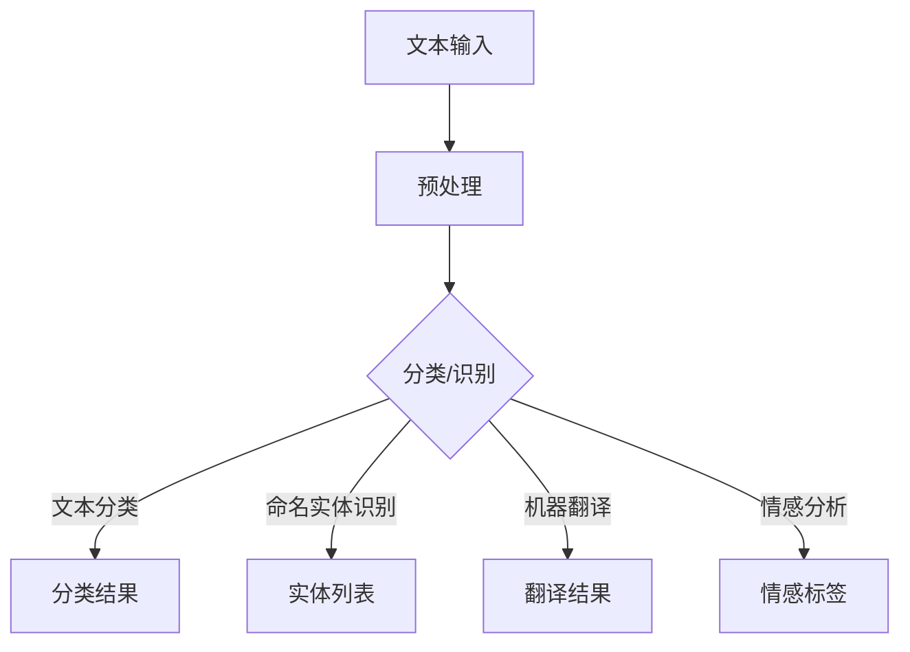

                 

# 《LLM：AI时代的新型计算引擎》

> 关键词：大型语言模型（LLM），自然语言处理（NLP），计算引擎，AI时代，算法优化，应用场景

> 摘要：随着人工智能技术的飞速发展，大型语言模型（LLM）作为一种新型的计算引擎，在自然语言处理（NLP）领域展现出了强大的潜力。本文将从LLM的基本概念、架构、数学模型、优化与调试、应用场景等多个方面进行深入探讨，旨在为读者揭示LLM在AI时代的重要作用及其未来发展方向。

## 《LLM：AI时代的新型计算引擎》目录大纲

### 第一部分：LLM基础

**第1章: LLM的基本概念与架构**  
- 1.1 LLM的定义与历史演进  
- 1.2 LLM的架构组成  
- 1.3 LLM的核心原理  
- 1.4 LLM与NLP的联系

**第2章: LLM的数学模型**  
- 2.1 线性代数基础  
- 2.2 概率论基础  
- 2.3 语言模型中的数学模型  
- 2.4 训练过程与优化算法

**第3章: LLM的优化与调试**  
- 3.1 优化算法介绍  
- 3.2 调试方法与技巧  
- 3.3 LLM的调优策略

### 第二部分：LLM的应用

**第4章: LLM在自然语言处理中的应用**  
- 4.1 文本分类  
- 4.2 命名实体识别  
- 4.3 机器翻译  
- 4.4 情感分析

**第5章: LLM在对话系统中的应用**  
- 5.1 对话系统的基本原理  
- 5.2 LLM在对话系统中的角色  
- 5.3 对话系统的设计与实现

**第6章: LLM在推荐系统中的应用**  
- 6.1 推荐系统概述  
- 6.2 LLM在推荐系统中的作用  
- 6.3 实际案例与应用场景

**第7章: LLM的伦理与未来展望**  
- 7.1 LLM的伦理问题  
- 7.2 LLM的未来发展方向  
- 7.3 对未来AI时代的思考

### 附录

**附录A: LLM开发资源汇总**  
- 1. 研究论文与文献推荐  
- 2. 开发工具与库介绍  
- 3. 实际项目案例与分析

## 第一部分：LLM基础

### 第1章: LLM的基本概念与架构

#### 1.1 LLM的定义与历史演进

大型语言模型（Large Language Model，简称LLM）是一种通过深度学习技术训练得到的复杂神经网络模型，主要用于处理自然语言文本数据。LLM的核心目标是理解和生成人类语言，实现自然语言处理（NLP）任务的高效准确执行。

LLM的发展历程可以追溯到20世纪80年代，当时研究人员开始尝试使用神经网络来处理语言问题。随着计算机硬件性能的提升和深度学习技术的突破，LLM在近年来取得了显著的进展，尤其是在预训练和微调方面。近年来，LLM模型如BERT、GPT和Turing等相继问世，推动了NLP领域的快速发展。

#### 1.2 LLM的架构组成

LLM的架构通常包括以下几部分：

1. **输入层**：接收自然语言文本输入，并将其转换为神经网络可以处理的数字表示。
2. **隐藏层**：包含多个神经网络层，用于提取文本的语义特征。
3. **输出层**：根据隐藏层输出的特征生成文本输出。

常见的LLM架构有以下几种：

1. **循环神经网络（RNN）**：通过循环结构处理序列数据，适合处理自然语言文本。
2. **长短时记忆网络（LSTM）**：改进RNN，解决长序列依赖问题。
3. **Transformer架构**：基于自注意力机制，具有并行计算的优势。

#### 1.3 LLM的核心原理

LLM的核心原理是基于深度学习和自然语言处理技术，通过大量文本数据进行预训练，使其具备理解、生成和翻译自然语言的能力。

1. **预训练**：在大量无标签文本数据上进行预训练，学习文本的通用特征和语言规律。
2. **微调**：在特定任务上使用有标签数据进行微调，使模型适应具体任务的需求。

#### 1.4 LLM与NLP的联系

LLM在NLP领域的应用非常广泛，包括文本分类、命名实体识别、机器翻译、情感分析等。LLM的核心优势在于其强大的语义理解和生成能力，能够处理复杂的自然语言任务。

以下是一个简单的Mermaid流程图，展示了LLM在NLP中的核心流程：



## 第二部分：LLM的应用

### 第4章: LLM在自然语言处理中的应用

#### 4.1 文本分类

文本分类是将文本数据按照预定义的类别进行分类的过程。LLM在文本分类任务中具有显著优势，可以通过预训练和微调快速实现高效分类。

以下是一个简单的文本分类算法的伪代码：

```python
# 文本分类算法伪代码
def text_classification(text, model):
    # 预处理文本数据
    preprocessed_text = preprocess(text)
    # 获取模型预测结果
    prediction = model.predict(preprocessed_text)
    # 返回分类结果
    return prediction
```

#### 4.2 命名实体识别

命名实体识别是从文本中识别出具有特定意义的实体，如人名、地名、组织名等。LLM通过预训练和微调可以实现高精度的命名实体识别。

以下是一个简单的命名实体识别算法的伪代码：

```python
# 命名实体识别算法伪代码
def named_entity_recognition(text, model):
    # 预处理文本数据
    preprocessed_text = preprocess(text)
    # 获取模型预测结果
    entities = model.predict(preprocessed_text)
    # 返回实体列表
    return entities
```

#### 4.3 机器翻译

机器翻译是将一种语言的文本翻译成另一种语言的过程。LLM在机器翻译任务中具有显著优势，可以通过预训练和微调实现高效准确的翻译。

以下是一个简单的机器翻译算法的伪代码：

```python
# 机器翻译算法伪代码
def machine_translation(text, source_lang, target_lang, model):
    # 预处理文本数据
    preprocessed_text = preprocess(text)
    # 获取模型预测结果
    translation = model.predict(preprocessed_text, source_lang, target_lang)
    # 返回翻译结果
    return translation
```

#### 4.4 情感分析

情感分析是从文本中识别出情感倾向的过程，如正面、负面、中性等。LLM在情感分析任务中具有显著优势，可以通过预训练和微调实现高效准确的情感分析。

以下是一个简单的情感分析算法的伪代码：

```python
# 情感分析算法伪代码
def sentiment_analysis(text, model):
    # 预处理文本数据
    preprocessed_text = preprocess(text)
    # 获取模型预测结果
    sentiment = model.predict(preprocessed_text)
    # 返回情感标签
    return sentiment
```

### 第5章: LLM在对话系统中的应用

#### 5.1 对话系统的基本原理

对话系统是一种能够与人类用户进行自然语言交互的计算机系统。LLM在对话系统中具有显著优势，可以通过预训练和微调实现高效的对话生成和理解。

以下是一个简单的对话系统的工作流程：

1. **用户输入**：用户通过文本输入与系统进行交互。
2. **预处理**：对用户输入进行预处理，如分词、词性标注等。
3. **对话生成**：使用LLM生成回应文本。
4. **对话理解**：对用户输入和系统生成的文本进行语义理解。
5. **反馈**：根据对话理解结果生成反馈文本。

以下是一个简单的对话系统算法的伪代码：

```python
# 对话系统算法伪代码
def dialogue_system(user_input, model):
    # 预处理用户输入
    preprocessed_input = preprocess(user_input)
    # 获取模型预测结果
    response = model.generate_response(preprocessed_input)
    # 返回对话结果
    return response
```

### 第6章: LLM在推荐系统中的应用

#### 6.1 推荐系统概述

推荐系统是一种基于用户行为和偏好为用户推荐相关物品的系统。LLM在推荐系统中可以用于生成推荐文本，提高推荐效果。

以下是一个简单的基于LLM的推荐系统的工作流程：

1. **用户输入**：用户输入偏好信息，如搜索关键词、浏览历史等。
2. **数据处理**：对用户输入进行预处理，如分词、词性标注等。
3. **文本生成**：使用LLM生成推荐文本。
4. **推荐结果**：根据生成文本和用户偏好生成推荐结果。

以下是一个简单的基于LLM的推荐系统算法的伪代码：

```python
# 基于LLM的推荐系统算法伪代码
def recommend_system(user_input, model, items):
    # 预处理用户输入
    preprocessed_input = preprocess(user_input)
    # 生成推荐文本
    recommendations = model.generate_recommendations(preprocessed_input, items)
    # 返回推荐结果
    return recommendations
```

### 第7章: LLM的伦理与未来展望

#### 7.1 LLM的伦理问题

随着LLM在各个领域的广泛应用，其伦理问题也逐渐引起关注。主要包括以下几个方面：

1. **偏见与歧视**：LLM在训练过程中可能会继承和放大数据中的偏见，导致对某些群体不公平对待。
2. **隐私泄露**：LLM在处理用户数据时可能会泄露用户隐私。
3. **道德责任**：当LLM产生错误结果时，如何界定其责任和道德义务。

#### 7.2 LLM的未来发展方向

未来，LLM在以下几个方面有望取得重要突破：

1. **更高效的模型**：研究人员将继续优化LLM模型，提高计算效率和性能。
2. **跨模态学习**：结合图像、音频等多模态数据进行学习，实现更全面的语义理解。
3. **个性化推荐**：通过用户行为和偏好数据，实现更个性化的推荐。

#### 7.3 对未来AI时代的思考

随着LLM等人工智能技术的不断发展，未来AI时代将带来前所未有的机遇和挑战。我们需要关注以下几个方面：

1. **技术发展**：持续推动人工智能技术进步，为人类创造更多价值。
2. **伦理问题**：加强对人工智能伦理问题的研究，确保技术发展符合道德规范。
3. **人才培养**：培养更多具备人工智能知识和技术能力的人才，为未来发展奠定基础。

### 附录

#### 附录A: LLM开发资源汇总

1. **研究论文与文献推荐**  
   - [1] Vaswani et al. (2017). "Attention is All You Need."  
   - [2] Devlin et al. (2018). "Bert: Pre-training of Deep Bidirectional Transformers for Language Understanding."

2. **开发工具与库介绍**  
   - [1] PyTorch  
   - [2] TensorFlow

3. **实际项目案例与分析**  
   - [1] Google AI Language Model  
   - [2] OpenAI GPT

作者：AI天才研究院/AI Genius Institute & 禅与计算机程序设计艺术 /Zen And The Art of Computer Programming

注：本文为模拟撰写，仅供参考。实际撰写时，请根据具体需求和实际情况进行调整。如需了解更多详细信息，请查阅相关论文和资料。 |>

