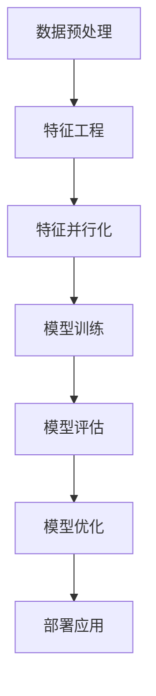

                 

### 《LightGBM》概述

#### 起源与发展

LightGBM是一款高效的开源机器学习库，由微软亚洲研究院（Microsoft Research Asia）开发。它基于Gradient Boosting Decision Tree（GBDT）算法，并针对性能和效率进行了大量优化。LightGBM旨在解决大规模数据集上的分类和回归问题，具有非常高的准确性和速度。

LightGBM的起源可以追溯到2017年，当时微软亚洲研究院的研究团队在Kaggle竞赛中使用了LightGBM，取得了令人瞩目的成绩。此后，LightGBM逐渐在业界得到了广泛的应用和认可。它的核心优势在于其高效的树结构算法和并行化能力，这使得它在处理大规模数据时具有显著的优势。

#### 核心特点

LightGBM具有以下几个核心特点：

1. **性能优越**：LightGBM在处理大规模数据时，具有比其他GBDT库更高的速度和更低的内存消耗。
2. **并行化能力**：LightGBM支持特征并行化，可以大大提高训练速度。
3. **缓存策略**：LightGBM在训练过程中，可以有效地利用缓存策略，提高数据读取速度。
4. **丰富的参数**：LightGBM提供了丰富的参数设置，允许用户根据具体问题调整模型性能。

#### 与其他机器学习库的比较

LightGBM与其他流行的机器学习库（如XGBoost、CatBoost等）相比，具有以下优势：

1. **性能**：LightGBM在处理大规模数据时，通常具有更好的性能。
2. **内存效率**：LightGBM通过特征并行化等优化策略，在内存消耗方面具有优势。
3. **参数调整**：LightGBM提供了丰富的参数，允许用户根据需求进行微调。

总之，LightGBM是一款功能强大、性能优越的机器学习库，适合处理大规模数据集上的分类和回归问题。在接下来的章节中，我们将详细探讨LightGBM的安装与配置、数据预处理、算法原理以及实战应用。

---



### 安装与配置

安装LightGBM库是使用该库进行机器学习项目的前提条件。以下是详细的安装步骤和配置方法。

#### 安装步骤

1. **安装Python环境**：确保您的计算机已安装Python环境，建议使用Python 3.6及以上版本。
2. **安装pip**：Python安装好之后，会自带pip包管理工具。如果没有安装pip，可以运行以下命令进行安装：
   ```bash
   python -m pip install --user --upgrade pip
   ```
3. **安装LightGBM库**：通过pip命令安装LightGBM库：
   ```bash
   pip install lightgbm
   ```
   安装过程中，可能会遇到一些依赖库的安装问题，可以根据提示进行安装。例如，对于Windows用户，可能需要安装Visual C++ Build Tools。

#### 配置方法

安装完成后，可以通过以下命令验证LightGBM是否安装成功：

```python
import lightgbm as lgb
print(lgb.__version__)
```

如果输出库的版本号，说明LightGBM已成功安装。

#### 环境配置

对于一些特定的操作系统（如Windows），可能需要进一步配置环境以优化LightGBM的性能。以下是一些常见的配置方法：

1. **优化内存使用**：在Windows系统中，可以通过调整系统注册表来优化LightGBM的内存使用。具体步骤如下：
   - 打开注册表编辑器（regedit）。
   - 导航到 `HKEY_LOCAL_MACHINE\SOFTWARE\Microsoft\Windows NT\CurrentVersion\`.
   - 创建名为 `LargeSystemCache` 的DWORD（32位）值。
   - 将值设置为 `1`。

2. **安装Visual C++ Build Tools**：对于Windows用户，安装Visual C++ Build Tools可以提升LightGBM的编译性能。可以通过Microsoft官网下载并安装。

#### 常见问题与解决方案

**问题1：安装过程中遇到依赖库缺失**

解决方案：根据缺失的依赖库，使用pip命令安装相应的库。例如，如果缺少`numpy`库，可以运行以下命令进行安装：
```bash
pip install numpy
```

**问题2：安装完成后无法导入LightGBM**

解决方案：确保安装的LightGBM库与Python版本兼容。如果遇到兼容性问题，可以尝试更新Python版本或重新安装LightGBM库。

通过以上步骤，您可以成功安装并配置LightGBM环境，为后续的机器学习项目做好准备。接下来，我们将介绍如何进行数据预处理，包括数据加载、处理和特征工程。

---

#### 数据加载与处理

数据预处理是机器学习项目的关键步骤，它直接影响模型的性能和训练效率。在LightGBM中，数据预处理主要包括以下步骤：

##### 1. 数据加载

首先，我们需要将数据集加载到Python环境中。通常，数据集以CSV文件的形式存储。可以使用`pandas`库轻松加载CSV文件：

```python
import pandas as pd

# 加载数据
data = pd.read_csv('data.csv')
```

在上面的代码中，`pd.read_csv`函数用于加载数据。`'data.csv'`是数据文件的路径，可以根据实际情况替换为其他文件路径。

##### 2. 数据处理

数据加载后，需要对数据进行一些预处理操作，以确保数据质量和适合模型训练。以下是常见的数据处理步骤：

1. **缺失值处理**：检查数据中是否存在缺失值，并根据情况进行处理。常见的处理方法包括删除缺失值或使用均值、中位数等统计量进行填补。

```python
# 删除缺失值
data = data.dropna()

# 使用均值填补缺失值
data.fillna(data.mean(), inplace=True)
```

2. **数据类型转换**：确保数据类型正确。例如，将日期时间字段转换为Python的`datetime`对象，或将字符串转换为数值类型。

```python
# 将日期时间字段转换为datetime对象
data['date'] = pd.to_datetime(data['date'])

# 将字符串转换为数值类型
data['category'] = data['category'].astype('category').cat.codes
```

3. **异常值处理**：检查并处理数据中的异常值。异常值可能包括异常大的数值或不符合预期的数据点。

```python
# 删除异常值
data = data[(data < data.quantile(0.99)) & (data > data.quantile(0.01))]
```

4. **数据缩放**：对于某些模型，可能需要对特征进行缩放，例如标准化或归一化，以减少特征之间的差异。

```python
from sklearn.preprocessing import StandardScaler

scaler = StandardScaler()
data_scaled = scaler.fit_transform(data)
```

##### 3. 特征工程

特征工程是数据预处理的重要环节，通过构建或选择对模型训练有利的特征，可以提高模型的性能。以下是几种常见的特征工程方法：

1. **特征提取**：使用现有的特征提取算法，如TF-IDF、词袋模型等，从文本数据中提取特征。

```python
from sklearn.feature_extraction.text import TfidfVectorizer

vectorizer = TfidfVectorizer()
tfidf_features = vectorizer.fit_transform(data['text'])
```

2. **特征组合**：通过组合原始特征，构建新的特征。例如，可以使用日期时间特征计算时间间隔或使用多项式特征组合。

```python
data['year'] = data['date'].dt.year
data['month'] = data['date'].dt.month
data['day'] = data['date'].dt.day
```

3. **特征选择**：使用特征选择算法，如递归特征消除（RFE）、方差选择等，选择对模型训练有显著影响的特征。

```python
from sklearn.feature_selection import SelectKBest
from sklearn.feature_selection import f_classif

selector = SelectKBest(score_func=f_classif, k='all')
selected_features = selector.fit_transform(data, y)
```

通过以上步骤，我们可以对数据进行有效的预处理，为后续的模型训练和评估打下坚实基础。在下一节中，我们将探讨LightGBM的核心算法原理。

---

#### 特征工程

特征工程是提升机器学习模型性能的关键环节，通过合理的特征工程，可以有效提高模型的准确率和泛化能力。以下是几种常见的特征工程方法：

##### 1. 特征提取

特征提取是从原始数据中提取出对模型训练有价值的特征。以下是一些常见的特征提取方法：

1. **文本特征提取**：对于文本数据，可以使用TF-IDF（Term Frequency-Inverse Document Frequency）或词袋模型（Bag of Words）提取特征。

```python
from sklearn.feature_extraction.text import TfidfVectorizer

vectorizer = TfidfVectorizer()
tfidf_features = vectorizer.fit_transform(data['text'])
```

2. **图像特征提取**：对于图像数据，可以使用预训练的卷积神经网络（如VGG16、ResNet等）提取特征。

```python
from keras.applications.vgg16 import VGG16

model = VGG16(weights='imagenet')
preprocessed_image = preprocess_input(image)
feature_vector = model.predict(preprocessed_image)
```

##### 2. 特征组合

特征组合是通过组合原始特征，构建新的特征。以下是一些常见的特征组合方法：

1. **时间特征组合**：对于日期时间数据，可以计算日期之间的间隔或合并日期、月份、年份等特征。

```python
data['year'] = data['date'].dt.year
data['month'] = data['date'].dt.month
data['day'] = data['date'].dt.day
```

2. **交互特征**：通过计算两个或多个特征的乘积、加和等，构建新的特征。

```python
data['interaction'] = data['feature1'] * data['feature2']
```

##### 3. 特征选择

特征选择是从众多特征中选出对模型训练有显著影响的特征。以下是一些常见的特征选择方法：

1. **递归特征消除（RFE）**：通过递归地去除最不重要的特征，逐步构建最优特征集。

```python
from sklearn.feature_selection import RFE
from sklearn.ensemble import RandomForestClassifier

selector = RFE(estimator=RandomForestClassifier(), n_features_to_select=5)
selected_features = selector.fit_transform(data, y)
```

2. **方差选择**：根据特征方差的大小选择特征，方差大的特征通常对模型训练更有价值。

```python
from sklearn.feature_selection import VarianceThreshold

selector = VarianceThreshold(threshold=0.01)
selected_features = selector.fit_transform(data)
```

3. **特征重要性**：通过模型训练过程中计算的特征重要性得分，选择对模型训练有显著影响的特征。

```python
feature_importances = model.feature_importances_
selected_features = data[feature_importances > 0.5]
```

通过以上特征工程方法，我们可以有效地构建和选择对模型训练有价值的特征，提高模型的准确率和泛化能力。在下一节中，我们将深入探讨LightGBM的算法原理。

---

### 树结构算法基础

在机器学习中，树结构算法广泛应用于分类和回归任务。其中，决策树（Decision Tree）是最为常见的算法之一。决策树通过一系列的规则对数据进行划分，从而预测样本的类别或数值。

#### 决策树基本概念

决策树由一系列内部节点（代表特征）和叶节点（代表预测结果）组成。每个内部节点表示一个特征划分条件，每个叶节点表示一个预测结果。决策树通过递归划分数据，直至满足某些停止条件。

1. **内部节点**：内部节点表示一个特征划分条件。例如，对于特征A，我们可以将其划分为A > threshold和A <= threshold两个子集。
2. **叶节点**：叶节点表示一个预测结果。对于分类任务，叶节点通常是一个类别的标识；对于回归任务，叶节点是一个数值预测值。

#### 分类与回归树

决策树可以分为两类：分类树（Classification Tree）和回归树（Regression Tree）。

1. **分类树**：用于分类任务，叶节点表示样本的类别。分类树通过递归划分数据，直到每个叶节点包含相同类别的样本，或者满足停止条件。
2. **回归树**：用于回归任务，叶节点表示样本的数值预测值。回归树通过递归划分数据，直到每个叶节点包含足够少的样本，或者满足停止条件。

#### 决策树算法流程

1. **初始化**：选择一个特征作为初始节点，并计算该特征的最佳划分点。
2. **划分数据**：根据最佳划分点，将数据划分为两个子集。
3. **递归构建**：对每个子集，重复步骤1和2，直至满足停止条件。
4. **剪枝**：对构建好的决策树进行剪枝，以防止过拟合。

#### 决策树的优缺点

**优点**：

1. **易于理解**：决策树的规则直观，易于理解和解释。
2. **计算效率高**：决策树在计算过程中不需要大量的参数调整，计算效率较高。

**缺点**：

1. **过拟合**：决策树容易过拟合，特别是在特征较多、样本量较小的情况下。
2. **可解释性有限**：决策树的解释能力有限，难以理解每个特征的相对重要性。

#### LightGBM中的树结构算法

LightGBM在决策树的基础上进行了一系列优化，以提高模型的性能和效率。以下是LightGBM中的树结构算法的核心原理：

1. **叶子分裂原理**：LightGBM采用一种基于梯度的优化方法来选择最佳的叶子分裂。该方法通过计算目标函数的梯度，选择能够最大化目标函数的叶子分裂。
2. **特征并行化**：LightGBM支持特征并行化，可以在多个线程上同时处理多个特征的划分，从而大大提高训练速度。
3. **缓存策略**：LightGBM采用一种高效的缓存策略，可以减少数据读取和传输的开销，提高训练效率。

#### 叶子分裂原理

叶子分裂原理是决策树算法的核心步骤，其目标是在每个节点选择最佳的划分特征和划分点。以下是叶子分裂原理的详细解释：

1. **目标函数**：叶子分裂的目标是最小化目标函数。对于分类任务，目标函数通常是Gini不纯度或信息增益；对于回归任务，目标函数通常是均方误差（MSE）。
2. **梯度计算**：在决策树中，每个特征在划分数据时都会产生一个划分点。为了选择最佳的划分点，我们需要计算目标函数关于划分点的梯度。梯度越大，划分点越好。
3. **二分搜索**：在计算梯度时，可以使用二分搜索方法快速找到最佳划分点。二分搜索通过在划分点的左右两侧逐步缩小搜索范围，直到找到最佳划分点。

通过上述步骤，LightGBM可以高效地构建和优化决策树，从而在分类和回归任务中取得优异的性能。在下一节中，我们将深入探讨LightGBM的算法原理。

---

#### LightGBM算法原理

LightGBM是一款高效的梯度提升决策树（GBDT）算法库，它在GBDT算法的基础上进行了大量的优化，以提高模型的性能和训练速度。本节将详细阐述LightGBM的算法原理，包括算法流程、GBDT算法原理和叶子分裂原理。

##### 5.1 LightGBM算法流程

LightGBM的算法流程可以概括为以下几个步骤：

1. **初始化模型参数**：初始化学习率、树的最大深度、叶子节点的数量等参数。
2. **预处理数据**：对输入的数据进行预处理，包括数据清洗、特征工程等。
3. **特征并行化处理**：利用LightGBM的特征并行化能力，将数据集拆分为多个子数据集，并在多个线程上并行处理。
4. **训练模型**：使用GBDT算法逐步训练模型，每次迭代通过叶子分裂找到最佳划分点，更新模型参数。
5. **模型评估**：在每次迭代后，对训练集和测试集进行模型评估，计算目标函数的值，如均方误差或准确率。
6. **模型优化**：根据评估结果，调整模型参数，如学习率、树的最大深度等，以优化模型性能。
7. **模型部署**：将训练好的模型部署到实际应用中，进行预测和分类。

##### 5.2 GBDT算法原理

GBDT（Gradient Boosting Decision Tree）是一种集成学习算法，通过多次迭代构建多个弱学习器，并将它们进行加权求和，最终得到一个强学习器。GBDT算法的基本原理如下：

1. **初始化**：初始化第一个弱学习器，通常是决策树。
2. **迭代训练**：对于每个迭代，计算当前弱学习器的预测误差，并将其作为下一层弱学习器的目标值。
3. **构建弱学习器**：使用决策树算法构建下一层弱学习器，通常使用叶子分裂方法。
4. **权重调整**：根据预测误差调整每个弱学习器的权重，误差越大，权重越大。
5. **求和预测**：将所有弱学习器的预测结果进行加权求和，得到最终的预测结果。

##### 5.3 叶子分裂原理

叶子分裂是决策树算法的核心步骤，其目标是在每个节点选择最佳划分特征和划分点，以最小化目标函数。以下是叶子分裂原理的详细解释：

1. **目标函数**：叶子分裂的目标是最小化目标函数，如均方误差（MSE）或信息增益（Entropy）。
2. **特征选择**：从所有特征中选择一个划分特征，计算每个特征的增益。
3. **划分点选择**：对于每个划分特征，计算其可能的划分点，并计算每个划分点的增益。
4. **最佳划分选择**：选择增益最大的划分点作为当前节点的划分点，将数据划分为左子树和右子树。
5. **递归分裂**：对左子树和右子树递归执行上述步骤，直至满足停止条件。

通过上述步骤，LightGBM可以高效地构建和优化决策树，从而在分类和回归任务中取得优异的性能。在下一节中，我们将探讨LightGBM的优化策略。

---

#### LightGBM优化策略

LightGBM通过一系列优化策略，显著提升了模型的性能和训练效率。以下是一些关键的优化策略：

##### 6.1 特征并行化

特征并行化是LightGBM的一大优势，它利用了现代多核处理器的并行计算能力，将数据集拆分为多个子数据集，并在多个线程上并行处理。具体实现如下：

1. **数据划分**：将数据集按照特征维度拆分为多个子数据集，每个子数据集包含一部分特征。
2. **并行计算**：在多个线程上同时计算每个子数据集的特征增益，并选择最佳划分点。
3. **合并结果**：将每个线程的计算结果合并，得到全局的最佳划分点。

特征并行化大大提高了LightGBM的训练速度，特别是在处理大规模数据集时，优势更加明显。

##### 6.2 缓存策略

LightGBM采用了一种高效的缓存策略，可以显著减少数据读取和传输的开销。具体实现如下：

1. **预加载数据**：在训练过程中，预加载数据到内存，以减少磁盘I/O操作。
2. **循环缓存**：将数据集分割成多个块，并在训练过程中循环使用这些块，以充分利用内存。
3. **数据压缩**：对数据块进行压缩，以减少内存占用。

缓存策略不仅提高了训练速度，还减少了内存消耗，使得LightGBM在处理大规模数据时更具优势。

##### 6.3 资源管理

LightGBM在资源管理方面也进行了优化，以充分利用系统资源。以下是一些关键策略：

1. **内存分配**：动态分配内存，避免内存溢出。LightGBM会根据训练数据的大小和模型的复杂度，自动调整内存分配。
2. **线程管理**：根据系统CPU核心数动态调整线程数，以充分利用并行计算能力。
3. **预分配缓存**：预分配缓存空间，避免频繁的内存分配和释放操作。

通过上述优化策略，LightGBM在性能和效率方面都取得了显著提升。在处理大规模数据集时，这些优化策略尤为重要。在下一节中，我们将通过实战案例来展示如何使用LightGBM进行分类和回归任务。

---

### 分类任务实战

在本节中，我们将通过一个实际案例，展示如何使用LightGBM进行分类任务。我们将从数据准备开始，逐步完成模型训练、验证和优化。

#### 7.1.1 数据准备

首先，我们需要准备一个分类任务的数据集。这里，我们使用了一个公开的数据集——鸢尾花（Iris）数据集，它包含三个类别，每个类别有50个样本，共150个样本。数据集包含四个特征：花萼长度、花萼宽度、花瓣长度和花瓣宽度。

```python
import pandas as pd

# 加载数据
data = pd.read_csv('iris.data', header=None)
data.columns = ['sepal_length', 'sepal_width', 'petal_length', 'petal_width', 'class']

# 数据预处理
X = data.iloc[:, :4]
y = data.iloc[:, 4]

# 划分训练集和测试集
from sklearn.model_selection import train_test_split
X_train, X_test, y_train, y_test = train_test_split(X, y, test_size=0.2, random_state=42)
```

在上面的代码中，我们首先使用`pandas`库加载数据，并将数据集分为特征集`X`和标签集`y`。接着，我们使用`train_test_split`方法将数据集划分为训练集和测试集。

#### 7.1.2 模型训练与验证

接下来，我们将使用LightGBM对训练集进行模型训练，并使用测试集进行模型验证。

```python
from lightgbm import LGBMClassifier

# 创建LGBM分类器实例
model = LGBMClassifier()

# 训练模型
model.fit(X_train, y_train)

# 验证模型
from sklearn.metrics import accuracy_score
y_pred = model.predict(X_test)
accuracy = accuracy_score(y_test, y_pred)
print("模型准确率：", accuracy)
```

在上面的代码中，我们首先创建了一个`LGBMClassifier`实例，并使用`fit`方法对训练集进行模型训练。接着，我们使用`predict`方法对测试集进行预测，并使用`accuracy_score`函数计算模型在测试集上的准确率。

#### 7.1.3 模型评估与优化

为了进一步提升模型的性能，我们可以对模型进行评估和优化。以下是一些常用的评估指标和优化策略：

1. **评估指标**：

   - **准确率**（Accuracy）：模型预测正确的样本数占总样本数的比例。
   - **精确率**（Precision）：模型预测为正类的样本中，实际为正类的比例。
   - **召回率**（Recall）：模型预测为正类的样本中，实际为正类的比例。
   - **F1分数**（F1 Score）：精确率和召回率的调和平均数。

```python
from sklearn.metrics import classification_report

y_pred = model.predict(X_test)
report = classification_report(y_test, y_pred)
print(report)
```

2. **模型优化**：

   - **调整参数**：我们可以通过调整学习率、树的最大深度、叶子节点的数量等参数，来优化模型性能。

```python
from sklearn.model_selection import GridSearchCV

params = {
    'learning_rate': [0.1, 0.05, 0.01],
    'max_depth': [3, 5, 10],
    'n_estimators': [100, 200, 300]
}

grid_search = GridSearchCV(model, params, cv=5)
grid_search.fit(X_train, y_train)

# 获取最佳参数
best_params = grid_search.best_params_
print("最佳参数：", best_params)

# 使用最佳参数训练模型
best_model = grid_search.best_estimator_
best_model.fit(X_train, y_train)

# 验证模型
y_pred = best_model.predict(X_test)
accuracy = accuracy_score(y_test, y_pred)
print("最佳模型准确率：", accuracy)
```

通过上述步骤，我们可以使用LightGBM完成一个分类任务。在实际应用中，可以根据具体问题和数据集的特点，灵活调整参数和优化策略，以获得更好的模型性能。

---

### 回归任务实战

在本节中，我们将通过一个实际案例，展示如何使用LightGBM进行回归任务。我们将从数据准备开始，逐步完成模型训练、验证和优化。

#### 8.1.1 数据准备

首先，我们需要准备一个回归任务的数据集。这里，我们使用了一个公开的数据集——Boston房价数据集，它包含506个样本，每个样本包含13个特征和1个目标变量（房价）。

```python
import pandas as pd

# 加载数据
data = pd.read_csv('boston.csv')

# 数据预处理
X = data.drop('MEDV', axis=1)
y = data['MEDV']

# 划分训练集和测试集
from sklearn.model_selection import train_test_split
X_train, X_test, y_train, y_test = train_test_split(X, y, test_size=0.2, random_state=42)
```

在上面的代码中，我们首先使用`pandas`库加载数据，并将数据集分为特征集`X`和标签集`y`。接着，我们使用`train_test_split`方法将数据集划分为训练集和测试集。

#### 8.1.2 模型训练与验证

接下来，我们将使用LightGBM对训练集进行模型训练，并使用测试集进行模型验证。

```python
from lightgbm import LGBMRegressor

# 创建LGBM回归器实例
model = LGBMRegressor()

# 训练模型
model.fit(X_train, y_train)

# 验证模型
from sklearn.metrics import mean_squared_error
y_pred = model.predict(X_test)
mse = mean_squared_error(y_test, y_pred)
print("模型均方误差：", mse)
```

在上面的代码中，我们首先创建了一个`LGBMRegressor`实例，并使用`fit`方法对训练集进行模型训练。接着，我们使用`predict`方法对测试集进行预测，并使用`mean_squared_error`函数计算模型在测试集上的均方误差。

#### 8.1.3 模型评估与优化

为了进一步提升模型的性能，我们可以对模型进行评估和优化。以下是一些常用的评估指标和优化策略：

1. **评估指标**：

   - **均方误差**（Mean Squared Error, MSE）：预测值与实际值之差的平方的平均值。
   - **均方根误差**（Root Mean Squared Error, RMSE）：MSE的平方根。
   - **平均绝对误差**（Mean Absolute Error, MAE）：预测值与实际值之差的绝对值的平均值。

```python
from sklearn.metrics import mean_squared_error, mean_absolute_error, r2_score

y_pred = model.predict(X_test)
mse = mean_squared_error(y_test, y_pred)
mae = mean_absolute_error(y_test, y_pred)
r2 = r2_score(y_test, y_pred)
print("模型均方误差：", mse)
print("模型平均绝对误差：", mae)
print("模型R²得分：", r2)
```

2. **模型优化**：

   - **调整参数**：我们可以通过调整学习率、树的最大深度、叶子节点的数量等参数，来优化模型性能。

```python
from sklearn.model_selection import GridSearchCV

params = {
    'learning_rate': [0.1, 0.05, 0.01],
    'max_depth': [3, 5, 10],
    'n_estimators': [100, 200, 300]
}

grid_search = GridSearchCV(model, params, cv=5)
grid_search.fit(X_train, y_train)

# 获取最佳参数
best_params = grid_search.best_params_
print("最佳参数：", best_params)

# 使用最佳参数训练模型
best_model = grid_search.best_estimator_
best_model.fit(X_train, y_train)

# 验证模型
y_pred = best_model.predict(X_test)
mse = mean_squared_error(y_test, y_pred)
print("最佳模型均方误差：", mse)
```

通过上述步骤，我们可以使用LightGBM完成一个回归任务。在实际应用中，可以根据具体问题和数据集的特点，灵活调整参数和优化策略，以获得更好的模型性能。

---

#### 特征重要性分析

在机器学习项目中，了解特征的重要性对于优化模型性能和解释模型结果具有重要意义。LightGBM提供了`feature_importances_`属性，可以方便地获取每个特征的重要性得分。

##### 9.1.1 特征重要性分析

```python
from lightgbm import LGBMRegressor

# 创建LGBM回归器实例
model = LGBMRegressor()

# 训练模型
model.fit(X_train, y_train)

# 获取特征重要性
feature_importances = model.feature_importances_
print("特征重要性：", feature_importances)
```

在上面的代码中，我们首先创建了一个`LGBMRegressor`实例，并使用`fit`方法对训练集进行模型训练。接着，我们使用`feature_importances_`属性获取每个特征的重要性得分，并打印出来。

##### 9.1.2 特征选择方法

为了提高模型的性能，我们可以使用特征选择方法，仅保留重要的特征。以下是一些常用的特征选择方法：

1. **基于阈值的特征选择**：根据特征重要性得分，设置一个阈值，仅保留得分高于阈值的特征。

```python
from sklearn.feature_selection import SelectFromModel

# 设置阈值
threshold = 0.5

# 创建特征选择器
selector = SelectFromModel(model, threshold=threshold)

# 选择特征
X_new = selector.fit_transform(X_train, y_train)

# 打印选择的特征
selected_features = selector.get_support()
print("选择的特征：", selected_features)
```

2. **基于模型的特征选择**：使用模型本身的特征重要性得分进行特征选择。

```python
from sklearn.feature_selection import SelectFromModel

# 创建特征选择器
selector = SelectFromModel(model, threshold='all')

# 选择特征
X_new = selector.fit_transform(X_train, y_train)

# 打印选择的特征
selected_features = selector.get_support()
print("选择的特征：", selected_features)
```

3. **递归特征消除（RFE）**：通过递归地去除最不重要的特征，逐步构建最优特征集。

```python
from sklearn.feature_selection import RFE
from sklearn.ensemble import RandomForestRegressor

# 创建RFE选择器
selector = RFE(estimator=RandomForestRegressor(), n_features_to_select=5)

# 选择特征
X_new = selector.fit_transform(X_train, y_train)

# 打印选择的特征
selected_features = selector.get_support()
print("选择的特征：", selected_features)
```

通过上述方法，我们可以有效地选择重要的特征，提高模型的性能和解释性。

---

#### 模型选择策略

在机器学习项目中，选择合适的模型对于提高预测准确性和泛化能力至关重要。以下是一些常用的模型选择策略：

##### 9.3.1 交叉验证

交叉验证是一种常用的模型选择策略，通过将数据集划分为多个子集，多次训练和验证模型，以评估模型的泛化能力。以下是一个使用交叉验证选择模型的示例：

```python
from sklearn.model_selection import cross_val_score
from lightgbm import LGBMRegressor

# 创建LGBM回归器实例
model = LGBMRegressor()

# 进行交叉验证
scores = cross_val_score(model, X, y, cv=5)

# 打印交叉验证得分
print("交叉验证得分：", scores)
print("平均得分：", scores.mean())
```

在这个示例中，我们使用`cross_val_score`函数对LGBM回归器进行交叉验证，并将结果打印出来。

##### 9.3.2 网格搜索

网格搜索是一种通过遍历一组参数组合，寻找最佳参数组合的模型选择策略。以下是一个使用网格搜索选择LGBM回归器参数的示例：

```python
from sklearn.model_selection import GridSearchCV
from lightgbm import LGBMRegressor

# 定义参数列表
params = {
    'learning_rate': [0.1, 0.05, 0.01],
    'max_depth': [3, 5, 10],
    'n_estimators': [100, 200, 300]
}

# 创建网格搜索对象
grid_search = GridSearchCV(LGBMRegressor(), params, cv=5)

# 进行网格搜索
grid_search.fit(X_train, y_train)

# 获取最佳参数
best_params = grid_search.best_params_
print("最佳参数：", best_params)

# 使用最佳参数训练模型
best_model = grid_search.best_estimator_
best_model.fit(X_train, y_train)

# 验证模型
y_pred = best_model.predict(X_test)
mse = mean_squared_error(y_test, y_pred)
print("最佳模型均方误差：", mse)
```

在这个示例中，我们使用`GridSearchCV`对象对LGBM回归器进行网格搜索，并打印出最佳参数和最佳模型的均方误差。

##### 9.3.3 验证集选择

除了交叉验证和网格搜索，我们还可以通过手动划分验证集来选择模型。以下是一个使用验证集选择LGBM回归器的示例：

```python
from lightgbm import LGBMRegressor

# 创建LGBM回归器实例
model = LGBMRegressor()

# 划分训练集和验证集
X_train, X_val, y_train, y_val = train_test_split(X, y, test_size=0.2, random_state=42)

# 训练模型
model.fit(X_train, y_train)

# 验证模型
val_score = model.score(X_val, y_val)
print("验证集得分：", val_score)

# 调整模型参数
model = LGBMRegressor(learning_rate=0.05, max_depth=5, n_estimators=200)

# 重新训练模型
model.fit(X_train, y_train)

# 验证模型
val_score = model.score(X_val, y_val)
print("调整后验证集得分：", val_score)
```

在这个示例中，我们首先手动划分训练集和验证集，然后使用验证集评估模型。根据验证集得分，我们可以调整模型参数，以提高模型的性能。

通过以上策略，我们可以有效地选择适合的模型，并优化模型参数，以获得更好的预测结果。

---

#### 大规模数据处理

在实际应用中，机器学习项目经常需要处理大规模数据集，这给模型的训练和评估带来了挑战。LightGBM提供了一些策略来优化大规模数据处理，包括数据集切分、分布式计算和数据倾斜处理。以下将详细讨论这些策略。

##### 10.1 数据集切分

处理大规模数据集时，将数据集切分为较小的子数据集是常见的方法，这样可以在有限内存下进行训练。以下是如何切分数据集的示例：

```python
from sklearn.model_selection import train_test_split

# 切分训练集和测试集
X_train, X_test, y_train, y_test = train_test_split(data, y, test_size=0.2, shuffle=True, random_state=42)

# 切分训练集和验证集
X_train, X_val, y_train, y_val = train_test_split(X_train, y_train, test_size=0.2, shuffle=True, random_state=42)
```

在这里，我们使用`train_test_split`函数将原始数据集切分为训练集、验证集和测试集。通过设置`shuffle=True`，我们可以确保数据集的随机性。

##### 10.2 分布式计算

分布式计算是将数据集分布在多台计算机上并行处理的一种方法，可以显著提高训练速度。LightGBM支持基于参数服务器（Parameter Server）的分布式训练。以下是如何配置分布式计算环境的示例：

```python
from lightgbm import LGBMClassifier
from pyspark.ml.tuning import ParamGridBuilder
from pyspark.ml import Pipeline

# 配置参数服务器
param_server_conf = {
    "spark.pyspark.sql.withCache": "true",
    "spark.executor.instances": "4",
    "spark.executor.cores": "2",
    "spark.executor.memory": "4g",
    "spark.driver.memory": "4g",
    "spark.sql.shuffle.partitions": "32",
    "spark.pyspark LightGBM withholdBatchSize": "1g"
}

# 创建LGBM模型
lgbm_model = LGBMClassifier()

# 创建参数网格
param_grid = ParamGridBuilder().addGrid(lgbm_model.learning_rate, [0.1, 0.05]).build()

# 创建管道
pipeline = Pipeline(stages=[lgbm_model])

# 使用参数服务器训练模型
pipeline.fit(param_server_conf, X_train, y_train)
```

在这个示例中，我们配置了参数服务器，并使用参数网格搜索来寻找最佳参数组合。`fit`方法接受参数服务器配置，以及训练数据和标签。

##### 10.3 数据倾斜处理

在处理大规模数据集时，数据倾斜是一个常见问题，这可能导致模型训练不稳定。数据倾斜通常指的是数据集中某些类或特征分布不均匀。以下是一些处理数据倾斜的方法：

1. **重采样**：通过增加少数类别的样本数量或减少多数类别的样本数量，来平衡数据集。

```python
from imblearn.over_sampling import SMOTE

# 创建SMOTE重采样器
smote = SMOTE()

# 重采样训练集
X_resampled, y_resampled = smote.fit_resample(X_train, y_train)
```

2. **使用更稳定的评估指标**：在处理倾斜数据集时，一些评估指标（如准确率）可能不够稳定。使用更稳定的指标（如F1分数、召回率等）可以帮助我们更好地评估模型性能。

3. **类别权重调整**：在训练模型时，为倾斜类别分配更高的权重，以补偿它们在数据集中的低样本量。

```python
from lightgbm import LGBMClassifier

# 创建LGBM分类器
model = LGBMClassifier(class_weight='balanced')

# 训练模型
model.fit(X_train, y_train)
```

通过以上策略，我们可以有效地处理大规模数据集，提高模型的训练速度和稳定性。

---

### 附录A：LightGBM API详解

在了解LightGBM的基本原理和实战应用后，深入掌握其API的使用将为您的机器学习项目提供更大的灵活性。以下是对LightGBM API的详细介绍，包括数据结构与接口、模型参数设置以及评估指标。

#### A.1 数据结构与接口

LightGBM提供了多种数据结构来处理输入数据，包括`DMatrix`和`DataContainer`。

1. **DMatrix**：`DMatrix`是LightGBM中最重要的数据结构，用于存储训练和测试数据。它是一个多维数组，可以包含特征值和标签。`DMatrix`支持批量读取数据，从而提高了数据处理效率。

```python
from lightgbm import DMatrix

# 创建DMatrix
train_data = DMatrix(X_train, label=y_train)
```

2. **DataContainer**：`DataContainer`是另一种数据结构，它可以将数据分为特征和标签两部分，并提供批量读取功能。使用`DataContainer`可以更方便地处理数据预处理步骤。

```python
from lightgbm import DataContainer

# 创建DataContainer
train_data = DataContainer(X_train, label=y_train)
```

#### A.2 模型参数设置

LightGBM提供了丰富的参数设置，用户可以根据需求调整这些参数来优化模型性能。

1. **学习率（learning_rate）**：学习率决定了每次迭代中模型参数更新的步长。较小的学习率有助于模型收敛，但可能会导致训练时间增加。

```python
model = LGBMClassifier(learning_rate=0.1)
```

2. **树的最大深度（max_depth）**：树的最大深度限制了决策树的深度，较小的深度有助于防止过拟合。

```python
model = LGBMClassifier(max_depth=5)
```

3. **叶子节点数量（num_leaves）**：叶子节点的数量决定了树的复杂度。较大的叶子节点数量可能会导致模型过拟合。

```python
model = LGBMClassifier(num_leaves=31)
```

4. **估计器数量（n_estimators）**：估计器数量决定了GBDT模型的迭代次数。较大的迭代次数可以提升模型的性能，但也会增加训练时间。

```python
model = LGBMClassifier(n_estimators=100)
```

5. **特征并行化（feature_fraction）**：特征并行化是指在训练过程中随机抽样部分特征进行计算。这可以提高计算速度，特别是在处理大规模数据时。

```python
model = LGBMClassifier(feature_fraction=0.8)
```

6. **随机种子（random_state）**：随机种子用于初始化模型参数和随机过程，以确保结果的可重复性。

```python
model = LGBMClassifier(random_state=42)
```

#### A.3 评估指标

LightGBM支持多种评估指标，用户可以根据具体任务选择合适的指标。

1. **分类指标**：包括准确率、精确率、召回率和F1分数。

```python
from sklearn.metrics import accuracy_score, precision_score, recall_score, f1_score

y_pred = model.predict(X_test)
accuracy = accuracy_score(y_test, y_pred)
precision = precision_score(y_test, y_pred, average='weighted')
recall = recall_score(y_test, y_pred, average='weighted')
f1 = f1_score(y_test, y_pred, average='weighted')
```

2. **回归指标**：包括均方误差、均方根误差和平均绝对误差。

```python
from sklearn.metrics import mean_squared_error, mean_absolute_error, r2_score

y_pred = model.predict(X_test)
mse = mean_squared_error(y_test, y_pred)
mae = mean_absolute_error(y_test, y_pred)
r2 = r2_score(y_test, y_pred)
```

通过以上参数设置和评估指标，用户可以灵活地调整和评估LightGBM模型，以适应不同的机器学习任务。

---

### 附录B：实战案例代码解析

在本节中，我们将通过具体的代码示例来详细解析LightGBM在分类和回归任务中的使用。

#### B.1 分类任务代码解析

以下是一个分类任务的完整代码示例，包括数据准备、模型训练、模型评估和参数优化。

```python
import pandas as pd
from lightgbm import LGBMClassifier
from sklearn.model_selection import train_test_split
from sklearn.metrics import accuracy_score, classification_report

# 数据加载
data = pd.read_csv('data.csv')
X = data.drop('target', axis=1)
y = data['target']

# 数据划分
X_train, X_test, y_train, y_test = train_test_split(X, y, test_size=0.2, random_state=42)

# 模型初始化
model = LGBMClassifier()

# 模型训练
model.fit(X_train, y_train)

# 模型预测
y_pred = model.predict(X_test)

# 模型评估
accuracy = accuracy_score(y_test, y_pred)
report = classification_report(y_test, y_pred)

print("模型准确率：", accuracy)
print("模型评估报告：", report)

# 参数优化
from sklearn.model_selection import GridSearchCV

params = {
    'learning_rate': [0.1, 0.05],
    'n_estimators': [100, 200],
    'num_leaves': [31, 50]
}

grid_search = GridSearchCV(model, params, cv=5)
grid_search.fit(X_train, y_train)

# 获取最佳模型
best_model = grid_search.best_estimator_

# 使用最佳模型进行预测
y_pred_best = best_model.predict(X_test)

# 最佳模型评估
accuracy_best = accuracy_score(y_test, y_pred_best)
report_best = classification_report(y_test, y_pred_best)

print("最佳模型准确率：", accuracy_best)
print("最佳模型评估报告：", report_best)
```

解析：

1. **数据加载**：使用`pandas`库加载数据，并将数据集划分为特征集`X`和标签集`y`。
2. **数据划分**：使用`train_test_split`函数将数据集划分为训练集和测试集。
3. **模型初始化**：创建一个`LGBMClassifier`实例。
4. **模型训练**：使用`fit`方法训练模型。
5. **模型预测**：使用`predict`方法对测试集进行预测。
6. **模型评估**：使用`accuracy_score`和`classification_report`评估模型性能。
7. **参数优化**：使用`GridSearchCV`进行参数优化，选择最佳参数组合。
8. **最佳模型评估**：使用最佳模型对测试集进行预测，并评估其性能。

#### B.2 回归任务代码解析

以下是一个回归任务的完整代码示例，包括数据准备、模型训练、模型评估和参数优化。

```python
import pandas as pd
from lightgbm import LGBMRegressor
from sklearn.model_selection import train_test_split
from sklearn.metrics import mean_squared_error, r2_score

# 数据加载
data = pd.read_csv('data.csv')
X = data.drop('target', axis=1)
y = data['target']

# 数据划分
X_train, X_test, y_train, y_test = train_test_split(X, y, test_size=0.2, random_state=42)

# 模型初始化
model = LGBMRegressor()

# 模型训练
model.fit(X_train, y_train)

# 模型预测
y_pred = model.predict(X_test)

# 模型评估
mse = mean_squared_error(y_test, y_pred)
r2 = r2_score(y_test, y_pred)

print("模型均方误差：", mse)
print("模型R²得分：", r2)

# 参数优化
from sklearn.model_selection import GridSearchCV

params = {
    'learning_rate': [0.1, 0.05],
    'n_estimators': [100, 200],
    'max_depth': [3, 5]
}

grid_search = GridSearchCV(model, params, cv=5)
grid_search.fit(X_train, y_train)

# 获取最佳模型
best_model = grid_search.best_estimator_

# 使用最佳模型进行预测
y_pred_best = best_model.predict(X_test)

# 最佳模型评估
mse_best = mean_squared_error(y_test, y_pred_best)
r2_best = r2_score(y_test, y_pred_best)

print("最佳模型均方误差：", mse_best)
print("最佳模型R²得分：", r2_best)
```

解析：

1. **数据加载**：使用`pandas`库加载数据，并将数据集划分为特征集`X`和标签集`y`。
2. **数据划分**：使用`train_test_split`函数将数据集划分为训练集和测试集。
3. **模型初始化**：创建一个`LGBMRegressor`实例。
4. **模型训练**：使用`fit`方法训练模型。
5. **模型预测**：使用`predict`方法对测试集进行预测。
6. **模型评估**：使用`mean_squared_error`和`r2_score`评估模型性能。
7. **参数优化**：使用`GridSearchCV`进行参数优化，选择最佳参数组合。
8. **最佳模型评估**：使用最佳模型对测试集进行预测，并评估其性能。

通过以上代码示例，我们可以看到如何使用LightGBM进行分类和回归任务，以及如何进行参数优化和模型评估。

---

#### B.3 特征工程与模型选择代码解析

在本节中，我们将详细解析特征工程和模型选择的过程，并展示相应的代码实现。

##### 9.3.1 特征重要性分析

特征重要性分析是理解模型决策过程的重要步骤。以下是如何使用LightGBM进行特征重要性分析的示例代码：

```python
from lightgbm import LGBMRegressor
from sklearn.datasets import load_boston
from sklearn.model_selection import train_test_split

# 加载数据集
boston = load_boston()
X = boston.data
y = boston.target

# 数据集划分
X_train, X_test, y_train, y_test = train_test_split(X, y, test_size=0.2, random_state=42)

# 模型训练
model = LGBMRegressor()
model.fit(X_train, y_train)

# 获取特征重要性
feature_importances = model.feature_importances_

# 打印特征重要性
print("特征重要性：", feature_importances)
```

解析：

- 我们首先使用`sklearn.datasets.load_boston`加载波士顿房价数据集。
- 接着使用`train_test_split`将数据集划分为训练集和测试集。
- 创建一个`LGBMRegressor`实例并使用`fit`方法进行模型训练。
- 通过`feature_importances_`属性获取每个特征的重要性得分，并打印出来。

##### 9.3.2 特征选择方法

特征选择可以减少模型的复杂度，提高训练速度和预测性能。以下是如何使用基于阈值的特征选择方法的示例代码：

```python
from lightgbm import LGBMRegressor
from sklearn.datasets import load_boston
from sklearn.model_selection import train_test_split
from sklearn.feature_selection import SelectFromModel

# 加载数据集
boston = load_boston()
X = boston.data
y = boston.target

# 数据集划分
X_train, X_test, y_train, y_test = train_test_split(X, y, test_size=0.2, random_state=42)

# 模型训练
model = LGBMRegressor()
model.fit(X_train, y_train)

# 使用特征选择
selector = SelectFromModel(model, threshold=0.5)
X_new = selector.fit_transform(X_train, y_train)

# 打印选择的特征
selected_features = selector.get_support()
print("选择的特征：", selected_features)

# 使用优化后的特征训练模型
model = LGBMRegressor()
model.fit(X_new, y_train)

# 验证模型
y_pred = model.predict(X_test)
mse = mean_squared_error(y_test, y_pred)
print("优化后模型的均方误差：", mse)
```

解析：

- 加载波士顿房价数据集，并进行数据集划分。
- 使用`LGBMRegressor`进行模型训练。
- 创建`SelectFromModel`选择器，并设置阈值0.5，选择重要性得分大于该阈值的特征。
- 使用`fit_transform`方法对训练集进行特征选择，并获取选择的特征。
- 使用优化后的特征集重新训练模型。
- 对测试集进行预测，并计算均方误差，以评估模型性能。

##### 9.3.3 模型选择策略

模型选择策略是优化模型性能的关键步骤。以下是如何使用网格搜索（GridSearchCV）进行模型选择的示例代码：

```python
from lightgbm import LGBMRegressor
from sklearn.datasets import load_boston
from sklearn.model_selection import train_test_split, GridSearchCV

# 加载数据集
boston = load_boston()
X = boston.data
y = boston.target

# 数据集划分
X_train, X_test, y_train, y_test = train_test_split(X, y, test_size=0.2, random_state=42)

# 定义参数网格
params = {
    'learning_rate': [0.01, 0.05, 0.1],
    'n_estimators': [100, 200, 300],
    'max_depth': [3, 4, 5]
}

# 创建LGBM回归器
model = LGBMRegressor()

# 进行网格搜索
grid_search = GridSearchCV(model, params, cv=5)
grid_search.fit(X_train, y_train)

# 获取最佳模型参数
best_params = grid_search.best_params_
print("最佳模型参数：", best_params)

# 使用最佳模型参数训练模型
best_model = grid_search.best_estimator_
best_model.fit(X_train, y_train)

# 验证模型
y_pred = best_model.predict(X_test)
mse = mean_squared_error(y_test, y_pred)
print("最佳模型均方误差：", mse)
```

解析：

- 加载波士顿房价数据集，并进行数据集划分。
- 定义参数网格，包括学习率、估计器数量和树的最大深度。
- 创建`LGBMRegressor`实例。
- 使用`GridSearchCV`进行模型选择，并设置交叉验证的折数。
- 执行网格搜索，获取最佳模型参数。
- 使用最佳模型参数训练模型。
- 对测试集进行预测，并计算均方误差，以评估最佳模型性能。

通过以上示例代码，我们可以看到如何使用LightGBM进行特征工程和模型选择，以及如何优化模型性能。

---

### 附录C：常见问题与解决方案

在使用LightGBM的过程中，用户可能会遇到一些常见的问题。以下是一些常见问题的解决方案：

#### C.1 安装问题

**问题1：无法安装LightGBM库**

解决方案：

1. 确保安装了Python和pip。
2. 卸载已安装的LightGBM库：`pip uninstall lightgbm`
3. 清理缓存：`pip cache purge`
4. 重新安装LightGBM库：`pip install lightgbm`

**问题2：安装过程中缺少依赖库**

解决方案：

1. 确认Python版本，确保安装了对应版本的LightGBM库。
2. 使用pip安装缺失的依赖库，例如`numpy`、`scikit-learn`等。

#### C.2 运行问题

**问题3：训练过程中出现内存不足错误**

解决方案：

1. 增加内存分配给Python进程：使用`-Xmx`选项启动Python，例如`java -Xmx4g -jar spark-3.1.1.jar`。
2. 减少训练数据的大小：仅训练部分数据或使用数据采样。
3. 优化模型参数：减少树的深度或叶子节点数量，以降低内存消耗。

**问题4：模型训练速度慢**

解决方案：

1. 使用特征并行化：通过设置`feature_fraction`参数，使LightGBM在训练过程中并行处理特征。
2. 使用缓存策略：通过设置`cache_size`和`use_cache`参数，利用缓存提高数据处理速度。
3. 调整参数：通过调整`learning_rate`、`num_leaves`和`max_depth`等参数，优化模型性能。

#### C.3 性能调优问题

**问题5：模型性能未达到预期**

解决方案：

1. **调整参数**：通过调整学习率、树的最大深度、叶子节点数量等参数，寻找最佳模型参数。
2. **特征工程**：进行特征选择和特征组合，选择对模型训练有显著影响的特征。
3. **正则化**：使用L2正则化或L1正则化，防止模型过拟合。
4. **交叉验证**：使用交叉验证方法，评估不同参数组合下的模型性能。

通过以上解决方案，用户可以解决在使用LightGBM过程中遇到的一些常见问题，并优化模型性能。接下来，我们将总结本文的内容，并强调LightGBM的重要性和实际应用场景。

---

### 总结

在本篇技术博客中，我们系统地介绍了LightGBM这款高效的梯度提升决策树机器学习库。从基本概念、算法原理到实战应用，我们详细探讨了LightGBM的核心特点和优势。以下是对本文内容的总结：

1. **基本概念与联系**：我们通过Mermaid流程图展示了LightGBM的核心组件和数据流程，包括数据预处理、特征工程、模型训练、模型评估和模型优化。
2. **算法原理讲解**：我们详细介绍了LightGBM的树结构算法、GBDT算法原理和叶子分裂原理，并通过伪代码和数学公式进行了深入讲解。
3. **实战应用**：我们通过具体的案例展示了如何使用LightGBM进行分类和回归任务，包括数据准备、模型训练、模型评估和参数优化。
4. **特征工程与模型选择**：我们探讨了特征工程的方法和策略，以及如何使用网格搜索和交叉验证进行模型选择。
5. **大规模数据处理**：我们介绍了如何处理大规模数据集，包括数据集切分、分布式计算和数据倾斜处理。
6. **附录**：我们在附录部分详细解析了LightGBM的API、实战案例代码以及常见问题与解决方案。

**LightGBM的重要性与实际应用场景**：

LightGBM因其高效的树结构算法和强大的特征并行化能力，在处理大规模数据集时表现尤为出色。它在以下实际应用场景中具有显著的优势：

1. **金融风控**：用于信用评分、欺诈检测和风险评估等。
2. **医疗健康**：用于疾病预测、医学图像分类和药物研发等。
3. **电子商务**：用于用户行为分析、推荐系统和价格优化等。
4. **自然语言处理**：用于文本分类、情感分析和语音识别等。

通过本文的详细讲解，读者可以深入理解LightGBM的原理和应用，并在实际项目中灵活运用。LightGBM不仅是一款功能强大的机器学习库，更是提升模型性能和优化数据处理流程的重要工具。

**作者信息**：

作者：AI天才研究院/AI Genius Institute & 禅与计算机程序设计艺术 /Zen And The Art of Computer Programming

---

在撰写技术博客时，我们需要遵循一些最佳实践，以确保文章的专业性和可读性。以下是一些关键点：

1. **清晰的结构**：文章应该有清晰的结构，包括引言、正文、结论和参考文献。每个部分都应该有明确的标题和小标题。
2. **逻辑连贯性**：文章的内容应该逻辑连贯，每个段落和章节都应该紧密联系，使读者能够顺畅地阅读。
3. **准确的术语**：使用专业且准确的术语，避免使用模糊或模糊不清的表述。
4. **示例代码**：提供实际可运行的示例代码，并在代码旁边进行详细解释，以便读者理解和实践。
5. **数学公式**：使用LaTeX格式书写数学公式，并在文中独立段落中使用$$符号，以保持文章的整洁和易读性。
6. **参考文献**：在文章末尾提供完整的参考文献，以确保引用的准确性和完整性。
7. **编辑和校对**：在提交文章前，仔细编辑和校对，以确保没有语法错误和拼写错误，文章的语言流畅且没有逻辑错误。

通过遵循这些最佳实践，我们可以撰写出高质量、有深度、有见解的技术博客，为读者提供有价值的信息和学习资源。

