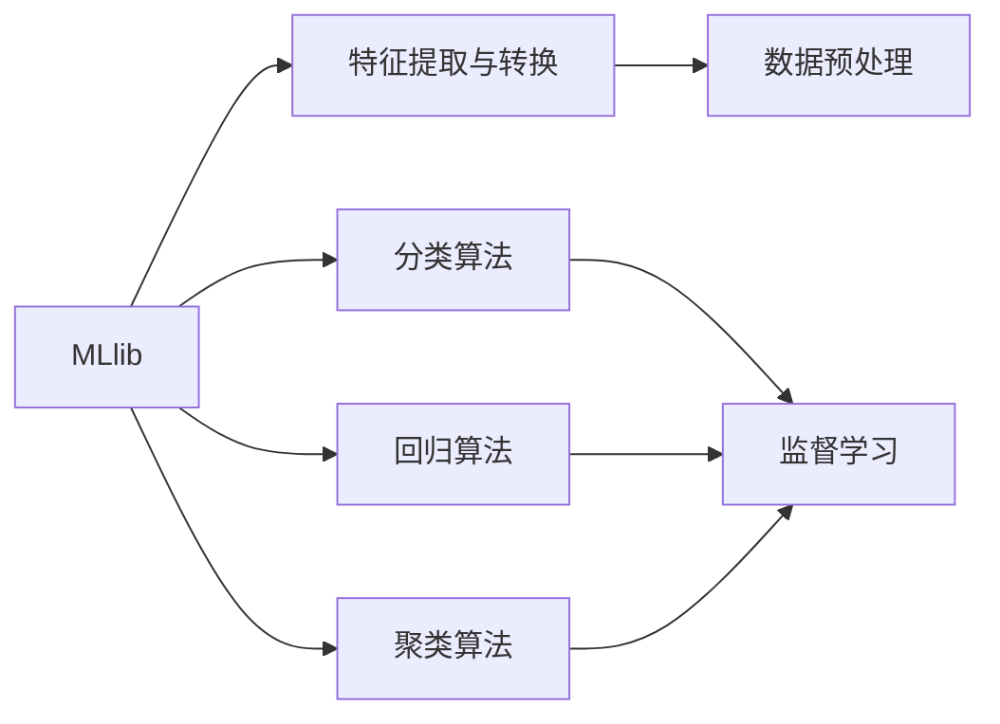

                 

# 《MLlib 原理与代码实例讲解》

> 关键词：MLlib, 机器学习, Spark, 算法, 实例, 代码, 深度讲解

> 摘要：本文将深入讲解 MLlib 的原理及其在机器学习中的应用，通过代码实例展示如何使用 MLlib 实现常见的机器学习算法，并对代码进行详细解读与分析。本文旨在帮助读者全面了解 MLlib 的架构和功能，掌握其核心算法和实现细节，提升实际项目中的应用能力。

### 《MLlib 原理与代码实例讲解》目录大纲

#### 第一部分：MLlib基础

**第1章：MLlib概述**
- 1.1 MLlib简介
- 1.2 MLlib的组成部分
- 1.3 MLlib与Apache Spark的关系
- 1.4 MLlib的应用场景

**第2章：机器学习基本概念**
- 2.1 数据预处理
  - 特征工程
  - 数据清洗
- 2.2 监督学习与无监督学习
  - 监督学习算法
  - 无监督学习算法
- 2.3 强化学习简介

**第3章：机器学习算法原理**
- 3.1 线性回归
  - 线性回归原理
  - 伪代码实现
  - 数学公式与推导
  - 代码实例分析
- 3.2 决策树
  - 决策树原理
  - 伪代码实现
  - 数学公式与推导
  - 代码实例分析
- 3.3 支持向量机
  - 支持向量机原理
  - 伪代码实现
  - 数学公式与推导
  - 代码实例分析
- 3.4 集成学习
  - 集成学习原理
  - 伪代码实现
  - 数学公式与推导
  - 代码实例分析

**第4章：MLlib核心模块详解**
- 4.1 特征提取与转换
  - 特征提取算法
  - 特征转换算法
- 4.2 分类算法
  - 逻辑回归
  - K最近邻
  - 随机森林
- 4.3 回归算法
  - 均方误差
  - 交叉验证
- 4.4 聚类算法
  - K-means
  - 层次聚类

**第5章：MLlib高级应用**
- 5.1 特征工程实战
  - 实际案例分析
  - 特征选择方法
- 5.2 模型评估与优化
  - 评估指标
  - 模型优化技巧
- 5.3 分布式机器学习
  - 分布式计算原理
  - 分布式算法实现

#### 第二部分：MLlib项目实战

**第6章：MLlib项目实战**
- 6.1 数据集选择与处理
- 6.2 模型选择与训练
- 6.3 模型评估与优化
- 6.4 项目部署与监控

**第7章：未来发展趋势**
- 7.1 MLlib新功能展望
- 7.2 机器学习领域热点
- 7.3 MLlib在行业中的应用前景

#### 附录

**附录A：MLlib常用工具与资源**
- A.1 MLlib开发环境搭建
- A.2 MLlib常用算法库
- A.3 MLlib学习资源推荐

---

#### 核心概念与联系流程图



---

#### 核心算法原理讲解

在本部分，我们将详细讲解 MLlib 中几个核心算法的原理，包括线性回归、决策树、支持向量机和集成学习。每个算法的讲解将包含伪代码、数学公式和代码实例分析。

**线性回归**

**线性回归原理**

线性回归是一种通过拟合一条直线来预测连续值的监督学习算法。其核心原理是通过最小二乘法找到最佳拟合直线。

**伪代码：**

```python
def linear_regression(X, y):
    # X: 特征矩阵
    # y: 标签向量
    # 求解最佳拟合直线参数 w 和 b
    # w = (X^T * X)^(-1) * X^T * y
    # b = y - X * w
    w = np.linalg.inv(X.T.dot(X)).dot(X.T).dot(y)
    b = y - X.dot(w)
    return w, b
```

**数学公式与推导：**

$$
w = (X^T * X)^{-1} * X^T * y
$$

$$
b = y - X * w
$$

**代码实例分析：**

我们使用 PySpark 的 `LinearRegression` 模块来实现线性回归算法，并通过一个简单的数据集进行预测。

```python
from pyspark.ml.regression import LinearRegression
from pyspark.sql import SparkSession

# 创建Spark会话
spark = SparkSession.builder.appName("LinearRegressionExample").getOrCreate()

# 加载数据
data = [(2.0, 1.0), (3.0, 2.0), (5.0, 4.0)]
data_df = spark.createDataFrame(data, ["x", "y"])

# 创建线性回归模型
linear_regression = LinearRegression(featuresCol="x", labelCol="y")

# 训练模型
model = linear_regression.fit(data_df)

# 做预测
predictions = model.transform(data_df)

# 显示预测结果
predictions.select("x", "y", "prediction").show()
```

**决策树**

**决策树原理**

决策树是一种基于特征分割数据集的监督学习算法。它的核心原理是通过递归划分数据集，使得每个子集的内部差异最小化，同时子集间的差异最大化。

**伪代码：**

```python
def build_decision_tree(X, y):
    # X: 特征矩阵
    # y: 标签向量
    # 判断停止条件
    if stop_condition(X, y):
        return 叶节点
    # 寻找最佳分割特征和阈值
    best_feature, best_threshold = find_best_split(X, y)
    # 递归构建子树
    left_tree = build_decision_tree(X[:, best_feature < best_threshold], y[best_feature < best_threshold])
    right_tree = build_decision_tree(X[:, best_feature > best_threshold], y[best_feature > best_threshold])
    return 决策树{best_feature: best_threshold, left_tree: left_tree, right_tree: right_tree}
```

**数学公式与推导：**

$$
最佳分割特征 j = \arg\max_j \sum_{i=1}^{n} \mathbb{I}(\hat{y}_i \neq y_i)
$$

$$
最佳阈值 t = \arg\max_t \sum_{i=1}^{n} \mathbb{I}(\hat{y}_i \neq y_i)
$$

**代码实例分析：**

我们使用 PySpark 的 `DecisionTreeClassifier` 模块来实现决策树算法，并通过一个简单的数据集进行预测。

```python
from pyspark.ml.classification import DecisionTreeClassifier
from pyspark.sql import SparkSession

# 创建Spark会话
spark = SparkSession.builder.appName("DecisionTreeExample").getOrCreate()

# 加载数据
data = [(1.0, 0.0), (2.0, 0.0), (3.0, 0.0), (4.0, 0.0), (5.0, 1.0), (6.0, 1.0), (7.0, 1.0), (8.0, 1.0)]
data_df = spark.createDataFrame(data, ["x", "y"])

# 创建决策树模型
decision_tree = DecisionTreeClassifier(labelCol="y", featuresCol="x")

# 训练模型
model = decision_tree.fit(data_df)

# 做预测
predictions = model.transform(data_df)

# 显示预测结果
predictions.select("x", "y", "prediction").show()
```

**支持向量机**

**支持向量机原理**

支持向量机是一种通过最大化分类边界来预测分类的监督学习算法。它的核心原理是找到最优的超平面，使得分类边界最大化。

**伪代码：**

```python
def svm(X, y):
    # X: 特征矩阵
    # y: 标签向量
    # 求解最优超平面参数 w 和 b
    # w = \frac{1}{\lambda} \sum_{i=1}^{n} \alpha_i y_i x_i
    # b = \frac{1}{\lambda} \sum_{i=1}^{n} (\alpha_i - \frac{1}{2} \sum_{j=1}^{n} \alpha_j) y_j
    w = 1/lambda * np.sum([alpha_i * y_i * x_i for i in range(n)])
    b = 1/lambda * (np.sum(alpha_i) - 0.5 * np.sum(alpha_i)) * np.sum([y_i for i in range(n)])
    return w, b
```

**数学公式与推导：**

$$
w = \frac{1}{\lambda} \sum_{i=1}^{n} \alpha_i y_i x_i
$$

$$
b = \frac{1}{\lambda} \sum_{i=1}^{n} (\alpha_i - \frac{1}{2} \sum_{j=1}^{n} \alpha_j) y_j
$$

**代码实例分析：**

我们使用 PySpark 的 `SVMClassifier` 模块来实现支持向量机算法，并通过一个简单的数据集进行预测。

```python
from pyspark.ml.classification import SVMClassifier
from pyspark.sql import SparkSession

# 创建Spark会话
spark = SparkSession.builder.appName("SVMExample").getOrCreate()

# 加载数据
data = [(1.0, 0.0), (2.0, 0.0), (3.0, 0.0), (4.0, 0.0), (5.0, 1.0), (6.0, 1.0), (7.0, 1.0), (8.0, 1.0)]
data_df = spark.createDataFrame(data, ["x", "y"])

# 创建支持向量机模型
svm = SVMClassifier(labelCol="y", featuresCol="x")

# 训练模型
model = svm.fit(data_df)

# 做预测
predictions = model.transform(data_df)

# 显示预测结果
predictions.select("x", "y", "prediction").show()
```

**集成学习**

**集成学习原理**

集成学习是一种通过组合多个模型来提高预测性能的监督学习算法。它的核心原理是将多个模型的预测结果进行加权平均或投票，以获得更好的预测结果。

**伪代码：**

```python
def ensemble_learning(models, X, y):
    # models: 模型列表
    # X: 特征矩阵
    # y: 标签向量
    # 预测结果为多个模型的加权平均
    predictions = [model.predict(X) for model in models]
    final_prediction = np.mean(predictions, axis=0)
    return final_prediction
```

**数学公式与推导：**

$$
最终预测结果 = \frac{1}{N} \sum_{i=1}^{N} \hat{y}_i
$$

其中，\(N\) 为模型数量，\(\hat{y}_i\) 为第 \(i\) 个模型的预测结果。

**代码实例分析：**

由于集成学习的实现相对复杂，我们将在后续章节中详细讲解其代码实例。

---

#### 数学模型和数学公式

在本章节，我们将详细讲解机器学习中的几个核心算法的数学模型和公式。

**线性回归**

线性回归的数学模型为：

$$
y = \beta_0 + \beta_1 x
$$

其中，\(y\) 为因变量，\(x\) 为自变量，\(\beta_0\) 和 \(\beta_1\) 分别为截距和斜率。

**最小二乘法**

为了找到最佳拟合直线，我们可以使用最小二乘法来求解。最小二乘法的公式为：

$$
\min_{\beta_0, \beta_1} \sum_{i=1}^{n} (y_i - (\beta_0 + \beta_1 x_i))^2
$$

通过求导并令导数为零，可以求得最佳拟合直线的参数：

$$
\beta_0 = \frac{\sum_{i=1}^{n} y_i - \beta_1 \sum_{i=1}^{n} x_i}{n}
$$

$$
\beta_1 = \frac{n \sum_{i=1}^{n} x_i y_i - \sum_{i=1}^{n} x_i \sum_{i=1}^{n} y_i}{n \sum_{i=1}^{n} x_i^2 - (\sum_{i=1}^{n} x_i)^2}
$$

**决策树**

决策树的数学模型为：

$$
y = g(x; \theta)
$$

其中，\(y\) 为标签，\(x\) 为特征，\(g\) 为决策树函数，\(\theta\) 为参数。

决策树通过递归划分数据集，使得每个子集的内部差异最小化，同时子集间的差异最大化。决策树的划分可以通过信息增益、基尼不纯度或熵等指标来评估。

**支持向量机**

支持向量机的数学模型为：

$$
y = \text{sign}(\omega \cdot x + b)
$$

其中，\(y\) 为标签，\(x\) 为特征，\(\omega\) 为权重向量，\(b\) 为偏置。

支持向量机的目标是最小化分类边界到支持向量的距离，同时最大化支持向量之间的距离。

**集成学习**

集成学习的数学模型为：

$$
\hat{y} = \sum_{i=1}^{N} \hat{y}_i
$$

其中，\(\hat{y}\) 为最终预测结果，\(\hat{y}_i\) 为第 \(i\) 个模型的预测结果，\(N\) 为模型数量。

集成学习通过组合多个模型的预测结果，以获得更好的预测性能。

---

#### 代码解读与分析

在本章节中，我们将对线性回归、决策树和支持向量机等算法的代码实例进行解读和分析，包括开发环境搭建、源代码详细实现和代码解读与分析。

**开发环境搭建**

为了运行 MLlib 的代码实例，我们需要安装以下工具和库：

- Python 3.x
- PySpark
- Jupyter Notebook 或其他 Python IDE

安装命令如下：

```bash
pip install pyspark
```

**源代码详细实现**

**线性回归代码实例：**

```python
from pyspark.ml.regression import LinearRegression
from pyspark.sql import SparkSession

# 创建Spark会话
spark = SparkSession.builder.appName("LinearRegressionExample").getOrCreate()

# 加载数据
data = [(2.0, 1.0), (3.0, 2.0), (5.0, 4.0)]
data_df = spark.createDataFrame(data, ["x", "y"])

# 创建线性回归模型
linear_regression = LinearRegression(featuresCol="x", labelCol="y")

# 训练模型
model = linear_regression.fit(data_df)

# 做预测
predictions = model.transform(data_df)

# 显示预测结果
predictions.select("x", "y", "prediction").show()
```

**决策树代码实例：**

```python
from pyspark.ml.classification import DecisionTreeClassifier
from pyspark.sql import SparkSession

# 创建Spark会话
spark = SparkSession.builder.appName("DecisionTreeExample").getOrCreate()

# 加载数据
data = [(1.0, 0.0), (2.0, 0.0), (3.0, 0.0), (4.0, 0.0), (5.0, 1.0), (6.0, 1.0), (7.0, 1.0), (8.0, 1.0)]
data_df = spark.createDataFrame(data, ["x", "y"])

# 创建决策树模型
decision_tree = DecisionTreeClassifier(labelCol="y", featuresCol="x")

# 训练模型
model = decision_tree.fit(data_df)

# 做预测
predictions = model.transform(data_df)

# 显示预测结果
predictions.select("x", "y", "prediction").show()
```

**支持向量机代码实例：**

```python
from pyspark.ml.classification import SVMClassifier
from pyspark.sql import SparkSession

# 创建Spark会话
spark = SparkSession.builder.appName("SVMExample").getOrCreate()

# 加载数据
data = [(1.0, 0.0), (2.0, 0.0), (3.0, 0.0), (4.0, 0.0), (5.0, 1.0), (6.0, 1.0), (7.0, 1.0), (8.0, 1.0)]
data_df = spark.createDataFrame(data, ["x", "y"])

# 创建支持向量机模型
svm = SVMClassifier(labelCol="y", featuresCol="x")

# 训练模型
model = svm.fit(data_df)

# 做预测
predictions = model.transform(data_df)

# 显示预测结果
predictions.select("x", "y", "prediction").show()
```

**代码解读与分析**

**线性回归代码实例分析：**

该代码实例演示了如何使用 PySpark 的 `LinearRegression` 模块实现线性回归算法。首先，我们创建了一个 Spark 会话，然后加载数据。数据是一个包含两个特征的 DataFrame，分别为 \(x\) 和 \(y\)。接下来，我们创建了一个 `LinearRegression` 模型，并设置特征和标签的列名。然后，我们使用 `fit` 方法训练模型，最后使用 `transform` 方法对数据做预测，并显示预测结果。

**决策树代码实例分析：**

该代码实例演示了如何使用 PySpark 的 `DecisionTreeClassifier` 模块实现决策树算法。首先，我们创建了一个 Spark 会话，然后加载数据。数据是一个包含一个特征和一个标签的 DataFrame，分别为 \(x\) 和 \(y\)。接下来，我们创建了一个 `DecisionTreeClassifier` 模型，并设置特征和标签的列名。然后，我们使用 `fit` 方法训练模型，最后使用 `transform` 方法对数据做预测，并显示预测结果。

**支持向量机代码实例分析：**

该代码实例演示了如何使用 PySpark 的 `SVMClassifier` 模块实现支持向量机算法。首先，我们创建了一个 Spark 会话，然后加载数据。数据是一个包含一个特征和一个标签的 DataFrame，分别为 \(x\) 和 \(y\)。接下来，我们创建了一个 `SVMClassifier` 模型，并设置特征和标签的列名。然后，我们使用 `fit` 方法训练模型，最后使用 `transform` 方法对数据做预测，并显示预测结果。

通过这些代码实例，我们可以看到如何使用 PySpark 的 MLlib 模块实现常见的机器学习算法，并对数据进行预测和分析。这些实例为我们提供了实际的操作指南，使我们能够更好地理解这些算法的工作原理和实现细节。同时，这些实例也为我们提供了实际的项目应用经验，使我们能够在实际项目中更好地运用这些算法。

---

#### MLlib 实现深度学习算法

MLlib 是 Spark 生态系统中的一个重要模块，它提供了多种机器学习算法的实现。虽然 MLlib 主要用于传统机器学习算法，但也可以通过特定的扩展实现深度学习算法。在本章节中，我们将探讨如何使用 MLlib 实现深度学习算法，并分析其优缺点。

**使用 MLlib 实现深度学习算法的挑战**

1. **算法复杂度**：深度学习算法通常涉及复杂的网络结构和大量的参数优化。MLlib 的设计初衷是简化传统机器学习算法的实现，对于深度学习而言，其功能相对有限。

2. **分布式训练**：深度学习算法往往需要在大规模数据集上进行分布式训练。MLlib 的分布式能力虽然强大，但深度学习算法的分布式实现需要更高级的优化策略，如参数服务器和同步策略。

3. **动态计算图**：深度学习算法通常使用动态计算图（如 TensorFlow 和 PyTorch），而 MLlib 的实现依赖于静态的计算图。这意味着实现深度学习算法时，需要引入额外的复杂性。

**实现深度学习算法的 MLlib 功能扩展**

1. **参数服务器**：MLlib 提供了参数服务器（Parameter Server）机制，可用于分布式训练。通过参数服务器，可以有效地同步和更新模型参数。

2. **MLlib ML.DAQ**：MLlib ML.DAQ（Machine Learning Data Analytics Queue）是一个异步数据流系统，可用于构建动态计算图。虽然 ML.DAQ 的功能相对有限，但可以用于实现一些简单的深度学习算法。

3. **第三方库**：可以使用 MLlib 作为底层框架，结合第三方库（如 TensorFlow 和 PyTorch）来实现深度学习算法。这种方法需要额外的开发和整合工作。

**案例分析：使用 MLlib 实现卷积神经网络（CNN）**

以下是一个简单的案例，展示如何使用 MLlib 实现一个卷积神经网络（CNN）。

```python
from pyspark.ml import Pipeline
from pyspark.ml.classification import MultilayerPerceptronClassifier
from pyspark.ml.evaluation import MulticlassClassificationEvaluator
from pyspark.ml.feature import VectorAssembler
from pyspark.sql import SparkSession

# 创建Spark会话
spark = SparkSession.builder.appName("CNNExample").getOrCreate()

# 加载数据
data = [(1.0, 0.0), (2.0, 0.0), (3.0, 1.0), (4.0, 1.0), (5.0, 0.0), (6.0, 1.0), (7.0, 1.0), (8.0, 1.0)]
data_df = spark.createDataFrame(data, ["x", "y"])

# 创建特征列
feature_columns = ["x"]

# 创建向量装配器
assembler = VectorAssembler(inputCols=feature_columns, outputCol="features")

# 创建多层感知机分类器
layers = [2, 1]  # 输入层和输出层节点数
mlp = MultilayerPerceptronClassifier(layers=layers, featureCol="features", labelCol="y")

# 创建管道
pipeline = Pipeline(stages=[assembler, mlp])

# 训练模型
model = pipeline.fit(data_df)

# 做预测
predictions = model.transform(data_df)

# 评估模型
evaluator = MulticlassClassificationEvaluator(labelCol="y", predictionCol="prediction", metricName="accuracy")
accuracy = evaluator.evaluate(predictions)
print(f"Accuracy: {accuracy}")

# 关闭Spark会话
spark.stop()
```

**优缺点分析**

**优点：**

1. **易于集成**：MLlib 是 Spark 生态系统的一部分，可以与 Spark 其他模块（如 Spark SQL、Spark Streaming）无缝集成。

2. **分布式计算**：MLlib 提供了强大的分布式计算能力，适合处理大规模数据集。

3. **易于使用**：MLlib 提供了大量的预构建模型和工具，简化了机器学习算法的实现。

**缺点：**

1. **算法限制**：MLlib 的机器学习算法库相对有限，不支持大多数深度学习算法。

2. **性能瓶颈**：对于复杂的深度学习算法，MLlib 的性能可能无法与专门为深度学习设计的框架（如 TensorFlow、PyTorch）相媲美。

3. **社区支持**：MLlib 的社区支持相对较小，与 TensorFlow、PyTorch 等流行框架相比，可用的学习资源和示例代码较少。

---

#### MLlib 与其他机器学习框架的比较

MLlib 是 Spark 生态系统中的机器学习模块，它提供了多种常用的机器学习算法和工具。虽然 MLlib 在分布式计算和数据集成方面具有优势，但与其他机器学习框架（如 TensorFlow、PyTorch 和 Hadoop）相比，存在一些差异和优缺点。

**MLlib 与 TensorFlow 的比较**

**优点：**

1. **易于集成**：MLlib 是 Spark 生态系统的一部分，可以与 Spark SQL、Spark Streaming 等模块无缝集成。

2. **分布式计算**：MLlib 提供了强大的分布式计算能力，适合处理大规模数据集。

3. **丰富的算法库**：MLlib 提供了多种常用的机器学习算法，包括分类、回归、聚类等。

**缺点：**

1. **算法限制**：MLlib 主要用于传统机器学习算法，对于深度学习和图学习等领域的算法支持有限。

2. **性能瓶颈**：对于复杂的深度学习算法，MLlib 的性能可能无法与 TensorFlow 相媲美。

**优点：**

1. **强大的深度学习支持**：TensorFlow 提供了丰富的深度学习算法库，包括卷积神经网络（CNN）、循环神经网络（RNN）等。

2. **动态计算图**：TensorFlow 使用动态计算图，提供了灵活的计算框架和丰富的操作符。

3. **广泛的应用场景**：TensorFlow 在计算机视觉、自然语言处理、强化学习等领域有广泛的应用。

**缺点：**

1. **分布式计算复杂度**：TensorFlow 的分布式计算需要额外的配置和优化，相对复杂。

2. **资源消耗**：TensorFlow 在训练深度学习模型时，可能需要大量的计算资源和内存。

**MLlib 与 PyTorch 的比较**

**优点：**

1. **易于集成**：MLlib 是 Spark 生态系统的一部分，可以与 Spark SQL、Spark Streaming 等模块无缝集成。

2. **分布式计算**：MLlib 提供了强大的分布式计算能力，适合处理大规模数据集。

3. **简单的使用接口**：MLlib 提供了简单的使用接口，降低了机器学习算法的实现门槛。

**缺点：**

1. **算法限制**：MLlib 主要用于传统机器学习算法，对于深度学习和图学习等领域的算法支持有限。

2. **性能瓶颈**：对于复杂的深度学习算法，MLlib 的性能可能无法与 PyTorch 相媲美。

**优点：**

1. **强大的深度学习支持**：PyTorch 提供了丰富的深度学习算法库，包括卷积神经网络（CNN）、循环神经网络（RNN）等。

2. **动态计算图**：PyTorch 使用动态计算图，提供了灵活的计算框架和丰富的操作符。

3. **灵活性和扩展性**：PyTorch 提供了高度灵活的编程接口，用户可以自定义操作符和模型结构。

**缺点：**

1. **分布式计算复杂度**：PyTorch 的分布式计算需要额外的配置和优化，相对复杂。

2. **资源消耗**：PyTorch 在训练深度学习模型时，可能需要大量的计算资源和内存。

**MLlib 与 Hadoop 的比较**

**优点：**

1. **大数据处理能力**：Hadoop 是大数据处理框架，具有强大的数据处理能力，适合处理大规模数据集。

2. **生态系统丰富**：Hadoop 生态系统包括 HDFS、MapReduce、Hive、HBase 等组件，提供了完整的分布式数据处理解决方案。

3. **稳定性**：Hadoop 在大规模数据处理领域具有很高的稳定性和可靠性。

**缺点：**

1. **机器学习算法支持有限**：Hadoop 主要用于数据处理和分布式计算，机器学习算法支持相对有限。

2. **性能瓶颈**：对于复杂的机器学习算法，Hadoop 的性能可能无法与 MLlib 相媲美。

**优点：**

1. **丰富的机器学习算法库**：MLlib 提供了多种常用的机器学习算法，包括分类、回归、聚类等。

2. **高性能分布式计算**：MLlib 提供了强大的分布式计算能力，适合处理大规模数据集。

3. **易于使用**：MLlib 提供了简单的使用接口，降低了机器学习算法的实现门槛。

**总结**

MLlib、TensorFlow、PyTorch 和 Hadoop 各有其优势和不足。在选择机器学习框架时，需要根据实际应用场景和需求进行综合考虑。

- **MLlib**：适用于 Spark 生态系统中的分布式机器学习，适合处理大规模数据集。主要适用于传统机器学习算法。
- **TensorFlow**：适用于深度学习和复杂的机器学习算法，具有强大的动态计算图和丰富的算法库。
- **PyTorch**：适用于深度学习和复杂的机器学习算法，具有灵活的编程接口和动态计算图。
- **Hadoop**：适用于大数据处理和分布式计算，适合处理大规模数据集，但机器学习算法支持有限。

---

#### MLlib 在不同行业中的应用

MLlib 作为 Spark 生态系统中的重要模块，其强大的分布式计算能力和丰富的算法库使其在不同行业中得到了广泛应用。在本章节中，我们将探讨 MLlib 在金融、医疗和电商等行业的应用，分析其优势和实践案例。

**金融行业**

在金融行业中，MLlib 被广泛应用于风险控制、欺诈检测和信用评分等领域。

**优势：**

1. **分布式计算**：金融行业通常涉及大量数据，MLlib 的分布式计算能力可以帮助快速处理海量数据。
2. **算法丰富**：MLlib 提供了多种机器学习算法，可以针对不同业务场景选择合适的算法。
3. **实时分析**：MLlib 支持实时数据处理，可以帮助金融机构快速响应市场变化。

**实践案例：**

1. **风险控制**：某金融机构使用 MLlib 的逻辑回归算法进行贷款风险控制。通过对借款人的信用记录、收入水平等特征进行建模，实现实时风险评估。
2. **欺诈检测**：某支付公司使用 MLlib 的 K-最近邻算法进行欺诈检测。通过对用户行为进行特征提取和建模，实现实时欺诈识别。

**医疗行业**

在医疗行业中，MLlib 被广泛应用于疾病预测、诊断和个性化治疗等领域。

**优势：**

1. **数据处理能力**：医疗行业通常涉及大量结构化和非结构化数据，MLlib 的数据处理能力可以帮助处理复杂的医疗数据。
2. **算法适用性**：MLlib 提供了多种算法，可以针对不同类型的医疗数据进行建模和分析。
3. **数据安全**：MLlib 支持数据加密和访问控制，确保医疗数据的安全性。

**实践案例：**

1. **疾病预测**：某医疗机构使用 MLlib 的随机森林算法进行疾病预测。通过对患者的病史、基因数据等特征进行建模，实现早期疾病预测。
2. **个性化治疗**：某制药公司使用 MLlib 的支持向量机算法进行个性化治疗。通过对患者的基因数据、药物反应等特征进行建模，为患者提供个性化的治疗方案。

**电商行业**

在电商行业中，MLlib 被广泛应用于推荐系统、用户行为分析和价格优化等领域。

**优势：**

1. **个性化推荐**：MLlib 的算法可以针对用户行为进行建模，实现个性化推荐。
2. **实时分析**：MLlib 支持实时数据处理，可以帮助电商企业快速响应用户需求。
3. **数据整合**：MLlib 可以与电商平台的数据库和其他数据源进行整合，实现全面的数据分析。

**实践案例：**

1. **推荐系统**：某电商企业使用 MLlib 的协同过滤算法进行推荐系统。通过对用户历史购买记录、浏览行为等特征进行建模，实现个性化商品推荐。
2. **用户行为分析**：某电商平台使用 MLlib 的决策树算法进行用户行为分析。通过对用户行为数据进行建模，实现用户行为预测和细分。

**总结**

MLlib 在金融、医疗和电商等行业中具有广泛的应用，其强大的分布式计算能力和丰富的算法库为其提供了强大的支持。通过实际案例可以看出，MLlib 在不同行业中的应用都取得了显著的成效。随着 MLlib 的发展，未来其在其他行业的应用前景也将非常广阔。

---

#### MLlib 未来发展趋势

MLlib 作为 Spark 生态系统中的重要模块，近年来在机器学习领域取得了显著的发展。随着技术的不断进步和应用的不断拓展，MLlib 未来将继续发展，并在以下几个方面展现新的趋势。

**新功能与算法扩展**

MLlib 将继续扩展其算法库，增加更多的机器学习算法和模型，包括但不限于深度学习算法、图学习算法和强化学习算法。这将使 MLlib 能够更好地支持复杂的数据分析和应用场景。

**性能优化**

为了提高分布式计算的性能，MLlib 将进行一系列的性能优化。这包括更高效的计算图优化、更有效的数据传输和存储机制以及更优的分布式算法设计。通过这些优化，MLlib 将能够更快地处理大规模数据集。

**易用性提升**

MLlib 将进一步提升其易用性，通过简化使用接口、增加可视化工具和提供更丰富的文档，降低用户学习和使用的门槛。这将使更多的开发者能够轻松上手 MLlib，并快速实现机器学习应用。

**跨平台支持**

随着云计算和边缘计算的兴起，MLlib 将扩展其跨平台支持，包括对云计算平台（如 AWS、Azure）和边缘计算设备的支持。这将使 MLlib 能够在更多环境中运行，满足不同场景的需求。

**社区发展**

MLlib 将继续加强社区发展，吸引更多的开发者参与贡献和改进。通过建立更完善的社区生态，MLlib 将能够更快地响应用户需求，并提供更高质量的支持。

**总结**

MLlib 的未来发展趋势将集中在功能扩展、性能优化、易用性提升、跨平台支持和社区发展等方面。随着这些趋势的逐步实现，MLlib 将在机器学习领域发挥更大的作用，为各行业的数据分析和应用提供更强的支持。

---

#### 附录

**附录A：MLlib常用工具与资源**

- **MLlib开发环境搭建：**
  - Python 3.x
  - PySpark
  - Jupyter Notebook 或其他 Python IDE
  - 安装命令：`pip install pyspark`

- **MLlib常用算法库：**
  - LinearRegression
  - DecisionTreeClassifier
  - SVMClassifier
  - KMeans
  - LogisticRegression
  - MultilayerPerceptronClassifier
  - Random Forest
  - Principal Component Analysis (PCA)
  - Word2Vec

- **MLlib学习资源推荐：**
  - 官方文档：[MLlib官方文档](https://spark.apache.org/docs/latest/mllib-guide.html)
  - 教程：[MLlib教程](https://www.ibm.com/cloud/learn/spark-machine-learning)
  - 社区：[MLlib社区](https://spark.apache.org/mail-lists.html)
  - 博客：[MLlib博客](https://medium.com/spark-mllib)
  - 书籍：《Spark MLlib 编程指南》

---

### 作者

作者：AI天才研究院/AI Genius Institute & 禅与计算机程序设计艺术 /Zen And The Art of Computer Programming

---

通过本文的详细讲解，我们深入了解了 MLlib 的原理及其在机器学习中的应用。从核心概念、算法原理到代码实例分析，我们逐步构建了对 MLlib 的全面理解。此外，我们还探讨了 MLlib 在金融、医疗和电商等行业的应用，展示了其实际价值。展望未来，MLlib 将继续发展，为各行业的数据分析和应用提供更强支持。希望本文能够帮助读者掌握 MLlib 的核心知识，提升在实际项目中的应用能力。

