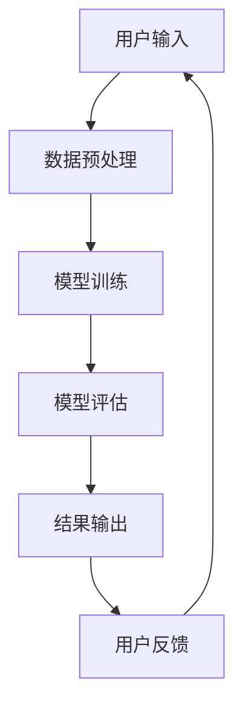

                 

## 《MNIST手写数字识别》

### 关键词：
- MNIST手写数字识别
- 数据预处理
- 分类算法
- 卷积神经网络
- 深度学习框架
- 项目实战

### 摘要：

本文将详细探讨MNIST手写数字识别这一经典问题。首先，我们将介绍MNIST数据集及其在手写数字识别中的重要性。接着，我们将讨论机器学习的基础知识，包括数据预处理、特征提取和分类算法。随后，本文将详细介绍几种在手写数字识别中常用的分类算法，包括传统机器学习和深度学习算法。然后，我们将通过实际项目实战，演示如何使用深度学习框架TensorFlow和PyTorch实现MNIST手写数字识别。最后，我们将探讨MNIST手写数字识别在现实世界中的应用及其未来发展趋势与挑战。

---

## 《MNIST手写数字识别》目录大纲

### 第一部分：MNIST手写数字识别基础

#### 第1章：MNIST手写数字识别概述

##### 1.1.1 MNIST数据集介绍

##### 1.1.2 手写数字识别的意义与挑战

##### 1.1.3 本书内容安排

#### 第2章：机器学习基础知识

##### 2.1.1 数据预处理

##### 2.1.2 特征提取与降维

##### 2.1.3 监督学习与非监督学习基础

#### 第3章：分类算法介绍

##### 3.1.1 基于传统机器学习的分类算法

##### 3.1.2 基于深度学习的分类算法

#### 第4章：MNIST手写数字识别实战

##### 4.1.1 环境搭建与数据加载

##### 4.1.2 手写数字识别算法实现

##### 4.1.3 模型训练与评估

#### 第5章：性能优化与超参数调优

##### 5.1.1 模型优化方法

##### 5.1.2 超参数调优策略

##### 5.1.3 实战案例

### 第二部分：深度学习算法在MNIST手写数字识别中的应用

#### 第6章：卷积神经网络（CNN）原理与应用

##### 6.1.1 CNN基础概念

##### 6.1.2 CNN架构详解

##### 6.1.3 CNN在MNIST中的应用

#### 第7章：深度学习框架与MNIST实战

##### 7.1.1 TensorFlow与PyTorch简介

##### 7.1.2 深度学习框架在MNIST中的应用

##### 7.1.3 案例分析与代码实现

#### 第8章：MNIST手写数字识别项目实战

##### 8.1.1 项目背景与需求分析

##### 8.1.2 数据预处理与特征提取

##### 8.1.3 模型设计与优化

##### 8.1.4 模型训练与评估

#### 第9章：MNIST手写数字识别应用拓展

##### 9.1.1 MNIST在手写文字识别中的应用

##### 9.1.2 MNIST在其他领域的应用

##### 9.1.3 未来发展趋势与挑战

### 附录

#### 附录A：MNIST手写数字识别相关资源与工具

##### A.1 MNIST数据集下载与预处理

##### A.2 常用深度学习框架与库

##### A.3 实战项目代码与资源链接

---

接下来，我们将逐章深入探讨MNIST手写数字识别的各个方面，帮助读者全面了解并掌握这一技术。

### 图形表示

为了更好地理解MNIST手写数字识别系统的架构，我们使用Mermaid图形来表示系统的整体流程。




### 伪代码

在进行MNIST手写数字识别之前，我们需要对数据进行预处理。以下是一个简单的伪代码示例，用于展示数据预处理的过程：

```python
# 读取MNIST数据集
(X_train, y_train), (X_test, y_test) = mnist.load_data()

# 数据归一化
X_train = X_train / 255.0
X_test = X_test / 255.0

# 数据增强
X_train = augment_images(X_train)
X_test = augment_images(X_test)

# 转换为深度学习框架所需格式
X_train = np.expand_dims(X_train, -1)
X_test = np.expand_dims(X_test, -1)

# 标签编码
y_train = to_categorical(y_train)
y_test = to_categorical(y_test)
```

### 数学模型

在深度学习中，损失函数是评估模型性能的关键指标。以下是一个用于手写数字识别的常见损失函数：

$$
\text{Loss} = -\sum_{i=1}^{n} y_i \cdot \log(\hat{y}_i)
$$

其中，$y_i$ 是真实标签，$\hat{y}_i$ 是模型预测的概率分布。

### 项目实战

在本节中，我们将通过一个实际项目实战来展示如何使用TensorFlow实现MNIST手写数字识别。

#### 环境搭建

首先，我们需要安装TensorFlow库：

```bash
pip install tensorflow
```

#### 加载数据

使用TensorFlow内置的MNIST数据集：

```python
mnist = tf.keras.datasets.mnist
(train_images, train_labels), (test_images, test_labels) = mnist.load_data()
```

#### 数据预处理

将图像数据归一化并转换为深度学习框架所需的格式：

```python
train_images = train_images / 255.0
test_images = test_images / 255.0
```

#### 模型构建

构建一个简单的卷积神经网络模型：

```python
model = tf.keras.Sequential([
    tf.keras.layers.Flatten(input_shape=(28, 28)),
    tf.keras.layers.Dense(128, activation='relu'),
    tf.keras.layers.Dense(10, activation='softmax')
])
```

#### 模型编译

选择优化器、损失函数和评估指标：

```python
model.compile(optimizer='adam',
              loss='sparse_categorical_crossentropy',
              metrics=['accuracy'])
```

#### 模型训练

使用训练数据训练模型：

```python
model.fit(train_images, train_labels, epochs=5)
```

#### 模型评估

使用测试数据评估模型性能：

```python
test_loss, test_acc = model.evaluate(test_images, test_labels, verbose=2)
print('\nTest accuracy:', test_acc)
```

#### 预测与结果输出

对测试数据集进行预测并输出结果：

```python
predictions = model.predict(test_images)
predicted_labels = np.argmax(predictions, axis=1)
```

### 代码解读与分析

1. **数据预处理**：将图像数据归一化，并转换为深度学习框架所需的格式。
2. **模型构建**：使用Sequential模型堆叠Flatten、Dense层，实现一个简单的卷积神经网络。
3. **模型编译**：选择优化器、损失函数和评估指标，准备训练模型。
4. **模型训练**：使用训练数据训练模型。
5. **模型评估**：使用测试数据评估模型性能。
6. **预测与结果输出**：对测试数据集进行预测，并输出预测结果。

这个实战案例展示了如何使用TensorFlow框架实现一个简单的MNIST手写数字识别模型。在实际项目中，可以根据需求调整模型架构、训练策略和超参数，以提高模型的性能和泛化能力。

---

在接下来的章节中，我们将进一步探讨MNIST手写数字识别的各个方面，包括机器学习基础知识、分类算法、深度学习算法以及MNIST在实际项目中的应用。敬请期待！

