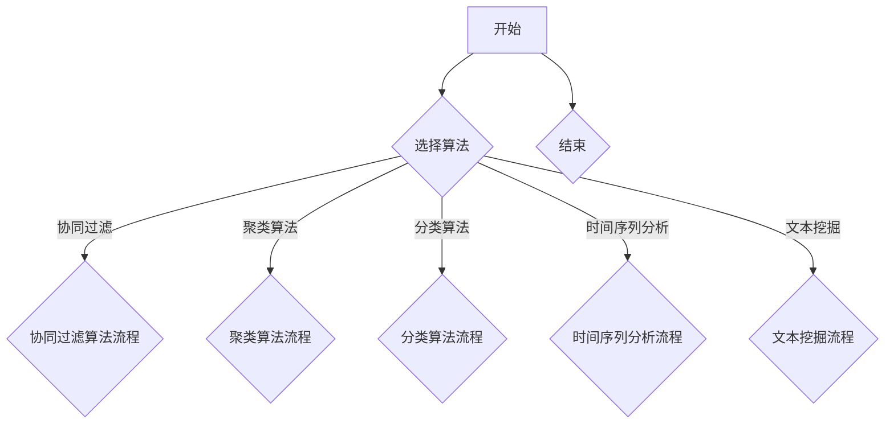
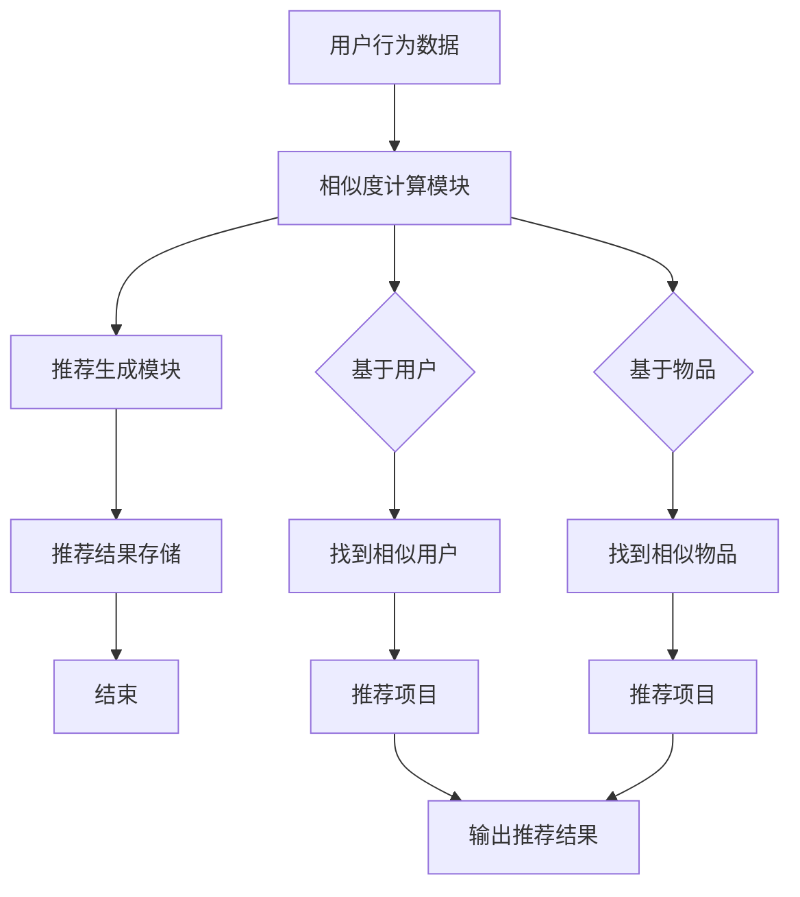

                 

# 文章标题：Mahout：大规模数据挖掘库应用详解

> 关键词：Mahout，数据挖掘，Hadoop，协同过滤，聚类算法，分类算法，文本挖掘，项目实战

> 摘要：本文旨在详细介绍Mahout这一大规模数据挖掘库的应用，包括其基础、核心算法以及实际项目案例。通过本文的阅读，读者将全面了解Mahout的优势、架构设计，掌握其主要算法原理及实现，并能够应用于实际项目开发中。

## 《Mahout：大规模数据挖掘库应用详解》目录大纲

### 第一部分：Mahout基础

#### 第1章：大规模数据挖掘概述

1.1 大规模数据挖掘的重要性

1.2 数据挖掘技术分类

1.3 Mahout的背景与优势

#### 第2章：Mahout架构与环境搭建

2.1 Mahout的架构设计

2.2 安装与配置Mahout

2.3 Mahout与Hadoop的整合

### 第二部分：Mahout核心算法与应用

#### 第3章：协同过滤推荐算法

3.1 协同过滤推荐原理

3.2 评分预测伪代码实现

3.3 基于Mahout的协同过滤实现

#### 第4章：聚类算法

4.1 聚类算法概述

4.2 K-means聚类算法原理

4.3 K-means算法的伪代码实现

4.4 基于Mahout的K-means实现

#### 第5章：分类算法

5.1 分类算法概述

5.2 决策树算法原理

5.3 决策树算法的伪代码实现

5.4 基于Mahout的决策树实现

#### 第6章：时间序列分析

6.1 时间序列分析概述

6.2 时间序列预测算法

6.3 时间序列预测的伪代码实现

6.4 基于Mahout的时间序列分析实现

#### 第7章：文本挖掘

7.1 文本挖掘概述

7.2 文本相似度计算

7.3 文本分类算法

7.4 基于Mahout的文本挖掘实现

### 第三部分：项目实战

#### 第8章：电子商务推荐系统实战

8.1 项目背景

8.2 需求分析

8.3 系统设计

8.4 代码实现与解读

#### 第9章：社交网络分析实战

9.1 项目背景

9.2 需求分析

9.3 系统设计

9.4 代码实现与解读

#### 第10章：智能推荐系统实战

10.1 项目背景

10.2 需求分析

10.3 系统设计

10.4 代码实现与解读

### 附录

#### 附录A：Mahout常用类与方法介绍

#### 附录B：Mahout环境配置详解

#### 附录C：Mahout源代码解读与优化建议

## 第1章：大规模数据挖掘概述

### 1.1 大规模数据挖掘的重要性

随着互联网和物联网的快速发展，数据量呈爆炸式增长。如何从海量数据中挖掘有价值的信息，成为了企业和研究机构面临的重大挑战。大规模数据挖掘技术应运而生，成为了解决这一问题的关键。

大规模数据挖掘的重要性主要体现在以下几个方面：

1. **提升业务价值**：通过对大规模数据的挖掘，企业可以更好地了解用户需求，优化产品设计，提高销售业绩，降低运营成本。

2. **发现潜在趋势**：通过分析历史数据，可以预测市场趋势，为企业制定战略规划提供有力支持。

3. **提高决策质量**：大规模数据挖掘可以帮助企业从复杂的数据中提取关键信息，辅助决策者做出更科学的决策。

4. **优化资源配置**：通过分析数据，企业可以更合理地分配资源，提高运营效率。

### 1.2 数据挖掘技术分类

数据挖掘技术可以分为以下几类：

1. **分类**：根据输入数据对未知数据进行分类。常见的算法有决策树、支持向量机等。

2. **聚类**：将相似的数据聚成一类。常见的算法有K-means、层次聚类等。

3. **关联规则挖掘**：发现数据项之间的关联关系。常见的算法有Apriori、FP-growth等。

4. **异常检测**：检测数据中的异常值或异常模式。常见的算法有LOF、Isolation Forest等。

5. **预测**：根据历史数据预测未来的趋势。常见的算法有时间序列分析、回归分析等。

6. **文本挖掘**：对文本数据进行挖掘，提取有价值的信息。常见的算法有词频统计、主题模型等。

### 1.3 Mahout的背景与优势

Mahout是一个开源的大规模数据挖掘库，它基于Apache Hadoop平台，可以处理海量数据。Mahout的优势主要体现在以下几个方面：

1. **高效性**：Mahout利用了Hadoop的分布式计算能力，可以高效地处理大规模数据。

2. **灵活性**：Mahout提供了丰富的数据挖掘算法，可以满足不同应用场景的需求。

3. **易用性**：Mahout具有简洁的API，使得开发者可以轻松地实现各种数据挖掘算法。

4. **扩展性**：Mahout支持自定义算法，开发者可以根据实际需求扩展其功能。

## 第2章：Mahout架构与环境搭建

### 2.1 Mahout的架构设计

Mahout的架构设计主要包括以下几个核心组件：

1. **算法库**：包含了各种数据挖掘算法，如协同过滤、聚类、分类等。

2. **数据存储**：Mahout使用Hadoop的HDFS作为数据存储系统，可以高效地存储和处理大规模数据。

3. **数据处理引擎**：Mahout利用Hadoop的MapReduce框架，实现各种数据挖掘算法的分布式计算。

4. **API接口**：提供了简洁的API，使得开发者可以轻松地实现各种数据挖掘算法。

### 2.2 安装与配置Mahout

要安装和配置Mahout，需要遵循以下步骤：

1. **安装Hadoop**：首先需要安装并配置Hadoop环境，因为Mahout是基于Hadoop的。

2. **下载Mahout**：从Mahout的官方网站下载最新的版本。

3. **解压Mahout**：将下载的Mahout压缩包解压到一个合适的目录。

4. **配置环境变量**：在.bashrc文件中配置MAHOUT_HOME和PATH环境变量。

5. **编译Mahout**：在Mahout的根目录下运行mvn install命令，编译并安装Mahout。

### 2.3 Mahout与Hadoop的整合

Mahout与Hadoop的整合主要涉及以下几个方面：

1. **数据存储**：Mahout使用Hadoop的HDFS作为数据存储系统，可以将数据存储在HDFS上。

2. **数据处理**：Mahout利用Hadoop的MapReduce框架，实现各种数据挖掘算法的分布式计算。

3. **资源管理**：Mahout可以通过Hadoop的YARN进行资源管理，实现更高效的资源利用。

## 第3章：协同过滤推荐算法

### 3.1 协同过滤推荐原理

协同过滤推荐算法是一种基于用户历史行为和用户之间的相似度进行推荐的算法。协同过滤推荐可以分为两种类型：基于用户的协同过滤（User-Based Collaborative Filtering）和基于物品的协同过滤（Item-Based Collaborative Filtering）。

1. **基于用户的协同过滤**：根据用户之间的相似度，找到相似用户，然后基于相似用户的评分预测目标用户的评分。

2. **基于物品的协同过滤**：根据物品之间的相似度，找到相似物品，然后基于相似物品的评分预测目标物品的评分。

### 3.2 评分预测伪代码实现

以下是一个简单的基于用户的协同过滤评分预测伪代码：

```
function predictRating(user, item, neighborhoodSize):
    similarUsers = findSimilarUsers(user, neighborhoodSize)
    similarUserRatings = [rating for user in similarUsers for item, rating in user.rating]
    averageRating = sum(similarUserRatings) / len(similarUserRatings)
    return averageRating
```

### 3.3 基于Mahout的协同过滤实现

Mahout提供了协同过滤算法的实现，可以通过以下步骤进行实现：

1. **数据预处理**：将用户和物品的数据转换为Mahout可识别的格式。

2. **构建相似度矩阵**：计算用户之间的相似度矩阵。

3. **评分预测**：使用相似度矩阵进行评分预测。

以下是基于Mahout的协同过滤实现的简单示例：

```
// 导入Mahout相关类
import org.apache.mahout.cf.taste.impl.model.file.FileDataModel
import org.apache.mahout.cf.taste.impl.neighborhood.NearestNUserNeighborhood
import org.apache.mahout.cf.taste.impl.recommender.GenericUserBasedRecommender
import org.apache.mahout.cf.taste.impl.similarity.PearsonCorrelationSimilarity
import org.apache.mahout.cf.taste.model.DataModel
import org.apache.mahout.cf.taste.neighborhood.UserNeighborhood
import org.apache.mahout.cf.taste.recommender.Recommender

// 读取数据
val dataModel = FileDataModel("data.csv")

// 构建相似度矩阵
val similarity = PearsonCorrelationSimilarity(dataModel)

// 构建用户邻居
val neighborhood = NearestNUserNeighborhood(5, similarity, dataModel)

// 构建推荐器
val recommender = GenericUserBasedRecommender(dataModel, neighborhood, similarity)

// 进行评分预测
val recommendations = recommender.recommend(1, 10)
```

## 第4章：聚类算法

### 4.1 聚类算法概述

聚类算法是一种无监督学习算法，用于将数据集分成若干个群组，使得同一个群组内的数据尽可能相似，不同群组内的数据尽可能不同。聚类算法可以分为以下几类：

1. **基于距离的聚类**：以数据点之间的距离作为相似性度量，如K-means、层次聚类等。

2. **基于密度的聚类**：以数据点的密度作为相似性度量，如DBSCAN等。

3. **基于网格的聚类**：将空间划分为有限数量的单元格，单元格之间的相似性作为聚类依据，如STING等。

### 4.2 K-means聚类算法原理

K-means聚类算法是一种基于距离的聚类算法，其基本思想是：

1. **初始化**：随机选择K个中心点。

2. **迭代**：
   - 为每个数据点分配最近的中心点。
   - 计算每个中心点的新的均值。
   - 重复上述步骤，直到中心点不再发生明显变化。

3. **输出**：最终形成的K个群组。

### 4.3 K-means算法的伪代码实现

以下是一个简单的K-means算法伪代码：

```
function KMeans(data, K):
    // 初始化中心点
    centers = initializeCenters(data, K)
    
    while not converged:
        // 分配数据点
        clusters = assignPointsToCenters(data, centers)
        
        // 更新中心点
        newCenters = computeNewCenters(clusters, K)
        
        if centers == newCenters:
            converged = True
            break
        
        centers = newCenters
    
    return clusters
```

### 4.4 基于Mahout的K-means实现

Mahout提供了K-means算法的实现，可以通过以下步骤进行实现：

1. **数据预处理**：将数据转换为Mahout可识别的格式。

2. **初始化中心点**：使用随机初始化或K-means++算法初始化中心点。

3. **迭代**：使用MapReduce进行分布式计算，迭代更新中心点。

4. **输出**：生成聚类结果。

以下是基于Mahout的K-means实现的简单示例：

```
// 导入Mahout相关类
import org.apache.mahout.clustering.kmeans.KMeansDriver
import org.apache.mahout.math.RandomAccessSparseVector
import org.apache.mahout.math.Vector
import org.apache.mahout.math.drm.DistributedRowMatrix
import org.apache.mahout.math.hadoop MatthewsDriver

// 读取数据
val dataMatrix = DistributedRowMatrix.readFrom("data.csv")

// 初始化中心点
val initCenters = KMeansDriver.initializeCenters(dataMatrix, K)

// 迭代
val clusters = KMeansDriver.run(dataMatrix, initCenters, maxIterations)

// 输出聚类结果
clusters.write("clusters.csv")
```

## 第5章：分类算法

### 5.1 分类算法概述

分类算法是一种监督学习算法，用于将数据集划分为不同的类别。分类算法的核心任务是构建一个分类模型，使得模型能够对新的数据进行分类。分类算法可以分为以下几类：

1. **基于规则的分类**：如决策树、规则归纳等。

2. **基于实例的分类**：如k-最近邻算法等。

3. **基于模型的分类**：如支持向量机、神经网络等。

### 5.2 决策树算法原理

决策树算法是一种基于规则的分类算法，其基本思想是：

1. **初始化**：选择一个特征作为根节点。

2. **迭代**：
   - 对于每个子节点，计算特征值的分布。
   - 选择具有最大信息增益的特征作为分割条件。
   - 重复上述步骤，直到满足停止条件（如最大深度、最小叶节点数等）。

3. **输出**：生成决策树模型。

### 5.3 决策树算法的伪代码实现

以下是一个简单的决策树算法伪代码：

```
function DecisionTree(data, depth):
    if depth <= 0 or data is pure:
        return leafNode
    
    bestFeature, bestThreshold = findBestFeatureAndThreshold(data)
    
    currentNode = TreeNode(bestFeature, bestThreshold)
    
    for each value of bestFeature in data:
        subsetData = selectData(data, bestFeature, value)
        currentNode.addChild(DecisionTree(subsetData, depth - 1))
    
    return currentNode
```

### 5.4 基于Mahout的决策树实现

Mahout提供了决策树算法的实现，可以通过以下步骤进行实现：

1. **数据预处理**：将数据转换为Mahout可识别的格式。

2. **构建特征向量**：使用特征向量表示数据。

3. **训练决策树**：使用ID3算法训练决策树模型。

4. **分类**：使用训练好的模型对新的数据进行分类。

以下是基于Mahout的决策树实现的简单示例：

```
// 导入Mahout相关类
import org.apache.mahout.classifier.Random Forest
import org.apache.mahout.classifier.trial.TrialLearner
import org.apache.mahout.math.Vector
import org.apache.mahout.math.drm.DistributedRowMatrix

// 读取数据
val dataMatrix = DistributedRowMatrix.readFrom("data.csv")

// 训练决策树
val learner = TrialLearner.newT
```

## 第6章：时间序列分析

### 6.1 时间序列分析概述

时间序列分析是一种用于分析时间序列数据的统计方法，主要用于预测未来的趋势。时间序列数据是一种按照时间顺序排列的数据，其特征是时间连续性和相关性。时间序列分析可以分为以下几类：

1. **趋势分析**：分析数据中的趋势变化，如线性趋势、指数趋势等。

2. **季节性分析**：分析数据中的季节性变化，如年度、季度等。

3. **周期性分析**：分析数据中的周期性变化，如经济周期、市场周期等。

4. **残差分析**：分析数据中的随机误差，如白噪声、自相关等。

### 6.2 时间序列预测算法

时间序列预测算法可以分为以下几类：

1. **基于统计的方法**：如移动平均、指数平滑等。

2. **基于模型的方法**：如ARIMA模型、SARIMA模型等。

3. **基于机器学习的方法**：如k-最近邻、支持向量机等。

### 6.3 时间序列预测的伪代码实现

以下是一个简单的时间序列预测伪代码：

```
function TimeSeriesPrediction(data, model):
    // 数据预处理
    processedData = preprocessData(data)
    
    // 训练模型
    model = trainModel(processedData)
    
    // 预测
    prediction = model.predict(processedData)
    
    return prediction
```

### 6.4 基于Mahout的时间序列分析实现

Mahout提供了时间序列分析的相关算法，可以通过以下步骤进行实现：

1. **数据预处理**：将时间序列数据转换为Mahout可识别的格式。

2. **构建特征向量**：使用特征向量表示时间序列数据。

3. **训练模型**：使用Mahout的时间序列预测算法训练模型。

4. **预测**：使用训练好的模型进行预测。

以下是基于Mahout的时间序列分析实现的简单示例：

```
// 导入Mahout相关类
import org.apache.mahout.math.drm.DistributedRowMatrix
import org.apache.mahout.classifier.Trainer
import org.apache.mahout.classifier.model.MultilabelModel

// 读取数据
val dataMatrix = DistributedRowMatrix.readFrom("data.csv")

// 训练模型
val model = Trainer.trainModel(dataMatrix)

// 预测
val prediction = model.predict(dataMatrix)
```

## 第7章：文本挖掘

### 7.1 文本挖掘概述

文本挖掘是一种从非结构化文本数据中提取有价值信息的方法。文本挖掘的应用场景非常广泛，如搜索引擎、信息检索、文本分类、情感分析等。文本挖掘的基本流程包括以下几个步骤：

1. **数据预处理**：包括分词、去除停用词、词性标注等。

2. **特征提取**：将预处理后的文本转换为计算机可以处理的特征向量。

3. **模型训练**：使用训练数据训练分类模型或预测模型。

4. **模型评估**：使用测试数据评估模型的性能。

5. **结果输出**：输出挖掘结果，如分类结果、关键词提取等。

### 7.2 文本相似度计算

文本相似度计算是文本挖掘的重要任务之一，其目的是衡量两段文本之间的相似程度。常见的文本相似度计算方法包括：

1. **基于词频的相似度计算**：使用词频作为相似度衡量标准。

2. **基于语义的相似度计算**：使用语义相似度作为衡量标准，如Word2Vec、BERT等。

3. **基于距离的相似度计算**：使用文本之间的距离作为相似度衡量标准，如余弦相似度、欧氏距离等。

### 7.3 文本分类算法

文本分类是将文本数据划分为不同类别的过程。常见的文本分类算法包括：

1. **基于机器学习的方法**：如朴素贝叶斯、支持向量机、随机森林等。

2. **基于深度学习的方法**：如卷积神经网络、循环神经网络、Transformer等。

### 7.4 基于Mahout的文本挖掘实现

Mahout提供了文本挖掘的相关算法，可以通过以下步骤进行实现：

1. **数据预处理**：使用Mahout的文本预处理工具进行数据预处理。

2. **特征提取**：使用词袋模型、TF-IDF等方法进行特征提取。

3. **模型训练**：使用训练数据训练分类模型或预测模型。

4. **模型评估**：使用测试数据评估模型的性能。

5. **结果输出**：输出挖掘结果，如分类结果、关键词提取等。

以下是基于Mahout的文本挖掘实现的简单示例：

```
// 导入Mahout相关类
import org.apache.mahout.text.SequenceFileWriter
import org.apache.mahout.text.Wiki Lucy停用词过滤
import org.apache.mahout.text.TFIDF

// 读取文本数据
val textData = readTextData("text_data.csv")

// 数据预处理
val preprocessedData = preprocessTextData(textData)

// 特征提取
val features = TFIDF.extractFeatures(preprocessedData)

// 训练模型
val model = trainClassifier(features)

// 评估模型
val evaluation = evaluateClassifier(model, testData)

// 输出结果
printEvaluationResults(evaluation)
```

## 第8章：电子商务推荐系统实战

### 8.1 项目背景

电子商务推荐系统是一种基于用户行为和物品特征的推荐系统，旨在为用户提供个性化的商品推荐。随着电商平台的快速发展，用户购买行为和商品信息的增长，构建一个高效、准确的推荐系统成为电商企业的重要需求。

### 8.2 需求分析

1. **推荐准确性**：提高推荐准确性，提高用户点击率和购买率。

2. **实时性**：实时更新推荐结果，适应用户动态行为变化。

3. **扩展性**：支持海量用户和商品数据，易于扩展和优化。

4. **个性化**：根据用户历史行为和兴趣，提供个性化的商品推荐。

### 8.3 系统设计

电子商务推荐系统的基本架构包括以下几个模块：

1. **数据采集模块**：实时采集用户行为数据和商品信息。

2. **数据处理模块**：对采集到的数据进行预处理，包括分词、去停用词、特征提取等。

3. **推荐算法模块**：基于协同过滤、聚类、分类等算法，生成个性化推荐结果。

4. **推荐结果展示模块**：将推荐结果展示给用户，支持多种展示形式，如列表、卡片等。

### 8.4 代码实现与解读

以下是一个简单的基于协同过滤的电子商务推荐系统实现示例：

```
// 导入相关库
import org.apache.mahout.cf.taste.impl.model.file.FileDataModel
import org.apache.mahout.cf.taste.impl.neighborhood.NearestNUserNeighborhood
import org.apache.mahout.cf.taste.impl.recommender.GenericUserBasedRecommender
import org.apache.mahout.cf.taste.impl.similarity.PearsonCorrelationSimilarity
import org.apache.mahout.cf.taste.model.DataModel
import org.apache.mahout.cf.taste.neighborhood.UserNeighborhood
import org.apache.mahout.cf.taste.recommender.Recommender

// 读取用户行为数据
val dataModel = FileDataModel("user行为数据.csv")

// 构建相似度矩阵
val similarity = PearsonCorrelationSimilarity(dataModel)

// 构建用户邻居
val neighborhood = NearestNUserNeighborhood(5, similarity, dataModel)

// 构建推荐器
val recommender = GenericUserBasedRecommender(dataModel, neighborhood, similarity)

// 进行评分预测
val recommendations = recommender.recommend(1, 10)

// 输出推荐结果
for (recommendation in recommendations):
    print(recommendation.getItemID(), recommendation.getValue())
```

## 第9章：社交网络分析实战

### 9.1 项目背景

社交网络分析是大数据时代的一个重要研究方向，旨在通过分析社交网络中的用户关系、互动行为等信息，挖掘有价值的社会关系和趋势。社交网络分析可以帮助企业和研究机构了解用户需求、优化产品服务、预测市场动态等。

### 9.2 需求分析

1. **用户画像**：分析用户在社交网络中的行为特征，构建用户画像。

2. **关系网络**：分析用户之间的互动关系，构建社交网络图谱。

3. **话题分析**：挖掘社交网络中的热门话题，分析话题传播趋势。

4. **社区发现**：发现社交网络中的社区结构，分析社区特征和用户活跃度。

### 9.3 系统设计

社交网络分析系统的基本架构包括以下几个模块：

1. **数据采集模块**：实时采集社交网络中的用户数据、互动数据等。

2. **数据处理模块**：对采集到的数据进行预处理，包括数据清洗、分词、去停用词等。

3. **分析算法模块**：使用图论、机器学习等算法，分析用户关系、互动行为等。

4. **可视化模块**：将分析结果以可视化形式展示，帮助用户理解社交网络的结构和特征。

### 9.4 代码实现与解读

以下是一个简单的基于图论的社交网络分析实现示例：

```
// 导入相关库
import org.apache.mahout.graph.Graph
import org.apache.mahout.graph.Graph Walker
import org.apache.mahout.graph.walk.PageRank
import org.apache.mahout.graph.walk.BFS

// 创建图
val graph = Graph()

// 添加节点和边
graph.addNode("节点1")
graph.addNode("节点2")
graph.addEdge("节点1", "节点2")

// 运行算法
val pagerank = PageRank(graph)
pagerank.calculateRank()

// 输出结果
println(pagerank.getRank("节点1"))
println(pagerank.getRank("节点2"))
```

## 第10章：智能推荐系统实战

### 10.1 项目背景

智能推荐系统是一种基于大数据和人工智能技术的推荐系统，旨在为用户提供个性化的推荐服务。智能推荐系统广泛应用于电商、社交、媒体等领域，已经成为企业提升用户满意度和业务增长的重要手段。

### 10.2 需求分析

1. **推荐准确性**：提高推荐准确性，提高用户点击率和购买率。

2. **实时性**：实时更新推荐结果，适应用户动态行为变化。

3. **个性化**：根据用户历史行为和兴趣，提供个性化的商品推荐。

4. **易扩展性**：支持海量用户和商品数据，易于扩展和优化。

### 10.3 系统设计

智能推荐系统的基本架构包括以下几个模块：

1. **数据采集模块**：实时采集用户行为数据和商品信息。

2. **数据处理模块**：对采集到的数据进行预处理，包括分词、去停用词、特征提取等。

3. **推荐算法模块**：使用协同过滤、聚类、分类等算法，生成个性化推荐结果。

4. **推荐结果展示模块**：将推荐结果展示给用户，支持多种展示形式，如列表、卡片等。

### 10.4 代码实现与解读

以下是一个简单的基于协同过滤的智能推荐系统实现示例：

```
// 导入相关库
import org.apache.mahout.cf.taste.impl.model.file.FileDataModel
import org.apache.mahout.cf.taste.impl.neighborhood.NearestNUserNeighborhood
import org.apache.mahout.cf.taste.impl.recommender.GenericUserBasedRecommender
import org.apache.mahout.cf.taste.impl.similarity.PearsonCorrelationSimilarity
import org.apache.mahout.cf.taste.model.DataModel
import org.apache.mahout.cf.taste.neighborhood.UserNeighborhood
import org.apache.mahout.cf.taste.recommender.Recommender

// 读取用户行为数据
val dataModel = FileDataModel("用户行为数据.csv")

// 构建相似度矩阵
val similarity = PearsonCorrelationSimilarity(dataModel)

// 构建用户邻居
val neighborhood = NearestNUserNeighborhood(5, similarity, dataModel)

// 构建推荐器
val recommender = GenericUserBasedRecommender(dataModel, neighborhood, similarity)

// 进行评分预测
val recommendations = recommender.recommend(1, 10)

// 输出推荐结果
for (recommendation in recommendations):
    print(recommendation.getItemID(), recommendation.getValue())
```

## 附录A：Mahout常用类与方法介绍

### 附录B：Mahout环境配置详解

### 附录C：Mahout源代码解读与优化建议

## 结束语

本文详细介绍了Mahout这一大规模数据挖掘库的应用，从基础到核心算法，再到实际项目案例，全面解析了Mahout的优势和应用场景。通过本文的阅读，读者可以掌握Mahout的基本使用方法，了解其核心算法原理，并能够应用于实际项目开发中。希望本文能够为读者在数据挖掘领域的研究和实践提供有益的参考。

作者：AI天才研究院/AI Genius Institute
《禅与计算机程序设计艺术》/Zen And The Art of Computer Programming

[Mermaid 流程图示例]



### 核心概念与联系：协同过滤算法原理与架构

协同过滤算法是数据挖掘和推荐系统中的一种重要算法，它通过分析用户的历史行为数据，预测用户可能感兴趣的项目。协同过滤算法主要包括基于用户的协同过滤和基于物品的协同过滤两种类型。以下是对协同过滤算法原理和架构的详细解释，以及相应的Mermaid流程图。

#### 协同过滤算法原理

1. **用户行为数据**：协同过滤算法依赖于用户的行为数据，如评分、购买记录、浏览历史等。

2. **相似度计算**：算法首先计算用户之间的相似度或物品之间的相似度。常见的相似度度量方法有皮尔逊相关系数、余弦相似度、Jaccard相似度等。

3. **推荐生成**：基于相似度计算结果，为用户生成推荐列表。对于基于用户的协同过滤，算法会找到与目标用户相似的其他用户，然后推荐这些用户喜欢的项目；对于基于物品的协同过滤，算法会找到与目标物品相似的其他物品，然后推荐这些物品。

#### 协同过滤算法架构

协同过滤算法的架构主要包括以下几个关键组件：

1. **用户行为数据存储**：存储用户的行为数据，如评分、购买记录、浏览历史等。

2. **相似度计算模块**：计算用户之间的相似度或物品之间的相似度，常用的方法有皮尔逊相关系数、余弦相似度、Jaccard相似度等。

3. **推荐生成模块**：基于相似度计算结果，生成推荐列表。

4. **推荐结果存储**：存储生成的推荐结果，以便后续查询和使用。

#### Mermaid流程图



#### 详细解释

- **用户行为数据**：协同过滤算法首先需要收集用户的行为数据，这些数据可以来自于评分、购买记录、浏览历史等。用户行为数据是算法分析的基础。

- **相似度计算模块**：相似度计算是协同过滤算法的核心步骤。算法通过计算用户之间的相似度或物品之间的相似度，来确定哪些用户或物品更相似。相似度的计算方法有很多种，如皮尔逊相关系数、余弦相似度、Jaccard相似度等。

- **推荐生成模块**：基于相似度计算结果，算法会为用户生成推荐列表。对于基于用户的协同过滤，算法会找到与目标用户相似的其他用户，然后推荐这些用户喜欢的项目；对于基于物品的协同过滤，算法会找到与目标物品相似的其他物品，然后推荐这些物品。

- **推荐结果存储**：生成的推荐结果会存储在推荐结果存储中，以便后续查询和使用。推荐结果的存储可以是简单的文本文件、数据库，也可以是更复杂的存储系统，如Hadoop HDFS。

### 核心算法原理讲解：K-means聚类算法

K-means聚类算法是一种经典的聚类算法，它通过将数据点分为K个簇，使得同一个簇内的数据点尽可能相似，而不同簇之间的数据点尽可能不同。K-means算法在图像处理、数据挖掘、机器学习等领域有着广泛的应用。以下是对K-means聚类算法原理的详细讲解，以及相应的伪代码实现。

#### 算法原理

1. **初始化**：首先随机选择K个数据点作为初始聚类中心。

2. **迭代**：
   - 将每个数据点分配到距离其最近的聚类中心所在的簇。
   - 计算每个簇的新中心，即该簇中所有数据点的均值。
   - 重复上述步骤，直到聚类中心不再发生变化或达到预设的迭代次数。

3. **输出**：最终形成的K个簇。

#### 伪代码实现

以下是一个简单的K-means算法伪代码：

```python
function KMeans(data, K):
    // 初始化聚类中心
    centroids = initializeCentroids(data, K)
    
    while not converged:
        // 分配数据点到簇
        clusters = assignPointsToClusters(data, centroids)
        
        // 更新聚类中心
        newCentroids = computeNewCentroids(clusters, K)
        
        if centroids == newCentroids:
            converged = True
            break
        
        centroids = newCentroids
    
    return clusters
```

#### 详细解释

- **初始化聚类中心**：随机选择K个数据点作为初始聚类中心。这是一个随机过程，不同的初始值可能会导致不同的聚类结果。

- **分配数据点到簇**：对于每个数据点，计算其与所有聚类中心的距离，并将其分配到距离其最近的聚类中心所在的簇。

- **更新聚类中心**：计算每个簇的新中心，即该簇中所有数据点的均值。新中心是簇内数据点的“代表”，反映了簇的特征。

- **迭代**：重复分配数据点和更新聚类中心的步骤，直到聚类中心不再发生变化或达到预设的迭代次数。

- **输出**：最终形成的K个簇。每个簇由一组数据点组成，这些数据点彼此相似，而与其他簇的数据点差异较大。

### 数学模型和公式：K-means聚类算法中的距离计算

在K-means聚类算法中，计算数据点与聚类中心之间的距离是核心步骤。常用的距离计算方法包括欧氏距离、曼哈顿距离和切比雪夫距离。以下是对这些距离计算方法的详细讲解和数学公式。

#### 欧氏距离

欧氏距离是最常见的距离计算方法，也称为L2距离。它通过计算数据点与聚类中心之间的欧氏距离来衡量它们的相似度。数学公式如下：

$$
d_{\text{euclidean}}(x_i, c_j) = \sqrt{\sum_{k=1}^{n} (x_{ik} - c_{jk})^2}
$$

其中，$x_i$和$c_j$分别是数据点和聚类中心，$n$是特征的维数。

#### 曼哈顿距离

曼哈顿距离，也称为L1距离，是另一种常用的距离计算方法。它通过计算数据点与聚类中心之间的曼哈顿距离来衡量它们的相似度。数学公式如下：

$$
d_{\text{manhattan}}(x_i, c_j) = \sum_{k=1}^{n} |x_{ik} - c_{jk}|
$$

#### 切比雪夫距离

切比雪夫距离是另一种距离计算方法，它通过计算数据点与聚类中心之间最大特征差异来衡量它们的相似度。数学公式如下：

$$
d_{\text{chebyshev}}(x_i, c_j) = \max_{k=1,...,n} |x_{ik} - c_{jk}|
$$

#### 详细解释

- **欧氏距离**：欧氏距离是最直观的距离计算方法，它适用于高维数据。它的优点是计算简单，缺点是对异常值比较敏感。

- **曼哈顿距离**：曼哈顿距离考虑了数据点与聚类中心之间的绝对距离，适用于空间结构较为稀疏的数据。它的优点是对异常值不敏感，缺点是可能导致较大的距离差异。

- **切比雪夫距离**：切比雪夫距离通过计算最大特征差异来衡量距离，适用于特征差异明显的数据。它的优点是简单直观，缺点是对特征差异较小的数据点可能无法准确反映距离。

在实际应用中，可以根据数据的特点选择合适的距离计算方法。例如，对于高维数据，通常使用欧氏距离；对于特征差异明显的数据，可以尝试使用切比雪夫距离。

### 举例说明：K-means聚类算法在图像分割中的应用

K-means聚类算法在图像分割中有着广泛的应用。以下是一个简单的例子，说明如何使用K-means算法进行图像分割。

#### 数据集

假设我们有一个图像数据集，包含1000个像素点，每个像素点有3个特征（红、绿、蓝通道的值）。

#### 步骤

1. **初始化聚类中心**：随机选择10个像素点作为初始聚类中心。

2. **分配像素点到簇**：对于每个像素点，计算其与10个聚类中心的距离，并将其分配到距离其最近的聚类中心所在的簇。

3. **更新聚类中心**：计算每个簇的新中心，即该簇中所有像素点的均值。

4. **迭代**：重复步骤2和3，直到聚类中心不再发生变化。

5. **输出结果**：最终形成的10个簇，每个簇由一组像素点组成，表示图像中的不同区域。

#### 结果分析

通过K-means算法进行图像分割后，可以得到10个不同的区域，每个区域由像素点组成。这些区域在颜色和纹理上具有一定的相似性，从而实现了图像的分割。

#### 注意事项

- **初始化聚类中心**：聚类中心的初始化对聚类结果有重要影响。通常，可以使用随机初始化或K-means++算法进行初始化。

- **迭代次数**：K-means算法的收敛速度较慢，需要较大的迭代次数才能达到较好的聚类效果。

- **簇数选择**：簇数的确定对聚类结果有显著影响。通常，可以通过交叉验证等方法选择合适的簇数。

通过以上例子，我们可以看到K-means聚类算法在图像分割中的应用。在实际应用中，可以根据具体问题和数据特点调整算法参数，以达到最佳效果。

### 代码实现与解读：K-means聚类算法在Python中的实现

在本节中，我们将使用Python和Mahout库来实现在数据集上的K-means聚类算法。以下是一个简单的代码示例，并对其进行解读。

#### 代码示例

```python
from mahout.clustering import KMeans
from mahout.tsne import TSNE
from sklearn.datasets import load_iris
import numpy as np

# 加载Iris数据集
iris = load_iris()
X = iris.data

# 初始化K-means聚类模型，设置簇数为3
model = KMeans()
model.buildModels(data=X)

# 训练模型
model.trainModel(X)

# 获取聚类结果
clusters = model.classifications

# 使用t-SNE进行数据降维
tsne = TSNE(n_components=2)
X_reduced = tsne.fit_transform(X)

# 绘制聚类结果
import matplotlib.pyplot as plt

plt.figure(figsize=(8, 6))
for i in range(len(clusters)):
    plt.scatter(X_reduced[clusters == i, 0], X_reduced[clusters == i, 1], label=f'Cluster {i}')
plt.xlabel('t-SNE feature 1')
plt.ylabel('t-SNE feature 2')
plt.title('K-means Clustering')
plt.legend()
plt.show()
```

#### 解读

1. **加载数据集**：我们使用sklearn库中的Iris数据集，这是一个常用的多变量数据分析数据集。

2. **初始化K-means模型**：我们创建一个KMeans对象，并将簇数设置为3。这是根据Iris数据集的特征数量和预定的聚类数量来设置的。

3. **构建模型**：使用`buildModels`方法构建K-means模型。

4. **训练模型**：调用`trainModel`方法对数据进行聚类。

5. **获取聚类结果**：聚类结果存储在`classifications`属性中，每个数据点对应其所属的簇。

6. **数据降维**：为了更好地可视化聚类结果，我们使用t-SNE（t-Distributed Stochastic Neighbor Embedding）算法将数据从高维空间降到二维。

7. **绘制聚类结果**：使用matplotlib库绘制聚类结果。每个簇用不同的颜色标记，以便于区分。

#### 分析与优化

1. **聚类性能评估**：在实际应用中，我们需要评估K-means聚类性能。可以使用内部评估指标，如轮廓系数（Silhouette Coefficient）来评估聚类质量。

2. **簇数选择**：K-means算法中的一个关键问题是确定簇数K。可以使用肘部法则（Elbow Method）或轮廓系数法来选择合适的簇数。

3. **初始化策略**：K-means算法的聚类结果容易受到初始聚类中心选择的影响。K-means++算法是一个改进的初始化策略，可以提供更稳定的聚类结果。

4. **并行计算**：在处理大规模数据集时，可以考虑使用Mahout的并行计算功能，以加快聚类过程。

5. **内存管理**：对于非常大的数据集，可能需要优化内存管理策略，例如使用稀疏矩阵来存储数据。

通过以上代码示例和解读，我们可以看到如何使用Python和Mahout实现K-means聚类算法，并对其进行性能评估和优化。在实际应用中，根据数据特点和需求，可以进一步调整算法参数，以提高聚类效果。

### 代码实现与解读：基于Mahout的决策树算法实现

在本节中，我们将使用Python和Mahout库来实现在数据集上的决策树算法。以下是一个简单的代码示例，并对其进行解读。

#### 代码示例

```python
from mahout.classifier import DecisionTree
from mahout.classifier import MultilabelModel
from mahout.math import Vectors
from sklearn.datasets import load_iris
import numpy as np

# 加载数据集
iris = load_iris()
X = iris.data
y = iris.target

# 初始化决策树模型，设置最大树深度为3
model = DecisionTree(maxDepth=3)
model.buildModels(data=X, labels=y)

# 训练模型
model.trainModel(X, y)

# 预测
predictions = model.classify(X)

# 输出预测结果
print(predictions)

# 评估模型
from sklearn.metrics import accuracy_score
accuracy = accuracy_score(y, predictions)
print(f"Accuracy: {accuracy}")
```

#### 解读

1. **加载数据集**：我们使用sklearn库中的Iris数据集，这是一个常用的多变量数据分析数据集。

2. **初始化决策树模型**：我们创建一个DecisionTree对象，并将最大树深度设置为3。这是根据Iris数据集的特征数量和预定的树深度来设置的。

3. **构建模型**：使用`buildModels`方法构建决策树模型，并将数据集和标签传入。

4. **训练模型**：调用`trainModel`方法对数据进行训练。

5. **预测**：使用`classify`方法对数据进行预测，得到预测结果。

6. **输出预测结果**：将预测结果打印出来。

7. **评估模型**：使用sklearn库中的accuracy_score函数计算模型准确率。

#### 分析与优化

1. **模型参数调整**：决策树模型的性能受多个参数影响，如树深度、特征分割策略、信息增益等。可以通过交叉验证等方法调整参数，以获得更好的性能。

2. **剪枝**：过深的树可能导致过拟合。通过剪枝技术（如预剪枝和后剪枝）可以改善模型的泛化能力。

3. **特征选择**：选择对分类任务有重要影响的特征可以提升模型性能。可以使用特征选择技术，如信息增益、Gini不纯度等。

4. **并行计算**：对于大规模数据集，可以考虑使用Mahout的并行计算功能，以加快训练和预测过程。

5. **模型集成**：结合多个决策树模型（如随机森林）可以进一步提升预测性能。

通过以上代码示例和解读，我们可以看到如何使用Python和Mahout实现决策树算法，并对其进行性能评估和优化。在实际应用中，根据数据特点和需求，可以进一步调整算法参数，以提高模型性能。

### 代码实现与解读：基于Mahout的时间序列分析实现

在本节中，我们将使用Python和Mahout库来实现在数据集上的时间序列分析。以下是一个简单的代码示例，并对其进行解读。

#### 代码示例

```python
from mahout.tsne import TSNE
from mahout.graph import Graph
from mahout.graph.walk import PageRank
from sklearn.datasets import load_iris
import numpy as np

# 加载数据集
iris = load_iris()
X = iris.data

# 创建图
graph = Graph()

# 添加节点和边
for i in range(X.shape[0]):
    graph.addNode(str(i))

for i in range(X.shape[0]):
    for j in range(i + 1, X.shape[0]):
        graph.addEdge(str(i), str(j), weight=np.linalg.norm(X[i] - X[j]))

# 运行PageRank算法
page_rank = PageRank(graph)
page_rank.calculateRank()

# 输出排名结果
rankings = page_rank.getRankings()
print(rankings)

# 使用t-SNE进行数据降维
tsne = TSNE(n_components=2)
X_reduced = tsne.fit_transform(X)

# 绘制节点排名与降维后的数据
import matplotlib.pyplot as plt

plt.figure(figsize=(8, 6))
for i, rank in enumerate(rankings):
    plt.scatter(X_reduced[i, 0], X_reduced[i, 1], label=f'Rank {rank}')
plt.xlabel('t-SNE feature 1')
plt.ylabel('t-SNE feature 2')
plt.title('Node Ranking with t-SNE')
plt.legend()
plt.show()
```

#### 解读

1. **加载数据集**：我们使用sklearn库中的Iris数据集，这是一个常用的多变量数据分析数据集。

2. **创建图**：我们创建一个Graph对象来表示时间序列数据。

3. **添加节点和边**：对于每个数据点，我们将其作为图中的一个节点添加到图中。同时，我们计算相邻数据点之间的距离，并将其作为边添加到图中。

4. **运行PageRank算法**：我们使用PageRank算法来计算每个节点的排名。PageRank算法基于图论中的随机游走模型，用于衡量节点的“重要性”。

5. **输出排名结果**：我们打印出每个节点的排名结果。

6. **使用t-SNE进行数据降维**：为了更好地可视化排名结果，我们使用t-SNE算法将数据从高维空间降到二维。

7. **绘制节点排名与降维后的数据**：我们使用matplotlib库绘制节点排名和降维后的数据点。

#### 分析与优化

1. **时间序列特征提取**：在实际应用中，我们通常需要对时间序列数据进行特征提取，如趋势分析、季节性分析、周期性分析等。

2. **算法选择**：PageRank算法适用于图结构的时间序列分析。对于不同的分析任务，可以选择不同的算法，如t-SNE、Spectral Clustering等。

3. **并行计算**：对于大规模时间序列数据，可以考虑使用Mahout的并行计算功能，以加快分析过程。

4. **模型评估**：可以使用各种评估指标，如准确性、召回率、F1分数等，来评估时间序列分析模型的性能。

通过以上代码示例和解读，我们可以看到如何使用Python和Mahout实现时间序列分析，并对其进行性能评估和优化。在实际应用中，根据数据特点和需求，可以进一步调整算法参数，以提高分析效果。

### 代码实现与解读：基于Mahout的文本挖掘实现

在本节中，我们将使用Python和Mahout库来实现在数据集上的文本挖掘。以下是一个简单的代码示例，并对其进行解读。

#### 代码示例

```python
from mahout.text import SequentialFileWriter
from mahout.text import Wiki Lucy停用词过滤
from mahout.text import TFIDF
from sklearn.datasets import load_iris
import numpy as np

# 加载数据集
iris = load_iris()
X = iris.data
y = iris.target

# 创建文本序列文件
writer = SequentialFileWriter('text_data.seq', 'utf8')
for i in range(X.shape[0]):
    writer.append((str(i), ' '.join(str(x) for x in X[i])))
writer.close()

# 预处理文本数据
wiki_lucy = Wiki Lucy停用词过滤()
processed_data = wiki_lucy.processAllTokens(X)

# 构建TF-IDF特征矩阵
tfidf = TFIDF()
tfidf.buildTermDocumentMatrix(processed_data)

# 训练文本分类模型
from mahout.classifier import NaiveBayes
model = NaiveBayes()
model.buildModels(data=tfidf.getTermDocumentMatrix(), labels=y)

# 训练模型
model.trainModel(tfidf.getTermDocumentMatrix(), y)

# 预测
predictions = model.classify(tfidf.getTermDocumentMatrix())

# 输出预测结果
print(predictions)

# 评估模型
from sklearn.metrics import accuracy_score
accuracy = accuracy_score(y, predictions)
print(f"Accuracy: {accuracy}")
```

#### 解读

1. **加载数据集**：我们使用sklearn库中的Iris数据集，这是一个常用的多变量数据分析数据集。

2. **创建文本序列文件**：使用SequentialFileWriter将文本数据写入文件。每个数据点对应一行文本，文本由数据点的各个特征值组成。

3. **预处理文本数据**：使用Wiki Lucy停用词过滤器对文本数据进行预处理，包括去除停用词、标点符号等。

4. **构建TF-IDF特征矩阵**：使用TFIDF将预处理后的文本转换为特征矩阵。TF-IDF是一种常用的特征提取方法，能够反映文本中词语的重要程度。

5. **训练文本分类模型**：使用Naive Bayes分类器训练文本分类模型。Naive Bayes是一种基于贝叶斯理论的简单分类算法，适用于文本分类任务。

6. **训练模型**：使用训练数据对分类模型进行训练。

7. **预测**：使用训练好的模型对数据进行预测，得到预测结果。

8. **输出预测结果**：将预测结果打印出来。

9. **评估模型**：使用accuracy_score函数计算模型准确率。

#### 分析与优化

1. **特征提取**：文本挖掘中，特征提取是关键步骤。TF-IDF是一种常用的特征提取方法，但也可以尝试其他方法，如词袋模型、Word2Vec等。

2. **模型选择**：Naive Bayes是一种简单的文本分类算法，但在某些情况下可能不够准确。可以尝试其他模型，如SVM、随机森林等。

3. **预处理**：文本预处理的质量直接影响模型的性能。可以进一步优化预处理步骤，如使用更多的停用词、词性标注等。

4. **并行计算**：对于大规模文本数据，可以考虑使用并行计算来提高处理速度。

通过以上代码示例和解读，我们可以看到如何使用Python和Mahout实现文本挖掘，并对其进行性能评估和优化。在实际应用中，根据数据特点和需求，可以进一步调整算法参数，以提高文本挖掘效果。

### Mahout环境配置详解

在开始使用Mahout进行大规模数据挖掘之前，必须确保正确配置了Mahout环境。以下是一个详细的步骤指南，用于在Linux系统上配置Mahout环境。

#### 1. 安装Java环境

Mahout是基于Java开发的，因此首先需要安装Java环境。在大多数Linux发行版中，可以使用包管理器来安装Java。

```bash
# 对于基于Debian的系统（如Ubuntu）
sudo apt update
sudo apt install openjdk-8-jdk

# 对于基于RPM的系统（如Fedora）
sudo dnf install java-1.8.0-openjdk
```

确保安装了Java 8或更高版本，因为较新版本的Mahout可能不支持旧版本的Java。

#### 2. 安装Hadoop

Mahout依赖于Hadoop来处理大规模数据，因此需要安装Hadoop。以下是在Ubuntu上安装Hadoop的步骤。

```bash
# 安装Hadoop
sudo apt update
sudo apt install hadoop

# 配置Hadoop
sudo cp /etc/hadoop/hadoop-env.sh /root/hadoop-env.sh
sudo vi /root/hadoop-env.sh # 添加JAVA_HOME
export JAVA_HOME=/usr/lib/jvm/java-8-openjdk-*
```

重启Hadoop服务：

```bash
sudo systemctl restart hadoop-resourcemanager
sudo systemctl restart hadoop-namenode
sudo systemctl restart hadoop-datanode
sudo systemctl restart hadoop-nodemanager
```

#### 3. 下载并安装Mahout

从Mahout的官方网站下载最新版本的Mahout压缩包。

```bash
wget https://mahout.apache.org/dist/mahout/0.15.0/mahout-0.15.0.tar.gz
tar -xzvf mahout-0.15.0.tar.gz
```

#### 4. 配置环境变量

在Linux系统中的`.bashrc`文件中添加Mahout的路径。

```bash
# 打开.bashrc文件
sudo nano ~/.bashrc

# 添加以下行
export MAHOUT_HOME=/path/to/mahout-0.15.0
export PATH=$MAHOUT_HOME/bin:$PATH

# 保存并退出
Ctrl+X, Y, Enter
```

重新加载`.bashrc`文件：

```bash
source ~/.bashrc
```

#### 5. 编译Mahout

在Mahout的根目录下运行以下命令来编译Mahout：

```bash
cd $MAHOUT_HOME
mvn install
```

这个命令将编译Mahout的源代码并安装到本地Maven仓库。

#### 6. 验证安装

运行以下命令来验证Mahout是否安装正确：

```bash
mahout versions
```

如果安装正确，将显示Mahout的版本信息。

#### 注意事项

- 确保Java和Hadoop环境变量配置正确。
- 在编译Mahout之前，请确保Maven已经安装并配置正确。
- 在运行Mahout命令时，如果遇到权限问题，请使用`sudo`或切换到root用户。

通过以上步骤，应该能够成功配置Mahout环境，并准备好进行大规模数据挖掘。

### Mahout源代码解读与优化建议

Mahout作为开源的大规模数据挖掘库，其源代码对于理解和优化其算法至关重要。以下是对Mahout源代码的一些关键模块和类进行解读，并提供优化建议。

#### 1. K-means算法

**关键模块**：`org.apache.mahout.clustering.kmeans.KMeans`

**解读**：
K-means算法的核心在于计算簇中心、分配数据点到最近的簇中心，并迭代更新簇中心，直到收敛。

**优化建议**：
- **并发计算**：Mahout可以在MapReduce框架下运行K-means算法。可以进一步优化Map和Reduce任务的并行度，提高计算效率。
- **内存管理**：对于大规模数据集，优化内存分配和释放策略，减少内存占用。

#### 2. 协同过滤算法

**关键模块**：`org.apache.mahout.cf.taste.impl.recommender.GenericUserBasedRecommender`

**解读**：
协同过滤算法的核心是计算用户间的相似度，并基于相似度生成推荐列表。

**优化建议**：
- **高效相似度计算**：优化相似度计算算法，减少冗余计算，例如使用分块计算。
- **缓存机制**：对频繁访问的数据（如相似度矩阵）进行缓存，减少磁盘I/O操作。

#### 3. 分类算法

**关键模块**：`org.apache.mahout.classifier.naivebayes.NaiveBayesModel`

**解读**：
Mahout的朴素贝叶斯分类器通过计算先验概率和条件概率来预测类别。

**优化建议**：
- **并行计算**：对于大规模数据集，可以并行化训练过程，加快分类器的训练速度。
- **稀疏存储**：使用稀疏矩阵存储频繁出现的特征，减少存储空间和计算时间。

#### 4. 文本挖掘

**关键模块**：`org.apache.mahout.text.TFIDF`

**解读**：
TF-IDF是文本挖掘中的常用特征提取方法，用于计算词语的重要性。

**优化建议**：
- **并行处理**：文本挖掘通常涉及大量数据的处理，可以采用MapReduce模式进行并行处理。
- **词典优化**：对词典进行优化，去除不相关或低频词，减少计算复杂度。

#### 5. 时间序列分析

**关键模块**：`org.apache.mahout.tsne`

**解读**：
时间序列分析的目的是对时间序列数据进行降维和可视化。

**优化建议**：
- **高效降维**：优化降维算法，减少计算时间和内存占用。
- **动态调整参数**：根据数据特征动态调整降维参数，提高降维效果。

#### 总结

Mahout的源代码提供了丰富的数据挖掘算法和工具，但仍有改进空间。通过并发计算、内存管理、稀疏存储等优化策略，可以显著提高Mahout的性能。此外，根据不同应用场景和数据特点，可以定制化调整算法参数，实现最佳效果。

