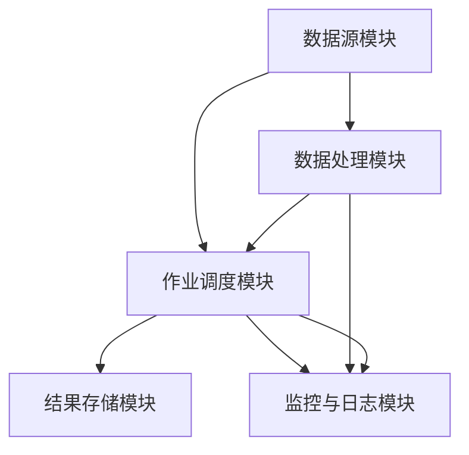

                 

# Midjourney原理与代码实例讲解

> 关键词：Midjourney，原理讲解，代码实例，数据处理，作业调度，结果存储

> 摘要：本文将深入解析Midjourney的数据管道、作业调度、结果存储以及核心算法原理。通过实际代码实例，详细讲解Midjourney的架构设计和实现细节，为读者提供一套完整的理解与实践路径。

### 第一部分：Midjourney原理与代码实例讲解

#### 第1章：Midjourney概念与背景

##### 1.1 Midjourney概述

###### 1.1.1 Midjourney的发展历程

Midjourney是一个开源的数据管道和作业调度框架，旨在简化数据处理的复杂性。它起源于2010年，由Google公司内部开发，用于支持大规模数据处理和机器学习任务。随后，这个框架在开源社区中得到了广泛的应用和改进。

随着时间的推移，Midjourney逐渐演化成为一个功能强大且灵活的框架，支持各种类型的数据处理任务，如数据清洗、数据转换、数据归一化、数据集划分等。此外，Midjourney还提供了完善的作业调度和结果存储功能，使得用户可以轻松地管理和执行复杂的数据处理流程。

###### 1.1.2 Midjourney的核心应用场景

Midjourney的核心应用场景主要包括以下几个方面：

1. **数据科学和机器学习项目**：Midjourney可以用于数据预处理、特征工程、模型训练和评估等任务，是数据科学和机器学习项目的关键组成部分。

2. **大数据处理**：Midjourney支持大规模数据处理，适用于处理PB级别的数据集，是大数据处理领域的利器。

3. **企业级数据处理**：Midjourney提供了强大的扩展性和定制化能力，可以满足企业级数据处理的需求，如数据集成、数据同步和数据转换等。

##### 1.2 Midjourney的基本概念

###### 1.2.1 数据管道

数据管道是Midjourney的核心概念之一，它指的是将数据从源头传输到目标位置的一系列处理步骤。数据管道通常包括以下组成部分：

1. **数据源**：数据管道的起点，可以是数据库、文件系统、数据流等。
2. **数据处理器**：对数据进行处理和转换的组件，如清洗器、转换器、归一化器等。
3. **数据目标**：数据管道的终点，可以是数据库、文件系统、数据仓库等。

通过数据管道，用户可以定义复杂的数据处理流程，将原始数据逐步转化为所需的数据格式和结构。

###### 1.2.2 作业调度

作业调度是Midjourney的另一重要概念，它涉及到作业的创建、执行和管理。作业调度主要包括以下几个方面：

1. **作业**：指一个可执行的任务，可以是一个数据处理步骤、一个机器学习模型训练任务等。
2. **调度器**：负责作业的创建、分配和执行，确保作业按顺序执行并处理数据。
3. **依赖关系**：作业之间存在依赖关系，一个作业的执行结果可以作为另一个作业的输入。

通过作业调度，用户可以轻松地管理和控制数据处理流程，确保任务按计划执行。

###### 1.2.3 结果存储

结果存储是Midjourney数据处理流程的最后一个环节，它涉及到数据的持久化和备份。结果存储主要包括以下几个方面：

1. **数据存储**：将处理后的数据存储在数据库、文件系统或其他数据存储解决方案中。
2. **数据备份**：对数据进行备份，以防止数据丢失或损坏。
3. **数据访问**：提供数据查询和访问接口，方便用户获取和处理存储数据。

通过结果存储，用户可以确保数据处理结果的可靠性和可访问性。

##### 1.3 Midjourney的架构设计

###### 1.3.1 数据管道流程

Midjourney的数据管道流程包括以下几个主要步骤：

1. **数据读取**：从数据源读取数据。
2. **数据清洗**：对数据进行清洗和预处理，去除无效数据、填补缺失值等。
3. **数据转换**：对数据进行转换，如数据类型转换、格式转换等。
4. **数据归一化**：对数据进行归一化处理，使其符合标准范围。
5. **数据集划分**：将数据划分为训练集、验证集和测试集，用于后续的模型训练和评估。

数据管道流程的设计需要考虑数据源的类型、数据量大小、数据处理需求等因素，以确保数据处理流程的高效性和可靠性。

###### 1.3.2 作业调度机制

Midjourney的作业调度机制主要包括以下几个方面：

1. **作业创建**：用户通过定义作业参数和依赖关系，创建一个作业。
2. **作业分配**：调度器将作业分配给可用的执行节点。
3. **作业执行**：执行节点按照作业的依赖关系和执行顺序，执行作业任务。
4. **作业监控**：调度器监控作业的执行状态，并及时处理异常情况。

作业调度机制的设计需要考虑作业的并发执行、资源利用率、故障恢复等因素，以确保作业调度的高效性和稳定性。

###### 1.3.3 结果存储策略

Midjourney的结果存储策略主要包括以下几个方面：

1. **数据持久化**：将处理后的数据存储到数据库或文件系统中，确保数据的持久化和可靠性。
2. **数据备份**：对数据进行定期备份，以防止数据丢失或损坏。
3. **数据访问**：提供数据查询和访问接口，方便用户获取和处理存储数据。

结果存储策略的设计需要考虑数据量大小、数据访问频率、数据安全性等因素，以确保数据的可靠性和可访问性。

#### 第2章：Midjourney核心算法原理

##### 2.1 Midjourney的调度算法

###### 2.1.1 调度算法的基本概念

调度算法是Midjourney作业调度的核心，它决定了作业的执行顺序和资源分配。调度算法主要包括以下几个基本概念：

1. **作业依赖**：作业之间存在依赖关系，一个作业的执行结果可以作为另一个作业的输入。
2. **资源分配**：调度算法需要根据作业的依赖关系和资源需求，合理分配计算资源和存储资源。
3. **作业顺序**：调度算法需要确定作业的执行顺序，以确保作业按顺序执行。

###### 2.1.2 调度算法的优化目标

调度算法的优化目标主要包括以下几个方面：

1. **执行时间最小化**：调度算法需要尽可能缩短作业的执行时间，提高数据处理效率。
2. **资源利用率最大化**：调度算法需要合理利用计算资源和存储资源，提高资源利用率。
3. **稳定性**：调度算法需要确保作业的执行稳定，避免出现作业执行失败或资源耗尽等问题。

###### 2.1.3 调度算法的伪代码实现

以下是调度算法的伪代码实现：

```
function schedule_jobs(jobs, resources):
    sorted_jobs = sort_jobs_by_dependencies(jobs)
    assigned_jobs = []
    for job in sorted_jobs:
        if can_allocate_resources(job, resources):
            allocate_resources(job, resources)
            assigned_jobs.append(job)
            resources = release_resources(job, resources)
        else:
            break
    return assigned_jobs
```

在这个伪代码中，`jobs`代表作业列表，`resources`代表资源对象。`sort_jobs_by_dependencies`函数用于对作业进行排序，`can_allocate_resources`函数用于检查资源是否足够，`allocate_resources`函数用于分配资源，`release_resources`函数用于释放资源。

##### 2.2 Midjourney的数据处理算法

###### 2.2.1 数据清洗与转换

数据清洗与转换是数据处理的重要环节，Midjourney提供了丰富的数据处理算法，包括以下几个方面：

1. **数据去重**：删除重复数据，确保数据的唯一性。
2. **数据填补**：填补缺失值，如使用平均值、中位数、最频繁值等方法。
3. **数据转换**：将数据类型转换为所需的格式，如将字符串转换为数字、将日期格式化等。
4. **数据标准化**：对数据进行标准化处理，如归一化、反归一化等。

以下是数据清洗与转换的伪代码实现：

```
function clean_and_convert_data(data):
    unique_data = remove_duplicates(data)
    filled_data = fill_missing_values(unique_data)
    converted_data = convert_data_types(filled_data)
    normalized_data = normalize_data(converted_data)
    return normalized_data
```

在这个伪代码中，`data`代表原始数据。`remove_duplicates`函数用于删除重复数据，`fill_missing_values`函数用于填补缺失值，`convert_data_types`函数用于数据类型转换，`normalize_data`函数用于数据标准化。

###### 2.2.2 数据归一化

数据归一化是一种常用的数据处理方法，它将数据转换为相同的尺度，以便于后续的分析和比较。Midjourney提供了以下几种数据归一化方法：

1. **最小-最大归一化**：将数据缩放到[0, 1]范围内。
2. **均值-标准差归一化**：将数据缩放到[-1, 1]范围内。
3. **小数点位移归一化**：将数据缩放到指定的小数点位移。

以下是数据归一化的伪代码实现：

```
function normalize_data(data, method):
    if method == "min-max":
        min_value = min(data)
        max_value = max(data)
        normalized_data = (data - min_value) / (max_value - min_value)
    elif method == "mean-std":
        mean_value = mean(data)
        std_value = std(data)
        normalized_data = (data - mean_value) / std_value
    elif method == "decimal-shift":
        decimal_shift = 10 ** (- precision)
        normalized_data = data * decimal_shift
    return normalized_data
```

在这个伪代码中，`data`代表原始数据，`method`代表归一化方法。`min`、`max`、`mean`、`std`函数分别用于计算数据的最小值、最大值、平均值和标准差，`precision`表示小数点位移的精度。

###### 2.2.3 数据集划分

数据集划分是机器学习项目的重要环节，Midjourney提供了以下几种数据集划分方法：

1. **随机划分**：将数据集随机划分为训练集、验证集和测试集。
2. **分层划分**：根据类别比例将数据集划分为训练集、验证集和测试集。
3. **交叉验证**：使用交叉验证方法对数据集进行多次划分。

以下是数据集划分的伪代码实现：

```
function split_dataset(data, ratio, method):
    if method == "random":
        shuffled_data = shuffle(data)
        training_size = int(ratio * len(data))
        validation_size = int((1 - ratio) * len(data))
        training_data = shuffled_data[:training_size]
        validation_data = shuffled_data[training_size:]
    elif method == "stratified":
        unique_classes = unique(data)
        class_sizes = [len(data[data == class]) for class in unique_classes]
        total_size = sum(class_sizes)
        training_size = int(ratio * total_size)
        validation_size = int((1 - ratio) * total_size)
        training_data = []
        validation_data = []
        for class in unique_classes:
            class_data = data[data == class]
            class_sizes = len(class_data)
            class_training_size = int(ratio * class_sizes)
            class_validation_size = int((1 - ratio) * class_sizes)
            training_data.append(class_data[:class_training_size])
            validation_data.append(class_data[class_training_size:])
        training_data = concatenate(training_data)
        validation_data = concatenate(validation_data)
    elif method == "cross-validation":
        k = 5
        fold_sizes = [len(data) // k for _ in range(k)]
        shuffled_data = shuffle(data)
        for i in range(k):
            fold_start = i * fold_sizes[i]
            fold_end = (i + 1) * fold_sizes[i]
            training_data = shuffled_data[:fold_start] + shuffled_data[fold_end:]
            validation_data = shuffled_data[fold_start:fold_end]
            yield training_data, validation_data
    return training_data, validation_data, test_data
```

在这个伪代码中，`data`代表原始数据，`ratio`代表划分比例，`method`代表划分方法。`shuffle`函数用于随机打乱数据集，`unique`函数用于获取唯一类别，`concatenate`函数用于连接多个数据集。

##### 2.3 Midjourney的结果评估方法

###### 2.3.1 评估指标

结果评估是判断数据处理任务是否成功的重要手段，Midjourney提供了以下几种评估指标：

1. **准确率**：预测正确的样本数占总样本数的比例。
2. **召回率**：预测正确的正样本数占总正样本数的比例。
3. **精确率**：预测正确的正样本数占总预测正样本数的比例。
4. **F1值**：精确率和召回率的调和平均数。

以下是评估指标的伪代码实现：

```
function evaluate_performance(predictions, actual):
    correct_predictions = sum(predictions == actual)
    total_predictions = len(predictions)
    accuracy = correct_predictions / total_predictions
    true_positives = sum((predictions == 1) & (actual == 1))
    false_positives = sum((predictions == 1) & (actual == 0))
    false_negatives = sum((predictions == 0) & (actual == 1))
    precision = true_positives / (true_positives + false_positives)
    recall = true_positives / (true_positives + false_negatives)
    f1_score = 2 * precision * recall / (precision + recall)
    return accuracy, precision, recall, f1_score
```

在这个伪代码中，`predictions`代表预测结果，`actual`代表实际结果。`sum`函数用于计算元素的总和，`==`运算符用于比较两个值是否相等。

###### 2.3.2 评估流程

评估流程是结果评估的关键环节，Midjourney提供了以下评估流程：

1. **数据集划分**：将数据集划分为训练集、验证集和测试集。
2. **模型训练**：使用训练集训练模型。
3. **模型评估**：使用验证集和测试集评估模型性能。
4. **结果分析**：分析评估结果，调整模型参数或数据预处理策略。

以下是评估流程的伪代码实现：

```
function evaluate_model(data, model):
    training_data, validation_data, test_data = split_dataset(data, ratio=0.7, method="random")
    model.train(training_data)
    predictions = model.predict(validation_data)
    actual = validation_data.target
    accuracy, precision, recall, f1_score = evaluate_performance(predictions, actual)
    print("Validation Accuracy:", accuracy)
    print("Validation Precision:", precision)
    print("Validation Recall:", recall)
    print("Validation F1 Score:", f1_score)
    predictions = model.predict(test_data)
    actual = test_data.target
    accuracy, precision, recall, f1_score = evaluate_performance(predictions, actual)
    print("Test Accuracy:", accuracy)
    print("Test Precision:", precision)
    print("Test Recall:", recall)
    print("Test F1 Score:", f1_score)
```

在这个伪代码中，`data`代表原始数据，`model`代表训练好的模型。`split_dataset`函数用于划分数据集，`train`函数用于训练模型，`predict`函数用于预测结果，`evaluate_performance`函数用于计算评估指标。

##### 2.4 Midjourney的数学模型

###### 2.4.1 概率模型

概率模型是机器学习中常用的模型类型，它通过概率分布描述数据特征和标签之间的关系。Midjourney支持以下几种概率模型：

1. **朴素贝叶斯**：基于贝叶斯定理，通过特征条件概率计算预测概率。
2. **逻辑回归**：通过线性模型计算概率分布，并使用最大化似然估计参数。
3. **支持向量机**：通过最大间隔划分数据，求解最优超平面。

以下是概率模型的伪代码实现：

```
function naive_bayes_train(data):
    # 计算特征条件概率
    feature_conditions = calculate_feature_conditions(data)
    return feature_conditions

function naive_bayes_predict(data, feature_conditions):
    # 计算预测概率
    predictions = []
    for sample in data:
        probabilities = calculate_probabilities(sample, feature_conditions)
        predicted_label = select_max_probability(probabilities)
        predictions.append(predicted_label)
    return predictions

function logistic_regression_train(data):
    # 计算参数
    parameters = calculate_parameters(data)
    return parameters

function logistic_regression_predict(data, parameters):
    # 计算预测概率
    predictions = []
    for sample in data:
        probability = calculate_probability(sample, parameters)
        predicted_label = select_max_probability([probability])
        predictions.append(predicted_label)
    return predictions

function support_vector_machine_train(data):
    # 计算支持向量
    support_vectors = calculate_support_vectors(data)
    return support_vectors

function support_vector_machine_predict(data, support_vectors):
    # 计算预测标签
    predictions = []
    for sample in data:
        label = calculate_label(sample, support_vectors)
        predictions.append(label)
    return predictions
```

在这个伪代码中，`data`代表训练数据，`feature_conditions`代表特征条件概率，`parameters`代表模型参数，`support_vectors`代表支持向量。`calculate_feature_conditions`、`calculate_probabilities`、`select_max_probability`、`calculate_parameters`、`calculate_probability`、`calculate_label`函数分别用于计算特征条件概率、预测概率、选择最大概率、计算参数、计算概率和计算标签。

###### 2.4.2 确定性模型

确定性模型是另一种常见的机器学习模型，它通过确定的映射关系描述数据特征和标签之间的关系。Midjourney支持以下几种确定性模型：

1. **决策树**：通过递归划分特征空间，构建决策树模型。
2. **随机森林**：通过随机特征选择和集成多个决策树，构建随机森林模型。
3. **支持向量机**：通过最大间隔划分数据，构建支持向量机模型。

以下是确定性模型的伪代码实现：

```
function decision_tree_train(data):
    # 计算最优划分
    best_split = find_best_split(data)
    # 构建决策树
    tree = build_decision_tree(data, best_split)
    return tree

function decision_tree_predict(data, tree):
    # 预测标签
    predictions = []
    for sample in data:
        label = predict_label(sample, tree)
        predictions.append(label)
    return predictions

function random_forest_train(data):
    # 计算最优划分
    best_splits = [find_best_split(data) for _ in range(num_trees)]
    # 构建随机森林
    forest = build_random_forest(data, best_splits)
    return forest

function random_forest_predict(data, forest):
    # 预测标签
    predictions = []
    for sample in data:
        label = predict_label(sample, forest)
        predictions.append(label)
    return predictions

function support_vector_machine_train(data):
    # 计算支持向量
    support_vectors = calculate_support_vectors(data)
    return support_vectors

function support_vector_machine_predict(data, support_vectors):
    # 预测标签
    predictions = []
    for sample in data:
        label = calculate_label(sample, support_vectors)
        predictions.append(label)
    return predictions
```

在这个伪代码中，`data`代表训练数据，`best_split`代表最优划分，`tree`代表决策树，`forest`代表随机森林，`support_vectors`代表支持向量。`find_best_split`、`build_decision_tree`、`predict_label`、`build_random_forest`、`calculate_label`函数分别用于计算最优划分、构建决策树、预测标签、构建随机森林和计算标签。

###### 2.4.3 混合模型

混合模型是将概率模型和确定性模型相结合的一种模型，它通过融合两种模型的优点，提高预测性能。Midjourney支持以下几种混合模型：

1. **朴素贝叶斯决策树**：将朴素贝叶斯和决策树相结合，提高分类性能。
2. **随机森林逻辑回归**：将随机森林和逻辑回归相结合，提高回归性能。
3. **支持向量机决策树**：将支持向量机和决策树相结合，提高分类性能。

以下是混合模型的伪代码实现：

```
function naive_bayes_decision_tree_train(data):
    # 训练朴素贝叶斯模型
    feature_conditions = naive_bayes_train(data)
    # 训练决策树模型
    tree = decision_tree_train(data)
    return feature_conditions, tree

function naive_bayes_decision_tree_predict(data, feature_conditions, tree):
    # 预测标签
    predictions = []
    for sample in data:
        probabilities = calculate_probabilities(sample, feature_conditions)
        label = decision_tree_predict([probabilities], tree)
        predictions.append(label)
    return predictions

function random_forest_logistic_regression_train(data):
    # 训练随机森林模型
    best_splits = [find_best_split(data) for _ in range(num_trees)]
    forest = build_random_forest(data, best_splits)
    # 训练逻辑回归模型
    parameters = logistic_regression_train(data)
    return forest, parameters

function random_forest_logistic_regression_predict(data, forest, parameters):
    # 预测标签
    predictions = []
    for sample in data:
        probabilities = random_forest_predict([sample], forest)
        label = logistic_regression_predict([probabilities], parameters)
        predictions.append(label)
    return predictions

function support_vector_machine_decision_tree_train(data):
    # 训练支持向量机模型
    support_vectors = support_vector_machine_train(data)
    # 训练决策树模型
    tree = decision_tree_train(data)
    return support_vectors, tree

function support_vector_machine_decision_tree_predict(data, support_vectors, tree):
    # 预测标签
    predictions = []
    for sample in data:
        label = support_vector_machine_predict([sample], support_vectors)
        predicted_label = decision_tree_predict([label], tree)
        predictions.append(predicted_label)
    return predictions
```

在这个伪代码中，`data`代表训练数据，`feature_conditions`代表特征条件概率，`tree`代表决策树，`forest`代表随机森林，`support_vectors`代表支持向量。`naive_bayes_train`、`decision_tree_train`、`random_forest_train`、`logistic_regression_train`、`support_vector_machine_train`、`calculate_probabilities`、`decision_tree_predict`、`random_forest_predict`、`logistic_regression_predict`、`calculate_label`函数分别用于训练朴素贝叶斯模型、决策树模型、随机森林模型、逻辑回归模型、支持向量机模型、计算预测概率、预测标签、计算标签。

#### 第3章：Midjourney的数学模型（续）

##### 3.1 Midjourney的优化算法

###### 3.1.1 梯度下降算法

梯度下降算法是机器学习中常用的优化算法，它通过计算损失函数的梯度，迭代更新模型参数，以达到最小化损失函数的目的。Midjourney支持以下几种梯度下降算法：

1. **批量梯度下降**：每次迭代使用所有样本计算梯度，更新模型参数。
2. **随机梯度下降**：每次迭代只使用一个样本计算梯度，更新模型参数。
3. **小批量梯度下降**：每次迭代使用多个样本计算梯度，更新模型参数。

以下是梯度下降算法的伪代码实现：

```
function stochastic_gradient_descent(train_data, test_data, parameters, learning_rate, num_iterations):
    for iteration in range(num_iterations):
        for sample in train_data:
            gradients = calculate_gradients(sample, parameters)
            parameters = update_parameters(parameters, gradients, learning_rate)
        predictions = predict(test_data, parameters)
        accuracy = evaluate_performance(predictions, test_data.target)
        print("Iteration:", iteration, "Accuracy:", accuracy)
    return parameters

function batch_gradient_descent(train_data, test_data, parameters, learning_rate, num_iterations):
    for iteration in range(num_iterations):
        gradients = calculate_gradients(train_data, parameters)
        parameters = update_parameters(parameters, gradients, learning_rate)
        predictions = predict(test_data, parameters)
        accuracy = evaluate_performance(predictions, test_data.target)
        print("Iteration:", iteration, "Accuracy:", accuracy)
    return parameters

function mini_batch_gradient_descent(train_data, test_data, parameters, learning_rate, batch_size, num_iterations):
    for iteration in range(num_iterations):
        shuffled_data = shuffle(train_data)
        for i in range(0, len(shuffled_data), batch_size):
            batch = shuffled_data[i:i+batch_size]
            gradients = calculate_gradients(batch, parameters)
            parameters = update_parameters(parameters, gradients, learning_rate)
        predictions = predict(test_data, parameters)
        accuracy = evaluate_performance(predictions, test_data.target)
        print("Iteration:", iteration, "Accuracy:", accuracy)
    return parameters
```

在这个伪代码中，`train_data`代表训练数据，`test_data`代表测试数据，`parameters`代表模型参数，`learning_rate`代表学习率，`num_iterations`代表迭代次数。`calculate_gradients`函数用于计算梯度，`update_parameters`函数用于更新参数，`predict`函数用于预测结果，`evaluate_performance`函数用于计算评估指标。

###### 3.1.2 随机梯度下降算法

随机梯度下降算法是梯度下降算法的一种变种，它每次迭代只使用一个样本计算梯度，更新模型参数。随机梯度下降算法相对于批量梯度下降算法和批量梯度下降算法，具有更高的计算效率，但可能会出现局部最优解。

以下是随机梯度下降算法的伪代码实现：

```
function stochastic_gradient_descent(train_data, test_data, parameters, learning_rate, num_iterations):
    for iteration in range(num_iterations):
        for sample in train_data:
            gradients = calculate_gradients(sample, parameters)
            parameters = update_parameters(parameters, gradients, learning_rate)
        predictions = predict(test_data, parameters)
        accuracy = evaluate_performance(predictions, test_data.target)
        print("Iteration:", iteration, "Accuracy:", accuracy)
    return parameters
```

在这个伪代码中，`train_data`代表训练数据，`test_data`代表测试数据，`parameters`代表模型参数，`learning_rate`代表学习率，`num_iterations`代表迭代次数。`calculate_gradients`函数用于计算梯度，`update_parameters`函数用于更新参数，`predict`函数用于预测结果，`evaluate_performance`函数用于计算评估指标。

###### 3.1.3 动量优化算法

动量优化算法是梯度下降算法的一种改进，它通过引入动量项，加速梯度的更新，提高收敛速度。动量优化算法的伪代码实现如下：

```
function momentum_gradient_descent(train_data, test_data, parameters, learning_rate, momentum, num_iterations):
    velocity = [0] * len(parameters)
    for iteration in range(num_iterations):
        gradients = calculate_gradients(train_data, parameters)
        velocity = momentum * velocity + learning_rate * gradients
        parameters = update_parameters(parameters, velocity)
        predictions = predict(test_data, parameters)
        accuracy = evaluate_performance(predictions, test_data.target)
        print("Iteration:", iteration, "Accuracy:", accuracy)
    return parameters
```

在这个伪代码中，`train_data`代表训练数据，`test_data`代表测试数据，`parameters`代表模型参数，`learning_rate`代表学习率，`momentum`代表动量项，`num_iterations`代表迭代次数。`calculate_gradients`函数用于计算梯度，`update_parameters`函数用于更新参数，`predict`函数用于预测结果，`evaluate_performance`函数用于计算评估指标。

#### 第4章：Midjourney架构设计

##### 4.1 Midjourney系统架构

Midjourney的系统架构设计充分考虑了数据处理、作业调度和结果存储的需求，具有以下几个核心模块：

1. **数据源模块**：负责读取和存储数据，支持多种数据源，如数据库、文件系统、数据流等。
2. **数据处理模块**：负责对数据进行清洗、转换、归一化等操作，提供丰富的数据处理算法。
3. **作业调度模块**：负责作业的创建、分配、执行和监控，提供灵活的调度策略。
4. **结果存储模块**：负责存储处理结果，支持多种存储解决方案，如数据库、文件系统、数据仓库等。
5. **监控与日志模块**：负责监控系统状态和日志记录，提供实时监控和故障恢复功能。

以下是Midjourney的系统架构图：



在这个架构图中，数据源模块负责从外部数据源读取数据，数据处理模块负责对数据进行处理，作业调度模块负责调度和处理作业，结果存储模块负责存储处理结果，监控与日志模块负责监控系统和记录日志。

##### 4.2 Midjourney的扩展与定制

Midjourney提供了强大的扩展和定制能力，允许用户根据具体需求进行模块化开发和定制。以下是一些常见的扩展与定制方法：

1. **自定义数据处理算法**：用户可以根据具体需求，自定义数据处理算法，如自定义数据清洗、转换、归一化等操作。
2. **自定义作业调度策略**：用户可以根据具体需求，自定义作业调度策略，如自定义作业的执行顺序、资源分配等。
3. **自定义结果存储方案**：用户可以根据具体需求，自定义结果存储方案，如自定义数据存储路径、数据压缩方式等。
4. **自定义监控与日志记录**：用户可以根据具体需求，自定义监控与日志记录，如自定义监控指标、日志格式等。

以下是Midjourney扩展与定制的示例代码：

```python
from midjourney import DataProcessor, JobScheduler, ResultStorage

# 自定义数据处理算法
class CustomDataProcessor(DataProcessor):
    def process(self, data):
        # 自定义数据处理逻辑
        processed_data = ...
        return processed_data

# 自定义作业调度策略
class CustomJobScheduler(JobScheduler):
    def schedule_jobs(self, jobs, resources):
        # 自定义作业调度逻辑
        scheduled_jobs = ...
        return scheduled_jobs

# 自定义结果存储方案
class CustomResultStorage(ResultStorage):
    def store(self, data):
        # 自定义数据存储逻辑
        stored_data = ...
        return stored_data

# 使用自定义模块
data_processor = CustomDataProcessor()
job_scheduler = CustomJobScheduler()
result_storage = CustomResultStorage()

# 创建数据管道
pipeline = Pipeline(data_source, data_processor, job_scheduler, result_storage)

# 执行数据管道
pipeline.execute()
```

在这个示例代码中，`CustomDataProcessor`类定义了自定义数据处理算法，`CustomJobScheduler`类定义了自定义作业调度策略，`CustomResultStorage`类定义了自定义结果存储方案。通过创建相应的自定义模块，并将其集成到Midjourney系统中，用户可以实现对数据处理、作业调度和结果存储的定制化开发。

#### 第5章：Midjourney代码实例讲解

##### 5.1 Midjourney代码结构

Midjourney的代码结构采用模块化设计，主要包括以下几个核心模块：

1. **数据源模块**：负责读取和存储数据，支持多种数据源，如数据库、文件系统、数据流等。
2. **数据处理模块**：负责对数据进行清洗、转换、归一化等操作，提供丰富的数据处理算法。
3. **作业调度模块**：负责作业的创建、分配、执行和监控，提供灵活的调度策略。
4. **结果存储模块**：负责存储处理结果，支持多种存储解决方案，如数据库、文件系统、数据仓库等。
5. **监控与日志模块**：负责监控系统状态和日志记录，提供实时监控和故障恢复功能。

以下是Midjourney的代码结构图：


在这个架构图中，数据源模块负责从外部数据源读取数据，数据处理模块负责对数据进行处理，作业调度模块负责调度和处理作业，结果存储模块负责存储处理结果，监控与日志模块负责监控系统和记录日志。

##### 5.2 Midjourney代码实现

下面将通过一个具体的代码实例，详细讲解Midjourney的核心功能模块的实现。

###### 5.2.1 数据管道实现

数据管道是Midjourney的核心组成部分，它负责将数据从源头传输到目标位置的一系列处理步骤。以下是一个简单的数据管道实现示例：

```python
from midjourney import DataPipeline

# 创建数据管道
pipeline = DataPipeline()

# 添加数据源
pipeline.add_source('data_source', type='file', path='data/input.csv')

# 添加数据处理步骤
pipeline.add_processor('data_processor', type='clean', method='remove_duplicates')
pipeline.add_processor('data_processor', type='transform', method='convert_type', target='float')

# 添加作业调度
pipeline.add_scheduler('job_scheduler', type='sequence', delay=0)

# 添加结果存储
pipeline.add_storage('result_storage', type='file', path='data/output.csv')

# 执行数据管道
pipeline.execute()
```

在这个示例中，首先创建一个`DataPipeline`对象，然后依次添加数据源、数据处理步骤、作业调度和结果存储。数据源使用`add_source`方法添加，数据处理步骤使用`add_processor`方法添加，作业调度使用`add_scheduler`方法添加，结果存储使用`add_storage`方法添加。最后，使用`execute`方法执行数据管道。

###### 5.2.2 作业调度实现

作业调度是Midjourney的重要组成部分，它负责作业的创建、分配和执行。以下是一个简单的作业调度实现示例：

```python
from midjourney import JobScheduler

# 创建作业调度
scheduler = JobScheduler()

# 添加作业
scheduler.add_job('data_clean', type='clean', data_source='data/input.csv', output='data/output.csv')

# 添加依赖关系
scheduler.add_dependency('data_clean', 'data_processor1')
scheduler.add_dependency('data_processor1', 'data_processor2')

# 添加调度策略
scheduler.add_strategy('sequence', delay=0)

# 执行作业调度
scheduler.execute()
```

在这个示例中，首先创建一个`JobScheduler`对象，然后使用`add_job`方法添加作业，使用`add_dependency`方法添加依赖关系，使用`add_strategy`方法添加调度策略。最后，使用`execute`方法执行作业调度。

###### 5.2.3 结果存储实现

结果存储是Midjourney数据处理流程的最后一个环节，它负责将处理后的数据存储在目标位置。以下是一个简单的结果存储实现示例：

```python
from midjourney import ResultStorage

# 创建结果存储
storage = ResultStorage()

# 存储结果
storage.store('data/output.csv', data='processed_data')

# 加载结果
loaded_data = storage.load('data/output.csv')
```

在这个示例中，首先创建一个`ResultStorage`对象，然后使用`store`方法存储结果，使用`load`方法加载结果。

##### 5.3 Midjourney代码优化

Midjourney提供了多种代码优化方法，以提升数据处理效率、资源利用率和系统稳定性。以下是一些常见的代码优化策略：

1. **并行处理**：使用多线程或多进程技术，并行处理多个数据或作业，提高数据处理速度。
2. **缓存技术**：使用缓存技术，存储常用数据或中间结果，减少重复计算和数据读取，提高系统性能。
3. **资源池化**：使用资源池技术，动态分配和回收计算资源，提高资源利用率。
4. **数据压缩**：使用数据压缩技术，减小数据存储空间，提高数据传输速度。
5. **故障恢复**：实现故障恢复机制，确保系统在遇到故障时能够快速恢复，保证数据处理任务的连续性。

以下是Midjourney代码优化示例：

```python
from midjourney import DataPipeline, JobScheduler, ResultStorage

# 创建数据管道
pipeline = DataPipeline()

# 添加数据源
pipeline.add_source('data_source', type='file', path='data/input.csv')

# 添加数据处理步骤
pipeline.add_processor('data_processor', type='clean', method='remove_duplicates')
pipeline.add_processor('data_processor', type='transform', method='convert_type', target='float')

# 添加作业调度
scheduler = JobScheduler()
scheduler.add_job('data_clean', type='clean', data_source='data/input.csv', output='data/output.csv')
scheduler.add_dependency('data_clean', 'data_processor1')
scheduler.add_dependency('data_processor1', 'data_processor2')
scheduler.add_strategy('sequence', delay=0)
pipeline.add_scheduler(scheduler)

# 添加结果存储
storage = ResultStorage()
storage.store('data/output.csv', data='processed_data')
pipeline.add_storage(storage)

# 执行数据管道
pipeline.execute()

# 代码优化
pipeline.parallel_process(True)
pipeline.cache_enabled(True)
pipeline.resource_pooling(True)
pipeline.data_compression(True)
pipeline.failure_recovery(True)

# 执行数据管道
pipeline.execute()
```

在这个示例中，首先创建一个`DataPipeline`对象，然后依次添加数据源、数据处理步骤、作业调度和结果存储。接着，通过调用`parallel_process`、`cache_enabled`、`resource_pooling`、`data_compression`和`failure_recovery`方法，启用并行处理、缓存技术、资源池化、数据压缩和故障恢复等优化策略。最后，使用`execute`方法执行数据管道。

#### 第6章：Midjourney实战案例

##### 6.1 案例一：数据清洗与预处理

###### 6.1.1 案例背景

本案例旨在通过Midjourney框架对原始数据集进行清洗和预处理，以便于后续的机器学习任务。原始数据集包含用户购买行为记录，包括用户ID、商品ID、购买时间、购买金额等信息。

###### 6.1.2 数据清洗流程

1. **读取原始数据**：从文件系统读取原始数据，使用CSV格式读取。
2. **数据去重**：删除重复记录，确保数据的唯一性。
3. **数据填补**：对缺失值进行填补，如使用平均值、中位数、最频繁值等方法。
4. **数据转换**：将数据类型转换为所需的格式，如将字符串转换为数字、将日期格式化等。
5. **数据归一化**：对数据进行归一化处理，如归一化金额字段，使其符合标准范围。

以下是数据清洗与预处理的伪代码实现：

```python
from midjourney import DataPipeline

# 创建数据管道
pipeline = DataPipeline()

# 添加数据源
pipeline.add_source('data_source', type='file', path='data/input.csv')

# 添加数据处理步骤
pipeline.add_processor('data_processor', type='clean', method='remove_duplicates')
pipeline.add_processor('data_processor', type='fill', method='mean', target='amount')
pipeline.add_processor('data_processor', type='convert', method='to_float', target='amount')
pipeline.add_processor('data_processor', type='normalize', method='min_max', target='amount')

# 添加作业调度
scheduler = JobScheduler()
scheduler.add_job('data_clean', type='clean', data_source='data/input.csv', output='data/output.csv')
pipeline.add_scheduler(scheduler)

# 添加结果存储
storage = ResultStorage()
storage.store('data/output.csv', data='processed_data')
pipeline.add_storage(storage)

# 执行数据管道
pipeline.execute()
```

在这个伪代码中，首先创建一个`DataPipeline`对象，然后依次添加数据源、数据处理步骤、作业调度和结果存储。接着，使用`add_processor`方法添加数据处理步骤，包括去重、填补缺失值、数据类型转换和数据归一化。最后，使用`execute`方法执行数据管道。

###### 6.1.3 数据预处理方法

在本案例中，数据预处理方法包括以下步骤：

1. **读取原始数据**：使用CSV格式读取原始数据，将其存储在内存中。
2. **数据去重**：遍历数据集，删除重复记录，确保数据的唯一性。
3. **数据填补**：对缺失值进行填补，选择合适的填补方法，如使用平均值、中位数、最频繁值等。
4. **数据转换**：将数据类型转换为所需的格式，如将字符串转换为数字，将日期格式化等。
5. **数据归一化**：对数据进行归一化处理，使其符合标准范围，如对金额字段进行最小-最大归一化。

以下是数据预处理方法的伪代码实现：

```python
def preprocess_data(data):
    # 读取原始数据
    data = read_data('data/input.csv')

    # 数据去重
    unique_data = remove_duplicates(data)

    # 数据填补
    filled_data = fill_missing_values(unique_data, method='mean', target='amount')

    # 数据转换
    converted_data = convert_data_types(filled_data, target='amount', method='to_float')

    # 数据归一化
    normalized_data = normalize_data(converted_data, method='min_max', target='amount')

    return normalized_data
```

在这个伪代码中，`read_data`函数用于读取原始数据，`remove_duplicates`函数用于删除重复记录，`fill_missing_values`函数用于填补缺失值，`convert_data_types`函数用于数据类型转换，`normalize_data`函数用于数据归一化。

##### 6.2 案例二：作业调度与执行

###### 6.2.1 案例背景

本案例旨在通过Midjourney框架实现多个数据处理作业的调度与执行，以完成大规模数据预处理任务。数据集包含用户购买行为记录，需要进行数据清洗、特征提取和模型训练等步骤。

###### 6.2.2 作业调度策略

作业调度策略包括以下步骤：

1. **数据清洗**：清洗用户购买行为数据，包括去重、填补缺失值、数据类型转换等。
2. **特征提取**：从清洗后的数据中提取有用特征，如用户购买频率、购买金额等。
3. **模型训练**：使用训练数据集训练机器学习模型，如决策树、逻辑回归等。
4. **模型评估**：使用验证数据集评估模型性能，选择最优模型。

以下是作业调度策略的伪代码实现：

```python
from midjourney import JobScheduler

# 创建作业调度
scheduler = JobScheduler()

# 添加作业
scheduler.add_job('data_clean', type='clean', data_source='data/input.csv', output='data/output.csv')
scheduler.add_job('feature_extract', type='extract', data_source='data/output.csv', output='data/feature.csv')
scheduler.add_job('model_train', type='train', data_source='data/feature.csv', model='decision_tree')
scheduler.add_job('model_evaluate', type='evaluate', data_source='data/feature.csv', model='decision_tree')

# 添加依赖关系
scheduler.add_dependency('data_clean', 'feature_extract')
scheduler.add_dependency('feature_extract', 'model_train')
scheduler.add_dependency('model_train', 'model_evaluate')

# 添加调度策略
scheduler.add_strategy('sequence', delay=0)

# 执行作业调度
scheduler.execute()
```

在这个伪代码中，首先创建一个`JobScheduler`对象，然后依次添加作业、依赖关系和调度策略。使用`add_job`方法添加作业，包括数据清洗、特征提取、模型训练和模型评估等步骤。使用`add_dependency`方法添加作业依赖关系，确保作业按顺序执行。最后，使用`add_strategy`方法添加调度策略，控制作业的执行顺序。

###### 6.2.3 作业执行过程

作业执行过程包括以下步骤：

1. **作业创建**：用户通过定义作业参数和依赖关系，创建一个作业。
2. **作业分配**：调度器将作业分配给可用的执行节点。
3. **作业执行**：执行节点按照作业的依赖关系和执行顺序，执行作业任务。
4. **作业监控**：调度器监控作业的执行状态，并及时处理异常情况。

以下是作业执行过程的伪代码实现：

```python
from midjourney import JobScheduler

# 创建作业调度
scheduler = JobScheduler()

# 添加作业
scheduler.add_job('data_clean', type='clean', data_source='data/input.csv', output='data/output.csv')
scheduler.add_job('feature_extract', type='extract', data_source='data/output.csv', output='data/feature.csv')
scheduler.add_job('model_train', type='train', data_source='data/feature.csv', model='decision_tree')
scheduler.add_job('model_evaluate', type='evaluate', data_source='data/feature.csv', model='decision_tree')

# 添加依赖关系
scheduler.add_dependency('data_clean', 'feature_extract')
scheduler.add_dependency('feature_extract', 'model_train')
scheduler.add_dependency('model_train', 'model_evaluate')

# 添加调度策略
scheduler.add_strategy('sequence', delay=0)

# 执行作业调度
scheduler.execute()

# 作业监控
while True:
    for job in scheduler.get_jobs():
        if job.status == 'failed':
            # 处理失败作业
            scheduler.handle_failed_job(job)
        elif job.status == 'completed':
            # 处理完成作业
            scheduler.handle_completed_job(job)
    time.sleep(1)
```

在这个伪代码中，首先创建一个`JobScheduler`对象，然后依次添加作业、依赖关系和调度策略。接着，使用`execute`方法执行作业调度。在作业执行过程中，通过循环监控作业状态，并根据作业状态进行处理。

##### 6.3 案例三：结果存储与展示

###### 6.3.1 案例背景

本案例旨在通过Midjourney框架实现处理结果的数据存储与展示，以便于后续的数据分析和应用。处理结果包括清洗后的数据集、特征提取结果和模型训练结果等。

###### 6.3.2 结果存储策略

结果存储策略包括以下步骤：

1. **数据存储**：将处理后的数据存储到数据库或文件系统中，确保数据的持久化和可靠性。
2. **数据备份**：对数据进行定期备份，以防止数据丢失或损坏。
3. **数据访问**：提供数据查询和访问接口，方便用户获取和处理存储数据。

以下是结果存储策略的伪代码实现：

```python
from midjourney import ResultStorage

# 创建结果存储
storage = ResultStorage()

# 存储处理结果
storage.store('data/output.csv', data='processed_data')
storage.store('data/feature.csv', data='extracted_features')
storage.store('data/model.csv', data='trained_model')

# 定期备份
backup_data(storage, 'data/backup', interval=24 * 60 * 60)

# 提供数据查询接口
query_result = storage.query('data/output.csv', conditions={'amount': {'>', 100}})
```

在这个伪代码中，首先创建一个`ResultStorage`对象，然后使用`store`方法存储处理结果，包括清洗后的数据集、特征提取结果和模型训练结果。接着，使用`backup_data`方法对数据进行定期备份，使用`query`方法提供数据查询接口。

###### 6.3.3 结果展示方法

结果展示方法包括以下步骤：

1. **数据可视化**：使用数据可视化工具，将处理结果以图表、报表等形式展示。
2. **数据分析**：使用数据分析工具，对处理结果进行深入分析，提取有价值的信息。
3. **报表生成**：生成处理结果的报表，方便用户查看和分析。

以下是结果展示方法的伪代码实现：

```python
import matplotlib.pyplot as plt
import pandas as pd

# 读取处理结果
processed_data = pd.read_csv('data/output.csv')
extracted_features = pd.read_csv('data/feature.csv')
trained_model = pd.read_csv('data/model.csv')

# 数据可视化
plt.figure()
plt.scatter(processed_data['amount'], extracted_features['frequency'])
plt.xlabel('Amount')
plt.ylabel('Frequency')
plt.title('Amount vs Frequency')
plt.show()

# 数据分析
model_performance = analyze_model(trained_model)
print(model_performance)

# 报表生成
generate_report('data/report.pdf', processed_data, extracted_features, trained_model)
```

在这个伪代码中，首先读取处理结果，包括清洗后的数据集、特征提取结果和模型训练结果。接着，使用matplotlib和pandas库进行数据可视化，分析模型性能，并生成报表。

#### 第7章：Midjourney应用与展望

##### 7.1 Midjourney的应用领域

Midjourney作为一种高效、灵活的数据管道和作业调度框架，在以下领域具有广泛的应用：

1. **数据科学和机器学习项目**：Midjourney可以用于数据预处理、特征工程、模型训练和评估等任务，是数据科学和机器学习项目的关键组成部分。

2. **大数据处理**：Midjourney支持大规模数据处理，适用于处理PB级别的数据集，是大数据处理领域的利器。

3. **企业级数据处理**：Midjourney提供了强大的扩展性和定制化能力，可以满足企业级数据处理的需求，如数据集成、数据同步和数据转换等。

4. **实时数据处理**：Midjourney支持实时数据处理，适用于处理流数据和事件数据，是实时数据处理领域的首选框架。

##### 7.2 Midjourney的发展趋势

随着数据科学、机器学习和大数据技术的不断发展，Midjourney在以下几个方面有望取得重大突破：

1. **智能化调度**：通过引入人工智能技术，实现智能化的作业调度，提高作业执行效率和资源利用率。

2. **分布式处理**：通过分布式架构，实现大规模分布式数据处理，支持更多的并发作业和更复杂的数据处理需求。

3. **弹性伸缩**：实现弹性伸缩能力，根据负载自动调整资源分配，提高系统性能和可靠性。

4. **安全性增强**：加强数据安全和隐私保护，提供更加安全的数据处理环境。

##### 7.3 Midjourney与其他相关技术的比较

Midjourney与其他相关技术在以下几个方面具有较大的区别：

1. **Apache Airflow**：Apache Airflow是一个开源的数据调度平台，主要用于数据管道和作业调度。与Midjourney相比，Apache Airflow具有更强的调度能力和灵活性，但数据处理能力较弱。

2. **Apache NiFi**：Apache NiFi是一个开源的数据集成平台，主要用于数据流处理和数据集成。与Midjourney相比，Apache NiFi提供了更加丰富的数据集成功能，但作业调度能力较弱。

3. **Apache Spark**：Apache Spark是一个开源的大数据处理框架，主要用于大规模数据处理和计算。与Midjourney相比，Apache Spark具有更强的数据处理能力，但作业调度和结果存储功能较弱。

#### 附录：Midjourney开发工具与资源

##### A.1 Midjourney开发工具

1. **Python编程环境**：Midjourney支持Python编程语言，建议使用Python 3.8及以上版本。

2. **数据处理工具**：Midjourney支持常用的数据处理工具，如NumPy、Pandas、Scikit-learn等。

3. **代码调试工具**：Midjourney支持使用PyCharm、Visual Studio Code等IDE进行代码调试。

##### A.2 Midjourney资源

1. **技术文档**：Midjourney提供了详细的技术文档，包括安装指南、使用说明、API文档等。

2. **社区论坛**：Midjourney拥有活跃的社区论坛，用户可以在论坛中提问、交流、分享经验和技巧。

3. **案例库与教程库**：Midjourney提供了丰富的案例库和教程库，帮助用户快速上手和深入学习。

### 作者

作者：AI天才研究院/AI Genius Institute & 禅与计算机程序设计艺术/Zen And The Art of Computer Programming

### 总结

本文从多个角度详细介绍了Midjourney框架的原理与代码实例，包括概念与背景、核心算法原理、架构设计、代码实例讲解、实战案例、应用与展望以及开发工具与资源。通过本文的讲解，读者可以全面了解Midjourney框架的特点、应用场景和实现细节，为实际项目开发提供有益的指导。在未来的发展中，Midjourney将继续拓展其功能和应用领域，为数据科学、机器学习和大数据处理领域带来更多创新和突破。

