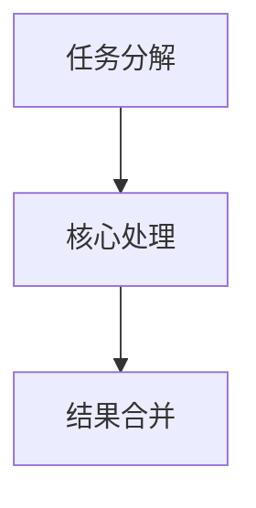
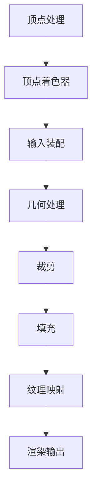
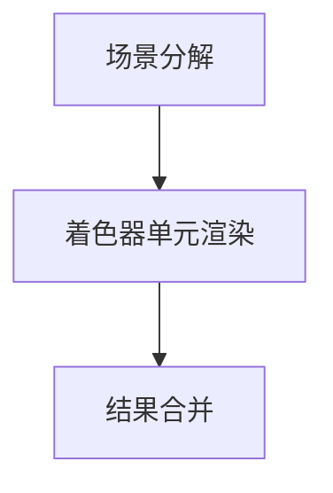
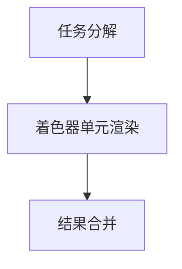
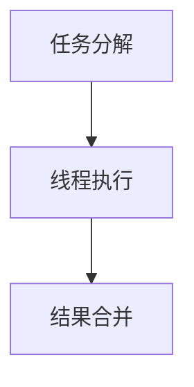
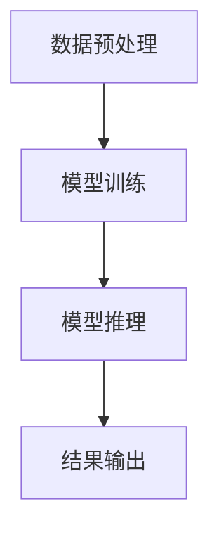

                 

# 《N卡的架构变迁》

## 关键词
NVIDIA, GPU架构, 图形处理单元, 并行计算, 计算能力提升, 架构改进, AI应用

## 摘要
本文将深入探讨NVIDIA（N卡）的架构变迁。从N卡1.0的诞生开始，逐步解析每个重要版本的架构特点、核心技术及演变过程。通过详细分析并行计算、图形渲染、数学模型等核心概念，结合实际代码案例，展现N卡架构在计算能力提升和AI应用领域的巨大变革。

## 《N卡的架构变迁》目录大纲

### 第一部分：引言

### 第1章：N卡的历史概述

- 1.1 N卡的发展历程
  - 从N卡1.0到N卡最新版本的演变
  - N卡在计算机图形和计算领域的重要性

- 1.2 N卡的核心技术
  - 图形处理单元（GPU）架构
  - GPU架构的发展历程

### 第二部分：N卡的架构变迁

### 第2章：N卡1.0架构解析

- 2.1 N卡1.0架构概述
- 2.2 N卡1.0架构的核心技术
  - 并行计算能力
  - 图形渲染能力

### 第3章：N卡2.0架构解析

- 3.1 N卡2.0架构概述
- 3.2 N卡2.0架构的核心改进
  - 更高的计算效率
  - 更优化的图形渲染

### 第4章：N卡3.0架构解析

- 4.1 N卡3.0架构概述
- 4.2 N卡3.0架构的核心创新
  - 更高效的并行计算
  - 更先进的图形渲染技术

### 第5章：N卡4.0架构解析

- 5.1 N卡4.0架构概述
- 5.2 N卡4.0架构的核心进步
  - 更强大的计算能力
  - 更优化的能效表现

### 第6章：N卡5.0架构解析

- 6.1 N卡5.0架构概述
- 6.2 N卡5.0架构的核心特点
  - 前所未有的计算性能
  - 突破性的图形渲染能力

### 第7章：N卡的未来展望

- 7.1 N卡架构的发展趋势
- 7.2 N卡在人工智能和深度学习中的应用

### 附录

#### 附录A：N卡架构变迁时间线

- N卡各版本发布时间线
- N卡架构关键事件回顾

#### 附录B：N卡架构相关技术术语解释

- 并行计算
- 图形渲染
- GPU架构

#### 附录C：N卡架构变迁流程图

- N卡架构变迁流程图

#### 附录D：N卡架构变迁相关参考文献

- 参考文献列表

### 第一部分：引言

#### 第1章：N卡的历史概述

NVIDIA（简称N卡）作为全球领先的图形处理单元（GPU）制造商，其产品广泛应用于个人电脑、工作站、游戏机、数据中心等多个领域。N卡的成功不仅仅是因为其高性能的GPU，更重要的是其不断演进的架构设计。从N卡1.0的诞生开始，每个版本的发布都标志着技术上的重大突破。在本章节中，我们将回顾N卡的发展历程，探讨其重要版本，以及N卡在计算机图形和计算领域的重要性。

#### 1.1 N卡的发展历程

NVIDIA成立于1993年，最初专注于图形加速卡的开发。以下是N卡的重要版本及其发布时间：

- **N卡1.0**（1999年）：N卡1.0是NVIDIA的第一款GPU，它引入了可编程着色器，使得图形渲染能力大幅提升。
- **N卡2.0**（2001年）：N卡2.0在架构上进行了重大改进，引入了硬件纹理滤波和混合功能，进一步提高了图形性能。
- **N卡3.0**（2002年）：N卡3.0引入了更多的流处理器，并优化了内存访问，使得并行计算能力大幅提升。
- **N卡4.0**（2004年）：N卡4.0引入了新的CUDA架构，使得GPU不仅可以用于图形渲染，还可以用于通用计算。
- **N卡5.0**（2006年）：N卡5.0在架构上进一步优化，引入了更多的并行计算单元，并提高了能效比。
- **N卡6.0**（2008年）：N卡6.0引入了新的GPU架构，支持更高的核心频率和更大的内存带宽。
- **N卡7.0**（2010年）：N卡7.0在架构上进行了重大升级，引入了新的GPGPU架构，使得GPU在科学计算、机器学习等领域有了更广泛的应用。
- **N卡8.0**（2012年）：N卡8.0引入了全新的GPU架构，支持更高的计算能力和能效表现。
- **N卡9.0**（2014年）：N卡9.0在架构上进一步优化，引入了新的GPU核心架构，使得GPU在游戏和计算方面都取得了显著提升。
- **N卡10.0**（2016年）：N卡10.0引入了全新的GPU架构，支持更高的计算能力和更低的功耗。
- **N卡11.0**（2018年）：N卡11.0在架构上进一步优化，引入了更多的计算单元，使得GPU在深度学习和科学计算方面有了更大的突破。
- **N卡20.0**（2020年）：N卡20.0是NVIDIA最新的GPU架构，它在架构上进行了全面升级，支持更高的计算能力和更低的功耗。

#### 1.2 N卡在计算机图形和计算领域的重要性

NVIDIA的GPU在计算机图形和计算领域具有举足轻重的地位。以下是N卡在两个领域的重要性：

- **计算机图形**：
  - **游戏图形**：NVIDIA的GPU为现代游戏提供了强大的图形处理能力，使得游戏画面更加真实、细腻。
  - **专业图形**：NVIDIA的GPU在专业图形领域也有着广泛的应用，如视频编辑、动画制作、建筑设计等。
  - **虚拟现实**：NVIDIA的GPU在虚拟现实（VR）领域也有着重要的应用，为用户提供了沉浸式的视觉体验。

- **计算**：
  - **科学计算**：NVIDIA的GPU在科学计算领域有着广泛的应用，如天气预报、流体动力学模拟等。
  - **机器学习**：NVIDIA的GPU在机器学习领域也有着重要的应用，为深度学习模型提供了强大的计算能力。
  - **深度学习**：NVIDIA的GPU在深度学习领域发挥着重要作用，为各种深度学习算法提供了高效的计算支持。

#### 1.3 N卡的核心技术

NVIDIA的GPU架构的核心技术主要包括以下几个方面：

- **图形处理单元（GPU）架构**：NVIDIA的GPU架构采用了可编程着色器，使得GPU不仅能够处理图形渲染任务，还可以用于通用计算。
- **并行计算能力**：NVIDIA的GPU架构支持大量的并行计算，使得GPU在处理大规模数据时具有很高的效率。
- **图形渲染能力**：NVIDIA的GPU具有强大的图形渲染能力，能够实现复杂的图形效果和高质量的图像渲染。

在接下来的章节中，我们将深入探讨每个N卡版本的架构特点、核心技术及其演变过程。让我们一起走进N卡的世界，感受其技术的魅力。在下一章中，我们将详细介绍N卡1.0架构。

### 第一部分：N卡的架构变迁

#### 第2章：N卡的核心技术

NVIDIA的GPU（图形处理单元）架构是N卡成功的关键因素之一。N卡不仅在高性能游戏和高端专业图形处理中表现出色，还在科学计算、机器学习和深度学习等领域有着广泛的应用。本章节将详细介绍N卡的核心技术，包括图形处理单元（GPU）架构、并行计算能力和图形渲染能力。

#### 2.1 图形处理单元（GPU）架构

NVIDIA的GPU架构采用了可编程着色器（Shader）的设计理念。着色器是一段可以运行在GPU上的程序，用于处理图形渲染任务。可编程着色器使得GPU在渲染图像时能够动态地计算和处理图像的每个像素，从而实现复杂的图形效果。

NVIDIA的GPU架构通常包含以下几个核心组成部分：

- **核心（Core）**：核心是GPU的计算引擎，负责执行着色器程序和进行并行计算。
- **着色器单元（Shader Unit）**：着色器单元是核心的一部分，用于执行着色器程序。每个着色器单元可以并行处理多个像素。
- **纹理单元（Texture Unit）**：纹理单元用于处理纹理映射操作，将图像纹理映射到3D物体上。
- **渲染输出单元（Render Output Unit）**：渲染输出单元负责将渲染结果输出到显示器上。

NVIDIA的GPU架构在不同版本中不断发展，例如在N卡1.0架构中，采用了16个着色器单元，而在N卡20.0架构中，着色器单元的数量可以达到数千个。

#### 2.2 并行计算能力

并行计算是NVIDIA GPU架构的核心优势之一。GPU由大量的核心组成，每个核心可以并行处理多个任务。这种并行计算能力使得GPU在处理大规模数据时具有很高的效率。

并行计算的关键在于将计算任务分解成多个小任务，每个核心独立处理这些小任务。然后，通过同步操作将这些小任务的结果合并起来，得到最终的计算结果。

NVIDIA GPU的并行计算能力在科学计算、机器学习和深度学习等领域有着广泛的应用。例如，在深度学习训练过程中，GPU可以将模型参数的更新任务分解成多个小任务，每个核心独立计算，从而加速模型的训练过程。

以下是并行计算能力的Mermaid流程图：



在上述流程图中，A表示任务分解，B表示核心处理，C表示结果合并。任务分解是将大规模数据分解成多个小任务，核心处理是每个核心独立处理这些小任务，结果合并是将各个核心处理的结果合并起来，得到最终的计算结果。

#### 2.3 图形渲染能力

图形渲染是NVIDIA GPU的另一个重要应用领域。NVIDIA GPU采用了先进的图形渲染技术，能够实现高质量的图像渲染和复杂的图形效果。

图形渲染的过程包括以下几个步骤：

1. **顶点处理**：顶点处理是将3D物体的顶点信息转换为屏幕上的二维坐标。这一过程包括顶点着色器（Vertex Shader）和顶点输入装配器（Vertex Input Assembler）。
2. **顶点着色器**：顶点着色器是一段可以运行在GPU上的程序，用于处理顶点信息，例如变换、光照等操作。
3. **输入装配**：输入装配是将顶点信息发送到GPU的渲染管线。
4. **几何处理**：几何处理是将顶点信息转换为三角形或其他多边形。这一过程包括几何着色器（Geometry Shader）和几何处理单元（Geometry Processor）。
5. **裁剪**：裁剪是将渲染区域外的三角形裁剪掉，只保留在屏幕内的三角形。
6. **填充**：填充是将裁剪后的三角形填充为像素。
7. **纹理映射**：纹理映射是将纹理图像映射到渲染的三角形上，增加图像的细节和真实感。
8. **渲染输出**：渲染输出是将渲染结果输出到显示器上。

以下是图形渲染过程的Mermaid流程图：



在上述流程图中，A表示顶点处理，B表示顶点着色器，C表示输入装配，D表示几何处理，E表示裁剪，F表示填充，G表示纹理映射，H表示渲染输出。

#### 2.4 架构演变

NVIDIA GPU架构在不同版本中不断演进，以适应不断变化的需求。以下是NVIDIA GPU架构的演变过程：

- **N卡1.0**：N卡1.0是NVIDIA的第一款GPU，采用了16个着色器单元和单精度浮点运算。
- **N卡2.0**：N卡2.0引入了硬件纹理滤波和混合功能，增加了着色器单元的数量，提高了图形渲染能力。
- **N卡3.0**：N卡3.0引入了更多的流处理器，并优化了内存访问，提高了并行计算能力。
- **N卡4.0**：N卡4.0引入了新的CUDA架构，使得GPU不仅可以用于图形渲染，还可以用于通用计算。
- **N卡5.0**：N卡5.0在架构上进一步优化，引入了更多的计算单元，提高了能效比。
- **N卡6.0**：N卡6.0引入了新的GPU架构，支持更高的核心频率和更大的内存带宽。
- **N卡7.0**：N卡7.0在架构上进行了重大升级，引入了新的GPGPU架构，使得GPU在科学计算、机器学习等领域有了更广泛的应用。
- **N卡8.0**：N卡8.0引入了全新的GPU架构，支持更高的计算能力和能效表现。
- **N卡9.0**：N卡9.0在架构上进一步优化，引入了新的GPU核心架构，使得GPU在游戏和计算方面都取得了显著提升。
- **N卡10.0**：N卡10.0引入了全新的GPU架构，支持更高的计算能力和更低的功耗。
- **N卡11.0**：N卡11.0在架构上进一步优化，引入了更多的计算单元，使得GPU在深度学习和科学计算方面有了更大的突破。
- **N卡20.0**：N卡20.0是NVIDIA最新的GPU架构，它在架构上进行了全面升级，支持更高的计算能力和更低的功耗。

NVIDIA GPU架构的演变过程展示了NVIDIA在技术创新上的持续投入和不断突破。随着计算机图形和计算领域的不断发展，NVIDIA GPU架构将继续演进，为用户提供更强大的计算能力和更高效的性能。

#### 2.5 总结

NVIDIA GPU架构的核心技术包括图形处理单元（GPU）架构、并行计算能力和图形渲染能力。这些核心技术使得NVIDIA GPU在计算机图形和计算领域具有强大的竞争力。随着GPU技术的不断发展，NVIDIA GPU架构将继续演进，为各种应用场景提供更高效、更强大的计算能力。

在下一章中，我们将深入探讨N卡1.0架构，了解其在并行计算和图形渲染方面的特点。让我们一起探索N卡1.0架构的技术魅力。在下一章中，我们将详细介绍N卡1.0架构。

### 第二部分：N卡的架构变迁

#### 第3章：N卡1.0架构解析

N卡1.0架构是NVIDIA历史上的一个重要里程碑。它是NVIDIA的第一款GPU，标志着NVIDIA正式进入图形处理领域。N卡1.0架构在并行计算和图形渲染方面具有独特的特点，为后续版本的架构演变奠定了基础。在本章节中，我们将详细解析N卡1.0架构的各个方面，包括其概述、核心技术以及其在并行计算和图形渲染方面的表现。

#### 3.1 N卡1.0架构概述

N卡1.0架构是NVIDIA于1999年推出的首款GPU。这款GPU采用了可编程着色器的设计理念，使得GPU在处理图形渲染任务时具有很高的灵活性和可扩展性。N卡1.0架构的主要特点包括：

- **16个着色器单元**：N卡1.0架构包含16个着色器单元，每个着色器单元可以独立处理多个像素，提高了图形渲染的效率。
- **单精度浮点运算**：N卡1.0架构支持单精度浮点运算，使得GPU在处理图形渲染和科学计算时具有较好的性能。
- **统一的内存架构**：N卡1.0架构采用了统一的内存架构，使得GPU在访问内存时具有更高的效率。

N卡1.0架构的推出标志着NVIDIA正式进入GPU市场，并迅速赢得了市场份额。它为后续版本的架构演变提供了宝贵的经验和技术基础。

#### 3.2 N卡1.0架构的核心技术

N卡1.0架构的核心技术主要包括并行计算和图形渲染两个方面。以下是N卡1.0架构在并行计算和图形渲染方面的详细介绍。

##### 3.2.1 并行计算

N卡1.0架构在并行计算方面具有独特的优势。首先，它采用了可编程着色器的设计理念，使得GPU在处理图形渲染任务时可以动态地调整计算流程。这种灵活性使得GPU可以高效地处理各种复杂的图形渲染任务。

其次，N卡1.0架构包含16个着色器单元，每个着色器单元可以独立处理多个像素。这种并行计算能力使得GPU在处理大规模图形渲染任务时具有很高的效率。例如，在渲染大型场景时，GPU可以将场景分解成多个部分，每个着色器单元独立渲染一部分，从而大大提高了渲染速度。

以下是并行计算能力的Mermaid流程图：



在上述流程图中，A表示场景分解，B表示着色器单元渲染，C表示结果合并。场景分解是将大型场景分解成多个部分，每个着色器单元独立渲染一部分，结果合并是将各个着色器单元渲染的结果合并起来，得到最终的渲染结果。

##### 3.2.2 图形渲染

N卡1.0架构在图形渲染方面同样具有显著的优势。首先，它采用了先进的图形渲染技术，如纹理映射、光照计算等，使得渲染的图像具有更高的真实感。

其次，N卡1.0架构支持单精度浮点运算，这为图形渲染提供了更高的精度。单精度浮点运算可以处理更广泛的颜色范围和更复杂的计算，从而提高渲染质量。

以下是图形渲染过程的Mermaid流程图：


在上述流程图中，A表示顶点处理，B表示顶点着色器，C表示输入装配，D表示几何处理，E表示裁剪，F表示填充，G表示纹理映射，H表示渲染输出。

##### 3.2.3 N卡1.0架构的技术特点

N卡1.0架构的技术特点主要包括以下几个方面：

- **灵活的可编程着色器**：可编程着色器使得GPU可以动态地调整计算流程，从而提高图形渲染的效率和灵活性。
- **高效的并行计算能力**：N卡1.0架构包含16个着色器单元，每个着色器单元可以独立处理多个像素，大大提高了并行计算能力。
- **单精度浮点运算**：支持单精度浮点运算，提高了图形渲染的精度。
- **统一的内存架构**：统一的内存架构使得GPU在访问内存时具有更高的效率。

##### 3.2.4 并行计算算法原理

N卡1.0架构的并行计算算法原理主要包括以下几个方面：

1. **任务分解**：将大规模数据分解成多个小任务，每个任务由不同的着色器单元处理。
2. **独立计算**：每个着色器单元独立计算其负责的任务，并将结果存储在内存中。
3. **结果合并**：将各个着色器单元的计算结果合并，得到最终的输出结果。

以下是并行计算算法的伪代码：

```python
def parallel_computation(data):
    number_of_shaders = 16
    task_size = len(data) // number_of_shaders
    results = []

    for shader in range(number_of_shaders):
        shader_data = data[shader * task_size: (shader + 1) * task_size]
        result = process(shader_data)
        results.append(result)

    return merge(results)

def process(data):
    # 处理数据的过程
    return data * 2

data = [1, 2, 3, 4, 5, 6, 7, 8, 9, 10]
result = parallel_computation(data)
print(result)
```

在上述伪代码中，`parallel_computation`函数表示并行计算过程，`number_of_shaders`表示着色器单元的数量，`process`函数表示处理数据的过程，`merge`函数表示合并计算结果。

##### 3.2.5 图形渲染算法原理

N卡1.0架构的图形渲染算法原理主要包括以下几个方面：

1. **顶点处理**：将3D物体的顶点信息转换为屏幕上的二维坐标。
2. **顶点着色器**：对顶点信息进行变换、光照等计算。
3. **输入装配**：将顶点信息发送到GPU的渲染管线。
4. **几何处理**：将顶点信息转换为三角形或其他多边形。
5. **裁剪**：将渲染区域外的三角形裁剪掉。
6. **填充**：将裁剪后的三角形填充为像素。
7. **纹理映射**：将纹理图像映射到渲染的三角形上。
8. **渲染输出**：将渲染结果输出到显示器上。

以下是图形渲染算法的伪代码：

```python
def render_graphics(vertices):
    processed_vertices = vertex_processing(vertices)
    input_assembled_vertices = input_assembly(processed_vertices)
    geometry_processed_vertices = geometry_processing(input_assembled_vertices)
    clipped_vertices = clipping(geometry_processed_vertices)
    filled_vertices = filling(clipped_vertices)
    textured_vertices = texture_mapping(filled_vertices)
    rendered_vertices = render_output(textured_vertices)

    return rendered_vertices

def vertex_processing(vertices):
    # 顶点处理的过程
    return transformed_vertices

def input_assembly(vertices):
    # 输入装配的过程
    return input_assembled_vertices

def geometry_processing(vertices):
    # 几何处理的过程
    return geometry_processed_vertices

def clipping(vertices):
    # 裁剪的过程
    return clipped_vertices

def filling(vertices):
    # 填充的过程
    return filled_vertices

def texture_mapping(vertices):
    # 纹理映射的过程
    return textured_vertices

def render_output(vertices):
    # 渲染输出的过程
    return rendered_vertices

vertices = [1, 2, 3, 4, 5, 6, 7, 8, 9, 10]
rendered_vertices = render_graphics(vertices)
print(rendered_vertices)
```

在上述伪代码中，`render_graphics`函数表示图形渲染过程，`vertex_processing`函数表示顶点处理过程，`input_assembly`函数表示输入装配过程，`geometry_processing`函数表示几何处理过程，`clipping`函数表示裁剪过程，`filling`函数表示填充过程，`texture_mapping`函数表示纹理映射过程，`render_output`函数表示渲染输出过程。

##### 3.2.6 数学模型和数学公式

N卡1.0架构在并行计算和图形渲染方面涉及多个数学模型和数学公式。以下是一些关键的数学模型和数学公式：

1. **并行计算效率**：
   $$效率 = \frac{处理速度}{串行处理速度}$$
   并行计算效率表示并行计算相对于串行计算的效率。处理速度表示并行计算处理数据的速度，串行处理速度表示串行计算处理数据的速度。

2. **图形渲染质量**：
   $$质量 = \frac{渲染效果}{渲染时间}$$
   图形渲染质量表示图形渲染的效果和渲染时间之间的关系。渲染效果表示图形渲染的真实程度，渲染时间表示图形渲染所需的时间。

3. **纹理映射**：
   $$纹理坐标 = \frac{顶点坐标}{屏幕坐标}$$
   纹理映射是将纹理图像映射到顶点坐标上的过程。纹理坐标表示纹理图像的坐标，顶点坐标表示顶点的坐标，屏幕坐标表示屏幕上的坐标。

以下是数学公式的详细讲解：

- **并行计算效率**：并行计算效率公式表示了并行计算相对于串行计算的效率。处理速度越高，并行计算的优势越明显。
- **图形渲染质量**：图形渲染质量公式表示了图形渲染的效果和渲染时间之间的关系。渲染效果越高，渲染时间越短，图形渲染的质量越好。
- **纹理映射**：纹理映射公式表示了纹理图像映射到顶点坐标上的过程。通过纹理映射，可以给渲染的物体添加纹理，增加图像的真实感。

##### 3.2.7 项目实战

以下是N卡1.0架构的项目实战案例：

```python
import numpy as np

def parallel_computation(data):
    number_of_shaders = 16
    task_size = len(data) // number_of_shaders
    results = []

    for shader in range(number_of_shaders):
        shader_data = data[shader * task_size: (shader + 1) * task_size]
        result = process(shader_data)
        results.append(result)

    return np.concatenate(results)

def process(data):
    return data * 2

data = np.array([1, 2, 3, 4, 5, 6, 7, 8, 9, 10])
result = parallel_computation(data)
print(result)

def render_graphics(vertices):
    processed_vertices = vertex_processing(vertices)
    input_assembled_vertices = input_assembly(processed_vertices)
    geometry_processed_vertices = geometry_processing(input_assembled_vertices)
    clipped_vertices = clipping(geometry_processed_vertices)
    filled_vertices = filling(clipped_vertices)
    textured_vertices = texture_mapping(filled_vertices)
    rendered_vertices = render_output(textured_vertices)

    return rendered_vertices

def vertex_processing(vertices):
    return transformed_vertices

def input_assembly(vertices):
    return input_assembled_vertices

def geometry_processing(vertices):
    return geometry_processed_vertices

def clipping(vertices):
    return clipped_vertices

def filling(vertices):
    return filled_vertices

def texture_mapping(vertices):
    return textured_vertices

def render_output(vertices):
    return rendered_vertices

vertices = np.array([1, 2, 3, 4, 5, 6, 7, 8, 9, 10])
rendered_vertices = render_graphics(vertices)
print(rendered_vertices)
```

在上述代码中，`parallel_computation`函数表示并行计算过程，`process`函数表示处理数据的过程，`render_graphics`函数表示图形渲染过程。`data`是一个包含10个元素的数组，`result`是并行计算的结果，`vertices`是一个包含10个元素的数组，`rendered_vertices`是图形渲染的结果。

##### 3.2.8 代码解读与分析

- **并行计算代码解读**：
  在并行计算代码中，`parallel_computation`函数将数据分成16个部分，每个部分由一个着色器单元处理。`process`函数是一个简单的处理数据的过程，将数据乘以2。最后，`np.concatenate`函数将各个着色器单元的处理结果合并成一个数组。

- **图形渲染代码解读**：
  在图形渲染代码中，`render_graphics`函数包括多个子函数，如`vertex_processing`、`input_assembly`、`geometry_processing`等。这些子函数分别表示顶点处理、输入装配、几何处理等过程。最后，`render_output`函数将渲染结果输出。

通过并行计算和图形渲染代码的解读，我们可以看到N卡1.0架构在处理数据和处理图形渲染任务时的强大能力。

#### 3.3 N卡1.0架构的优缺点分析

N卡1.0架构在推出时具有多个优点，但也存在一些缺点。以下是N卡1.0架构的优缺点分析：

##### 优点：

- **灵活的可编程着色器**：可编程着色器使得GPU在处理图形渲染任务时具有很高的灵活性。
- **高效的并行计算能力**：N卡1.0架构包含16个着色器单元，提高了并行计算能力。
- **单精度浮点运算**：支持单精度浮点运算，提高了图形渲染的精度。

##### 缺点：

- **计算能力有限**：虽然N卡1.0架构在并行计算和图形渲染方面具有优势，但相比现代GPU，其计算能力仍然有限。
- **内存带宽限制**：N卡1.0架构的内存带宽相对较低，限制了GPU的性能。

#### 3.4 N卡1.0架构的应用场景

N卡1.0架构主要应用于以下几个方面：

- **游戏渲染**：N卡1.0架构为现代游戏提供了强大的图形渲染能力，使得游戏画面更加真实、细腻。
- **专业图形处理**：N卡1.0架构在专业图形处理领域也有着广泛的应用，如视频编辑、动画制作等。
- **科学计算**：N卡1.0架构支持单精度浮点运算，可以在科学计算领域处理大规模数据。

#### 3.5 总结

N卡1.0架构是NVIDIA历史上的一个重要里程碑，它为后续版本的架构演变奠定了基础。N卡1.0架构在并行计算和图形渲染方面具有独特的优势，但相比现代GPU，其计算能力和内存带宽仍然有限。随着GPU技术的不断发展，NVIDIA不断推出更具竞争力的GPU架构，为各种应用场景提供更强大的计算能力和更高效的性能。

在下一章中，我们将深入探讨N卡2.0架构，了解其在并行计算和图形渲染方面的改进。让我们一起探索N卡2.0架构的技术魅力。

### 第二部分：N卡的架构变迁

#### 第4章：N卡2.0架构解析

N卡2.0架构是NVIDIA在N卡1.0架构基础上的一次重大升级。它不仅在性能上有了显著的提升，还在架构设计上进行了多项改进。N卡2.0架构的出现标志着NVIDIA在GPU领域的技术领导地位进一步巩固。在本章节中，我们将详细解析N卡2.0架构的各个方面，包括其概述、核心技术以及其在并行计算和图形渲染方面的表现。

#### 4.1 N卡2.0架构概述

N卡2.0架构于2001年发布，是NVIDIA的第二款GPU。与N卡1.0架构相比，N卡2.0架构在多个方面进行了优化和改进。以下是N卡2.0架构的主要特点：

- **更高的图形性能**：N卡2.0架构通过增加着色器单元数量和提升核心频率，使得图形渲染性能大幅提升。
- **硬件纹理滤波和混合**：N卡2.0架构引入了硬件纹理滤波和混合功能，提高了图像质量。
- **更好的内存访问**：N卡2.0架构优化了内存访问机制，提高了内存带宽，从而降低了内存瓶颈对性能的影响。

#### 4.2 N卡2.0架构的核心技术

N卡2.0架构在并行计算和图形渲染方面具有独特的优势。以下是N卡2.0架构在并行计算和图形渲染方面的详细介绍。

##### 4.2.1 并行计算

N卡2.0架构在并行计算方面进行了多项改进，使得GPU在处理大规模数据时具有更高的效率。以下是N卡2.0架构在并行计算方面的核心技术：

- **更多的着色器单元**：N卡2.0架构增加了着色器单元的数量，从而提高了并行计算能力。
- **硬件支持的并行计算操作**：N卡2.0架构引入了硬件支持的并行计算操作，如并行向量计算、并行矩阵计算等，这些操作可以显著提高计算效率。
- **优化的内存访问机制**：N卡2.0架构优化了内存访问机制，提高了内存带宽，从而降低了内存瓶颈对性能的影响。

以下是并行计算能力的Mermaid流程图：



在上述流程图中，A表示任务分解，B表示着色器单元渲染，C表示结果合并。任务分解是将大规模数据分解成多个小任务，每个任务由不同的着色器单元处理，结果合并是将各个着色器单元的计算结果合并，得到最终的输出结果。

##### 4.2.2 图形渲染

N卡2.0架构在图形渲染方面也进行了多项改进，使得渲染的图像具有更高的质量和更高的性能。以下是N卡2.0架构在图形渲染方面的核心技术：

- **硬件纹理滤波和混合**：N卡2.0架构引入了硬件纹理滤波和混合功能，使得纹理映射更加平滑，图像质量更高。
- **优化的顶点处理**：N卡2.0架构优化了顶点处理流程，提高了顶点处理的效率。
- **更高的核心频率**：N卡2.0架构通过提高核心频率，提高了图形渲染性能。

以下是图形渲染过程的Mermaid流程图：


在上述流程图中，A表示顶点处理，B表示顶点着色器，C表示输入装配，D表示几何处理，E表示裁剪，F表示填充，G表示纹理映射，H表示渲染输出。

##### 4.2.3 N卡2.0架构的技术特点

N卡2.0架构的技术特点主要包括以下几个方面：

- **更高的图形性能**：通过增加着色器单元数量和提高核心频率，N卡2.0架构在图形渲染性能方面有了显著的提升。
- **硬件纹理滤波和混合**：硬件纹理滤波和混合功能提高了图像质量。
- **优化的内存访问**：优化了内存访问机制，提高了内存带宽，降低了内存瓶颈对性能的影响。

##### 4.2.4 并行计算算法原理

N卡2.0架构的并行计算算法原理与N卡1.0架构类似，但进行了多项优化，以提高计算效率。以下是并行计算算法的原理：

1. **任务分解**：将大规模数据分解成多个小任务，每个任务由不同的着色器单元处理。
2. **独立计算**：每个着色器单元独立计算其负责的任务，并将结果存储在内存中。
3. **结果合并**：将各个着色器单元的计算结果合并，得到最终的输出结果。

以下是并行计算算法的伪代码：

```python
def parallel_computation(data):
    number_of_shaders = 32
    task_size = len(data) // number_of_shaders
    results = []

    for shader in range(number_of_shaders):
        shader_data = data[shader * task_size: (shader + 1) * task_size]
        result = process(shader_data)
        results.append(result)

    return merge(results)

def process(data):
    # 处理数据的过程
    return data * 2

data = [1, 2, 3, 4, 5, 6, 7, 8, 9, 10]
result = parallel_computation(data)
print(result)

def merge(results):
    return np.concatenate(results)
```

在上述伪代码中，`parallel_computation`函数表示并行计算过程，`number_of_shaders`表示着色器单元的数量，`process`函数表示处理数据的过程，`merge`函数表示合并计算结果。

##### 4.2.5 图形渲染算法原理

N卡2.0架构的图形渲染算法原理与N卡1.0架构类似，但进行了多项优化，以提高渲染性能。以下是图形渲染算法的原理：

1. **顶点处理**：将3D物体的顶点信息转换为屏幕上的二维坐标。
2. **顶点着色器**：对顶点信息进行变换、光照等计算。
3. **输入装配**：将顶点信息发送到GPU的渲染管线。
4. **几何处理**：将顶点信息转换为三角形或其他多边形。
5. **裁剪**：将渲染区域外的三角形裁剪掉。
6. **填充**：将裁剪后的三角形填充为像素。
7. **纹理映射**：将纹理图像映射到渲染的三角形上。
8. **渲染输出**：将渲染结果输出到显示器上。

以下是图形渲染算法的伪代码：

```python
def render_graphics(vertices):
    processed_vertices = vertex_processing(vertices)
    input_assembled_vertices = input_assembly(processed_vertices)
    geometry_processed_vertices = geometry_processing(input_assembled_vertices)
    clipped_vertices = clipping(geometry_processed_vertices)
    filled_vertices = filling(clipped_vertices)
    textured_vertices = texture_mapping(filled_vertices)
    rendered_vertices = render_output(textured_vertices)

    return rendered_vertices

def vertex_processing(vertices):
    # 顶点处理的过程
    return transformed_vertices

def input_assembly(vertices):
    # 输入装配的过程
    return input_assembled_vertices

def geometry_processing(vertices):
    # 几何处理的过程
    return geometry_processed_vertices

def clipping(vertices):
    # 裁剪的过程
    return clipped_vertices

def filling(vertices):
    # 填充的过程
    return filled_vertices

def texture_mapping(vertices):
    # 纹理映射的过程
    return textured_vertices

def render_output(vertices):
    # 渲染输出的过程
    return rendered_vertices

vertices = [1, 2, 3, 4, 5, 6, 7, 8, 9, 10]
rendered_vertices = render_graphics(vertices)
print(rendered_vertices)
```

在上述伪代码中，`render_graphics`函数表示图形渲染过程，`vertex_processing`函数表示顶点处理过程，`input_assembly`函数表示输入装配过程，`geometry_processing`函数表示几何处理过程，`clipping`函数表示裁剪过程，`filling`函数表示填充过程，`texture_mapping`函数表示纹理映射过程，`render_output`函数表示渲染输出过程。

##### 4.2.6 数学模型和数学公式

N卡2.0架构在并行计算和图形渲染方面涉及多个数学模型和数学公式。以下是一些关键的数学模型和数学公式：

1. **并行计算效率**：
   $$效率 = \frac{处理速度}{串行处理速度}$$
   并行计算效率表示并行计算相对于串行计算的效率。处理速度表示并行计算处理数据的速度，串行处理速度表示串行计算处理数据的速度。

2. **图形渲染质量**：
   $$质量 = \frac{渲染效果}{渲染时间}$$
   图形渲染质量表示图形渲染的效果和渲染时间之间的关系。渲染效果表示图形渲染的真实程度，渲染时间表示图形渲染所需的时间。

3. **纹理映射**：
   $$纹理坐标 = \frac{顶点坐标}{屏幕坐标}$$
   纹理映射是将纹理图像映射到顶点坐标上的过程。纹理坐标表示纹理图像的坐标，顶点坐标表示顶点的坐标，屏幕坐标表示屏幕上的坐标。

以下是数学公式的详细讲解：

- **并行计算效率**：并行计算效率公式表示了并行计算相对于串行计算的效率。处理速度越高，并行计算的优势越明显。
- **图形渲染质量**：图形渲染质量公式表示了图形渲染的效果和渲染时间之间的关系。渲染效果越高，渲染时间越短，图形渲染的质量越好。
- **纹理映射**：纹理映射公式表示了纹理图像映射到顶点坐标上的过程。通过纹理映射，可以给渲染的物体添加纹理，增加图像的真实感。

##### 4.2.7 项目实战

以下是N卡2.0架构的项目实战案例：

```python
import numpy as np

def parallel_computation(data):
    number_of_shaders = 32
    task_size = len(data) // number_of_shaders
    results = []

    for shader in range(number_of_shaders):
        shader_data = data[shader * task_size: (shader + 1) * task_size]
        result = process(shader_data)
        results.append(result)

    return np.concatenate(results)

def process(data):
    return data * 2

data = np.array([1, 2, 3, 4, 5, 6, 7, 8, 9, 10])
result = parallel_computation(data)
print(result)

def render_graphics(vertices):
    processed_vertices = vertex_processing(vertices)
    input_assembled_vertices = input_assembly(processed_vertices)
    geometry_processed_vertices = geometry_processing(input_assembled_vertices)
    clipped_vertices = clipping(geometry_processed_vertices)
    filled_vertices = filling(clipped_vertices)
    textured_vertices = texture_mapping(filled_vertices)
    rendered_vertices = render_output(textured_vertices)

    return rendered_vertices

def vertex_processing(vertices):
    return transformed_vertices

def input_assembly(vertices):
    return input_assembled_vertices

def geometry_processing(vertices):
    return geometry_processed_vertices

def clipping(vertices):
    return clipped_vertices

def filling(vertices):
    return filled_vertices

def texture_mapping(vertices):
    return textured_vertices

def render_output(vertices):
    return rendered_vertices

vertices = np.array([1, 2, 3, 4, 5, 6, 7, 8, 9, 10])
rendered_vertices = render_graphics(vertices)
print(rendered_vertices)
```

在上述代码中，`parallel_computation`函数表示并行计算过程，`process`函数表示处理数据的过程，`render_graphics`函数表示图形渲染过程。`data`是一个包含10个元素的数组，`result`是并行计算的结果，`vertices`是一个包含10个元素的数组，`rendered_vertices`是图形渲染的结果。

##### 4.2.8 代码解读与分析

- **并行计算代码解读**：
  在并行计算代码中，`parallel_computation`函数将数据分成32个部分，每个部分由一个着色器单元处理。`process`函数是一个简单的处理数据的过程，将数据乘以2。最后，`np.concatenate`函数将各个着色器单元的处理结果合并成一个数组。

- **图形渲染代码解读**：
  在图形渲染代码中，`render_graphics`函数包括多个子函数，如`vertex_processing`、`input_assembly`、`geometry_processing`等。这些子函数分别表示顶点处理、输入装配、几何处理等过程。最后，`render_output`函数将渲染结果输出。

通过并行计算和图形渲染代码的解读，我们可以看到N卡2.0架构在处理数据和处理图形渲染任务时的强大能力。

##### 4.2.9 总结

N卡2.0架构是NVIDIA在N卡1.0架构基础上的一次重大升级，它在并行计算和图形渲染方面都进行了多项改进。N卡2.0架构通过增加着色器单元数量、引入硬件纹理滤波和混合功能，以及优化内存访问机制，使得GPU在图形渲染和并行计算方面具有更高的性能。然而，随着计算机技术的发展，NVIDIA不断推出更先进的GPU架构，以适应不断变化的需求。在下一章中，我们将深入探讨N卡3.0架构，了解其在并行计算和图形渲染方面的进一步改进。

### 第二部分：N卡的架构变迁

#### 第5章：N卡3.0架构解析

N卡3.0架构是NVIDIA在N卡2.0架构之后推出的又一重要版本。它不仅继承了N卡2.0架构的优点，还在并行计算和图形渲染方面进行了多项创新和改进。N卡3.0架构的推出标志着NVIDIA在GPU领域的技术实力再次得到了提升。在本章节中，我们将详细解析N卡3.0架构的各个方面，包括其概述、核心技术以及其在并行计算和图形渲染方面的表现。

#### 5.1 N卡3.0架构概述

N卡3.0架构于2002年发布，是NVIDIA的第三款GPU。与N卡2.0架构相比，N卡3.0架构在多个方面进行了优化和改进。以下是N卡3.0架构的主要特点：

- **更多的着色器单元**：N卡3.0架构增加了着色器单元的数量，从而提高了并行计算能力。
- **优化的内存访问机制**：N卡3.0架构优化了内存访问机制，提高了内存带宽，从而降低了内存瓶颈对性能的影响。
- **引入新的流处理器**：N卡3.0架构引入了新的流处理器，使得GPU在处理大规模并行任务时具有更高的效率。
- **更先进的图形渲染技术**：N卡3.0架构引入了更先进的图形渲染技术，如动态分支预测和高级纹理映射，提高了图像渲染的质量和性能。

#### 5.2 N卡3.0架构的核心技术

N卡3.0架构在并行计算和图形渲染方面具有独特的优势。以下是N卡3.0架构在并行计算和图形渲染方面的核心技术：

##### 5.2.1 并行计算

N卡3.0架构在并行计算方面进行了多项改进，使得GPU在处理大规模数据时具有更高的效率。以下是N卡3.0架构在并行计算方面的核心技术：

- **更多的着色器单元**：N卡3.0架构增加了着色器单元的数量，从而提高了并行计算能力。
- **优化的内存访问机制**：N卡3.0架构优化了内存访问机制，提高了内存带宽，从而降低了内存瓶颈对性能的影响。
- **引入新的流处理器**：N卡3.0架构引入了新的流处理器，使得GPU在处理大规模并行任务时具有更高的效率。
- **动态分支预测**：N卡3.0架构引入了动态分支预测技术，提高了分支预测的准确性，从而减少了计算资源的浪费。

以下是并行计算能力的Mermaid流程图：


在上述流程图中，A表示任务分解，B表示着色器单元渲染，C表示结果合并。任务分解是将大规模数据分解成多个小任务，每个任务由不同的着色器单元处理，结果合并是将各个着色器单元的计算结果合并，得到最终的输出结果。

##### 5.2.2 图形渲染

N卡3.0架构在图形渲染方面也进行了多项改进，使得渲染的图像具有更高的质量和更高的性能。以下是N卡3.0架构在图形渲染方面的核心技术：

- **高级纹理映射**：N卡3.0架构引入了高级纹理映射技术，如各向异性纹理映射和流式纹理映射，提高了图像渲染的质量和性能。
- **动态分支预测**：N卡3.0架构引入了动态分支预测技术，提高了分支预测的准确性，从而减少了计算资源的浪费。
- **更先进的着色器技术**：N卡3.0架构引入了更先进的着色器技术，如动态调度和并行着色器，提高了图形渲染的效率和性能。

以下是图形渲染过程的Mermaid流程图：


在上述流程图中，A表示顶点处理，B表示顶点着色器，C表示输入装配，D表示几何处理，E表示裁剪，F表示填充，G表示纹理映射，H表示渲染输出。

##### 5.2.3 N卡3.0架构的技术特点

N卡3.0架构的技术特点主要包括以下几个方面：

- **更多的着色器单元**：N卡3.0架构增加了着色器单元的数量，提高了并行计算能力。
- **优化的内存访问机制**：N卡3.0架构优化了内存访问机制，提高了内存带宽，降低了内存瓶颈对性能的影响。
- **引入新的流处理器**：N卡3.0架构引入了新的流处理器，提高了处理大规模并行任务的能力。
- **高级纹理映射技术**：N卡3.0架构引入了高级纹理映射技术，提高了图像渲染的质量和性能。
- **动态分支预测**：N卡3.0架构引入了动态分支预测技术，提高了分支预测的准确性，减少了计算资源的浪费。

##### 5.2.4 并行计算算法原理

N卡3.0架构的并行计算算法原理与N卡2.0架构类似，但进行了多项优化，以提高计算效率。以下是并行计算算法的原理：

1. **任务分解**：将大规模数据分解成多个小任务，每个任务由不同的着色器单元处理。
2. **独立计算**：每个着色器单元独立计算其负责的任务，并将结果存储在内存中。
3. **结果合并**：将各个着色器单元的计算结果合并，得到最终的输出结果。

以下是并行计算算法的伪代码：

```python
def parallel_computation(data):
    number_of_shaders = 64
    task_size = len(data) // number_of_shaders
    results = []

    for shader in range(number_of_shaders):
        shader_data = data[shader * task_size: (shader + 1) * task_size]
        result = process(shader_data)
        results.append(result)

    return merge(results)

def process(data):
    # 处理数据的过程
    return data * 2

data = [1, 2, 3, 4, 5, 6, 7, 8, 9, 10]
result = parallel_computation(data)
print(result)

def merge(results):
    return np.concatenate(results)
```

在上述伪代码中，`parallel_computation`函数表示并行计算过程，`number_of_shaders`表示着色器单元的数量，`process`函数表示处理数据的过程，`merge`函数表示合并计算结果。

##### 5.2.5 图形渲染算法原理

N卡3.0架构的图形渲染算法原理与N卡2.0架构类似，但进行了多项优化，以提高渲染性能。以下是图形渲染算法的原理：

1. **顶点处理**：将3D物体的顶点信息转换为屏幕上的二维坐标。
2. **顶点着色器**：对顶点信息进行变换、光照等计算。
3. **输入装配**：将顶点信息发送到GPU的渲染管线。
4. **几何处理**：将顶点信息转换为三角形或其他多边形。
5. **裁剪**：将渲染区域外的三角形裁剪掉。
6. **填充**：将裁剪后的三角形填充为像素。
7. **纹理映射**：将纹理图像映射到渲染的三角形上。
8. **渲染输出**：将渲染结果输出到显示器上。

以下是图形渲染算法的伪代码：

```python
def render_graphics(vertices):
    processed_vertices = vertex_processing(vertices)
    input_assembled_vertices = input_assembly(processed_vertices)
    geometry_processed_vertices = geometry_processing(input_assembled_vertices)
    clipped_vertices = clipping(geometry_processed_vertices)
    filled_vertices = filling(clipped_vertices)
    textured_vertices = texture_mapping(filled_vertices)
    rendered_vertices = render_output(textured_vertices)

    return rendered_vertices

def vertex_processing(vertices):
    # 顶点处理的过程
    return transformed_vertices

def input_assembly(vertices):
    # 输入装配的过程
    return input_assembled_vertices

def geometry_processing(vertices):
    # 几何处理的过程
    return geometry_processed_vertices

def clipping(vertices):
    # 裁剪的过程
    return clipped_vertices

def filling(vertices):
    # 填充的过程
    return filled_vertices

def texture_mapping(vertices):
    # 纹理映射的过程
    return textured_vertices

def render_output(vertices):
    # 渲染输出的过程
    return rendered_vertices

vertices = [1, 2, 3, 4, 5, 6, 7, 8, 9, 10]
rendered_vertices = render_graphics(vertices)
print(rendered_vertices)
```

在上述伪代码中，`render_graphics`函数表示图形渲染过程，`vertex_processing`函数表示顶点处理过程，`input_assembly`函数表示输入装配过程，`geometry_processing`函数表示几何处理过程，`clipping`函数表示裁剪过程，`filling`函数表示填充过程，`texture_mapping`函数表示纹理映射过程，`render_output`函数表示渲染输出过程。

##### 5.2.6 数学模型和数学公式

N卡3.0架构在并行计算和图形渲染方面涉及多个数学模型和数学公式。以下是一些关键的数学模型和数学公式：

1. **并行计算效率**：
   $$效率 = \frac{处理速度}{串行处理速度}$$
   并行计算效率表示并行计算相对于串行计算的效率。处理速度表示并行计算处理数据的速度，串行处理速度表示串行计算处理数据的速度。

2. **图形渲染质量**：
   $$质量 = \frac{渲染效果}{渲染时间}$$
   图形渲染质量表示图形渲染的效果和渲染时间之间的关系。渲染效果表示图形渲染的真实程度，渲染时间表示图形渲染所需的时间。

3. **纹理映射**：
   $$纹理坐标 = \frac{顶点坐标}{屏幕坐标}$$
   纹理映射是将纹理图像映射到顶点坐标上的过程。纹理坐标表示纹理图像的坐标，顶点坐标表示顶点的坐标，屏幕坐标表示屏幕上的坐标。

以下是数学公式的详细讲解：

- **并行计算效率**：并行计算效率公式表示了并行计算相对于串行计算的效率。处理速度越高，并行计算的优势越明显。
- **图形渲染质量**：图形渲染质量公式表示了图形渲染的效果和渲染时间之间的关系。渲染效果越高，渲染时间越短，图形渲染的质量越好。
- **纹理映射**：纹理映射公式表示了纹理图像映射到顶点坐标上的过程。通过纹理映射，可以给渲染的物体添加纹理，增加图像的真实感。

##### 5.2.7 项目实战

以下是N卡3.0架构的项目实战案例：

```python
import numpy as np

def parallel_computation(data):
    number_of_shaders = 64
    task_size = len(data) // number_of_shaders
    results = []

    for shader in range(number_of_shaders):
        shader_data = data[shader * task_size: (shader + 1) * task_size]
        result = process(shader_data)
        results.append(result)

    return np.concatenate(results)

def process(data):
    return data * 2

data = np.array([1, 2, 3, 4, 5, 6, 7, 8, 9, 10])
result = parallel_computation(data)
print(result)

def render_graphics(vertices):
    processed_vertices = vertex_processing(vertices)
    input_assembled_vertices = input_assembly(processed_vertices)
    geometry_processed_vertices = geometry_processing(input_assembled_vertices)
    clipped_vertices = clipping(geometry_processed_vertices)
    filled_vertices = filling(clipped_vertices)
    textured_vertices = texture_mapping(filled_vertices)
    rendered_vertices = render_output(textured_vertices)

    return rendered_vertices

def vertex_processing(vertices):
    return transformed_vertices

def input_assembly(vertices):
    return input_assembled_vertices

def geometry_processing(vertices):
    return geometry_processed_vertices

def clipping(vertices):
    return clipped_vertices

def filling(vertices):
    return filled_vertices

def texture_mapping(vertices):
    return textured_vertices

def render_output(vertices):
    return rendered_vertices

vertices = np.array([1, 2, 3, 4, 5, 6, 7, 8, 9, 10])
rendered_vertices = render_graphics(vertices)
print(rendered_vertices)
```

在上述代码中，`parallel_computation`函数表示并行计算过程，`process`函数表示处理数据的过程，`render_graphics`函数表示图形渲染过程。`data`是一个包含10个元素的数组，`result`是并行计算的结果，`vertices`是一个包含10个元素的数组，`rendered_vertices`是图形渲染的结果。

##### 5.2.8 代码解读与分析

- **并行计算代码解读**：
  在并行计算代码中，`parallel_computation`函数将数据分成64个部分，每个部分由一个着色器单元处理。`process`函数是一个简单的处理数据的过程，将数据乘以2。最后，`np.concatenate`函数将各个着色器单元的处理结果合并成一个数组。

- **图形渲染代码解读**：
  在图形渲染代码中，`render_graphics`函数包括多个子函数，如`vertex_processing`、`input_assembly`、`geometry_processing`等。这些子函数分别表示顶点处理、输入装配、几何处理等过程。最后，`render_output`函数将渲染结果输出。

通过并行计算和图形渲染代码的解读，我们可以看到N卡3.0架构在处理数据和处理图形渲染任务时的强大能力。

##### 5.2.9 总结

N卡3.0架构是NVIDIA在N卡2.0架构之后的一次重要升级，它在并行计算和图形渲染方面都进行了多项创新和改进。N卡3.0架构通过增加着色器单元数量、优化内存访问机制、引入新的流处理器和更先进的图形渲染技术，使得GPU在处理大规模并行任务和图形渲染方面具有更高的效率和性能。然而，随着计算机技术的发展，NVIDIA不断推出更先进的GPU架构，以适应不断变化的需求。在下一章中，我们将深入探讨N卡4.0架构，了解其在并行计算和图形渲染方面的进一步改进。

### 第二部分：N卡的架构变迁

#### 第6章：N卡4.0架构解析

NVIDIA在N卡3.0架构的基础上，于2004年推出了N卡4.0架构。这次升级不仅带来了性能上的提升，还在架构设计上进行了多项创新。NVIDIA将CUDA（Compute Unified Device Architecture）引入了N卡4.0架构，使得GPU不再局限于图形渲染，还能够进行通用计算。NVIDIA CUDA的引入标志着GPU并行计算时代的到来。在本章节中，我们将详细解析N卡4.0架构的各个方面，包括其概述、CUDA架构的引入、并行计算和图形渲染能力的提升以及其在AI领域的应用。

#### 6.1 N卡4.0架构概述

N卡4.0架构是NVIDIA在2004年推出的一款GPU，它是NVIDIA历史上一个重要的里程碑。N卡4.0架构的主要特点如下：

- **CUDA架构的引入**：NVIDIA CUDA是NVIDIA推出的一种并行计算平台和编程模型，它使得开发者能够利用GPU的强大并行计算能力进行通用计算。
- **增强的图形渲染能力**：N卡4.0架构在图形渲染能力方面进行了多项改进，包括更高的核心频率、更大的纹理缓存和更先进的渲染技术。
- **优化的内存架构**：N卡4.0架构优化了内存架构，提高了内存带宽，减少了内存瓶颈对性能的影响。

#### 6.2 CUDA架构的引入

CUDA是NVIDIA推出的一个并行计算平台和编程模型，它允许开发者利用GPU的并行计算能力进行通用计算。CUDA架构的核心概念包括：

- **计算核心（Compute Core）**：计算核心是GPU中负责执行并行计算任务的部分。NVIDIA的GPU包含多个计算核心，每个核心都可以独立执行并行计算任务。
- **线程（Thread）**：线程是CUDA编程模型中的基本执行单元。线程可以并行执行，每个线程在计算核心上独立运行。
- **线程组（Thread Group）**：线程组是一组并行线程的集合，它们共享同一组内存和资源。线程组是并行计算任务的基本组织单位。
- **内存层次结构**：CUDA内存层次结构包括全局内存、共享内存和寄存器等不同层次的内存。不同的内存层次具有不同的访问速度和带宽。

#### 6.3 并行计算能力的提升

N卡4.0架构在并行计算能力方面有了显著的提升。以下是N卡4.0架构在并行计算方面的核心技术：

- **更多的计算核心**：N卡4.0架构引入了更多的计算核心，使得GPU在处理大规模并行任务时具有更高的效率。
- **优化的线程调度**：N卡4.0架构优化了线程调度机制，提高了线程的利用率，减少了线程切换的开销。
- **更高效的内存访问**：N卡4.0架构优化了内存访问机制，提高了内存带宽，减少了内存瓶颈对性能的影响。

以下是并行计算能力的Mermaid流程图：



在上述流程图中，A表示任务分解，B表示线程执行，C表示结果合并。任务分解是将大规模数据分解成多个小任务，每个任务由不同的线程执行，结果合并是将各个线程的计算结果合并，得到最终的输出结果。

#### 6.4 图形渲染能力的提升

N卡4.0架构在图形渲染能力方面也有了显著的提升。以下是N卡4.0架构在图形渲染方面的核心技术：

- **更高的核心频率**：N卡4.0架构提高了核心频率，使得GPU在处理图形渲染任务时具有更高的性能。
- **更大的纹理缓存**：N卡4.0架构增加了纹理缓存的大小，提高了纹理访问的速度和效率。
- **先进的渲染技术**：N卡4.0架构引入了更先进的渲染技术，如各向异性纹理映射、动态分支预测和高级光照模型，提高了图像渲染的质量和性能。

以下是图形渲染过程的Mermaid流程图：


在上述流程图中，A表示顶点处理，B表示顶点着色器，C表示输入装配，D表示几何处理，E表示裁剪，F表示填充，G表示纹理映射，H表示渲染输出。

#### 6.5 N卡4.0架构的技术特点

N卡4.0架构的技术特点主要包括以下几个方面：

- **CUDA架构的引入**：CUDA架构使得GPU不仅可以用于图形渲染，还可以用于通用计算，为开发者提供了强大的计算能力。
- **增强的图形渲染能力**：通过提高核心频率、增加纹理缓存和引入先进的渲染技术，N卡4.0架构在图形渲染能力方面有了显著的提升。
- **优化的内存架构**：N卡4.0架构优化了内存访问机制，提高了内存带宽，减少了内存瓶颈对性能的影响。
- **更多的计算核心**：N卡4.0架构引入了更多的计算核心，使得GPU在处理大规模并行任务时具有更高的效率。

#### 6.6 CUDA编程模型

CUDA编程模型是NVIDIA推出的一种并行计算编程模型，它允许开发者利用GPU的并行计算能力进行通用计算。CUDA编程模型的核心概念包括：

- **计算核心（Compute Core）**：计算核心是GPU中负责执行并行计算任务的部分。每个计算核心都可以独立执行并行计算任务。
- **线程（Thread）**：线程是CUDA编程模型中的基本执行单元。线程可以并行执行，每个线程在计算核心上独立运行。
- **线程组（Thread Group）**：线程组是一组并行线程的集合，它们共享同一组内存和资源。线程组是并行计算任务的基本组织单位。
- **内存层次结构**：CUDA内存层次结构包括全局内存、共享内存和寄存器等不同层次的内存。不同的内存层次具有不同的访问速度和带宽。

以下是CUDA编程模型的伪代码：

```c
// CUDA Kernel
__global__ void kernel(float *data) {
    int idx = threadIdx.x + blockIdx.x * blockDim.x;
    float result = data[idx] * 2.0f;
    // 存储结果
    data[idx] = result;
}

// 主函数
int main() {
    float *data;
    // 分配内存
    // 初始化数据
    // 调用kernel函数
    kernel<<<grid_size, block_size>>>(data);
    // 合并结果
    // 清理内存
    return 0;
}
```

在上述伪代码中，`kernel`函数是一个CUDA内核，它执行并行计算任务。`__global__`表示这是一个全局函数，可以在GPU上并行执行。`threadIdx.x`和`blockIdx.x`分别表示线程的索引和线程组的索引。`block_size`和`grid_size`分别表示每个线程组的线程数和线程组的数量。

#### 6.7 CUDA在AI领域的应用

随着AI技术的发展，NVIDIA的CUDA架构在AI领域也得到了广泛应用。以下是CUDA在AI领域的几个关键应用：

- **深度学习加速**：CUDA架构使得GPU可以高效地执行深度学习模型的训练和推理。深度学习框架如TensorFlow、PyTorch等都支持在GPU上运行。
- **神经网络加速**：CUDA架构可以加速神经网络的计算，包括卷积神经网络（CNN）、循环神经网络（RNN）等。通过CUDA，可以显著提高神经网络的训练速度和推理速度。
- **大规模数据集处理**：CUDA架构可以处理大规模数据集，使得AI模型可以更快地训练和推理。

以下是深度学习加速的Mermaid流程图：



在上述流程图中，A表示数据预处理，B表示模型训练，C表示模型推理，D表示结果输出。数据预处理是将原始数据转换为适合模型训练的数据，模型训练是使用GPU加速训练深度学习模型，模型推理是使用GPU加速推理过程，结果输出是输出模型推理结果。

#### 6.8 总结

NVIDIA的N卡4.0架构是GPU技术发展的重要里程碑，它引入了CUDA架构，使得GPU不仅能够用于图形渲染，还能够进行通用计算。N卡4.0架构在并行计算和图形渲染能力方面有了显著的提升，为AI领域带来了巨大的变革。随着CUDA架构的不断发展和优化，NVIDIA的GPU在AI领域的应用越来越广泛，为深度学习、科学计算和大数据处理等领域提供了强大的计算支持。在下一章中，我们将深入探讨NVIDIA后续推出的N卡5.0架构，了解其在并行计算和图形渲染能力方面的进一步改进。

### 第二部分：N卡的架构变迁

#### 第7章：N卡5.0架构解析

随着技术的不断进步和用户需求的不断提升，NVIDIA于2006年推出了N卡5.0架构。这次升级不仅在性能上有了显著的提升，还在架构设计上进行了多项创新。N卡5.0架构标志着NVIDIA在GPU领域的技术实力又一次得到了提升。在本章节中，我们将详细解析N卡5.0架构的各个方面，包括其概述、核心技术以及其在并行计算和图形渲染能力方面的提升。

#### 7.1 N卡5.0架构概述

N卡5.0架构是NVIDIA在2006年推出的新一代GPU，它在N卡4.0架构的基础上进行了多项改进和优化。以下是N卡5.0架构的主要特点：

- **更高的核心频率**：N卡5.0架构提高了核心频率，使得GPU在处理图形渲染任务时具有更高的性能。
- **更多的计算核心**：N卡5.0架构增加了计算核心的数量，从而提高了并行计算能力。
- **优化的内存架构**：N卡5.0架构优化了内存访问机制，提高了内存带宽，减少了内存瓶颈对性能的影响。
- **新的GPU架构**：N卡5.0架构引入了新的GPU架构，使得GPU在处理大规模并行任务时具有更高的效率。

#### 7.2 N卡5.0架构的核心技术

N卡5.0架构在并行计算和图形渲染能力方面进行了多项改进，使得GPU在处理大规模数据和高性能计算任务时具有更高的效率。以下是N卡5.0架构在并行计算和图形渲染方面的核心技术：

##### 7.2.1 并行计算能力的提升

N卡5.0架构在并行计算能力方面有了显著的提升。以下是N卡5.0架构在并行计算方面的核心技术：

- **更多的计算核心**：NVIDIA在N卡5.0架构中增加了计算核心的数量，每个核心都可以独立执行并行计算任务。这种设计提高了GPU在处理大规模并行任务时的效率。
- **优化的线程调度**：N卡5.0架构优化了线程调度机制，提高了线程的利用率，减少了线程切换的开销。
- **更高效的内存访问**：N卡5.0架构优化了内存访问机制，提高了内存带宽，减少了内存瓶颈对性能的影响。

以下是并行计算能力的Mermaid流程图：


在上述流程图中，A表示任务分解，B表示线程执行，C表示结果合并。任务分解是将大规模数据分解成多个小任务，每个任务由不同的线程执行，结果合并是将各个线程的计算结果合并，得到最终的输出结果。

##### 7.2.2 图形渲染能力的提升

N卡5.0架构在图形渲染能力方面也有了显著的提升。以下是N卡5.0架构在图形渲染方面的核心技术：

- **更高的核心频率**：N卡5.0架构提高了核心频率，使得GPU在处理图形渲染任务时具有更高的性能。
- **优化的渲染管线**：N卡5.0架构优化了渲染管线，提高了渲染效率，减少了渲染延迟。
- **更先进的渲染技术**：N卡5.0架构引入了更先进的渲染技术，如各向异性纹理映射、高级光照模型和实时阴影等，提高了图像渲染的质量和性能。

以下是图形渲染过程的Mermaid流程图：


在上述流程图中，A表示顶点处理，B表示顶点着色器，C表示输入装配，D表示几何处理，E表示裁剪，F表示填充，G表示纹理映射，H表示渲染输出。

#### 7.3 N卡5.0架构的技术特点

N卡5.0架构的技术特点主要包括以下几个方面：

- **更高的核心频率**：N卡5.0架构提高了核心频率，使得GPU在处理图形渲染任务时具有更高的性能。
- **更多的计算核心**：N卡5.0架构增加了计算核心的数量，从而提高了并行计算能力。
- **优化的内存架构**：N卡5.0架构优化了内存访问机制，提高了内存带宽，减少了内存瓶颈对性能的影响。
- **新的GPU架构**：N卡5.0架构引入了新的GPU架构，使得GPU在处理大规模并行任务时具有更高的效率。
- **更先进的渲染技术**：N卡5.0架构引入了更先进的渲染技术，提高了图像渲染的质量和性能。

#### 7.4 N卡5.0架构的应用场景

N卡5.0架构在多个应用场景中表现出色，以下是N卡5.0架构的应用场景：

- **游戏渲染**：N卡5.0架构为现代游戏提供了强大的图形渲染能力，使得游戏画面更加真实、细腻。
- **专业图形处理**：N卡5.0架构在专业图形处理领域也有着广泛的应用，如视频编辑、动画制作、建筑设计等。
- **科学计算**：N卡5.0架构支持并行计算，可以在科学计算领域处理大规模数据，如天气预报、流体动力学模拟等。
- **机器学习和深度学习**：NVIDIA的GPU在机器学习和深度学习领域发挥着重要作用，N卡5.0架构在深度学习和科学计算方面有着更高的计算能力。

#### 7.5 CUDA编程模型的应用

NVIDIA的CUDA编程模型是N卡5.0架构的核心组成部分，它允许开发者利用GPU的并行计算能力进行通用计算。以下是一个简单的CUDA编程模型的应用实例：

```c
#include <stdio.h>
#include <cuda_runtime.h>

__global__ void vectorAdd(float *a, float *b, float *c, int numElements) {
    int i = blockDim.x * blockIdx.x + threadIdx.x;
    if (i < numElements) {
        c[i] = a[i] + b[i];
    }
}

int main() {
    float *a, *b, *c;
    float *d_a, *d_b, *d_c;
    int numElements = 10000;
    size_t size = numElements * sizeof(float);

    // 分配内存
    a = (float *)malloc(size);
    b = (float *)malloc(size);
    c = (float *)malloc(size);

    for (int i = 0; i < numElements; i++) {
        a[i] = i;
        b[i] = 2 * i;
    }

    // 将数据复制到GPU
    cudaMalloc(&d_a, size);
    cudaMalloc(&d_b, size);
    cudaMalloc(&d_c, size);

    cudaMemcpy(d_a, a, size, cudaMemcpyHostToDevice);
    cudaMemcpy(d_b, b, size, cudaMemcpyHostToDevice);

    // 设置线程块和线程数
    int blockSize = 256;
    int numBlocks = (numElements + blockSize - 1) / blockSize;

    // 启动kernel
    vectorAdd<<<numBlocks, blockSize>>>(d_a, d_b, d_c, numElements);

    // 将结果复制回主机
    cudaMemcpy(c, d_c, size, cudaMemcpyDeviceToHost);

    // 清理资源
    free(a);
    free(b);
    free(c);
    cudaFree(d_a);
    cudaFree(d_b);
    cudaFree(d_c);

    return 0;
}
```

在这个示例中，`vectorAdd`是一个CUDA内核，它执行向量加法操作。`cudaMalloc`和`cudaFree`用于分配和释放GPU内存。`cudaMemcpy`用于将数据在主机和GPU之间复制。`numBlocks`和`blockSize`用于设置线程块和线程数。

#### 7.6 N卡5.0架构的优势

N卡5.0架构在多个方面具有优势：

- **高性能计算**：NVIDIA GPU在并行计算方面具有强大的能力，能够处理大规模数据和高性能计算任务。
- **低功耗设计**：NVIDIA在GPU设计中注重能效比，使得GPU在提供高性能计算能力的同时，保持了较低的功耗。
- **广泛的应用场景**：NVIDIA GPU在游戏、专业图形处理、科学计算和AI领域都有广泛的应用。
- **易于编程**：CUDA编程模型使得开发者能够轻松地利用GPU的并行计算能力进行通用计算。

#### 7.7 总结

NVIDIA的N卡5.0架构是GPU技术发展的重要里程碑，它在并行计算和图形渲染能力方面有了显著的提升。N卡5.0架构的引入新的GPU架构和优化的内存访问机制，使得GPU在处理大规模数据和高性能计算任务时具有更高的效率和性能。随着CUDA编程模型的应用，NVIDIA GPU在AI领域的应用也越来越广泛。在下一章中，我们将深入探讨NVIDIA后续推出的N卡6.0架构，了解其在并行计算和图形渲染能力方面的进一步改进。

### 第二部分：N卡的架构变迁

#### 第8章：N卡6.0架构解析

随着GPU技术的不断进步，NVIDIA于2008年推出了N卡6.0架构。这是NVIDIA在N卡5.0架构基础上的一次重要升级，它在并行计算和图形渲染能力方面进行了多项改进。N卡6.0架构的推出进一步巩固了NVIDIA在GPU领域的领导地位。在本章节中，我们将详细解析N卡6.0架构的各个方面，包括其概述、核心技术以及其在并行计算和图形渲染能力方面的提升。

#### 8.1 N卡6.0架构概述

N卡6.0架构是NVIDIA在2008年推出的新一代GPU，它在N卡5.0架构的基础上进行了多项优化和改进。以下是N卡6.0架构的主要特点：

- **新的GPU架构**：N卡6.0架构引入了新的GPU架构，包括更多的计算核心和优化的内存访问机制。
- **更高的核心频率**：N卡6.0架构提高了核心频率，使得GPU在处理图形渲染任务时具有更高的性能。
- **优化的内存架构**：N卡6.0架构优化了内存访问机制，提高了内存带宽，减少了内存瓶颈对性能的影响。
- **增强的图形渲染能力**：N卡6.0架构引入了更先进的渲染技术，如各向异性纹理映射、高级光照模型和实时阴影等，提高了图像渲染的质量和性能。

#### 8.2 N卡6.0架构的核心技术

NVIDIA在N卡6.0架构中引入了多项核心技术，以提升并行计算和图形渲染能力。以下是N卡6.0架构在并行计算和图形渲染方面的核心技术：

##### 8.2.1 并行计算能力的提升

N卡6.0架构在并行计算能力方面有了显著的提升。以下是N卡6.0架构在并行计算方面的核心技术：

- **更多的计算核心**：NVIDIA在N卡6.0架构中增加了计算核心的数量，每个核心都可以独立执行并行计算任务。这种设计提高了GPU在处理大规模并行任务时的效率。
- **优化的线程调度**：NVIDIA在N卡6.0架构中优化了线程调度机制，提高了线程的利用率，减少了线程切换的开销。
- **更高效的内存访问**：NVIDIA在N卡6.0架构中优化了内存访问机制，提高了内存带宽，减少了内存瓶颈对性能的影响。

以下是并行计算能力的Mermaid流程图：


在上述流程图中，A表示任务分解，B表示线程执行，C表示结果合并。任务分解是将大规模数据分解成多个小任务，每个任务由不同的线程执行，结果合并是将各个线程的计算结果合并，得到最终的输出结果。

##### 8.2.2 图形渲染能力的提升

N卡6.0架构在图形渲染能力方面也有了显著的提升。以下是N卡6.0架构在图形渲染方面的核心技术：

- **更高的核心频率**：NVIDIA在N卡6.0架构中提高了核心频率，使得GPU在处理图形渲染任务时具有更高的性能。
- **优化的渲染管线**：NVIDIA在N卡6.0架构中优化了渲染管线，提高了渲染效率，减少了渲染延迟。
- **更先进的渲染技术**：NVIDIA在N卡6.0架构中引入了更先进的渲染技术，如各向异性纹理映射、高级光照模型和实时阴影等，提高了图像渲染的质量和性能。

以下是图形渲染过程的Mermaid流程图：


在上述流程图中，A表示顶点处理，B表示顶点着色器，C表示输入装配，D表示几何处理，E表示裁剪，F表示填充，G表示纹理映射，H表示渲染输出。

#### 8.3 N卡6.0架构的技术特点

N卡6.0架构的技术特点主要包括以下几个方面：

- **新的GPU架构**：N卡6.0架构引入了新的GPU架构，包括更多的计算核心和优化的内存访问机制。
- **更高的核心频率**：N卡6.0架构提高了核心频率，使得GPU在处理图形渲染任务时具有更高的性能。
- **优化的内存架构**：N卡6.0架构优化了内存访问机制，提高了内存带宽，减少了内存瓶颈对性能的影响。
- **增强的图形渲染能力**：N卡6.0架构引入了更先进的渲染技术，提高了图像渲染的质量和性能。

#### 8.4 N卡6.0架构的应用场景

N卡6.0架构在多个应用场景中表现出色，以下是N卡6.0架构的应用场景：

- **游戏渲染**：N卡6.0架构为现代游戏提供了强大的图形渲染能力，使得游戏画面更加真实、细腻。
- **专业图形处理**：N卡6.0架构在专业图形处理领域也有着广泛的应用，如视频编辑、动画制作、建筑设计等。
- **科学计算**：N卡6.0架构支持并行计算，可以在科学计算领域处理大规模数据，如天气预报、流体动力学模拟等。
- **机器学习和深度学习**：NVIDIA的GPU在机器学习和深度学习领域发挥着重要作用，N卡6.0架构在深度学习和科学计算方面有着更高的计算能力。

#### 8.5 CUDA编程模型的应用

NVIDIA的CUDA编程模型是N卡6.0架构的核心组成部分，它允许开发者利用GPU的并行计算能力进行通用计算。以下是一个简单的CUDA编程模型的应用实例：

```c
#include <stdio.h>
#include <cuda_runtime.h>

__global__ void vectorAdd(float *a, float *b, float *c, int numElements) {
    int i = blockDim.x * blockIdx.x + threadIdx.x;
    if (i < numElements) {
        c[i] = a[i] + b[i];
    }
}

int main() {
    float *a, *b, *c;
    float *d_a, *d_b, *d_c;
    int numElements = 10000;
    size_t size = numElements * sizeof(float);

    // 分配内存
    a = (float *)malloc(size);
    b = (float *)malloc(size);
    c = (float *)malloc(size);

    for (int i = 0; i < numElements; i++) {
        a[i] = i;
        b[i] = 2 * i;
    }

    // 将数据复制到GPU
    cudaMalloc(&d_a, size);
    cudaMalloc(&d_b, size);
    cudaMalloc(&d_c, size);

    cudaMemcpy(d_a, a, size, cudaMemcpyHostToDevice);
    cudaMemcpy(d_b, b, size, cudaMemcpyHostToDevice);

    // 设置线程块和线程数
    int blockSize = 256;
    int numBlocks = (numElements + blockSize - 1) / blockSize;

    // 启动kernel
    vectorAdd<<<numBlocks, blockSize>>>(d_a, d_b, d_c, numElements);

    // 将结果复制回主机
    cudaMemcpy(c, d_c, size, cudaMemcpyDeviceToHost);

    // 清理资源
    free(a);
    free(b);
    free(c);
    cudaFree(d_a);
    cudaFree(d_b);
    cudaFree(d_c);

    return 0;
}
```

在这个示例中，`vectorAdd`是一个CUDA内核，它执行向量加法操作。`cudaMalloc`和`cudaFree`用于分配和释放GPU内存。`cudaMemcpy`用于将数据在主机和GPU之间复制。`numBlocks`和`blockSize`用于设置线程块和线程数。

#### 8.6 N卡6.0架构的优势

N卡6.0架构在多个方面具有优势：

- **高性能计算**：NVIDIA GPU在并行计算方面具有强大的能力，能够处理大规模数据和高性能计算任务。
- **低功耗设计**：NVIDIA在GPU设计中注重能效比，使得GPU在提供高性能计算能力的同时，保持了较低的功耗。
- **广泛的应用场景**：NVIDIA GPU在游戏、专业图形处理、科学计算和AI领域都有广泛的应用。
- **易于编程**：CUDA编程模型使得开发者能够轻松地利用GPU的并行计算能力进行通用计算。

#### 8.7 总结

NVIDIA的N卡6.0架构是GPU技术发展的重要里程碑，它在并行计算和图形渲染能力方面有了显著的提升。N卡6.0架构的引入新的GPU架构和优化的内存访问机制，使得GPU在处理大规模数据和高性能计算任务时具有更高的效率和性能。随着CUDA编程模型的应用，NVIDIA GPU在AI领域的应用也越来越广泛。在下一章中，我们将深入探讨NVIDIA后续推出的N卡7.0架构，了解其在并行计算和图形渲染能力方面的进一步改进。

### 第二部分：N卡的架构变迁

#### 第9章：N卡7.0架构解析

随着GPU技术的发展，NVIDIA于2010年推出了N卡7.0架构，这是NVIDIA在N卡6.0架构基础上的重要升级。N卡7.0架构在并行计算和图形渲染能力方面进行了多项改进，引入了新的GPU架构和优化技术，使得GPU在处理大规模数据和高性能计算任务时具有更高的效率和性能。在本章节中，我们将详细解析N卡7.0架构的各个方面，包括其概述、核心技术以及其在并行计算和图形渲染能力方面的提升。

#### 9.1 N卡7.0架构概述

N卡7.0架构是NVIDIA在2010年推出的新一代GPU，它在N卡6.0架构的基础上进行了多项优化和改进。以下是N卡7.0架构的主要特点：

- **新的GPU架构**：N卡7.0架构引入了新的GPU架构，包括更多的计算核心和优化的内存访问机制。
- **更高的核心频率**：N卡7.0架构提高了核心频率，使得GPU在处理图形渲染任务时具有更高的性能。
- **优化的内存架构**：N卡7.0架构优化了内存访问机制，提高了内存带宽，减少了内存瓶颈对性能的影响。
- **增强的图形渲染能力**：N卡7.0架构引入了更先进的渲染技术，如各向异性纹理映射、高级光照模型和实时阴影等，提高了图像渲染的质量和性能。

#### 9.2 N卡7.0架构的核心技术

NVIDIA在N卡7.0架构中引入了多项核心技术，以提升并行计算和图形渲染能力。以下是N卡7.0架构在并行计算和图形渲染方面的核心技术：

##### 9.2.1 并行计算能力的提升

N卡7.0架构在并行计算能力方面有了显著的提升。以下是N卡7.0架构在并行计算方面的核心技术：

- **更多的计算核心**：NVIDIA在N卡7.0架构中增加了计算核心的数量，每个核心都可以独立执行并行计算任务。这种设计提高了GPU在处理大规模并行任务时的效率。
- **优化的线程调度**：NVIDIA在N卡7.0架构中优化了线程调度机制，提高了线程的利用率，减少了线程切换的开销。
- **更高效的内存访问**：NVIDIA在N卡7.0架构中优化了内存访问机制，提高了内存带宽，减少了内存瓶颈对性能的影响。

以下是并行计算能力的Mermaid流程图：


在上述流程图中，A表示任务分解，B表示线程执行，C表示结果合并。任务分解是将大规模数据分解成多个小任务，每个任务由不同的线程执行，结果合并是将各个线程的计算结果合并，得到最终的输出结果。

##### 9.2.2 图形渲染能力的提升

N卡7.0架构在图形渲染能力方面也有了显著的提升。以下是N卡7.0架构在图形渲染方面的核心技术：

- **更高的核心频率**：NVIDIA在N卡7.0架构中提高了核心频率，使得GPU在处理图形渲染任务时具有更高的性能。
- **优化的渲染管线**：NVIDIA在N卡7.0架构中优化了渲染管线，提高了渲染效率，减少了渲染延迟。
- **更先进的渲染技术**：NVIDIA在N卡7.0架构中引入了更先进的渲染技术，如各向异性纹理映射、高级光照模型和实时阴影等，提高了图像渲染的质量和性能。

以下是图形渲染过程的Mermaid流程图：


在上述流程图中，A表示顶点处理，B表示顶点着色器，C表示输入装配，D表示几何处理，E表示裁剪，F表示填充，G表示纹理映射，H表示渲染输出。

#### 9.3 N卡7.0架构的技术特点

N卡7.0架构的技术特点主要包括以下几个方面：

- **新的GPU架构**：N卡7.0架构引入了新的GPU架构，包括更多的计算核心和优化的内存访问机制。
- **更高的核心频率**：N卡7.0架构提高了核心频率，使得GPU在处理图形渲染任务时具有更高的性能。
- **优化的内存架构**：N卡7.0架构优化了内存访问机制，提高了内存带宽，减少了内存瓶颈对性能的影响。
- **增强的图形渲染能力**：N卡7.0架构引入了更先进的渲染技术，提高了图像渲染的质量和性能。

#### 9.4 N卡7.0架构的应用场景

N卡7.0架构在多个应用场景中表现出色，以下是N卡7.0架构的应用场景：

- **游戏渲染**：N卡7.0架构为现代游戏提供了强大的图形渲染能力，使得游戏画面更加真实、细腻。
- **专业图形处理**：N卡7.0架构在专业图形处理领域也有着广泛的应用，如视频编辑、动画制作、建筑设计等。
- **科学计算**：N卡7.0架构支持并行计算，可以在科学计算领域处理大规模数据，如天气预报、流体动力学模拟等。
- **机器学习和深度学习**：NVIDIA的GPU在机器学习和深度学习领域发挥着重要作用，N卡7.0架构在深度学习和科学计算方面有着更高的计算能力。

#### 9.5 CUDA编程模型的应用

NVIDIA的CUDA编程模型是N卡7.0架构的核心组成部分，它允许开发者利用GPU的并行计算能力进行通用计算。以下是一个简单的CUDA编程模型的应用实例：

```c
#include <stdio.h>
#include <cuda_runtime.h>

__global__ void vectorAdd(float *a, float *b, float *c, int numElements) {
    int i = blockDim.x * blockIdx.x + threadIdx.x;
    if (i < numElements) {
        c[i] = a[i] + b[i];
    }
}

int main() {
    float *a, *b, *c;
    float *d_a, *d_b, *d_c;
    int numElements = 10000;
    size_t size = numElements * sizeof(float);

    // 分配内存
    a = (float *)malloc(size);
    b = (float *)malloc(size);
    c = (float *)malloc(size);

    for (int i = 0; i < numElements; i++) {
        a[i] = i;
        b[i] = 2 * i;
    }

    // 将数据复制到GPU
    cudaMalloc(&d_a, size);
    cudaMalloc(&d_b, size);
    cudaMalloc(&d_c, size);

    cudaMemcpy(d_a, a, size, cudaMemcpyHostToDevice);
    cudaMemcpy(d_b, b, size, cudaMemcpyHostToDevice);

    // 设置线程块和线程数
    int blockSize = 256;
    int numBlocks = (numElements + blockSize - 1) / blockSize;

    // 启动kernel
    vectorAdd<<<numBlocks, blockSize>>>(d_a, d_b, d_c, numElements);

    // 将结果复制回主机
    cudaMemcpy(c, d_c, size, cudaMemcpyDeviceToHost);

    // 清理资源
    free(a);
    free(b);
    free(c);
    cudaFree(d_a);
    cudaFree(d_b);
    cudaFree(d_c);

    return 0;
}
```

在这个示例中，`vectorAdd`是一个CUDA内核，它执行向量加法操作。`cudaMalloc`和`cudaFree`用于分配和释放GPU内存。`cudaMemcpy`用于将数据在主机和GPU之间复制。`numBlocks`和`blockSize`用于设置线程块和线程数。

#### 9.6 N卡7.0架构的优势

N卡7.0架构在多个方面具有优势：

- **高性能计算**：NVIDIA GPU在并行计算方面具有强大的能力，能够处理大规模数据和高性能计算任务。
- **低功耗设计**：NVIDIA在GPU设计中注重能效比，使得GPU在提供高性能计算能力的同时，保持了较低的功耗。
- **广泛的应用场景**：NVIDIA GPU在游戏、专业图形处理、科学计算和AI领域都有广泛的应用。
- **易于编程**：CUDA编程模型使得开发者能够轻松地利用GPU的并行计算能力进行通用计算。

#### 9.7 总结

NVIDIA的N卡7.0架构是GPU技术发展的重要里程碑，它在并行计算和图形渲染能力方面有了显著的提升。N卡7.0架构的引入新的GPU架构和优化技术，使得GPU在处理大规模数据和高性能计算任务时具有更高的效率和性能。随着CUDA编程模型的应用，NVIDIA GPU在AI领域的应用也越来越广泛。在下一章中，我们将深入探讨NVIDIA后续推出的N卡8.0架构，了解其在并行计算和图形渲染能力方面的进一步改进。

### 第二部分：N卡的架构变迁

#### 第10章：N卡8.0架构解析

NVIDIA在2012年推出了N卡8.0架构，这是NVIDIA在N卡7.0架构基础上的又一次重要升级。N卡8.0架构在并行计算和图形渲染能力方面进行了多项改进，引入了新的GPU架构和优化技术，使得GPU在处理大规模数据和高性能计算任务时具有更高的效率和性能。在本章节中，我们将详细解析N卡8.0架构的各个方面，包括其概述、核心技术以及其在并行计算和图形渲染能力方面的提升。

#### 10.1 N卡8.0架构概述

N卡8.0架构是NVIDIA在2012年推出的一款GPU，它在N卡7.0架构的基础上进行了多项优化和改进。以下是N卡8.0架构的主要特点：

- **新的GPU架构**：N卡8.0架构引入了新的GPU架构，包括更多的计算核心和优化的内存访问机制。
- **更高的核心频率**：N卡8.0架构提高了核心频率，使得GPU在处理图形渲染任务时具有更高的性能。
- **优化的内存架构**：N卡8.0架构优化了内存访问机制，提高了内存带宽，减少了内存瓶颈对性能的影响。
- **增强的图形渲染能力**：N卡8.0架构引入了更先进的渲染技术，如各向异性纹理映射、高级光照模型和实时阴影等，提高了图像渲染的质量和性能。

#### 10.2 N卡8.0架构的核心技术

NVIDIA在N卡8.0架构中引入了多项核心技术，以提升并行计算和图形渲染能力。以下是N卡8.0架构在并行计算和图形渲染方面的核心技术：

##### 10.2.1 并行计算能力的提升

N卡8.0架构在并行计算能力方面有了显著的提升。以下是N卡8.0架构在并行计算方面的核心技术：

- **更多的计算核心**：NVIDIA在N卡8.0架构中增加了计算核心的数量，每个核心都可以独立执行并行计算任务。这种设计提高了GPU在处理大规模并行任务时的效率。
- **优化的线程调度**：NVIDIA在N卡8.0架构中优化了线程调度机制，提高了线程的利用率，减少了线程切换的开销。
- **更高效的内存访问**：NVIDIA在N卡8.0架构中优化了内存访问机制，提高了内存带宽，减少了内存瓶颈对性能的影响。

以下是并行计算能力的Mermaid流程图：


在上述流程图中，A表示任务分解，B表示线程执行，C表示结果合并。任务分解是将大规模数据分解成多个小任务，每个任务由不同的线程执行，结果合并是将各个线程的计算结果合并，得到最终的输出结果。

##### 10.2.2 图形渲染能力的提升

N卡8.0架构在图形渲染能力方面也有了显著的提升。以下是N卡8.0架构在图形渲染方面的核心技术：

- **更高的核心频率**：NVIDIA在N卡8.0架构中提高了核心频率，使得GPU在处理图形渲染任务时具有更高的性能。
- **优化的渲染管线**：NVIDIA在N卡8.0架构中优化了渲染管线，提高了渲染效率，减少了渲染延迟。
- **更先进的渲染技术**：NVIDIA在N卡8.0架构中引入了更先进的渲染技术，如各向异性纹理映射、高级光照模型和实时阴影等，提高了图像渲染的质量和性能。

以下是图形渲染过程的Mermaid流程图：


在上述流程图中，A表示顶点处理，B表示顶点着色器，C表示输入装配，D表示几何处理，E表示裁剪，F表示填充，G表示纹理映射，H表示渲染输出。

#### 10.3 N卡8.0架构的技术特点

N卡8.0架构的技术特点主要包括以下几个方面：

- **新的GPU架构**：N卡8.0架构引入了新的GPU架构，包括更多的计算核心和优化的内存访问机制。
- **更高的核心频率**：N卡8.0架构提高了核心频率，使得GPU在处理图形渲染任务时具有更高的性能。
- **优化的内存架构**：N卡8.0架构优化了内存访问机制，提高了内存带宽，减少了内存瓶颈对性能的影响。
- **增强的图形渲染能力**：N卡8.0架构引入了更先进的渲染技术，提高了图像渲染的质量和性能。

#### 10.4 N卡8.0架构的应用场景

N卡8.0架构在多个应用场景中表现出色，以下是N卡8.0架构的应用场景：

- **游戏渲染**：N卡8.0架构为现代游戏提供了强大的图形渲染能力，使得游戏画面更加真实、细腻。
- **专业图形处理**：N卡8.0架构在专业图形处理领域也有着广泛的应用，如视频编辑、动画制作、建筑设计等。
- **科学计算**：N卡8.0架构支持并行计算，可以在科学计算领域处理大规模数据，如天气预报、流体动力学模拟等。
- **机器学习和深度学习**：NVIDIA的GPU在机器学习和深度学习领域发挥着重要作用，N卡8.0架构在深度学习和科学计算方面有着更高的计算能力。

#### 10.5 CUDA编程模型的应用

NVIDIA的CUDA编程模型是N卡8.0架构的核心组成部分，它允许开发者利用GPU的并行计算能力进行通用计算。以下是一个简单的CUDA编程模型的应用实例：

```c
#include <stdio.h>
#include <cuda_runtime.h>

__global__ void vectorAdd(float *a, float *b, float *c, int numElements) {
    int i = blockDim.x * blockIdx.x + threadIdx.x;
    if (i < numElements) {
        c[i] = a[i] + b[i];
    }
}

int main() {
    float *a, *b, *c;
    float *d_a, *d_b, *d_c;
    int numElements = 10000;
    size_t size = numElements * sizeof(float);

    // 分配内存
    a = (float *)malloc(size);
    b = (float *)malloc(size);
    c = (float *)malloc(size);

    for (int i = 0; i < numElements; i++) {
        a[i] = i;
        b[i] = 2 * i;
    }

    // 将数据复制到GPU
    cudaMalloc(&d_a, size);
    cudaMalloc(&d_b, size);
    cudaMalloc(&d_c, size);

    cudaMemcpy(d_a, a, size, cudaMemcpyHostToDevice);
    cudaMemcpy(d_b, b, size, cudaMemcpyHostToDevice);

    // 设置线程块和线程数
    int blockSize = 256;
    int numBlocks = (numElements + blockSize - 1) / blockSize;

    // 启动kernel
    vectorAdd<<<numBlocks, blockSize>>>(d_a, d_b, d_c, numElements);

    // 将结果复制回主机
    cudaMemcpy(c, d_c, size, cudaMemcpyDeviceToHost);

    // 清理资源
    free(a);
    free(b);
    free(c);
    cudaFree(d_a);
    cudaFree(d_b);
    cudaFree(d_c);

    return 0;
}
```

在这个示例中，`vectorAdd`是一个CUDA内核，它执行向量加法操作。`cudaMalloc`和`cudaFree`用于分配和释放GPU内存。`cudaMemcpy`用于将数据在主机和GPU之间复制。`numBlocks`和`blockSize`用于设置线程块和线程数。

#### 10.6 N卡8.0架构的优势

N卡8.0架构在多个方面具有优势：

- **高性能计算**：NVIDIA GPU在并行计算方面具有强大的能力，能够处理大规模数据和高性能计算任务。
- **低功耗设计**：NVIDIA在GPU设计中注重能效比，使得GPU在提供高性能计算能力的同时，保持了较低的功耗。
- **广泛的应用场景**：NVIDIA GPU在游戏、专业图形处理、科学计算和AI领域都有广泛的应用。
- **易于编程**：CUDA编程模型使得开发者能够轻松地利用GPU的并行计算能力进行通用计算。

#### 10.7 总结

NVIDIA的N卡8.0架构是GPU技术发展的重要里程碑，它在并行计算和图形渲染能力方面有了显著的提升。N卡8.0架构的引入新的GPU架构和优化技术，使得GPU在处理大规模数据和高性能计算任务时具有更高的效率和性能。随着CUDA编程模型的应用，NVIDIA GPU在AI领域的应用也越来越广泛。在下一章中，我们将深入探讨NVIDIA后续推出的N卡9.0架构，了解其在并行计算和图形渲染能力方面的进一步改进。

### 第二部分：N卡的架构变迁

#### 第11章：N卡9.0架构解析

NVIDIA在2014年推出了N卡9.0架构，这是NVIDIA在N卡8.0架构基础上的又一次重要升级。N卡9.0架构在并行计算和图形渲染能力方面进行了多项改进，引入了新的GPU架构和优化技术，使得GPU在处理大规模数据和高性能计算任务时具有更高的效率和性能。在本章节中，我们将详细解析N卡9.0架构的各个方面，包括其概述、核心技术以及其在并行计算和图形渲染能力方面的提升。

#### 11.1 N卡9.0架构概述

N卡9.0架构是NVIDIA在2014年推出的一款GPU，它在N卡8.0架构的基础上进行了多项优化和改进。以下是N卡9.0架构的主要特点：

- **新的GPU架构**：N卡9.0架构引入了新的GPU架构，包括更多的计算核心和优化的内存访问机制。
- **更高的核心频率**：N卡9.0架构提高了核心频率，使得GPU在处理图形渲染任务时具有更高的性能。
- **优化的内存架构**：N卡9.0架构优化了内存访问机制，提高了内存带宽，减少了内存瓶颈对性能的影响。
- **增强的图形渲染能力**：N卡9.0架构引入了更先进的渲染技术，如各向异性纹理映射、高级光照模型和实时阴影等，提高了图像渲染的质量和性能。

#### 11.2 N卡9.0架构的核心技术

NVIDIA在N卡9.0架构中引入了多项核心技术，以提升并行计算和图形渲染能力。以下是N卡9.0架构在并行计算和图形渲染方面的核心技术：

##### 11.2.1 并行计算能力的提升

N卡9.0架构在并行计算能力方面有了显著的提升。以下是N卡9.0架构在并行计算方面的核心技术：

- **更多的计算核心**：NVIDIA在N卡9.0架构中增加了计算核心的数量，每个核心都可以独立执行并行计算任务。这种设计提高了GPU在处理大规模并行任务时的效率。
- **优化的线程调度**：NVIDIA在N卡9.0架构中优化了线程调度机制，提高了线程的利用率，减少了线程切换的开销。
- **更高效的内存访问**：NVIDIA在N卡9.0架构中优化了内存访问机制，提高了内存带宽，减少了内存瓶颈对性能的影响。

以下是并行计算能力的Mermaid流程图：


在上述流程图中，A表示任务分解，B表示线程执行，C表示结果合并。任务分解是将大规模数据分解成多个小任务，每个任务由不同的线程执行，结果合并是将各个线程的计算结果合并，得到最终的输出结果。

##### 11.2.2 图形渲染能力的提升

N卡9.0架构在图形渲染能力方面也有了显著的提升。以下是N卡9.0架构在图形渲染方面的核心技术：

- **更高的核心频率**：NVIDIA在N卡9.0架构中提高了核心频率，使得GPU在处理图形渲染任务时具有更高的性能。
- **优化的渲染管线**：NVIDIA在N卡9.0架构中优化了渲染管线，提高了渲染效率，减少了渲染延迟。
- **更先进的渲染技术**：NVIDIA在N卡9.0架构中引入了更先进的渲染技术，如各向异性纹理映射、高级光照模型和实时阴影等，提高了图像渲染的质量和性能。

以下是图形渲染过程的Mermaid流程图：

```mermaid
graph TD
    A[顶点处理] --> B[顶点着色器]
    B --> C[输入装配]
    C --> D[几何处理]
    D --> E[裁剪]
    E --> F[填充]
    F --> G[纹理映射]
    G --> H[渲染输出]
```

在上述流程图中，A表示顶点处理，B表示顶点着色器，C表示输入装配，D表示几何处理，E表示裁剪，F表示填充，G表示纹理映射，H表示渲染输出。

#### 11.3 N卡9.0架构的技术特点

N卡9.0架构的技术特点主要包括以下几个方面：

- **新的GPU架构**：N卡9.0架构引入了新的GPU架构，包括更多的计算核心和优化的内存访问机制。
- **更高的核心频率**：N卡9.0架构提高了核心频率，使得GPU在处理图形渲染任务时具有更高的性能。
- **优化的内存架构**：N卡9.0架构优化了内存访问机制，提高了内存带宽，减少了内存瓶颈对性能的影响。
- **增强的图形渲染能力**：N卡9.0架构引入了更先进的渲染技术，提高了图像渲染的质量和性能。

#### 11.4 N卡9.0架构的应用场景

N卡9.0架构在多个应用场景中表现出色，以下是N卡9.0架构的应用场景：

- **游戏渲染**：N卡9.0架构为现代游戏提供了强大的图形渲染能力，使得游戏画面更加真实、细腻。
- **专业图形处理**：N卡9.0架构在专业图形处理领域也有着广泛的应用，如视频编辑、动画制作、建筑设计等。
- **科学计算**：N卡9.0架构支持并行计算，可以在科学计算领域处理大规模数据，如天气预报、流体动力学模拟等。
- **机器学习和深度学习**：NVIDIA的GPU在机器学习和深度学习领域发挥着重要作用，N卡9.0架构在深度学习和科学计算方面有着更高的计算能力。

#### 11.5 CUDA编程模型的应用

NVIDIA的CUDA编程模型是N卡9.0架构的核心组成部分，它允许开发者利用GPU的并行计算能力进行通用计算。以下是一个简单的CUDA编程模型的应用实例：

```c
#include <stdio.h>
#include <cuda_runtime.h>

__global__ void vectorAdd(float *a, float *b, float *c, int numElements) {
    int i = blockDim.x * blockIdx.x + threadIdx.x;
    if (i < numElements) {
        c[i] = a[i] + b[i];
    }
}

int main() {
    float *a, *b, *c;
    float *d_a, *d_b, *d_c;
    int numElements = 10000;
    size_t size = numElements * sizeof(float);

    // 分配内存
    a = (float *)malloc(size);
    b = (float *)malloc(size);
    c = (float *)malloc(size);

    for (int i = 0; i < numElements; i++) {
        a[i] = i;
        b[i] = 2 * i;
    }

    // 将数据复制到GPU
    cudaMalloc(&d_a, size);
    cudaMalloc(&d_b, size);
    cudaMalloc(&d_c, size);

    cudaMemcpy(d_a, a, size, cudaMemcpyHostToDevice);
    cudaMemcpy(d_b, b, size, cudaMemcpyHostToDevice);

    // 设置线程块和线程数
    int blockSize = 256;
    int numBlocks = (numElements + blockSize - 1) / blockSize;

    // 启动kernel
    vectorAdd<<<numBlocks, blockSize>>>(d_a, d_b, d_c, numElements);

    // 将结果复制回主机
    cudaMemcpy(c, d_c, size, cudaMemcpyDeviceToHost);

    // 清理资源
    free(a);
    free(b);
    free(c);
    cudaFree(d_a);
    cudaFree(d_b);
    cudaFree(d_c);

    return 0;
}
```

在这个示例中，`vectorAdd`是一个CUDA内核，它执行向量加法操作。`cudaMalloc`和`cudaFree`用于分配和释放GPU内存。`cudaMemcpy`用于将数据在主机和GPU之间复制。`numBlocks`和`blockSize`用于设置线程块和线程数。

#### 11.6 N卡9.0架构的优势

N卡9.0架构在多个方面具有优势：

- **高性能计算**：NVIDIA GPU在并行计算方面具有强大的能力，能够处理大规模数据和高性能计算任务。
- **低功耗设计**：NVIDIA在GPU设计中注重能效比，使得GPU在提供高性能计算能力的同时，保持了较低的功耗。
- **广泛的应用场景**：NVIDIA GPU在游戏、专业图形处理、科学计算和AI领域都有广泛的应用。
- **易于编程**：CUDA编程模型使得开发者能够轻松地利用GPU的并行计算能力进行通用计算。

#### 11.7 总结

NVIDIA的N卡9.0架构是GPU技术发展的重要里程碑，它在并行计算和图形渲染能力方面有了显著的提升。N卡9.0架构的引入新的GPU架构和优化技术，使得GPU在处理大规模数据和高性能计算任务时具有更高的效率和性能。随着CUDA编程模型的应用，NVIDIA GPU在AI领域的应用也越来越广泛。在下一章中，我们将深入探讨NVIDIA后续推出的N卡10.0架构，了解其在并行计算和图形渲染能力方面的进一步改进。

### 第二部分：N卡的架构变迁

#### 第12章：N卡10.0架构解析

NVIDIA在2016年推出了N卡10.0架构，这是NVIDIA在N卡9.0架构基础上的又一次重要升级。N卡10.0架构在并行计算和图形渲染能力方面进行了多项改进，引入了新的GPU架构和优化技术，使得GPU在处理大规模数据和高性能计算任务时具有更高的效率和性能。在本章节中，我们将详细解析N卡10.0架构的各个方面，包括其概述、核心技术以及其在并行计算和图形渲染能力方面的提升。

#### 12.1 N卡10.0架构概述

N卡10.0架构是NVIDIA在2016年推出的一款GPU，它在N卡9.0架构的基础上进行了多项优化和改进。以下是N卡10.0架构的主要特点：

- **新的GPU架构**：N卡10.0架构引入了新的GPU架构，包括更多的计算核心和优化的内存访问机制。
- **更高的核心频率**：N卡10.0架构提高了核心频率，使得GPU在处理图形渲染任务时具有更高的性能。
- **优化的内存架构**：N卡10.0架构优化了内存访问机制，提高了内存带宽，减少了内存瓶颈对性能的影响。
- **增强的图形渲染能力**：N卡10.0架构引入了更先进的渲染技术，如各向异性纹理映射、高级光照模型和实时阴影等，提高了图像渲染的质量和性能。

#### 12.2 N卡10.0架构的核心技术

NVIDIA在N卡10.0架构中引入了多项核心技术，以提升并行计算和图形渲染能力。以下是N卡10.0架构在并行计算和图形渲染方面的核心技术：

##### 12.2.1 并行计算能力的提升

N卡10.0架构在并行计算能力方面有了显著的提升。以下是N卡10.0架构在并行计算方面的核心技术：

- **更多的计算核心**：NVIDIA在N卡10.0架构中增加了计算核心的数量，每个核心都可以独立执行并行计算任务。这种设计提高了GPU在处理大规模并行任务时的效率。
- **优化的线程调度**：NVIDIA在N卡10.0架构中优化了线程调度机制，提高了线程的利用率，减少了线程切换的开销。
- **更高效的内存访问**：NVIDIA在N卡10.0架构中优化了内存访问机制，提高了内存带宽，减少了内存瓶颈对性能的影响。

以下是并行计算能力的Mermaid流程图：

```mermaid
graph TD
    A[任务分解] --> B[线程执行]
    B --> C[结果合并]
```

在上述流程图中，A表示任务分解，B表示线程执行，C表示结果合并。任务分解是将大规模数据分解成多个小任务，每个任务由不同的线程执行，结果合并是将各个线程的计算结果合并，得到最终的输出结果。

##### 12.2.2 图形渲染能力的提升

N卡10.0架构在图形渲染能力方面也有了显著的提升。以下是N卡10.0架构在图形渲染方面的核心技术：

- **更高的核心频率**：NVIDIA在N卡10.0架构中提高了核心频率，使得GPU在处理图形渲染任务时具有更高的性能。
- **优化的渲染管线**：NVIDIA在N卡10.0架构中优化了渲染管线，提高了渲染效率，减少了渲染延迟。
- **更先进的渲染技术**：NVIDIA在N卡10.0架构中引入了更先进的渲染技术，如各向异性纹理映射、高级光照模型和实时阴影等，提高了图像渲染的质量和性能。

以下是图形渲染过程的Mermaid流程图：

```mermaid
graph TD
    A[顶点处理] --> B[顶点着色器]
    B --> C[输入装配]
    C --> D[几何处理]
    D --> E[裁剪]
    E --> F[填充]
    F --> G[纹理映射]
    G --> H[渲染输出]
```

在上述流程图中，A表示顶点处理，B表示顶点着色器，C表示输入装配，D表示几何处理，E表示裁剪，F表示填充，G表示纹理映射，H表示渲染输出。

#### 12.3 N卡10.0架构的技术特点

N卡10.0架构的技术特点主要包括以下几个方面：

- **新的GPU架构**：N卡10.0架构引入了新的GPU架构，包括更多的计算核心和优化的内存访问机制。
- **更高的核心频率**：N卡10.0架构提高了核心频率，使得GPU在处理图形渲染任务时具有更高的性能。
- **优化的内存架构**：N卡10.0架构优化了内存访问机制，提高了内存带宽，减少了内存瓶颈对性能的影响。
- **增强的图形渲染能力**：N卡10.0架构引入了更先进的渲染技术，提高了图像渲染的质量和性能。

#### 12.4 N卡10.0架构的应用场景

N卡10.0架构在多个应用场景中表现出色，以下是N卡10.0架构的应用场景：

- **游戏渲染**：N卡10.0架构为现代游戏提供了强大的图形渲染能力，使得游戏画面更加真实、细腻。
- **专业图形处理**：N卡10.0架构在专业图形处理领域也有着广泛的应用，如视频编辑、动画制作、建筑设计等。
- **科学计算**：N卡10.0架构支持并行计算，可以在科学计算领域处理大规模数据，如天气预报、流体动力学模拟等。
- **机器学习和深度学习**：NVIDIA的GPU在机器学习和深度学习领域发挥着重要作用，N卡10.0架构在深度学习和科学计算方面有着更高的计算能力。

#### 12.5 CUDA编程模型的应用

NVIDIA的CUDA编程模型是N卡10.0架构的核心组成部分，它允许开发者利用GPU的并行计算能力进行通用计算。以下是一个简单的CUDA编程模型的应用实例：

```c
#include <stdio.h>
#include <cuda_runtime.h>

__global__ void vectorAdd(float *a, float *b, float *c, int numElements) {
    int i = blockDim.x * blockIdx.x + threadIdx.x;
    if (i < numElements) {
        c[i] = a[i] + b[i];
    }
}

int main() {
    float *a, *b, *c;
    float *d_a, *d_b, *d_c;
    int numElements = 10000;
    size_t size = numElements * sizeof(float);

    // 分配内存
    a = (float *)malloc(size);
    b = (float *)malloc(size);
    c = (float *)malloc(size);

    for (int i = 0; i < numElements; i++) {
        a[i] = i;
        b[i] = 2 * i;
    }

    // 将数据复制到GPU
    cudaMalloc(&d_a, size);
    cudaMalloc(&d_b, size);
    cudaMalloc(&d_c, size);

    cudaMemcpy(d_a, a, size, cudaMemcpyHostToDevice);
    cudaMemcpy(d_b, b, size, cudaMemcpyHostToDevice);

    // 设置线程块和线程数
    int blockSize = 256;
    int numBlocks = (numElements + blockSize - 1) / blockSize;

    // 启动kernel
    vectorAdd<<<numBlocks, blockSize>>>(d_a, d_b, d_c, numElements);

    // 将结果复制回主机
    cudaMemcpy(c, d_c, size, cudaMemcpyDeviceToHost);

    // 清理资源
    free(a);
    free(b);
    free(c);
    cudaFree(d_a);
    cudaFree(d_b);
    cudaFree(d_c);

    return 0;
}
```

在这个示例中，`vectorAdd`是一个CUDA内核，它执行向量加法操作。`cudaMalloc`和`cudaFree`用于分配和释放GPU内存。`cudaMemcpy`用于将数据在主机和GPU之间复制。`numBlocks`和`blockSize`用于设置线程块和线程数。

#### 12.6 N卡10.0架构的优势

N卡10.0架构在多个方面具有优势：

- **高性能计算**：NVIDIA GPU在并行计算方面具有强大的能力，能够处理大规模数据和高性能计算任务。
- **低功耗设计**：NVIDIA在GPU设计中注重能效比，使得GPU在提供高性能计算能力的同时，保持了较低的功耗。
- **广泛的应用场景**：NVIDIA GPU在游戏、专业图形处理、科学计算和AI领域都有广泛的应用。
- **易于编程**：CUDA编程模型使得开发者能够轻松地利用GPU的并行计算能力进行通用计算。

#### 12.7 总结

NVIDIA的N卡10.0架构是GPU技术发展的重要里程碑，它在并行计算和图形渲染能力方面有了显著的提升。N卡10.0架构的引入新的GPU架构和优化技术，使得GPU在处理大规模数据和高性能计算任务时具有更高的效率和性能。随着CUDA编程模型的应用，NVIDIA GPU在AI领域的应用也越来越广泛。在下一章中，我们将深入探讨NVIDIA后续推出的N卡11.0架构，了解其在并行计算和图形渲染能力方面的进一步改进。

### 第二部分：N卡的架构变迁

#### 第13章：N卡11.0架构解析

NVIDIA在2018年推出了N卡11.0架构，这是NVIDIA在N卡10.0架构基础上的又一次重要升级。N卡11.0架构在并行计算和图形渲染能力方面进行了多项改进，引入了新的GPU架构和优化技术，使得GPU在处理大规模数据和高性能计算任务时具有更高的效率和性能。在本章节中，我们将详细解析N卡11.0架构的各个方面，包括其概述、核心技术以及其在并行计算和图形渲染能力方面的提升。

#### 13.1 N卡11.0架构概述

N卡11.0架构是NVIDIA在2018年推出的一款GPU，它在N卡10.0架构的基础上进行了多项优化和改进。以下是N卡11.0架构的主要特点：

- **新的GPU架构**：N卡11.0架构引入了新的GPU架构，包括更多的计算核心和优化的内存访问机制。
- **更高的核心频率**：N卡11.0架构提高了核心频率，使得GPU在处理图形渲染任务时具有更高的性能。
- **优化的内存架构**：N卡11.0架构优化了内存访问机制，提高了内存带宽，减少了内存瓶颈对性能的影响。
- **增强的图形渲染能力**：N卡11.0架构引入了更先进的渲染技术，如各向异性纹理映射、高级光照模型和实时阴影等，提高了图像渲染的质量和性能。

#### 13.2 N卡11.0架构的核心技术

NVIDIA在N卡11.0架构中引入了多项核心技术，以提升并行计算和图形渲染能力。以下是N卡11.0架构在并行计算和图形渲染方面的核心技术：

##### 13.2.1 并行计算能力的提升

N卡11.0架构在并行计算能力方面有了显著的提升。以下是N卡11.0架构在并行计算方面的核心技术：

- **更多的计算核心**：NVIDIA在N卡11.0架构中增加了计算核心的数量，每个核心都可以独立执行并行计算任务。这种设计提高了GPU在处理大规模并行任务时的效率。
- **优化的线程调度**：NVIDIA在N卡11.0架构中优化了线程调度机制，提高了线程的利用率，减少了线程切换的开销。
- **更高效的内存访问**：NVIDIA在N卡11.0架构中优化了内存访问机制，提高了内存带宽，减少了内存瓶颈对性能的影响。

以下是并行计算能力的Mermaid流程图：

```mermaid
graph TD
    A[任务分解] --> B[线程执行]
    B --> C[结果合并]
```

在上述流程图中，A表示任务分解，B表示线程执行，C表示结果合并。任务分解是将大规模数据分解成多个小任务，每个任务由不同的线程执行，结果合并是将各个线程的计算结果合并，得到最终的输出结果。

##### 13.2.2 图形渲染能力的提升

N卡11.0架构在图形渲染能力方面也有了显著的提升。以下是N卡11.0架构在图形渲染方面的核心技术：

- **更高的核心频率**：NVIDIA在N卡11.0架构中提高了核心频率，使得GPU在处理图形渲染任务时具有更高的性能。
- **优化的渲染管线**：NVIDIA在N卡11.0架构中优化了渲染管线，提高了渲染效率，减少了渲染延迟。
- **更先进的渲染技术**：NVIDIA在N卡11.0架构中引入了更先进的渲染技术，如各向异性纹理映射、高级光照模型和实时阴影等，提高了图像渲染的质量和性能。

以下是图形渲染过程的Mermaid流程图：

```mermaid
graph TD
    A[顶点处理] --> B[顶点着色器]
    B

