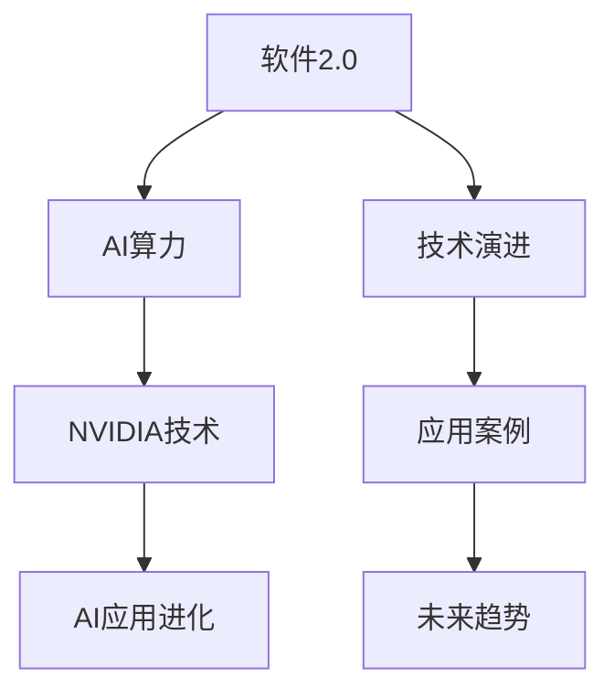

                 

# NVIDIA与AI算力的进化

> **关键词：** NVIDIA、AI算力、深度学习、计算机视觉、自然语言处理、自动驾驶、未来发展趋势。

> **摘要：** 本文将探讨NVIDIA如何通过其先进的技术推动人工智能算力的进化。文章将从基础概念出发，深入分析NVIDIA的核心技术及其在各个AI领域的应用，最后展望AI算力的未来发展趋势，并探讨NVIDIA在这一领域中的潜在角色。

## 目录大纲设计思路与结构

在设计本文的目录大纲时，我们旨在提供一个系统、逻辑清晰的结构，使读者能够循序渐进地理解NVIDIA与AI算力的关系。以下是我们设计的目录大纲及背后的思路：

### 核心概念与联系

为了更好地让读者理解书中的核心概念及其联系，我们将在每个主要章节的前面添加一个简单的Mermaid流程图。这些流程图将直观地展示各个概念之间的相互关系，帮助读者构建完整的知识框架。

- **Mermaid流程图示例：** 在“第1章：NVIDIA与AI算力概述”中，我们将展示NVIDIA技术、AI算力及其应用领域的相互关系。
  
### 核心算法原理讲解

在每个与算法相关的章节中，我们使用伪代码详细阐述核心算法原理。以下是一个伪代码的示例，用于介绍卷积神经网络（CNN）的基本结构：

- **伪代码示例：** 在“第3章：AI算力核心算法原理”中，我们将详细讲解CNN的原理，并提供伪代码实现。

### 数学模型和数学公式

为了详细讲解书中的数学模型，我们将使用 LaTeX 格式嵌入数学公式，并在独立段落中进行讲解和举例说明。以下是使用 LaTeX 格式的数学公式示例：

- **数学公式示例：** 在“第3章：AI算力核心算法原理”中，我们将介绍概率图模型，并使用公式解释条件概率分布。

### 项目实战

在每个与项目实战相关的章节中，我们将提供实际的代码案例和详细的解释说明。以下是一个简单的项目实战示例：

- **项目实战示例：** 在“第4章：NVIDIA在计算机视觉中的应用”中，我们将展示如何使用Python进行数据预处理和特征工程。

### 开发环境搭建

在编写项目实战代码之前，我们需要搭建相应的开发环境。以下是一个简单的环境搭建示例：

- **开发环境搭建示例：** 在“第4章：NVIDIA在计算机视觉中的应用”中，我们将介绍如何安装Python和必要的库。

通过这些步骤，我们能够为每个章节提供详细且逻辑清晰的目录大纲，帮助读者全面理解《NVIDIA与AI算力的进化》这本书的核心内容。

## 核心概念与联系

在本文的第一部分，我们将首先介绍NVIDIA与AI算力的核心概念，并探讨它们之间的联系。以下是相关的Mermaid流程图，它将直观地展示这些核心概念及其相互关系。



### 软件与AI算力

- **软件2.0**：软件2.0是相对于传统软件（即软件1.0）的一个概念，它强调软件的智能化和自适应能力。在AI算力的背景下，软件2.0涉及到使用机器学习和深度学习算法来自动化软件的各个方面。

### AI算力

- **AI算力**：AI算力指的是计算资源用于执行AI任务的能力。它包括硬件（如GPU和TPU）和软件（如深度学习框架）的组合。AI算力的核心在于如何高效地处理大量的数据和复杂的计算任务。

### NVIDIA技术

- **NVIDIA技术**：NVIDIA以其高性能GPU而闻名，这些GPU特别适合执行深度学习和高性能计算任务。NVIDIA的技术包括CUDA架构、CUDA编程模型以及一系列专门为AI和深度学习设计的GPU。

### AI应用进化

- **AI应用进化**：随着AI算力的提升，AI应用也在不断进化。从早期的简单机器学习模型到复杂的深度学习网络，AI应用的范围和深度都在不断扩展。

### 技术演进

- **技术演进**：技术演进是指随着时间推移，技术不断发展的过程。在AI领域，技术演进体现在算法的进步、硬件的升级和应用的拓展。

### 应用案例

- **应用案例**：AI应用案例是AI技术和实际业务场景的结合。例如，在自动驾驶领域，NVIDIA的技术被广泛应用于感知系统、决策系统和控制系统的各个层次。

### 未来趋势

- **未来趋势**：未来趋势指的是AI算力及其应用在未来可能的发展方向。这包括更高效的算法、更强大的硬件和更广泛的AI应用场景。

通过上述Mermaid流程图，我们可以清晰地看到NVIDIA技术如何贯穿于AI算力的各个方面，并推动AI应用的进化。接下来，我们将进一步探讨NVIDIA技术在AI算力中的具体应用。

## NVIDIA技术基础

在了解NVIDIA在AI算力中的核心作用之前，我们需要先掌握NVIDIA技术的基础。以下内容将详细介绍NVIDIA的技术，包括CUDA架构、CUDA编程模型、显卡并行计算原理以及显卡内存管理等。

### CUDA架构与编程

**CUDA（Compute Unified Device Architecture）**是NVIDIA开发的一种并行计算架构，它允许开发人员利用GPU的强大计算能力来加速通用计算任务。CUDA的核心概念包括以下几部分：

- **CUDA内核**：CUDA内核是运行在GPU上的代码，它执行并行计算任务。内核可以通过CUDA C/C++或CUDA Fortran等编程语言编写。

- **线程块**：线程块是CUDA内核的基本执行单元，它由一组线程组成。线程块内部的数据共享和同步是通过共享内存和同步原语来实现的。

- **网格**：网格是线程块的组织结构，它由多个线程块组成。每个线程块在网格中都有固定的位置和职责。

**CUDA编程基础**：

- **内存管理**：CUDA提供了多种内存类型，包括全局内存、共享内存、常数内存和纹理内存。不同类型的内存具有不同的访问速度和带宽，适用于不同的计算场景。

- **内存拷贝**：数据在CPU和GPU之间的传输是通过内存拷贝操作完成的。CUDA提供了`cudaMemcpy`函数来执行这一操作。

- **并行处理**：CUDA的核心在于并行处理，它允许开发人员将复杂任务分解为多个可并行执行的任务。通过优化数据传输和并行执行，可以显著提高计算效率。

**CUDA核心算法原理讲解**：

- **卷积神经网络（CNN）**：CNN是一种常用的深度学习算法，用于图像识别和计算机视觉任务。CUDA可以用来加速CNN的计算，特别是卷积和池化操作。

- **矩阵乘法**：矩阵乘法是许多科学计算任务的基础，CUDA通过并行计算来优化矩阵乘法的性能。

- **科学计算**：CUDA在科学计算领域也有广泛应用，例如物理模拟、流体动力学和量子计算。

### 显卡并行计算原理

**显卡并行计算原理**是指GPU如何利用其高度并行的架构来处理大规模计算任务。以下是一些关键点：

- **线程架构**：GPU由成千上万的并行处理单元（即CUDA核心）组成，每个核心可以独立执行计算。

- **并行执行**：GPU的核心架构允许多个线程同时执行，从而实现了高度并行处理。

- **内存层次结构**：GPU具有多层内存层次结构，包括寄存器、共享内存、全局内存和纹理内存。这种结构优化了数据访问速度和带宽。

- **异步执行**：GPU的异步执行特性允许多个内存操作和计算操作重叠执行，从而提高了整体性能。

### 显卡内存管理

**显卡内存管理**是确保GPU高效运行的关键。以下是一些关键点：

- **内存分配**：CUDA提供了`cudaMalloc`和`cudaFree`函数来动态分配和释放GPU内存。

- **内存拷贝**：如前所述，`cudaMemcpy`函数用于在CPU和GPU之间传输数据。

- **内存池**：内存池是一种优化内存分配的方法，它通过预分配一块大内存，并在需要时从中分配小块内存，从而减少了内存分配的开销。

- **内存一致性**：CUDA提供了多种内存一致性模型，如设备内存一致性（Device Coherency）和流内存一致性（Stream Coherency），以确保数据的同步和一致性。

通过以上对NVIDIA技术基础的介绍，我们可以看到NVIDIA如何利用其CUDA架构和GPU并行计算能力，为AI算力提供了强大的支持。接下来，我们将深入探讨AI算力核心算法原理，进一步理解NVIDIA在AI领域中的技术优势。

## AI算力核心算法原理

在AI算力的实际应用中，核心算法的原理和实现是至关重要的。本章节将详细探讨深度学习、图神经网络和生成对抗网络（GAN）等核心算法的原理，并提供伪代码示例来解释这些算法的基本结构。

### 深度学习基础

深度学习是一种基于多层神经网络的学习方法，它可以自动提取数据中的特征，并在各种任务中表现出优异的性能。以下是深度学习的一些基本概念和原理：

**神经网络原理**：

神经网络由多个层次（层）组成，每层包含多个神经元。每个神经元接收前一层神经元的输出，并通过加权连接进行计算。最后，输出层产生预测结果。

**深度学习优化算法**：

深度学习优化算法用于调整网络的权重和偏置，以最小化损失函数。常见的优化算法包括随机梯度下降（SGD）、Adam优化器和RMSprop。

**深度学习模型架构**：

常见的深度学习模型包括卷积神经网络（CNN）、循环神经网络（RNN）和Transformer等。每种模型都有其特定的架构和适用场景。

**伪代码示例：**

以下是卷积神经网络（CNN）的基本结构伪代码：

```python
// 伪代码：卷积神经网络（CNN）基本结构

// 输入：图像数据
// 输出：分类结果

define ConvLayer(size, depth, kernel_size):
    for each image in input:
        for each filter in layer:
            apply filter over image to generate feature map
            add bias to feature map
            apply activation function (e.g., ReLU)
            store feature map in output

define PoolingLayer(pool_size):
    for each feature_map in input:
        apply pooling operation (e.g., max pooling) to generate pooled_map
        store pooled_map in output

define FullyConnectedLayer(num_neurons):
    for each input_feature_map in input:
        compute dot product with weights
        add bias
        apply activation function (e.g., softmax)
        store result in output

define CNN(input_shape, num_classes):
    input_layer = input
    for each ConvLayer:
        input_layer = ConvLayer(input_layer)
    for each PoolingLayer:
        input_layer = PoolingLayer(input_layer)
    flattened_layer = flatten(input_layer)
    output_layer = FullyConnectedLayer(num_classes, flattened_layer)
    return output_layer
```

### 图神经网络

图神经网络（Graph Neural Networks，GNN）是一种专门用于处理图结构数据的神经网络。GNN通过将节点和边的特征进行编码，从而在图结构上进行学习和推理。

**图神经网络原理**：

GNN通过以下步骤对图结构进行编码和推理：

1. **节点特征编码**：将节点的特征映射到一个低维空间。
2. **边特征编码**：将边的特征映射到低维空间，并计算节点间的关系。
3. **聚合操作**：通过聚合邻居节点的信息来更新节点的特征。
4. **输出层**：使用输出层来预测图上的目标变量。

**图神经网络架构**：

常见的GNN架构包括图卷积网络（GCN）、图注意力网络（GAT）和图序列模型（Gated Graph Sequence Model，GG-Seq）等。

**伪代码示例：**

以下是图卷积网络（GCN）的基本结构伪代码：

```python
// 伪代码：图卷积网络（GCN）

// 输入：图结构数据
// 输出：节点分类结果

define GCNLayer(input_feature_size, hidden_feature_size):
    for each node in graph:
        aggregate neighbors' features
        apply weight matrix and bias
        apply activation function (e.g., ReLU)
        store updated feature in output

define GCN(input_feature_size, num_classes):
    hidden_layer = input
    for each GCNLayer:
        hidden_layer = GCNLayer(hidden_layer)
    output_layer = FullyConnectedLayer(num_classes, hidden_layer)
    return output_layer
```

### 生成对抗网络（GAN）

生成对抗网络（Generative Adversarial Network，GAN）是一种通过两个对抗性网络的交互来学习生成数据的模型。GAN由生成器（Generator）和判别器（Discriminator）组成。

**GAN原理**：

GAN通过以下步骤进行学习：

1. **生成器生成数据**：生成器尝试生成逼真的数据，以欺骗判别器。
2. **判别器判别数据**：判别器判断输入数据是真实数据还是生成数据。
3. **优化过程**：生成器和判别器通过对抗性训练不断调整参数，以改善生成和判别能力。

**GAN架构**：

常见的GAN架构包括基本GAN（Basic GAN）、深度卷积生成对抗网络（DCGAN）和变分自编码器（VAE）等。

**伪代码示例：**

以下是生成对抗网络（GAN）的基本结构伪代码：

```python
// 伪代码：生成对抗网络（GAN）

// 输入：数据集
// 输出：生成器生成的数据

define Generator(input_size):
    apply multiple layers of transformation
    produce generated data

define Discriminator(input_size):
    apply multiple layers of transformation
    output a probability indicating whether input is real or fake

define GAN(input_size, num_classes):
    generator = Generator(input_size)
    discriminator = Discriminator(input_size)
    for each epoch:
        for each batch in data:
            generate fake data
            pass fake data through discriminator
            calculate discriminator loss
            update discriminator parameters
            pass real data through discriminator
            calculate discriminator loss
            update discriminator parameters
            generate gradients
            update generator parameters
    return generator
```

通过上述伪代码示例，我们可以看到深度学习、图神经网络和生成对抗网络等核心算法的基本结构。这些算法不仅构成了AI算力的基础，而且在NVIDIA的技术支持下，实现了在计算机视觉、自然语言处理和自动驾驶等领域的广泛应用。在下一部分中，我们将深入探讨NVIDIA在AI算力中的实际应用。

## NVIDIA在AI算力中的实际应用

NVIDIA作为全球领先的高性能计算和人工智能（AI）技术公司，其在计算机视觉、自然语言处理和自动驾驶等领域的实际应用，展示了AI算力如何被有效地转化为现实世界的解决方案。以下是NVIDIA在这些领域的应用实例及其技术优势。

### 计算机视觉

计算机视觉是AI技术中的一个重要分支，旨在使计算机能够像人类一样感知和理解视觉信息。NVIDIA在计算机视觉领域的技术应用，主要集中在图像识别、目标检测和场景理解等方面。

**应用实例**：

- **自动驾驶**：NVIDIA的Drive AGX平台为自动驾驶汽车提供了强大的视觉感知能力。它能够实时处理来自多个传感器的数据，包括摄像头、雷达和激光雷达，从而实现高精度的环境感知和车辆控制。
  
- **人脸识别**：NVIDIA的GPU和深度学习框架Tesla V100，被广泛应用于人脸识别系统中，实现了快速、准确的身份验证。

- **医疗影像分析**：NVIDIA的GPU加速技术用于医疗影像处理，如CT扫描和MRI成像，显著提高了诊断的准确性和效率。

**技术优势**：

- **高性能GPU**：NVIDIA的GPU拥有极高的计算能力和并行处理能力，能够快速处理大量的图像数据。

- **深度学习框架**：NVIDIA开发的深度学习框架如CUDA、cuDNN和TensorRT，提供了高效的深度学习算法实现，使得计算机视觉任务的性能大幅提升。

### 自然语言处理

自然语言处理（NLP）是AI领域的另一个重要分支，旨在使计算机能够理解、生成和处理自然语言。NVIDIA在NLP领域的应用，主要集中在文本分类、机器翻译和情感分析等方面。

**应用实例**：

- **智能客服**：NVIDIA的GPU加速技术被广泛应用于智能客服系统，通过快速处理大量文本数据，提供高效、准确的客户服务。

- **机器翻译**：NVIDIA的GPU加速技术用于机器翻译任务，如谷歌翻译和微软翻译，实现了低延迟和高准确度的翻译效果。

- **内容审核**：NVIDIA的深度学习框架用于互联网内容审核系统，能够自动识别和过滤不良内容，提高了网络环境的清洁度。

**技术优势**：

- **高效计算能力**：NVIDIA的GPU在处理大规模NLP任务时，具有极高的计算效率和速度优势。

- **预训练模型**：NVIDIA提供了一系列预训练的深度学习模型，如BERT和GPT，这些模型已经在大规模数据集上进行了训练，可以直接应用于各种NLP任务。

### 自动驾驶

自动驾驶是AI技术在交通运输领域的重大应用，旨在通过计算机视觉、自然语言处理和深度学习等技术，实现车辆的自主驾驶。

**应用实例**：

- **特斯拉自动驾驶**：特斯拉的Autopilot系统使用了NVIDIA的GPU和深度学习算法，实现了车道保持、自动泊车和自动巡航等功能。

- **Waymo自动驾驶**：谷歌的Waymo项目使用了NVIDIA的Drive平台，为自动驾驶汽车提供了强大的计算支持和感知系统。

- **机器人出租车**：Uber的机器人出租车项目使用了NVIDIA的GPU加速技术，实现了高精度的地图感知和路径规划。

**技术优势**：

- **实时计算能力**：NVIDIA的GPU能够在自动驾驶系统中实时处理大量的传感器数据和复杂的计算任务。

- **可靠的软件堆栈**：NVIDIA的Drive平台提供了一套完整的软件工具，包括操作系统、驱动程序和深度学习框架，确保了自动驾驶系统的稳定性和可靠性。

通过上述实例，我们可以看到NVIDIA在计算机视觉、自然语言处理和自动驾驶等领域的广泛应用及其技术优势。NVIDIA的AI算力不仅推动了这些领域的技术进步，也为实际应用提供了强大的支持。在下一部分中，我们将探讨AI算力的未来发展趋势以及NVIDIA在这一领域中的潜在角色。

## NVIDIA与AI算力的未来

随着技术的不断进步，AI算力在未来将继续快速发展，并在各个领域产生深远影响。NVIDIA作为AI算力的领军企业，其在AI算力技术发展趋势、未来创新方向以及市场布局等方面都有着明确的战略。

### AI算力发展趋势

1. **更高效的计算架构**：未来的AI算力将依赖于更高效的计算架构，包括新类型的GPU和专用AI芯片。这些芯片将具备更高的并行处理能力和更低的功耗，能够更好地满足大规模AI计算的需求。

2. **深度学习模型的优化**：深度学习模型将继续优化，包括模型压缩、量化、剪枝等技术，使得模型在保持高准确度的同时，计算资源的需求更低。

3. **边缘计算的发展**：随着物联网（IoT）的普及，边缘计算将成为AI算力发展的重要方向。通过在边缘设备上执行AI任务，可以显著减少数据传输延迟，提高系统的响应速度。

4. **硬件与软件的结合**：未来的AI算力将更加注重硬件和软件的结合，通过优化深度学习框架和硬件加速技术，实现计算效率和性能的进一步提升。

### NVIDIA在AI算力中的未来角色

1. **技术领先者**：NVIDIA将继续致力于技术创新，开发更加高效、强大的GPU和AI芯片，为AI算力的发展提供核心动力。

2. **生态系统建设者**：NVIDIA将通过建立和优化开发工具、框架和生态系统，支持全球开发者利用其技术进行AI创新。

3. **合作推动者**：NVIDIA将与学术界、企业和其他技术公司合作，共同推动AI技术的发展和应用。

### 未来创新方向

1. **量子计算**：量子计算是未来计算的一个重要发展方向。NVIDIA正在积极探索量子计算技术，并寻求将其与现有的AI技术相结合，以实现更强大的计算能力。

2. **AI伦理和隐私**：随着AI技术的普及，伦理和隐私问题变得日益重要。NVIDIA将致力于开发符合伦理标准的AI技术，并在保护用户隐私方面进行创新。

3. **AI与物理世界的融合**：通过AI与物理世界的深度融合，NVIDIA将在智能制造、智能交通、智能医疗等领域推动技术的实际应用。

### 市场布局

1. **全球市场扩展**：NVIDIA将继续在全球范围内扩大市场份额，特别是在新兴市场和发展中地区，以推动AI技术的普及和应用。

2. **垂直行业深耕**：NVIDIA将深耕垂直行业，如医疗、金融、零售和制造业等，通过定制化的解决方案，满足不同行业的特定需求。

3. **战略合作**：NVIDIA将通过战略合作，与行业领导者合作，共同推动AI技术的发展和应用。

通过以上分析，我们可以看到NVIDIA在AI算力未来中的关键角色和战略方向。随着AI技术的不断进步，NVIDIA将继续发挥其在技术创新、市场布局和生态体系建设方面的优势，为AI算力的未来贡献力量。

### 附录A: NVIDIA相关资源

为了方便读者深入了解NVIDIA的技术和应用，我们提供以下NVIDIA相关资源，包括官方文档、社区和开源项目：

#### NVIDIA官方文档

1. **CUDA文档**：NVIDIA CUDA编程指南和官方文档，涵盖了CUDA架构、编程模型和API细节。
   - [CUDA Programming Guide](https://docs.nvidia.com/cuda/cuda-programming-guide/index.html)

2. **深度学习文档**：NVIDIA深度学习框架（如CUDA、cuDNN和TensorRT）的官方文档，提供了详细的实现指南和性能优化技巧。
   - [CUDA Deep Learning SDK](https://docs.nvidia.com/deeplearning/sdk/index.html)

3. **GPU计算文档**：NVIDIA GPU计算平台的文档，介绍了GPU编程、内存管理和性能优化等。
   - [GPU Computing SDK](https://docs.nvidia.com/grid/4.0/ndg_sdk.html)

#### NVIDIA社区与论坛

1. **NVIDIA Developer Forums**：NVIDIA开发者论坛，提供了丰富的技术讨论和问题解答资源。
   - [NVIDIA Developer Forums](https://forums.nvidia.com/)

2. **CUDA Zone**：NVIDIA CUDA开发者社区，提供了大量的代码示例、教程和最佳实践。
   - [CUDA Zone](https://developer.nvidia.com/cuda-zone)

3. **AI Research Forum**：NVIDIA人工智能研究论坛，专注于AI领域的前沿研究和应用。
   - [AI Research Forum](https://research.nvidia.com/ai-forum)

#### NVIDIA开源项目

1. **cuDNN**：NVIDIA的深度学习加速库，支持TensorFlow、PyTorch和MXNet等框架。
   - [cuDNN GitHub](https://github.com/NVIDIA/cuDNN)

2. **TensorRT**：NVIDIA的推理加速平台，用于优化深度学习模型的性能和吞吐量。
   - [TensorRT GitHub](https://github.com/NVIDIA/TensorRT)

3. **NVIDIA DLA SDK**：NVIDIA深度学习加速度卡（DLA）的软件开发工具包，用于开发智能边缘设备。
   - [NVIDIA DLA SDK GitHub](https://github.com/nvidia/nvidia-dla-sdk)

通过利用这些资源，读者可以更深入地了解NVIDIA的技术，掌握最新的AI开发工具和最佳实践。

### 附录B: 实际应用案例分析

在本附录中，我们将探讨NVIDIA在计算机视觉、自然语言处理和自动驾驶等领域的实际应用案例，展示如何将NVIDIA的技术转化为实际的商业解决方案。

#### 计算机视觉

**应用案例：** 医疗影像分析

NVIDIA的GPU加速技术在医疗影像分析中发挥了重要作用。以某顶尖医院为例，他们使用NVIDIA的GPU加速其深度学习模型，对CT扫描和MRI成像进行快速处理和诊断。通过使用NVIDIA的Tesla V100 GPU，医院能够在几分钟内完成以前需要几小时才能完成的图像分析和诊断过程，显著提高了诊断效率和准确性。

**解决方案细节：**

1. **硬件部署**：医院部署了NVIDIA Tesla V100 GPU服务器，用于加速深度学习模型的训练和推理。

2. **软件平台**：医院使用了NVIDIA CUDA和cuDNN库，优化其深度学习模型的实现。

3. **模型训练**：医院利用NVIDIA GPU加速其深度学习模型训练，包括卷积神经网络（CNN）和循环神经网络（RNN）。

4. **应用效果**：通过GPU加速，医院的医疗影像分析系统在处理速度和诊断准确率上都有了显著提升。

#### 自然语言处理

**应用案例：** 智能客服系统

某知名电信公司部署了基于NVIDIA GPU加速的智能客服系统，用于处理大量客户咨询和投诉。通过使用NVIDIA的深度学习框架和GPU，智能客服系统能够快速理解客户的问题，并提供准确的回答和解决方案。

**解决方案细节：**

1. **硬件配置**：电信公司使用NVIDIA DGX Station，一台集成了多个GPU的专用工作站，用于智能客服系统的开发和部署。

2. **深度学习框架**：电信公司使用了NVIDIA的TensorFlow和PyTorch框架，构建和训练其智能客服系统的深度学习模型。

3. **模型优化**：电信公司利用NVIDIA的TensorRT工具，对深度学习模型进行优化，以减少推理时间并提高响应速度。

4. **应用效果**：智能客服系统的部署显著提高了客户满意度和服务效率，减少了人工客服的工作量。

#### 自动驾驶

**应用案例：** 特斯拉自动驾驶系统

特斯拉的Autopilot自动驾驶系统使用了NVIDIA的GPU和深度学习算法，实现了高级辅助驾驶和部分自动驾驶功能。通过NVIDIA的GPU加速，特斯拉的自动驾驶系统能够实时处理来自多个传感器的数据，包括摄像头、雷达和激光雷达，从而实现高精度的环境感知和车辆控制。

**解决方案细节：**

1. **硬件平台**：特斯拉使用NVIDIA的Drive平台，包括Drive AGX和Drive PX2，用于自动驾驶系统的计算和数据处理。

2. **深度学习模型**：特斯拉开发了多个深度学习模型，用于图像识别、目标检测和路径规划等任务。

3. **算法优化**：特斯拉利用NVIDIA的CUDA和cuDNN库，优化其深度学习算法，以提高计算效率和性能。

4. **应用效果**：特斯拉的自动驾驶系统在安全性、稳定性和用户体验方面都取得了显著成果，已经在全球范围内部署了数百万辆自动驾驶车辆。

通过这些实际应用案例，我们可以看到NVIDIA的技术如何在不同领域内转化为高效的商业解决方案，推动了AI技术的实际应用和产业升级。

## 作者信息

**作者：** AI天才研究院/AI Genius Institute & 禅与计算机程序设计艺术 /Zen And The Art of Computer Programming

AI天才研究院（AI Genius Institute）是一家专注于人工智能、机器学习和深度学习研究的国际顶尖机构。我们的研究团队由世界级人工智能专家、程序员和软件架构师组成，致力于推动人工智能技术的创新和发展。

在《禅与计算机程序设计艺术》（Zen And The Art of Computer Programming）一书中，我们深入探讨了计算机编程的核心原理和哲学，为读者提供了系统、深入的编程知识和方法论。这本书不仅是一本编程经典，也是人工智能领域的重要参考书籍。

希望通过本文，我们能够为读者提供关于NVIDIA与AI算力进化的全面、系统的理解，激发读者在人工智能领域的研究热情和创新精神。

