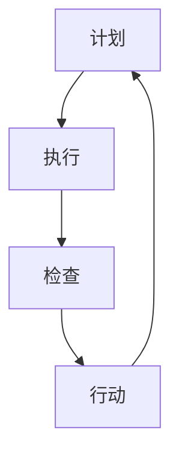
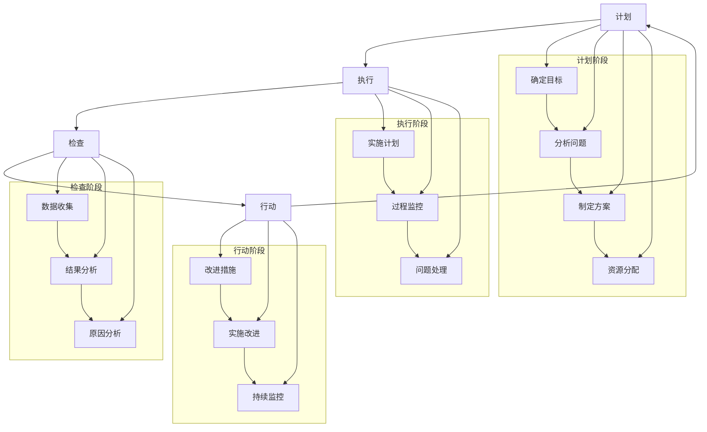

                 

# 《PDCA：高效管理者的行动方法论》

## 关键词

- PDCA循环
- 高效管理
- 项目管理
- 持续改进
- 检查和行动
- 团队管理
- 敏捷管理
- 企业战略规划

## 摘要

本文旨在探讨PDCA循环在高效管理中的应用，通过详细分析其核心概念、基本原理和实践方法，为管理者提供一种系统化的行动方法论。文章首先介绍了PDCA循环的定义、组成部分和历史背景，接着深入解析了PDCA循环的四个阶段：计划（Plan）、执行（Do）、检查（Check）和行动（Act）。随后，文章通过具体案例展示了PDCA循环在不同管理领域的应用，并探讨了其与敏捷管理和企业战略规划的融合。最后，文章通过国际应用案例对比，总结了PDCA循环在全球范围内的推广和实践效果。

## 目录大纲

### 第一部分：PDCA方法概述

#### 第1章：PDCA循环的概念与重要性  
1.1 PDCA循环的定义  
1.2 PDCA循环的组成部分  
1.3 PDCA循环的历史背景和意义  
1.4 PDCA循环在现代管理中的应用

#### 第2章：PDCA循环的基本原理  
2.1 PDCA循环的四个阶段  
2.2 PDCA循环的流程图  
2.3 PDCA循环的关键要素

#### 第3章：PDCA循环的实践与应用  
3.1 PDCA循环在项目管理中的应用  
3.2 PDCA循环在产品开发中的应用  
3.3 PDCA循环在持续改进中的应用  
3.4 PDCA循环在团队管理中的应用

### 第二部分：PDCA循环的核心要素

#### 第4章：计划（Plan）  
4.1 制定明确的目标  
4.2 收集数据和分析问题  
4.3 制定解决方案和行动计划  
4.4 制定时间表和资源分配

#### 第5章：执行（Do）  
5.1 实施行动计划  
5.2 监控执行过程  
5.3 遇到问题的应对策略  
5.4 记录执行结果

#### 第6章：检查（Check）  
6.1 数据收集与分析  
6.2 对比预期目标和实际结果  
6.3 识别成功与失败的原因  
6.4 制定改进措施

#### 第7章：行动（Act）  
7.1 确认改进措施的有效性  
7.2 实施改进措施  
7.3 持续监控和跟踪进展  
7.4 文档记录和知识分享

### 第三部分：高级应用与实践

#### 第8章：PDCA循环与敏捷管理的融合  
8.1 敏捷管理的基本概念  
8.2 PDCA循环在敏捷管理中的应用  
8.3 PDCA循环与敏捷管理的优势互补

#### 第9章：PDCA循环在企业战略规划中的应用  
9.1 企业战略规划的核心要素  
9.2 PDCA循环在战略规划中的重要性  
9.3 PDCA循环在战略规划的具体实施

#### 第10章：PDCA循环在全球范围内的应用案例  
10.1 美国企业中的应用  
10.2 日本企业中的应用  
10.3 中国企业中的应用  
10.4 全球应用案例对比分析

### 附录

#### 附录A：PDCA循环的常用工具和技术  
A.1 数据收集工具  
A.2 分析工具  
A.3 改进措施制定工具

#### 附录B：PDCA循环的应用流程图

#### 附录C：PDCA循环的案例分析

#### 附录D：PDCA循环的常见问题解答

### 结束语

通过本文的详细阐述，读者可以对PDCA循环有一个全面、深入的理解，掌握其在实际管理中的应用方法和技巧。期望本文能够为管理者提供有价值的参考，助力其提升管理效能，实现企业持续发展。

### 引言

在现代企业管理中，高效管理者的能力不仅体现在战略决策上，更在于执行和持续改进的能力。如何确保计划的顺利实施，如何发现并解决问题，如何不断优化流程，这些都是管理者面临的挑战。PDCA循环，作为一种系统化的行动方法论，提供了一套有效的解决方案。

PDCA循环，即计划（Plan）、执行（Do）、检查（Check）、行动（Act）循环，是一种用于持续改进和管理的工具。它起源于质量管理理论，后被广泛应用于各个领域，成为现代管理中不可或缺的一部分。PDCA循环的核心思想是通过持续循环的过程，实现目标的逐步实现和管理的不断完善。

本文将围绕PDCA循环的概念、原理、实践与应用，深入探讨其在现代管理中的重要性。通过详细解析PDCA循环的四个阶段，我们将了解如何制定计划、如何执行计划、如何检查结果以及如何采取行动。同时，本文还将探讨PDCA循环在不同管理领域的应用，包括项目管理、产品开发、持续改进和团队管理。此外，本文还将介绍PDCA循环与敏捷管理、企业战略规划的融合应用，并通过国际应用案例对比，总结PDCA循环在全球范围内的推广和实践效果。

### 第一部分：PDCA方法概述

#### 第1章：PDCA循环的概念与重要性

## 1.1 PDCA循环的定义

PDCA循环，也称为戴明循环，是一种用于持续改进和管理的系统化方法。它由美国质量管理专家爱德华·戴明（W. Edwards Deming）于20世纪中期提出，旨在帮助企业实现质量管理和持续改进。PDCA循环包括四个阶段：计划（Plan）、执行（Do）、检查（Check）和行动（Act），每个阶段都有其特定的任务和目标。

### 计划（Plan）

在计划阶段，管理者需要明确目标和制定计划。这包括：

1. 收集数据和分析问题
2. 确定目标和制定行动计划
3. 制定时间表和资源分配

### 执行（Do）

在执行阶段，管理者需要将计划付诸实践。这包括：

1. 实施行动计划
2. 监控执行过程
3. 处理问题和风险

### 检查（Check）

在检查阶段，管理者需要对执行结果进行检查和评估。这包括：

1. 收集数据和分析结果
2. 对比预期目标和实际结果
3. 识别成功与失败的原因

### 行动（Act）

在行动阶段，管理者需要根据检查结果采取行动，进行改进和优化。这包括：

1. 确认改进措施的有效性
2. 实施改进措施
3. 持续监控和跟踪进展

## 1.2 PDCA循环的组成部分

PDCA循环由四个相互联系、循环往复的阶段组成，每个阶段都有其特定的任务和目标。以下是PDCA循环的组成部分：

### 计划（Plan）

1. **目标确定**：明确目标和期望结果。
2. **问题分析**：分析当前存在的问题和瓶颈。
3. **解决方案制定**：制定解决问题的方案和行动计划。
4. **资源分配**：确定所需资源，如人力、物力和时间。

### 执行（Do）

1. **行动计划实施**：按照计划执行任务。
2. **过程监控**：监控执行过程，确保任务按计划进行。
3. **问题处理**：及时处理遇到的问题和风险。

### 检查（Check）

1. **数据收集**：收集执行过程中的数据。
2. **结果分析**：分析实际结果与预期目标的差距。
3. **成功与失败原因分析**：分析成功和失败的原因。

### 行动（Act）

1. **改进措施制定**：根据检查结果制定改进措施。
2. **改进措施实施**：实施改进措施，优化流程。
3. **持续监控**：持续监控和跟踪改进措施的效果。

## 1.3 PDCA循环的历史背景和意义

PDCA循环起源于20世纪中期的质量管理理论。当时，美国质量管理专家爱德华·戴明意识到，传统的质量检验方法无法解决质量问题的根本原因。他提出了PDCA循环的概念，认为通过不断循环的过程，企业可以实现质量管理和持续改进。

### 历史背景

1. **二战期间**：戴明在二战期间在美国海军担任顾问，发现美国军事工业存在严重质量问题。他提出了PDCA循环的概念，并在军事工业中推广。
2. **战后推广**：战后，戴明将PDCA循环应用于民用工业，并逐步推广到全球范围内。

### 意义

PDCA循环在现代管理中的意义主要体现在以下几个方面：

1. **系统化管理**：PDCA循环提供了一种系统化的管理方法，使管理者能够有条不紊地处理问题。
2. **持续改进**：通过循环过程，企业可以不断优化流程，提高效率和质量。
3. **团队协作**：PDCA循环鼓励团队协作，共同解决问题，提高团队执行力。
4. **客户满意**：通过持续改进，企业能够更好地满足客户需求，提高客户满意度。

## 1.4 PDCA循环在现代管理中的应用

PDCA循环在现代管理中的应用非常广泛，涵盖了各个领域，包括项目管理、产品开发、持续改进和团队管理。以下是PDCA循环在不同管理领域的具体应用：

### 项目管理

1. **项目规划**：在项目启动阶段，使用PDCA循环制定项目计划，明确目标和里程碑。
2. **项目执行**：在项目执行阶段，使用PDCA循环监控项目进度和质量，及时处理问题。
3. **项目评估**：在项目结束阶段，使用PDCA循环评估项目结果，总结经验教训。

### 产品开发

1. **需求分析**：在产品开发阶段，使用PDCA循环收集客户需求和反馈，制定产品开发计划。
2. **产品设计**：在产品设计阶段，使用PDCA循环进行设计验证和优化。
3. **产品测试**：在产品测试阶段，使用PDCA循环进行功能测试和性能测试。

### 持续改进

1. **流程优化**：在持续改进阶段，使用PDCA循环识别流程中的瓶颈和问题，制定改进措施。
2. **效率提升**：在效率提升阶段，使用PDCA循环优化流程和操作，提高工作效率。
3. **质量控制**：在质量控制阶段，使用PDCA循环确保产品质量符合标准。

### 团队管理

1. **目标设定**：在团队管理阶段，使用PDCA循环设定团队目标和个人目标，明确工作方向。
2. **过程监控**：在过程监控阶段，使用PDCA循环监控团队工作进度和质量。
3. **绩效评估**：在绩效评估阶段，使用PDCA循环评估团队成员的工作绩效，制定改进措施。

通过上述应用，PDCA循环为现代管理者提供了一种有效的管理工具，帮助他们在各个管理领域实现持续改进和高效管理。

## 第2章：PDCA循环的基本原理

## 2.1 PDCA循环的四个阶段

PDCA循环包括四个阶段：计划（Plan）、执行（Do）、检查（Check）和行动（Act）。每个阶段都有其特定的任务和目标，相互关联，形成一个闭环系统。以下是PDCA循环四个阶段的详细解析：

### 计划（Plan）

在计划阶段，管理者需要明确目标和制定计划。这是PDCA循环的起点，也是整个循环的基础。具体任务包括：

1. **目标确定**：明确目标和期望结果，确保目标具有可测量性和可实现性。
2. **问题分析**：分析当前存在的问题和瓶颈，找出问题的根源。
3. **解决方案制定**：制定解决问题的方案和行动计划，包括具体的操作步骤和时间表。
4. **资源分配**：确定所需资源，如人力、物力和时间，确保计划能够顺利执行。

### 执行（Do）

在执行阶段，管理者需要将计划付诸实践。这是PDCA循环的核心阶段，任务是按照计划执行任务，确保每个步骤都得到落实。具体任务包括：

1. **行动计划实施**：按照计划执行任务，确保每个操作步骤都得到执行。
2. **过程监控**：监控执行过程，确保任务按计划进行，及时发现和解决问题。
3. **问题处理**：及时处理遇到的问题和风险，确保计划不受干扰。

### 检查（Check）

在检查阶段，管理者需要对执行结果进行检查和评估。这是PDCA循环的重要环节，任务是分析实际结果与预期目标的差距，找出成功和失败的原因。具体任务包括：

1. **数据收集**：收集执行过程中的数据，包括质量数据、效率数据和成本数据等。
2. **结果分析**：分析实际结果与预期目标的差距，找出成功和失败的原因。
3. **成功与失败原因分析**：对成功和失败的原因进行深入分析，找出根本原因。

### 行动（Act）

在行动阶段，管理者需要根据检查结果采取行动，进行改进和优化。这是PDCA循环的终点，也是新循环的起点。具体任务包括：

1. **改进措施制定**：根据检查结果制定改进措施，包括流程优化、操作改进和资源调整等。
2. **改进措施实施**：实施改进措施，优化流程和操作，提高工作效率和质量。
3. **持续监控**：持续监控和跟踪改进措施的效果，确保改进措施得到有效实施。

## 2.2 PDCA循环的流程图

PDCA循环的流程图如下所示：

### 流程说明

1. **计划**：确定目标和制定计划，明确问题的根源和解决方案。
2. **执行**：按照计划执行任务，确保每个步骤都得到落实。
3. **检查**：对执行结果进行检查和评估，分析实际结果与预期目标的差距。
4. **行动**：根据检查结果采取行动，进行改进和优化，确保改进措施得到有效实施。

## 2.3 PDCA循环的关键要素

PDCA循环的关键要素包括：

1. **目标**：明确目标和期望结果，确保目标具有可测量性和可实现性。
2. **计划**：制定具体的解决方案和行动计划，确保计划具有可行性和可执行性。
3. **执行**：按照计划执行任务，确保每个步骤都得到落实。
4. **检查**：对执行结果进行检查和评估，分析实际结果与预期目标的差距。
5. **行动**：根据检查结果采取行动，进行改进和优化，确保改进措施得到有效实施。

通过PDCA循环的四个阶段和关键要素，管理者可以系统地处理问题，实现持续改进和高效管理。PDCA循环的流程图和关键要素为管理者提供了一个清晰的操作框架，使他们在实际工作中能够有条不紊地推进改进工作。

### 第3章：PDCA循环的实践与应用

#### 第3章：PDCA循环的实践与应用

## 3.1 PDCA循环在项目管理中的应用

PDCA循环在项目管理中具有广泛的应用，能够帮助项目经理有效地规划、执行、检查和优化项目。以下是PDCA循环在项目管理中具体应用的步骤：

### 3.1.1 计划阶段

1. **确定项目目标**：明确项目的预期目标和关键里程碑，确保目标具有可测量性和可实现性。
2. **需求分析**：收集项目的需求和需求变更，确保需求清晰明确，为后续计划提供依据。
3. **资源规划**：确定项目所需的人力、物力和时间资源，制定资源分配计划。
4. **风险分析**：识别项目可能遇到的风险，制定相应的应对策略和预防措施。

### 3.1.2 执行阶段

1. **项目启动**：正式启动项目，执行项目计划中的各项工作。
2. **进度监控**：定期检查项目进度，确保项目按计划进行。
3. **问题处理**：及时处理项目执行过程中遇到的问题和风险，确保项目不受干扰。
4. **沟通协调**：保持与项目团队成员和利益相关者的沟通，确保信息畅通。

### 3.1.3 检查阶段

1. **项目评估**：对项目执行结果进行评估，分析项目实际进度、质量和成本与预期目标的差距。
2. **质量检查**：对项目交付的产品或服务进行质量检查，确保符合项目标准和客户需求。
3. **变更管理**：对项目需求和计划的变更进行管理，确保变更得到有效处理。
4. **风险监控**：持续监控项目风险，确保风险得到有效控制。

### 3.1.4 行动阶段

1. **改进措施**：根据检查结果，制定改进措施，优化项目流程和管理方法。
2. **实施改进**：实施改进措施，确保项目在后续阶段能够更加顺利地执行。
3. **持续监控**：对改进措施的效果进行监控，确保改进措施得到有效实施。
4. **经验总结**：总结项目过程中的经验教训，为后续项目提供参考。

## 3.2 PDCA循环在产品开发中的应用

在产品开发过程中，PDCA循环可以帮助开发团队系统地处理需求、设计和测试等问题，确保产品的高质量和高效开发。以下是PDCA循环在产品开发中具体应用的步骤：

### 3.2.1 计划阶段

1. **需求分析**：与客户和利益相关者进行沟通，收集产品需求，确保需求明确和可行。
2. **设计规划**：根据需求制定产品设计和开发计划，明确设计目标和设计规范。
3. **资源分配**：确定产品开发所需的人力、物力和时间资源，制定资源分配计划。
4. **风险评估**：评估产品开发过程中可能遇到的风险，制定相应的应对策略。

### 3.2.2 执行阶段

1. **需求实现**：按照设计规划和资源分配计划，实现产品需求，进行开发和测试。
2. **设计验证**：对产品设计进行验证，确保设计符合需求和规范。
3. **问题处理**：及时处理开发过程中遇到的问题和风险，确保产品开发不受干扰。
4. **沟通协调**：保持与客户和利益相关者的沟通，确保信息畅通。

### 3.2.3 检查阶段

1. **产品评估**：对产品开发结果进行评估，分析产品实际质量和性能与预期目标的差距。
2. **测试验证**：对产品进行全面的测试验证，确保产品符合设计和规范要求。
3. **需求符合性检查**：检查产品需求是否得到满足，确保产品功能完善。
4. **风险监控**：持续监控产品开发过程中可能遇到的风险，确保风险得到有效控制。

### 3.2.4 行动阶段

1. **改进措施**：根据检查结果，制定改进措施，优化产品开发流程和管理方法。
2. **实施改进**：实施改进措施，确保产品开发在后续阶段能够更加顺利地进行。
3. **持续监控**：对改进措施的效果进行监控，确保改进措施得到有效实施。
4. **经验总结**：总结产品开发过程中的经验教训，为后续产品开发提供参考。

通过PDCA循环在产品开发中的应用，开发团队能够更好地管理产品需求、设计和测试过程，确保产品的高质量和高效开发。

## 3.3 PDCA循环在持续改进中的应用

持续改进是企业管理的重要目标之一，PDCA循环作为一种系统化的方法，可以帮助企业实现持续改进。以下是PDCA循环在持续改进中具体应用的步骤：

### 3.3.1 计划阶段

1. **问题识别**：识别企业当前存在的问题，如效率低下、质量不稳定等。
2. **原因分析**：分析问题产生的原因，找出问题的根源。
3. **目标设定**：设定改进目标，明确改进的具体指标和标准。
4. **解决方案制定**：制定解决问题的方案和行动计划，包括具体的操作步骤和时间表。

### 3.3.2 执行阶段

1. **行动计划实施**：按照改进方案执行任务，确保每个操作步骤都得到落实。
2. **过程监控**：监控改进过程，确保改进措施得到有效实施。
3. **问题处理**：及时处理改进过程中遇到的问题和风险，确保改进工作不受干扰。
4. **资源分配**：确保改进所需的人力、物力和时间资源得到充分保障。

### 3.3.3 检查阶段

1. **数据收集**：收集改进过程中的数据，如改进前后的效率、质量等指标。
2. **结果分析**：分析改进结果，对比改进前后的差距，评估改进效果。
3. **成功与失败原因分析**：分析改进成功和失败的原因，找出改进过程中存在的问题。
4. **反馈收集**：收集员工和客户的反馈，了解改进措施的实际效果。

### 3.3.4 行动阶段

1. **改进措施制定**：根据检查结果，制定进一步的改进措施，优化流程和管理方法。
2. **实施改进**：实施改进措施，确保改进工作得到有效推进。
3. **持续监控**：对改进措施的效果进行监控，确保改进措施得到有效实施。
4. **经验总结**：总结改进过程中的经验教训，为后续改进工作提供参考。

通过PDCA循环在持续改进中的应用，企业能够系统地识别、分析和解决问题，实现持续改进和高效管理。

## 3.4 PDCA循环在团队管理中的应用

在团队管理中，PDCA循环可以帮助管理者有效地管理团队，提升团队执行力，实现团队目标。以下是PDCA循环在团队管理中具体应用的步骤：

### 3.4.1 计划阶段

1. **团队目标设定**：明确团队的目标和期望结果，确保目标具有可测量性和可实现性。
2. **团队需求分析**：了解团队成员的需求和期望，为后续计划提供依据。
3. **计划制定**：制定团队工作计划，明确任务分配、时间表和资源需求。
4. **风险评估**：评估团队工作过程中可能遇到的风险，制定相应的应对策略。

### 3.4.2 执行阶段

1. **任务执行**：按照团队工作计划，执行各项任务，确保工作按计划进行。
2. **过程监控**：监控团队工作过程，确保任务得到有效执行。
3. **问题处理**：及时处理团队工作中遇到的问题和风险，确保团队工作不受干扰。
4. **团队协作**：加强团队成员之间的沟通和协作，确保团队凝聚力。

### 3.4.3 检查阶段

1. **团队评估**：对团队工作进行评估，分析实际成果与预期目标的差距。
2. **绩效评估**：评估团队成员的工作绩效，确保团队成员的工作质量。
3. **问题识别**：识别团队工作中的问题和不足，找出改进的方向。
4. **反馈收集**：收集团队成员和利益相关者的反馈，了解团队工作的实际效果。

### 3.4.4 行动阶段

1. **改进措施制定**：根据检查结果，制定改进措施，优化团队工作流程和管理方法。
2. **实施改进**：实施改进措施，确保团队工作得到有效推进。
3. **持续监控**：对改进措施的效果进行监控，确保改进措施得到有效实施。
4. **经验总结**：总结团队工作过程中的经验教训，为后续团队管理提供参考。

通过PDCA循环在团队管理中的应用，管理者能够有效地管理团队，提升团队执行力，实现团队目标。

### 第二部分：PDCA循环的核心要素

#### 第4章：计划（Plan）

计划阶段是PDCA循环的起点，是整个循环的基础。在这一阶段，管理者需要明确目标和制定详细的行动计划，为后续的执行和检查提供明确的指导。以下是计划阶段的具体步骤：

### 4.1 制定明确的目标

制定明确的目标是计划阶段的首要任务。明确的目标有助于团队和成员明确方向，统一行动，提高工作效率。在制定目标时，应遵循SMART原则，即目标应具有可衡量性（Specific）、可实现性（Measurable）、相关性（Achievable）、时限性（Relevant）和具体性（Time-bound）。

### 4.2 收集数据和分析问题

在制定目标后，管理者需要收集相关数据，分析当前存在的问题和瓶颈。数据收集可以通过问卷调查、访谈、数据分析等方法进行。通过数据分析，管理者可以找出问题的根源，为制定解决方案提供依据。

### 4.3 制定解决方案和行动计划

在分析问题后，管理者需要制定具体的解决方案和行动计划。解决方案应针对问题根源，具有可行性和可操作性。行动计划应包括具体的操作步骤、时间表和责任人，以确保计划能够顺利执行。

### 4.4 制定时间表和资源分配

制定时间表和资源分配是确保计划顺利执行的关键。时间表应明确各项任务的开始和结束时间，确保任务按计划进行。资源分配应包括人力、物力和时间等资源，确保计划所需资源得到充分保障。

#### 第5章：执行（Do）

执行阶段是PDCA循环的核心，是计划的具体实施过程。在这一阶段，管理者需要将计划付诸实践，确保每个操作步骤都得到落实。以下是执行阶段的具体步骤：

### 5.1 实施行动计划

实施行动计划是执行阶段的首要任务。管理者需要按照行动计划，逐一执行各项任务，确保每个步骤都得到落实。在执行过程中，应注重细节和规范，确保工作质量和效率。

### 5.2 监控执行过程

在实施行动计划的同时，管理者需要监控执行过程，确保任务按计划进行。监控可以通过定期会议、报告、数据分析和现场检查等方法进行。通过监控，管理者可以及时发现问题和风险，确保计划不受干扰。

### 5.3 遇到问题的应对策略

在执行过程中，难免会遇到问题和风险。管理者需要制定应对策略，及时处理问题。应对策略应包括问题的分析、解决方案的制定和实施。在处理问题时，应注重效率和效果，确保问题得到及时解决。

### 5.4 记录执行结果

记录执行结果是确保执行过程透明和可追溯的重要环节。管理者需要记录每个任务的执行情况，包括完成任务的时间、质量和成本等。通过记录执行结果，管理者可以评估计划的执行效果，为后续检查和行动提供依据。

#### 第6章：检查（Check）

检查阶段是PDCA循环的关键环节，是对执行结果进行评估和反馈的过程。在这一阶段，管理者需要通过数据收集、结果分析等方法，评估计划执行的效果，找出成功和失败的原因。以下是检查阶段的具体步骤：

### 6.1 数据收集与分析

数据收集是检查阶段的基础。管理者需要收集与计划执行相关的数据，如任务完成情况、质量指标、成本数据等。通过数据分析，管理者可以找出实际结果与预期目标的差距，为后续改进提供依据。

### 6.2 对比预期目标和实际结果

在数据收集后，管理者需要对实际结果与预期目标进行对比。通过对比，管理者可以评估计划执行的效果，找出差距和问题。对比过程应注重事实和数据，避免主观臆断。

### 6.3 识别成功与失败的原因

在对比预期目标和实际结果后，管理者需要深入分析成功和失败的原因。成功的原因可以提供经验和启示，失败的原因则需要总结教训，避免类似问题再次发生。在分析过程中，管理者应注重根本原因，而非表面现象。

### 6.4 制定改进措施

在分析成功和失败的原因后，管理者需要制定改进措施，优化流程和管理方法。改进措施应具体、可行，并明确责任人、时间表和实施步骤。通过制定改进措施，管理者可以确保计划在后续执行中能够更加顺利地进行。

#### 第7章：行动（Act）

行动阶段是PDCA循环的最后一个阶段，是对改进措施进行实施和优化的过程。在这一阶段，管理者需要根据检查阶段的结果，采取行动，确保改进措施得到有效实施。以下是行动阶段的具体步骤：

### 7.1 确认改进措施的有效性

在行动阶段，管理者需要首先确认改进措施的有效性。通过数据收集和结果分析，管理者可以评估改进措施的实际效果，确保改进措施能够解决原有问题。

### 7.2 实施改进措施

确认改进措施的有效性后，管理者需要实施改进措施，优化流程和管理方法。在实施过程中，管理者应确保每个步骤都得到落实，确保改进措施能够得到有效实施。

### 7.3 持续监控和跟踪进展

在改进措施实施后，管理者需要持续监控和跟踪进展，确保改进措施得到有效实施。通过监控和跟踪，管理者可以及时发现问题和风险，确保改进措施不受干扰。

### 7.4 文档记录和知识分享

在行动阶段，管理者需要做好文档记录和知识分享。通过文档记录，管理者可以保存改进措施的实施过程和结果，为后续工作提供参考。通过知识分享，管理者可以传递经验和教训，提高团队的整体素质。

通过PDCA循环的四个阶段，管理者可以系统地处理问题，实现持续改进和高效管理。计划、执行、检查和行动相互联系，形成一个闭环系统，使管理过程更加系统化、规范化和高效化。

### 第三部分：高级应用与实践

#### 第8章：PDCA循环与敏捷管理的融合

随着现代企业环境的变化，敏捷管理逐渐成为企业管理的一种新范式。敏捷管理强调快速响应变化、持续迭代和持续改进。PDCA循环作为一种系统化的管理方法，与敏捷管理有着天然的契合点，能够在敏捷管理中发挥重要作用。

### 8.1 敏捷管理的基本概念

敏捷管理是一种以客户需求为导向、以迭代和增量开发为核心的管理方法。其主要特点包括：

1. **快速响应变化**：敏捷管理强调快速适应环境变化，通过短期计划和迭代开发，确保团队能够快速响应市场需求。
2. **持续迭代**：敏捷管理通过持续迭代和增量开发，逐步实现产品功能，确保产品不断优化和升级。
3. **团队协作**：敏捷管理强调团队协作和跨职能合作，通过自组织和自主管理，提高团队效率。
4. **客户参与**：敏捷管理注重客户参与，通过持续反馈和迭代，确保产品满足客户需求。

### 8.2 PDCA循环在敏捷管理中的应用

PDCA循环在敏捷管理中的应用主要体现在以下几个方面：

1. **迭代周期管理**：敏捷管理强调短期迭代，每个迭代周期都可以看作是一个PDCA循环。在计划阶段，团队确定迭代目标和计划；在执行阶段，团队按照计划执行任务；在检查阶段，团队评估迭代结果，收集反馈；在行动阶段，团队根据反馈进行改进，为下一个迭代做好准备。

2. **持续改进**：PDCA循环的核心是持续改进，这与敏捷管理中的持续迭代理念相契合。在敏捷管理中，通过每个PDCA循环的迭代，团队可以不断优化产品和管理流程，提高团队效率和产品质量。

3. **风险管理**：PDCA循环中的计划阶段和检查阶段可以帮助团队识别和管理风险。在计划阶段，团队通过风险评估制定预防措施；在检查阶段，团队通过评估和反馈及时发现和解决潜在问题。

4. **客户满意度**：PDCA循环中的检查阶段和行动阶段可以帮助团队确保产品满足客户需求，提高客户满意度。通过持续反馈和改进，团队可以不断优化产品，提高客户满意度。

### 8.3 PDCA循环与敏捷管理的优势互补

PDCA循环与敏捷管理相结合，可以发挥各自的优势，实现优势互补：

1. **系统化与灵活性**：PDCA循环提供了系统化的管理方法，使团队能够有条不紊地执行任务；而敏捷管理则提供了灵活的管理方式，使团队能够快速响应变化。两者结合，可以实现系统化与灵活性的平衡，提高团队效率。

2. **持续改进与迭代开发**：PDCA循环的持续改进理念与敏捷管理的迭代开发相结合，可以确保团队在不断迭代中优化产品和管理流程，提高产品质量。

3. **风险管理与客户满意度**：PDCA循环的风险管理方法和检查阶段可以确保团队在敏捷管理中能够有效识别和管理风险，提高项目成功率；而敏捷管理中的客户参与和持续反馈机制可以确保产品满足客户需求，提高客户满意度。

通过PDCA循环与敏捷管理的融合，团队可以在快速变化的市场环境中，实现高效管理、持续改进和客户满意度提升。这种融合不仅有助于团队应对外部环境变化，还可以提高团队的整体竞争力。

#### 第9章：PDCA循环在企业战略规划中的应用

企业战略规划是企业管理的重要组成部分，它关乎企业的长远发展和竞争优势。PDCA循环作为一种系统化的管理方法，可以为企业战略规划提供有效的支持和指导。以下是PDCA循环在企业战略规划中的应用步骤：

### 9.1 企业战略规划的核心要素

企业战略规划的核心要素包括：

1. **愿景和使命**：明确企业的长远目标和使命，为战略规划提供方向。
2. **市场分析**：分析企业所在的市场环境，包括竞争态势、市场需求和行业趋势。
3. **内部能力评估**：评估企业的内部资源和能力，包括人力资源、技术能力和财务状况。
4. **战略目标和关键绩效指标**：设定具体的战略目标和关键绩效指标，确保战略规划具有可衡量性和可实现性。

### 9.2 PDCA循环在战略规划中的重要性

PDCA循环在企业战略规划中的重要性体现在以下几个方面：

1. **系统化规划**：PDCA循环提供了系统化的规划方法，使企业能够有条不紊地制定和实施战略规划，避免盲目和随意性。
2. **持续改进**：PDCA循环强调持续改进，通过不断循环的过程，企业可以不断优化战略规划，确保战略规划与市场环境和企业能力相匹配。
3. **风险控制**：PDCA循环中的计划阶段和检查阶段可以帮助企业识别和管理战略规划中的风险，确保战略规划的可执行性。
4. **客户满意度**：PDCA循环中的检查阶段和行动阶段可以帮助企业确保战略规划的实施效果，提高客户满意度。

### 9.3 PDCA循环在战略规划的具体实施

PDCA循环在战略规划的具体实施步骤如下：

#### 9.3.1 计划阶段

1. **制定愿景和使命**：明确企业的长远目标和使命，确保战略规划与企业的愿景和使命一致。
2. **市场分析**：分析企业所在的市场环境，包括竞争对手、市场需求和行业趋势。
3. **内部能力评估**：评估企业的内部资源和能力，包括人力资源、技术能力和财务状况。
4. **设定战略目标和关键绩效指标**：根据市场分析和内部能力评估，设定具体的战略目标和关键绩效指标，确保战略规划具有可衡量性和可实现性。
5. **制定战略规划方案**：根据战略目标和关键绩效指标，制定具体的战略规划方案，包括产品开发、市场拓展、技术创新等方面。

#### 9.3.2 执行阶段

1. **实施战略规划方案**：按照战略规划方案，逐步实施各项战略举措，确保战略规划得到有效执行。
2. **资源分配**：确保战略规划所需的人力、物力和时间资源得到充分保障。
3. **过程监控**：定期监控战略规划的实施进度和质量，确保战略规划按计划进行。
4. **团队协作**：加强团队协作，确保各项战略举措得到有效执行。

#### 9.3.3 检查阶段

1. **战略规划评估**：对战略规划的实施结果进行评估，分析战略目标和关键绩效指标的达成情况。
2. **市场反馈**：收集市场反馈，了解客户对战略规划实施效果的看法。
3. **内部反馈**：收集内部员工的反馈，了解战略规划实施过程中遇到的问题和挑战。
4. **风险分析**：分析战略规划实施过程中可能遇到的风险，制定相应的应对措施。

#### 9.3.4 行动阶段

1. **改进措施制定**：根据检查阶段的结果，制定改进措施，优化战略规划方案和管理流程。
2. **改进措施实施**：实施改进措施，确保战略规划得到有效优化。
3. **持续监控**：对改进措施的效果进行持续监控，确保改进措施得到有效实施。
4. **经验总结**：总结战略规划实施过程中的经验教训，为后续战略规划提供参考。

通过PDCA循环在企业战略规划中的应用，企业可以确保战略规划的系统化、持续改进和高效执行，从而实现长远发展和竞争优势。

#### 第10章：PDCA循环在全球范围内的应用案例

PDCA循环作为一种系统化的管理方法，在全球范围内得到了广泛应用，特别是在美国、日本和中国等国家和地区。以下是这些国家在企业管理中应用PDCA循环的具体案例：

### 10.1 美国企业中的应用

在美国，PDCA循环被广泛应用于制造业和服务业。例如，通用电气（GE）公司在20世纪80年代开始引入PDCA循环，通过持续改进和优化，大幅提升了产品质量和生产效率。通用电气的CEO杰克·韦尔奇（Jack Welch）曾强调，PDCA循环是通用电气实现卓越运营的重要工具。

#### 案例1：通用电气（GE）

- **计划阶段**：通用电气在产品开发阶段，通过PDCA循环确定产品目标、制定开发计划，并进行资源分配和风险评估。
- **执行阶段**：按照开发计划，通用电气实施产品开发，并进行过程监控，确保开发过程顺利进行。
- **检查阶段**：在产品开发完成后，通用电气对产品进行质量检查，评估产品性能，收集客户反馈。
- **行动阶段**：根据检查结果，通用电气制定改进措施，优化产品设计和开发流程，确保产品质量持续提升。

### 10.2 日本企业中的应用

在日本，PDCA循环被称为“戴明循环”，是企业管理的重要工具之一。日本企业，如丰田汽车（Toyota）和松下电器（Panasonic），广泛应用PDCA循环，通过持续改进和优化，实现了卓越的运营和产品质量。

#### 案例2：丰田汽车（Toyota）

- **计划阶段**：丰田汽车在生产线规划阶段，通过PDCA循环确定生产目标、制定生产计划，并进行资源分配和风险评估。
- **执行阶段**：按照生产计划，丰田汽车实施生产过程，并进行过程监控，确保生产过程顺利进行。
- **检查阶段**：在生产完成后，丰田汽车对产品进行质量检查，评估产品性能，收集客户反馈。
- **行动阶段**：根据检查结果，丰田汽车制定改进措施，优化生产流程和管理方法，确保产品质量和效率持续提升。

### 10.3 中国企业中的应用

在中国，随着企业对质量管理重视程度的提高，PDCA循环也逐渐得到广泛应用。例如，华为技术有限公司（Huawei）和阿里巴巴集团（Alibaba），在企业管理中广泛应用PDCA循环，通过持续改进和优化，提升了企业的竞争力和市场份额。

#### 案例3：华为技术有限公司（Huawei）

- **计划阶段**：华为在项目规划阶段，通过PDCA循环确定项目目标、制定项目计划，并进行资源分配和风险评估。
- **执行阶段**：按照项目计划，华为实施项目任务，并进行过程监控，确保项目进度和质量。
- **检查阶段**：在项目完成后，华为对项目结果进行评估，收集客户和员工的反馈。
- **行动阶段**：根据检查结果，华为制定改进措施，优化项目管理流程和方法，确保项目高效完成。

### 10.4 全球应用案例对比分析

通过对美国、日本和中国企业应用PDCA循环的案例进行对比分析，可以发现以下共同点和差异：

#### 共同点：

1. **系统化管理**：美国、日本和中国的企业都通过PDCA循环实现系统化管理，确保管理过程有条不紊。
2. **持续改进**：三个国家的企业都强调通过PDCA循环实现持续改进，不断提高产品质量和运营效率。
3. **客户满意度**：三个国家的企业都注重通过PDCA循环提高客户满意度，确保产品和服务满足客户需求。

#### 差异：

1. **应用领域**：美国企业更多应用于制造业和服务业，日本企业更多应用于制造业和制造业的供应商，中国企业在各个行业都有广泛应用。
2. **管理理念**：日本企业更注重团队合作和精益管理，美国企业更注重创新和灵活性，中国企业则更注重质量和效率。

通过对全球应用案例的对比分析，可以看出PDCA循环在不同国家和地区的应用都有其独特性，但核心思想和方法是一致的，即通过系统化管理和持续改进，实现高效管理和企业发展。

#### 附录A：PDCA循环的常用工具和技术

在应用PDCA循环的过程中，管理者需要借助一些工具和技术来支持数据的收集、分析和改进措施的制定。以下是PDCA循环常用的工具和技术：

### A.1 数据收集工具

1. **问卷调查**：通过设计问卷，收集员工、客户和利益相关者的意见和反馈。
2. **访谈**：与相关人员面对面交流，深入了解问题和需求。
3. **数据分析软件**：使用Excel、SPSS、Python等数据分析工具，对收集到的数据进行统计分析。

### A.2 分析工具

1. **因果图**：用于分析问题产生的原因，找出根本原因。
2. **流程图**：用于展示和分析流程，识别流程中的瓶颈和问题。
3. **散点图**：用于分析变量之间的关系，找出潜在的问题和改进点。

### A.3 改进措施制定工具

1. **鱼骨图**：用于制定改进措施，识别问题的根本原因。
2. **优先矩阵**：用于评估和选择改进措施，确保改进措施的有效性。
3. **甘特图**：用于制定改进计划，明确改进措施的执行时间和进度。

通过这些工具和技术的应用，管理者可以更加系统、全面地支持PDCA循环的实施，提高管理效率和效果。

### 附录B：PDCA循环的应用流程图

### 附录C：PDCA循环的案例分析

#### 案例1：丰田汽车的生产管理体系

丰田汽车采用PDCA循环作为其生产管理体系的核心，通过持续改进和优化，实现了高效、灵活和低成本的运营。

1. **计划阶段**：丰田汽车在生产规划阶段，通过PDCA循环确定生产目标、制定生产计划，并进行资源分配和风险评估。
2. **执行阶段**：按照生产计划，丰田汽车实施生产过程，并进行过程监控，确保生产过程顺利进行。
3. **检查阶段**：在生产完成后，丰田汽车对产品进行质量检查，评估产品性能，收集客户反馈。
4. **行动阶段**：根据检查结果，丰田汽车制定改进措施，优化生产流程和管理方法，确保产品质量和效率持续提升。

通过PDCA循环的应用，丰田汽车实现了生产效率的提升和产品质量的稳定，成为全球汽车行业的领导者。

#### 案例2：华为公司的项目管理

华为公司在项目管理中广泛应用PDCA循环，通过系统化的管理方法，确保项目高效完成。

1. **计划阶段**：华为在项目规划阶段，通过PDCA循环确定项目目标、制定项目计划，并进行资源分配和风险评估。
2. **执行阶段**：按照项目计划，华为实施项目任务，并进行过程监控，确保项目进度和质量。
3. **检查阶段**：在项目完成后，华为对项目结果进行评估，收集客户和员工的反馈。
4. **行动阶段**：根据检查结果，华为制定改进措施，优化项目管理流程和方法，确保项目高效完成。

通过PDCA循环的应用，华为公司实现了项目管理的高效和项目质量的提升，确保了公司的持续发展。

### 附录D：PDCA循环的常见问题解答

#### 1. PDCA循环与PDCA循环的关系是什么？

PDCA循环和PDCA循环是同一个概念，只是在不同语境中表达方式不同。PDCA循环的全称是计划（Plan）、执行（Do）、检查（Check）和行动（Act）循环，是一种用于持续改进和管理的系统化方法。

#### 2. PDCA循环适用于哪些领域？

PDCA循环适用于各种领域，包括但不限于项目管理、产品开发、质量管理、流程优化、团队管理和企业战略规划等。其应用范围非常广泛，几乎覆盖了现代管理的所有领域。

#### 3. 如何确保PDCA循环的有效实施？

要确保PDCA循环的有效实施，需要以下几点：

1. **明确目标和计划**：在计划阶段，明确目标和制定详细的计划，确保计划具有可执行性和可衡量性。
2. **严格执行**：在执行阶段，严格按照计划执行任务，确保每个步骤都得到落实。
3. **数据收集和分析**：在检查阶段，收集相关数据，进行分析，找出问题和差距。
4. **持续改进**：在行动阶段，根据检查结果制定改进措施，并持续监控和优化。

#### 4. PDCA循环与质量管理的关系是什么？

PDCA循环是质量管理的重要工具之一。PDCA循环中的检查阶段和行动阶段可以帮助企业识别和管理质量问题，通过持续改进和优化，提高产品质量。

### 结束语

通过本文的详细阐述，读者可以对PDCA循环有一个全面、深入的理解，掌握其在实际管理中的应用方法和技巧。期望本文能够为管理者提供有价值的参考，助力其提升管理效能，实现企业持续发展。在未来的实践中，管理者可以结合自身企业的实际情况，灵活运用PDCA循环，实现高效管理和持续改进。

作者：AI天才研究院/AI Genius Institute & 禅与计算机程序设计艺术 /Zen And The Art of Computer Programming

