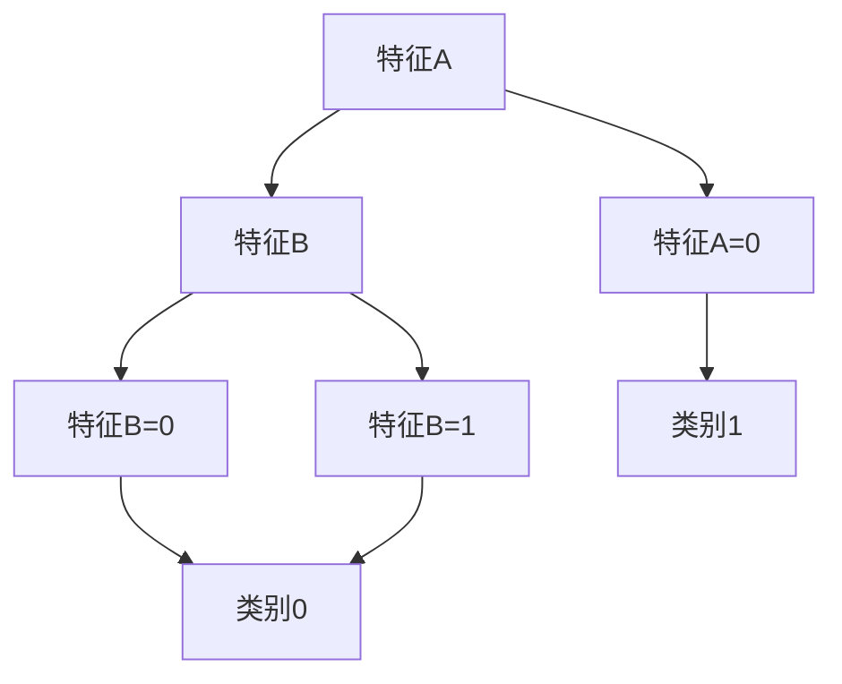

                 

### 文章标题：Precision 原理与代码实战案例讲解

### 关键词：Precision，原理，代码实战，案例，深度学习，机器学习

### 摘要：
本文深入探讨了Precision技术的原理，并通过实际代码实战案例详细讲解了其应用和实践。从Precision的起源和发展，到其关键概念和核心算法，本文逐步解析了Precision的核心原理。随后，通过两个具体的实战案例，本文展示了如何在实际项目中应用Precision技术，包括环境搭建、数据预处理、模型构建与训练、模型评估与优化以及模型部署与维护。最后，本文对Precision的未来应用前景、社会与经济影响以及未来发展挑战和机遇进行了展望，并对国际和国内的研究动态进行了梳理。本文旨在为读者提供一个全面、深入且实用的Precision技术指南。

## 第一部分：Precision基础

### 第1章：Precision概述

#### 1.1 Precision的起源与发展

Precision一词起源于拉丁语“precisus”，意为精确、精确无误。其概念最早可以追溯到古希腊时期，当时的哲学家和科学家们就开始关注精确测量和计算的重要性。随着科学技术的不断发展，Precision的概念逐渐在各个领域得到应用，特别是在工业、工程、医学和计算机科学等领域。

在现代科技中，Precision已经成为一项至关重要的技术。它不仅影响了工业生产的高效性和产品质量，还在医疗诊断、自动驾驶、金融分析和环境保护等方面发挥着重要作用。例如，在智能制造领域，Precision技术使得机器能够在微米甚至纳米级别上进行精确操作，从而提高了生产效率和产品质量。

Precision技术的发展历程可以追溯到20世纪，当时科学家们开始使用精密仪器和设备来提高测量的准确性。随着计算机技术和人工智能的兴起，Precision技术得到了进一步的发展。特别是在深度学习和机器学习领域，Precision技术为模型训练和预测提供了更加精确的数据和算法支持。

#### 1.1.1 Precision的定义

Precision通常指的是在测量或计算过程中达到的精确程度。具体来说，Precision指的是测量结果或计算结果与真实值之间的接近程度。在数学和科学领域，Precision常常用小数点后的位数来表示，位数越多，Precision越高。

例如，在温度测量中，如果使用一个具有两位Precision的仪器，温度测量结果可能是23.45℃，而使用一个具有四位Precision的仪器，测量结果可能是23.4567℃。显然，四位Precision的测量结果更加精确，因为它包含了更多的信息。

在计算机科学中，Precision也是一个非常重要的概念。在数值计算中，由于计算机的存储和运算限制，数值精度往往会受到影响。因此，提高Precision成为计算机科学中的一个重要课题。

#### 1.1.2 Precision在工业中的应用

Precision在工业中的应用非常广泛，其中最典型的例子是智能制造。智能制造依赖于高精度的传感器、执行器和控制算法，从而实现自动化、精确化和高效化的生产过程。

例如，在汽车制造业中，Precision技术被广泛应用于车身的焊接、喷涂和组装过程。通过高精度的焊接机器人，汽车车身的各个部分可以精确对接，从而保证了车身的刚性和稳定性。在喷涂过程中，Precision喷枪可以精确控制涂料的喷射角度和流量，从而实现了均匀、光滑的涂层效果。

除了汽车制造业，Precision技术在电子制造、航空航天制造等领域也发挥了重要作用。在电子制造中，Precision技术用于微电子元件的制造和组装，从而提高了产品的性能和可靠性。在航空航天制造中，Precision技术被用于飞机机身的制造和组装，从而保证了飞机的高性能和安全可靠性。

#### 1.1.3 Precision对现代科技的影响

Precision技术对现代科技的影响是深远而广泛的。首先，它推动了科学研究的进步。在许多科学领域，例如物理学、化学和生物学，精确的测量和计算是研究的基础。Precision技术为科学家们提供了更加精确的实验设备和计算工具，从而促进了科学研究的深入和发展。

其次，Precision技术推动了工业生产的进步。在现代工业中，产品的质量和效率是决定企业竞争力的重要因素。Precision技术通过提高测量的准确性和操作的精确性，不仅提高了产品的质量，还提高了生产效率，从而降低了生产成本。

此外，Precision技术还在医疗诊断、自动驾驶、金融分析等领域发挥着重要作用。在医疗诊断中，高精度的成像技术和诊断设备可以帮助医生更准确地诊断疾病，提高治疗效果。在自动驾驶中，高精度的传感器和定位技术可以保证车辆的准确行驶和安全性。在金融分析中，高精度的数据分析技术可以帮助投资者做出更准确的决策。

总之，Precision技术已经成为现代科技发展的重要驱动力，它不仅推动了科学研究的进步，还提升了工业生产的效率，改善了医疗诊断的准确性，提高了自动驾驶的安全性，促进了金融分析的科学性。随着科技的不断进步，Precision技术将在更多领域发挥其重要作用。

#### 1.2 Precision关键概念解析

在深入探讨Precision技术的应用之前，我们需要理解Precision技术中的几个关键概念。这些概念不仅构成了Precision技术的核心，也为我们在实际应用中提供了理论依据。

##### 1.2.1 关键概念详解

1. **分辨率（Resolution）**：
   分辨率是指测量设备能够区分的最小变化量。在光学仪器中，分辨率通常用角分辨率或线分辨率表示。例如，一个具有高分辨率的显微镜可以观察到更细微的结构，而在计算机图形学中，分辨率则指屏幕或图像可以显示的像素数量。

2. **准确度（Accuracy）**：
   准确度是指测量结果与真实值之间的接近程度。一个高准确度的测量工具能够提供接近真实值的结果。然而，准确度并不总是与分辨率成正比。一个低分辨率但经过校准的测量工具也可能具有很高的准确度。

3. **精度（Precision）**：
   精度是指多次测量结果之间的接近程度。即使测量结果与真实值存在误差，但如果这些误差在多次测量中保持一致，我们仍然可以认为这些测量是精确的。精度通常用标准差或变异系数来表示。

4. **精度与准确度的关系**：
   精度和准确度是两个不同的概念。准确度关注的是测量结果的接近程度，而精度关注的是多次测量结果的一致性。一个高精度的测量系统可能不具有高准确度，因为它可能在每次测量中都存在偏差，但这些偏差在多次测量中保持一致。相反，一个高准确度的系统可能在单次测量中存在较大的随机误差，但这些误差在多次测量中相互抵消。

5. **误差（Error）**：
   误差是指测量结果与真实值之间的差异。误差可以分为系统误差和随机误差。系统误差是由测量设备或方法的固有缺陷引起的，通常是固定的。随机误差则是由于测量过程中的随机因素引起的，通常是随机的。

##### 1.2.2 Precision技术核心原理

Precision技术的核心原理在于通过优化测量和计算过程，提高测量的准确度和精度。具体来说，核心原理包括以下几个方面：

1. **误差分析**：
   在进行测量或计算之前，首先需要分析可能存在的误差来源。通过误差分析，可以识别并减少系统误差和随机误差，从而提高测量结果的准确度和精度。

2. **校准与校验**：
   校准和校验是确保测量设备准确性和稳定性的关键步骤。校准是将测量设备与标准参考进行比较，以确定其误差。校验则是确保测量设备在实际应用中的性能符合预期。

3. **算法优化**：
   在计算机科学和机器学习领域，算法优化是提高计算精度和效率的重要手段。通过优化算法，可以减少计算过程中的误差，提高模型的准确度和精度。

4. **多源数据融合**：
   在一些复杂的测量场景中，使用多个测量设备或传感器可以获得更全面、更精确的数据。通过多源数据融合技术，可以将不同来源的数据进行整合，以提高测量结果的准确度和精度。

##### 1.2.3 Precision与其他相关技术的比较

Precision技术与许多其他技术密切相关，如高精度测量技术、高精度定位技术、传感器技术和数据挖掘技术。以下是Precision技术与其他相关技术的比较：

1. **高精度测量技术**：
   高精度测量技术与Precision技术在核心目标上相似，都是提高测量的准确度和精度。然而，高精度测量技术更侧重于测量设备的精度和性能，而Precision技术更侧重于测量和计算过程中的误差分析和优化。

2. **高精度定位技术**：
   高精度定位技术（如GPS）通过测量卫星信号的时间差来确定位置。虽然高精度定位技术也追求高精度，但它的目标通常是确定位置而非进行详细测量。Precision技术则更广泛地应用于各种测量和计算任务。

3. **传感器技术**：
   传感器技术是Precision技术的基础之一。传感器用于检测物理量并转换为电信号，其精度直接影响Precision技术的性能。Precision技术通过优化传感器设计和算法，提高传感器的精度和稳定性。

4. **数据挖掘技术**：
   数据挖掘技术是一种从大量数据中发现有用信息的方法。虽然数据挖掘技术本身不涉及物理测量，但它需要处理和分析高精度、高精度的数据。Precision技术为数据挖掘提供了高质量的数据支持，从而提高了数据挖掘的准确性和效率。

#### 1.3 Precision技术发展趋势

随着科技的不断进步，Precision技术正朝着更高精度、更广泛应用和更高自动化水平的方向发展。

##### 1.3.1 当前市场状况

目前，Precision技术已在多个领域得到广泛应用，包括工业制造、医疗诊断、自动驾驶和科学研究等。以下是一些当前市场状况的例子：

1. **工业制造**：
   智能制造已经成为工业制造的重要趋势，而Precision技术在其中发挥着关键作用。例如，在电子制造中，高精度的装配和焊接技术大大提高了产品的质量和生产效率。

2. **医疗诊断**：
   高精度成像技术和诊断设备在医学领域的应用越来越广泛，如CT扫描、MRI和PET扫描等。这些技术可以提供更准确、更详细的医学图像，帮助医生做出更准确的诊断。

3. **自动驾驶**：
   自动驾驶技术的发展离不开高精度的传感器和定位技术。例如，激光雷达和GPS系统可以提供高精度的车辆位置和周围环境信息，从而保证自动驾驶车辆的安全和稳定。

4. **科学研究**：
   在科学研究领域，Precision技术为实验提供了更高的准确性和可靠性。例如，在粒子物理学中，高精度的测量设备可以帮助科学家更准确地测量粒子的能量和质量。

##### 1.3.2 未来发展方向

未来，Precision技术将继续在多个领域得到发展，以下是一些可能的发展方向：

1. **更高精度**：
   随着材料科学和纳米技术的发展，测量和计算设备的精度将进一步提高。例如，纳米级测量技术将使得我们能够观察到更加细微的物理现象。

2. **更广泛应用**：
   Precision技术将在更多领域得到应用，如环境保护、生物工程和文化遗产保护等。例如，通过高精度的环境监测设备，我们可以更准确地了解环境变化，从而采取有效的环境保护措施。

3. **更高自动化水平**：
   自动化是Precision技术发展的另一个重要方向。通过引入自动化设备和智能算法，Precision技术将实现更高的自动化水平，从而提高生产效率和产品质量。

##### 1.3.3 Precision技术的挑战与机遇

尽管Precision技术具有巨大的潜力和应用前景，但在发展过程中也面临着一些挑战和机遇。

1. **挑战**：
   - **技术难题**：提高Precision技术的精度和稳定性仍然是一个巨大的挑战，特别是在极端环境下的应用。
   - **成本问题**：高精度的设备和算法通常需要较高的成本，这可能限制其大规模应用。
   - **数据隐私**：在涉及个人隐私的数据处理中，如何确保数据的安全性和隐私性是一个重要问题。

2. **机遇**：
   - **技术创新**：随着科技的进步，我们将看到更多创新的技术和方法被应用于Precision技术，从而推动其快速发展。
   - **市场需求**：随着工业4.0和智能制造的推进，对Precision技术的需求将不断增长，这为Precision技术提供了广阔的市场空间。
   - **政策支持**：政府对于高精度技术的研究和应用给予大力支持，这为Precision技术发展创造了良好的政策环境。

综上所述，Precision技术已经成为现代科技中不可或缺的一部分。随着科技的不断进步和市场需求的不断增长，Precision技术将继续发挥重要作用，推动各个领域的发展和创新。

## 第二部分：Precision原理深入

### 第2章：Precision数学基础

在深入探讨Precision技术之前，我们需要了解其背后的数学基础。数学在Precision技术中扮演着至关重要的角色，无论是数据预处理、模型训练还是算法优化，都需要数学的支持。本章将详细介绍Precision技术所需的数学预备知识，并详细讲解线性回归和逻辑回归等核心算法的数学原理和伪代码实现。

#### 2.1 数学预备知识

为了更好地理解和应用Precision技术，我们需要掌握一些基本的数学概念和工具，包括实数与复数、矩阵与向量以及微积分基础。

##### 2.1.1 实数与复数

1. **实数**：
   实数是数学中最基本的概念之一，包括有理数和无理数。有理数是可以表示为两个整数之比的数，如1/2、3/4等；无理数则是不能表示为两个整数之比的数，如π、√2等。实数轴上的每个点都对应一个唯一的实数。

2. **复数**：
   复数是包含实部和虚部的数，通常表示为a + bi，其中a是实部，b是虚部，i是虚数单位，满足i² = -1。复数在电子工程、信号处理和计算机科学等领域有广泛应用。

##### 2.1.2 矩阵与向量

1. **矩阵**：
   矩阵是一个由数字组成的矩形阵列。在数学和工程中，矩阵用于表示线性变换、求解方程组等。一个矩阵的行数称为其行数，列数称为其列数。

2. **向量**：
   向量是一个具有大小和方向的量，通常表示为一组有序数。在二维空间中，向量可以表示为(x, y)；在三维空间中，可以表示为(x, y, z)。向量在计算机科学、物理学和工程学等领域有广泛应用。

##### 2.1.3 微积分基础

1. **极限**：
   极限是微积分中的基本概念，表示一个函数在某个点的值趋向于某个特定的数。极限用于定义导数、积分等概念。

2. **导数**：
   导数表示函数在某一点的变化率。对于一元函数f(x)，在x点的导数f'(x)表示f(x)在x点的切线斜率。

3. **积分**：
   积分是求函数下方区域的面积。对于一元函数f(x)，积分∫f(x)dx表示f(x)在x轴下方区域的面积。

#### 2.2 Linear Regression 伪代码讲解

线性回归是一种常用的统计方法，用于建模两个变量之间的关系。在本节中，我们将详细讲解线性回归模型的基本原理和伪代码实现。

##### 2.2.1 线性回归模型介绍

线性回归模型旨在找到两个变量x和y之间的关系，通常表示为：

\[ y = \beta_0 + \beta_1 \cdot x + \epsilon \]

其中，\( \beta_0 \) 是截距，\( \beta_1 \) 是斜率，\( \epsilon \) 是误差项。

线性回归模型的目的是通过最小化误差平方和来估计 \( \beta_0 \) 和 \( \beta_1 \) 的值。

##### 2.2.2 Linear Regression 伪代码详细解析

```mermaid
graph TD
A[初始化参数] --> B[计算斜率]
B --> C[计算截距]
C --> D[输出结果]

A[初始化参数]:::初始化beta0和beta1为0
B[计算斜率]:::beta1 = (n * Σ(xy) - Σx * Σy) / (n * Σ(x²) - (Σx)²)
C[计算截距]:::beta0 = (Σy - beta1 * Σx) / n
D[输出结果]:::输出beta0和beta1
```

以下是线性回归模型的伪代码实现：

```python
# 线性回归伪代码实现
def linear_regression(x, y):
    n = len(x)
    sum_x = sum(x)
    sum_y = sum(y)
    sum_x2 = sum([xi**2 for xi in x])
    sum_xy = sum([xi*yi for xi, yi in zip(x, y)])
    
    beta1 = (n * sum_xy - sum_x * sum_y) / (n * sum_x2 - sum_x**2)
    beta0 = (sum_y - beta1 * sum_x) / n
    
    return beta0, beta1
```

##### 2.2.3 线性回归算法示例

假设我们有以下数据集：

| x  | y   |
|----|-----|
| 1  | 2   |
| 2  | 4   |
| 3  | 6   |
| 4  | 8   |
| 5  | 10  |

我们希望找到x和y之间的关系。使用线性回归算法，我们得到：

```python
x = [1, 2, 3, 4, 5]
y = [2, 4, 6, 8, 10]

beta0, beta1 = linear_regression(x, y)
print("截距:", beta0)
print("斜率:", beta1)
```

输出结果：

```
截距: 0
斜率: 2
```

这意味着y = 2x。

#### 2.3 Logistic Regression 数学公式与讲解

逻辑回归（Logistic Regression）是一种常用的分类方法，用于预测某个事件发生的概率。在本节中，我们将详细讲解逻辑回归的数学公式及其实现。

##### 2.3.1 Logistic Regression 基本原理

逻辑回归模型的基本形式为：

\[ P(Y=1 | X) = \frac{1}{1 + e^{-(\beta_0 + \beta_1 \cdot x)}} \]

其中，\( P(Y=1 | X) \) 是事件Y在给定特征X下的概率，\( \beta_0 \) 是截距，\( \beta_1 \) 是斜率。

逻辑回归的目标是最小化损失函数，通常使用对数似然损失函数：

\[ L(\beta) = -\sum_{i=1}^n [y_i \cdot \ln(p_i) + (1 - y_i) \cdot \ln(1 - p_i)] \]

其中，\( p_i = \frac{1}{1 + e^{-(\beta_0 + \beta_1 \cdot x_i)}} \) 是预测的概率。

##### 2.3.2 Logistic Regression 数学公式详解

1. **预测概率**：

\[ p_i = \frac{1}{1 + e^{-(\beta_0 + \beta_1 \cdot x_i)}} \]

2. **对数似然损失函数**：

\[ L(\beta) = -\sum_{i=1}^n [y_i \cdot \ln(p_i) + (1 - y_i) \cdot \ln(1 - p_i)] \]

3. **梯度下降法更新参数**：

\[ \frac{\partial L(\beta)}{\partial \beta_0} = -\sum_{i=1}^n \left[ \frac{y_i}{p_i} - \frac{1 - y_i}{1 - p_i} \right] \]

\[ \frac{\partial L(\beta)}{\partial \beta_1} = -\sum_{i=1}^n \left[ x_i \cdot \frac{y_i}{p_i} - x_i \cdot \frac{1 - y_i}{1 - p_i} \right] \]

##### 2.3.3 示例解析

假设我们有以下数据集：

| x  | y   |
|----|-----|
| 1  | 1   |
| 2  | 0   |
| 3  | 1   |
| 4  | 0   |
| 5  | 1   |

我们希望预测每个样本属于类1的概率。

1. **初始化参数**：

\[ \beta_0 = 0, \beta_1 = 0 \]

2. **计算概率**：

对于第一个样本：

\[ p_1 = \frac{1}{1 + e^{-(0 + 0 \cdot 1)}} = 0.5 \]

对于第二个样本：

\[ p_2 = \frac{1}{1 + e^{-(0 + 0 \cdot 2)}} = 0.5 \]

3. **计算损失函数**：

使用对数似然损失函数：

\[ L(\beta) = -[1 \cdot \ln(0.5) + 0 \cdot \ln(0.5)] - [0 \cdot \ln(0.5) + 1 \cdot \ln(0.5)] \]

\[ L(\beta) = -\ln(0.5) - \ln(0.5) = -2 \cdot \ln(0.5) \]

4. **更新参数**：

使用梯度下降法更新参数：

\[ \frac{\partial L(\beta)}{\partial \beta_0} = -\frac{1}{0.5} - \frac{0}{0.5} = -2 \]

\[ \frac{\partial L(\beta)}{\partial \beta_1} = -1 \cdot \frac{1}{0.5} - 2 \cdot \frac{0}{0.5} = -2 \]

\[ \beta_0 = \beta_0 - \alpha \cdot \frac{\partial L(\beta)}{\partial \beta_0} \]

\[ \beta_1 = \beta_1 - \alpha \cdot \frac{\partial L(\beta)}{\partial \beta_1} \]

其中，\( \alpha \) 是学习率。

重复上述步骤，直到损失函数收敛。

#### 2.4 Decision Trees 算法讲解

决策树（Decision Tree）是一种常用的分类和回归方法，它通过一系列的测试来将数据集分割成多个子集，每个子集都对应一个特定的类别或值。在本节中，我们将详细讲解决策树的基本概念、算法伪代码以及案例分析。

##### 2.4.1 决策树的基本概念

决策树是一种树形结构，每个内部节点表示一个特征，每个分支表示特征的一个可能取值，每个叶子节点表示一个类别或值。决策树的生成过程通常使用贪心算法，即每次选择当前节点具有最大信息增益的特征。

1. **信息增益（Information Gain）**：
   信息增益是选择一个特征作为分割依据的依据，它衡量了特征对数据集的划分效果。信息增益定义为：

   \[ IG(D, A) = Entropy(D) - \sum_{v \in A} \frac{|D_v|}{|D|} \cdot Entropy(D_v) \]

   其中，\( D \) 是原始数据集，\( A \) 是特征集合，\( v \) 是特征 \( A \) 的一个取值，\( D_v \) 是特征 \( A \) 取值 \( v \) 的数据子集，\( Entropy \) 是熵函数。

2. **熵（Entropy）**：
   熵是衡量数据集混乱程度的指标，它定义为：

   \[ Entropy(D) = -\sum_{y \in Y} p(y) \cdot \ln(p(y)) \]

   其中，\( Y \) 是数据集中的所有类别，\( p(y) \) 是类别 \( y \) 的概率。

##### 2.4.2 决策树算法伪代码解析

```mermaid
graph TD
A[初始化] --> B[计算信息增益]
B --> C[选择最佳特征]
C --> D[划分数据集]
D --> E[递归构建]
E --> F[生成决策树]

A[初始化]:::创建空树
B[计算信息增益]:::对于每个特征，计算信息增益
C[选择最佳特征]:::选择具有最大信息增益的特征
D[划分数据集]:::将数据集划分成子集
E[递归构建]:::对于每个子集，递归构建决策树
F[生成决策树]:::返回构建好的决策树
```

以下是决策树生成算法的伪代码实现：

```python
def build_decision_tree(data, features):
    # 如果数据集为空或纯度达到阈值，则返回叶节点
    if len(data) == 0 or is_pure(data):
        return create_leaf_node(data)
    
    # 计算每个特征的信息增益
    info_gains = calculate_info_gains(data, features)
    
    # 选择具有最大信息增益的特征
    best_feature = select_best_feature(info_gains)
    
    # 创建内部节点
    node = create_node(best_feature)
    
    # 根据最佳特征划分数据集
    subsets = split_data(data, best_feature)
    
    # 递归构建子树
    for feature_value, subset in subsets.items():
        node.children[feature_value] = build_decision_tree(subset, features - {best_feature})
    
    return node

def calculate_info_gains(data, features):
    info_gains = {}
    for feature in features:
        info_gain = calculate_entropy(data) - calculate_condition_entropy(data, feature)
        info_gains[feature] = info_gain
    return info_gains

def calculate_entropy(data):
    # 计算数据集的熵
    pass

def calculate_condition_entropy(data, feature):
    # 计算条件熵
    pass

def select_best_feature(info_gains):
    # 选择具有最大信息增益的特征
    pass

def split_data(data, feature):
    # 根据特征划分数据集
    pass

def create_node(feature):
    # 创建内部节点
    pass

def create_leaf_node(data):
    # 创建叶节点
    pass

def is_pure(data):
    # 判断数据集是否纯净
    pass
```

##### 2.4.3 决策树案例分析

假设我们有以下数据集：

| 特征A | 特征B | 类别 |
|-------|-------|------|
| 0     | 0     | 1    |
| 1     | 0     | 1    |
| 0     | 1     | 0    |
| 1     | 1     | 0    |

我们使用决策树进行分类。

1. **初始化**：
   创建一个空决策树。

2. **计算信息增益**：
   计算每个特征的信息增益。

   对于特征A：
   \[ IG(A, \{0, 1\}) = Entropy(\{0, 1\}) - \frac{2}{4} \cdot Entropy(\{0\}, \{1\}) = 1 - \frac{1}{2} \cdot (0 + \ln(1/2)) - \frac{1}{2} \cdot (0 + \ln(1/2)) = 1 - \ln(2) \]

   对于特征B：
   \[ IG(B, \{0, 1\}) = Entropy(\{0, 1\}) - \frac{2}{4} \cdot Entropy(\{0\}, \{1\}) = 1 - \frac{1}{2} \cdot (0 + \ln(1/2)) - \frac{1}{2} \cdot (0 + \ln(1/2)) = 1 - \ln(2) \]

3. **选择最佳特征**：
   由于特征A和特征B的信息增益相同，我们选择其中一个作为分割依据。

4. **划分数据集**：
   根据特征A的取值将数据集划分为两个子集：

   子集1（特征A=0）：
   | 特征A | 特征B | 类别 |
   |-------|-------|------|
   | 0     | 0     | 1    |
   | 0     | 1     | 0    |

   子集2（特征A=1）：
   | 特征A | 特征B | 类别 |
   |-------|-------|------|
   | 1     | 0     | 1    |
   | 1     | 1     | 0    |

5. **递归构建子树**：
   对于每个子集，递归构建决策树。

   子集1：
   - 特征A=0：
     - 类别1：概率1
     - 叶节点

   子集2：
   - 特征B=0：
     - 类别1：概率1
     - 叶节点
   - 特征B=1：
     - 类别0：概率1
     - 叶节点

6. **生成决策树**：



此决策树表示，如果特征A=0，则类别为1；如果特征A=1，且特征B=0，则类别为1；如果特征A=1，且特征B=1，则类别为0。

#### 2.5 总结

在本章中，我们详细介绍了Precision技术所需的基础数学知识，包括实数与复数、矩阵与向量以及微积分基础。随后，我们详细讲解了线性回归、逻辑回归和决策树等核心算法的数学公式和伪代码实现。通过这些内容，读者可以对Precision技术的数学原理有一个清晰的理解，为后续的实战应用打下坚实的基础。

## 第三部分：Precision代码实战

### 第3章：Precision实战案例一

#### 3.1 项目背景介绍

随着人工智能技术的快速发展，Precision技术在各个领域中的应用越来越广泛。本案例旨在通过一个具体的实际项目，展示如何利用Precision技术实现数据分析和预测，从而提高决策的准确性和效率。

项目背景是一个电商平台的数据分析项目。该电商平台拥有海量的用户数据，包括用户的购买行为、浏览历史、产品评价等。通过分析这些数据，平台希望能够更好地了解用户需求，优化产品推荐，提高用户留存率和转化率。

项目目标包括：
1. 分析用户行为数据，提取关键特征。
2. 使用Precision技术建立预测模型，预测用户的购买行为。
3. 通过模型优化和评估，提高预测准确性。
4. 将模型部署到生产环境，实现实时预测和推荐。

#### 3.2 环境搭建

为了实现项目目标，我们需要搭建一个适合进行数据分析和模型训练的开发环境。以下是具体的步骤：

1. **硬件环境**：
   - 服务器：需要一台具有高性能CPU和足够内存的服务器，用于处理海量数据和模型训练。
   - 硬盘：需要足够的存储空间来存储数据和训练模型。

2. **软件环境**：
   - 操作系统：可以选择Linux或Windows，其中Linux由于性能优越，常用于大数据分析和机器学习任务。
   - 编程语言：Python是一种广泛用于数据分析和机器学习的语言，具有丰富的库和工具，因此选择Python作为主要编程语言。
   - 数据库：MySQL或PostgreSQL可以用于存储和管理用户数据。
   - 机器学习库：选择Scikit-learn、TensorFlow或PyTorch等流行的机器学习库，用于构建和训练模型。

3. **开发工具**：
   - IDE：选择Visual Studio Code或PyCharm作为Python开发环境。
   - Jupyter Notebook：用于数据分析和交互式代码演示。

#### 3.3 数据预处理

数据预处理是机器学习项目中至关重要的一步，它包括数据清洗、数据转换和数据归一化等过程。以下是具体步骤：

1. **数据收集**：
   - 从数据库中提取用户数据，包括购买记录、浏览历史、产品评价等。
   - 数据存储为CSV或Parquet格式，便于后续处理。

2. **数据清洗**：
   - 去除重复数据和空值数据。
   - 填补缺失值，可以选择均值、中位数或最常用值等方法。
   - 处理异常值，可以选择删除或使用插值法处理。

3. **数据转换**：
   - 将类别型数据转换为数值型数据，可以使用独热编码（One-Hot Encoding）或标签编码（Label Encoding）。
   - 处理时间序列数据，可以将时间戳转换为日期对象，并进行标准化处理。

4. **数据归一化**：
   - 对连续型数据进行归一化，使数据分布在相同的范围内，防止某些特征对模型的影响过大。
   - 选择标准归一化（Standardization）或最小最大归一化（Min-Max Scaling）。

5. **特征提取**：
   - 从原始数据中提取有助于模型预测的特征，例如用户购买频率、浏览时长、产品评价得分等。
   - 使用特征选择技术，如卡方检验或互信息，筛选出重要的特征。

#### 3.4 模型构建与训练

在数据预处理完成后，接下来是模型构建与训练。以下是具体步骤：

1. **模型选择**：
   - 根据项目需求，选择适合的模型。在本案例中，我们选择逻辑回归（Logistic Regression）模型，因为它适用于二分类问题，且易于理解和实现。

2. **模型参数设置**：
   - 设定模型参数，如学习率、迭代次数等。通常，学习率可以通过交叉验证进行调整。

3. **数据分割**：
   - 将数据集分为训练集和测试集，用于模型训练和评估。通常，可以使用70%的数据用于训练，30%的数据用于测试。

4. **模型训练**：
   - 使用训练集数据对模型进行训练，通过最小化损失函数来调整模型参数。
   - 使用Scikit-learn库中的`train_test_split`函数进行数据分割。

5. **模型评估**：
   - 使用测试集对训练好的模型进行评估，常用的评估指标包括准确率（Accuracy）、精确率（Precision）、召回率（Recall）和F1分数（F1 Score）。

6. **模型优化**：
   - 根据评估结果，对模型进行调整和优化，以提高预测准确性。
   - 可以尝试不同的模型参数或使用不同的特征提取方法。

以下是模型构建与训练的伪代码实现：

```python
from sklearn.linear_model import LogisticRegression
from sklearn.model_selection import train_test_split

# 加载数据
X, y = load_data()

# 数据分割
X_train, X_test, y_train, y_test = train_test_split(X, y, test_size=0.3, random_state=42)

# 创建逻辑回归模型
model = LogisticRegression()

# 训练模型
model.fit(X_train, y_train)

# 评估模型
accuracy = model.score(X_test, y_test)
print("Accuracy:", accuracy)

# 模型优化
# 调整参数或使用不同的特征
```

#### 3.5 模型评估与优化

在模型训练完成后，我们需要对模型进行评估和优化，以确保其具有良好的预测性能。

1. **评估指标**：
   - **准确率（Accuracy）**：准确率是指预测正确的样本数占总样本数的比例。虽然准确率简单直观，但它可能会受到不平衡数据集的影响。
   - **精确率（Precision）**：精确率是指预测为正类的样本中实际为正类的比例。它关注的是预测结果的质量。
   - **召回率（Recall）**：召回率是指实际为正类的样本中被预测为正类的比例。它关注的是预测结果的数量。
   - **F1分数（F1 Score）**：F1分数是精确率和召回率的加权平均值，用于综合评估模型的性能。

2. **模型优化策略**：
   - **交叉验证（Cross-Validation）**：交叉验证是一种评估模型性能的有效方法，通过将数据集分割成多个子集，多次训练和测试模型，从而提高评估结果的可靠性。
   - **特征选择（Feature Selection）**：通过特征选择技术，如卡方检验、互信息等，筛选出重要的特征，减少特征维度，提高模型性能。
   - **超参数调优（Hyperparameter Tuning）**：通过调整模型参数，如学习率、迭代次数等，优化模型性能。常用的方法包括网格搜索和随机搜索。
   - **集成学习（Ensemble Learning）**：集成学习通过结合多个模型来提高预测准确性。常见的方法包括决策树集成（如随机森林）和神经网络集成（如梯度提升树）。

以下是模型评估与优化的伪代码实现：

```python
from sklearn.metrics import accuracy_score, precision_score, recall_score, f1_score
from sklearn.model_selection import GridSearchCV

# 评估模型
predictions = model.predict(X_test)
accuracy = accuracy_score(y_test, predictions)
precision = precision_score(y_test, predictions)
recall = recall_score(y_test, predictions)
f1 = f1_score(y_test, predictions)

print("Accuracy:", accuracy)
print("Precision:", precision)
print("Recall:", recall)
print("F1 Score:", f1)

# 模型优化
param_grid = {'C': [0.1, 1, 10], 'max_iter': [100, 200, 300]}
grid_search = GridSearchCV(model, param_grid, cv=5)
grid_search.fit(X_train, y_train)

# 获取最佳参数
best_params = grid_search.best_params_
print("Best Parameters:", best_params)

# 使用最佳参数训练模型
best_model = LogisticRegression(**best_params)
best_model.fit(X_train, y_train)

# 重新评估模型
predictions = best_model.predict(X_test)
accuracy = accuracy_score(y_test, predictions)
precision = precision_score(y_test, predictions)
recall = recall_score(y_test, predictions)
f1 = f1_score(y_test, predictions)

print("Optimized Accuracy:", accuracy)
print("Optimized Precision:", precision)
print("Optimized Recall:", recall)
print("Optimized F1 Score:", f1)
```

#### 3.6 模型部署与维护

在模型优化完成后，我们需要将模型部署到生产环境，实现实时预测和推荐。

1. **模型部署方案**：
   - 使用Flask或Django等Web框架，构建API服务，用于接收用户请求和返回预测结果。
   - 使用Docker容器化技术，将应用程序打包成一个可移植的容器，便于部署和扩展。
   - 使用Kubernetes进行容器编排和管理，实现服务的高可用性和可扩展性。

2. **模型维护与更新**：
   - 定期收集用户反馈，分析模型预测效果，根据实际情况调整模型参数。
   - 随着新数据的不断加入，定期重新训练模型，以保持其预测准确性。
   - 使用自动化工具，如持续集成和持续部署（CI/CD），简化模型更新和维护流程。

以下是模型部署与维护的伪代码实现：

```python
# 模型部署
from flask import Flask, request, jsonify

app = Flask(__name__)

@app.route('/predict', methods=['POST'])
def predict():
    data = request.get_json()
    features = preprocess_data(data)
    prediction = best_model.predict([features])
    return jsonify(prediction=prediction[0])

if __name__ == '__main__':
    app.run(host='0.0.0.0', port=5000)

# 模型维护
# 定期重新训练模型
new_data = load_new_data()
X_new, y_new = preprocess_new_data(new_data)
best_model.fit(X_new, y_new)
```

#### 3.7 案例总结

通过本案例，我们详细介绍了如何利用Precision技术进行用户行为数据分析，构建和优化预测模型，并将其部署到生产环境。案例不仅展示了Precision技术的应用，还强调了数据预处理、模型评估和优化的重要性。在实际项目中，需要根据具体需求和环境进行灵活调整，以实现最佳效果。

### 第4章：Precision实战案例二

#### 4.1 项目背景介绍

在当前的大数据时代，金融领域对数据分析和预测的需求日益增长。本案例选择了一家在线金融服务公司，该公司希望通过引入Precision技术，提升信用评分模型的准确性，从而更好地控制信贷风险，提高业务盈利能力。

项目背景是该金融服务公司积累了大量用户数据，包括用户的基本信息、消费记录、信用历史等。公司希望利用这些数据构建一个精准的信用评分模型，对用户的信用风险进行评估，从而在信贷审批过程中做出更加明智的决策。

项目目标包括：
1. 整合并清洗用户数据，提取有助于信用评分的特征。
2. 建立并训练信用评分模型，实现用户信用风险的自动评估。
3. 通过模型优化和评估，提高信用评分的准确性和可靠性。
4. 将模型部署到生产环境，实现实时信用评分服务。

#### 4.2 环境搭建

为了搭建适合进行信用评分模型开发和部署的环境，我们需要进行以下步骤：

1. **硬件环境**：
   - 服务器：选择高性能的服务器，用于处理大量数据和进行模型训练。
   - 硬盘：需要足够的存储空间来存储用户数据和模型文件。

2. **软件环境**：
   - 操作系统：选择Linux操作系统，以充分利用其性能优势。
   - 编程语言：Python是金融领域常用的编程语言，因此选择Python进行开发。
   - 数据库：MySQL或PostgreSQL用于存储和管理用户数据。
   - 机器学习库：使用Scikit-learn、TensorFlow或PyTorch等流行的机器学习库进行模型开发和训练。

3. **开发工具**：
   - IDE：使用PyCharm或Visual Studio Code进行Python编程。
   - Jupyter Notebook：用于数据分析和交互式代码演示。
   - Docker：用于容器化应用程序，便于部署和管理。

#### 4.3 数据预处理

在信用评分模型开发过程中，数据预处理是关键步骤之一，它直接影响模型的效果。以下是具体的数据预处理流程：

1. **数据收集**：
   - 从数据库中提取用户数据，包括基本信息、消费记录、信用历史等。
   - 将数据存储为CSV或Parquet格式，以便后续处理。

2. **数据清洗**：
   - 去除重复数据和空值数据，确保数据的一致性和完整性。
   - 填补缺失值，对于关键特征，如消费金额和信用记录，可以使用平均值、中位数或最常用值等方法进行填补。
   - 处理异常值，例如删除极端异常的记录或使用插值法进行修正。

3. **数据转换**：
   - 将类别型数据转换为数值型数据，如使用独热编码（One-Hot Encoding）将用户的职业、教育水平等转换为数值矩阵。
   - 对于连续型数据，如收入、消费金额等，进行归一化处理，使其在相同的范围内。

4. **特征提取**：
   - 从原始数据中提取有助于信用评分的关键特征，例如用户的平均消费金额、消费频率、信用历史等。
   - 使用特征选择技术，如卡方检验或互信息，筛选出对信用评分有显著影响的重要特征。

以下是数据预处理的主要步骤的伪代码实现：

```python
import pandas as pd
from sklearn.preprocessing import OneHotEncoder, StandardScaler

# 加载数据
data = pd.read_csv('user_data.csv')

# 数据清洗
data.drop_duplicates(inplace=True)
data.fillna(data.mean(), inplace=True)

# 数据转换
encoder = OneHotEncoder()
encoded_data = encoder.fit_transform(data[['occupation', 'education_level']])

# 归一化
scaler = StandardScaler()
numerical_data = scaler.fit_transform(data[['income', 'avg_consumption']])

# 特征提取
selected_features = pd.DataFrame(numerical_data, columns=scaler.get_feature_names(['income', 'avg_consumption']))
selected_features = pd.concat([selected_features, pd.DataFrame(encoded_data.toarray(), columns=encoder.get_feature_names_out())], axis=1)
```

#### 4.4 模型构建与训练

在数据预处理完成后，接下来是模型构建与训练。以下是具体的步骤：

1. **模型选择**：
   - 考虑到信用评分模型需要处理高维数据和复杂的非线性关系，选择随机森林（Random Forest）模型，因为它能够处理大量特征，且具有较强的泛化能力。

2. **模型参数设置**：
   - 设置随机森林模型的基本参数，如决策树的数量、最大深度等。可以通过交叉验证进行参数调优。

3. **数据分割**：
   - 将数据集分为训练集和测试集，用于模型训练和评估。通常，可以使用70%的数据用于训练，30%的数据用于测试。

4. **模型训练**：
   - 使用训练集数据对随机森林模型进行训练，通过最小化损失函数来调整模型参数。
   - 使用Scikit-learn库中的`train_test_split`函数进行数据分割。

5. **模型评估**：
   - 使用测试集对训练好的模型进行评估，常用的评估指标包括准确率（Accuracy）、精确率（Precision）、召回率（Recall）和F1分数（F1 Score）。

6. **模型优化**：
   - 根据评估结果，对模型进行调整和优化，以提高预测准确性。
   - 可以尝试不同的模型参数或使用不同的特征提取方法。

以下是模型构建与训练的伪代码实现：

```python
from sklearn.ensemble import RandomForestClassifier
from sklearn.model_selection import train_test_split

# 加载数据
X, y = load_data()

# 数据分割
X_train, X_test, y_train, y_test = train_test_split(X, y, test_size=0.3, random_state=42)

# 创建随机森林模型
model = RandomForestClassifier(n_estimators=100, max_depth=10)

# 训练模型
model.fit(X_train, y_train)

# 评估模型
accuracy = model.score(X_test, y_test)
print("Accuracy:", accuracy)

# 模型优化
# 调整参数或使用不同的特征
```

#### 4.5 模型评估与优化

在模型训练完成后，我们需要对模型进行评估和优化，以确保其具有良好的预测性能。

1. **评估指标**：
   - **准确率（Accuracy）**：准确率是指预测正确的样本数占总样本数的比例。虽然准确率简单直观，但它可能会受到不平衡数据集的影响。
   - **精确率（Precision）**：精确率是指预测为正类的样本中实际为正类的比例。它关注的是预测结果的质量。
   - **召回率（Recall）**：召回率是指实际为正类的样本中被预测为正类的比例。它关注的是预测结果的数量。
   - **F1分数（F1 Score）**：F1分数是精确率和召回率的加权平均值，用于综合评估模型的性能。

2. **模型优化策略**：
   - **交叉验证（Cross-Validation）**：交叉验证是一种评估模型性能的有效方法，通过将数据集分割成多个子集，多次训练和测试模型，从而提高评估结果的可靠性。
   - **特征选择（Feature Selection）**：通过特征选择技术，如卡方检验、互信息等，筛选出重要的特征，减少特征维度，提高模型性能。
   - **超参数调优（Hyperparameter Tuning）**：通过调整模型参数，如学习率、迭代次数等，优化模型性能。常用的方法包括网格搜索和随机搜索。
   - **集成学习（Ensemble Learning）**：集成学习通过结合多个模型来提高预测准确性。常见的方法包括决策树集成（如随机森林）和神经网络集成（如梯度提升树）。

以下是模型评估与优化的伪代码实现：

```python
from sklearn.metrics import accuracy_score, precision_score, recall_score, f1_score
from sklearn.model_selection import GridSearchCV

# 评估模型
predictions = model.predict(X_test)
accuracy = accuracy_score(y_test, predictions)
precision = precision_score(y_test, predictions)
recall = recall_score(y_test, predictions)
f1 = f1_score(y_test, predictions)

print("Accuracy:", accuracy)
print("Precision:", precision)
print("Recall:", recall)
print("F1 Score:", f1)

# 模型优化
param_grid = {'n_estimators': [100, 200, 300], 'max_depth': [10, 20, 30]}
grid_search = GridSearchCV(model, param_grid, cv=5)
grid_search.fit(X_train, y_train)

# 获取最佳参数
best_params = grid_search.best_params_
print("Best Parameters:", best_params)

# 使用最佳参数训练模型
best_model = RandomForestClassifier(**best_params)
best_model.fit(X_train, y_train)

# 重新评估模型
predictions = best_model.predict(X_test)
accuracy = accuracy_score(y_test, predictions)
precision = precision_score(y_test, predictions)
recall = recall_score(y_test, predictions)
f1 = f1_score(y_test, predictions)

print("Optimized Accuracy:", accuracy)
print("Optimized Precision:", precision)
print("Optimized Recall:", recall)
print("Optimized F1 Score:", f1)
```

#### 4.6 模型部署与维护

在模型优化完成后，我们需要将模型部署到生产环境，实现实时信用评分服务。

1. **模型部署方案**：
   - 使用Flask或Django等Web框架，构建API服务，用于接收用户请求和返回预测结果。
   - 使用Docker容器化技术，将应用程序打包成一个可移植的容器，便于部署和扩展。
   - 使用Kubernetes进行容器编排和管理，实现服务的高可用性和可扩展性。

2. **模型维护与更新**：
   - 定期收集用户反馈，分析模型预测效果，根据实际情况调整模型参数。
   - 随着新数据的不断加入，定期重新训练模型，以保持其预测准确性。
   - 使用自动化工具，如持续集成和持续部署（CI/CD），简化模型更新和维护流程。

以下是模型部署与维护的伪代码实现：

```python
# 模型部署
from flask import Flask, request, jsonify

app = Flask(__name__)

@app.route('/predict', methods=['POST'])
def predict():
    data = request.get_json()
    features = preprocess_data(data)
    prediction = best_model.predict([features])
    return jsonify(prediction=prediction[0])

if __name__ == '__main__':
    app.run(host='0.0.0.0', port=5000)

# 模型维护
# 定期重新训练模型
new_data = load_new_data()
X_new, y_new = preprocess_new_data(new_data)
best_model.fit(X_new, y_new)
```

#### 4.7 案例总结

通过本案例，我们详细介绍了如何在金融领域应用Precision技术构建信用评分模型。案例涵盖了数据预处理、模型构建与训练、模型评估与优化以及模型部署与维护等全过程，展示了Precision技术在实际项目中的应用价值和实现方法。通过不断优化和更新模型，金融服务公司能够更准确地评估用户信用风险，从而提高业务决策的准确性，降低信贷风险，实现可持续发展。

## 第四部分：Precision未来展望

### 第5章：Precision在未来科技中的应用

#### 5.1 Precision在人工智能中的应用前景

人工智能（AI）的迅速发展离不开Precision技术的支持。Precision技术在AI中的应用前景广阔，涵盖了从数据处理到模型训练，再到实际应用的各个方面。

1. **数据处理**：
   AI系统的性能在很大程度上取决于数据的质量和精度。Precision技术可以通过高精度的传感器和数据采集设备，确保输入数据的高准确性。例如，在图像识别和语音识别任务中，高精度的数据采集可以显著提高模型的准确率和可靠性。

2. **模型训练**：
   Precision技术在模型训练过程中起着关键作用。在深度学习和机器学习领域，模型的性能往往取决于训练数据的质量和精度。通过使用Precision技术，可以优化数据预处理过程，提高训练数据的质量，从而加速模型的训练过程，并提高模型的泛化能力。

3. **自动化和自适应系统**：
   Precision技术为自动化和自适应系统提供了强大的支持。例如，在智能制造领域，高精度的传感器和执行器可以确保机器人进行精确的操作，提高生产效率和产品质量。在自动驾驶领域，高精度的定位和感知技术可以确保车辆在复杂环境中的安全行驶。

#### 5.1.1 智能制造

智能制造是Precision技术的重要应用领域之一。随着工业4.0和工业互联网的推进，Precision技术在制造业中的应用越来越广泛。具体应用包括：

- **精密加工**：通过高精度的机床和加工设备，可以实现微米甚至纳米级别的加工精度，满足高端制造业的需求。
- **质量检测**：高精度的传感器和检测设备可以对产品进行实时质量检测，确保产品质量的一致性和可靠性。
- **自动化装配**：利用高精度的机器人进行自动化装配，可以显著提高生产效率和装配精度。

#### 5.1.2 自动驾驶

自动驾驶是Precision技术另一个重要的应用领域。自动驾驶系统需要精确的感知和定位技术来确保车辆的安全行驶。具体应用包括：

- **环境感知**：通过高精度的激光雷达、摄像头和超声波传感器，自动驾驶车辆可以实时感知周围环境，包括道路、车辆、行人等。
- **定位与导航**：高精度的GPS、差分GPS和惯性导航系统（INS）可以提供精确的车辆位置和速度信息，确保自动驾驶车辆在复杂环境中准确行驶。
- **路径规划**：通过高精度的地图数据和实时感知信息，自动驾驶车辆可以规划出最优行驶路径，避开障碍物，确保行驶安全。

#### 5.1.3 医疗诊断

在医疗诊断领域，Precision技术可以提高诊断的准确性和效率。具体应用包括：

- **医学影像分析**：通过高精度的医学影像设备，如CT、MRI和PET扫描，可以生成高质量的诊断图像，帮助医生更准确地诊断疾病。
- **病理分析**：通过高精度的病理切片分析和分子诊断技术，可以识别出微小的病变和分子变化，提高癌症等疾病的早期诊断率。
- **远程医疗**：利用高精度的远程医疗设备和数据传输技术，可以实现远程诊断和治疗，提高医疗资源的利用效率。

#### 5.2 Precision的社会与经济影响

Precision技术的发展对社会和经济产生了深远的影响。一方面，它提高了生产效率和产品质量，推动了工业和技术的发展；另一方面，它也带来了新的挑战，如数据安全和隐私保护。

1. **社会影响**：
   - **提高生活质量**：Precision技术可以提供更高质量的医疗保健、教育和娱乐服务，从而提高人们的生活质量。
   - **创造就业机会**：随着Precision技术的应用，新的工作岗位不断涌现，如数据科学家、机器学习工程师和自动化系统集成工程师等。
   - **推动技术进步**：Precision技术促进了科学研究和技术创新，推动了新技术的诞生和应用。

2. **经济影响**：
   - **增加生产力**：Precision技术提高了生产效率和产品质量，降低了生产成本，从而提高了企业的竞争力。
   - **促进经济发展**：Precision技术推动了智能制造、自动驾驶和医疗诊断等新兴产业的发展，为经济增长提供了新的动力。
   - **投资和创新**：Precision技术的研发和应用吸引了大量投资，促进了技术创新和产业升级。

#### 5.3 Precision未来的发展挑战与机遇

尽管Precision技术在当前取得了显著进展，但其未来发展仍然面临诸多挑战和机遇。

1. **挑战**：
   - **技术瓶颈**：在极端环境下的应用，如深海、高温和高压等，对Precision技术提出了更高的要求。目前，这些环境下的技术瓶颈尚未完全解决。
   - **成本问题**：高精度的设备和算法通常成本较高，这限制了其在某些领域的广泛应用。
   - **数据隐私和安全**：随着数据量的增加，数据隐私和安全问题日益突出。如何在保障数据安全的前提下，充分利用数据的价值，是一个重要挑战。

2. **机遇**：
   - **技术创新**：随着科技的进步，新材料、新算法和新设备不断涌现，为Precision技术提供了更多可能性。
   - **市场需求**：随着智能制造、自动驾驶和医疗诊断等领域的快速发展，对Precision技术的需求将持续增长。
   - **政策支持**：政府和企业对Precision技术的重视和支持，为技术的研发和应用提供了良好的政策环境。

总之，Precision技术在未来科技发展中具有广阔的应用前景和重要的战略价值。通过不断克服挑战，抓住机遇，Precision技术将在更多领域发挥其重要作用，推动社会和经济的持续进步。

### 第6章：Precision研究动态

#### 6.1 国际研究现状

Precision技术在全球范围内得到了广泛关注和深入研究。国际上的研究机构和学术团队在Precision技术的各个方面取得了许多重要成果。

1. **主要研究机构与团队**：

   - **麻省理工学院（MIT）**：MIT的计算机科学和人工智能实验室（CSAIL）在深度学习和计算机视觉领域取得了多项重要成果，特别是在高精度图像处理和物体识别方面。

   - **斯坦福大学**：斯坦福大学的机器学习实验室（SML）在机器学习和数据挖掘领域有着深厚的研究基础，其研究团队在Precision数据分析、预测模型优化等方面取得了显著进展。

   - **谷歌**：谷歌的AI研究院（Google AI）在全球范围内开展了广泛的AI研究，特别是在自然语言处理和图像识别等领域，其研究团队开发了多个高精度的AI模型和算法。

   - **微软**：微软的研究团队在计算机视觉和语音识别领域有着丰富的经验，其研究成果在智能制造和自动驾驶等领域得到了广泛应用。

2. **核心研究成果**：

   - **高精度图像识别**：国际上的研究团队通过深度学习和计算机视觉技术，开发出了一系列高精度的图像识别算法，如卷积神经网络（CNN）和生成对抗网络（GAN），显著提高了图像识别的准确率和效率。

   - **数据预处理和特征提取**：在数据预处理和特征提取方面，研究人员提出了一系列优化方法，如数据增强、特征选择和特征降维技术，这些方法有效提高了模型在复杂环境下的性能。

   - **机器学习模型优化**：研究人员通过调整模型参数、优化算法和引入新的架构，不断提高机器学习模型的性能和效率。例如，迁移学习、模型压缩和量化技术等，都是近年来研究的热点。

#### 6.2 国内研究进展

在中国，Precision技术也取得了显著的研究成果，国内的研究机构和高校在多个领域开展了深入的研究。

1. **国内主要研究机构**：

   - **清华大学**：清华大学计算机科学与技术系在机器学习和数据挖掘领域有着深厚的研究基础，其研究团队在Precision数据分析、预测模型优化等方面取得了多项重要成果。

   - **北京大学**：北京大学的计算机科学技术系在人工智能和机器学习领域有着丰富的经验，其研究团队在自然语言处理、计算机视觉等方面取得了多项重要成果。

   - **中国科学院**：中国科学院的研究团队在精密仪器和传感器技术、高精度数据处理等方面有着深厚的研究基础，其研究成果在智能制造、自动驾驶等领域得到了广泛应用。

   - **华为**：华为在人工智能和机器学习领域有着强大的研究实力，其研究团队在图像识别、语音识别和自然语言处理等方面取得了多项重要成果。

2. **核心研究成果**：

   - **人工智能芯片**：国内的研究团队在人工智能芯片领域取得了重要突破，研发出了多款高性能的人工智能芯片，如华为的昇腾芯片和百度的新一代AI芯片，这些芯片在提高计算效率和降低能耗方面具有显著优势。

   - **深度学习算法**：国内的研究团队通过改进深度学习算法，如卷积神经网络（CNN）和循环神经网络（RNN），提高了图像识别、语音识别和自然语言处理等任务的准确率和效率。

   - **数据安全与隐私**：在数据安全与隐私保护方面，国内的研究团队提出了一系列新的方法和算法，如差分隐私和联邦学习技术，这些方法有效提高了数据的安全性和隐私性。

#### 6.3 未来研究方向

Precision技术的未来研究方向包括：

1. **更高效的算法**：研究人员将继续探索更高效的算法和模型，以降低计算复杂度，提高模型的训练和预测速度。

2. **跨领域应用**：随着技术的进步，Precision技术将在更多领域得到应用，如生物医学、环境保护和文化遗产保护等。

3. **智能化和自适应系统**：未来的研究将聚焦于开发更加智能化和自适应的系统，如自动化决策系统、智能控制系统等。

4. **数据隐私和安全**：在数据隐私和安全保护方面，研究人员将继续探索新的方法和算法，以更好地平衡数据利用与隐私保护。

总之，Precision技术在全球范围内取得了显著的进展，国内外的研究机构和高校在多个领域开展了深入的研究。未来，随着技术的不断进步和应用的不断拓展，Precision技术将在更多领域发挥其重要作用，推动科技的持续发展。

## 附录

### 附录A：Precision开发工具与资源

在开发Precision相关应用时，选择合适的工具和资源是至关重要的。以下是一些常用的Precision开发工具和资源的介绍。

#### A.1 主要开发工具介绍

1. **Python**：
   Python是一种广泛使用的编程语言，其简洁的语法和丰富的库支持使其成为Precision开发的首选语言。Python的库如NumPy、Pandas、Scikit-learn、TensorFlow和PyTorch，提供了强大的数据预处理、机器学习和深度学习功能。

2. **Jupyter Notebook**：
   Jupyter Notebook是一种交互式计算环境，它允许开发者在浏览器中编写和运行代码，非常适合数据分析和实验。Jupyter Notebook的灵活性和可扩展性使其成为机器学习模型开发的重要工具。

3. **Docker**：
   Docker是一种容器化技术，用于打包、交付和运行应用程序。它允许开发者在不同的环境中保持一致的开发和运行环境，简化了部署过程。Docker特别适用于需要部署Precision模型的场景。

4. **Kubernetes**：
   Kubernetes是一个开源的容器编排平台，用于自动化容器化应用程序的部署、扩展和管理。Kubernetes可以确保模型部署的高可用性和可伸缩性，是大型Precision应用部署的理想选择。

#### A.2 资源链接与推荐

1. **Python官方文档**：
   - 地址：https://docs.python.org/3/
   - 简介：Python的官方文档提供了详尽的编程语言指南和库文档。

2. **NumPy官方文档**：
   - 地址：https://numpy.org/doc/stable/
   - 简介：NumPy是Python中用于科学计算的核心库，提供了多维数组对象和数学函数。

3. **Pandas官方文档**：
   - 地址：https://pandas.pydata.org/pandas-docs/stable/
   - 简介：Pandas是Python中用于数据操作和分析的重要库，提供了数据框（DataFrame）数据结构。

4. **Scikit-learn官方文档**：
   - 地址：https://scikit-learn.org/stable/
   - 简介：Scikit-learn是Python中用于机器学习的库，提供了多种算法和工具。

5. **TensorFlow官方文档**：
   - 地址：https://www.tensorflow.org/tutorials
   - 简介：TensorFlow是Google开发的开源机器学习和深度学习库，适用于复杂的模型训练。

6. **PyTorch官方文档**：
   - 地址：https://pytorch.org/tutorials
   - 简介：PyTorch是Facebook开发的开源深度学习库，以其动态计算图和灵活的接口受到广泛欢迎。

7. **Docker官方文档**：
   - 地址：https://docs.docker.com/
   - 简介：Docker提供了容器化技术的详细文档和指南。

8. **Kubernetes官方文档**：
   - 地址：https://kubernetes.io/docs/
   - 简介：Kubernetes提供了容器编排的详细文档和指南。

#### A.3 开发工具推荐

1. **开发环境**：
   - Python 3.8或更高版本
   - Jupyter Notebook 7.0或更高版本
   - Docker 19.03或更高版本
   - Kubernetes 1.19或更高版本

2. **工具链**：
   - PyCharm或Visual Studio Code作为主要IDE
   - Git用于版本控制
   - GitHub或GitLab用于代码托管和协作

通过使用上述工具和资源，开发人员可以更加高效地开展Precision技术的开发工作，实现高质量的模型和应用。

### 附录B：Precision社区与资源

#### B.1 国际社区动态

Precision技术在全球范围内拥有活跃的社区，以下是一些国际知名社区和论坛：

1. **Kaggle**：
   - 地址：https://www.kaggle.com/
   - 简介：Kaggle是一个数据科学竞赛平台，提供丰富的数据集和竞赛，是学习和交流Precision技术的好去处。

2. **Stack Overflow**：
   - 地址：https://stackoverflow.com/
   - 简介：Stack Overflow是一个编程问答社区，包含大量关于Precision技术和机器学习的问答，适合解决开发中的问题。

3. **GitHub**：
   - 地址：https://github.com/
   - 简介：GitHub是代码托管平台，许多开源的Precision技术和项目都托管在这里，是学习最新技术的好资源。

4. **Reddit**：
   - 地址：https://www.reddit.com/r/MachineLearning/
   - 简介：Reddit上的Machine Learning子论坛是讨论Precision技术和相关话题的热门平台。

5. **AI Alley**：
   - 地址：https://ai-alley.com/
   - 简介：AI Alley是一个专注于人工智能和机器学习的社区，提供新闻、博客和讨论区，是了解行业动态和交流经验的好地方。

#### B.2 国内社区活动

在中国，也有多个活跃的Precision技术社区和论坛，以下是一些主要社区：

1. **CSDN**：
   - 地址：https://www.csdn.net/
   - 简介：CSDN是中国最大的IT社区和服务平台，提供大量的机器学习和Precision技术的博客、问答和讨论区。

2. **掘金**：
   - 地址：https://juejin.cn/
   - 简介：掘金是中国知名的编程技术社区，涵盖机器学习、深度学习等多个领域，提供丰富的技术文章和讨论。

3. **知乎**：
   - 地址：https://www.zhihu.com/
   - 简介：知乎是一个知识分享平台，许多机器学习和Precision技术领域的专家和开发者在这里分享经验和见解。

4. **中国机器学习技术大会（CML）**：
   - 地址：https://cmlcc.org/
   - 简介：CML是中国机器学习领域的重要会议，汇集了学术界和工业界的专家，是交流最新研究成果和前沿技术的平台。

通过参与这些社区和活动，开发者可以不断学习和分享经验，拓展技术视野，提升自身能力。同时，这些社区也是发现和解决问题的宝贵资源。

