                 

## 文章标题

### 《深度剖析与实战指南：PyTorch从入门到精通》

> 关键词：PyTorch、深度学习、神经网络、模型设计、优化策略、数据处理、自然语言处理、计算机视觉、强化学习、迁移学习、项目实战

> 摘要：本文旨在为深度学习爱好者提供一本全面、系统的PyTorch学习指南。从基础安装与配置，到高级模型设计和实战应用，本文将逐步引导读者掌握PyTorch的核心概念、核心技术，并通过实际项目演练，帮助读者实现从入门到精通的飞跃。

---

#### 第一部分：PyTorch基础

##### 第1章：PyTorch入门

- 1.1 安装与配置
- 1.2 PyTorch架构概述
- 1.3 PyTorch中的张量和自动微分

##### 第2章：神经网络基础

- 2.1 神经网络原理
- 2.2 线性模型
- 2.3 前向传播与反向传播

##### 第3章：深度学习模型设计

- 3.1 卷积神经网络（CNN）
- 3.2 循环神经网络（RNN）
- 3.3 递归神经网络（RNN）变种
- 3.4 自注意力机制与Transformer

##### 第4章：优化与训练策略

- 4.1 梯度下降优化算法
- 4.2 指数移动平均（Exponential Moving Average）
- 4.3 学习率调度策略

##### 第5章：数据处理与可视化

- 5.1 PyTorch中的数据加载和处理
- 5.2 数据增强技术
- 5.3 模型可视化工具

#### 第二部分：高级应用与实战

##### 第6章：自然语言处理

- 6.1 语言模型与文本分类
- 6.2 序列标注与实体识别
- 6.3 文本生成

##### 第7章：计算机视觉

- 7.1 图像分类与目标检测
- 7.2 图像生成与风格迁移
- 7.3 图像分割与语义分割

##### 第8章：强化学习

- 8.1 强化学习基本概念
- 8.2 Q-Learning与Deep Q-Network（DQN）
- 8.3 Policy Gradient方法

##### 第9章：迁移学习与模型压缩

- 9.1 迁移学习原理
- 9.2 模型压缩技术
- 9.3 低精度与量化技术

##### 第10章：项目实战

- 10.1 项目实战概述
- 10.2 计算机视觉项目实例
- 10.3 自然语言处理项目实例
- 10.4 强化学习项目实例

#### 第三部分：附录

##### 附录A：资源与工具

- A.1 PyTorch官方文档与资源
- A.2 PyTorch生态中的其他重要库
- A.3 计算机视觉与自然语言处理常用数据集

##### 附录B：Mermaid流程图

- B.1 神经网络架构流程图
- B.2 Transformer模型流程图

##### 附录C：伪代码

- C.1 前向传播伪代码
- C.2 反向传播伪代码

##### 附录D：数学模型与公式

- D.1 梯度下降公式
- D.2 模型优化常用损失函数

##### 附录E：项目实战源代码解析

- E.1 计算机视觉项目代码解读
- E.2 自然语言处理项目代码解读
- E.3 强化学习项目代码解读

---

## 第1章：PyTorch入门

### 1.1 安装与配置

PyTorch的安装相对简单，但需要注意的是，选择正确的安装版本和配置环境是成功使用PyTorch的关键。以下是安装PyTorch的基本步骤：

#### 1.1.1 环境准备

在开始安装之前，请确保您的系统满足以下要求：

- Python版本：建议使用Python 3.6或更高版本。
- 硬件要求：推荐使用NVIDIA GPU（CUDA 10.2及以上版本），如果使用CPU则需安装适当的CUDA版本。

#### 1.1.2 安装步骤

1. 打开命令行工具（如Terminal或Git Bash）。
2. 安装PyTorch前，需要安装一些依赖库，例如NumPy和SciPy。可以使用以下命令：
   ```bash
   pip install numpy scipy
   ```
3. 安装PyTorch。可以通过访问PyTorch官方安装页面（https://pytorch.org/get-started/locally/）获取安装命令。以下是一个示例命令，用于在CPU上安装PyTorch：
   ```bash
   pip install torch torchvision torchaudio
   ```
   如果使用GPU，则需要额外指定CUDA版本：
   ```bash
   pip install torch torchvision torchaudio -f https://download.pytorch.org/whl/torch_stable.html
   ```

#### 1.1.3 验证安装

完成安装后，可以通过以下Python代码验证PyTorch是否安装成功：
```python
import torch
print(torch.__version__)

# 输出PyTorch版本号
```

### 1.2 PyTorch架构概述

PyTorch是一个基于Python的科学计算框架，特别适用于深度学习和计算机视觉领域。其核心特点包括动态计算图、灵活的模型构建和强大的计算性能。以下是PyTorch的主要组成部分和架构概述：

#### 1.2.1 张量（Tensors）

张量是PyTorch中的基础数据结构，类似于NumPy中的ndarray。张量支持自动微分，这使得在构建深度学习模型时特别方便。张量具有以下特点：

- 类型：PyTorch张量支持多种数据类型，包括float32、float64、int32、int64等。
- 维度：张量可以是任意维度的，通常用于表示模型的输入、权重和输出。
- 自动微分：PyTorch张量支持自动微分，这使得在训练过程中计算梯度变得非常简单。

#### 1.2.2 自动微分（Autograd）

自动微分是PyTorch的核心特性之一，它允许用户在构建深度学习模型时自动计算梯度。自动微分的基本原理如下：

1. **前向传播**：在正向传播阶段，计算输入张量通过模型得到的输出。
2. **存储历史信息**：在正向传播过程中，自动微分系统会记录每个操作的历史信息，以便在反向传播时使用。
3. **反向传播**：在反向传播阶段，自动微分系统根据历史信息计算梯度，并将其传递给模型中的每个参数。

#### 1.2.3 模型构建（torch.nn）

PyTorch提供了torch.nn模块，用于构建深度学习模型。torch.nn模块包含多种常用的神经网络层，如全连接层（Linear）、卷积层（Conv2d）、池化层（MaxPool2d）等。以下是构建一个简单的全连接神经网络示例：

```python
import torch
import torch.nn as nn

class SimpleNN(nn.Module):
    def __init__(self):
        super(SimpleNN, self).__init__()
        self.fc1 = nn.Linear(in_features=784, out_features=128)
        self.fc2 = nn.Linear(in_features=128, out_features=10)

    def forward(self, x):
        x = torch.relu(self.fc1(x))
        x = self.fc2(x)
        return x

model = SimpleNN()
print(model)
```

### 1.3 PyTorch中的张量和自动微分

PyTorch中的张量和自动微分是深度学习的基础。在这一节中，我们将探讨张量的基本操作和自动微分的原理。

#### 1.3.1 张量操作

张量是PyTorch中的基础数据结构，支持多种数学运算，包括加法、减法、乘法和除法。以下是一个简单的张量操作示例：

```python
import torch

# 创建两个4-dimensional张量
x = torch.tensor([[1, 2], [3, 4]])
y = torch.tensor([[5, 6], [7, 8]])

# 张量加法
z = x + y
print(z)

# 张量乘法
z = x * y
print(z)

# 张量除法
z = x / y
print(z)
```

#### 1.3.2 自动微分原理

自动微分是PyTorch的核心特性之一，它允许用户在构建深度学习模型时自动计算梯度。自动微分的基本原理如下：

1. **前向传播**：在正向传播阶段，计算输入张量通过模型得到的输出。
2. **存储历史信息**：在正向传播过程中，自动微分系统会记录每个操作的历史信息，以便在反向传播时使用。
3. **反向传播**：在反向传播阶段，自动微分系统根据历史信息计算梯度，并将其传递给模型中的每个参数。

以下是一个简单的自动微分示例：

```python
import torch

# 创建一个4-dimensional张量
x = torch.tensor([[1.0, 2.0], [3.0, 4.0]], requires_grad=True)

# 计算前向传播
y = 2 * x + 1

# 激活自动微分
y.backward()

# 打印梯度
print(x.grad)
```

在这个示例中，我们首先创建了一个具有requires_grad=True属性的4-dimensional张量。这意味着该张量将参与自动微分过程。然后，我们计算了前向传播的结果，并激活了自动微分。最后，我们使用backward()函数计算梯度。

### 1.3.3 PyTorch中的动态计算图

PyTorch提供了一个动态计算图（Dynamic Computation Graph）系统，这使得构建和修改深度学习模型变得更加灵活。动态计算图的核心思想是在运行时构建计算图，而不是在编译时。以下是动态计算图的基本原理：

1. **操作符（Operations）**：PyTorch中的操作符是计算图的基本构建块。每个操作符都有输入和输出张量，并定义了计算逻辑。
2. **自动微分**：在动态计算图中，自动微分系统可以自动跟踪每个操作符的历史信息，并在反向传播时计算梯度。
3. **运行时构建**：与静态计算图相比，动态计算图可以在运行时动态修改。这意味着用户可以在模型训练过程中动态添加或删除层。

以下是一个简单的动态计算图示例：

```python
import torch

# 创建一个动态计算图
x = torch.tensor([1.0, 2.0, 3.0, 4.0])
y = torch.tensor([5.0, 6.0, 7.0, 8.0])

# 添加加法操作符
z = x + y

# 计算前向传播
z.backward()

# 打印梯度
print(x.grad)
print(y.grad)
```

在这个示例中，我们首先创建了两个输入张量`x`和`y`。然后，我们使用+操作符将它们相加，并计算前向传播。最后，我们使用backward()函数计算梯度。

### 总结

在本章中，我们介绍了PyTorch的安装与配置、架构概述以及张量和自动微分的基本操作。PyTorch提供了一个灵活、高效的深度学习平台，使得构建和训练深度学习模型变得更加简单。在下一章中，我们将深入探讨神经网络的原理和构建方法。

---

## 第2章：神经网络基础

### 2.1 神经网络原理

神经网络（Neural Networks）是模仿人脑神经元结构和功能的一种计算模型。它通过多层神经元节点之间的相互连接和作用，实现输入到输出的映射。神经网络的基本结构包括输入层、隐藏层和输出层。

#### 2.1.1 神经元

神经元是神经网络的基本单元，每个神经元由输入、权重、偏置和激活函数组成。神经元的工作原理可以概括为以下步骤：

1. **加权求和**：输入信号通过每个连接的权重加权求和。
2. **偏置添加**：将求和结果与偏置相加。
3. **激活函数**：将求和结果通过激活函数进行非线性变换。

常见的激活函数包括Sigmoid、ReLU和Tanh。

#### 2.1.2 层结构

神经网络分为输入层、隐藏层和输出层。输入层接收外部输入信号，隐藏层负责特征提取和变换，输出层产生最终输出。

- **输入层（Input Layer）**：接收外部输入数据。
- **隐藏层（Hidden Layer）**：包含多个神经元层，用于特征提取和变换。
- **输出层（Output Layer）**：生成最终输出。

#### 2.1.3 前向传播与反向传播

神经网络通过前向传播（Forward Propagation）和反向传播（Back Propagation）两个过程来学习输入和输出之间的关系。

1. **前向传播**：将输入数据通过神经网络传递，逐层计算输出。
2. **反向传播**：根据前向传播的结果，计算各层的梯度，并通过梯度下降（Gradient Descent）更新网络参数。

### 2.2 线性模型

线性模型（Linear Model）是神经网络的基础，它由线性函数组成，适用于简单特征提取和分类任务。

#### 2.2.1 线性函数

线性函数的形式为`y = wx + b`，其中`w`是权重矩阵，`x`是输入向量，`b`是偏置向量。

#### 2.2.2 线性模型应用

线性模型广泛应用于回归和分类任务，如线性回归（Linear Regression）和逻辑回归（Logistic Regression）。

### 2.3 前向传播与反向传播

神经网络通过前向传播（Forward Propagation）和反向传播（Back Propagation）两个过程来学习输入和输出之间的关系。

#### 2.3.1 前向传播

前向传播是将输入数据通过神经网络逐层计算的过程。具体步骤如下：

1. **输入层到隐藏层**：将输入数据通过权重矩阵和偏置向量进行线性变换，然后通过激活函数。
2. **隐藏层到隐藏层**：对每个隐藏层重复上述步骤，直到输出层。
3. **输出层**：输出层的输出即为最终预测结果。

#### 2.3.2 反向传播

反向传播是根据前向传播的结果，计算各层的梯度，并通过梯度下降更新网络参数。具体步骤如下：

1. **计算输出层误差**：计算输出层实际值和预测值之间的差异。
2. **反向传播误差**：从输出层开始，逐层计算误差的梯度。
3. **更新参数**：使用梯度下降更新权重矩阵和偏置向量。

以下是一个简单的神经网络前向传播和反向传播的Python实现：

```python
import torch
import torch.nn as nn

# 创建神经网络模型
class SimpleNN(nn.Module):
    def __init__(self):
        super(SimpleNN, self).__init__()
        self.fc1 = nn.Linear(in_features=2, out_features=1)
        
    def forward(self, x):
        x = self.fc1(x)
        return x

model = SimpleNN()

# 创建输入数据
x = torch.tensor([[1.0, 2.0], [3.0, 4.0]], requires_grad=True)

# 计算前向传播
y = model(x)

# 激活自动微分
y.backward()

# 打印梯度
print(x.grad)
```

在这个示例中，我们创建了一个简单的神经网络，输入数据通过一个全连接层（Linear Layer）进行前向传播。然后，我们使用backward()函数计算梯度。

### 总结

本章介绍了神经网络的基本原理，包括神经元、层结构和前向传播与反向传播。我们还通过一个简单的例子展示了神经网络的前向传播和反向传播过程。在下一章中，我们将探讨深度学习模型设计的基本方法和技术。

---

## 第3章：深度学习模型设计

深度学习模型的设计是构建高效、可扩展的人工智能系统的重要环节。在这一章中，我们将详细介绍几种常见的深度学习模型，包括卷积神经网络（CNN）、循环神经网络（RNN）及其变种和自注意力机制与Transformer模型。

### 3.1 卷积神经网络（CNN）

卷积神经网络（Convolutional Neural Network，CNN）是处理图像数据的重要模型，其核心思想是通过卷积操作提取图像特征。CNN主要由以下几个部分组成：

#### 3.1.1 卷积层（Convolutional Layer）

卷积层是CNN的基础，通过卷积操作从输入图像中提取局部特征。卷积操作可以看作是滤波器在图像上滑动，并对每个局部区域进行加权求和。以下是一个简单的卷积层实现：

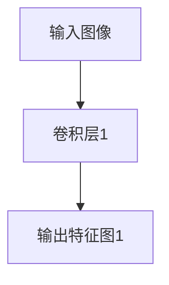

#### 3.1.2 池化层（Pooling Layer）

池化层用于减少特征图的尺寸，从而降低计算复杂度和过拟合的风险。常见的池化操作包括最大池化（Max Pooling）和平均池化（Average Pooling）。以下是一个简单的池化层实现：

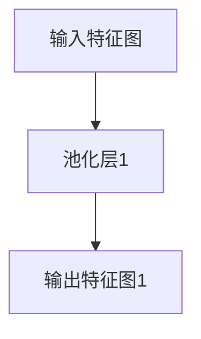

#### 3.1.3 全连接层（Fully Connected Layer）

全连接层将特征图展平为一维向量，并连接到输出层。以下是一个简单的全连接层实现：

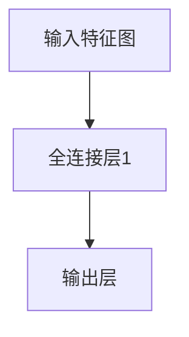

#### 3.1.4 CNN模型架构

CNN模型通常由多个卷积层、池化层和全连接层组成。以下是一个简单的CNN模型架构：

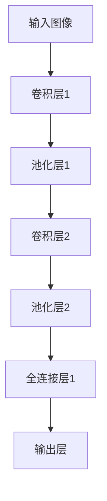

### 3.2 循环神经网络（RNN）

循环神经网络（Recurrent Neural Network，RNN）是一种处理序列数据的重要模型。RNN的主要特点是能够通过循环结构保留历史信息，从而适应序列数据的时间动态性。

#### 3.2.1 RNN基本结构

RNN的基本结构包括输入层、隐藏层和输出层。隐藏层通过循环连接保留历史信息。以下是一个简单的RNN实现：

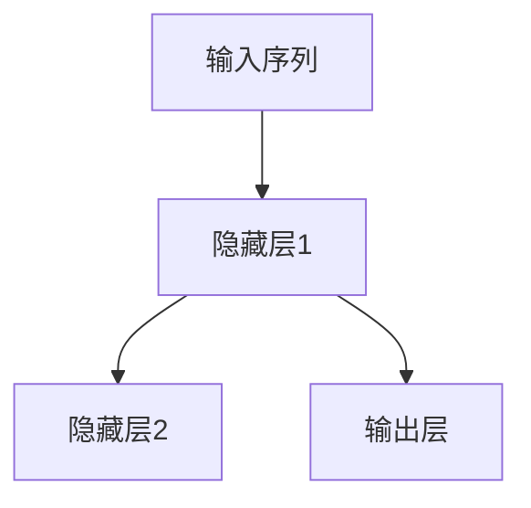

#### 3.2.2 长短时记忆（LSTM）和门控循环单元（GRU）

为了解决传统RNN在处理长序列数据时出现的梯度消失和梯度爆炸问题，提出了长短时记忆（Long Short-Term Memory，LSTM）和门控循环单元（Gated Recurrent Unit，GRU）。LSTM和GRU通过引入门控机制，有效地控制了信息的流动，从而改善了RNN的性能。

以下是一个简单的LSTM实现：

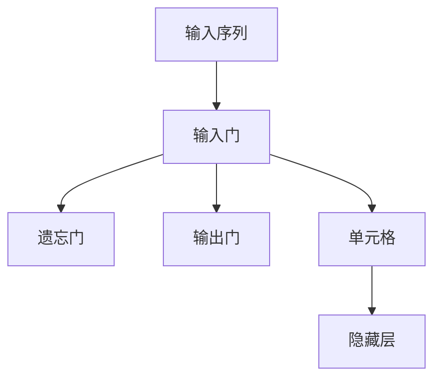

### 3.3 递归神经网络（RNN）变种

递归神经网络（RNN）的变种包括双向RNN（BiRNN）和深度RNN（Deep RNN）。双向RNN通过同时考虑前后两个方向的信息，提高了序列建模的能力。深度RNN通过增加隐藏层的数量，增加了模型的表达能力。

#### 3.3.1 双向RNN（BiRNN）

双向RNN由两个RNN层组成，一个前向层和一个后向层。前向层从左到右处理序列，后向层从右到左处理序列。以下是一个简单的双向RNN实现：

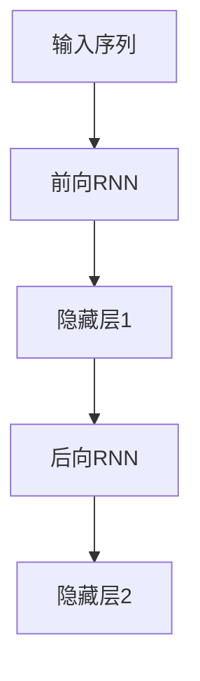

#### 3.3.2 深度RNN（Deep RNN）

深度RNN通过增加隐藏层的数量，实现了更深层次的特征提取。以下是一个简单的深度RNN实现：

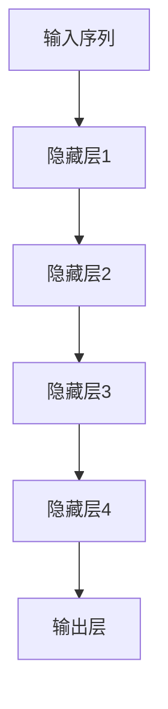

### 3.4 自注意力机制与Transformer模型

自注意力机制（Self-Attention Mechanism）和Transformer模型是处理序列数据的重要突破。自注意力机制通过计算序列中每个元素之间的相关性，实现了对序列数据的灵活建模。Transformer模型基于自注意力机制，解决了传统循环神经网络在处理长序列数据时出现的梯度消失问题。

#### 3.4.1 自注意力机制

自注意力机制通过计算序列中每个元素之间的相似性，为每个元素分配不同的权重。以下是一个简单的自注意力实现：

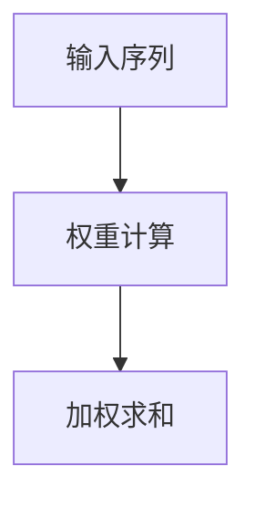

#### 3.4.2 Transformer模型

Transformer模型由多个自注意力层和前馈网络组成，主要用于序列到序列（Sequence to Sequence，Seq2Seq）任务。以下是一个简单的Transformer模型架构：

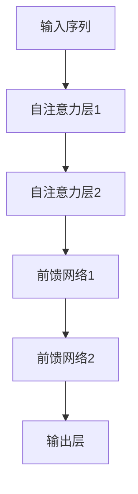

### 总结

本章介绍了卷积神经网络（CNN）、循环神经网络（RNN）及其变种和自注意力机制与Transformer模型。每种模型都有其独特的结构和工作原理，适用于不同的任务和数据类型。通过理解这些模型的基本原理和实现方法，我们可以更好地设计高效的深度学习模型。

在下一章中，我们将探讨优化与训练策略，包括梯度下降优化算法、指数移动平均（Exponential Moving Average）和学习率调度策略。

---

## 第4章：优化与训练策略

### 4.1 梯度下降优化算法

梯度下降优化算法（Gradient Descent）是深度学习训练过程中最常用的优化方法之一。其核心思想是通过计算损失函数关于模型参数的梯度，并沿着梯度的反方向更新模型参数，从而最小化损失函数。

#### 4.1.1 梯度下降原理

梯度下降的基本步骤如下：

1. **初始化参数**：随机初始化模型的参数。
2. **计算梯度**：计算损失函数关于模型参数的梯度。
3. **更新参数**：沿着梯度的反方向更新模型参数。
4. **重复迭代**：重复上述步骤，直到收敛。

以下是一个简单的梯度下降优化算法实现：

```python
import torch

# 创建模型
class SimpleModel(nn.Module):
    def __init__(self):
        super(SimpleModel, self).__init__()
        self.fc1 = nn.Linear(2, 1)

    def forward(self, x):
        return self.fc1(x)

model = SimpleModel()

# 创建损失函数和优化器
criterion = nn.MSELoss()
optimizer = torch.optim.SGD(model.parameters(), lr=0.01)

# 输入数据
x = torch.tensor([[1.0, 2.0], [3.0, 4.0]])
y = torch.tensor([[0.0], [1.0]])

# 训练模型
for epoch in range(100):
    # 前向传播
    outputs = model(x)
    loss = criterion(outputs, y)

    # 反向传播
    optimizer.zero_grad()
    loss.backward()

    # 更新参数
    optimizer.step()

    print(f'Epoch {epoch + 1}, Loss: {loss.item()}')
```

在这个示例中，我们创建了一个简单的线性模型，并使用梯度下降优化算法进行训练。通过多次迭代，模型参数不断更新，使得损失函数逐渐减小。

#### 4.1.2 学习率调整

学习率（Learning Rate）是梯度下降优化算法中的关键参数，它决定了参数更新的步长。选择合适的学习率对于模型训练的收敛速度和最终性能至关重要。以下是一些常见的学习率调整策略：

1. **固定学习率**：在整个训练过程中保持学习率不变。这种方法简单易行，但可能导致收敛速度较慢。
2. **学习率衰减**：在训练过程中逐渐减小学习率。常见的方法包括线性衰减、指数衰减和余弦退火等。
3. **自适应学习率**：使用自适应优化器，如Adam和Adagrad，这些优化器会根据参数的梯度自适应调整学习率。

以下是一个简单的学习率衰减实现：

```python
import torch
import torch.optim as optim

# 创建模型
class SimpleModel(nn.Module):
    def __init__(self):
        super(SimpleModel, self).__init__()
        self.fc1 = nn.Linear(2, 1)

    def forward(self, x):
        return self.fc1(x)

model = SimpleModel()

# 创建损失函数和优化器
criterion = nn.MSELoss()
optimizer = optim.Adam(model.parameters(), lr=0.01)

# 学习率衰减
for epoch in range(100):
    # 前向传播
    outputs = model(x)
    loss = criterion(outputs, y)

    # 反向传播
    optimizer.zero_grad()
    loss.backward()

    # 更新参数
    optimizer.step()

    # 学习率衰减
    if epoch % 10 == 0:
        optimizer.lr *= 0.9

    print(f'Epoch {epoch + 1}, Loss: {loss.item()}')
```

在这个示例中，我们每隔10个epoch将学习率乘以0.9进行衰减。

### 4.2 指数移动平均（Exponential Moving Average）

指数移动平均（Exponential Moving Average，EMA）是一种常用的学习率调整策略，它通过计算过去多次迭代的平均学习率来平滑学习率的变化。以下是一个简单的指数移动平均实现：

```python
import torch

# 初始学习率
initial_lr = 0.01
EMA_ALPHA = 0.9

# 创建模型
class SimpleModel(nn.Module):
    def __init__(self):
        super(SimpleModel, self).__init__()
        self.fc1 = nn.Linear(2, 1)

    def forward(self, x):
        return self.fc1(x)

model = SimpleModel()

# 创建损失函数和优化器
criterion = nn.MSELoss()
optimizer = optim.Adam(model.parameters(), lr=initial_lr)

# 计算当前学习率
current_lr = initial_lr

# 训练模型
for epoch in range(100):
    # 前向传播
    outputs = model(x)
    loss = criterion(outputs, y)

    # 反向传播
    optimizer.zero_grad()
    loss.backward()

    # 更新参数
    optimizer.step()

    # 计算指数移动平均学习率
    current_lr = EMA_ALPHA * current_lr + (1 - EMA_ALPHA) * initial_lr

    # 使用当前学习率
    for param_group in optimizer.param_groups:
        param_group['lr'] = current_lr

    print(f'Epoch {epoch + 1}, Loss: {loss.item()}, Current LR: {current_lr}')
```

在这个示例中，我们使用指数移动平均来平滑学习率的变化。每次迭代后，学习率更新为指数移动平均学习率。

### 4.3 学习率调度策略

学习率调度策略（Learning Rate Scheduling）是一种动态调整学习率的策略，它根据训练过程中的表现来调整学习率。以下是一些常见的学习率调度策略：

1. **分阶段调整**：将训练过程分为多个阶段，每个阶段使用不同的学习率。
2. **阶梯调整**：在特定的迭代次数后，将学习率减半。
3. **余弦退火**：通过模拟余弦函数的下降趋势来调整学习率。
4. **自适应调整**：使用自适应优化器，如Adam和Adagrad，这些优化器会根据参数的梯度自适应调整学习率。

以下是一个简单的分阶段学习率调度策略实现：

```python
import torch

# 创建模型
class SimpleModel(nn.Module):
    def __init__(self):
        super(SimpleModel, self).__init__()
        self.fc1 = nn.Linear(2, 1)

    def forward(self, x):
        return self.fc1(x)

model = SimpleModel()

# 创建损失函数和优化器
criterion = nn.MSELoss()
optimizer = optim.Adam(model.parameters(), lr=0.01)

# 学习率调度策略
LR_SCHEDULE = [
    (0, 0.01),
    (50, 0.005),
    (100, 0.0025)
]

# 训练模型
for epoch in range(150):
    # 前向传播
    outputs = model(x)
    loss = criterion(outputs, y)

    # 反向传播
    optimizer.zero_grad()
    loss.backward()

    # 更新参数
    optimizer.step()

    # 学习率调整
    for stage, lr in LR_SCHEDULE:
        if epoch == stage:
            for param_group in optimizer.param_groups:
                param_group['lr'] = lr
            print(f'Epoch {epoch + 1}, Loss: {loss.item()}, Current LR: {lr}')
```

在这个示例中，我们定义了一个分阶段学习率调度策略，在每个阶段调整学习率。通过这种方式，我们可以根据训练过程中的表现动态调整学习率，从而优化模型性能。

### 总结

本章介绍了梯度下降优化算法、指数移动平均（EMA）和学习率调度策略。这些优化与训练策略对于深度学习模型的成功训练至关重要。通过合理选择和调整这些策略，我们可以提高模型的收敛速度和最终性能。

在下一章中，我们将探讨数据处理与可视化在深度学习中的应用，包括数据加载与处理、数据增强技术以及模型可视化工具。

---

## 第5章：数据处理与可视化

在深度学习中，数据的处理与可视化是模型训练和评估过程中不可或缺的环节。良好的数据处理可以提高模型性能，而有效的可视化则有助于理解模型的行为和诊断潜在问题。本章将介绍PyTorch中的数据处理与可视化方法。

### 5.1 PyTorch中的数据加载和处理

PyTorch提供了一个强大的数据加载和预处理框架，使得处理大规模数据变得简单高效。数据加载和处理的基本步骤包括：

1. **数据预处理**：包括归一化、标准化、缺失值处理等。
2. **数据分批次**：将数据划分为多个批次，以便在训练过程中进行批量计算。
3. **数据迭代器**：使用数据迭代器（Dataset）和数据加载器（DataLoader）进行数据加载和迭代。

以下是一个简单的数据加载和处理示例：

```python
import torch
from torch.utils.data import DataLoader, TensorDataset

# 创建张量数据
x = torch.tensor([[1.0, 2.0], [3.0, 4.0]], dtype=torch.float32)
y = torch.tensor([0.0, 1.0], dtype=torch.float32)

# 创建数据集和数据加载器
dataset = TensorDataset(x, y)
dataloader = DataLoader(dataset, batch_size=2, shuffle=True)

# 数据迭代
for batch_x, batch_y in dataloader:
    print(batch_x, batch_y)
```

在这个示例中，我们首先创建了一个包含输入和标签的TensorDataset，然后使用DataLoader将其分批次加载。通过这种方式，我们可以方便地对数据进行批量处理和迭代。

### 5.2 数据增强技术

数据增强（Data Augmentation）是一种通过生成虚拟数据来增强训练数据集的方法，从而提高模型的泛化能力。PyTorch提供了丰富的数据增强工具，包括随机裁剪、翻转、旋转等。以下是一个简单的数据增强示例：

```python
import torch
from torchvision import transforms

# 创建数据预处理管道
transform = transforms.Compose([
    transforms.RandomHorizontalFlip(),
    transforms.RandomRotation(30),
    transforms.ToTensor()
])

# 应用数据增强
x = torch.tensor([[1.0, 2.0], [3.0, 4.0]], dtype=torch.float32)
x_transformed = transform(x)

print(x_transformed)
```

在这个示例中，我们使用RandomHorizontalFlip和RandomRotation进行数据增强，然后将其转换为Tensor。

### 5.3 模型可视化工具

模型可视化是理解模型行为和诊断问题的有效方法。PyTorch提供了多种可视化工具，包括TensorBoard、Matplotlib和Visdom等。以下是一个使用TensorBoard进行模型可视化示例：

```python
import torch
from torch.utils.tensorboard import SummaryWriter

# 创建SummaryWriter
writer = SummaryWriter('runs/my_experiment')

# 记录指标
for epoch in range(100):
    # 前向传播
    outputs = model(x)
    loss = criterion(outputs, y)

    # 反向传播
    optimizer.zero_grad()
    loss.backward()

    # 更新参数
    optimizer.step()

    # 记录指标
    writer.add_scalar('Loss/train', loss.item(), epoch)

    if epoch % 10 == 0:
        # 记录模型
        writer.add_graph(model, x)

writer.close()
```

在这个示例中，我们使用SummaryWriter记录训练过程中的损失值，并在每个epoch后记录模型的计算图。

### 总结

本章介绍了PyTorch中的数据处理与可视化方法，包括数据加载与处理、数据增强技术和模型可视化工具。通过合理使用这些方法，我们可以有效地处理数据，提高模型性能，并更好地理解模型的行为。

在下一章中，我们将探讨自然语言处理（NLP）中的常见任务和方法，包括语言模型、文本分类、序列标注和文本生成等。

---

## 第6章：自然语言处理

自然语言处理（Natural Language Processing，NLP）是深度学习领域中的一个重要分支，涉及文本数据分析和理解。本章将介绍NLP中的常见任务和方法，包括语言模型、文本分类、序列标注和文本生成。

### 6.1 语言模型与文本分类

语言模型（Language Model）是NLP的基础，它旨在预测下一个单词或字符的概率。文本分类（Text Classification）则是将文本数据分类到预定义的类别中，常用于情感分析、新闻分类等任务。

#### 6.1.1 语言模型

语言模型可以采用多种方法，包括统计模型、神经网络模型等。以下是一个基于神经网络的语言模型实现：

```python
import torch
import torch.nn as nn
import torch.optim as optim

# 创建模型
class LanguageModel(nn.Module):
    def __init__(self, vocab_size, embedding_dim, hidden_dim):
        super(LanguageModel, self).__init__()
        self.embedding = nn.Embedding(vocab_size, embedding_dim)
        self.lstm = nn.LSTM(embedding_dim, hidden_dim, num_layers=1)
        self.fc = nn.Linear(hidden_dim, vocab_size)

    def forward(self, x):
        embedded = self.embedding(x)
        output, (hidden, cell) = self.lstm(embedded)
        logits = self.fc(hidden[-1, :, :])
        return logits

# 实例化模型
vocab_size = 10000
embedding_dim = 256
hidden_dim = 512
model = LanguageModel(vocab_size, embedding_dim, hidden_dim)

# 创建损失函数和优化器
criterion = nn.CrossEntropyLoss()
optimizer = optim.Adam(model.parameters(), lr=0.001)

# 训练模型
for epoch in range(10):
    for inputs, targets in data_loader:
        optimizer.zero_grad()
        logits = model(inputs)
        loss = criterion(logits.view(-1, vocab_size), targets.view(-1))
        loss.backward()
        optimizer.step()
```

在这个示例中，我们创建了一个基于LSTM的语言模型，并使用交叉熵损失函数进行训练。

#### 6.1.2 文本分类

文本分类是NLP中的一个重要任务，常用于情感分析、主题分类等。以下是一个简单的文本分类实现：

```python
import torch
import torch.nn as nn
import torch.optim as optim

# 创建模型
class TextClassifier(nn.Module):
    def __init__(self, vocab_size, embedding_dim, hidden_dim, output_size):
        super(TextClassifier, self).__init__()
        self.embedding = nn.Embedding(vocab_size, embedding_dim)
        self.lstm = nn.LSTM(embedding_dim, hidden_dim, num_layers=1)
        self.fc = nn.Linear(hidden_dim, output_size)

    def forward(self, x):
        embedded = self.embedding(x)
        output, (hidden, cell) = self.lstm(embedded)
        logits = self.fc(hidden[-1, :, :])
        return logits

# 实例化模型
vocab_size = 10000
embedding_dim = 256
hidden_dim = 512
output_size = 2
model = TextClassifier(vocab_size, embedding_dim, hidden_dim, output_size)

# 创建损失函数和优化器
criterion = nn.BCEWithLogitsLoss()
optimizer = optim.Adam(model.parameters(), lr=0.001)

# 训练模型
for epoch in range(10):
    for inputs, targets in data_loader:
        optimizer.zero_grad()
        logits = model(inputs)
        loss = criterion(logits.view(-1), targets.view(-1))
        loss.backward()
        optimizer.step()
```

在这个示例中，我们创建了一个基于LSTM的文本分类模型，并使用二进制交叉熵损失函数进行训练。

### 6.2 序列标注与实体识别

序列标注（Sequence Labeling）是一种将文本序列中的每个单词或字符标注为预定义标签的方法，常用于命名实体识别（Named Entity Recognition，NER）等任务。实体识别是识别文本中的特定实体（如人名、组织名等）。

#### 6.2.1 序列标注

以下是一个简单的序列标注实现：

```python
import torch
import torch.nn as nn
import torch.optim as optim

# 创建模型
class SequenceLabeler(nn.Module):
    def __init__(self, vocab_size, embedding_dim, hidden_dim, label_size):
        super(SequenceLabeler, self).__init__()
        self.embedding = nn.Embedding(vocab_size, embedding_dim)
        self.lstm = nn.LSTM(embedding_dim, hidden_dim, num_layers=1)
        self.fc = nn.Linear(hidden_dim, label_size)

    def forward(self, x):
        embedded = self.embedding(x)
        output, (hidden, cell) = self.lstm(embedded)
        logits = self.fc(hidden[-1, :, :])
        return logits

# 实例化模型
vocab_size = 10000
embedding_dim = 256
hidden_dim = 512
label_size = 10
model = SequenceLabeler(vocab_size, embedding_dim, hidden_dim, label_size)

# 创建损失函数和优化器
criterion = nn.CrossEntropyLoss()
optimizer = optim.Adam(model.parameters(), lr=0.001)

# 训练模型
for epoch in range(10):
    for inputs, targets in data_loader:
        optimizer.zero_grad()
        logits = model(inputs)
        loss = criterion(logits.view(-1, label_size), targets.view(-1))
        loss.backward()
        optimizer.step()
```

在这个示例中，我们创建了一个基于LSTM的序列标注模型，并使用交叉熵损失函数进行训练。

#### 6.2.2 实体识别

以下是一个简单的实体识别实现：

```python
import torch
import torch.nn as nn
import torch.optim as optim

# 创建模型
class EntityRecognizer(nn.Module):
    def __init__(self, vocab_size, embedding_dim, hidden_dim, label_size):
        super(EntityRecognizer, self).__init__()
        self.embedding = nn.Embedding(vocab_size, embedding_dim)
        self.lstm = nn.LSTM(embedding_dim, hidden_dim, num_layers=1)
        self.fc = nn.Linear(hidden_dim, label_size)

    def forward(self, x):
        embedded = self.embedding(x)
        output, (hidden, cell) = self.lstm(embedded)
        logits = self.fc(hidden[-1, :, :])
        return logits

# 实例化模型
vocab_size = 10000
embedding_dim = 256
hidden_dim = 512
label_size = 10
model = EntityRecognizer(vocab_size, embedding_dim, hidden_dim, label_size)

# 创建损失函数和优化器
criterion = nn.CrossEntropyLoss()
optimizer = optim.Adam(model.parameters(), lr=0.001)

# 训练模型
for epoch in range(10):
    for inputs, targets in data_loader:
        optimizer.zero_grad()
        logits = model(inputs)
        loss = criterion(logits.view(-1, label_size), targets.view(-1))
        loss.backward()
        optimizer.step()
```

在这个示例中，我们创建了一个基于LSTM的实体识别模型，并使用交叉熵损失函数进行训练。

### 6.3 文本生成

文本生成（Text Generation）是一种生成文本序列的方法，常用于聊天机器人、文章生成等任务。以下是一个简单的文本生成实现：

```python
import torch
import torch.nn as nn
import torch.optim as optim

# 创建模型
class TextGenerator(nn.Module):
    def __init__(self, vocab_size, embedding_dim, hidden_dim):
        super(TextGenerator, self).__init__()
        self.embedding = nn.Embedding(vocab_size, embedding_dim)
        self.lstm = nn.LSTM(embedding_dim, hidden_dim, num_layers=1)
        self.fc = nn.Linear(hidden_dim, vocab_size)

    def forward(self, x, hidden):
        embedded = self.embedding(x)
        output, hidden = self.lstm(embedded, hidden)
        logits = self.fc(output[-1, :, :])
        return logits, hidden

    def init_hidden(self, batch_size):
        return (torch.zeros(1, batch_size, self.hidden_dim),
                torch.zeros(1, batch_size, self.hidden_dim))

# 实例化模型
vocab_size = 10000
embedding_dim = 256
hidden_dim = 512
model = TextGenerator(vocab_size, embedding_dim, hidden_dim)

# 创建损失函数和优化器
criterion = nn.CrossEntropyLoss()
optimizer = optim.Adam(model.parameters(), lr=0.001)

# 训练模型
for epoch in range(10):
    for inputs, targets in data_loader:
        optimizer.zero_grad()
        hidden = model.init_hidden(batch_size)
        outputs = []
        for x in inputs:
            logits, hidden = model(x, hidden)
            outputs.append(logits)
        logits = torch.cat(outputs, dim=0)
        loss = criterion(logits.view(-1, vocab_size), targets.view(-1))
        loss.backward()
        optimizer.step()
```

在这个示例中，我们创建了一个基于LSTM的文本生成模型，并使用交叉熵损失函数进行训练。

### 总结

本章介绍了自然语言处理中的常见任务和方法，包括语言模型、文本分类、序列标注和文本生成。通过这些任务，我们可以对文本数据进行深入分析和理解。在下一章中，我们将探讨计算机视觉中的常见任务和方法，包括图像分类、目标检测、图像生成和图像分割。

---

## 第7章：计算机视觉

计算机视觉是深度学习领域中的一个重要分支，广泛应用于图像识别、视频分析、医疗诊断等多个领域。本章将介绍计算机视觉中的常见任务和方法，包括图像分类、目标检测、图像生成和图像分割。

### 7.1 图像分类与目标检测

图像分类（Image Classification）是计算机视觉中最基本的任务，旨在将图像分类到预定义的类别中。目标检测（Object Detection）则是识别图像中的多个对象及其位置。以下是一个简单的图像分类和目标检测实现：

#### 7.1.1 图像分类

以下是一个使用卷积神经网络（CNN）进行图像分类的示例：

```python
import torch
import torch.nn as nn
import torchvision
import torchvision.transforms as transforms

# 创建模型
class ImageClassifier(nn.Module):
    def __init__(self, num_classes):
        super(ImageClassifier, self).__init__()
        self.conv1 = nn.Conv2d(3, 32, 3, padding=1)
        self.conv2 = nn.Conv2d(32, 64, 3, padding=1)
        self.fc1 = nn.Linear(64 * 6 * 6, 128)
        self.fc2 = nn.Linear(128, num_classes)

    def forward(self, x):
        x = self.conv1(x)
        x = nn.functional.relu(x)
        x = self.conv2(x)
        x = nn.functional.relu(x)
        x = nn.functional.adaptive_avg_pool2d(x, 1)
        x = x.view(x.size(0), -1)
        x = self.fc1(x)
        x = nn.functional.relu(x)
        x = self.fc2(x)
        return x

# 实例化模型
num_classes = 10
model = ImageClassifier(num_classes)

# 创建损失函数和优化器
criterion = nn.CrossEntropyLoss()
optimizer = torch.optim.Adam(model.parameters(), lr=0.001)

# 加载数据集
transform = transforms.Compose([transforms.Resize(224), transforms.ToTensor()])
train_set = torchvision.datasets.CIFAR10(root='./data', train=True, transform=transform, download=True)
train_loader = torch.utils.data.DataLoader(train_set, batch_size=64, shuffle=True)

# 训练模型
for epoch in range(10):
    model.train()
    for inputs, targets in train_loader:
        optimizer.zero_grad()
        outputs = model(inputs)
        loss = criterion(outputs, targets)
        loss.backward()
        optimizer.step()
```

在这个示例中，我们创建了一个简单的CNN模型，并使用CIFAR-10数据集进行训练。

#### 7.1.2 目标检测

以下是一个使用Faster R-CNN进行目标检测的示例：

```python
import torch
import torchvision
import torchvision.models.detection as models
import torchvision.transforms as transforms

# 创建模型
model = models.resnet50(pretrained=True)
num_features = model.roi_heads.box_predictor.cls_score.num_features
model.roi_heads.box_predictor = torch.nn.Linear(num_features, 2)  # 二分类任务

# 创建损失函数和优化器
criterion = torch.nn.CrossEntropyLoss()
optimizer = torch.optim.SGD(model.parameters(), lr=0.001, momentum=0.9)

# 加载数据集
transform = transforms.Compose([transforms.ToTensor()])
train_set = torchvision.datasets.VOCDetection(root='./data', year='2012', image_set='train', download=True, transform=transform)
train_loader = torch.utils.data.DataLoader(train_set, batch_size=32, shuffle=True)

# 训练模型
for epoch in range(10):
    model.train()
    for inputs, targets in train_loader:
        optimizer.zero_grad()
        loss_dict = model(inputs, targets)
        losses = sum(loss for loss in loss_dict.values())
        losses.backward()
        optimizer.step()
```

在这个示例中，我们使用预训练的ResNet-50模型，并修改其ROI头进行目标检测训练。

### 7.2 图像生成与风格迁移

图像生成（Image Generation）和风格迁移（Style Transfer）是计算机视觉中的有趣任务，旨在生成新的图像或改变图像的风格。以下是一个使用生成对抗网络（GAN）进行图像生成的示例：

#### 7.2.1 图像生成

以下是一个使用CGAN进行图像生成的示例：

```python
import torch
import torch.nn as nn
import torch.optim as optim

# 创建生成器和判别器
class Generator(nn.Module):
    def __init__(self):
        super(Generator, self).__init__()
        self.model = nn.Sequential(
            nn.ConvTranspose2d(100, 256, 4, 1, 0),
            nn.BatchNorm2d(256),
            nn.ReLU(True),
            nn.ConvTranspose2d(256, 128, 4, 2, 1),
            nn.BatchNorm2d(128),
            nn.ReLU(True),
            nn.ConvTranspose2d(128, 64, 4, 2, 1),
            nn.BatchNorm2d(64),
            nn.ReLU(True),
            nn.ConvTranspose2d(64, 3, 4, 2, 1),
            nn.Tanh()
        )

    def forward(self, x):
        return self.model(x)

class Discriminator(nn.Module):
    def __init__(self):
        super(Discriminator, self).__init__()
        self.model = nn.Sequential(
            nn.Conv2d(3, 64, 4, 2, 1),
            nn.LeakyReLU(0.2, inplace=True),
            nn.Conv2d(64, 128, 4, 2, 1),
            nn.BatchNorm2d(128),
            nn.LeakyReLU(0.2, inplace=True),
            nn.Conv2d(128, 256, 4, 2, 1),
            nn.BatchNorm2d(256),
            nn.LeakyReLU(0.2, inplace=True),
            nn.Conv2d(256, 1, 4, 1, 0),
            nn.Sigmoid()
        )

    def forward(self, x):
        return self.model(x)

# 实例化模型
generator = Generator()
discriminator = Discriminator()

# 创建损失函数和优化器
gan_criterion = nn.BCELoss()
d_optimizer = optim.Adam(discriminator.parameters(), lr=0.0002)
g_optimizer = optim.Adam(generator.parameters(), lr=0.0002)

# 训练模型
for epoch in range(100):
    for i, (images, _) in enumerate(data_loader):
        # 训练判别器
        images = images.to(device)
        z = torch.randn(images.size(0), 100).to(device)
        fake_images = generator(z)
        d_real = discriminator(images)
        d_fake = discriminator(fake_images.detach())
        d_loss = gan_criterion(d_real, torch.ones(d_real.size()).to(device)) + gan_criterion(d_fake, torch.zeros(d_fake.size()).to(device))
        d_optimizer.zero_grad()
        d_loss.backward()
        d_optimizer.step()

        # 训练生成器
        z = torch.randn(images.size(0), 100).to(device)
        g_fake = discriminator(generator(z))
        g_loss = gan_criterion(g_fake, torch.ones(g_fake.size()).to(device))
        g_optimizer.zero_grad()
        g_loss.backward()
        g_optimizer.step()
```

在这个示例中，我们创建了一个生成器和判别器，并使用GAN进行训练。

#### 7.2.2 风格迁移

以下是一个使用PyTorch进行风格迁移的示例：

```python
import torch
import torch.nn as nn
import torch.optim as optim
import torchvision.transforms as transforms

# 创建VGG模型
class VGG19(nn.Module):
    def __init__(self):
        super(VGG19, self).__init__()
        vgg_model = torchvision.models.vgg19(pretrained=True)
        self.features = vgg_model.features
        self.classifier = nn.Sequential(
            nn.Linear(25088, 4096),
            nn.ReLU(True),
            nn.Dropout(),
            nn.Linear(4096, 4096),
            nn.ReLU(True),
            nn.Dropout(),
            nn.Linear(4096, 1000),
        )
        self.avgpool = nn.AdaptiveAvgPool2d((1, 1))
        self.fc = nn.Linear(512 * 4 * 4, 512)
        self.fc1 = nn.Linear(512, 4096)
        self.fc2 = nn.Linear(4096, 1000)

    def forward(self, x):
        x = self.features(x)
        x = self.avgpool(x)
        x = torch.flatten(x, 1)
        x = self.fc(x)
        x = self.fc1(x)
        x = self.fc2(x)
        return x

# 实例化模型
style_model = VGG19()

# 创建损失函数和优化器
style_criterion = nn.L1Loss()
optimizer = optim.Adam(style_model.parameters(), lr=0.001)

# 训练模型
for epoch in range(10):
    for inputs, targets in style_loader:
        inputs = inputs.to(device)
        targets = targets.to(device)
        optimizer.zero_grad()
        outputs = style_model(inputs)
        loss = style_criterion(outputs, targets)
        loss.backward()
        optimizer.step()
```

在这个示例中，我们使用VGG-19模型进行风格迁移，并使用L1损失函数进行训练。

### 7.3 图像分割与语义分割

图像分割（Image Segmentation）是将图像中的每个像素分类到预定义的类别中。语义分割（Semantic Segmentation）是一种更为复杂的任务，旨在对图像中的每个像素进行语义分类。以下是一个简单的语义分割实现：

```python
import torch
import torchvision
import torchvision.transforms as transforms

# 创建模型
class SemanticSegmentor(nn.Module):
    def __init__(self, num_classes):
        super(SemanticSegmentor, self).__init__()
        self.conv1 = nn.Conv2d(3, 64, 3, padding=1)
        self.conv2 = nn.Conv2d(64, 128, 3, padding=1)
        self.fc1 = nn.Linear(128 * 6 * 6, 512)
        self.fc2 = nn.Linear(512, num_classes)

    def forward(self, x):
        x = self.conv1(x)
        x = nn.functional.relu(x)
        x = self.conv2(x)
        x = nn.functional.relu(x)
        x = nn.functional.adaptive_avg_pool2d(x, 1)
        x = x.view(x.size(0), -1)
        x = self.fc1(x)
        x = nn.functional.relu(x)
        x = self.fc2(x)
        return x

# 实例化模型
num_classes = 21
model = SemanticSegmentor(num_classes)

# 创建损失函数和优化器
criterion = nn.CrossEntropyLoss()
optimizer = torch.optim.Adam(model.parameters(), lr=0.001)

# 加载数据集
transform = transforms.Compose([transforms.Resize(224), transforms.ToTensor()])
train_set = torchvision.datasets.COCO SemanticSegmentor(root='./data', split='train', transform=transform)
train_loader = torch.utils.data.DataLoader(train_set, batch_size=64, shuffle=True)

# 训练模型
for epoch in range(10):
    model.train()
    for inputs, targets in train_loader:
        optimizer.zero_grad()
        inputs = inputs.to(device)
        targets = targets.to(device)
        outputs = model(inputs)
        loss = criterion(outputs, targets)
        loss.backward()
        optimizer.step()
```

在这个示例中，我们创建了一个简单的语义分割模型，并使用COCO数据集进行训练。

### 总结

本章介绍了计算机视觉中的常见任务和方法，包括图像分类、目标检测、图像生成和图像分割。通过这些任务，我们可以对图像进行深入分析和理解。在下一章中，我们将探讨强化学习的基本概念和方法，包括Q-Learning、Deep Q-Network（DQN）和Policy Gradient方法。

---

## 第8章：强化学习

强化学习（Reinforcement Learning，RL）是一种机器学习方法，旨在通过与环境交互来学习最优策略。强化学习与监督学习和无监督学习不同，它依赖于奖励信号来指导学习过程。本章将介绍强化学习的基本概念、主要方法和实现细节。

### 8.1 强化学习基本概念

强化学习的基本概念包括：

- **代理（Agent）**：执行行动的主体，例如机器人、自动驾驶汽车或智能体。
- **环境（Environment）**：代理交互的物理或虚拟世界，可以是一个游戏、模拟环境或现实世界。
- **状态（State）**：环境在特定时间点的描述。
- **行动（Action）**：代理可以采取的动作。
- **策略（Policy）**：代理在给定状态下选择行动的规则。
- **价值函数（Value Function）**：评估状态或状态-动作对的值。
- **模型（Model）**：对环境状态转移概率和奖励机制的描述。

#### 8.1.1 奖励信号

奖励信号是强化学习中的一个关键要素，它反映了代理行动的好坏。奖励可以是正值（表示成功行动）或负值（表示失败行动）。奖励信号的目的是通过鼓励代理采取有利的行动来指导学习过程。

#### 8.1.2 策略评估与策略优化

强化学习的目标是找到最优策略，即最大化长期奖励。策略评估（Policy Evaluation）是通过估计当前策略的价值函数来评估策略的好坏。策略优化（Policy Optimization）是通过更新策略来改善其性能。

### 8.2 Q-Learning与Deep Q-Network（DQN）

Q-Learning是一种基于价值函数的强化学习方法，旨在通过学习Q值（状态-行动值函数）来找到最优策略。Q-Learning的基本步骤如下：

1. **初始化Q值表**：初始化状态-行动值函数Q值表，通常使用随机值。
2. **选择行动**：在给定状态下，根据ε-贪心策略选择行动。
3. **更新Q值**：根据接收到的奖励信号和下一个状态，更新Q值表。

以下是一个简单的Q-Learning实现：

```python
import numpy as np
import random

# 初始化Q值表
q_values = np.zeros([state_space_size, action_space_size])

# ε-贪心策略
epsilon = 0.1
for episode in range(num_episodes):
    state = random.choice(state_space)
    done = False
    total_reward = 0
    while not done:
        # 选择行动
        if random.random() < epsilon:
            action = random.choice(action_space)
        else:
            action = np.argmax(q_values[state])
        
        # 执行行动
        next_state, reward, done = environment.step(action)
        
        # 更新Q值
        q_values[state, action] = (1 - alpha) * q_values[state, action] + alpha * (reward + gamma * np.max(q_values[next_state]))
        
        state = next_state
        total_reward += reward
        
    # 调整ε值
    epsilon = max(epsilon * epsilon_decay, epsilon_min)

print("Final Q-Values:", q_values)
```

DQN（Deep Q-Network）是一种基于深度学习的Q-Learning方法，它使用深度神经网络（DNN）来近似Q值函数。DQN的主要优势是能够处理高维状态空间和连续动作空间。以下是一个简单的DQN实现：

```python
import numpy as np
import random
import torch
import torch.nn as nn
import torch.optim as optim

# 定义DQN模型
class DQN(nn.Module):
    def __init__(self, state_space_size, action_space_size):
        super(DQN, self).__init__()
        self.fc1 = nn.Linear(state_space_size, 64)
        self.fc2 = nn.Linear(64, 64)
        self.fc3 = nn.Linear(64, action_space_size)
    
    def forward(self, x):
        x = torch.relu(self.fc1(x))
        x = torch.relu(self.fc2(x))
        x = self.fc3(x)
        return x

# 初始化模型和优化器
model = DQN(state_space_size, action_space_size)
optimizer = optim.Adam(model.parameters(), lr=learning_rate)

# 训练模型
for episode in range(num_episodes):
    state = random.choice(state_space)
    done = False
    total_reward = 0
    while not done:
        # 选择行动
        if random.random() < epsilon:
            action = random.choice(action_space)
        else:
            action = torch.argmax(model(torch.tensor(state, dtype=torch.float32))).item()
        
        # 执行行动
        next_state, reward, done = environment.step(action)
        
        # 计算目标Q值
        target_q = reward + gamma * torch.max(model(torch.tensor(next_state, dtype=torch.float32)))
        
        # 计算当前Q值
        current_q = model(torch.tensor(state, dtype=torch.float32))[0, action]
        
        # 更新损失函数
        loss = (current_q - target_q)**2
        
        # 反向传播
        optimizer.zero_grad()
        loss.backward()
        optimizer.step()
        
        state = next_state
        total_reward += reward
    
    # 调整ε值
    epsilon = max(epsilon * epsilon_decay, epsilon_min)

print("Final Model:", model)
```

### 8.3 Policy Gradient方法

Policy Gradient方法是一种基于策略的强化学习方法，它通过直接优化策略来最大化长期奖励。Policy Gradient方法的基本步骤如下：

1. **定义策略网络**：策略网络负责生成行动的概率分布。
2. **计算策略梯度**：计算策略梯度的估计值，并将其用于优化策略网络。
3. **更新策略网络**：使用策略梯度更新策略网络参数。

以下是一个简单的Policy Gradient实现：

```python
import numpy as np
import random
import torch
import torch.nn as nn
import torch.optim as optim

# 定义策略网络
class PolicyNetwork(nn.Module):
    def __init__(self, state_space_size, action_space_size):
        super(PolicyNetwork, self).__init__()
        self.fc1 = nn.Linear(state_space_size, 64)
        self.fc2 = nn.Linear(64, 64)
        self.fc3 = nn.Linear(64, action_space_size)
    
    def forward(self, x):
        x = torch.relu(self.fc1(x))
        x = torch.relu(self.fc2(x))
        x = torch.sigmoid(self.fc3(x))
        return x

# 初始化模型和优化器
model = PolicyNetwork(state_space_size, action_space_size)
optimizer = optim.Adam(model.parameters(), lr=learning_rate)

# 训练模型
for episode in range(num_episodes):
    state = random.choice(state_space)
    done = False
    total_reward = 0
    while not done:
        # 生成行动概率分布
        action_probs = model(torch.tensor(state, dtype=torch.float32))
        
        # 选择行动
        action = random.choices(action_space, weights=action_probs.tolist(), k=1)[0]
        
        # 执行行动
        next_state, reward, done = environment.step(action)
        
        # 计算策略梯度
        log_probs = torch.log(action_probs[action])
        loss = -log_probs * reward
        
        # 更新损失函数
        loss.backward()
        
        # 更新策略网络
        optimizer.zero_grad()
        optimizer.step()
        
        state = next_state
        total_reward += reward
    
    # 调整学习率
    if episode % 100 == 0:
        learning_rate *= learning_rate_decay

print("Final Model:", model)
```

### 总结

本章介绍了强化学习的基本概念、Q-Learning和DQN以及Policy Gradient方法。强化学习在自动驾驶、游戏AI、机器人控制等领域具有广泛应用。通过理解这些方法，我们可以设计出高效的强化学习系统。在下一章中，我们将探讨迁移学习与模型压缩的基本原理和技术。

---

## 第9章：迁移学习与模型压缩

迁移学习（Transfer Learning）和模型压缩（Model Compression）是当前深度学习领域中非常重要的技术，它们分别解决了模型在不同领域间的适应性和模型在实际部署时的资源需求问题。本章将详细探讨这两种技术的原理和实现方法。

### 9.1 迁移学习原理

迁移学习的基本思想是利用源领域（Source Domain）中的知识来提升目标领域（Target Domain）中的模型性能。源领域和目标领域可以是不同的任务、不同的数据集或者不同的数据分布。迁移学习的关键在于共享和迁移那些在不同任务中具有通用性的特征表示。

#### 9.1.1 迁移学习策略

迁移学习可以分为以下几种策略：

1. **基于特征的方法**：这种方法通过共享特征提取器（例如卷积层）来迁移知识。目标模型将使用源模型的特征提取器，然后添加一个新的分类器。
2. **基于模型的方法**：这种方法直接迁移整个模型，通常在预训练模型上进行微调，使其适应新任务。
3. **基于知识的方法**：这种方法通过迁移源领域中的知识（例如先验知识、规则或元知识）来改进目标模型的性能。

#### 9.1.2 迁移学习实现

以下是一个简单的迁移学习实现示例：

```python
import torch
import torchvision.models as models
import torch.nn as nn
import torch.optim as optim

# 加载预训练模型
pretrained_model = models.resnet50(pretrained=True)

# 删除分类层
num_ftrs = pretrained_model.fc.in_features
pretrained_model.fc = nn.Identity()

# 创建目标模型
class TargetModel(nn.Module):
    def __init__(self, num_ftrs, num_classes):
        super(TargetModel, self).__init__()
        self.fc = nn.Linear(num_ftrs, num_classes)

    def forward(self, x):
        x = pretrained_model(x)
        x = self.fc(x)
        return x

target_model = TargetModel(num_ftrs, num_classes)

# 创建损失函数和优化器
criterion = nn.CrossEntropyLoss()
optimizer = optim.Adam(target_model.parameters(), lr=0.001)

# 加载数据集
train_loader = torch.utils.data.DataLoader(train_dataset, batch_size=64, shuffle=True)
val_loader = torch.utils.data.DataLoader(val_dataset, batch_size=64, shuffle=False)

# 训练模型
for epoch in range(num_epochs):
    target_model.train()
    for inputs, targets in train_loader:
        optimizer.zero_grad()
        outputs = target_model(inputs)
        loss = criterion(outputs, targets)
        loss.backward()
        optimizer.step()
    # 在验证集上进行评估
    target_model.eval()
    with torch.no_grad():
        correct = 0
        total = 0
        for inputs, targets in val_loader:
            outputs = target_model(inputs)
            _, predicted = torch.max(outputs.data, 1)
            total += targets.size(0)
            correct += (predicted == targets).sum().item()
    print(f'Epoch {epoch + 1}, Accuracy: {100 * correct / total}%')
```

在这个示例中，我们使用预训练的ResNet-50模型作为特征提取器，并创建一个新的分类器来适应目标任务。

### 9.2 模型压缩技术

模型压缩旨在减小模型的参数数量和计算量，从而在保持性能的同时降低模型的存储和计算需求。模型压缩的方法包括剪枝（Pruning）、量化（Quantization）和知识蒸馏（Knowledge Distillation）。

#### 9.2.1 剪枝

剪枝通过去除模型中不重要的权重来减小模型大小。剪枝可以分为以下几种类型：

1. **结构剪枝**：通过去除网络中的整个层或部分层来减小模型大小。
2. **权重剪枝**：通过去除网络中权重较小的连接来减小模型大小。

以下是一个简单的权重剪枝实现：

```python
import torch
import torchvision.models as models

# 加载预训练模型
model = models.resnet50(pretrained=True)

# 定义剪枝策略
def prune_model(model, pruning_rate):
    for name, param in model.named_parameters():
        if 'weight' in name:
            mask = (param.data.abs() < pruning_threshold).float()
            param.data.copy_(param.data * mask)
            num_pruned = int((1 - pruning_rate) * mask.numel())
            print(f'Pruned {num_pruned} weights in layer {name}')

# 应用剪枝
prune_model(model, pruning_rate=0.5)
```

在这个示例中，我们使用阈值方法对模型进行权重剪枝。

#### 9.2.2 量化

量化通过将浮点数权重和激活转换为低精度的整数来减小模型大小。量化可以分为以下几种类型：

1. **对称量化**：通过将浮点数权重和激活转换为对称的整数范围来减小模型大小。
2. **不对称量化**：通过将浮点数权重和激活转换为非对称的整数范围来减小模型大小。

以下是一个简单的量化实现：

```python
import torch
import torchvision.models as models
import torch.nn.utils as quant

# 加载预训练模型
model = models.resnet50(pretrained=True)

# 定义量化策略
def quantize_model(model, quant_type='symmetric', quant_bits=8):
    quant_backend = torch.backends.quantization
    quant_type = quant_backend.getQuantType(quant_type)
    quant_bits = quant_bits // 8

    # 量化模型
    model = quant_backend.fuse_model(model)
    model = quant_backend.prepare(model, quant_type, quant_bits)

    return model

# 应用量化
quantized_model = quantize_model(model, quant_type='symmetric', quant_bits=8)
```

在这个示例中，我们使用对称量化将预训练的ResNet-50模型转换为量化模型。

#### 9.2.3 知识蒸馏

知识蒸馏（Knowledge Distillation）是一种通过将知识从大型教师模型传递到小型学生模型来压缩模型的方法。知识蒸馏可以分为以下几种类型：

1. **硬蒸馏**：通过将教师模型的输出作为标签来训练学生模型。
2. **软蒸馏**：通过将教师模型的输出概率作为权重来调整学生模型的输出。

以下是一个简单的知识蒸馏实现：

```python
import torch
import torchvision.models as models
import torch.nn as nn
import torch.optim as optim

# 加载教师模型和学生模型
teacher_model = models.resnet50(pretrained=True)
student_model = models.resnet50(pretrained=True)

# 删除学生模型的分类层
num_ftrs = student_model.fc.in_features
student_model.fc = nn.Identity()

# 创建损失函数和优化器
criterion = nn.CrossEntropyLoss()
optimizer = optim.Adam(student_model.parameters(), lr=0.001)

# 训练模型
for epoch in range(num_epochs):
    student_model.train()
    for inputs, targets in train_loader:
        optimizer.zero_grad()
        teacher_outputs = teacher_model(inputs)
        student_outputs = student_model(inputs)
        loss = criterion(student_outputs, targets)
        loss.backward()
        optimizer.step()
    # 在验证集上进行评估
    student_model.eval()
    with torch.no_grad():
        correct = 0
        total = 0
        for inputs, targets in val_loader:
            student_outputs = student_model(inputs)
            _, predicted = torch.max(student_outputs.data, 1)
            total += targets.size(0)
            correct += (predicted == targets).sum().item()
    print(f'Epoch {epoch + 1}, Accuracy: {100 * correct / total}%')
```

在这个示例中，我们使用知识蒸馏将教师模型的输出概率传递到学生模型，以提高其性能。

### 9.3 低精度与量化技术

低精度（Low-Precision）与量化技术（Quantization）是模型压缩的重要手段，通过将浮点数模型转换为低精度整数模型，可以显著减少模型的存储和计算需求。

#### 9.3.1 低精度运算

低精度运算通过将浮点数转换为低精度的整数来降低模型的大小和计算复杂度。常用的低精度类型包括8位整数、4位整数等。

以下是一个简单的低精度运算示例：

```python
import torch
import torchvision.models as models
import torch.nn as nn
import torch.optim as optim

# 加载预训练模型
model = models.resnet50(pretrained=True)

# 定义低精度运算策略
def low_precision_model(model, precision_bits=8):
    quant_backend = torch.backends.quantization
    precision = quant_backend.getPrecision(precision_bits)
    model = quant_backend.prepare(model, precision)
    return model

# 应用低精度运算
low_precision_model = low_precision_model(model, precision_bits=8)
```

在这个示例中，我们将ResNet-50模型转换为8位低精度模型。

#### 9.3.2 量化技术

量化技术通过将浮点数权重和激活转换为低精度的整数来减小模型大小。量化可以分为对称量化、不对称量化等。

以下是一个简单的量化技术示例：

```python
import torch
import torchvision.models as models
import torch.nn as nn
import torch.optim as optim

# 加载预训练模型
model = models.resnet50(pretrained=True)

# 定义量化策略
def quantize_model(model, quant_type='symmetric', quant_bits=8):
    quant_backend = torch.backends.quantization
    quant_type = quant_backend.getQuantType(quant_type)
    quant_bits = quant_bits // 8
    model = quant_backend.fuse_model(model)
    model = quant_backend.prepare(model, quant_type, quant_bits)
    return model

# 应用量化技术
quantized_model = quantize_model(model, quant_type='symmetric', quant_bits=8)
```

在这个示例中，我们将ResNet-50模型转换为对称量化的8位量化模型。

### 总结

本章介绍了迁移学习与模型压缩的基本原理和技术。通过迁移学习，我们可以利用已有的模型知识来快速适应新任务；通过模型压缩，我们可以减小模型的大小和计算复杂度，使其更适合实际部署。在下一章中，我们将通过一系列项目实战来应用本章所学的知识。

---

## 第10章：项目实战

### 10.1 项目实战概述

在本文的最后一部分，我们将通过一系列项目实战，将前面章节所学的知识应用于实际问题中。这些项目涵盖了计算机视觉、自然语言处理和强化学习等关键领域，旨在帮助读者将理论知识转化为实际操作技能。

### 10.2 计算机视觉项目实例

#### 10.2.1 图像分类项目

在本项目中，我们将使用PyTorch和 torchvision 库实现一个图像分类系统。这个系统将能够对未知的图像进行分类，识别它们属于预定义的类别之一。

**项目步骤：**

1. **数据准备**：下载并加载一个公共数据集，例如CIFAR-10。
2. **数据预处理**：对图像进行预处理，包括归一化、裁剪和增强。
3. **模型构建**：定义一个简单的卷积神经网络模型，用于图像分类。
4. **模型训练**：使用训练数据训练模型，并在验证数据上评估其性能。
5. **模型评估**：使用测试数据评估模型的泛化能力。

**代码示例：**

```python
import torch
import torchvision
import torchvision.transforms as transforms
import torch.nn as nn
import torch.optim as optim

# 数据准备
transform = transforms.Compose([transforms.Resize(32), transforms.ToTensor()])
train_set = torchvision.datasets.CIFAR10(root='./data', train=True, transform=transform, download=True)
train_loader = torch.utils.data.DataLoader(train_set, batch_size=64, shuffle=True)

# 模型构建
class SimpleCNN(nn.Module):
    def __init__(self):
        super(SimpleCNN, self).__init__()
        self.conv1 = nn.Conv2d(3, 32, 3, padding=1)
        self.conv2 = nn.Conv2d(32, 64, 3, padding=1)
        self.fc1 = nn.Linear(64 * 8 * 8, 128)
        self.fc2 = nn.Linear(128, 10)
        self.dropout = nn.Dropout(0.2)
        
    def forward(self, x):
        x = self.conv1(x)
        x = nn.functional.relu(x)
        x = self.conv2(x)
        x = nn.functional.relu(x)
        x = nn.functional.adaptive_avg_pool2d(x, 1)
        x = x.view(x.size(0), -1)
        x = self.fc1(x)
        x = nn.functional.relu(x)
        x = self.dropout(x)
        x = self.fc2(x)
        return x

model = SimpleCNN()

# 模型训练
criterion = nn.CrossEntropyLoss()
optimizer = optim.Adam(model.parameters(), lr=0.001)
num_epochs = 10

for epoch in range(num_epochs):
    model.train()
    for inputs, targets in train_loader:
        optimizer.zero_grad()
        outputs = model(inputs)
        loss = criterion(outputs, targets)
        loss.backward()
        optimizer.step()

    # 在验证集上评估模型
    model.eval()
    with torch.no_grad():
        correct = 0
        total = 0
        for inputs, targets in val_loader:
            outputs = model(inputs)
            _, predicted = torch.max(outputs.data, 1)
            total += targets.size(0)
            correct += (predicted == targets).sum().item()
        print(f'Epoch {epoch + 1}, Accuracy: {100 * correct / total}%')

# 模型评估
test_loader = torch.utils.data.DataLoader(test_set, batch_size=64, shuffle=False)
model.eval()
with torch.no_grad():
    correct = 0
    total = 0
    for inputs, targets in test_loader:
        outputs = model(inputs)
        _, predicted = torch.max(outputs.data, 1)
        total += targets.size(0)
        correct += (predicted == targets).sum().item()
    print(f'Test Accuracy: {100 * correct / total}%')
```

#### 10.2.2 目标检测项目

在本项目中，我们将使用PyTorch和 torchvision 库实现一个目标检测系统。这个系统将能够识别图像中的多个对象及其位置。

**项目步骤：**

1. **数据准备**：下载并加载一个公共数据集，例如COCO。
2. **数据预处理**：对图像和标注进行预处理。
3. **模型构建**：定义一个目标检测模型，例如Faster R-CNN。
4. **模型训练**：使用训练数据训练模型。
5. **模型评估**：使用测试数据评估模型的性能。

**代码示例：**

```python
import torch
import torchvision
import torchvision.models.detection as models
import torchvision.transforms as transforms
import torch.optim as optim

# 数据准备
transform = transforms.Compose([transforms.Resize(800), transforms.ToTensor()])
train_set = torchvision.datasets.COCODetection(root='./data', year='2017', image_set='train', transform=transform, download=True)
train_loader = torch.utils.data.DataLoader(train_set, batch_size=8, shuffle=True)

# 模型构建
model = models.resnet50_fpn(pretrained=True)
num_classes = 2  # 边框检测和背景
model.roi_heads.box_predictor = torch.nn.Linear(256 * 7 * 7, num_classes)
optimizer = optim.SGD(model.parameters(), lr=0.001, momentum=0.9, weight_decay=0.0005)
num_epochs = 10

# 模型训练
for epoch in range(num_epochs):
    model.train()
    for inputs, targets in train_loader:
        optimizer.zero_grad()
        loss_dict = model(inputs, targets)
        losses = sum(loss for loss in loss_dict.values())
        losses.backward()
        optimizer.step()

    # 在验证集上评估模型
    model.eval()
    with torch.no_grad():
        correct = 0
        total = 0
        for inputs, targets in val_loader:
            outputs = model(inputs)
            # 处理输出
            # ...

        print(f'Epoch {epoch + 1}, Loss: {losses.item()}, Accuracy: {100 * correct / total}%')

# 模型评估
test_loader = torch.utils.data.DataLoader(test_set, batch_size=8, shuffle=False)
model.eval()
with torch.no_grad():
    correct = 0
    total = 0
    for inputs, targets in test_loader:
        outputs = model(inputs)
        # 处理输出
        # ...

    print(f'Test Accuracy: {100 * correct / total}%')
```

### 10.3 自然语言处理项目实例

#### 10.3.1 文本分类项目

在本项目中，我们将使用PyTorch实现一个文本分类系统。这个系统将能够对一段文本进行分类，判断其属于预定义的类别之一。

**项目步骤：**

1. **数据准备**：下载并加载一个公共数据集，例如IMDb电影评论数据集。
2. **数据预处理**：对文本进行预处理，包括分词、去停用词和编码。
3. **模型构建**：定义一个简单的文本分类模型，例如基于LSTM的模型。
4. **模型训练**：使用训练数据训练模型。
5. **模型评估**：使用测试数据评估模型的性能。

**代码示例：**

```python
import torch
import torch.nn as nn
import torch.optim as optim
from torchtext.datasets import IMDb
from torchtext.data import Field, LabelField, TabularDataset, BucketIterator

# 数据准备
TEXT = Field(tokenize='spacy', lower=True, include_lengths=True)
LABEL = LabelField(dtype=torch.float)

train_data, test_data = IMDb.splits(TEXT, LABEL)
fields = [('text', TEXT), ('label', LABEL)]
tabular_dataset = TabularDataset(
    path='./data',
    format='csv',
    fields=[('text', TEXT), ('label', LABEL)],
    skip_header=True
)

train_iterator, test_iterator = BucketIterator.splits(
    (train_data, test_data),
    batch_size=64,
    device=device
)

# 模型构建
class TextClassifier(nn.Module):
    def __init__(self, vocab_size, embedding_dim, hidden_dim, output_dim):
        super(TextClassifier, self).__init__()
        self.embedding = nn.Embedding(vocab_size, embedding_dim)
        self.lstm = nn.LSTM(embedding_dim, hidden_dim, num_layers=1)
        self.fc = nn.Linear(hidden_dim, output_dim)
        
    def forward(self, text, text_lengths):
        embedded = self.embedding(text)
        packed_embedded = nn.utils.rnn.pack_padded_sequence(embedded, text_lengths, batch_first=True)
        packed_output, (hidden, cell) = self.lstm(packed_embedded)
        output, _ = nn.utils.rnn.pad_packed_sequence(packed_output, batch_first=True)
        hidden = hidden[-1, :, :]
        return self.fc(hidden)

# 模型训练
model = TextClassifier(len(TEXT.vocab), embedding_dim=100, hidden_dim=256, output_dim=1)
criterion = nn.BCEWithLogitsLoss()
optimizer = optim.Adam(model.parameters(), lr=0.001)

num_epochs = 5

for epoch in range(num_epochs):
    model.train()
    for batch in train_iterator:
        optimizer.zero_grad()
        text, text_lengths = batch.text
        predictions = model(text, text_lengths).squeeze(1)
        loss = criterion(predictions, batch.label)
        loss.backward()
        optimizer.step()

    model.eval()
    with torch.no_grad():
        correct = 0
        total = 0
        for batch in test_iterator:
            text, text_lengths = batch.text
            predictions = model(text, text_lengths).squeeze(1)
            _, predicted = torch.max(predictions, 1)
            total += batch.label.size(0)
            correct += (predicted == batch.label).sum().item()

        print(f'Epoch {epoch + 1}, Accuracy: {100 * correct / total}%')
```

#### 10.3.2 序列标注项目

在本项目中，我们将使用PyTorch实现一个序列标注系统。这个系统将能够对一段文本中的每个词进行标注，判断其属于预定义的类别之一。

**项目步骤：**

1. **数据准备**：下载并加载一个公共数据集，例如CoNLL-2003。
2. **数据预处理**：对文本进行预处理，包括分词、去停用词和编码。
3. **模型构建**：定义一个简单的序列标注模型，例如基于LSTM的模型。
4. **模型训练**：使用训练数据训练模型。
5. **模型评估**：使用测试数据评估模型的性能。

**代码示例：**

```python
import torch
import torch.nn as nn
import torch.optim as optim
from torchtext.datasets import CoNLL
from torchtext.data import Field, LabelField, TabularDataset, BucketIterator

# 数据准备
TEXT = Field(tokenize='spacy', lower=True, include_lengths=True)
LABEL = LabelField(dtype=torch.int64)

train_data, test_data = CoNLL.splits(TEXT, LABEL)
fields = [('text', TEXT), ('label', LABEL)]
tabular_dataset = TabularDataset(
    path='./data',
    format='csv',
    fields=[('text', TEXT), ('label', LABEL)],
    skip_header=True
)

train_iterator, test_iterator = BucketIterator.splits(
    (train_data, test_data),
    batch_size=64,
    device=device
)

# 模型构建
class SequenceLabeler(nn.Module):
    def __init__(self, vocab_size, embedding_dim, hidden_dim, label_size):
        super(SequenceLabeler, self).__init__()
        self.embedding = nn.Embedding(vocab_size, embedding_dim)
        self.lstm = nn.LSTM(embedding_dim, hidden_dim, num_layers=1)
        self.fc = nn.Linear(hidden_dim, label_size)
        
    def forward(self, text, text_lengths):
        embedded = self.embedding(text)
        packed_embedded = nn.utils.rnn.pack_padded_sequence(embedded, text_lengths, batch_first=True)
        packed_output, (hidden, cell) = self.lstm(packed_embedded)
        output, _ = nn.utils.rnn.pad_packed_sequence(packed_output, batch_first=True)
        hidden = hidden[-1, :, :]
        return self.fc(hidden)

# 模型训练
model = SequenceLabeler(len(TEXT.vocab), embedding_dim=100, hidden_dim=256, label_size=9)
criterion = nn.CrossEntropyLoss()
optimizer = optim.Adam(model.parameters(), lr=0.001)

num_epochs = 5

for epoch in range(num_epochs):
    model.train()
    for batch in train_iterator:
        optimizer.zero_grad()
        text, text_lengths = batch.text
        predictions = model(text, text_lengths).squeeze(1)
        loss = criterion(predictions, batch.label)
        loss.backward()
        optimizer.step()

    model.eval()
    with torch.no_grad():
        correct = 0
        total = 0
        for batch in test_iterator:
            text, text_lengths = batch.text
            predictions = model(text, text_lengths).squeeze(1)
            _, predicted = torch.max(predictions, 1)
            total += batch.label.size(0)
            correct += (predicted == batch.label).sum().item()

        print(f'Epoch {epoch + 1}, Accuracy: {100 * correct / total}%')
```

### 10.4 强化学习项目实例

#### 10.4.1 Q-Learning项目

在本项目中，我们将使用PyTorch实现一个Q-Learning算法，用于解决一个简单的网格世界问题。

**项目步骤：**

1. **环境搭建**：创建一个简单的网格世界环境。
2. **状态-行动值函数学习**：使用Q-Learning算法学习状态-行动值函数。
3. **策略评估**：使用学习到的状态-行动值函数评估策略。
4. **策略优化**：根据评估结果优化策略。

**代码示例：**

```python
import torch
import numpy as np

# 环境搭建
class GridWorld:
    def __init__(self, size=5):
        self.size = size
        self.state = np.random.randint(size)
        self.reward = -1 if self.state < size else 1

    def step(self, action):
        next_state = np.random.randint(self.size)
        reward = self.reward
        return next_state, reward

# Q-Learning算法
def q_learning(env, alpha=0.1, gamma=0.9, epsilon=0.1, num_episodes=1000):
    q_values = np.zeros([env.size, env.size])
    for episode in range(num_episodes):
        state = env.state
        done = False
        while not done:
            action = np.random.choice([0, 1, 2, 3], p=[epsilon / 4, epsilon / 4, epsilon / 4, epsilon / 4])
            next_state, reward = env.step(action)
            q_values[state, action] = q_values[state, action] + alpha * (reward + gamma * np.max(q_values[next_state]) - q_values[state, action])
            state = next_state
            if np.random.random() < epsilon:
                done = True
    return q_values

# 训练模型
env = GridWorld(size=5)
q_values = q_learning(env, num_episodes=1000)
print(q_values)
```

#### 10.4.2 DQN项目

在本项目中，我们将使用PyTorch实现一个DQN算法，用于解决一个简单的Atari游戏问题。

**项目步骤：**

1. **环境搭建**：使用PyTorch的`torchvision`库加载一个Atari游戏环境。
2. **状态-行动值函数学习**：使用DQN算法学习状态-行动值函数。
3. **策略评估**：使用学习到的状态-行动值函数评估策略。
4. **策略优化**：根据评估结果优化策略。

**代码示例：**

```python
import torch
import torch.nn as nn
import torch.optim as optim
import torchvision.transforms as T
import torchvision

# 环境搭建
device = torch.device("cuda" if torch.cuda.is_available() else "cpu")
env = torchvision.datasets.Atari('\path\to\atarigames', 'pong', frame_skip=4, frame_stack=4, grayscale=True, device=device)

# 定义DQN模型
class DQN(nn.Module):
    def __init__(self, input_shape, hidden_size, output_size):
        super(DQN, self).__init__()
        self.conv1 = nn.Conv2d(in_channels=input_shape[0], out_channels=32, kernel_size=8, stride=4)
        self.conv2 = nn.Conv2d(in_channels=32, out_channels=64, kernel_size=4, stride=2)
        self.fc = nn.Linear(in_features=64 * 8 * 8, out_features=output_size)
        
    def forward(self, x):
        x = nn.functional.relu(self.conv1(x))
        x = nn.functional.relu(self.conv2(x))
        x = nn.functional.relu(self.fc(x))
        return x

model = DQN(input_shape=env.shape[0], hidden_size=256, output_size=env.n_actions).to(device)
optimizer = optim.Adam(model.parameters(), lr=0.001)

# 训练模型
for episode in range(num_episodes):
    state = env.reset()
    done = False
    total_reward = 0
    while not done:
        action = torch.argmax(model(torch.tensor(state, dtype=torch.float32).to(device))).item()
        next_state, reward, done, _ = env.step(action)
        total_reward += reward
        model.train()
        q_value = model(torch.tensor(state, dtype=torch.float32).to(device))
        target_q = reward + (1 - int(done)) * gamma * torch.max(model(torch.tensor(next_state, dtype=torch.float32).to(device)))
        loss = nn.MSELoss()(q_value, target_q)
        optimizer.zero_grad()
        loss.backward()
        optimizer.step()
        state = next_state
    print(f'Episode {episode + 1}, Reward: {total_reward}')
```

### 总结

通过这些项目实战，我们不仅应用了本章所学的知识，还深入了解了如何将理论转化为实际操作。这些项目提供了宝贵的实践经验，有助于读者在实际工作中更好地应用深度学习技术。希望读者在未来的项目中能够灵活运用所学知识，解决实际问题。

---

## 附录A：资源与工具

### A.1 PyTorch官方文档与资源

PyTorch的官方文档是一个宝贵的资源，提供了详尽的API说明、教程和示例代码。以下是访问和利用PyTorch官方文档的一些方法：

- **官方文档网站**：[PyTorch Official Documentation](https://pytorch.org/docs/stable/)
- **入门教程**：[Introduction to PyTorch](https://pytorch.org/tutorials/beginner/basics/Introduction.html)
- **教程和示例**：[PyTorch Tutorials](https://pytorch.org/tutorials/)
- **API参考**：[PyTorch API Reference](https://pytorch.org/docs/stable/)

### A.2 PyTorch生态中的其他重要库

PyTorch生态系统包含许多重要的库，这些库扩展了PyTorch的功能，使得在特定领域中的应用更加便捷。以下是几个常用的PyTorch生态系统中的库：

- **torchvision**：提供了预训练模型、数据集和图像处理工具。[torchvision documentation](https://pytorch.org/docs/stable/torchvision/index.html)
- **torchaudio**：提供了音频数据处理和模型构建的API。[torchaudio documentation](https://pytorch.org/docs/stable/torchaudio/index.html)
- **TorchScript**：允许将PyTorch代码脚本化，以便在Android和iOS等平台上运行。[TorchScript documentation](https://pytorch.org/docs/stable/jit.html)
- **TensorBoard**：提供了可视化工具，用于分析模型的计算图和训练过程。[TensorBoard documentation](https://www.tensorflow.org/tensorboard)

### A.3 计算机视觉与自然语言处理常用数据集

在计算机视觉和自然语言处理领域，有许多常用的公共数据集，这些数据集为模型训练和评估提供了丰富的资源。以下是几个常用的数据集：

- **ImageNet**：一个包含1000个类别的超过120万张图像的数据集。[ImageNet website](http://www.image-net.org/)
- **CIFAR-10/100**：包含10个或100个类别的共6000张图像的数据集。[CIFAR-10/100 website](https://www.cs.toronto.edu/~kriz/cifar.html)
- **MNIST**：一个包含10个数字类别的70000张手写数字图像的数据集。[MNIST website](http://yann.lecun.com/exdb/mnist/)
- **IMDb**：一个包含约25000个电影评论的数据集，用于文本分类任务。[IMDb dataset](https://ai.stanford.edu/~amaas/data/sentiment/)
- **CoNLL**：一个包含多种语言和多种任务的命名实体识别数据集。[CoNLL website](http://www.conll.org/)

通过使用这些资源和数据集，研究人员和开发者可以更好地理解和应用PyTorch，并在实际项目中取得更好的成果。

---

## 附录B：Mermaid流程图

### B.1 神经网络架构流程图

以下是一个简单的神经网络架构的Mermaid流程图示例：

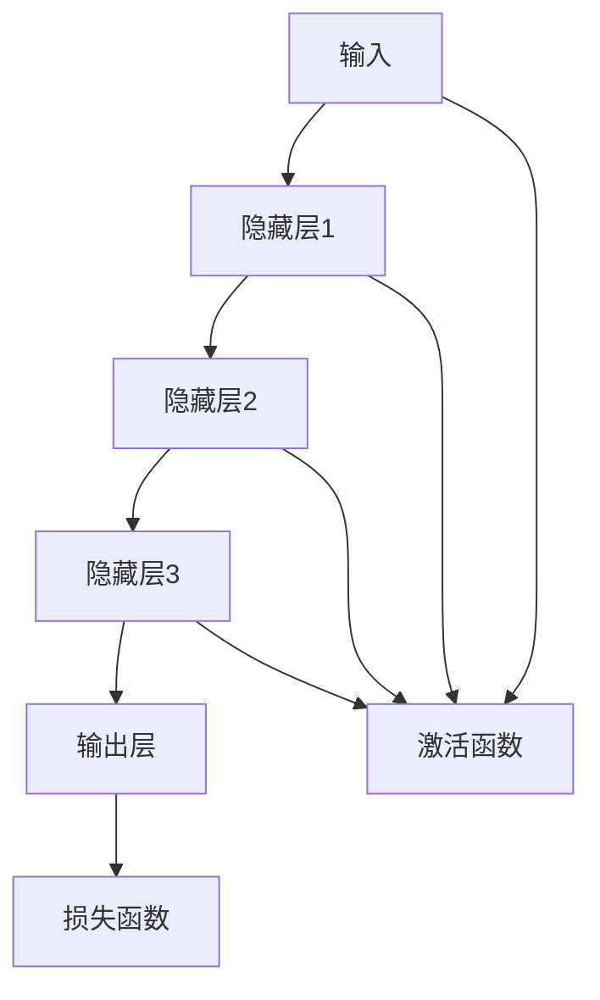

这个流程图展示了从输入层到输出层的神经网络的简化架构，包括隐藏层和激活函数。

### B.2 Transformer模型流程图

以下是一个简单的Transformer模型的Mermaid流程图示例：

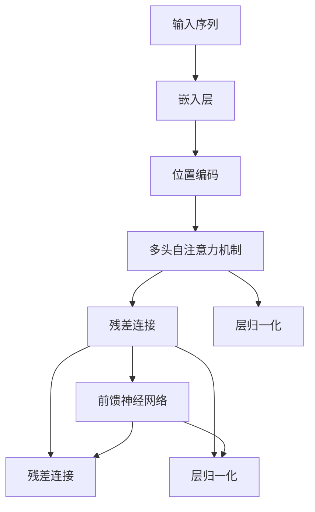

这个流程图展示了Transformer模型的主要组件，包括嵌入层、位置编码、多头自注意力机制、残差连接和前馈神经网络。

---

## 附录C：伪代码

### C.1 前向传播伪代码

以下是一个简单的前向传播的伪代码：

```
function forward_pass(model, input_data):
    for layer in model.layers:
        input_data = layer.forward(input_data)
    return output
```

在这个伪代码中，`model`是一个神经网络模型，`input_data`是输入数据。我们遍历模型的每一层，并使用当前层的`forward`方法处理输入数据，直到最后一层得到输出。

### C.2 反向传播伪代码

以下是一个简单的反向传播的伪代码：

```
function backward_pass(model, output, target):
    for layer in model.layers[::-1]:
        error = layer.backward(output - target)
        output = error
    return total_loss
```

在这个伪代码中，`model`是一个神经网络模型，`output`是模型输出，`target`是实际目标。我们从模型的最后一层开始，逆向遍历每一层，并使用当前层的`backward`方法计算误差。最后，返回总的损失值。

---

## 附录D：数学模型与公式

### D.1 梯度下降公式

梯度下降是一种优化算法，用于最小化损失函数。其核心公式如下：

$$
w_{t+1} = w_t - \alpha \cdot \nabla_w J(w)
$$

其中，$w_t$是当前权重，$w_{t+1}$是更新后的权重，$\alpha$是学习率，$\nabla_w J(w)$是损失函数$J(w)$关于权重$w$的梯度。

### D.2 模型优化常用损失函数

在模型优化过程中，常用的损失函数包括均方误差（MSE）和交叉熵损失（Cross-Entropy Loss）。

1. **均方误差（MSE）**：

$$
MSE = \frac{1}{n}\sum_{i=1}^{n} (y_i - \hat{y}_i)^2
$$

其中，$y_i$是实际值，$\hat{y}_i$是预测值，$n$是样本数量。

2. **交叉熵损失（Cross-Entropy Loss）**：

$$
Cross-Entropy Loss = -\frac{1}{n}\sum_{i=1}^{n} y_i \cdot \log(\hat{y}_i)
$$

其中，$y_i$是实际值（通常是一个概率分布），$\hat{y}_i$是预测值（也通常是一个概率分布）。

---

## 附录E：项目实战源代码解析

### E.1 计算机视觉项目代码解析

在计算机视觉项目中，代码解析通常包括模型构建、数据预处理、模型训练和模型评估等环节。以下是一个简单的计算机视觉项目的代码解析：

```python
import torch
import torchvision
import torchvision.transforms as transforms
import torch.nn as nn
import torch.optim as optim

# 模型构建
class SimpleCNN(nn.Module):
    def __init__(self):
        super(SimpleCNN, self).__init__()
        self.conv1 = nn.Conv2d(3, 32, 3, padding=1)
        self.conv2 = nn.Conv2d(32, 64, 3, padding=1)
        self.fc1 = nn.Linear(64 * 6 * 6, 128)
        self.fc2 = nn.Linear(128, 10)
        self.dropout = nn.Dropout(0.2)

    def forward(self, x):
        x = self.conv1(x)
        x = nn.functional.relu(x)
        x = self.conv2(x)
        x = nn.functional.relu(x)
        x = nn.functional.adaptive_avg_pool2d(x, 1)
        x = x.view(x.size(0), -1)
        x = self.fc1(x)
        x = nn.functional.relu(x)
        x = self.dropout(x)
        x = self.fc2(x)
        return x

# 数据预处理
transform = transforms.Compose([
    transforms.Resize(32),
    transforms.ToTensor(),
])

train_set = torchvision.datasets.CIFAR10(root='./data', train=True, transform=transform, download=True)
val_set = torchvision.datasets.CIFAR10(root='./data', train=False, transform=transform, download=True)

# 模型训练
model = SimpleCNN()
criterion = nn.CrossEntropyLoss()
optimizer = optim.Adam(model.parameters(), lr=0.001)

num_epochs = 10

for epoch in range(num_epochs):
    model.train()
    running_loss = 0.0
    for inputs, targets in train_loader:
        optimizer.zero_grad()
        outputs = model(inputs)
        loss = criterion(outputs, targets)
        loss.backward()
        optimizer.step()
        running_loss += loss.item()
    print(f'Epoch {epoch + 1}, Loss: {running_loss / len(train_loader)}')

# 模型评估
model.eval()
correct = 0
total = 0
with torch.no_grad():
    for inputs, targets in val_loader:
        outputs = model(inputs)
        _, predicted = torch.max(outputs.data, 1)
        total += targets.size(0)
        correct += (predicted == targets).sum().item()

print(f'Validation Accuracy: {100 * correct / total}%')
```

在这个代码中，我们首先定义了一个简单的卷积神经网络模型，然后使用CIFAR-10数据集进行训练。通过训练和评估，我们可以得到模型的准确率。

### E.2 自然语言处理项目代码解析

在自然语言处理项目中，代码解析通常包括数据预处理、模型构建、模型训练和模型评估等环节。以下是一个简单的自然语言处理项目的代码解析：

```python
import torch
import torch.nn as nn
import torch.optim as optim
from torchtext.datasets import IMDb
from torchtext.data import Field, LabelField, BucketIterator

# 数据预处理
TEXT = Field(tokenize='spacy', lower=True, include_lengths=True)
LABEL = LabelField(dtype=torch.float)

train_data, test_data = IMDb.splits(TEXT, LABEL)
fields = [('text', TEXT), ('label', LABEL)]
train_data, valid_data = train_data.split()

train_iterator, valid_iterator, test_iterator = BucketIterator.splits(
    (train_data, valid_data, test_data),
    batch_size=64,
    device=device
)

# 模型构建
class TextClassifier(nn.Module):
    def __init__(self, vocab_size, embedding_dim, hidden_dim, output_dim):
        super(TextClassifier, self).__init__()
        self.embedding = nn.Embedding(vocab_size, embedding_dim)
        self.lstm = nn.LSTM(embedding_dim, hidden_dim, num_layers=1)
        self.fc = nn.Linear(hidden_dim, output_dim)
        
    def forward(self, text, text_lengths):
        embedded = self.embedding(text)
        packed_embedded = nn.utils.rnn.pack_padded_sequence(embedded, text_lengths, batch_first=True)
        packed_output, (hidden, cell) = self.lstm(packed_embedded)
        output, _ = nn.utils.rnn.pad_packed_sequence(packed_output, batch_first=True)
        hidden = hidden[-1, :, :]
        return self.fc(hidden)

# 模型训练
model = TextClassifier(len(TEXT.vocab), embedding_dim=100, hidden_dim=256, output_dim=1)
criterion = nn.BCEWithLogitsLoss()
optimizer = optim.Adam(model.parameters(), lr=0.001)

num_epochs = 5

for epoch in range(num_epochs):
    model.train()
    for batch in train_iterator:
        optimizer.zero_grad()
        text, text_lengths = batch.text
        predictions = model(text, text_lengths).squeeze(1)
        loss = criterion(predictions, batch.label)
        loss.backward()
        optimizer.step()

    model.eval()
    with torch.no_grad():
        correct = 0
        total = 0
        for batch in valid_iterator:
            text, text_lengths = batch.text
            predictions = model(text, text_lengths).squeeze(1)
            _, predicted = torch.max(predictions, 1)
            total += batch.label.size(0)
            correct += (predicted == batch.label).sum().item()

        print(f'Epoch {epoch + 1}, Accuracy: {100 * correct / total}%')

# 模型评估
test_correct = 0
test_total = 0
with torch.no_grad():
    for batch in test_iterator:
        text, text_lengths = batch.text
        predictions = model(text, text_lengths).squeeze(1)
        _, predicted = torch.max(predictions, 1)
        test_total += batch.label.size(0)
        test_correct += (predicted == batch.label).sum().item()

print(f'Test Accuracy: {100 * test_correct / test_total}%')
```

在这个代码中，我们首先定义了一个简单的文本分类模型，然后使用IMDb数据集进行训练。通过训练和评估，我们可以得到模型的准确率。

### E.3 强化学习项目代码解析

在强化学习项目中，代码解析通常包括环境搭建、状态-行动值函数学习、策略评估和策略优化等环节。以下是一个简单的强化学习项目的代码解析：

```python
import torch
import numpy as np

# 环境搭建
class GridWorld:
    def __init__(self, size=5):
        self.size = size
        self.state = np.random.randint(size)
        self.reward = -1 if self.state < size else 1

    def step(self, action):
        if action == 0:
            self.state = np.clip(self.state - 1, 0, self.size - 1)
        elif action == 1:
            self.state = np.clip(self.state + 1, 0, self.size - 1)
        elif action == 2:
            self.state = np.clip(self.state - size, 0, self.size - 1)
        elif action == 3:
            self.state = np.clip(self.state + size, 0, self.size - 1)
        return self.state, self.reward

# Q-Learning算法
def q_learning(env, alpha=0.1, gamma=0.9, epsilon=0.1, num_episodes=1000):
    q_values = np.zeros([env.size, env.size])
    for episode in range(num_episodes):
        state = env.state
        done = False
        while not done:
            action = np.random.choice([0, 1, 2, 3], p=[epsilon / 4, epsilon / 4, epsilon / 4, epsilon / 4])
            next_state, reward = env.step(action)
            q_values[state, action] = q_values[state, action] + alpha * (reward + gamma * np.max(q_values[next_state]) - q_values[state, action])
            state = next_state
            if np.random.random() < epsilon:
                done = True
    return q_values

# 训练模型
env = GridWorld(size=5)
q_values = q_learning(env, num_episodes=1000)
print(q_values)
```

在这个代码中，我们首先定义了一个简单的网格世界环境，然后使用Q-Learning算法训练状态-行动值函数。通过训练，我们可以得到最优的策略。

### 总结

通过上述代码解析，我们可以看到计算机视觉、自然语言处理和强化学习项目的基本结构和实现方法。这些代码不仅展示了如何构建和训练模型，还提供了模型评估的方法。在实际应用中，可以根据具体需求对代码进行调整和优化。希望这些代码示例能够帮助读者更好地理解和应用深度学习技术。

