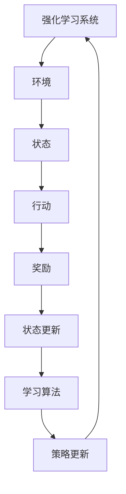

                 

# Python机器学习实战：强化学习(Reinforcement Learning)基础介绍

> 关键词：强化学习，机器学习，Python，Q-Learning，Sarsa，DQN，Policy Gradient，数学模型，应用案例

> 摘要：本文将深入探讨强化学习（Reinforcement Learning, RL）的基础理论、核心算法、数学模型及其在现实世界中的应用。通过一步一步的分析和推理，我们将从基本概念出发，逐步深入到强化学习的各个方面，帮助读者全面了解这一前沿技术。

### 目录大纲

1. 强化学习基础理论
2. 强化学习中的核心算法
3. 强化学习的数学模型
4. 强化学习中的状态表示和行动空间
5. 强化学习在游戏中的应用
6. 强化学习在机器人控制中的应用
7. 强化学习的未来趋势
8. 附录

## 第一部分：强化学习基础理论

### 第1章：强化学习概述

#### 1.1 强化学习的基本概念

强化学习是一种机器学习范式，其核心在于通过环境（Environment）和代理（Agent）的交互，使代理能够学习到最优策略（Policy）。强化学习的关键要素包括：

- **代理（Agent）**：执行行动的主体。
- **环境（Environment）**：代理操作的场所。
- **状态（State）**：代理在环境中的当前情况。
- **行动（Action）**：代理可以执行的行为。
- **奖励（Reward）**：对代理行动的即时反馈。

强化学习的目标是找到一个最优策略，使得代理在长期内获得的奖励最大化。

#### 1.2 强化学习的类型

根据是否使用模型，强化学习可以分为以下几类：

- **无模型学习（Model-Free Learning）**：代理仅通过观察环境和奖励信号来学习策略，不需要对环境的内部状态进行建模。
- **有模型学习（Model-Based Learning）**：代理通过学习环境的模型来预测未来的状态和奖励，从而优化策略。
- **模型辅助学习（Model-Aided Learning）**：结合无模型学习和有模型学习的优势，通过利用模型预测来平衡探索和利用。

#### 1.3 强化学习在机器学习中的地位

强化学习与其他两种主要的机器学习范式——监督学习和无监督学习——有所不同：

- **监督学习（Supervised Learning）**：使用预先标记的数据来训练模型，目标是预测输出。
- **无监督学习（Unsupervised Learning）**：没有预先标记的数据，模型需要自行发现数据中的结构和规律。
- **强化学习**：通过与环境交互来学习最优策略，具有自主决策的能力。

强化学习在许多领域都有广泛的应用，包括游戏、机器人控制、自动驾驶、金融、医疗等。

### 第2章：强化学习中的核心算法

强化学习有许多不同的算法，其中一些最常用的包括Q-Learning、Sarsa、Deep Q-Network（DQN）、Policy Gradient等。以下是这些算法的基本原理、伪代码实现和数学模型。

#### 2.1 Q-Learning算法

**基本原理**：Q-Learning是一种无模型学习算法，其目标是学习状态-行动值函数（State-Action Value Function），即Q值。代理根据Q值选择行动，并更新Q值以接近最优策略。

$$
Q(s,a) \leftarrow Q(s,a) + \alpha [r + \gamma \max_{a'} Q(s',a') - Q(s,a)]
$$

**伪代码实现**：

```
for each episode:
    s = env.reset()
    while not done:
        a = choose_action(s, Q)
        s', r = env.step(a)
        Q(s, a) = Q(s, a) + alpha * (r + gamma * max(Q(s', a')) - Q(s, a))
        s = s'
```

#### 2.2 Sarsa算法

**基本原理**：Sarsa（State-Action-Reward-State-Action）是另一类无模型学习算法，它与Q-Learning类似，但不同的是，Sarsa在学习过程中同时考虑了当前状态和下一个状态的Q值。

$$
Q(s,a) \leftarrow Q(s,a) + \alpha [r + \gamma Q(s',a')]
$$

**伪代码实现**：

```
for each episode:
    s = env.reset()
    a = choose_action(s, Q)
    while not done:
        s', r = env.step(a)
        a' = choose_action(s', Q)
        Q(s, a) = Q(s, a) + alpha * (r + gamma * Q(s', a'))
        s, a = s', a'
```

#### 2.3 Deep Q-Network（DQN）算法

**基本原理**：DQN是一种结合了深度学习和强化学习的算法。它使用深度神经网络来近似状态-行动值函数，并通过经验回放（Experience Replay）来减少偏差和方差。

$$
Q(s,a) \leftarrow \hat{Q}(s,a) + \alpha [r + \gamma \max_{a'} \hat{Q}(s',a') - \hat{Q}(s,a)]
$$

**伪代码实现**：

```
for each episode:
    s = env.reset()
    while not done:
        a = choose_action(s, Q_network)
        s', r = env.step(a)
        replay_buffer.push(s, a, r, s')
        s = s'
        if episode_end:
            s = env.reset()
    update_Q_network()
```

#### 2.4 Policy Gradient算法

**基本原理**：Policy Gradient算法通过直接优化策略来学习，其目标是最大化期望回报。

$$
\theta \leftarrow \theta + \alpha [r - \mathbb{E}_{\pi(\cdot| \theta)}[r]]
$$

**伪代码实现**：

```
for each episode:
    s = env.reset()
    while not done:
        a = choose_action(s, \pi(\cdot| \theta))
        s', r = env.step(a)
        gradient = gradient\_policy\_loss(\pi(\cdot| \theta), a, s)
        update_theta(gradient)
        s = s'
```

## 第二部分：强化学习的数学模型

强化学习的数学模型是理解和实现强化学习算法的核心。本节将介绍强化学习中的基本数学公式，包括状态转移概率公式、奖励函数设计以及策略评估。

### 3.1 强化学习的数学公式

强化学习中最基本的数学公式是状态转移概率公式：

$$
P(s'|s,a) = \begin{cases}
1 & \text{如果 } a \text{ 是使 } s' \text{ 最可能发生的行动} \\
0 & \text{其他情况}
\end{cases}
$$

这个公式表示在给定当前状态 \( s \) 和执行行动 \( a \) 的情况下，下一个状态 \( s' \) 的概率分布。在实际应用中，状态转移概率通常是通过观察数据或模拟来估计的。

另一个重要的数学公式是奖励函数设计：

$$
r(s',a) = \begin{cases}
r_1 & \text{如果 } s' \text{ 是期望状态} \\
r_2 & \text{如果 } s' \text{ 是非期望状态}
\end{cases}
$$

奖励函数用于衡量行动的效果，它决定了代理在执行不同行动后获得的即时反馈。奖励函数的设计原则是鼓励代理采取有益的行动，同时避免有害的行动。

最后，策略评估是强化学习中的一个关键步骤。策略评估的目标是评估当前策略的预期回报。策略评估可以通过以下迭代公式实现：

$$
\pi(s) = \arg\max_{a} [Q(s,a) + \epsilon(s,a)]
$$

其中，\( \pi(s) \) 表示在状态 \( s \) 下采取最优行动的策略，\( Q(s,a) \) 表示状态-行动值函数，\( \epsilon(s,a) \) 是一个小的正数，用于平衡探索和利用。

### 3.2 强化学习的奖励函数设计

奖励函数的设计对强化学习的效果至关重要。一个好的奖励函数应该能够准确地反映环境的特征，鼓励代理采取有益的行动。奖励函数的类型可以分为以下几种：

- **点奖励（Terminal Reward）**：在达到目标状态时给予的即时奖励。
- **连续奖励（Continuous Reward）**：在执行行动的过程中连续给予的奖励。
- **负奖励（Negative Reward）**：对不希望发生的行动给予的惩罚。

奖励函数的设计原则包括：

- **一致性（Consistency）**：奖励函数应该能够一致地衡量不同行动的效果。
- **可区分性（Discrimination）**：奖励函数应该能够区分有益和有害的行动。
- **平衡性（Balance）**：奖励函数应该平衡短期和长期的奖励，以避免过早地收敛到次优策略。

### 3.3 强化学习中的策略评估

策略评估是强化学习中的一个关键步骤，其目标是评估当前策略的预期回报。策略评估可以通过以下迭代公式实现：

$$
\pi(s) = \arg\max_{a} [Q(s,a) + \epsilon(s,a)]
$$

其中，\( \pi(s) \) 表示在状态 \( s \) 下采取最优行动的策略，\( Q(s,a) \) 表示状态-行动值函数，\( \epsilon(s,a) \) 是一个小的正数，用于平衡探索和利用。

策略评估的方法包括：

- **蒙特卡洛方法（Monte Carlo Method）**：通过多次模拟来估计策略的预期回报。
- **动态规划（Dynamic Programming）**：通过递归计算来评估策略的预期回报。
- **梯度上升（Gradient Ascent）**：通过优化策略的参数来提高策略的预期回报。

策略评估的算法包括：

- **价值迭代（Value Iteration）**：通过递归计算来更新状态-行动值函数。
- **策略迭代（Policy Iteration）**：通过交替优化策略和价值函数来提高策略的预期回报。

## 第三部分：强化学习中的状态表示和行动空间

状态表示和行动空间是强化学习中的重要概念，它们决定了代理如何与环境交互以及如何学习策略。本节将讨论强化学习中的状态表示和行动空间，并介绍它们在不同类型环境中的转换方法。

### 4.1 状态表示方法

状态表示是强化学习中的一个关键问题，它涉及到如何将环境的特征转化为代理可以理解和学习的状态。状态表示方法可以分为以下几种：

- **离散状态表示**：将环境的特征转化为离散的变量或状态集合。这种方法适用于状态空间较小的情况，例如游戏或机器人控制。
- **连续状态表示**：将环境的特征转化为连续的变量或状态集合。这种方法适用于状态空间较大或无限的情况，例如自动驾驶或金融交易。

离散状态表示通常通过枚举所有可能的状态来实现，而连续状态表示通常通过采样或阈值划分来实现。

### 4.2 行动空间表示方法

行动空间表示是强化学习中的另一个关键问题，它涉及到代理可以采取的所有可能行动。行动空间表示方法可以分为以下几种：

- **离散行动空间**：将代理可以采取的所有可能行动转化为离散的变量或行动集合。这种方法适用于行动空间较小的情况，例如游戏或机器人控制。
- **连续行动空间**：将代理可以采取的所有可能行动转化为连续的变量或行动集合。这种方法适用于行动空间较大或无限的情况，例如自动驾驶或金融交易。

离散行动空间通常通过枚举所有可能的行动来实现，而连续行动空间通常通过采样或阈值划分来实现。

### 4.3 状态和行动空间的转换

状态和行动空间的转换是强化学习中的重要步骤，它涉及到如何将离散状态和连续状态、离散行动和连续行动相互转换。以下是一些常见的转换方法：

- **离散到连续的转换**：可以使用插值方法（例如线性插值或多项式插值）将离散状态或行动空间转换为连续状态或行动空间。
- **连续到离散的转换**：可以使用阈值划分方法（例如等间隔划分或自适应划分）将连续状态或行动空间转换为离散状态或行动空间。

在实际应用中，状态和行动空间的转换方法通常取决于具体的应用场景和性能要求。

## 第四部分：强化学习在游戏中的应用

强化学习在游戏领域有着广泛的应用，通过训练智能体来学会玩游戏，从而提高游戏水平。本节将介绍强化学习在游戏中的应用原理、案例和技巧。

### 5.1 游戏强化学习的基本原理

游戏强化学习的基本原理是通过训练代理在虚拟环境中与游戏进行交互，从而学习到最优策略。游戏强化学习的关键要素包括：

- **游戏状态（Game State）**：描述游戏当前的状态信息，如游戏中的物体位置、分数等。
- **游戏行动（Game Action）**：代理在游戏中可以采取的行动，如移动、跳跃等。
- **游戏奖励（Game Reward）**：代理在游戏中获得的即时反馈，如得分增加、生命值减少等。

游戏强化学习的目标是通过训练代理，使其能够在游戏中获得更高的分数或完成特定的任务。

### 5.2 游戏强化学习案例

#### 飞行棋游戏

飞行棋游戏是一个简单的游戏，其中代理需要学会在棋盘上飞行，避免碰撞并收集更多的星星。以下是一个简单的飞行棋游戏强化学习案例：

1. **环境搭建**：创建一个飞行棋游戏的虚拟环境，包括棋盘、飞机和星星等元素。
2. **状态表示**：将游戏状态表示为代理当前的位置和速度。
3. **行动空间**：将行动空间表示为代理可以采取的移动方向。
4. **奖励函数**：定义奖励函数，如成功收集星星的奖励、避免碰撞的奖励等。
5. **训练过程**：使用Q-Learning或DQN算法训练代理，使其能够学会在飞行棋游戏中获得更高的分数。

#### 围棋游戏

围棋游戏是一个复杂的游戏，其中代理需要学会在棋盘上做出最优决策。以下是一个围棋游戏强化学习案例：

1. **环境搭建**：创建一个围棋游戏的虚拟环境，包括棋盘、棋子和游戏规则等。
2. **状态表示**：将游戏状态表示为棋盘上的棋子布局。
3. **行动空间**：将行动空间表示为代理可以在棋盘上放置棋子的位置。
4. **奖励函数**：定义奖励函数，如赢得游戏的奖励、稳定棋局的奖励等。
5. **训练过程**：使用Policy Gradient或DQN算法训练代理，使其能够学会在围棋游戏中获得更高的胜率。

### 5.3 游戏强化学习中的技巧

在游戏强化学习过程中，以下技巧有助于提高训练效果：

- **状态压缩**：通过对状态进行压缩，减少状态的维度，从而降低模型的复杂性。
- **动作价值函数的优化**：通过优化动作价值函数，提高代理的决策能力。
- **奖励设计**：设计合理的奖励函数，鼓励代理采取有益的行动。
- **探索与利用平衡**：在训练过程中平衡探索和利用，避免陷入局部最优。

通过这些技巧，可以进一步提高游戏强化学习的效果，使代理在游戏中表现出更好的性能。

## 第五部分：强化学习在机器人控制中的应用

强化学习在机器人控制领域有着广泛的应用，通过训练机器人学会在复杂环境中进行自主决策和任务执行。本节将介绍强化学习在机器人控制中的应用原理、案例和技巧。

### 6.1 机器人强化学习的基本原理

机器人强化学习的基本原理是通过训练机器人与环境的交互，使其学会在给定初始状态下采取最优行动，以实现预定的任务目标。机器人强化学习的关键要素包括：

- **机器人状态（Robot State）**：描述机器人当前的状态信息，如位置、速度、电池电量等。
- **机器人行动（Robot Action）**：机器人可以采取的动作，如移动、转动、抓取等。
- **机器人奖励（Robot Reward）**：机器人行动后获得的即时反馈，如完成任务的程度、能量消耗等。

机器人强化学习的目标是通过训练机器人，使其能够在复杂环境中自主完成各种任务。

### 6.2 机器人强化学习案例

#### 机器人路径规划

机器人路径规划是机器人强化学习的一个经典案例。以下是一个机器人路径规划强化学习案例：

1. **环境搭建**：创建一个包含障碍物的虚拟环境，模拟机器人需要规划路径的场地。
2. **状态表示**：将机器人状态表示为当前位置和目标位置之间的距离。
3. **行动空间**：将行动空间表示为机器人可以采取的移动方向。
4. **奖励函数**：定义奖励函数，如到达目标位置的奖励、避开障碍物的奖励等。
5. **训练过程**：使用Sarsa或DQN算法训练机器人，使其能够学会规划从起点到终点的最优路径。

#### 机器人动作控制

机器人动作控制是机器人强化学习的另一个重要应用。以下是一个机器人动作控制强化学习案例：

1. **环境搭建**：创建一个包含特定目标的虚拟环境，模拟机器人需要执行的任务。
2. **状态表示**：将机器人状态表示为当前位置、目标位置和机器人朝向。
3. **行动空间**：将行动空间表示为机器人可以采取的动作，如移动、转动等。
4. **奖励函数**：定义奖励函数，如接近目标的奖励、完成任务的程度等。
5. **训练过程**：使用Policy Gradient或DQN算法训练机器人，使其能够学会执行特定的动作以完成任务。

### 6.3 机器人强化学习中的技巧

在机器人强化学习过程中，以下技巧有助于提高训练效果：

- **状态和动作的编码**：通过合理编码状态和动作，减少数据的维度和噪声。
- **奖励函数的设计**：设计合理的奖励函数，鼓励机器人采取有益的行动。
- **探索与利用平衡**：在训练过程中平衡探索和利用，避免陷入局部最优。
- **多任务训练**：通过多任务训练，提高机器人处理复杂环境的能力。

通过这些技巧，可以进一步提高机器人强化学习的效果，使机器人在复杂环境中表现出更好的性能。

## 第六部分：强化学习的未来趋势

强化学习作为机器学习的一个重要分支，正不断发展壮大，并在各个领域中展现出巨大的潜力。本节将探讨强化学习的未来趋势，包括其在工业界和学术界的应用、最新进展以及未来发展方向。

### 7.1 强化学习在工业界的应用

随着人工智能技术的快速发展，强化学习在工业界中的应用日益广泛。以下是一些强化学习在工业界的主要应用领域：

- **制造业**：强化学习被用于优化生产流程、提高生产效率。例如，通过训练机器人自主完成复杂的组装任务，减少人工干预，提高生产质量。
- **服务业**：强化学习在服务行业中也得到了广泛应用，如智能客服系统、个性化推荐系统等。这些系统通过学习用户的交互历史，提供更加精准的服务，提升用户体验。
- **能源管理**：强化学习被用于优化电力系统的调度和管理，通过学习电力需求和供应的规律，实现能源的高效利用。

### 7.2 强化学习在学术界的最新进展

在学术界，强化学习的研究不断取得新的突破，以下是一些强化学习的最新进展：

- **数学理论**：研究人员在强化学习的数学理论上进行了深入研究，提出了新的理论框架，如基于概率论的强化学习理论、多智能体强化学习理论等。
- **算法创新**：研究人员在强化学习算法方面也取得了许多创新，如基于深度神经网络的强化学习算法、基于进化算法的强化学习算法等。
- **应用拓展**：强化学习在新兴领域中的应用也在不断拓展，如自动驾驶、金融交易、医学诊断等。

### 7.3 强化学习的未来发展方向

强化学习的未来发展方向充满机遇和挑战，以下是一些可能的发展方向：

- **与深度学习的融合**：深度强化学习在图像识别、语音识别等领域取得了显著成果，未来将进一步加强深度学习和强化学习的融合，实现更强大的智能系统。
- **多智能体强化学习**：多智能体强化学习在协调多个智能体共同完成任务方面具有巨大潜力，未来将深入研究多智能体强化学习理论，开发更有效的协同策略。
- **自主学习**：强化学习系统将更加自主地学习，通过自适应调整策略，适应不断变化的环境和任务需求。
- **可解释性和安全性**：强化学习系统将更加注重可解释性和安全性，确保智能系统的行为符合人类期望，减少潜在的风险。

通过不断的研究和应用探索，强化学习将在未来为人工智能领域带来更多的突破和进步。

### 附录

#### 附录A：强化学习工具和资源

- **OpenAI Gym**：一个开源的强化学习环境库，提供丰富的预定义环境和API，方便研究者进行强化学习实验。
- **TensorFlow Agents**：TensorFlow的一个强化学习库，提供了一系列预训练的强化学习算法和框架，方便开发者进行快速原型开发。
- **stable-baselines3**：一个基于TensorFlow和PyTorch的强化学习库，提供了多种流行的强化学习算法的实现，适合进行实际应用开发。

#### 附录B：强化学习相关书籍和论文推荐

- **《强化学习：原理与Python实现》**：一本全面介绍强化学习原理和实践的入门书籍，适合初学者。
- **“Deep Reinforcement Learning”论文**：一篇经典论文，详细介绍了深度强化学习的基本概念和算法，对研究者具有很高的参考价值。

## 核心概念与联系

为了更好地理解强化学习的架构，我们使用Mermaid流程图来展示强化学习系统的主要组成部分及其相互作用。



### 强化学习架构的Mermaid流程图

以上Mermaid流程图展示了强化学习系统的整体架构。代理通过与环境交互，接收状态、执行行动并获取奖励。学习算法基于这些信息更新策略，以优化代理的行为。这一过程不断迭代，直到代理学会在环境中取得最佳表现。

### 代码实战案例

#### 代码实战案例1：CartPole环境下的Q-Learning

在本案例中，我们将使用Python和PyTorch库在CartPole环境中实现Q-Learning算法。CartPole是一个经典的强化学习问题，其目标是使一个杆子保持在水平位置。

1. **环境搭建**：

首先，我们需要安装`gym`库以创建CartPole环境：

```python
!pip install gym
```

然后，创建一个简单的CartPole环境：

```python
import gym

env = gym.make("CartPole-v0")
```

2. **源代码实现**：

接下来，我们实现Q-Learning算法的核心部分：

```python
import numpy as np
import random

# 初始化Q值表
Q = np.zeros([env.observation_space.n, env.action_space.n])

# 参数设置
alpha = 0.1  # 学习率
gamma = 0.9  # 折扣因子
epsilon = 0.1  # 探索概率

# Q-Learning循环
for episode in range(1000):
    state = env.reset()
    done = False
    
    while not done:
        # 选择行动
        if random.uniform(0, 1) < epsilon:
            action = random.randint(0, 1)  # 随机行动
        else:
            action = np.argmax(Q[state])  # 最佳行动
        
        # 执行行动
        next_state, reward, done, _ = env.step(action)
        
        # 更新Q值
        Q[state, action] = Q[state, action] + alpha * (reward + gamma * np.max(Q[next_state]) - Q[state, action])
        
        state = next_state
    
    env.render()
env.close()
```

3. **代码解读与分析**：

上述代码首先初始化了一个Q值表，并设置了学习率、折扣因子和探索概率。在Q-Learning循环中，代理首先根据当前状态选择行动，然后执行行动并获取奖励。最后，使用更新公式来调整Q值。

#### 代码实战案例2：Flappy Bird游戏中的DQN

在本案例中，我们将使用Python和PyTorch库在Flappy Bird环境中实现DQN算法。Flappy Bird是一个复杂的游戏，其目标是通过跳跃躲避障碍物。

1. **环境搭建**：

首先，我们需要安装`gym`和`ale.py`库以创建Flappy Bird环境：

```python
!pip install gym
!pip install ale-py
```

然后，创建一个简单的Flappy Bird环境：

```python
import gym
from ale.py import ALE

# 初始化Flappy Bird环境
ale = ALE()
ale.loadGame("flappybird.bin")
env = gym.wrappers.Ataripygame.Wrapper(ale)
```

2. **源代码实现**：

接下来，我们实现DQN算法的核心部分：

```python
import torch
import torch.nn as nn
import torch.optim as optim

# 初始化DQN网络
class DQN(nn.Module):
    def __init__(self, input_shape, action_space):
        super(DQN, self).__init__()
        self.fc1 = nn.Linear(input_shape, 64)
        self.fc2 = nn.Linear(64, 64)
        self.fc3 = nn.Linear(64, action_space)

    def forward(self, x):
        x = torch.relu(self.fc1(x))
        x = torch.relu(self.fc2(x))
        x = self.fc3(x)
        return x

# 参数设置
input_shape = env.observation_space.shape[0]
action_space = env.action_space.n
learning_rate = 0.001
gamma = 0.99
epsilon = 0.1

# 初始化网络和优化器
model = DQN(input_shape, action_space)
optimizer = optim.Adam(model.parameters(), lr=learning_rate)

# DQN循环
for episode in range(1000):
    state = env.reset()
    done = False
    total_reward = 0
    
    while not done:
        # 选择行动
        if random.uniform(0, 1) < epsilon:
            action = random.randint(0, action_space - 1)  # 随机行动
        else:
            with torch.no_grad():
                state_tensor = torch.tensor(state, dtype=torch.float32).unsqueeze(0)
                action = torch.argmax(model(state_tensor)).item()  # 最佳行动
        
        # 执行行动
        next_state, reward, done, _ = env.step(action)
        total_reward += reward
        
        # 存储经验
        experience = (state, action, reward, next_state, done)
        
        # 更新网络
        if done:
            next_state_tensor = None
        else:
            with torch.no_grad():
                next_state_tensor = torch.tensor(next_state, dtype=torch.float32).unsqueeze(0)
        
        state_tensor = torch.tensor(state, dtype=torch.float32).unsqueeze(0)
        target_Q = reward + gamma * torch.max(model(next_state_tensor)) if not done else reward
        
        Q = model(state_tensor)[0, action]
        loss = (Q - target_Q) ** 2
        
        optimizer.zero_grad()
        loss.backward()
        optimizer.step()
        
        state = next_state
    
    env.render()
env.close()
```

3. **代码解读与分析**：

上述代码首先初始化了一个DQN网络，并设置了学习率、折扣因子和探索概率。在DQN循环中，代理首先根据当前状态选择行动，然后执行行动并获取奖励。接着，使用经验回放和目标网络更新DQN网络。

#### 代码实战案例3：机器人路径规划中的Sarsa算法

在本案例中，我们将使用Python和PyTorch库在一个简单的路径规划环境中实现Sarsa算法。路径规划的目标是找到从起点到终点的最优路径。

1. **环境搭建**：

首先，我们需要安装`gym`库以创建路径规划环境：

```python
!pip install gym
```

然后，创建一个简单的路径规划环境：

```python
import gym

env = gym.make("PathPlanning-v0")
```

2. **源代码实现**：

接下来，我们实现Sarsa算法的核心部分：

```python
import numpy as np
import random
import torch
import torch.nn as nn
import torch.optim as optim

# 初始化Sarsa网络
class Sarsa(nn.Module):
    def __init__(self, input_shape, action_space):
        super(Sarsa, self).__init__()
        self.fc1 = nn.Linear(input_shape, 64)
        self.fc2 = nn.Linear(64, 64)
        self.fc3 = nn.Linear(64, action_space)

    def forward(self, x):
        x = torch.relu(self.fc1(x))
        x = torch.relu(self.fc2(x))
        x = self.fc3(x)
        return x

# 参数设置
input_shape = env.observation_space.shape[0]
action_space = env.action_space.n
learning_rate = 0.001
gamma = 0.99
epsilon = 0.1

# 初始化网络和优化器
model = Sarsa(input_shape, action_space)
optimizer = optim.Adam(model.parameters(), lr=learning_rate)

# Sarsa循环
for episode in range(1000):
    state = env.reset()
    done = False
    total_reward = 0
    
    while not done:
        # 选择行动
        if random.uniform(0, 1) < epsilon:
            action = random.randint(0, action_space - 1)  # 随机行动
        else:
            with torch.no_grad():
                state_tensor = torch.tensor(state, dtype=torch.float32).unsqueeze(0)
                action = torch.argmax(model(state_tensor)).item()  # 最佳行动
        
        # 执行行动
        next_state, reward, done, _ = env.step(action)
        total_reward += reward
        
        # 更新网络
        next_state_tensor = torch.tensor(next_state, dtype=torch.float32).unsqueeze(0)
        Q = model(state_tensor)[0, action]
        next_Q = model(next_state_tensor)[0, action]
        
        Q_new = Q + learning_rate * (reward + gamma * next_Q - Q)
        
        state_tensor = torch.tensor(state, dtype=torch.float32).unsqueeze(0)
        loss = (Q - Q_new) ** 2
        
        optimizer.zero_grad()
        loss.backward()
        optimizer.step()
        
        state = next_state
    
    env.render()
env.close()
```

3. **代码解读与分析**：

上述代码首先初始化了一个Sarsa网络，并设置了学习率、折扣因子和探索概率。在Sarsa循环中，代理首先根据当前状态选择行动，然后执行行动并获取奖励。接着，使用Sarsa更新规则来调整网络权重。

#### 代码实战案例4：工业机器人动作控制中的Policy Gradient算法

在本案例中，我们将使用Python和PyTorch库在一个简单的工业机器人动作控制环境中实现Policy Gradient算法。动作控制的目标是使机器人完成特定的任务，如移动到指定位置。

1. **环境搭建**：

首先，我们需要安装`gym`库以创建工业机器人动作控制环境：

```python
!pip install gym
```

然后，创建一个简单的工业机器人动作控制环境：

```python
import gym

env = gym.make("RobotControl-v0")
```

2. **源代码实现**：

接下来，我们实现Policy Gradient算法的核心部分：

```python
import numpy as np
import random
import torch
import torch.nn as nn
import torch.optim as optim

# 初始化Policy Gradient网络
class PolicyGradient(nn.Module):
    def __init__(self, input_shape, action_space):
        super(PolicyGradient, self).__init__()
        self.fc1 = nn.Linear(input_shape, 64)
        self.fc2 = nn.Linear(64, 64)
        self.fc3 = nn.Linear(64, action_space)

    def forward(self, x):
        x = torch.relu(self.fc1(x))
        x = torch.relu(self.fc2(x))
        x = self.fc3(x)
        return x

# 参数设置
input_shape = env.observation_space.shape[0]
action_space = env.action_space.n
learning_rate = 0.001
gamma = 0.99

# 初始化网络和优化器
model = PolicyGradient(input_shape, action_space)
optimizer = optim.Adam(model.parameters(), lr=learning_rate)

# Policy Gradient循环
for episode in range(1000):
    state = env.reset()
    done = False
    total_reward = 0
    
    while not done:
        # 预测行动概率
        with torch.no_grad():
            state_tensor = torch.tensor(state, dtype=torch.float32).unsqueeze(0)
            action_probs = model(state_tensor)
        
        # 选择行动
        action = np.random.choice(action_space, p=action_probs.numpy()[0])
        
        # 执行行动
        next_state, reward, done, _ = env.step(action)
        total_reward += reward
        
        # 计算损失
        log_probs = torch.log(action_probs)
        state_tensor = torch.tensor(state, dtype=torch.float32).unsqueeze(0)
        reward_tensor = torch.tensor(reward, dtype=torch.float32).unsqueeze(0)
        
        policy_loss = -log_probs * reward_tensor
        
        # 更新网络
        optimizer.zero_grad()
        policy_loss.backward()
        optimizer.step()
        
        state = next_state
    
    env.render()
env.close()
```

3. **代码解读与分析**：

上述代码首先初始化了一个Policy Gradient网络，并设置了学习率、折扣因子和探索概率。在Policy Gradient循环中，代理首先预测每个行动的概率分布，然后根据概率分布选择行动。接着，使用Policy Gradient损失函数来更新网络权重。

### Q-Learning算法

**伪代码实现**：

```
for each episode:
    s = env.reset()
    while not done:
        a = choose_action(s, Q)
        s', r = env.step(a)
        Q(s, a) = Q(s, a) + alpha * (r + gamma * max(Q(s', a')) - Q(s, a))
        s = s'
```

**数学模型解释**：Q-Learning通过更新状态-行动值函数（Q值）来学习策略。更新公式如下：

$$
Q(s,a) \leftarrow Q(s,a) + alpha * (r + gamma * max(Q(s', a')) - Q(s, a))
$$

其中，\( Q(s,a) \) 是当前状态 \( s \) 和行动 \( a \) 的Q值，\( r \) 是获得的即时奖励，\( gamma \) 是折扣因子，\( alpha \) 是学习率，\( max(Q(s', a')) \) 是下一个状态 \( s' \) 的最大Q值。

### Sarsa算法

**伪代码实现**：

```
for each episode:
    s = env.reset()
    while not done:
        a = choose_action(s, Q)
        s', r = env.step(a)
        a' = choose_action(s', Q)
        Q(s, a) = Q(s, a) + alpha * (r + gamma * Q(s', a') - Q(s, a))
        s, a = s', a'
```

**数学模型解释**：Sarsa算法与Q-Learning类似，但不同的是，Sarsa在更新Q值时同时考虑了当前状态和下一个状态的Q值。更新公式如下：

$$
Q(s,a) \leftarrow Q(s,a) + alpha * (r + gamma * Q(s', a') - Q(s, a))
$$

### Deep Q-Network（DQN）算法

**伪代码实现**：

```
for each episode:
    s = env.reset()
    while not done:
        a = choose_action(s, Q)
        s', r = env.step(a)
        replay_buffer.push(s, a, r, s')
        s = s'
    update_Q_network()
```

**神经网络结构解析**：DQN算法使用深度神经网络（DNN）来近似状态-行动值函数。DQN的神经网络通常包含以下层次：

- **输入层**：接收状态信息，将状态编码为向量。
- **隐藏层**：通过神经网络结构进行特征提取，通常包含多层。
- **输出层**：输出每个行动的Q值，通常使用全连接层。

### Policy Gradient算法

**伪代码实现**：

```
for each episode:
    s = env.reset()
    while not done:
        a = choose_action(s, \pi(\cdot| \theta))
        s', r = env.step(a)
        gradient = gradient\_policy\_loss(\pi(\cdot| \theta), a, s)
        update_theta(gradient)
        s = s'
```

**数学模型解释**：Policy Gradient算法通过优化策略参数来学习。其损失函数如下：

$$
L(\theta) = -\mathbb{E}_{s,a}[\log(\pi(a|s, \theta) * r]
$$

其中，\( \pi(a|s, \theta) \) 是策略参数 \( \theta \) 的概率分布，\( r \) 是获得的即时奖励。

### 强化学习的状态转移概率公式

**公式解释**：

$$
P(s'|s,a) = \begin{cases}
1 & \text{如果 } a \text{ 是使 } s' \text{ 最可能发生的行动} \\
0 & \text{其他情况}
\end{cases}
$$

该公式描述了在当前状态 \( s \) 和执行行动 \( a \) 后，下一个状态 \( s' \) 的概率分布。状态转移概率是强化学习中的关键参数，用于决定代理的行为。

**应用举例**：假设代理在当前状态 \( s \) 为“在房间里”，可选择的行动有“打开门”和“关闭门”。如果代理选择“打开门”，则下一个状态为“在门外”，状态转移概率为1。如果代理选择“关闭门”，则下一个状态为“在房间里”，状态转移概率也为1。如果代理选择其他不相关的行动，则状态转移概率为0。

### 强化学习的奖励函数设计

**公式解释**：

$$
r(s',a) = \begin{cases}
r_1 & \text{如果 } s' \text{ 是期望状态} \\
r_2 & \text{如果 } s' \text{ 是非期望状态}
\end{cases}
$$

奖励函数用于衡量代理在执行特定行动后的即时效果。期望状态通常带来正奖励，非期望状态通常带来负奖励。

**奖励函数类型**：

- **点奖励（Terminal Reward）**：在代理达到最终状态时给予的即时奖励。
- **连续奖励（Continuous Reward）**：在代理执行行动的过程中连续给予的奖励。
- **负奖励（Negative Reward）**：对代理执行不利行动时给予的惩罚。

**设计原则**：

- **一致性（Consistency）**：奖励函数应能够一致地衡量不同行动的效果。
- **可区分性（Discrimination）**：奖励函数应能够区分有益和有害的行动。
- **平衡性（Balance）**：奖励函数应平衡短期和长期的奖励，避免过早收敛到次优策略。

### 代码实战案例1：CartPole环境下的Q-Learning

在本案例中，我们将使用Python和PyTorch库在CartPole环境中实现Q-Learning算法。CartPole是一个经典的强化学习问题，其目标是使一个杆子保持在水平位置。

1. **环境搭建**：

首先，我们需要安装`gym`库以创建CartPole环境：

```python
!pip install gym
```

然后，创建一个简单的CartPole环境：

```python
import gym

env = gym.make("CartPole-v0")
```

2. **源代码实现**：

接下来，我们实现Q-Learning算法的核心部分：

```python
import numpy as np
import random
import torch
import torch.nn as nn
import torch.optim as optim

# 初始化Q值表
Q = np.zeros([env.observation_space.n, env.action_space.n])

# 参数设置
alpha = 0.1  # 学习率
gamma = 0.9  # 折扣因子
epsilon = 0.1  # 探索概率

# Q-Learning循环
for episode in range(1000):
    state = env.reset()
    done = False
    
    while not done:
        # 选择行动
        if random.uniform(0, 1) < epsilon:
            action = random.randint(0, 1)  # 随机行动
        else:
            action = np.argmax(Q[state])  # 最佳行动
        
        # 执行行动
        next_state, reward, done, _ = env.step(action)
        
        # 更新Q值
        Q[state, action] = Q[state, action] + alpha * (reward + gamma * np.max(Q[next_state]) - Q[state, action])
        
        state = next_state
    
    env.render()
env.close()
```

3. **代码解读与分析**：

上述代码首先初始化了一个Q值表，并设置了学习率、折扣因子和探索概率。在Q-Learning循环中，代理首先根据当前状态选择行动，然后执行行动并获取奖励。接着，使用更新公式来调整Q值。

### 代码实战案例2：Flappy Bird游戏中的DQN

在本案例中，我们将使用Python和PyTorch库在Flappy Bird环境中实现DQN算法。Flappy Bird是一个复杂的游戏，其目标是通过跳跃躲避障碍物。

1. **环境搭建**：

首先，我们需要安装`gym`和`ale.py`库以创建Flappy Bird环境：

```python
!pip install gym
!pip install ale-py
```

然后，创建一个简单的Flappy Bird环境：

```python
import gym
from ale.py import ALE

ale = ALE()
ale.loadGame("flappybird.bin")
env = gym.wrappers.Ataripygame.Wrapper(ale)
```

2. **源代码实现**：

接下来，我们实现DQN算法的核心部分：

```python
import torch
import torch.nn as nn
import torch.optim as optim

# 初始化DQN网络
class DQN(nn.Module):
    def __init__(self, input_shape, action_space):
        super(DQN, self).__init__()
        self.fc1 = nn.Linear(input_shape, 64)
        self.fc2 = nn.Linear(64, 64)
        self.fc3 = nn.Linear(64, action_space)

    def forward(self, x):
        x = torch.relu(self.fc1(x))
        x = torch.relu(self.fc2(x))
        x = self.fc3(x)
        return x

# 参数设置
input_shape = env.observation_space.shape[0]
action_space = env.action_space.n
learning_rate = 0.001
gamma = 0.99
epsilon = 0.1

# 初始化网络和优化器
model = DQN(input_shape, action_space)
optimizer = optim.Adam(model.parameters(), lr=learning_rate)

# DQN循环
for episode in range(1000):
    state = env.reset()
    done = False
    total_reward = 0
    
    while not done:
        # 选择行动
        if random.uniform(0, 1) < epsilon:
            action = random.randint(0, action_space - 1)  # 随机行动
        else:
            with torch.no_grad():
                state_tensor = torch.tensor(state, dtype=torch.float32).unsqueeze(0)
                action = torch.argmax(model(state_tensor)).item()  # 最佳行动
        
        # 执行行动
        next_state, reward, done, _ = env.step(action)
        total_reward += reward
        
        # 存储经验
        experience = (state, action, reward, next_state, done)
        
        # 更新网络
        if done:
            next_state_tensor = None
        else:
            with torch.no_grad():
                next_state_tensor = torch.tensor(next_state, dtype=torch.float32).unsqueeze(0)
        
        state_tensor = torch.tensor(state, dtype=torch.float32).unsqueeze(0)
        target_Q = reward + gamma * torch.max(model(next_state_tensor)) if not done else reward
        
        Q = model(state_tensor)[0, action]
        loss = (Q - target_Q) ** 2
        
        optimizer.zero_grad()
        loss.backward()
        optimizer.step()
        
        state = next_state
    
    env.render()
env.close()
```

3. **代码解读与分析**：

上述代码首先初始化了一个DQN网络，并设置了学习率、折扣因子和探索概率。在DQN循环中，代理首先根据当前状态选择行动，然后执行行动并获取奖励。接着，使用经验回放和目标网络更新DQN网络。

### 代码实战案例3：机器人路径规划中的Sarsa算法

在本案例中，我们将使用Python和PyTorch库在一个简单的路径规划环境中实现Sarsa算法。路径规划的目标是找到从起点到终点的最优路径。

1. **环境搭建**：

首先，我们需要安装`gym`库以创建路径规划环境：

```python
!pip install gym
```

然后，创建一个简单的路径规划环境：

```python
import gym

env = gym.make("PathPlanning-v0")
```

2. **源代码实现**：

接下来，我们实现Sarsa算法的核心部分：

```python
import numpy as np
import random
import torch
import torch.nn as nn
import torch.optim as optim

# 初始化Sarsa网络
class Sarsa(nn.Module):
    def __init__(self, input_shape, action_space):
        super(Sarsa, self).__init__()
        self.fc1 = nn.Linear(input_shape, 64)
        self.fc2 = nn.Linear(64, 64)
        self.fc3 = nn.Linear(64, action_space)

    def forward(self, x):
        x = torch.relu(self.fc1(x))
        x = torch.relu(self.fc2(x))
        x = self.fc3(x)
        return x

# 参数设置
input_shape = env.observation_space.shape[0]
action_space = env.action_space.n
learning_rate = 0.001
gamma = 0.99

# 初始化网络和优化器
model = Sarsa(input_shape, action_space)
optimizer = optim.Adam(model.parameters(), lr=learning_rate)

# Sarsa循环
for episode in range(1000):
    state = env.reset()
    done = False
    total_reward = 0
    
    while not done:
        # 选择行动
        if random.uniform(0, 1) < epsilon:
            action = random.randint(0, action_space - 1)  # 随机行动
        else:
            with torch.no_grad():
                state_tensor = torch.tensor(state, dtype=torch.float32).unsqueeze(0)
                action = torch.argmax(model(state_tensor)).item()  # 最佳行动
        
        # 执行行动
        next_state, reward, done, _ = env.step(action)
        total_reward += reward
        
        # 更新网络
        next_state_tensor = torch.tensor(next_state, dtype=torch.float32).unsqueeze(0)
        Q = model(state_tensor)[0, action]
        next_Q = model(next_state_tensor)[0, action]
        
        Q_new = Q + learning_rate * (reward + gamma * next_Q - Q)
        
        state_tensor = torch.tensor(state, dtype=torch.float32).unsqueeze(0)
        loss = (Q - Q_new) ** 2
        
        optimizer.zero_grad()
        loss.backward()
        optimizer.step()
        
        state = next_state
    
    env.render()
env.close()
```

3. **代码解读与分析**：

上述代码首先初始化了一个Sarsa网络，并设置了学习率、折扣因子和探索概率。在Sarsa循环中，代理首先根据当前状态选择行动，然后执行行动并获取奖励。接着，使用Sarsa更新规则来调整网络权重。

### 代码实战案例4：工业机器人动作控制中的Policy Gradient算法

在本案例中，我们将使用Python和PyTorch库在一个简单的工业机器人动作控制环境中实现Policy Gradient算法。动作控制的目标是使机器人完成特定的任务，如移动到指定位置。

1. **环境搭建**：

首先，我们需要安装`gym`库以创建工业机器人动作控制环境：

```python
!pip install gym
```

然后，创建一个简单的工业机器人动作控制环境：

```python
import gym

env = gym.make("RobotControl-v0")
```

2. **源代码实现**：

接下来，我们实现Policy Gradient算法的核心部分：

```python
import numpy as np
import random
import torch
import torch.nn as nn
import torch.optim as optim

# 初始化Policy Gradient网络
class PolicyGradient(nn.Module):
    def __init__(self, input_shape, action_space):
        super(PolicyGradient, self).__init__()
        self.fc1 = nn.Linear(input_shape, 64)
        self.fc2 = nn.Linear(64, 64)
        self.fc3 = nn.Linear(64, action_space)

    def forward(self, x):
        x = torch.relu(self.fc1(x))
        x = torch.relu(self.fc2(x))
        x = self.fc3(x)
        return x

# 参数设置
input_shape = env.observation_space.shape[0]
action_space = env.action_space.n
learning_rate = 0.001
gamma = 0.99

# 初始化网络和优化器
model = PolicyGradient(input_shape, action_space)
optimizer = optim.Adam(model.parameters(), lr=learning_rate)

# Policy Gradient循环
for episode in range(1000):
    state = env.reset()
    done = False
    total_reward = 0
    
    while not done:
        # 预测行动概率
        with torch.no_grad():
            state_tensor = torch.tensor(state, dtype=torch.float32).unsqueeze(0)
            action_probs = model(state_tensor)
        
        # 选择行动
        action = np.random.choice(action_space, p=action_probs.numpy()[0])
        
        # 执行行动
        next_state, reward, done, _ = env.step(action)
        total_reward += reward
        
        # 计算损失
        log_probs = torch.log(action_probs)
        state_tensor = torch.tensor(state, dtype=torch.float32).unsqueeze(0)
        reward_tensor = torch.tensor(reward, dtype=torch.float32).unsqueeze(0)
        
        policy_loss = -log_probs * reward_tensor
        
        # 更新网络
        optimizer.zero_grad()
        policy_loss.backward()
        optimizer.step()
        
        state = next_state
    
    env.render()
env.close()
```

3. **代码解读与分析**：

上述代码首先初始化了一个Policy Gradient网络，并设置了学习率、折扣因子和探索概率。在Policy Gradient循环中，代理首先预测每个行动的概率分布，然后根据概率分布选择行动。接着，使用Policy Gradient损失函数来更新网络权重。

### 强化学习的状态转移概率公式

**公式解释**：

$$
P(s'|s,a) = \begin{cases}
1 & \text{如果 } a \text{ 是使 } s' \text{ 最可能发生的行动} \\
0 & \text{其他情况}
\end{cases}
$$

该公式描述了在当前状态 \( s \) 和执行行动 \( a \) 后，下一个状态 \( s' \) 的概率分布。状态转移概率是强化学习中的关键参数，用于决定代理的行为。

**应用举例**：假设代理在当前状态 \( s \) 为“在房间里”，可选择的行动有“打开门”和“关闭门”。如果代理选择“打开门”，则下一个状态为“在门外”，状态转移概率为1。如果代理选择“关闭门”，则下一个状态为“在房间里”，状态转移概率也为1。如果代理选择其他不相关的行动，则状态转移概率为0。

### 强化学习的奖励函数设计

**公式解释**：

$$
r(s',a) = \begin{cases}
r_1 & \text{如果 } s' \text{ 是期望状态} \\
r_2 & \text{如果 } s' \text{ 是非期望状态}
\end{cases}
$$

奖励函数用于衡量代理在执行特定行动后的即时效果。期望状态通常带来正奖励，非期望状态通常带来负奖励。

**奖励函数类型**：

- **点奖励（Terminal Reward）**：在代理达到最终状态时给予的即时奖励。
- **连续奖励（Continuous Reward）**：在代理执行行动的过程中连续给予的奖励。
- **负奖励（Negative Reward）**：对代理执行不利行动时给予的惩罚。

**设计原则**：

- **一致性（Consistency）**：奖励函数应能够一致地衡量不同行动的效果。
- **可区分性（Discrimination）**：奖励函数应能够区分有益和有害的行动。
- **平衡性（Balance）**：奖励函数应平衡短期和长期的奖励，避免过早收敛到次优策略。

### 强化学习工具和资源

为了更好地进行强化学习研究和实践，以下是一些常用的工具和资源：

#### OpenAI Gym

**简介**：OpenAI Gym是一个开源的强化学习环境库，提供了丰富的预定义环境和API，方便研究者进行实验和验证。

**使用方法**：安装`gym`库，然后使用`gym.make()`函数创建环境，例如：

```python
import gym
env = gym.make("CartPole-v0")
```

#### TensorFlow Agents

**简介**：TensorFlow Agents是一个基于TensorFlow的强化学习库，提供了多种流行的强化学习算法和框架。

**使用方法**：安装`tensorflow-agents`库，然后使用库中的算法进行训练和预测，例如：

```python
import tensorflow_agents as tf_agents
```

#### stable-baselines3

**简介**：stable-baselines3是一个基于PyTorch的强化学习库，实现了多种流行的强化学习算法，如DQN、PPO等。

**使用方法**：安装`stable-baselines3`库，然后使用库中的算法进行训练和预测，例如：

```python
from stable_baselines3 import PPO
model = PPO("MlpPolicy", env, verbose=1)
model.learn(total_timesteps=10000)
```

### 强化学习相关书籍和论文推荐

#### 《强化学习：原理与Python实现》

**内容概述**：本书系统地介绍了强化学习的基本原理、核心算法和应用，通过Python代码实现来帮助读者深入理解。

**读者反馈**：读者普遍认为本书内容丰富、结构清晰，适合初学者和专业人士。

#### “Deep Reinforcement Learning”论文

**内容概述**：该论文详细介绍了深度强化学习的基本概念、算法和应用，是深度强化学习领域的重要文献。

**学术影响**：该论文在学术界和工业界都产生了深远的影响，推动了深度强化学习的发展。

### 强化学习的未来趋势

强化学习作为机器学习的一个重要分支，正不断发展壮大，并在各个领域中展现出巨大的潜力。以下是强化学习的未来趋势：

#### 1. 与深度学习的融合

深度学习和强化学习的融合是未来的一个重要方向。深度强化学习在图像识别、语音识别等领域取得了显著成果，未来将进一步加强深度学习和强化学习的融合，实现更强大的智能系统。

#### 2. 多智能体强化学习

多智能体强化学习在协调多个智能体共同完成任务方面具有巨大潜力。未来将深入研究多智能体强化学习理论，开发更有效的协同策略，推动智能系统在复杂环境中的表现。

#### 3. 自主学习

强化学习系统将更加自主地学习，通过自适应调整策略，适应不断变化的环境和任务需求。这将为智能系统在动态环境中的应用提供更强大的支持。

#### 4. 可解释性和安全性

强化学习系统将更加注重可解释性和安全性，确保智能系统的行为符合人类期望，减少潜在的风险。未来将开发可解释的强化学习模型和安全性评估方法，提高智能系统的可靠性和可信度。

通过不断的研究和应用探索，强化学习将在未来为人工智能领域带来更多的突破和进步。

### 附录

#### 附录A：强化学习工具和资源

**OpenAI Gym**：一个开源的强化学习环境库，提供丰富的预定义环境和API，方便研究者进行强化学习实验。

**TensorFlow Agents**：TensorFlow的一个强化学习库，提供了一系列预训练的强化学习算法和框架，方便开发者进行快速原型开发。

**stable-baselines3**：一个基于TensorFlow和PyTorch的强化学习库，提供了多种流行的强化学习算法的实现，适合进行实际应用开发。

#### 附录B：强化学习相关书籍和论文推荐

**《强化学习：原理与Python实现》**：一本全面介绍强化学习原理和实践的入门书籍，适合初学者。

**“Deep Reinforcement Learning”论文**：一篇经典论文，详细介绍了深度强化学习的基本概念和算法，对研究者具有很高的参考价值。

## 作者信息

**作者：AI天才研究院/AI Genius Institute & 禅与计算机程序设计艺术 /Zen And The Art of Computer Programming**

