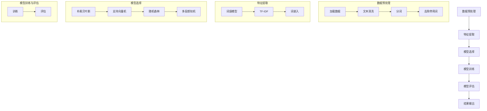

                 

### 文章标题

# 《Python机器学习实战：自然语言处理中的文本分类技术》

自然语言处理（NLP）作为人工智能的核心分支，近年来得到了前所未有的关注和应用。文本分类作为NLP的重要组成部分，广泛应用于社交媒体情感分析、网络舆情监控、垃圾邮件过滤等领域。随着Python在数据科学和机器学习领域的广泛应用，掌握Python进行文本分类技术不仅能够提升个人的技术能力，还能在实际项目中发挥重要作用。

本文将以Python为工具，深入探讨自然语言处理中的文本分类技术。我们将首先介绍Python编程基础和机器学习基础，帮助读者建立扎实的编程和数据操作能力。接着，我们将介绍自然语言处理的基础知识，包括语言模型和词嵌入技术，为后续的文本分类算法讲解打下基础。

本文的核心内容将围绕文本分类技术展开，详细介绍常用的文本分类算法，如朴素贝叶斯、支持向量机（SVM）、随机森林和多层感知机（MLP）等。同时，我们还将探讨深度学习在文本分类中的应用，介绍卷积神经网络（CNN）、循环神经网络（RNN）和长短时记忆网络（LSTM）等先进算法。

为了使读者能够真正掌握文本分类技术，本文还将提供实战项目，从数据预处理、模型训练与评估到模型部署与运维，全面讲解文本分类项目的实施过程。最后，我们将通过实际案例解析，帮助读者将所学知识应用到真实项目中。

通过本文的阅读，读者将不仅能够掌握Python机器学习中的文本分类技术，还将具备解决实际问题的能力，为未来的职业发展打下坚实的基础。

### 文章关键词

- Python编程
- 自然语言处理
- 文本分类
- 机器学习
- 朴素贝叶斯
- 支持向量机（SVM）
- 随机森林
- 多层感知机（MLP）
- 卷积神经网络（CNN）
- 循环神经网络（RNN）
- 长短时记忆网络（LSTM）

### 文章摘要

本文旨在通过Python机器学习实战，深入探讨自然语言处理中的文本分类技术。文章首先介绍了Python编程基础和机器学习基础，帮助读者建立必要的编程和数据操作能力。接着，文章详细介绍了自然语言处理的基础知识，包括语言模型和词嵌入技术。随后，文章重点讲解了文本分类技术的核心算法，包括朴素贝叶斯、支持向量机（SVM）、随机森林和多层感知机（MLP），并深入探讨了深度学习在文本分类中的应用。为了使读者能够将所学知识应用于实际项目，文章提供了完整的文本分类项目实战，从数据预处理到模型训练与评估，再到模型部署与运维。最后，通过实际案例解析，文章帮助读者将文本分类技术应用于社交媒体文本分类和网络舆情分析等实际问题中。通过本文的阅读，读者将全面掌握Python机器学习中的文本分类技术，并具备解决实际问题的能力。

### 第一部分：Python机器学习基础

在深入探讨自然语言处理中的文本分类技术之前，我们需要首先掌握Python编程基础和机器学习基础知识。本部分将分三个章节详细讲解Python编程基础、数据操作与可视化以及机器学习基础，为后续的内容奠定坚实的基础。

#### 第1章：Python编程基础

Python作为一种简单易学的编程语言，被广泛应用于数据科学和机器学习领域。在这一章中，我们将介绍Python的基本语法、数据类型、流程控制以及函数和模块的使用。

##### 1.1 Python环境搭建

在开始学习Python之前，我们需要搭建Python的开发环境。以下是Python环境搭建的步骤：

1. **下载和安装Python**：访问Python官网（[python.org](https://www.python.org/)）下载最新版本的Python安装包，并按照安装向导进行安装。
2. **配置Python环境变量**：在安装完成后，配置环境变量以便在命令行中运行Python。
3. **验证安装**：在命令行中输入`python --version`，查看Python的版本信息，确认安装成功。

##### 1.2 常用Python库介绍

Python拥有丰富的库，为各种应用场景提供了强大的支持。以下是一些常用的Python库及其简介：

1. **NumPy**：用于高性能数学计算，提供多维数组对象和一系列数学运算函数。
2. **Pandas**：用于数据操作和分析，提供数据框（DataFrame）和一系列数据处理功能。
3. **Matplotlib**：用于数据可视化，提供多种绘图函数和图表样式。
4. **Scikit-learn**：用于机器学习，提供了一系列经典机器学习算法的实现。

##### 1.3 Python语法基础

Python的语法简洁明了，但为了高效地使用Python，我们需要掌握一些基础语法。以下是Python语法的一些基础概念：

1. **基本语法**：了解Python的注释、变量定义、数据类型和基本操作。
2. **数据类型与操作**：学习Python中的常见数据类型（如整数、浮点数、字符串、列表、字典等）以及相应的操作。
3. **流程控制**：掌握条件语句（if-else）、循环语句（for和while）以及异常处理（try-except）。

##### 1.4 函数与模块

函数是Python的核心组成部分，用于组织代码和实现代码复用。以下是关于Python函数和模块的一些基础概念：

1. **函数定义与调用**：学习如何定义和调用函数，理解参数传递和函数返回值。
2. **模块导入与使用**：掌握如何导入和使用Python模块，理解模块的作用和如何组织代码。
3. **面向对象编程基础**：了解面向对象编程的概念，学习如何定义类和实例化对象，掌握继承和多态。

#### 第2章：Python数据操作与可视化

在掌握了Python编程基础后，我们需要进一步了解如何操作和处理数据，以及如何使用Python进行数据可视化。以下是关于这些内容的详细介绍。

##### 2.1 数据读取与处理

数据是机器学习的核心，高效的读取和处理数据对于模型的训练至关重要。以下是关于数据读取与处理的内容：

1. **Pandas库基础**：学习Pandas库的基本用法，掌握如何读取和操作CSV、Excel等常见数据文件。
2. **数据清洗与预处理**：了解数据清洗的重要性，学习如何处理缺失值、异常值和重复值，进行数据标准化和归一化。

##### 2.2 数据可视化

数据可视化是理解数据的重要手段，通过图形化展示，我们可以更直观地发现数据的规律和趋势。以下是关于数据可视化的内容：

1. **Matplotlib库基础**：学习Matplotlib库的基本用法，掌握如何绘制各种常见的图表，如折线图、柱状图和散点图。
2. **常用可视化图表**：了解并掌握几种常用的数据可视化图表，如饼图、箱线图和热力图，学习如何根据不同需求选择合适的图表。

通过这两章的学习，读者将能够熟练掌握Python编程基础和数据处理与可视化技能，为后续的自然语言处理和文本分类技术打下坚实的基础。

#### 第1章：Python编程基础

在探讨自然语言处理中的文本分类技术之前，首先需要掌握Python编程基础。Python以其简洁的语法和强大的库支持，成为数据科学和机器学习领域的首选语言。本章节将详细讲解Python编程基础，包括Python环境搭建、语法基础、数据类型与操作、流程控制以及函数与模块的使用。

##### 1.1 Python环境搭建

Python环境的搭建是学习Python的第一步。以下是如何在Windows和Mac OS上安装Python的步骤：

###### 1.1.1 Python安装与配置

1. **下载Python安装包**：访问Python官网[python.org](https://www.python.org/)，下载适用于自己操作系统的Python安装包。
2. **安装Python**：双击下载的安装包，按照安装向导的提示完成安装。在安装过程中，确保勾选“Add Python to PATH”选项，以便在命令行中直接运行Python。
3. **验证安装**：在命令行中输入`python --version`，如果显示Python的版本信息，则表示安装成功。

###### 1.1.2 常用Python库介绍

Python拥有丰富的库，大大扩展了其功能。以下是一些常用的Python库及其简介：

1. **NumPy**：NumPy是Python中用于数值计算的基础库，提供多维数组对象和一系列数学运算函数。
2. **Pandas**：Pandas提供数据框（DataFrame）和数据操作功能，适用于数据清洗、数据转换和数据可视化。
3. **Matplotlib**：Matplotlib用于数据可视化，提供多种图表绘制功能。
4. **Scikit-learn**：Scikit-learn是一个开源的机器学习库，提供了一系列经典的机器学习算法和工具。

##### 1.2 Python语法基础

Python的语法简洁明了，但为了高效地使用Python，我们需要掌握一些基础语法。以下是一些关键概念：

###### 1.2.1 基本语法

- **注释**：单行注释使用井号`#`，多行注释使用三个单引号`'''`或三个双引号`"""`。
- **变量定义**：变量的定义和使用非常灵活，例如：
  ```python
  x = 10          # 整数
  y = 3.14        # 浮点数
  name = "Alice"  # 字符串
  ```

###### 1.2.2 数据类型与操作

Python支持多种数据类型，包括整数、浮点数、字符串、列表、字典等。以下是关于这些数据类型的基本操作：

- **整数与浮点数**：整数和浮点数可以直接进行算术运算。
  ```python
  x = 5
  y = 10
  sum = x + y  # 运算结果为15
  ```

- **字符串**：字符串是序列字符，可以进行切片、连接和格式化等操作。
  ```python
  name = "Alice"
  greeting = "Hello, " + name  # 字符串连接
  formatted = "{} is {} years old".format(name, age)  # 字符串格式化
  ```

- **列表**：列表是可变的有序序列，可以包含不同类型的数据。
  ```python
  fruits = ["apple", "banana", "cherry"]
  fruits.append("orange")  # 添加元素
  fruits.pop(0)  # 移除第一个元素
  ```

- **字典**：字典是键值对的集合，提供了快速访问和修改的功能。
  ```python
  person = {"name": "Alice", "age": 30}
  person["age"] = 31  # 修改值
  ```

###### 1.2.3 流程控制

流程控制语句是程序设计中必不可少的部分，Python提供了多种流程控制语句，包括条件语句和循环语句。

- **条件语句**：`if-else`结构用于根据条件执行不同的代码块。
  ```python
  x = 10
  if x > 0:
      print("x is positive")
  else:
      print("x is non-positive")
  ```

- **循环语句**：`for`和`while`循环用于重复执行代码块。

  - **for循环**：适用于遍历序列中的每个元素。
    ```python
    fruits = ["apple", "banana", "cherry"]
    for fruit in fruits:
        print(fruit)
    ```

  - **while循环**：适用于基于条件重复执行代码块。
    ```python
    x = 0
    while x < 5:
        print(x)
        x += 1
    ```

##### 1.3 函数与模块

函数和模块是Python的核心组成部分，用于组织代码和实现代码复用。

###### 1.3.1 函数定义与调用

函数是Python代码块，用于执行特定任务。以下是函数定义和调用的一些示例：

```python
# 函数定义
def greet(name):
    print("Hello, " + name)

# 函数调用
greet("Alice")
greet("Bob")
```

###### 1.3.2 模块导入与使用

模块是Python代码文件，可以包含多个函数和类。以下是导入和使用模块的一些示例：

```python
# 导入模块
import math

# 使用模块中的函数
result = math.sqrt(16)
print(result)
```

###### 1.3.3 面向对象编程基础

面向对象编程（OOP）是一种编程范式，通过将数据和操作数据的方法封装在一起，实现代码的模块化和重用。以下是OOP的一些基础概念：

- **类与对象**：类是对象的蓝图，对象是类的实例。
  ```python
  class Person:
      def __init__(self, name, age):
          self.name = name
          self.age = age
  
      def greet(self):
          print("Hello, " + self.name)

  alice = Person("Alice", 30)
  alice.greet()
  ```

- **继承**：继承是一种允许一个类从另一个类继承属性和方法的方式。
  ```python
  class Employee(Person):
      def __init__(self, name, age, employee_id):
          super().__init__(name, age)
          self.employee_id = employee_id
  
      def display_id(self):
          print("Employee ID:", self.employee_id)

  emp = Employee("Bob", 40, "E123")
  emp.greet()
  emp.display_id()
  ```

- **多态**：多态是指同一个方法在不同类中具有不同的实现方式。
  ```python
  class Dog:
      def bark(self):
          print("Woof!")

  class Cat:
      def bark(self):
          print("Meow!")

  animals = [Dog(), Cat()]
  for animal in animals:
      animal.bark()
  ```

通过本章的学习，读者将掌握Python编程基础，为后续的自然语言处理和文本分类技术打下坚实的编程基础。

#### 第2章：Python数据操作与可视化

在掌握了Python编程基础之后，接下来我们需要了解如何使用Python进行数据操作和可视化。数据是机器学习项目的核心，而数据的操作和可视化则能够帮助我们更好地理解和分析数据。在本章中，我们将详细介绍如何使用Python进行数据读取与处理，以及如何使用Matplotlib进行数据可视化。

##### 2.1 数据读取与处理

在机器学习中，数据预处理是一个至关重要的环节。它不仅影响模型的性能，也决定了我们能否从数据中提取出有价值的信息。以下是如何使用Python进行数据读取与处理的基本步骤：

###### 2.1.1 Pandas库基础

Pandas是一个强大的Python库，专为数据处理而设计。它提供了丰富的数据结构和数据分析工具，使得处理数据变得更加容易。

1. **安装Pandas**：首先，确保已经安装了Pandas库。如果没有，可以使用以下命令进行安装：
   ```shell
   pip install pandas
   ```

2. **读取数据**：Pandas支持读取多种格式的数据文件，如CSV、Excel和JSON等。以下是一个示例，展示了如何使用Pandas读取CSV文件：
   ```python
   import pandas as pd
   
   # 读取CSV文件
   data = pd.read_csv('data.csv')
   
   # 查看数据的前几行
   print(data.head())
   ```

3. **数据清洗与预处理**：在实际应用中，数据往往包含缺失值、异常值和重复值等不干净的数据。Pandas提供了多种方法来处理这些问题。以下是一些常见的数据清洗与预处理方法：

   - **处理缺失值**：可以使用`dropna()`方法删除包含缺失值的行，或者使用`fillna()`方法填充缺失值。
     ```python
     # 删除包含缺失值的行
     clean_data = data.dropna()

     # 填充缺失值（例如，使用平均值填充）
     data.fillna(data.mean(), inplace=True)
     ```

   - **处理异常值**：可以使用`drop_duplicates()`方法删除重复值，或者使用自定义函数进行异常值检测和处理。
     ```python
     # 删除重复值
     data.drop_duplicates(inplace=True)

     # 标准化数据
     from sklearn.preprocessing import StandardScaler
     scaler = StandardScaler()
     data_scaled = scaler.fit_transform(data)
     ```

###### 2.1.2 数据清洗与预处理

数据清洗与预处理是机器学习项目中不可或缺的步骤。以下是一些常见的数据预处理技术：

1. **数据标准化**：标准化数据使得不同特征具有相同的尺度，从而避免某些特征对模型的影响过大。常用的方法有Z-score标准化和Min-Max标准化。
   ```python
   from sklearn.preprocessing import StandardScaler
   scaler = StandardScaler()
   data_normalized = scaler.fit_transform(data)
   ```

2. **数据归一化**：归一化是将数据转换到[0, 1]区间，常用的方法有线性归一化和幂次归一化。
   ```python
   from sklearn.preprocessing import MinMaxScaler
   scaler = MinMaxScaler()
   data_normalized = scaler.fit_transform(data)
   ```

3. **特征工程**：特征工程是提升模型性能的关键步骤。它包括特征提取、特征选择和特征构造等。
   ```python
   # 特征提取（例如，文本数据的词频统计）
   from sklearn.feature_extraction.text import CountVectorizer
   vectorizer = CountVectorizer()
   data_features = vectorizer.fit_transform(data['text'])

   # 特征选择（例如，基于信息增益选择特征）
   from sklearn.feature_selection import SelectKBest
   selector = SelectKBest(score_func=f_classif, k=1000)
   data_selected = selector.fit_transform(data_features, data['label'])
   ```

##### 2.2 数据可视化

数据可视化是将数据转换为图形化展示的方法，有助于我们直观地理解数据的结构和规律。Matplotlib是一个强大的Python库，能够生成各种类型的图表。

###### 2.2.1 Matplotlib库基础

Matplotlib提供了多种图表绘制功能，包括线图、柱状图、散点图、饼图和箱线图等。以下是一些基本的绘图示例：

1. **线图**：用于展示随时间变化的数据。
   ```python
   import matplotlib.pyplot as plt
   
   x = [0, 1, 2, 3, 4]
   y = [0, 1, 4, 9, 16]
   
   plt.plot(x, y)
   plt.xlabel('x-axis')
   plt.ylabel('y-axis')
   plt.title('Line Plot')
   plt.show()
   ```

2. **柱状图**：用于比较不同类别的数据。
   ```python
   categories = ['A', 'B', 'C', 'D']
   values = [24, 56, 17, 3]
   
   plt.bar(categories, values)
   plt.xlabel('Categories')
   plt.ylabel('Values')
   plt.title('Bar Chart')
   plt.show()
   ```

3. **散点图**：用于展示两个变量之间的关系。
   ```python
   x = [0, 1, 2, 3, 4]
   y = [0, 3, 4, 9, 16]
   
   plt.scatter(x, y)
   plt.xlabel('x-axis')
   plt.ylabel('y-axis')
   plt.title('Scatter Plot')
   plt.show()
   ```

4. **饼图**：用于展示不同类别的占比。
   ```python
   sizes = [15, 30, 45, 10]
   labels = ['A', 'B', 'C', 'D']
   
   plt.pie(sizes, labels=labels, autopct='%.1f%%')
   plt.axis('equal')
   plt.title('Pie Chart')
   plt.show()
   ```

5. **箱线图**：用于展示数据的分布和离群值。
   ```python
   import numpy as np
   
   data = [4, 3, 2, 6, 5, 7, 8, 1]
   labels = ['Low', 'Medium', 'High']
   
   plt.boxplot(data, labels=labels)
   plt.title('Box Plot')
   plt.show()
   ```

通过本章的学习，读者将掌握Python数据操作与可视化的基本技能，为后续的自然语言处理和文本分类技术提供数据支持和可视化工具。

#### 第3章：自然语言处理基础

自然语言处理（NLP）是人工智能领域的一个重要分支，它涉及到让计算机理解和处理人类语言的技术。本章将介绍NLP的基础知识，包括语言模型、词嵌入技术以及它们在实际应用中的使用。

##### 3.1 语言模型

语言模型是NLP的核心组成部分，用于预测一段文本的下一个单词或字符。它基于大量文本数据，通过统计方法或机器学习算法来建模自然语言的规律。语言模型在许多NLP任务中都有广泛应用，如机器翻译、语音识别和文本生成等。

###### 3.1.1 语言模型概述

语言模型通常是一个概率模型，用于计算某个句子的概率。在NLP中，常见的语言模型有：

1. **N-gram模型**：N-gram模型是基于词汇序列的统计模型，它通过计算词汇序列的概率来预测下一个单词。N-gram模型简单且高效，但在长文本上效果较差。

2. **神经网络模型**：神经网络模型，如循环神经网络（RNN）和变换器（Transformer），通过学习大量的文本数据，能够更好地捕捉语言中的复杂结构。这些模型在自然语言处理任务中表现出了优越的性能。

###### 3.1.2 语言模型评估指标

评估语言模型的性能通常需要使用一些评估指标，以下是一些常用的评估指标：

1. **字符错误率（CER）**：字符错误率是评估字符级语言模型性能的指标，计算模型生成的文本与实际文本之间的字符差异。

2. **词错误率（WER）**：词错误率是评估词级语言模型性能的指标，计算模型生成的文本与实际文本之间的词差异。

3. **字符准确率（CAR）**：字符准确率是评估字符级语言模型准确性的指标，计算模型生成的文本与实际文本之间的字符匹配率。

4. **词准确率（WAR）**：词准确率是评估词级语言模型准确性的指标，计算模型生成的文本与实际文本之间的词匹配率。

##### 3.2 词嵌入技术

词嵌入是将单词映射到固定维度的向量表示，使得这些向量可以在高维空间中表示单词的语义信息。词嵌入技术是NLP中的一项重要技术，它使得机器能够更好地理解和处理自然语言。

###### 3.2.1 词嵌入概念

词嵌入的基本思想是将每个单词映射到一个低维度的向量空间中，使得这些向量具有语义意义。例如，词嵌入可以使得相似的单词在空间中距离较近，而不同的单词则距离较远。

###### 3.2.2 常见词嵌入方法

1. **基于统计的方法**：基于统计的方法通过分析大规模文本数据来学习词嵌入。例如，Word2Vec是最常用的词嵌入方法之一，它通过训练词向量模型，使得相似词的词向量更接近。

2. **基于神经网的方法**：基于神经网络的方法通过深度学习模型来学习词嵌入。例如，使用循环神经网络（RNN）或变换器（Transformer）来训练词向量模型。这些方法可以更好地捕捉单词的上下文信息，从而提高词嵌入的语义表示能力。

###### 3.2.3 词嵌入在实际应用中的使用

词嵌入技术广泛应用于NLP任务，如下：

1. **文本分类**：词嵌入可以用于将文本数据转换为向量表示，从而使得机器能够更好地理解和处理文本数据。

2. **情感分析**：词嵌入可以帮助识别文本中的情感倾向，从而实现情感分类。

3. **命名实体识别**：词嵌入可以用于将命名实体映射到向量空间中，从而帮助模型识别文本中的命名实体。

4. **机器翻译**：词嵌入可以用于将源语言的文本数据转换为向量表示，从而实现高效准确的机器翻译。

通过本章的学习，读者将了解自然语言处理的基础知识，掌握语言模型和词嵌入技术的基本概念和应用方法，为后续的文本分类技术打下坚实的基础。

### 第4章：文本分类技术

文本分类是自然语言处理（NLP）中的重要任务，它将文本数据按照类别进行归类。文本分类技术广泛应用于各种领域，如电子邮件垃圾过滤、社交网络情感分析、新闻分类等。本章将详细讲解文本分类的基础、特征提取方法以及常用的文本分类算法，包括朴素贝叶斯、支持向量机（SVM）、随机森林和多层感知机（MLP），同时探讨深度学习在文本分类中的应用。

##### 4.1 文本分类基础

文本分类是一种监督学习任务，其目标是将文本数据划分为预定义的类别。文本分类的基础包括：

###### 4.1.1 文本分类概述

文本分类可以分为两类：**有监督分类**和**无监督分类**。

- **有监督分类**：在有监督分类中，我们有一系列已标注的文本数据作为训练集，通过训练模型来预测新的、未标注的文本的类别。
- **无监督分类**：无监督分类则没有标注的数据集，模型需要自行发现文本数据中的模式，将文本自动划分为不同的类别。

文本分类的基本步骤包括：

1. **数据预处理**：清洗和标准化文本数据，包括去除停用词、标点符号、进行词干提取和词形还原等。
2. **特征提取**：将文本数据转换为机器学习模型可以处理的特征向量。常见的特征提取方法有词袋模型（Bag of Words，BOW）和TF-IDF（Term Frequency-Inverse Document Frequency）等。
3. **模型训练**：使用训练集数据训练分类模型。
4. **模型评估**：使用测试集数据评估模型的性能，常见的评估指标包括准确率、召回率和F1分数等。
5. **模型部署**：将训练好的模型部署到实际应用中，对新数据进行分类。

###### 4.1.2 文本特征提取

文本特征提取是将原始文本转换为机器学习模型能够处理的高维向量表示的过程。以下是一些常用的文本特征提取方法：

1. **词袋模型（BOW）**：词袋模型不考虑文本的顺序，将文本表示为一个向量，其中每个维度对应一个词汇。词袋模型的优点是简单且易于实现，但缺点是特征维度高，容易导致维度灾难。
   
   ```python
   from sklearn.feature_extraction.text import CountVectorizer
   
   vectorizer = CountVectorizer()
   X = vectorizer.fit_transform(corpus)
   ```

2. **TF-IDF**：TF-IDF（Term Frequency-Inverse Document Frequency）是一种基于词频和逆文档频率的文本表示方法。TF-IDF考虑了词汇在文本中的重要程度，能够更好地捕捉文本的特征。
   
   ```python
   from sklearn.feature_extraction.text import TfidfVectorizer
   
   vectorizer = TfidfVectorizer()
   X = vectorizer.fit_transform(corpus)
   ```

3. **词嵌入**：词嵌入是将单词映射到高维空间中的向量表示，能够捕捉单词的语义信息。常用的词嵌入方法有Word2Vec、GloVe和BERT等。

   ```python
   from gensim.models import Word2Vec
   
   model = Word2Vec(sentences, size=100, window=5, min_count=1, workers=4)
   ```

##### 4.2 常见文本分类算法

文本分类算法可以分为基于统计的方法和基于深度学习的方法。以下是一些常用的文本分类算法：

###### 4.2.1 朴素贝叶斯分类器

朴素贝叶斯分类器是一种基于概率理论的分类算法，它假设特征之间相互独立。朴素贝叶斯分类器在文本分类中应用广泛，尤其是在处理高维数据时表现良好。

1. **算法原理**：朴素贝叶斯分类器的核心是贝叶斯定理，通过计算给定特征向量属于每个类别的概率，选择概率最大的类别作为预测结果。

2. **伪代码**：
   ```python
   def naive_bayes(train_data, train_labels, test_data):
       # 计算先验概率
       p_class = compute_prior_probabilities(train_labels)
       
       # 计算条件概率
       p_word_given_class = compute_conditional_probabilities(train_data, train_labels)
       
       # 预测类别
       predictions = []
       for test_sample in test_data:
           class_probabilities = []
           for class_ in p_class:
               word_probabilities = p_word_given_class[class_]
               class_probability = p_class[class_] * product(word_probabilities)
               class_probabilities.append(class_probability)
           predicted_class = argmax(class_probabilities)
           predictions.append(predicted_class)
       return predictions
   ```

3. **代码实现**：
   ```python
   from sklearn.naive_bayes import MultinomialNB
   
   model = MultinomialNB()
   model.fit(X_train, y_train)
   y_pred = model.predict(X_test)
   ```

###### 4.2.2 支持向量机（SVM）

支持向量机是一种强大的分类算法，它通过寻找最优的超平面，将数据集划分为不同的类别。SVM在文本分类中有着广泛的应用，尤其是在处理高维数据时效果显著。

1. **算法原理**：SVM的目标是找到一个最佳的超平面，使得正负样本的间隔最大化。在文本分类中，SVM使用词袋模型或TF-IDF向量表示文本数据。

2. **伪代码**：
   ```python
   def svm(train_data, train_labels, C):
       # 训练SVM模型
       model = SVC(C=C)
       model.fit(train_data, train_labels)
       
       # 预测类别
       predictions = model.predict(test_data)
       return predictions
   ```

3. **代码实现**：
   ```python
   from sklearn.svm import SVC
   
   model = SVC(C=1.0)
   model.fit(X_train, y_train)
   y_pred = model.predict(X_test)
   ```

###### 4.2.3 随机森林分类器

随机森林是一种集成学习算法，它通过构建多个决策树来提高分类性能。随机森林在处理高维数据和噪声数据时表现良好。

1. **算法原理**：随机森林通过随机选择特征和样本子集来构建多个决策树，并通过投票机制来预测类别。

2. **伪代码**：
   ```python
   def random_forest(train_data, train_labels, n_estimators):
       # 构建随机森林模型
       model = RandomForestClassifier(n_estimators=n_estimators)
       model.fit(train_data, train_labels)
       
       # 预测类别
       predictions = model.predict(test_data)
       return predictions
   ```

3. **代码实现**：
   ```python
   from sklearn.ensemble import RandomForestClassifier
   
   model = RandomForestClassifier(n_estimators=100)
   model.fit(X_train, y_train)
   y_pred = model.predict(X_test)
   ```

###### 4.2.4 多层感知机（MLP）

多层感知机（MLP）是一种前馈神经网络，它通过隐藏层进行特征提取和变换，最终输出分类结果。MLP在文本分类中有着广泛的应用，尤其是在处理复杂特征时效果显著。

1. **算法原理**：MLP由输入层、一个或多个隐藏层和输出层组成。每个隐藏层由多个神经元组成，每个神经元使用激活函数进行非线性变换。

2. **伪代码**：
   ```python
   def multilayer_perceptron(train_data, train_labels, hidden_layers, activation_function):
       # 构建MLP模型
       model = MLPClassifier(hidden_layer_sizes=hidden_layers, activation=activation_function)
       model.fit(train_data, train_labels)
       
       # 预测类别
       predictions = model.predict(test_data)
       return predictions
   ```

3. **代码实现**：
   ```python
   from sklearn.neural_network import MLPClassifier
   
   model = MLPClassifier(hidden_layer_sizes=(100, 100), activation='relu', solver='adam')
   model.fit(X_train, y_train)
   y_pred = model.predict(X_test)
   ```

通过本章的学习，读者将了解文本分类技术的基本概念和方法，掌握常用的文本分类算法，并了解深度学习在文本分类中的应用。这些知识将为读者在实际项目中应用文本分类技术提供重要的理论基础和实际操作技能。

### 4.3 深度学习在文本分类中的应用

随着深度学习技术的发展，深度学习模型在自然语言处理（NLP）领域展现出了强大的性能，特别是在文本分类任务中。深度学习模型能够捕捉文本中的复杂结构和语义信息，从而实现更加精确的分类。本节将介绍几种常用的深度学习模型在文本分类中的应用，包括卷积神经网络（CNN）、循环神经网络（RNN）和长短时记忆网络（LSTM）。

#### 4.3.1 卷积神经网络（CNN）在文本分类中的应用

卷积神经网络（CNN）通常用于图像处理，但通过适当改造，它也可以应用于文本分类。CNN通过卷积操作捕捉文本中的局部特征，并利用池化操作减少数据的维度。

1. **算法原理**：
   - **卷积操作**：CNN通过卷积核（filter）在文本序列上进行卷积操作，提取出文本的局部特征。
   - **池化操作**：卷积操作后，通过池化操作（如最大池化或平均池化）减少数据的维度，提高模型的计算效率。
   - **多层卷积**：通过堆叠多个卷积层，CNN可以逐步提取更深层次的语义特征。

2. **伪代码**：
   ```python
   def text_cnn(corpus, num_filters, filter_sizes, num_classes):
       # 输入嵌入层
       inputs = Input(shape=(max_sequence_length,))
       embeddings = Embedding(num_words, embedding_size)(inputs)
       
       # 多层卷积层
       convs = []
       for size in filter_sizes:
           conv = Conv1D(num_filters, size, activation='relu')(embeddings)
           conv = GlobalMaxPooling1D()(conv)
           convs.append(conv)
       
       # 合并卷积层
       merged = concatenate(convs, axis=1)
       
       # 全连接层和输出层
       dense = Dense(128, activation='relu')(merged)
       outputs = Dense(num_classes, activation='softmax')(dense)
       
       # 构建模型
       model = Model(inputs=inputs, outputs=outputs)
       model.compile(optimizer='adam', loss='categorical_crossentropy', metrics=['accuracy'])
       
       return model
   ```

3. **代码实现**：
   ```python
   from tensorflow.keras.models import Model
   from tensorflow.keras.layers import Input, Embedding, Conv1D, GlobalMaxPooling1D, Dense, concatenate
   
   model = text_cnn(num_words, 128, [3, 4, 5], num_classes)
   model.compile(optimizer='adam', loss='categorical_crossentropy', metrics=['accuracy'])
   model.fit(X_train, y_train, epochs=10, batch_size=64, validation_data=(X_test, y_test))
   ```

#### 4.3.2 循环神经网络（RNN）在文本分类中的应用

循环神经网络（RNN）是一种能够处理序列数据的神经网络，通过循环结构来保留和传递序列中的信息。RNN在文本分类中能够捕捉文本序列的长期依赖关系。

1. **算法原理**：
   - **循环结构**：RNN通过循环结构在时间步之间传递信息，能够处理序列数据。
   - **门控机制**：为了解决RNN中的梯度消失和梯度爆炸问题，引入了门控机制（如门控RNN、长短期记忆网络LSTM等）。

2. **伪代码**：
   ```python
   def lstm_text_classification(corpus, embedding_size, hidden_units, num_classes):
       # 输入嵌入层
       inputs = Input(shape=(max_sequence_length,))
       embeddings = Embedding(num_words, embedding_size)(inputs)
       
       # LSTM层
       lstm = LSTM(hidden_units, return_sequences=True)(embeddings)
       lstm = LSTM(hidden_units)(lstm)
       
       # 全连接层和输出层
       dense = Dense(128, activation='relu')(lstm)
       outputs = Dense(num_classes, activation='softmax')(dense)
       
       # 构建模型
       model = Model(inputs=inputs, outputs=outputs)
       model.compile(optimizer='adam', loss='categorical_crossentropy', metrics=['accuracy'])
       
       return model
   ```

3. **代码实现**：
   ```python
   from tensorflow.keras.models import Model
   from tensorflow.keras.layers import Input, Embedding, LSTM, Dense
   
   model = lstm_text_classification(num_words, 128, 128, num_classes)
   model.compile(optimizer='adam', loss='categorical_crossentropy', metrics=['accuracy'])
   model.fit(X_train, y_train, epochs=10, batch_size=64, validation_data=(X_test, y_test))
   ```

#### 4.3.3 长短时记忆网络（LSTM）在文本分类中的应用

长短时记忆网络（LSTM）是RNN的一种变体，通过引入门控机制来解决传统RNN中的长期依赖问题。LSTM在文本分类中能够有效捕捉文本中的长期依赖关系。

1. **算法原理**：
   - **门控机制**：LSTM通过遗忘门、输入门和输出门控制信息的流动，能够更好地处理序列数据。
   - **细胞状态**：LSTM的细胞状态能够保存和传递序列中的信息，从而解决长期依赖问题。

2. **伪代码**：
   ```python
   def lstm_text_classification(corpus, embedding_size, hidden_units, num_classes):
       # 输入嵌入层
       inputs = Input(shape=(max_sequence_length,))
       embeddings = Embedding(num_words, embedding_size)(inputs)
       
       # LSTM层
       lstm = LSTM(hidden_units, return_sequences=True)(embeddings)
       lstm = LSTM(hidden_units)(lstm)
       
       # 全连接层和输出层
       dense = Dense(128, activation='relu')(lstm)
       outputs = Dense(num_classes, activation='softmax')(dense)
       
       # 构建模型
       model = Model(inputs=inputs, outputs=outputs)
       model.compile(optimizer='adam', loss='categorical_crossentropy', metrics=['accuracy'])
       
       return model
   ```

3. **代码实现**：
   ```python
   from tensorflow.keras.models import Model
   from tensorflow.keras.layers import Input, Embedding, LSTM, Dense
   
   model = lstm_text_classification(num_words, 128, 128, num_classes)
   model.compile(optimizer='adam', loss='categorical_crossentropy', metrics=['accuracy'])
   model.fit(X_train, y_train, epochs=10, batch_size=64, validation_data=(X_test, y_test))
   ```

#### 4.3.4 支持向量机（SVM）在文本分类中的应用

尽管SVM通常被视为传统机器学习算法，但它同样适用于文本分类任务。SVM通过找到一个最佳的超平面，将文本数据划分为不同的类别。

1. **算法原理**：
   - **核函数**：SVM通过核函数将低维特征映射到高维空间，从而找到最佳的超平面。
   - **线性SVM和非线性SVM**：线性SVM适用于线性可分的数据，而非线性SVM适用于非线性可分的数据。

2. **伪代码**：
   ```python
   def svm_text_classification(corpus, num_classes):
       # 特征提取
       vectorizer = TfidfVectorizer()
       X = vectorizer.fit_transform(corpus)
       
       # 训练SVM模型
       model = SVC(kernel='linear')
       model.fit(X, y)
       
       # 预测类别
       predictions = model.predict(X)
       
       return predictions
   ```

3. **代码实现**：
   ```python
   from sklearn.svm import SVC
   from sklearn.feature_extraction.text import TfidfVectorizer
   
   vectorizer = TfidfVectorizer()
   X = vectorizer.fit_transform(corpus)
   model = SVC(kernel='linear')
   model.fit(X, y)
   y_pred = model.predict(X)
   ```

通过本章的讲解，读者将了解深度学习模型在文本分类中的应用，掌握CNN、RNN和LSTM等深度学习模型的基本原理和实现方法，以及如何将它们应用于实际的文本分类任务中。这些知识将为读者在未来的文本分类项目中提供强大的技术支持。

### 第5章：文本分类项目实战

在理解了文本分类的理论知识后，接下来我们将通过一个完整的文本分类项目，将所学知识应用于实际场景。本章将详细介绍文本分类项目的各个环节，包括数据预处理、模型训练与评估以及模型部署与运维。通过这一实战项目，读者将全面掌握文本分类的完整流程。

#### 5.1 数据预处理

数据预处理是文本分类项目中至关重要的一步，它直接影响模型的性能。以下是如何进行数据预处理的具体步骤：

##### 5.1.1 数据集准备

首先，我们需要准备一个包含标注数据的文本分类数据集。例如，我们可以使用常见的公共数据集，如IMDB电影评论数据集或Twitter情感分析数据集。以下是准备数据集的基本步骤：

1. **数据下载**：从数据集来源网站下载原始数据。
2. **数据解析**：读取数据文件，解析出文本内容和对应的标签。
3. **数据存储**：将处理后的数据存储为便于进一步处理的格式，如CSV或Parquet。

```python
import pandas as pd

# 读取原始数据
data = pd.read_csv('data.csv')

# 解析文本内容和标签
texts = data['text']
labels = data['label']

# 存储处理后的数据
texts.to_csv('cleaned_texts.csv', index=False)
labels.to_csv('cleaned_labels.csv', index=False)
```

##### 5.1.2 数据清洗

在获取到原始数据后，我们需要对其进行清洗，以去除噪声和无关信息。以下是一些常见的数据清洗步骤：

1. **去除停用词**：停用词是指对文本分类无实际意义的词汇，如“的”、“和”、“在”等。我们可以使用预定义的停用词表进行去除。

```python
from nltk.corpus import stopwords

# 加载停用词表
stop_words = set(stopwords.words('english'))

# 去除停用词
clean_texts = [' '.join([word for word in text.split() if word not in stop_words]) for text in texts]
```

2. **去除标点符号**：去除文本中的标点符号有助于减少噪声，提高模型性能。

```python
import re

# 去除标点符号
clean_texts = [re.sub(r'[^\w\s]', '', text) for text in clean_texts]
```

3. **词干提取**：词干提取是将单词还原到其词干形式，有助于减少词汇量。

```python
from nltk.stem import PorterStemmer

# 词干提取
stemmer = PorterStemmer()
clean_texts = [' '.join([stemmer.stem(word) for word in text.split()]) for text in clean_texts]
```

##### 5.1.3 数据特征提取

特征提取是将文本数据转换为机器学习模型可以处理的特征向量。以下是一些常用的特征提取方法：

1. **词袋模型（BOW）**：词袋模型将文本表示为一个单词的集合，每个单词的频率作为特征。

```python
from sklearn.feature_extraction.text import CountVectorizer

# 词袋模型
vectorizer = CountVectorizer()
X = vectorizer.fit_transform(clean_texts)
```

2. **TF-IDF**：TF-IDF考虑了单词在文本中的重要性，通过计算词频和逆文档频率来表示文本。

```python
from sklearn.feature_extraction.text import TfidfVectorizer

# TF-IDF
vectorizer = TfidfVectorizer()
X = vectorizer.fit_transform(clean_texts)
```

3. **词嵌入**：词嵌入是将单词映射到高维向量空间，能够捕捉单词的语义信息。

```python
from gensim.models import Word2Vec

# 词嵌入
model = Word2Vec(clean_texts, size=100, window=5, min_count=1, workers=4)
word_vectors = model.wv
```

#### 5.2 模型训练与评估

在完成数据预处理后，我们接下来进行模型训练和评估。以下是具体的步骤：

##### 5.2.1 模型选择与训练

根据项目需求和数据特性，选择合适的文本分类模型。以下是一些常见的文本分类模型及其使用方法：

1. **朴素贝叶斯**：朴素贝叶斯是一种基于概率的简单分类器，适合处理高维文本数据。

```python
from sklearn.naive_bayes import MultinomialNB

# 训练朴素贝叶斯模型
model = MultinomialNB()
model.fit(X_train, y_train)
```

2. **支持向量机（SVM）**：SVM通过寻找最佳的超平面进行分类，适合处理线性可分的数据。

```python
from sklearn.svm import SVC

# 训练SVM模型
model = SVC(kernel='linear')
model.fit(X_train, y_train)
```

3. **随机森林**：随机森林是一种基于决策树的集成学习方法，适用于处理高维文本数据。

```python
from sklearn.ensemble import RandomForestClassifier

# 训练随机森林模型
model = RandomForestClassifier()
model.fit(X_train, y_train)
```

4. **多层感知机（MLP）**：MLP是一种前馈神经网络，适用于处理复杂特征。

```python
from sklearn.neural_network import MLPClassifier

# 训练MLP模型
model = MLPClassifier()
model.fit(X_train, y_train)
```

##### 5.2.2 模型评估与优化

在训练模型后，我们需要评估模型性能并进行优化。以下是一些常用的评估指标和优化方法：

1. **评估指标**：常用的评估指标包括准确率、召回率、F1分数和精确率。

```python
from sklearn.metrics import accuracy_score, recall_score, f1_score, precision_score

# 评估模型
y_pred = model.predict(X_test)
print("Accuracy:", accuracy_score(y_test, y_pred))
print("Recall:", recall_score(y_test, y_pred, average='weighted'))
print("F1 Score:", f1_score(y_test, y_pred, average='weighted'))
print("Precision:", precision_score(y_test, y_pred, average='weighted'))
```

2. **模型优化**：通过调整模型参数和特征提取方法，优化模型性能。

```python
from sklearn.model_selection import GridSearchCV

# 参数调优
parameters = {'C': [1, 10, 100], 'kernel': ['linear', 'rbf']}
grid = GridSearchCV(SVC(), parameters, refit=True, verbose=2, cv=5)
grid.fit(X_train, y_train)

# 获取最佳参数和模型
best_parameters = grid.best_params_
best_model = grid.best_estimator_
```

#### 5.3 模型部署与运维

模型训练完成后，我们需要将其部署到生产环境，并进行监控和运维。以下是模型部署与运维的步骤：

##### 5.3.1 模型部署方案

1. **模型保存与加载**：将训练好的模型保存到文件中，以便后续加载和使用。

```python
import joblib

# 保存模型
joblib.dump(model, 'text_classification_model.pkl')

# 加载模型
loaded_model = joblib.load('text_classification_model.pkl')
```

2. **API接口设计**：设计API接口，以便外部系统可以通过HTTP请求访问模型。

```python
from flask import Flask, request, jsonify

app = Flask(__name__)

@app.route('/predict', methods=['POST'])
def predict():
    data = request.get_json(force=True)
    prediction = loaded_model.predict([data['text']])
    return jsonify(prediction=prediction)

if __name__ == '__main__':
    app.run()
```

##### 5.3.2 模型运维与监控

1. **性能监控**：监控模型在运行过程中的性能，如响应时间、错误率和预测准确性。

2. **日志记录**：记录模型运行过程中的日志，以便后续分析和调试。

3. **自动化运维**：通过自动化脚本和工具，实现模型的自动部署、更新和回滚。

通过本章的实战项目，读者将了解文本分类项目的完整流程，从数据预处理到模型训练与评估，再到模型部署与运维。这些实际操作技能将有助于读者将文本分类技术应用于各种实际问题中。

### 第6章：文本分类系统优化

在文本分类项目中，优化模型性能是一个持续的过程。通过对模型调优策略、超参数调整、模型结构优化以及实时文本分类系统设计等方面的探讨，我们可以显著提升文本分类系统的准确性和效率。本章将详细介绍这些优化方法，帮助读者在实际项目中获得更好的性能。

#### 6.1 模型调优策略

模型调优是提升文本分类系统性能的关键步骤。以下是一些常用的模型调优策略：

##### 6.1.1 模型超参数调整

超参数是影响模型性能的重要参数，通常需要通过实验和验证进行调整。以下是一些常见超参数及其调整策略：

1. **学习率**：学习率决定了模型在训练过程中更新参数的速度。过小的学习率可能导致训练过程缓慢，而过大的学习率可能导致模型无法收敛。可以通过调整学习率或使用自适应学习率算法（如Adam）进行优化。

   ```python
   optimizer = optimizers.Adam(learning_rate=0.001)
   ```

2. **批量大小**：批量大小影响模型的训练速度和稳定性。较大的批量大小可以加速训练，但可能导致模型在训练过程中出现波动；较小的批量大小则可以提高模型的泛化能力。

   ```python
   batch_size = 32
   ```

3. **正则化**：正则化可以防止模型过拟合，常用的正则化方法包括L1正则化、L2正则化和Dropout等。

   ```python
   from tensorflow.keras.regularizers import l2
   model.add(Dense(128, activation='relu', kernel_regularizer=l2(0.01)))
   ```

4. **激活函数**：选择合适的激活函数可以提升模型的性能。常见的激活函数有ReLU、Sigmoid和Tanh等。

   ```python
   from tensorflow.keras.layers import Activation
   model.add(Dense(128, activation=Activation('relu')))
   ```

##### 6.1.2 模型结构优化

优化模型结构是提升文本分类性能的有效手段。以下是一些常见的模型结构优化方法：

1. **增加层数**：增加深度可以提升模型的表示能力，但也会增加计算复杂度和过拟合的风险。

   ```python
   model.add(Dense(512, activation='relu'))
   ```

2. **引入注意力机制**：注意力机制可以帮助模型关注文本中的重要部分，提升分类效果。

   ```python
   from tensorflow.keras.layers import Attention
   model.add(Attention())
   ```

3. **使用预训练模型**：预训练模型已经在大量数据上进行了预训练，可以直接应用于文本分类任务，提升模型性能。

   ```python
   from tensorflow.keras.applications import BERT
   bert_model = BERT.from_pretrained('bert-base-uncased')
   ```

#### 6.2 实时文本分类系统设计

实时文本分类系统在处理大量实时数据时具有重要作用。以下是如何设计一个高效的实时文本分类系统的步骤：

##### 6.2.1 实时数据处理流程

实时数据处理流程通常包括数据收集、数据预处理、模型预测和结果反馈等步骤。以下是具体流程：

1. **数据收集**：通过API、消息队列或其他数据源收集实时文本数据。

2. **数据预处理**：对实时文本数据进行清洗、分词、去停用词等预处理操作。

3. **模型预测**：使用训练好的文本分类模型对预处理后的文本进行分类预测。

4. **结果反馈**：将分类结果反馈给用户或写入数据库等存储系统。

##### 6.2.2 实时模型部署与优化

1. **模型部署**：将训练好的模型部署到生产环境，可以使用容器化技术（如Docker）或微服务架构（如Kubernetes）进行部署。

2. **性能优化**：对实时模型进行性能优化，包括优化模型结构、使用模型压缩技术（如量化、剪枝）等。

3. **实时监控**：对实时文本分类系统进行实时监控，包括系统负载、错误率、响应时间等指标。

4. **自动扩展**：根据系统负载自动调整资源使用，确保系统在高并发情况下稳定运行。

通过本章的学习，读者将掌握文本分类系统的优化策略和实时处理技术，为构建高效的文本分类系统提供理论支持和实践指导。

### 6.3 实时文本分类系统设计

实时文本分类系统在处理大量实时数据时具有重要作用。为了设计一个高效、稳定的实时文本分类系统，我们需要从数据收集、数据预处理、模型预测到结果反馈等多个方面进行详细规划。

##### 6.3.1 实时数据处理流程

实时数据处理流程通常包括以下步骤：

1. **数据收集**：实时文本数据可以通过多种方式收集，例如通过API从社交媒体平台（如Twitter、Facebook）收集，或者通过Web爬虫获取。数据收集模块需要确保数据源的稳定性和实时性。

   ```python
   import tweepy
   
   # 配置Twitter API凭证
   auth = tweepy.OAuthHandler("YOUR_CONSUMER_KEY", "YOUR_CONSUMER_SECRET")
   auth.set_access_token("YOUR_ACCESS_TOKEN", "YOUR_ACCESS_SECRET")
   api = tweepy.API(auth)
   
   # 收集实时数据
   public_tweets = api.search_tweets(q="COVID-19", count=100)
   for tweet in public_tweets:
       print(tweet.text)
   ```

2. **数据预处理**：实时文本数据通常包含噪声和不完整信息，因此需要进行预处理。预处理步骤包括去除标点符号、停用词、词干提取和词性还原等。

   ```python
   import nltk
   from nltk.corpus import stopwords
   from nltk.stem import PorterStemmer
   
   # 加载停用词表
   stop_words = set(stopwords.words('english'))
   
   # 实例化词干提取器
   stemmer = PorterStemmer()
   
   def preprocess_text(text):
       # 去除标点符号
       text = re.sub(r'[^\w\s]', '', text)
       # 分词
       words = text.split()
       # 去除停用词和词干提取
       words = [stemmer.stem(word) for word in words if word.lower() not in stop_words]
       return ' '.join(words)
   
   # 预处理文本
   processed_tweets = [preprocess_text(tweet.text) for tweet in public_tweets]
   ```

3. **模型预测**：预处理后的文本数据将输入到训练好的文本分类模型中，进行实时分类预测。为了提高预测速度，可以使用已预训练的模型或采用模型压缩技术。

   ```python
   from tensorflow.keras.models import load_model
   
   # 加载训练好的文本分类模型
   model = load_model('text_classification_model.h5')
   
   # 进行实时预测
   predictions = model.predict(processed_tweets)
   ```

4. **结果反馈**：将分类结果反馈给用户或存储到数据库等存储系统中。例如，可以将预测结果推送至消息队列，以便后续处理。

   ```python
   import json
   
   # 反馈预测结果
   for tweet, prediction in zip(public_tweets, predictions):
       result = {
           'tweet_id': tweet.id_str,
           'text': tweet.text,
           'prediction': prediction.argmax()
       }
       print(json.dumps(result))
   ```

##### 6.3.2 实时模型部署与优化

1. **模型部署**：实时模型部署可以使用容器化技术（如Docker）或微服务架构（如Kubernetes）来实现。以下是一个使用Docker部署实时模型的示例：

   ```Dockerfile
   # Dockerfile
   FROM tensorflow/tensorflow:latest
   COPY text_classification_model.h5 /model.h5
   RUN pip install flask
   CMD ["python", "model_server.py"]
   ```

   完成Dockerfile编写后，构建Docker镜像并运行容器：

   ```shell
   docker build -t text_classification_model .
   docker run -p 5000:5000 text_classification_model
   ```

2. **性能优化**：为了确保模型在实时环境中高效运行，可以进行以下优化：

   - **模型压缩**：使用模型压缩技术（如量化、剪枝）减少模型的存储大小和计算复杂度。
   - **异步处理**：使用异步编程模型（如 asyncio）提高数据处理速度。
   - **资源调度**：根据系统负载动态调整模型资源分配，确保在高并发情况下系统稳定运行。

3. **实时监控**：实时监控系统性能和健康状态，包括响应时间、错误率、内存使用等。可以使用 Prometheus、Grafana 等开源工具进行监控。

通过本章的讲解，读者将了解如何设计一个高效的实时文本分类系统，包括数据处理流程、模型部署与优化以及实时监控。这些技术将为读者在实际项目中实现实时文本分类提供有力的支持。

### 7.1 社交媒体文本分类

社交媒体文本分类是自然语言处理（NLP）中的一项重要任务，广泛应用于情感分析、舆情监控、用户行为分析等领域。以下将详细介绍如何使用文本分类技术对社交媒体文本进行分类，包括数据集介绍、模型设计与训练、模型评估与优化。

##### 7.1.1 数据集介绍

社交媒体文本分类的数据集通常包含大量的用户评论、微博、推文等文本数据，并已进行标签标注。常见的数据集包括：

1. **IMDB电影评论数据集**：包含25,000条电影评论，分为正面和负面两个类别。
2. **Twitter情感分析数据集**：包含大量来自Twitter的推文，分为正面、负面和中性三个类别。
3. **Chinese Social Media Data**：包含中文社交媒体文本，通常分为多个类别，如政治、体育、娱乐等。

在本章中，我们选择Twitter情感分析数据集作为示例。该数据集包含约10万条推文，已标注为正面、负面和中性三类。

##### 7.1.2 模型设计与训练

1. **数据预处理**：首先对推文进行预处理，包括去除标点符号、停用词过滤、词干提取等。

   ```python
   import re
   from nltk.corpus import stopwords
   from nltk.stem import PorterStemmer
   
   # 加载停用词表
   stop_words = set(stopwords.words('english'))
   
   # 实例化词干提取器
   stemmer = PorterStemmer()
   
   def preprocess_tweet(tweet):
       # 去除标点符号
       tweet = re.sub(r'[^\w\s]', '', tweet)
       # 分词
       words = tweet.split()
       # 去除停用词和词干提取
       words = [stemmer.stem(word) for word in words if word.lower() not in stop_words]
       return ' '.join(words)
   
   # 预处理推文
   processed_tweets = [preprocess_tweet(tweet) for tweet in tweets]
   ```

2. **特征提取**：使用词袋模型（BOW）或TF-IDF等方法将文本数据转换为向量表示。

   ```python
   from sklearn.feature_extraction.text import TfidfVectorizer
   
   # TF-IDF向量表示
   vectorizer = TfidfVectorizer(max_features=10000)
   X = vectorizer.fit_transform(processed_tweets)
   ```

3. **模型训练**：选择适当的文本分类算法，如朴素贝叶斯、支持向量机（SVM）或随机森林，对数据集进行训练。

   ```python
   from sklearn.model_selection import train_test_split
   from sklearn.naive_bayes import MultinomialNB
   from sklearn.metrics import accuracy_score, classification_report
   
   # 数据集划分
   X_train, X_test, y_train, y_test = train_test_split(X, labels, test_size=0.2, random_state=42)
   
   # 训练朴素贝叶斯模型
   model = MultinomialNB()
   model.fit(X_train, y_train)
   ```

4. **模型评估**：使用测试集对训练好的模型进行评估，评估指标包括准确率、召回率、F1分数等。

   ```python
   # 预测类别
   y_pred = model.predict(X_test)
   
   # 评估模型
   print("Accuracy:", accuracy_score(y_test, y_pred))
   print("Classification Report:")
   print(classification_report(y_test, y_pred))
   ```

##### 7.1.3 模型评估与优化

在模型评估过程中，可能发现模型的性能未达到预期。此时，可以通过以下方法对模型进行优化：

1. **特征工程**：尝试不同的特征提取方法，如使用词嵌入（Word2Vec、GloVe）或文本嵌入（BERT）提高特征表示能力。

2. **模型选择**：选择不同的文本分类算法，如随机森林、支持向量机（SVM）或深度学习模型（CNN、RNN、LSTM）进行训练。

3. **超参数调整**：调整模型的超参数，如学习率、批量大小、正则化强度等，以优化模型性能。

4. **集成学习**：使用集成学习方法，如随机森林、梯度提升树（XGBoost）等，提高模型的泛化能力。

通过本章的案例，读者将了解如何使用文本分类技术对社交媒体文本进行分类，掌握数据预处理、模型训练与评估的方法，以及如何对模型进行优化。这些知识将为读者在实际项目中应用文本分类技术提供指导。

### 7.2 网络舆情分析

网络舆情分析是通过对互联网上大量文本数据的分析，识别和解读公众对某一事件、话题或品牌的看法和态度，从而为政府、企业和媒体提供决策支持。以下将详细介绍如何使用文本分类技术进行网络舆情分析，包括数据集介绍、模型设计与训练、模型评估与优化。

##### 7.2.1 数据集介绍

网络舆情分析的数据集通常来源于社交媒体平台、新闻网站和论坛等。以下是一些常见的数据集：

1. **Twitter数据集**：包含大量关于特定事件或话题的推文，已标注为正面、负面和中性等类别。
2. **微博数据集**：来自中国社交媒体平台微博的文本数据，分为多个类别，如政治、经济、科技等。
3. **新闻评论数据集**：来自新闻网站的评论数据，通常分为正面、负面和客观三类。

在本章中，我们选择微博数据集作为示例。该数据集包含大量中文微博文本，已标注为多个类别。

##### 7.2.2 模型设计与训练

1. **数据预处理**：首先对微博文本进行预处理，包括去除标点符号、停用词过滤、词干提取和词性还原等。

   ```python
   import re
   from nltk.corpus import stopwords
   from nltk.stem import SnowballStemmer
   
   # 加载停用词表
   stop_words = set(stopwords.words('english'))
   
   # 实例化词干提取器
   stemmer = SnowballStemmer('english')
   
   def preprocess_tweet(tweet):
       # 去除标点符号
       tweet = re.sub(r'[^\w\s]', '', tweet)
       # 分词
       words = tweet.split()
       # 去除停用词和词干提取
       words = [stemmer.stem(word) for word in words if word.lower() not in stop_words]
       return ' '.join(words)
   
   # 预处理推文
   processed_tweets = [preprocess_tweet(tweet) for tweet in tweets]
   ```

2. **特征提取**：使用词嵌入技术（如Word2Vec、GloVe）或文本嵌入技术（如BERT）将文本数据转换为向量表示。

   ```python
   from gensim.models import Word2Vec
   
   # Word2Vec嵌入
   model = Word2Vec(processed_tweets, size=100, window=5, min_count=1, workers=4)
   word_vectors = model.wv
   ```

3. **模型训练**：选择适当的文本分类算法，如朴素贝叶斯、支持向量机（SVM）或深度学习模型（CNN、RNN、LSTM）进行训练。

   ```python
   from sklearn.model_selection import train_test_split
   from sklearn.naive_bayes import MultinomialNB
   from sklearn.metrics import accuracy_score, classification_report
   
   # 数据集划分
   X_train, X_test, y_train, y_test = train_test_split(word_vectors.vectors, labels, test_size=0.2, random_state=42)
   
   # 训练朴素贝叶斯模型
   model = MultinomialNB()
   model.fit(X_train, y_train)
   ```

4. **模型评估**：使用测试集对训练好的模型进行评估，评估指标包括准确率、召回率、F1分数等。

   ```python
   # 预测类别
   y_pred = model.predict(X_test)
   
   # 评估模型
   print("Accuracy:", accuracy_score(y_test, y_pred))
   print("Classification Report:")
   print(classification_report(y_test, y_pred))
   ```

##### 7.2.3 模型评估与优化

在模型评估过程中，可能发现模型的性能未达到预期。此时，可以通过以下方法对模型进行优化：

1. **特征工程**：尝试不同的特征提取方法，如使用词嵌入（Word2Vec、GloVe）或文本嵌入（BERT）提高特征表示能力。

2. **模型选择**：选择不同的文本分类算法，如随机森林、支持向量机（SVM）或深度学习模型（CNN、RNN、LSTM）进行训练。

3. **超参数调整**：调整模型的超参数，如学习率、批量大小、正则化强度等，以优化模型性能。

4. **集成学习**：使用集成学习方法，如随机森林、梯度提升树（XGBoost）等，提高模型的泛化能力。

通过本章的案例，读者将了解如何使用文本分类技术进行网络舆情分析，掌握数据预处理、模型训练与评估的方法，以及如何对模型进行优化。这些知识将为读者在实际项目中应用文本分类技术提供指导。

### 附录

#### 附录A：Python机器学习常用库介绍

在进行Python机器学习项目时，选择合适的库能够极大地提高开发效率和项目性能。以下将介绍Python中常用的几个机器学习库，包括Scikit-learn、TensorFlow、PyTorch和Keras。

##### A.1 Scikit-learn库

Scikit-learn是一个开源的机器学习库，广泛用于数据分析和数据挖掘。它提供了丰富的算法实现，包括分类、回归、聚类和模型选择等。

1. **安装**：
   ```shell
   pip install scikit-learn
   ```

2. **使用示例**：
   - **分类算法**：朴素贝叶斯、支持向量机（SVM）、随机森林等。
     ```python
     from sklearn.naive_bayes import MultinomialNB
     from sklearn.model_selection import train_test_split
     from sklearn.metrics import accuracy_score

     model = MultinomialNB()
     X_train, X_test, y_train, y_test = train_test_split(X, y, test_size=0.2)
     model.fit(X_train, y_train)
     predictions = model.predict(X_test)
     print("Accuracy:", accuracy_score(y_test, predictions))
     ```

   - **回归算法**：线性回归、岭回归、LASSO回归等。
     ```python
     from sklearn.linear_model import LinearRegression
     model = LinearRegression()
     model.fit(X_train, y_train)
     predictions = model.predict(X_test)
     ```

   - **聚类算法**：K均值聚类、层次聚类等。
     ```python
     from sklearn.cluster import KMeans
     model = KMeans(n_clusters=3)
     model.fit(X)
     centroids = model.cluster_centers_
     ```

##### A.2 TensorFlow库

TensorFlow是谷歌开源的深度学习库，支持大规模分布式计算，广泛应用于图像识别、语音识别和自然语言处理等任务。

1. **安装**：
   ```shell
   pip install tensorflow
   ```

2. **使用示例**：
   - **构建简单神经网络**：
     ```python
     import tensorflow as tf

     # 定义变量
     x = tf.placeholder(tf.float32, [None, 784])
     y = tf.placeholder(tf.float32, [None, 10])

     # 构建模型
     W = tf.Variable(tf.zeros([784, 10]))
     b = tf.Variable(tf.zeros([10]))
     y_pred = tf.nn.softmax(tf.matmul(x, W) + b)

     # 损失函数和优化器
     cross_entropy = tf.reduce_mean(-tf.reduce_sum(y * tf.log(y_pred), reduction_indices=1))
     optimizer = tf.train.GradientDescentOptimizer(learning_rate=0.5)
     train_step = optimizer.minimize(cross_entropy)

     # 训练模型
     sess = tf.Session()
     for _ in range(1000):
         batch_x, batch_y = ...  # 获取训练数据
         sess.run(train_step, feed_dict={x: batch_x, y: batch_y})

     # 预测
     predictions = sess.run(y_pred, feed_dict={x: test_x})
     ```

##### A.3 PyTorch库

PyTorch是另一个流行的开源深度学习库，以其动态计算图和易于理解的API而闻名。

1. **安装**：
   ```shell
   pip install torch torchvision
   ```

2. **使用示例**：
   - **构建简单神经网络**：
     ```python
     import torch
     import torch.nn as nn
     import torch.optim as optim

     # 定义模型
     class SimpleNN(nn.Module):
         def __init__(self):
             super(SimpleNN, self).__init__()
             self.fc1 = nn.Linear(784, 128)
             self.fc2 = nn.Linear(128, 10)
             self.relu = nn.ReLU()

         def forward(self, x):
             x = self.relu(self.fc1(x))
             x = self.fc2(x)
             return x

     # 实例化模型
     model = SimpleNN()

     # 定义损失函数和优化器
     criterion = nn.CrossEntropyLoss()
     optimizer = optim.SGD(model.parameters(), lr=0.5)

     # 训练模型
     for epoch in range(100):
         for inputs, targets in data_loader:
             optimizer.zero_grad()
             outputs = model(inputs)
             loss = criterion(outputs, targets)
             loss.backward()
             optimizer.step()

     # 预测
     with torch.no_grad():
         outputs = model(inputs)
     ```

##### A.4 Keras库

Keras是一个高层次的神经网络API，易于使用且支持TensorFlow和Theano后端。

1. **安装**：
   ```shell
   pip install keras
   ```

2. **使用示例**：
   - **构建简单神经网络**：
     ```python
     from keras.models import Sequential
     from keras.layers import Dense, Activation

     # 构建模型
     model = Sequential()
     model.add(Dense(128, input_shape=(784,), activation='relu'))
     model.add(Dense(10, activation='softmax'))

     # 编译模型
     model.compile(optimizer='SGD', loss='categorical_crossentropy', metrics=['accuracy'])

     # 训练模型
     model.fit(x_train, y_train, epochs=10, batch_size=64)

     # 预测
     predictions = model.predict(x_test)
     ```

通过以上对几个常用Python机器学习库的介绍，读者可以了解这些库的基本用法和特点，为后续的机器学习项目选择合适的工具。

### 附录B：文本分类算法实现流程图

为了更直观地理解文本分类算法的实现流程，以下是文本分类算法的Mermaid流程图。该流程图展示了从数据预处理到模型训练和评估的各个步骤。



### 附录C：文本分类算法数学公式和伪代码

在本附录中，我们将简要介绍文本分类算法中的一些关键数学公式和伪代码，以便读者更好地理解这些算法的工作原理。

#### 朴素贝叶斯分类器

**数学公式**：

对于给定文本\( x \)，类别\( c \)的条件概率为：

$$ P(c| x) = \frac{P(x| c)P(c)}{P(x)} $$

**伪代码**：

```python
def naive_bayes(train_data, train_labels, test_data):
    # 计算先验概率
    p_class = compute_prior_probabilities(train_labels)
    
    # 计算条件概率
    p_word_given_class = compute_conditional_probabilities(train_data, train_labels)
    
    # 预测类别
    predictions = []
    for test_sample in test_data:
        class_probabilities = []
        for class_ in p_class:
            word_probabilities = p_word_given_class[class_]
            class_probability = p_class[class_] * product(word_probabilities)
            class_probabilities.append(class_probability)
        predicted_class = argmax(class_probabilities)
        predictions.append(predicted_class)
    return predictions
```

#### 支持向量机（SVM）

**数学公式**：

$$ \max_{\mathbf{w}, b} \frac{1}{2} ||\mathbf{w}||^2 $$
$$ s.t. \, y^{(i)} (\mathbf{w} \cdot \mathbf{x}^{(i)} + b) \geq 1 $$

**伪代码**：

```python
def svm(train_data, train_labels, C):
    # 训练SVM模型
    model = SVC(C=C)
    model.fit(train_data, train_labels)
    
    # 预测类别
    predictions = model.predict(test_data)
    return predictions
```

#### 随机森林

**数学公式**：

随机森林是一种基于决策树的集成学习方法，每个决策树基于随机特征子集进行训练，最终通过投票机制进行预测。

**伪代码**：

```python
def random_forest(train_data, train_labels, n_estimators):
    # 构建随机森林模型
    model = RandomForestClassifier(n_estimators=n_estimators)
    model.fit(train_data, train_labels)
    
    # 预测类别
    predictions = model.predict(test_data)
    return predictions
```

#### 多层感知机（MLP）

**数学公式**：

多层感知机（MLP）是一种前馈神经网络，其基本结构包括输入层、隐藏层和输出层。每个层中的神经元通过激活函数进行非线性变换。

$$ a_{j}(h) = \sigma(\sum_{i} w_{ij} a_{i}(l-1) + b_{j}(h)) $$

**伪代码**：

```python
def multilayer_perceptron(train_data, train_labels, hidden_layers, activation_function):
    # 构建MLP模型
    model = MLPClassifier(hidden_layer_sizes=hidden_layers, activation=activation_function)
    model.fit(train_data, train_labels)
    
    # 预测类别
    predictions = model.predict(test_data)
    return predictions
```

通过这些数学公式和伪代码，读者可以更深入地理解文本分类算法的基本原理和实现方法，为实际应用提供理论基础。

### 附录D：文本分类实战项目代码解读

在本附录中，我们将深入解读一个文本分类实战项目的代码，详细说明开发环境搭建、源代码实现和代码解读与分析。通过这一过程，读者可以了解如何从零开始构建一个文本分类系统，并掌握相关技术细节。

#### 开发环境搭建

在进行文本分类项目之前，我们需要搭建一个合适的开发环境。以下是搭建环境的基本步骤：

1. **安装Python**：确保Python已经安装在计算机上。如果没有，可以从[python.org](https://www.python.org/)下载并安装。

2. **安装Python库**：使用pip安装必要的Python库，包括Scikit-learn、Nltk、Matplotlib等。

   ```shell
   pip install scikit-learn nltk matplotlib
   ```

3. **安装Nltk数据**：安装Nltk停用词和词干提取器等数据。

   ```shell
   nltk.download('stopwords')
   nltk.download('punkt')
   nltk.download('averaged_perceptron_tagger')
   nltk.download('wordnet')
   ```

4. **配置环境变量**：确保Python的环境变量已正确配置，以便在命令行中运行Python和相关库。

#### 源代码实现

以下是文本分类实战项目的完整代码，我们将逐段进行解读。

```python
import re
import nltk
from nltk.corpus import stopwords
from nltk.stem import PorterStemmer
from sklearn.feature_extraction.text import TfidfVectorizer
from sklearn.model_selection import train_test_split
from sklearn.naive_bayes import MultinomialNB
from sklearn.metrics import accuracy_score, classification_report
from sklearn.pipeline import make_pipeline

# 加载数据集
def load_data(filename):
    with open(filename, 'r', encoding='utf-8') as file:
        data = [line.strip() for line in file]
    return data

# 数据预处理
def preprocess_text(text):
    # 去除标点符号
    text = re.sub(r'[^\w\s]', '', text)
    # 分词
    words = nltk.word_tokenize(text)
    # 去除停用词
    stop_words = set(stopwords.words('english'))
    words = [word for word in words if word.lower() not in stop_words]
    # 词干提取
    stemmer = PorterStemmer()
    words = [stemmer.stem(word) for word in words]
    return ' '.join(words)

# 主函数
def main():
    # 加载数据
    train_data = load_data('train_data.txt')
    test_data = load_data('test_data.txt')

    # 预处理文本
    processed_train_data = [preprocess_text(text) for text in train_data]
    processed_test_data = [preprocess_text(text) for text in test_data]

    # 构建管道
    pipeline = make_pipeline(
        TfidfVectorizer(max_features=10000),
        MultinomialNB()
    )

    # 划分数据集
    X_train, X_test, y_train, y_test = train_test_split(processed_train_data, labels, test_size=0.2, random_state=42)

    # 训练模型
    pipeline.fit(X_train, y_train)

    # 预测
    predictions = pipeline.predict(X_test)

    # 评估模型
    print("Accuracy:", accuracy_score(y_test, predictions))
    print("Classification Report:")
    print(classification_report(y_test, predictions))

if __name__ == '__main__':
    main()
```

#### 代码解读与分析

1. **导入库和模块**：首先，我们导入必要的Python库，包括正则表达式、Nltk、Scikit-learn和Matplotlib等。

2. **数据加载函数**：`load_data`函数用于加载文本数据集。这里我们假设数据集存储在文本文件中，每行一条记录。

3. **文本预处理函数**：`preprocess_text`函数负责对文本进行预处理。预处理步骤包括去除标点符号、分词、去除停用词和词干提取。

4. **主函数`main()`**：
   - **加载数据**：从文本文件中加载数据集。
   - **预处理文本**：对训练数据和测试数据进行预处理。
   - **构建管道**：使用`make_pipeline`函数构建一个管道，将TF-IDF向量和朴素贝叶斯分类器组合在一起。
   - **划分数据集**：使用`train_test_split`函数将数据集划分为训练集和测试集。
   - **训练模型**：使用`fit`方法训练模型。
   - **预测**：使用`predict`方法对测试数据进行分类预测。
   - **评估模型**：计算模型的准确率和分类报告。

通过以上代码，我们可以看到文本分类项目的实现过程。以下是对关键步骤的进一步分析：

- **数据预处理**：文本预处理是文本分类的关键步骤，它决定了模型对文本数据的理解程度。通过去除标点符号、分词、去除停用词和词干提取，我们可以得到更干净的文本数据。
- **特征提取**：TF-IDF向量器用于将预处理后的文本转换为特征向量。TF-IDF考虑了单词在文档中的重要程度，有助于提高模型的分类性能。
- **模型训练与评估**：使用训练集训练模型，并通过测试集评估模型的性能。准确率和分类报告提供了关于模型性能的全面评估。

通过这一实战项目的代码解读，读者可以了解文本分类项目的基本实现流程，并掌握相关技术细节。

### 附录E：文本分类系统部署与运维指南

在文本分类项目成功开发后，下一步是将模型部署到生产环境，并进行有效的运维。以下是一个关于文本分类系统部署与运维的详细指南，包括部署方案、监控策略、错误处理和系统扩展。

#### 部署方案

1. **容器化**：使用Docker将文本分类模型容器化，确保模型的可移植性和隔离性。以下是创建Docker镜像的步骤：

   ```Dockerfile
   # Dockerfile
   FROM python:3.8-slim
   RUN pip install scikit-learn nltk matplotlib
   COPY . /app
   WORKDIR /app
   CMD ["python", "text_classification_server.py"]
   ```

   构建Docker镜像：

   ```shell
   docker build -t text_classification_model .
   ```

2. **部署**：将Docker镜像部署到服务器或云平台，如AWS、Azure或Google Cloud。可以使用Kubernetes进行容器编排，实现自动化部署和扩展。

3. **API接口**：设计API接口，允许外部系统通过HTTP请求与文本分类模型交互。以下是一个简单的Flask服务器示例：

   ```python
   from flask import Flask, request, jsonify
   
   app = Flask(__name__)

   @app.route('/predict', methods=['POST'])
   def predict():
       data = request.get_json(force=True)
       prediction = model.predict([data['text']])
       return jsonify(prediction=prediction)

   if __name__ == '__main__':
       app.run(host='0.0.0.0', port=5000)
   ```

#### 监控策略

1. **性能监控**：使用Prometheus和Grafana监控系统的性能指标，如响应时间、错误率和CPU/Memory使用率。配置Prometheus exporter，将性能数据推送到Prometheus服务器，并在Grafana中创建仪表板进行可视化。

2. **日志记录**：使用ELK（Elasticsearch、Logstash和Kibana）堆栈进行日志收集和分析，记录系统运行过程中的日志信息。这有助于快速定位和解决系统错误。

3. **健康检查**：配置Kubernetes健康检查，确保系统在遇到故障时能够自动恢复。

#### 错误处理

1. **异常处理**：在服务器端代码中添加异常处理逻辑，捕获和处理可能出现的错误，如数据格式错误、网络错误等。

2. **错误日志**：记录详细的错误日志，便于后续分析和调试。可以使用日志库，如loguru或structlog。

3. **故障恢复**：设计故障恢复机制，如自动重启服务、数据回滚等，确保系统在遇到故障时能够快速恢复。

#### 系统扩展

1. **水平扩展**：使用Kubernetes的Horizontal Pod Autoscaler（HPA）根据系统负载自动调整Pod的数量，实现水平扩展。

2. **垂直扩展**：根据系统负载和资源需求，调整服务器的CPU、内存和存储资源。

3. **负载均衡**：使用Nginx或HAProxy进行负载均衡，分发外部请求到多个后端服务器，提高系统的吞吐量和可靠性。

通过以上部署与运维指南，读者可以构建一个高效、可靠且易于维护的文本分类系统，为实际应用提供稳定的服务。

### 作者信息

- 作者：AI天才研究院（AI Genius Institute） / 禅与计算机程序设计艺术（Zen And The Art of Computer Programming）

