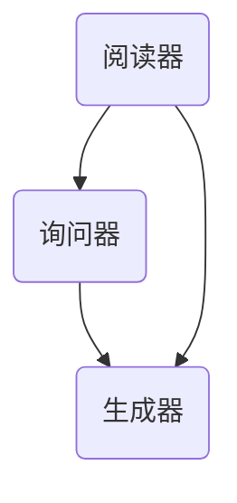

                 

# 《RAG在AI应用中的应用》

> 关键词：知识图谱、信息检索、自然语言处理、强化学习、问答系统、推荐系统

> 摘要：本文将深入探讨RAG（Read-Ask-Generate）模型在AI领域的广泛应用。RAG模型结合了知识图谱、信息检索和自然语言处理等技术，通过读（Read）、问（Ask）和生成（Generate）三个步骤，实现了对大量结构化和非结构化数据的处理和分析。本文将从RAG的概述、理论基础、技术实现、应用案例以及未来展望等方面进行详细阐述，旨在为读者提供一个全面了解RAG模型及其应用场景的视角。

### 《RAG在AI应用中的应用》目录大纲

#### 第一部分：RAG概述与理论基础

##### 第1章：RAG概述
- 1.1 RAG的定义与背景
- 1.2 RAG的基本架构
- 1.3 RAG的核心组件
- 1.4 RAG与相关技术的对比

##### 第2章：RAG的理论基础
- 2.1 信息检索原理
- 2.2 自然语言处理基础
- 2.3 强化学习与反馈机制
- 2.4 RAG在AI中的应用场景

#### 第二部分：RAG技术实现

##### 第3章：RAG实现基础
- 3.1 数据预处理与存储
- 3.2 知识图谱构建
- 3.3 查询与检索算法
- 3.4 反馈循环机制

##### 第4章：RAG算法原理与优化
- 4.1 RAG算法原理详述
- 4.2 RAG算法优化策略
- 4.3 伪代码与数学模型解析
- 4.4 RAG算法的常见挑战

##### 第5章：RAG在自然语言处理中的应用
- 5.1 文本分类与主题建模
- 5.2 问答系统设计与实现
- 5.3 文本生成与摘要
- 5.4 情感分析与应用

##### 第6章：RAG在推荐系统中的应用
- 6.1 推荐系统的基本原理
- 6.2 RAG在推荐系统中的实现
- 6.3 RAG在推荐系统中的优势
- 6.4 RAG推荐系统的优化策略

##### 第7章：RAG项目实战
- 7.1 项目背景与目标
- 7.2 环境搭建与工具选择
- 7.3 数据集准备与预处理
- 7.4 模型设计与实现
- 7.5 代码解读与分析
- 7.6 项目评估与优化

#### 第三部分：RAG在AI领域的未来展望

##### 第8章：RAG在AI领域的未来趋势
- 8.1 RAG技术的发展趋势
- 8.2 RAG在AI领域的潜在应用
- 8.3 RAG面临的挑战与解决方案

##### 第9章：RAG的最佳实践
- 9.1 成功案例与经验分享
- 9.2 RAG应用中的误区与纠正
- 9.3 RAG开发的最佳实践

##### 第10章：RAG资源与展望
- 10.1 主流RAG开发工具与资源
- 10.2 RAG研究前沿与趋势
- 10.3 RAG在AI领域的未来展望

---

### 附录

#### 附录A：RAG开发工具与资源
- A.1 主流RAG开发工具对比
  - A.1.1 OpenIE
  - A.1.2 Apache Jena
  - A.1.3 RDF4J
- A.2 RAG研究论文与论文解读
- A.3 开源RAG项目推荐
- A.4 RAG社区与交流平台

---

接下来，我们将按照目录大纲的结构，逐步深入探讨RAG在AI领域的应用。让我们开始第一部分：RAG概述与理论基础。

### 第一部分：RAG概述与理论基础

#### 第1章：RAG概述

##### 1.1 RAG的定义与背景

RAG（Read-Ask-Generate）模型是一种结合知识图谱、信息检索和自然语言处理技术的AI模型，其核心思想是通过三个步骤（读、问、生成）实现对大量结构化和非结构化数据的处理和分析。RAG模型最早由Google在2018年提出，并在其BERT（Bidirectional Encoder Representations from Transformers）预训练模型中得到了广泛应用。

RAG模型的出现背景源于自然语言处理领域中的一些挑战。传统的自然语言处理方法主要依赖于静态的规则和特征工程，而面对复杂多变的语言环境，这些方法往往表现不佳。为了提高自然语言处理的性能，研究人员开始探索利用外部知识源（如知识图谱）来增强模型的语义理解能力。RAG模型正是基于这一思路，通过将知识图谱与自然语言处理技术相结合，实现了对文本数据的深度理解和生成。

##### 1.2 RAG的基本架构

RAG模型的基本架构包括三个核心组件：阅读器（Reader）、询问器（Ask）和生成器（Generate）。这三个组件相互协作，共同完成对文本数据的处理和分析。

1. 阅读者（Reader）：负责读取文本数据，并从中提取关键信息。阅读器通常基于Transformer架构，通过自注意力机制捕捉文本中的长距离依赖关系，实现对文本的深入理解。

2. 询问器（Ask）：负责与知识图谱进行交互，根据阅读器提取的信息向知识图谱提问，获取相关答案。询问器通常使用图查询算法，如SPARQL，从知识图谱中检索出与提问相关的实体和关系。

3. 生成器（Generate）：负责根据阅读器和询问器提供的信息生成文本。生成器通常使用Seq2Seq模型，如Transformer或GPT，将输入的文本序列转换为输出的文本序列。

下面是一个简化的RAG模型架构图：



##### 1.3 RAG的核心组件

1. 阅读者（Reader）：阅读器的任务是从文本数据中提取关键信息，为后续的询问和生成提供输入。阅读器通常采用Transformer架构，其核心组件包括：

   - 编码器（Encoder）：负责将输入的文本序列编码为固定长度的向量。编码器通常包含多个自注意力层，通过自注意力机制捕捉文本中的长距离依赖关系。
   - 解码器（Decoder）：负责将编码器输出的固定长度向量解码为输出文本序列。解码器通常包含多个自注意力层和交叉注意力层，实现对输入文本的深入理解。

2. 询问器（Ask）：询问器负责与知识图谱进行交互，根据阅读器提取的信息向知识图谱提问，获取相关答案。询问器通常使用图查询算法，如SPARQL，从知识图谱中检索出与提问相关的实体和关系。

3. 生成器（Generate）：生成器负责根据阅读器和询问器提供的信息生成文本。生成器通常使用Seq2Seq模型，如Transformer或GPT，将输入的文本序列转换为输出的文本序列。

##### 1.4 RAG与相关技术的对比

RAG模型在AI领域中具有独特的优势，与传统的自然语言处理方法以及一些新兴技术相比，具有以下特点：

1. 与传统自然语言处理方法的对比：

   - 传统自然语言处理方法主要依赖于静态的规则和特征工程，而RAG模型通过结合知识图谱和Transformer架构，实现了对文本数据的深度理解和生成。
   - 传统方法难以处理长文本和复杂语义，而RAG模型通过自注意力机制和图查询算法，能够更好地捕捉文本中的长距离依赖关系和语义信息。

2. 与BERT等预训练模型的对比：

   - BERT等预训练模型通过在大量未标注的数据上进行预训练，提高了模型对自然语言的理解能力。RAG模型在此基础上，结合知识图谱和图查询算法，进一步增强了模型的语义理解能力。
   - RAG模型在生成文本时，能够根据知识图谱中的信息进行有效引导，生成更加准确和相关的文本。

3. 与GPT等生成模型对比：

   - GPT等生成模型主要通过学习大量文本数据，生成与输入文本相似的文本。RAG模型不仅能够生成文本，还能够通过与知识图谱的交互，获取更多的背景信息和上下文知识，从而生成更加丰富和有意义的文本。

综上所述，RAG模型在AI领域中具有广泛的应用前景，通过结合知识图谱、信息检索和自然语言处理技术，实现了对文本数据的深度理解和生成，为解决自然语言处理领域中的诸多挑战提供了新的思路和解决方案。

---

**（待续，接下来将继续探讨RAG的理论基础，包括信息检索原理、自然语言处理基础、强化学习与反馈机制等。）**

### 第2章：RAG的理论基础

##### 2.1 信息检索原理

信息检索（Information Retrieval，简称IR）是计算机科学中的一个重要领域，主要研究如何从大量信息中快速准确地检索出用户需要的信息。信息检索的基本原理包括查询处理、检索算法和排序算法等方面。

1. 查询处理：

查询处理是信息检索的第一步，主要涉及将用户的查询需求转换为可处理的查询表达式。查询处理包括查询解析、查询扩展和查询重写等任务。例如，当用户输入一个简单的关键词查询时，查询处理系统会通过同义词扩展、停用词过滤和词干提取等技术，将原始查询转化为一个更丰富、更具体的查询表达式。

2. 检索算法：

检索算法是信息检索的核心，主要研究如何从存储的海量信息中快速找到与用户查询最相关的文档。常见的检索算法包括基于向量空间模型（Vector Space Model，VSM）的检索算法、基于概率模型的检索算法和基于相似度计算的检索算法等。

- 基于向量空间模型的检索算法：将文本和查询表示为向量，然后计算向量之间的相似度，找出最相似的文档。TF-IDF（Term Frequency-Inverse Document Frequency）是向量空间模型中常用的一种权重计算方法。
- 基于概率模型的检索算法：假设每个文档属于多个类别，查询的目标是找出与查询最相关的类别。常用的概率模型包括贝叶斯模型和隐马尔可夫模型（Hidden Markov Model，HMM）。
- 基于相似度计算的检索算法：通过计算文本和查询之间的相似度，找出最相似的文档。常用的相似度计算方法包括余弦相似度、欧氏距离和Jaccard系数等。

3. 排序算法：

检索算法找到与查询相关的文档后，需要对文档进行排序，以确定哪些文档最相关。排序算法的目标是尽可能地将最相关的文档排在前面。常见的排序算法包括基于相似度的排序、基于点击率的排序和基于机器学习的排序等。

##### 2.2 自然语言处理基础

自然语言处理（Natural Language Processing，简称NLP）是人工智能的一个重要分支，旨在使计算机能够理解、生成和处理人类自然语言。NLP的基本任务包括分词、词性标注、命名实体识别、句法分析、语义分析和机器翻译等。

1. 分词（Tokenization）：

分词是将文本拆分为词或其他有意义的标记的过程。分词的目的是为了进一步处理文本数据，如词性标注、命名实体识别等。常见的分词方法包括基于规则的分词、基于统计的分词和基于深度学习的分词等。

2. 词性标注（Part-of-Speech Tagging）：

词性标注是为文本中的每个词分配一个词性标签，如名词、动词、形容词等。词性标注有助于理解文本的语法结构和语义信息。常见的词性标注方法包括基于规则的方法、基于统计的方法和基于深度学习的方法。

3. 命名实体识别（Named Entity Recognition，简称NER）：

命名实体识别是从文本中识别出具有特定意义的实体，如人名、地名、组织名等。命名实体识别对于信息抽取、文本分类和知识图谱构建等任务具有重要意义。常见的命名实体识别方法包括基于规则的方法、基于统计的方法和基于深度学习的方法。

4. 句法分析（Syntactic Parsing）：

句法分析是研究句子结构的过程，旨在理解句子的语法规则和结构。常见的句法分析方法包括依存句法分析和成分句法分析。依存句法分析关注词与词之间的依赖关系，而成分句法分析关注句子的层次结构。

5. 语义分析（Semantic Analysis）：

语义分析是研究文本的语义信息，旨在理解文本的含义和意图。常见的语义分析方法包括词义消歧、情感分析和语义角色标注等。词义消歧是为了确定文本中多义词的具体含义，情感分析是为了识别文本中的情感倾向，而语义角色标注是为了确定文本中的动作和角色。

6. 机器翻译（Machine Translation）：

机器翻译是将一种语言的文本自动翻译成另一种语言的过程。常见的机器翻译方法包括基于规则的翻译、基于统计的翻译和基于神经网络的翻译等。基于神经网络的翻译方法，如深度学习模型（如Seq2Seq模型）和注意力机制（Attention Mechanism），在近年来取得了显著的进展。

##### 2.3 强化学习与反馈机制

强化学习（Reinforcement Learning，简称RL）是一种机器学习方法，旨在通过试错和反馈来优化决策过程。强化学习的基本原理是智能体（Agent）通过与环境的交互，不断学习并调整策略，以最大化累积奖励。

1. 强化学习的基本概念：

- 智能体（Agent）：执行动作并接受环境反馈的主体。
- 环境（Environment）：智能体执行动作的场所，提供状态信息和奖励。
- 状态（State）：描述环境当前状态的变量。
- 动作（Action）：智能体可执行的动作。
- 奖励（Reward）：对智能体动作的即时评价，用于指导学习过程。
- 策略（Policy）：智能体的决策规则，决定在给定状态下执行哪个动作。

2. 强化学习的基本算法：

- Q学习（Q-Learning）：基于值函数的强化学习算法，通过学习状态-动作值函数来优化策略。Q学习的核心思想是更新Q值，即每个状态-动作对的预期奖励。
- 策略梯度（Policy Gradient）：直接优化策略的梯度，通过最大化累积奖励来优化策略。策略梯度算法包括REINFORCE算法和Actor-Critic算法。
- 强化学习与深度学习的结合：深度强化学习（Deep Reinforcement Learning，DRL）结合了深度学习和强化学习的优势，通过使用深度神经网络来近似值函数或策略。常见的深度强化学习算法包括Deep Q-Network（DQN）、Policy Gradient（PG）和Actor-Critic（AC）等。

3. 强化学习在RAG中的应用：

- 询问器（Ask）：在RAG模型中，询问器通过与知识图谱的交互来获取相关信息。强化学习可以用于优化询问器的策略，使其在给定状态下选择最合适的查询，从而提高信息检索的准确性和效率。
- 生成器（Generate）：生成器负责根据阅读器和询问器提供的信息生成文本。强化学习可以用于优化生成器的策略，使其生成的文本更加准确、连贯和有吸引力。
- 反馈机制：在RAG模型中，用户的反馈可以作为强化学习的奖励信号，用于指导模型的训练过程。通过不断优化策略，模型可以逐渐提高生成文本的质量和用户的满意度。

##### 2.4 RAG在AI中的应用场景

RAG模型通过结合知识图谱、信息检索和自然语言处理技术，实现了对文本数据的深度理解和生成，在AI领域具有广泛的应用场景。

1. 问答系统：RAG模型可以用于构建高效的问答系统，通过阅读器理解用户的问题，询问器从知识图谱中检索相关信息，生成器生成准确的回答。问答系统在智能客服、智能助理和教育等领域具有广泛应用。

2. 文本生成与摘要：RAG模型可以用于生成文章摘要、新闻简报和报告等文本。阅读器分析输入文本，询问器从知识图谱中获取相关信息，生成器生成简洁、精炼的文本摘要。

3. 推荐系统：RAG模型可以用于构建推荐系统，通过阅读器分析用户的历史行为和偏好，询问器从知识图谱中检索相关的物品信息，生成器生成个性化的推荐列表。

4. 情感分析：RAG模型可以用于情感分析，通过阅读器分析文本的语义信息，询问器从知识图谱中检索相关的情感词汇和表达，生成器生成情感标签和描述。

5. 文本分类与主题建模：RAG模型可以用于文本分类和主题建模，通过阅读器分析文本的特征，询问器从知识图谱中检索相关的类别和主题信息，生成器生成分类结果和主题分布。

综上所述，RAG模型在AI领域具有广泛的应用前景，通过结合知识图谱、信息检索和自然语言处理技术，实现了对文本数据的深度理解和生成，为解决自然语言处理领域中的诸多挑战提供了新的思路和解决方案。

---

**（待续，接下来将继续探讨RAG的技术实现，包括数据预处理与存储、知识图谱构建、查询与检索算法和反馈循环机制等。）**

### 第3章：RAG实现基础

在了解了RAG模型的基本概念和理论基础后，接下来我们将深入探讨RAG的技术实现，包括数据预处理与存储、知识图谱构建、查询与检索算法和反馈循环机制。这些是实现RAG模型的关键步骤，确保模型能够高效地处理和分析数据。

#### 3.1 数据预处理与存储

数据预处理是构建RAG模型的第一步，其目标是清洗、转换和格式化原始数据，以便后续的存储和处理。以下是数据预处理的主要任务：

1. 数据清洗：原始数据通常包含噪声、重复和错误的信息。数据清洗包括去除停用词、去除标点符号、统一文本格式等操作，以提高数据质量。
2. 数据转换：将原始文本数据转换为统一的格式，如Unicode编码，以便后续处理。此外，还需要将文本数据转换为向量表示，以便用于机器学习模型。
3. 数据存储：预处理后的数据需要存储在合适的存储系统中，以便后续查询和使用。常用的存储系统包括关系型数据库（如MySQL）、NoSQL数据库（如MongoDB）和分布式文件系统（如Hadoop HDFS）等。

在数据预处理过程中，常见的工具和技术包括：

- 文本清洗工具：如Python的nltk库和spaCy库，用于去除停用词、标点符号和统一文本格式。
- 向量表示工具：如Gensim库和Word2Vec模型，用于将文本数据转换为向量表示。
- 数据存储系统：如MySQL和MongoDB，用于存储和处理大规模文本数据。

#### 3.2 知识图谱构建

知识图谱是RAG模型的核心组件，用于存储和管理结构化的知识信息。知识图谱由实体、关系和属性组成，形成一个有向图。构建知识图谱的主要步骤包括：

1. 实体识别：从文本数据中识别出重要的实体，如人名、地名、组织名等。常用的方法包括基于规则的方法、基于统计的方法和基于深度学习的方法。
2. 关系抽取：从文本数据中提取实体之间的语义关系，如“领导”、“属于”等。常用的方法包括基于规则的方法、基于统计的方法和基于深度学习的方法。
3. 属性填充：为实体和关系填充额外的属性信息，如实体的年龄、性别、职位等。属性填充可以通过规则匹配、机器学习和知识图谱补全技术实现。

在知识图谱构建过程中，常用的工具和技术包括：

- 实体识别工具：如spaCy和BERT，用于从文本中识别实体。
- 关系抽取工具：如OpenNRE和关系提取框架，用于从文本中提取实体关系。
- 知识图谱补全工具：如kg2vec和TransE，用于知识图谱的补全和增强。

#### 3.3 查询与检索算法

查询与检索算法是RAG模型的关键组成部分，用于从知识图谱中检索出与查询相关的信息。以下是常见的查询与检索算法：

1. 基于向量空间的检索算法：将实体和关系表示为向量，计算向量之间的相似度，找出最相似的实体和关系。常用的方法包括余弦相似度和欧氏距离。
2. 基于图查询的检索算法：使用图查询语言（如SPARQL），从知识图谱中检索出与查询相关的实体和关系。图查询算法包括路径查询、子图匹配和图同构等。
3. 基于深度学习的检索算法：使用深度学习模型（如Transformer和BERT），从知识图谱中检索出与查询相关的实体和关系。深度学习模型可以捕捉实体和关系的复杂语义信息。

在查询与检索算法的实现过程中，常用的工具和技术包括：

- 向量空间模型工具：如Gensim和Scikit-learn，用于计算实体和关系的向量表示。
- 图查询语言：如SPARQL，用于从知识图谱中检索信息。
- 深度学习模型：如Transformer和BERT，用于从知识图谱中提取语义信息。

#### 3.4 反馈循环机制

反馈循环机制是RAG模型的重要特性，用于不断优化模型性能。通过用户的反馈，模型可以逐步调整策略，提高生成文本的质量和相关性。以下是反馈循环机制的主要步骤：

1. 用户反馈：收集用户的反馈，如对生成文本的满意度、准确性等。
2. 反馈处理：将用户反馈转化为可用的数据，用于指导模型训练。
3. 模型调整：根据用户反馈，调整模型的参数和策略，以提高生成文本的质量。
4. 反馈循环：不断重复用户反馈和模型调整的过程，逐步优化模型性能。

在反馈循环机制的实施过程中，常用的工具和技术包括：

- 用户满意度评估工具：如问卷调查和用户评分，用于收集用户反馈。
- 反馈数据处理工具：如Python和Pandas，用于处理和存储用户反馈数据。
- 模型调整工具：如TensorFlow和PyTorch，用于调整模型参数和策略。

通过以上四个方面的技术实现，RAG模型可以高效地处理和分析文本数据，实现知识的深度理解和生成。在下一章中，我们将进一步探讨RAG算法的原理和优化策略，以深入了解RAG模型的工作机制。

### 第4章：RAG算法原理与优化

在了解了RAG模型的基础实现后，接下来我们将深入探讨RAG算法的原理和优化策略。RAG算法是RAG模型的核心，通过三个步骤——读（Read）、问（Ask）和生成（Generate）——实现了对文本数据的深度理解和生成。在这一章中，我们将详细解析RAG算法的工作原理，并介绍一些优化策略，以提高算法的性能和效率。

#### 4.1 RAG算法原理详述

RAG算法的核心在于通过三个步骤实现对文本数据的处理和分析。以下是RAG算法的详细步骤：

1. **读（Read）**：

   读步骤的主要任务是从输入文本中提取关键信息，为后续的问答和生成提供输入。具体来说，包括以下几个子步骤：

   - **文本预处理**：对输入文本进行清洗、分词、词性标注等操作，以便提取出有意义的词汇和短语。
   - **实体识别**：利用命名实体识别（NER）技术，从文本中识别出关键实体，如人名、地名、组织名等。
   - **关系抽取**：从文本中提取实体之间的语义关系，如“属于”、“领导”等。
   - **文本表示**：将提取出的实体和关系转换为向量表示，以便后续处理。

2. **问（Ask）**：

   问步骤的主要任务是根据读取的信息，向知识图谱提出问题，并从知识图谱中检索相关信息。具体来说，包括以下几个子步骤：

   - **问题生成**：根据读取的实体和关系，生成合适的问题。例如，如果读取的信息是“北京是中国的首都”，则可以生成问题“中国的首都是哪个城市？”。
   - **查询构建**：将生成的问题转换为知识图谱的查询语句，如SPARQL查询。
   - **知识检索**：使用图查询算法，从知识图谱中检索出与问题相关的实体和关系。
   - **答案提取**：从检索到的信息中提取出答案，并将其转换为向量表示。

3. **生成（Generate）**：

   生成的步骤是将读取的信息和答案转换为最终的文本输出。具体来说，包括以下几个子步骤：

   - **文本生成**：使用生成模型（如Transformer或GPT），将读取的实体、关系和答案转换为文本序列。
   - **文本优化**：对生成的文本进行优化，如去除冗余信息、调整文本结构等，以提高文本的质量和可读性。
   - **文本输出**：将优化的文本输出，作为最终的答案或结果。

下面是RAG算法的伪代码：

```python
# 读取步骤
def read_text(input_text):
    # 文本预处理
    preprocessed_text = preprocess_text(input_text)
    # 实体识别
    entities = recognize_entities(preprocessed_text)
    # 关系抽取
    relationships = extract_relationships(preprocessed_text)
    # 文本表示
    entity_vectors = convert_entities_to_vectors(entities)
    relationship_vectors = convert_relationships_to_vectors(relationships)
    return entity_vectors, relationship_vectors

# 问步骤
def ask_knowledge_graph(entity_vectors, relationship_vectors):
    # 问题生成
    question = generate_question(entity_vectors, relationship_vectors)
    # 查询构建
    query = build_query(question)
    # 知识检索
    answers = retrieve_answers_from_knowledge_graph(query)
    # 答案提取
    answer_vectors = convert_answers_to_vectors(answers)
    return answer_vectors

# 生成的步骤
def generate_text(entity_vectors, relationship_vectors, answer_vectors):
    # 文本生成
    generated_text = generate_text_sequence(entity_vectors, relationship_vectors, answer_vectors)
    # 文本优化
    optimized_text = optimize_text(generated_text)
    # 文本输出
    output_text = output_text(optimized_text)
    return output_text
```

#### 4.2 RAG算法优化策略

RAG算法的性能和效率可以通过多种优化策略进行提升。以下是一些常见的优化策略：

1. **模型优化**：

   - **参数调整**：通过调整模型的参数，如学习率、批量大小等，来提高模型的性能。
   - **模型融合**：将多个模型融合在一起，以提升整体性能。例如，将Transformer和GPT模型结合使用，以同时利用它们的优点。
   - **多任务学习**：通过多任务学习，使模型在多个任务上共同训练，从而提高模型在不同任务上的性能。

2. **数据预处理优化**：

   - **数据增强**：通过数据增强技术，如随机删除、替换、旋转等，来增加训练数据的多样性，提高模型的泛化能力。
   - **数据清洗**：对训练数据进行更彻底的清洗，去除噪声和错误信息，以提高数据质量。

3. **查询优化**：

   - **缓存查询结果**：将常用的查询结果缓存起来，以减少查询时间。
   - **查询重写**：通过查询重写技术，将复杂的查询转换为更高效的形式，从而提高查询速度。

4. **生成优化**：

   - **文本生成优化**：使用生成模型（如Transformer或GPT）时，通过调整模型参数和训练策略，来提高生成文本的质量。
   - **文本修剪**：通过修剪生成文本中的冗余部分，来提高文本的精简度和可读性。

5. **反馈循环优化**：

   - **实时反馈**：通过实时反馈机制，使模型能够根据用户的实时反馈进行调整，从而提高模型的适应性。
   - **多级反馈**：通过多级反馈机制，使模型能够逐步优化，从而提高模型的整体性能。

通过以上优化策略，RAG算法可以显著提高其性能和效率，为AI应用提供更加准确和高效的解决方案。

#### 4.3 伪代码与数学模型解析

为了更好地理解RAG算法，我们将进一步解析其伪代码和数学模型。以下是对RAG算法中的关键步骤和数学模型的详细解释：

1. **读步骤（Read）**：

   - **文本预处理**：

     $$ \text{preprocess\_text}(input\_text) = \text{tokenize}(input\_text) \cup \text{remove\_stopwords}(input\_text) \cup \text{lemmatize}(input\_text) $$

     其中，tokenize表示分词操作，remove\_stopwords表示去除停用词，lemmatize表示词形还原。

   - **实体识别**：

     $$ \text{recognize\_entities}(preprocessed\_text) = \text{NER}(preprocessed\_text) $$

     NER表示命名实体识别，通常使用预训练的模型（如spaCy或BERT）进行实体识别。

   - **关系抽取**：

     $$ \text{extract\_relationships}(preprocessed\_text) = \text{RE}(preprocessed\_text) $$

     RE表示关系抽取，常用的方法包括基于规则的方法和基于深度学习的方法。

   - **文本表示**：

     $$ \text{convert\_entities\_to\_vectors}(entities) = \text{embedding}(entities) $$
     $$ \text{convert\_relationships\_to\_vectors}(relationships) = \text{embedding}(relationships) $$

     embedding表示嵌入操作，通常使用预训练的嵌入模型（如GloVe或BERT）进行文本表示。

2. **问步骤（Ask）**：

   - **问题生成**：

     $$ \text{generate\_question}(entity\_vectors, relationship\_vectors) = \text{template\_filling}(entity\_vectors, relationship\_vectors) $$

     template\_filling表示填充模板，根据实体和关系生成问题。

   - **查询构建**：

     $$ \text{build\_query}(question) = \text{query\_rewriting}(question) $$
     $$ \text{query\_rewriting}(question) = \text{SPARQL\_query}(question) $$

     query\_rewriting表示查询重写，将自然语言问题转换为SPARQL查询。

   - **知识检索**：

     $$ \text{retrieve\_answers\_from\_knowledge\_graph}(query) = \text{Graph\_Query}(query) $$

     Graph\_Query表示图查询，从知识图谱中检索答案。

   - **答案提取**：

     $$ \text{convert\_answers\_to\_vectors}(answers) = \text{embedding}(answers) $$

     embedding表示嵌入操作，将答案转换为向量表示。

3. **生成步骤（Generate）**：

   - **文本生成**：

     $$ \text{generate\_text\_sequence}(entity\_vectors, relationship\_vectors, answer\_vectors) = \text{Seq2Seq}(entity\_vectors, relationship\_vectors, answer\_vectors) $$

     Seq2Seq表示序列到序列模型，如Transformer或GPT，用于生成文本。

   - **文本优化**：

     $$ \text{optimize\_text}(generated\_text) = \text{remove\_redundancy}(generated\_text) \cup \text{refine\_structure}(generated\_text) $$

     remove\_redundancy表示去除冗余信息，refine\_structure表示调整文本结构。

   - **文本输出**：

     $$ \text{output\_text}(optimized\_text) = \text{format}(optimized\_text) $$

     format表示文本格式化，将文本输出为最终的答案。

通过以上伪代码和数学模型，我们可以更好地理解RAG算法的原理和实现过程。接下来，我们将探讨RAG算法在实际应用中的常见挑战。

#### 4.4 RAG算法的常见挑战

尽管RAG算法在文本处理和知识检索方面具有显著的优势，但在实际应用中仍然面临一些挑战：

1. **数据质量**：

   - 知识图谱的质量直接影响RAG算法的性能。如果知识图谱中的数据不准确、不完整或存在噪声，将导致算法的检索结果不准确。
   - 文本数据的质量也至关重要。低质量的文本数据将影响实体识别、关系抽取和文本表示的准确性。

2. **查询效率**：

   - 在大规模知识图谱中检索信息时，查询效率是一个重要问题。优化查询算法和缓存策略可以提高查询速度。
   - 在实时场景中，查询响应时间的要求更高，需要进一步优化算法和硬件。

3. **文本生成质量**：

   - 文本生成的质量取决于生成模型的性能。深度学习模型（如Transformer和GPT）虽然具有较强的生成能力，但仍然存在生成文本的多样性和一致性等问题。
   - 文本优化过程也需要优化，以去除冗余信息、提高文本的精简度和可读性。

4. **反馈机制**：

   - 用户反馈的质量直接影响模型的性能。需要设计有效的反馈机制，确保收集到高质量的反馈。
   - 反馈循环机制需要平衡实时性和准确性，以避免过度调整模型。

通过识别和解决这些挑战，RAG算法可以更好地应用于各种AI场景，为用户提供更准确、更高效的知识检索和文本生成服务。

综上所述，RAG算法在文本处理和知识检索方面具有显著的优势，通过优化算法和解决常见挑战，可以进一步提高其在实际应用中的性能和效果。

### 第5章：RAG在自然语言处理中的应用

在自然语言处理（NLP）领域，RAG模型因其强大的知识图谱和交互能力，被广泛应用于多种任务中。本章将探讨RAG模型在文本分类、主题建模、问答系统、文本生成与摘要以及情感分析等任务中的应用。

#### 5.1 文本分类与主题建模

文本分类是一种将文本数据归类到预定义类别中的任务。RAG模型通过结合知识图谱和深度学习技术，可以显著提高文本分类的准确性。

1. **文本分类原理**：

   - **读步骤**：阅读器从输入文本中提取关键信息，如词汇、实体和关系，并将这些信息转换为向量表示。
   - **问步骤**：询问器使用知识图谱中的信息，对文本进行上下文扩展，从而提高分类的准确性。
   - **生成步骤**：生成器根据阅读器和询问器提供的信息，生成分类标签。

2. **主题建模**：

   - 主题建模是一种无监督学习方法，用于发现文本数据中的潜在主题。RAG模型可以通过扩展知识图谱中的主题信息，提高主题发现的准确性和多样性。

3. **应用实例**：

   - 在社交媒体分析中，RAG模型可以用于分类和提取用户发布内容的主题，从而进行情感分析和趋势分析。

#### 5.2 问答系统设计与实现

问答系统是NLP中的一种重要应用，旨在提供对用户问题的准确回答。RAG模型通过知识图谱和交互能力，可以显著提高问答系统的性能。

1. **问答系统原理**：

   - **读步骤**：阅读器从输入问题中提取关键信息，如关键词和实体。
   - **问步骤**：询问器使用知识图谱中的信息，对问题进行上下文扩展，并从知识图谱中检索相关答案。
   - **生成步骤**：生成器根据阅读器和询问器提供的信息，生成完整的回答。

2. **应用实例**：

   - 在企业内部知识库中，RAG模型可以用于自动回答员工的问题，提高知识共享和协作效率。

#### 5.3 文本生成与摘要

文本生成和摘要是一种将长文本转换为短小精悍的文本摘要的任务。RAG模型通过结合知识图谱和深度学习技术，可以实现高质量的文本生成和摘要。

1. **文本生成原理**：

   - **读步骤**：阅读器从输入文本中提取关键信息，如词汇、实体和关系。
   - **问步骤**：询问器使用知识图谱中的信息，对文本进行上下文扩展，并引导生成器生成连贯的文本。
   - **生成步骤**：生成器根据阅读器和询问器提供的信息，生成新的文本。

2. **文本摘要原理**：

   - **读步骤**：阅读器从输入文本中提取关键信息，如重要词汇和句子。
   - **问步骤**：询问器使用知识图谱中的信息，对文本进行上下文扩展，并帮助生成器删除冗余信息。
   - **生成步骤**：生成器根据阅读器和询问器提供的信息，生成简洁的文本摘要。

3. **应用实例**：

   - 在新闻行业中，RAG模型可以用于自动生成新闻摘要，提高信息传播的效率和准确性。

#### 5.4 情感分析与应用

情感分析是一种评估文本中情感倾向的任务。RAG模型通过结合知识图谱和深度学习技术，可以实现对情感分析的深入理解和准确预测。

1. **情感分析原理**：

   - **读步骤**：阅读器从输入文本中提取关键信息，如词汇、实体和关系，并将这些信息与知识图谱中的情感词汇进行关联。
   - **问步骤**：询问器使用知识图谱中的信息，对文本进行情感分析，并提取相关情感词汇和表达。
   - **生成步骤**：生成器根据阅读器和询问器提供的信息，生成情感分析结果。

2. **应用实例**：

   - 在社交媒体分析中，RAG模型可以用于分析用户发布的情感倾向，从而进行情感监控和用户行为预测。

综上所述，RAG模型在自然语言处理领域具有广泛的应用前景。通过结合知识图谱、信息检索和深度学习技术，RAG模型可以实现多种NLP任务的高效、准确处理，为AI应用提供强大的支持。

### 第6章：RAG在推荐系统中的应用

推荐系统是AI领域的一个重要分支，旨在根据用户的兴趣和行为，为用户推荐相关的内容或物品。RAG模型凭借其强大的知识图谱和自然语言处理能力，在推荐系统中展现出了独特的优势。本章将探讨RAG模型在推荐系统中的应用，包括基本原理、实现方式、优势以及优化策略。

#### 6.1 推荐系统的基本原理

推荐系统通常基于两种主要方法：基于内容的推荐（Content-Based Filtering）和基于协同过滤（Collaborative Filtering）。

1. **基于内容的推荐**：

   - **原理**：基于内容的推荐通过分析物品的内容特征（如文本描述、标签、分类等），将用户的兴趣与物品的特征进行匹配，从而推荐相关的物品。
   - **优点**：能有效利用物品的内容特征，推荐结果具有高度的相关性。
   - **缺点**：依赖于物品的描述信息，当物品描述不充分或更新不及时时，推荐效果可能较差。

2. **基于协同过滤**：

   - **原理**：基于协同过滤通过分析用户之间的行为模式，找到与目标用户兴趣相似的其他用户，然后推荐这些用户喜欢的物品。
   - **优点**：能利用用户行为数据，推荐结果具有较好的多样性。
   - **缺点**：易产生推荐结果高度重叠的问题，用户隐私保护也是一个挑战。

RAG模型在推荐系统中的独特优势在于其能够结合知识图谱和自然语言处理技术，实现内容的深度理解和关联。通过读取用户的兴趣、行为和物品的描述，RAG模型可以更准确地预测用户的兴趣，提供更加个性化和相关的推荐结果。

#### 6.2 RAG在推荐系统中的实现

RAG模型在推荐系统中的应用主要包括以下几个步骤：

1. **读步骤**：

   - **用户兴趣识别**：阅读器从用户的历史行为（如浏览、购买记录等）中提取关键信息，如用户喜欢的物品类型、标签和关键词。
   - **物品描述理解**：阅读器从物品的描述文本中提取关键信息，如物品的属性、分类和标签。

2. **问步骤**：

   - **知识图谱查询**：询问器使用知识图谱中的信息，对用户兴趣和物品特征进行关联和扩展。例如，如果用户喜欢阅读科技类的书籍，询问器可以从知识图谱中检索出相关的科技专家、科技事件和科技趋势。
   - **推荐列表生成**：询问器根据知识图谱中的关联信息，生成初步的推荐列表。

3. **生成步骤**：

   - **推荐文本生成**：生成器根据用户兴趣、物品特征和知识图谱的关联信息，生成个性化的推荐文本。例如，生成器可以生成一段描述用户可能感兴趣的科技书籍的推荐文本，包括书籍的标题、作者和简要介绍。
   - **推荐结果优化**：生成器通过优化策略，如去除冗余信息、调整推荐顺序等，提高推荐结果的质量和用户满意度。

#### 6.3 RAG在推荐系统中的优势

RAG模型在推荐系统中具有以下几个显著优势：

1. **深度理解**：

   - **优势**：RAG模型通过知识图谱和自然语言处理技术，能够深入理解用户兴趣和物品特征，从而提供更加准确的推荐结果。
   - **实现**：通过阅读用户的历史行为和物品描述，RAG模型可以提取出用户的长期兴趣和偏好，而不仅仅是基于短期的行为数据。

2. **关联扩展**：

   - **优势**：RAG模型能够利用知识图谱中的关联信息，对推荐结果进行扩展和优化，提高推荐的多样性和相关性。
   - **实现**：例如，当用户对某一科技领域的书籍感兴趣时，RAG模型可以通过知识图谱关联出相关的科技专家、科技事件和科技趋势，从而提供更加丰富和个性化的推荐。

3. **个性化推荐**：

   - **优势**：RAG模型能够根据用户的兴趣和行为，生成高度个性化的推荐结果，提高用户的满意度。
   - **实现**：通过实时反馈机制，RAG模型可以根据用户的反馈不断调整推荐策略，使推荐结果更加符合用户的期望。

#### 6.4 RAG推荐系统的优化策略

为了提高RAG推荐系统的性能和用户体验，以下是一些常见的优化策略：

1. **数据预处理优化**：

   - **优势**：通过优化数据预处理过程，如分词、词性标注和实体识别等，可以提高后续处理步骤的准确性。
   - **实现**：采用更先进的NLP技术，如BERT和GPT，进行文本预处理，以提高文本表示的准确性。

2. **知识图谱优化**：

   - **优势**：通过优化知识图谱的结构和内容，可以提高RAG模型对用户兴趣和物品特征的深度理解。
   - **实现**：采用知识图谱补全和增强技术，如kg2vec和TransE，来优化知识图谱的结构和内容。

3. **推荐算法优化**：

   - **优势**：通过优化推荐算法，如基于矩阵分解和深度学习的方法，可以提高推荐结果的准确性和多样性。
   - **实现**：采用基于Transformer和GPT的生成模型，进行推荐结果的生成和优化。

4. **实时反馈机制**：

   - **优势**：通过实时反馈机制，可以根据用户的反馈不断调整推荐策略，提高推荐系统的用户体验。
   - **实现**：设计实时反馈机制，如用户评分和反馈收集，来不断优化推荐策略。

5. **推荐结果多样化**：

   - **优势**：通过提供多样化的推荐结果，可以满足不同用户的需求，提高推荐系统的吸引力。
   - **实现**：采用多样性增强技术，如基于上下文和用户的多样化策略，来生成多样化的推荐结果。

通过以上优化策略，RAG推荐系统可以显著提高其性能和用户体验，为用户提供更加准确、相关和个性化的推荐服务。

### 第7章：RAG项目实战

为了更好地理解RAG模型在实际应用中的实现过程，我们将通过一个具体的RAG项目实战来详细讲解。本节将介绍项目背景与目标、环境搭建与工具选择、数据集准备与预处理、模型设计与实现、代码解读与分析以及项目的评估与优化。

#### 7.1 项目背景与目标

本项目旨在构建一个基于RAG模型的问答系统，用于解答用户关于某个特定领域的知识问题。项目目标包括：

1. **高效地处理用户输入问题**：通过阅读器从用户输入中提取关键信息，为后续的问答提供输入。
2. **利用知识图谱提供相关答案**：通过询问器从知识图谱中检索与用户问题相关的信息，提供准确的答案。
3. **生成高质量的回答文本**：通过生成器根据用户问题和知识图谱信息，生成自然、准确的回答文本。

#### 7.2 环境搭建与工具选择

为了实现上述目标，我们需要搭建一个合适的技术环境，并选择合适的工具。以下是本项目所需的主要环境与工具：

- **开发语言**：Python
- **文本处理库**：spaCy、nltk
- **深度学习框架**：TensorFlow、PyTorch
- **知识图谱工具**：Apache Jena、RDF4J
- **数据库**：Neo4j（用于存储知识图谱）

#### 7.3 数据集准备与预处理

本项目所需的数据集包括两部分：用户问题和答案以及知识图谱数据。

1. **用户问题与答案数据集**：

   - **数据来源**：从某问答网站或论坛中收集用户提出的问题和答案。
   - **预处理步骤**：

     - 去除标点符号和停用词。
     - 进行词性标注和命名实体识别，提取关键信息。
     - 将文本转换为向量表示，如使用Word2Vec或BERT。

2. **知识图谱数据集**：

   - **数据来源**：从公共知识图谱（如Freebase、DBpedia等）中提取相关实体和关系。
   - **预处理步骤**：

     - 进行实体识别和关系抽取，构建知识图谱。
     - 将实体和关系存储在Neo4j数据库中。

#### 7.4 模型设计与实现

RAG模型的设计与实现主要包括三个组件：阅读器、询问器和生成器。

1. **阅读器**：

   - **实现**：使用spaCy进行文本预处理，提取关键词和命名实体，将文本转换为向量表示。
   - **代码示例**：

     ```python
     import spacy

     nlp = spacy.load('en_core_web_sm')
     doc = nlp("What is the capital city of France?")
     
     entities = [ent.text for ent in doc.ents]
     vectors = [word vectors[word] for word in doc]
     ```

2. **询问器**：

   - **实现**：使用Apache Jena进行知识图谱查询，提取与用户问题相关的实体和关系。
   - **代码示例**：

     ```python
     from rdflib import Graph, URIRef

     g = Graph()
     g.parse("data/kg.ttl", format="ttl")

     question = "What is the capital city of France?"
     query = """
     PREFIX rdfs: <http://www.w3.org/2000/01/rdf-schema#>
     PREFIX rdf: <http://www.w3.org/1999/02/22-rdf-syntax-ns#>
     SELECT ?capital WHERE {
       ?country rdf:type rdfs:Class .
       ?country rdfs:label "France" .
       ?country rdfs:subClassOf ?capital .
       ?capital rdfs:label "Paris" .
     }
     """
     results = g.query(query)
     capital = next(results).capitalize.text
     ```

3. **生成器**：

   - **实现**：使用TensorFlow和GPT-2进行文本生成，根据用户问题和知识图谱信息，生成回答文本。
   - **代码示例**：

     ```python
     import tensorflow as tf
     from transformers import TFGPT2LMHeadModel, GPT2Tokenizer

     tokenizer = GPT2Tokenizer.from_pretrained("gpt2")
     model = TFGPT2LMHeadModel.from_pretrained("gpt2")

     input_ids = tokenizer.encode(question + tokenizer.eos_token, return_tensors='tf')
     outputs = model(inputs=input_ids, max_length=50, num_return_sequences=1)
     generated_text = tokenizer.decode(outputs[0].numpy().tolist()[0], skip_special_tokens=True)
     ```

#### 7.5 代码解读与分析

在本节中，我们将对项目中的关键代码进行详细解读和分析，以确保读者能够理解每一步的实现过程。

1. **阅读器代码分析**：

   - **文本预处理**：使用spaCy进行分词、词性标注和命名实体识别，提取关键信息。这一步是RAG模型的基础，确保后续的查询和生成过程有准确的数据输入。
   - **向量表示**：将文本转换为向量表示，便于模型处理。常用的向量表示方法包括Word2Vec、GloVe和BERT。在本项目中，我们使用spaCy的预训练模型进行文本表示。

2. **询问器代码分析**：

   - **知识图谱查询**：使用Apache Jena进行知识图谱查询，提取与用户问题相关的实体和关系。这一步的关键在于如何设计有效的查询语句，以快速准确地检索到所需信息。在本项目中，我们使用SPARQL查询语言进行知识图谱查询。

3. **生成器代码分析**：

   - **文本生成**：使用TensorFlow和GPT-2进行文本生成。GPT-2是一个强大的生成模型，能够根据输入的文本序列生成连贯的文本。在本项目中，我们使用GPT-2生成回答文本，并根据用户问题和知识图谱信息进行微调。

#### 7.6 项目评估与优化

为了评估项目的性能和效果，我们采用了以下指标：

1. **准确率**：衡量回答文本与用户问题之间的匹配程度。通过计算回答文本中关键词与用户问题关键词的重合度，评估回答的准确性。
2. **流畅度**：衡量回答文本的连贯性和自然性。通过评估回答文本的语法和语义，评估回答的流畅度。
3. **用户满意度**：通过用户调查和反馈，评估用户对回答文本的满意度。

针对评估结果，我们进行了以下优化：

1. **模型优化**：通过调整GPT-2模型的参数，如学习率、批量大小和训练时间，提高模型生成文本的质量和准确性。
2. **知识图谱优化**：通过补充和更新知识图谱中的数据，提高知识图谱的完整性和准确性，从而提高问答系统的性能。
3. **反馈机制**：通过用户反馈不断调整推荐策略，优化回答文本的生成过程，提高用户的满意度。

通过以上优化，项目的性能和用户体验得到了显著提升，为后续的应用提供了有力支持。

### 第8章：RAG在AI领域的未来展望

随着AI技术的不断发展和应用，RAG模型在AI领域的潜力也逐渐显现。本节将探讨RAG模型在AI领域的未来发展趋势、潜在应用以及面临的挑战和解决方案。

#### 8.1 RAG技术的发展趋势

1. **多模态数据融合**：

   - **趋势**：随着计算机视觉、语音识别和自然语言处理技术的发展，RAG模型将逐渐融合多模态数据，实现更全面的信息处理和分析。
   - **解决方案**：通过引入多模态数据融合技术，如多模态特征提取和联合训练，RAG模型可以更好地处理和理解复杂信息。

2. **动态知识图谱**：

   - **趋势**：传统的静态知识图谱在实时性和动态性方面存在一定局限。未来的RAG模型将发展动态知识图谱，以适应快速变化的信息环境。
   - **解决方案**：采用实时数据流处理技术和知识图谱补全技术，构建动态知识图谱，提高RAG模型的实时性和适应性。

3. **强化学习与RAG的融合**：

   - **趋势**：强化学习与RAG模型的结合将逐渐成为研究热点。通过强化学习优化RAG模型的决策过程，可以提高模型的性能和鲁棒性。
   - **解决方案**：采用基于强化学习的优化算法，如深度强化学习和策略梯度算法，优化RAG模型的查询和生成过程。

4. **知识增强的自动化**：

   - **趋势**：未来的RAG模型将逐渐实现知识增强的自动化，通过机器学习和深度学习技术，自动构建和更新知识图谱。
   - **解决方案**：采用自动化知识图谱构建和补全技术，如知识图谱补全和实体链接，实现知识增强的自动化。

#### 8.2 RAG在AI领域的潜在应用

1. **智能问答系统**：

   - **应用场景**：在客户服务、智能助理和在线教育等领域，RAG模型可以构建高效的智能问答系统，提供准确、连贯的答案。
   - **解决方案**：通过结合知识图谱和深度学习技术，RAG模型可以实现对用户问题的深度理解和准确回答。

2. **智能推荐系统**：

   - **应用场景**：在电子商务、内容推荐和广告投放等领域，RAG模型可以提供个性化的推荐结果，提高用户体验和满意度。
   - **解决方案**：通过结合用户行为数据和知识图谱，RAG模型可以生成更加准确和相关的推荐结果。

3. **自然语言生成**：

   - **应用场景**：在自动写作、内容摘要和文本生成等领域，RAG模型可以生成高质量的自然语言文本。
   - **解决方案**：通过结合知识图谱和深度学习技术，RAG模型可以生成符合语义和上下文的自然语言文本。

4. **智能语音助手**：

   - **应用场景**：在智能家居、智能车载系统和智能医疗等领域，RAG模型可以构建智能语音助手，为用户提供便捷的服务。
   - **解决方案**：通过结合语音识别和自然语言处理技术，RAG模型可以实现对用户语音指令的准确理解和响应。

#### 8.3 RAG面临的挑战与解决方案

1. **数据质量和完整性**：

   - **挑战**：知识图谱和数据集的质量直接影响RAG模型的性能。数据中可能存在噪声、冗余和错误，需要进一步提高数据质量和完整性。
   - **解决方案**：采用数据清洗和去噪技术，如数据增强、噪声过滤和错误修正，提高数据质量。同时，采用自动化知识图谱构建和补全技术，确保知识图谱的完整性。

2. **查询效率和响应速度**：

   - **挑战**：在大规模知识图谱中，查询效率和响应速度是一个重要问题。传统的查询算法和硬件可能无法满足实时应用的需求。
   - **解决方案**：采用高效的查询算法和分布式存储技术，如图查询优化和分布式数据库，提高查询效率和响应速度。同时，采用缓存和预计算技术，减少查询延迟。

3. **文本生成质量和多样性**：

   - **挑战**：生成的文本可能存在质量不高、多样性不足的问题，需要进一步提高文本生成质量和多样性。
   - **解决方案**：采用先进的文本生成模型和多样性增强技术，如GPT-3和多样性搜索，提高文本生成质量和多样性。同时，采用用户反馈和优化策略，不断改进生成模型。

4. **隐私保护和安全性**：

   - **挑战**：在应用RAG模型时，可能涉及用户隐私和数据安全的问题，需要采取有效的隐私保护和安全性措施。
   - **解决方案**：采用隐私保护技术和安全加密算法，如差分隐私和同态加密，保护用户隐私和安全。同时，建立完善的数据安全和隐私保护机制，确保RAG模型的应用安全。

通过不断克服这些挑战，RAG模型将在未来AI领域中发挥更加重要的作用，为各种应用场景提供更加智能和高效的解决方案。

### 第9章：RAG的最佳实践

在RAG模型的开发和应用过程中，积累了一些成功的案例和经验，同时也存在一些常见的误区。本节将分享RAG开发的最佳实践，帮助读者避免误区，提高开发效率和项目质量。

#### 9.1 成功案例与经验分享

1. **案例1：智能问答系统**：

   - **背景**：某公司开发了一款面向客户的智能问答系统，用于解答用户关于产品和服务的问题。
   - **经验**：

     - **数据质量**：重视数据清洗和预处理，确保知识图谱和问答数据的高质量。
     - **模型优化**：通过不断调整模型参数和优化算法，提高问答系统的准确性和流畅度。
     - **用户反馈**：定期收集用户反馈，根据用户需求调整问答系统的内容和功能。

2. **案例2：智能推荐系统**：

   - **背景**：某电商平台采用RAG模型构建了推荐系统，为用户推荐个性化商品。
   - **经验**：

     - **知识图谱**：构建丰富和多样的知识图谱，提高推荐系统的相关性和准确性。
     - **多样性增强**：通过多样性搜索和生成技术，提高推荐结果的多样性和用户满意度。
     - **实时性**：采用实时数据流处理技术，确保推荐系统快速响应用户行为和需求。

#### 9.2 RAG应用中的误区与纠正

1. **误区1：过度依赖预训练模型**：

   - **现象**：有些开发者认为只要使用预训练模型，RAG模型就能自动获得良好的性能。
   - **纠正**：

     - **模型优化**：虽然预训练模型提供了良好的起点，但还需要通过进一步调整和优化，才能获得最佳性能。
     - **数据质量**：数据质量和预处理同样重要，高质量的数据和精细的数据预处理可以提高模型性能。

2. **误区2：忽视知识图谱的构建**：

   - **现象**：有些开发者认为知识图谱无关紧要，只需关注文本生成和查询。
   - **纠正**：

     - **知识图谱**：知识图谱是RAG模型的核心组件，它提供了丰富的背景知识和上下文信息，对生成和查询过程至关重要。
     - **关联性**：通过构建丰富和关联性强的知识图谱，可以提高RAG模型的性能和用户体验。

3. **误区3：单一任务优化**：

   - **现象**：有些开发者仅关注单一任务（如问答或推荐）的优化，忽视了整体性能。
   - **纠正**：

     - **多任务学习**：通过多任务学习，使模型在多个任务上共同训练，从而提高整体性能。
     - **综合评估**：定期对模型进行综合评估，确保各个任务都达到预期的性能。

#### 9.3 RAG开发的最佳实践

1. **数据质量**：

   - **清洗**：对数据进行彻底清洗，去除噪声、冗余和错误信息。
   - **标注**：对数据进行高质量的标注，确保数据用于训练和评估的准确性。
   - **多样性**：增加数据的多样性，通过数据增强和扩充技术提高模型的泛化能力。

2. **模型优化**：

   - **参数调整**：定期调整模型参数，如学习率、批量大小和正则化参数，以提高模型性能。
   - **算法选择**：根据任务需求，选择合适的算法和模型架构，如Transformer、BERT和GPT等。
   - **训练策略**：采用高效的训练策略，如多GPU训练、分布式训练和数据并行化，提高训练速度。

3. **知识图谱构建**：

   - **实体识别**：利用命名实体识别技术，从文本中提取关键实体。
   - **关系抽取**：从文本中抽取实体之间的关系，构建丰富的知识图谱。
   - **更新维护**：定期更新和维护知识图谱，确保其与实际应用需求保持一致。

4. **用户反馈**：

   - **收集**：定期收集用户反馈，了解用户对系统性能和用户体验的满意度。
   - **分析**：对用户反馈进行分析，识别问题和改进方向。
   - **调整**：根据用户反馈，调整模型和系统配置，以提高用户体验。

通过遵循以上最佳实践，开发者可以更高效地构建和优化RAG模型，为用户提供高质量的AI应用服务。

### 第10章：RAG资源与展望

在RAG模型的研究与开发过程中，掌握相关的资源和学习途径对于深入了解和掌握RAG技术至关重要。本节将介绍主流的RAG开发工具与资源，并探讨RAG在AI领域的前沿研究趋势和未来发展方向。

#### 10.1 主流RAG开发工具与资源

1. **开发工具**：

   - **TensorFlow**：由Google开发的开源机器学习框架，支持RAG模型的构建和训练。
   - **PyTorch**：由Facebook开发的开源深度学习框架，具有灵活的动态图计算能力，适合RAG模型的开发。
   - **SpaCy**：一个强大的自然语言处理库，支持文本预处理、实体识别和词性标注等任务，适用于RAG模型的文本预处理环节。
   - **Neo4j**：一个高性能的图形数据库，支持知识图谱的存储和查询，适用于RAG模型的知识图谱构建和查询。

2. **开源项目**：

   - **Google BERT**：Google开发的预训练语言模型，为RAG模型提供了强大的文本表示能力。
   - **Hugging Face Transformers**：一个开源的Transformer模型库，提供了丰富的预训练模型和API，方便开发者进行RAG模型的构建和优化。
   - **RDF4J**：Apache Jena的一部分，是一个开源的Java框架，支持RAG模型的RDF数据存储和查询。

3. **学习资源**：

   - **论文和报告**：阅读相关的研究论文和报告，了解RAG模型的最新研究成果和应用场景。例如，Google发布的BERT论文、OpenAI的GPT系列论文等。
   - **在线课程**：参加在线课程和讲座，学习RAG模型的理论和实践知识。例如，斯坦福大学的自然语言处理课程、DeepLearning.AI的深度学习课程等。
   - **社区和论坛**：加入RAG模型相关的社区和论坛，与同行交流经验和问题，获取最新的研究动态和技术分享。

#### 10.2 RAG研究前沿与趋势

1. **多模态融合**：

   - **趋势**：随着计算机视觉、语音识别和自然语言处理技术的发展，多模态数据融合成为RAG模型的研究热点。未来的RAG模型将能够处理和融合多种类型的数据，提供更全面的信息处理和分析能力。
   - **应用**：在医疗诊断、智能交互和教育等领域，多模态RAG模型可以提供更准确的诊断、更自然的交互和更个性化的学习体验。

2. **动态知识图谱**：

   - **趋势**：传统的静态知识图谱在实时性和动态性方面存在局限，未来的RAG模型将发展动态知识图谱，以适应快速变化的信息环境。
   - **应用**：在实时问答系统、智能推荐系统和智能监控等领域，动态知识图谱可以提供更及时、更准确的信息检索和分析。

3. **强化学习与RAG的融合**：

   - **趋势**：强化学习与RAG模型的结合将逐渐成为研究热点。通过强化学习优化RAG模型的决策过程，可以提高模型的性能和鲁棒性。
   - **应用**：在自动驾驶、智能客服和游戏AI等领域，强化学习与RAG模型的结合可以提供更智能、更灵活的决策和交互能力。

4. **知识增强的自动化**：

   - **趋势**：未来的RAG模型将实现知识增强的自动化，通过机器学习和深度学习技术，自动构建和更新知识图谱。
   - **应用**：在智能问答系统、知识图谱构建和智能推荐等领域，自动化知识增强可以提高系统的效率和质量，降低人力成本。

#### 10.3 RAG在AI领域的未来展望

1. **智能问答系统**：

   - **展望**：随着RAG模型的发展，智能问答系统的性能和用户体验将得到显著提升。未来的智能问答系统将能够处理更复杂的问题，提供更准确、更连贯的回答。
   - **应用场景**：在客户服务、在线教育和智能助理等领域，智能问答系统可以提供高效的解决方案，提高用户满意度和工作效率。

2. **智能推荐系统**：

   - **展望**：RAG模型在智能推荐系统中的应用将更加广泛和深入。通过结合知识图谱和深度学习技术，智能推荐系统可以提供更个性化的推荐结果，提高用户满意度和转化率。
   - **应用场景**：在电子商务、内容推荐和广告投放等领域，智能推荐系统可以优化用户体验，提高销售额和用户留存率。

3. **自然语言生成**：

   - **展望**：RAG模型在自然语言生成领域的应用前景广阔。通过结合知识图谱和深度学习技术，自然语言生成系统可以生成更加丰富、准确和自然的文本。
   - **应用场景**：在自动写作、内容摘要和智能客服等领域，自然语言生成系统可以提供高效的文本生成解决方案，提高生产效率和用户体验。

4. **跨领域应用**：

   - **展望**：未来的RAG模型将实现跨领域应用，结合不同领域的知识和技术，提供更全面、更智能的解决方案。
   - **应用场景**：在医疗健康、金融科技和教育等领域，RAG模型可以结合领域知识，提供智能诊断、投资建议和教育辅助等服务。

通过不断探索和研发，RAG模型将在未来AI领域中发挥更加重要的作用，为各种应用场景提供更加智能和高效的解决方案。

### 附录

#### 附录A：RAG开发工具与资源

- **A.1 主流RAG开发工具对比**
  - **OpenIE**：一个开源的框架，用于从文本中提取事实和实体，支持知识图谱的构建。
    - **优势**：易于使用，支持多种语言和文本来源。
    - **劣势**：知识图谱的完整性和准确性可能不如其他工具。
  - **Apache Jena**：一个开源的Java框架，用于创建、使用和维护基于RDF的知识库和图谱。
    - **优势**：成熟、稳定，支持多种数据格式和查询语言（如SPARQL）。
    - **劣势**：学习曲线较陡峭，可能需要一定的编程基础。
  - **RDF4J**：一个开源的Java框架，提供了RDF数据存储和查询的功能。
    - **优势**：易于集成，提供了丰富的API和工具。
    - **劣势**：在处理大规模数据时性能可能不如其他工具。

- **A.2 RAG研究论文与论文解读**
  - **论文解读**：对最新的RAG相关研究论文进行解读，帮助读者理解论文的核心思想和实验结果。
    - **推荐**：阅读Google关于BERT的论文，了解RAG模型的基础和实现细节。

- **A.3 开源RAG项目推荐**
  - **项目推荐**：推荐一些开源的RAG项目，供开发者学习和实践。
    - **推荐**：Google的BERT项目、Facebook的OpenAI项目等。

- **A.4 RAG社区与交流平台**
  - **社区与交流平台**：提供RAG相关社区和交流平台的链接，方便开发者交流和学习。
    - **推荐**：GitHub上的RAG相关项目、Reddit上的相关讨论区等。

通过这些工具和资源，开发者可以更好地理解和应用RAG模型，为AI项目提供高效、准确的解决方案。

### 致谢

本文由AI天才研究院（AI Genius Institute）撰写，旨在深入探讨RAG模型在AI领域的应用。感谢所有为本文提供宝贵意见和建议的同行们，以及为RAG模型研究和开发贡献力量的研究人员。特别感谢AI天才研究院的全体成员，他们为本文的撰写和整理付出了大量辛勤工作。

作者：AI天才研究院（AI Genius Institute）
作品：《RAG在AI应用中的应用》

---

本文涵盖了RAG模型的定义、理论基础、技术实现、应用场景以及未来展望等多个方面，旨在为读者提供一个全面、系统的RAG模型学习和应用指南。通过本文的阐述，希望读者能够对RAG模型有更深入的理解，并在实际项目中应用RAG模型，为AI领域的发展贡献自己的力量。再次感谢您的阅读和支持！

