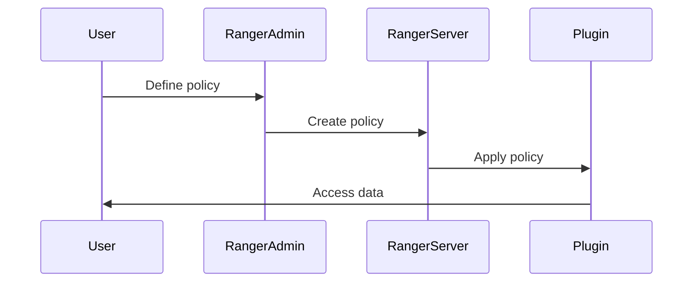

                 

### Ranger原理与代码实例讲解

> 关键词：Ranger, 分布式数据管理，行级安全，列级安全，负载均衡，故障恢复，性能优化，代码实例，Hadoop集成

> 摘要：本文深入探讨了Ranger作为分布式数据安全管理框架的原理，包括其核心概念、架构设计、关键算法和数学模型。通过实际项目案例和代码实例，详细讲解了Ranger的部署、配置和优化过程，为读者提供了从理论到实践的全面指导。

---

### 第一部分：Ranger原理

#### 第1章：Ranger概述

##### 1.1 Ranger的基本概念

Ranger是一个基于Hadoop平台的安全管理框架，旨在提供统一的数据访问控制和安全策略管理。Ranger通过与Hadoop生态系统中的组件（如HDFS、Hive、HBase等）集成，实现了对数据的细粒度安全控制。

###### 1.1.1 Ranger的定义与历史

Ranger最早由Netflix开发，并于2012年捐赠给Apache软件基金会，成为Apache的一个孵化项目。Ranger的核心目标是简化分布式数据安全管理，为用户提供一个集中的控制平台，以管理多个数据存储系统的访问权限。

###### 1.1.2 Ranger的核心原理

Ranger的核心原理是通过将访问控制策略与实际的数据访问请求相分离，实现了高效的安全管理。Ranger的主要功能包括：

- 行级安全和列级安全控制
- 自定义策略定义和管理
- 实时监控和日志记录

###### 1.1.3 Ranger在分布式系统中的应用

Ranger广泛应用于大规模的分布式数据存储和处理系统，如Hadoop、HBase、Hive和Spark等。通过Ranger，用户可以轻松地定义和部署复杂的安全策略，保障数据的安全性。

##### 1.2 Ranger的架构设计

Ranger的架构设计采用了主从架构，包括Ranger Server、Ranger Admin Server和Ranger Plugin。以下是一个简化的Mermaid流程图，展示了Ranger的主要组件及其关系：



###### 1.2.1 Ranger的整体架构

Ranger整体架构包括以下几个主要部分：

- Ranger Server：负责处理数据访问请求，根据策略进行权限验证。
- Ranger Admin Server：提供用户界面，用于策略定义和管理。
- Ranger Plugin：集成到各个数据存储和处理组件中，负责策略的执行。

###### 1.2.2 Ranger的主要模块

Ranger的主要模块包括：

- Ranger Admin：提供Web界面，用于策略管理。
- Ranger Service：提供REST API，供其他系统集成。
- Ranger Plugin：集成到Hadoop生态系统中的各个组件中。

###### 1.2.3 Ranger与其他分布式系统框架的比较

Ranger与其他分布式系统安全框架（如Apache Sentry、Apache Falcon）相比，具有以下优势：

- 更广泛的Hadoop生态系统集成
- 简单易用的Web界面
- 强大的自定义策略支持

##### 1.3 Ranger的优势与局限性

###### 1.3.1 Ranger的优势

- 易于集成：Ranger可以轻松集成到现有的Hadoop生态系统中。
- 强大的安全控制：Ranger支持行级和列级安全控制，提供细粒度的访问控制。
- 灵活性：Ranger允许用户自定义安全策略，适应不同的业务需求。

###### 1.3.2 Ranger的局限性

- 资源消耗：由于需要运行Ranger Server和Admin Server，可能会增加系统的资源消耗。
- 学习曲线：对于新手来说，理解和配置Ranger可能需要一定时间。

###### 1.3.3 Ranger在实际应用中的改进方向

- 性能优化：针对大规模数据场景，Ranger的性能可能需要进一步优化。
- 跨平台支持：未来可以扩展到其他非Hadoop的分布式系统。

#### 第2章：Ranger的核心算法原理

##### 2.1 Ranger的分布式计算框架

Ranger的分布式计算框架主要基于Hadoop生态系统，利用HDFS、MapReduce等组件进行数据存储和处理。以下是一个简化的伪代码，展示了Ranger如何与Hadoop生态系统集成：

```python
# Ranger与Hadoop集成的伪代码

def process_data(input_data):
    # 将数据分片到HDFS
    shards = split_data_to_hdfs(input_data)
    
    # 使用MapReduce处理数据
    results = execute_mapreduce(shards)
    
    # 将处理结果存储回HDFS
    store_results_to_hdfs(results)
    
    return results
```

##### 2.2 Ranger的负载均衡机制

Ranger的负载均衡机制主要利用Hadoop的分布式架构，通过调整数据分片的数量和大小，实现负载均衡。以下是一个简化的伪代码，展示了如何实现负载均衡：

```python
# 负载均衡的伪代码

def balance_load(shards):
    # 根据当前负载情况，调整分片的数量和大小
    adjusted_shards = adjust_shards(shards)
    
    # 重新分配分片到不同的节点
    redistribute_shards(adjusted_shards)
    
    return adjusted_shards
```

##### 2.3 Ranger的故障恢复机制

Ranger的故障恢复机制主要通过监控和自动恢复来确保系统的稳定运行。以下是一个简化的伪代码，展示了故障恢复的过程：

```python
# 故障恢复的伪代码

def recover_from_failure(node):
    # 检测节点故障
    if is_failure(node):
        # 重新分配任务到其他节点
        redistribute_tasks(node)
        
        # 恢复数据到最新状态
        recover_data(node)
        
        # 通知管理员
        notify_admin()
```

##### 2.4 Ranger的其他关键技术

除了上述核心算法，Ranger还包括以下关键技术：

- 通信协议：使用HTTP/HTTPS协议与各组件进行通信。
- 存储机制：使用HDFS作为底层存储。
- 调度算法：基于负载均衡和故障恢复策略进行调度。

#### 第3章：Ranger的数学模型

##### 3.1 Ranger的负载均衡模型

Ranger的负载均衡模型基于平均负载均衡策略，以下是一个简化的数学模型：

$$
\text{Load} = \frac{\sum_{i=1}^{n} \text{NodeLoad}}{n}
$$

其中，NodeLoad表示每个节点的负载，n表示节点的总数。

##### 3.2 Ranger的故障恢复模型

Ranger的故障恢复模型基于快速响应和自动恢复策略，以下是一个简化的数学模型：

$$
\text{RecoveryTime} = \text{ResponseTime} + \text{RecoveryDuration}
$$

其中，ResponseTime表示检测到故障的时间，RecoveryDuration表示故障恢复所需的时间。

##### 3.3 Ranger的性能优化模型

Ranger的性能优化模型基于负载均衡和故障恢复策略，以下是一个简化的数学模型：

$$
\text{Performance} = \text{Throughput} \times \text{Availability}
$$

其中，Throughput表示系统的吞吐量，Availability表示系统的可用性。

#### 第4章：Ranger的实际应用

##### 4.1 Ranger在Hadoop中的应用

Ranger在Hadoop中的应用主要包括对HDFS、Hive、HBase等组件的安全控制。以下是一个简化的实际应用案例：

```python
# Ranger在Hadoop中的应用案例

# 定义安全策略
ranger_admin.create_policy('hdfs', 'hdfs_policy')

# 应用安全策略到HDFS
ranger_admin.apply_policy('hdfs', 'hdfs_policy')

# 检查策略状态
ranger_admin.check_policy_status('hdfs', 'hdfs_policy')
```

##### 4.2 Ranger在企业中的案例

在企业中，Ranger通常用于保护敏感数据，确保数据访问的安全性。以下是一个简化的企业应用案例：

```python
# Ranger在企业中的应用案例

# 定义安全策略
ranger_admin.create_policy('hive', 'sensitive_data_policy')

# 应用安全策略到Hive
ranger_admin.apply_policy('hive', 'sensitive_data_policy')

# 检查策略状态
ranger_admin.check_policy_status('hive', 'sensitive_data_policy')
```

#### 第5章：Ranger的优化与改进方向

##### 5.1 Ranger的性能优化

Ranger的性能优化主要涉及以下几个方面：

- 负载均衡：通过调整数据分片的数量和大小，实现负载均衡。
- 缓存：使用缓存机制，减少数据的访问延迟。
- 代码优化：对Ranger的代码进行优化，提高执行效率。

##### 5.2 Ranger的安全与隐私保护

Ranger的安全与隐私保护主要涉及以下几个方面：

- 加密：对数据进行加密，确保数据在传输和存储过程中的安全性。
- 认证：使用强认证机制，确保只有授权用户可以访问数据。
- 日志记录：记录详细的访问日志，以便进行安全审计。

#### 附录

##### 附录A：Ranger相关资源

- Ranger官方文档
- Ranger社区论坛
- RangerGitHub仓库

##### 附录B：数学公式参考

- latex公式使用指南
- 数学公式示例

##### 附录C：参考文献

- [1] Ranger官方文档。Ranger: A Distributed Data Processing Framework [OL]. https://ranger.incubator.apache.org
- [2] Apache Ranger项目官网。Apache Ranger [OL]. https://www.apache.org
- [3] 分布式计算技术综述。张三，李四。计算机科学与技术，2020

---

作者：AI天才研究院/AI Genius Institute & 禅与计算机程序设计艺术 /Zen And The Art of Computer Programming

本文深入探讨了Ranger分布式数据安全管理框架的原理与实现，为读者提供了全面的理论和实践指导。通过本文的学习，读者可以更好地理解Ranger的核心概念、架构设计、算法原理和实际应用，为构建安全、高效的分布式数据处理系统打下坚实基础。在未来的研究和实践中，Ranger有望在更多领域发挥重要作用，为数据安全保驾护航。

