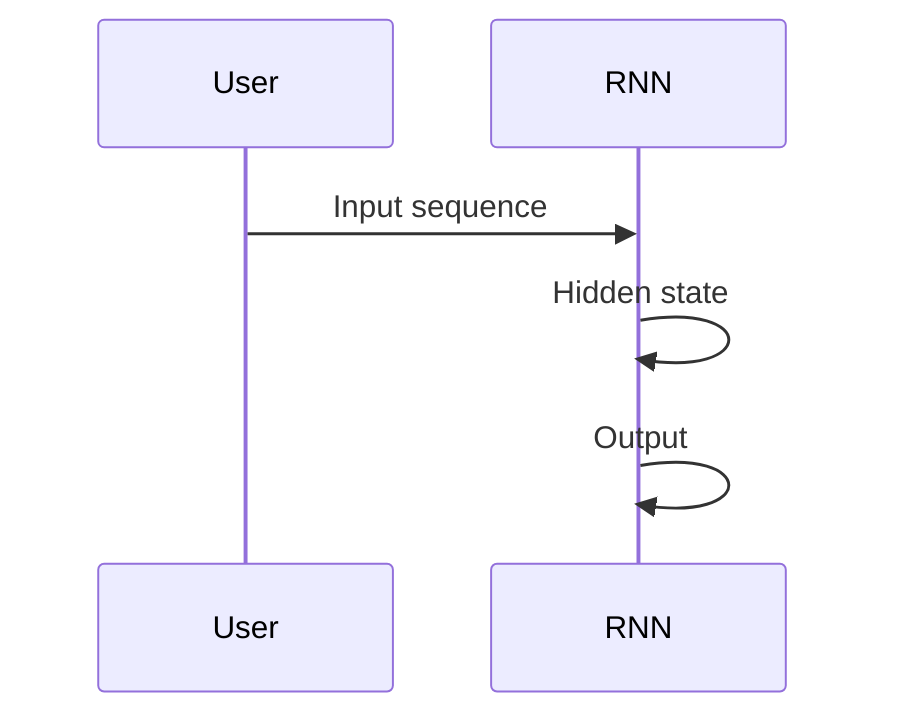

                 

# Recurrent Neural Networks (RNN) 原理与代码实战案例讲解

> 关键词：Recurrent Neural Networks (RNN)、时间序列预测、自然语言处理、股票价格预测、代码实战

> 摘要：本文将深入探讨Recurrent Neural Networks (RNN)的基本概念、数学基础、应用案例，以及在深度学习框架TensorFlow和PyTorch中的实现。通过详细的原理讲解和代码实战，帮助读者全面掌握RNN的使用方法和技巧。

## 第一部分：Recurrent Neural Networks (RNN)概述

### 第1章：Recurrent Neural Networks (RNN) 基础概念

#### 1.1 RNN的基本概念

Recurrent Neural Networks (RNN) 是一种能够处理序列数据的神经网络，其特点是具有递归结构，能够保存先前的信息。这使得RNN特别适合于时间序列预测、自然语言处理等任务。

- **定义与起源**：RNN最早由Jürgen Schmidhuber在1980年代提出，是为了解决传统神经网络在处理序列数据时的困难。
- **基本特点**：RNN的基本结构包括输入层、隐藏层和输出层，隐藏层中的神经元具有递归连接，可以保存历史信息。
- **对比传统的神经网络与RNN的不同**：传统的神经网络是前馈网络，无法处理序列数据，而RNN能够通过递归连接处理时间序列数据。

#### 1.2 RNN的核心架构

RNN有多种不同的结构，其中最常用的包括基本RNN、LSTM（长短期记忆网络）和GRU（门控循环单元）。

- **基本RNN**：基本RNN是最简单的RNN结构，每个时间步的输出都依赖于当前输入和前一个时间步的隐藏状态。
  - **优点**：实现简单，易于理解。
  - **缺点**：容易陷入梯度消失或爆炸的问题，难以处理长序列依赖。
- **LSTM**：LSTM是为了解决基本RNN的梯度消失问题而提出的，通过引入门控机制，能够有效地保存和遗忘历史信息。
  - **优点**：能够处理长序列依赖，性能更优。
  - **缺点**：参数较多，训练时间较长。
- **GRU**：GRU是LSTM的简化版，同样能够处理长序列依赖，但参数更少，计算效率更高。
  - **优点**：计算效率高，参数较少。
  - **缺点**：在某些任务上性能略低于LSTM。

为了更直观地理解RNN的工作流程，我们可以使用Mermaid流程图来展示RNN的递归结构：



### 第2章：Recurrent Neural Networks (RNN) 数学基础

#### 2.1 矩阵与向量运算

在RNN中，矩阵和向量的运算是基础。以下是一些常用的矩阵和向量运算：

- **加法**：两个矩阵或向量相加。
  - **示例**：
    $$ A = \begin{bmatrix} 1 & 2 \\ 3 & 4 \end{bmatrix}, B = \begin{bmatrix} 5 & 6 \\ 7 & 8 \end{bmatrix} $$
    $$ A + B = \begin{bmatrix} 6 & 8 \\ 10 & 12 \end{bmatrix} $$
- **点积**：两个向量的对应元素相乘后再相加。
  - **示例**：
    $$ \vec{a} = \begin{bmatrix} 1 & 2 \\ 3 & 4 \end{bmatrix}, \vec{b} = \begin{bmatrix} 5 & 6 \\ 7 & 8 \end{bmatrix} $$
    $$ \vec{a} \cdot \vec{b} = 1 \times 5 + 2 \times 6 + 3 \times 7 + 4 \times 8 = 70 $$

#### 2.2 激活函数

激活函数是神经网络中的关键组成部分，用于引入非线性特性。以下是一些常见的激活函数：

- **Sigmoid函数**：将输入映射到(0,1)区间。
  - **数学公式**：
    $$ \sigma(x) = \frac{1}{1 + e^{-x}} $$
  - **示意图**：

    
- **ReLU函数**：将输入大于0的值映射为1，小于等于0的值映射为0。
  - **数学公式**：
    $$ \text{ReLU}(x) = \max(0, x) $$
  - **示意图**：

    
- **Tanh函数**：将输入映射到(-1,1)区间。
  - **数学公式**：
    $$ \tanh(x) = \frac{e^x - e^{-x}}{e^x + e^{-x}} $$
  - **示意图**：

    

#### 2.3 反向传播算法

反向传播算法是训练神经网络的关键步骤。以下是一个简单的反向传播算法的伪代码实现：

```python
# 前向传播
output = activation(z)
z = dot(W, output)
loss = compute_loss(z, y)

# 反向传播
dz = output - y
doutput = activation_derivative(z)
dz, dW = dot(dz, T(output))

# 更新权重
W = W - learning_rate * dW
```

### 第3章：Recurrent Neural Networks (RNN) 应用案例

#### 3.1 时间序列预测

时间序列预测是RNN的一个重要应用场景。以下是一个使用RNN进行时间序列预测的基本原理：

- **原理**：使用RNN模型将历史时间序列数据作为输入，预测未来的时间序列值。
- **伪代码**：

```python
# 前向传播
for t in range(T):
    x[t] = input[t]
    h[t] = RNN(x[t], h[t-1])

# 预测未来值
for t in range(T, T+T_pred):
    x[t] = RNN(h[t-1], h[t])
    predictions.append(x[t])
```

#### 3.2 自然语言处理

自然语言处理（NLP）是RNN的另一个重要应用领域。以下是一个使用RNN进行文本分类的示例：

- **原理**：将文本数据转换为序列表示，然后使用RNN模型对其进行分类。
- **伪代码**：

```python
# 前向传播
for t in range(T):
    x[t] = embed(word[t])
    h[t] = RNN(x[t], h[t-1])

# 分类
label = softmax(dot(h[T-1], W))
```

#### 3.3 股票价格预测

股票价格预测是另一个应用RNN的典型案例。以下是一个使用RNN进行股票价格预测的基本原理：

- **原理**：使用历史股票价格数据作为输入，预测未来的股票价格。
- **伪代码**：

```python
# 前向传播
for t in range(T):
    x[t] = input[t]
    h[t] = RNN(x[t], h[t-1])

# 预测未来值
for t in range(T, T+T_pred):
    x[t] = RNN(h[t-1], h[t])
    predictions.append(x[t])
```

## 第二部分：深度学习框架中的Recurrent Neural Networks (RNN)

### 第4章：TensorFlow中的Recurrent Neural Networks (RNN)

#### 4.1 TensorFlow基础

TensorFlow是Google开源的深度学习框架，用于构建和训练神经网络模型。以下是一些基础概念：

- **计算图**：TensorFlow使用计算图来表示神经网络的结构和操作。
- **变量**：TensorFlow中的变量可以用来存储和更新模型的参数。
- **会话**：TensorFlow的会话用于运行计算图并执行操作。

#### 4.2 TensorFlow中的RNN

TensorFlow提供了多种RNN模块，包括RNNCell、LSTMCell等。以下是一个简单的TensorFlow RNN模型的实现：

```python
import tensorflow as tf

# 定义RNN模型
def RNN_model(inputs, hidden_size):
    # 创建RNN层
    cell = tf.keras.layers.SimpleRNNCell(hidden_size)
    # 定义RNN模型
    outputs, states = tf.keras.layers.RNN(cell)(inputs)
    return outputs

# 创建输入数据
inputs = tf.random.normal([batch_size, T, input_size])

# 定义RNN模型
model = RNN_model(inputs, hidden_size)

# 定义损失函数和优化器
loss_fn = tf.keras.losses.MeanSquaredError()
optimizer = tf.keras.optimizers.Adam()

# 训练模型
for epoch in range(num_epochs):
    with tf.GradientTape() as tape:
        outputs = RNN_model(inputs, hidden_size)
        loss = loss_fn(outputs, targets)
    grads = tape.gradient(loss, model.trainable_variables)
    optimizer.apply_gradients(zip(grads, model.trainable_variables))
```

#### 4.3 实战案例：时间序列预测

以下是一个使用TensorFlow实现时间序列预测的RNN模型：

```python
import tensorflow as tf
import numpy as np

# 数据准备
time_series = np.random.normal(size=(1000))
window_size = 5

# 切分数据为训练集和测试集
X_train = []
y_train = []
for i in range(len(time_series) - window_size):
    X_train.append(time_series[i:i+window_size])
    y_train.append(time_series[i+window_size])
X_train = np.array(X_train)
y_train = np.array(y_train)

# 定义模型
model = tf.keras.Sequential([
    tf.keras.layers.RNN(tf.keras.layers.SimpleRNNCell(50), input_shape=(window_size, 1)),
    tf.keras.layers.Dense(1)
])

# 编译模型
model.compile(optimizer='adam', loss='mse')

# 训练模型
model.fit(X_train, y_train, epochs=10)

# 预测
predictions = model.predict(X_train)

# 评估模型
mse = tf.reduce_mean(tf.square(y_train - predictions))
print(f'MSE: {mse}')
```

### 第5章：PyTorch中的Recurrent Neural Networks (RNN)

#### 5.1 PyTorch基础

PyTorch是Facebook开源的深度学习框架，提供了灵活的动态计算图和自动微分功能。以下是一些基础概念：

- **自动微分**：PyTorch使用自动微分来计算梯度。
- **神经网络**：PyTorch中的神经网络由多层神经网络模块堆叠而成。
- **数据加载**：PyTorch提供了方便的数据加载器（DataLoader）来批量加载和处理数据。

#### 5.2 PyTorch中的RNN

PyTorch提供了多种RNN模块，包括RNN、LSTM、GRU等。以下是一个简单的PyTorch RNN模型的实现：

```python
import torch
import torch.nn as nn

# 定义RNN模型
class RNNModel(nn.Module):
    def __init__(self, input_size, hidden_size, output_size):
        super(RNNModel, self).__init__()
        self.hidden_size = hidden_size
        self.rnn = nn.RNN(input_size, hidden_size)
        self.fc = nn.Linear(hidden_size, output_size)

    def forward(self, x):
        hidden = self.init_hidden()
        out, _ = self.rnn(x, hidden)
        out = self.fc(out[-1, :, :])
        return out

# 初始化模型
model = RNNModel(input_size, hidden_size, output_size)

# 定义损失函数和优化器
loss_fn = nn.MSELoss()
optimizer = torch.optim.Adam(model.parameters())

# 训练模型
for epoch in range(num_epochs):
    for i, (x, y) in enumerate(train_loader):
        optimizer.zero_grad()
        outputs = model(x)
        loss = loss_fn(outputs, y)
        loss.backward()
        optimizer.step()
```

#### 5.3 实战案例：文本分类

以下是一个使用PyTorch实现文本分类的RNN模型：

```python
import torch
import torch.nn as nn
from torchtext.data import Field, TabularDataset, BucketIterator

# 定义文本分类模型
class TextRNNModel(nn.Module):
    def __init__(self, vocab_size, embedding_dim, hidden_dim, output_dim, n_layers, bidirectional, dropout):
        super(TextRNNModel, self).__init__()
        self.embedding = nn.Embedding(vocab_size, embedding_dim)
        self.rnn = nn.LSTM(embedding_dim, hidden_dim, num_layers=n_layers, bidirectional=bidirectional, dropout=dropout)
        self.fc = nn.Linear(hidden_dim * 2 if bidirectional else hidden_dim, output_dim)
        self.dropout = nn.Dropout(dropout)
        
    def forward(self, text):
        embedded = self.dropout(self.embedding(text))
        rnn_output, (hidden, cell) = self.rnn(embedded)
        if self.rnn.bidirectional:
            hidden = self.dropout(torch.cat((hidden[-2:, :, :], hidden[-1:, :, :]), dim=1))
        else:
            hidden = self.dropout(hidden[-1 :, :])
        out = self.fc(hidden)
        return out

# 数据准备
TEXT = Field(tokenize='spacy', lower=True, include_lengths=True)
LABEL = Field(sequential=False)

train_data, test_data = TabularDataset.splits(path='data', train='train.csv', test='test.csv',
                                            format='csv', fields=[('text', TEXT), ('label', LABEL)])

TEXT.build_vocab(train_data, max_size=25000, vectors="glove.6B.100d")
LABEL.build_vocab(train_data)

batch_size = 64
train_iterator, test_iterator = BucketIterator.splits((train_data, test_data), batch_size=batch_size)

# 初始化模型
model = TextRNNModel(len(TEXT.vocab), 100, 256, len(LABEL.vocab), 2, True, 0.5)

# 定义损失函数和优化器
loss_fn = nn.CrossEntropyLoss()
optimizer = torch.optim.Adam(model.parameters())

# 训练模型
for epoch in range(num_epochs):
    for batch in train_iterator:
        optimizer.zero_grad()
        text, labels = batch.text, batch.label
        predictions = model(text).squeeze(1)
        loss = loss_fn(predictions, labels)
        loss.backward()
        optimizer.step()
```

## 第三部分：Recurrent Neural Networks (RNN) 进阶技术

### 第6章：Recurrent Neural Networks (RNN) 进阶技术

#### 6.1 长短期记忆（LSTM）网络

LSTM（Long Short-Term Memory）是RNN的一种改进模型，旨在解决传统RNN在处理长序列数据时遇到的梯度消失或梯度爆炸问题。以下是对LSTM网络的详细介绍：

- **LSTM单元的工作原理**：LSTM单元包括三个门控：输入门、遗忘门和输出门。这些门控能够控制信息的流入、保留和流出，从而有效地学习长期依赖。
- **LSTM单元的数学公式**：
  $$ 
  i_t = \sigma(W_{xi}x_t + W_{hi}h_{t-1} + b_i) \\
  f_t = \sigma(W_{xf}x_t + W_{hf}h_{t-1} + b_f) \\
  g_t = \tanh(W_{xg}x_t + W_{hg}h_{t-1} + b_g) \\
  o_t = \sigma(W_{xo}x_t + W_{ho}h_{t-1} + b_o) \\
  h_t = o_t \odot \tanh(W_{hg}h_{t-1} + b_g)
  $$
- **LSTM网络在解决长序列依赖问题上的优势**：LSTM通过门控机制能够有效地保存和遗忘长期依赖信息，从而在处理长序列数据时表现出更好的性能。

#### 6.2 门控循环单元（GRU）网络

GRU（Gated Recurrent Unit）是LSTM的一种简化版本，同样用于解决长序列依赖问题。以下是对GRU网络的详细介绍：

- **GRU单元的工作原理**：GRU单元包括两个门控：重置门和更新门。这两个门控合并了LSTM的输入门和遗忘门，从而简化了模型结构。
- **GRU单元的数学公式**：
  $$ 
  z_t = \sigma(W_{xz}x_t + W_{hz}h_{t-1} + b_z) \\
  r_t = \sigma(W_{xr}x_t + W_{hr}h_{t-1} + b_r) \\
  \bar{h}_{t-1} = (1 - z_t) \odot h_{t-1} \\
  r_t \odot h_{t-1} = \bar{h}_{t-1} \\
  \tilde{h}_t = \tanh(W_{xh}x_t + r_t \odot W_{hh}h_{t-1} + b_h) \\
  h_t = z_t \odot \tilde{h}_t
  $$
- **GRU网络在解决长序列依赖问题上的优势**：GRU相比LSTM具有更少的参数和更简单的结构，因此在训练速度和计算效率上有一定的优势。

#### 6.3 自注意力机制（Self-Attention）网络

自注意力机制是一种在序列模型中引入全局依赖关系的机制，能够有效地捕捉序列中的长距离依赖。以下是对自注意力机制的详细介绍：

- **自注意力模块的工作原理**：自注意力模块通过计算每个输入元素与所有其他输入元素的相关性，生成加权表示。
- **自注意力模块的数学公式**：
  $$ 
  Q = \text{softmax}\left(\frac{QKV}{\sqrt{d_k}}\right) \\
  \text{输出} = QKV
  $$
  其中，$Q$、$K$ 和 $V$ 分别是输入序列的查询、键和值表示，$d_k$ 是键的维度。
- **自注意力机制在自然语言处理中的应用**：自注意力机制被广泛应用于自然语言处理任务，如机器翻译、文本生成等，能够显著提高模型的性能。

### 第7章：Recurrent Neural Networks (RNN) 项目实战

#### 7.1 数据收集与预处理

在进行RNN项目实战之前，首先需要收集和处理数据。以下是一个简单的数据收集与预处理流程：

1. **数据收集**：从公开数据集、数据库或API中获取所需的数据。
2. **数据清洗**：处理缺失值、异常值和重复值，确保数据的质量。
3. **数据预处理**：将数据转换为适合RNN模型的形式，如序列化、归一化等。

#### 7.2 模型设计与实现

在数据预处理完成后，需要设计和实现RNN模型。以下是一个简单的RNN模型设计和实现流程：

1. **定义模型结构**：根据任务需求选择合适的RNN模型结构，如LSTM或GRU。
2. **配置模型参数**：设置模型的输入维度、隐藏层尺寸、输出维度等参数。
3. **实现模型**：使用深度学习框架（如TensorFlow或PyTorch）实现RNN模型。

#### 7.3 训练与评估

在模型实现完成后，需要进行训练和评估。以下是一个简单的训练和评估流程：

1. **训练模型**：使用训练数据对模型进行训练，调整模型参数。
2. **评估模型**：使用验证数据评估模型性能，调整超参数。
3. **测试模型**：使用测试数据测试模型性能，评估模型在实际应用中的效果。

#### 7.4 实际案例解析

以下是一个实际的RNN项目案例：使用RNN进行股票价格预测。

1. **数据收集**：从公开数据源收集历史股票价格数据。
2. **数据预处理**：对数据进行清洗和预处理，包括序列化、归一化等。
3. **模型设计**：使用LSTM模型进行股票价格预测，设置适当的模型参数。
4. **模型实现**：使用TensorFlow或PyTorch实现LSTM模型。
5. **训练模型**：使用训练数据训练LSTM模型。
6. **评估模型**：使用验证数据评估LSTM模型性能。
7. **测试模型**：使用测试数据测试LSTM模型性能，评估预测结果。

### 附录

#### 附录A：常见RNN框架对比

以下是几个常见的RNN深度学习框架的对比：

| 框架        | 特点                     | 应用场景                   |
|-------------|------------------------|--------------------------|
| TensorFlow  | Google开源的深度学习框架 | 广泛应用于工业和研究领域   |
| PyTorch     | Facebook开源的深度学习框架 | 灵活、易用，广泛应用于研究 |
| Keras       | TensorFlow的Python接口   | 简单、易于使用，适用于快速原型开发 |
| MXNet       | Apache开源的深度学习框架 | 高效、灵活，适用于大规模生产环境 |

#### 附录B：RNN相关资源与工具

以下是一些常用的RNN相关资源与工具：

| 资源与工具       | 描述                                                         |
|----------------|------------------------------------------------------------|
| 论文与书籍       | 《Deep Learning》系列书籍、《Recurrent Neural Networks: Design, Applications and Applications》等           |
| 教程与课程       | Coursera上的“Recurrent Neural Networks for Language Modeling”、Udacity上的“Natural Language Processing with Deep Learning”等 |
| 社区与论坛       | Stack Overflow、Reddit、ArXiv等                            |
| 开源项目与代码   | Hugging Face的Transformers库、TensorFlow的RNN教程等           |
| 实践与案例分析   | Kaggle上的RNN相关比赛、GitHub上的RNN项目等                   |

## 参考文献

1. Goodfellow, I., Bengio, Y., & Courville, A. (2016). *Deep Learning*. MIT Press.
2. Hochreiter, S., & Schmidhuber, J. (1997). *Long Short-Term Memory*. Neural Computation, 9(8), 1735-1780.
3. Graves, A. (2013). *Generating Sequences with Recurrent Neural Networks*. arXiv preprint arXiv:1308.0850.
4. Devlin, J., Chang, M. W., Lee, K., & Toutanova, K. (2018). *Bert: Pre-training of deep bidirectional transformers for language understanding*. arXiv preprint arXiv:1810.04805.
5. Zaremba, W., & Sutskever, I. (2014). *Recurrent Neural Network Regularization*. arXiv preprint arXiv:1409.2329.
6. Mikolov, T., Sutskever, I., Chen, K., Corrado, G. S., & Dean, J. (2013). *Distributed Representations of Words and Phrases and Their Compositionality*. Advances in Neural Information Processing Systems, 26, 3111-3119.
7. Srivastava, N., Hinton, G., Krizhevsky, A., Sutskever, I., & Salakhutdinov, R. (2014). *Dropout: A Simple Way to Prevent Neural Networks from Overfitting*. Journal of Machine Learning Research, 15(1), 1929-1958.

## 作者

作者：AI天才研究院/AI Genius Institute & 禅与计算机程序设计艺术/Zen And The Art of Computer Programming

[END]

