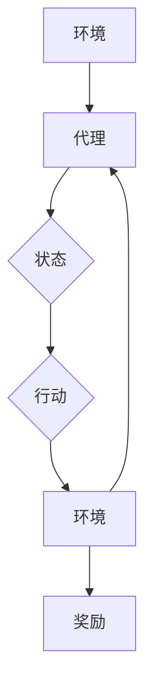

                 

# 文章标题：强化学习原理与代码实例讲解

> 关键词：强化学习，Q-Learning，DQN，深度强化学习，应用实例，自动驾驶，机器人控制

> 摘要：本文将深入探讨强化学习的基本原理、核心算法以及其在现实世界中的应用。通过详细的代码实例讲解，读者将能够理解强化学习的实际应用，掌握构建和优化强化学习模型的方法。

#### 第一部分：强化学习基础理论

### 第1章：强化学习概述

#### 1.1 强化学习的定义与基本概念

强化学习是一种通过不断试错来学习最优策略的人工智能方法。在强化学习中，智能体（Agent）通过与环境的交互来学习如何获取最大的累积奖励。强化学习包含以下几个核心组成部分：

- **智能体（Agent）**：执行动作、感知环境的主体。
- **环境（Environment）**：智能体所处的情景，提供状态和奖励。
- **状态（State）**：智能体在环境中的一个特定情况。
- **行动（Action）**：智能体可以采取的行为。
- **奖励（Reward）**：智能体在执行某个动作后从环境中获得的即时反馈。

#### 1.1.1 强化学习的核心组成部分

强化学习的核心组成部分可以通过Mermaid流程图来展示：



#### 1.1.2 强化学习与传统机器学习比较

与传统的机器学习方法不同，强化学习不仅依赖于数据和模型，还涉及到与环境的交互。传统机器学习方法通常是在已有数据集上进行训练，而强化学习则是在一个动态变化的互动环境中进行学习。

- **数据依赖性**：传统机器学习依赖大量标注数据，而强化学习则通过奖励信号进行学习。
- **目标导向性**：传统机器学习目标是最大化预测准确率，而强化学习目标是最大化累积奖励。

### 第2章：强化学习的代理模型

强化学习的代理模型主要包括值函数方法和策略梯度方法。

#### 2.1 值函数方法

值函数方法旨在估计智能体在当前状态下采取最优动作所能获得的期望回报。值函数分为状态值函数和动作值函数：

- **状态值函数 \( V(s) \)**：表示在状态 \( s \) 下采取最优策略所能获得的累积回报。
- **动作值函数 \( Q(s, a) \)**：表示在状态 \( s \) 下采取动作 \( a \) 所能获得的累积回报。

#### 2.2 策略梯度方法

策略梯度方法直接优化策略本身，以最大化累积奖励。策略梯度方法包括以下几个算法：

- **策略评估**：使用当前策略评估状态值函数或动作值函数。
- **策略迭代**：使用评估结果更新策略，不断迭代以优化策略。

### 第3章：强化学习中的探索与利用

#### 3.1 探索策略

探索策略是指智能体在决策过程中采取一定程度的随机性，以避免陷入局部最优。常见的探索策略包括：

- **ε-贪心策略**：以概率 \( 1-\epsilon \) 采取贪婪策略，以概率 \( \epsilon \) 采取随机策略。
- **UCB算法**：基于置信区间进行探索，以平衡探索和利用。

#### 3.2 利用策略

利用策略是指智能体在决策过程中充分利用已有经验，以最大化累积奖励。常见的利用策略包括：

- **贪婪策略**：在当前状态下选择具有最大回报的动作。
- **确定性策略**：智能体始终选择相同的动作。

### 第4章：强化学习的基本算法

强化学习的基本算法包括Q-Learning、SARSA和Deep Q Network (DQN)。

#### 4.1 Q-Learning算法

Q-Learning算法是一种基于值函数的强化学习算法，旨在通过迭代更新动作值函数来学习最优策略。Q-Learning算法的伪代码如下：

```python
# 初始化 Q(s,a) 为任意值
Q = initialize_Q()

# 设置学习率 α 和折扣因子 γ
alpha = 0.1
gamma = 0.9

# 设置迭代次数
num_episodes = 1000

for episode in range(num_episodes):
    # 初始化环境
    state = environment.reset()
    
    done = False
    
    while not done:
        # 选择动作
        action = choose_action(state, Q)
        
        # 执行动作，得到新的状态和奖励
        next_state, reward, done = environment.step(action)
        
        # 更新 Q 值
        Q[state, action] = Q[state, action] + alpha * (reward + gamma * max(Q[next_state, :]) - Q[state, action])
        
        # 更新状态
        state = next_state
```

#### 4.2 SARSA算法

SARSA算法是一种基于策略的强化学习算法，旨在同时更新状态-动作值函数。SARSA算法的伪代码如下：

```python
# 初始化 Q(s,a) 为任意值
Q = initialize_Q()

# 设置学习率 α 和折扣因子 γ
alpha = 0.1
gamma = 0.9

# 设置迭代次数
num_episodes = 1000

for episode in range(num_episodes):
    # 初始化环境
    state = environment.reset()
    
    done = False
    
    while not done:
        # 执行动作，得到新的状态和奖励
        action, next_state, reward, done = environment.step(state)
        
        # 更新 Q 值
        Q[state, action] = Q[state, action] + alpha * (reward + gamma * Q[next_state, action] - Q[state, action])
        
        # 更新状态
        state = next_state
```

#### 4.3 Deep Q Network (DQN)

DQN算法是一种基于深度学习的强化学习算法，旨在解决传统Q-Learning算法在处理高维状态空间时效果不佳的问题。DQN算法的核心思想是使用深度神经网络来近似动作值函数。DQN算法的伪代码如下：

```python
# 初始化 Q(s,a) 为任意值
Q = initialize_Q()

# 设置学习率 α 和折扣因子 γ
alpha = 0.1
gamma = 0.9

# 设置迭代次数
num_episodes = 1000

# 初始化经验回放缓冲区
buffer = ExperienceBuffer()

for episode in range(num_episodes):
    # 初始化环境
    state = environment.reset()
    
    done = False
    
    while not done:
        # 选择动作
        action = choose_action(state, Q)
        
        # 执行动作，得到新的状态和奖励
        next_state, reward, done = environment.step(action)
        
        # 存储经验
        buffer.addExperience(state, action, reward, next_state, done)
        
        # 从经验回放缓冲区中采样一批经验
        batch = buffer.sampleBatch(batch_size)
        
        # 更新 Q 值
        Q.updateBatch(batch, alpha, gamma)
        
        # 更新状态
        state = next_state
```

#### 第二部分：强化学习算法与优化

### 第5章：深度强化学习算法

深度强化学习（Deep Reinforcement Learning，DRL）是强化学习领域的一个重要分支，它将深度神经网络应用于强化学习问题，以解决高维状态空间和动作空间的问题。这一部分将介绍深度强化学习的基本概念、算法以及优化方法。

#### 5.1 深度强化学习概述

深度强化学习面临的主要挑战包括：

- **状态和动作空间的维度较高**：传统的Q-Learning和策略梯度方法在处理高维状态和动作空间时效率较低。
- **样本效率低下**：深度强化学习算法通常需要大量的样本来收敛，这会导致训练时间较长。

为了解决这些挑战，深度强化学习提出了一系列优化方法，包括：

- **值函数方法**：如Deep Q Network (DQN)、Dueling DQN和Deep Deterministic Policy Gradient (DDPG)。
- **策略梯度方法**：如Asynchronous Advantage Actor-Critic (A3C)、Proximal Policy Optimization (PPO)和Trust Region Policy Optimization (TRPO)。

#### 5.2 基于值函数的深度强化学习

基于值函数的深度强化学习算法通过神经网络来近似值函数，从而提高样本效率。以下介绍几种常见的基于值函数的深度强化学习算法：

##### 5.2.1 Deep Q Network (DQN)

DQN算法是深度强化学习的一个经典算法，它使用深度神经网络来近似动作值函数。DQN算法的核心思想是使用经验回放缓冲区来避免策略偏差，并使用固定目标网络来稳定训练过程。

DQN算法的伪代码如下：

```python
# 初始化 Q(s,a) 为任意值
Q = initialize_Q()

# 设置学习率 α 和折扣因子 γ
alpha = 0.1
gamma = 0.9

# 设置迭代次数
num_episodes = 1000

# 初始化经验回放缓冲区
buffer = ExperienceBuffer()

for episode in range(num_episodes):
    # 初始化环境
    state = environment.reset()
    
    done = False
    
    while not done:
        # 选择动作
        action = choose_action(state, Q)
        
        # 执行动作，得到新的状态和奖励
        next_state, reward, done = environment.step(action)
        
        # 存储经验
        buffer.addExperience(state, action, reward, next_state, done)
        
        # 从经验回放缓冲区中采样一批经验
        batch = buffer.sampleBatch(batch_size)
        
        # 更新 Q 值
        Q.updateBatch(batch, alpha, gamma)
        
        # 更新状态
        state = next_state
```

##### 5.2.2 Dueling DQN

Dueling DQN是对DQN算法的改进，它通过将值函数拆分为状态值函数和优势值函数，从而提高了模型的稳定性和性能。

Dueling DQN的神经网络结构如下：

- **状态值函数 \( V(s) \)**：计算每个动作的期望回报。
- **优势值函数 \( A(s, a) \)**：计算每个动作的相对优势。

Dueling DQN的伪代码如下：

```python
# 初始化 Q(s,a) 为任意值
Q = initialize_Q()

# 设置学习率 α 和折扣因子 γ
alpha = 0.1
gamma = 0.9

# 设置迭代次数
num_episodes = 1000

# 初始化经验回放缓冲区
buffer = ExperienceBuffer()

for episode in range(num_episodes):
    # 初始化环境
    state = environment.reset()
    
    done = False
    
    while not done:
        # 选择动作
        action = choose_action(state, Q)
        
        # 执行动作，得到新的状态和奖励
        next_state, reward, done = environment.step(action)
        
        # 存储经验
        buffer.addExperience(state, action, reward, next_state, done)
        
        # 从经验回放缓冲区中采样一批经验
        batch = buffer.sampleBatch(batch_size)
        
        # 更新 Q 值
        Q.updateBatch(batch, alpha, gamma)
        
        # 更新状态
        state = next_state
```

##### 5.2.3 Deep Deterministic Policy Gradient (DDPG)

DDPG算法是基于策略的深度强化学习算法，它使用深度神经网络来近似策略函数，并通过经验回放缓冲区来避免策略偏差。DDPG算法的核心思想是使用目标网络来稳定训练过程。

DDPG算法的神经网络结构如下：

- **策略网络 \( \pi(s) \)**：使用深度神经网络来近似策略函数。
- **目标网络 \( \mu(s) \)**：使用策略网络来计算目标值。

DDPG算法的伪代码如下：

```python
# 初始化策略网络和目标网络
policy_network = initialize_policy_network()
target_network = initialize_target_network()

# 设置学习率 α 和折扣因子 γ
alpha = 0.1
gamma = 0.9

# 设置迭代次数
num_episodes = 1000

# 初始化经验回放缓冲区
buffer = ExperienceBuffer()

for episode in range(num_episodes):
    # 初始化环境
    state = environment.reset()
    
    done = False
    
    while not done:
        # 选择动作
        action = policy_network.predict(state)
        
        # 执行动作，得到新的状态和奖励
        next_state, reward, done = environment.step(action)
        
        # 存储经验
        buffer.addExperience(state, action, reward, next_state, done)
        
        # 从经验回放缓冲区中采样一批经验
        batch = buffer.sampleBatch(batch_size)
        
        # 更新策略网络
        policy_network.update(batch, alpha, gamma)
        
        # 更新目标网络
        update_target_network(policy_network, target_network)
        
        # 更新状态
        state = next_state
```

#### 5.3 基于策略的深度强化学习

基于策略的深度强化学习算法直接优化策略函数，以最大化累积奖励。以下介绍几种常见的基于策略的深度强化学习算法：

##### 5.3.1 Asynchronous Advantage Actor-Critic (A3C)

A3C算法是一种基于策略的深度强化学习算法，它使用多个智能体同时训练，以提高样本效率。A3C算法的核心思想是使用异步策略梯度更新和优势值函数。

A3C算法的神经网络结构如下：

- **策略网络 \( \pi(s) \)**：使用深度神经网络来近似策略函数。
- **优势值函数 \( A(s, a) \)**：计算每个动作的相对优势。

A3C算法的伪代码如下：

```python
# 初始化策略网络和优势网络
policy_network = initialize_policy_network()
advantage_network = initialize_advantage_network()

# 设置学习率 α 和折扣因子 γ
alpha = 0.1
gamma = 0.9

# 设置迭代次数
num_episodes = 1000

for episode in range(num_episodes):
    # 初始化环境
    state = environment.reset()
    
    done = False
    
    while not done:
        # 选择动作
        action = policy_network.predict(state)
        
        # 执行动作，得到新的状态和奖励
        next_state, reward, done = environment.step(action)
        
        # 计算优势值
        advantage = advantage_network.predict(next_state) - advantage_network.predict(state)
        
        # 更新策略网络
        policy_network.update(state, action, reward, advantage, alpha, gamma)
        
        # 更新优势网络
        advantage_network.update(next_state, done)
        
        # 更新状态
        state = next_state
```

##### 5.3.2 Proximal Policy Optimization (PPO)

PPO算法是一种基于策略的深度强化学习算法，它使用近端策略优化（Proximal Policy Optimization）来稳定训练过程。PPO算法的核心思想是使用两个策略网络和优势值函数。

PPO算法的神经网络结构如下：

- **策略网络 \( \pi(s) \)**：使用深度神经网络来近似策略函数。
- **优势值函数 \( A(s, a) \)**：计算每个动作的相对优势。

PPO算法的伪代码如下：

```python
# 初始化策略网络和优势网络
policy_network = initialize_policy_network()
advantage_network = initialize_advantage_network()

# 设置学习率 α 和折扣因子 γ
alpha = 0.1
gamma = 0.9

# 设置迭代次数
num_episodes = 1000

for episode in range(num_episodes):
    # 初始化环境
    state = environment.reset()
    
    done = False
    
    while not done:
        # 选择动作
        action = policy_network.predict(state)
        
        # 执行动作，得到新的状态和奖励
        next_state, reward, done = environment.step(action)
        
        # 计算优势值
        advantage = advantage_network.predict(next_state) - advantage_network.predict(state)
        
        # 更新策略网络
        policy_network.update(state, action, reward, advantage, alpha, gamma)
        
        # 更新优势网络
        advantage_network.update(next_state, done)
        
        # 更新状态
        state = next_state
```

##### 5.3.3 Trust Region Policy Optimization (TRPO)

TRPO算法是一种基于策略的深度强化学习算法，它使用信任区域优化（Trust Region Policy Optimization）来稳定训练过程。TRPO算法的核心思想是使用两个策略网络和优势值函数。

TRPO算法的神经网络结构如下：

- **策略网络 \( \pi(s) \)**：使用深度神经网络来近似策略函数。
- **优势值函数 \( A(s, a) \)**：计算每个动作的相对优势。

TRPO算法的伪代码如下：

```python
# 初始化策略网络和优势网络
policy_network = initialize_policy_network()
advantage_network = initialize_advantage_network()

# 设置学习率 α 和折扣因子 γ
alpha = 0.1
gamma = 0.9

# 设置迭代次数
num_episodes = 1000

for episode in range(num_episodes):
    # 初始化环境
    state = environment.reset()
    
    done = False
    
    while not done:
        # 选择动作
        action = policy_network.predict(state)
        
        # 执行动作，得到新的状态和奖励
        next_state, reward, done = environment.step(action)
        
        # 计算优势值
        advantage = advantage_network.predict(next_state) - advantage_network.predict(state)
        
        # 更新策略网络
        policy_network.update(state, action, reward, advantage, alpha, gamma)
        
        # 更新优势网络
        advantage_network.update(next_state, done)
        
        # 更新状态
        state = next_state
```

#### 第三部分：强化学习应用实例

### 第6章：强化学习在游戏中的应用

强化学习在游戏领域有广泛的应用，其中最具代表性的应用包括游戏AI和游戏自动化。这一章将介绍强化学习在游戏中的应用，包括游戏环境构建、经典游戏强化学习实例以及游戏AI实战。

#### 6.1 游戏强化学习基础

游戏强化学习的基础包括游戏环境的构建、状态空间的定义、动作空间的定义以及奖励函数的设计。

- **游戏环境构建**：游戏环境通常使用OpenAI Gym等工具构建。OpenAI Gym提供了一个统一的接口，用于定义游戏环境和评估智能体的表现。
- **状态空间**：状态空间是游戏智能体需要感知的环境信息，如游戏地图、玩家位置、敌方位置等。
- **动作空间**：动作空间是智能体可以执行的动作，如移动、攻击、防御等。
- **奖励函数**：奖励函数定义了智能体在游戏中的表现，通常是根据游戏的胜负、得分、生存时间等因素来设计。

#### 6.2 经典游戏强化学习实例

强化学习在许多经典游戏中都有成功应用，以下介绍两个经典游戏强化学习实例：

##### 6.2.1 反卷轴游戏中的DQN应用

反卷轴游戏（如《超级马里奥》）是一个典型的强化学习应用场景。在这个例子中，智能体需要通过探索和试错来学习如何达到终点。

- **游戏环境**：使用OpenAI Gym构建《超级马里奥》环境。
- **状态空间**：包括当前地图、马里奥的位置、敌人位置等。
- **动作空间**：包括移动、跳跃、射击等。
- **奖励函数**：在达到终点时给予正奖励，在碰撞或死亡时给予负奖励。

##### 6.2.2 星际争霸2中的RL应用

星际争霸2（StarCraft II）是一个复杂的高维游戏，其强化学习应用涉及多个智能体之间的协作和对抗。

- **游戏环境**：使用OpenAI Gym的StarCraft II环境。
- **状态空间**：包括单位位置、资源分布、地图信息等。
- **动作空间**：包括建造建筑、训练单位、攻击等。
- **奖励函数**：根据游戏进程和胜负给予奖励。

#### 6.3 游戏AI实战

游戏AI实战包括游戏AI开发环境的搭建、游戏AI代码实现和调试。

- **开发环境搭建**：在开发环境中安装OpenAI Gym和相关依赖库。
- **游戏AI代码实现**：根据游戏环境和需求设计智能体的策略和网络结构，实现游戏AI的代码。
- **调试和优化**：通过模拟和评估智能体的性能，调试和优化游戏AI的代码。

#### 6.3.1 游戏AI开发环境搭建

以下是一个简单的游戏AI开发环境搭建示例：

```bash
# 安装Anaconda
conda create -n game_ai python=3.8
conda activate game_ai

# 安装依赖库
conda install -c conda-forge gym
pip install tensorflow numpy

# 验证安装
python -c "import gym; print(gym.__version__)"
```

#### 6.3.2 游戏AI代码实现与调试

以下是一个简单的游戏AI实现示例：

```python
import gym
import numpy as np
from tensorflow.keras.models import Sequential
from tensorflow.keras.layers import Dense

# 创建环境
env = gym.make('CartPole-v0')

# 初始化DQN网络
input_shape = env.observation_space.shape
action_space = env.action_space.n
model = Sequential()
model.add(Dense(64, input_shape=input_shape, activation='relu'))
model.add(Dense(64, activation='relu'))
model.add(Dense(action_space, activation='linear'))

# 编译模型
model.compile(optimizer='adam', loss='mse')

# 训练模型
num_episodes = 1000
for episode in range(num_episodes):
    state = env.reset()
    done = False
    total_reward = 0
    
    while not done:
        # 预测动作
        action = model.predict(state).argmax()
        
        # 执行动作
        next_state, reward, done, _ = env.step(action)
        
        # 更新状态
        state = next_state
        
        # 更新奖励
        total_reward += reward
        
    # 打印总奖励
    print(f"Episode {episode}: Total Reward = {total_reward}")

# 评估模型
state = env.reset()
done = False
while not done:
    action = model.predict(state).argmax()
    next_state, reward, done, _ = env.step(action)
    state = next_state
print(f"Test Reward: {total_reward}")
```

#### 第四部分：强化学习在实际项目中的应用

### 第7章：强化学习在自动驾驶中的应用

自动驾驶是强化学习在现实世界中的重要应用之一。在这一章中，我们将探讨强化学习在自动驾驶中的应用，包括自动驾驶概述、强化学习在自动驾驶中的应用、自动驾驶强化学习项目实例以及项目评估与优化。

#### 7.1 自动驾驶概述

自动驾驶是指利用计算机技术和人工智能技术实现车辆自主驾驶的技术。自动驾驶系统通常包括以下几个关键组成部分：

- **传感器**：用于感知车辆周围环境，如摄像头、激光雷达、雷达等。
- **感知模块**：用于处理传感器数据，提取有用的信息，如车辆位置、速度、道路状况等。
- **规划模块**：用于根据感知模块提供的信息规划车辆的行驶路径，包括路径规划、速度控制、转向控制等。
- **控制模块**：根据规划模块的指令控制车辆的运动。

#### 7.2 强化学习在自动驾驶中的应用

强化学习在自动驾驶中的应用主要体现在以下几个方面：

- **路径规划**：使用强化学习算法规划车辆的行驶路径，以提高行驶效率和安全性。
- **行为预测**：通过强化学习预测其他车辆和行人的行为，以便更好地进行路径规划和避障。
- **控制策略**：使用强化学习算法优化车辆的转向、加速和减速等控制策略。

#### 7.3 自动驾驶强化学习项目实例

以下是一个简单的自动驾驶强化学习项目实例，使用DQN算法进行路径规划。

##### 7.3.1 自动驾驶环境构建

我们使用OpenAI Gym构建自动驾驶环境，该环境模拟了一个简单的交通场景。

```python
import gym
import numpy as np
from tensorflow.keras.models import Sequential
from tensorflow.keras.layers import Dense

# 创建环境
env = gym.make('Taxi-v3')

# 定义状态空间和动作空间
state_space = env.observation_space.shape
action_space = env.action_space.n
```

##### 7.3.2 强化学习算法实现

我们使用DQN算法进行路径规划，实现步骤如下：

1. 初始化DQN网络。
2. 初始化经验回放缓冲区。
3. 在每个时间步进行以下操作：
   - 选择动作。
   - 执行动作，获取新的状态和奖励。
   - 存储经验到缓冲区。
   - 从缓冲区中采样经验。
   - 更新DQN网络。

```python
# 初始化DQN网络
model = Sequential()
model.add(Dense(64, input_shape=state_space, activation='relu'))
model.add(Dense(64, activation='relu'))
model.add(Dense(action_space, activation='linear'))

# 编译模型
model.compile(optimizer='adam', loss='mse')

# 初始化经验回放缓冲区
buffer = ExperienceBuffer()

# 设置学习率α和折扣因子γ
alpha = 0.1
gamma = 0.9

# 设置迭代次数
num_episodes = 1000

for episode in range(num_episodes):
    # 初始化环境
    state = env.reset()
    
    done = False
    
    while not done:
        # 选择动作
        action = model.predict(state).argmax()
        
        # 执行动作，获取新的状态和奖励
        next_state, reward, done, _ = env.step(action)
        
        # 存储经验到缓冲区
        buffer.addExperience(state, action, reward, next_state, done)
        
        # 从缓冲区中采样经验
        batch = buffer.sampleBatch(batch_size)
        
        # 更新DQN网络
        model.updateBatch(batch, alpha, gamma)
        
        # 更新状态
        state = next_state
```

##### 7.3.3 项目评估与优化

在完成自动驾驶强化学习项目后，需要对模型进行评估和优化，以验证其性能和稳定性。

- **性能评估**：使用测试集对模型进行评估，计算平均奖励和平均步数。
- **稳定性评估**：通过多次实验评估模型在不同场景下的稳定性。
- **优化方法**：根据评估结果，调整学习率、网络结构等超参数，以提高模型性能。

#### 第五部分：强化学习的其他应用领域

### 第8章：强化学习在机器人控制中的应用

强化学习在机器人控制领域具有广泛的应用，包括路径规划、抓取和控制等。在这一章中，我们将探讨强化学习在机器人控制中的应用，包括机器人控制概述、强化学习在机器人控制中的应用以及机器人控制强化学习项目实例。

#### 8.1 机器人控制概述

机器人控制是指利用计算机技术和控制理论对机器人进行控制，使其完成特定任务。机器人控制的关键组成部分包括：

- **传感器**：用于感知机器人周围环境，如摄像头、激光雷达、力传感器等。
- **控制器**：根据传感器数据生成控制指令，驱动机器人执行特定任务。
- **执行器**：执行控制指令，驱动机器人的运动。

机器人控制的挑战包括：

- **高维状态空间**：机器人控制的输入和输出维度通常较高，使得传统的控制方法难以处理。
- **不确定性**：机器人控制的实际环境通常存在不确定性，如传感器误差、执行器非线性和外部干扰等。

#### 8.2 强化学习在机器人控制中的应用

强化学习在机器人控制中的应用主要体现在以下几个方面：

- **路径规划**：使用强化学习算法规划机器人的运动路径，以避免障碍物和优化路径。
- **抓取**：使用强化学习算法训练机器人的抓取策略，使其能够准确抓取目标物体。
- **控制策略**：使用强化学习算法优化机器人的控制策略，提高其运动稳定性和响应速度。

#### 8.3 机器人控制强化学习项目实例

以下是一个简单的机器人控制强化学习项目实例，使用DQN算法进行路径规划。

##### 8.3.1 机器人控制环境构建

我们使用OpenAI Gym构建机器人控制环境，该环境模拟了一个简单的机器人路径规划场景。

```python
import gym
import numpy as np
from tensorflow.keras.models import Sequential
from tensorflow.keras.layers import Dense

# 创建环境
env = gym.make('MountainCar-v0')

# 定义状态空间和动作空间
state_space = env.observation_space.shape
action_space = env.action_space.n
```

##### 8.3.2 强化学习算法实现

我们使用DQN算法进行路径规划，实现步骤如下：

1. 初始化DQN网络。
2. 初始化经验回放缓冲区。
3. 在每个时间步进行以下操作：
   - 选择动作。
   - 执行动作，获取新的状态和奖励。
   - 存储经验到缓冲区。
   - 从缓冲区中采样经验。
   - 更新DQN网络。

```python
# 初始化DQN网络
model = Sequential()
model.add(Dense(64, input_shape=state_space, activation='relu'))
model.add(Dense(64, activation='relu'))
model.add(Dense(action_space, activation='linear'))

# 编译模型
model.compile(optimizer='adam', loss='mse')

# 初始化经验回放缓冲区
buffer = ExperienceBuffer()

# 设置学习率α和折扣因子γ
alpha = 0.1
gamma = 0.9

# 设置迭代次数
num_episodes = 1000

for episode in range(num_episodes):
    # 初始化环境
    state = env.reset()
    
    done = False
    
    while not done:
        # 选择动作
        action = model.predict(state).argmax()
        
        # 执行动作，获取新的状态和奖励
        next_state, reward, done, _ = env.step(action)
        
        # 存储经验到缓冲区
        buffer.addExperience(state, action, reward, next_state, done)
        
        # 从缓冲区中采样经验
        batch = buffer.sampleBatch(batch_size)
        
        # 更新DQN网络
        model.updateBatch(batch, alpha, gamma)
        
        # 更新状态
        state = next_state
```

##### 8.3.3 项目评估与优化

在完成机器人控制强化学习项目后，需要对模型进行评估和优化，以验证其性能和稳定性。

- **性能评估**：使用测试集对模型进行评估，计算平均奖励和平均步数。
- **稳定性评估**：通过多次实验评估模型在不同场景下的稳定性。
- **优化方法**：根据评估结果，调整学习率、网络结构等超参数，以提高模型性能。

#### 第六部分：强化学习的未来发展趋势

### 第9章：强化学习的研究趋势与挑战

强化学习作为人工智能领域的一个重要分支，其研究与应用不断取得新的进展。在这一章中，我们将探讨强化学习的研究趋势与挑战，包括自适应强化学习、多智能体强化学习、无模型强化学习以及强化学习在工业应用、与其他AI技术融合、教育、医疗等领域的应用前景。

#### 9.1 强化学习研究前沿

当前，强化学习的研究前沿主要集中在以下几个方面：

- **自适应强化学习**：自适应强化学习旨在使智能体能够根据环境变化动态调整学习策略，以适应不同的任务和环境。
- **多智能体强化学习**：多智能体强化学习关注多个智能体之间的交互与合作，以实现更复杂的任务和更高效的决策。
- **无模型强化学习**：无模型强化学习通过减少对环境模型的依赖，直接从经验数据中学习，适用于不确定性更高的环境。

#### 9.2 强化学习面临的挑战

尽管强化学习取得了显著的成果，但仍面临着一些挑战：

- **稳定性问题**：强化学习算法在训练过程中容易受到初始参数、探索策略等因素的影响，导致不稳定。
- **可解释性问题**：强化学习模型的决策过程往往难以解释，限制了其在实际应用中的普及。
- **通用性问题**：目前大多数强化学习算法仅适用于特定的任务和环境，缺乏通用性。

#### 9.3 强化学习的未来发展

展望未来，强化学习在以下几个方面具有广阔的发展前景：

- **工业应用**：强化学习在工业自动化、智能制造、供应链管理等领域具有广泛的应用潜力。
- **与其他AI技术融合**：强化学习与其他AI技术如深度学习、自然语言处理等的融合，将进一步提升智能体的决策能力。
- **教育、医疗等领域的应用前景**：强化学习在教育个性化学习、医疗诊断与治疗等领域具有巨大的应用价值。

#### 附录

### 附录A：强化学习工具与资源

为了方便读者进一步学习和实践强化学习，本节介绍了一些常用的强化学习工具和资源。

#### A.1 强化学习框架

以下是一些流行的强化学习框架：

- **OpenAI Gym**：一个开源的环境库，提供了多种强化学习环境的实现。
- **Stable Baselines**：一个基于PyTorch的强化学习算法实现库，提供了多种经典的强化学习算法。
- **TensorFlow Agents**：一个基于TensorFlow的强化学习算法实现库，支持多种强化学习算法。

#### A.2 强化学习论文与资源链接

以下是一些重要的强化学习论文和资源链接：

- **强化学习：一种基于试错的机器学习方法**：介绍了强化学习的基本概念和核心算法。
- **深度强化学习**：探讨了深度神经网络在强化学习中的应用，提出了DQN等算法。
- **强化学习在自动驾驶中的应用**：介绍了强化学习在自动驾驶路径规划中的应用。
- **强化学习在机器人控制中的应用**：探讨了强化学习在机器人路径规划和抓取控制中的应用。

#### A.3 强化学习社区与论坛

以下是一些强化学习社区和论坛，供读者交流和学习：

- **强化学习论坛**：一个专门讨论强化学习的社区。
- **强化学习博客**：一个介绍强化学习算法和应用场景的博客。
- **强化学习GitHub库**：一个收集了大量强化学习代码和模型的GitHub库。

### 总结

强化学习作为一种基于试错的方法，在人工智能领域具有广泛的应用前景。本文从强化学习的基础理论、算法、应用实例以及未来发展等方面进行了详细的探讨，旨在帮助读者深入了解强化学习的原理和应用。通过本篇文章，读者可以掌握强化学习的基本概念和算法，并了解其在实际项目中的应用方法。希望本文对读者在强化学习领域的学习和实践有所帮助。

---

作者：AI天才研究院/AI Genius Institute & 禅与计算机程序设计艺术 /Zen And The Art of Computer Programming

