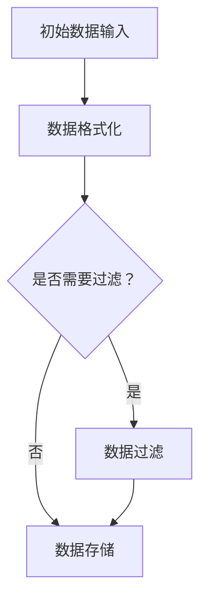

                 

# 《Samza Task原理与代码实例讲解》

## 关键词
Samza，任务处理，流处理，Kafka，分布式系统，消息队列

## 摘要
本文将深入探讨Samza任务的处理原理，通过详细讲解Samza的核心概念、架构设计、消息处理机制、任务管理、进阶特性以及代码实例，帮助读者全面了解和使用Samza进行流数据处理。文章还将包含实战项目分析和性能优化案例，展示如何在实际应用中有效部署和使用Samza。

### 《Samza Task原理与代码实例讲解》目录大纲

#### 第一部分: Samza简介

##### 第1章: Samza基本概念
###### 1.1.1 Samza的核心概念
###### 1.1.2 Samza与流处理的关系
###### 1.1.3 Samza的优势与应用场景

##### 第2章: Samza架构与原理
###### 2.1.1 Samza的架构设计
###### 2.1.2 Samza处理流数据的流程
###### 2.1.3 Samza与Kafka的集成

##### 第3章: Samza消息处理
###### 3.1.1 Samza消息模型
###### 3.1.2 Samza消息处理机制
###### 3.1.3 Samza消息处理案例

##### 第4章: Samza任务管理
###### 4.1.1 Samza任务定义
###### 4.1.2 Samza任务调度
###### 4.1.3 Samza任务监控与维护

##### 第5章: Samza进阶特性
###### 5.1.1 Samza事务处理
###### 5.1.2 Samza状态管理
###### 5.1.3 Samza容错机制

#### 第二部分: Samza代码实例讲解

##### 第6章: Samza入门实例
###### 6.1.1 Samza开发环境搭建
###### 6.1.2 创建Samza应用
###### 6.1.3 Samza代码示例详解

##### 第7章: Samza高级实例
###### 7.1.1 复杂数据处理实例
###### 7.1.2 Samza与Spring Boot集成实例
###### 7.1.3 Samza集群部署与性能优化

##### 第8章: Samza实战项目
###### 8.1.1 实战项目背景介绍
###### 8.1.2 项目需求分析
###### 8.1.3 项目实现与代码解读

##### 第9章: Samza性能分析与调优
###### 9.1.1 Samza性能瓶颈分析
###### 9.1.2 性能调优策略
###### 9.1.3 实际性能优化案例分析

##### 第10章: Samza应用扩展与未来发展
###### 10.1.1 Samza与其他技术的集成
###### 10.1.2 Samza在企业级应用中的实践
###### 10.1.3 Samza的未来发展趋势

### 附录

##### 附录A: Samza开发工具与资源
###### A.1.1 Samza官方文档
###### A.1.2 Samza社区资源
###### A.1.3 Samza常用开发工具与库

##### 附录B: Mermaid流程图示例

### Mermaid 流程图示例



### 第一部分: Samza简介

#### 第1章: Samza基本概念

##### 1.1.1 Samza的核心概念

Samza（Stream Processing Applications Made Zippy and Asynchronous）是一个用于大数据流处理的分布式框架，旨在为开发人员提供简单、高效的方式来处理实时数据流。Samza 的核心概念包括：

- **流处理（Stream Processing）**：流处理是一种数据处理方法，它实时地处理连续的数据流，而不是批量处理静态的数据集。流处理的关键特征是低延迟和高吞吐量，能够对实时数据进行快速分析、处理和响应。

- **任务（Task）**：在 Samza 中，任务是指执行特定数据处理逻辑的组件。每个任务都可以独立运行，并在分布式环境中扩展。

- **流（Stream）**：流是 Samza 处理的数据源，通常是一个数据流，如 Kafka 队列中的消息。

- **处理器（Processor）**：处理器是 Samza 任务中负责处理消息的逻辑组件，包括读取消息、处理消息和生成输出。

- **状态（State）**：状态是 Samza 中的关键特性，用于持久化任务的中间数据和元数据，以便在系统故障或重启后恢复。

- **容器（Container）**：容器是 Samza 任务运行的容器化环境，通常由一个或多个任务组成，并运行在一个独立的 JVM 中。

##### 1.1.2 Samza与流处理的关系

流处理是大数据领域中一个重要的概念，它涉及实时数据处理和分析。Samza 是专为流处理而设计的框架，与流处理的关系如下：

- **数据流处理**：Samza 能够从各种数据源（如 Kafka、Kinesis、RabbitMQ 等）实时地消费数据流，并对其进行处理。

- **分布式计算**：Samza 支持分布式任务调度和执行，可以将数据处理逻辑分散到多个节点上，以提高系统的吞吐量和可用性。

- **容错性**：Samza 具有强大的容错机制，能够自动处理节点故障，确保任务能够继续运行。

- **状态管理**：Samza 提供了状态管理功能，可以持久化任务的中间数据和元数据，确保数据的完整性和一致性。

##### 1.1.3 Samza的优势与应用场景

Samza 具有多项优势，使其在流处理领域脱颖而出：

- **高可扩展性**：Samza 能够轻松扩展到数千个节点，以处理大规模的数据流。

- **高吞吐量**：Samza 采用异步处理模式，能够处理高吞吐量的实时数据流。

- **可扩展的状态管理**：Samza 提供强大的状态管理功能，支持数据持久化和恢复，确保系统的可靠性和数据完整性。

- **与大数据生态系统集成**：Samza 能够与 Kafka、HDFS、HBase、Spark 等大数据生态系统中的其他组件无缝集成，提供强大的数据处理和分析能力。

应用场景包括：

- 实时数据监控和报警系统：用于实时监控各种系统的运行状态，及时发现异常并报警。

- 实时数据分析：用于实时分析用户行为、交易数据、物联网数据等，以支持决策制定。

- 实时数据管道：用于构建实时数据流，将数据从源系统传输到目标系统，实现数据的实时处理和存储。

#### 第2章: Samza架构与原理

##### 2.1.1 Samza的架构设计

Samza 的架构设计旨在提供简单、可靠且可扩展的流处理能力。其核心组件包括：

- **Samza Coordinator**：协调器是 Samza 集群的入口点，负责任务调度、监控和资源管理。协调器与 ZooKeeper 进行交互，以维护集群状态和任务分配。

- **Samza Container**：容器是运行 Samza 任务的独立环境。每个容器都运行在一个独立的 JVM 中，并负责执行具体的任务处理逻辑。

- **Samza Processor**：处理器是容器中执行消息处理逻辑的组件。处理器读取消息、执行处理逻辑，并将结果输出到其他流或存储系统。

- **Kafka**：Kafka 是 Samza 使用的主要消息队列系统。Samza 从 Kafka 消费数据流，并将其传递给处理器进行处理。

- **ZooKeeper**：ZooKeeper 是 Samza 集群的协调服务，用于维护元数据和集群状态。


##### 2.1.2 Samza处理流数据的流程

Samza 处理流数据的流程可以分为以下几个阶段：

1. **任务调度**：Samza Coordinator 根据集群状态和任务配置，将任务分配给不同的容器。

2. **消息消费**：容器从 Kafka 消费消息，并将其传递给处理器。

3. **消息处理**：处理器执行消息处理逻辑，包括解析消息内容、执行数据处理操作和生成输出。

4. **消息输出**：处理器将处理结果输出到其他流或存储系统，如 Kafka、HDFS 或 HBase。

5. **状态管理**：处理器将中间数据和元数据存储在持久化存储系统中，如 HDFS 或 HBase，以便在系统故障时恢复。


##### 2.1.3 Samza与Kafka的集成

Kafka 是 Samza 使用的主要消息队列系统，负责提供数据流和存储。Samza 与 Kafka 的集成如下：

- **数据流传输**：Samza 从 Kafka 消费数据流，并将其传递给处理器进行处理。Kafka 提供了高吞吐量、可靠的消息传输机制，确保数据流的完整性和一致性。

- **消息分区**：Kafka 支持消息分区，Samza 可以利用 Kafka 的分区机制，实现数据的并行处理和负载均衡。

- **消息持久化**：Kafka 提供了持久化存储功能，确保消息即使在系统故障时也不会丢失。

- **消息偏移量**：Kafka 使用消息偏移量（offset）来唯一标识消息的位置，Samza 可以利用消息偏移量实现数据的精确处理和恢复。


#### 第3章: Samza消息处理

##### 3.1.1 Samza消息模型

Samza 使用一种简单的消息模型，用于表示和处理数据流中的消息。Samza 消息模型包括以下关键部分：

- **Key**：消息的键，用于标识消息的唯一性。键可以是任意类型的对象，如字符串、整数或自定义类。

- **Value**：消息的值，表示消息的具体数据。值可以是任意类型的对象，如字符串、数字或自定义类。

- **Timestamp**：消息的时间戳，用于标识消息的生成时间。时间戳可以是绝对时间（如 Unix 时间戳）或相对时间（如自1970年1月1日起的毫秒数）。

- **Serde**：序列化和反序列化接口，用于将消息的键和值序列化为字节序列，以便在网络上传输和存储。

```java
public class SamzaMessage {
    private final Object key;
    private final Object value;
    private final long timestamp;

    public SamzaMessage(Object key, Object value, long timestamp) {
        this.key = key;
        this.value = value;
        this.timestamp = timestamp;
    }

    public Object getKey() {
        return key;
    }

    public Object getValue() {
        return value;
    }

    public long getTimestamp() {
        return timestamp;
    }
}
```

##### 3.1.2 Samza消息处理机制

Samza 的消息处理机制基于处理器（Processor）组件，处理器负责读取、处理和输出消息。以下是 Samza 消息处理机制的关键步骤：

1. **消息消费**：处理器从 Kafka 消费消息，并根据消息的键（Key）将消息路由到相应的处理方法。

2. **消息处理**：处理器执行消息处理逻辑，包括解析消息内容、执行数据处理操作和生成输出。

3. **消息输出**：处理器将处理结果输出到其他流或存储系统，如 Kafka、HDFS 或 HBase。

4. **状态管理**：处理器将中间数据和元数据存储在持久化存储系统中，如 HDFS 或 HBase，以便在系统故障时恢复。

```java
public class MessageProcessor {
    public void process(Message message, Context context) {
        // 解析消息内容
        String content = (String) message.getValue();

        // 执行数据处理逻辑
        String result = processContent(content);

        // 输出处理结果
        context.write(message.getKey(), result);
    }

    private String processContent(String content) {
        // 数据处理逻辑
        return content.toUpperCase();
    }
}
```

##### 3.1.3 Samza消息处理案例

以下是一个简单的 Samza 消息处理案例，用于将 Kafka 中的文本消息转换为大写，并将结果输出到另一个 Kafka 主题：

1. **消息源主题**：`input_topic`，存储原始文本消息。

2. **消息处理任务**：将文本消息转换为大写，并将结果输出到主题`output_topic`。

3. **消息处理逻辑**：读取 Kafka 消息，将文本消息转换为大写，并将结果写入 Kafka 主题。

```java
public class UppercaseProcessor implements StreamProcessor {
    public void processMessage(InputStream inputStream, Context context) {
        while (inputStream.hasNext()) {
            Message message = inputStream.read();
            String content = (String) message.getValue();
            String upperCaseContent = content.toUpperCase();
            context.write(message.getKey(), upperCaseContent);
        }
    }
}
```

#### 第4章: Samza任务管理

##### 4.1.1 Samza任务定义

在 Samza 中，任务（Task）是执行特定数据处理逻辑的组件。定义 Samza 任务主要包括以下步骤：

1. **创建任务配置**：任务配置定义了任务的名称、处理器类、输入流和输出流等信息。以下是一个简单的任务配置示例：

```xml
<config>
    <name>uppercase-task</name>
    <task>
        <name>uppercase-processor</name>
        <processor class="com.example.UppercaseProcessor"/>
        <input topic="input_topic" partition="0" offset="0"/>
        <output topic="output_topic" partition="0" offset="0"/>
    </task>
</config>
```

2. **部署任务**：将任务配置部署到 Samza 集群，以便任务可以执行。Samza 提供了命令行工具，用于部署和管理任务。

```shell
samza run --config /path/to/config.xml
```

##### 4.1.2 Samza任务调度

Samza 任务调度是由 Samza Coordinator 负责的，任务调度过程如下：

1. **任务分配**：Samza Coordinator 根据集群状态和任务配置，将任务分配给可用的容器。

2. **容器启动**：容器根据任务分配信息，启动并运行处理器。

3. **消息消费**：容器从 Kafka 消费消息，并将其传递给处理器进行处理。

4. **结果输出**：处理器将处理结果输出到 Kafka 主题或其他存储系统。

5. **任务监控**：Samza Coordinator 监控任务的运行状态，并在任务失败时重新分配。

##### 4.1.3 Samza任务监控与维护

Samza 提供了丰富的监控和维

