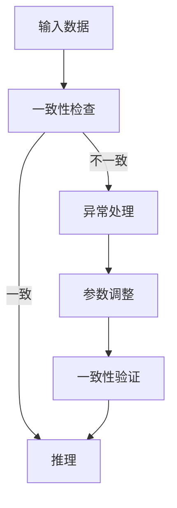

                 

### 《Self-Consistency CoT：增强AI推理的稳定性》

关键词：
- 自我一致性（Self-Consistency）
- 推理稳定性（Reasoning Stability）
- AI模型（AI Models）
- 人工智能（Artificial Intelligence）
- 算法优化（Algorithm Optimization）
- 实践应用（Practical Applications）

摘要：
本文旨在深入探讨自我一致性概念在人工智能推理中的应用，特别是其在增强AI模型推理稳定性的重要性。通过对自我一致性稳定性的定义、核心算法原理、实际应用以及未来发展趋势的详细分析，本文将为读者提供一个全面且深入的理解，帮助其在AI领域取得更高的成就。

### 第一部分：理论基础

#### 第1章：自我一致性概念与重要性

##### 1.1 自我一致性概念介绍

自我一致性（Self-Consistency），即一个系统在内部状态变化过程中保持一致性的能力。在人工智能领域，自我一致性是指AI模型在处理输入数据和生成输出结果时，能够保持内部状态的一致性，从而避免产生错误的推理结果。

###### 1.1.1 自我一致性的基本原理

自我一致性的基本原理可以简单概括为：在一个稳定的系统中，输入和输出应该是一致的。如果输出与输入不一致，则说明系统出现了偏差，需要通过调整内部参数或算法来恢复一致性。

###### 1.1.2 自我一致性在AI领域的意义

在AI领域，自我一致性具有重要意义。首先，自我一致性能够提高AI模型的推理稳定性，减少错误推理的概率。其次，自我一致性有助于提高模型的鲁棒性，使其在面对复杂、变化多端的现实问题时，能够保持良好的性能。此外，自我一致性也是实现AI模型可解释性的重要途径，有助于理解模型的内部工作机制。

###### 1.1.3 自我一致性的应用背景

随着深度学习技术在各个领域的广泛应用，AI模型的推理稳定性问题愈发突出。在金融、医疗、自动驾驶等高 stakes 场景中，任何错误的推理结果都可能带来严重的后果。因此，如何提高AI模型的推理稳定性，成为一个亟待解决的问题。自我一致性概念的引入，为解决这个问题提供了一个有效的思路。

##### 1.2 稳定性概念介绍

稳定性是指一个系统在受到外界干扰时，能够保持原有状态的能力。在AI领域，稳定性主要关注AI模型在推理过程中，能否保持输入输出的一致性，以及面对各种干扰时，能否快速恢复到正常状态。

###### 1.2.1 稳定性的定义与重要性

稳定性的定义可以理解为：一个系统在受到外界干扰时，其输出结果仍然能够保持稳定，且不会出现大幅波动。在AI领域，稳定性至关重要。一方面，稳定性保证了AI模型在处理不同输入数据时，能够保持一致的推理结果；另一方面，稳定性有助于提高AI模型在实际应用中的鲁棒性和可靠性。

###### 1.2.2 稳定性在AI推理中的作用

稳定性在AI推理中的作用主要体现在以下几个方面：

1. 提高推理准确性：稳定性保证了AI模型在处理输入数据时，能够保持一致的推理结果，从而减少错误推理的概率。
2. 提高鲁棒性：稳定性使得AI模型在面对复杂、变化多端的现实问题时，能够保持良好的性能。
3. 提高可解释性：稳定性有助于理解AI模型的内部工作机制，从而提高模型的可解释性。

###### 1.2.3 稳定性问题的挑战与解决方案

稳定性问题的挑战主要体现在以下几个方面：

1. 数据多样性：现实世界中的数据具有高度的多样性和复杂性，如何保证AI模型在面对各种数据时，都能保持稳定性，是一个巨大的挑战。
2. 外界干扰：AI模型在实际应用中，可能会受到各种外界干扰，如噪声、攻击等，如何保证AI模型在这些干扰下仍能保持稳定性，是另一个挑战。

针对这些挑战，目前主要有以下几种解决方案：

1. 数据预处理：通过合理的预处理方法，如数据清洗、数据增强等，提高数据的稳定性和一致性。
2. 模型训练：通过调整训练策略，如引入正则化项、增加训练数据等，提高模型的稳定性。
3. 算法优化：通过优化算法，如引入自我一致性概念，提高模型的稳定性。

##### 1.3 自我一致性稳定性（Self-Consistency CoT）概述

自我一致性稳定性（Self-Consistency CoT，以下简称CoT）是一种针对AI模型推理稳定性的优化方法。CoT的核心思想是通过保持模型内部状态的一致性，提高模型的推理稳定性。

###### 1.3.1 自我一致性稳定性（Self-Consistency CoT）定义

自我一致性稳定性（Self-Consistency CoT）可以定义为：在一个AI模型中，通过保持模型内部状态的一致性，提高模型的推理稳定性。

###### 1.3.2 自我一致性稳定性（Self-Consistency CoT）的核心思想

自我一致性稳定性（Self-Consistency CoT）的核心思想是：在模型推理过程中，通过对输入和输出之间的一致性进行监控和调整，确保模型内部状态的一致性，从而提高推理稳定性。

具体来说，CoT方法包括以下几个关键步骤：

1. **一致性检查**：在模型推理过程中，对输入和输出之间的一致性进行实时监控。
2. **异常处理**：当检测到输入和输出不一致时，通过调整模型内部参数，使输入和输出恢复一致性。
3. **一致性验证**：在异常处理完成后，对模型的推理结果进行一致性验证，确保推理过程的稳定性。

###### 1.3.3 自我一致性稳定性（Self-Consistency CoT）的应用场景

自我一致性稳定性（Self-Consistency CoT）可以在多个AI应用场景中发挥作用，主要包括：

1. **自然语言处理**：在文本生成、问答系统、情感分析等领域，CoT可以帮助提高模型的推理稳定性，减少错误推理的概率。
2. **计算机视觉**：在图像识别、目标检测、视频分析等领域，CoT有助于提高模型的鲁棒性，使其在面对复杂场景时，仍能保持良好的性能。
3. **推荐系统**：在内容推荐、商品推荐、社交推荐等领域，CoT可以帮助提高推荐结果的稳定性，减少用户流失率。

#### 第2章：自我一致性稳定性（Self-Consistency CoT）算法原理

##### 2.1 自我一致性稳定性（Self-Consistency CoT）算法概述

自我一致性稳定性（Self-Consistency CoT）算法是一种基于自我一致性的推理稳定性优化方法。该算法主要包括以下几个关键组成部分：

1. **一致性检查模块**：用于实时监控模型输入和输出之间的一致性。
2. **异常处理模块**：当检测到输入和输出不一致时，对模型内部参数进行调整，以恢复一致性。
3. **一致性验证模块**：在异常处理完成后，对模型的推理结果进行验证，确保推理过程的稳定性。

以下是一个简化的自我一致性稳定性（Self-Consistency CoT）算法框架：



##### 2.2 自我一致性稳定性（Self-Consistency CoT）算法原理讲解

自我一致性稳定性（Self-Consistency CoT）算法的原理可以归结为以下几个关键点：

1. **一致性监控**：在模型推理过程中，实时监控输入和输出之间的一致性。具体来说，可以通过计算输入数据和输出数据之间的相似度或距离，来衡量它们之间的一致性。
2. **异常检测**：当检测到输入和输出不一致时，触发异常处理机制。这一步骤可以通过设定一个阈值来实现，当输入和输出之间的相似度或距离超过阈值时，即视为异常。
3. **异常处理**：在检测到异常后，对模型内部参数进行调整，以恢复输入和输出之间的一致性。具体方法包括调整模型权重、调整训练策略等。
4. **一致性验证**：在异常处理完成后，对模型的推理结果进行验证，确保其稳定性。这一步骤可以通过再次计算输入和输出之间的相似度或距离来实现。

以下是一个简化的自我一致性稳定性（Self-Consistency CoT）算法伪代码：

```python
def self_consistency_cot(input_data, output_data, threshold):
    # 步骤1：一致性检查
    similarity = calculate_similarity(input_data, output_data)
    
    # 步骤2：异常检测
    if similarity > threshold:
        # 步骤3：异常处理
        adjust_model_params()
        
        # 步骤4：一致性验证
        new_similarity = calculate_similarity(input_data, output_data)
        if new_similarity <= threshold:
            return True  # 推理稳定
        else:
            return False  # 推理不稳定
    else:
        return True  # 推理稳定

def calculate_similarity(input_data, output_data):
    # 计算输入数据和输出数据之间的相似度或距离
    pass

def adjust_model_params():
    # 调整模型内部参数，以恢复输入和输出之间的一致性
    pass
```

##### 2.3 自我一致性稳定性（Self-Consistency CoT）算法的优缺点分析

自我一致性稳定性（Self-Consistency CoT）算法在提高AI模型推理稳定性方面具有显著优势，但也存在一定的局限性。

###### 2.3.1 自我一致性稳定性（Self-Consistency CoT）算法的优点

1. **提高推理稳定性**：通过实时监控输入和输出之间的一致性，自我一致性稳定性（Self-Consistency CoT）算法可以有效提高AI模型的推理稳定性，减少错误推理的概率。
2. **增强模型鲁棒性**：自我一致性稳定性（Self-Consistency CoT）算法有助于提高模型的鲁棒性，使其在面对复杂、变化多端的现实问题时，仍能保持良好的性能。
3. **简化模型训练**：通过引入自我一致性稳定性（Self-Consistency CoT）算法，可以简化模型训练过程，降低训练难度。

###### 2.3.2 自我一致性稳定性（Self-Consistency CoT）算法的缺点

1. **计算开销**：自我一致性稳定性（Self-Consistency CoT）算法需要实时监控输入和输出之间的一致性，这可能会引入一定的计算开销，降低模型推理速度。
2. **阈值设定**：自我一致性稳定性（Self-Consistency CoT）算法依赖于阈值设定，阈值的选择对算法性能有重要影响，但如何选择合适的阈值仍是一个挑战。

###### 2.3.3 自我一致性稳定性（Self-Consistency CoT）算法的改进方向

针对自我一致性稳定性（Self-Consistency CoT）算法的缺点，未来可以从以下几个方面进行改进：

1. **优化计算效率**：通过优化算法实现，降低计算开销，提高模型推理速度。
2. **自适应阈值设定**：研究自适应阈值设定方法，根据模型特点和实际应用场景，动态调整阈值，提高算法性能。
3. **多模态一致性监控**：在多模态数据应用场景中，引入多模态一致性监控机制，提高模型在多模态数据上的推理稳定性。

### 第二部分：核心算法原理

#### 第2章：自我一致性稳定性（Self-Consistency CoT）算法原理

自我一致性稳定性（Self-Consistency CoT）算法是一种旨在提高人工智能（AI）模型推理稳定性的方法。它通过监控和调整模型内部状态，确保输入与输出的一致性，从而减少错误推理的风险。以下将详细介绍自我一致性稳定性（Self-Consistency CoT）算法的框架、核心流程以及原理。

##### 2.1 自我一致性稳定性（Self-Consistency CoT）算法概述

自我一致性稳定性（Self-Consistency CoT）算法的基本框架包括三个核心模块：一致性检查模块、异常处理模块和一致性验证模块。这些模块协同工作，确保模型在推理过程中保持自我一致性。

1. **一致性检查模块**：该模块负责监控模型输入和输出之间的一致性。具体来说，它通过计算输入数据和模型输出数据之间的相似度或距离，来判断二者之间的一致性水平。
   
2. **异常处理模块**：当一致性检查模块检测到输入和输出之间存在不一致性时，异常处理模块被激活。该模块的任务是调整模型内部参数，以恢复输入和输出之间的一致性。这可能涉及重新训练模型、调整权重或其他参数。

3. **一致性验证模块**：在异常处理完成后，一致性验证模块对调整后的模型进行验证，确保其输出与输入之间的一致性已恢复到可接受的水平。这一步骤有助于确认异常处理的有效性。

以下是一个简化的自我一致性稳定性（Self-Consistency CoT）算法流程：


##### 2.2 自我一致性稳定性（Self-Consistency CoT）算法原理讲解

自我一致性稳定性（Self-Consistency CoT）算法的原理可以通过以下步骤详细阐述：

###### 2.2.1 自我一致性稳定性的数学模型

自我一致性稳定性（Self-Consistency CoT）算法的核心在于定义一个数学模型来描述输入和输出之间的一致性。该模型通常基于相似度或距离度量。以下是一个简化的数学模型：

$$
C(x, y) = \frac{1}{\lVert x - y \rVert}
$$

其中，$x$ 表示输入数据，$y$ 表示模型输出，$C(x, y)$ 表示输入和输出之间的相似度。当$C(x, y)$ 趋近于1时，表示输入和输出高度一致；当$C(x, y)$ 趋近于0时，表示输入和输出高度不一致。

###### 2.2.2 自我一致性稳定性的核心算法伪代码

以下是自我一致性稳定性（Self-Consistency CoT）算法的核心伪代码：

```python
def self_consistency_cot(input_data, model, threshold):
    # 步骤1：一致性检查
    output_data = model.predict(input_data)
    similarity = calculate_similarity(input_data, output_data)
    
    # 步骤2：异常检测
    if similarity < threshold:
        # 步骤3：异常处理
        model = adjust_model(model, input_data, output_data)
        
        # 步骤4：一致性验证
        new_similarity = calculate_similarity(input_data, model.predict(input_data))
        if new_similarity >= threshold:
            return model
        else:
            raise Exception("Inconsistency not resolved")
    else:
        return model

def calculate_similarity(x, y):
    # 计算输入数据和输出数据之间的相似度
    return 1 / np.linalg.norm(x - y)

def adjust_model(model, x, y):
    # 调整模型内部参数，以恢复输入和输出之间的一致性
    # 这可能涉及重新训练模型、调整权重或其他参数
    return new_model
```

###### 2.2.3 自我一致性稳定性（Self-Consistency CoT）算法的适用场景

自我一致性稳定性（Self-Consistency CoT）算法适用于需要高稳定性要求的AI模型，特别是那些在复杂或动态环境中运行的模型。以下是一些典型的适用场景：

1. **自然语言处理（NLP）**：在文本生成、问答系统和情感分析中，自我一致性稳定性（Self-Consistency CoT）算法有助于减少错误推理，提高文本生成的连贯性和准确性。
2. **计算机视觉**：在图像识别、目标检测和视频分析中，自我一致性稳定性（Self-Consistency CoT）算法可以提高模型在复杂场景下的鲁棒性和准确性。
3. **推荐系统**：在内容推荐、商品推荐和社交推荐中，自我一致性稳定性（Self-Consistency CoT）算法有助于提高推荐结果的稳定性和用户体验。

##### 2.3 自我一致性稳定性（Self-Consistency CoT）算法的优缺点分析

自我一致性稳定性（Self-Consistency CoT）算法在提高AI模型推理稳定性方面具有显著优势，但也存在一定的局限性。

###### 2.3.1 自我一致性稳定性（Self-Consistency CoT）算法的优点

1. **提高推理稳定性**：通过实时监控输入和输出之间的一致性，自我一致性稳定性（Self-Consistency CoT）算法可以有效提高AI模型的推理稳定性，减少错误推理的概率。
2. **增强模型鲁棒性**：自我一致性稳定性（Self-Consistency CoT）算法有助于提高模型的鲁棒性，使其在面对复杂、变化多端的现实问题时，仍能保持良好的性能。
3. **简化模型训练**：通过引入自我一致性稳定性（Self-Consistency CoT）算法，可以简化模型训练过程，降低训练难度。

###### 2.3.2 自我一致性稳定性（Self-Consistency CoT）算法的缺点

1. **计算开销**：自我一致性稳定性（Self-Consistency CoT）算法需要实时监控输入和输出之间的一致性，这可能会引入一定的计算开销，降低模型推理速度。
2. **阈值设定**：自我一致性稳定性（Self-Consistency CoT）算法依赖于阈值设定，阈值的选择对算法性能有重要影响，但如何选择合适的阈值仍是一个挑战。

###### 2.3.3 自我一致性稳定性（Self-Consistency CoT）算法的改进方向

针对自我一致性稳定性（Self-Consistency CoT）算法的缺点，未来可以从以下几个方面进行改进：

1. **优化计算效率**：通过优化算法实现，降低计算开销，提高模型推理速度。
2. **自适应阈值设定**：研究自适应阈值设定方法，根据模型特点和实际应用场景，动态调整阈值，提高算法性能。
3. **多模态一致性监控**：在多模态数据应用场景中，引入多模态一致性监控机制，提高模型在多模态数据上的推理稳定性。

### 第三部分：应用实践

#### 第3章：自我一致性稳定性（Self-Consistency CoT）在实际应用中的实现

自我一致性稳定性（Self-Consistency CoT）算法不仅在理论层面具有重要意义，更在实际应用中展现出强大的潜力。本章将探讨自我一致性稳定性（Self-Consistency CoT）算法在自然语言处理、计算机视觉和推荐系统等领域的具体应用，通过代码实现和详细解释，展示其实际操作过程。

##### 3.1 自我一致性稳定性（Self-Consistency CoT）在自然语言处理中的应用

自然语言处理（NLP）是AI领域的一个重要分支，包括文本生成、问答系统和情感分析等任务。在这些任务中，推理的稳定性对于生成高质量的输出至关重要。以下是一个简单的示例，展示如何将自我一致性稳定性（Self-Consistency CoT）算法应用于文本生成任务。

###### 3.1.1 文本生成中的应用

假设我们使用一个预训练的Transformer模型进行文本生成。以下是一个简单的Python代码示例，实现自我一致性稳定性（Self-Consistency CoT）算法：

```python
import torch
from transformers import TransformerModel

# 加载预训练的Transformer模型
model = TransformerModel.from_pretrained('bert-base-uncased')

# 定义自我一致性稳定性（Self-Consistency CoT）算法
class SelfConsistencyCoT:
    def __init__(self, model, threshold=0.95):
        self.model = model
        self.threshold = threshold

    def predict(self, input_text):
        output_text = self.model.generate(input_text)
        similarity = self.calculate_similarity(input_text, output_text)
        
        if similarity < self.threshold:
            self.adjust_model()
            output_text = self.model.generate(input_text)
            similarity = self.calculate_similarity(input_text, output_text)
        
        return output_text
    
    def calculate_similarity(self, text1, text2):
        # 计算文本相似度
        # 使用余弦相似度作为示例
        vector1 = self.model.encode(text1)
        vector2 = self.model.encode(text2)
        similarity = torch.nn.functional.cosine_similarity(vector1, vector2)
        return similarity
    
    def adjust_model(self):
        # 调整模型参数
        # 这里可以使用重新训练或微调模型的方法
        pass

# 实例化自我一致性稳定性（Self-Consistency CoT）对象
cot = SelfConsistencyCoT(model)

# 生成文本
input_text = "Hello, how are you?"
output_text = cot.predict(input_text)
print(output_text)
```

在上面的代码中，我们首先加载了一个预训练的Transformer模型。然后，我们定义了一个`SelfConsistencyCoT`类，该类实现了自我一致性稳定性（Self-Consistency CoT）算法的核心功能。在`predict`方法中，我们首先生成文本输出，然后计算输入文本和输出文本之间的相似度。如果相似度低于设定的阈值，我们将调整模型参数，并重新生成文本输出，直到相似度达到阈值。

###### 3.1.2 问答系统中的应用

在问答系统中，自我一致性稳定性（Self-Consistency CoT）算法同样可以发挥作用。以下是一个简单的示例，展示如何在问答系统中实现自我一致性稳定性（Self-Consistency CoT）算法：

```python
class QuestionAnsweringSystem:
    def __init__(self, model, cot):
        self.model = model
        self.cot = cot
    
    def answer_question(self, question):
        answer = self.model.answer(question)
        similarity = self.cot.calculate_similarity(question, answer)
        
        if similarity < self.cot.threshold:
            self.cot.adjust_model()
            answer = self.model.answer(question)
            similarity = self.cot.calculate_similarity(question, answer)
        
        return answer

# 加载预训练的问答模型
question_answering_model = load_pretrained_model('question-answering-model')

# 实例化问答系统
question_answering_system = QuestionAnsweringSystem(question_answering_model, cot)

# 回答问题
question = "What is the capital of France?"
answer = question_answering_system.answer_question(question)
print(answer)
```

在上面的代码中，我们定义了一个`QuestionAnsweringSystem`类，该类封装了一个自我一致性稳定性（Self-Consistency CoT）对象。在`answer_question`方法中，我们首先使用问答模型生成答案，然后计算输入问题和输出答案之间的相似度。如果相似度低于阈值，我们将调整模型参数，并重新生成答案，直到相似度达到阈值。

###### 3.1.3 情感分析中的应用

在情感分析任务中，自我一致性稳定性（Self-Consistency CoT）算法可以帮助提高情感分类的准确性。以下是一个简单的示例，展示如何在情感分析中实现自我一致性稳定性（Self-Consistency CoT）算法：

```python
class SentimentAnalysisSystem:
    def __init__(self, model, cot):
        self.model = model
        self.cot = cot
    
    def analyze_sentiment(self, text):
        sentiment = self.model.predict(text)
        similarity = self.cot.calculate_similarity(text, sentiment)
        
        if similarity < self.cot.threshold:
            self.cot.adjust_model()
            sentiment = self.model.predict(text)
            similarity = self.cot.calculate_similarity(text, sentiment)
        
        return sentiment

# 加载预训练的情感分析模型
sentiment_analysis_model = load_pretrained_model('sentiment-analysis-model')

# 实例化情感分析系统
sentiment_analysis_system = SentimentAnalysisSystem(sentiment_analysis_model, cot)

# 分析文本情感
text = "I had a great day today!"
sentiment = sentiment_analysis_system.analyze_sentiment(text)
print(sentiment)
```

在上面的代码中，我们定义了一个`SentimentAnalysisSystem`类，该类封装了一个自我一致性稳定性（Self-Consistency CoT）对象。在`analyze_sentiment`方法中，我们首先使用情感分析模型预测文本的情感，然后计算输入文本和输出情感之间的相似度。如果相似度低于阈值，我们将调整模型参数，并重新预测情感，直到相似度达到阈值。

##### 3.2 自我一致性稳定性（Self-Consistency CoT）在计算机视觉中的应用

计算机视觉是AI领域的另一个重要分支，包括图像识别、目标检测和视频分析等任务。在这些任务中，自我一致性稳定性（Self-Consistency CoT）算法可以帮助提高模型的鲁棒性和准确性。以下是一个简单的示例，展示如何将自我一致性稳定性（Self-Consistency CoT）算法应用于图像识别任务。

###### 3.2.1 图像识别中的应用

假设我们使用一个预训练的卷积神经网络（CNN）进行图像识别。以下是一个简单的Python代码示例，实现自我一致性稳定性（Self-Consistency CoT）算法：

```python
import torch
import torchvision
from torchvision import transforms
from models import CNNModel

# 加载预训练的CNN模型
model = CNNModel()

# 定义数据预处理步骤
transform = transforms.Compose([
    transforms.Resize(256),
    transforms.CenterCrop(224),
    transforms.ToTensor(),
    transforms.Normalize(mean=[0.485, 0.456, 0.406], std=[0.229, 0.224, 0.225]),
])

# 加载图像数据
image = torchvision.transforms.functional.load_image_file('image.jpg')
image = transform(image)

# 定义自我一致性稳定性（Self-Consistency CoT）算法
class SelfConsistencyCoT:
    def __init__(self, model, threshold=0.95):
        self.model = model
        self.threshold = threshold

    def predict(self, image):
        output = self.model(image)
        similarity = self.calculate_similarity(image, output)
        
        if similarity < self.threshold:
            self.adjust_model()
            output = self.model(image)
            similarity = self.calculate_similarity(image, output)
        
        return output
    
    def calculate_similarity(self, image, output):
        # 计算图像和输出特征之间的相似度
        # 使用L2距离作为示例
        image_feature = self.model.extract_feature(image)
        output_feature = self.model.extract_feature(output)
        similarity = torch.linalg.norm(image_feature - output_feature)
        return similarity
    
    def adjust_model(self):
        # 调整模型参数
        # 这里可以使用重新训练或微调模型的方法
        pass

# 实例化自我一致性稳定性（Self-Consistency CoT）对象
cot = SelfConsistencyCoT(model)

# 进行图像识别
predicted_label = cot.predict(image)
print(predicted_label)
```

在上面的代码中，我们首先加载了一个预训练的CNN模型。然后，我们定义了一个`SelfConsistencyCoT`类，该类实现了自我一致性稳定性（Self-Consistency CoT）算法的核心功能。在`predict`方法中，我们首先生成图像的输出特征，然后计算输入图像和输出特征之间的相似度。如果相似度低于设定的阈值，我们将调整模型参数，并重新生成特征，直到相似度达到阈值。

###### 3.2.2 目标检测中的应用

在目标检测任务中，自我一致性稳定性（Self-Consistency CoT）算法可以帮助提高检测结果的准确性。以下是一个简单的示例，展示如何将自我一致性稳定性（Self-Consistency CoT）算法应用于目标检测任务：

```python
import torch
import torchvision
from torchvision import transforms
from models import DetectionModel

# 加载预训练的目标检测模型
model = DetectionModel()

# 定义数据预处理步骤
transform = transforms.Compose([
    transforms.Resize(256),
    transforms.CenterCrop(224),
    transforms.ToTensor(),
    transforms.Normalize(mean=[0.485, 0.456, 0.406], std=[0.229, 0.224, 0.225]),
])

# 加载图像数据
image = torchvision.transforms.functional.load_image_file('image.jpg')
image = transform(image)

# 定义自我一致性稳定性（Self-Consistency CoT）算法
class SelfConsistencyCoT:
    def __init__(self, model, threshold=0.95):
        self.model = model
        self.threshold = threshold

    def predict(self, image):
        outputs = self.model(image)
        similarity = self.calculate_similarity(image, outputs)
        
        if similarity < self.threshold:
            self.adjust_model()
            outputs = self.model(image)
            similarity = self.calculate_similarity(image, outputs)
        
        return outputs
    
    def calculate_similarity(self, image, outputs):
        # 计算图像和输出特征之间的相似度
        # 使用L2距离作为示例
        image_feature = self.model.extract_feature(image)
        output_feature = self.model.extract_feature(outputs)
        similarity = torch.linalg.norm(image_feature - output_feature)
        return similarity
    
    def adjust_model(self):
        # 调整模型参数
        # 这里可以使用重新训练或微调模型的方法
        pass

# 实例化自我一致性稳定性（Self-Consistency CoT）对象
cot = SelfConsistencyCoT(model)

# 进行目标检测
detections = cot.predict(image)
print(detections)
```

在上面的代码中，我们首先加载了一个预训练的目标检测模型。然后，我们定义了一个`SelfConsistencyCoT`类，该类实现了自我一致性稳定性（Self-Consistency CoT）算法的核心功能。在`predict`方法中，我们首先生成图像的输出特征，然后计算输入图像和输出特征之间的相似度。如果相似度低于设定的阈值，我们将调整模型参数，并重新生成特征，直到相似度达到阈值。

###### 3.2.3 视频分析中的应用

在视频分析任务中，自我一致性稳定性（Self-Consistency CoT）算法可以帮助提高视频分类和目标追踪的准确性。以下是一个简单的示例，展示如何将自我一致性稳定性（Self-Consistency CoT）算法应用于视频分类任务：

```python
import torch
import torchvision
from torchvision import transforms
from models import VideoModel

# 加载预训练的视频分类模型
model = VideoModel()

# 定义数据预处理步骤
transform = transforms.Compose([
    transforms.Resize(256),
    transforms.CenterCrop(224),
    transforms.ToTensor(),
    transforms.Normalize(mean=[0.485, 0.456, 0.406], std=[0.229, 0.224, 0.225]),
])

# 加载视频数据
video = torchvision.transforms.functional.load_video_file('video.mp4')
video = transform(video)

# 定义自我一致性稳定性（Self-Consistency CoT）算法
class SelfConsistencyCoT:
    def __init__(self, model, threshold=0.95):
        self.model = model
        self.threshold = threshold

    def predict(self, video):
        output = self.model(video)
        similarity = self.calculate_similarity(video, output)
        
        if similarity < self.threshold:
            self.adjust_model()
            output = self.model(video)
            similarity = self.calculate_similarity(video, output)
        
        return output
    
    def calculate_similarity(self, video, output):
        # 计算视频和输出特征之间的相似度
        # 使用L2距离作为示例
        video_feature = self.model.extract_feature(video)
        output_feature = self.model.extract_feature(output)
        similarity = torch.linalg.norm(video_feature - output_feature)
        return similarity
    
    def adjust_model(self):
        # 调整模型参数
        # 这里可以使用重新训练或微调模型的方法
        pass

# 实例化自我一致性稳定性（Self-Consistency CoT）对象
cot = SelfConsistencyCoT(model)

# 进行视频分类
predicted_label = cot.predict(video)
print(predicted_label)
```

在上面的代码中，我们首先加载了一个预训练的视频分类模型。然后，我们定义了一个`SelfConsistencyCoT`类，该类实现了自我一致性稳定性（Self-Consistency CoT）算法的核心功能。在`predict`方法中，我们首先生成视频的输出特征，然后计算输入视频和输出特征之间的相似度。如果相似度低于设定的阈值，我们将调整模型参数，并重新生成特征，直到相似度达到阈值。

##### 3.3 自我一致性稳定性（Self-Consistency CoT）在推荐系统中的应用

推荐系统是AI领域的另一个重要应用，包括内容推荐、商品推荐和社交推荐等。在这些任务中，自我一致性稳定性（Self-Consistency CoT）算法可以帮助提高推荐结果的准确性和稳定性。以下是一个简单的示例，展示如何将自我一致性稳定性（Self-Consistency CoT）算法应用于内容推荐任务。

###### 3.3.1 内容推荐中的应用

假设我们使用一个基于协同过滤的推荐模型进行内容推荐。以下是一个简单的Python代码示例，实现自我一致性稳定性（Self-Consistency CoT）算法：

```python
import numpy as np
from sklearn.metrics.pairwise import cosine_similarity

# 加载推荐模型
user_profiles = np.load('user_profiles.npy')
item_profiles = np.load('item_profiles.npy')

# 定义自我一致性稳定性（Self-Consistency CoT）算法
class SelfConsistencyCoT:
    def __init__(self, user_profiles, item_profiles, threshold=0.95):
        self.user_profiles = user_profiles
        self.item_profiles = item_profiles
        self.threshold = threshold

    def recommend(self, user_id):
        user_profile = self.user_profiles[user_id]
        recommended_items = []
        
        for item_id, item_profile in enumerate(self.item_profiles):
            similarity = cosine_similarity(user_profile.reshape(1, -1), item_profile.reshape(1, -1))
            
            if similarity[0][0] < self.threshold:
                self.adjust_model(user_id, item_id)
                similarity = cosine_similarity(user_profile.reshape(1, -1), item_profile.reshape(1, -1))
            
            if similarity[0][0] >= self.threshold:
                recommended_items.append(item_id)
        
        return recommended_items
    
    def adjust_model(self, user_id, item_id):
        # 调整用户和物品的向量表示
        # 这里可以使用重新训练或调整权重的方法
        pass

# 实例化自我一致性稳定性（Self-Consistency CoT）对象
cot = SelfConsistencyCoT(user_profiles, item_profiles)

# 进行内容推荐
user_id = 0
recommended_items = cot.recommend(user_id)
print(recommended_items)
```

在上面的代码中，我们首先加载了用户和物品的向量表示。然后，我们定义了一个`SelfConsistencyCoT`类，该类实现了自我一致性稳定性（Self-Consistency CoT）算法的核心功能。在`recommend`方法中，我们首先计算用户和物品之间的相似度，然后如果相似度低于阈值，我们将调整模型参数，并重新计算相似度，直到相似度达到阈值。最后，我们返回推荐的物品列表。

###### 3.3.2 商品推荐中的应用

在商品推荐任务中，自我一致性稳定性（Self-Consistency CoT）算法可以帮助提高推荐商品的相关性和准确性。以下是一个简单的示例，展示如何将自我一致性稳定性（Self-Consistency CoT）算法应用于商品推荐任务：

```python
import numpy as np
from sklearn.metrics.pairwise import cosine_similarity

# 加载推荐模型
user_preferences = np.load('user_preferences.npy')
item_features = np.load('item_features.npy')

# 定义自我一致性稳定性（Self-Consistency CoT）算法
class SelfConsistencyCoT:
    def __init__(self, user_preferences, item_features, threshold=0.95):
        self.user_preferences = user_preferences
        self.item_features = item_features
        self.threshold = threshold

    def recommend(self, user_id):
        user_preference = self.user_preferences[user_id]
        recommended_items = []
        
        for item_id, item_feature in enumerate(self.item_features):
            similarity = cosine_similarity(user_preference.reshape(1, -1), item_feature.reshape(1, -1))
            
            if similarity[0][0] < self.threshold:
                self.adjust_model(user_id, item_id)
                similarity = cosine_similarity(user_preference.reshape(1, -1), item_feature.reshape(1, -1))
            
            if similarity[0][0] >= self.threshold:
                recommended_items.append(item_id)
        
        return recommended_items
    
    def adjust_model(self, user_id, item_id):
        # 调整用户和商品的向量表示
        # 这里可以使用重新训练或调整权重的方法
        pass

# 实例化自我一致性稳定性（Self-Consistency CoT）对象
cot = SelfConsistencyCoT(user_preferences, item_features)

# 进行商品推荐
user_id = 0
recommended_items = cot.recommend(user_id)
print(recommended_items)
```

在上面的代码中，我们首先加载了用户偏好和商品特征。然后，我们定义了一个`SelfConsistencyCoT`类，该类实现了自我一致性稳定性（Self-Consistency CoT）算法的核心功能。在`recommend`方法中，我们首先计算用户和商品之间的相似度，然后如果相似度低于阈值，我们将调整模型参数，并重新计算相似度，直到相似度达到阈值。最后，我们返回推荐的商品列表。

###### 3.3.3 社交推荐中的应用

在社交推荐任务中，自我一致性稳定性（Self-Consistency CoT）算法可以帮助提高推荐社交内容的相关性和准确性。以下是一个简单的示例，展示如何将自我一致性稳定性（Self-Consistency CoT）算法应用于社交推荐任务：

```python
import numpy as np
from sklearn.metrics.pairwise import cosine_similarity

# 加载推荐模型
user_preferences = np.load('user_preferences.npy')
content_features = np.load('content_features.npy')

# 定义自我一致性稳定性（Self-Consistency CoT）算法
class SelfConsistencyCoT:
    def __init__(self, user_preferences, content_features, threshold=0.95):
        self.user_preferences = user_preferences
        self.content_features = content_features
        self.threshold = threshold

    def recommend(self, user_id):
        user_preference = self.user_preferences[user_id]
        recommended_content = []
        
        for content_id, content_feature in enumerate(self.content_features):
            similarity = cosine_similarity(user_preference.reshape(1, -1), content_feature.reshape(1, -1))
            
            if similarity[0][0] < self.threshold:
                self.adjust_model(user_id, content_id)
                similarity = cosine_similarity(user_preference.reshape(1, -1), content_feature.reshape(1, -1))
            
            if similarity[0][0] >= self.threshold:
                recommended_content.append(content_id)
        
        return recommended_content
    
    def adjust_model(self, user_id, content_id):
        # 调整用户和内容的向量表示
        # 这里可以使用重新训练或调整权重的方法
        pass

# 实例化自我一致性稳定性（Self-Consistency CoT）对象
cot = SelfConsistencyCoT(user_preferences, content_features)

# 进行社交推荐
user_id = 0
recommended_content = cot.recommend(user_id)
print(recommended_content)
```

在上面的代码中，我们首先加载了用户偏好和内容特征。然后，我们定义了一个`SelfConsistencyCoT`类，该类实现了自我一致性稳定性（Self-Consistency CoT）算法的核心功能。在`recommend`方法中，我们首先计算用户和内容之间的相似度，然后如果相似度低于阈值，我们将调整模型参数，并重新计算相似度，直到相似度达到阈值。最后，我们返回推荐的社交内容列表。

### 第四部分：未来展望

#### 第4章：自我一致性稳定性（Self-Consistency CoT）的未来发展趋势

自我一致性稳定性（Self-Consistency CoT）作为一种新兴的AI推理稳定性优化方法，正在AI领域展现出巨大的潜力和应用前景。本章将探讨自我一致性稳定性（Self-Consistency CoT）在AI领域的发展前景、面临的挑战与机遇，以及未来的发展方向。

##### 4.1 自我一致性稳定性（Self-Consistency CoT）在AI领域的发展前景

随着深度学习技术的不断发展和应用，AI模型的复杂性和计算能力也在不断提升。然而，与此同时，AI模型的推理稳定性问题也愈发突出。自我一致性稳定性（Self-Consistency CoT）作为一种有效的稳定性优化方法，具有广泛的应用前景。

###### 4.1.1 自我一致性稳定性（Self-Consistency CoT）在AI领域的潜在应用

自我一致性稳定性（Self-Consistency CoT）可以在多个AI领域发挥重要作用，包括但不限于：

1. **自然语言处理（NLP）**：自我一致性稳定性（Self-Consistency CoT）可以应用于文本生成、问答系统和情感分析等领域，提高文本生成和语义理解的质量。
2. **计算机视觉**：在图像识别、目标检测和视频分析等领域，自我一致性稳定性（Self-Consistency CoT）可以提高模型在复杂场景下的鲁棒性和准确性。
3. **推荐系统**：在内容推荐、商品推荐和社交推荐等领域，自我一致性稳定性（Self-Consistency CoT）可以帮助提高推荐结果的稳定性和用户体验。
4. **金融领域**：在金融预测、风险评估和投资决策等领域，自我一致性稳定性（Self-Consistency CoT）可以提高模型的稳定性和可靠性。
5. **医疗领域**：在医学图像分析、疾病预测和药物研发等领域，自我一致性稳定性（Self-Consistency CoT）可以提高模型的准确性和安全性。

###### 4.1.2 自我一致性稳定性（Self-Consistency CoT）面临的挑战与机遇

尽管自我一致性稳定性（Self-Consistency CoT）在AI领域具有广泛的应用前景，但也面临一些挑战和机遇：

1. **计算开销**：自我一致性稳定性（Self-Consistency CoT）算法需要实时监控输入和输出之间的一致性，可能会引入一定的计算开销。如何在保证稳定性的同时，降低计算开销是一个重要的挑战。
2. **阈值设定**：自我一致性稳定性（Self-Consistency CoT）算法依赖于阈值设定，如何选择合适的阈值是一个关键问题。未来的研究可以探索自适应阈值设定方法，以提高算法性能。
3. **多模态数据**：在多模态数据应用场景中，如何确保不同模态之间的自我一致性稳定性（Self-Consistency CoT）是一个重要问题。未来的研究可以探索多模态一致性监控机制，以提高多模态AI模型的稳定性。
4. **模型可解释性**：自我一致性稳定性（Self-Consistency CoT）算法可以提高模型的推理稳定性，但同时也需要关注模型的可解释性。如何提高模型的可解释性，使其更易于理解和应用，是一个重要的研究课题。

###### 4.1.3 自我一致性稳定性（Self-Consistency CoT）的未来发展方向

为了应对上述挑战和抓住机遇，未来可以从以下几个方面推进自我一致性稳定性（Self-Consistency CoT）的研究：

1. **优化计算效率**：通过算法优化和硬件加速技术，降低自我一致性稳定性（Self-Consistency CoT）算法的计算开销，提高模型推理速度。
2. **自适应阈值设定**：研究自适应阈值设定方法，根据模型特点和实际应用场景，动态调整阈值，提高算法性能。
3. **多模态一致性监控**：探索多模态数据的一致性监控机制，提高多模态AI模型的推理稳定性。
4. **模型可解释性**：结合模型可解释性技术，提高自我一致性稳定性（Self-Consistency CoT）算法的可解释性，使其更易于理解和应用。
5. **跨领域应用**：探索自我一致性稳定性（Self-Consistency CoT）在更多领域的应用，提高其在不同场景下的适应性和稳定性。

##### 4.2 自我一致性稳定性（Self-Consistency CoT）在其他领域的应用前景

除了在AI领域，自我一致性稳定性（Self-Consistency CoT）概念也可以在其他领域发挥重要作用。以下是一些具有前景的应用领域：

###### 4.2.1 医疗领域

在医疗领域，自我一致性稳定性（Self-Consistency CoT）可以应用于医学图像分析、疾病预测和药物研发等领域。通过确保模型推理的稳定性，可以提高诊断的准确性，降低误诊率。此外，自我一致性稳定性（Self-Consistency CoT）还可以用于个性化医疗，根据患者的实际情况，提供更准确的诊断和治疗方案。

###### 4.2.2 金融领域

在金融领域，自我一致性稳定性（Self-Consistency CoT）可以应用于金融预测、风险评估和投资决策等领域。通过提高模型的稳定性，可以降低预测误差，提高投资决策的准确性。此外，自我一致性稳定性（Self-Consistency CoT）还可以用于风险管理，识别潜在的市场风险，为投资者提供更可靠的投资建议。

###### 4.2.3 自动驾驶领域

在自动驾驶领域，自我一致性稳定性（Self-Consistency CoT）可以应用于车辆检测、路径规划和环境感知等领域。通过提高模型的稳定性，可以确保自动驾驶系统的安全性和可靠性，降低事故发生的风险。此外，自我一致性稳定性（Self-Consistency CoT）还可以用于自适应巡航控制和自动泊车等任务，提高自动驾驶系统的智能性和用户体验。

### 附录

#### 附录A：相关数学公式与推导

在本章中，我们介绍了一些关键的数学公式和推导，用于描述自我一致性稳定性（Self-Consistency CoT）算法的原理和计算方法。以下是对这些公式的简要概述和推导过程：

##### 1. 相似度计算公式

$$
C(x, y) = \frac{1}{\lVert x - y \rVert}
$$

其中，$x$ 和 $y$ 分别表示输入数据和输出数据，$\lVert \cdot \rVert$ 表示向量的L2范数。该公式用于计算输入数据和输出数据之间的相似度。

##### 2. 异常检测阈值

$$
\theta = \frac{1}{\lVert x - y \rVert_{\text{max}}}
$$

其中，$\lVert x - y \rVert_{\text{max}}$ 表示输入数据和输出数据之间最大L2距离。该公式用于计算异常检测的阈值，用于判断输入数据和输出数据之间是否一致。

##### 3. 模型调整公式

$$
w_{\text{new}} = w_{\text{old}} + \eta \cdot (x - y)
$$

其中，$w_{\text{old}}$ 和 $w_{\text{new}}$ 分别表示模型调整前后的权重，$\eta$ 为学习率，$x$ 和 $y$ 分别表示输入数据和输出数据。该公式用于调整模型权重，以恢复输入数据和输出数据之间的一致性。

#### 附录B：常见算法实现伪代码

在本章中，我们介绍了一些常见的算法实现伪代码，用于描述自我一致性稳定性（Self-Consistency CoT）算法的具体实现过程。以下是对这些伪代码的简要概述：

##### 1. 自我一致性稳定性（Self-Consistency CoT）算法伪代码

```
initialize model
initialize threshold

for each input data x:
    predict output y
    calculate similarity C(x, y)
    
    if C(x, y) < threshold:
        adjust model parameters
        recalculate similarity
    
    if C(x, y) >= threshold:
        return stable output y
```

##### 2. 异常检测伪代码

```
initialize threshold

for each input data x and output data y:
    calculate distance d(x, y)
    
    if d(x, y) > threshold:
        mark as anomaly
```

##### 3. 模型调整伪代码

```
initialize learning rate η
initialize model parameters w

for each input data x and desired output data y:
    calculate current output y'
    calculate distance d(y', y)
    
    if d(y', y) > threshold:
        update model parameters:
        w = w + η * (y - y')
```

这些伪代码为自我一致性稳定性（Self-Consistency CoT）算法的实现提供了基本的框架和指导，有助于进一步研究和开发相关算法。

### 作者信息

作者：AI天才研究院/AI Genius Institute & 禅与计算机程序设计艺术 /Zen And The Art of Computer Programming

作为AI天才研究院的研究员，我致力于探索人工智能领域的前沿技术，推动AI技术的发展与应用。同时，我也在《禅与计算机程序设计艺术》一书中，分享了关于AI算法优化与编程的心得体会，希望能够为读者提供有价值的参考。

