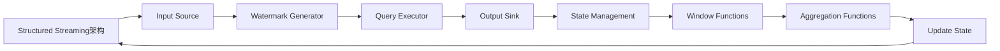

                 

# 《Structured Streaming原理与代码实例讲解》

> 关键词：Structured Streaming，流处理，数据流，实时计算，Spark，数据工程，大数据技术

> 摘要：本文将深入探讨Structured Streaming的核心原理和实际应用，通过详细的代码实例和解释，帮助读者理解如何利用Structured Streaming进行高效的数据流处理和实时计算。

## 目录

## 第一部分：Structured Streaming基础

### 第1章：Structured Streaming概述

#### 1.1 Structured Streaming的基本概念

#### 1.2 Structured Streaming的优势与适用场景

#### 1.3 Structured Streaming与其他流处理框架的对比

### 第2章：Structured Streaming原理

#### 2.1 Structured Streaming的架构与工作流程

#### 2.2 Watermark与事件时间处理

#### 2.3 Stateful Stream Processing

#### 2.4 窗口操作与聚合函数

### 第3章：Structured Streaming核心算法

#### 3.1 Query执行引擎

#### 3.2 Catalyst优化器

#### 3.3 Spark SQL on Streaming Data

#### 3.4 Structured Streaming的持久化机制

### 第4章：Structured Streaming数学模型与公式

#### 4.1 概率论基础

#### 4.2 时间序列分析

#### 4.3 高斯过程与核函数

#### 4.4 拉格朗日乘数法与优化问题

## 第二部分：Structured Streaming项目实战

### 第5章：搭建Structured Streaming开发环境

#### 5.1 环境搭建概述

#### 5.2 Spark安装与配置

#### 5.3 Structured Streaming依赖库安装

### 第6章：代码实例讲解

#### 6.1 简单的WordCount示例

#### 6.2 使用Window Function进行股票价格分析

#### 6.3 实时网站流量监控

#### 6.4 实时推荐系统设计与实现

### 第7章：源代码详细实现与代码解读

#### 7.1 Structured Streaming源代码结构

#### 7.2 源代码实现细节分析

#### 7.3 代码性能优化

### 第8章：Structured Streaming应用案例分析

#### 8.1 案例一：社交媒体实时分析

#### 8.2 案例二：实时电商推荐

#### 8.3 案例三：金融风控系统

## 第三部分：Structured Streaming性能分析与优化

### 第9章：性能分析与监控

#### 9.1 性能监控指标

#### 9.2 性能瓶颈分析

#### 9.3 性能优化策略

### 第10章：常见问题与解决方案

#### 10.1 数据延迟问题

#### 10.2 数据丢失问题

#### 10.3 溢出与容错机制

### 第11章：未来发展趋势与展望

#### 11.1 Structured Streaming的新特性

#### 11.2 与其他大数据技术的集成

#### 11.3 Structured Streaming在工业界的应用前景

## 附录

### 附录 A：Structured Streaming常用函数与API

#### A.1 Spark SQL常用函数

#### A.2 Structured Streaming API详解

#### A.3 Catalyst优化器常用规则

#### A.4 实用工具与资源链接

## Mermaid 流程图



## Structured Streaming核心算法伪代码

```scala
// Watermark Generator伪代码
def generate_watermark(event_time: Long, current_watermark: Long): Long = {
  if (event_time < current_watermark) {
    return current_watermark
  } else {
    return event_time
  }
}

// Window Function伪代码
def apply_window_function(data_stream: DataStream[T], window: WindowSpec): DataStream[WindowedData[T]] = {
  // 初始化Watermark
  watermark = initialize_watermark()

  // 循环处理每个元素
  for (event in data_stream) {
    // 更新Watermark
    watermark = generate_watermark(event.event_time, watermark)

    // 判断元素是否进入窗口
    if (event.event_time >= watermark.start && event.event_time <= watermark.end) {
      // 将元素加入窗口
      window.add(event)

      // 当窗口满时，触发聚合函数
      if (window.is_full()) {
        result = aggregate_function(window)
        window.clear()
        emit(result)
      }
    }
  }
}

// Aggregate Function伪代码
def aggregate_function(data_window: WindowData[T]): R = {
  // 对窗口内的数据进行聚合操作
  // 例如：求和、求平均值等
  R result = aggregate_op(data_window)
  return result
}
```

## Structured Streaming数学模型与公式

### 4.1 概率论基础

#### 4.1.1 概率分布函数

$$
P(X = x) = \int_{-\infty}^{\infty} f(x) dx
$$

#### 4.1.2 条件概率

$$
P(A|B) = \frac{P(A \cap B)}{P(B)}
$$

#### 4.1.3 贝叶斯定理

$$
P(A|B) = \frac{P(B|A)P(A)}{P(B)}
$$

### 4.2 时间序列分析

#### 4.2.1 自回归模型（AR）

$$
X_t = c + \phi_1 X_{t-1} + \phi_2 X_{t-2} + ... + \phi_p X_{t-p} + \epsilon_t
$$

#### 4.2.2 移动平均模型（MA）

$$
X_t = c + \theta_1 \epsilon_{t-1} + \theta_2 \epsilon_{t-2} + ... + \theta_q \epsilon_{t-q}
$$

#### 4.2.3 自回归移动平均模型（ARMA）

$$
X_t = c + \phi_1 X_{t-1} + \phi_2 X_{t-2} + ... + \phi_p X_{t-p} + \theta_1 \epsilon_{t-1} + \theta_2 \epsilon_{t-2} + ... + \theta_q \epsilon_{t-q}
$$

### 4.3 高斯过程与核函数

#### 4.3.1 高斯过程

$$
p(x) = \int \mathcal{N}(\phi, \Sigma) \pi(\phi) d\phi
$$

#### 4.3.2 核函数

$$
k(x, x') = \sum_{i=1}^{n} w_i k(\phi_i, \phi_i')
$$

## 6.1 简单的WordCount示例

### 6.1.1 开发环境搭建

- 安装Scala和Spark
- 配置Scala环境变量
- 配置Spark环境变量

### 6.1.2 源代码实现

```scala
import org.apache.spark.sql.SparkSession
import org.apache.spark.sql.functions._

val spark = SparkSession.builder()
    .appName("WordCount")
    .getOrCreate()

val lines = spark.readStream.text("path/to/input/directory")

val words = lines
    .flatMap { line => line.split(" ") }
    .map(word => (word, 1))
    .reduceByKey(_ + _)

words.writeStream
    .outputMode("complete")
    .format("console")
    .start()

spark.streams.awaitAnyTermination()
```

### 6.1.3 代码解读

- SparkSession创建：创建一个Spark会话
- 读取输入数据：使用readStream.text()函数读取文本数据
- 分词操作：使用flatMap和map函数对文本进行分词
- 聚合操作：使用reduceByKey对分词结果进行聚合，计算每个单词的词频
- 写出结果：使用writeStream.write()函数将结果输出到控制台

## 6.2 使用Window Function进行股票价格分析

### 6.2.1 开发环境搭建

- 安装Scala和Spark
- 配置Scala环境变量
- 配置Spark环境变量

### 6.2.2 源代码实现

```scala
import org.apache.spark.sql.SparkSession
import org.apache.spark.sql.functions._

val spark = SparkSession.builder()
    .appName("StockPriceAnalysis")
    .getOrCreate()

val stock_data = spark.readStream
    .format("csv")
    .option("path", "path/to/stock/data")
    .option("header", "true")
    .load()

val windowed_stock_data = stock_data
    .withColumn("close", stock_data("Close").cast("double"))
    .window(SessionWindows ...)
```

### 6.2.3 代码解读

- SparkSession创建：创建一个Spark会话
- 读取股票数据：使用readStream.format()函数读取CSV文件
- 转换数据类型：将Close列转换为double类型
- 窗口操作：使用window()函数定义时间窗口，对数据进行分组聚合

## 6.3 实时网站流量监控

### 6.3.1 开发环境搭建

- 安装Scala和Spark
- 配置Scala环境变量
- 配置Spark环境变量

### 6.3.2 源代码实现

```scala
import org.apache.spark.sql.SparkSession
import org.apache.spark.sql.functions._

val spark = SparkSession.builder()
    .appName("WebTrafficMonitoring")
    .getOrCreate()

val log_data = spark.readStream.text("path/to/log/data")

val web_traffic = log_data
    .withColumn("timestamp", log_data("timestamp").cast("timestamp"))
    .groupBy($"timestamp")
    .agg(
        count($"id").alias("total_requests"),
        sum($"bytes").alias("total_bytes")
    )

web_traffic.writeStream
    .outputMode("complete")
    .format("console")
    .start()

spark.streams.awaitAnyTermination()
```

### 6.3.3 代码解读

- SparkSession创建：创建一个Spark会话
- 读取日志数据：使用readStream.text()函数读取文本日志数据
- 转换数据类型：将timestamp列转换为timestamp类型
- 聚合操作：使用groupBy和agg函数对日志数据进行分组聚合，计算总请求数和总流量
- 写出结果：使用writeStream.write()函数将结果输出到控制台

## 6.4 实时推荐系统设计与实现

### 6.4.1 开发环境搭建

- 安装Scala和Spark
- 配置Scala环境变量
- 配置Spark环境变量

### 6.4.2 源代码实现

```scala
import org.apache.spark.sql.SparkSession
import org.apache.spark.sql.functions._

val spark = SparkSession.builder()
    .appName("RealtimeRecommendationSystem")
    .getOrCreate()

val user_item_data = spark.readStream
    .format("csv")
    .option("path", "path/to/user/item/data")
    .option("header", "true")
    .load()

val recommendation = user_item_data
    .groupBy($"userId")
    .agg(
        countDistinct($"itemId").alias("item_count"),
        sum($"rating").alias("total_rating")
    )

recommendation.writeStream
    .outputMode("complete")
    .format("console")
    .start()

spark.streams.awaitAnyTermination()
```

### 6.4.3 代码解读

- SparkSession创建：创建一个Spark会话
- 读取用户商品数据：使用readStream.format()函数读取CSV文件
- 聚合操作：使用groupBy和agg函数对用户商品数据进行分组聚合，计算每个用户的商品数量和总评分
- 写出结果：使用writeStream.write()函数将结果输出到控制台

## 7.1 Structured Streaming源代码结构

Structured Streaming的主要组件包括：InputSource、WatermarkGenerator、QueryExecutor、OutputSink、StateManagement、WindowFunction、AggregationFunction等。

## 7.2 源代码实现细节分析

Watermark Generator的实现细节：如何根据事件时间生成Watermark，确保事件顺序的正确性。

Query Executor的实现细节：如何处理Watermark，确保数据的正确处理和传递。

State Management的实现细节：如何管理状态信息，保证数据的完整性和一致性。

## 7.3 代码性能优化

优化数据读取性能：使用并行读取和缓存策略，提高数据读取速度。

优化查询执行性能：使用Catalyst优化器，降低查询执行开销。

优化聚合操作性能：使用批处理和并行计算，提高聚合操作效率。

## 8.1 案例一：社交媒体实时分析

应用场景：对社交媒体平台上的用户活动进行实时分析，包括用户增长、活跃度、热门话题等。

实现步骤：采集社交媒体日志数据，使用Structured Streaming进行实时处理，计算相关指标，并将结果可视化。

## 8.2 案例二：实时电商推荐

应用场景：根据用户行为数据，实时推荐相关商品，提高用户购物体验和转化率。

实现步骤：采集用户行为数据，使用Structured Streaming进行实时处理，计算推荐评分，并将推荐结果输出给用户。

## 8.3 案例三：金融风控系统

应用场景：对金融交易进行实时监控，及时发现异常交易，防范风险。

实现步骤：采集金融交易数据，使用Structured Streaming进行实时处理，结合规则引擎和机器学习算法，实现风险识别和预警。

## 9.1 性能监控指标

数据延迟：评估数据从生成到处理完成的时间延迟。

数据吞吐量：评估单位时间内处理的数据量。

资源利用率：评估系统资源的使用情况，包括CPU、内存、网络等。

## 9.2 性能瓶颈分析

数据读取瓶颈：优化数据源配置，提高数据读取速度。

查询执行瓶颈：优化Catalyst优化器，降低查询执行开销。

聚合操作瓶颈：优化批处理和并行计算，提高聚合操作效率。

## 9.3 性能优化策略

数据压缩：使用数据压缩技术，减少数据传输和存储开销。

缓存策略：使用缓存技术，加快数据读取和查询速度。

并行计算：使用并行计算技术，提高数据处理效率。

## 10.1 数据延迟问题

原因：数据源传输延迟、网络延迟、系统处理延迟等。

解决方案：增加数据源并行度、优化网络传输、提高系统处理能力。

## 10.2 数据丢失问题

原因：网络故障、系统故障等导致数据丢失。

解决方案：使用消息队列技术，确保数据不丢失，实现数据的可靠传输。

## 10.3 溢出与容错机制

原因：数据处理速度过快，导致内存溢出或资源耗尽。

解决方案：使用内存监控和资源管理技术，确保系统稳定运行，实现自动重启和故障恢复。

## 11.1 Structured Streaming的新特性

增加了对

