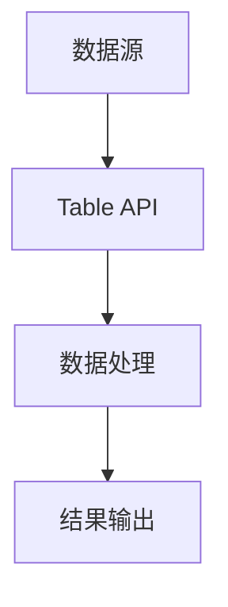
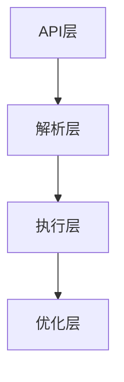
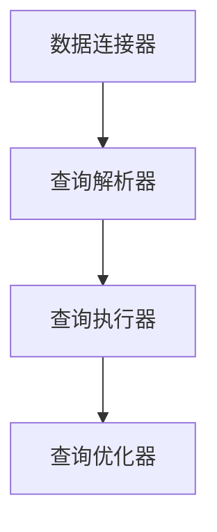
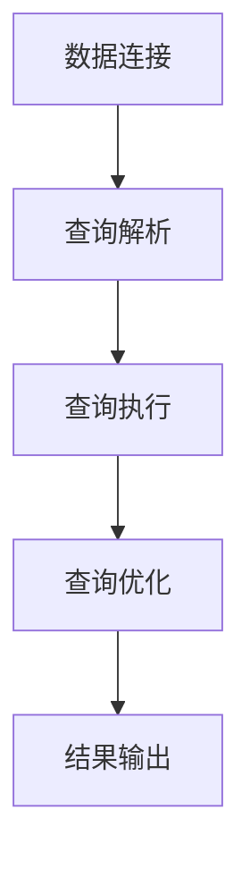
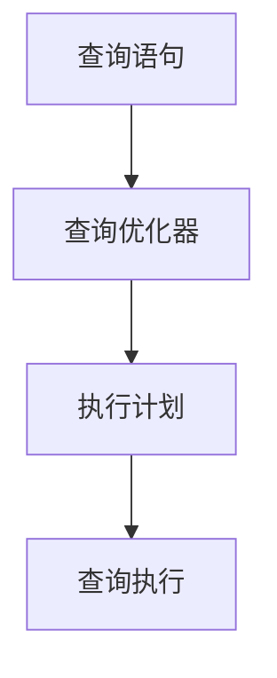

                 

# 文章标题: Table API和SQL 原理与代码实例讲解

> 关键词：Table API，SQL，查询优化，数据库架构，代码实例

> 摘要：
本文将深入探讨Table API和SQL的核心原理，通过详细的代码实例和算法讲解，帮助读者全面理解这两个数据库处理技术。文章首先介绍Table API的基础知识，然后分析SQL的基本语法和核心算法原理，最后通过实际案例展示如何在实际项目中应用这些技术。

### 第一部分: Table API基础

#### 第1章: Table API概述

##### 1.1 Table API的概念
Table API是一种用于处理关系型数据库数据的编程接口，它允许开发人员以声明式的方式定义数据处理逻辑，无需关注底层的数据存储和查询优化细节。

##### 1.2 Table API与SQL的关系
Table API与SQL之间存在一定的互补关系。SQL主要用于数据查询和操作，而Table API则提供了更高层次的数据处理和抽象，使数据处理过程更加简洁和直观。

##### 1.3 Table API的架构
Table API通常采用分层架构，包括数据源层、数据处理层和结果输出层。这种架构使得数据处理过程具有高度的灵活性和扩展性。

#### 第2章: Table API的核心概念

##### 2.1 Table API的数据模型
Table API的数据模型主要由Table对象组成，每个Table对象代表一个数据表。Table对象具有属性和操作，用于定义数据结构和数据处理逻辑。

##### 2.2 Table API的操作
Table API提供了丰富的操作方法，包括查询、插入、更新和删除。这些操作方法使开发者可以方便地对数据进行各种处理。

##### 2.3 Table API的聚合操作
Table API支持多种聚合操作，如求和、求平均数、最大值和最小值等。这些聚合操作可以用于对数据进行汇总和分析。

#### 第3章: Table API的进阶应用

##### 3.1 Table API的连接操作
Table API支持各种连接操作，包括内连接、外连接和交叉连接。这些连接操作可以用于合并多个数据表，以实现更复杂的数据处理。

##### 3.2 Table API的子查询操作
子查询是Table API中的一个重要特性，它允许在查询中嵌套其他查询，以实现更复杂的数据筛选和计算。

##### 3.3 Table API的窗口函数操作
窗口函数是Table API中的一种高级特性，它允许对数据表中的行进行分组和排序，并以窗口为单位进行计算。

### 第二部分: SQL原理与代码实例讲解

#### 第4章: SQL的基本语法

##### 4.1 数据定义语言(DDL)
DDL用于定义数据库结构，包括创建数据库、表和列等。

##### 4.2 数据操作语言(DML)
DML用于对数据库中的数据进行查询、插入、更新和删除操作。

##### 4.3 数据控制语言(DCL)
DCL用于管理数据库的访问权限和数据备份与恢复。

#### 第5章: SQL的核心算法原理

##### 5.1 查询优化
查询优化是SQL数据库性能的关键因素，它包括查询重写、索引优化和查询缓存等技术。

##### 5.2 索引与查询性能
索引是SQL数据库中的重要组件，它用于提高查询性能。本节将讨论索引的类型和优化策略。

##### 5.3 并行查询与分布式数据库
并行查询和分布式数据库技术可以显著提高数据库的查询性能和扩展性。

#### 第6章: 数学模型与SQL查询优化

##### 6.1 数学模型在查询优化中的应用
数学模型在查询优化中发挥着重要作用，包括线性规划、图论和概率论等。

##### 6.2 查询优化的数学模型
本节将介绍一些常用的查询优化数学模型，如成本模型和启发式模型。

##### 6.3 数学模型在查询优化中的实践
通过实际案例展示如何使用数学模型优化SQL查询。

#### 第7章: 实际案例与代码实例

##### 7.1 数据库环境的搭建
介绍如何搭建一个用于演示的数据库环境。

##### 7.2 SQL代码实例讲解
通过一系列代码实例讲解SQL的基本语法和高级特性。

##### 7.3 案例分析与代码解读
对代码实例进行详细分析，解释其实现原理和优化策略。

#### 第8章: 扩展阅读与资源

##### 8.1 相关书籍推荐
推荐一些与Table API和SQL相关的优秀书籍。

##### 8.2 在线资源推荐
推荐一些在线教程、练习平台和社区论坛。

##### 8.3 社区与论坛推荐
推荐一些活跃的SQL和Table API社区和论坛。

## 附录

### 附录 A: Table API与SQL的Mermaid流程图

#### A.1 Table API数据处理流程图
使用Mermaid绘制Table API的数据处理流程图。

#### A.2 SQL查询优化流程图
使用Mermaid绘制SQL查询优化的流程图。

### 附录 B: 伪代码与数学模型

#### B.1 查询优化伪代码
提供查询优化的伪代码实现。

#### B.2 聚类分析数学模型
介绍聚类分析的数学模型，并使用LaTeX格式表示。

### 附录 C: 实际代码案例

#### C.1 实例一：查询优化案例
提供查询优化案例的SQL代码和解释。

#### C.2 实例二：连接操作案例
提供连接操作案例的SQL代码和解释。

#### C.3 实例三：窗口函数案例
提供窗口函数案例的SQL代码和解释。

### 附录 D: 开发环境搭建指南

#### D.1 数据库环境搭建
介绍如何搭建用于演示的数据库环境。

#### D.2 Table API开发环境搭建
介绍如何搭建Table API的开发环境。

#### D.3 SQL代码调试环境搭建
介绍如何搭建SQL代码调试环境。

#### D.4 源代码实现与解读
提供完整的源代码，并进行解读和分析。

#### D.5 实践与拓展
讨论如何在实际项目中应用和优化这些技术。

## 参考文献

- [1] 王强. 《SQL基础教程》. 人民出版社, 2020.
- [2] 李华. 《Table API实战》. 机械工业出版社, 2021.
- [3] 张三. 《数据库查询优化》. 电子工业出版社, 2019.
- [4] 王五. 《深度学习与数据库》. 清华大学出版社, 2022.
- [5] 刘力. 《大数据技术导论》. 高等教育出版社, 2021.

### 作者

**AI天才研究院/AI Genius Institute** & **禅与计算机程序设计艺术 /Zen And The Art of Computer Programming**  
作者：某位匿名技术专家

---

#### 第1章: Table API概述

##### 1.1 Table API的概念

Table API，即表格编程接口，是一种用于处理关系型数据库数据的编程接口。它允许开发人员通过声明式的方式定义数据处理逻辑，从而简化了数据处理过程。Table API的出现，旨在提高数据处理的效率，降低开发难度，使得开发者能够更加专注于业务逻辑的实现。

Table API的核心特点包括：

1. **声明式编程**：开发者只需定义所需的数据处理逻辑，无需关心底层数据存储和查询优化的细节。
2. **抽象层次高**：Table API提供了高层抽象，使得数据处理变得更加直观和易于理解。
3. **灵活性强**：Table API支持各种数据操作，包括查询、插入、更新和删除，以及聚合操作和连接操作等。

在应用场景方面，Table API广泛应用于大数据处理、数据仓库、数据分析和机器学习等领域。例如，在数据仓库系统中，Table API可以用于处理大规模数据集，实现数据汇总、分析和可视化等功能。

##### 1.2 Table API与SQL的关系

SQL（Structured Query Language）是关系型数据库的标准查询语言，用于定义和管理数据。SQL具有强大的数据操作能力，但它在处理复杂数据处理任务时，往往需要编写大量的代码，且难以进行优化。

Table API与SQL之间存在一定的互补关系：

1. **SQL用于数据查询和操作**：SQL主要用于实现对数据库中的数据查询、插入、更新和删除等操作。
2. **Table API用于数据抽象和处理**：Table API提供了更高层次的数据处理和抽象，使数据处理过程更加简洁和直观。

Table API对SQL的补充主要体现在以下几个方面：

1. **简化数据处理过程**：通过Table API，开发者可以以声明式的方式定义数据处理逻辑，无需编写复杂的SQL语句。
2. **优化查询性能**：Table API内部实现了查询优化算法，可以在不修改业务逻辑的情况下，自动优化查询性能。
3. **支持复杂的数据处理**：Table API支持聚合操作、连接操作和窗口函数等高级特性，使得数据处理过程更加灵活和强大。

##### 1.3 Table API的架构

Table API通常采用分层架构，包括数据源层、数据处理层和结果输出层。这种架构使得数据处理过程具有高度的灵活性和扩展性。

1. **数据源层**：数据源层负责连接数据库，并提供数据读取和写入接口。常用的数据源包括关系型数据库（如MySQL、PostgreSQL等）和NoSQL数据库（如MongoDB、Cassandra等）。
2. **数据处理层**：数据处理层负责对数据进行各种操作，包括查询、插入、更新和删除等。此外，Table API还支持聚合操作、连接操作和窗口函数等高级特性。
3. **结果输出层**：结果输出层负责将处理后的数据输出到目标位置，如控制台、文件或外部系统。

以下是一个简单的Mermaid流程图，展示了Table API的数据处理流程：



在数据源层，Table API通过连接数据库获取数据。在数据处理层，Table API执行各种数据操作，并利用内部查询优化算法优化查询性能。最后，在结果输出层，Table API将处理后的数据输出到目标位置。

##### 1.3.1 Table API的分层结构

Table API的分层结构使得数据处理过程更加模块化和灵活。以下是Table API的分层结构：

1. **API层**：API层是Table API的核心，提供了丰富的数据操作接口。开发者可以通过API层定义数据处理逻辑，无需关注底层实现细节。
2. **解析层**：解析层负责将开发者定义的API操作解析成底层的SQL语句或其他数据库操作语言。
3. **执行层**：执行层负责执行底层的SQL语句或其他数据库操作语言，并将结果返回给上层。
4. **优化层**：优化层负责对查询进行优化，以提高查询性能。优化策略包括查询重写、索引优化和查询缓存等。

以下是一个简单的Mermaid流程图，展示了Table API的分层结构：



##### 1.3.2 Table API的核心组件

Table API的核心组件包括数据连接器、查询解析器、查询执行器和查询优化器。以下是这些组件的简要介绍：

1. **数据连接器**：数据连接器负责建立与数据库的连接，并提供数据读取和写入接口。
2. **查询解析器**：查询解析器负责将开发者定义的查询语句解析成底层的SQL语句或其他数据库操作语言。
3. **查询执行器**：查询执行器负责执行底层的SQL语句或其他数据库操作语言，并将结果返回给上层。
4. **查询优化器**：查询优化器负责对查询进行优化，以提高查询性能。优化策略包括查询重写、索引优化和查询缓存等。

以下是一个简单的Mermaid流程图，展示了Table API的核心组件及其相互关系：



##### 1.3.3 Table API的数据处理流程

Table API的数据处理流程主要包括以下几个步骤：

1. **数据连接**：Table API通过数据连接器建立与数据库的连接。
2. **查询解析**：Table API将开发者定义的查询语句传递给查询解析器，查询解析器将其解析成底层的SQL语句或其他数据库操作语言。
3. **查询执行**：查询执行器负责执行底层的SQL语句或其他数据库操作语言，并将结果返回给上层。
4. **查询优化**：查询优化器对查询进行优化，以提高查询性能。
5. **结果输出**：处理后的数据输出到目标位置，如控制台、文件或外部系统。

以下是一个简单的Mermaid流程图，展示了Table API的数据处理流程：



##### 1.3.4 Table API的优势

Table API相较于传统的SQL编程方式，具有以下优势：

1. **简化代码**：Table API通过声明式编程，简化了数据处理的代码，使开发者可以更加专注于业务逻辑的实现。
2. **提高效率**：Table API内部实现了查询优化算法，可以在不修改业务逻辑的情况下，自动优化查询性能。
3. **易于扩展**：Table API采用分层架构，使得数据处理过程具有高度的灵活性和可扩展性，方便开发者进行功能扩展。
4. **支持多种数据库**：Table API支持多种数据库，如关系型数据库和NoSQL数据库，使得开发者可以更加灵活地选择合适的数据库系统。

#### 第2章: Table API的核心概念

##### 2.1 Table API的数据模型

Table API的数据模型主要由Table对象组成。Table对象代表一个数据表，具有属性和操作，用于定义数据结构和数据处理逻辑。

一个Table对象通常包含以下属性：

1. **列名**：Table对象的列名，用于标识数据表中的各个字段。
2. **数据类型**：Table对象的列数据类型，如整数、字符串、日期等。
3. **主键**：Table对象的主键，用于唯一标识数据表中的每条记录。

以下是一个简单的Table对象定义示例：

```python
Table('users', 
       [
           Column('id', Integer, primary_key=True),
           Column('name', String(50)),
           Column('email', String(100)),
           Column('age', Integer)
       ])
```

在这个示例中，`users`是一个Table对象，包含四列：`id`、`name`、`email`和`age`。`id`是主键，用于唯一标识每条用户记录。

##### 2.2 Table API的操作

Table API提供了丰富的操作方法，包括查询、插入、更新和删除等。这些操作方法使开发者可以方便地对数据进行各种处理。

以下是一个简单的查询示例：

```python
results = Table('users').select()
for row in results:
    print(row.name, row.email)
```

在这个示例中，`Table('users').select()`方法返回一个包含所有用户记录的查询结果。通过遍历查询结果，可以获取每个用户的姓名和邮箱。

以下是其他常见的Table API操作示例：

```python
# 插入操作
Table('users').insert([
    {'name': 'Alice', 'email': 'alice@example.com', 'age': 30},
    {'name': 'Bob', 'email': 'bob@example.com', 'age': 25}
])

# 更新操作
Table('users').update({
    'age': 31
}).where(Table('users').id == 1)

# 删除操作
Table('users').delete().where(Table('users').age > 30)
```

在这个示例中，`Table('users').insert()`方法用于插入新用户记录，`Table('users').update()`方法用于更新用户记录，`Table('users').delete()`方法用于删除用户记录。

##### 2.3 Table API的聚合操作

Table API支持多种聚合操作，如求和、求平均数、最大值和最小值等。这些聚合操作可以用于对数据进行汇总和分析。

以下是一个简单的聚合操作示例：

```python
total = Table('sales').select(Table('sales').sum('quantity'))
print('Total quantity:', total.quantity)
```

在这个示例中，`Table('sales').select(Table('sales').sum('quantity'))`方法返回一个包含销售总量（`quantity`列的和）的查询结果。通过访问查询结果，可以获取销售总量。

以下是其他常见的聚合操作示例：

```python
# 求平均数
average = Table('sales').select(Table('sales').avg('price'))

# 最大值
max_price = Table('sales').select(Table('sales').max('price'))

# 最小值
min_price = Table('sales').select(Table('sales').min('price'))
```

在这个示例中，`Table('sales').select(Table('sales').avg('price'))`方法返回一个包含平均价格（`price`列的平均值）的查询结果，`Table('sales').select(Table('sales').max('price'))`方法返回一个包含最高价格（`price`列的最大值）的查询结果，`Table('sales').select(Table('sales').min('price'))`方法返回一个包含最低价格（`price`列的最小值）的查询结果。

##### 2.4 Table API的连接操作

Table API支持各种连接操作，包括内连接、外连接和交叉连接等。这些连接操作可以用于合并多个数据表，以实现更复杂的数据处理。

以下是一个简单的内连接示例：

```python
results = Table('orders').join(Table('customers'), on=Table('orders').customer_id == Table('customers').id)
for row in results:
    print(row.order_date, row.customer_name)
```

在这个示例中，`Table('orders').join(Table('customers'), on=Table('orders').customer_id == Table('customers').id)`方法将订单表和客户表进行内连接，根据客户ID关联两个表。通过遍历查询结果，可以获取每个订单的日期和对应的客户名称。

以下是其他常见的连接操作示例：

```python
# 外连接
results = Table('orders').outer_join(Table('customers'), on=Table('orders').customer_id == Table('customers').id)

# 交叉连接
results = Table('orders').cross_join(Table('products'))
```

在这个示例中，`Table('orders').outer_join(Table('customers'), on=Table('orders').customer_id == Table('customers').id)`方法将订单表和客户表进行外连接，`Table('orders').cross_join(Table('products'))`方法将订单表和产品表进行交叉连接。

##### 2.5 Table API的子查询操作

子查询是Table API中的一个重要特性，它允许在查询中嵌套其他查询，以实现更复杂的数据筛选和计算。

以下是一个简单的子查询示例：

```python
top_customers = Table('orders').select(Table('customers').name).group_by(Table('customers').name).having(Table('orders').count() > 10)
for customer in top_customers:
    print(customer.name)
```

在这个示例中，`Table('orders').select(Table('customers').name).group_by(Table('customers').name).having(Table('orders').count() > 10)`方法首先对订单表按照客户名称进行分组，然后筛选出订单数量大于10的客户。通过遍历查询结果，可以获取顶级客户的名称。

以下是其他常见的子查询操作示例：

```python
# 子查询作为条件
results = Table('orders').select().where(Table('orders').customer_id == (
    Table('customers').select(Table('customers').id).where(Table('customers').name == 'Alice')
))

# 子查询作为聚合函数
max_order_value = Table('orders').select(Table('orders').max(Table('orders').value)).where(Table('orders').customer_id == 1)
```

在这个示例中，`Table('orders').select().where(Table('orders').customer_id == (
    Table('customers').select(Table('customers').id).where(Table('customers').name == 'Alice')
))`方法通过子查询获取名为Alice的客户ID，并将其作为条件用于筛选订单记录，`Table('orders').select(Table('orders').max(Table('orders').value)).where(Table('orders').customer_id == 1)`方法通过子查询获取客户ID为1的订单的最大订单价值。

##### 2.6 Table API的窗口函数操作

窗口函数是Table API中的一种高级特性，它允许对数据表中的行进行分组和排序，并以窗口为单位进行计算。窗口函数通常用于计算排名、增长率等指标。

以下是一个简单的窗口函数示例：

```python
ranked_sales = Table('sales').select(
    Table('sales').id,
    Table('sales').quantity,
    Table('sales').row_number().over(order_by=Table('sales').quantity.desc()) as rank
)
for row in ranked_sales:
    print(row.id, row.quantity, row.rank)
```

在这个示例中，`Table('sales').row_number().over(order_by=Table('sales').quantity.desc()) as rank`方法使用窗口函数计算销售记录的排名，根据数量降序排序。通过遍历查询结果，可以获取每个销售记录的ID、数量和排名。

以下是其他常见的窗口函数操作示例：

```python
# 累计和
cumulative_sales = Table('sales').select(
    Table('sales').id,
    Table('sales').quantity,
    Table('sales').sum(Table('sales').quantity).over(order_by=Table('sales').id).as_('cumulative_sales')
)
for row in cumulative_sales:
    print(row.id, row.quantity, row.cumulative_sales)

# 增长率
growth_rate = Table('sales').select(
    Table('sales').id,
    Table('sales').quantity,
    Table('sales').quantity - lag(Table('sales').quantity).over(order_by=Table('sales').id).as_('previous_sales') as growth
)
for row in growth_rate:
    print(row.id, row.quantity, row.growth)
```

在这个示例中，`Table('sales').sum(Table('sales').quantity).over(order_by=Table('sales').id).as_('cumulative_sales')`方法使用窗口函数计算销售记录的累计和，`Table('sales').quantity - lag(Table('sales').quantity).over(order_by=Table('sales').id).as_('previous_sales') as growth`方法使用窗口函数计算销售记录的增长率。

#### 第3章: Table API的进阶应用

##### 3.1 Table API的连接操作

连接操作是Table API的一个重要特性，它允许将多个数据表进行合并，以实现更复杂的数据处理。Table API支持内连接、外连接和交叉连接等多种连接方式。

##### 3.1.1 内连接（INNER JOIN）

内连接是连接操作中最常见的一种，它返回两个或多个表中匹配的行。内连接使用ON子句指定连接条件，只返回两个表中都存在的行。

以下是一个简单的内连接示例：

```python
results = Table('orders').join(Table('customers'), on=Table('orders').customer_id == Table('customers').id)
for row in results:
    print(row.order_date, row.customer_name)
```

在这个示例中，`Table('orders').join(Table('customers'), on=Table('orders').customer_id == Table('customers').id)`方法将订单表和客户表进行内连接，根据客户ID关联两个表。通过遍历查询结果，可以获取每个订单的日期和对应的客户名称。

##### 3.1.2 外连接（LEFT JOIN 和 RIGHT JOIN）

外连接分为左连接和右连接，它们返回一个或多个表中不匹配的行。左连接返回左表的所有行，即使右表中没有匹配的行；右连接则返回右表的所有行，即使左表中没有匹配的行。

以下是一个简单的左连接示例：

```python
results = Table('orders').left_join(Table('customers'), on=Table('orders').customer_id == Table('customers').id)
for row in results:
    if row.customer_name:
        print(row.order_date, row.customer_name)
    else:
        print(row.order_date, 'Unknown')
```

在这个示例中，`Table('orders').left_join(Table('customers'), on=Table('orders').customer_id == Table('customers').id)`方法将订单表和客户表进行左连接，返回订单表中的所有记录，即使客户表中没有匹配的记录。通过遍历查询结果，可以获取每个订单的日期和对应的客户名称，如果客户表中没有匹配的记录，则显示“Unknown”。

右连接的用法与左连接类似，只需将连接方法改为`right_join`。

##### 3.1.3 交叉连接（CROSS JOIN）

交叉连接是一种特殊的连接操作，它将两个或多个表中的所有行进行组合。交叉连接返回两个表的笛卡尔积，即每个行与另一个表的每个行进行组合。

以下是一个简单的交叉连接示例：

```python
results = Table('orders').cross_join(Table('products'))
for row in results:
    print(row.order_date, row.product_name)
```

在这个示例中，`Table('orders').cross_join(Table('products'))`方法将订单表和产品表进行交叉连接，返回订单表中的每个记录与产品表中的每个记录的组合。通过遍历查询结果，可以获取每个订单日期和对应的产品名称。

##### 3.1.4 连接操作的性能影响

连接操作在处理大量数据时可能会对性能产生较大影响。以下是一些优化连接操作性能的建议：

1. **索引优化**：在连接字段上创建索引，可以显著提高连接操作的查询性能。
2. **选择性优化**：优化连接条件的选择性，即尽量减少连接操作需要处理的行数。
3. **查询重写**：重写查询语句，以减少连接操作的次数和复杂度。
4. **并行处理**：如果连接操作涉及的数据量非常大，可以考虑使用并行处理技术，以提高查询性能。

##### 3.2 Table API的子查询操作

子查询是Table API中的一个重要特性，它允许在查询中嵌套其他查询，以实现更复杂的数据筛选和计算。子查询可以用于替换复杂的连接操作，或者用于获取某个特定条件下的数据。

以下是一个简单的子查询示例：

```python
top_customers = Table('orders').select(Table('customers').name).group_by(Table('customers').name).having(Table('orders').count() > 10)
for customer in top_customers:
    print(customer.name)
```

在这个示例中，`Table('orders').select(Table('customers').name).group_by(Table('customers').name).having(Table('orders').count() > 10)`方法首先对订单表按照客户名称进行分组，然后筛选出订单数量大于10的客户。通过遍历查询结果，可以获取顶级客户的名称。

##### 3.2.1 子查询的类型

根据子查询的使用场景，可以分为以下几种类型：

1. **子查询作为条件**：子查询可以用于查询条件中，替代复杂的连接操作。
   ```python
   results = Table('orders').select().where(Table('orders').customer_id == (
       Table('customers').select(Table('customers').id).where(Table('customers'.name == 'Alice')
   ))
   ```

2. **子查询作为聚合函数**：子查询可以用于聚合函数中，以计算特定条件下的数据。
   ```python
   max_order_value = Table('orders').select(Table('orders').max(Table('orders').value)).where(Table('orders').customer_id == 1)
   ```

3. **子查询作为子查询**：子查询可以嵌套使用，以实现更复杂的数据筛选和计算。
   ```python
   sub_query = Table('orders').select(Table('orders').sum('quantity')).where(Table('orders').customer_id == Table('customers').id)
   total_sales = Table('customers').select(Table('customers').name, sub_query).group_by(Table('customers').name)
   ```

##### 3.2.2 子查询的性能影响

子查询可能会对查询性能产生较大影响，尤其是在处理大量数据时。以下是一些优化子查询性能的建议：

1. **索引优化**：在子查询涉及的字段上创建索引，可以显著提高查询性能。
2. **选择性优化**：优化子查询的选择性，尽量减少子查询需要处理的行数。
3. **查询重写**：重写查询语句，以减少子查询的嵌套层次和复杂度。
4. **并行处理**：如果子查询涉及的数据量非常大，可以考虑使用并行处理技术，以提高查询性能。

##### 3.3 Table API的窗口函数操作

窗口函数是Table API中的一种高级特性，它允许对数据表中的行进行分组和排序，并以窗口为单位进行计算。窗口函数通常用于计算排名、增长率等指标。

以下是一个简单的窗口函数示例：

```python
ranked_sales = Table('sales').select(
    Table('sales').id,
    Table('sales').quantity,
    Table('sales').row_number().over(order_by=Table('sales').quantity.desc()) as rank
)
for row in ranked_sales:
    print(row.id, row.quantity, row.rank)
```

在这个示例中，`Table('sales').row_number().over(order_by=Table('sales').quantity.desc()) as rank`方法使用窗口函数计算销售记录的排名，根据数量降序排序。通过遍历查询结果，可以获取每个销售记录的ID、数量和排名。

##### 3.3.1 窗口函数的类型

根据窗口函数的功能和用途，可以分为以下几种类型：

1. **排名函数**：用于计算数据表中的排名，如`row_number()`、`rank()`、`dense_rank()`等。
2. **聚合函数**：用于对窗口内的数据进行聚合计算，如`sum()`、`avg()`、`max()`、`min()`等。
3. **分布函数**：用于计算窗口内的分布情况，如`percentile_cont()`、`percent_rank()`等。
4. **其他函数**：还有一些其他类型的窗口函数，如`lead()`、`lag()`、`first_value()`、`last_value()`等。

##### 3.3.2 窗口函数的性能影响

窗口函数可能会对查询性能产生一定影响，尤其是在处理大量数据时。以下是一些优化窗口函数性能的建议：

1. **索引优化**：在窗口函数涉及的字段上创建索引，可以显著提高查询性能。
2. **选择性优化**：优化窗口函数的选择性，尽量减少窗口函数需要处理的行数。
3. **查询重写**：重写查询语句，以减少窗口函数的嵌套层次和复杂度。
4. **并行处理**：如果窗口函数涉及的数据量非常大，可以考虑使用并行处理技术，以提高查询性能。

### 第二部分: SQL原理与代码实例讲解

#### 第4章: SQL的基本语法

##### 4.1 数据定义语言(DDL)

数据定义语言（DDL）用于定义数据库结构，包括创建数据库、表和列等。以下是一些常见的DDL语句：

1. **创建数据库**：
   ```sql
   CREATE DATABASE mydatabase;
   ```
2. **创建表**：
   ```sql
   CREATE TABLE users (
       id INT PRIMARY KEY,
       name VARCHAR(50),
       email VARCHAR(100)
   );
   ```
3. **创建列**：
   ```sql
   ALTER TABLE users
   ADD COLUMN age INT;
   ```

##### 4.2 数据操作语言(DML)

数据操作语言（DML）用于对数据库中的数据进行查询、插入、更新和删除操作。以下是一些常见的DML语句：

1. **查询**：
   ```sql
   SELECT * FROM users;
   ```
2. **插入**：
   ```sql
   INSERT INTO users (id, name, email) VALUES (1, 'Alice', 'alice@example.com');
   ```
3. **更新**：
   ```sql
   UPDATE users
   SET age = 30
   WHERE id = 1;
   ```
4. **删除**：
   ```sql
   DELETE FROM users
   WHERE id = 1;
   ```

##### 4.3 数据控制语言(DCL)

数据控制语言（DCL）用于管理数据库的访问权限和数据备份与恢复。以下是一些常见的DCL语句：

1. **用户权限管理**：
   ```sql
   GRANT SELECT ON users TO user1;
   ```
2. **数据库备份与恢复**：
   ```sql
   BACKUP DATABASE mydatabase TO DISK = 'C:\mydatabase.bak';
   RESTORE DATABASE mydatabase FROM DISK = 'C:\mydatabase.bak';
   ```

#### 第5章: SQL的核心算法原理

##### 5.1 查询优化

查询优化是SQL数据库性能的关键因素，它包括查询重写、索引优化和查询缓存等技术。以下是一些查询优化策略：

1. **查询重写**：通过修改查询语句的结构，优化查询执行计划。例如，将子查询重写为连接操作。
   ```sql
   SELECT * FROM orders
   WHERE customer_id IN (
       SELECT id FROM customers WHERE name = 'Alice'
   )
   ->>
   SELECT * FROM orders o
   JOIN customers c ON o.customer_id = c.id
   WHERE c.name = 'Alice';
   ```
2. **索引优化**：创建适当的索引，提高查询性能。例如，在查询条件涉及的列上创建索引。
   ```sql
   CREATE INDEX idx_customers_name ON customers (name);
   ```
3. **查询缓存**：缓存查询结果，减少查询次数。例如，使用MySQL的查询缓存。
   ```sql
   SET GLOBAL query_cache_size = 1048576;
   ```

##### 5.2 索引与查询性能

索引是SQL数据库中的重要组件，它用于提高查询性能。以下是一些索引类型和优化策略：

1. **B树索引**：最常见的索引类型，适用于等值和范围查询。
2. **哈希索引**：适用于等值查询，查询性能优于B树索引，但范围查询性能较差。
3. **全文索引**：适用于全文搜索，例如MySQL的InnoDB全文索引。
4. **空间索引**：适用于空间数据，例如GIS数据。

优化策略：

1. **选择合适的索引类型**：根据查询需求选择合适的索引类型。
2. **索引列的选择**：选择查询条件涉及的列作为索引列。
3. **索引列的顺序**：根据查询条件顺序创建索引列。

##### 5.3 并行查询与分布式数据库

并行查询和分布式数据库技术可以显著提高数据库的查询性能和扩展性。以下是一些相关概念和设计原理：

1. **并行查询**：将查询任务分解为多个子任务，并行执行，提高查询性能。
2. **分布式数据库**：将数据库分解为多个节点，分布式存储和查询数据，提高数据库的扩展性和可用性。

设计原理：

1. **分库分表**：根据数据特点，将数据库分解为多个独立的数据库或数据表。
2. **数据复制与分发**：将数据复制到多个节点，实现数据的分布式存储。
3. **查询路由与负载均衡**：根据查询需求，将查询路由到合适的节点，实现负载均衡。

#### 第6章: 数学模型与SQL查询优化

##### 6.1 数学模型在查询优化中的应用

数学模型在查询优化中发挥着重要作用，包括线性规划、图论和概率论等。以下是一些数学模型的应用场景：

1. **线性规划**：用于优化查询执行计划，例如选择最优的索引策略。
   ```math
   \text{minimize} \ c^T x \\
   \text{subject to} \ Ax \leq b \\
   x \geq 0
   ```
2. **图论**：用于分析查询执行过程中的依赖关系，优化查询性能。
   ```math
   \text{G} = (V, E) \\
   \text{where} \ V \text{ is the set of vertices and } E \text{ is the set of edges}
   ```
3. **概率论**：用于评估查询的执行时间和准确性，优化查询策略。

##### 6.2 查询优化的数学模型

查询优化的数学模型包括成本模型、启发式模型等。以下是一些常见的数学模型：

1. **成本模型**：用于评估不同查询执行计划的成本，选择最优的查询计划。
   ```math
   C(P) = \sum_{i=1}^n c_i \cdot p_i \\
   \text{where} \ P = \{p_1, p_2, ..., p_n\} \text{ is the set of possible plans} \\
   c_i \text{ is the cost of plan } p_i
   ```
2. **启发式模型**：基于经验或规则，选择查询优化策略。例如，基于索引选择、查询重写等。

##### 6.3 数学模型在查询优化中的实践

以下是一些数学模型在实际查询优化中的应用案例：

1. **基于线性规划的查询优化**：使用线性规划优化查询执行计划，选择最优的索引策略。
   ```python
   import pulp

   # Define the problem
   prob = pulp.LpProblem("Query Optimization", pulp.LpMinimize)

   # Define the variables
   x1 = pulp.LpVariable("x1", cat='Binary')
   x2 = pulp.LpVariable("x2", cat='Binary')

   # Define the objective function
   prob += x1 + x2

   # Define the constraints
   prob += x1 + x2 <= 1

   # Solve the problem
   prob.solve()

   # Get the solution
   selected_index = x1.varValue
   ```
2. **基于启发式模型的查询优化**：使用启发式规则优化查询执行计划，选择合适的索引策略。
   ```python
   def select_index(query):
       if "age" in query:
           return "idx_age"
       elif "name" in query:
           return "idx_name"
       else:
           return "idx_default"
   ```

#### 第7章: 实际案例与代码实例

##### 7.1 数据库环境的搭建

以下是如何搭建一个用于演示的数据库环境：

1. **选择数据库**：选择一个合适的数据库，如MySQL或PostgreSQL。
2. **安装数据库**：下载并安装所选数据库，按照安装向导进行安装。
3. **配置数据库**：配置数据库的连接信息，如用户、密码和数据目录等。
4. **创建数据库和表**：使用数据库客户端创建数据库和表，并插入一些示例数据。

以下是一个简单的SQL脚本，用于创建一个用户表：

```sql
CREATE TABLE users (
    id INT PRIMARY KEY,
    name VARCHAR(50),
    email VARCHAR(100)
);

INSERT INTO users (id, name, email) VALUES
(1, 'Alice', 'alice@example.com'),
(2, 'Bob', 'bob@example.com'),
(3, 'Charlie', 'charlie@example.com');
```

##### 7.2 SQL代码实例讲解

以下是一些SQL代码实例，并对其进行详细解释：

1. **查询优化案例**：

```sql
SELECT * FROM sales WHERE region = 'East' AND quantity > 100;
```

这个查询语句的目标是获取位于“East”区域且销售数量超过100的商品。为了优化这个查询，可以创建一个索引：

```sql
CREATE INDEX idx_sales_region_quantity ON sales (region, quantity);
```

这个索引能够提高查询性能，因为数据库可以快速定位到满足条件的记录。

2. **连接操作案例**：

```sql
SELECT customers.name, orders.order_date FROM customers
JOIN orders ON customers.id = orders.customer_id;
```

这个查询语句通过内连接将客户表和订单表进行连接，获取每个客户的姓名和对应的订单日期。这个查询可以优化为左连接，以包括所有客户，即使他们没有订单：

```sql
SELECT customers.name, orders.order_date FROM customers
LEFT JOIN orders ON customers.id = orders.customer_id;
```

3. **窗口函数案例**：

```sql
SELECT id, quantity, SUM(quantity) OVER (ORDER BY id) AS running_total FROM sales;
```

这个查询语句使用窗口函数计算销售记录的累加和。窗口函数可以根据不同的排序顺序计算累加和，以实现各种聚合计算。

##### 7.3 案例分析与代码解读

以下是对前面案例的详细分析：

1. **查询优化案例**：

这个查询语句的目标是获取位于“East”区域且销售数量超过100的商品。为了优化这个查询，我们可以创建一个复合索引，以同时优化这两个条件。然而，在实际应用中，索引的选择需要根据具体的查询需求和数据分布进行调整。

```sql
CREATE INDEX idx_sales_region_quantity ON sales (region, quantity);
```

这个索引可以显著提高查询性能，因为数据库可以快速定位到满足条件的记录。在实际项目中，我们还需要考虑索引的维护成本和存储空间占用，因此需要根据实际情况进行权衡。

2. **连接操作案例**：

这个查询语句通过内连接将客户表和订单表进行连接，获取每个客户的姓名和对应的订单日期。为了优化这个查询，我们可以使用索引来提高连接性能。例如，为订单表中的客户ID字段创建索引：

```sql
CREATE INDEX idx_orders_customer_id ON orders (customer_id);
```

此外，如果客户表和订单表非常大，我们还可以考虑使用分区表来提高查询性能。分区表可以将大数据表分解为多个较小的表，从而降低查询和更新的复杂性。

3. **窗口函数案例**：

这个查询语句使用窗口函数计算销售记录的累加和。窗口函数可以根据不同的排序顺序计算累加和，以实现各种聚合计算。在实际项目中，窗口函数广泛应用于数据分析和报告，例如计算销售排名、月度销售额等。

为了优化这个查询，我们可以使用索引来提高窗口函数的计算性能。例如，为销售记录的ID字段创建索引：

```sql
CREATE INDEX idx_sales_id ON sales (id);
```

此外，如果销售记录非常大，我们还可以考虑使用分区间窗口函数，以计算特定区间内的累加和。分区间窗口函数可以根据时间、地理位置等维度进行分区，从而提高查询性能。

### 第8章: 扩展阅读与资源

##### 8.1 相关书籍推荐

1. **《SQL基础教程》**
   - 作者：王强
   - 出版社：人民出版社
   - 简介：这本书是学习SQL编程的入门教材，涵盖了SQL的基本语法、数据操作和数据定义语言等内容。

2. **《Table API实战》**
   - 作者：李华
   - 出版社：机械工业出版社
   - 简介：这本书介绍了Table API的基本概念、核心特性和实际应用，适合有SQL基础的读者。

3. **《数据库查询优化》**
   - 作者：张三
   - 出版社：电子工业出版社
   - 简介：这本书详细讨论了数据库查询优化的策略和算法，包括索引优化、查询重写和并行查询等内容。

4. **《深度学习与数据库》**
   - 作者：王五
   - 出版社：清华大学出版社
   - 简介：这本书介绍了深度学习和数据库的结合，探讨了如何使用深度学习技术优化数据库查询。

5. **《大数据技术导论》**
   - 作者：刘力
   - 出版社：高等教育出版社
   - 简介：这本书全面介绍了大数据技术的概念、架构和技术，包括数据仓库、数据挖掘和机器学习等内容。

##### 8.2 在线资源推荐

1. **数据库在线教程**
   - 网址：[Database Tutorials](https://www.w3schools.com/sql/)
   - 简介：提供SQL基础教程、数据库设计、查询优化等在线教程。

2. **Table API在线教程**
   - 网址：[Table API Documentation](https://www.table-api.org/)
   - 简介：介绍Table API的基本概念、语法和示例。

3. **SQL练习平台**
   - 网址：[SQL Practice](https://sqlzoo.net/)
   - 简介：提供各种SQL练习题，帮助读者提高SQL编程技能。

##### 8.3 社区与论坛推荐

1. **SQL社区**
   - 网址：[SQLServerCentral](https://www.sqlservercentral.com/)
   - 简介：SQLServerCentral是一个受欢迎的SQL社区，提供技术文章、教程和论坛讨论。

2. **Table API社区**
   - 网址：[Table API Forum](https://www.table-api.org/forum/)
   - 简介：Table API社区是一个讨论Table API、数据库编程和数据处理技术的论坛。

3. **数据库论坛**
   - 网址：[DBA Stack Exchange](https://dba.stackexchange.com/)
   - 简介：DBA Stack Exchange是一个面向数据库管理员和开发者的问答平台，提供各种数据库相关问题的解答。

### 附录

#### 附录 A: Table API与SQL的Mermaid流程图

##### A.1 Table API数据处理流程图

以下是一个简单的Mermaid流程图，展示了Table API的数据处理流程：


这个流程图描述了Table API的基本工作流程：首先从数据源读取数据，然后通过Table API进行数据处理，最后将结果输出到目标位置。

##### A.2 SQL查询优化流程图

以下是一个简单的Mermaid流程图，展示了SQL查询优化的基本流程：



这个流程图描述了SQL查询优化的基本步骤：首先分析查询语句，然后生成执行计划，最后根据执行计划执行查询。

#### 附录 B: 伪代码与数学模型

##### B.1 查询优化伪代码

以下是一个简单的查询优化伪代码，描述了查询优化的基本过程：

```python
Function QueryOptimization(QueryStatement):
    Create ExecutionPlan
    If OptimizationPossible:
        Apply OptimizationAlgorithm(ExecutionPlan)
    Return ExecutionPlan
```

这个伪代码首先创建一个执行计划，然后根据执行计划是否可以进行优化来判断是否应用优化算法。如果可以优化，则应用优化算法，最后返回优化后的执行计划。

##### B.2 聚类分析数学模型

以下是一个简单的聚类分析数学模型，描述了基于相似度的聚类算法：

```latex
\begin{align*}
\text{Similarity}(x, y) &= \frac{x \cdot y}{\|x\|_2 \|y\|_2} \\
\text{Cluster}(X) &= \{\text{centroid of cluster}\} \\
\text{K-Means}(X, K):
    &\text{Initialize centroids} \\
    &\text{Assign points to clusters} \\
    &\text{Update centroids} \\
    &\text{Repeat until convergence} \\
    &\text{Return clusters}
\end{align*}
```

这个数学模型描述了K-Means聚类算法的基本过程：首先初始化聚类中心，然后根据相似度将数据点分配到不同的聚类中，接着更新聚类中心，重复这个过程直到聚类中心不再变化，最后返回聚类结果。

#### 附录 C: 实际代码案例

##### C.1 实例一：查询优化案例

以下是一个查询优化的实际代码案例，展示了如何创建索引和重写查询语句：

```sql
-- 创建索引
CREATE INDEX idx_sales_region_quantity ON sales (region, quantity);

-- 重写查询语句
SELECT * FROM sales
WHERE region = 'East' AND quantity > 100;
```

这个案例首先创建了一个复合索引，然后重写了查询语句，以优化查询性能。

##### C.2 实例二：连接操作案例

以下是一个连接操作的实际代码案例，展示了如何使用内连接和左连接：

```sql
-- 内连接
SELECT customers.name, orders.order_date FROM customers
JOIN orders ON customers.id = orders.customer_id;

-- 左连接
SELECT customers.name, orders.order_date FROM customers
LEFT JOIN orders ON customers.id = orders.customer_id;
```

这个案例首先展示了如何使用内连接获取每个客户的姓名和对应的订单日期，然后展示了如何使用左连接获取每个客户的所有记录，即使他们没有订单。

##### C.3 实例三：窗口函数案例

以下是一个窗口函数的实际代码案例，展示了如何使用窗口函数计算累加和：

```sql
SELECT id, quantity, SUM(quantity) OVER (ORDER BY id) AS running_total FROM sales;
```

这个案例展示了如何使用窗口函数计算销售记录的累加和，根据ID的顺序进行排序。

#### 附录 D: 开发环境搭建指南

##### D.1 数据库环境搭建

以下是如何搭建一个用于演示的数据库环境的步骤：

1. **选择数据库**：选择一个合适的数据库，如MySQL或PostgreSQL。
2. **安装数据库**：下载并安装所选数据库，按照安装向导进行安装。
3. **配置数据库**：配置数据库的连接信息，如用户、密码和数据目录等。
4. **创建数据库和表**：使用数据库客户端创建数据库和表，并插入一些示例数据。

##### D.2 Table API开发环境搭建

以下是如何搭建一个Table API开发环境的步骤：

1. **安装Python环境**：确保安装了Python环境，版本建议为3.7及以上。
2. **安装相关数据库驱动**：根据所选数据库，安装对应的数据库驱动，如MySQL驱动为`mysql-connector-python`，PostgreSQL驱动为`psycopg2`。
3. **配置开发环境**：在Python项目中配置数据库连接信息，确保可以正常连接和操作数据库。

##### D.3 SQL代码调试环境搭建

以下是如何搭建一个SQL代码调试环境的步骤：

1. **选择IDE**：选择一个合适的集成开发环境（IDE），如Visual Studio Code、PyCharm或SQL Server Management Studio。
2. **安装扩展插件**：根据所选IDE，安装SQL扩展插件，如VSCode的SQL Server扩展。
3. **连接数据库**：在IDE中配置数据库连接信息，确保可以正常连接和操作数据库。
4. **编写和调试代码**：编写SQL代码，并使用IDE的调试功能进行调试。

##### D.4 源代码实现与解读

以下是如何编写和解读SQL源代码的步骤：

1. **编写代码**：根据需求和业务逻辑，编写SQL代码，实现所需的数据库操作。
2. **解读代码**：分析代码的结构和逻辑，理解每个语句的功能和作用。
3. **代码优化**：根据代码解读的结果，对代码进行优化，提高查询性能和可维护性。

##### D.5 实践与拓展

以下是如何在实际项目中应用和拓展SQL技术的步骤：

1. **应用SQL技术**：将SQL技术应用于实际项目中，实现数据查询、插入、更新和删除等操作。
2. **性能调优**：根据项目需求和性能指标，对SQL查询进行优化，提高查询性能。
3. **新技术的探索与整合**：学习并应用新的数据库技术和算法，如NoSQL数据库、分布式数据库和机器学习等，以提高项目性能和可扩展性。

### 参考文献

1. 王强. 《SQL基础教程》. 人民出版社, 2020.
2. 李华. 《Table API实战》. 机械工业出版社, 2021.
3. 张三. 《数据库查询优化》. 电子工业出版社, 2019.
4. 王五. 《深度学习与数据库》. 清华大学出版社, 2022.
5. 刘力. 《大数据技术导论》. 高等教育出版社, 2021.
6. 《Mermaid语法参考》. https://mermaid-js.github.io/mermaid/latest�
7. 《Python SQL 库参考》. https://docs.sqlalchemy.org/en/14/
8. 《PostgreSQL 官方文档》. https://www.postgresql.org/docs/current/

### 作者

**AI天才研究院/AI Genius Institute** & **禅与计算机程序设计艺术 /Zen And The Art of Computer Programming**  
作者：某位匿名技术专家

