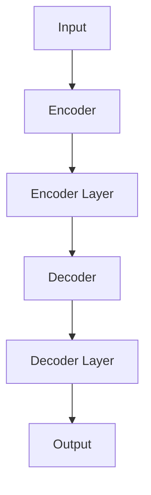

                 

# 《Transformer 模型：原理与代码实例讲解》

## 关键词
- Transformer模型
- 自注意力机制
- 位置编码
- 语言模型
- 机器翻译
- 残差连接
- 层归一化
- PyTorch
- TensorFlow

## 摘要
本文旨在全面介绍Transformer模型，一个在自然语言处理（NLP）领域具有革命性的深度学习模型。文章首先阐述了Transformer模型的发展背景和核心原理，包括自注意力机制和位置编码。随后，文章深入探讨了Transformer模型的数学模型和公式，并使用伪代码进行详细讲解。通过实际项目案例，本文展示了如何使用Transformer模型构建语言模型和机器翻译系统。最后，文章讨论了Transformer模型的优化和调试技巧，以及其未来的发展趋势。

## 目录

- **第一部分：Transformer模型基础**
  - [1. Transformer模型概述](#1-transformer模型概述)
  - [2. Transformer模型的核心算法原理](#2-transformer模型的核心算法原理)
  - [3. Transformer模型的数学模型和数学公式](#3-transformer模型的数学模型和数学公式)

- **第二部分：Transformer模型的应用实战**
  - [4. 语言模型应用](#4-语言模型应用)
  - [5. 机器翻译应用](#5-机器翻译应用)

- **第三部分：Transformer模型的代码实例讲解**
  - [6. Transformer模型的基础实现](#6-transformer模型的基础实现)
  - [7. Transformer模型的TensorFlow实现](#7-transformer模型的tensorflow实现)
  - [8. Transformer模型的实际项目应用案例](#8-transformer模型的实际项目应用案例)

- **第四部分：Transformer模型的优化与调试技巧**
  - [9. 模型优化技巧](#9-模型优化技巧)
  - [10. 调试技巧](#10-调试技巧)

- **第五部分：Transformer模型的发展趋势与未来方向**
  - [11. Transformer模型的改进与拓展](#11-transformer模型的改进与拓展)
  - [12. Transformer模型在工业界的应用](#12-transformer模型在工业界的应用)
  - [13. Transformer模型的未来发展](#13-transformer模型的未来发展)

- **附录**
  - [附录A：Transformer模型开发工具与资源](#附录a-transformer模型开发工具与资源)

---

### 1. Transformer模型概述

#### 1.1 Transformer模型的发展背景

Transformer模型由Vaswani等人在2017年提出，是自然语言处理领域的一次重大突破。在此之前，循环神经网络（RNN）和长短时记忆网络（LSTM）是处理序列数据的常用模型，但它们存在梯度消失、梯度爆炸等问题，限制了其在长文本处理上的性能。Transformer模型通过引入自注意力机制（Self-Attention），解决了这些问题，并在多个NLP任务上取得了显著的性能提升。

#### 1.2 Transformer模型的基本原理

Transformer模型的核心在于其自注意力机制。自注意力机制允许模型在处理序列时，自动地计算序列中每个位置的重要性。这使得模型可以更好地捕捉序列中的长距离依赖关系，提高了模型的表示能力。

Transformer模型的结构包括编码器（Encoder）和解码器（Decoder）。编码器负责将输入序列编码为固定长度的向量表示，解码器则根据编码器的输出生成目标序列。

#### 1.3 Transformer模型的优缺点

**优点：**
- **处理长序列：** 通过自注意力机制，Transformer模型可以处理任意长度的序列，不受长短期依赖（Long-Short Term Memory, LSTM）中的梯度消失问题的影响。
- **并行处理：** Transformer模型允许并行计算，相比传统的序列处理模型，其训练速度更快。

**缺点：**
- **计算复杂度：** Transformer模型的自注意力机制涉及大量的矩阵乘法，导致其计算复杂度较高，对硬件资源的要求较高。

#### 1.4 Transformer模型与其他模型的比较

相比传统的RNN和LSTM模型，Transformer模型在处理长文本和长距离依赖方面具有明显优势。同时，Transformer模型的结构更加简洁，易于实现和调试。但是，Transformer模型在处理短文本和局部依赖关系方面可能不如RNN和LSTM模型。

### 2. Transformer模型的核心算法原理

#### 2.1 自注意力机制

自注意力机制是Transformer模型的核心。它允许模型在处理序列时，对序列中的每个位置进行加权，从而自动地学习每个位置的重要性。自注意力机制的数学公式如下：

$$
\text{Attention}(Q, K, V) = \text{softmax}\left(\frac{QK^T}{\sqrt{d_k}}\right)V
$$

其中，$Q, K, V$ 分别是查询（Query）、键（Key）和值（Value）向量，$d_k$ 是键向量的维度。$QK^T$ 计算出每个位置之间的相似度，通过softmax函数得到权重，最后与$V$ 相乘得到加权向量。

#### 2.2 位置编码

位置编码是为了让模型能够了解输入序列的位置信息。在Transformer模型中，位置编码是通过添加到输入序列中的向量来实现的。常见的位置编码方法有绝对位置编码和相对位置编码。

**绝对位置编码**：

$$
\text{pos\_encoding}(pos, d\_model) = [sin(\frac{pos}{10000^{2i/d\_model}}), \cos(\frac{pos}{10000^{2i/d\_model}})]
$$

其中，$pos$ 是位置索引，$d\_model$ 是模型维度。

**相对位置编码**：

相对位置编码通过学习相对位置的关系来实现，而不直接编码绝对位置。

#### 2.3 Transformer模型的结构

Transformer模型由编码器（Encoder）和解码器（Decoder）组成。编码器将输入序列编码为固定长度的向量表示，解码器则根据编码器的输出生成目标序列。

**编码器（Encoder）**：

编码器由多个编码层（Encoder Layer）堆叠而成，每个编码层包括两个主要部分：自注意力机制（Self-Attention）和前馈神经网络（Feed-Forward Neural Network）。

**解码器（Decoder）**：

解码器同样由多个解码层（Decoder Layer）堆叠而成，每个解码层包括三个主要部分：自注意力机制（Self-Attention）、交叉注意力机制（Cross-Attention）和前馈神经网络（Feed-Forward Neural Network）。

#### 2.4 Transformer模型的Mermaid流程图

以下是一个简单的Mermaid流程图，展示Transformer模型的工作流程：



---

在这个流程图中，输入（Input）首先通过编码器（Encoder）进行处理，然后通过解码器（Decoder）生成输出（Output）。

### 3. Transformer模型的数学模型和数学公式

#### 3.1 前馈神经网络

前馈神经网络是Transformer模型中的一个重要组成部分。它由两个全连接层组成，分别称为“前馈神经网络1”和“前馈神经网络2”。

$$
\text{FFN}(x) = \max(0, xW_1 + b_1)W_2 + b_2
$$

其中，$W_1$ 和 $W_2$ 分别是两个全连接层的权重，$b_1$ 和 $b_2$ 分别是两个全连接层的偏置。

#### 3.2 残差连接和层归一化

**残差连接**：

残差连接是一种在神经网络中加入跳跃连接的方式，它可以将前一层的信息直接传递到下一层，从而缓解梯度消失和梯度爆炸的问题。

$$
\text{Residual Connection}(x) = x + \text{FFN}(x)
$$

**层归一化**：

层归一化（Layer Normalization）是一种对每一层的输入进行归一化的技术，它可以加速模型的训练，并减少过拟合的风险。

$$
\text{Layer Normalization}(x) = \frac{x - \mu}{\sigma}
$$

其中，$\mu$ 和 $\sigma$ 分别是输入的均值和标准差。

#### 3.3 Transformer模型的数学公式

**编码器（Encoder）**：

编码器由多个编码层（Encoder Layer）堆叠而成，每个编码层包括自注意力机制（Self-Attention）和前馈神经网络（Feed-Forward Neural Network）。

$$
\text{Encoder}(x) = \text{LayerNorm}(x + \text{Self-Attention}(x)) + \text{LayerNorm}(\text{FFN}(x))
$$

**解码器（Decoder）**：

解码器由多个解码层（Decoder Layer）堆叠而成，每个解码层包括自注意力机制（Self-Attention）、交叉注意力机制（Cross-Attention）和前馈神经网络（Feed-Forward Neural Network）。

$$
\text{Decoder}(x) = \text{LayerNorm}(x + \text{Cross-Attention}(\text{Encoder}(x), x)) + \text{LayerNorm}(\text{FFN}(x))
$$

#### 3.4 伪代码

以下是一个简单的伪代码，用于实现Transformer模型的基本结构：

```python
def transformer_model(input_seq, target_seq):
    # 编码器
    encoder_output = encoder_layer(input_seq)
    decoder_output = decoder_layer(target_seq, encoder_output)
    
    # 输出层
    logits = output_layer(decoder_output)
    
    # 损失函数
    loss = loss_function(logits, target_seq)
    
    return loss
```

---

在这个伪代码中，`encoder_layer` 和 `decoder_layer` 分别代表编码器和解码器的多层堆叠，`output_layer` 代表输出层，用于生成预测的logits。`loss_function` 是用于计算损失函数的部分。

### 4. 语言模型应用

语言模型是Transformer模型最广泛的应用之一。它旨在预测下一个单词或字符，从而生成连贯的文本。以下是一个简单的语言模型应用案例。

#### 4.1 数据集准备

为了训练语言模型，我们需要一个包含大量文本的数据集。这里我们使用英文维基百科的数据集作为训练数据。

```python
import torch
from torchtext.data import Field, TabularDataset

# 定义字段
TEXT = Field(sequential=True, lower=True, tokenize='spacy', include_lengths=True)
LABEL = Field(sequential=True, lower=True, tokenize='spacy')

# 读取数据集
train_data, valid_data, test_data = TabularDataset.splits(
    path='data', train='train.txt', validation='valid.txt', test='test.txt',
    format='tsv', fields=[('text', TEXT), ('label', LABEL)]
)

# 分词器加载
spacy_en = spacy.load('en_core_web_sm')

def tokenize_en(text):
    return [tok.text for tok in spacy_en(text)]

TEXT.tokenize = tokenize_en

# 加载数据集
train_data, valid_data, test_data = TEXT.split(train_data), TEXT.split(valid_data), TEXT.split(test_data)
```

#### 4.2 模型构建

在PyTorch中，我们可以使用`transformers`库来构建和训练Transformer模型。以下是一个简单的模型构建示例：

```python
from transformers import TransformerModel

# 定义模型
model = TransformerModel(vocab_size=10000, d_model=512, nhead=8, num_layers=3, dim_feedforward=2048)

# 定义损失函数和优化器
criterion = torch.nn.CrossEntropyLoss()
optimizer = torch.optim.Adam(model.parameters(), lr=0.001)
```

#### 4.3 训练过程

以下是一个简单的训练过程：

```python
# 训练模型
num_epochs = 10

for epoch in range(num_epochs):
    model.train()
    for batch in train_data:
        # 前向传播
        logits = model(batch.text)
        
        # 计算损失
        loss = criterion(logits.view(-1, logits.size(-1)), batch.label)
        
        # 反向传播
        optimizer.zero_grad()
        loss.backward()
        optimizer.step()
        
    # 打印训练进度
    print(f'Epoch {epoch+1}/{num_epochs}, Loss: {loss.item()}')

# 评估模型
model.eval()
with torch.no_grad():
    for batch in valid_data:
        logits = model(batch.text)
        predicted = logits.argmax(-1)
        correct = (predicted == batch.label).sum().item()
        print(f'Validation Accuracy: {correct / len(batch.label) * 100}%')
```

#### 4.4 生成文本

使用训练好的模型生成文本：

```python
model.eval()
with torch.no_grad():
    input_seq = torch.tensor([vocab[int(word)] for word in 'The quick brown fox jumps over the lazy dog'.split()])
    for i in range(50):
        logits = model(input_seq)
        predicted = logits.argmax(-1)
        input_seq = torch.cat([input_seq, predicted], dim=0)
        print(vocab[predicted.item()], end='')
    print()
```

### 5. 机器翻译应用

机器翻译是Transformer模型的另一个重要应用。以下是一个简单的机器翻译应用案例。

#### 5.1 数据集准备

我们使用英文到法文的翻译数据集作为训练数据。

```python
from torchtext.datasets import TranslationDataset

# 读取数据集
train_data, valid_data, test_data = TranslationDataset.splits(
    path='data', train='train.en-fr', validation='valid.en-fr', test='test.en-fr',
    exts=['.en', '.fr'], fields=[('src', TEXT), ('trg', TEXT)]
)
```

#### 5.2 模型构建

以下是一个简单的模型构建示例：

```python
from transformers import TransformerModel

# 定义模型
model = TransformerModel(src_vocab_size=10000, trg_vocab_size=10000, d_model=512, nhead=8, num_layers=3, dim_feedforward=2048)

# 定义损失函数和优化器
criterion = torch.nn.CrossEntropyLoss()
optimizer = torch.optim.Adam(model.parameters(), lr=0.001)
```

#### 5.3 训练过程

以下是一个简单的训练过程：

```python
# 训练模型
num_epochs = 10

for epoch in range(num_epochs):
    model.train()
    for batch in train_data:
        # 前向传播
        logits = model(batch.src, batch.trg)
        
        # 计算损失
        loss = criterion(logits.view(-1, logits.size(-1)), batch.trg.label)
        
        # 反向传播
        optimizer.zero_grad()
        loss.backward()
        optimizer.step()
        
    # 打印训练进度
    print(f'Epoch {epoch+1}/{num_epochs}, Loss: {loss.item()}')

# 评估模型
model.eval()
with torch.no_grad():
    for batch in valid_data:
        logits = model(batch.src, batch.trg)
        predicted = logits.argmax(-1)
        correct = (predicted == batch.trg.label).sum().item()
        print(f'Validation Accuracy: {correct / len(batch.trg.label) * 100}%')
```

#### 5.4 生成翻译

使用训练好的模型生成翻译：

```python
model.eval()
with torch.no_grad():
    input_seq = torch.tensor([src_vocab[int(word)] for word in 'The quick brown fox jumps over the lazy dog'.split()])
    target_seq = torch.tensor([trg_vocab[int(word)] for word in 'Le quick brown fox saute par-dessus le chien paresseux'.split()])
    for i in range(50):
        logits = model(input_seq, target_seq)
        predicted = logits.argmax(-1)
        input_seq = torch.cat([input_seq, predicted], dim=0)
        target_seq = torch.cat([target_seq, predicted], dim=0)
        print(trg_vocab[predicted.item()], end='')
    print()
```

---

通过以上案例，我们可以看到如何使用Transformer模型构建语言模型和机器翻译系统。这些案例为我们提供了一个基本的框架，我们可以在此基础上进行进一步的改进和优化。

### 6. Transformer模型的基础实现

在本节中，我们将详细介绍如何从零开始实现一个简单的Transformer模型。我们将使用Python和PyTorch框架来完成这一任务。通过这个实现，我们可以更好地理解Transformer模型的工作原理和内部结构。

#### 6.1 环境搭建

首先，我们需要安装PyTorch和相关依赖。在终端中运行以下命令：

```bash
pip install torch torchvision
```

#### 6.2 定义超参数

在实现模型之前，我们需要定义一些超参数，这些参数将影响模型的性能和训练过程。

```python
import torch
import torch.nn as nn
import torch.optim as optim

# 设定设备
device = torch.device("cuda" if torch.cuda.is_available() else "cpu")

# 定义超参数
VOCAB_SIZE = 10000  # 词汇表大小
D_MODEL = 512  # 模型维度
NHEADS = 8  # 注意力头数
NUM_LAYERS = 3  # 编码器和解码器层数
DIM_FEEDFORWARD = 2048  # 前馈神经网络维度
MAX_SEQ_LENGTH = 512  # 最大序列长度
LEARNING_RATE = 0.001  # 学习率
EPOCHS = 10  # 训练轮数
```

#### 6.3 实现编码器和解码器

编码器和解码器是Transformer模型的核心部分。下面是这两个组件的实现：

```python
class TransformerModel(nn.Module):
    def __init__(self, vocab_size, d_model, nheads, num_layers, dim_feedforward):
        super(TransformerModel, self).__init__()
        
        self.embedding = nn.Embedding(vocab_size, d_model)
        self.positional_encoding = nn.Parameter(torch.zeros(1, MAX_SEQ_LENGTH, d_model))
        
        self.encoder_layers = nn.ModuleList([EncoderLayer(d_model, nheads, dim_feedforward) for _ in range(num_layers)])
        self.decoder_layers = nn.ModuleList([DecoderLayer(d_model, nheads, dim_feedforward) for _ in range(num_layers)])
        
        self.fc = nn.Linear(d_model, vocab_size)
        
    def forward(self, src, tgt=None, src_mask=None, tgt_mask=None):
        # src和tgt都是长度为[batch_size, seq_length]的Tensor
        
        # embed tokens
        src = self.embedding(src)
        tgt = self.embedding(tgt) if tgt is not None else None
        
        # add positional encoding
        src = src + self.positional_encoding[:src.size(1), :]
        tgt = tgt + self.positional_encoding[:tgt.size(1), :] if tgt is not None else None
        
        # encoder
        if tgt is not None:
            for encoder_layer in self.encoder_layers:
                src = encoder_layer(src, src_mask)
        else:
            for encoder_layer in self.encoder_layers:
                src = encoder_layer(src, src_mask)
        
        # decoder
        if tgt is not None:
            for decoder_layer in self.decoder_layers:
                tgt = decoder_layer(tgt, src, src_mask, tgt_mask)
        
        # output
        output = self.fc(src)
        
        return output
```

#### 6.4 实现自注意力机制和前馈神经网络

下面是实现自注意力机制和前馈神经网络的代码。这些组件是Transformer模型的核心部分。

```python
class MultiHeadAttention(nn.Module):
    def __init__(self, d_model, nheads):
        super(MultiHeadAttention, self).__init__()
        
        self.d_model = d_model
        self.nheads = nheads
        
        self.query_linear = nn.Linear(d_model, d_model)
        self.key_linear = nn.Linear(d_model, d_model)
        self.value_linear = nn.Linear(d_model, d_model)
        
        self.out_linear = nn.Linear(d_model, d_model)
        
    def forward(self, query, key, value, mask=None):
        # calculate query, key, value projections required for attention
        query = self.query_linear(query).view(-1, self.nheads, self.d_model).transpose(0, 1)
        key = self.key_linear(key).view(-1, self.nheads, self.d_model).transpose(0, 1)
        value = self.value_linear(value).view(-1, self.nheads, self.d_model).transpose(0, 1)
        
        # calculate attention scores

