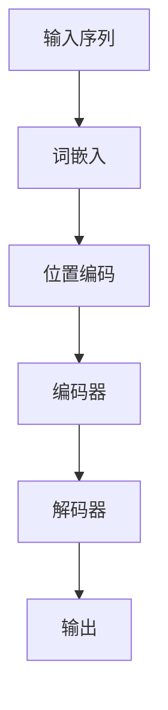
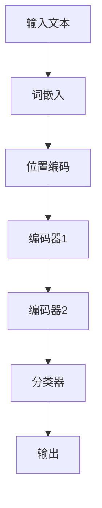

                 

# Transformer大模型实战 BERT 的工作原理

## 关键词
* Transformer
* BERT
* 自然语言处理
* 深度学习
* 模型实现
* 性能调优

## 摘要
本文将深入探讨Transformer大模型中的BERT（Bidirectional Encoder Representations from Transformers）的工作原理。我们将从Transformer与BERT的基础理论出发，详细介绍其核心算法原理和实战应用，并展示如何在实际项目中实现和优化BERT模型。此外，文章还将讨论Transformer与BERT的性能调优技巧及其在自然语言处理领域的未来发展趋势。

---

### 第一部分：Transformer与BERT基础理论

#### 第1章: Transformer与BERT概述

#### 1.1 Transformer与BERT的定义与特点

### 1.1.1 Transformer的定义与核心特点

Transformer模型是由Google在2017年提出的一种基于自注意力机制的序列到序列模型。它不再依赖于传统的循环神经网络（RNN）或卷积神经网络（CNN），而是通过多头自注意力机制（Multi-head Self-Attention）和位置编码（Positional Encoding）来处理序列数据。Transformer的核心特点如下：

1. **自注意力机制**：通过计算序列中每个词与所有词之间的关联程度来生成表示，能够捕捉长距离依赖关系。
2. **并行计算**：Transformer模型可以并行处理序列中的每个词，相比RNN序列处理方式，大大提高了计算效率。
3. **多头注意力**：通过多个注意力头学习不同类型的依赖关系，提高了模型的表示能力。
4. **位置编码**：为了保持序列的顺序信息，Transformer模型引入了位置编码。

### 1.1.2 BERT的定义与核心特点

BERT（Bidirectional Encoder Representations from Transformers）是由Google在2018年提出的一种预训练深度学习模型。BERT模型通过在大规模语料库上进行预训练，然后通过微调适应各种下游任务，如文本分类、问答系统等。BERT的核心特点如下：

1. **双向编码器**：BERT模型包含两个编码器，分别从左到右和从右到左对输入序列进行编码，从而学习到上下文信息。
2. **掩码语言模型（Masked Language Model, MLM）**：BERT通过随机遮盖输入序列中的部分词，并要求模型预测这些词来学习语言的模式和结构。
3. **上下文理解**：通过预训练，BERT能够理解句子中的上下文关系，提高模型在下游任务中的性能。
4. **多任务学习**：BERT模型在预训练过程中同时学习多种任务，从而提高了模型的泛化能力。

### 1.1.3 Transformer与BERT的关系与联系

Transformer是BERT模型的基础架构，而BERT则是基于Transformer进行预训练和微调的一种具体实现。具体来说，BERT模型使用了Transformer的自注意力机制和位置编码来构建双向编码器，并通过掩码语言模型进行预训练。在微调阶段，BERT模型通过添加下游任务的分类器，将预训练的模型迁移到具体的任务上。

#### 1.2 Transformer核心算法原理

##### 1.2.1 自注意力机制

自注意力机制是Transformer模型的核心组件之一。它通过计算序列中每个词与其他词之间的关联程度来生成表示。具体来说，自注意力机制可以分为以下三个步骤：

1. **计算Query、Key和Value**：
   - Query、Key和Value分别代表序列中每个词的查询、键和值。
   - Query、Key和Value通过词嵌入矩阵进行计算。

2. **计算注意力得分**：
   - 通过计算Query与Key之间的点积得到注意力得分。
   - 得分表示了Query与Key之间的关联程度。

3. **计算加权求和**：
   - 根据注意力得分对Value进行加权求和，得到每个词的表示。

##### 1.2.2 Transformer模型架构

Transformer模型由多个相同的编码器和解码器层组成。编码器负责从输入序列中提取特征，解码器则负责生成输出序列。具体来说，Transformer模型架构如下：

1. **编码器**：
   - 输入序列经过嵌入层转换为词嵌入向量。
   - 词嵌入向量通过位置编码层添加位置信息。
   - 输入序列通过多头自注意力层计算得到新的表示。
   - 新的表示通过前馈神经网络（FFN）进行非线性变换。
   - 通过层归一化和残差连接，将原始输入和变换后的输入进行加和。

2. **解码器**：
   - 输入序列通过嵌入层和位置编码层处理。
   - 输入序列通过多头自注意力层计算得到上下文信息。
   - 输入序列通过掩码多头自注意力层计算得到预测的词。
   - 预测的词通过前馈神经网络进行非线性变换。
   - 通过层归一化和残差连接，将原始输入和变换后的输入进行加和。

##### 1.2.3 Transformer训练与优化方法

Transformer模型的训练和优化主要包括以下步骤：

1. **预训练**：
   - 在大规模语料库上进行预训练，通过自回归语言模型（Autoregressive Language Model）和掩码语言模型（Masked Language Model）学习语言的特征。
   - 自回归语言模型通过预测下一个词来学习序列的生成。
   - 掩码语言模型通过遮盖输入序列中的部分词并预测这些词来学习语言的模式。

2. **优化方法**：
   - 使用梯度下降算法（Gradient Descent）来优化模型参数。
   - 使用自适应学习率方法（如Adam）来调整学习率。
   - 使用正则化技术（如Dropout）来防止过拟合。

#### 1.3 BERT模型原理

##### 1.3.1 BERT的结构与工作流程

BERT模型由两个主要部分组成：预训练和微调。具体来说，BERT模型的工作流程如下：

1. **预训练**：
   - 在大规模语料库上进行预训练，包括两个子任务：自回归语言模型（Masked Language Model, MLM）和下一句预测（Next Sentence Prediction, NSP）。
   - 自回归语言模型通过遮盖输入序列中的部分词并预测这些词来学习语言的模式和结构。
   - 下一句预测通过预测两个句子是否属于同一篇章来学习上下文关系。

2. **微调**：
   - 将预训练的BERT模型迁移到具体的下游任务上，如文本分类、问答系统等。
   - 在下游任务的数据集上进行微调，通过添加下游任务的分类器来优化模型参数。

##### 1.3.2 BERT的预训练与微调技术

BERT的预训练和微调技术主要包括以下方面：

1. **预训练技术**：
   - 自回归语言模型（Masked Language Model, MLM）：
     - 在输入序列中随机遮盖部分词，并要求模型预测这些词。
     - 遮盖的词包括全遮盖（全部遮盖）、部分遮盖（部分遮盖）和随机遮盖（随机遮盖）。
   - 下一句预测（Next Sentence Prediction, NSP）：
     - 从两个连续的句子中随机选择一个作为输入，并预测这两个句子是否属于同一篇章。

2. **微调技术**：
   - 在下游任务的数据集上进行微调，通过添加下游任务的分类器来优化模型参数。
   - 分类器通常是一个简单的全连接层，用于预测每个类别的概率。

##### 1.3.3 BERT的变体与优化方法

BERT模型的变体和优化方法主要包括以下方面：

1. **BERT变体**：
   - BERT-Base：包含1.1亿参数，是BERT的基础模型。
   - BERT-Large：包含3.4亿参数，是BERT的大型模型。
   - BERT-DIM：基于BERT的动态模型，能够动态调整模型的大小。

2. **优化方法**：
   - 微调前的数据预处理：
     - 对输入序列进行清洗、分词和转换。
     - 将输入序列转换为BERT模型需要的格式。
   - 微调过程中的训练策略：
     - 使用交叉熵损失函数来评估模型性能。
     - 使用学习率调整策略（如学习率衰减、余弦退火）来优化模型。
   - 微调后的性能评估：
     - 使用准确率、F1分数等指标来评估模型性能。

### 第二部分：Transformer与BERT实战应用

#### 第2章: Transformer与BERT在自然语言处理中的应用

#### 2.1 Transformer在文本分类中的应用

文本分类是自然语言处理领域中的一个重要任务，其目的是将文本数据划分为预先定义的类别。Transformer模型由于其强大的表示能力和并行计算优势，在文本分类任务中得到了广泛应用。下面我们将介绍Transformer在文本分类中的应用。

##### 2.1.1 Transformer文本分类算法原理

Transformer文本分类算法的基本原理可以概括为以下几个步骤：

1. **输入序列表示**：
   - 首先，将输入文本序列转换为词嵌入向量。
   - 词嵌入向量通过位置编码层添加位置信息。
   - 输入序列通过编码器层处理，得到序列的表示。

2. **分类器构建**：
   - 在编码器的最后一层，添加一个全连接层（分类器）。
   - 分类器的输出是每个类别的概率分布。

3. **损失函数**：
   - 使用交叉熵损失函数（Cross-Entropy Loss）来评估分类器的性能。
   - 通过反向传播（Backpropagation）更新分类器的参数。

##### 2.1.2 Transformer文本分类伪代码

```python
# 输入文本序列
input_sequence = "This is a sample text for text classification."

# 词嵌入向量
word_embedding = ...

# 位置编码向量
position_embedding = ...

# 编码器层
encoder_output = encoder(input_sequence, word_embedding, position_embedding)

# 分类器
classifier_output = classifier(encoder_output)

# 损失函数
loss = cross_entropy_loss(y_true, classifier_output)

# 反向传播
optimizer.minimize(loss)
```

##### 2.1.3 Transformer文本分类数学公式详解

1. **词嵌入向量**：

   $$ 
   \text{word_embedding}(x) = W_x \cdot x 
   $$

   其中，$W_x$是词嵌入矩阵，$x$是输入词向量。

2. **位置编码向量**：

   $$ 
   \text{position_embedding}(p) = W_p \cdot p 
   $$

   其中，$W_p$是位置编码矩阵，$p$是位置向量。

3. **编码器输出**：

   $$ 
   \text{encoder_output} = \text{Transformer}(input_sequence, word_embedding, position_embedding) 
   $$

4. **分类器输出**：

   $$ 
   \text{classifier_output} = \text{classifier}(encoder_output) 
   $$

5. **交叉熵损失函数**：

   $$ 
   \text{loss} = -\sum_{i} y_i \cdot \log(\hat{y}_i) 
   $$

   其中，$y_i$是真实标签的概率分布，$\hat{y}_i$是模型预测的概率分布。

#### 2.2 BERT在问答系统中的应用

问答系统是自然语言处理领域的一个重要应用，其目的是从给定的文本中找到与用户提问相关的答案。BERT模型由于其强大的上下文理解能力，在问答系统中表现出了优越的性能。下面我们将介绍BERT在问答系统中的应用。

##### 2.2.1 BERT问答系统算法原理

BERT问答系统算法的基本原理可以概括为以下几个步骤：

1. **输入文本表示**：
   - 首先，将用户提问和候选答案序列转换为BERT模型需要的输入格式。
   - 用户提问和候选答案序列通过BERT编码器层处理，得到序列的表示。

2. **答案选择**：
   - 在编码器的最后一层，添加一个全连接层（答案选择器）。
   - 答案选择器的输出是每个候选答案的得分。

3. **答案预测**：
   - 根据候选答案的得分，选择得分最高的答案作为预测结果。

##### 2.2.2 BERT问答系统伪代码

```python
# 用户提问
question = "What is the capital of France?"

# 候选答案
candidates = ["Paris", "London", "Berlin"]

# 输入文本表示
input_representation = bert.encode(question, candidates)

# 答案选择
answer_scores = answer_selector(input_representation)

# 答案预测
predicted_answer = candidates[np.argmax(answer_scores)]
```

##### 2.2.3 BERT问答系统数学公式详解

1. **BERT编码器输出**：

   $$ 
   \text{bert_output} = \text{BERT}(input_representation) 
   $$

2. **答案选择器输出**：

   $$ 
   \text{answer_scores} = \text{answer_selector}(bert_output) 
   $$

3. **答案预测**：

   $$ 
   \text{predicted_answer} = \text{candidates}[\arg\max(\text{answer_scores})] 
   $$

#### 2.3 Transformer与BERT在机器翻译中的应用

机器翻译是自然语言处理领域的一个经典任务，其目的是将一种语言的文本翻译成另一种语言。Transformer模型和BERT模型由于其强大的序列建模能力，在机器翻译任务中得到了广泛应用。下面我们将介绍Transformer与BERT在机器翻译中的应用。

##### 2.3.1 Transformer机器翻译算法原理

Transformer机器翻译算法的基本原理可以概括为以下几个步骤：

1. **源文本表示**：
   - 首先，将源文本序列转换为词嵌入向量。
   - 词嵌入向量通过位置编码层添加位置信息。
   - 源文本序列通过编码器层处理，得到序列的表示。

2. **目标文本生成**：
   - 在编码器的最后一层，添加一个解码器层。
   - 解码器层通过自注意力机制和交叉注意力机制生成目标文本序列的表示。

3. **预测与调整**：
   - 根据解码器输出的序列，使用贪心搜索（Greedy Search）或长度加权采样（Length-Weighted Sampling）方法生成目标文本序列。
   - 通过反向传播（Backpropagation）更新解码器的参数。

##### 2.3.2 Transformer机器翻译伪代码

```python
# 源文本
source_text = "Hello, how are you?"

# 目标文本
target_text = "你好，你怎么样？"

# 词嵌入向量
source_embedding = ...

# 位置编码向量
source_position_embedding = ...

# 目标词嵌入向量
target_embedding = ...

# 位置编码向量
target_position_embedding = ...

# 编码器层
source_representation = encoder(source_text, source_embedding, source_position_embedding)

# 解码器层
target_representation = decoder(target_text, target_embedding, target_position_embedding, source_representation)

# 预测与调整
predicted_target = predict(target_representation)

# 输出目标文本
output_target = predicted_target
```

##### 2.3.3 Transformer机器翻译数学公式详解

1. **源文本表示**：

   $$ 
   \text{source_representation} = \text{Transformer}(source_text, source_embedding, source_position_embedding) 
   $$

2. **目标文本生成**：

   $$ 
   \text{target_representation} = \text{Decoder}(target_text, target_embedding, target_position_embedding, source_representation) 
   $$

3. **预测与调整**：

   $$ 
   \text{predicted_target} = \text{predict}(target_representation) 
   $$

   $$ 
   \text{output_target} = \text{predicted_target} 
   $$

### 第三部分：项目实战与代码分析

#### 第3章: Transformer大模型实战项目

#### 3.1 项目背景与目标

##### 3.1.1 项目背景

随着人工智能技术的快速发展，自然语言处理（NLP）在各个领域得到了广泛应用。特别是在文本分类和问答系统等任务中，深度学习模型表现出了强大的性能。Transformer模型和BERT模型作为深度学习模型中的佼佼者，在NLP任务中得到了广泛应用。本项目旨在通过实现一个基于Transformer和BERT的文本分类项目，展示这些模型在NLP任务中的应用和效果。

##### 3.1.2 项目目标

本项目的主要目标如下：

1. **实现基于Transformer的文本分类模型**：
   - 利用Transformer模型实现文本分类算法。
   - 对输入文本进行预处理，包括分词、词嵌入和位置编码。
   - 构建编码器和解码器层，通过自注意力机制和交叉注意力机制处理文本数据。
   - 添加分类器，对文本进行分类。

2. **实现基于BERT的问答系统**：
   - 利用BERT模型实现问答系统算法。
   - 对输入问题和候选答案进行预处理，包括分词和词嵌入。
   - 利用BERT编码器层对输入序列进行处理，得到序列表示。
   - 添加答案选择器，根据序列表示选择最佳答案。

3. **评估模型性能**：
   - 在训练集和测试集上评估模型性能，包括准确率、召回率等指标。
   - 对模型进行调优，优化模型参数，提高模型性能。

#### 3.2 实战环境搭建

为了实现本项目，我们需要搭建相应的开发环境。以下是一些建议的软件和库：

1. **编程语言**：
   - Python：本项目采用Python编程语言进行实现。

2. **深度学习框架**：
   - TensorFlow：本项目采用TensorFlow作为深度学习框架。

3. **文本处理库**：
   - NLTK：用于文本处理，包括分词、词性标注等。

4. **BERT实现库**：
   - Hugging Face Transformers：用于加载预训练的BERT模型。

具体安装步骤如下：

1. **安装Python**：
   - 通过Python官方网站（https://www.python.org/）下载并安装Python。

2. **安装TensorFlow**：
   - 在命令行中运行以下命令：
     ```bash
     pip install tensorflow
     ```

3. **安装NLTK**：
   - 在命令行中运行以下命令：
     ```bash
     pip install nltk
     ```

4. **安装Hugging Face Transformers**：
   - 在命令行中运行以下命令：
     ```bash
     pip install transformers
     ```

安装完成后，我们可以使用以下代码进行测试：

```python
import tensorflow as tf
import nltk
import transformers

print(tf.__version__)
print(nltk.__version__)
print(transformers.__version__)
```

如果以上代码能够正常运行，说明我们的开发环境已经搭建成功。

#### 3.3 Transformer模型实现与优化

##### 3.3.1 模型实现

在本节中，我们将使用TensorFlow和Hugging Face Transformers库实现Transformer模型。具体步骤如下：

1. **导入相关库**：

   ```python
   import tensorflow as tf
   from transformers import TransformerModel, BertModel
   ```

2. **定义输入层**：

   ```python
   input_ids = tf.placeholder(shape=(None, sequence_length), dtype=tf.int32)
   input_mask = tf.placeholder(shape=(None, sequence_length), dtype=tf.float32)
   ```

3. **加载预训练的BERT模型**：

   ```python
   bert_model = BertModel.from_pretrained('bert-base-uncased')
   ```

4. **获取BERT模型的输出**：

   ```python
   bert_output = bert_model(input_ids=input_ids, attention_mask=input_mask)
   ```

5. **添加分类器**：

   ```python
   logits = tf.layers.dense(inputs=bert_output pooled_output=True, units=num_classes)
   ```

6. **定义损失函数和优化器**：

   ```python
   loss = tf.reduce_mean(tf.nn.softmax_cross_entropy_with_logits(logits=logits, labels=labels))
   optimizer = tf.train.AdamOptimizer(learning_rate=learning_rate).minimize(loss)
   ```

7. **评估模型性能**：

   ```python
   correct_predictions = tf.equal(tf.argmax(logits, 1), tf.argmax(labels, 1))
   accuracy = tf.reduce_mean(tf.cast(correct_predictions, tf.float32))
   ```

##### 3.3.2 模型优化

在模型实现的基础上，我们可以对模型进行优化，以提高模型性能。以下是一些常用的优化方法：

1. **学习率调整**：
   - 采用学习率衰减策略，随着训练的进行逐渐减小学习率。
   - 可以使用余弦退火策略来调整学习率。

2. **正则化**：
   - 采用L2正则化来防止过拟合。
   - 可以使用Dropout正则化来减少模型过拟合的风险。

3. **数据增强**：
   - 对训练数据进行数据增强，如随机裁剪、旋转、翻转等，以增加模型的泛化能力。

4. **模型压缩**：
   - 使用量化技术（Quantization）和剪枝技术（Pruning）来减小模型大小和提高模型运行速度。

5. **迁移学习**：
   - 利用预训练的BERT模型作为基础模型，通过微调适应具体的下游任务。

#### 3.4 BERT模型实现与优化

在本节中，我们将使用TensorFlow和Hugging Face Transformers库实现BERT模型。具体步骤如下：

##### 3.4.1 模型实现

1. **导入相关库**：

   ```python
   import tensorflow as tf
   from transformers import BertModel
   ```

2. **定义输入层**：

   ```python
   input_ids = tf.placeholder(shape=(None, sequence_length), dtype=tf.int32)
   input_mask = tf.placeholder(shape=(None, sequence_length), dtype=tf.float32)
   ```

3. **加载预训练的BERT模型**：

   ```python
   bert_model = BertModel.from_pretrained('bert-base-uncased')
   ```

4. **获取BERT模型的输出**：

   ```python
   bert_output = bert_model(input_ids=input_ids, attention_mask=input_mask)
   ```

5. **添加分类器**：

   ```python
   logits = tf.layers.dense(inputs=bert_output pooled_output=True, units=num_classes)
   ```

6. **定义损失函数和优化器**：

   ```python
   loss = tf.reduce_mean(tf.nn.softmax_cross_entropy_with_logits(logits=logits, labels=labels))
   optimizer = tf.train.AdamOptimizer(learning_rate=learning_rate).minimize(loss)
   ```

7. **评估模型性能**：

   ```python
   correct_predictions = tf.equal(tf.argmax(logits, 1), tf.argmax(labels, 1))
   accuracy = tf.reduce_mean(tf.cast(correct_predictions, tf.float32))
   ```

##### 3.4.2 模型优化

在模型实现的基础上，我们可以对模型进行优化，以提高模型性能。以下是一些常用的优化方法：

1. **学习率调整**：
   - 采用学习率衰减策略，随着训练的进行逐渐减小学习率。
   - 可以使用余弦退火策略来调整学习率。

2. **正则化**：
   - 采用L2正则化来防止过拟合。
   - 可以使用Dropout正则化来减少模型过拟合的风险。

3. **数据增强**：
   - 对训练数据进行数据增强，如随机裁剪、旋转、翻转等，以增加模型的泛化能力。

4. **模型压缩**：
   - 使用量化技术（Quantization）和剪枝技术（Pruning）来减小模型大小和提高模型运行速度。

5. **迁移学习**：
   - 利用预训练的BERT模型作为基础模型，通过微调适应具体的下游任务。

### 第四部分：性能调优与实战技巧

#### 第4章: Transformer与BERT性能调优

#### 4.1 训练与优化策略

为了提高Transformer和BERT模型在自然语言处理任务中的性能，我们需要采取一系列的训练与优化策略。以下是一些关键的策略：

##### 4.1.1 训练策略

1. **数据预处理**：
   - 清洗数据，去除噪声和冗余信息。
   - 分词和标记化，将文本转换为词序列。
   - 对词序列进行编码，使用词嵌入技术将词转换为向量表示。

2. **数据增强**：
   - 对训练数据应用数据增强技术，如随机填充、插入、替换等，以增加模型的泛化能力。
   - 使用不同的数据增强策略来模拟不同的真实场景。

3. **训练循环**：
   - 使用小批量梯度下降（Stochastic Gradient Descent, SGD）或其优化版本（如Adam）进行训练。
   - 设置合适的批次大小（Batch Size）和迭代次数（Epochs）。
   - 使用学习率调整策略，如学习率衰减或余弦退火。

4. **正则化**：
   - 采用L2正则化来防止过拟合。
   - 使用Dropout正则化来减少模型复杂度。

5. **模型评估**：
   - 在训练过程中定期评估模型性能，使用验证集进行监控。
   - 使用准确率、损失函数、F1分数等指标来评估模型性能。

##### 4.1.2 优化方法

1. **学习率调整**：
   - 学习率衰减：随着训练的进行逐渐减小学习率，以避免模型在训练过程中出现过拟合。
   - 余弦退火：使用余弦函数调整学习率，使学习率在训练过程中逐渐减小。

2. **批量归一化**：
   - 在模型的每一层都使用批量归一化（Batch Normalization）来稳定训练过程。
   - 通过批量归一化，将每一层的输入数据缩放并居中，使得每一层的输入数据分布更加稳定。

3. **权重初始化**：
   - 使用合适的权重初始化策略，如高斯分布或均匀分布。
   - 适当的权重初始化可以加快模型的收敛速度。

4. **激活函数**：
   - 使用ReLU激活函数，如ReLU、Leaky ReLU等，以增加模型的非线性能力。
   - 避免使用sigmoid或tanh等饱和性激活函数，以防止梯度消失问题。

##### 4.1.3 模型选择与调整

1. **模型选择**：
   - 根据任务需求和数据规模选择合适的模型。
   - 使用预训练模型，如BERT、GPT等，作为基础模型进行微调。
   - 对于特定任务，可以使用专门设计的模型，如ALBERT、RoBERTa等。

2. **模型调整**：
   - 调整模型结构，如增加或减少层、改变层的大小等。
   - 使用模型压缩技术，如剪枝、量化等，来减小模型大小和提高运行速度。

3. **超参数调整**：
   - 调整超参数，如学习率、批次大小、迭代次数等，以优化模型性能。
   - 使用网格搜索（Grid Search）或贝叶斯优化（Bayesian Optimization）等技术来搜索最佳超参数。

#### 4.2 实战技巧与案例分析

在实际应用中，Transformer和BERT模型的性能调优是一个复杂且细致的过程。以下是一些实战技巧和案例分析，以帮助开发者提高模型的性能。

##### 4.2.1 数据增强

数据增强是提高模型泛化能力的重要手段。以下是一些常用的数据增强技巧：

1. **文本填充**：
   - 随机在文本中插入额外的词汇或句子，以增加文本的多样性。
   - 可以通过使用预定义的词汇表或生成算法来实现。

2. **文本替换**：
   - 使用同义词替换文本中的词汇，以增加文本的多样性。
   - 可以通过使用词嵌入相似性或预定义的同义词列表来实现。

3. **文本裁剪**：
   - 随机裁剪文本的一部分，以模拟不同长度的文本输入。
   - 可以通过随机选择起始和结束位置来实现。

4. **文本旋转**：
   - 通过改变文本的顺序或结构来生成新的文本。
   - 可以通过使用规则或生成算法来实现。

以下是一个简单的文本填充示例：

```python
import random

def text_filling(text, token):
    start = random.randint(0, len(text) - 1)
    end = start + random.randint(1, len(text) - start)
    text = text[:start] + token + text[end:]
    return text

text = "This is a sample text for text classification."
filled_text = text_filling(text, "beautiful")
print(filled_text)
```

##### 4.2.2 多语言支持

Transformer和BERT模型在多语言文本处理任务中具有优势。以下是一些实现多语言支持的方法：

1. **双语语料库**：
   - 使用双语语料库进行预训练，包括源语言和目标语言的文本对。
   - 可以通过使用双语新闻文章、社交媒体帖子等来构建双语语料库。

2. **多语言预训练模型**：
   - 使用预训练的多语言BERT模型，如mBERT、XLM等。
   - 这些模型已经在多个语言上进行了预训练，可以直接用于多语言文本处理任务。

3. **翻译增强**：
   - 使用翻译增强技术，如使用机器翻译将源语言文本转换为另一种语言，然后使用该语言进行预训练。
   - 这可以通过现有的机器翻译模型（如神经机器翻译模型）来实现。

以下是一个使用mBERT模型进行多语言文本分类的示例：

```python
from transformers import TFBertForSequenceClassification, BertTokenizer

model_name = "bert-base-multilingual-cased"
tokenizer = BertTokenizer.from_pretrained(model_name)
model = TFBertForSequenceClassification.from_pretrained(model_name, num_labels=2)

text = "This is a sample text for text classification."
inputs = tokenizer(text, padding=True, truncation=True, return_tensors="tf")

labels = tf.constant([0])

model.compile(optimizer=tf.keras.optimizers.Adam(learning_rate=3e-5), loss=tf.keras.losses.SparseCategoricalCrossentropy(from_logits=True), metrics=[tf.keras.metrics.SparseCategoricalAccuracy()])

model.fit(inputs, labels, epochs=3)
```

##### 4.2.3 模型压缩与加速

在资源受限的环境下，模型压缩和加速是提高模型可部署性的关键。以下是一些常用的方法：

1. **模型剪枝**：
   - 剪枝是移除模型中的冗余权重，从而减小模型大小和提高运行速度。
   - 可以通过逐层剪枝、逐神经元剪枝等方法来实现。

2. **量化**：
   - 量化是将模型权重和激活值从浮点数转换为低比特位整数表示。
   - 这可以通过全精度量化（FP32）、半精度量化（FP16）或低精度量化（INT8）来实现。

3. **模型蒸馏**：
   - 模型蒸馏是将一个大型模型的知识传递给一个较小的模型。
   - 这可以通过使用大型模型的输出作为小模型的软目标来实现。

以下是一个使用TensorFlow模型压缩工具进行模型剪枝的示例：

```python
import tensorflow as tf

model = tf.keras.applications.MobileNetV2(input_shape=(224, 224, 3), include_top=False, weights='imagenet')

# 定义剪枝策略
pruning_params = {
    'pruning Scheme': 'FixedSP',
    'sparsity': 0.5,
    'pruning Step': 100,
}

# 应用剪枝策略
pruned_model = tfmot.sparsity.keras.prune_low_magnitude(model, pruning_params)

# 重新编译模型
pruned_model.compile(optimizer=tf.keras.optimizers.Adam(learning_rate=0.001), loss=tf.keras.losses.CategoricalCrossentropy(), metrics=['accuracy'])

# 训练剪枝模型
pruned_model.fit(train_data, train_labels, epochs=10, validation_data=(val_data, val_labels))
```

##### 4.2.4 案例分析

以下是一个基于Transformer和BERT模型的自然语言处理任务的案例分析：

**任务**：情感分析（Sentiment Analysis）

**数据集**：Twitter情感分析数据集（Twitter Sentiment Dataset）

**模型**：BERT（预训练模型）

**步骤**：

1. **数据预处理**：
   - 加载Twitter情感分析数据集，并进行清洗和预处理。
   - 对文本进行分词和标记化，将文本转换为词嵌入向量。
   - 将词嵌入向量输入到BERT模型进行编码。

2. **模型微调**：
   - 使用BERT模型作为基础模型，添加分类器进行微调。
   - 在训练过程中，使用学习率衰减和批量归一化等技术来优化模型性能。

3. **模型评估**：
   - 在训练集和测试集上评估模型性能，使用准确率、召回率等指标。
   - 调整模型参数，如学习率、批量大小等，以优化模型性能。

4. **模型部署**：
   - 将微调后的模型部署到生产环境，使用API进行实时预测。

以下是一个使用TensorFlow和Hugging Face Transformers进行情感分析任务的示例：

```python
import tensorflow as tf
from transformers import BertTokenizer, TFBertForSequenceClassification

model_name = "bert-base-uncased"
tokenizer = BertTokenizer.from_pretrained(model_name)
model = TFBertForSequenceClassification.from_pretrained(model_name, num_labels=2)

text = "This is a positive review."
inputs = tokenizer(text, padding=True, truncation=True, return_tensors="tf")

labels = tf.constant([1])

model.compile(optimizer=tf.keras.optimizers.Adam(learning_rate=3e-5), loss=tf.keras.losses.SparseCategoricalCrossentropy(from_logits=True), metrics=[tf.keras.metrics.SparseCategoricalAccuracy()])

model.fit(inputs, labels, epochs=3)

# 预测
predictions = model.predict(inputs)
predicted_label = tf.argmax(predictions, axis=1).numpy()[0]

print(f"Predicted label: {predicted_label}")
```

### 第五部分：未来展望与趋势

#### 第5章: Transformer与BERT的未来发展与趋势

随着深度学习和自然语言处理技术的不断进步，Transformer和BERT模型在未来将继续发挥重要作用，并在多个领域展现其潜力。以下是Transformer与BERT在未来发展中的几个趋势和挑战。

##### 5.1 自然语言处理领域的发展趋势

1. **预训练模型的多样化**：
   - 随着预训练模型的流行，更多预训练模型将被开发出来，以适应不同类型的自然语言处理任务。
   - 如多模态预训练模型、对话预训练模型等，以更好地处理图像、语音和文本等多媒体数据。

2. **小样本学习**：
   - 小样本学习是自然语言处理领域的一个重要研究方向。
   - 通过改进预训练模型和引入迁移学习技术，实现更有效的模型在小样本数据集上的性能提升。

3. **上下文理解的深化**：
   - 上下文理解是自然语言处理的核心问题之一。
   - 未来将看到更多研究致力于提高模型在复杂上下文中的理解能力，如跨语言、跨领域和跨时间上下文。

4. **长文本处理**：
   - 长文本处理是自然语言处理中的一个挑战，尤其是对于生成任务和序列标注任务。
   - 新的方法和技术将被提出，以更好地处理长文本，如长文本编码器和解码器。

##### 5.2 Transformer与BERT在实际应用中的挑战与机遇

1. **计算资源需求**：
   - Transformer和BERT模型通常需要大量的计算资源进行训练和推理。
   - 随着硬件技术的发展，如GPU、TPU和分布式计算等，将有助于降低模型的计算成本。

2. **数据隐私和安全**：
   - 随着数据隐私和安全问题的日益突出，如何在保障隐私的前提下进行大规模数据预训练成为一个重要挑战。
   - 可能需要开发隐私保护的预训练模型和数据集，如差分隐私和联邦学习等。

3. **模型解释性和透明度**：
   - Transformer和BERT模型通常被视为黑箱模型，其内部工作机制不透明。
   - 提高模型的可解释性和透明度，使其能够被非专业人士理解，是一个重要的研究方向。

4. **多模态处理**：
   - 多模态数据（如文本、图像、语音）的处理是未来的一个重要方向。
   - Transformer和BERT模型可以与其他模态处理模型结合，以实现更有效的多模态数据处理。

##### 5.2.3 未来发展策略

1. **持续优化算法和架构**：
   - 研究和开发更高效的算法和架构，以降低模型复杂度和计算成本。
   - 探索新的自注意力机制和编码器/解码器结构，以提高模型性能。

2. **多语言和跨语言处理**：
   - 加强多语言和跨语言预训练模型的研究，以实现更广泛的语言支持。
   - 探索跨语言知识迁移和跨语言上下文理解技术。

3. **模型安全和隐私保护**：
   - 开发隐私保护的数据预处理和模型训练技术，如差分隐私和联邦学习。
   - 加强对模型安全和隐私保护的研究，以应对未来的安全挑战。

4. **模型可解释性和透明度**：
   - 研究模型的可解释性技术，如注意力图、特征可视化等，以帮助用户理解模型的工作原理。
   - 探索透明化模型训练和推理过程的方法。

### 附录

#### 附录A: Transformer与BERT相关资源

以下是Transformer与BERT相关的资源，包括开源代码、论文推荐和主流框架与工具对比。

##### A.1 开源代码

1. **Transformer开源代码**：
   - [Transformer官方GitHub](https://github.com/tensorflow/models/tree/master/research transformer)
   - [Hugging Face Transformers库](https://github.com/huggingface/transformers)

2. **BERT开源代码**：
   - [BERT官方GitHub](https://github.com/google-research/bert)
   - [Hugging Face Transformers库](https://github.com/huggingface/transformers)

##### A.2 论文推荐

1. **Transformer相关论文**：
   - Vaswani et al., "Attention Is All You Need", 2017
   - Devlin et al., "BERT: Pre-training of Deep Bidirectional Transformers for Language Understanding", 2019
   - Zhang et al., "Reformer: The Efficient Transformer", 2020

2. **BERT相关论文**：
   - Devlin et al., "BERT: Pre-training of Deep Bidirectional Transformers for Language Understanding", 2019
   - Yang et al., "XLNet: Generalized Autoregressive Pretraining for Language Understanding", 2020

##### A.3 主流框架与工具对比

1. **TensorFlow**：
   - 开源深度学习框架，支持Transformer和BERT模型的实现。
   - 提供丰富的API和工具，易于模型部署和优化。

2. **PyTorch**：
   - 开源深度学习框架，支持Transformer和BERT模型的实现。
   - 提供动态计算图，适用于复杂的模型结构。

3. **Hugging Face Transformers**：
   - Python库，提供了预训练的Transformer和BERT模型。
   - 支持多种任务和应用场景，易于模型迁移和微调。

#### 附录B: Mermaid流程图与伪代码示例

以下是Transformer与BERT相关的Mermaid流程图和伪代码示例。

##### B.1 Transformer模型流程图



##### B.2 BERT模型流程图



##### B.3 Transformer文本分类伪代码

```python
# 输入文本
input_text = "This is a sample text for text classification."

# 词嵌入
word_embedding = ...

# 位置编码
position_embedding = ...

# 编码器
encoded_text = encoder(input_text, word_embedding, position_embedding)

# 解码器
decoded_text = decoder(encoded_text)

# 分类器
label = classifier(decoded_text)

# 输出
print(f"Predicted label: {label}")
```

##### B.4 BERT问答系统伪代码

```python
# 用户提问
user_question = "What is the capital of France?"

# 候选答案
candidate_answers = ["Paris", "London", "Berlin"]

# 输入文本表示
input_representation = bert.encode(user_question, candidate_answers)

# 答案选择器
predicted_answer = answer_selector(input_representation)

# 输出
print(f"Predicted answer: {predicted_answer}")
```

##### B.5 Transformer机器翻译伪代码

```python
# 源文本
source_text = "Hello, how are you?"

# 目标文本
target_text = "你好，你怎么样？"

# 词嵌入
source_embedding = ...

# 位置编码
source_position_embedding = ...

# 目标词嵌入
target_embedding = ...

# 位置编码
target_position_embedding = ...

# 编码器
source_representation = encoder(source_text, source_embedding, source_position_embedding)

# 解码器
target_representation = decoder(target_text, target_embedding, target_position_embedding, source_representation)

# 预测与调整
predicted_target = predict(target_representation)

# 输出
output_target = predicted_target
```

