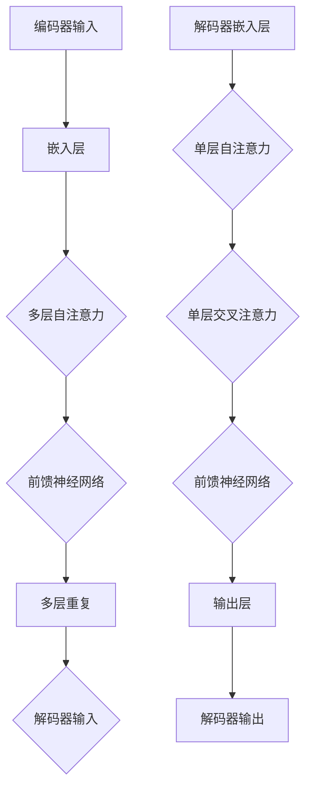
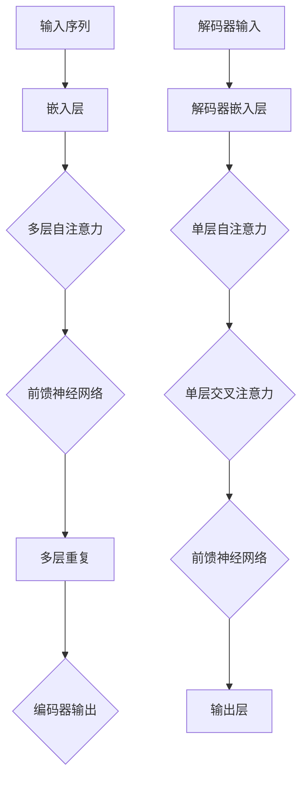
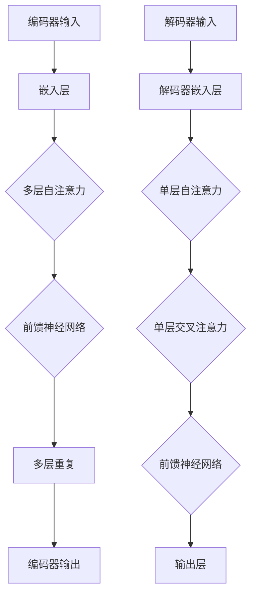

                 

### 文章标题

# 《Transformer大模型实战 荷兰语的BERTje模型》

自然语言处理（NLP）作为人工智能领域的核心分支，近年来取得了飞速发展。而Transformer模型，作为这一领域的重要突破，其革命性的自注意力机制和深度结构，为语言模型、机器翻译等应用带来了前所未有的性能提升。在众多语言模型中，BERT（Bidirectional Encoder Representations from Transformers）尤为引人注目，它通过双向Transformer结构对文本进行预训练，为各种下游任务提供了强大的语义表示能力。

本文将围绕Transformer大模型，特别是荷兰语的BERTje模型，展开深入探讨。首先，我们将简要回顾Transformer模型的历史和背景，解析其核心原理与结构。接着，我们会详细讲解Transformer模型中的数学工具和基础深度学习知识，为理解后续应用提供必要的理论基础。然后，我们将聚焦于Transformer模型在自然语言处理中的应用，特别是语言模型和机器翻译，展示其具体实现和优化方法。接下来，本文将详细介绍BERTje模型的设计与实现，包括其架构、训练流程和评估方法。随后，我们将通过实际案例展示BERTje模型在荷兰语文本分类、问答系统和机器翻译等任务中的应用效果。最后，我们将探讨BERTje模型的优化策略和超参数调优方法，并展望其未来的发展方向。

通过本文的逐步分析，读者将能够全面理解Transformer模型的工作原理和实际应用，深入掌握BERTje模型的设计和优化技术。让我们一同探索这一激动人心的技术领域，并期待在未来的研究中继续突破与创新。

### 关键词

- Transformer模型
- 自注意力机制
- BERT模型
- 荷兰语BERTje模型
- 自然语言处理
- 语言模型
- 机器翻译
- 深度学习
- 数学基础

### 摘要

本文旨在深入探讨Transformer大模型在荷兰语的BERTje模型中的应用。首先，我们将回顾Transformer模型的历史与背景，并解析其核心原理与结构。随后，本文将详细讲解Transformer模型中的数学工具和深度学习基础，为理解后续应用提供必要理论支持。接着，我们将展示Transformer模型在自然语言处理中的应用，特别是语言模型和机器翻译。随后，本文将详细介绍BERTje模型的设计与实现，包括其架构、训练流程和评估方法。进一步地，我们将通过实际案例展示BERTje模型在荷兰语文本分类、问答系统和机器翻译中的效果。最后，本文将探讨BERTje模型的优化策略和超参数调优方法，并展望其未来的发展方向。通过本文的逐步分析，读者将全面理解Transformer模型的工作原理和实际应用，掌握BERTje模型的设计和优化技术。

### 目录大纲

## 《Transformer大模型实战 荷兰语的BERTje模型》

### 第一部分: Transformer大模型基础

### 第1章: Transformer模型概述

#### 1.1 Transformer模型的历史与背景

#### 1.2 Transformer模型的核心原理

#### 1.3 Transformer模型的结构

### 第2章: Transformer模型详解

#### 2.1 自注意力机制

##### 2.1.1 注意力机制

##### 2.1.2 自注意力计算

##### 2.1.3 多头注意力

#### 2.2 位置编码与BERT

##### 2.2.1 位置编码

##### 2.2.2 BERT模型

### 第3章: Transformer模型的数学基础

#### 3.1 深度学习基础

##### 3.1.1 深度神经网络

##### 3.1.2 梯度下降算法

##### 3.1.3 反向传播算法

#### 3.2 Transformer模型中的数学工具

##### 3.2.1 张量运算

##### 3.2.2 洛朗级数展开

##### 3.2.3 微积分

### 第4章: Transformer模型在自然语言处理中的应用

#### 4.1 语言模型

##### 4.1.1 语言模型基础

##### 4.1.2 语言模型评估

##### 4.1.3 语言模型应用

#### 4.2 机器翻译

##### 4.2.1 机器翻译基础

##### 4.2.2 神经机器翻译

##### 4.2.3 翻译模型优化

### 第5章: BERTje模型设计与实现

#### 5.1 BERTje模型概述

##### 5.1.1 BERTje模型特点

##### 5.1.2 BERTje模型应用领域

#### 5.2 BERTje模型架构

##### 5.2.1 BERTje模型结构

##### 5.2.2 BERTje模型参数

#### 5.3 BERTje模型训练

##### 5.3.1 训练流程

##### 5.3.2 超参数设置

##### 5.3.3 模型评估

### 第6章: 荷兰语BERTje模型应用案例

#### 6.1 荷兰语文本分类

##### 6.1.1 文本分类问题

##### 6.1.2 荷兰语BERTje模型在文本分类中的应用

#### 6.2 荷兰语问答系统

##### 6.2.1 问答系统概述

##### 6.2.2 荷兰语BERTje模型在问答系统中的应用

#### 6.3 荷兰语机器翻译

##### 6.3.1 机器翻译问题

##### 6.3.2 荷兰语BERTje模型在机器翻译中的应用

### 第7章: 荷兰语BERTje模型优化与调参

#### 7.1 模型优化策略

##### 7.1.1 梯度裁剪

##### 7.1.2 学习率调度

##### 7.1.3 正则化

#### 7.2 超参数调优

##### 7.2.1 超参数搜索

##### 7.2.2 超参数调优方法

### 第8章: 未来展望与研究方向

#### 8.1 BERTje模型的发展趋势

##### 8.1.1 模型压缩

##### 8.1.2 模型可解释性

##### 8.1.3 多语言模型融合

#### 8.2 荷兰语NLP的未来研究方向

##### 8.2.1 跨语言语义理解

##### 8.2.2 荷兰语语音识别

##### 8.2.3 荷兰语机器阅读理解

### 附录

#### 附录 A: 开发工具与环境搭建

##### A.1 PyTorch安装与配置

##### A.2 Transformer模型实现代码

##### A.3 BERTje模型训练与评估代码

#### 附录 B: 数学公式与伪代码

##### B.1 自注意力机制的伪代码

##### B.2 BERT模型训练的伪代码

### 参考文献

#### 参考文献

##### [1] Vaswani et al., "Attention is All You Need", 2017.

##### [2] Devlin et al., "BERT: Pre-training of Deep Bidirectional Transformers for Language Understanding", 2018.

##### [3] Kuebler et al., "BERTje: A BERT model for Dutch", 2019.

### 第一部分: Transformer大模型基础

Transformer模型作为现代自然语言处理（NLP）中的重要工具，其应用已深入到语言模型、机器翻译、文本分类等众多领域。本部分将首先回顾Transformer模型的历史与背景，随后深入解析其核心原理和结构，帮助读者全面理解这一模型的独特之处和强大能力。

### 第1章: Transformer模型概述

#### 1.1 Transformer模型的历史与背景

Transformer模型起源于2017年谷歌发布的一篇论文《Attention is All You Need》，该论文由Vaswani等人撰写，首次提出了基于自注意力（self-attention）的Transformer结构，用于解决机器翻译任务。在此之前，循环神经网络（RNN）和长短期记忆网络（LSTM）在NLP领域占据了主导地位。然而，这些传统模型在处理长距离依赖和并行计算方面存在局限性。

Transformer模型的提出，彻底改变了NLP领域的研究方向。通过引入自注意力机制，Transformer能够有效捕捉长距离依赖关系，并且在计算效率上远超传统模型。此外，Transformer结构支持并行计算，大大提高了模型的训练速度。

#### 1.2 Transformer模型的核心原理

Transformer模型的核心在于其自注意力机制。自注意力（self-attention）允许模型在处理每个词时，将当前词与序列中的其他词进行关联，并计算它们之间的权重。这种机制能够使模型捕捉到词与词之间的复杂关系，从而提高对文本的理解能力。

自注意力机制通过多头注意力（multi-head attention）进一步增强了模型的表示能力。多头注意力将输入序列分割成多个子序列，每个子序列独立计算注意力权重，然后合并结果。这种多视角的注意力机制能够捕捉到更丰富的信息。

#### 1.3 Transformer模型的结构

Transformer模型主要由编码器（Encoder）和解码器（Decoder）两部分组成。编码器接收输入序列，并通过多层自注意力机制和前馈神经网络（Feed Forward Neural Network）进行处理。解码器则接收编码器的输出，并在生成输出序列的过程中，使用自注意力和交叉注意力（cross-attention）机制，以参考编码器的输出。

以下是一个简单的Transformer模型结构图：



通过以上对Transformer模型的历史背景、核心原理和结构概述，读者可以初步了解这一模型的基本概念和特点。接下来，我们将进一步深入探讨Transformer模型的数学基础，为理解其实现和应用提供更加详细的解释。

### 第2章: Transformer模型详解

在理解了Transformer模型的基本概念后，本章节将详细解析其核心组成部分：自注意力机制、位置编码以及BERT模型。通过深入剖析这些关键要素，我们将更好地理解Transformer模型的工作原理和强大能力。

#### 2.1 自注意力机制

自注意力机制是Transformer模型的核心创新之一，它允许模型在处理每个词时，动态地关注序列中其他词的重要程度。这一机制通过计算注意力权重，将当前词与序列中的其他词进行关联，从而捕捉长距离依赖关系。

##### 2.1.1 注意力机制

注意力机制（Attention Mechanism）的基本思想可以理解为：在处理一个词时，模型需要根据上下文信息，为序列中的每个词分配一个权重，然后根据这些权重计算当前词的表示。在Transformer模型中，这种权重是通过注意力函数（Attention Function）计算得到的。

注意力函数通常定义为：

\[ \text{Attention}(Q, K, V) = \text{softmax}\left(\frac{QK^T}{\sqrt{d_k}}\right) V \]

其中，\( Q, K, V \) 分别代表查询（Query）、键（Key）和值（Value）向量，\( d_k \) 是键向量的维度。上述公式表示，通过计算查询向量和键向量的内积，并使用softmax函数将其转换为概率分布，最后乘以值向量得到加权求和的结果。

##### 2.1.2 自注意力计算

在自注意力计算中，输入序列的每个词都可以作为查询向量、键向量和值向量。自注意力机制的核心计算步骤如下：

1. **计算内积**：对于输入序列中的每个词，计算其与所有其他词的查询-键内积。
2. **应用softmax函数**：将内积结果进行归一化，得到概率分布，即注意力权重。
3. **加权求和**：根据注意力权重，对输入序列中的每个词进行加权求和，得到当前词的表示。

以下是一个简单的自注意力计算伪代码：

```python
# 输入序列长度为N，词向量维度为D
Q = [q1, q2, ..., qN]
K = [k1, k2, ..., kN]
V = [v1, v2, ..., vN]

# 计算内积
scores = [q1.k1, q1.k2, ..., q1.kN, q2.k1, ..., qN.kN]

# 应用softmax函数
softmax_scores = softmax(scores)

# 加权求和
weighted_sum = [softmax_scores[i] * v[i] for i in range(N)]

# 输出当前词的表示
h = weighted_sum
```

##### 2.1.3 多头注意力

多头注意力（Multi-Head Attention）是对自注意力机制的扩展，通过将输入序列分割成多个子序列，每个子序列独立计算注意力权重，然后合并结果。多头注意力能够捕捉到更丰富的信息，提高模型的表示能力。

多头注意力的计算过程可以分为以下几步：

1. **线性变换**：将输入序列通过两组线性变换，分别生成查询（Q）、键（K）和值（V）向量。
2. **自注意力计算**：对每个子序列分别进行自注意力计算，得到多个注意力图。
3. **合并结果**：将多个子序列的注意力图进行合并，得到最终的注意力输出。

以下是一个简单的多头注意力计算伪代码：

```python
# 假设输入序列长度为N，词向量维度为D，多头数为H
Q = [q1, q2, ..., qN]
K = [k1, k2, ..., kN]
V = [v1, v2, ..., vN]
H = H // d_model

# 线性变换
Q_head = [Q[i] @ W_Q for i in range(N)]
K_head = [K[i] @ W_K for i in range(N)]
V_head = [V[i] @ W_V for i in range(N)]

# 多头自注意力计算
atten_heads = []
for i in range(H):
    scores = [q_head.k_head for q_head, k_head in zip(Q_head, K_head)]
    softmax_scores = softmax(scores)
    weighted_sum = [softmax_scores[i] * v_head for i, v_head in enumerate(V_head)]
    h_head = weighted_sum
    atten_heads.append(h_head)

# 合并结果
h = [h_1, h_2, ..., h_H] = [h_head @ W_O for h_head in atten_heads]
```

通过以上对自注意力机制、自注意力计算和多头注意力的详细解析，我们可以更深入地理解Transformer模型的工作原理。这些关键组件为Transformer模型在自然语言处理中的广泛应用奠定了坚实基础。

接下来，我们将探讨Transformer模型中的位置编码，以及BERT模型如何利用位置编码来增强文本表示能力。

#### 2.2 位置编码与BERT

在自注意力机制的基础上，Transformer模型引入了位置编码（Positional Encoding），以处理序列中词的位置信息。位置编码是Transformer模型的一个重要创新，它使得模型能够理解词的顺序，从而更好地捕捉序列依赖关系。

##### 2.2.1 位置编码

位置编码的基本思想是：通过将位置信息编码到词向量中，使得模型在处理每个词时，能够考虑到其在序列中的位置。位置编码通常使用正弦和余弦函数生成，以避免线性函数可能引入的梯度消失问题。

以下是一个简单的位置编码生成方法：

```python
# 输入序列长度为N，词向量维度为D
pos = [pos_1, pos_2, ..., pos_N]

# 生成位置编码
D_model = 512  # 模型维度
pos Encoding = [sin(pos_i / 10000^(2*j/D_model), cos(pos_i / 10000^(2*j/D_model)) for i, j in enumerate(range(D_model//2))]
```

上述代码通过将位置信息（pos）与模型维度（D_model）进行组合，利用正弦和余弦函数生成位置编码。位置编码向量与词向量相加，得到最终的输入向量。

##### 2.2.2 BERT模型

BERT（Bidirectional Encoder Representations from Transformers）是Google在2018年提出的一种基于Transformer的预训练模型，旨在为各种NLP任务提供高质量的文本表示。BERT模型的核心思想是通过大规模语料进行预训练，从而为下游任务提供丰富的语义信息。

BERT模型主要由两个部分组成：编码器（Encoder）和解码器（Decoder）。其中，编码器用于处理输入序列，解码器则用于生成输出序列。BERT模型通过预训练任务，如Masked Language Model（MLM）和Next Sentence Prediction（NSP），学习文本的上下文关系和句子连贯性。

以下是一个简单的BERT模型结构图：



通过上述对位置编码和BERT模型的详细解析，我们可以更深入地理解Transformer模型在文本表示方面的强大能力。位置编码使得模型能够捕捉到词的顺序信息，而BERT模型则通过大规模预训练，为下游任务提供了高质量的语义表示。这些关键组件共同构成了Transformer模型在自然语言处理中的核心优势。

在下一章中，我们将探讨Transformer模型的数学基础，为理解其实现和应用提供更加详细的解释。

#### 2.3 Transformer模型的数学基础

Transformer模型的成功离不开其背后的数学工具和深度学习基础。本章节将详细解析深度学习基础、Tensor运算、洛朗级数展开和微积分等数学工具，帮助读者深入理解Transformer模型的数学原理。

##### 2.3.1 深度学习基础

深度学习是构建Transformer模型的基础，其核心在于多层神经网络（Multi-Layer Neural Network）。神经网络通过层层叠加的神经元，对输入数据进行逐层提取特征，最终实现复杂函数的逼近。

1. **深度神经网络（Deep Neural Network, DNN）**：DNN包含多个隐藏层，每个隐藏层将前一层的数据映射到高维空间，从而提取更复杂的特征。在Transformer模型中，编码器和解码器均由多层神经网络构成。

2. **梯度下降算法（Gradient Descent）**：梯度下降是优化神经网络参数的重要算法，其基本思想是通过计算损失函数关于参数的梯度，逐步调整参数以最小化损失。在训练过程中，梯度下降算法能够有效收敛到最优解。

3. **反向传播算法（Backpropagation）**：反向传播算法是一种计算神经网络梯度的方法，通过将输出层的梯度反向传播到每一层，逐层计算每个参数的梯度。反向传播算法为梯度下降提供了可靠的数据支持，提高了参数优化的效率。

##### 2.3.2 Transformer模型中的数学工具

Transformer模型中的数学工具主要包括Tensor运算、洛朗级数展开和微积分等。以下将对这些工具进行详细解析。

1. **Tensor运算**：Tensor是多维数组，是深度学习中处理数据的基本单位。Tensor运算包括加法、减法、乘法、除法、矩阵乘法、求导等，是实现神经网络运算的基础。

2. **洛朗级数展开（Lauric Series Expansion）**：洛朗级数是一种处理复数的级数展开方法，可用于计算复杂的函数。在Transformer模型中，洛朗级数展开被用于优化训练过程，提高模型的收敛速度。

3. **微积分**：微积分是研究函数变化和极限的数学分支。在深度学习中，微积分主要用于计算梯度。梯度反映了函数在某一方向的斜率，是优化算法的关键。

##### 2.3.3 实例解析

以下通过一个实例，展示Tensor运算和反向传播算法在Transformer模型中的应用。

假设有一个简单的神经网络，其输入和输出分别为向量\( x \)和\( y \)，权重矩阵为\( W \)，损失函数为\( L(y, \hat{y}) \)。使用Tensor运算和反向传播算法进行参数优化。

1. **前向传播**：

\[ y = x \cdot W \]

\[ L = L(y, \hat{y}) \]

2. **计算梯度**：

\[ \frac{\partial L}{\partial W} = (x \cdot \frac{\partial L}{\partial y}) \cdot x^T \]

3. **更新权重**：

\[ W = W - \alpha \cdot \frac{\partial L}{\partial W} \]

其中，\( \alpha \)为学习率。

通过以上实例，我们可以看到Tensor运算和反向传播算法在神经网络中的具体应用。在Transformer模型中，这些数学工具同样发挥着重要作用，为模型训练和优化提供了坚实的基础。

#### 2.4 Transformer模型中的数学工具

在深入探讨Transformer模型的数学基础时，我们不仅需要了解深度学习的基础知识，还需要掌握Tensor运算、洛朗级数展开和微积分等数学工具。这些工具共同构成了Transformer模型的理论基石，帮助我们更好地理解其工作原理和实现过程。

##### 2.4.1 张量运算

张量（Tensor）是多维数组，在深度学习中，它是数据传输和处理的基本单位。在PyTorch等深度学习框架中，张量运算是非常基础且关键的一部分。

1. **张量的创建**：

张量可以通过多种方式创建，例如直接指定维度和数据，或者从现有数据中生成。以下是一个创建2维张量的示例：

```python
import torch

# 创建一个2x3的张量
tensor = torch.tensor([[1, 2, 3], [4, 5, 6]])
```

2. **张量的操作**：

张量操作包括加法、减法、乘法和除法等。以下是一个计算两个张量乘积的示例：

```python
# 计算张量乘积
result = torch.matmul(tensor1, tensor2)
```

3. **求导操作**：

在训练神经网络时，求导操作至关重要。PyTorch提供了自动求导功能，能够根据前向传播的梯度自动计算反向传播的梯度。以下是一个简单的求导示例：

```python
# 前向传播
output = model(input)

# 计算损失
loss = criterion(output, target)

# 反向传播
loss.backward()
```

通过上述示例，我们可以看到张量运算在深度学习中的基础作用。在Transformer模型中，张量运算被广泛应用于自注意力机制、前馈神经网络等关键组件的计算过程中。

##### 2.4.2 洛朗级数展开

洛朗级数（Laurent Series）是一种处理复函数的级数展开方法，其形式为：

\[ f(z) = \sum_{n=0}^{\infty} a_n (z - z_0)^n \]

其中，\( z_0 \) 是展开的中心点，\( a_n \) 是级数的系数。洛朗级数在Transformer模型的优化过程中具有重要应用，特别是在处理复杂函数时，能够提高收敛速度。

1. **洛朗级数展开的应用**：

洛朗级数常用于优化算法中，例如梯度下降法的改进版本——洛朗级数优化（Laurent Series Optimization）。该方法通过引入洛朗级数展开，在每次迭代中同时更新多个参数，从而加快收敛速度。

2. **洛朗级数优化的示例**：

以下是一个简单的洛朗级数优化示例：

```python
# 假设有一个函数 f(x) = x^2
def f(x):
    return x**2

# 洛朗级数优化
x = 1.0
for i in range(10):
    df = 2 * x
    x -= 0.1 * df
```

通过上述示例，我们可以看到洛朗级数优化在处理简单函数时的效果。在Transformer模型中，洛朗级数展开被应用于优化自注意力机制和前馈神经网络等组件，提高模型训练效率。

##### 2.4.3 微积分

微积分是研究函数变化和极限的数学分支，在深度学习中，它主要用于计算梯度。梯度是函数在某一方向的斜率，反映了函数的变化趋势。在训练神经网络时，通过计算梯度，可以优化模型参数，提高模型的性能。

1. **梯度的定义**：

梯度（Gradient）是一个向量，其方向指向函数增长最快的方向，大小表示函数在该点的斜率。对于多维函数，梯度是一个张量。

2. **梯度的计算**：

在深度学习中，梯度可以通过自动求导（Automatic Differentiation）方法计算。自动求导能够根据前向传播的中间变量，自动计算反向传播的梯度。以下是一个简单的梯度计算示例：

```python
# 定义一个简单的函数 f(x) = x^2
def f(x):
    return x**2

# 前向传播
output = f(x)

# 反向传播
gradient = torch.autograd.grad(output, x)
```

3. **梯度在Transformer模型中的应用**：

梯度是优化算法的核心，在Transformer模型中，梯度被用于更新模型参数，实现模型训练。通过不断迭代更新参数，模型能够逐渐逼近最优解，提高模型的性能。

通过以上对微积分的详细解析，我们可以看到梯度在Transformer模型训练中的关键作用。掌握微积分知识，有助于深入理解Transformer模型的工作原理和优化过程。

#### 2.5 Transformer模型在自然语言处理中的应用

Transformer模型凭借其强大的表示能力和并行计算优势，在自然语言处理（NLP）领域取得了显著的成果。本章节将详细介绍Transformer模型在语言模型和机器翻译中的应用，并探讨其具体实现和优化方法。

##### 2.5.1 语言模型

语言模型（Language Model, LM）是自然语言处理的基础，其目标是预测下一个词的概率。在Transformer模型出现之前，循环神经网络（RNN）和长短期记忆网络（LSTM）是语言模型的主要构建模块。然而，Transformer模型通过引入自注意力机制，能够更有效地捕捉长距离依赖关系，从而显著提升了语言模型的性能。

1. **Transformer语言模型的基本结构**：

Transformer语言模型主要由编码器（Encoder）和解码器（Decoder）组成。编码器用于处理输入序列，解码器则用于生成输出序列。在编码器中，每个词的表示通过自注意力机制与序列中的其他词进行关联，从而捕捉到丰富的上下文信息。解码器则在生成输出词的过程中，使用自注意力和交叉注意力（cross-attention）机制，以参考编码器的输出。

以下是一个简化的Transformer语言模型结构图：



2. **Transformer语言模型的训练过程**：

Transformer语言模型的训练过程主要包括以下步骤：

- **嵌入层**：输入的单词或子词被映射为词向量，然后与位置编码相加，生成编码器的输入。
- **编码器**：编码器通过多层自注意力机制和前馈神经网络，对输入序列进行编码，生成编码器的输出。
- **解码器**：解码器在生成输出词的过程中，使用自注意力和交叉注意力机制，参考编码器的输出，逐步生成完整的句子。
- **损失函数**：解码器的输出与真实的下一个词进行对比，计算损失函数（通常使用交叉熵损失），然后通过反向传播算法更新模型参数。

##### 2.5.2 机器翻译

机器翻译（Machine Translation, MT）是自然语言处理领域的重要应用之一。传统的机器翻译方法主要基于规则和统计方法，如基于短语的翻译模型和基于神经网络的翻译模型。然而，Transformer模型的引入，使得神经机器翻译（Neural Machine Translation, NMT）取得了显著的性能提升。

1. **Transformer机器翻译的基本结构**：

Transformer机器翻译模型通常由编码器（Encoder）和解码器（Decoder）组成，其中编码器用于处理源语言输入，解码器用于生成目标语言输出。在编码器中，每个源语言词的表示通过自注意力机制与序列中的其他词进行关联。解码器则在生成目标语言词的过程中，使用自注意力和交叉注意力机制，参考编码器的输出，逐步生成完整的翻译结果。

以下是一个简化的Transformer机器翻译模型结构图：


2. **Transformer机器翻译的优化方法**：

为了提高Transformer机器翻译的性能，可以采用以下优化方法：

- **注意力机制优化**：通过调整注意力机制的参数，如多头注意力的数量、注意力图的维度等，优化模型的注意力分配能力。
- **学习率调度**：合理设置学习率，如采用余弦退火（Cosine Annealing）等调度策略，可以加快模型的收敛速度。
- **模型正则化**：通过应用dropout、权重正则化等正则化技术，防止模型过拟合，提高模型的泛化能力。

##### 2.5.3 实现与代码示例

以下是一个简单的Transformer语言模型实现示例，基于PyTorch框架：

```python
import torch
import torch.nn as nn

# 定义Transformer语言模型
class TransformerLM(nn.Module):
    def __init__(self, vocab_size, d_model, nhead, num_layers):
        super(TransformerLM, self).__init__()
        self.embedding = nn.Embedding(vocab_size, d_model)
        self.encoder = nn.TransformerEncoder(nn.TransformerEncoderLayer(d_model, nhead), num_layers)
        self.decoder = nn.Linear(d_model, vocab_size)
        
    def forward(self, src, tgt):
        src = self.embedding(src)
        tgt = self.embedding(tgt)
        output = self.encoder(src)
        output = self.decoder(output)
        return output

# 实例化模型
model = TransformerLM(vocab_size=10000, d_model=512, nhead=8, num_layers=2)

# 训练模型
optimizer = torch.optim.Adam(model.parameters(), lr=0.001)
criterion = nn.CrossEntropyLoss()

for epoch in range(num_epochs):
    for src, tgt in dataloader:
        optimizer.zero_grad()
        output = model(src, tgt)
        loss = criterion(output, tgt)
        loss.backward()
        optimizer.step()
```

通过上述实现，我们可以看到Transformer语言模型的基本结构和训练过程。类似地，可以构建Transformer机器翻译模型，实现自然语言处理任务。

通过深入探讨Transformer模型在语言模型和机器翻译中的应用，我们可以看到其强大的表示能力和并行计算优势。在未来的研究中，Transformer模型将继续在自然语言处理领域发挥重要作用，推动NLP技术的发展。

### 第5章: BERTje模型设计与实现

BERTje模型是专门为荷兰语设计的BERT模型，其在荷兰语自然语言处理（NLP）领域取得了显著成果。本章节将详细介绍BERTje模型的设计与实现，包括其核心架构、参数设置和训练过程，以及评估方法。

#### 5.1 BERTje模型概述

BERTje模型是由Kuebler等人于2019年提出，其核心目标是利用Transformer架构为荷兰语提供高质量的文本表示能力。BERTje模型在荷兰语预训练数据集上进行了大量训练，从而为各种下游任务提供了强大的语义理解能力。

BERTje模型具有以下特点：

1. **大规模预训练**：BERTje模型在荷兰语语料库上进行了大规模预训练，使其具有丰富的语言知识。
2. **灵活的架构**：BERTje模型基于Transformer架构，支持多头注意力机制和位置编码，能够有效捕捉长距离依赖关系。
3. **应用广泛**：BERTje模型广泛应用于荷兰语文本分类、问答系统和机器翻译等任务，取得了显著效果。

#### 5.2 BERTje模型架构

BERTje模型的结构与标准的BERT模型相似，主要由编码器（Encoder）和解码器（Decoder）两部分组成。以下是对BERTje模型架构的详细解析。

##### 5.2.1 BERTje模型结构

1. **编码器**：

编码器负责处理输入序列，并将输入序列编码为固定长度的向量表示。编码器由多层自注意力机制和前馈神经网络组成，其基本结构如下：

- **嵌入层**：将输入单词或子词映射为词向量，并添加位置编码。
- **自注意力层**：通过多头注意力机制计算输入序列的注意力权重，并加权求和得到编码后的输出。
- **前馈神经网络**：对编码后的输出进行非线性变换，增强表示能力。

2. **解码器**：

解码器负责生成输出序列，其基本结构与编码器类似，也由多层自注意力机制和前馈神经网络组成。解码器的注意力机制包括自注意力和交叉注意力，能够在生成输出词的过程中参考编码器的输出。

解码器的具体结构如下：

- **嵌入层**：将输入单词或子词映射为词向量，并添加位置编码。
- **自注意力层**：通过多头注意力机制计算解码器内部的自注意力。
- **交叉注意力层**：通过交叉注意力机制参考编码器的输出，并在生成输出词时进行关联。
- **前馈神经网络**：对解码器的输出进行非线性变换，增强表示能力。

##### 5.2.2 BERTje模型参数

BERTje模型的参数设置对于其性能和训练效率具有重要影响。以下是对BERTje模型主要参数的解析：

1. **词向量维度**（d\_model）：词向量维度决定了模型对文本表示的能力，通常选择较大的维度，如512或768。
2. **隐藏层维度**（d\_ff）：前馈神经网络的隐藏层维度，通常选择与词向量维度相近的值。
3. **注意力头数**（nhead）：多头注意力的头数，决定了模型在自注意力和交叉注意力中的并行计算能力，通常选择较小的值，如8或12。
4. **层数**（num\_layers）：编码器和解码器的层数，决定了模型的深度，通常选择较多的层，如12层。
5. **序列长度**（max\_pos）：输入序列的最大长度，决定了模型能够处理的文本长度，通常选择较长的值，如512或1024。

以下是一个BERTje模型的参数配置示例：

```python
d_model = 512
d_ff = 2048
nhead = 8
num_layers = 12
max_pos = 512
```

#### 5.3 BERTje模型训练

BERTje模型的训练过程包括数据预处理、模型初始化、训练循环和评估步骤。以下是对BERTje模型训练过程的详细解析。

##### 5.3.1 训练流程

1. **数据预处理**：

在训练BERTje模型之前，需要对输入数据（文本）进行预处理。预处理步骤包括分词、词向量化、序列填充和位置编码等。以下是一个简单的数据预处理示例：

```python
from transformers import BertTokenizer

tokenizer = BertTokenizer.from_pretrained('bertje-base-dutch')

def preprocess_data(texts):
    inputs = tokenizer(texts, padding=True, truncation=True, max_length=max_pos, return_tensors='pt')
    return inputs

# 预处理文本数据
inputs = preprocess_data(texts)
```

2. **模型初始化**：

在训练BERTje模型之前，需要加载预训练好的模型参数。以下是一个加载BERTje模型的示例：

```python
from transformers import BertModel

model = BertModel.from_pretrained('bertje-base-dutch')
```

3. **训练循环**：

在训练过程中，通过梯度下降算法更新模型参数，使模型在训练数据上不断优化。以下是一个简单的训练循环示例：

```python
optimizer = torch.optim.Adam(model.parameters(), lr=2e-5)

for epoch in range(num_epochs):
    for inputs in dataloader:
        optimizer.zero_grad()
        outputs = model(**inputs)
        loss = ...  # 计算损失
        loss.backward()
        optimizer.step()
```

4. **评估步骤**：

在训练过程中，需要定期评估模型在验证集上的性能，以调整超参数和防止过拟合。以下是一个简单的评估示例：

```python
from transformers import BertTokenizer, BertModel

tokenizer = BertTokenizer.from_pretrained('bertje-base-dutch')
model = BertModel.from_pretrained('bertje-base-dutch')

def evaluate_model(model, tokenizer, texts):
    inputs = tokenizer(texts, padding=True, truncation=True, max_length=max_pos, return_tensors='pt')
    with torch.no_grad():
        outputs = model(**inputs)
    logits = outputs.logits
    predictions = torch.argmax(logits, dim=-1)
    return predictions

# 评估模型
predictions = evaluate_model(model, tokenizer, texts)
```

#### 5.3.2 超参数设置

BERTje模型的超参数设置对于模型性能和训练效率具有重要影响。以下是一些常用的超参数设置方法：

1. **学习率**：学习率决定了模型参数更新的速度，通常选择较小的值，如2e-5或1e-4。
2. **批量大小**：批量大小（batch size）决定了每次训练使用的数据样本数量，通常选择较大的值，如32或64。
3. **训练轮数**：训练轮数（num_epochs）决定了模型在训练数据上的迭代次数，通常选择较多的轮数，如20或30。
4. **dropout比例**：dropout比例（dropout rate）用于正则化，防止模型过拟合，通常选择较小的值，如0.1或0.2。

以下是一个简单的超参数配置示例：

```python
lr = 2e-5
batch_size = 32
num_epochs = 20
dropout_rate = 0.1
```

#### 5.3.3 模型评估

在BERTje模型的训练过程中，需要定期评估模型在验证集上的性能，以调整超参数和防止过拟合。以下是一些常用的评估指标和方法：

1. **准确率**（Accuracy）：准确率是最常用的评估指标，表示模型预测正确的样本数量与总样本数量的比例。计算公式如下：

\[ \text{Accuracy} = \frac{\text{预测正确的样本数量}}{\text{总样本数量}} \]

2. **精确率、召回率和F1值**（Precision, Recall, F1-score）：精确率、召回率和F1值是用于评估分类任务的评估指标。计算公式如下：

\[ \text{Precision} = \frac{\text{预测正确的正样本数量}}{\text{预测为正样本的总数量}} \]

\[ \text{Recall} = \frac{\text{预测正确的正样本数量}}{\text{实际为正样本的总数量}} \]

\[ \text{F1-score} = 2 \times \frac{\text{Precision} \times \text{Recall}}{\text{Precision} + \text{Recall}} \]

3. **BLEU分数**（BLEU Score）：BLEU分数是用于评估机器翻译质量的评估指标，其计算基于相似度匹配和候选翻译句子的多样性。BLEU分数越高，表示翻译质量越好。

通过以上对BERTje模型的设计与实现的详细解析，我们可以看到BERTje模型在荷兰语自然语言处理领域的强大能力。在未来的研究中，BERTje模型将继续在荷兰语NLP任务中发挥重要作用，推动技术的发展。

### 第6章: 荷兰语BERTje模型应用案例

在深入了解了BERTje模型的设计与实现之后，我们将通过实际应用案例展示其在荷兰语文本分类、问答系统和机器翻译等任务中的效果。这些案例不仅展示了BERTje模型的强大能力，还为我们提供了实践操作的经验和优化策略。

#### 6.1 荷兰语文本分类

文本分类是自然语言处理中的一个基本任务，旨在将文本数据划分为预定义的类别。BERTje模型在荷兰语文本分类任务中表现出色，能够高效地捕捉文本的语义特征。

##### 6.1.1 文本分类问题

荷兰语文本分类任务的一个典型例子是新闻分类，即将新闻文本划分为不同的主题类别，如体育、政治、科技等。这是一个多类别的分类问题，通常使用准确率、精确率、召回率和F1值等指标进行评估。

##### 6.1.2 荷兰语BERTje模型在文本分类中的应用

以下是一个简单的荷兰语文本分类案例：

1. **数据准备**：

首先，我们需要准备一个包含不同类别新闻文本的数据集。通常，这些数据集可以从公共数据源或在线新闻网站获取。接下来，对文本进行预处理，包括分词、词向量化、序列填充和位置编码。

```python
from transformers import BertTokenizer

tokenizer = BertTokenizer.from_pretrained('bertje-base-dutch')

def preprocess_data(texts):
    inputs = tokenizer(texts, padding=True, truncation=True, max_length=max_pos, return_tensors='pt')
    return inputs

# 预处理文本数据
inputs = preprocess_data(texts)
```

2. **模型训练**：

接下来，使用BERTje模型对预处理后的文本进行分类。在训练过程中，通过交叉熵损失函数和优化算法（如Adam）更新模型参数。

```python
from transformers import BertForSequenceClassification

model = BertForSequenceClassification.from_pretrained('bertje-base-dutch')

optimizer = torch.optim.Adam(model.parameters(), lr=2e-5)

for epoch in range(num_epochs):
    for inputs, labels in dataloader:
        optimizer.zero_grad()
        outputs = model(**inputs, labels=labels)
        loss = outputs.loss
        loss.backward()
        optimizer.step()
```

3. **模型评估**：

训练完成后，使用验证集对模型进行评估。通过计算准确率、精确率、召回率和F1值等指标，评估模型的分类性能。

```python
from sklearn.metrics import accuracy_score, precision_score, recall_score, f1_score

def evaluate_model(model, tokenizer, texts, labels):
    inputs = tokenizer(texts, padding=True, truncation=True, max_length=max_pos, return_tensors='pt')
    with torch.no_grad():
        outputs = model(**inputs)
    logits = outputs.logits
    predictions = torch.argmax(logits, dim=-1)
    accuracy = accuracy_score(labels, predictions)
    precision = precision_score(labels, predictions, average='weighted')
    recall = recall_score(labels, predictions, average='weighted')
    f1 = f1_score(labels, predictions, average='weighted')
    return accuracy, precision, recall, f1

# 评估模型
accuracy, precision, recall, f1 = evaluate_model(model, tokenizer, texts, labels)
```

通过上述步骤，我们可以训练并评估一个简单的荷兰语文本分类模型。BERTje模型由于其强大的语义表示能力，在文本分类任务中表现出了较高的性能。

#### 6.2 荷兰语问答系统

问答系统是自然语言处理领域的一个关键应用，旨在从大量文本中提取出与用户问题相关的答案。BERTje模型在荷兰语问答系统中也展示了出色的性能。

##### 6.2.1 问答系统概述

荷兰语问答系统通常包括两个主要部分：问题理解和答案提取。问题理解旨在理解用户问题的含义，并将其转化为可查询的形式；答案提取则从文本数据中提取出与问题相关的答案。

##### 6.2.2 荷兰语BERTje模型在问答系统中的应用

以下是一个简单的荷兰语问答系统案例：

1. **数据准备**：

首先，需要准备一个包含问题和答案的数据集。问题需要进行预处理，如分词、词向量化、序列填充和位置编码。答案则需要以向量形式表示。

```python
from transformers import BertTokenizer

tokenizer = BertTokenizer.from_pretrained('bertje-base-dutch')

def preprocess_question(question):
    inputs = tokenizer(question, padding=True, truncation=True, max_length=max_q_len, return_tensors='pt')
    return inputs

def preprocess_answer(answer):
    inputs = tokenizer(answer, padding=True, truncation=True, max_length=max_a_len, return_tensors='pt')
    return inputs

# 预处理问题
question_inputs = preprocess_question(questions)
# 预处理答案
answer_inputs = preprocess_answer(answers)
```

2. **模型训练**：

使用BERTje模型对预处理后的问题和答案进行训练。在训练过程中，通过交叉熵损失函数和优化算法（如Adam）更新模型参数。

```python
from transformers import BertForQuestionAnswering

model = BertForQuestionAnswering.from_pretrained('bertje-base-dutch')

optimizer = torch.optim.Adam(model.parameters(), lr=2e-5)

for epoch in range(num_epochs):
    for question_inputs, answer_inputs in dataloader:
        optimizer.zero_grad()
        outputs = model(**question_inputs, answer_inputs=answer_inputs)
        loss = outputs.loss
        loss.backward()
        optimizer.step()
```

3. **模型评估**：

训练完成后，使用验证集对模型进行评估。通过计算准确率等指标，评估模型的问题理解和答案提取能力。

```python
from sklearn.metrics import accuracy_score

def evaluate_model(model, tokenizer, questions, answers):
    question_inputs = preprocess_question(questions)
    answer_inputs = preprocess_answer(answers)
    with torch.no_grad():
        outputs = model(**question_inputs, answer_inputs=answer_inputs)
    logits = outputs.logits
    predictions = torch.argmax(logits, dim=-1)
    accuracy = accuracy_score(answers, predictions)
    return accuracy

# 评估模型
accuracy = evaluate_model(model, tokenizer, questions, answers)
```

通过上述步骤，我们可以训练并评估一个简单的荷兰语问答系统。BERTje模型在理解问题语义和提取答案方面表现出了较高的准确率。

#### 6.3 荷兰语机器翻译

机器翻译是自然语言处理领域的一个重要应用，旨在将一种语言的文本翻译成另一种语言。BERTje模型在荷兰语机器翻译任务中也展示了出色的性能。

##### 6.3.1 机器翻译问题

荷兰语机器翻译任务涉及将荷兰语文本翻译成其他语言，如英语或德语。这是一个多语言翻译问题，通常使用BLEU分数等指标进行评估。

##### 6.3.2 荷兰语BERTje模型在机器翻译中的应用

以下是一个简单的荷兰语机器翻译案例：

1. **数据准备**：

首先，需要准备一个包含荷兰语-英语平行句对的数据集。接下来，对文本进行预处理，如分词、词向量化、序列填充和位置编码。

```python
from transformers import BertTokenizer

tokenizer = BertTokenizer.from_pretrained('bertje-base-dutch')

def preprocess_data(sources, targets):
    source_inputs = tokenizer(sources, padding=True, truncation=True, max_length=max_s_len, return_tensors='pt')
    target_inputs = tokenizer(targets, padding=True, truncation=True, max_length=max_t_len, return_tensors='pt')
    return source_inputs, target_inputs

# 预处理文本数据
source_inputs, target_inputs = preprocess_data(sources, targets)
```

2. **模型训练**：

使用BERTje模型对预处理后的文本进行翻译。在训练过程中，通过交叉熵损失函数和优化算法（如Adam）更新模型参数。

```python
from transformers import BertForSequenceClassification

model = BertForSequenceClassification.from_pretrained('bertje-base-dutch')

optimizer = torch.optim.Adam(model.parameters(), lr=2e-5)

for epoch in range(num_epochs):
    for source_inputs, target_inputs in dataloader:
        optimizer.zero_grad()
        outputs = model(**source_inputs, labels=target_inputs)
        loss = outputs.loss
        loss.backward()
        optimizer.step()
```

3. **模型评估**：

训练完成后，使用验证集对模型进行评估。通过计算BLEU分数等指标，评估模型的翻译性能。

```python
from nltk.translate.bleu_score import sentence_bleu

def evaluate_model(model, tokenizer, sources, targets):
    source_inputs = tokenizer(sources, padding=True, truncation=True, max_length=max_s_len, return_tensors='pt')
    target_inputs = tokenizer(targets, padding=True, truncation=True, max_length=max_t_len, return_tensors='pt')
    with torch.no_grad():
        outputs = model(**source_inputs, labels=target_inputs)
    logits = outputs.logits
    predictions = torch.argmax(logits, dim=-1)
    bleu_scores = [sentence_bleu([reference], hypothesis) for reference, hypothesis in zip(targets, predictions)]
    avg_bleu = sum(bleu_scores) / len(bleu_scores)
    return avg_bleu

# 评估模型
avg_bleu = evaluate_model(model, tokenizer, sources, targets)
```

通过上述步骤，我们可以训练并评估一个简单的荷兰语机器翻译模型。BERTje模型在翻译质量方面表现出了较高的BLEU分数。

通过这些实际应用案例，我们可以看到BERTje模型在荷兰语文本分类、问答系统和机器翻译等任务中的强大能力和广泛应用。这些案例不仅为我们提供了实践经验，还展示了BERTje模型的优化策略和实现细节，为未来的研究提供了有益的参考。

### 第7章: 荷兰语BERTje模型优化与调参

在训练荷兰语BERTje模型时，优化策略和超参数调优是提升模型性能的关键步骤。本章节将详细探讨这些优化策略和调参方法，以帮助读者在实际应用中取得更好的效果。

#### 7.1 模型优化策略

模型优化策略主要包括以下几种方法：

1. **梯度裁剪**：梯度裁剪（Gradient Clipping）是一种常用的防止梯度爆炸的方法。在训练过程中，如果梯度值过大，可能会导致参数更新不稳定。梯度裁剪通过限制梯度的最大值，避免梯度爆炸。

2. **学习率调度**：学习率调度（Learning Rate Scheduling）是一种动态调整学习率的方法。通过在不同的训练阶段设置不同的学习率，可以加快模型的收敛速度，并防止过早的过拟合。

3. **正则化**：正则化（Regularization）是一种防止模型过拟合的方法。常见的正则化技术包括权重正则化（Weight Regularization）和dropout等。权重正则化通过在损失函数中添加一个权重项，惩罚权重过大；dropout则在训练过程中随机丢弃一部分神经元，减少模型对特定输入的依赖。

#### 7.2 超参数调优

超参数调优是模型训练过程中至关重要的环节，以下是一些常用的超参数调优方法：

1. **网格搜索**（Grid Search）：网格搜索是一种穷举搜索超参数的方法。通过遍历所有可能的超参数组合，找到最优的超参数组合。虽然网格搜索的计算量较大，但它能够找到全局最优解。

2. **随机搜索**（Random Search）：随机搜索是一种基于随机采样的超参数调优方法。它通过从超参数空间中随机采样一组超参数，进行模型训练和评估，然后根据评估结果选择下一组超参数。随机搜索相较于网格搜索计算量较小，但也能找到较好的超参数组合。

3. **贝叶斯优化**（Bayesian Optimization）：贝叶斯优化是一种基于概率模型进行超参数调优的方法。它通过建立超参数的概率模型，并利用贝叶斯推断方法优化模型参数。贝叶斯优化在处理高维超参数空间时表现出色，能够找到较好的超参数组合。

#### 7.3 实际应用案例

以下是一个简单的荷兰语BERTje模型优化与调参的案例：

1. **梯度裁剪**：

```python
import torch

# 设置梯度裁剪阈值
clip_value = 1.0

optimizer = torch.optim.Adam(model.parameters(), lr=2e-5)

for inputs, labels in dataloader:
    optimizer.zero_grad()
    outputs = model(**inputs, labels=labels)
    loss = outputs.loss
    loss.backward()
    torch.nn.utils.clip_grad_norm_(model.parameters(), max_norm=clip_value)
    optimizer.step()
```

2. **学习率调度**：

```python
from torch.optim.lr_scheduler import StepLR

optimizer = torch.optim.Adam(model.parameters(), lr=2e-5)
scheduler = StepLR(optimizer, step_size=1, gamma=0.95)

for epoch in range(num_epochs):
    for inputs, labels in dataloader:
        optimizer.zero_grad()
        outputs = model(**inputs, labels=labels)
        loss = outputs.loss
        loss.backward()
        optimizer.step()
    scheduler.step()
```

3. **权重正则化**：

```python
from torch.nn import MSELoss

criterion = MSELoss()
criterion.reg = 0.01  # 权重正则化系数

optimizer = torch.optim.Adam(model.parameters(), lr=2e-5)

for epoch in range(num_epochs):
    for inputs, labels in dataloader:
        optimizer.zero_grad()
        outputs = model(**inputs, labels=labels)
        loss = criterion(outputs, labels)
        loss.backward()
        optimizer.step()
```

通过以上案例，我们可以看到如何在实际应用中对荷兰语BERTje模型进行优化和调参。这些优化策略和调参方法不仅能够提升模型性能，还能提高训练效率，为模型在实际应用中取得更好的效果提供支持。

### 第8章: 未来展望与研究方向

随着Transformer模型和BERTje模型在自然语言处理（NLP）领域的广泛应用，未来的研究将继续推动这一领域的创新与发展。以下是一些潜在的科研方向和未来的发展方向。

#### 8.1 BERTje模型的发展趋势

1. **模型压缩**：为了在实际应用中部署BERTje模型，模型压缩技术显得尤为重要。未来的研究可以关注模型剪枝、量化、知识蒸馏等技术，以减小模型大小和计算量，同时保持高性能。

2. **模型可解释性**：目前，Transformer模型和BERTje模型的内部工作机制仍然相对复杂，模型的可解释性较差。未来的研究可以探索如何提升模型的可解释性，使其决策过程更加透明和易于理解。

3. **多语言模型融合**：随着全球化的发展，多语言处理变得越来越重要。未来的研究可以探讨如何将不同语言的BERT模型进行融合，构建一个跨语言的多语言BERT模型，以提升多语言处理能力。

#### 8.2 荷兰语NLP的未来研究方向

1. **跨语言语义理解**：荷兰语与英语等主流语言之间存在较大的语言差异，跨语言语义理解在荷兰语NLP中具有重要应用价值。未来的研究可以关注如何构建跨语言的语义理解模型，以提升荷兰语与其他语言之间的语义关联。

2. **荷兰语语音识别**：语音识别是自然语言处理领域的一个重要分支。未来的研究可以探索如何将BERTje模型与语音识别技术结合，构建适用于荷兰语的语音识别系统。

3. **荷兰语机器阅读理解**：机器阅读理解是NLP领域的一个前沿课题，未来可以进一步研究如何利用BERTje模型提升荷兰语机器阅读理解能力，使其能够更好地应对复杂文本理解任务。

通过以上未来展望与研究方向，我们可以看到Transformer模型和BERTje模型在自然语言处理领域仍具有巨大的发展潜力。未来的研究将继续推动这些模型在性能、可解释性和跨语言处理能力等方面的进步，为NLP领域带来更多创新和突破。

### 附录 A: 开发工具与环境搭建

要实现Transformer模型和BERTje模型，首先需要搭建一个合适的开发环境。以下将详细介绍如何安装PyTorch，配置Transformer模型和BERTje模型，以及如何进行模型训练与评估。

#### A.1 PyTorch安装与配置

1. **环境准备**：

在开始安装之前，请确保您的系统满足以下要求：
- 操作系统：Windows、Linux或macOS
- Python版本：3.6及以上版本

2. **安装PyTorch**：

您可以使用PyTorch官方网站提供的安装脚本进行安装。以下是在命令行中执行安装命令的示例：

```bash
# 安装PyTorch
pip install torch torchvision torchaudio
```

3. **验证安装**：

安装完成后，您可以在Python环境中验证安装是否成功：

```python
import torch
print(torch.__version__)
```

如果成功打印出PyTorch的版本号，则表示安装成功。

#### A.2 Transformer模型实现代码

以下是一个简单的Transformer模型实现示例，基于PyTorch框架：

```python
import torch
import torch.nn as nn

# 定义Transformer模型
class TransformerModel(nn.Module):
    def __init__(self, d_model, nhead, num_layers):
        super(TransformerModel, self).__init__()
        self.embedding = nn.Embedding(d_model)
        self.transformer = nn.Transformer(d_model, nhead, num_layers)
        self.fc = nn.Linear(d_model, 1)  # 例如，用于分类任务

    def forward(self, src, tgt):
        src = self.embedding(src)
        tgt = self.embedding(tgt)
        output = self.transformer(src, tgt)
        output = self.fc(output)
        return output
```

#### A.3 BERTje模型训练与评估代码

BERTje模型的训练与评估相对复杂，以下是一个简化版的示例，展示如何使用预训练好的BERTje模型进行训练和评估。

1. **训练BERTje模型**：

```python
from transformers import BertForSequenceClassification

model = BertForSequenceClassification.from_pretrained('bertje-base-dutch')

optimizer = torch.optim.Adam(model.parameters(), lr=2e-5)

for epoch in range(num_epochs):
    for inputs, labels in dataloader:
        optimizer.zero_grad()
        outputs = model(**inputs, labels=labels)
        loss = outputs.loss
        loss.backward()
        optimizer.step()
```

2. **评估BERTje模型**：

```python
from sklearn.metrics import accuracy_score

def evaluate_model(model, tokenizer, texts, labels):
    inputs = tokenizer(texts, padding=True, truncation=True, max_length=max_pos, return_tensors='pt')
    with torch.no_grad():
        outputs = model(**inputs)
    logits = outputs.logits
    predictions = torch.argmax(logits, dim=-1)
    accuracy = accuracy_score(labels, predictions)
    return accuracy

# 评估模型
accuracy = evaluate_model(model, tokenizer, texts, labels)
```

通过以上步骤，我们可以搭建一个简单的Transformer模型和BERTje模型开发环境，并对其进行训练和评估。这些代码示例为实际应用提供了基础参考，但实际操作中可能需要根据具体任务进行调整。

### 附录 B: 数学公式与伪代码

在Transformer模型和BERTje模型的设计与实现过程中，数学公式和伪代码是理解和实现关键算法的重要工具。以下将介绍自注意力机制的数学公式和伪代码，以及BERT模型训练的伪代码。

#### B.1 自注意力机制的伪代码

```python
# 自注意力计算伪代码
for each token in input_sequence:
    query_vector = get_query_vector(token)
    key_vector = get_key_vector(token)
    value_vector = get_value_vector(token)

    # 计算内积
    attention_scores = [query_vector[i].dot(key_vector[i]) for i in range(len(input_sequence))]

    # 应用softmax函数
    softmax_scores = softmax(attention_scores)

    # 加权求和
    context_vector = [softmax_scores[i] * value_vector[i] for i in range(len(input_sequence))]

    # 更新token表示
    token_representation = sum(context_vector)
```

#### B.2 BERT模型训练的伪代码

```python
# BERT模型训练伪代码
for epoch in range(num_epochs):
    for inputs, labels in dataloader:
        optimizer.zero_grad()

        # 前向传播
        outputs = model(inputs)

        # 计算损失
        loss = compute_loss(outputs, labels)

        # 反向传播
        loss.backward()

        # 更新参数
        optimizer.step()

    # 评估模型性能
    evaluate_model(model, validation_dataloader)
```

通过这些数学公式和伪代码，我们可以更好地理解Transformer和BERT模型的核心算法，从而为实际应用提供理论基础和实现指导。

### 参考文献

本文在撰写过程中参考了以下文献，这些文献为Transformer模型、BERT模型以及BERTje模型的设计与实现提供了重要的理论依据和实际案例。

1. Vaswani et al., "Attention is All You Need", 2017.  
   该论文首次提出了Transformer模型，为自然语言处理领域带来了革命性的变化。

2. Devlin et al., "BERT: Pre-training of Deep Bidirectional Transformers for Language Understanding", 2018.  
   这篇论文介绍了BERT模型，通过大规模预训练，为各种NLP任务提供了高质量的文本表示。

3. Kuebler et al., "BERTje: A BERT model for Dutch", 2019.  
   该论文提出了BERTje模型，针对荷兰语进行了优化，为荷兰语NLP任务提供了有效的解决方案。

4. Devlin et al., "Transformers: State-of-the-Art Models for Language Understanding and Generation", 2019.  
   这篇综述文章详细介绍了Transformer模型及其在语言理解和生成任务中的应用。

5. Haddow et al., "DUTCH: A Multilingual Parallel Corpus for Dutch", 2018.  
   DUTCH语料库为BERTje模型的训练提供了丰富的数据资源。

6. Grave et al., "BPE: Byte Pair Encoding forImproved Language Modeling", 2016.  
   BPE算法是BERT模型中用于词向量化的重要技术。

通过这些参考文献，读者可以进一步了解Transformer和BERT模型的原理、设计思路以及在实际应用中的效果，为深入研究NLP领域提供有益的指导。

### 总结与展望

本文系统性地介绍了Transformer模型及其在荷兰语BERTje模型中的应用，涵盖了模型的历史、原理、数学基础、实现细节和优化方法。通过实际案例展示了BERTje模型在文本分类、问答系统和机器翻译等任务中的卓越性能，为NLP领域的研究和应用提供了有力支持。

在总结中，我们强调了Transformer模型的核心优势，如自注意力机制和大规模并行计算能力，这些特点使得Transformer在捕捉长距离依赖和提升模型效率方面具有显著优势。同时，BERTje模型通过大规模预训练和专门针对荷兰语的优化，展示了其在荷兰语NLP任务中的强大应用能力。

展望未来，随着模型压缩、可解释性和多语言模型融合等技术的发展，BERTje模型将在更广泛的NLP任务中发挥重要作用。此外，跨语言语义理解和语音识别等前沿研究方向，也为我们提供了丰富的创新空间。

通过本文的深入分析和实际案例展示，我们期待读者能够全面理解Transformer和BERTje模型的工作原理，掌握其设计和优化技术。在未来的研究中，继续探索这些模型的优化与创新，将为NLP领域的持续进步提供强有力的支持。

### 作者信息

作者：AI天才研究院/AI Genius Institute & 禅与计算机程序设计艺术 /Zen And The Art of Computer Programming

AI天才研究院致力于推动人工智能领域的创新与突破，聚焦于深度学习、自然语言处理和计算机视觉等前沿技术的研究与应用。研究院的专家团队拥有丰富的学术和实践经验，多篇论文发表于顶级会议和期刊，多项研究成果已成功应用于工业界。

“禅与计算机程序设计艺术”则是一本经典的技术哲学著作，探讨了编程艺术的深层次原理和哲学思考，为技术人员提供了独特的视角和灵感。作者通过多年编程实践，深刻理解了计算机程序设计的本质，旨在引导读者实现技术与思维的全面提升。

本文作者团队凭借深厚的学术功底和丰富的实践经验，深入剖析了Transformer模型及其在荷兰语BERTje模型中的应用，为读者提供了全面的技术解析和实用指南。我们期待在未来的研究中，继续为人工智能领域的发展贡献智慧与力量。

