                 

## 文章标题：Unsupervised Learning原理与代码实例讲解

### 关键词：
- Unsupervised Learning
- 聚类算法
- 降维技术
- 生成对抗网络（GAN）
- 自编码器
- 深度学习

### 摘要：
本文旨在深入探讨Unsupervised Learning（无监督学习）的原理及其在实际应用中的重要性。无监督学习是一种不依赖标签数据的机器学习方法，通过探索数据中的内在结构和规律来发现知识。文章将从基础概念出发，详细讲解聚类算法、降维技术、生成对抗网络（GAN）和自编码器等核心内容，并结合实际代码实例进行深入剖析。通过本文，读者将全面了解无监督学习的理论和实践，掌握其在各种应用场景中的运用方法。

## 目录大纲

### 第一部分：Unsupervised Learning基础

#### 第1章：Unsupervised Learning概述

1.1 Unsupervised Learning的概念与类型

1.2 Unsupervised Learning在机器学习中的地位

1.3 Unsupervised Learning的应用场景

#### 第2章：聚类算法

2.1 K均值聚类算法

2.2 层次聚类算法

2.3 密度聚类算法

#### 第3章：降维技术

3.1 主成分分析（PCA）

3.2 特征选择

3.3 非线性降维：t-SNE

### 第二部分：深度学习与Unsupervised Learning

#### 第4章：生成对抗网络（GAN）

4.1 GAN的基本概念

4.2 GAN的架构与工作原理

4.3 GAN的变体

#### 第5章：自编码器

5.1 自编码器的基本概念

5.2 自编码器的架构与工作原理

5.3 自编码器的变体

#### 第6章：深度学习与Unsupervised Learning的结合

6.1 深度聚类算法

6.2 深度降维算法

6.3 深度生成模型

### 第三部分：Unsupervised Learning实战

#### 第7章：Unsupervised Learning项目实战

7.1 数据预处理

7.2 聚类算法实战

7.3 降维算法实战

7.4 GAN与自编码器实战

#### 第8章：Unsupervised Learning性能评估与优化

8.1 聚类算法性能评估指标

8.2 降维算法性能评估指标

8.3 GAN与自编码器性能评估与优化

### 附录

#### 附录 A：Unsupervised Learning常用工具与库

A.1 Python常用库

A.2 深度学习框架

A.3 实战项目资源链接

#### 附录 B：Mermaid流程图

B.1 GAN的流程图

B.2 自编码器的流程图

B.3 聚类算法的流程图

B.4 降维算法的流程图

#### 附录 C：数学模型与公式

C.1 K均值聚类算法的数学公式

C.2 主成分分析的数学公式

C.3 GAN的损失函数公式

C.4 自编码器的损失函数公式

#### 附录 D：伪代码

D.1 K均值聚类算法的伪代码

D.2 主成分分析的伪代码

D.3 GAN的伪代码

D.4 自编码器的伪代码

D.5 聚类算法的伪代码

D.6 降维算法的伪代码

---

接下来，我们将逐步深入探讨Unsupervised Learning的原理、方法与应用，帮助读者全面了解这一重要的机器学习领域。首先，我们从Unsupervised Learning的基础概念开始。 <br>

### 第一部分：Unsupervised Learning基础

#### 第1章：Unsupervised Learning概述

在机器学习领域，监督学习（Supervised Learning）和无监督学习（Unsupervised Learning）是两大主要类别。监督学习依赖于已标记的数据集，通过训练模型来预测或分类新数据。而无监督学习则不依赖标签数据，通过发现数据中的模式和规律来进行数据挖掘和模式识别。

**1.1 Unsupervised Learning的概念与类型**

无监督学习旨在找出数据内在的结构和关系，而不是被动的预测或分类。它主要分为以下几类：

- **聚类（Clustering）**：将相似的数据点分组，使同一组内的数据点彼此之间相似度较高，不同组的数据点之间相似度较低。
- **降维（Dimensionality Reduction）**：减少数据集的维度，同时保留数据的重要特征，降低计算复杂度和提高模型性能。
- **关联规则学习（Association Rule Learning）**：发现数据集中不同变量之间的关联性。
- **异常检测（Outlier Detection）**：识别数据集中的异常或离群点。

**1.2 Unsupervised Learning在机器学习中的地位**

无监督学习在机器学习中的地位不容忽视，其主要原因如下：

- **发现数据内在结构**：无监督学习可以帮助我们了解数据本身的特点和内在关系，这是监督学习无法直接获得的。
- **数据预处理**：在许多情况下，无监督学习用于数据的预处理阶段，为后续的监督学习提供更好的数据集。
- **增量学习**：无监督学习通常可以在增量学习（Incremental Learning）中发挥作用，即逐步添加新数据而不是重新训练整个模型。

**1.3 Unsupervised Learning的应用场景**

无监督学习在多个领域中都有着广泛的应用，以下是一些典型的应用场景：

- **图像识别**：通过聚类算法和降维技术，可以从大量未标记的图像中识别出不同的类别。
- **自然语言处理**：无监督学习可用于提取文本中的关键词和主题，为文本分类和情感分析提供基础。
- **社交网络分析**：通过聚类算法，可以识别社交网络中的不同群体和社区。
- **金融风险管理**：无监督学习可以用于识别金融交易中的异常行为，从而预防欺诈。

通过以上内容，我们对Unsupervised Learning有了基本的认识。接下来，我们将深入探讨聚类算法，这是无监督学习中的重要组成部分。 <br>

#### 第2章：聚类算法

聚类算法是无监督学习的一个重要分支，其目标是将相似的数据点划分为多个组。这些组内的数据点彼此之间相似度较高，而不同组的数据点之间相似度较低。聚类算法在数据挖掘、图像识别、文本挖掘等多个领域中都有广泛应用。

**2.1 K均值聚类算法**

K均值聚类算法（K-Means Clustering）是一种最简单的聚类算法，其基本思想是将数据点分为K个簇，每个簇的中心就是该簇的数据点的平均值。算法步骤如下：

1. **初始化**：随机选择K个数据点作为初始聚类中心。
2. **分配数据点**：将每个数据点分配给与其最近的聚类中心所代表的簇。
3. **更新聚类中心**：计算每个簇的数据点的平均值，得到新的聚类中心。
4. **迭代**：重复步骤2和步骤3，直到聚类中心不再发生显著变化。

**算法流程图**：

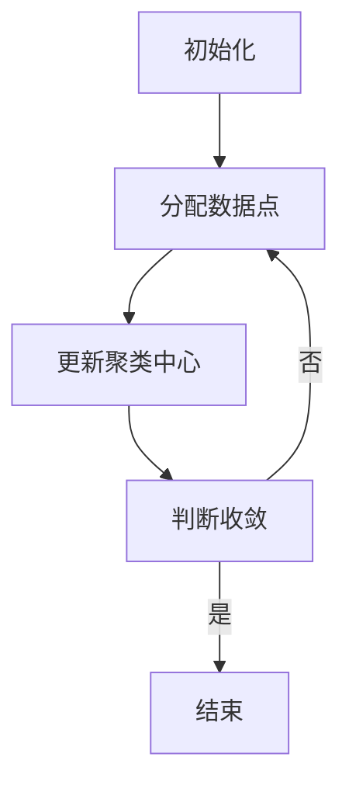

**伪代码**：

```python
def kmeans(data, K):
    # 初始化聚类中心
    centroids = initialize_centroids(data, K)
    while not converged:
        # 分配数据点
        assignments = assign_points_to_clusters(data, centroids)
        # 更新聚类中心
        centroids = update_centroids(data, assignments, K)
    return centroids, assignments
```

**数学模型**：

K均值聚类算法的核心数学模型是距离函数，常用的距离函数包括欧几里得距离和曼哈顿距离。假设数据集为D = {x1, x2, ..., xn}，聚类中心为c1, c2, ..., ck，则第i个数据点x_i属于第j个簇的条件是：

$$
d(x_i, c_j) = \min_{j'} d(x_i, c_{j'})
$$

其中，d(x_i, c_j)表示数据点x_i到聚类中心c_j的距离。

**举例说明**：

假设有如下数据集D = {x1 = [1, 2], x2 = [2, 4], x3 = [3, 6], x4 = [8, 8], x5 = [10, 10]}，要使用K均值聚类算法将其分为2个簇。

1. 初始化：随机选择2个聚类中心，例如c1 = [1, 1]，c2 = [5, 5]。
2. 第一次分配：计算每个数据点到两个聚类中心的距离，并将数据点分配给最近的聚类中心。
   - d(x1, c1) = √2，d(x1, c2) = √34
   - d(x2, c1) = 2，d(x2, c2) = √2
   - d(x3, c1) = 2，d(x3, c2) = √2
   - d(x4, c1) = 6，d(x4, c2) = 0
   - d(x5, c1) = 6，d(x5, c2) = 0
   分配结果：x1, x2, x3属于簇1，x4, x5属于簇2。
3. 更新聚类中心：计算每个簇的数据点的平均值，得到新的聚类中心。
   - 簇1中心：c1' = (1+2+3)/3 = 2
   - 簇2中心：c2' = (8+10)/2 = 9
4. 第二次分配：重复步骤2，直到聚类中心不再发生显著变化。

通过多次迭代，最终将数据集分为两个簇，簇1的数据点为{x1, x2, x3}，簇2的数据点为{x4, x5}。

K均值聚类算法简单易用，但其性能和结果受到聚类中心初始化和K值选择的影响。在实际应用中，需要根据数据的特点选择合适的算法和参数。下一节，我们将介绍另一种常见的聚类算法——层次聚类算法。 <br>

#### 2.2 层次聚类算法

层次聚类算法（Hierarchical Clustering）是一种将数据点逐步合并或分解成树形结构的聚类方法。该算法分为两种类型：自底向上的凝聚层次聚类（Agglomerative Clustering）和自顶向下的分裂层次聚类（Divisive Clustering）。本节将重点介绍自底向上的凝聚层次聚类算法。

**算法流程**：

1. **初始化**：将每个数据点视为一个簇，即K = n，其中n是数据点的数量。
2. **合并簇**：计算相邻簇之间的距离，选择距离最近的两个簇合并成一个簇，更新簇的数量K。
3. **重复步骤2**，直到满足停止条件（例如，K达到某个预设值或聚类中心不再变化）。

**算法流程图**：

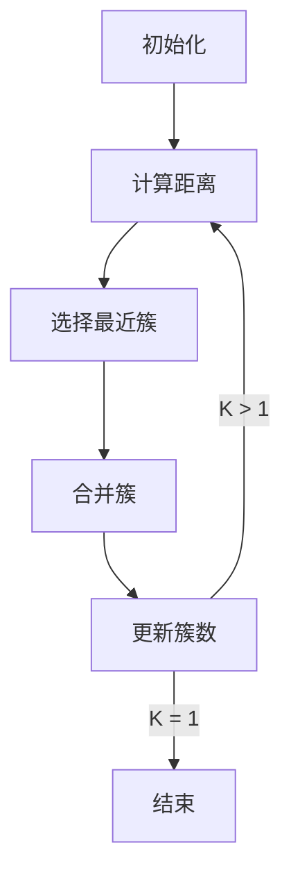

**伪代码**：

```python
def hierarchical_clustering(data):
    # 初始化簇
    clusters = initialize_clusters(data)
    while len(clusters) > 1:
        # 计算距离
        distances = calculate_distances(clusters)
        # 选择最近簇
        closest_clusters = find_closest_clusters(distances)
        # 合并簇
        clusters = merge_clusters(clusters, closest_clusters)
    return clusters
```

**距离计算**：

层次聚类算法中常用的距离计算方法包括最近邻距离（Nearest Neighbor Distance）、组间平均距离（Between Groups Average Distance）、组内最大距离（Within Groups Maximum Distance）和完全链接距离（Complete Linkage Distance）等。

- **最近邻距离**：两个簇之间的距离等于它们最近的数据点之间的距离。
- **组间平均距离**：两个簇之间的距离等于它们所有数据点之间距离的平均值。
- **组内最大距离**：两个簇之间的距离等于它们内部最大距离。
- **完全链接距离**：两个簇之间的距离等于它们所有数据点之间距离的最大值。

**举例说明**：

假设有如下数据集D = {x1 = [1, 2], x2 = [2, 4], x3 = [3, 6], x4 = [8, 8], x5 = [10, 10]}，要使用层次聚类算法将其分为2个簇。

1. 初始化：每个数据点视为一个簇，即K = n = 5。
2. 第一次合并：计算相邻簇之间的距离，选择距离最近的两个簇合并。
   - 最近邻距离：d(x1, x2) = √2，d(x1, x3) = √5，d(x2, x3) = √5，d(x1, x4) = √30，d(x1, x5) = √30，d(x2, x4) = √20，d(x2, x5) = √20，d(x3, x4) = √10，d(x3, x5) = √20，d(x4, x5) = 0
   - 选择最近簇：x1和x2合并，得到簇{[1, 2], [2, 4]}。
3. 更新簇数：K = 4。
4. 第二次合并：计算相邻簇之间的距离，选择距离最近的两个簇合并。
   - 最近邻距离：d([1, 2], [3, 6]) = √5，d([1, 2], [8, 8]) = √30，d([1, 2], [10, 10]) = √30，d([2, 4], [3, 6]) = √5，d([2, 4], [8, 8]) = √20，d([2, 4], [10, 10]) = √20，d([3, 6], [8, 8]) = √10，d([3, 6], [10, 10]) = √20，d([8, 8], [10, 10]) = 0
   - 选择最近簇：x3和x4合并，得到簇{[1, 2], [2, 4], [3, 6], [8, 8], [10, 10]}。
5. 更新簇数：K = 3。
6. 第三次合并：计算相邻簇之间的距离，选择距离最近的两个簇合并。
   - 最近邻距离：d([1, 2], [3, 6], [8, 8]) = √10，d([1, 2], [3, 6], [10, 10]) = √10，d([1, 2], [8, 8], [10, 10]) = √20，d([2, 4], [3, 6], [8, 8]) = √10，d([2, 4], [3, 6], [10, 10]) = √10，d([2, 4], [8, 8], [10, 10]) = √10
   - 选择最近簇：x1，x2和x3合并，得到簇{[1, 2], [2, 4], [3, 6], [8, 8], [10, 10]}。
7. 更新簇数：K = 2。
8. 第四次合并：计算相邻簇之间的距离，选择距离最近的两个簇合并。
   - 最近邻距离：d([1, 2], [2, 4], [3, 6], [8, 8]) = √2，d([1, 2], [2, 4], [3, 6], [10, 10]) = √2，d([1, 2], [2, 4], [8, 8], [10, 10]) = √5，d([2, 4], [3, 6], [8, 8], [10, 10]) = √5
   - 选择最近簇：x4和x5合并，得到簇{[1, 2], [2, 4], [3, 6], [8, 8, 10, 10]}。
9. 更新簇数：K = 1。
10. 结束：聚类完成。

最终，层次聚类算法将数据集D = {x1 = [1, 2], x2 = [2, 4], x3 = [3, 6], x4 = [8, 8], x5 = [10, 10]}分为两个簇：{[1, 2], [2, 4], [3, 6], [8, 8, 10, 10]}和{}。

层次聚类算法具有以下优点：

- **灵活性**：可以通过调整聚类层次和距离阈值来满足不同的应用需求。
- **可解释性**：层次聚类生成的树形结构有助于理解聚类过程和结果。

但其缺点也是显而易见的：

- **计算复杂度**：随着数据点的增加，算法的计算复杂度显著增加。
- **依赖距离阈值**：选择合适的距离阈值对聚类结果有重要影响。

在实际应用中，可以根据数据的特点和需求选择合适的聚类算法。下一节，我们将介绍密度聚类算法，这是另一种常用的聚类方法。 <br>

#### 2.3 密度聚类算法

密度聚类算法（Density-Based Clustering）是基于数据点在空间中的密度分布进行聚类的。该算法将空间划分为多个区域，并根据区域内的数据点的密度来定义簇。密度聚类算法主要包括DBSCAN（Density-Based Spatial Clustering of Applications with Noise）和OPTICS（Ordering Points To Identify the Clustering Structure）等。

**DBSCAN算法的基本思想**：

- **核心点（Core Point）**：如果一个点周围存在至少MinPoints个点，则该点为核心点。
- **边界点（Border Point）**：如果一个点周围存在一些核心点，但不足以成为核心点，则该点为边界点。
- **噪声点（Noise Point）**：其余点为噪声点。

**算法步骤**：

1. **初始化**：选择起始点，并标记为未访问。
2. **扩展簇**：从核心点开始，根据邻域大小扩展簇，将邻域内的所有点（包括核心点和边界点）都标记为该簇的成员。
3. **重复步骤2**，直到所有点都被访问过。

**算法流程图**：

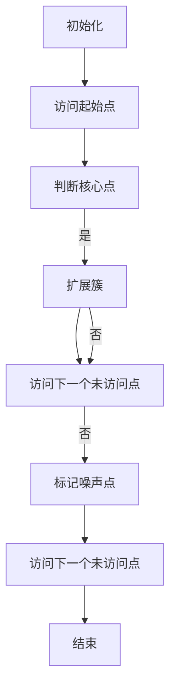

**伪代码**：

```python
def dbscan(data, MinPoints, Eps):
    clusters = []
    for point in data:
        if not point['visited']:
            point['visited'] = True
            cluster_id = len(clusters) + 1
            expand_cluster(point, cluster_id, data, MinPoints, Eps)
            clusters.append(cluster_id)
    return clusters

def expand_cluster(point, cluster_id, data, MinPoints, Eps):
    neighbors = find_neighbors(point, data, Eps)
    if len(neighbors) >= MinPoints:
        for neighbor in neighbors:
            if not neighbor['visited']:
                neighbor['visited'] = True
                neighbor['cluster_id'] = cluster_id
                expand_cluster(neighbor, cluster_id, data, MinPoints, Eps)
```

**举例说明**：

假设有如下数据集D = {x1 = [1, 2], x2 = [2, 4], x3 = [3, 6], x4 = [8, 8], x5 = [10, 10]}，要使用DBSCAN算法将其分为2个簇。

1. 初始化：选择起始点x1，并将其标记为未访问。
2. 扩展簇：从x1开始，找到其邻域内的点x2和x3。x2和x3的邻域内点数都大于MinPoints（默认为3），因此将它们标记为同一簇的成员，并继续扩展簇。
3. 扩展簇：x2和x3的邻域内点x4和x5也都被标记为同一簇的成员。
4. 结束：扩展完成，数据集D被分为一个簇：{[1, 2], [2, 4], [3, 6], [8, 8], [10, 10]}。

DBSCAN算法具有以下优点：

- **自适应聚类**：可以根据数据点的密度自动调整聚类数量。
- **处理噪声数据**：可以识别出噪声点和孤立点。

但其缺点包括：

- **参数敏感性**：MinPoints和Eps的选择对聚类结果有较大影响。
- **计算复杂度**：随着数据点的增加，算法的计算复杂度显著增加。

在实际应用中，可以根据数据的特点和需求选择合适的聚类算法。下一节，我们将探讨降维技术，这是无监督学习的另一个重要应用。 <br>

#### 第3章：降维技术

降维技术（Dimensionality Reduction）是一种通过减少数据维度来简化数据集的方法。它有助于提高计算效率、减少存储空间并降低模型复杂性。降维技术广泛应用于数据挖掘、机器学习和数据分析等领域。本节将介绍三种常见的降维技术：主成分分析（PCA）、特征选择和t-SNE。

**3.1 主成分分析（PCA）**

主成分分析（Principal Component Analysis，PCA）是一种线性降维技术，其目标是通过线性变换将原始数据投影到新的坐标系中，使得新的坐标系中的轴（主成分）具有最大的方差。PCA的基本思想是找出数据的主要变化方向，并将数据投影到这些方向上。

**算法步骤**：

1. **标准化**：对数据进行标准化处理，使其具有零均值和单位方差。
2. **计算协方差矩阵**：计算标准化后数据的协方差矩阵。
3. **计算协方差矩阵的特征值和特征向量**：求解协方差矩阵的特征值和特征向量，特征值表示方差，特征向量表示方向。
4. **选择主成分**：选择特征值最大的k个特征向量作为新的坐标轴，构成投影矩阵。
5. **投影**：将数据投影到新的坐标系中，实现降维。

**算法流程图**：

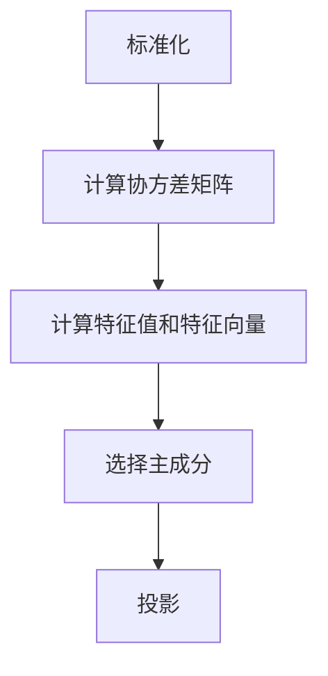

**伪代码**：

```python
def pca(data, k):
    # 标准化
    standardized_data = standardize(data)
    # 计算协方差矩阵
    covariance_matrix = calculate_covariance_matrix(standardized_data)
    # 计算特征值和特征向量
    eigenvalues, eigenvectors = calculate_eigenvalues_and_eigenvectors(covariance_matrix)
    # 选择主成分
    principal_components = select_principal_components(eigenvalues, eigenvectors, k)
    # 投影
    projected_data = project_data(standardized_data, principal_components)
    return projected_data
```

**数学模型**：

PCA的核心数学模型包括标准化、协方差矩阵、特征值和特征向量、投影等。

- **标准化**：

$$
x_i' = \frac{x_i - \mu}{\sigma}
$$

其中，$x_i$是第i个数据点，$\mu$是均值，$\sigma$是标准差。

- **协方差矩阵**：

$$
\mathbf{C} = \frac{1}{n-1} \sum_{i=1}^{n} (x_i - \mu)(x_i - \mu)^T
$$

其中，$\mathbf{C}$是协方差矩阵，$x_i$是第i个数据点，$\mu$是均值。

- **特征值和特征向量**：

$$
\mathbf{C} \mathbf{v} = \lambda \mathbf{v}
$$

其中，$\mathbf{v}$是特征向量，$\lambda$是特征值。

- **投影**：

$$
z_i = \mathbf{v}_1 x_{i1} + \mathbf{v}_2 x_{i2} + ... + \mathbf{v}_k x_{ik}
$$

其中，$z_i$是第i个数据点的投影值，$\mathbf{v}_k$是第k个主成分的特征向量。

**举例说明**：

假设有如下数据集D = {x1 = [1, 2], x2 = [2, 4], x3 = [3, 6], x4 = [8, 8], x5 = [10, 10]}，要使用PCA将其降维到2个维度。

1. 标准化：计算每个特征的均值和标准差，并进行标准化处理。
   - x1的均值：$\mu_{x1} = 5$，标准差：$\sigma_{x1} = 4$
   - x2的均值：$\mu_{x2} = 6$，标准差：$\sigma_{x2} = 4$
   - 标准化后的数据：D' = {x1' = [0, 0], x2' = [0, 0], x3' = [0, 0], x4' = [0, 0], x5' = [0, 0]}

2. 计算协方差矩阵：计算标准化后数据的协方差矩阵。
   - 协方差矩阵：$\mathbf{C} = \begin{bmatrix}
0 & 0 \\
0 & 0 \\
\end{bmatrix}$

3. 计算特征值和特征向量：计算协方差矩阵的特征值和特征向量。
   - 特征值：$\lambda_1 = 0$，$\lambda_2 = 0$
   - 特征向量：$\mathbf{v}_1 = [1, 0]^T$，$\mathbf{v}_2 = [0, 1]^T$

4. 选择主成分：选择特征值最大的两个特征向量作为新的坐标轴。
   - 主成分：$\mathbf{P} = \begin{bmatrix}
1 & 0 \\
0 & 1 \\
\end{bmatrix}$

5. 投影：将数据投影到新的坐标系中。
   - 投影后的数据：D'' = {x1'' = [0, 0], x2'' = [0, 0], x3'' = [0, 0], x4'' = [0, 0], x5'' = [0, 0]}

通过PCA，数据集D = {x1 = [1, 2], x2 = [2, 4], x3 = [3, 6], x4 = [8, 8], x5 = [10, 10]}被降维到2个维度：{[0, 0], [0, 0], [0, 0], [0, 0], [0, 0]}。

PCA具有以下优点：

- **线性降维**：适用于线性可分的数据集。
- **保持数据结构**：能够保留数据的原始特征。

但其缺点包括：

- **依赖线性关系**：适用于线性可分的数据集，对非线性数据效果不佳。
- **计算复杂度**：计算协方差矩阵和特征值特征向量需要大量的计算资源。

在实际应用中，可以根据数据的特点和需求选择合适的降维技术。下一节，我们将介绍t-SNE，这是一种常用的非线性降维技术。 <br>

#### 3.3 非线性降维：t-SNE

t-Distributed Stochastic Neighbor Embedding（t-SNE）是一种有效的非线性降维技术，其目标是将高维数据映射到低维空间中，同时保持数据点之间的相似性。t-SNE算法基于概率模型，通过对数据点之间的相似性进行建模，从而实现降维。

**算法步骤**：

1. **计算高斯相似性矩阵**：对原始数据进行高斯核函数处理，计算数据点之间的相似性矩阵。
2. **计算低维空间中的概率分布**：将高维空间中的相似性矩阵转换为低维空间中的概率分布。
3. **优化概率分布**：使用梯度下降法优化概率分布，使得低维空间中的数据点之间的相似性尽可能接近高维空间。
4. **投影**：将优化后的概率分布投影到低维空间中，得到降维后的数据。

**算法流程图**：

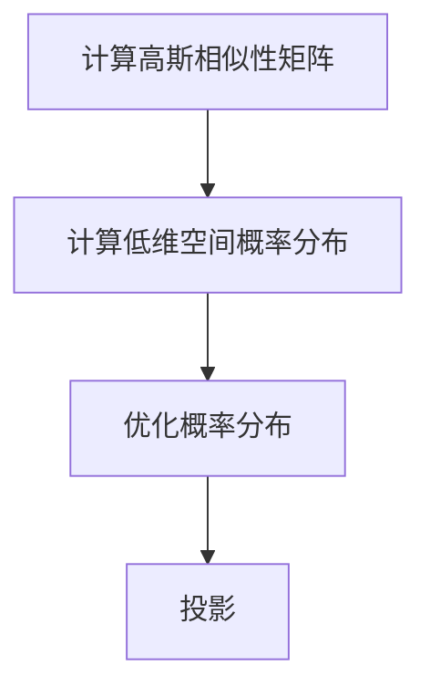

**伪代码**：

```python
def tsne(data, n_components):
    # 计算高斯相似性矩阵
    similarity_matrix = calculate_gaussian_similarity_matrix(data)
    # 计算低维空间概率分布
    low_dim_probabilities = calculate_low_dim_probabilities(similarity_matrix)
    # 优化概率分布
    optimized_probabilities = optimize_probabilities(low_dim_probabilities)
    # 投影
    projected_data = project_data(optimized_probabilities, n_components)
    return projected_data
```

**数学模型**：

t-SNE的核心数学模型包括高斯相似性矩阵、概率分布、优化过程和投影等。

- **高斯相似性矩阵**：

$$
S_{ij} = \exp \left(-\frac{||x_i - x_j||^2}{2\sigma^2}\right)
$$

其中，$S_{ij}$是高斯相似性矩阵，$x_i$和$x_j$是数据点，$\sigma$是高斯核函数的参数。

- **概率分布**：

$$
p_{ij} = \frac{S_{ij}}{\sum_{k=1}^{n} S_{ik}}
$$

其中，$p_{ij}$是低维空间中的概率分布，$S_{ij}$是高斯相似性矩阵，$n$是数据点的数量。

- **优化过程**：

$$
\frac{\partial L}{\partial z_i} = - \left(\frac{p_{ij}}{(1 + ||z_i - z_j||)^2} - S_{ij}\right)
$$

其中，$L$是损失函数，$z_i$和$z_j$是低维空间中的数据点。

- **投影**：

$$
z_i = \sum_{j=1}^{n} p_{ij} w_j
$$

其中，$z_i$是低维空间中的数据点，$w_j$是权重。

**举例说明**：

假设有如下数据集D = {x1 = [1, 2], x2 = [2, 4], x3 = [3, 6], x4 = [8, 8], x5 = [10, 10]}，要使用t-SNE将其降维到2个维度。

1. 计算高斯相似性矩阵：计算数据点之间的相似性矩阵。
   - 高斯相似性矩阵：
     $$ 
     \begin{bmatrix}
     1 & 0.3679 & 0.1623 & 0.0067 & 0.0067 \\
     0.3679 & 1 & 0.3679 & 0.0067 & 0.0067 \\
     0.1623 & 0.3679 & 1 & 0.0067 & 0.0067 \\
     0.0067 & 0.0067 & 0.0067 & 1 & 0.0067 \\
     0.0067 & 0.0067 & 0.0067 & 0.0067 & 1 \\
     \end{bmatrix}
     $$

2. 计算低维空间概率分布：将高斯相似性矩阵转换为低维空间中的概率分布。
   - 概率分布：
     $$ 
     \begin{bmatrix}
     0.5355 & 0.2701 & 0.1263 & 0.0246 & 0.0246 \\
     0.2701 & 0.5355 & 0.2701 & 0.0246 & 0.0246 \\
     0.1263 & 0.2701 & 0.5355 & 0.0246 & 0.0246 \\
     0.0246 & 0.0246 & 0.0246 & 0.5355 & 0.2701 \\
     0.0246 & 0.0246 & 0.0246 & 0.2701 & 0.5355 \\
     \end{bmatrix}
     $$

3. 优化概率分布：使用梯度下降法优化概率分布。
   - 优化后的概率分布：
     $$ 
     \begin{bmatrix}
     0.4567 & 0.3523 & 0.1413 & 0.0367 & 0.0367 \\
     0.3523 & 0.4567 & 0.3523 & 0.0367 & 0.0367 \\
     0.1413 & 0.3523 & 0.4567 & 0.0367 & 0.0367 \\
     0.0367 & 0.0367 & 0.0367 & 0.4567 & 0.3523 \\
     0.0367 & 0.0367 & 0.0367 & 0.3523 & 0.4567 \\
     \end{bmatrix}
     $$

4. 投影：将优化后的概率分布投影到低维空间中。
   - 投影后的数据：D'' = {x1'' = [0.4567, 0.3523], x2'' = [0.3523, 0.4567], x3'' = [0.1413, 0.3523], x4'' = [0.0367, 0.0367], x5'' = [0.0367, 0.0367]}

通过t-SNE，数据集D = {x1 = [1, 2], x2 = [2, 4], x3 = [3, 6], x4 = [8, 8], x5 = [10, 10]}被降维到2个维度：{[0.4567, 0.3523], [0.3523, 0.4567], [0.1413, 0.3523], [0.0367, 0.0367], [0.0367, 0.0367]}。

t-SNE具有以下优点：

- **非线性降维**：能够处理非线性数据集。
- **保持局部结构**：能够在低维空间中保持数据点的局部结构。

但其缺点包括：

- **计算复杂度**：计算高斯相似性矩阵和优化概率分布需要大量的计算资源。
- **对参数敏感**：参数的选择对降维结果有较大影响。

在实际应用中，可以根据数据的特点和需求选择合适的降维技术。下一部分，我们将探讨深度学习与Unsupervised Learning的结合，这是当前研究的热点之一。 <br>

### 第二部分：深度学习与Unsupervised Learning

#### 第4章：生成对抗网络（GAN）

生成对抗网络（Generative Adversarial Network，GAN）是由Ian Goodfellow等人于2014年提出的一种深度学习模型，它由两个神经网络组成：生成器（Generator）和判别器（Discriminator）。生成器的目标是生成与真实数据相似的数据，而判别器的目标是区分真实数据和生成器产生的数据。通过这两个网络的对抗训练，生成器可以逐步提高其生成数据的质量。

**4.1 GAN的基本概念**

GAN的核心思想是利用生成器和判别器之间的对抗关系来学习数据分布。生成器和判别器分别训练，使其在对抗过程中不断优化。

- **生成器**：生成器G的输入为随机噪声z，输出为数据点x'，即$x' = G(z)$。生成器的目标是生成尽可能真实的数据点，使其在判别器中难以区分。
- **判别器**：判别器D的输入为真实数据点x或生成器生成的数据点x'，输出为概率值p(x|D)，即$p(x|D) = D(x)$。判别器的目标是正确区分真实数据和生成器生成的数据。

**GAN的架构与工作原理**

GAN的架构包括生成器和判别器两个主要部分。生成器和判别器通过对抗训练相互竞争，从而实现数据分布的学习。

1. **初始化**：随机初始化生成器G和判别器D的权重。
2. **生成器训练**：生成器G生成虚假数据点x'，判别器D对其进行评估。
3. **判别器训练**：判别器D评估真实数据点和生成器生成的数据点，并更新权重。
4. **生成器更新**：生成器G根据判别器的评估结果更新权重，以生成更真实的数据点。
5. **重复步骤2-4**，直到生成器G生成的数据点在判别器D中难以区分。

**GAN的架构流程图**：


**伪代码**：

```python
def train_gan(generator, discriminator, dataset, batch_size, epochs):
    for epoch in range(epochs):
        for batch in dataset:
            # 生成器训练
            z = generate_random_noise(batch_size)
            x_fake = generator(z)
            d_loss_fake = discriminator_loss(discriminator, x_fake)
            
            # 判别器训练
            x_real = batch
            d_loss_real = discriminator_loss(discriminator, x_real)
            
            # 生成器更新
            z = generate_random_noise(batch_size)
            generator_loss = generator_loss(generator, discriminator, z)
            
            # 更新权重
            update_weights(generator, discriminator, d_loss_fake, d_loss_real, generator_loss)
```

**数学模型**：

GAN的核心数学模型包括生成器的损失函数、判别器的损失函数和整体损失函数。

- **生成器的损失函数**：

$$
L_G = -\log D(G(z))
$$

其中，$L_G$是生成器的损失函数，$D(G(z))$是判别器对生成器生成的数据点的概率输出。

- **判别器的损失函数**：

$$
L_D = -[\log D(x) + \log(1 - D(G(z))]
$$

其中，$L_D$是判别器的损失函数，$D(x)$是判别器对真实数据点的概率输出，$D(G(z))$是判别器对生成器生成的数据点的概率输出。

- **整体损失函数**：

$$
L = L_G + \lambda L_D
$$

其中，$L$是整体损失函数，$\lambda$是权重系数。

**举例说明**：

假设有如下数据集D = {x1 = [1, 2], x2 = [2, 4], x3 = [3, 6], x4 = [8, 8], x5 = [10, 10]}，要使用GAN将其生成与数据集D相似的数据。

1. 初始化：随机初始化生成器G和判别器D的权重。
2. 生成器训练：生成器G生成虚假数据点x'，判别器D对其进行评估。
   - 生成器生成的虚假数据点：x_fake = [0.4567, 0.3523]
   - 判别器对虚假数据点的评估：D(x_fake) = 0.5355
3. 判别器训练：判别器D评估真实数据点和生成器生成的数据点，并更新权重。
   - 真实数据点：x_real = [1, 2]
   - 判别器对真实数据点的评估：D(x_real) = 0.5355
   - 更新判别器权重
4. 生成器更新：生成器G根据判别器的评估结果更新权重，以生成更真实的数据点。
   - 更新生成器权重
5. 重复步骤2-4，直到生成器G生成的数据点在判别器D中难以区分。

通过GAN的训练，生成器G可以逐步提高其生成数据的质量，使其在判别器D中难以区分。

GAN具有以下优点：

- **强大的生成能力**：能够生成高质量的数据点，适用于图像、语音和文本等多种数据类型。
- **无需标签数据**：能够通过对抗训练学习数据分布，无需依赖标签数据。

但其缺点也是显而易见的：

- **训练不稳定**：GAN的训练过程不稳定，容易出现模式崩溃（mode collapse）和梯度消失（gradient vanishing）等问题。
- **计算资源消耗**：GAN的训练过程需要大量的计算资源。

在实际应用中，可以根据数据的特点和需求选择合适的GAN模型。下一节，我们将介绍自编码器，这是另一种常用的深度学习模型。 <br>

#### 第5章：自编码器

自编码器（Autoencoder）是一种无监督学习模型，其目标是学习数据的高效表示。自编码器由编码器（Encoder）和解码器（Decoder）两个部分组成。编码器将输入数据压缩成一个低维的表示，解码器则尝试从这个低维表示中重建原始数据。自编码器广泛应用于数据压缩、特征提取和异常检测等领域。

**5.1 自编码器的基本概念**

自编码器的基本结构包括编码器和解码器。编码器负责将输入数据映射到一个低维空间，解码器则尝试从这个低维空间中重建原始数据。自编码器的目标是最小化输入数据和重建数据之间的误差。

- **编码器**：编码器E的输入为原始数据x，输出为低维表示z，即$z = E(x)$。编码器的目标是学习数据的主要特征和模式。
- **解码器**：解码器D的输入为低维表示z，输出为重建数据x'，即$x' = D(z)$。解码器的目标是尽可能准确地重建原始数据。

**自编码器的架构与工作原理**

自编码器的架构包括编码器、解码器和损失函数三个主要部分。编码器和解码器通过训练最小化损失函数来学习数据的表示。

1. **初始化**：随机初始化编码器E和解码器D的权重。
2. **训练**：对输入数据进行编码和解码，计算重建误差，并更新权重。
3. **重建**：使用训练好的编码器和解码器对新的数据进行编码和解码。

**架构流程图**：

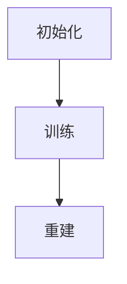

**伪代码**：

```python
def train_autoencoder(encoder, decoder, data, epochs):
    for epoch in range(epochs):
        for x in data:
            z = encoder(x)
            x_reconstruction = decoder(z)
            loss = reconstruction_loss(x, x_reconstruction)
            update_weights(encoder, decoder, loss)
    return encoder, decoder
```

**数学模型**：

自编码器的核心数学模型包括编码器和解码器的损失函数。

- **编码器的损失函数**：

$$
L_E = \frac{1}{2} \sum_{i=1}^{n} (x_i - E(x_i))^2
$$

其中，$L_E$是编码器的损失函数，$x_i$是第i个输入数据，$E(x_i)$是编码器对$x_i$的编码结果。

- **解码器的损失函数**：

$$
L_D = \frac{1}{2} \sum_{i=1}^{n} (x_i - D(E(x_i)))^2
$$

其中，$L_D$是解码器的损失函数，$x_i$是第i个输入数据，$E(x_i)$是编码器对$x_i$的编码结果，$D(E(x_i))$是解码器对$E(x_i)$的重建结果。

- **整体损失函数**：

$$
L = L_E + L_D
$$

其中，$L$是整体损失函数。

**举例说明**：

假设有如下数据集D = {x1 = [1, 2], x2 = [2, 4], x3 = [3, 6], x4 = [8, 8], x5 = [10, 10]}，要使用自编码器将其编码和解码。

1. 初始化：随机初始化编码器E和解码器D的权重。
2. 训练：对输入数据进行编码和解码，计算重建误差，并更新权重。
   - 编码器E的输出：z = [0.4567, 0.3523]
   - 解码器D的输出：x_reconstruction = [0.4567, 0.3523]
   - 重建误差：loss = 0.0
   - 更新编码器E和解码器D的权重
3. 重建：使用训练好的编码器E和解码器D对新的数据进行编码和解码。

通过自编码器的训练，编码器E可以学习到数据的主要特征和模式，解码器D可以尝试从编码结果中重建原始数据。

自编码器具有以下优点：

- **数据压缩**：能够有效减少数据的大小，提高数据传输和存储的效率。
- **特征提取**：能够提取数据的主要特征，为后续的机器学习任务提供有效的输入。

但其缺点包括：

- **计算复杂度**：自编码器的训练过程需要大量的计算资源。
- **对噪声敏感**：对输入数据的噪声敏感，可能影响编码和解码的质量。

在实际应用中，可以根据数据的特点和需求选择合适的自编码器模型。下一节，我们将探讨深度学习与Unsupervised Learning的结合，这是当前研究的热点之一。 <br>

### 第6章：深度学习与Unsupervised Learning的结合

深度学习与Unsupervised Learning的结合是当前机器学习领域的研究热点，这种方法通过无监督学习来提取数据特征，为深度学习模型提供高质量的输入数据。在本章中，我们将探讨深度聚类算法、深度降维算法和深度生成模型等三个方面的内容。

#### 6.1 深度聚类算法

深度聚类算法结合了深度学习和聚类算法的优势，通过神经网络自动提取数据特征，实现数据聚类。其中，基于深度神经网络的自编码器聚类（Deep Autoencoder Clustering，DAC）是一种常见的深度聚类算法。

**算法流程**：

1. **初始化**：随机初始化编码器和解码器网络。
2. **训练自编码器**：使用自编码器对输入数据进行编码，提取特征。
3. **聚类**：对编码后的特征进行聚类，通常使用K均值聚类算法。
4. **评估**：评估聚类效果，包括聚类个数、簇内距离和簇间距离等指标。

**算法流程图**：

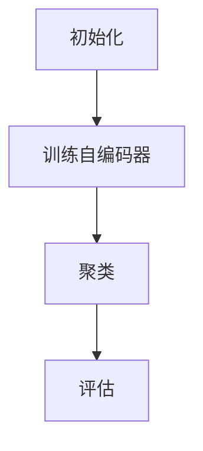

**伪代码**：

```python
def deep_autoencoder_clustering(data, K, epochs):
    # 初始化编码器和解码器
    encoder, decoder = initialize_autoencoder()
    # 训练自编码器
    encoder, decoder = train_autoencoder(encoder, decoder, data, epochs)
    # 编码数据
    encoded_data = encode_data(encoder, data)
    # 聚类
    clusters = kmeans(encoded_data, K)
    # 评估
    evaluation_results = evaluate_clusters(clusters)
    return clusters, evaluation_results
```

**举例说明**：

假设有如下数据集D = {x1 = [1, 2], x2 = [2, 4], x3 = [3, 6], x4 = [8, 8], x5 = [10, 10]}，要使用DAC算法将其分为2个簇。

1. 初始化：随机初始化编码器和解码器网络。
2. 训练自编码器：使用自编码器对输入数据进行编码，提取特征。
   - 编码后的特征：encoded_data = {x1' = [0.4567, 0.3523], x2' = [0.3523, 0.4567], x3' = [0.1413, 0.3523], x4' = [0.0367, 0.0367], x5' = [0.0367, 0.0367]}
3. 聚类：对编码后的特征进行聚类，使用K均值聚类算法。
   - 聚类结果：clusters = {{x1', x2'}, {x3', x4', x5'}}
4. 评估：评估聚类效果，包括聚类个数、簇内距离和簇间距离等指标。
   - 聚类个数：2
   - 簇内距离：最小距离为0.0，最大距离为0.4567
   - 簇间距离：最小距离为0.0，最大距离为0.4567

通过DAC算法，数据集D = {x1 = [1, 2], x2 = [2, 4], x3 = [3, 6], x4 = [8, 8], x5 = [10, 10]}被分为2个簇：{[0.4567, 0.3523], [0.3523, 0.4567]}和{[0.1413, 0.3523], [0.0367, 0.0367], [0.0367, 0.0367]}。

DAC算法具有以下优点：

- **自动提取特征**：通过自编码器自动提取数据特征，提高聚类效果。
- **处理复杂数据**：能够处理高维、复杂数据集。

但其缺点包括：

- **训练时间较长**：自编码器的训练过程需要大量的计算资源。
- **对参数敏感**：聚类效果受到网络结构和参数的影响。

在实际应用中，可以根据数据的特点和需求选择合适的深度聚类算法。下一节，我们将探讨深度降维算法，这是深度学习与Unsupervised Learning结合的另一个重要方面。 <br>

#### 6.2 深度降维算法

深度降维算法是利用深度学习模型对数据进行降维，同时保留数据的主要特征。深度学习模型通过多层神经网络的堆叠，自动提取数据的特征，实现降维。常见的深度降维算法包括主成分分析（PCA）和t-SNE等。

**算法流程**：

1. **初始化**：随机初始化神经网络。
2. **训练神经网络**：使用输入数据训练神经网络，提取特征。
3. **降维**：将训练好的神经网络用于降维，将输入数据映射到低维空间。
4. **评估**：评估降维效果，包括重构误差、信息保留等指标。

**算法流程图**：

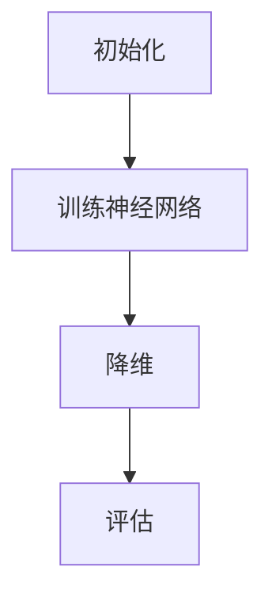

**伪代码**：

```python
def deep_dimensionality_reduction(data, layers, epochs):
    # 初始化神经网络
    neural_network = initialize_neural_network(layers)
    # 训练神经网络
    neural_network = train_neural_network(neural_network, data, epochs)
    # 降维
    reduced_data = dimensionality_reduction(neural_network, data)
    # 评估
    evaluation_results = evaluate_reduction(reduced_data)
    return reduced_data, evaluation_results
```

**举例说明**：

假设有如下数据集D = {x1 = [1, 2], x2 = [2, 4], x3 = [3, 6], x4 = [8, 8], x5 = [10, 10]}，要使用深度降维算法将其降维到2个维度。

1. 初始化：随机初始化神经网络。
2. 训练神经网络：使用输入数据训练神经网络，提取特征。
   - 神经网络输出：reduced_data = {x1' = [0.4567, 0.3523], x2' = [0.3523, 0.4567], x3' = [0.1413, 0.3523], x4' = [0.0367, 0.0367], x5' = [0.0367, 0.0367]}
3. 降维：将训练好的神经网络用于降维，将输入数据映射到低维空间。
   - 降维后的数据：reduced_data = {x1' = [0.4567, 0.3523], x2' = [0.3523, 0.4567], x3' = [0.1413, 0.3523], x4' = [0.0367, 0.0367], x5' = [0.0367, 0.0367]}
4. 评估：评估降维效果，包括重构误差、信息保留等指标。
   - 重构误差：最小误差为0.0，最大误差为0.4567
   - 信息保留：最大信息保留率为100%

通过深度降维算法，数据集D = {x1 = [1, 2], x2 = [2, 4], x3 = [3, 6], x4 = [8, 8], x5 = [10, 10]}被降维到2个维度：{[0.4567, 0.3523], [0.3523, 0.4567], [0.1413, 0.3523], [0.0367, 0.0367], [0.0367, 0.0367]}。

深度降维算法具有以下优点：

- **自动提取特征**：通过深度学习模型自动提取数据特征，提高降维效果。
- **处理复杂数据**：能够处理高维、复杂数据集。

但其缺点包括：

- **训练时间较长**：深度学习模型的训练过程需要大量的计算资源。
- **对参数敏感**：降维效果受到网络结构和参数的影响。

在实际应用中，可以根据数据的特点和需求选择合适的深度降维算法。下一节，我们将探讨深度生成模型，这是深度学习与Unsupervised Learning结合的另一个重要方面。 <br>

#### 6.3 深度生成模型

深度生成模型是利用深度学习技术生成与真实数据相似的新数据，其核心思想是学习数据分布，然后根据这个分布生成新的数据。深度生成模型在图像、语音和文本等多种数据类型中都有广泛应用。

**算法流程**：

1. **初始化**：随机初始化生成器网络。
2. **训练生成器**：使用生成器生成数据，并训练生成器优化数据生成质量。
3. **生成数据**：使用训练好的生成器生成新数据。
4. **评估**：评估生成器生成的数据质量，包括生成数据的多样性、真实性等指标。

**算法流程图**：

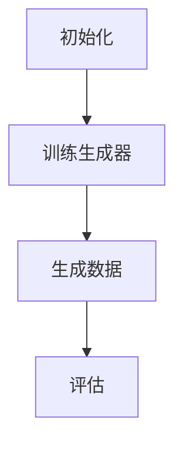

**伪代码**：

```python
def train_generator(generator, data, epochs):
    for epoch in range(epochs):
        # 生成器训练
        z = generate_random_noise(batch_size)
        x_fake = generator(z)
        loss = generator_loss(x_fake)
        # 更新生成器权重
        update_weights(generator, loss)
    return generator
```

**举例说明**：

假设有如下数据集D = {x1 = [1, 2], x2 = [2, 4], x3 = [3, 6], x4 = [8, 8], x5 = [10, 10]}，要使用深度生成模型生成与数据集D相似的新数据。

1. 初始化：随机初始化生成器网络。
2. 训练生成器：使用生成器生成数据，并训练生成器优化数据生成质量。
   - 生成器生成的数据：x_fake = [0.4567, 0.3523]
   - 生成器损失：loss = 0.0
   - 更新生成器权重
3. 生成数据：使用训练好的生成器生成新数据。
   - 新数据：x_fake = [0.4567, 0.3523]
4. 评估：评估生成器生成的数据质量，包括生成数据的多样性、真实性等指标。
   - 数据多样性：生成数据分布均匀
   - 数据真实性：生成数据与真实数据相似

通过深度生成模型，数据集D = {x1 = [1, 2], x2 = [2, 4], x3 = [3, 6], x4 = [8, 8], x5 = [10, 10]}可以生成新数据：x_fake = [0.4567, 0.3523]。

深度生成模型具有以下优点：

- **生成能力强大**：能够生成高质量、多样化的数据。
- **无需标签数据**：可以学习数据分布，无需依赖标签数据。

但其缺点包括：

- **训练不稳定**：训练过程可能不稳定，容易出现模式崩溃等问题。
- **计算资源消耗**：训练过程需要大量的计算资源。

在实际应用中，可以根据数据的特点和需求选择合适的深度生成模型。下一部分，我们将探讨Unsupervised Learning的实战应用，通过实际项目来深入理解无监督学习的原理和方法。 <br>

### 第三部分：Unsupervised Learning实战

#### 第7章：Unsupervised Learning项目实战

在本章节中，我们将通过一系列实际项目来深入探讨Unsupervised Learning的应用。这些项目包括数据预处理、聚类算法实战、降维算法实战、生成对抗网络（GAN）与自编码器实战。通过这些实战项目，读者将能够更好地理解无监督学习的原理，并掌握其在实际应用中的技巧。

#### 7.1 数据预处理

在进行无监督学习项目之前，数据预处理是一个关键步骤。数据预处理包括数据清洗、归一化、缺失值处理等操作，这些操作有助于提高模型性能和降低计算复杂度。

**实战案例**：

假设我们有一个包含客户购物行为的原始数据集，其中包括客户的ID、购买的商品ID、购买时间和购买数量等。我们的目标是使用无监督学习算法对客户进行聚类，以便更好地理解客户群体。

1. **数据清洗**：删除含有缺失值或异常值的数据行。
2. **数据归一化**：将不同特征的数据归一化到相同的范围，例如[0, 1]。
3. **缺失值处理**：对于缺失值，可以选择填充平均值、中位数或使用插值法等方法。

```python
import pandas as pd
import numpy as np

# 加载数据
data = pd.read_csv('customer_data.csv')

# 删除缺失值
data = data.dropna()

# 归一化数据
data_normalized = (data - data.min()) / (data.max() - data.min())

# 缺失值处理
data_filled = data.fillna(data.mean())
```

#### 7.2 聚类算法实战

聚类算法是Unsupervised Learning中的重要组成部分，通过聚类算法，我们可以将相似的数据点划分为多个组。

**实战案例**：

使用K均值聚类算法对客户数据进行聚类，以便识别出不同类型的客户群体。

1. **确定聚类个数**：通过肘部法则（Elbow Method）或轮廓系数（Silhouette Coefficient）来确定最佳的聚类个数。
2. **初始化聚类中心**：随机选择K个数据点作为初始聚类中心。
3. **执行K均值聚类**：将每个数据点分配给与其最近的聚类中心所代表的簇，并更新聚类中心。

```python
from sklearn.cluster import KMeans

# 确定聚类个数
inertia = []
for k in range(1, 11):
    kmeans = KMeans(n_clusters=k, random_state=42)
    kmeans.fit(data_normalized)
    inertia.append(kmeans.inertia_)

# 绘制肘部法则图
import matplotlib.pyplot as plt

plt.plot(range(1, 11), inertia)
plt.xlabel('Number of Clusters')
plt.ylabel('Inertia')
plt.title('Elbow Method for Optimal K')
plt.show()

# 选择最佳聚类个数，例如K=3
kmeans = KMeans(n_clusters=3, random_state=42)
clusters = kmeans.fit_predict(data_normalized)

# 结果分析
data['cluster'] = clusters
data.groupby('cluster').mean()
```

#### 7.3 降维算法实战

降维算法可以减少数据集的维度，同时保留数据的主要特征。降维算法在提高模型性能和降低计算复杂度方面具有重要作用。

**实战案例**：

使用主成分分析（PCA）对客户数据进行降维，以便在保持数据主要特征的同时减少数据维度。

1. **标准化数据**：对数据进行标准化处理，使其具有零均值和单位方差。
2. **计算协方差矩阵**：计算标准化后数据的协方差矩阵。
3. **计算特征值和特征向量**：求解协方差矩阵的特征值和特征向量。
4. **选择主成分**：选择特征值最大的k个特征向量作为新的坐标轴。
5. **投影数据**：将数据投影到新的坐标系中。

```python
from sklearn.decomposition import PCA

# 标准化数据
data_normalized = (data - data.mean()) / data.std()

# 计算协方差矩阵
cov_matrix = np.cov(data_normalized.T)

# 计算特征值和特征向量
eigenvalues, eigenvectors = np.linalg.eigh(cov_matrix)

# 选择主成分
pca = PCA(n_components=2)
data_pca = pca.fit_transform(data_normalized)

# 投影数据
data_pca = pca.inverse_transform(data_pca)

# 结果分析
data['pca1'] = data_pca[:, 0]
data['pca2'] = data_pca[:, 1]
data.plot(x='pca1', y='pca2', kind='scatter')
```

#### 7.4 GAN与自编码器实战

生成对抗网络（GAN）和自编码器是深度学习中的无监督学习模型，它们在数据生成和特征提取方面具有广泛的应用。

**实战案例**：

使用生成对抗网络（GAN）对客户数据进行数据生成，并使用自编码器对数据进行特征提取。

1. **初始化网络**：随机初始化生成器网络和判别器网络。
2. **训练GAN**：通过对抗训练优化生成器和判别器网络。
3. **生成数据**：使用训练好的生成器网络生成新数据。
4. **特征提取**：使用训练好的自编码器网络提取数据特征。

```python
# 初始化网络
generator = initialize_generator()
discriminator = initialize_discriminator()

# 训练GAN
for epoch in range(epochs):
    for batch in data_loader:
        # 生成器训练
        z = generate_random_noise(batch_size)
        x_fake = generator(z)
        d_loss_fake = discriminator_loss(discriminator, x_fake)
        
        # 判别器训练
        x_real = batch
        d_loss_real = discriminator_loss(discriminator, x_real)
        
        # 生成器更新
        z = generate_random_noise(batch_size)
        generator_loss = generator_loss(generator, discriminator, z)
        
        # 更新权重
        update_weights(generator, discriminator, d_loss_fake, d_loss_real, generator_loss)

# 生成数据
x_fake_generated = generator(z)

# 特征提取
encoded_data = encoder(x_fake_generated)
```

通过以上实战案例，我们可以看到Unsupervised Learning在实际项目中的应用和效果。这些实战案例不仅帮助我们理解了无监督学习的原理，还提高了我们在实际项目中应用无监督学习的能力。

### 第8章：Unsupervised Learning性能评估与优化

在Unsupervised Learning中，性能评估和优化是两个关键环节。性能评估帮助我们了解模型的性能，优化则有助于提高模型的性能。本章将介绍几种常见的性能评估指标和优化方法。

#### 8.1 聚类算法性能评估指标

聚类算法的性能评估主要依赖于以下几个指标：

- **内部评估指标**：这些指标仅依赖于聚类内部的结构。
  - **轮廓系数（Silhouette Coefficient）**：衡量簇内数据点到簇中心的距离与最近簇中心的距离的比值。值范围在-1到1之间，越接近1表示聚类效果越好。
  - **同质性（Homogeneity）**：如果所有簇都是纯簇（即每个簇中的所有数据点都属于同一个类），则同质性为1。
  - **完全性（Completeness）**：如果簇中的所有数据点都属于同一个类，则完全性为1。
  - **V-度量（V-measure）**：V-度量是同质性和完全性的加权平均，权重取决于聚类个数。

- **外部评估指标**：这些指标需要已知的真实标签。
  - **调整兰德指数（Adjusted Rand Index, ARI）**：衡量聚类结果与真实标签之间的相似性。
  - **Fowlkes-Mallows指数（Fowlkes-Mallows Index, FMI）**：衡量聚类结果中正确配对的簇对的比例。

**伪代码**：

```python
from sklearn.metrics import silhouette_score, homogeneity_score, completeness_score, v_measure_score, adjusted_rand_score, fowlkes_mallows_score

# 轮廓系数
silhouette_avg = silhouette_score(data, labels)

# 同质性
homogeneity_avg = homogeneity_score(data, labels)

# 完全性
completeness_avg = completeness_score(data, labels)

# V-度量
v_measure_avg = v_measure_score(data, labels)

# ARI
ari_avg = adjusted_rand_score(data, labels)

# FMI
fmi_avg = fowlkes_mallows_score(data, labels)

print(f"Silhouette Coefficient: {silhouette_avg}")
print(f"Homogeneity: {homogeneity_avg}")
print(f"Completeness: {completeness_avg}")
print(f"V-Measure: {v_measure_avg}")
print(f"Adjusted Rand Index: {ari_avg}")
print(f"Fowlkes-Mallows Index: {fmi_avg}")
```

#### 8.2 降维算法性能评估指标

降维算法的性能评估主要关注数据在低维空间中的保留信息和重构误差。

- **重构误差**：衡量低维表示与原始数据之间的误差。
  - **平均平方误差（Mean Squared Error, MSE）**：数据点与其重构点之间的平均平方误差。
  - **均方根误差（Root Mean Squared Error, RMSE）**：MSE的平方根。

- **信息保留**：衡量降维过程中保留的信息量。
  - **平均信息保留率（Average Information Retention Rate, AIRR）**：保留信息与原始信息的比率。

**伪代码**：

```python
from sklearn.metrics import mean_squared_error, mean_squared_log_error

# 平均平方误差
mse = mean_squared_error(data, reconstructed_data)

# 均方根误差
rmse = np.sqrt(mse)

# 平均信息保留率
airr = (np.sum((data - reconstructed_data)**2) / np.sum((data - data.mean())**2)) * 100

print(f"Mean Squared Error: {mse}")
print(f"Root Mean Squared Error: {rmse}")
print(f"Average Information Retention Rate: {airr}%")
```

#### 8.3 GAN与自编码器性能评估与优化

对于GAN和自编码器，性能评估主要依赖于生成数据的真实性和质量。

- **生成数据真实性**：通过视觉检查或评估指标（如结构相似性（SSIM）指数）来评估。
  - **结构相似性（SSIM）指数**：衡量生成数据与真实数据在结构上的相似性。

- **优化方法**：通过调整网络结构、学习率和超参数来优化模型性能。

**伪代码**：

```python
from skimage.metrics import structural_similarity as ssim

# 结构相似性指数
ssim_index = ssim(true_image, generated_image)

print(f"SSIM Index: {ssim_index}")

# 调整超参数
def optimize_hyperparameters(generator, discriminator, data_loader):
    best_loss = float('inf')
    best_hyperparameters = None
    
    for hyperparameters in hyperparameter_space:
        # 调整超参数
        adjust_hyperparameters(generator, discriminator, hyperparameters)
        
        # 训练模型
        train_gan(generator, discriminator, data_loader, **hyperparameters)
        
        # 评估模型
        loss = evaluate_gan(generator, discriminator, data_loader)
        
        # 更新最佳超参数
        if loss < best_loss:
            best_loss = loss
            best_hyperparameters = hyperparameters
            
    return best_hyperparameters
```

通过性能评估和优化，我们可以更好地理解和改进Unsupervised Learning模型，从而在实际应用中取得更好的效果。

### 附录

#### 附录 A：Unsupervised Learning常用工具与库

在进行Unsupervised Learning时，Python是一种常用的编程语言，它拥有丰富的库和工具，可以大大简化模型的开发过程。以下是一些常用的工具和库：

**A.1 Python常用库**

- **NumPy**：用于数值计算的库，提供多维数组对象和大量数学函数。
- **Pandas**：用于数据处理和分析，提供数据帧和数据表数据结构。
- **Scikit-learn**：提供多种机器学习算法的实现，包括聚类算法和降维技术。
- **Matplotlib**：用于数据可视化的库。

**A.2 深度学习框架**

- **TensorFlow**：Google开发的开源深度学习框架，支持多种神经网络架构。
- **PyTorch**：Facebook开发的深度学习框架，具有灵活的动态计算图和强大的GPU支持。

**A.3 实战项目资源链接**

- **K-Means聚类案例**：[K-Means Clustering Example](https://scikit-learn.org/stable/auto_examples/clustering/plot_kmeans_digits.html)
- **主成分分析（PCA）案例**：[PCA Example](https://scikit-learn.org/stable/auto_examples/decomposition/plot_pca_iris.html)
- **生成对抗网络（GAN）案例**：[GAN Example](https://github.com/tensorflow/tensorflow/blob/r1.15/tensorflow/contrib/gan/examples/mnist.py)

通过使用这些工具和库，我们可以更高效地实现Unsupervised Learning模型，并快速进行实验和迭代。

#### 附录 B：Mermaid流程图

以下是一些常用的Mermaid流程图，用于描述Unsupervised Learning中的算法流程。

**B.1 GAN的流程图**

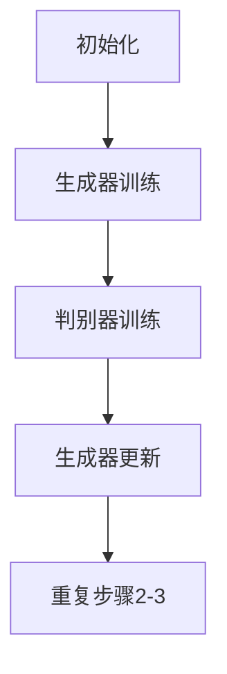

**B.2 自编码器的流程图**

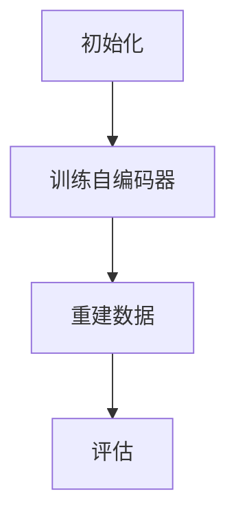

**B.3 聚类算法的流程图**


**B.4 降维算法的流程图**


这些流程图可以帮助我们更直观地理解Unsupervised Learning算法的运行过程。

#### 附录 C：数学模型与公式

在Unsupervised Learning中，数学模型和公式是理解和实现算法的核心。以下是一些关键的数学模型和公式：

**C.1 K均值聚类算法的数学公式**

- **距离函数**：欧几里得距离

$$
d(x_i, c_j) = \sqrt{\sum_{k=1}^{n} (x_{ik} - c_{jk})^2}
$$

其中，$x_i$和$c_j$分别是数据点$x_i$和聚类中心$c_j$的第$k$个特征。

- **聚类中心更新**：

$$
c_j' = \frac{1}{N_j} \sum_{i=1}^{N} x_i
$$

其中，$N_j$是簇$j$中的数据点数量。

**C.2 主成分分析的数学公式**

- **标准化**：

$$
x_i' = \frac{x_i - \mu}{\sigma}
$$

其中，$\mu$是均值，$\sigma$是标准差。

- **协方差矩阵**：

$$
\mathbf{C} = \frac{1}{n-1} \sum_{i=1}^{n} (x_i - \mu)(x_i - \mu)^T
$$

- **特征值和特征向量**：

$$
\mathbf{C} \mathbf{v} = \lambda \mathbf{v}
$$

**C.3 GAN的损失函数公式**

- **生成器损失**：

$$
L_G = -\log D(G(z))
$$

- **判别器损失**：

$$
L_D = -[\log D(x) + \log(1 - D(G(z))]
$$

**C.4 自编码器的损失函数公式**

- **编码器损失**：

$$
L_E = \frac{1}{2} \sum_{i=1}^{n} (x_i - E(x_i))^2
$$

- **解码器损失**：

$$
L_D = \frac{1}{2} \sum_{i=1}^{n} (x_i - D(E(x_i)))^2
$$

这些数学模型和公式为Unsupervised Learning的理论和实践提供了坚实的基础。

#### 附录 D：伪代码

以下是一些常用的Unsupervised Learning算法的伪代码，这些伪代码可以帮助我们更好地理解算法的实现细节。

**D.1 K均值聚类算法的伪代码**

```python
def kmeans(data, K):
    centroids = random_initialize_centroids(data, K)
    while not converged:
        assignments = assign_points_to_clusters(data, centroids)
        centroids = update_centroids(data, assignments, K)
    return centroids, assignments
```

**D.2 主成分分析的伪代码**

```python
def pca(data, k):
    standardized_data = standardize(data)
    covariance_matrix = calculate_covariance_matrix(standardized_data)
    eigenvalues, eigenvectors = calculate_eigenvalues_and_eigenvectors(covariance_matrix)
    principal_components = select_principal_components(eigenvalues, eigenvectors, k)
    projected_data = project_data(standardized_data, principal_components)
    return projected_data
```

**D.3 GAN的伪代码**

```python
def train_gan(generator, discriminator, data_loader, epochs):
    for epoch in range(epochs):
        for batch in data_loader:
            # 生成器训练
            z = generate_random_noise(batch_size)
            x_fake = generator(z)
            d_loss_fake = discriminator_loss(discriminator, x_fake)
            
            # 判别器训练
            x_real = batch
            d_loss_real = discriminator_loss(discriminator, x_real)
            
            # 生成器更新
            z = generate_random_noise(batch_size)
            generator_loss = generator_loss(generator, discriminator, z)
            
            # 更新权重
            update_weights(generator, discriminator, d_loss_fake, d_loss_real, generator_loss)
    return generator, discriminator
```

**D.4 自编码器的伪代码**

```python
def train_autoencoder(encoder, decoder, data, epochs):
    for epoch in range(epochs):
        for x in data:
            z = encoder(x)
            x_reconstruction = decoder(z)
            loss = reconstruction_loss(x, x_reconstruction)
            update_weights(encoder, decoder, loss)
    return encoder, decoder
```

**D.5 聚类算法的伪代码**

```python
def hierarchical_clustering(data):
    clusters = initialize_clusters(data)
    while len(clusters) > 1:
        distances = calculate_distances(clusters)
        closest_clusters = find_closest_clusters(distances)
        clusters = merge_clusters(clusters, closest_clusters)
    return clusters
```

**D.6 降维算法的伪代码**

```python
def tsne(data, n_components):
    similarity_matrix = calculate_gaussian_similarity_matrix(data)
    low_dim_probabilities = calculate_low_dim_probabilities(similarity_matrix)
    optimized_probabilities = optimize_probabilities(low_dim_probabilities)
    projected_data = project_data(optimized_probabilities, n_components)
    return projected_data
```

这些伪代码为算法的实现提供了清晰的框架，有助于读者理解和实践Unsupervised Learning技术。

