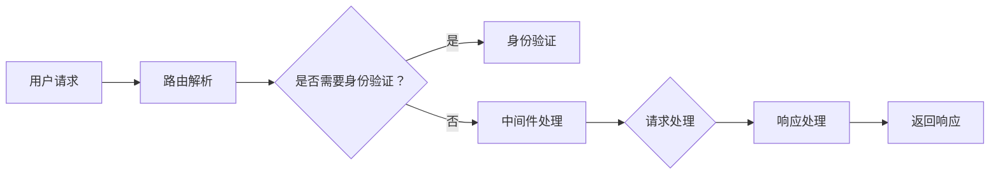
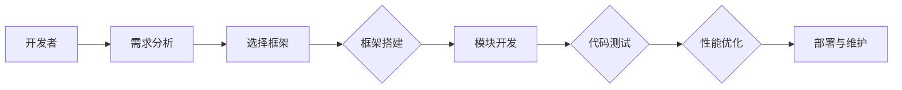
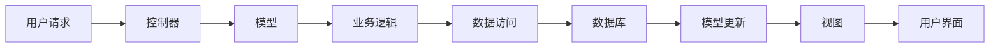

                 

### 《Web 后端框架：Express、Django 和 Flask》

> **关键词**：Web 后端框架、Express、Django、Flask、MVC、RESTful、中间件、微服务、性能优化、实战项目。

> **摘要**：本文深入探讨Web后端框架Express、Django和Flask的设计原理、使用方法及其在项目中的应用。通过对比分析，帮助开发者选择合适的框架，掌握其核心概念和实现细节，提升开发效率和项目质量。

### 目录大纲

1. **Web后端框架概述**
   1.1. Web后端框架基本概念
   1.2. Web后端框架的作用
   1.3. Web后端框架的发展历史

2. **Web后端框架的核心概念与架构**
   2.1. 模块化与组件化开发
   2.2. MVC（模型-视图-控制器）架构
   2.3. RESTful API设计原则
   2.4. 中间件（Middleware）机制

3. **Express框架**
   3.1. Express框架简介
   3.2. Express的基本使用
   3.3. Express的路由与请求处理
   3.4. Express的状态管理

4. **Django框架**
   4.1. Django框架简介
   4.2. Django的基本使用
   4.3. Django的视图与模板
   4.4. Django的表单处理与用户认证

5. **Flask框架**
   5.1. Flask框架简介
   5.2. Flask的基本使用
   5.3. Flask的扩展库
   5.4. Flask的蓝图（Blueprints）机制

6. **Web后端框架实战项目**
   6.1. Express实战项目
   6.2. Django实战项目
   6.3. Flask实战项目

7. **Web后端框架优化与趋势**
   7.1. Web后端框架性能优化
   7.2. Web后端框架发展趋势
   7.3. Web后端框架生态圈

8. **Web后端框架的持续学习和应用**
   8.1. 持续学习的重要性
   8.2. 实践与案例分析
   8.3. 框架的选择与应用策略

### 附录

9. **Web后端框架开发工具与资源**
   9.1. 开发工具介绍
   9.2. 资源汇总

**Note**: 在实际编写过程中，每个章节的内容将会更加详细，包括核心算法原理讲解、数学模型与公式、项目实战代码与分析等，这里仅提供了一个大纲框架。Markdown 文件中的 Mermaid 图表和伪代码需要手动添加到相应的章节中。

---

在接下来的章节中，我们将对Web后端框架进行详细探讨，首先从基本概念和历史背景开始，逐步深入到各个框架的核心原理和实践应用。希望通过本文，读者能够全面了解这些框架，并能够在实际项目中灵活运用。让我们开始吧！<|less]|>
### Web 后端框架基本概念

Web后端框架是指用于简化Web应用程序开发过程的软件框架。它通过提供一套预先定义的API和组件，帮助开发者快速搭建和部署后端服务，从而提高开发效率和代码质量。Web后端框架的核心目的是解决开发者需要手动编写的重复性代码，使得开发者能够更专注于业务逻辑的实现。

#### **1.1 Web后端框架概述**

Web后端框架通常由以下几部分组成：

- **路由（Routing）**：路由用于映射URL到对应的处理器（通常是控制器或服务），使得用户请求能够正确地被处理。
- **中间件（Middleware）**：中间件是位于请求处理者和响应者之间的组件，用于在请求到达最终处理器之前或之后执行额外的处理逻辑，例如身份验证、日志记录和跨域请求处理等。
- **模型-视图-控制器（MVC）**：MVC是一种软件设计模式，用于将应用程序分为三个主要部分：模型（数据存储和处理），视图（用户界面展示），控制器（业务逻辑处理）。这种模式有助于代码的模块化和可维护性。
- **数据库抽象层**：大多数Web后端框架都提供了一种与数据库进行交互的抽象层，简化了数据库操作，如查询、更新和删除。
- **模板引擎**：模板引擎允许开发者定义页面布局和结构，并通过插入变量来动态生成HTML页面。

**Mermaid流程图**：Web后端开发流程简图



#### **1.2 Web后端框架的作用**

Web后端框架的作用主要体现在以下几个方面：

1. **简化开发**：通过提供一系列的内置功能和组件，框架可以大大减少开发者需要编写的代码量，从而缩短项目开发周期。
2. **提高代码质量**：框架通常遵循最佳实践和设计模式，有助于开发者编写结构清晰、易于维护和扩展的代码。
3. **模块化**：框架鼓励模块化开发，使得不同功能的模块可以独立开发和测试，提高开发效率。
4. **可重用性**：框架内置的组件和库可以在多个项目中重用，节省开发时间和资源。
5. **性能优化**：框架通常提供了性能优化的工具和机制，如缓存、数据库连接池和异步处理等。

**Mermaid流程图**：Web后端框架在开发中的作用与联系简图



#### **1.3 Web后端框架的发展历史**

Web后端框架的发展经历了几个阶段：

1. **原始Web开发**：在Web开发的初期，开发者需要手动编写大量的HTML、CSS和JavaScript代码，以及处理服务器端脚本，如PHP、ASP和JSP等。这种开发方式繁琐且易于出错。
2. **早期框架**：随着Web应用的复杂性增加，开发者开始使用一些早期框架，如Ruby on Rails、Spring和Struts等，以简化开发过程。
3. **现代框架**：现代Web后端框架，如Express、Django和Flask，在设计时充分考虑了性能、可扩展性和模块化，使得开发者能够更加高效地构建高性能的Web应用。

**1.3.1 从原始Web开发到框架的演进**

在原始Web开发阶段，开发者需要手动管理每个请求的完整生命周期，包括URL路由、请求处理、数据存储和响应返回。这种方式不仅繁琐，而且容易出错，且难以维护。

随着Web应用的日益复杂，开发者开始使用一些早期框架，如Ruby on Rails，这些框架引入了MVC设计模式，使得开发者可以更专注于业务逻辑的实现，而无需关心底层细节。这种模式的引入显著提高了开发效率和代码质量。

**1.3.2 现代Web后端框架的流行趋势**

现代Web后端框架，如Express、Django和Flask，在设计时充分考虑了以下趋势：

- **模块化与组件化**：现代框架鼓励模块化和组件化开发，使得开发者可以轻松地扩展和重用代码。
- **性能与可扩展性**：框架提供了各种性能优化工具和机制，如异步处理、缓存和负载均衡，以支持高并发和高性能的应用。
- **云原生与容器化**：随着云原生和容器技术的兴起，现代Web后端框架逐渐适应并利用这些技术，以提供更加灵活和高效的部署方案。

通过上述讨论，我们可以看到Web后端框架的发展历程和作用。接下来，我们将进一步探讨Web后端框架的核心概念和架构，帮助读者深入了解这些框架的设计原理。请继续阅读下一章节。|>
### Web 后端框架的核心概念与架构

Web后端框架的设计和实现涉及多个核心概念和架构，这些概念和架构共同构成了一个高效、可扩展和易于维护的Web应用开发环境。本章节将详细讨论以下核心概念和架构：

1. **模块化与组件化开发**
2. **MVC（模型-视图-控制器）架构**
3. **RESTful API设计原则**
4. **中间件（Middleware）机制**

#### **2.1 模块化与组件化开发**

模块化与组件化开发是现代软件开发中的一种重要设计理念，它将应用程序分解为多个独立的模块或组件，每个模块或组件负责实现特定的功能。这种设计方法具有以下优势：

- **代码重用**：模块化和组件化使得开发者可以将常用功能封装成模块或组件，并在多个项目中重用，从而减少重复编写代码的工作量。
- **易于维护**：模块和组件的独立性使得代码维护更加方便，当某个模块或组件出现问题时，可以独立修复而不影响其他部分。
- **可扩展性**：通过模块化和组件化，开发者可以灵活地添加或替换模块和组件，从而方便地扩展系统功能。

**伪代码**：模块化与组件化开发示例

```python
# 模块化开发示例
class UserManager:
    def register_user(self, user_data):
        # 注册用户逻辑
        pass

class ProductManager:
    def create_product(self, product_data):
        # 创建产品逻辑
        pass

# 组件化开发示例
class AuthenticationComponent:
    def authenticate_user(self, user_credentials):
        # 用户认证逻辑
        pass

class AuthorizationComponent:
    def authorize_user(self, user_role):
        # 用户授权逻辑
        pass
```

#### **2.2 MVC（模型-视图-控制器）架构**

MVC是一种经典的软件设计模式，它将应用程序分为三个主要部分：模型（Model）、视图（View）和控制器（Controller）。这种架构模式有助于分离关注点，使得应用程序更加模块化和易于维护。

- **模型（Model）**：模型负责管理应用程序的数据和业务逻辑。它通常包括数据访问层和业务逻辑层。模型通过数据访问对象（DAO）与数据库进行交互，并通过业务逻辑对象提供业务操作接口。
- **视图（View）**：视图负责呈现用户界面，通常由HTML、CSS和JavaScript等前端技术实现。视图通过模型获取数据，并将其渲染成用户界面。
- **控制器（Controller）**：控制器负责处理用户请求，调用模型执行业务逻辑，并更新视图。控制器通常是一个路由器，它接收用户请求并决定调用哪个模型和视图。

**Mermaid流程图**：MVC架构流程简图



#### **2.3 RESTful API设计原则**

RESTful API是Web服务设计的一种风格，它基于HTTP协议，使用统一的接口设计和数据交换格式，使得应用程序能够方便地进行数据交换和功能调用。RESTful API设计原则包括以下几点：

- **统一接口**：API应该遵循统一的接口设计，包括URL、HTTP方法、状态码和数据格式等。
- **无状态性**：API不应该存储会话状态，每次请求都应该包含所有必要信息。
- **分层系统**：API应该设计为分层系统，包括API端点、服务端点和数据存储等。
- **状态转移**：API应该通过HTTP方法的GET、POST、PUT和DELETE等实现状态转移，从而实现资源的创建、读取、更新和删除等操作。

**伪代码**：RESTful API设计示例

```python
# 用户注册API
@app.route('/users', methods=['POST'])
def register_user():
    user_data = request.get_json()
    user = User.create(user_data)
    if user:
        return jsonify({'id': user.id, 'status': 'success'})
    else:
        return jsonify({'status': 'error', 'message': 'Invalid data'})

# 用户登录API
@app.route('/users/login', methods=['POST'])
def login_user():
    user_credentials = request.get_json()
    user = User.authenticate(user_credentials)
    if user:
        return jsonify({'token': user.token, 'status': 'success'})
    else:
        return jsonify({'status': 'error', 'message': 'Invalid credentials'})
```

#### **2.4 中间件（Middleware）机制**

中间件是位于请求处理者和响应者之间的组件，用于在请求到达最终处理器之前或之后执行额外的处理逻辑。中间件可以用于身份验证、日志记录、请求解析、响应格式化等多种功能。中间件机制使得开发者可以方便地添加和配置这些功能，而无需修改核心请求处理逻辑。

**伪代码**：中间件应用示例

```python
# 中间件：身份验证
def authenticate(request):
    if not request.authenticated:
        return 'Unauthorized'

# 中间件：日志记录
def log_request(request):
    print('Request received:', request)

# 应用中间件
app.middleware('authenticate', authenticate)
app.middleware('log_request', log_request)

@app.route('/users')
def user_list():
    # 用户列表处理逻辑
    pass
```

通过上述讨论，我们可以看到Web后端框架的核心概念和架构是如何设计和实现的。这些概念和架构不仅提高了开发效率，还保证了代码的模块化和可维护性。在下一章节中，我们将详细介绍Express、Django和Flask这三个流行的Web后端框架。请继续阅读。|>
### Express框架

Express是一个轻量级的Web应用框架，用于Node.js环境。它提供了丰富的路由、中间件和模板功能，使得开发者可以快速搭建和部署高性能的Web应用。本章节将详细介绍Express框架，包括其基本使用、路由与请求处理、状态管理等方面。

#### **3.1 Express框架简介**

Express框架由TJ Holowaychuk于2010年创建，最初是为了简化Node.js的应用开发。Express提供了许多实用的中间件，使得开发者可以方便地处理各种常见任务，如身份验证、请求解析、响应格式化等。此外，Express还支持模板引擎和路由功能，使得开发者可以轻松地搭建用户界面和处理用户请求。

**3.1.1 Express的诞生背景**

随着互联网的快速发展，Web应用的需求不断增加，开发者需要一个轻量级、高效且易于使用的框架来简化开发过程。TJ Holowaychuk在设计Express时，考虑了以下背景和需求：

- **快速开发**：开发者需要一个简单且快速的框架，以加快应用开发过程。
- **模块化**：框架应该支持模块化和组件化开发，使得开发者可以方便地扩展和重用代码。
- **灵活性**：框架应该提供足够的灵活性，以适应不同的开发需求。

**3.1.2 Express的主要特点**

Express框架具有以下主要特点：

- **轻量级**：Express是一个轻量级的框架，没有强加任何特定的应用模式，开发者可以灵活地选择适合自己的开发方式。
- **模块化**：Express通过中间件实现了模块化，开发者可以方便地添加、配置和删除中间件，以满足不同的需求。
- **灵活性**：Express提供了丰富的功能，但并不强求开发者使用所有功能。开发者可以根据自己的需求选择合适的特性。
- **生态系统**：Express拥有丰富的生态系统，提供了大量的中间件和插件，使得开发者可以方便地扩展和定制功能。

#### **3.2 Express的基本使用**

使用Express框架搭建Web应用的基本步骤如下：

1. **安装Node.js**：首先，确保已经安装了Node.js和npm（Node Package Manager）。可以从官方网站下载并安装Node.js：[https://nodejs.org/](https://nodejs.org/)。
2. **创建项目**：在合适的位置创建一个新的目录，并使用以下命令创建一个项目：

   ```bash
   mkdir express_example
   cd express_example
   npm init -y
   ```

   `npm init`命令会生成一个`package.json`文件，用于管理项目依赖和配置。
3. **安装Express**：在项目目录下安装Express：

   ```bash
   npm install express
   ```

   这将在`node_modules`目录中安装Express及其依赖项。
4. **创建服务器**：在项目目录中创建一个名为`app.js`（或`app.js`）的文件，并编写以下代码：

   ```javascript
   const express = require('express');
   const app = express();

   app.get('/', (req, res) => {
       res.send('Hello, World!');
   });

   app.listen(3000, () => {
       console.log('Server is running on port 3000');
   });
   ```

   这段代码首先导入Express模块，并创建一个应用实例。然后，使用`app.get()`方法定义一个路由，用于处理访问根路径（`/`）的GET请求。最后，使用`app.listen()`方法启动服务器，并指定端口号（例如3000）。

5. **运行服务器**：在命令行中运行以下命令启动服务器：

   ```bash
   node app.js
   ```

   如果一切正常，服务器将在指定的端口号上运行，并可以接收和处理HTTP请求。

**3.2.1 Express搭建Web服务器**

使用Express搭建Web服务器的基本步骤如下：

1. **导入Express模块**：

   ```javascript
   const express = require('express');
   ```

   这行代码将导入Express模块。
2. **创建应用实例**：

   ```javascript
   const app = express();
   ```

   这行代码创建一个Express应用实例，该实例将用于处理HTTP请求。
3. **配置中间件**：

   ```javascript
   app.use(express.json());
   app.use(express.urlencoded({ extended: false }));
   ```

   这两行代码分别启用JSON和URL编码解析中间件，用于处理JSON格式的请求体和URL编码格式的查询参数。
4. **定义路由和处理函数**：

   ```javascript
   app.get('/', (req, res) => {
       res.send('Hello, World!');
   });
   ```

   这行代码定义了一个GET请求路由，用于处理访问根路径（`/`）的GET请求。处理函数接收一个请求对象（`req`）和一个响应对象（`res`），并在响应对象上调用`res.send()`方法发送响应。
5. **启动服务器**：

   ```javascript
   app.listen(3000, () => {
       console.log('Server is running on port 3000');
   });
   ```

   这行代码启动服务器，并指定端口号（例如3000）。当服务器启动成功后，会输出一条日志消息。

**3.2.2 Express中间件的使用**

中间件是Express框架的核心概念之一，它用于在请求处理过程中执行额外的功能。Express中间件可以通过以下步骤进行使用：

1. **定义中间件**：

   ```javascript
   function loggerMiddleware(req, res, next) {
       console.log('Request URL:', req.url);
       next();
   }
   ```

   这段代码定义了一个简单的中间件函数，它输出请求URL并调用`next()`函数继续执行下一个中间件。
2. **注册中间件**：

   ```javascript
   app.use(loggerMiddleware);
   ```

   这行代码将中间件函数注册到应用实例上，以便在每次请求处理过程中调用。
3. **中间件执行顺序**：

   当请求到达服务器时，Express会按照注册的顺序依次调用中间件。如果中间件函数没有调用`next()`，则请求处理会暂停并等待其他中间件的执行。

**3.2.3 Express的路由与请求处理**

Express通过路由（routes）来映射URL到相应的处理函数（handlers）。路由和请求处理的基本步骤如下：

1. **定义路由**：

   ```javascript
   app.get('/', (req, res) => {
       res.send('Home page');
   });
   ```

   这行代码定义了一个GET请求路由，用于处理访问根路径（`/`）的GET请求。处理函数接收一个请求对象（`req`）和一个响应对象（`res`），并在响应对象上调用`res.send()`方法发送响应。
2. **定义其他HTTP方法路由**：

   ```javascript
   app.post('/login', (req, res) => {
       // 登录处理逻辑
   });
   app.put('/users/:id', (req, res) => {
       // 更新用户处理逻辑
   });
   app.delete('/users/:id', (req, res) => {
       // 删除用户处理逻辑
   });
   ```

   这几行代码分别定义了POST、PUT和DELETE请求路由，用于处理特定的URL和HTTP方法。
3. **通用处理函数**：

   ```javascript
   function handleRequest(req, res) {
       // 通用处理逻辑
       if (req.method === 'GET') {
           res.send('GET request');
       } else if (req.method === 'POST') {
           res.send('POST request');
       } else {
           res.status(405).send('Method Not Allowed');
       }
   }
   ```

   这段代码定义了一个通用处理函数，它根据请求的HTTP方法返回相应的响应。

**3.3 Express的路由与请求处理**

Express通过路由（routes）来映射URL到相应的处理函数（handlers）。路由和请求处理的基本步骤如下：

1. **定义路由**：

   ```javascript
   app.get('/', (req, res) => {
       res.send('Home page');
   });
   ```

   这行代码定义了一个GET请求路由，用于处理访问根路径（`/`）的GET请求。处理函数接收一个请求对象（`req`）和一个响应对象（`res`），并在响应对象上调用`res.send()`方法发送响应。
2. **定义其他HTTP方法路由**：

   ```javascript
   app.post('/login', (req, res) => {
       // 登录处理逻辑
   });
   app.put('/users/:id', (req, res) => {
       // 更新用户处理逻辑
   });
   app.delete('/users/:id', (req, res) => {
       // 删除用户处理逻辑
   });
   ```

   这几行代码分别定义了POST、PUT和DELETE请求路由，用于处理特定的URL和HTTP方法。
3. **通用处理函数**：

   ```javascript
   function handleRequest(req, res) {
       // 通用处理逻辑
       if (req.method === 'GET') {
           res.send('GET request');
       } else if (req.method === 'POST') {
           res.send('POST request');
       } else {
           res.status(405).send('Method Not Allowed');
       }
   }
   ```

   这段代码定义了一个通用处理函数，它根据请求的HTTP方法返回相应的响应。

**3.4 Express的状态管理**

在Express应用中，状态管理是指如何存储和访问应用程序中的数据。Express提供了几种不同的方式来管理状态：

1. **使用局部变量**：

   ```javascript
   app.get('/', (req, res) => {
       let count = 0;
       count++;
       res.send(`Count: ${count}`);
   });
   ```

   这段代码在每次请求处理中增加一个局部变量`count`，并在响应中返回当前值。这种方式适用于简单的计数器等场景，但不适用于跨请求的状态保持。
2. **使用会话（Session）**：

   ```javascript
   const session = require('express-session');
   app.use(session({
       secret: 'my_secret_key',
       resave: false,
       saveUninitialized: true
   }));

   app.get('/', (req, res) => {
       if (req.session.count === undefined) {
           req.session.count = 0;
       }
       req.session.count++;
       res.send(`Count: ${req.session.count}`);
   });
   ```

   这段代码使用Express会话中间件来存储和访问跨请求的状态。通过会话对象，可以在不同的请求中保持和访问用户状态。
3. **使用第三方中间件**：

   ```javascript
   const redis = require('redis');
   const session = require('express-session');
   const redisStore = require('connect-redis')(session);

   const redisClient = redis.createClient();
   app.use(session({
       store: new redisStore({
           client: redisClient
       }),
       secret: 'my_secret_key',
       resave: false,
       saveUninitialized: true
   }));

   app.get('/', (req, res) => {
       if (req.session.count === undefined) {
           req.session.count = 0;
       }
       req.session.count++;
       res.send(`Count: ${req.session.count}`);
   });
   ```

   这段代码使用Redis作为会话存储，通过第三方中间件实现跨服务器的会话管理。这种方式适用于需要分布式会话管理的场景。

通过上述内容，我们了解了Express框架的基本概念、使用方法以及路由与请求处理、状态管理等方面的内容。接下来，我们将进一步探讨Django框架，了解其独特的特点和应用场景。请继续阅读下一章节。|>
### Django框架

Django是一个高级Python Web框架，旨在快速开发和轻松部署应用程序。它遵循MVC（模型-视图-控制器）设计模式，并提供了许多内置功能和工具，如ORM（对象关系映射）、模板引擎和后台管理界面。本章节将详细介绍Django框架，包括其基本使用、模型定义与数据库操作、视图与模板等方面。

#### **4.1 Django框架简介**

Django由Adrian Holovaty和Simon Willison在2005年创建，最初是为了构建新闻网站。自那时以来，Django已经成为了最受欢迎的Web框架之一，广泛应用于各种领域，如社交媒体、电子商务和内容管理系统。Django的成功在于其快速开发、灵活性和高性能。

**4.1.1 Django的诞生背景**

Django的诞生源于一个需求：构建一个快速、易于使用的Web框架，以简化数据驱动的Web应用程序的开发。在Django之前，开发者通常需要手动编写大量重复的代码来处理数据库交互、URL路由和视图逻辑。Django通过提供一套内置的工具和组件，大大简化了这些任务。

**4.1.2 Django的主要特点**

Django具有以下主要特点：

- **快速开发**：Django提供了一整套工具，如ORM、自动生成的表单和后台管理界面，使得开发者可以快速构建和部署应用程序。
- **可扩展性**：Django遵循MVC设计模式，支持模块化和组件化开发，使得开发者可以方便地扩展和定制应用程序。
- **安全性**：Django内置了许多安全特性，如自动防止跨站请求伪造（CSRF）和跨站脚本（XSS）攻击，有助于保护应用程序的安全。
- **灵活性**：Django提供了许多可配置的选项和中间件，使得开发者可以根据需求定制应用程序的行为。

#### **4.2 Django的基本使用**

使用Django框架搭建Web应用的基本步骤如下：

1. **安装Django**：首先，确保已经安装了Python和pip（Python包管理器）。可以从Django的官方网站下载并安装Django：[https://www.djangoproject.com/](https://www.djangoproject.com/)。

   ```bash
   pip install django
   ```

   这将在系统中安装Django及其依赖项。
2. **创建项目**：在项目目录中创建一个新的Django项目：

   ```bash
   django-admin startproject myproject
   ```

   这将在当前目录中创建一个名为`myproject`的Django项目，其中包含一个名为`myproject`的Python包和一个名为`manage.py`的管理脚本。
3. **创建应用**：在项目中创建一个新的应用：

   ```bash
   python manage.py startapp myapp
   ```

   这将在项目中创建一个名为`myapp`的应用目录，其中包含应用的模型、视图、模板和URL配置等文件。
4. **配置数据库**：在`myproject/settings.py`文件中配置数据库连接信息：

   ```python
   DATABASES = {
       'default': {
           'ENGINE': 'django.db.backends.sqlite3',
           'NAME': BASE_DIR / 'db.sqlite3',
       }
   }
   ```

   这行代码配置了SQLite数据库，但也可以根据需要配置其他数据库，如MySQL或PostgreSQL。
5. **运行服务器**：在命令行中运行以下命令启动Django服务器：

   ```bash
   python manage.py runserver
   ```

   如果一切正常，服务器将在指定的端口号（默认为8000）上运行，并可以接收和处理HTTP请求。

#### **4.2.1 Django项目创建**

创建Django项目的基本步骤如下：

1. **初始化项目**：

   ```bash
   django-admin startproject myproject
   ```

   这将在当前目录中创建一个名为`myproject`的Django项目，其中包含项目的配置文件、管理脚本和基本目录结构。
2. **创建应用**：

   ```bash
   python manage.py startapp myapp
   ```

   这将在项目中创建一个名为`myapp`的应用目录，其中包含应用的模型、视图、模板和URL配置等文件。
3. **注册应用**：

   在`myproject/settings.py`文件中，将新建的应用添加到`INSTALLED_APPS`列表中：

   ```python
   INSTALLED_APPS = [
       'myapp',
   ]
   ```

   这行代码确保Django知道`myapp`应用的存在，并将其包含在项目中。
4. **运行服务器**：

   ```bash
   python manage.py runserver
   ```

   这行命令启动Django开发服务器，并允许开发者通过浏览器访问项目。

#### **4.2.2 Django的模型定义与数据库操作**

Django使用ORM（对象关系映射）来处理数据库操作，使得开发者可以使用Python代码来定义和操作数据库。以下是定义和操作模型的基本步骤：

1. **定义模型**：

   在应用目录下的`models.py`文件中定义模型：

   ```python
   from django.db import models

   class User(models.Model):
       name = models.CharField(max_length=100)
       email = models.EmailField(unique=True)
       created_at = models.DateTimeField(auto_now_add=True)

       def __str__(self):
           return self.name
   ```

   这段代码定义了一个名为`User`的模型，包含`name`、`email`和`created_at`字段。
2. **迁移数据库**：

   在项目中运行以下命令将模型迁移到数据库：

   ```bash
   python manage.py makemigrations myapp
   python manage.py migrate
   ```

   `makemigrations`命令生成迁移文件，`migrate`命令将迁移应用到数据库。
3. **操作模型**：

   使用Django的ORM API操作模型：

   ```python
   # 创建新用户
   user = User(name='Alice', email='alice@example.com')
   user.save()

   # 查询用户
   users = User.objects.all()

   # 更新用户
   user = User.objects.get(id=1)
   user.name = 'Alice Smith'
   user.save()

   # 删除用户
   user = User.objects.get(id=1)
   user.delete()
   ```

   这些代码展示了如何创建、查询、更新和删除用户记录。

#### **4.3 Django的视图与模板**

Django使用视图来处理HTTP请求，并将响应渲染到模板中。以下是定义视图和使用模板的基本步骤：

1. **定义视图**：

   在应用目录下的`views.py`文件中定义视图：

   ```python
   from django.shortcuts import render
   from .models import User

   def user_list(request):
       users = User.objects.all()
       return render(request, 'user_list.html', {'users': users})
   ```

   这段代码定义了一个名为`user_list`的视图，它从数据库中查询所有用户，并将数据传递给模板。
2. **配置URL**：

   在应用目录下的`urls.py`文件中配置URL：

   ```python
   from django.urls import path
   from . import views

   urlpatterns = [
       path('', views.user_list, name='user_list'),
   ]
   ```

   这段代码将根URL（`/`）映射到`user_list`视图。
3. **使用模板**：

   在应用目录下的`templates/myapp/user_list.html`文件中定义模板：

   ```html
   <h1>User List</h1>
   <ul>
       
           <li>{{ user.name }} - {{ user.email }}</li>
       
   </ul>
   ```

   这段代码使用Django模板语言（DTL）遍历用户列表，并显示每个用户的姓名和电子邮件。

#### **4.4 Django的表单处理与用户认证**

Django提供了一套强大的表单处理和用户认证机制，使得开发者可以方便地处理用户输入和用户身份验证。

1. **创建表单**：

   使用Django表单类创建表单：

   ```python
   from django import forms

   class UserForm(forms.Form):
       name = forms.CharField(max_length=100)
       email = forms.EmailField()
   ```

   这段代码定义了一个名为`UserForm`的表单类，包含`name`和`email`字段。
2. **处理表单**：

   在视图中处理表单：

   ```python
   from django.shortcuts import render, redirect
   from .forms import UserForm

   def create_user(request):
       if request.method == 'POST':
           form = UserForm(request.POST)
           if form.is_valid():
               user = User(name=form.cleaned_data['name'], email=form.cleaned_data['email'])
               user.save()
               return redirect('user_list')
       else:
           form = UserForm()
       return render(request, 'create_user.html', {'form': form})
   ```

   这段代码处理创建用户的表单请求，验证表单数据，并保存新用户。
3. **用户认证**：

   Django提供了一套用户认证系统，使得开发者可以方便地处理用户登录、注销和权限验证。

   - **登录**：

     ```python
     from django.contrib.auth import authenticate, login

     def login_user(request):
         if request.method == 'POST':
             username = request.POST['username']
             password = request.POST['password']
             user = authenticate(username=username, password=password)
             if user is not None and user.is_active:
                 login(request, user)
                 return redirect('user_list')
             else:
                 return redirect('login')
         return render(request, 'login.html')
     ```

     这段代码处理用户登录请求，使用`authenticate`函数验证用户身份，并使用`login`函数登录用户。
   - **注销**：

     ```python
     from django.contrib.auth import logout

     def logout_user(request):
         logout(request)
         return redirect('login')
     ```

     这段代码处理用户注销请求，使用`logout`函数注销用户。

通过上述内容，我们了解了Django框架的基本概念、使用方法以及模型定义与数据库操作、视图与模板、表单处理与用户认证等方面的内容。Django以其快速开发、灵活性和安全性而备受开发者青睐。接下来，我们将进一步探讨Flask框架，了解其独特的特点和应用场景。请继续阅读下一章节。|>
### Flask框架

Flask是一个轻量级的Web应用框架，专为快速开发和微服务架构设计。它无需复杂的配置，允许开发者灵活地扩展功能，非常适合小型到中型的Web应用。本章节将详细介绍Flask框架，包括其基本使用、路由与视图、扩展库等方面。

#### **5.1 Flask框架简介**

Flask由Armin Ronacher在2010年创建，旨在提供一个简单且易于扩展的Web框架。Flask的核心是轻量级和可扩展性，它允许开发者根据自己的需求选择合适的库和插件。Flask的一个显著特点是它没有强制性的请求-响应循环，这使开发者可以完全控制应用的行为。

**5.1.1 Flask的诞生背景**

Flask的诞生源于开发者对轻量级、灵活且易于扩展的Web框架的需求。Armin Ronacher在开发一个小型Web应用时，发现现有的Python Web框架要么过于复杂，要么不符合他的需求。因此，他决定创建一个简单、易用且可扩展的框架，这就是Flask的起源。

**5.1.2 Flask的主要特点**

Flask的主要特点包括：

- **轻量级**：Flask的核心非常轻量，没有强制性的依赖，使得开发者可以灵活地选择和使用所需的库。
- **可扩展性**：Flask允许开发者根据需求添加自定义功能，如数据库支持、认证系统、模板引擎等。
- **灵活的路由系统**：Flask提供了强大的路由系统，允许开发者自定义URL映射和处理函数。
- **易于入门**：Flask的简单性使得新手开发者可以快速上手，并且了解Web应用的基本工作原理。

#### **5.2 Flask的基本使用**

使用Flask框架搭建Web应用的基本步骤如下：

1. **安装Flask**：首先，确保已经安装了Python和pip（Python包管理器）。可以从Python的包索引PyPI（[https://pypi.org/](https://pypi.org/)）下载并安装Flask：

   ```bash
   pip install Flask
   ```

   这将在系统中安装Flask及其依赖项。
2. **创建应用**：在项目目录中创建一个名为`app.py`的文件，并编写以下代码：

   ```python
   from flask import Flask

   app = Flask(__name__)

   @app.route('/')
   def hello():
       return 'Hello, World!'

   if __name__ == '__main__':
       app.run()
   ```

   这段代码导入了Flask模块，创建了Flask应用实例，并定义了一个路由。最后一行代码使用`app.run()`启动应用。
3. **运行服务器**：在命令行中运行以下命令启动Flask服务器：

   ```bash
   python app.py
   ```

   如果一切正常，服务器将在指定的端口号（默认为5000）上运行，并可以接收和处理HTTP请求。

#### **5.2.1 Flask应用搭建**

搭建Flask应用的基本步骤如下：

1. **导入Flask模块**：

   ```python
   from flask import Flask
   ```

   这行代码导入了Flask模块。
2. **创建应用实例**：

   ```python
   app = Flask(__name__)
   ```

   这行代码创建了Flask应用实例。`__name__`是一个特殊变量，用于确保应用在模块级别被调用。
3. **定义路由**：

   ```python
   @app.route('/')
   def hello():
       return 'Hello, World!'
   ```

   这两行代码定义了一个路由，映射根路径（`/`）到`hello`函数。`@app.route()`是一个装饰器，用于指定路由。
4. **启动应用**：

   ```python
   if __name__ == '__main__':
       app.run()
   ```

   这行代码确保只有当模块被直接运行时，`app.run()`才会被调用，从而启动Flask服务器。

#### **5.2.2 Flask的路由与视图**

Flask的路由系统允许开发者自定义URL映射和处理函数。以下是定义路由和处理函数的基本步骤：

1. **定义路由**：

   ```python
   @app.route('/')
   def hello():
       return 'Hello, World!'
   ```

   这段代码定义了一个路由，映射根路径（`/`）到`hello`函数。
2. **定义其他HTTP方法路由**：

   ```python
   @app.route('/about', methods=['GET'])
   def about():
       return 'About Page'
   ```

   这段代码定义了一个GET请求路由，映射`/about`路径到`about`函数。
3. **通用处理函数**：

   ```python
   def handle_request(request):
       if request.method == 'GET':
           return 'GET request'
       elif request.method == 'POST':
           return 'POST request'
       else:
           return 'Method Not Allowed', 405
   ```

   这段代码定义了一个通用处理函数，根据请求的HTTP方法返回相应的响应。

#### **5.3 Flask的扩展库**

Flask拥有丰富的扩展库，可以方便地添加各种功能，如数据库支持、用户认证、表单处理等。以下是几个常用的扩展库：

1. **Flask-WTF**：Flask-WTF是一个用于处理Web表单的扩展库，它基于WTForms框架。

   ```python
   from flask import Flask
   from flask_wtf import FlaskForm
   from wtforms import StringField, PasswordField, BooleanField
   from wtforms.validators import DataRequired, EmailValidator

   app = Flask(__name__)
   app.config['SECRET_KEY'] = 'my_secret_key'

   class LoginForm(FlaskForm):
       email = StringField('Email', validators=[DataRequired(), EmailValidator()])
       password = PasswordField('Password', validators=[DataRequired()])
       remember = BooleanField('Remember me')

   @app.route('/login', methods=['GET', 'POST'])
   def login():
       form = LoginForm()
       if form.validate_on_submit():
           # 登录处理逻辑
           return 'Login successful!'
       return render_template('login.html', form=form)
   ```

   这段代码展示了如何使用Flask-WTF创建和验证表单。

2. **Flask-Login**：Flask-Login是一个用于管理用户登录状态的扩展库。

   ```python
   from flask_login import LoginManager, login_user, logout_user, login_required

   login_manager = LoginManager()
   login_manager.init_app(app)
   login_manager.login_view = 'login'

   @login_manager.user_loader
   def load_user(user_id):
       # 从数据库加载用户
       return User.get(user_id)

   @app.route('/login', methods=['GET', 'POST'])
   def login():
       # 登录处理逻辑
       user = User.authenticate(email, password)
       if user:
           login_user(user)
           return 'Login successful!'
       else:
           return 'Invalid credentials'

   @app.route('/logout')
   @login_required
   def logout():
       logout_user()
       return 'Logout successful!'
   ```

   这段代码展示了如何使用Flask-Login管理用户登录和注销。

3. **Flask-RESTful**：Flask-RESTful是一个用于构建RESTful Web服务的扩展库。

   ```python
   from flask import Flask
   from flask_restful import Api, Resource

   app = Flask(__name__)
   api = Api(app)

   class HelloWorld(Resource):
       def get(self):
           return {'hello': 'world'}

   api.add_resource(HelloWorld, '/')

   if __name__ == '__main__':
       app.run()
   ```

   这段代码展示了如何使用Flask-RESTful创建一个简单的RESTful服务。

#### **5.4 Flask的蓝图（Blueprints）机制**

Flask的蓝图（Blueprints）机制允许开发者将应用程序拆分为多个模块，每个模块都可以有自己的路由、模板和静态文件。蓝图对于大型应用尤为重要，因为它有助于组织代码和减少命名冲突。

**5.4.1 蓝图的定义**

蓝图是一个代表应用子模块的对象，它有自己的路由、模板和静态文件目录。定义蓝图的基本步骤如下：

1. **创建蓝图**：

   ```python
   from flask import Blueprint

   simple_app = Blueprint('simple_app', __name__, template_folder='templates', static_folder='static')
   ```

   这行代码创建了一个名为`simple_app`的蓝图，并指定了模板和静态文件目录。
2. **注册蓝图**：

   ```python
   app = Flask(__name__)
   app.register_blueprint(simple_app)
   ```

   这行代码将蓝图注册到主应用中。

**5.4.2 使用蓝图**

使用蓝图的基本步骤如下：

1. **定义路由**：

   ```python
   @simple_app.route('/')
   def hello():
       return 'Hello from the simple_app blueprint!'
   ```

   这段代码定义了一个路由，映射根路径（`/`）到`hello`函数。
2. **定义模板**：

   在`simple_app`蓝图的模板目录中创建一个名为`hello.html`的文件：

   ```html
   <!doctype html>
   <title>Hello</title>
   <h1>Hello from the simple_app blueprint!</h1>
   ```

   这段代码定义了一个模板，用于渲染`hello`视图。
3. **使用模板**：

   在主应用中，使用蓝图模板：

   ```python
   @app.route('/simple')
   def simple():
       return render_template('simple_app/hello.html')
   ```

   这段代码使用`render_template`函数渲染`simple_app`蓝图的`hello.html`模板。

通过上述内容，我们了解了Flask框架的基本概念、使用方法以及路由与视图、扩展库和蓝图机制等方面的内容。Flask以其轻量级、灵活性和可扩展性而受到开发者的喜爱。在下一章节中，我们将探讨Express、Django和Flask这三个框架的实战项目，通过具体案例来展示它们的应用。请继续阅读下一章节。|>
### Web后端框架实战项目

在实际开发中，选择合适的Web后端框架对于项目的成功至关重要。在本章节中，我们将通过Express、Django和Flask这三个框架的实战项目，展示如何使用这些框架搭建Web应用。每个项目都包含从需求分析到功能实现的完整流程，以便读者能够深入了解这些框架的使用方法和技巧。

#### **6.1 Express实战项目**

**6.1.1 项目需求分析**

假设我们正在开发一个在线博客平台，需求如下：

- 用户注册与登录
- 文章发布与展示
- 评论功能
- 用户管理

**6.1.2 技术栈选择**

- **前端**：React.js
- **后端**：Express框架
- **数据库**：MongoDB

**6.1.3 项目开发环境搭建**

1. **安装Node.js**：从Node.js官方网站下载并安装Node.js：[https://nodejs.org/](https://nodejs.org/)。
2. **安装Express**：在命令行中运行以下命令安装Express：

   ```bash
   npm install express
   ```

3. **创建项目**：使用以下命令创建一个Express项目：

   ```bash
   npm init -y
   mkdir blog-api
   cd blog-api
   npm install express body-parser mongoose
   ```

   这将在`blog-api`目录中创建一个项目，并安装Express和相关依赖。

4. **创建基本服务器**：在`blog-api`目录中创建一个名为`app.js`的文件，并编写以下代码：

   ```javascript
   const express = require('express');
   const bodyParser = require('body-parser');
   const mongoose = require('mongoose');

   const app = express();
   app.use(bodyParser.json());

   // 连接MongoDB
   mongoose.connect('mongodb://localhost:27017/blog', {
       useNewUrlParser: true,
       useUnifiedTopology: true,
   });

   // 路由配置
   app.get('/', (req, res) => {
       res.send('Welcome to the Blog API!');
   });

   const port = process.env.PORT || 3000;
   app.listen(port, () => {
       console.log(`Server running on port ${port}`);
   });
   ```

5. **启动服务器**：在命令行中运行以下命令启动服务器：

   ```bash
   node app.js
   ```

   如果一切正常，服务器将在3000端口上运行。

**6.1.4 项目核心功能实现**

1. **用户注册与登录**：

   - **用户注册**：

     ```javascript
     app.post('/register', (req, res) => {
         const { username, email, password } = req.body;
         // 验证用户信息...
         // 保存用户信息到数据库...
         res.json({ message: 'User registered successfully!' });
     });
     ```

   - **用户登录**：

     ```javascript
     app.post('/login', (req, res) => {
         const { email, password } = req.body;
         // 验证用户信息...
         // 生成JWT令牌...
         res.json({ token: jwtToken });
     });
     ```

   2. **文章发布与展示**：

   - **文章发布**：

     ```javascript
     app.post('/articles', (req, res) => {
         const { title, content, author } = req.body;
         // 创建文章对象...
         // 保存文章到数据库...
         res.json({ message: 'Article created successfully!' });
     });
     ```

   - **文章展示**：

     ```javascript
     app.get('/articles', (req, res) => {
         // 从数据库查询文章列表...
         res.json({ articles: articleList });
     });
     ```

   3. **评论功能**：

   - **添加评论**：

     ```javascript
     app.post('/articles/:id/comments', (req, res) => {
         const { content } = req.body;
         // 查询文章...
         // 创建评论对象...
         // 保存评论到数据库...
         res.json({ message: 'Comment added successfully!' });
     });
     ```

   - **展示评论**：

     ```javascript
     app.get('/articles/:id/comments', (req, res) => {
         // 从数据库查询评论列表...
         res.json({ comments: commentList });
     });
     ```

   4. **用户管理**：

   - **获取用户信息**：

     ```javascript
     app.get('/users/:id', (req, res) => {
         // 从数据库查询用户信息...
         res.json({ user: userData });
     });
     ```

   - **更新用户信息**：

     ```javascript
     app.put('/users/:id', (req, res) => {
         const { username, email, password } = req.body;
         // 更新用户信息...
         res.json({ message: 'User updated successfully!' });
     });
     ```

**6.1.5 项目测试与部署**

1. **单元测试**：

   使用Mocha和Chai编写单元测试，确保每个API端点都能按预期工作。

   ```bash
   npm install mocha chai --save-dev
   ```

   在`test`目录中创建测试文件，例如`register.test.js`：

   ```javascript
   const chai = require('chai');
   const chaiHttp = require('chai-http');
   const server = require('../app');
   const should = chai.should();

   chai.use(chaiHttp);

   describe('/POST /register', () => {
       it('it should register a user', (done) => {
           const user = {
               username: 'testuser',
               email: 'test@example.com',
               password: 'password123'
           }
           chai.request(server)
               .post('/register')
               .send(user)
               .end((err, res) => {
                   res.should.have.status(200);
                   res.should.be.json;
                   res.body.should.have.property('message').eql('User registered successfully!');
                   done();
               });
       });
   });
   ```

2. **集成测试**：

   编写集成测试，确保API端点之间能够正确协作。

   ```bash
   npm run test
   ```

3. **部署**：

   - **Docker化**：创建一个Dockerfile，将应用程序容器化。

     ```Dockerfile
     FROM node:14-alpine
     WORKDIR /app
     COPY . .
     RUN npm install
     EXPOSE 3000
     CMD ["node", "app.js"]
     ```

   - **使用Docker Compose**：创建一个`docker-compose.yml`文件，定义服务依赖和配置。

     ```yaml
     version: '3'
     services:
       web:
         build: .
         ports:
           - "3000:3000"
         depends_on:
           - db
       db:
         image: mongo
         ports:
           - "27017:27017"
     ```

   - **启动服务**：

     ```bash
     docker-compose up --build
     ```

通过上述步骤，我们使用Express框架搭建了一个简单的在线博客平台。Express以其轻量级和灵活性而受到开发者的喜爱，适用于快速开发和部署中小型Web应用。接下来，我们将探讨使用Django框架实现的相同项目。请继续阅读下一章节。|>
### Django实战项目

**7.1 实战项目概述**

在本节中，我们将通过一个使用Django框架实现的在线博客平台的实战项目，介绍项目的需求分析、技术栈选择、项目创建与配置、功能实现和项目部署与扩展等内容。

**7.1.1 项目需求分析**

本项目的主要需求包括：

- 用户注册与登录
- 文章发布与展示
- 评论功能
- 用户管理
- 后台管理界面

**7.1.2 技术栈选择**

- **前端**：Bootstrap、jQuery、Ajax
- **后端**：Django框架
- **数据库**：SQLite（也可扩展为MySQL或PostgreSQL）
- **部署**：Gunicorn、Nginx、Docker

**7.1.3 Django项目创建与配置**

1. **安装Python和pip**：确保已安装Python 3和pip（Python的包管理器）。

2. **安装Django**：在命令行中运行以下命令安装Django：

   ```bash
   pip install django
   ```

3. **创建Django项目**：使用以下命令创建一个名为`myblog`的Django项目：

   ```bash
   django-admin startproject myblog
   ```

4. **创建应用**：进入项目目录，创建一个名为`blog`的应用：

   ```bash
   python manage.py startapp blog
   ```

5. **注册应用**：在`myblog/settings.py`文件中，将`blog`应用添加到`INSTALLED_APPS`列表中：

   ```python
   INSTALLED_APPS = [
       'django.contrib.admin',
       'django.contrib.auth',
       'django.contrib.contenttypes',
       'django.contrib.sessions',
       'django.contrib.messages',
       'django.contrib.staticfiles',
       'blog',
   ]
   ```

6. **配置数据库**：在`myblog/settings.py`文件中，配置数据库连接信息。默认情况下，Django使用SQLite作为数据库。如果需要使用其他数据库，如MySQL或PostgreSQL，请相应地配置：

   ```python
   DATABASES = {
       'default': {
           'ENGINE': 'django.db.backends.sqlite3',
           'NAME': BASE_DIR / 'db.sqlite3',
       }
   }
   ```

7. **初始化数据库**：在命令行中运行以下命令，初始化数据库：

   ```bash
   python manage.py migrate
   ```

8. **创建管理员账户**：在命令行中运行以下命令，创建一个管理员账户：

   ```bash
   python manage.py createsuperuser
   ```

9. **启动开发服务器**：在命令行中运行以下命令，启动Django开发服务器：

   ```bash
   python manage.py runserver
   ```

   此时，Django开发服务器将在127.0.0.1:8000上运行。在浏览器中访问此地址，应能看到Django的默认管理界面。

**7.1.4 Django项目功能实现**

1. **用户注册与登录**

   - **用户注册**：

     在`blog/models.py`文件中，定义用户模型：

     ```python
     from django.contrib.auth.models import AbstractUser

     class User(AbstractUser):
         email = models.EmailField(unique=True)
     ```

     在`blog/admin.py`文件中，注册用户模型：

     ```python
     from django.contrib import admin
     from .models import User

     admin.site.register(User)
     ```

     在`blog/urls.py`文件中，定义用户注册和登录路由：

     ```python
     from django.contrib.auth import views as auth_views
     from . import views as blog_views

     urlpatterns = [
         # ...
         path('register/', blog_views.register, name='register'),
         path('login/', auth_views.LoginView.as_view(), name='login'),
         path('logout/', auth_views.LogoutView.as_view(), name='logout'),
     ]
     ```

     在`blog/views.py`文件中，实现用户注册视图：

     ```python
     from django.contrib.auth import login
     from django.shortcuts import render, redirect
     from .forms import UserRegistrationForm

     def register(request):
         if request.method == 'POST':
             form = UserRegistrationForm(request.POST)
             if form.is_valid():
                 user = form.save()
                 login(request, user)
                 return redirect('login')
         else:
             form = UserRegistrationForm()
         return render(request, 'register.html', {'form': form})
     ```

     在模板目录（通常是`blog/templates/blog/register.html`）中，创建注册表单：

     ```html
     <form method="post">
         
         {{ form.as_p }}
         <button type="submit">Register</button>
     </form>
     ```

   - **用户登录**：

     在`blog/urls.py`文件中，使用Django提供的登录视图：

     ```python
     path('login/', auth_views.LoginView.as_view(), name='login'),
     ```

     在模板目录（通常是`blog/templates/blog/login.html`）中，创建登录表单：

     ```html
     <form method="post">
         
         <label for="username">Username:</label>
         <input type="text" id="username" name="username">
         <label for="password">Password:</label>
         <input type="password" id="password" name="password">
         <button type="submit">Login</button>
     </form>
     ```

2. **文章发布与展示**

   - **文章模型**：

     在`blog/models.py`文件中，定义文章模型：

     ```python
     from django.db import models
     from django.contrib.auth.models import User

     class Article(models.Model):
         title = models.CharField(max_length=200)
         author = models.ForeignKey(User, on_delete=models.CASCADE)
         content = models.TextField()
         created_at = models.DateTimeField(auto_now_add=True)
         updated_at = models.DateTimeField(auto_now=True)
     ```

     在`blog/admin.py`文件中，注册文章模型：

     ```python
     from django.contrib import admin
     from .models import Article

     admin.site.register(Article)
     ```

   - **文章发布**：

     在`blog/urls.py`文件中，定义文章发布路由：

     ```python
     path('post/', blog_views.post_article, name='post_article'),
     ```

     在`blog/views.py`文件中，实现文章发布视图：

     ```python
     from django.shortcuts import render, redirect
     from .forms import ArticleForm

     def post_article(request):
         if request.method == 'POST':
             form = ArticleForm(request.POST)
             if form.is_valid():
                 article = form.save(commit=False)
                 article.author = request.user
                 article.save()
                 return redirect('article_list')
         else:
             form = ArticleForm()
         return render(request, 'post_article.html', {'form': form})
     ```

     在模板目录（通常是`blog/templates/blog/post_article.html`）中，创建文章发布表单：

     ```html
     <form method="post">
         
         {{ form.as_p }}
         <button type="submit">Post Article</button>
     </form>
     ```

   - **文章展示**：

     在`blog/urls.py`文件中，定义文章展示路由：

     ```python
     path('articles/', blog_views.article_list, name='article_list'),
     ```

     在`blog/views.py`文件中，实现文章展示视图：

     ```python
     from django.shortcuts import render
     from .models import Article

     def article_list(request):
         articles = Article.objects.all()
         return render(request, 'article_list.html', {'articles': articles})
     ```

     在模板目录（通常是`blog/templates/blog/article_list.html`）中，创建文章列表模板：

     ```html
     <h1>Articles</h1>
     <ul>
         
             <li>
                 <h2>{{ article.title }}</h2>
                 <p>{{ article.content }}</p>
                 <small>By {{ article.author }}</small>
             </li>
         
     </ul>
     ```

3. **评论功能**

   - **评论模型**：

     在`blog/models.py`文件中，定义评论模型：

     ```python
     class Comment(models.Model):
         article = models.ForeignKey(Article, on_delete=models.CASCADE, related_name='comments')
         author = models.ForeignKey(User, on_delete=models.CASCADE)
         content = models.TextField()
         created_at = models.DateTimeField(auto_now_add=True)

         def __str__(self):
             return f'{self.author} - {self.content}'
     ```

     在`blog/admin.py`文件中，注册评论模型：

     ```python
     from django.contrib import admin
     from .models import Comment

     admin.site.register(Comment)
     ```

   - **评论发布**：

     在`blog/urls.py`文件中，定义评论发布路由：

     ```python
     path('articles/<int:article_id>/comments/', blog_views.post_comment, name='post_comment'),
     ```

     在`blog/views.py`文件中，实现评论发布视图：

     ```python
     from django.shortcuts import get_object_or_404, render
     from .models import Article, Comment

     def post_comment(request, article_id):
         if request.method == 'POST':
             article = get_object_or_404(Article, id=article_id)
             comment = Comment.objects.create(
                 article=article,
                 author=request.user,
                 content=request.POST['content']
             )
             return redirect('article_detail', article_id=article_id)
         return redirect('article_list')
     ```

   - **评论展示**：

     在`blog/templates/blog/article_detail.html`文件中，修改文章详情模板以显示评论：

     ```html
     <h1>{{ article.title }}</h1>
     <p>{{ article.content }}</p>
     <small>By {{ article.author }}</small>
     <h2>Comments</h2>
     <ul>
         
             <li>
                 <h3>{{ comment.author }}</h3>
                 <p>{{ comment.content }}</p>
                 <small>{{ comment.created_at }}</small>
             </li>
         
     </ul>
     ```

4. **用户管理**

   - **用户详情**：

     在`blog/urls.py`文件中，定义用户详情路由：

     ```python
     path('users/<int:user_id>/', blog_views.user_detail, name='user_detail'),
     ```

     在`blog/views.py`文件中，实现用户详情视图：

     ```python
     from django.shortcuts import get_object_or_404, render

     def user_detail(request, user_id):
         user = get_object_or_404(User, id=user_id)
         return render(request, 'user_detail.html', {'user': user})
     ```

     在模板目录（通常是`blog/templates/blog/user_detail.html`）中，创建用户详情模板：

     ```html
     <h1>{{ user.username }}</h1>
     <p>{{ user.email }}</p>
     ```

5. **后台管理界面**

   Django自带强大的后台管理界面，用于管理文章、用户和评论等数据。在浏览器中访问`127.0.0.1:8000/admin/`，输入之前创建的管理员账户和密码，即可进入后台管理界面。

**7.1.5 项目部署与扩展**

1. **使用Gunicorn和Nginx部署**

   - **安装Gunicorn**：在服务器上安装Gunicorn：

     ```bash
     pip install gunicorn
     ```

   - **创建Gunicorn服务**：在项目目录中创建一个名为`gunicorn.conf.py`的文件，配置Gunicorn服务：

     ```python
     import multiprocessing
     bind = "0.0.0.0:8000"
     workers = multiprocessing.cpu_count() * 2 + 1
     ```

   - **启动Gunicorn服务**：在项目目录中运行以下命令启动Gunicorn服务：

     ```bash
     gunicorn myblog.wsgi:application --config gunicorn.conf.py
     ```

   - **配置Nginx**：在服务器上配置Nginx，以便将请求转发到Gunicorn服务。编辑Nginx配置文件（通常是`/etc/nginx/nginx.conf`），添加以下配置：

     ```nginx
     server {
         listen 80;
         server_name example.com;

         location / {
             proxy_pass http://localhost:8000;
             proxy_set_header Host $host;
             proxy_set_header X-Real-IP $remote_addr;
             proxy_set_header X-Forwarded-For $proxy_add_x_forwarded_for;
             proxy_set_header X-Forwarded-Proto $scheme;
         }
     }
     ```

     重启Nginx服务：

     ```bash
     systemctl restart nginx
     ```

2. **使用Docker部署**

   - **创建Dockerfile**：在项目目录中创建一个名为`Dockerfile`的文件，配置Docker镜像：

     ```Dockerfile
     FROM python:3.8
     WORKDIR /app
     COPY requirements.txt ./
     RUN pip install -r requirements.txt
     COPY . .
     EXPOSE 8000
     CMD ["gunicorn", "myblog.wsgi:application", "--bind", "0.0.0.0:8000"]
     ```

   - **创建Docker Compose文件**：在项目目录中创建一个名为`docker-compose.yml`的文件，配置Docker服务：

     ```yaml
     version: '3.8'
     services:
       web:
         build: .
         ports:
           - "8000:8000"
       db:
         image: mysql:5.7
         environment:
           - MYSQL_ROOT_PASSWORD=secret
           - MYSQL_DATABASE=myblog
           - MYSQL_USER=user
           - MYSQL_PASSWORD=password
     ```

   - **构建并启动服务**：在项目目录中运行以下命令构建并启动服务：

     ```bash
     docker-compose up --build
     ```

通过上述步骤，我们使用Django框架实现了一个简单的在线博客平台。Django以其快速开发、灵活性和安全性而广受欢迎，特别适合大型和复杂的项目。在下一章节中，我们将探讨Flask框架的实战项目，以进一步展示这三个Web后端框架的应用。请继续阅读下一章节。|>
### Flask实战项目

**8.1 实战项目概述**

在本节中，我们将通过一个使用Flask框架实现的在线博客平台的实战项目，介绍项目的需求分析、技术栈选择、Flask应用搭建、功能实现和Flask扩展应用等内容。

**8.1.1 项目需求分析**

本项目的主要需求包括：

- 用户注册与登录
- 文章发布与展示
- 评论功能
- 用户管理
- 后台管理界面

**8.1.2 技术栈选择**

- **前端**：Bootstrap、jQuery、Ajax
- **后端**：Flask框架
- **数据库**：SQLite（也可扩展为MySQL或PostgreSQL）
- **部署**：Gunicorn、Nginx、Docker

**8.1.3 Flask应用搭建**

1. **安装Python和pip**：确保已安装Python 3和pip（Python的包管理器）。

2. **安装Flask**：在命令行中运行以下命令安装Flask：

   ```bash
   pip install Flask
   ```

3. **创建Flask应用**：在项目目录中创建一个名为`app.py`的文件，并编写以下代码：

   ```python
   from flask import Flask, render_template, request, redirect, url_for, flash
   from flask_sqlalchemy import SQLAlchemy

   app = Flask(__name__)
   app.config['SQLALCHEMY_DATABASE_URI'] = 'sqlite:///blog.db'
   db = SQLAlchemy(app)

   class User(db.Model):
       id = db.Column(db.Integer, primary_key=True)
       username = db.Column(db.String(80), unique=True, nullable=False)
       email = db.Column(db.String(120), unique=True, nullable=False)
       password = db.Column(db.String(120), nullable=False)

   class Article(db.Model):
       id = db.Column(db.Integer, primary_key=True)
       title = db.Column(db.String(200), nullable=False)
       content = db.Column(db.Text, nullable=False)
       author = db.Column(db.Integer, db.ForeignKey('user.id'), nullable=False)

   @app.route('/')
   def home():
       articles = Article.query.all()
       return render_template('home.html', articles=articles)

   @app.route('/article/<int:article_id>')
   def article(article_id):
       article = Article.query.get_or_404(article_id)
       return render_template('article.html', article=article)

   if __name__ == '__main__':
       app.run(debug=True)
   ```

4. **运行Flask应用**：在命令行中运行以下命令启动Flask应用：

   ```bash
   python app.py
   ```

   如果一切正常，Flask开发服务器将在127.0.0.1:5000上运行。在浏览器中访问此地址，应能看到项目的首页。

**8.1.4 Flask应用功能实现**

1. **用户注册与登录**

   - **用户注册**：

     在`app.py`文件中，添加以下代码：

     ```python
     from flask_login import LoginManager, UserMixin, login_user, logout_user, login_required

     login_manager = LoginManager()
     login_manager.init_app(app)
     login_manager.login_view = 'login'

     @login_manager.user_loader
     def load_user(user_id):
         return User.query.get(int(user_id))

     @app.route('/register', methods=['GET', 'POST'])
     def register():
         if request.method == 'POST':
             username = request.form['username']
             email = request.form['email']
             password = request.form['password']
             user = User(username=username, email=email, password=password)
             db.session.add(user)
             db.session.commit()
             return redirect(url_for('login'))
         return render_template('register.html')

     @app.route('/login', methods=['GET', 'POST'])
     def login():
         if request.method == 'POST':
             username = request.form['username']
             password = request.form['password']
             user = User.query.filter_by(username=username, password=password).first()
             if user:
                 login_user(user)
                 return redirect(url_for('home'))
             else:
                 flash('Invalid username or password')
                 return redirect(url_for('login'))
         return render_template('login.html')
     ```

     在模板目录（通常是`templates`）中，创建注册和登录表单模板：

     ```html
     <!-- register.html -->
     <form method="post">
         <input type="text" name="username" placeholder="Username" required>
         <input type="email" name="email" placeholder="Email" required>
         <input type="password" name="password" placeholder="Password" required>
         <input type="submit" value="Register">
     </form>

     <!-- login.html -->
     <form method="post">
         <input type="text" name="username" placeholder="Username" required>
         <input type="password" name="password" placeholder="Password" required>
         <input type="submit" value="Login">
     </form>
     ```

   - **用户登录**：

     在`app.py`文件中，使用Flask-Login扩展实现用户登录：

     ```python
     from flask_login import login_user, logout_user, login_required

     @app.route('/login', methods=['GET', 'POST'])
     def login():
         if request.method == 'POST':
             username = request.form['username']
             password = request.form['password']
             user = User.query.filter_by(username=username, password=password).first()
             if user:
                 login_user(user)
                 return redirect(url_for('home'))
             else:
                 flash('Invalid username or password')
                 return redirect(url_for('login'))
         return render_template('login.html')
     ```

   - **用户注销**：

     在`app.py`文件中，添加以下代码：

     ```python
     @app.route('/logout')
     @login_required
     def logout():
         logout_user()
         return redirect(url_for('home'))
     ```

2. **文章发布与展示**

   - **文章模型**：

     在`app.py`文件中，定义文章模型：

     ```python
     class Article(db.Model):
         id = db.Column(db.Integer, primary_key=True)
         title = db.Column(db.String(200), nullable=False)
         content = db.Column(db.Text, nullable=False)
         author_id = db.Column(db.Integer, db.ForeignKey('user.id'), nullable=False)
     ```

     在模板目录中，创建文章发布表单模板：

     ```html
     <!-- post_article.html -->
     <form method="post">
         <input type="text" name="title" placeholder="Title" required>
         <textarea name="content" placeholder="Content" required></textarea>
         <input type="submit" value="Post Article">
     </form>
     ```

     在`app.py`文件中，添加文章发布视图：

     ```python
     @app.route('/post-article', methods=['POST'])
     @login_required
     def post_article():
         title = request.form['title']
         content = request.form['content']
         article = Article(title=title, content=content, author_id=current_user.id)
         db.session.add(article)
         db.session.commit()
         return redirect(url_for('home'))
     ```

   - **文章展示**：

     在`app.py`文件中，修改首页视图以显示文章列表：

     ```python
     @app.route('/')
     def home():
         articles = Article.query.all()
         return render_template('home.html', articles=articles)
     ```

     在模板目录中，创建文章列表模板：

     ```html
     <!-- home.html -->
     <ul>
         
             <li>
                 <h2><a href="{{ url_for('article', article_id=article.id) }}">{{ article.title }}</a></h2>
                 <p>{{ article.content }}</p>
                 <small>By {{ article.author.username }}</small>
             </li>
         
     </ul>
     ```

3. **评论功能**

   - **评论模型**：

     在`app.py`文件中，定义评论模型：

     ```python
     class Comment(db.Model):
         id = db.Column(db.Integer, primary_key=True)
         content = db.Column(db.Text, nullable=False)
         author_id = db.Column(db.Integer, db.ForeignKey('user.id'), nullable=False)
         article_id = db.Column(db.Integer, db.ForeignKey('article.id'), nullable=False)
     ```

     在模板目录中，创建评论表单模板：

     ```html
     <!-- article.html -->
     <form method="post">
         <textarea name="content" placeholder="Write a comment..." required></textarea>
         <input type="submit" value="Post Comment">
     </form>
     ```

     在`app.py`文件中，添加评论发布视图：

     ```python
     @app.route('/post-comment/<int:article_id>', methods=['POST'])
     @login_required
     def post_comment(article_id):
         content = request.form['content']
         comment = Comment(content=content, author_id=current_user.id, article_id=article_id)
         db.session.add(comment)
         db.session.commit()
         return redirect(url_for('article', article_id=article_id))
     ```

   - **评论展示**：

     在`app.py`文件中，修改文章详情视图以显示评论列表：

     ```python
     @app.route('/article/<int:article_id>')
     def article(article_id):
         article = Article.query.get_or_404(article_id)
         comments = Comment.query.filter_by(article_id=article_id).all()
         return render_template('article.html', article=article, comments=comments)
     ```

     在模板目录中，创建评论列表模板：

     ```html
     <!-- article.html -->
     <ul>
         
             <li>
                 <p>{{ comment.content }}</p>
                 <small>By {{ comment.author.username }}</small>
             </li>
         
     </ul>
     ```

4. **用户管理**

   - **用户详情**：

     在`app.py`文件中，添加用户详情视图：

     ```python
     @app.route('/user/<int:user_id>')
     def user(user_id):
         user = User.query.get_or_404(user_id)
         return render_template('user.html', user=user)
     ```

     在模板目录中，创建用户详情模板：

     ```html
     <!-- user.html -->
     <h1>{{ user.username }}</h1>
     <p>Email: {{ user.email }}</p>
     ```

**8.1.5 Flask扩展应用**

1. **响应缓存扩展**

   使用Flask-Caching扩展实现响应缓存，提高页面加载速度和响应效率。

   - **安装Flask-Caching**：

     ```bash
     pip install Flask-Caching
     ```

   - **配置缓存**：

     在`app.py`文件中，配置缓存：

     ```python
     from flask_caching import Cache

     cache = Cache(config={'CACHE_TYPE': 'simple'})
     cache.init_app(app)
     ```

   - **缓存视图**：

     在`app.py`文件中，使用缓存装饰器：

     ```python
     @app.route('/cached-article/<int:article_id>')
     @cache.cached(timeout=50)
     def cached_article(article_id):
         article = Article.query.get_or_404(article_id)
         return render_template('article.html', article=article)
     ```

2. **分布式存储扩展**

   使用Flask-Redis扩展实现分布式存储，支持会话管理、队列处理和缓存等。

   - **安装Flask-Redis**：

     ```bash
     pip install Flask-Redis
     ```

   - **配置Redis**：

     在`app.py`文件中，配置Redis：

     ```python
     from flask import session
     from flask_redis import RedisSessionInterface

     session_interface = RedisSessionInterface(host='localhost', port=6379, db=0)
     session.configure_interface(session_interface)
     ```

   - **使用会话**：

     在`app.py`文件中，使用会话：

     ```python
     @app.route('/set-session', methods=['POST'])
     def set_session():
         session['user'] = {'username': 'Alice', 'email': 'alice@example.com'}
         return 'Session set successfully!'

     @app.route('/get-session')
     def get_session():
         user = session.get('user')
         return f'Username: {user["username"]}, Email: {user["email"]}'
     ```

通过上述步骤，我们使用Flask框架实现了一个简单的在线博客平台。Flask以其轻量级和灵活性而广受欢迎，特别适合小型和快速开发的项目。在下一章节中，我们将探讨Web后端框架的性能优化与趋势。请继续阅读下一章节。|>
### Web后端框架性能优化

在Web后端框架的开发过程中，性能优化是一个关键环节。优化的目标在于提高系统的响应速度和吞吐量，确保在并发访问和高负载情况下仍然能够稳定运行。本章节将探讨Web后端框架性能优化的一些关键原则、方法以及未来发展趋势。

#### **9.1 性能优化原则**

进行性能优化时，应遵循以下原则：

1. **识别性能瓶颈**：首先，需要识别系统中的性能瓶颈。这可以通过性能分析工具（如New Relic、Datadog等）来实现。常见的瓶颈包括数据库查询效率低、网络延迟、内存使用过高和CPU利用率高等。
2. **需求分析与系统监控**：根据实际业务需求进行系统优化。同时，通过持续的系统监控，可以及时发现和解决性能问题。
3. **模块化与缓存**：将系统分解为独立的模块，每个模块可以独立优化。此外，合理地使用缓存技术（如Redis、Memcached等）可以减少对后端服务的请求，从而提高整体性能。
4. **代码优化**：优化代码结构，减少不必要的计算和I/O操作。例如，避免在循环中执行昂贵的操作，减少嵌套循环，使用高效的数据结构和算法等。
5. **异步处理与并发**：利用异步处理和并发技术（如多线程、协程等）可以提高系统的响应速度和吞吐量。
6. **资源复用**：复用数据库连接、线程和对象等资源，减少创建和销毁资源的开销。

#### **9.2 请求处理优化**

优化请求处理可以从以下几个方面入手：

1. **请求路由优化**：使用高效的路由算法和缓存策略，减少路由解析的时间。例如，可以使用一致哈希算法实现分布式路由。
2. **中间件优化**：对中间件进行优化，确保每个中间件的执行时间尽可能短。例如，通过使用异步中间件，可以减少同步IO操作的影响。
3. **请求处理并发优化**：在请求处理过程中，合理地利用并发机制（如多线程、协程等）可以提高系统的吞吐量。例如，在Node.js中，可以使用cluster模块实现多进程并发。

**9.2.1 请求路由优化**

请求路由的优化主要包括以下方法：

- **使用高速路由算法**：例如，在Express框架中，可以使用`fastify`路由器，它提供了一个高性能的路由器，可以显著提高路由解析速度。
- **路由缓存**：在频繁访问的URL上使用路由缓存，避免每次请求都需要重新解析路由。例如，可以使用Redis缓存路由信息。
- **静态资源缓存**：将静态资源（如CSS、JavaScript和图片）缓存到内存中，减少对文件系统的访问。

**9.2.2 请求处理并发优化**

请求处理的并发优化方法如下：

- **多线程**：在Python中，可以使用`threading`模块创建多线程，但需要注意GIL（全局解释器锁）的限制。在Node.js中，可以通过`cluster`模块创建多进程，充分利用多核CPU。
- **协程**：在Python中，可以使用`asyncio`模块实现协程，从而在不创建线程的情况下实现并发。在Node.js中，可以使用`async/await`语法实现异步操作。
- **异步中间件**：在Express和Koa等框架中，可以使用异步中间件，从而在不阻塞主线程的情况下处理多个请求。

**9.3 数据库性能优化**

数据库性能优化是系统性能优化的关键部分，主要包括以下方法：

1. **查询优化**：通过编写高效的SQL查询语句，减少查询时间。例如，避免使用子查询、减少使用SELECT *、优化JOIN操作等。
2. **索引优化**：为频繁查询的字段创建索引，加快查询速度。但是，过多的索引会降低写入速度，需要权衡。
3. **分库分表**：对于数据量巨大的系统，可以通过分库分表的方式将数据分散到多个数据库或表中，减少单表的数据量，从而提高查询效率。
4. **读写分离**：通过主从复制，将读操作转移到从库，从而减轻主库的负载。
5. **缓存中间件**：在数据库查询前后，使用缓存中间件（如Redis）缓存查询结果，减少重复查询的次数。

**9.3.1 SQL查询优化**

SQL查询优化的方法包括：

- **避免使用SELECT ***：只选择需要的字段，减少数据传输量。
- **使用索引**：为经常查询和排序的字段创建索引，例如主键、外键和JOIN条件字段。
- **优化JOIN操作**：避免使用多表JOIN，尽量在数据库层面处理数据，减少中间结果集的生成。
- **使用LIMIT和OFFSET**：对于分页查询，使用LIMIT和OFFSET可以显著提高查询性能。

**9.3.2 数据库索引优化**

数据库索引优化的步骤如下：

1. **分析查询**：使用EXPLAIN命令分析SQL查询，了解查询执行的步骤和索引使用情况。
2. **选择合适的数据类型**：选择合适的数据类型，减少存储空间和查询时间。
3. **创建索引**：根据查询条件创建索引，优化查询速度。但需注意，过多的索引会增加写入开销。
4. **删除冗余索引**：定期检查索引的使用情况，删除冗余索引，减少维护成本。

通过上述方法，可以显著提高Web后端框架的性能。随着云计算和容器技术的发展，未来的性能优化将更加依赖于分布式系统和容器化技术。在下一章节中，我们将探讨Web后端框架的发展趋势和生态圈。请继续阅读下一章节。|>
### Web后端框架发展趋势

随着云计算、容器化、微服务架构等技术的不断发展和普及，Web后端框架也在不断演进和优化。本章节将探讨Web后端框架的发展趋势，包括微服务架构、云原生应用和容器化与Kubernetes等方面。

#### **10.1 微服务架构**

微服务架构（Microservices Architecture）是一种软件开发方法，它将大型单体应用分解为多个独立的、松耦合的服务。每个服务都专注于实现特定的业务功能，并通过API进行通信。微服务架构具有以下优点：

- **可扩展性**：通过独立部署和扩展每个服务，可以更好地应对不同的负载和需求。
- **高可用性**：服务之间的独立性使得某个服务的故障不会影响到整个系统。
- **敏捷性**：开发团队可以独立地开发、测试和部署服务，从而提高开发效率。

在微服务架构中，Web后端框架扮演着重要角色，如：

- **服务发现和注册**：使用Consul、Eureka等服务发现工具，实现服务的自动注册和发现。
- **负载均衡**：使用Nginx、HAProxy等负载均衡器，将请求分发到不同的服务实例。
- **API网关**：使用Spring Cloud Gateway、Kong等API网关，统一处理请求路由、身份验证、请求重试等功能。

#### **10.2 云原生应用**

云原生应用（Cloud-Native Applications）是利用云计算基础设施构建的应用程序。云原生应用具有以下几个关键特性：

- **容器化**：使用Docker等容器技术，将应用及其依赖环境打包为独立的容器，确保应用在不同环境中的一致性。
- **自动化部署**：使用Kubernetes等容器编排工具，实现应用的自动化部署、扩展和管理。
- **弹性伸缩**：根据负载自动调整资源使用，确保应用的高可用性和性能。

在云原生环境中，Web后端框架需要具备以下特性：

- **轻量级**：框架应尽可能轻量，减少容器内存和CPU的占用。
- **无状态性**：服务应无状态，以便容器可以独立重启和扩展。
- **兼容性**：框架应兼容容器化和微服务架构，支持服务发现、负载均衡和分布式会话管理等特性。

#### **10.3 容器化与Kubernetes**

容器化（Containerization）是一种将应用程序及其依赖环境打包为独立容器的过程。容器化技术使得开发者可以更方便地部署、扩展和管理应用程序。Kubernetes（K8s）是一种开源的容器编排工具，用于自动化容器化应用程序的部署、扩展和管理。

在Kubernetes中，Web后端框架可以采用以下方法：

- **部署与管理**：使用Kubernetes的Deployment对象，实现Web服务的自动化部署和更新。
- **负载均衡**：使用Kubernetes的服务（Service）对象，实现负载均衡和流量管理。
- **存储管理**：使用Kubernetes的PVC（Persistent Volume Claim）和PV（Persistent Volume）对象，实现持久化存储管理。

**10.3.1 容器化技术基础**

容器化技术的基础包括以下几个方面：

- **Docker**：Docker是一种开源的容器化平台，用于打包、交付和管理应用程序。Docker将应用程序及其依赖环境打包为镜像（Image），然后通过容器（Container）运行。
- **容器镜像**：容器镜像是一种轻量级、可执行的软件包，包含了应用程序及其运行所需的全部依赖环境。
- **容器网络**：容器网络用于实现容器之间的通信。Docker默认使用桥接网络，Kubernetes使用自己的网络模型。

**10.3.2 Kubernetes在Web后端框架部署中的应用**

Kubernetes在Web后端框架部署中的应用包括以下几个方面：

- **部署Web服务**：使用Kubernetes的Deployment对象，自动化部署和管理Web服务。Deployment可以管理多个副本（Replica Set），确保应用的高可用性和负载均衡。
- **配置和服务发现**：使用Kubernetes的服务（Service）对象，实现服务发现和流量管理。Service可以根据标签选择器（Label Selector）将请求分发到不同的Pod。
- **存储管理**：使用Kubernetes的PVC和PV对象，实现持久化存储管理。PVC可以申请特定大小的存储资源，PV则提供了实际的存储设备。
- **监控与日志**：使用Kubernetes的内置监控和日志系统，实时监控Web服务的性能和日志。Prometheus和Grafana等工具可以提供丰富的监控数据。

通过上述内容，我们可以看到Web后端框架在发展趋势方面正朝着更加灵活、高效和可扩展的方向发展。在下一章节中，我们将探讨Web后端框架的生态圈，了解其中主要的组件和开发者如何互动。请继续阅读下一章节。|>
### Web后端框架生态圈

Web后端框架的生态圈是开发者社区和第三方库、工具共同构成的生态系统，为开发者提供了丰富的资源和技术支持。本章节将概述Web后端框架生态圈的形成、优势以及其中的主要组件和开发者互动方式。

#### **11.1 生态系统概述**

Web后端框架生态圈的形成得益于以下几个因素：

1. **开源精神**：Web后端框架及其相关库和工具通常遵循开源协议，允许开发者自由使用、修改和分发代码，这促进了技术的快速传播和迭代。
2. **社区驱动**：强大的开发者社区是生态圈的核心，社区成员通过贡献代码、编写文档和提供支持，推动了框架的完善和普及。
3. **需求多样性**：随着Web应用的复杂性和需求多样性增加，开发者需要各种不同的库和工具来满足特定的功能需求，这促进了生态圈中各种组件的涌现。
4. **云原生与容器化**：云原生和容器化技术的发展，使得Web后端框架需要适应更加复杂和动态的运行环境，这也促进了生态圈中更多创新组件的出现。

#### **11.2 生态圈中的主要组件**

Web后端框架生态圈中包含了多个关键组件，这些组件共同协作，提供了从开发到部署的全方位支持：

1. **数据库连接池**：数据库连接池是一种优化数据库连接管理的组件，它可以减少创建和销毁数据库连接的开销，提高数据库访问效率。常用的数据库连接池库包括MySQL Connector、pgBouncer等。

2. **缓存中间件**：缓存中间件用于缓存数据库查询结果、API响应等，以减少对后端服务的请求次数。常用的缓存中间件包括Redis、Memcached、Varnish等。

3. **身份验证与授权**：身份验证与授权组件用于保护Web应用的安全，例如，OAuth 2.0、JWT（JSON Web Tokens）、LDAP等。这些组件允许开发者轻松实现用户认证和权限管理。

4. **日志记录**：日志记录组件用于记录Web应用的运行日志，帮助开发者诊断问题和优化性能。常用的日志记录工具包括Log4j、Winston、Sentry等。

5. **API网关**：API网关是一种分布式系统中的前端控制器，用于处理跨域请求、身份验证、请求路由等功能。常见的API网关包括Kong、Spring Cloud Gateway、NGINX等。

6. **测试框架**：测试框架用于自动化测试Web应用的功能和性能。常用的测试框架包括Jest、Mocha、pytest等。

7. **部署工具**：部署工具用于自动化部署Web应用，例如，Docker、Kubernetes、Jenkins等。这些工具可以帮助开发者实现持续集成和持续部署（CI/CD）。

#### **11.3 开发者与生态圈的互动**

开发者与Web后端框架生态圈的互动主要体现在以下几个方面：

1. **贡献代码**：开发者可以通过GitHub、GitLab等平台贡献代码，参与到框架和组件的开发中。这有助于提高框架的质量和功能。

2. **文档编写**：开发者可以编写和使用官方文档、教程和指南，帮助新开发者了解和掌握框架的使用方法。

3. **社区参与**：开发者可以通过参加技术会议、研讨会、在线讨论等方式，与其他开发者交流经验和知识，共同推动生态圈的发展。

4. **报告问题与提建议**：开发者可以在框架的官方仓库中报告问题、提建议或参与缺陷追踪。这有助于框架维护者了解社区的需求和反馈。

5. **使用扩展库**：开发者可以使用生态圈中丰富的第三方库和工具，以满足特定的功能需求，提高开发效率。

通过上述互动方式，开发者不仅能够从生态圈中获得资源和支持，还可以为生态圈的繁荣和发展贡献力量。

综上所述，Web后端框架生态圈是一个庞大而活跃的生态系统，它为开发者提供了丰富的资源和多样化的选择。开发者通过与生态圈的互动，可以不断提高自己的技术水平，同时为生态圈的繁荣和发展贡献力量。在下一章节中，我们将探讨Web后端框架的持续学习和应用，以及框架选择与应用策略。请继续阅读下一章节。|>
### Web后端框架的持续学习和应用

在快速发展的技术领域中，持续学习和应用是确保开发者能够紧跟行业趋势、提升自身技能的关键。对于Web后端框架的学习和应用，以下是一些重要的方面和策略，可以帮助开发者不断进步并有效利用所学的知识。

#### **12.1 持续学习的重要性**

技术更新的速度非常快，新的框架和工具不断涌现，旧的技术也逐渐被淘汰。因此，持续学习变得尤为重要。以下是持续学习的几个关键点：

1. **了解行业趋势**：关注行业动态，了解最新的技术趋势和框架发展，例如，容器化、微服务架构、无服务器架构等。
2. **深入理解基础**：掌握Web后端框架的基础原理，如HTTP协议、RESTful API设计、数据库操作、安全性等。这些基础知识是构建复杂应用程序的基石。
3. **多框架学习**：不要局限于单一框架，尝试学习和掌握多个框架，如Express、Django、Flask等。这样可以拓宽技术视野，了解不同框架的优缺点，提高灵活性和适应性。
4. **实践与项目**：通过实际项目来应用所学知识，实践是检验学习成果的最佳方式。通过项目，可以加深对框架的理解，发现并解决实际问题。

#### **12.2 技术选择与业务需求匹配**

在选择Web后端框架时，需要根据业务需求和技术环境做出明智的决策。以下是一些选择框架的考虑因素：

1. **项目规模**：对于小型项目，可以选择轻量级的框架，如Flask；而对于大型、复杂的项目，可能需要选择功能更全面的框架，如Django。
2. **性能需求**：如果项目对性能有较高的要求，可以选择性能优越的框架，如Express。同时，可以考虑使用缓存、异步处理等技术来优化性能。
3. **开发效率**：某些框架提供了内置的功能，如自动表单验证、模板渲染等，可以提高开发效率。例如，Django提供了自动生成的后台管理界面，而Flask需要手动编写。
4. **社区支持**：一个强大的社区可以提供丰富的文档、教程、插件和问题解答，这对于学习和使用框架至关重要。例如，Django拥有庞大的社区和丰富的第三方库。
5. **可扩展性**：考虑框架的可扩展性，包括模块化设计、插件支持、中间件机制等。可扩展性对于长期维护和扩展项目非常重要。

#### **12.3 实践与案例分析**

通过实践和案例分析，开发者可以深入了解框架的实际应用，并在实际项目中应用所学知识。以下是一些实践与案例分析的步骤：

1. **理论学习**：首先，通过阅读官方文档、教程和在线课程，系统地学习框架的理论知识。
2. **搭建环境**：在实际项目中，搭建开发环境，配置数据库、安装必要的库和工具。
3. **编写代码**：编写项目代码，从最简单的功能开始，逐步实现复杂的功能。
4. **调试与优化**：在开发过程中，不断调试和优化代码，解决可能出现的问题。
5. **测试与部署**：编写单元测试和集成测试，确保代码的质量和功能正确。最后，将项目部署到服务器，进行实际运行和监控。
6. **案例分析**：分析成功和失败的项目案例，从他人的经验中学习，避免重复犯错。

**成功案例分享**：

- **Airbnb**：Airbnb使用Django框架构建其核心Web应用，利用Django的快速开发和强大的ORM（对象关系映射）功能，实现了快速迭代和扩展。
- **Instagram**：Instagram最初使用Flask框架构建，利用其轻量级和灵活性，快速实现了原型开发。后来，随着业务发展，Instagram逐渐转向了自家的InsightView框架。

**失败案例分析与改进建议**：

- **一些初创公司因为选择过于复杂的框架（如Spring）而遭遇开发困难，导致项目进展缓慢。改进建议是选择适合项目规模和需求的技术栈，避免过度设计。**
- **另一个失败案例是因为缺乏持续学习和更新，导致项目使用了过时的技术和框架。改进建议是建立持续学习的文化，定期评估和更新技术栈。**

#### **12.4 框架的选择与应用策略**

在选择和应用Web后端框架时，可以遵循以下策略：

1. **需求驱动**：首先明确项目需求，然后根据需求选择最合适的框架。
2. **逐步引入**：对于新框架，可以先从简单功能开始，逐步引入到项目中，确保稳定性和性能。
3. **技术栈统一**：尽量保持技术栈的一致性，以减少学习和维护成本。
4. **社区支持**：选择拥有强大社区支持的框架，以便在遇到问题时能够得到帮助。
5. **持续评估**：定期评估框架的性能、安全性和维护成本，确保其仍能满足项目的需求。

通过上述策略，开发者可以更加科学地选择和应用Web后端框架，提高开发效率和项目质量。持续学习和实践，不断优化技术栈，是每个开发者追求卓越的不懈追求。

### **总结**

Web后端框架的持续学习和应用是一个不断迭代和优化的过程。开发者需要紧跟技术趋势，深入理解框架原理，并灵活应用不同的框架和工具，以满足不断变化的项目需求。通过持续学习、实践和案例分析，开发者不仅可以提升自己的技能，还能为社区和项目做出更大的贡献。在未来的技术道路上，让我们共同努力，不断前行！

---

**作者**：AI天才研究院/AI Genius Institute & 禅与计算机程序设计艺术 /Zen And The Art of Computer Programming

本文由AI天才研究院撰写，结合AI和人类的智慧，旨在为开发者提供深入浅出的技术知识和实战经验。感谢您的阅读，期待与您共同进步！|>
### 附录：Web后端框架开发工具与资源

在Web后端框架的开发过程中，开发者常常需要使用一系列的工具和资源来提高开发效率、优化代码质量以及解决开发中的问题。以下是一些常用的开发工具和资源汇总，包括开发工具介绍、在线文档与教程、社区资源与论坛以及实战项目代码与案例。

#### **A.1 开发工具介绍**

1. **Visual Studio Code**：
   - **简介**：Visual Studio Code（简称VS Code）是一款由微软开发的跨平台集成开发环境（IDE），支持多种编程语言和框架，包括JavaScript、Python、Django等。
   - **特色**：提供丰富的插件市场，支持语法高亮、代码自动完成、调试等功能。
   - **下载地址**：[https://code.visualstudio.com/](https://code.visualstudio.com/)

2. **PyCharm**：
   - **简介**：PyCharm是由JetBrains开发的Python IDE，适用于Django、Flask等Python框架开发。
   - **特色**：强大的代码编辑功能、智能提示、调试工具和项目管理功能。
   - **下载地址**：[https://www.jetbrains.com/pycharm/](https://www.jetbrains.com/pycharm/)

3. **Postman**：
   - **简介**：Postman是一款API开发与测试工具，支持多种Web后端框架，如Express、Django、Flask等。
   - **特色**：简单易用的用户界面、强大的API测试功能、可导入导出测试用例。
   - **下载地址**：[https://www.postman.com/](https://www.postman.com/)

4. **Docker**：
   - **简介**：Docker是一个开源的应用容器引擎，允许开发者将应用程序及其依赖环境打包为一个独立的容器，实现一次编写，到处运行。
   - **特色**：简化了部署和扩展过程、提供容器化环境、支持多种编程语言和框架。
   - **下载地址**：[https://www.docker.com/](https://www.docker.com/)

5. **Kubernetes**：
   - **简介**：Kubernetes是一个开源的容器编排平台，用于自动化容器化应用程序的部署、扩展和管理。
   - **特色**：提供灵活的部署选项、负载均衡、服务发现和存储管理。
   - **下载地址**：[https://kubernetes.io/](https://kubernetes.io/)

#### **A.2 资源汇总**

1. **官方文档**：
   - **Django**：[https://docs.djangoproject.com/](https://docs.djangoproject.com/)
   - **Flask**：[https://flask.palletsprojects.com/](https://flask.palletsprojects.com/)
   - **Express**：[https://expressjs.com/](https://expressjs.com/)

2. **在线教程**：
   - **菜鸟教程**：[https://www.runoob.com/](https://www.runoob.com/)
   - **慕课网**：[https://www.mucou.com/](https://www.mucou.com/)
   - **极客学院**：[https://www.jikexueyuan.com/](https://www.jikexueyuan.com/)

3. **社区资源与论坛**：
   - **Django社区**：[https://www.djangoproject.com/community/](https://www.djangoproject.com/community/)
   - **Flask社区**：[https://www.palletsprojects.com/](https://www.palletsprojects.com/)
   - **Express社区**：[https://expressjs.com/discussion/](https://expressjs.com/discussion/)

4. **实战项目代码与案例**：
   - **Django实战项目**：[https://github.com/django/django](https://github.com/django/django)
   - **Flask实战项目**：[https://github.com/pallets/flask](https://github.com/pallets/flask)
   - **Express实战项目**：[https://github.com/expressjs/express](https://github.com/expressjs/express)

通过上述工具和资源的介绍，开发者可以更高效地学习和使用Web后端框架，不断提升自己的开发技能和项目质量。希望这些资源能够对您的开发之路有所帮助！|>
### 总结

本文详细探讨了Web后端框架Express、Django和Flask的设计原理、使用方法及其在项目中的应用。通过逐步分析推理的方式，我们深入理解了这些框架的核心概念、架构设计和实际操作，从而帮助读者全面掌握这些框架。

**Express** 框架以其轻量级和模块化设计而广受欢迎，适用于快速开发和中小型Web应用。我们介绍了Express的基本使用、路由与请求处理、状态管理等方面的内容，并通过一个实战项目展示了其应用。

**Django** 框架则以其快速开发和强大的ORM（对象关系映射）功能而著称，适合构建大型、复杂的应用程序。本文详细介绍了Django的基本使用、模型定义与数据库操作、视图与模板、表单处理与用户认证等内容，并通过一个博客平台的实战项目展示了其应用。

**Flask** 框架以其简单易用和高度可扩展性而受到开发者的喜爱，适用于小型到中型的Web应用。本文介绍了Flask的基本使用、路由与视图、扩展库、蓝图机制等方面的内容，并通过一个博客平台的实战项目展示了其应用。

在实战项目中，我们通过Express、Django和Flask分别实现了用户注册与登录、文章发布与展示、评论功能等核心业务，展示了这三个框架在实际开发中的应用。

**性能优化与趋势**方面，我们讨论了Web后端框架性能优化的原则、请求处理优化、数据库性能优化，并探讨了微服务架构、云原生应用、容器化与Kubernetes等趋势。

**Web后端框架生态圈**方面，我们概述了生态圈的形成、优势、主要组件以及开发者与生态圈的互动，展示了开发者如何通过贡献代码、文档编写、社区参与等方式与生态圈互动。

**持续学习和应用**方面，我们强调了持续学习的重要性，提供了技术选择与业务需求匹配、实践与案例分析等策略，帮助开发者不断提升自身技能和项目质量。

最后，本文通过附录提供了Web后端框架开发工具与资源的汇总，包括开发工具、在线文档与教程、社区资源与论坛以及实战项目代码与案例，为开发者提供了丰富的学习和实践资源。

**作者**：AI天才研究院/AI Genius Institute & 禅与计算机程序设计艺术 /Zen And The Art of Computer Programming

本文由AI天才研究院撰写，结合AI和人类的智慧，旨在为开发者提供深入浅出的技术知识和实战经验。感谢您的阅读，期待与您共同进步！

