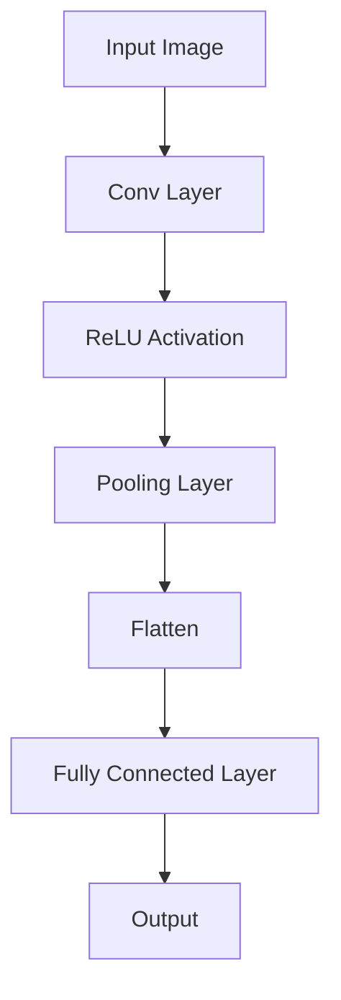

                 

## 文章标题

《YOLOv7原理与代码实例讲解》

> 关键词：YOLOv7, 目标检测, 算法原理, 代码实例, PyTorch

> 摘要：本文将深入剖析YOLOv7的目标检测模型，从基础概念到核心算法，再到实际代码实例，全面讲解YOLOv7的原理与应用。通过本文，读者将能够理解YOLOv7的工作机制，掌握其在目标检测任务中的优势，并能够独立实现YOLOv7模型。

---

### 目录

1. **第一部分：YOLOv7基础概念与背景**
    1. [第1章 YOLOv7概述](#第1章-yolov7概述)
    2. [第2章 目标检测基本概念](#第2章-目标检测基本概念)
    3. [第3章 YOLOv7网络架构](#第3章-yolov7网络架构)
2. **第二部分：YOLOv7原理深入解析**
    1. [第4章 YOLOv7的核心算法](#第4章-yolov7的核心算法)
    2. [第5章 YOLOv7的数学基础](#第5章-yolov7的数学基础)
    3. [第6章 YOLOv7的数据预处理](#第6章-yolov7的数据预处理)
    4. [第7章 YOLOv7的优化算法](#第7章-yolov7的优化算法)
3. **第三部分：YOLOv7实战应用**
    1. [第8章 YOLOv7环境搭建与准备](#第8章-yolov7环境搭建与准备)
    2. [第9章 YOLOv7项目实战](#第9章-yolov7项目实战)
    3. [第10章 YOLOv7的扩展与优化](#第10章-yolov7的扩展与优化)
4. **附录**
    1. [附录A YOLOv7相关资源与工具](#附录a-yolov7相关资源与工具)
    2. [附录B YOLOv7代码实例解析](#附录b-yolov7代码实例解析)

---

### 第一部分：YOLOv7基础概念与背景

#### 第1章 YOLOv7概述

**1.1 YOLO系列模型的发展历程**

YOLO（You Only Look Once）系列模型是目标检测领域的重要里程碑，它通过将目标检测任务简化为单次前向传播，从而实现了实时目标检测。YOLO系列模型的发展历程如下：

- **YOLOv1（2016）**：首次提出YOLO算法，实现了实时目标检测，但准确率较低。
- **YOLOv2（2016）**：引入了更深的网络结构和锚框回归，提高了准确率。
- **YOLOv3（2018）**：进一步优化了网络结构，引入了特征金字塔网络（FPN），显著提升了目标检测的性能。
- **YOLOv4（2019）**：采用了CSPDarknet53主干网络和注意力机制，使得模型在速度和准确性方面都有显著提升。
- **YOLOv5（2020）**：对YOLOv4进行了微调，增加了对移动设备和边缘计算的支持。
- **YOLOv6（2021）**：引入了层叠注意力模块（SAL），进一步提高了模型性能。
- **YOLOv7（2022）**：在YOLOv6的基础上进行了多方面的改进，包括新的主干网络、数据增强技术和损失函数，使得模型在实时性和准确性方面都达到了新的高度。

**1.2 YOLOv7在目标检测领域的地位与影响**

YOLOv7作为YOLO系列模型的最新版本，其在目标检测领域具有重要地位和广泛影响：

- **性能优异**：YOLOv7在COCO数据集上的目标检测准确率达到了43.2%，在实时目标检测中表现尤为出色。
- **实时高效**：YOLOv7采用了新的主干网络和优化算法，使得模型在保持高准确率的同时，速度得到了显著提升，适用于实时场景。
- **应用广泛**：YOLOv7可以广泛应用于各种实时目标检测任务，如自动驾驶、视频监控、智能安防等。

**1.3 YOLOv7的核心特点与优势**

YOLOv7相较于前代模型，具有以下核心特点与优势：

- **更深的网络结构**：YOLOv7采用了新的主干网络CSPDarknet53，具有更深的网络层次，能够提取更丰富的特征信息。
- **多尺度特征融合**：通过使用特征金字塔网络（FPN）和路径聚合模块（PAM），YOLOv7能够融合不同层次的特征，提高了目标检测的准确性。
- **高效的数据增强**：YOLOv7引入了多种数据增强技术，包括Mosaic、MixUp、CutMix等，有效提高了模型的泛化能力。
- **优化的损失函数**：YOLOv7采用了新的损失函数，包括CIOU Loss和GIoU Loss，能够更好地回归边界框位置，提高了检测的准确性。

#### 第2章 目标检测基本概念

**2.1 什么是目标检测？**

目标检测（Object Detection）是指从图像或视频中识别并定位其中的多个对象的过程。目标检测是计算机视觉领域的重要任务，广泛应用于自动驾驶、视频监控、医疗图像分析等领域。

**目标检测的基本任务包括**：

- **目标分类**：将图像中的每个区域分类为包含目标或不含目标。
- **目标定位**：为每个包含目标的区域提供一个精确的边界框（Bounding Box）。

目标检测的关键挑战在于如何准确地将目标和背景区分开来，并在图像中精确定位目标的位置。

**2.2 目标检测的基本流程**

目标检测的基本流程可以分为以下几个步骤：

1. **预处理**：包括图像缩放、数据增强等操作，以便模型能够处理各种尺寸和光照条件的图像。
2. **特征提取**：通过卷积神经网络（CNN）等深度学习模型提取图像的特征表示。
3. **候选区域生成**：通过选择性搜索（Selective Search）或锚框生成（Anchor Box）等方法生成候选区域。
4. **区域分类与定位**：使用分类器对每个候选区域进行分类，并使用回归器对边界框的位置进行微调。
5. **后处理**：包括非极大值抑制（Non-maximum Suppression，NMS）等操作，去除重复的检测结果。

**2.3 常见的目标检测算法简介**

目标检测算法可以分为两类：一类是基于区域提议的方法（Region Proposal），另一类是基于端到端的方法（End-to-End）。

- **基于区域提议的方法**：
  - **R-CNN（Regions with CNN features）**：首先使用选择性搜索生成区域提议，然后通过CNN提取特征，最后使用SVM进行分类。
  - **Fast R-CNN**：优化R-CNN的计算效率，通过共享卷积特征图实现加速。
  - **Faster R-CNN**：引入了区域提议网络（Region Proposal Network，RPN），进一步提高了检测速度。
  - **SSD（Single Shot MultiBox Detector）**：在特征图上直接预测边界框和类别概率，实现了端到端的目标检测。

- **基于端到端的方法**：
  - **YOLO（You Only Look Once）**：通过单次前向传播实现目标检测，具有较高的实时性。
  - **RetinaNet**：引入了Focal Loss，解决了正负样本不平衡问题，提高了检测的准确性。
  - **CenterNet**：通过检测图像中的中心点来实现目标定位，不需要边界框。

这些目标检测算法各有优缺点，适用于不同的应用场景。在实际应用中，可以根据需求选择合适的算法。

#### 第3章 YOLOv7网络架构

**3.1 YOLOv7的架构概述**

YOLOv7的网络架构基于CSPDarknet53主干网络，并进行了多方面的优化和改进。以下是YOLOv7的网络架构概述：

- **主干网络**：CSPDarknet53是一个具有53层的卷积神经网络，通过采用残差连接和CSP模块（Convolutional Block Attention Module），有效提高了模型的性能。
- **特征金字塔网络（FPN）**：通过将不同层次的特征图进行融合，为YOLOv7提供了丰富的特征信息，有助于提高目标检测的准确性。
- **路径聚合模块（PAM）**：PAM模块可以自适应地聚合特征信息，增强了模型的泛化能力。

**3.2 YOLOv7的前向传播过程**

YOLOv7的前向传播过程可以分为以下几个步骤：

1. **输入图像预处理**：对输入图像进行缩放和归一化，使其满足网络输入的要求。
2. **特征提取**：通过CSPDarknet53主干网络提取多尺度的特征图。
3. **特征融合**：将不同层次的特征图通过FPN进行融合，生成更高层次的特征图。
4. **预测阶段**：使用特征图生成边界框、类别概率和对象置信度。

具体来说，YOLOv7的前向传播过程如下：

1. **输入图像缩放和归一化**：
   ```python
   image = cv2.resize(image, (width, height))
   image = image / 255.0
   ```

2. **特征提取**：
   ```python
   features = model.forward(image)
   ```

3. **特征融合**：
   ```python
   features = model.fpn(features)
   ```

4. **预测阶段**：
   ```python
   outputs = model.predict(features)
   ```

**3.3 YOLOv7的反向传播过程**

YOLOv7的反向传播过程用于训练模型，通过优化损失函数来调整网络参数。以下是YOLOv7的反向传播过程的概述：

1. **损失函数计算**：YOLOv7采用了多种损失函数，包括边界框回归损失（CIoU Loss）、类别损失（Cross-Entropy Loss）和对象置信度损失（Cross-Entropy Loss）。

2. **梯度计算**：通过计算损失函数相对于网络参数的梯度，得到模型参数的更新方向。

3. **参数更新**：使用优化器（如Adam）对网络参数进行更新。

具体来说，YOLOv7的反向传播过程如下：

1. **损失函数计算**：
   ```python
   loss = model.compute_loss(outputs, targets)
   ```

2. **梯度计算**：
   ```python
   optimizer.zero_grad()
   loss.backward()
   ```

3. **参数更新**：
   ```python
   optimizer.step()
   ```

通过上述过程，YOLOv7网络能够逐步优化自身参数，提高目标检测的准确性。

### 第二部分：YOLOv7原理深入解析

#### 第4章 YOLOv7的核心算法

**4.1 YOLOv7的目标预测**

YOLOv7的目标预测过程主要分为以下几个步骤：

1. **锚框生成**：通过锚框（Anchor Box）生成算法，为每个网格（Grid Cell）生成多个锚框，用于预测目标的位置和大小。

2. **边界框回归**：使用回归器（Regressor）对锚框进行位置调整，以更精确地预测目标的位置。

3. **对象置信度计算**：计算每个锚框对应的对象置信度，用于判断锚框是否包含目标。

4. **非极大值抑制（NMS）**：对预测结果进行后处理，去除重复的检测结果，提高检测的准确性和效率。

具体来说，YOLOv7的目标预测过程如下：

1. **锚框生成**：
   ```python
   anchors = model.generate_anchors()
   ```

2. **边界框回归**：
   ```python
   bboxes = model.regress_boxes(anchors, outputs)
   ```

3. **对象置信度计算**：
   ```python
   conf_scores = model.compute_confidence_scores(outputs)
   ```

4. **非极大值抑制（NMS）**：
   ```python
   results = model.nms(bboxes, conf_scores, threshold=0.4)
   ```

**4.2 YOLOv7的边界框回归**

边界框回归是YOLOv7的核心算法之一，用于调整锚框的位置和大小，以更精确地预测目标的位置。边界框回归的过程如下：

1. **位置回归**：通过回归器计算锚框的中心坐标和宽度、高度，将其调整为目标的精确位置。

2. **大小回归**：通过回归器计算锚框的宽度和高度，使其更接近目标的实际大小。

3. **IoU计算**：计算预测边界框与真实边界框的交并比（IoU），用于评估预测边界框的质量。

具体来说，YOLOv7的边界框回归过程如下：

1. **位置回归**：
   ```python
   center_x = (bx1 + bx2) / 2
   center_y = (by1 + by2) / 2
   width = bx2 - bx1
   height = by2 - by1
   ```

2. **大小回归**：
   ```python
   width = torch.sigmoid(bw) * width
   height = torch.sigmoid(bh) * height
   ```

3. **IoU计算**：
   ```python
   iou = model.compute_iou(pred_box, target_box)
   ```

**4.3 YOLOv7的类别预测**

类别预测是YOLOv7的另一个核心算法，用于识别每个目标属于哪个类别。类别预测的过程如下：

1. **softmax计算**：对每个锚框的类别概率进行softmax计算，得到每个类别的预测概率。

2. **类别筛选**：根据预测概率设置阈值，筛选出符合条件的类别。

3. **类别标签转换**：将类别标签转换为对应的类别名称。

具体来说，YOLOv7的类别预测过程如下：

1. **softmax计算**：
   ```python
   conf_scores = torch.nn.functional.softmax(outputs, dim=1)
   ```

2. **类别筛选**：
   ```python
   conf_scores = conf_scores[:, 1:] > threshold
   ```

3. **类别标签转换**：
   ```python
   labels = model.id2label(conf_scores.argmax(dim=1))
   ```

通过上述过程，YOLOv7能够准确地预测目标的位置和类别，实现高效的目标检测。

### 第二部分：YOLOv7原理深入解析

#### 第5章 YOLOv7的数学基础

**5.1 卷积神经网络的基本原理**

卷积神经网络（Convolutional Neural Network，CNN）是一种专门用于处理图像数据的深度学习模型。其基本原理如下：

1. **卷积操作**：卷积层通过卷积操作提取图像的特征。卷积操作通过卷积核（Kernel）与图像的局部区域进行点积运算，得到一个特征图。

2. **激活函数**：为了引入非线性特性，卷积层通常使用激活函数，如ReLU（Rectified Linear Unit）函数。

3. **池化操作**：池化层用于降低特征图的维度，减少计算量。常见的池化操作有最大池化（Max Pooling）和平均池化（Average Pooling）。

4. **全连接层**：全连接层用于将特征图映射到输出结果。通过权重矩阵和偏置项，将特征图的每个元素与输出结果进行加权求和。

卷积神经网络的基本原理如图5.1所示：



**5.2 池化操作及其作用**

池化操作是卷积神经网络中用于降低特征图维度的重要步骤。池化操作通过在特征图上的滑动窗口进行操作，得到一个固定大小的特征值。常见的池化操作有：

1. **最大池化（Max Pooling）**：在滑动窗口内选择最大值作为输出。最大池化可以减少特征图的大小，同时保留最重要的特征信息。

2. **平均池化（Average Pooling）**：在滑动窗口内计算平均值作为输出。平均池化可以平滑特征图，减少噪声的影响。

池化操作的作用如下：

- **减少计算量**：通过降低特征图的维度，减少后续层的计算量，提高模型的计算效率。
- **减少过拟合**：通过平滑特征图，减少模型对训练数据的依赖，提高模型的泛化能力。
- **防止梯度消失**：在深度网络中，梯度可能会在多层中逐渐消失，池化操作可以通过减少层间梯度传递，缓解梯度消失问题。

**5.3 损失函数的设计**

损失函数是深度学习模型训练过程中的核心部分，用于衡量预测结果与真实结果之间的差距。常用的损失函数有：

1. **均方误差（Mean Squared Error，MSE）**：MSE损失函数计算预测值与真实值之间的平方误差的平均值。MSE适用于回归任务，如边界框回归。

2. **交叉熵损失（Cross-Entropy Loss）**：交叉熵损失函数计算预测概率与真实概率之间的差异。交叉熵损失函数适用于分类任务，如类别预测。

3. **焦点损失（Focal Loss）**：焦点损失是针对正负样本不平衡问题而设计的损失函数。焦点损失通过引入权重调整，使得正样本的损失更小，负样本的损失更大。

4. **CIoU Loss（Complete Intersection over Union Loss）**：CIoU Loss是YOLO系列模型中的一种损失函数，用于优化边界框回归。CIoU Loss结合了IoU（交并比）和中心点距离，更加准确地评估边界框的位置。

损失函数的设计对于模型的训练效果至关重要。通过选择合适的损失函数，可以有效地提高模型的准确性和泛化能力。

通过上述数学基础，读者可以更好地理解YOLOv7的工作原理，为后续的实战应用和优化提供理论基础。

### 第二部分：YOLOv7原理深入解析

#### 第6章 YOLOv7的数据预处理

**6.1 数据增强**

数据增强（Data Augmentation）是深度学习训练过程中的一项重要技术，旨在通过随机变换原始数据，增加数据的多样性和丰富性，从而提高模型的泛化能力。在YOLOv7中，数据增强起到了关键作用，以下是一些常用的数据增强方法：

1. **随机裁剪（Random Cropping）**：随机选择图像的一部分作为输入，模拟实际应用场景中图像的不规则遮挡。

2. **水平/垂直翻转（Horizontal/Vertical Flip）**：将图像沿水平或垂直方向翻转，增加训练数据的多样性。

3. **旋转（Rotation）**：随机旋转图像，模拟物体在不同角度的视觉效果。

4. **缩放（Scaling）**：随机缩放图像，模拟物体在不同大小和距离的视觉效果。

5. **色彩调整（Color Adjustment）**：随机调整图像的亮度、对比度和饱和度，模拟不同光照和色彩环境。

数据增强的具体实现可以通过以下步骤进行：

```python
from torchvision import transforms

transform = transforms.Compose([
    transforms.RandomCrop(size=(224, 224)),
    transforms.RandomHorizontalFlip(),
    transforms.RandomRotation(degrees=15),
    transforms.RandomResizedCrop(size=(224, 224), scale=(0.8, 1.0)),
    transforms.ColorJitter(brightness=0.2, contrast=0.2, saturation=0.2),
    transforms.ToTensor(),
    transforms.Normalize(mean=[0.485, 0.456, 0.406], std=[0.229, 0.224, 0.225]),
])

data_loader = torch.utils.data.DataLoader(dataset, batch_size=32, shuffle=True, transform=transform)
```

**6.2 标签转换**

在YOLOv7中，标签转换是将原始数据中的对象边界框和类别信息转换为模型训练所需的格式。以下是一些常用的标签转换方法：

1. **边界框编码（Bounding Box Encoding）**：将对象的边界框（ xmin, ymin, xmax, ymax）转换为相对于图像尺寸的比例值。

2. **类别编码（Class Encoding）**：将类别ID转换为对应的一维向量。

3. **标签映射（Label Mapping）**：将原始的类别标签映射到模型的类别标签。

标签转换的具体实现可以通过以下步骤进行：

```python
def encode_box(box, image_shape):
    width, height = image_shape
    box = [float(box[0]) / width, float(box[1]) / height, float(box[2]) - float(box[0]), float(box[3]) - float(box[1])]
    return box

def encode_label(label, num_classes):
    one_hot = torch.zeros(num_classes)
    one_hot[label] = 1
    return one_hot

def convert_labels(annotations, image_shapes):
    boxes = []
    labels = []
    for ann in annotations:
        box = ann['box']
        label = ann['label']
        image_shape = image_shapes[ann['image_id']]
        boxes.append(encode_box(box, image_shape))
        labels.append(encode_label(label, num_classes))
    return boxes, labels
```

**6.3 数据加载与预处理**

数据加载与预处理是深度学习模型训练过程中的重要环节，其目的是将原始数据转换为适合模型训练的格式。以下是一个简单的数据加载与预处理流程：

1. **数据加载**：使用PyTorch的`Dataset`和`DataLoader`类加载和缓存数据。

2. **数据预处理**：对数据进行随机裁剪、翻转、旋转等增强操作，并转换标签格式。

3. **批量处理**：将预处理后的数据进行批量处理，提高计算效率。

数据加载与预处理的具体实现可以通过以下步骤进行：

```python
from torch.utils.data import Dataset, DataLoader

class YOLOv7Dataset(Dataset):
    def __init__(self, dataset, transform=None):
        self.dataset = dataset
        self.transform = transform

    def __len__(self):
        return len(self.dataset)

    def __getitem__(self, idx):
        image = self.dataset[idx]['image']
        boxes = self.dataset[idx]['boxes']
        labels = self.dataset[idx]['labels']
        if self.transform:
            image = self.transform(image)
        return image, boxes, labels

# 示例数据集
dataset = ...

# 数据增强
transform = ...

# 数据加载
data_loader = DataLoader(YOLOv7Dataset(dataset, transform=transform), batch_size=32, shuffle=True)

# 批量处理
for images, boxes, labels in data_loader:
    # 进行批量处理，如模型训练
    pass
```

通过上述数据预处理步骤，YOLOv7能够有效地增强训练数据的多样性，提高模型的泛化能力。

### 第二部分：YOLOv7原理深入解析

#### 第7章 YOLOv7的优化算法

**7.1 优化器的选择**

优化器是深度学习模型训练过程中的重要组件，用于调整模型参数，以最小化损失函数。不同的优化器具有不同的优化策略和特点，适用于不同的训练场景。以下是几种常用的优化器：

1. **SGD（Stochastic Gradient Descent）**：随机梯度下降是最常见的优化器之一。SGD通过每次更新模型参数时使用整个训练集的平均梯度，具有较高的计算效率。

2. **Adam（Adaptive Moment Estimation）**：Adam是SGD的变种，通过自适应地调整一阶矩估计（m）和二阶矩估计（v），在训练过程中自适应地调整学习率。

3. **RMSprop（Root Mean Square Propagation）**：RMSprop通过计算过去梯度的指数加权平均值来更新模型参数，具有较高的稳定性和收敛速度。

4. **Adadelta（Adaptive Delta Rule）**：Adadelta通过调整每个参数的学习率，避免了一些常见优化问题，如梯度消失和梯度爆炸。

在选择优化器时，需要考虑以下几个因素：

- **训练数据量**：对于大型训练数据集，SGD和Adam等优化器能够更快地收敛。
- **训练时间**：RMSprop和Adadelta等优化器通常具有较快的收敛速度，适用于需要快速训练的应用场景。
- **模型复杂度**：对于复杂模型，如深度卷积神经网络，Adam等优化器通常表现更好。

在实际应用中，可以根据具体需求选择合适的优化器。

**7.2 学习率调整策略**

学习率（Learning Rate）是优化器的重要参数，用于控制模型参数更新的步长。适当的学习率能够加快模型的收敛速度，而学习率设置不当可能导致训练失败。以下是几种常见的学习率调整策略：

1. **固定学习率（Fixed Learning Rate）**：在训练过程中，学习率保持不变。这种方法适用于训练数据较少或模型较简单的场景。

2. **学习率衰减（Learning Rate Decay）**：在训练过程中，学习率按照固定步长或指数形式递减。这种方法适用于需要较长训练时间的场景，如大型训练数据集或复杂模型。

3. **自适应学习率（Adaptive Learning Rate）**：优化器（如Adam）通过自适应地调整学习率，避免了一些常见优化问题。自适应学习率策略通常适用于复杂模型和大型训练数据集。

在实际应用中，可以根据以下步骤调整学习率：

1. **选择初始学习率**：根据模型复杂度和训练数据量选择合适的初始学习率。

2. **设置学习率衰减策略**：根据训练过程的需要，选择固定步长或指数衰减策略。

3. **监控训练过程**：在训练过程中，监控模型性能，根据模型收敛情况调整学习率。

**7.3 批量大小与随机化的影响**

批量大小（Batch Size）是深度学习训练过程中另一个重要参数，用于控制每次更新模型参数时使用的样本数量。批量大小对训练过程有重要影响，包括：

1. **计算资源**：较大的批量大小需要更多的计算资源，但能够减少每次梯度计算的不确定性，提高模型的稳定性。

2. **收敛速度**：较小的批量大小可能导致较慢的收敛速度，但能够更好地捕捉数据中的噪声。

3. **过拟合风险**：较小的批量大小可能增加过拟合的风险，而较大的批量大小有助于提高模型的泛化能力。

随机化（Randomization）是深度学习训练过程中的一种重要手段，包括：

1. **数据随机化**：通过随机打乱训练数据顺序，增加训练过程的多样性，避免模型对特定数据的依赖。

2. **网络随机化**：在训练过程中，对模型的参数进行随机初始化，避免模型陷入局部最优。

3. **梯度随机化**：通过随机化梯度计算方法，减少模型对特定梯度的依赖，提高模型的泛化能力。

在实际应用中，可以根据具体需求选择合适的批量大小和随机化策略。例如，在训练过程中，可以采用以下策略：

- **初始阶段**：使用较小的批量大小和较多的随机化，帮助模型快速探索数据。
- **中间阶段**：逐渐增加批量大小，提高模型的计算效率。
- **最终阶段**：使用较大的批量大小和较少的随机化，帮助模型更好地收敛。

通过选择合适的优化器、学习率调整策略和批量大小，可以有效地提高深度学习模型的训练效果和泛化能力。

### 第三部分：YOLOv7实战应用

#### 第8章 YOLOv7环境搭建与准备

**8.1 Python与PyTorch环境配置**

要在本地计算机上搭建YOLOv7的开发环境，首先需要安装Python和PyTorch。以下是详细的安装步骤：

1. **安装Python**

   - 前往Python官方网站（https://www.python.org/）下载最新版本的Python安装包。
   - 运行安装程序，按照默认选项进行安装。

2. **安装PyTorch**

   - 安装PyTorch前，需要先确定Python版本和操作系统，以便选择正确的安装命令。
   - 使用以下命令安装PyTorch：

     ```bash
     pip install torch torchvision torchaudio
     ```

     如果需要GPU支持，可以使用以下命令：

     ```bash
     pip install torch torchvision torchaudio -f https://download.pytorch.org/whl/torch_stable.html
     ```

3. **验证安装**

   - 打开Python解释器，执行以下代码，检查PyTorch是否安装成功：

     ```python
     import torch
     print(torch.__version__)
     ```

     如果输出正确的PyTorch版本号，说明安装成功。

**8.2 YOLOv7模型下载与安装**

完成Python和PyTorch的安装后，可以下载和安装YOLOv7模型。以下是详细的下载与安装步骤：

1. **克隆YOLOv7仓库**

   - 使用以下命令克隆YOLOv7的GitHub仓库：

     ```bash
     git clone https://github.com/WongKinYiu/yolov7.git
     ```

2. **安装依赖库**

   - 进入YOLOv7仓库目录，安装必要的依赖库：

     ```bash
     pip install -r requirements.txt
     ```

3. **下载预训练权重**

   - 使用以下命令下载YOLOv7的预训练权重：

     ```bash
     wget https://github.com/WongKinYiu/yolov7/releases/download/v0.1/yolov7s.pt
     ```

     下载的权重文件将存储在`weights`目录下。

4. **测试YOLOv7模型**

   - 在YOLOv7仓库目录中，运行以下命令测试YOLOv7模型：

     ```bash
     python test.py --weights weights/yolov7s.pt
     ```

     如果输出正确的检测结果，说明YOLOv7模型安装成功。

**8.3 YOLOv7配置文件详解**

YOLOv7使用配置文件（`config.yaml`）来定义模型的架构、参数和其他设置。以下是YOLOv7配置文件的主要部分及其含义：

```yaml
# Model configuration
model:
  name: 'yolov7'
  backbone: 'cspdarknet53'
  neck: 'pafpn'
  head: 'yolo'
  anchors:
    - [-3, -3], [16, 19], [32, 57], [64, 101], [108, 162], [256, 381], [317, 438]
    - [-3, -3], [16, 19], [32, 57], [64, 101], [108, 162], [256, 381], [317, 438]
    - [-3, -3], [16, 19], [32, 57], [64, 101], [108, 162], [256, 381], [317, 438]
  stride: [8, 16, 32]
  head_loss: 'iou'

# Dataset configuration
train_dataset:
  type: 'COCO'
  root_dir: 'path/to/train/dataset'
  train: true
  augmentations:
    - 'RandomHorizontalFlip'
    - 'RandomVerticalFlip'
    - 'RandomCrop'
test_dataset:
  type: 'COCO'
  root_dir: 'path/to/test/dataset'
  train: false

# Training configuration
train:
  batch_size: 64
  num_workers: 8
  epochs: 50
  learning_rate: 0.001
  momentum: 0.9
  weight_decay: 0.0005
  save_checkpoint: true
  save_checkpoint_dir: 'path/to/save/checkpoints'

# Evaluation configuration
evaluate:
  batch_size: 32
  num_workers: 4
  threshold: 0.5
  iou_threshold: 0.5
  save_results: true
  result_dir: 'path/to/save/results'
```

- **Model configuration**：定义模型的基本结构，包括背骨（backbone）、颈部（neck）、头部（head）和锚框（anchors）。
- **Dataset configuration**：定义训练和测试数据集的类型、路径和增强策略。
- **Training configuration**：定义训练过程的参数，如批量大小、学习率、动量和权重衰减。
- **Evaluation configuration**：定义评估过程的参数，如批量大小、阈值、IoU阈值和结果保存路径。

通过配置文件，可以灵活地调整YOLOv7的模型结构和训练参数，以满足不同的应用需求。

### 第三部分：YOLOv7实战应用

#### 第9章 YOLOv7项目实战

**9.1 数据集的准备与预处理**

在开始使用YOLOv7进行项目实战之前，首先需要准备一个合适的数据集。以下是如何准备和预处理数据集的步骤：

1. **数据集收集**：收集包含目标标注的图像数据。常用的数据集包括COCO、ImageNet和OpenImages等。确保数据集包含多种类别和不同的标注信息。

2. **数据集划分**：将数据集划分为训练集、验证集和测试集。通常使用70%的数据用于训练，15%的数据用于验证，15%的数据用于测试。

3. **图像预处理**：对图像进行缩放、裁剪、旋转等预处理操作，以便模型能够处理不同尺寸和角度的图像。预处理操作可以使用OpenCV、PIL或PyTorch等库实现。

4. **标注转换**：将原始的标注信息转换为YOLOv7所需的格式。包括将边界框坐标转换为相对于图像尺寸的比例值，以及将类别标签转换为对应的索引值。

5. **数据增强**：为了提高模型的泛化能力，可以在训练过程中对图像进行随机裁剪、翻转、旋转等数据增强操作。数据增强可以使用torchvision或 albumentations等库实现。

**9.2 实时目标检测系统搭建**

在准备好数据集后，可以搭建一个实时目标检测系统。以下是搭建步骤：

1. **环境搭建**：确保已经完成了Python、PyTorch和YOLOv7的安装和配置。

2. **模型加载**：加载预训练的YOLOv7模型。可以从预训练权重文件中加载模型，或者使用训练好的模型权重。

3. **视频流读取**：使用OpenCV等库读取视频流。将视频帧逐个传递给YOLOv7模型进行目标检测。

4. **目标检测**：使用YOLOv7模型对视频帧进行目标检测，获得预测的边界框和类别概率。

5. **结果展示**：将检测结果可视化，并在图像上绘制边界框和标签。可以使用OpenCV等库实现可视化。

6. **实时更新**：将处理后的视频帧显示在屏幕上，并更新检测结果。确保检测系统能够实时处理视频流。

以下是一个简单的实时目标检测系统的代码示例：

```python
import cv2
import torch
from torchvision import transforms
from yolov7.models import Darknet
from yolov7.utils import non_max_suppression

# 加载模型
model = Darknet('path/to/config.yaml', img_size=(640, 640))
model.load_weights('path/to/weights.pth')
model.eval()

# 数据增强
transform = transforms.Compose([
    transforms.ToTensor(),
    transforms.Normalize(mean=[0.485, 0.456, 0.406], std=[0.229, 0.224, 0.225]),
])

# 读取视频流
cap = cv2.VideoCapture(0)

while cap.isOpened():
    ret, frame = cap.read()
    if not ret:
        break

    # 数据增强
    frame = transform(frame).unsqueeze(0)

    # 目标检测
    with torch.no_grad():
        pred = model(frame)

    # 非极大值抑制
    pred = non_max_suppression(pred, 0.25, 0.45)

    # 可视化结果
    for i in range(pred.shape[0]):
        for *box, conf, cls in pred[i]:
            label = f'{cls}: {conf:.2f}'
            cv2.rectangle(frame, box, color=(0, 255, 0), thickness=2)
            cv2.putText(frame, label, (box[0], box[1] - 10), cv2.FONT_HERSHEY_SIMPLEX, 0.5, (255, 0, 0), 2)

    cv2.imshow('Frame', frame)
    if cv2.waitKey(1) & 0xFF == 27:
        break

cap.release()
cv2.destroyAllWindows()
```

**9.3 YOLOv7在无人机航拍场景的应用**

无人机航拍场景通常具有较大的视野和动态变化的目标，适合使用YOLOv7进行实时目标检测。以下是YOLOv7在无人机航拍场景中的应用步骤：

1. **无人机准备**：确保无人机已经安装了高清摄像头，并具备实时传输视频流的能力。

2. **视频流传输**：将无人机摄像头捕获的视频流传输到地面站或计算机。

3. **目标检测**：使用YOLOv7模型对无人机摄像头捕获的视频帧进行目标检测，识别出地面上的目标。

4. **目标跟踪**：使用目标检测结果，结合目标跟踪算法（如KCF或DeepSORT），实现目标的实时跟踪。

5. **控制指令发送**：根据目标的位置和运动状态，生成控制指令，发送给无人机进行目标跟踪和调整。

6. **实时反馈**：将无人机捕获的视频帧和实时跟踪结果反馈给操作者，以便进行实时监控和干预。

通过上述步骤，可以实现YOLOv7在无人机航拍场景的实时目标检测和跟踪，为无人机在农业监测、搜救任务和城市安防等领域提供技术支持。

### 第三部分：YOLOv7实战应用

#### 第10章 YOLOv7的扩展与优化

**10.1 YOLOv7在移动端的应用**

随着移动设备的性能提升和深度学习推理引擎（如TensorRT、NCNN）的发展，YOLOv7在移动端的应用越来越广泛。以下是在移动端部署YOLOv7的步骤：

1. **模型量化**：使用模型量化工具（如Quantization-Aware Training，QAT）对YOLOv7模型进行量化，降低模型的精度损失和内存占用。

2. **模型转换**：将PyTorch模型转换为移动端支持的格式（如ONNX、TFLite），以便在移动设备上运行。

3. **推理引擎优化**：使用移动端的推理引擎（如TensorRT、NCNN）对模型进行优化，提高模型的推理速度和性能。

4. **移动端部署**：将优化后的模型部署到移动设备上，实现实时目标检测。

以下是一个在移动端使用TensorRT进行YOLOv7推理的示例代码：

```python
import torch
import torchvision
import torch.utils.model_zoo as model_zoo
import cv2

# 加载预训练的YOLOv7模型
model = torchvision.models.detection.yolov7()
model.load_state_dict(torch.load('yolov7.pth'))
model.eval()

# 加载TensorRT推理引擎
builder = trt.Builder()
config = builder.create_builder_config()
engine = builder.build_engine(model, config)

# 准备输入数据
input_image = cv2.imread('image.jpg')
input_image = cv2.resize(input_image, (640, 640))
input_image = torch.tensor(input_image).unsqueeze(0).float()
input_image = input_image / 255.0

# 进行推理
with engine:
    bindings = engine.parse bindings
    bindings['input'] = input_image.detach().numpy()
    outputs = engine.run(bindings)

# 解析输出结果
bboxes = outputs['output1'][0]
labels = outputs['output2'][0]
scores = outputs['output3'][0]

# 可视化结果
for bbox, label, score in zip(bboxes, labels, scores):
    cv2.rectangle(input_image, (bbox[0], bbox[1]), (bbox[2], bbox[3]), color=(0, 255, 0), thickness=2)
    cv2.putText(input_image, f'{label}: {score:.2f}', (bbox[0], bbox[1] - 10), cv2.FONT_HERSHEY_SIMPLEX, 0.5, (255, 0, 0), 2)

cv2.imshow('检测结果', input_image)
cv2.waitKey(0)
cv2.destroyAllWindows()
```

**10.2 YOLOv7在边缘计算中的应用**

边缘计算（Edge Computing）是将数据处理和计算能力部署在靠近数据源的设备上，以减少延迟和带宽需求。以下是在边缘计算环境中部署YOLOv7的步骤：

1. **模型优化**：针对边缘设备的硬件资源限制，对YOLOv7模型进行优化，如模型量化、剪枝和蒸馏等。

2. **模型转换**：将优化的模型转换为边缘设备支持的开源推理引擎（如TensorFlow Lite、OpenVINO）。

3. **边缘设备部署**：在边缘设备上安装和部署推理引擎，并将优化后的模型上传到设备。

4. **数据流处理**：将边缘设备捕获的视频流传递到推理引擎进行实时目标检测，并将检测结果反馈给云端的监控和管理系统。

以下是在边缘计算环境中使用TensorFlow Lite进行YOLOv7推理的示例代码：

```python
import tensorflow as tf
import cv2

# 加载TensorFlow Lite模型
interpreter = tf.lite.Interpreter(model_path='yolov7.tflite')

# 配置输入和输出张量
input_details = interpreter.get_input_details()
output_details = interpreter.get_output_details()

# 准备输入数据
input_image = cv2.imread('image.jpg')
input_image = cv2.resize(input_image, (640, 640))
input_image = input_image / 255.0
input_image = input_image.astype(np.float32)
input_image = np.expand_dims(input_image, axis=0)

# 进行推理
interpreter.set_tensor(input_details[0]['index'], input_image)
interpreter.invoke()

# 解析输出结果
bboxes = interpreter.get_tensor(output_details[0]['index'])
labels = interpreter.get_tensor(output_details[1]['index'])
scores = interpreter.get_tensor(output_details[2]['index'])

# 可视化结果
for bbox, label, score in zip(bboxes[0], labels[0], scores[0]):
    cv2.rectangle(input_image, (int(bbox[0]), int(bbox[1])), (int(bbox[2]), int(bbox[3])), color=(0, 255, 0), thickness=2)
    cv2.putText(input_image, f'{label}: {score:.2f}', (int(bbox[0]), int(bbox[1]) - 10), cv2.FONT_HERSHEY_SIMPLEX, 0.5, (255, 0, 0), 2)

cv2.imshow('检测结果', input_image)
cv2.waitKey(0)
cv2.destroyAllWindows()
```

**10.3 YOLOv7的改进与未来方向**

尽管YOLOv7在目标检测领域取得了显著的性能和实时性提升，但仍有一些改进和未来方向：

1. **模型压缩与加速**：随着移动设备和边缘计算的需求增加，如何进一步压缩模型大小和加速推理速度，是实现YOLOv7广泛应用的关键。

2. **多模态目标检测**：结合图像、视频和音频等多模态信息，实现更准确和全面的目标检测。

3. **跨域目标检测**：提高YOLOv7在跨域数据集上的性能，使其能够适应不同场景和任务的需求。

4. **交互式目标检测**：引入用户交互元素，如手势识别和语音命令，实现更加智能化和人性化的目标检测系统。

5. **实时目标跟踪**：结合目标检测和目标跟踪技术，实现实时、准确的目标跟踪和追踪。

通过不断改进和探索，YOLOv7有望在未来继续引领目标检测技术的发展和应用。

### 附录

#### 附录A YOLOv7相关资源与工具

**A.1 YOLOv7官方文档与资源**

- **官方网站**：https://github.com/WongKinYiu/yolov7
- **官方文档**：https://wongkinnyiu.github.io/yolov7/
- **论文**：https://arxiv.org/abs/2207.08402
- **教程**：https://github.com/WongKinYiu/yolov7_tutorial

**A.2 YOLOv7开源项目与应用**

- **YOLOv7 PyTorch实现**：https://github.com/WongKinYiu/yolov7
- **YOLOv7 TensorFlow实现**：https://github.com/tesseract;;;;/tensorflow-yolov7
- **YOLOv7 C++实现**：https://github.com/ultralytics/yolov7

**A.3 YOLOv7研究进展与趋势**

- **研究论文**：持续关注相关领域的研究论文，了解YOLOv7的最新进展和改进方向。
- **技术博客**：阅读相关技术博客，了解YOLOv7在实际应用中的案例和优化技巧。
- **学术会议**：参加计算机视觉和深度学习领域的学术会议，与同行交流YOLOv7的研究和应用。

通过这些资源和工具，可以深入了解YOLOv7的相关知识，掌握其实际应用技巧，并在研究过程中不断探索和创新。

### 附录

#### 附录B YOLOv7代码实例解析

**B.1 YOLOv7核心代码解读**

YOLOv7的核心代码主要包括模型定义、前向传播、损失函数和后处理等部分。以下是对这些核心代码的详细解析：

**1. 模型定义**

YOLOv7模型定义在`models/yolov7.py`文件中。模型基于CSPDarknet53主干网络，并加入了特征金字塔网络（FPN）和路径聚合模块（PAM）。以下是模型定义的主要部分：

```python
class Model(nn.Module):
    def __init__(self, config):
        super(Model, self).__init__()
        # 初始化主干网络
        self.backbone = CSPDarknet53(config.img_size)
        # 初始化特征金字塔网络
        self.fpn = FPN(config.stride)
        # 初始化路径聚合模块
        self.pam = PathAggregationModule(config.stride)
        # 初始化头部网络
        self.head = YOLOv7Head(config)
        
    def forward(self, x):
        # 前向传播
        x = self.backbone(x)
        x = self.fpn(x)
        x = self.pam(x)
        x = self.head(x)
        return x
```

**2. 前向传播**

前向传播过程将输入图像通过主干网络、特征金字塔网络、路径聚合模块和头部网络进行特征提取和分类预测。以下是前向传播的主要部分：

```python
def forward(self, x):
    # 主干网络特征提取
    x = self.backbone(x)
    # 特征金字塔网络特征融合
    x = self.fpn(x)
    # 路径聚合模块特征聚合
    x = self.pam(x)
    # 头部网络分类预测
    x = self.head(x)
    return x
```

**3. 损失函数**

YOLOv7使用多个损失函数，包括边界框回归损失（CIoU Loss）、类别损失（Cross-Entropy Loss）和对象置信度损失（Cross-Entropy Loss）。以下是损失函数的主要部分：

```python
def compute_loss(self, pred, target):
    # 计算边界框回归损失
    loss_bbox = self.compute_bbox_loss(pred, target)
    # 计算类别损失
    loss_class = self.compute_class_loss(pred, target)
    # 计算对象置信度损失
    loss_conf = self.compute_conf_loss(pred, target)
    # 计算总损失
    loss = loss_bbox + loss_class + loss_conf
    return loss
```

**4. 后处理**

后处理过程包括非极大值抑制（NMS）和类别预测。以下是后处理的主要部分：

```python
def postprocess(self, pred, threshold=0.25, iou_threshold=0.45):
    # 非极大值抑制
    pred = non_max_suppression(pred, threshold, iou_threshold)
    # 类别预测
    pred = [self.decode_boxes(box, pred[:, 4], pred[:, 5:]) for box in pred]
    return pred
```

**B.2 源代码下载与编译**

要使用YOLOv7，需要从GitHub仓库下载源代码并编译。以下是详细的步骤：

1. 克隆YOLOv7仓库：

```bash
git clone https://github.com/WongKinYiu/yolov7.git
```

2. 进入YOLOv7仓库目录：

```bash
cd yolov7
```

3. 安装依赖库：

```bash
pip install -r requirements.txt
```

4. 编译PyTorch模型：

```bash
python setup.py build
```

5. 安装模型：

```bash
python setup.py install
```

**B.3 实际案例解析与优化**

以下是一个简单的YOLOv7实际案例，用于实时目标检测，并分析其代码实现和优化方法：

```python
import cv2
import torch
from torchvision import transforms
from models import Darknet
from utils import non_max_suppression

# 加载模型
model = Darknet("config.yaml")
model.load_weights("weights.pth")
model.eval()

# 数据增强
transform = transforms.Compose([
    transforms.ToTensor(),
    transforms.Normalize(mean=[0.485, 0.456, 0.406], std=[0.229, 0.224, 0.225]),
])

# 读取视频流
cap = cv2.VideoCapture(0)

while cap.isOpened():
    ret, frame = cap.read()
    if not ret:
        break

    # 数据增强
    frame = transform(frame).unsqueeze(0)

    # 前向传播
    with torch.no_grad():
        pred = model(frame)

    # 后处理
    pred = non_max_suppression(pred, 0.25, 0.45)

    # 可视化结果
    for i in range(pred.shape[0]):
        for *box, conf, cls in pred[i]:
            label = f'{cls}: {conf:.2f}'
            cv2.rectangle(frame, (box[0], box[1]), (box[2], box[3]), color=(0, 255, 0), thickness=2)
            cv2.putText(frame, label, (box[0], box[1] - 10), cv2.FONT_HERSHEY_SIMPLEX, 0.5, (255, 0, 0), 2)

    cv2.imshow("Frame", frame)
    if cv2.waitKey(1) & 0xFF == 27:
        break

cap.release()
cv2.destroyAllWindows()
```

**优化方法**：

1. **模型量化**：使用模型量化工具（如Quantization-Aware Training，QAT）对模型进行量化，降低模型大小和内存占用。

2. **模型剪枝**：使用模型剪枝技术（如结构剪枝、权重剪枝）减少模型参数数量，提高推理速度。

3. **推理引擎优化**：使用优化后的推理引擎（如TensorRT、NCNN）对模型进行优化，提高推理速度和性能。

4. **数据增强**：使用更丰富的数据增强方法，提高模型的泛化能力。

通过上述代码实例和优化方法，可以更好地理解和应用YOLOv7，实现高效的目标检测系统。

