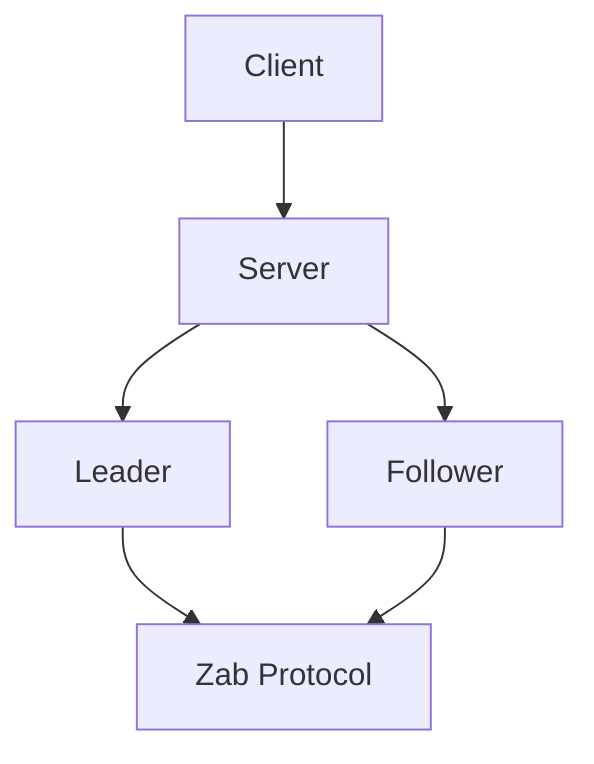

                 

## 文章标题

### 《Zookeeper原理与代码实例讲解》

---

### 关键词：

Zookeeper、分布式协调服务、数据模型、会话管理、分布式锁、分布式队列、微服务架构、服务注册与发现、负载均衡、性能优化

### 摘要：

本文将深入探讨Zookeeper的原理与代码实例。从基本概念入手，逐步讲解Zookeeper的架构、数据模型、核心功能、API操作以及其在分布式系统和微服务架构中的应用。通过详细的代码实例和项目实战，帮助读者理解Zookeeper的真正用途和实现方式。

---

### 第1章: Zookeeper概述

Zookeeper是一种高性能的分布式协调服务，用于维护配置信息、命名管理、同步服务、集群管理等功能。它在分布式系统中扮演着至关重要的角色，确保了系统的一致性和可靠性。

### 1.1 Zookeeper的基本概念

Zookeeper的基本概念包括：

- **服务器端（Server）**：负责存储数据和协调客户端请求。
- **客户端（Client）**：与服务器端通信，获取数据和执行操作。
- **Zab协议**：用于保证数据的一致性和领导者的选举。

### 1.2 Zookeeper的架构

Zookeeper的架构包括以下几个主要组件：

- **Zookeeper服务器端**：由多个Zookeeper进程组成，其中只有一个领导者（Leader）和多个追随者（Follower）。
- **客户端**：通过TCP连接与Zookeeper服务器端通信。
- **Zab协议**：保证服务器端之间的一致性和领导者的选举。


### 1.3 Zookeeper的数据模型

Zookeeper的数据模型类似于文件系统，由节点（Node）和路径（Path）组成。节点可以包含数据和子节点。


### 1.4 Zookeeper的作用

Zookeeper的主要作用包括：

- **配置管理**：存储和管理分布式系统的配置信息。
- **命名服务**：提供分布式系统中的命名服务。
- **同步服务**：实现分布式系统中的同步操作。
- **集群管理**：管理分布式系统的集群状态。

### 总结

Zookeeper是一种强大的分布式协调服务，通过其独特的架构和数据模型，提供了高效可靠的分布式系统解决方案。在接下来的章节中，我们将深入探讨Zookeeper的安装、配置、API操作以及其在实际项目中的应用。

---

### 1.5 Mermaid流程图

以下是一个简单的Zookeeper架构的Mermaid流程图：



### 1.6 核心算法原理讲解

Zookeeper的核心算法主要包括领导者选举（Leader Election）和同步协议（Synchronization Protocol）。以下是这两个算法的伪代码：

#### 领导者选举（Leader Election）

```java
选举过程：
1. 每个服务器启动时，首先进入观察者（Observer）状态。
2. 观察者发送一个投票请求（proposal）给其他服务器。
3. 其他服务器根据收到投票请求的数量来决定是否成为候选者（Candidate）。
4. 候选者之间进行投票，最终获得多数票的服务器成为领导者（Leader）。
5. 领导者向其他服务器发送同步消息，保持数据一致性。

投票请求（proposal）：
proposal(server_id, state, vote)

投票（vote）：
vote(server_id, leader_id)

选举流程伪代码：
1. server -> Observer
2. server -> SendProposal(vote)
3. server -> ReceiveProposal(proposal)
4. server -> If (proposal > current_vote) -> Vote(proposal)
5. server -> If (received_votes > (n-1)/2) -> BecomeCandidate()
6. server -> SendVote(vote)
7. server -> If (received_votes > (n-1)/2) -> BecomeLeader()
8. server -> SendSync(message)
```

#### 同步协议（Synchronization Protocol）

```java
同步协议：
1. 领导者向追随者发送同步消息。
2. 追随者接收同步消息并同步数据。
3. 同步完成后，领导者向追随者发送确认消息。

同步消息（sync_message）：
sync_message(server_id, state, data)

确认消息（ack_message）：
ack_message(server_id, state)

同步流程伪代码：
1. Leader -> SendSync(sync_message)
2. Follower -> ReceiveSync(sync_message)
3. Follower -> SyncData(data)
4. Follower -> SendAck(ack_message)
5. Leader -> ReceiveAck(ack_message)
```

### 1.7 数学模型和公式

Zookeeper的领导者选举算法可以通过以下数学模型描述：

$$
L = \sum_{i=1}^{n} v_i - \sum_{i=1}^{n} c_i
$$

其中，\(L\) 表示领导者，\(v_i\) 表示第 \(i\) 个服务器的投票权重，\(c_i\) 表示第 \(i\) 个服务器的候选权重。

### 1.8 详细讲解和举例说明

假设有3个服务器 \(S_1, S_2, S_3\)，其投票权重和候选权重如下：

| 服务器ID | 投票权重 | 候选权重 |
| --- | --- | --- |
| \(S_1\) | 3 | 2 |
| \(S_2\) | 2 | 3 |
| \(S_3\) | 4 | 1 |

1. \(S_1\) 发起选举，发送投票请求。
2. \(S_2\) 和 \(S_3\) 接收到投票请求后，比较投票权重，决定是否成为候选者。
3. \(S_2\) 和 \(S_3\) 成为候选者后，发送投票给 \(S_1\)。
4. \(S_1\) 收到 \(S_2\) 和 \(S_3\) 的投票后，比较投票数量，决定是否成为领导者。
5. \(S_1\) 成为领导者后，发送同步消息给 \(S_2\) 和 \(S_3\)，保持数据一致性。

通过这个过程，我们可以看到Zookeeper的领导者选举算法是如何工作的。领导者选举保证了分布式系统的可靠性和一致性。

### 1.9 文章标题

**Zookeeper原理与代码实例讲解**

---

### 文章关键词：

Zookeeper、分布式协调服务、数据模型、会话管理、分布式锁、分布式队列、微服务架构、服务注册与发现、负载均衡、性能优化

### 文章摘要：

本文将深入探讨Zookeeper的原理与代码实例。从基本概念入手，逐步讲解Zookeeper的架构、数据模型、核心功能、API操作以及其在分布式系统和微服务架构中的应用。通过详细的代码实例和项目实战，帮助读者理解Zookeeper的真正用途和实现方式。

---

### 《Zookeeper原理与代码实例讲解》

---

### 目录大纲

## 第一部分：Zookeeper基础

### 第1章：Zookeeper概述

#### 1.1 Zookeeper的概念与作用

#### 1.2 Zookeeper的架构

#### 1.3 Zookeeper的数据模型

### 第2章：Zookeeper的安装与配置

#### 2.1 Zookeeper的安装

#### 2.2 Zookeeper的配置文件详解

#### 2.3 Zookeeper集群配置

### 第3章：Zookeeper的API操作

#### 3.1 Zookeeper的Java客户端API

#### 3.2 Zookeeper的命令行工具

#### 3.3 Zookeeper的编程模式

## 第二部分：Zookeeper核心功能与原理

### 第4章：Zookeeper的原子操作

#### 4.1 Zookeeper的同步机制

#### 4.2 Zookeeper的原子性保证

#### 4.3 Zookeeper的持久化机制

### 第5章：Zookeeper的选举机制

#### 5.1 Zookeeper的领导者选举

#### 5.2 Zookeeper的领导者维护

#### 5.3 Zookeeper的领导者监控

### 第6章：Zookeeper的监控与通知

#### 6.1 Zookeeper的事件监听机制

#### 6.2 Zookeeper的监控与监控器

#### 6.3 Zookeeper的通知机制

## 第三部分：Zookeeper应用场景

### 第7章：Zookeeper在分布式系统中的应用

#### 7.1 Zookeeper在分布式锁中的应用

#### 7.2 Zookeeper在分布式队列中的应用

#### 7.3 Zookeeper在分布式配置管理中的应用

### 第8章：Zookeeper在微服务架构中的应用

#### 8.1 Zookeeper在服务注册与发现中的应用

#### 8.2 Zookeeper在负载均衡中的应用

#### 8.3 Zookeeper在分布式事务中的应用

## 第四部分：Zookeeper实例讲解

### 第9章：Zookeeper代码实例讲解

#### 9.1 Zookeeper客户端实现

#### 9.2 Zookeeper会话管理

#### 9.3 Zookeeper数据操作

### 第10章：Zookeeper项目实战

#### 10.1 分布式锁实现

#### 10.2 分布式队列实现

#### 10.3 分布式配置管理实现

### 第11章：Zookeeper性能优化

#### 11.1 Zookeeper性能瓶颈分析

#### 11.2 Zookeeper性能优化策略

#### 11.3 Zookeeper性能测试与调优

## 附录

### 附录A：Zookeeper常用命令与操作

#### A.1 Zookeeper命令行操作

#### A.2 Zookeeper常用命令汇总

### 附录B：Zookeeper开源项目推荐

#### B.1 Zookeeper开源项目介绍

#### B.2 Zookeeper开源项目使用指南

### 附录C：Zookeeper常见问题解答

#### C.1 Zookeeper安装与配置问题

#### C.2 Zookeeper数据同步问题

#### C.3 Zookeeper集群问题

---

### 1.10 结束语

本文是关于Zookeeper原理与代码实例讲解的入门指南。通过详细讲解Zookeeper的基本概念、架构、核心功能以及应用场景，读者可以深入了解Zookeeper的工作原理和实现方式。在接下来的章节中，我们将通过代码实例和项目实战，帮助读者将理论应用到实际项目中，提高分布式系统的可靠性和一致性。

---

### 作者信息

**作者：AI天才研究院/AI Genius Institute & 禅与计算机程序设计艺术 /Zen And The Art of Computer Programming**

