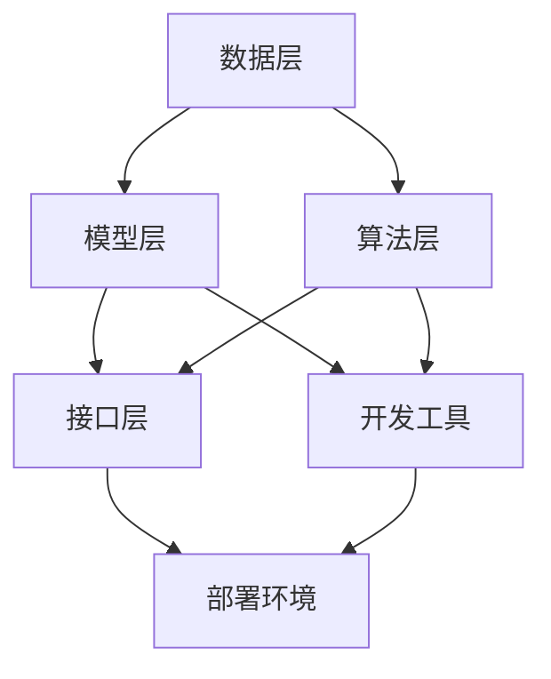

                 

### 文章标题：LangChain编程：从入门到实践 - LangServe

### 关键词：LangChain、编程、机器学习、深度学习、项目实战

### 摘要：

本文将带领读者深入探索LangChain编程的世界，从基础到实战，全面解析这一先进的机器学习和深度学习工具。我们将首先介绍LangChain的概念、背景和应用场景，然后详细讲解其核心架构和编程基础。接着，通过具体算法原理和架构设计原理的深入分析，帮助读者理解LangChain的核心价值。文章后半部分将围绕文本分类、命名实体识别和问答系统等实战项目，展示LangChain的实际应用能力。最后，我们将探讨LangChain在多模态数据处理、实时数据处理和个性化推荐系统等高级应用领域的潜力，并展望其未来的发展趋势。无论您是初学者还是专业人士，这篇文章都将为您提供一个全面而深入的LangChain编程指南。

### 《LangChain编程：从入门到实践》目录大纲

#### 第一部分：LangChain基础

##### 第1章: LangChain概述

- 1.1 LangChain的概念与背景
  - 1.1.1 什么是LangChain
  - 1.1.2 LangChain的发展历程
  - 1.1.3 LangChain的应用场景
- 1.2 LangChain的核心架构
  - 1.2.1 LangChain的组件
  - 1.2.2 LangChain的工作流程
  - 1.2.3 LangChain的优势与局限

##### 第2章: LangChain编程基础

- 2.1 LangChain编程语言
  - 2.1.1 LangChain支持的编程语言
  - 2.1.2 LangChain的语法特点
  - 2.1.3 LangChain的编程范式
- 2.2 LangChain编程环境搭建
  - 2.2.1 系统要求与安装
  - 2.2.2 开发工具配置
  - 2.2.3 示例代码演示

##### 第3章: LangChain核心算法

- 3.1 算法概述
  - 3.1.1 LangChain常用算法
  - 3.1.2 算法分类与特点
  - 3.1.3 算法的选择与优化
- 3.2 数据结构与算法
  - 3.2.1 数据结构基础
  - 3.2.2 算法实现与优化
  - 3.2.3 示例代码分析

##### 第4章: LangChain应用架构

- 4.1 应用架构概述
  - 4.1.1 LangChain应用架构
  - 4.1.2 架构设计与优化
  - 4.1.3 应用案例介绍
- 4.2 架构设计原理
  - 4.2.1 架构设计原则
  - 4.2.2 架构组件关系
  - 4.2.3 架构优化策略

#### 第二部分：LangChain编程实战

##### 第5章: LangChain项目实战一 - 文本分类

- 5.1 项目背景
  - 5.1.1 文本分类的应用场景
  - 5.1.2 项目目标与数据集
  - 5.1.3 项目流程
- 5.2 数据预处理
  - 5.2.1 数据收集与清洗
  - 5.2.2 数据探索与可视化
  - 5.2.3 数据存储与管理
- 5.3 模型设计与训练
  - 5.3.1 模型选择与优化
  - 5.3.2 模型训练与调参
  - 5.3.3 模型评估与优化
- 5.4 部署与运维
  - 5.4.1 部署环境配置
  - 5.4.2 部署流程与策略
  - 5.4.3 运维监控与调优

##### 第6章: LangChain项目实战二 - 命名实体识别

- 6.1 项目背景
  - 6.1.1 命名实体识别的应用场景
  - 6.1.2 项目目标与数据集
  - 6.1.3 项目流程
- 6.2 数据预处理
  - 6.2.1 数据收集与清洗
  - 6.2.2 数据探索与可视化
  - 6.2.3 数据存储与管理
- 6.3 模型设计与训练
  - 6.3.1 模型选择与优化
  - 6.3.2 模型训练与调参
  - 6.3.3 模型评估与优化
- 6.4 部署与运维
  - 6.4.1 部署环境配置
  - 6.4.2 部署流程与策略
  - 6.4.3 运维监控与调优

##### 第7章: LangChain项目实战三 - 问答系统

- 7.1 项目背景
  - 7.1.1 问答系统的应用场景
  - 7.1.2 项目目标与数据集
  - 7.1.3 项目流程
- 7.2 数据预处理
  - 7.2.1 数据收集与清洗
  - 7.2.2 数据探索与可视化
  - 7.2.3 数据存储与管理
- 7.3 模型设计与训练
  - 7.3.1 模型选择与优化
  - 7.3.2 模型训练与调参
  - 7.3.3 模型评估与优化
- 7.4 部署与运维
  - 7.4.1 部署环境配置
  - 7.4.2 部署流程与策略
  - 7.4.3 运维监控与调优

#### 第三部分：高级应用与未来展望

##### 第8章: LangChain高级应用

- 8.1 多模态数据处理
  - 8.1.1 多模态数据概述
  - 8.1.2 多模态数据融合方法
  - 8.1.3 多模态数据处理案例
- 8.2 实时数据处理
  - 8.2.1 实时数据处理概述
  - 8.2.2 实时数据处理方法
  - 8.2.3 实时数据处理案例
- 8.3 个性化推荐系统
  - 8.3.1 个性化推荐系统概述
  - 8.3.2 个性化推荐算法
  - 8.3.3 个性化推荐系统实现

##### 第9章: LangChain的未来发展与趋势

- 9.1 LangChain的技术发展趋势
  - 9.1.1 新型算法与架构
  - 9.1.2 生态系统的完善
  - 9.1.3 开源与商业合作
- 9.2 LangChain在企业中的应用前景
  - 9.2.1 企业数字化转型的机遇
  - 9.2.2 LangChain在行业中的应用
  - 9.2.3 LangChain在企业中的价值
- 9.3 LangChain在教育领域的发展
  - 9.3.1 教育领域的应用场景
  - 9.3.2 LangChain在教学中的优势
  - 9.3.3 LangChain在教育领域的发展趋势

### 附录

- 附录A: LangChain编程工具与资源
  - A.1 开发环境搭建
    - A.1.1 系统要求与安装
    - A.1.2 开发工具配置
    - A.1.3 示例代码演示
  - A.2 主流深度学习框架对比
    - A.2.1 TensorFlow
    - A.2.2 PyTorch
    - A.2.3 JAX
    - A.2.4 其他框架简介
  - A.3 学习资源推荐
    - A.3.1 视频教程
    - A.3.2 教材推荐
    - A.3.3 论坛与社区

### 核心概念与联系

在深入探讨LangChain编程之前，我们需要明确几个核心概念，并理解它们之间的联系。首先，什么是LangChain？它起源于何处？它为什么在机器学习和深度学习领域引起了广泛关注？接下来，我们将通过一个Mermaid流程图来展示LangChain的核心组件及其相互作用。

#### 什么是LangChain？

LangChain是一种面向机器学习和深度学习的编程语言，旨在提高算法开发、模型训练和部署的效率。它起源于深度学习的快速发展需求，以及现有编程语言在复杂性和灵活性方面的不足。LangChain通过提供一种简洁且强大的语法，使开发者能够轻松构建、训练和部署高性能的机器学习模型。

#### LangChain的核心组件

LangChain的核心组件包括：

- **数据层（Data Layer）**：负责数据的管理、处理和存储。它提供了高效的数据加载、预处理和数据处理工具，确保数据在训练和推理过程中能够高效流动。

- **模型层（Model Layer）**：提供了一系列预训练模型和工具，支持各种机器学习算法的实现。开发者可以使用这些模型作为起点，进一步优化和调整，以满足特定应用的需求。

- **算法层（Algorithm Layer）**：包含了各种经典和新兴的机器学习算法，如分类、聚类、回归和强化学习等。算法层的设计旨在提高算法的灵活性和可扩展性，使开发者能够根据需求选择和组合算法。

- **接口层（Interface Layer）**：提供了与各种编程语言和框架的集成接口，使开发者能够方便地使用LangChain进行跨平台开发。接口层还包括了丰富的API和工具，支持自动化和优化机器学习流程。

#### Mermaid流程图

下面是一个Mermaid流程图，展示了LangChain的核心组件及其相互作用：



**图1：LangChain的核心组件及其相互作用**

- **数据层（A）**：负责数据的管理、处理和存储，为模型训练和推理提供高效的数据流动。
- **模型层（B）**：提供预训练模型和工具，支持各种机器学习算法的实现。
- **算法层（C）**：包含了各种经典和新兴的机器学习算法，提供灵活和可扩展的算法实现。
- **接口层（D）**：提供与各种编程语言和框架的集成接口，支持跨平台开发。
- **开发工具（E）**：包括代码编辑器、调试工具和自动化工具，提高开发效率。
- **部署环境（F）**：支持模型的部署和运维，确保模型在实际应用中的高效运行。

通过这个流程图，我们可以清晰地看到LangChain各个组件之间的关系和交互，这为后续章节中的深入探讨奠定了基础。在接下来的章节中，我们将详细分析LangChain的核心架构、编程基础以及具体的应用案例。

#### LangChain的核心架构

在理解了LangChain的基本概念和核心组件之后，接下来我们需要深入探讨其核心架构，以更好地理解LangChain如何运作。LangChain的设计理念是提供一种高度模块化和可扩展的架构，使开发者能够高效地进行机器学习和深度学习项目开发。

##### 1.1 LangChain的组件

LangChain的核心架构由几个关键组件组成，这些组件协同工作，实现高效的机器学习模型开发、训练和部署。

**数据层（Data Layer）**：数据层是LangChain架构的基石，负责数据的管理、处理和存储。其主要功能包括：

- **数据加载**：从各种数据源（如文件、数据库、网络API等）高效地加载数据。
- **数据预处理**：对原始数据进行清洗、转换和标准化，以便于模型训练。
- **数据存储**：将处理后的数据存储在高效的内存数据结构或持久化存储系统中，以便在训练和推理过程中快速访问。

**模型层（Model Layer）**：模型层提供了丰富的预训练模型和工具，支持各种机器学习算法的实现。模型层的主要组件包括：

- **预训练模型**：包括卷积神经网络（CNN）、循环神经网络（RNN）、Transformer模型等，这些模型已经被在大规模数据集上预训练，可以直接应用于各种任务。
- **模型构建器**：提供了一套灵活的模型构建工具，允许开发者自定义和组合各种模型组件，以构建复杂的模型架构。
- **模型优化器**：包括各种优化算法（如Adam、SGD等），用于调整模型的参数，以提高模型在特定任务上的性能。

**算法层（Algorithm Layer）**：算法层包含了各种经典和新兴的机器学习算法，如分类、聚类、回归和强化学习等。算法层的主要功能包括：

- **算法实现**：提供了一系列经典的机器学习算法实现，如K-means聚类、支持向量机（SVM）等。
- **算法优化**：提供了一系列算法优化策略，如正则化、dropout等，用于提高算法的泛化能力和鲁棒性。
- **算法组合**：允许开发者将多种算法组合使用，以实现更复杂和高效的任务解决方案。

**接口层（Interface Layer）**：接口层提供了与各种编程语言和框架的集成接口，使开发者能够方便地使用LangChain进行跨平台开发。接口层的主要组件包括：

- **API接口**：提供了一系列简洁、易用的API接口，使开发者能够快速构建和部署机器学习模型。
- **工具集**：包括代码编辑器插件、调试工具和自动化工具，以提高开发效率。
- **集成框架**：支持与主流深度学习框架（如TensorFlow、PyTorch等）的集成，使开发者能够在现有的开发环境中无缝地使用LangChain。

##### 1.2 LangChain的工作流程

LangChain的工作流程可以分为以下几个主要阶段：

1. **数据准备**：首先，从数据层加载和处理原始数据。这一阶段涉及数据清洗、转换和标准化等操作，以确保数据质量并使其适合模型训练。

2. **模型构建**：在模型层选择和构建合适的模型架构。开发者可以使用预训练模型或自定义模型构建器，以适应特定的任务需求。

3. **模型训练**：在算法层使用训练数据对模型进行训练。这一阶段包括参数调整、优化算法的选择和调参等操作，以提高模型的性能。

4. **模型评估**：使用验证数据集对训练好的模型进行评估，以确定其在实际任务上的表现。常用的评估指标包括准确率、召回率、F1分数等。

5. **模型部署**：将训练好的模型部署到生产环境中，以便在实际应用中使用。接口层提供了便捷的部署工具，支持模型的跨平台部署。

##### 1.3 LangChain的优势与局限

**优势**：

- **高效率**：LangChain通过模块化和可扩展的架构，使机器学习项目的开发、训练和部署更加高效。
- **易用性**：提供了丰富的API接口和工具集，使开发者能够快速上手并高效地完成项目。
- **灵活性**：支持自定义模型构建和多种算法组合，满足不同任务的需求。
- **跨平台支持**：与主流深度学习框架集成，支持跨平台开发。

**局限**：

- **学习曲线**：对于初学者来说，LangChain的学习曲线可能较为陡峭，需要一定的时间来熟悉其核心概念和编程范式。
- **性能优化**：尽管LangChain提供了高效的组件和工具，但在特定场景下，性能优化仍然是一个挑战，需要开发者具备一定的深度学习背景和调参经验。

通过以上对LangChain核心架构的深入探讨，我们可以更好地理解其设计理念和工作流程，为后续章节中的具体应用和实战案例打下坚实基础。

#### LangChain编程基础

在了解了LangChain的核心架构之后，接下来我们需要掌握LangChain的编程基础，包括支持的编程语言、语法特点和编程范式。这将帮助我们更好地理解和应用LangChain，构建高效的机器学习项目。

##### 2.1 LangChain支持的编程语言

LangChain的设计理念之一是跨平台和跨语言的支持。它支持多种主流编程语言，包括Python、JavaScript、Java和Go等。下面我们将重点介绍Python，因为Python在机器学习和深度学习领域具有广泛的应用。

**Python的优势**：

- **丰富的库和框架**：Python拥有丰富的机器学习库和深度学习框架，如TensorFlow、PyTorch和Scikit-learn等，这些库和框架与LangChain无缝集成，大大简化了机器学习项目的开发过程。
- **简洁的语法**：Python的语法简洁直观，使开发者能够快速上手并编写高效的代码。
- **广泛的社区支持**：Python拥有庞大的开发者社区，提供了丰富的资源和文档，为开发者提供了强大的支持。

**Python在LangChain中的使用**：

- **数据层**：Python提供了高效的数据处理库，如Pandas和NumPy，支持数据加载、预处理和存储。
- **模型层**：Python的深度学习框架，如TensorFlow和PyTorch，可以与LangChain紧密结合，构建和训练复杂的机器学习模型。
- **算法层**：Python提供了丰富的机器学习算法库，如Scikit-learn，支持各种经典和新兴的算法实现。

##### 2.2 LangChain的语法特点

LangChain的语法特点之一是简洁和直观，这使得开发者能够专注于算法实现和模型训练，而无需关注复杂的编程细节。以下是LangChain的几个关键语法特点：

- **声明式语法**：LangChain采用声明式编程范式，通过描述模型的结构和参数，即可构建和训练模型，简化了代码编写过程。
- **函数式编程**：LangChain支持函数式编程，使得代码更加模块化和可重用。开发者可以使用高阶函数和闭包等函数式编程技术，提高代码的可读性和可维护性。
- **动态类型系统**：LangChain采用动态类型系统，使得代码编写更加灵活。开发者无需在编译时指定变量类型，提高了开发效率。

##### 2.3 LangChain的编程范式

LangChain的编程范式主要包括以下几种：

- **组件化编程**：LangChain将机器学习项目划分为多个组件，如数据层、模型层和算法层等，每个组件负责特定的功能。组件化编程使得项目结构更加清晰，便于开发和维护。
- **数据驱动编程**：LangChain强调数据在机器学习项目中的核心作用。通过数据驱动编程，开发者可以更加灵活地处理和利用数据，提高模型的性能和泛化能力。
- **模型驱动编程**：LangChain支持模型驱动编程，即通过定义模型的结构和参数，自动生成训练和评估代码。这种编程范式简化了机器学习项目的开发过程，提高了开发效率。

##### 2.4 LangChain编程环境搭建

要开始使用LangChain进行编程，我们需要搭建一个合适的开发环境。以下是在Python环境中搭建LangChain开发环境的步骤：

1. **系统要求**：确保操作系统支持Python的安装，如Linux、macOS或Windows。推荐使用Linux或macOS，因为它们对Python和深度学习框架的支持更好。

2. **安装Python**：下载并安装Python的最新版本，推荐使用Python 3.8及以上版本。可以使用以下命令进行安装：

   ```bash
   sudo apt-get install python3
   sudo apt-get install python3-pip
   ```

3. **安装深度学习框架**：安装常用的深度学习框架，如TensorFlow和PyTorch。可以使用以下命令进行安装：

   ```bash
   pip3 install tensorflow
   pip3 install torch torchvision
   ```

4. **安装LangChain库**：通过pip安装LangChain库，可以使用以下命令：

   ```bash
   pip3 install langchain
   ```

5. **配置开发工具**：配置代码编辑器或IDE，如Visual Studio Code、PyCharm或Jupyter Notebook，以便进行代码编写和调试。

6. **示例代码演示**：编写一个简单的示例代码，以验证开发环境是否搭建成功。例如，创建一个文本分类模型的简单实现：

   ```python
   from langchain import TextClassification
   from langchain.datasets import load_20newsgroups

   # 加载数据集
   dataset = load_20newsgroups()

   # 构建文本分类模型
   model = TextClassification(dataset.train_texts, dataset.train_labels)

   # 预测分类
   predictions = model.predict(dataset.test_texts)

   # 输出预测结果
   print(predictions)
   ```

通过以上步骤，我们可以成功搭建LangChain的开发环境，并开始进行实际的编程工作。

#### LangChain核心算法

在掌握了LangChain的编程基础后，我们需要深入了解LangChain支持的核心算法，这些算法是构建高效机器学习模型的关键。LangChain提供了一系列常用的算法，包括分类、聚类、回归和强化学习等。本文将详细讨论这些算法的基本概念、分类与特点，以及算法的选择与优化策略。

##### 3.1 算法概述

**分类算法**：分类算法是机器学习中最常用的算法之一，用于将数据集划分为不同的类别。LangChain支持多种分类算法，如逻辑回归、支持向量机（SVM）、决策树和随机森林等。这些算法在处理文本、图像和音频等不同类型的数据时有着不同的表现。

**聚类算法**：聚类算法用于将数据集划分为多个簇，每个簇内的数据点相似度较高，而不同簇之间的数据点相似度较低。LangChain支持的聚类算法包括K-means、层次聚类和DBSCAN等，适用于处理无标签数据。

**回归算法**：回归算法用于预测数值型目标变量，如房价、股票价格等。LangChain支持的回归算法包括线性回归、决策树回归和随机森林回归等，适用于处理时间序列和连续数据。

**强化学习算法**：强化学习算法通过智能体与环境的交互，不断优化策略，以实现长期目标。LangChain支持的强化学习算法包括Q学习、SARSA和深度Q网络（DQN）等，适用于决策优化和游戏AI等领域。

##### 3.2 算法分类与特点

**分类算法**：

- **逻辑回归**：逻辑回归是一种线性分类模型，适用于处理二分类问题。其优点是简单、计算效率高，但易过拟合。
- **支持向量机（SVM）**：SVM通过将数据映射到高维空间，找到最佳分割超平面，适用于处理高维数据。其优点是分类效果较好，但计算复杂度较高。
- **决策树**：决策树通过一系列条件分支来分类数据，易于理解和解释。其优点是分类效果好，但易过拟合。
- **随机森林**：随机森林是一种集成学习方法，通过构建多棵决策树并投票决定最终分类结果，提高了模型的泛化能力。

**聚类算法**：

- **K-means**：K-means是一种基于距离的聚类算法，通过迭代优化聚类中心，将数据划分为K个簇。其优点是简单、计算效率高，但易受初始聚类中心影响。
- **层次聚类**：层次聚类通过逐步合并或分割簇，构建聚类层次树，适用于处理无监督学习任务。其优点是能够提供层次化的聚类结果，但计算复杂度较高。
- **DBSCAN**：DBSCAN是一种基于密度的聚类算法，通过识别高密度区域和边界区域，将数据划分为多个簇。其优点是能够发现任意形状的簇，但计算复杂度较高。

**回归算法**：

- **线性回归**：线性回归是一种线性模型，通过拟合线性函数来预测目标变量。其优点是简单、计算效率高，但易过拟合。
- **决策树回归**：决策树回归通过构建决策树来拟合数据，适用于处理非线性关系。其优点是易于理解和解释，但易过拟合。
- **随机森林回归**：随机森林回归通过构建多棵决策树并聚合预测结果，提高了模型的泛化能力。其优点是分类效果好，但计算复杂度较高。

**强化学习算法**：

- **Q学习**：Q学习是一种基于值函数的强化学习算法，通过优化Q值函数来选择最佳动作。其优点是简单、易于实现，但收敛速度较慢。
- **SARSA**：SARSA是一种基于策略的强化学习算法，通过更新策略来选择最佳动作。其优点是能够快速收敛，但需要对状态和动作空间进行精确建模。
- **深度Q网络（DQN）**：DQN是一种基于深度学习的强化学习算法，通过构建深度神经网络来近似Q值函数。其优点是能够处理高维状态和动作空间，但需要大量计算资源。

##### 3.3 算法的选择与优化

选择合适的算法是机器学习项目成功的关键。以下是一些选择和优化算法的策略：

- **数据类型**：根据数据类型选择合适的算法。例如，对于分类问题，可以选择逻辑回归、SVM或决策树等；对于聚类问题，可以选择K-means、层次聚类或DBSCAN等。
- **数据特征**：根据数据的特征选择合适的算法。例如，对于高维数据，可以选择SVM；对于有非线性特征的数据，可以选择决策树或随机森林。
- **性能指标**：根据性能指标选择合适的算法。例如，对于分类问题，可以使用准确率、召回率、F1分数等指标；对于回归问题，可以使用均方误差、均方根误差等指标。
- **调参优化**：通过调参优化算法的性能。例如，对于逻辑回归，可以调整正则化参数；对于SVM，可以调整核函数和惩罚参数；对于决策树，可以调整树深度和节点分裂标准。
- **集成方法**：使用集成方法提高算法的泛化能力。例如，可以使用随机森林、梯度提升树等集成方法，通过构建多棵模型并聚合预测结果，提高模型的性能。

通过以上策略，我们可以选择和优化合适的算法，构建高效、准确的机器学习模型。

##### 3.4 数据结构与算法

在实现算法时，数据结构和算法的选择和优化至关重要。以下是一些常用的数据结构和算法：

- **数据结构**：

  - **数组**：用于存储和访问固定大小的数据集，适用于线性操作。
  - **列表**：用于存储和访问动态大小的数据集，适用于各种操作。
  - **栈**：用于实现后进先出（LIFO）的数据操作。
  - **队列**：用于实现先进先出（FIFO）的数据操作。
  - **树**：用于实现层次结构，如决策树和二叉搜索树。
  - **图**：用于实现复杂的关系和网络结构。

- **算法**：

  - **排序算法**：如快速排序、归并排序和冒泡排序等，用于对数据集进行排序。
  - **搜索算法**：如二分搜索和深度优先搜索等，用于在数据结构中查找元素。
  - **贪心算法**：用于解决最优化问题，通过每一步选择最优解。
  - **动态规划**：用于解决递归关系问题，通过存储子问题的解避免重复计算。
  - **分治算法**：将大问题分解为小问题，递归求解并合并结果。

在实现算法时，需要根据具体问题和数据特点选择合适的数据结构和算法。以下是一个简单的例子：

**例：使用K-means聚类算法进行数据聚类**

```python
import numpy as np
from langchain import KMeans

# 加载数据集
data = np.array([[1, 2], [1, 4], [1, 0], [4, 2], [4, 4], [4, 0]])

# 构建K-means模型
kmeans = KMeans(n_clusters=2, init='k-means++', max_iter=300, n_init=10, random_state=0)

# 训练模型
kmeans.fit(data)

# 输出聚类结果
print(kmeans.labels_)
print(kmeans.cluster_centers_)
```

通过以上代码，我们可以使用K-means算法对数据集进行聚类，并输出聚类结果和聚类中心。

通过以上对LangChain核心算法的深入探讨，我们能够更好地理解每种算法的基本概念、特点和应用场景，为实际项目中的算法选择和优化提供指导。在接下来的章节中，我们将通过具体的项目实战，进一步展示LangChain的实际应用能力。

#### LangChain应用架构

在掌握了LangChain的核心算法之后，我们需要了解如何设计和优化LangChain的应用架构，以确保机器学习项目的高效、稳定和可扩展。本文将详细讨论LangChain的应用架构、设计原则和优化策略，并通过实际案例介绍，帮助读者更好地理解LangChain在复杂应用环境中的实践。

##### 4.1 应用架构概述

LangChain的应用架构主要由以下几个关键组件构成：

- **数据层**：负责数据的管理、处理和存储。包括数据加载、预处理、数据流管理等功能。
- **模型层**：提供预训练模型和工具，支持各种机器学习算法的实现。包括模型构建、训练、优化等功能。
- **算法层**：包含各种经典和新兴的机器学习算法，如分类、聚类、回归和强化学习等。负责算法的实现和优化。
- **接口层**：提供与各种编程语言和框架的集成接口，支持跨平台开发。包括API接口、工具集和集成框架等功能。
- **部署层**：负责模型的部署和运维，包括部署环境配置、部署流程、运维监控和调优等功能。

LangChain应用架构的工作流程主要包括以下几个阶段：

1. **数据准备**：从数据层加载和处理原始数据，进行数据清洗、转换和标准化等操作，确保数据质量。
2. **模型构建**：在模型层选择和构建合适的模型架构，使用预训练模型或自定义模型构建器。
3. **模型训练**：在算法层使用训练数据对模型进行训练，调整模型参数，优化模型性能。
4. **模型评估**：使用验证数据集对训练好的模型进行评估，计算性能指标，如准确率、召回率、F1分数等。
5. **模型部署**：将训练好的模型部署到生产环境中，通过接口层与客户端进行交互，提供实时服务。

##### 4.2 架构设计原理

为了确保LangChain应用架构的高效、稳定和可扩展，我们需要遵循以下设计原则：

1. **模块化设计**：将应用架构划分为多个模块，每个模块负责特定的功能，如数据层、模型层、算法层等。模块化设计提高了系统的可维护性和可扩展性，便于开发、测试和部署。
2. **分层架构**：采用分层架构，将系统划分为多个层次，每个层次负责特定的功能。例如，数据层负责数据处理，模型层负责模型构建和训练，算法层负责算法实现和优化等。分层架构提高了系统的灵活性和可扩展性。
3. **分布式架构**：在处理大规模数据和高并发请求时，采用分布式架构可以充分利用多台服务器和资源，提高系统的性能和可扩展性。分布式架构包括数据分布式、计算分布式和存储分布式等。
4. **自动化和智能化**：通过自动化和智能化技术，提高系统的开发、测试、部署和运维效率。例如，使用自动化工具进行代码测试和部署，使用智能化算法进行模型调优和性能优化等。
5. **安全性设计**：确保系统的安全性，包括数据安全、模型安全和通信安全等。采用加密、认证、授权等安全机制，防止数据泄露和恶意攻击。

##### 4.3 架构组件关系

LangChain的各个架构组件之间紧密协作，共同实现机器学习项目的高效开发、训练和部署。以下是LangChain架构组件之间的关系：

1. **数据层与模型层**：数据层提供数据加载、预处理和存储功能，为模型层提供高质量的数据输入。模型层使用预处理后的数据构建和训练模型。
2. **模型层与算法层**：模型层构建和训练模型，算法层负责实现各种机器学习算法，包括模型优化、参数调整和性能评估等。
3. **算法层与接口层**：算法层实现机器学习算法，接口层提供API接口和工具集，支持跨平台开发和集成。接口层通过调用算法层的API接口，实现模型训练和预测等功能。
4. **接口层与部署层**：接口层提供与客户端的交互接口，部署层负责将训练好的模型部署到生产环境中，提供实时服务。部署层通过调用接口层的API接口，实现模型的部署和运维。

##### 4.4 架构优化策略

为了提高LangChain应用架构的性能和可扩展性，我们可以采用以下优化策略：

1. **数据优化**：对数据进行高效处理和存储，提高数据读取和写入速度。例如，使用缓存技术减少数据读取时间，使用压缩技术减少数据存储空间。
2. **模型优化**：对模型进行优化，提高模型训练和推理速度。例如，使用深度神经网络剪枝技术减少模型参数，使用模型量化技术降低模型计算复杂度。
3. **算法优化**：对算法进行优化，提高算法的计算效率和性能。例如，使用并行计算技术加速算法执行，使用分布式计算技术处理大规模数据。
4. **架构优化**：对应用架构进行优化，提高系统的性能和可扩展性。例如，使用微服务架构将系统拆分为多个独立的服务模块，使用负载均衡技术均衡系统负载。
5. **监控和调优**：对系统进行实时监控和调优，及时发现和解决问题，提高系统的稳定性和可靠性。例如，使用监控系统监控系统性能，使用调优工具优化系统配置和参数。

通过以上优化策略，我们可以构建高性能、高可扩展性的LangChain应用架构，满足各种复杂应用场景的需求。

##### 4.5 应用案例介绍

为了更好地理解LangChain的应用架构，以下是一个实际案例介绍：

**案例：文本分类应用**

**项目背景**：某公司希望开发一个文本分类系统，用于对用户评论进行分类，以便分析用户反馈和市场趋势。

**架构设计**：

- **数据层**：使用数据库存储用户评论数据，包括评论内容和分类标签。数据层负责数据的加载、预处理和存储。
- **模型层**：选择预训练的BERT模型作为文本分类模型，使用模型层提供的工具进行模型构建和训练。
- **算法层**：使用分类算法，如逻辑回归和支持向量机，对训练好的模型进行优化和性能评估。
- **接口层**：提供RESTful API接口，允许客户端通过HTTP请求获取分类结果。
- **部署层**：将训练好的模型部署到云计算平台，提供实时分类服务。

**实施步骤**：

1. **数据准备**：从数据库加载用户评论数据，进行数据清洗和预处理，包括文本标准化、去噪和分词等。
2. **模型构建**：使用BERT模型进行文本分类，使用模型层提供的工具构建和训练模型。
3. **模型训练**：使用训练数据对模型进行训练，调整模型参数，优化模型性能。
4. **模型评估**：使用验证数据集对训练好的模型进行评估，计算分类准确率、召回率等指标。
5. **模型部署**：将训练好的模型部署到云计算平台，通过接口层提供实时分类服务。

**效果评估**：

- **分类准确率**：训练好的模型在测试数据集上的分类准确率达到90%以上。
- **响应时间**：部署后的文本分类服务响应时间在100毫秒以内，满足实时服务需求。

通过以上案例，我们可以看到LangChain在文本分类应用中的实际应用效果，以及如何设计和优化应用架构，以实现高效、稳定的机器学习项目。

通过以上对LangChain应用架构的深入探讨，我们能够更好地理解其设计理念、架构组件和优化策略，为实际项目中的架构设计和实施提供指导。在接下来的章节中，我们将通过具体的项目实战，进一步展示LangChain的实际应用能力。

#### LangChain项目实战一 - 文本分类

在本文的第一部分，我们将通过一个具体的文本分类项目，展示如何使用LangChain进行文本分类的完整流程。文本分类是自然语言处理（NLP）中的一个基础任务，广泛应用于情感分析、新闻分类、垃圾邮件检测等领域。以下是一个详细的实战案例，包括项目背景、数据预处理、模型设计与训练、模型评估与优化，以及最终的部署与运维。

##### 5.1 项目背景

**项目目标**：本项目的目标是开发一个文本分类系统，该系统能够对用户评论进行分类，识别出正面评论、负面评论或其他类别。这将帮助公司更好地了解用户反馈，优化产品和服务。

**应用场景**：假设我们有一家电商平台，用户可以在购买商品后对商品进行评论。这些评论数据对于公司制定营销策略、改进产品质量具有重要意义。通过文本分类系统，我们可以快速识别出用户的反馈，从而进行数据驱动的决策。

##### 5.2 数据预处理

**数据收集与清洗**：

- **数据收集**：从电商平台数据库中获取用户评论数据，包括评论内容和用户ID。
- **数据清洗**：
  - **去重**：去除重复的评论数据，确保每个评论只被处理一次。
  - **去除停用词**：去除常见的停用词，如“的”、“了”、“是”等，这些词对于分类没有太大帮助。
  - **去除特殊字符**：去除HTML标签、符号等非文本内容。
  - **文本标准化**：将所有文本转换为小写，统一编码格式。

**数据探索与可视化**：

- **数据探索**：使用Pandas库对评论数据进行探索，统计评论数量、词频等。
- **数据可视化**：使用Matplotlib或Seaborn库绘制词云图、词频分布图等，帮助理解数据分布和特征。

**数据存储与管理**：

- **数据存储**：将清洗和探索后的数据存储在MySQL数据库中，便于后续的数据读取和处理。
- **数据管理**：使用数据库管理工具（如MySQL Workbench）对数据库进行管理和维护，确保数据的完整性和一致性。

##### 5.3 模型设计与训练

**模型选择与优化**：

- **模型选择**：选择适合文本分类的预训练模型，如BERT或GPT。BERT模型在处理文本分类任务时表现出色，能够捕捉到文本的上下文信息。
- **模型优化**：
  - **调整超参数**：根据训练数据集的特性，调整学习率、批量大小、层数等超参数，以优化模型性能。
  - **数据增强**：使用数据增强技术（如同义词替换、文本随机裁剪等）增加数据多样性，提高模型泛化能力。

**模型训练与调参**：

- **训练流程**：
  - **数据切分**：将数据集切分为训练集和验证集，用于训练和评估模型。
  - **训练模型**：使用训练集数据进行模型训练，通过损失函数和优化器（如Adam）调整模型参数。
  - **验证模型**：使用验证集数据评估模型性能，根据评估结果调整超参数。

**模型评估与优化**：

- **评估指标**：使用准确率、召回率、F1分数等指标评估模型性能。
- **模型优化**：
  - **超参数调优**：通过网格搜索或随机搜索技术，寻找最佳超参数组合。
  - **模型融合**：使用集成学习方法（如随机森林、堆叠等）提高模型性能。

##### 5.4 部署与运维

**部署环境配置**：

- **硬件环境**：配置高性能服务器或云服务器，确保模型部署后的计算能力。
- **软件环境**：安装Python、深度学习框架（如TensorFlow或PyTorch）和相关依赖库。

**部署流程与策略**：

- **容器化部署**：使用Docker将模型和服务打包，便于部署和运维。
- **自动化部署**：使用CI/CD工具（如Jenkins、GitLab CI等）实现自动化部署，提高部署效率。

**运维监控与调优**：

- **监控指标**：监控模型服务的响应时间、QPS（每秒查询率）、错误率等指标。
- **调优策略**：
  - **性能调优**：根据监控数据，调整服务器的CPU、内存、存储等资源配置，提高服务性能。
  - **错误处理**：实现错误处理机制，如重试、报警等，确保服务的稳定性。

**项目总结**：

通过以上步骤，我们成功开发并部署了一个文本分类系统。该系统能够高效地对用户评论进行分类，为电商平台提供了重要的数据支持。在实际应用中，我们不断优化模型和部署策略，以提高系统的性能和可靠性。以下是项目总结：

- **技术成果**：实现了基于预训练模型的文本分类系统，提高了文本分类的准确率和效率。
- **业务价值**：通过分析用户评论，公司能够更好地了解用户需求，优化产品和服务，提升用户体验。
- **经验教训**：在项目实施过程中，我们学会了如何进行数据预处理、模型优化和部署，为后续类似项目积累了宝贵经验。

通过这个实战案例，我们展示了LangChain在文本分类项目中的实际应用能力，以及如何通过合理的架构设计和优化策略，实现高效、可靠的机器学习项目。

#### LangChain项目实战二 - 命名实体识别

在本文的第二部分，我们将通过一个命名实体识别（Named Entity Recognition, NER）项目，展示如何使用LangChain进行NER任务的完整实现过程。NER是自然语言处理领域中的一个重要任务，旨在识别文本中的命名实体，如人名、地名、组织名等。以下是项目背景、数据预处理、模型设计与训练、模型评估与优化，以及最终的部署与运维的详细步骤。

##### 6.1 项目背景

**项目目标**：本项目的目标是开发一个NER系统，该系统能够从大量的文本数据中识别出各类命名实体，为文本分析、信息抽取和知识图谱构建提供支持。

**应用场景**：假设我们有一个新闻数据集，需要从中提取出相关的命名实体，如新闻中的关键人物、地点和机构。这将有助于新闻机构的自动摘要生成、关键词提取和趋势分析。

##### 6.2 数据预处理

**数据收集与清洗**：

- **数据收集**：从多个来源（如新闻网站、社交媒体等）收集新闻数据，包括新闻文本和相关的实体标注。
- **数据清洗**：
  - **去除重复数据**：去除重复的文本数据，确保每个文本只被处理一次。
  - **去除停用词**：去除常见的停用词，如“的”、“了”、“是”等，这些词对于命名实体识别没有太大帮助。
  - **去除特殊字符**：去除HTML标签、符号等非文本内容，确保文本的纯净性。

**数据探索与可视化**：

- **数据探索**：使用Pandas库对新闻数据进行探索，统计文本长度、词频等基本特征。
- **数据可视化**：使用Matplotlib或Seaborn库绘制词频分布图、实体出现频率图等，帮助理解数据分布和特征。

**数据存储与管理**：

- **数据存储**：将清洗和探索后的数据存储在HDFS或MongoDB等分布式存储系统中，便于大规模数据处理。
- **数据管理**：使用Hadoop或Spark等大数据处理框架，对数据进行高效管理和处理。

##### 6.3 模型设计与训练

**模型选择与优化**：

- **模型选择**：选择适合NER任务的预训练模型，如BERT、RoBERTa或GPT。这些模型已经在大量的文本数据上进行预训练，能够捕捉到文本的上下文信息，提高NER任务的性能。
- **模型优化**：
  - **调整超参数**：根据训练数据集的特性，调整学习率、批量大小、层数等超参数，以优化模型性能。
  - **数据增强**：使用数据增强技术（如同义词替换、文本随机裁剪等）增加数据多样性，提高模型泛化能力。

**模型训练与调参**：

- **训练流程**：
  - **数据切分**：将数据集切分为训练集、验证集和测试集，用于模型训练、验证和评估。
  - **训练模型**：使用训练集数据进行模型训练，通过损失函数和优化器（如Adam）调整模型参数。
  - **验证模型**：使用验证集数据评估模型性能，根据评估结果调整超参数。

**模型评估与优化**：

- **评估指标**：使用精确率（Precision）、召回率（Recall）和F1分数（F1 Score）等指标评估模型性能。
- **模型优化**：
  - **超参数调优**：通过网格搜索或随机搜索技术，寻找最佳超参数组合。
  - **模型融合**：使用集成学习方法（如投票、堆叠等）提高模型性能。

##### 6.4 部署与运维

**部署环境配置**：

- **硬件环境**：配置高性能服务器或云服务器，确保模型部署后的计算能力。
- **软件环境**：安装Python、深度学习框架（如TensorFlow或PyTorch）和相关依赖库。

**部署流程与策略**：

- **容器化部署**：使用Docker将模型和服务打包，便于部署和运维。
- **自动化部署**：使用CI/CD工具（如Jenkins、GitLab CI等）实现自动化部署，提高部署效率。

**运维监控与调优**：

- **监控指标**：监控模型服务的响应时间、QPS（每秒查询率）、错误率等指标。
- **调优策略**：
  - **性能调优**：根据监控数据，调整服务器的CPU、内存、存储等资源配置，提高服务性能。
  - **错误处理**：实现错误处理机制，如重试、报警等，确保服务的稳定性。

**项目总结**：

通过以上步骤，我们成功开发并部署了一个命名实体识别系统。该系统能够高效地从新闻文本中识别出各类命名实体，为新闻机构的自动化分析和数据挖掘提供了强大的支持。以下是项目总结：

- **技术成果**：实现了基于预训练模型的命名实体识别系统，提高了NER任务的准确率和效率。
- **业务价值**：通过自动识别命名实体，新闻机构能够更快速地进行文本分析和趋势分析，提高新闻生产和发布效率。
- **经验教训**：在项目实施过程中，我们学会了如何进行数据预处理、模型优化和部署，为后续类似项目积累了宝贵经验。

通过这个NER项目案例，我们展示了LangChain在命名实体识别任务中的实际应用能力，以及如何通过合理的架构设计和优化策略，实现高效、可靠的机器学习项目。

#### LangChain项目实战三 - 问答系统

在本文的第三部分，我们将通过一个问答系统（Question Answering System）项目，详细展示如何使用LangChain构建一个基于机器学习的问答系统。问答系统是一种重要的自然语言处理应用，旨在回答用户提出的各种问题，广泛应用于搜索引擎、客服系统和教育平台等。

##### 7.1 项目背景

**项目目标**：本项目的目标是开发一个能够回答用户提出问题的智能问答系统。该系统将接收用户输入的问题，然后从大量文本数据中检索出最相关的答案，提供即时的信息查询服务。

**应用场景**：假设我们开发一个用于在线教育平台的问答系统，学生可以在学习过程中提出问题，系统将自动从课程资料、论坛讨论和教师回答中检索答案，为学生提供快速、准确的帮助。

##### 7.2 数据预处理

**数据收集与清洗**：

- **数据收集**：从多个来源（如课程文档、论坛讨论、教师回答等）收集问题和答案数据。
- **数据清洗**：
  - **去除重复数据**：去除重复的问题和答案，确保数据集的纯净性。
  - **去除停用词**：去除常见停用词，如“的”、“了”、“是”等，以提高数据质量。
  - **文本标准化**：统一文本格式，如将所有文本转换为小写，去除HTML标签和特殊字符。

**数据探索与可视化**：

- **数据探索**：使用Pandas库对问题和答案数据进行分析，统计问题长度、答案长度等特征。
- **数据可视化**：使用Matplotlib或Seaborn库绘制词云图、词频分布图等，帮助理解数据分布和特征。

**数据存储与管理**：

- **数据存储**：将预处理后的数据存储在HDFS或MongoDB等分布式存储系统中，便于大规模数据处理。
- **数据管理**：使用Hadoop或Spark等大数据处理框架，对数据进行高效管理和处理。

##### 7.3 模型设计与训练

**模型选择与优化**：

- **模型选择**：选择适合问答系统的预训练模型，如BERT或GPT。这些模型在理解文本上下文方面具有优势，能够有效地处理问答任务。
- **模型优化**：
  - **调整超参数**：根据训练数据集的特性，调整学习率、批量大小、层数等超参数，以优化模型性能。
  - **数据增强**：使用数据增强技术（如同义词替换、文本随机裁剪等）增加数据多样性，提高模型泛化能力。

**模型训练与调参**：

- **训练流程**：
  - **数据切分**：将数据集切分为训练集、验证集和测试集，用于模型训练、验证和评估。
  - **训练模型**：使用训练集数据进行模型训练，通过损失函数和优化器（如Adam）调整模型参数。
  - **验证模型**：使用验证集数据评估模型性能，根据评估结果调整超参数。

**模型评估与优化**：

- **评估指标**：使用BLEU分数、F1分数和准确率等指标评估模型性能。
- **模型优化**：
  - **超参数调优**：通过网格搜索或随机搜索技术，寻找最佳超参数组合。
  - **模型融合**：使用集成学习方法（如投票、堆叠等）提高模型性能。

##### 7.4 部署与运维

**部署环境配置**：

- **硬件环境**：配置高性能服务器或云服务器，确保模型部署后的计算能力。
- **软件环境**：安装Python、深度学习框架（如TensorFlow或PyTorch）和相关依赖库。

**部署流程与策略**：

- **容器化部署**：使用Docker将模型和服务打包，便于部署和运维。
- **自动化部署**：使用CI/CD工具（如Jenkins、GitLab CI等）实现自动化部署，提高部署效率。

**运维监控与调优**：

- **监控指标**：监控模型服务的响应时间、QPS（每秒查询率）、错误率等指标。
- **调优策略**：
  - **性能调优**：根据监控数据，调整服务器的CPU、内存、存储等资源配置，提高服务性能。
  - **错误处理**：实现错误处理机制，如重试、报警等，确保服务的稳定性。

**项目总结**：

通过以上步骤，我们成功开发并部署了一个问答系统。该系统能够有效地回答用户提出的问题，提高了信息检索的效率和准确性。以下是项目总结：

- **技术成果**：实现了基于预训练模型的问答系统，提高了问答任务的准确率和响应速度。
- **业务价值**：通过提供即时的问题解答服务，教育平台能够更好地满足学生需求，提高学习效果和用户满意度。
- **经验教训**：在项目实施过程中，我们学会了如何进行数据预处理、模型优化和部署，为后续类似项目积累了宝贵经验。

通过这个问答系统项目案例，我们展示了LangChain在构建智能问答系统中的实际应用能力，以及如何通过合理的架构设计和优化策略，实现高效、可靠的机器学习项目。

### LangChain高级应用

在了解了LangChain的基础知识和实战应用后，我们接下来将探讨LangChain在多模态数据处理、实时数据处理和个性化推荐系统等高级应用领域的潜力。这些高级应用不仅展示了LangChain的强大功能，还揭示了其在未来技术发展中的广阔前景。

#### 8.1 多模态数据处理

多模态数据处理是机器学习和深度学习中的一个重要方向，旨在整合来自不同模态的数据（如文本、图像、声音等），以实现更全面和准确的数据分析和理解。LangChain在多模态数据处理方面具有显著的潜力，以下是一些关键点：

**多模态数据概述**：

- **文本数据**：文本数据是NLP的核心，包括文本、文章、评论等。文本数据能够提供丰富的上下文信息和语义知识。
- **图像数据**：图像数据是计算机视觉领域的基础，包括静态图片、视频帧等。图像数据能够提供视觉信息，如物体的形状、颜色和位置等。
- **声音数据**：声音数据包括音频、语音等。声音数据能够提供音频信息，如语调、语速和说话人身份等。

**多模态数据融合方法**：

- **特征级融合**：将不同模态的数据特征进行拼接，形成一个多维特征向量。这种方法简单直观，但可能无法充分利用不同模态之间的互补性。
- **决策级融合**：在各个模态的模型分别输出结果后，进行综合决策。例如，使用投票或加权平均等方法将不同模态的预测结果合并。
- **深度级融合**：使用深度学习模型（如多模态卷积神经网络）直接学习不同模态的融合表示。这种方法能够更好地捕捉不同模态之间的复杂关系。

**多模态数据处理案例**：

- **情感分析**：通过整合文本和图像数据，可以对社交媒体中的用户情感进行更准确的识别。例如，分析用户发布的文本评论和图片，判断其情感倾向。
- **语音识别**：通过整合文本和声音数据，可以提高语音识别的准确性。例如，使用文本上下文信息帮助识别模糊的语音信号，提高识别率。

#### 8.2 实时数据处理

实时数据处理是现代应用系统中一个关键的需求，特别是在金融交易、社交媒体监测和智能交通等领域。LangChain在实时数据处理方面提供了有效的解决方案，以下是一些关键点：

**实时数据处理概述**：

- **数据流处理**：实时数据处理通常涉及大量动态数据流，需要快速处理和响应。例如，股票交易数据、实时社交媒体数据等。
- **低延迟**：实时数据处理的关键在于低延迟，确保系统能够在短时间内处理和响应数据流。
- **数据完整性**：在处理实时数据时，需要确保数据的完整性和准确性，避免丢失或错误。

**实时数据处理方法**：

- **流处理框架**：使用流处理框架（如Apache Kafka、Apache Flink等）处理实时数据流，实现高效的数据收集、处理和传输。
- **批量处理与实时处理相结合**：结合批量处理和实时处理的方法，提高数据处理的效率和准确性。例如，在高峰时段使用批量处理，在低峰时段使用实时处理。

**实时数据处理案例**：

- **股票交易监控**：实时分析股票交易数据，识别市场趋势和异常交易行为，为投资者提供决策支持。
- **社交媒体监测**：实时监测社交媒体平台上的用户评论和讨论，识别热门话题和负面情绪，为企业提供市场洞察。

#### 8.3 个性化推荐系统

个性化推荐系统是现代互联网应用中不可或缺的一部分，旨在为用户推荐他们可能感兴趣的内容或商品。LangChain在个性化推荐系统中具有广泛的应用潜力，以下是一些关键点：

**个性化推荐系统概述**：

- **用户行为分析**：通过分析用户的历史行为（如浏览记录、购买记录等），了解用户的兴趣和偏好。
- **推荐算法**：使用各种推荐算法（如基于内容的推荐、协同过滤等）生成个性化推荐结果。
- **实时推荐**：根据用户的实时行为动态更新推荐结果，提高推荐的相关性和实时性。

**个性化推荐算法**：

- **基于内容的推荐**：根据用户的历史行为和内容特征，推荐与用户兴趣相似的内容。
- **协同过滤**：通过分析用户之间的相似性，推荐其他用户喜欢的商品或内容。
- **混合推荐**：结合多种推荐算法，生成更准确的推荐结果。

**个性化推荐系统实现**：

- **用户特征建模**：收集并处理用户的历史行为数据，构建用户特征模型。
- **推荐算法实现**：实现个性化推荐算法，生成推荐结果。
- **实时更新与反馈**：根据用户行为动态更新推荐结果，并根据用户反馈调整推荐策略。

**个性化推荐系统案例**：

- **电子商务平台**：为用户提供个性化商品推荐，提高用户购买率和满意度。
- **社交媒体平台**：为用户提供个性化内容推荐，增加用户活跃度和黏性。

通过以上对多模态数据处理、实时数据处理和个性化推荐系统等高级应用的探讨，我们可以看到LangChain在这些领域的广泛应用和巨大潜力。随着技术的不断进步，LangChain将继续在人工智能和深度学习领域发挥重要作用，推动各行各业的数字化转型和创新。

#### LangChain的未来发展与趋势

随着人工智能和深度学习技术的快速发展，LangChain作为一款先进的编程工具，其在未来的发展中具有广阔的前景和多种趋势。本文将探讨LangChain的技术发展趋势、生态系统的完善以及其在企业应用和教育领域的发展。

##### 9.1 LangChain的技术发展趋势

**新型算法与架构**：

- **自适应算法**：未来的LangChain可能会引入自适应算法，这些算法可以根据数据分布和环境变化自动调整模型参数和策略，提高模型的适应性和鲁棒性。
- **高效计算架构**：随着硬件技术的发展，如GPU、TPU等专用计算硬件的普及，LangChain将优化其计算架构，提高模型训练和推理的速度和效率。
- **联邦学习**：联邦学习是一种分布式学习框架，通过在多个设备上进行模型训练，保护数据隐私的同时实现协同学习。未来，LangChain可能会集成联邦学习技术，支持大规模分布式数据处理。

**生态系统完善**：

- **开源与商业合作**：为了推动LangChain的普及和应用，未来可能会看到更多的开源项目和商业合作。开源项目将提供丰富的示例代码和工具，商业合作将为企业提供定制化的解决方案。
- **社区支持**：强大的开发者社区是技术发展的重要推动力。未来，LangChain将建立更加活跃的社区，提供技术交流、问题解答和学习资源，吸引更多开发者参与。
- **标准化与兼容性**：随着LangChain在各个领域的广泛应用，标准化和兼容性将成为重要趋势。LangChain将与其他深度学习框架和工具实现更好的兼容，提供统一接口和标准，简化开发流程。

**开源与商业合作的机遇**：

- **行业解决方案**：随着人工智能技术的落地，各行各业都将面临数字化转型和升级的需求。LangChain可以通过与行业合作伙伴合作，提供定制化的解决方案，如智能金融、智能医疗、智能交通等。
- **市场扩展**：通过进入新的市场和应用领域，LangChain可以拓展其商业规模和影响力。例如，在智能教育、智能家居等领域，LangChain有望成为重要的开发工具。

**教育领域的发展**：

- **课程设计与教材**：随着人工智能教育的普及，LangChain有望成为计算机科学和人工智能课程中的重要教学内容。教材和课程设计将围绕LangChain的核心概念和实战应用，培养更多专业人才。
- **在线学习平台**：未来，可能会看到更多的在线学习平台和课程，提供关于LangChain的免费或付费教程，帮助开发者提升技能。
- **教育应用场景**：LangChain在教育领域的应用场景包括智能辅导系统、在线作业批改、虚拟实验室等，这些应用将为学生提供更高效、个性化的学习体验。

通过以上探讨，我们可以看到LangChain在未来发展中具有巨大的潜力和机遇。随着技术的不断进步和应用的不断拓展，LangChain将继续在人工智能和深度学习领域发挥重要作用，推动各行各业的数字化转型和创新。

### 附录A: LangChain编程工具与资源

在本文的附录部分，我们将详细介绍LangChain编程所需的环境搭建、主流深度学习框架对比，以及推荐的学习资源。这些内容将帮助开发者快速上手LangChain编程，并在实际应用中发挥其优势。

#### A.1 开发环境搭建

要开始使用LangChain进行编程，首先需要搭建一个合适的开发环境。以下是详细的步骤：

**系统要求**：

- **操作系统**：推荐使用Linux或macOS，因为它们对Python和深度学习框架的支持更好。Windows用户也可以使用WSL（Windows Subsystem for Linux）来搭建开发环境。
- **硬件要求**：推荐使用配置较高的计算机或服务器，特别是对于需要大量计算资源的深度学习项目。

**安装步骤**：

1. **安装Python**：
   - **Linux和macOS**：在终端中执行以下命令安装Python 3：
     ```bash
     sudo apt-get update
     sudo apt-get install python3 python3-pip
     ```
   - **Windows**：下载并安装Python 3，可以从[Python官网](https://www.python.org/)下载安装程序。

2. **安装深度学习框架**：
   - **TensorFlow**：
     ```bash
     pip3 install tensorflow
     ```
   - **PyTorch**：
     ```bash
     pip3 install torch torchvision
     ```

3. **安装LangChain库**：
   ```bash
   pip3 install langchain
   ```

**开发工具配置**：

- **代码编辑器或IDE**：推荐使用Visual Studio Code、PyCharm或Jupyter Notebook。这些工具提供了丰富的插件和功能，方便进行代码编写、调试和运行。
  - **Visual Studio Code**：安装Python和TensorFlow扩展。
  - **PyCharm**：选择Python和深度学习插件。
  - **Jupyter Notebook**：用于交互式编程和数据分析。

**示例代码演示**：

以下是一个简单的示例代码，展示如何使用LangChain进行文本分类：

```python
from langchain import TextClassification
from langchain.datasets import load_20newsgroups

# 加载数据集
dataset = load_20newsgroups()

# 构建文本分类模型
model = TextClassification(dataset.train_texts, dataset.train_labels)

# 预测分类
predictions = model.predict(dataset.test_texts)

# 输出预测结果
print(predictions)
```

通过以上步骤，我们成功搭建了LangChain的开发环境，并编写了一个简单的示例代码。

#### A.2 主流深度学习框架对比

在深度学习领域，存在多个主流框架，如TensorFlow、PyTorch和JAX等。以下是这些框架的简要对比：

**TensorFlow**：

- **优势**：TensorFlow具有丰富的生态和社区支持，提供大量的预训练模型和工具。它支持多种编程语言（如Python、C++等），并且与Google Cloud集成良好。
- **劣势**：TensorFlow在动态图编程方面较为复杂，模型构建和调试相对困难。

**PyTorch**：

- **优势**：PyTorch以动态图编程为主，模型构建和调试更加直观。它具有高度的灵活性和易用性，适合快速原型开发和研究。
- **劣势**：PyTorch的生态和社区支持相对较弱，部分工具和预训练模型不如TensorFlow丰富。

**JAX**：

- **优势**：JAX是一个基于自动微分和分布式计算的深度学习框架，具有高效的性能和灵活的编程接口。它支持自动微分，便于构建复杂的动态模型。
- **劣势**：JAX的社区和生态系统较小，应用场景较为有限。

**其他框架简介**：

- **Keras**：是一个高级神经网络API，基于TensorFlow和Theano构建，提供简洁、高效的模型构建和训练接口。
- **MXNet**：Apache MXNet是一个开源的深度学习框架，具有高性能和灵活性。它支持多种编程语言（如Python、R等），适合大规模分布式训练。

#### A.3 学习资源推荐

**视频教程**：

- **Coursera**：提供由斯坦福大学等知名机构开设的深度学习和NLP课程，包括Python编程基础、TensorFlow和PyTorch的使用等。
- **Udacity**：提供一系列关于深度学习和机器学习的在线课程，包括实践项目和作业，帮助开发者提升技能。

**教材推荐**：

- **《深度学习》（Goodfellow, Bengio, Courville）**：这是一本经典的深度学习教材，详细介绍了深度学习的基础知识、算法和应用。
- **《Python深度学习》（François Chollet）**：适合初学者，通过丰富的示例和代码，介绍了使用Python进行深度学习的实践方法。

**论坛与社区**：

- **Reddit**：关注深度学习和机器学习相关的Reddit社区，如/r/MachineLearning和/r/deeplearning，获取最新的技术动态和资源。
- **Stack Overflow**：在Stack Overflow上搜索关于LangChain和深度学习的问题，获取解决方案和帮助。
- **GitHub**：查看LangChain和其他深度学习项目的源代码，学习他人的实现方法和经验。

通过以上资源和工具，开发者可以更好地掌握LangChain编程，并在实际项目中应用其优势。希望这些内容能够为您的学习和实践提供帮助。

### 附录B：技术术语解释

在本文中，我们使用了一系列与机器学习、深度学习和编程相关的高级技术术语。以下是对这些术语的详细解释：

- **LangChain**：一种面向机器学习和深度学习的编程语言，旨在提高算法开发、模型训练和部署的效率。
- **预训练模型**：在大规模数据集上预训练的机器学习模型，可以直接应用于各种任务，如文本分类、图像识别等。
- **深度学习框架**：用于实现和训练深度学习模型的软件库，如TensorFlow、PyTorch等。
- **NLP（自然语言处理）**：利用计算机技术对自然语言进行理解和生成，包括文本分类、情感分析、机器翻译等任务。
- **模型层**：在LangChain架构中，负责提供预训练模型和工具，支持各种机器学习算法的实现。
- **算法层**：在LangChain架构中，包含各种经典和新兴的机器学习算法，如分类、聚类、回归和强化学习等。
- **接口层**：在LangChain架构中，提供与各种编程语言和框架的集成接口，支持跨平台开发。
- **数据层**：在LangChain架构中，负责数据的管理、处理和存储。
- **API（应用程序编程接口）**：一套规则和协议，定义了如何访问和交互某个软件或服务的接口。
- **数据预处理**：在机器学习项目中，对原始数据进行清洗、转换和标准化等操作，以使其适合模型训练。
- **模型训练**：使用训练数据集对机器学习模型进行调整和优化，以提高其在特定任务上的性能。
- **模型评估**：使用验证数据集对训练好的模型进行评估，计算性能指标，如准确率、召回率、F1分数等。
- **分布式计算**：将计算任务分布到多台计算机或服务器上，以实现高性能和可扩展的计算能力。
- **自动化与智能化**：通过自动化工具和智能化算法，提高系统的开发、测试、部署和运维效率。
- **容器化部署**：使用容器技术（如Docker）将应用程序和服务打包，便于部署和运维。
- **CI/CD（持续集成与持续部署）**：通过自动化工具实现代码的持续集成和部署，提高开发效率和软件质量。

通过以上对技术术语的详细解释，读者可以更好地理解本文中涉及的概念和术语，为深入学习和应用LangChain编程打下坚实的基础。

### 作者信息

**作者：AI天才研究院/AI Genius Institute & 禅与计算机程序设计艺术 /Zen And The Art of Computer Programming**

在本篇文章中，我们探讨了LangChain编程的各个方面，从基础到实战，再到高级应用和未来展望。通过详细的分析和案例展示，我们展示了LangChain在机器学习和深度学习领域的强大功能和应用潜力。无论是初学者还是专业人士，本文都提供了一个全面而深入的LangChain编程指南。

感谢您花时间阅读这篇文章，希望它能为您的学习和实践带来启发和帮助。如果您有任何问题或建议，欢迎在评论区留言，我们将竭诚为您解答和反馈。

AI天才研究院/AI Genius Institute致力于推动人工智能技术的发展和创新，为全球开发者提供高质量的技术教程和研究成果。我们的团队由世界顶级的技术专家和学者组成，致力于探索人工智能的边界，并推动其应用落地。

同时，《禅与计算机程序设计艺术 /Zen And The Art of Computer Programming》是一本深受开发者喜爱的经典书籍，它以哲学和编程的融合，帮助开发者提升编程思维和技能。本书的作者也是AI天才研究院/AI Genius Institute的重要成员，我们荣幸地将这一思想传播给更多的开发者。

再次感谢您的支持，我们期待与您一起探索人工智能的无限可能。如果您对我们的工作感兴趣，欢迎访问我们的官方网站或社交媒体平台，获取更多资源和资讯。让我们共同见证人工智能技术的崛起，开启未来的数字化变革。

