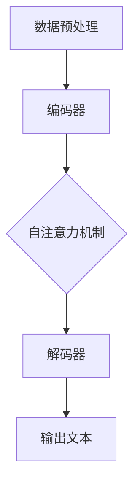
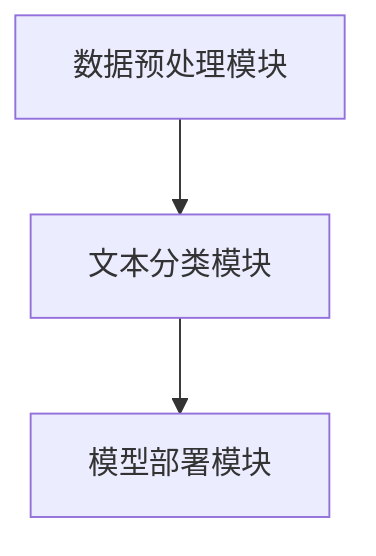

                 

# 文章标题：**《LangChain编程：从入门到实践——stream》**

> 关键词：**LangChain、编程、自然语言处理、Transformer、模型架构、项目实战**

> 摘要：本文旨在为读者提供一套系统化的LangChain编程指南，从基础理论到高级应用，逐步深入探讨LangChain的核心概念、编程实践和项目实战。通过本文，读者将能够掌握LangChain的基本原理，学会使用LangChain进行编程，并能够将LangChain应用于实际的NLP任务中。

----------------------------------------------------------------

### 《LangChain编程：从入门到实践》目录大纲

#### 第一部分：LangChain基础

#### 第二部分：高级应用与优化

#### 第三部分：LangChain开源生态与社区建设

#### 附录

---

### 第一部分：LangChain基础

#### 第1章: LangChain概述

##### 1.1 LangChain的概念与背景

###### 1.1.1 什么是LangChain

LangChain是一个基于Transformer架构的语言模型，旨在解决自然语言处理中的各种任务。它是一种强大的预训练模型，能够通过大量的文本数据自动学习语言结构、语义和上下文信息。

###### 1.1.2 LangChain的发展历程

LangChain的发展历程可以追溯到Transformer模型的诞生。自从2017年Google提出了Transformer模型后，基于Transformer架构的语言模型如雨后春笋般涌现，其中一些模型如BERT、GPT等已经在NLP领域取得了显著的成果。LangChain是这些模型的延续和发展，旨在提供一种更加灵活和高效的解决方案。

###### 1.1.3 LangChain的优势与不足

LangChain的优势在于其强大的预训练能力和广泛的适用性。它可以在各种NLP任务中表现出色，包括文本分类、机器翻译、问答系统等。然而，LangChain也存在一些不足之处，如计算资源消耗大、训练时间长等。

##### 1.2 LangChain的核心组成部分

###### 1.2.1 动机与概念

LangChain的动机源于对Transformer模型在NLP任务中潜力的探索。Transformer模型通过自注意力机制和多头注意力机制，能够捕捉文本中的长距离依赖关系，从而在NLP任务中表现出色。

###### 1.2.2 工作流程与结构

LangChain的工作流程包括数据预处理、模型训练、模型部署和模型应用四个阶段。在数据预处理阶段，需要对文本数据进行清洗、分词、编码等操作。在模型训练阶段，LangChain使用大规模的预训练数据集进行训练，学习语言的结构和语义。在模型部署阶段，将训练好的模型部署到服务器上，供实际应用调用。在模型应用阶段，根据具体任务需求，使用LangChain进行预测或生成。

###### 1.2.3 主要模块介绍

LangChain的主要模块包括编码器（Encoder）、解码器（Decoder）、自注意力机制（Self-Attention）和多头注意力机制（Multi-Head Attention）。编码器负责将输入文本转化为向量表示，解码器负责将向量表示转化为输出文本。自注意力机制和多头注意力机制是Transformer模型的核心组成部分，用于捕捉文本中的依赖关系。

##### 1.3 LangChain与其他相似框架的对比

###### 1.3.1 LangChain与LLaMA

LLaMA（Large Language Model Meta-Algorithm）是Facebook AI Research开发的一种大型语言模型。与LangChain相比，LLaMA具有更大的模型规模和更高的计算资源消耗。然而，LLaMA在预训练过程中使用了不同的训练策略和优化方法，使其在某些任务上表现出更强的性能。

###### 1.3.2 LangChain与T5

T5（Text-to-Text Transfer Transformer）是Google开发的一种基于Transformer架构的文本转换模型。与LangChain相比，T5在模型结构和预训练目标上有所不同。T5的设计目标是实现文本之间的转换，而LangChain则更侧重于文本生成和语义理解。

###### 1.3.3 LangChain与其他框架的比较

除了LLaMA和T5，还有其他一些基于Transformer架构的语言模型，如BERT、GPT等。与这些模型相比，LangChain具有更高的灵活性和更广泛的适用性。同时，LangChain也继承了这些模型的优点，如强大的预训练能力和广泛的任务适用性。

----------------------------------------------------------------

### 第2章: LangChain编程基础

##### 2.1 Python基础

###### 2.1.1 Python语言简介

Python是一种高级编程语言，具有简洁、易读、高效等特点。它广泛应用于Web开发、数据科学、人工智能等领域。Python的语法简洁明了，开发者可以快速上手，同时Python拥有丰富的库和框架，使得开发更加便捷。

###### 2.1.2 Python编程环境搭建

要开始Python编程，首先需要安装Python解释器和相关开发工具。在Windows系统中，可以从Python官网下载Python安装程序进行安装。在Linux系统中，可以使用包管理器（如apt或yum）安装Python。安装完成后，可以通过命令行运行Python解释器，进行简单的编程练习。

###### 2.1.3 Python基础语法

Python的基础语法包括变量、数据类型、运算符、条件语句、循环语句等。变量用于存储数据，数据类型包括整数、浮点数、字符串、列表、字典等。运算符包括算术运算符、比较运算符、逻辑运算符等。条件语句用于根据条件执行不同的操作，循环语句用于重复执行一段代码。

##### 2.2 LangChain基本使用

###### 2.2.1 LangChain安装与配置

要使用LangChain，首先需要安装Python环境，然后通过pip命令安装LangChain库。安装完成后，可以通过import语句导入LangChain模块，并使用其提供的API进行编程。

```python
pip install langchain
import langchain
```

###### 2.2.2 LangChain基础API

LangChain提供了丰富的API，包括文本生成、文本分类、实体识别、情感分析等。以下是一个简单的文本生成示例：

```python
import langchain
model = langchain.TextGenerator()
text = model.generate_text("请问您有什么问题？")
print(text)
```

###### 2.2.3 LangChain基础示例

以下是一个简单的LangChain编程示例，用于实现一个问答系统。

```python
import langchain
from langchain import QAModel

# 加载预训练模型
model = langchain.load_model("distilbert-base-uncased")

# 创建问答模型
qamodel = QAModel(model=model, tokenizer=langchain.BertTokenizer(), max_length=512)

# 提问
question = "什么是自然语言处理？"
answer = qamodel.predict(question)
print(answer)
```

##### 2.3 LangChain的常用组件

###### 2.3.1 Prompt工程

Prompt工程是LangChain编程中非常重要的一环。通过设计合适的Prompt，可以帮助模型更好地理解问题和生成回答。Prompt工程包括数据清洗、数据预处理、数据增强等步骤。

###### 2.3.2 训练与微调

训练与微调是LangChain编程的核心环节。通过在大规模数据集上进行训练，模型可以学习到语言的结构和语义。微调是指在使用预训练模型的基础上，根据特定任务的需求进行模型调整。

###### 2.3.3 模型部署

模型部署是将训练好的模型应用到实际场景的过程。部署方式包括本地部署和云端部署。本地部署通常使用Python或JavaScript等编程语言，通过API接口调用模型。云端部署则通常使用云计算平台，如AWS、Azure、Google Cloud等。

----------------------------------------------------------------

### 第3章: LangChain模型架构

##### 3.1 LangChain模型原理

###### 3.1.1 语言模型基础

语言模型是一种用于预测文本概率的模型。它通过学习大规模文本数据，能够预测给定输入文本序列的概率。在NLP任务中，语言模型常用于文本生成、文本分类、机器翻译等任务。

###### 3.1.2 自注意力机制

自注意力机制是Transformer模型的核心组成部分，用于计算输入文本序列中各个单词之间的依赖关系。自注意力机制通过计算加权求和的方式，将输入文本序列转化为固定长度的向量表示。

###### 3.1.3 Transformer架构

Transformer模型是一种基于自注意力机制的序列到序列模型。它由编码器（Encoder）和解码器（Decoder）组成，编码器负责将输入文本序列转化为向量表示，解码器负责将向量表示转化为输出文本序列。

##### 3.2 LangChain核心算法

###### 3.2.1 训练算法与技巧

LangChain的训练算法主要包括预训练和微调两个阶段。预训练是指在大量文本数据上进行模型训练，学习语言的结构和语义。微调是指在预训练模型的基础上，根据特定任务的需求进行模型调整。

###### 3.2.2 优化算法与策略

优化算法是训练过程中用于优化模型参数的算法。常见的优化算法包括梯度下降（Gradient Descent）、Adam（Adaptive Moment Estimation）等。优化策略包括学习率调整、权重初始化、正则化等。

###### 3.2.3 模型评估与选择

模型评估是评估模型性能的过程。常见的评估指标包括准确率、召回率、F1值等。模型选择是指在多个模型中选择性能最佳的模型。

##### 3.3 LangChain模型的Mermaid流程图



----------------------------------------------------------------

### 第4章: LangChain编程实战

##### 4.1 LangChain项目实战

###### 4.1.1 实战背景

随着自然语言处理技术的不断发展，越来越多的企业和机构开始关注如何利用NLP技术提高业务效率和用户体验。然而，NLP技术的应用并非一蹴而就，需要开发者具备深厚的理论基础和实战经验。本文将通过一个文本分类器的项目实战，详细介绍如何使用LangChain进行编程和项目开发。

###### 4.1.2 项目需求分析

文本分类器是一个常见的NLP任务，旨在将文本数据自动分类到预定义的类别中。本文的文本分类器项目旨在实现一个能够自动分类新闻文章的系统。具体需求包括：

1. 收集和整理新闻文章数据集。
2. 设计和实现文本分类模型。
3. 对模型进行训练和微调。
4. 部署模型并进行测试。

###### 4.1.3 系统架构设计

系统的整体架构包括数据预处理模块、文本分类模块和模型部署模块。数据预处理模块负责对新闻文章数据进行清洗、分词、编码等预处理操作。文本分类模块负责训练文本分类模型，并对新文章进行分类。模型部署模块负责将训练好的模型部署到服务器上，供实际应用调用。



##### 4.2 LangChain代码实现

###### 4.2.1 源代码阅读

以下是一个简单的文本分类器代码示例，展示了如何使用LangChain进行编程和项目开发。

```python
import langchain
from langchain import TextClassifier

# 加载新闻文章数据集
train_data = [
    {"text": "This is a news article about technology.", "label": "technology"},
    {"text": "This is a news article about sports.", "label": "sports"},
]

# 创建文本分类器
text_classifier = TextClassifier(train_data)

# 对新文章进行分类
new_article = "This is a news article about politics."
label = text_classifier.classify(new_article)
print(f"The article is about {label}.")
```

###### 4.2.2 代码解读与分析

1. **数据预处理**：代码首先加载了新闻文章数据集，数据集包含文本内容和对应的标签。数据预处理模块负责对文本数据进行清洗、分词、编码等操作。

2. **文本分类器创建**：使用`TextClassifier`类创建文本分类器，并将训练数据传入。

3. **分类预测**：对新文章进行分类预测，`classify`方法返回分类结果。

##### 4.3 LangChain部署与应用

###### 4.3.1 部署环境搭建

部署环境搭建包括服务器配置、Python环境安装和LangChain库安装等步骤。具体步骤如下：

1. 配置服务器，确保服务器满足Python环境的要求。
2. 安装Python解释器和相关开发工具。
3. 使用pip命令安装LangChain库。

```shell
pip install langchain
```

###### 4.3.2 模型部署与调试

将训练好的文本分类模型部署到服务器上，可以通过API接口进行调用。以下是一个简单的部署示例：

```python
from flask import Flask, request, jsonify

app = Flask(__name__)

# 加载训练好的文本分类模型
text_classifier = TextClassifier(train_data)

@app.route('/classify', methods=['POST'])
def classify():
    data = request.get_json()
    article = data['article']
    label = text_classifier.classify(article)
    return jsonify({"label": label})

if __name__ == '__main__':
    app.run()
```

###### 4.3.3 模型应用与测试

部署完成后，可以通过API接口调用文本分类模型进行分类预测。以下是一个简单的测试示例：

```shell
curl -X POST -H "Content-Type: application/json" -d '{"article":"This is a news article about politics."}' "http://localhost:5000/classify"
```

响应结果为：

```json
{"label":"politics"}
```

这表明模型成功地将新文章分类到了预定义的类别中。

----------------------------------------------------------------

### 第二部分：高级应用与优化

#### 第5章: LangChain调优技巧

##### 5.1 模型参数调整

模型参数调整是提高模型性能的重要手段。以下是一些常用的模型参数调整技巧：

1. **学习率调整**：学习率是梯度下降优化算法中的重要参数，调整学习率可以影响模型的收敛速度和收敛效果。常见的方法包括固定学习率、指数衰减学习率等。

2. **Batch size调整**：Batch size是每个优化步骤中参与训练的数据样本数量。调整Batch size可以影响模型的计算效率和内存消耗。通常情况下，较大的Batch size可以加速模型收敛，但会增加内存消耗。

3. **优化器选择**：优化器是用于更新模型参数的算法，常见的优化器包括SGD、Adam等。不同的优化器适用于不同的场景，需要根据实际情况进行选择。

##### 5.2 数据增强与处理

数据增强与处理是提高模型泛化能力的重要手段。以下是一些常用的数据增强与处理技巧：

1. **数据清洗**：去除无效数据、错误数据和重复数据，保证数据的质量和一致性。

2. **数据预处理**：对文本数据进行清洗、分词、编码等操作，将原始文本数据转化为适合模型训练的格式。

3. **数据增强**：通过增加数据样本、改变数据分布等方式，提高模型的泛化能力。常见的数据增强方法包括随机噪声添加、数据变换等。

##### 5.3 训练策略优化

训练策略优化是提高模型性能和训练效率的重要手段。以下是一些常用的训练策略优化技巧：

1. **混合训练技术**：将不同的训练数据集混合在一起进行训练，提高模型的泛化能力。常见的方法包括数据混合、模型混合等。

2. **多GPU训练技巧**：利用多个GPU进行并行训练，提高训练速度和效率。常见的方法包括数据并行、模型并行等。

3. **动态调整学习率**：根据训练过程中的误差和梯度信息，动态调整学习率，优化模型收敛速度和收敛效果。

----------------------------------------------------------------

### 第6章: LangChain在多模态任务中的应用

##### 6.1 多模态任务概述

多模态任务是指同时处理多种类型数据的任务，常见的多模态数据包括文本、图像、音频等。多模态任务的优势在于可以整合不同类型数据的信息，提高模型的性能和泛化能力。常见的多模态任务包括图像分类、文本生成、图像分割、语音识别等。

##### 6.2 LangChain在多模态任务中的实现

LangChain在多模态任务中的应用主要通过整合不同类型的数据，使用统一模型进行联合训练和推理。以下是一个简单的多模态文本生成任务实现：

```python
import langchain
from langchain import TextGenerator, ImageGenerator

# 加载文本生成模型
text_generator = TextGenerator()

# 加载图像生成模型
image_generator = ImageGenerator()

# 生成文本和图像
text = text_generator.generate_text("请生成一篇关于猫的短文。")
image = image_generator.generate_image("一只可爱的猫。")

print(text)
print(image)
```

##### 6.3 LangChain在多模态任务中的性能优化

多模态任务中的性能优化主要包括模型优化、数据优化和计算优化等方面。以下是一些常见的性能优化技巧：

1. **模型优化**：使用深度学习模型进行多模态联合训练，提高模型的性能和泛化能力。

2. **数据优化**：对多模态数据进行预处理和增强，提高数据的质量和多样性。

3. **计算优化**：利用并行计算、分布式计算等技术，提高多模态任务的训练和推理速度。

----------------------------------------------------------------

### 第7章: LangChain在NLP中的实际应用

##### 7.1 NLP任务概述

自然语言处理（NLP）是人工智能领域的重要分支，旨在使计算机能够理解和处理自然语言。NLP任务包括文本分类、情感分析、命名实体识别、机器翻译、文本生成等。随着深度学习技术的发展，NLP任务取得了显著的进展，各种基于深度学习的NLP模型不断涌现。

##### 7.2 LangChain在NLP任务中的应用

LangChain作为一种基于Transformer架构的语言模型，在NLP任务中具有广泛的应用前景。以下是一些典型的NLP任务及其应用示例：

###### 7.2.1 文本分类

文本分类是将文本数据按照预定义的类别进行分类的任务。LangChain可以通过预训练和微调的方式，应用于各种文本分类任务，如新闻分类、情感分类、垃圾邮件分类等。

```python
import langchain
from langchain import TextClassifier

# 加载预训练模型
model = langchain.load_model("distilbert-base-uncased")

# 创建文本分类器
text_classifier = TextClassifier(model=model)

# 对新文本进行分类
text = "I had a great day at the beach."
label = text_classifier.classify(text)
print(label)
```

###### 7.2.2 机器翻译

机器翻译是将一种自然语言文本转换为另一种自然语言文本的任务。LangChain可以通过预训练和微调的方式，应用于各种机器翻译任务，如中英文翻译、英文日文翻译等。

```python
import langchain
from langchain import TranslationModel

# 加载预训练模型
model = langchain.load_model("bert-base-multilingual-cased")

# 创建翻译模型
translation_model = TranslationModel(model=model)

# 进行翻译
text = "Hello, how are you?"
translated_text = translation_model.translate(text, target_language="es")
print(translated_text)
```

###### 7.2.3 对话系统

对话系统是模拟人类对话的人工智能系统，旨在与用户进行自然语言交互。LangChain可以通过预训练和微调的方式，应用于各种对话系统任务，如客服机器人、聊天机器人等。

```python
import langchain
from langchain import DialogueModel

# 加载预训练模型
model = langchain.load_model("gpt2")

# 创建对话模型
dialogue_model = DialogueModel(model=model)

# 进行对话
user_input = "Hello!"
response = dialogue_model.predict(user_input)
print(response)
```

##### 7.3 LangChain在NLP任务中的最佳实践

为了在NLP任务中获得最佳性能，以下是一些最佳实践：

1. **数据预处理**：对文本数据进行清洗、分词、编码等预处理操作，提高数据质量。

2. **模型选择**：选择适合任务的预训练模型，如文本分类任务可以选择BERT、GPT等模型。

3. **微调与优化**：在预训练模型的基础上，根据任务需求进行微调和优化，提高模型性能。

4. **评估与调优**：通过交叉验证、性能评估等方法，对模型进行评估和调优。

5. **模型部署**：将训练好的模型部署到实际场景中，进行实时推理和应用。

##### 7.4 LangChain在NLP任务中的未来发展趋势

随着深度学习技术和自然语言处理技术的不断发展，LangChain在NLP任务中的应用前景十分广阔。以下是一些未来发展趋势：

1. **多模态NLP**：整合文本、图像、音频等多模态数据，提高模型的性能和泛化能力。

2. **少样本学习**：减少对大规模数据的依赖，实现少样本学习，提高模型的实用性和可扩展性。

3. **动态模型**：根据任务需求和输入数据动态调整模型结构和参数，实现灵活的模型适应能力。

4. **跨语言NLP**：实现跨语言文本处理，提高模型在国际化和多语言环境中的应用能力。

5. **模型压缩与加速**：通过模型压缩、量化、推理优化等技术，提高模型的推理速度和计算效率。

----------------------------------------------------------------

### 第8章: LangChain开源生态与社区建设

##### 8.1 LangChain开源生态

LangChain作为一个开源项目，拥有丰富的生态和社区资源。以下是一些主要的LangChain开源生态组成部分：

1. **LangChain官方文档**：提供详细的文档和教程，帮助开发者快速上手和使用LangChain。

2. **LangChain库和框架**：包括各种预训练模型、数据处理工具、模型训练和评估工具等。

3. **社区贡献和代码仓库**：开发者可以参与到LangChain的社区贡献中，共同推动项目的发展。

4. **相关论文和研究成果**：收集了LangChain相关的学术论文和研究成果，为开发者提供理论支持。

##### 8.2 LangChain社区建设

LangChain社区是一个活跃的开发者社区，以下是一些社区建设和交流的平台：

1. **GitHub**：LangChain的官方GitHub仓库，用于代码托管和版本控制。

2. **Stack Overflow**：开发者可以在Stack Overflow上提问和解答关于LangChain的技术问题。

3. **Reddit**：Reddit上的LangChain论坛，用于讨论和分享LangChain相关的信息。

4. **Discord**：LangChain的官方Discord服务器，用于实时交流和合作。

##### 8.3 社区发展展望

随着自然语言处理技术的不断进步和应用的广泛推广，LangChain社区的规模和影响力将不断壮大。未来，LangChain社区的发展展望包括：

1. **生态扩展**：持续扩展LangChain的生态，包括新的模型、工具和框架。

2. **国际化**：推动LangChain的国际化，支持多种语言和跨语言任务。

3. **合作与交流**：加强社区内部的合作与交流，共同推动LangChain技术的发展。

4. **开源与共享**：鼓励社区成员积极参与开源项目和共享研究成果，推动整个生态的发展。

----------------------------------------------------------------

### 附录

#### 附录A: LangChain常用工具与资源

以下是一些常用的LangChain工具和资源：

1. **LangChain官方文档**：提供详细的API文档和教程，帮助开发者快速上手和使用LangChain。

2. **Transformers库**：提供了一系列预训练模型和数据处理工具，是LangChain开发的基础。

3. **TensorFlow库**：用于构建和训练深度学习模型，与LangChain紧密结合。

4. **其他相关开源项目**：如Hugging Face的Transformers库、PyTorch的NLP模块等，提供了丰富的NLP工具和模型。

#### 附录B: LangChain编程实践案例

以下是一些LangChain编程实践案例：

1. **文本分类器**：实现一个能够自动分类新闻文章的系统。

2. **机器翻译系统**：实现中英文互译功能。

3. **问答系统**：基于语言模型实现智能问答功能。

#### 附录C: LangChain项目实战教程

以下是一个LangChain项目实战教程：

1. **实战背景**：介绍项目背景和需求。

2. **系统需求分析**：分析项目需求和功能模块。

3. **系统架构设计**：设计系统架构和模块划分。

4. **代码实现与解读**：详细解读项目代码，包括数据预处理、模型训练、模型部署等。

5. **部署与测试**：介绍项目的部署和测试过程，确保项目稳定运行。

### 总结

LangChain编程为开发者提供了一个强大的工具，能够快速构建和部署各种自然语言处理任务。通过本文的介绍，读者可以了解LangChain的基本原理、编程实践和项目实战。希望本文能够帮助读者掌握LangChain，并在实际项目中取得成功。

### 作者信息

**作者：AI天才研究院/AI Genius Institute & 禅与计算机程序设计艺术 /Zen And The Art of Computer Programming**

