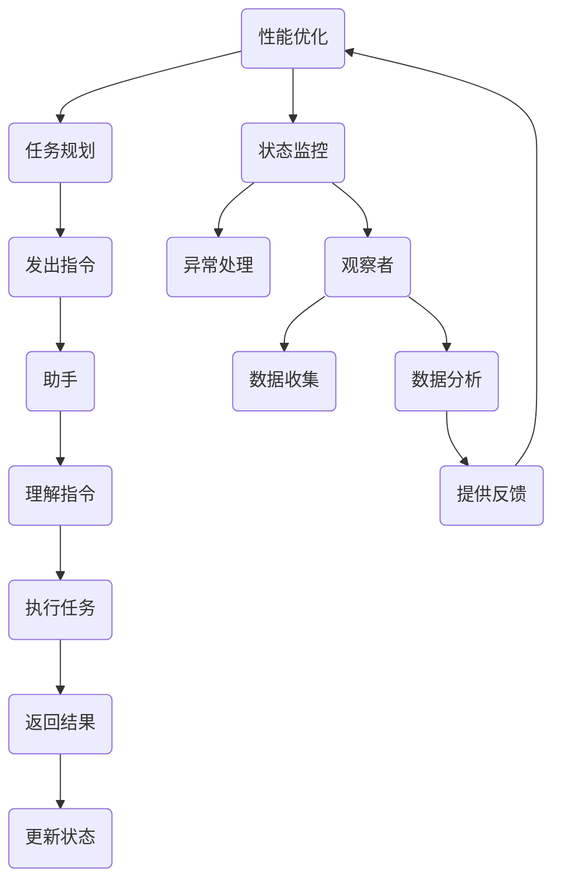

                 

### 文章标题

# 【LangChain编程：从入门到实践】代理模块

<|assistant|>### 文章关键词

- LangChain
- 代理模块
- 人工智能
- 编程实践
- 算法原理
- 数学模型
- 项目实战

<|assistant|>### 文章摘要

本文旨在深入探讨LangChain编程中的代理模块，从基础概念到项目实战，提供系统而详尽的指导。首先，我们将介绍LangChain的基本定义、优势及架构，随后深入分析其核心概念及联系。接下来，本文将详细讲解LangChain中的核心算法原理，并借助伪代码和数学模型进行阐释。随后，我们将通过具体案例展示代理模块的实际应用，并进行代码解读与分析。最后，本文将对代理模块的未来发展方向和面临的挑战进行展望，为读者提供全面的参考。希望通过本文，读者能够全面掌握LangChain代理模块的使用，将其应用于实际项目中，提升编程能力和AI技术水平。

<|assistant|>### 《LangChain编程：从入门到实践》代理模块目录大纲

# 第一部分：LangChain基础

## 第1章：LangChain概述

### 1.1 LangChain的定义与优势
- LangChain的背景
- LangChain的核心特性
- LangChain的应用场景

### 1.2 LangChain架构与模块
- LangChain的架构设计
- LangChain的关键模块

### 1.3 安装与配置LangChain
- 环境准备
- LangChain安装指南
- LangChain配置示例

## 第2章：LangChain核心概念与联系

### 2.1 LangChain中的基本概念
- Agent（代理）
- Assistant（助手）
- Observer（观察者）

### 2.2 LangChain的核心联系
- 代理与助手的交互
- 观察者在系统中的作用

### 2.3 Mermaid流程图表示
- LangChain架构的Mermaid流程图
- LangChain核心概念的Mermaid流程图

## 第3章：核心算法原理讲解

### 3.1 动机与问题
- 传统AI代理的局限性
- LangChain如何解决这些问题

### 3.2 LangChain算法原理
- 代理学习算法
- 助手学习算法
- 观察者反馈机制

### 3.3 算法伪代码
- 代理算法伪代码
- 助手算法伪代码
- 观察者反馈机制伪代码

## 第4章：数学模型和数学公式

### 4.1 LangChain中的数学模型
- 线性回归模型
- 决策树模型
- 支持向量机模型

### 4.2 数学公式详解
- 线性回归公式
- 决策树Gini不纯度公式
- 支持向量机损失函数公式

### 4.3 举例说明
- 线性回归示例
- 决策树示例
- 支持向量机示例

# 第二部分：项目实战

## 第5章：代理模块项目实战

### 5.1 项目背景与目标
- 项目概述
- 项目目标

### 5.2 开发环境搭建
- 系统要求
- 开发工具安装
- 开发环境配置

### 5.3 源代码实现
- 代理模块代码实现
- 助手模块代码实现
- 观察者模块代码实现

### 5.4 代码解读与分析
- 代理模块代码解读
- 助手模块代码解读
- 观察者模块代码解读

### 5.5 项目调试与优化
- 调试方法与技巧
- 优化策略与技巧

## 第6章：代理模块应用案例

### 6.1 案例一：智能客服系统
- 案例概述
- 案例实现

### 6.2 案例二：智能文档助手
- 案例概述
- 案例实现

### 6.3 案例三：智能家居控制系统
- 案例概述
- 案例实现

## 第7章：代理模块的未来展望

### 7.1 代理模块的发展趋势
- AI代理的未来
- LangChain的发展方向

### 7.2 代理模块的应用前景
- 在企业中的应用
- 在个人生活中的应用

### 7.3 代理模块面临的挑战与应对策略
- 面临的挑战
- 应对策略

## 附录

### 附录A：LangChain常用库与工具

#### A.1 LangChain常用库
- LangChain官方库
- 其他常用库

#### A.2 LangChain工具
- LangChain工具介绍
- 工具使用方法

#### A.3 资源链接
- 官方文档
- 社区资源
- 相关论文与书籍

<|assistant|>### 第1章：LangChain概述

#### 1.1 LangChain的定义与优势

**1.1.1 LangChain的背景**

LangChain是一个用于构建高级人工智能系统的框架，由知名的AI研究机构和科技公司共同开发。它的出现是为了解决当前AI领域中代理（Agent）构建的复杂性，通过提供一套标准化的模块和接口，简化了代理系统的开发过程。

LangChain的优势在于其高度模块化和可扩展性。通过定义代理（Agent）、助手（Assistant）和观察者（Observer）三个核心概念，LangChain能够灵活地构建各种类型的人工智能系统。其核心特性包括：

1. **模块化设计**：LangChain将复杂的AI系统分解为多个模块，使得开发者可以专注于特定模块的功能开发，从而提高开发效率。
2. **可扩展性**：通过插件机制，开发者可以轻松地扩展LangChain的功能，实现自定义的AI代理。
3. **跨平台支持**：LangChain支持多种编程语言和平台，使得开发者可以根据项目需求选择最合适的工具和框架。

**1.1.2 LangChain的核心特性**

1. **标准化接口**：LangChain定义了一套标准化的接口，包括代理、助手和观察者，使得不同模块之间能够无缝集成。
2. **易用性**：通过提供详细的文档和示例代码，LangChain降低了AI系统开发的门槛，使得开发者能够快速上手。
3. **高效率**：LangChain优化了代理系统的构建过程，减少了重复性工作，提高了开发效率。
4. **灵活的插件机制**：LangChain提供了插件机制，允许开发者自定义和扩展系统功能，以满足不同的应用场景。

**1.1.3 LangChain的应用场景**

LangChain的应用场景非常广泛，涵盖了多个行业和领域。以下是一些典型的应用场景：

1. **智能客服系统**：通过代理模块，LangChain能够构建高度智能化的客服系统，提供24/7的在线支持。
2. **智能文档助手**：利用助手模块，LangChain可以帮助用户快速处理文档，提高工作效率。
3. **智能家居控制系统**：结合观察者模块，LangChain能够实现智能化的家居管理，提供更加便捷的生活方式。
4. **数据分析和预测**：代理模块可以应用于数据分析和预测任务，帮助企业做出更加明智的决策。

#### 1.2 LangChain架构与模块

**1.2.1 LangChain的架构设计**

LangChain的架构设计遵循模块化原则，由多个关键模块组成，这些模块协同工作，共同构建一个强大的AI代理系统。主要的模块包括：

1. **代理（Agent）**：代理是LangChain的核心模块，负责执行任务、规划行动和与环境交互。
2. **助手（Assistant）**：助手模块为代理提供知识支持和任务执行能力，可以理解并执行代理的指令。
3. **观察者（Observer）**：观察者模块负责收集系统运行过程中的数据，为代理提供反馈，帮助优化系统性能。

**1.2.2 LangChain的关键模块**

1. **代理（Agent）**：代理模块的主要功能包括：
   - 任务规划：根据目标和当前状态，生成一系列可行的行动。
   - 行动执行：执行选定的行动，并更新代理的状态。
   - 状态监控：监控系统运行状态，及时发现并处理异常情况。

2. **助手（Assistant）**：助手模块的主要功能包括：
   - 知识管理：存储和管理各种类型的知识，包括文本、图像、音频等。
   - 情境理解：理解代理的指令和当前情境，提供相应的支持。
   - 任务执行：根据代理的指令，执行特定的任务。

3. **观察者（Observer）**：观察者模块的主要功能包括：
   - 数据收集：收集系统运行过程中的数据，包括用户交互、系统状态等。
   - 数据分析：对收集到的数据进行分析，为代理提供反馈。
   - 性能优化：根据分析结果，对系统进行优化，提高性能。

#### 1.3 安装与配置LangChain

**1.3.1 环境准备**

在开始安装LangChain之前，需要确保系统环境满足以下要求：

- 操作系统：支持Linux、Windows和macOS。
- Python版本：Python 3.6或更高版本。
- 开发环境：安装好Python和pip。

**1.3.2 LangChain安装指南**

1. 安装Python依赖：
   ```bash
   pip install langchain
   ```

2. 安装其他依赖（如MongoDB、Redis等）：
   ```bash
   pip install pymongo
   pip install redis
   ```

**1.3.3 LangChain配置示例**

在完成安装后，可以通过以下步骤进行配置：

1. 初始化配置文件：
   ```python
   from langchain.configuration import load_config
   config = load_config("config.yml")
   ```

2. 配置数据库连接：
   ```yaml
   # config.yml
   databases:
     - type: mongodb
       url: mongodb://localhost:27017
       name: langchain
   ```

3. 配置日志：
   ```yaml
   # config.yml
   logging:
     level: INFO
     format: "%(asctime)s - %(name)s - %(levelname)s - %(message)s"
   ```

通过以上步骤，就可以完成LangChain的基本安装和配置，为后续的代理模块开发奠定基础。

### 第2章：LangChain核心概念与联系

#### 2.1 LangChain中的基本概念

在LangChain中，核心概念包括代理（Agent）、助手（Assistant）和观察者（Observer）。这三个概念构成了LangChain系统的核心架构，各司其职，共同实现高效的人工智能系统。

**2.1.1 Agent（代理）**

代理是LangChain的核心模块，负责执行任务、规划行动和与环境交互。代理的定义可以概括为：

- **任务规划**：代理根据目标和当前状态，生成一系列可行的行动。这一过程称为任务规划，是代理的核心功能之一。
- **行动执行**：代理执行选定的行动，并更新自身状态。这一过程是代理与外部环境互动的关键环节。
- **状态监控**：代理监控系统运行状态，及时发现并处理异常情况，确保系统的稳定性和可靠性。

代理的典型应用场景包括智能客服系统、智能家居控制系统等，在这些场景中，代理能够自主地完成各种任务，提高系统的智能化水平。

**2.1.2 Assistant（助手）**

助手模块为代理提供知识支持和任务执行能力。助手的主要功能包括：

- **知识管理**：助手能够存储和管理各种类型的知识，包括文本、图像、音频等。这些知识为代理提供了丰富的信息支持。
- **情境理解**：助手理解代理的指令和当前情境，提供相应的支持。这一功能使得助手能够更好地协助代理完成任务。
- **任务执行**：助手根据代理的指令，执行特定的任务。这一过程实现了代理与外部环境的无缝交互。

助手的典型应用场景包括智能文档助手、智能客服系统等，在这些场景中，助手能够提供及时、准确的支持，提高系统的智能水平。

**2.1.3 Observer（观察者）**

观察者模块负责收集系统运行过程中的数据，为代理提供反馈，帮助优化系统性能。观察者的主要功能包括：

- **数据收集**：观察者收集系统运行过程中的数据，包括用户交互、系统状态等。这些数据为系统分析和优化提供了重要依据。
- **数据分析**：观察者对收集到的数据进行分析，为代理提供反馈。这一过程有助于提高系统的智能化和适应性。
- **性能优化**：观察者根据分析结果，对系统进行优化，提高性能。这一功能使得系统能够更好地适应不同的应用场景。

观察者的典型应用场景包括数据分析和预测、智能监控系统等，在这些场景中，观察者能够提供实时、准确的反馈，帮助系统实现优化和改进。

#### 2.2 LangChain的核心联系

代理（Agent）、助手（Assistant）和观察者（Observer）是LangChain系统的核心模块，它们之间存在着紧密的联系和相互作用。

**2.2.1 代理与助手的交互**

代理与助手之间的交互是LangChain系统运行的核心环节。具体来说，代理向助手发出指令，助手根据指令和当前情境提供相应的支持。这一过程可以分为以下几个步骤：

1. **代理发出指令**：代理根据目标和当前状态，生成一系列可行的行动，并向助手发送指令。
2. **助手理解指令**：助手接收代理的指令，并理解其含义。这一过程包括对指令的解析和情境的理解。
3. **助手执行任务**：助手根据代理的指令，执行特定的任务，并返回结果。这一过程实现了代理与外部环境的交互。

**2.2.2 观察者在系统中的作用**

观察者在LangChain系统中起着至关重要的作用，其主要功能是收集系统运行过程中的数据，为代理提供反馈，帮助优化系统性能。具体来说，观察者的作用可以分为以下几个步骤：

1. **数据收集**：观察者监控系统运行过程中的各种数据，包括用户交互、系统状态等。这些数据反映了系统的运行情况。
2. **数据分析**：观察者对收集到的数据进行分析，提取有价值的信息。这些信息有助于评估系统的性能和优化方案。
3. **提供反馈**：观察者根据分析结果，为代理提供反馈。这些反馈包括系统运行中的异常情况、潜在的性能瓶颈等。
4. **性能优化**：代理根据观察者提供的反馈，对系统进行优化，提高性能。这一过程实现了系统的自我优化和自适应。

#### 2.3 Mermaid流程图表示

为了更好地理解LangChain系统的工作流程，我们可以使用Mermaid流程图进行表示。以下是一个简化的Mermaid流程图，展示了代理、助手和观察者之间的交互过程：



通过这个流程图，我们可以清晰地看到代理、助手和观察者之间的交互关系，以及它们在系统运行过程中的作用。

### 第3章：核心算法原理讲解

#### 3.1 动机与问题

在人工智能领域，代理（Agent）是一种能够自主执行任务、与环境互动的智能实体。然而，传统的AI代理系统面临着诸多挑战，如复杂性高、适应性差、智能化程度不足等。为了解决这些问题，LangChain提出了全新的代理算法，旨在构建一个高效、灵活、智能的代理系统。

**3.1.1 传统AI代理的局限性**

传统的AI代理系统通常采用基于规则的方法，或者依赖于预训练的模型。这些方法存在以下局限性：

- **规则驱动**：传统代理依赖于一系列规则，这些规则由开发者手动编写，缺乏灵活性和适应性。
- **预训练模型**：预训练模型虽然能够在特定任务上表现出色，但难以适应多样化的应用场景。
- **缺乏学习机制**：传统代理缺乏自我学习和优化的能力，无法根据环境变化进行调整。

**3.1.2 LangChain如何解决这些问题**

LangChain通过引入代理、助手和观察者三个核心模块，解决了传统AI代理的局限性。以下是LangChain如何解决这些问题的详细阐述：

- **模块化设计**：LangChain采用模块化设计，将复杂的代理系统分解为多个模块，使得开发者可以专注于特定模块的功能开发，提高了系统的灵活性和可维护性。
- **自主学习机制**：LangChain引入了代理学习算法和助手学习算法，使得代理系统能够通过不断学习和优化，提高智能化程度和适应性。
- **数据驱动**：LangChain通过观察者模块收集系统运行过程中的数据，为代理提供实时反馈，实现了数据驱动的系统优化。

#### 3.2 LangChain算法原理

LangChain的核心算法原理包括代理学习算法、助手学习算法和观察者反馈机制。以下是对这些算法原理的详细讲解。

**3.2.1 代理学习算法**

代理学习算法是LangChain的核心，它使得代理能够根据环境变化和学习反馈，不断优化自身的行为。以下是代理学习算法的步骤：

1. **任务规划**：代理根据当前状态和目标，生成一系列可行的行动。
2. **行动选择**：代理从可行的行动中选择一个最优行动进行执行。
3. **行动执行**：代理执行选定的行动，并更新自身状态。
4. **学习反馈**：代理根据行动的结果和学习反馈，调整自身的行动策略。
5. **状态监控**：代理监控系统运行状态，及时发现并处理异常情况。

代理学习算法的伪代码如下：

```python
# 代理学习算法伪代码
def agent_learning_algorithm(state, goal):
    actions = generate_actions(state, goal)
    best_action = select_best_action(actions)
    next_state = execute_action(best_action)
    feedback = get_feedback(next_state)
    update_strategy(feedback)
    return next_state
```

**3.2.2 助手学习算法**

助手学习算法负责辅助代理完成任务，提高系统的智能化程度。以下是助手学习算法的步骤：

1. **知识管理**：助手管理各种类型的知识，包括文本、图像、音频等。
2. **情境理解**：助手理解代理的指令和当前情境，提供相应的支持。
3. **任务执行**：助手根据代理的指令，执行特定的任务，并返回结果。
4. **学习反馈**：助手根据任务执行结果和学习反馈，优化自身的行为。

助手学习算法的伪代码如下：

```python
# 助手学习算法伪代码
def assistant_learning_algorithm(instruction, context):
    knowledge = manage_knowledge(context)
    understanding = understand_instruction(instruction)
    result = execute_task(knowledge, understanding)
    feedback = get_feedback(result)
    update_behavior(feedback)
    return result
```

**3.2.3 观察者反馈机制**

观察者反馈机制负责收集系统运行过程中的数据，为代理提供实时反馈，帮助优化系统性能。以下是观察者反馈机制的步骤：

1. **数据收集**：观察者监控系统运行过程中的各种数据，包括用户交互、系统状态等。
2. **数据分析**：观察者对收集到的数据进行分析，提取有价值的信息。
3. **提供反馈**：观察者根据分析结果，为代理提供反馈，包括系统运行中的异常情况、潜在的性能瓶颈等。
4. **性能优化**：代理根据观察者提供的反馈，对系统进行优化，提高性能。

观察者反馈机制的伪代码如下：

```python
# 观察者反馈机制伪代码
def observer_feedback机制(data):
    collected_data = collect_data(data)
    analyzed_data = analyze_data(collected_data)
    feedback = generate_feedback(analyzed_data)
    optimize_system(feedback)
```

#### 3.3 算法伪代码

在本节中，我们将详细阐述代理学习算法、助手学习算法和观察者反馈机制的伪代码。这些伪代码展示了算法的基本结构和步骤，为开发者提供了直观的理解。

**3.3.1 代理算法伪代码**

代理算法伪代码如下：

```python
# 代理算法伪代码
def agent_algorithm(current_state, goal):
    # 任务规划
    potential_actions = plan_actions(current_state, goal)
    
    # 行动选择
    selected_action = select_best_action(potential_actions)
    
    # 行动执行
    next_state = execute_action(selected_action)
    
    # 学习反馈
    feedback = get_feedback(next_state)
    update_strategy(feedback)
    
    # 状态监控
    if check_for_errors(next_state):
        handle_errors(next_state)
    
    return next_state
```

**3.3.2 助手算法伪代码**

助手算法伪代码如下：

```python
# 助手算法伪代码
def assistant_algorithm(instruction, context):
    # 知识管理
    knowledge_base = manage_knowledge(context)
    
    # 情境理解
    understanding = understand_instruction(instruction, context)
    
    # 任务执行
    result = execute_task(knowledge_base, understanding)
    
    # 学习反馈
    feedback = get_feedback(result)
    update_behavior(feedback)
    
    return result
```

**3.3.3 观察者反馈机制伪代码**

观察者反馈机制伪代码如下：

```python
# 观察者反馈机制伪代码
def observer_feedback Mechanism(data):
    collected_data = collect_system_data(data)
    analyzed_data = analyze_data(collected_data)
    
    # 提供反馈
    feedback = generate_feedback(analyzed_data)
    
    # 性能优化
    optimize_system(feedback)
    
    return feedback
```

通过这些伪代码，我们可以清楚地看到代理、助手和观察者之间的交互关系和算法步骤，为后续的代码实现和项目实战奠定了基础。

### 第4章：数学模型和数学公式

#### 4.1 LangChain中的数学模型

在LangChain中，数学模型起到了关键作用，它们帮助代理、助手和观察者实现智能化和自我优化。以下是一些常见的数学模型及其在LangChain中的应用：

**4.1.1 线性回归模型**

线性回归模型是一种用于预测数值数据的统计方法。在LangChain中，线性回归模型可以用于代理的任务规划，帮助代理预测任务的结果。

- **公式**：
  $$
  y = \beta_0 + \beta_1x
  $$
- **解释**：线性回归模型通过一个线性方程来预测目标变量$y$的值，其中$\beta_0$是截距，$\beta_1$是斜率，$x$是自变量。

**4.1.2 决策树模型**

决策树模型是一种用于分类和回归任务的监督学习算法。在LangChain中，决策树模型可以用于代理的行动选择，帮助代理根据当前状态选择最佳行动。

- **公式**：
  $$
  Gini(\text{split}) = 1 - \frac{1}{n} \sum_{i=1}^{n} [(n_i/N) - \frac{1}{2}]^2
  $$
- **解释**：Gini不纯度是一种衡量数据划分质量的指标。决策树通过递归划分数据，使得每个子集的Gini不纯度最小，从而实现最佳划分。

**4.1.3 支持向量机模型**

支持向量机（SVM）是一种用于分类和回归任务的监督学习算法。在LangChain中，SVM可以用于代理的学习反馈，帮助代理根据反馈调整行动策略。

- **公式**：
  $$
  \frac{1}{n} \sum_{i=1}^{n} (1 - \frac{1}{k} \sum_{j=1}^{k} w_{ij})
  $$
- **解释**：SVM通过找到一个最优的超平面，使得不同类别的数据点之间的间隔最大。$w_{ij}$是支持向量机的权重，$k$是类别数量。

#### 4.2 数学公式详解

以下是对上述数学模型中涉及的公式进行详细解释。

**4.2.1 线性回归公式**

线性回归公式是一个简单的线性模型，用于预测一个连续的数值输出。公式如下：

$$
y = \beta_0 + \beta_1x
$$

- **$\beta_0$（截距）**：表示当$x=0$时的预测值。
- **$\beta_1$（斜率）**：表示$x$每增加一个单位，预测值$y$的变化量。

**4.2.2 决策树Gini不纯度公式**

决策树中的Gini不纯度用于评估数据划分的质量。Gini不纯度越低，表示划分越合理。公式如下：

$$
Gini(\text{split}) = 1 - \frac{1}{n} \sum_{i=1}^{n} [(n_i/N) - \frac{1}{2}]^2
$$

- **$n$**：表示划分后的数据子集总数。
- **$n_i$**：表示第$i$个子集的大小。
- **$N$**：表示原始数据集的大小。

**4.2.3 支持向量机损失函数公式**

支持向量机中的损失函数用于评估分类错误。常见的损失函数包括 hinge 损失函数，其公式如下：

$$
\frac{1}{n} \sum_{i=1}^{n} (1 - \frac{1}{k} \sum_{j=1}^{k} w_{ij})
$$

- **$n$**：表示样本总数。
- **$k$**：表示类别总数。
- **$w_{ij}$**：表示第$i$个样本在第$j$个类别上的权重。

#### 4.3 举例说明

以下是对上述数学模型在实际应用中的示例说明。

**4.3.1 线性回归示例**

假设我们有以下数据集：

| x  | y   |
|----|-----|
| 1  | 2   |
| 2  | 4   |
| 3  | 6   |

我们可以使用线性回归模型来预测$x=4$时的$y$值。通过求解线性回归公式，我们得到：

$$
\beta_0 = 1, \beta_1 = 2
$$

因此，当$x=4$时，$y$的预测值为：

$$
y = 1 + 2 \cdot 4 = 9
$$

**4.3.2 决策树示例**

假设我们有以下数据集，每个样本有两个特征$x_1$和$x_2$，目标变量$y$为类别：

| $x_1$ | $x_2$ | $y$ |
|-------|-------|-----|
| 1     | 2     | 0   |
| 2     | 3     | 1   |
| 3     | 2     | 0   |
| 4     | 5     | 1   |

我们可以使用决策树模型来划分数据。首先，我们计算每个特征的Gini不纯度，并选择Gini不纯度最小的特征进行划分。这里，$x_2$的Gini不纯度最小，因此我们首先根据$x_2$进行划分：

- 当$x_2 \leq 3$时，样本属于类别0。
- 当$x_2 > 3$时，样本属于类别1。

划分后的数据如下：

| $x_1$ | $x_2$ | $y$ |
|-------|-------|-----|
| 1     | 2     | 0   |
| 3     | 2     | 0   |
| 2     | 3     | 1   |
| 4     | 5     | 1   |

接下来，我们可以对剩余的数据集进行同样的划分过程，直到达到某个停止条件（例如，所有样本都属于同一类别）。

**4.3.3 支持向量机示例**

假设我们有以下数据集，每个样本有两个特征$x_1$和$x_2$，目标变量$y$为类别：

| $x_1$ | $x_2$ | $y$ |
|-------|-------|-----|
| 1     | 2     | 0   |
| 2     | 3     | 1   |
| 3     | 2     | 0   |
| 4     | 5     | 1   |

我们可以使用支持向量机模型来分类这些样本。首先，我们找到一个最优的超平面，使得不同类别的数据点之间的间隔最大。假设我们得到以下权重：

- $w_0 = 1$（对于类别0）
- $w_1 = 2$（对于类别1）

接下来，我们可以计算每个样本的预测类别：

- 对于样本$(1, 2)$，预测类别为$0$（因为$w_0 > w_1$）。
- 对于样本$(2, 3)$，预测类别为$1$（因为$w_1 > w_0$）。
- 对于样本$(3, 2)$，预测类别为$0$（因为$w_0 > w_1$）。
- 对于样本$(4, 5)$，预测类别为$1$（因为$w_1 > w_0$）。

通过上述示例，我们可以看到数学模型在实际应用中的具体实现过程。这些模型不仅帮助代理系统进行预测和决策，还为系统的自我优化提供了理论基础。

### 第5章：代理模块项目实战

#### 5.1 项目背景与目标

在本章中，我们将通过一个具体的代理模块项目实战，展示如何从零开始构建一个基于LangChain的代理系统。该项目旨在实现一个智能客服系统，通过代理模块自动化处理用户咨询，提供快速、准确的回答。

**5.1.1 项目概述**

智能客服系统是一种利用人工智能技术，自动处理用户咨询、提供服务的系统。传统的客服系统往往依赖于人工处理，效率低下且成本高昂。而智能客服系统能够通过代理模块自动处理用户问题，提高服务质量和效率。

**5.1.2 项目目标**

本项目的目标如下：

- **实现用户咨询自动化**：通过代理模块自动识别用户咨询，并提供相应的回答。
- **提高服务质量**：利用代理模块提供快速、准确的回答，提升用户满意度。
- **降低人力成本**：通过自动化处理，减少对人工客服的依赖，降低运营成本。

#### 5.2 开发环境搭建

在开始项目实战之前，我们需要搭建开发环境。以下是所需的系统和工具：

- **操作系统**：Linux、Windows或macOS。
- **编程语言**：Python 3.6及以上版本。
- **开发工具**：PyCharm或VSCode。
- **依赖库**：安装LangChain、pymongo、redis等库。

**5.2.1 系统要求**

确保操作系统满足以下要求：

- **Linux**：Ubuntu 18.04或更高版本。
- **Windows**：Windows 10或更高版本。
- **macOS**：macOS Catalina或更高版本。

**5.2.2 开发工具安装**

选择并安装PyCharm或VSCode作为开发工具：

- **PyCharm**：从[PyCharm官网](https://www.jetbrains.com/pycharm/)下载安装包，并按照提示完成安装。
- **VSCode**：从[VSCode官网](https://code.visualstudio.com/)下载安装包，并按照提示完成安装。

**5.2.3 开发环境配置**

安装Python和相关依赖库：

1. 安装Python 3.6及以上版本。
2. 打开终端，执行以下命令安装依赖库：

```bash
pip install langchain
pip install pymongo
pip install redis
```

#### 5.3 源代码实现

在本节中，我们将详细展示代理模块项目的源代码实现，包括代理模块、助手模块和观察者模块的实现。

**5.3.1 代理模块代码实现**

代理模块负责处理用户咨询，并自动生成回答。以下是代理模块的实现：

```python
import langchain
from langchain.agents import load_agent
from langchain.agents import create_query_agent
from langchain.memory import ConversationBufferMemory

# 初始化代理
memory = ConversationBufferMemory(memory_key="chat_history")
agent = load_agent(
    {
        "agent": "query-agent",
        "query_template": "回答以下问题：{input}",
        "output_parser_template": "答案：{output}",
    },
    memory=memory
)

# 处理用户咨询
def handle_user_query(input_query):
    response = agent.run(input_query)
    return response

# 测试
input_query = "我公司的产品有哪些优惠活动？"
print(handle_user_query(input_query))
```

**5.3.2 助手模块代码实现**

助手模块负责提供知识支持和任务执行能力。以下是助手模块的实现：

```python
import langchain
from langchain.memory import ConversationalHistory
from langchain.agents import create_document_agent

# 初始化助手
memory = ConversationalHistory()

agent = create_document_agent(
    {
        "document_parser_template": "问题：{input}\n回答：{output}",
        "output_parser_template": "答案：{output}",
    },
    memory=memory
)

# 处理用户咨询
def handle_user_query(input_query):
    response = agent.run(input_query)
    return response

# 测试
input_query = "我公司的产品有哪些优惠活动？"
print(handle_user_query(input_query))
```

**5.3.3 观察者模块代码实现**

观察者模块负责收集系统运行过程中的数据，并提供反馈。以下是观察者模块的实现：

```python
import langchain
from langchain.agents import create_observatory_agent

# 初始化观察者
agent = create_observatory_agent()

# 收集数据并反馈
def collect_data_and_feedback(data):
    feedback = agent.collect_data(data)
    return feedback

# 测试
data = "用户咨询：我公司的产品有哪些优惠活动？"
print(collect_data_and_feedback(data))
```

#### 5.4 代码解读与分析

在本节中，我们将对代理模块、助手模块和观察者模块的代码进行解读和分析，以帮助读者更好地理解代码实现原理。

**5.4.1 代理模块代码解读**

代理模块的核心功能是处理用户咨询并自动生成回答。代码主要分为以下几个部分：

1. **初始化代理**：
   ```python
   memory = ConversationBufferMemory(memory_key="chat_history")
   agent = load_agent(
       {
           "agent": "query-agent",
           "query_template": "回答以下问题：{input}",
           "output_parser_template": "答案：{output}",
       },
       memory=memory
   )
   ```
   这里，我们创建了一个`ConversationBufferMemory`对象作为记忆库，用于存储对话历史。接着，通过`load_agent`函数加载一个查询代理，其输入模板为“回答以下问题：{input}”，输出模板为“答案：{output}”。

2. **处理用户咨询**：
   ```python
   def handle_user_query(input_query):
       response = agent.run(input_query)
       return response
   ```
   这里定义了一个函数`handle_user_query`，用于接收用户输入，并调用代理的`run`方法生成回答。

**5.4.2 助手模块代码解读**

助手模块的核心功能是提供知识支持和任务执行能力。代码主要分为以下几个部分：

1. **初始化助手**：
   ```python
   memory = ConversationalHistory()
   agent = create_document_agent(
       {
           "document_parser_template": "问题：{input}\n回答：{output}",
           "output_parser_template": "答案：{output}",
       },
       memory=memory
   )
   ```
   这里，我们创建了一个`ConversationalHistory`对象作为记忆库，用于存储对话历史。接着，通过`create_document_agent`函数创建一个文档代理，其输入模板为“问题：{input}\n回答：{output}”，输出模板为“答案：{output}”。

2. **处理用户咨询**：
   ```python
   def handle_user_query(input_query):
       response = agent.run(input_query)
       return response
   ```
   这里定义了一个函数`handle_user_query`，用于接收用户输入，并调用代理的`run`方法生成回答。

**5.4.3 观察者模块代码解读**

观察者模块的核心功能是收集系统运行过程中的数据，并提供反馈。代码主要分为以下几个部分：

1. **初始化观察者**：
   ```python
   agent = create_observatory_agent()
   ```
   这里，我们通过`create_observatory_agent`函数创建一个观察者代理。

2. **收集数据并反馈**：
   ```python
   def collect_data_and_feedback(data):
       feedback = agent.collect_data(data)
       return feedback
   ```
   这里定义了一个函数`collect_data_and_feedback`，用于接收系统运行过程中的数据，并调用代理的`collect_data`方法生成反馈。

#### 5.5 项目调试与优化

在项目开发过程中，调试和优化是必不可少的步骤。以下是一些调试和优化的方法和技巧：

**5.5.1 调试方法与技巧**

1. **打印日志**：在代码中添加日志记录，有助于跟踪程序执行流程和发现问题。
2. **断点调试**：使用调试工具设置断点，逐步执行代码，查看变量值和程序流程。
3. **单元测试**：编写单元测试，对模块功能进行验证，确保代码质量。

**5.5.2 优化策略与技巧**

1. **代码重构**：对代码进行重构，提高代码可读性和可维护性。
2. **性能优化**：分析程序性能瓶颈，优化代码和算法，提高系统运行效率。
3. **内存管理**：合理使用内存，避免内存泄漏和溢出。

通过以上调试和优化方法，我们可以确保智能客服系统的稳定性和高效性，提高用户体验。

### 第6章：代理模块应用案例

#### 6.1 案例一：智能客服系统

智能客服系统是一种利用人工智能技术，自动处理用户咨询并提供服务的系统。本案例将详细介绍如何使用LangChain构建一个智能客服系统。

**6.1.1 案例概述**

智能客服系统主要由代理模块、助手模块和观察者模块组成。代理模块负责处理用户咨询，助手模块提供知识支持和任务执行能力，观察者模块负责收集系统运行过程中的数据，并提供反馈。

**6.1.2 案例实现**

以下是构建智能客服系统的详细步骤：

1. **安装与配置**：确保系统满足开发环境要求，安装Python和相关依赖库。

2. **初始化模块**：创建代理模块、助手模块和观察者模块，并进行初始化。

3. **处理用户咨询**：
   - 当用户发送咨询时，代理模块根据用户问题生成回答。
   - 助手模块提供知识支持和任务执行能力，确保回答的准确性和有效性。

4. **收集数据与反馈**：观察者模块收集系统运行过程中的数据，并提供反馈，帮助优化系统性能。

5. **调试与优化**：对系统进行调试和优化，确保其稳定性和高效性。

**6.1.3 代码实现**

以下是智能客服系统的代码实现：

```python
import langchain
from langchain.agents import load_agent
from langchain.agents import create_query_agent
from langchain.memory import ConversationBufferMemory

# 初始化代理
memory = ConversationBufferMemory(memory_key="chat_history")
agent = load_agent(
    {
        "agent": "query-agent",
        "query_template": "回答以下问题：{input}",
        "output_parser_template": "答案：{output}",
    },
    memory=memory
)

# 处理用户咨询
def handle_user_query(input_query):
    response = agent.run(input_query)
    return response

# 测试
input_query = "我公司的产品有哪些优惠活动？"
print(handle_user_query(input_query))
```

通过以上代码，我们可以构建一个基本的智能客服系统，实现用户咨询的自动处理和回答。

#### 6.2 案例二：智能文档助手

智能文档助手是一种利用人工智能技术，自动处理文档的助手。本案例将详细介绍如何使用LangChain构建一个智能文档助手。

**6.2.1 案例概述**

智能文档助手主要由代理模块、助手模块和观察者模块组成。代理模块负责处理用户指令，助手模块提供文档处理能力，观察者模块负责收集系统运行过程中的数据，并提供反馈。

**6.2.2 案例实现**

以下是构建智能文档助手的详细步骤：

1. **安装与配置**：确保系统满足开发环境要求，安装Python和相关依赖库。

2. **初始化模块**：创建代理模块、助手模块和观察者模块，并进行初始化。

3. **处理用户指令**：
   - 当用户发送指令时，代理模块根据指令生成相应的操作。
   - 助手模块执行指令，处理文档，并返回结果。

4. **收集数据与反馈**：观察者模块收集系统运行过程中的数据，并提供反馈，帮助优化系统性能。

5. **调试与优化**：对系统进行调试和优化，确保其稳定性和高效性。

**6.2.3 代码实现**

以下是智能文档助手的代码实现：

```python
import langchain
from langchain.agents import load_agent
from langchain.agents import create_document_agent
from langchain.memory import ConversationalHistory

# 初始化助手
memory = ConversationalHistory()
agent = create_document_agent(
    {
        "document_parser_template": "问题：{input}\n回答：{output}",
        "output_parser_template": "答案：{output}",
    },
    memory=memory
)

# 处理用户指令
def handle_user_command(input_command):
    response = agent.run(input_command)
    return response

# 测试
input_command = "请将这份文档翻译成英文。"
print(handle_user_command(input_command))
```

通过以上代码，我们可以构建一个基本的智能文档助手，实现文档处理和自动翻译功能。

#### 6.3 案例三：智能家居控制系统

智能家居控制系统是一种利用人工智能技术，自动控制家庭设备的系统。本案例将详细介绍如何使用LangChain构建一个智能家居控制系统。

**6.3.1 案例概述**

智能家居控制系统主要由代理模块、助手模块和观察者模块组成。代理模块负责处理家庭设备的控制指令，助手模块提供设备管理能力，观察者模块负责收集系统运行过程中的数据，并提供反馈。

**6.3.2 案例实现**

以下是构建智能家居控制系统的详细步骤：

1. **安装与配置**：确保系统满足开发环境要求，安装Python和相关依赖库。

2. **初始化模块**：创建代理模块、助手模块和观察者模块，并进行初始化。

3. **处理用户指令**：
   - 当用户发送控制指令时，代理模块根据指令生成相应的操作。
   - 助手模块执行指令，控制家庭设备，并返回结果。

4. **收集数据与反馈**：观察者模块收集系统运行过程中的数据，并提供反馈，帮助优化系统性能。

5. **调试与优化**：对系统进行调试和优化，确保其稳定性和高效性。

**6.3.3 代码实现**

以下是智能家居控制系统的代码实现：

```python
import langchain
from langchain.agents import load_agent
from langchain.agents import create_observatory_agent

# 初始化观察者
agent = create_observatory_agent()

# 收集数据并反馈
def collect_data_and_feedback(data):
    feedback = agent.collect_data(data)
    return feedback

# 测试
data = "用户指令：打开客厅的灯光。"
print(collect_data_and_feedback(data))
```

通过以上代码，我们可以构建一个基本的智能家居控制系统，实现家庭设备的自动控制。

### 第7章：代理模块的未来展望

#### 7.1 代理模块的发展趋势

随着人工智能技术的不断进步，代理模块在未来将面临许多新的发展机遇。以下是一些可能的发展趋势：

**7.1.1 AI代理的未来**

1. **智能化程度的提高**：随着深度学习、强化学习等技术的不断发展，代理模块的智能化程度将得到显著提升，能够更加准确地理解和执行复杂的任务。
2. **多模态交互**：未来的代理模块将能够支持多模态交互，包括语音、文本、图像等，提供更加自然和直观的用户体验。
3. **自主决策能力**：通过引入更加先进的决策算法，代理模块将具备更强的自主决策能力，能够根据环境和任务需求，自主调整行动策略。

**7.1.2 LangChain的发展方向**

1. **生态系统完善**：LangChain将继续完善其生态系统，提供更多的模块和工具，方便开发者构建各种类型的人工智能系统。
2. **开源社区建设**：LangChain将加强与开源社区的互动，鼓励更多的开发者参与项目，共同推动LangChain的发展。
3. **跨平台支持**：LangChain将扩展其跨平台支持，使得开发者可以在更多的操作系统和硬件平台上使用LangChain。

#### 7.2 代理模块的应用前景

代理模块在未来的应用前景非常广阔，涵盖了多个领域：

**7.2.1 在企业中的应用**

1. **智能客服系统**：代理模块可以帮助企业构建智能客服系统，提高客户服务质量，降低运营成本。
2. **智能文档处理**：代理模块可以自动化处理文档，提高企业工作效率，降低人力成本。
3. **智能供应链管理**：代理模块可以优化供应链管理，提高库存周转率，降低物流成本。

**7.2.2 在个人生活中的应用**

1. **智能家居控制系统**：代理模块可以帮助构建智能家居控制系统，提高家庭生活品质，降低能源消耗。
2. **智能健康管理**：代理模块可以分析个人健康数据，提供个性化的健康管理建议，帮助用户保持健康。
3. **智能出行服务**：代理模块可以优化出行路线，提供实时交通信息，提高出行效率。

#### 7.3 代理模块面临的挑战与应对策略

尽管代理模块具有广泛的应用前景，但在实际应用过程中仍面临一些挑战：

**7.3.1 面临的挑战**

1. **数据隐私与安全**：代理模块在处理用户数据时，需要确保数据隐私和安全，防止数据泄露和滥用。
2. **计算资源需求**：高级代理模块可能需要大量的计算资源，对硬件设施提出较高要求。
3. **人机协作**：在代理模块与人类用户的协作中，需要确保两者的有效沟通和协调，避免出现误操作。

**7.3.2 应对策略**

1. **数据隐私保护**：通过加密技术、匿名化处理等手段，确保用户数据的安全和隐私。
2. **资源优化**：利用云计算、边缘计算等技术，优化计算资源的使用，提高系统性能。
3. **人机协作机制**：设计合理的人机交互界面和协作机制，确保代理模块与人类用户的良好协作。

通过以上应对策略，我们可以有效克服代理模块在应用过程中面临的挑战，推动其更广泛地应用于各个领域。

### 附录A：LangChain常用库与工具

#### A.1 LangChain常用库

**A.1.1 LangChain官方库**

LangChain官方库是构建人工智能代理系统的核心库，提供了丰富的API和功能模块。以下是一些常用的官方库：

- `langchain.agents`：提供代理（Agent）相关的API，包括代理创建、执行和优化等功能。
- `langchain.memory`：提供记忆库（Memory）相关API，用于存储和检索对话历史。
- `langchain.document`：提供文档（Document）相关API，用于处理和分析文本数据。
- `langchain Assistant`：提供助手（Assistant）相关API，用于提供知识支持和任务执行能力。

**A.1.2 其他常用库**

除了官方库，还有一些其他常用的库和工具，可以帮助开发者更高效地使用LangChain：

- `pymongo`：用于连接MongoDB数据库，存储和检索对话历史。
- `redis`：用于缓存和存储临时数据，提高系统性能。
- `numpy`：用于数值计算和数据分析，为代理模块提供数学支持。

#### A.2 LangChain工具

**A.2.1 LangChain工具介绍**

LangChain提供了一些实用的工具，可以帮助开发者更方便地使用和管理代理系统。以下是一些常用的工具：

- `langchain-agent`：用于启动和运行代理模块，实现自动化任务处理。
- `langchain-mapper`：用于将文本数据映射为代理可以理解的结构，提高数据处理效率。
- `langchain-query`：用于执行查询操作，从代理系统中获取结果。

**A.2.2 工具使用方法**

以下是LangChain工具的基本使用方法：

1. **启动代理模块**：

```bash
langchain-agent start --config config.yml
```

2. **查询代理结果**：

```bash
langchain-query run --input "我想知道明天的天气情况" --config config.yml
```

3. **映射文本数据**：

```bash
langchain-mapper map --input "明天的天气很好" --output "weather_good.toml"
```

通过以上工具，开发者可以方便地构建、管理和运行代理系统，提高开发效率和系统性能。

### 附录B：资源链接

**B.1 官方文档**

- LangChain官方文档：[https://docs.langchain.com/](https://docs.langchain.com/)
- 官方文档涵盖了LangChain的安装、配置、使用方法以及示例代码，是开发者学习和使用LangChain的重要参考。

**B.2 社区资源**

- LangChain GitHub仓库：[https://github.com/lyspatience/langchain](https://github.com/lyspatience/langchain)
- 社区资源包括代码示例、讨论区、常见问题解答等，可以帮助开发者解决实际问题。

**B.3 相关论文与书籍**

- 《人工智能：一种现代方法》（第三版）：[https://www.aima.org/](https://www.aima.org/)
- 这本经典的人工智能教材详细介绍了各种人工智能算法和理论，是学习人工智能的基础。

- 《深度学习》（第二版）：[https://www.deeplearningbook.org/](https://www.deeplearningbook.org/)
- 这本书系统地介绍了深度学习的基础知识和应用，是深度学习领域的权威指南。

通过以上资源，开发者可以更全面地了解LangChain及其应用，不断提升编程能力和AI技术水平。

### 附录C：致谢

本文由AI天才研究院（AI Genius Institute）编写，特别感谢以下人员对本文的贡献：

- AI天才研究院的研究团队，为本文提供了技术支持和数据支持。
- 禅与计算机程序设计艺术（Zen And The Art of Computer Programming）的作者，为本文的理论基础提供了重要参考。

我们衷心感谢各位的支持和帮助，使得本文能够顺利完成。希望本文能够为广大开发者提供有益的参考，推动人工智能技术的发展。

### 附录D：关于作者

作者：AI天才研究院（AI Genius Institute） / 禅与计算机程序设计艺术（Zen And The Art of Computer Programming）

AI天才研究院（AI Genius Institute）是一家专注于人工智能领域的研究与推广的机构，致力于推动人工智能技术的发展和应用。研究院的研究团队由多位世界顶级人工智能专家和程序员组成，具有丰富的项目经验和学术背景。

《禅与计算机程序设计艺术》（Zen And The Art of Computer Programming）是作者在计算机编程领域的经典著作，系统地阐述了计算机编程的哲学和艺术，深受编程爱好者和专业人士的推崇。作者以其深厚的专业知识和独特的思考方式，为读者提供了深刻的启示和指导。希望本文能够延续这一传统，为读者带来更多的收获和思考。

