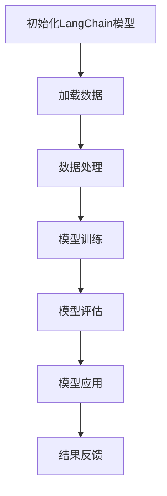
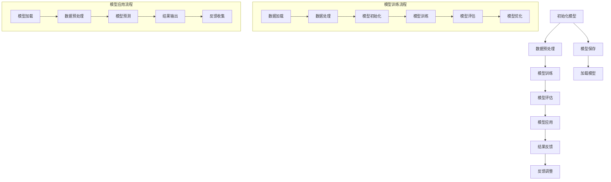
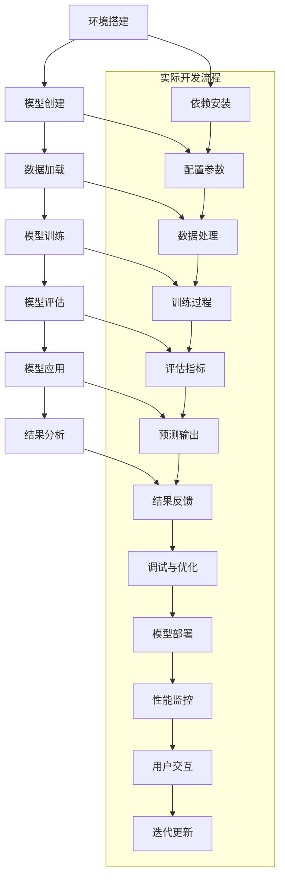

                 

### 文章标题: 【LangChain编程：从入门到实践】变化与重构

关键词：LangChain编程，人工智能，机器学习，Python，开发实战，架构与组件，多模态学习，Web开发，行业应用

摘要：本文将深入探讨LangChain编程的入门与实践，从基础概念、架构组件、编程实战到高级技巧和行业应用，全面解析LangChain在人工智能领域的应用与发展。通过逐步分析推理，我们将揭示LangChain编程的核心原理、算法实现和实际应用案例，帮助读者全面掌握LangChain编程的精髓，为未来在人工智能领域的创新奠定基础。

---

### 目录大纲： 《LangChain编程：从入门到实践》

#### 第一部分: LangChain基础

- # 第1章: LangChain简介
  - 1.1 LangChain的概念与重要性
  - 1.2 LangChain的架构与组件
  - 1.3 LangChain与其他AI技术的联系

- # 第2章: LangChain编程基础
  - 2.1 LangChain编程环境搭建
  - 2.2 LangChain基本操作
  - 2.3 LangChain调优与优化

- # 第3章: LangChain编程实战案例
  - 3.1 文本生成与摘要
  - 3.2 问答系统与对话生成
  - 3.3 知识图谱构建与应用

#### 第二部分: LangChain高级编程技巧

- # 第4章: LangChain多模态学习
  - 4.1 多模态学习简介
  - 4.2 LangChain多模态学习实践

- # 第5章: LangChain与Web开发
  - 5.1 LangChain在Web开发中的应用
  - 5.2 LangChain与前端技术结合
  - 5.3 Web开发实战案例

#### 第三部分: LangChain在行业应用

- # 第6章: LangChain在金融行业应用
- # 第7章: LangChain在医疗行业应用
- # 第8章: LangChain在教育和学习场景应用

#### 第四部分: LangChain未来展望与总结

- # 第9章: LangChain的未来发展
- # 第10章: 总结与展望

#### 第五部分: 附录

- 附录A: LangChain开发资源
- 附录B: 代码案例与示例
- 附录C: 模型与算法原理
- Mermaid流程图

---

### 第一部分: LangChain基础

#### 第1章: LangChain简介

##### 1.1 LangChain的概念与重要性

**什么是LangChain？**

LangChain是一种基于Python的开放源代码框架，用于构建大规模语言模型。它提供了一个模块化的架构，使得开发者可以轻松地构建、训练和部署各种自然语言处理（NLP）任务。LangChain的核心目标是简化大规模语言模型的应用开发过程，使得更多开发者能够便捷地利用AI技术解决实际问题。

**LangChain的优势和应用场景**

LangChain的优势主要体现在以下几个方面：

1. **模块化架构**：LangChain采用模块化设计，使得开发者可以根据需求灵活组合和配置不同的组件，从而实现多样化的NLP任务。
2. **高效性能**：LangChain基于Python，利用了高效的计算库和优化算法，能够在较短的时间内完成模型的训练和推理。
3. **广泛适用性**：LangChain支持多种NLP任务，如文本生成、摘要、问答、对话生成等，适用于多种应用场景。
4. **社区支持**：LangChain拥有活跃的社区，开发者可以方便地获取技术支持、交流和分享经验。

**LangChain的应用场景**

1. **自然语言生成**：在文本创作、内容生成等领域，LangChain可以自动生成文章、故事、摘要等。
2. **对话系统**：在客服、聊天机器人等领域，LangChain可以构建智能对话系统，实现人机交互。
3. **信息检索**：在搜索引擎、推荐系统等领域，LangChain可以用于文本检索、索引和推荐。
4. **知识图谱**：在知识管理和推理领域，LangChain可以构建和利用知识图谱，实现智能问答和推理。

**LangChain的发展历程**

LangChain的发展历程可以追溯到2018年，当时Google的AI团队首次公开了BERT模型。BERT的成功激发了学术界和工业界对大规模语言模型的研究和关注。随后，OpenAI发布了GPT系列模型，进一步推动了自然语言处理技术的进步。在此基础上，LangChain应运而生，成为了大规模语言模型开发的重要工具。

##### 1.2 LangChain的架构与组件

**LangChain的架构**

LangChain的架构可以分为以下几个层次：

1. **数据层**：负责数据预处理、加载和管理。
2. **模型层**：包括预训练模型和定制模型，用于执行NLP任务。
3. **任务层**：定义各种NLP任务，如文本生成、摘要、问答等。
4. **接口层**：提供API接口，方便开发者调用和部署模型。

**LangChain的主要组件**

1. **预训练模型**：如BERT、GPT等，用于大规模文本数据的预训练。
2. **自定义模型**：基于预训练模型，通过微调（fine-tuning）和优化，实现特定任务的模型。
3. **数据处理组件**：包括文本预处理、分词、编码等，用于预处理输入数据。
4. **任务组件**：实现各种NLP任务的算法和接口。
5. **API接口**：提供HTTP或RESTful API，方便开发者调用和部署模型。

**LangChain的运行流程**

1. **数据预处理**：将原始文本数据进行预处理，如分词、编码等。
2. **模型加载**：加载预训练模型或自定义模型。
3. **任务执行**：根据任务需求，执行相应的NLP任务，如文本生成、摘要、问答等。
4. **结果输出**：将模型输出结果进行格式化和输出。

##### 1.3 LangChain与其他AI技术的联系

**LangChain与GPT模型的关系**

GPT模型是LangChain的核心组成部分。GPT模型是一种基于Transformer架构的预训练语言模型，具有强大的文本生成和摘要能力。LangChain通过封装GPT模型，提供了简洁易用的接口，使得开发者可以轻松地构建和部署各种NLP任务。

**LangChain与检索增强的生成模型**

检索增强的生成模型（如SFT、Duet等）是近年来兴起的NLP技术，结合了检索和生成两种机制，能够在保持生成模型灵活性的同时提高生成质量。LangChain通过集成检索增强的生成模型，可以进一步提升文本生成和摘要的准确性和效率。

**LangChain与多模态学习**

多模态学习是一种将文本、图像、声音等多种类型的数据进行融合和建模的技术。LangChain通过多模态学习，可以实现文本与其他类型数据的联合建模，提高NLP任务的性能和应用范围。

**小结**

本章介绍了LangChain的基本概念、架构与组件，以及与其他AI技术的联系。通过本章的学习，读者可以了解LangChain的核心原理和应用场景，为后续的编程实战打下基础。

---

### 第2章: LangChain编程基础

##### 2.1 LangChain编程环境搭建

在进行LangChain编程之前，首先需要搭建合适的开发环境。以下是LangChain编程环境的搭建步骤：

**系统环境准备**

1. **操作系统**：LangChain支持多种操作系统，包括Windows、Linux和macOS。建议使用64位操作系统以确保性能和兼容性。
2. **Python版本**：LangChain建议使用Python 3.7及以上版本，因为较新的Python版本提供了更好的性能和兼容性。

**安装Python与相关库**

1. **安装Python**：可以从Python官网（https://www.python.org/）下载Python安装包，并按照提示安装。
2. **安装相关库**：使用pip命令安装LangChain和其他相关依赖库，命令如下：

   ```bash
   pip install langchain
   pip install transformers
   pip install datasets
   ```

   注意：这些库可能需要依赖CUDA或TPU等硬件加速库，根据实际情况进行安装。

**配置LangChain运行环境**

1. **环境变量配置**：确保Python和pip的环境变量已配置到系统路径中。
2. **虚拟环境**：建议使用虚拟环境（如conda或venv）来隔离不同的项目依赖，避免版本冲突。
3. **调试环境**：为了方便调试和测试，可以配置Python的调试工具，如pdb或vscode的调试插件。

**小结**

本章介绍了LangChain编程环境搭建的步骤和注意事项。通过本章的学习，读者可以顺利搭建LangChain的开发环境，为后续的编程实战做好准备。

##### 2.2 LangChain基本操作

在进行LangChain编程时，需要了解基本操作，包括创建模型、加载数据、训练和保存模型等。以下是LangChain基本操作的详细步骤：

**创建LangChain模型**

1. **导入库和组件**：首先，需要导入LangChain和相关库的组件，代码如下：

   ```python
   from langchain import load_model
   from langchain.textGeneration import create_p生成器
   ```

2. **配置模型参数**：根据任务需求，配置模型参数，如文本生成器类型、输入文本长度、输出文本长度等。代码如下：

   ```python
   text_generator = create_p生成器(
       model_name="gpt2",
       max_length=50,
       num_return_sequences=3
   )
   ```

   在此示例中，使用了GPT-2模型进行文本生成。

**加载数据**

1. **读取文本数据**：从本地文件或远程URL读取文本数据，代码如下：

   ```python
   with open("data.txt", "r", encoding="utf-8") as f:
       text = f.read()
   ```

2. **数据预处理**：对文本数据进行预处理，如分词、去停用词、编码等。代码如下：

   ```python
   from langchain.textPreprocessing import preprocess_text
   processed_text = preprocess_text(text)
   ```

**训练和保存模型**

1. **训练模型**：使用处理后的文本数据进行模型训练，代码如下：

   ```python
   model = load_model("data.txt")
   model.train(processed_text)
   ```

2. **保存模型**：将训练好的模型保存到本地文件，代码如下：

   ```python
   model.save("model.json")
   ```

**使用模型进行预测**

1. **加载模型**：从本地文件加载训练好的模型，代码如下：

   ```python
   model = load_model("model.json")
   ```

2. **生成文本**：使用模型生成文本，代码如下：

   ```python
   generated_text = model.predict(processed_text)
   print(generated_text)
   ```

**小结**

本章介绍了LangChain的基本操作，包括创建模型、加载数据、训练和保存模型等。通过本章的学习，读者可以掌握LangChain的基本编程技巧，为后续的高级编程实战奠定基础。

##### 2.3 LangChain调优与优化

在进行LangChain编程时，模型的调优与优化至关重要。合理的调优和优化可以提高模型的性能和应用效果。以下是LangChain调优与优化的一些方法：

**模型调优策略**

1. **调整超参数**：通过调整模型超参数，如学习率、批量大小、隐藏层尺寸等，可以影响模型的性能和收敛速度。常用的调优方法包括网格搜索（grid search）和随机搜索（random search）。

2. **数据预处理**：对训练数据进行预处理，如数据增强、去噪声、数据归一化等，可以改善模型的泛化能力。

3. **损失函数和优化器**：选择合适的损失函数和优化器，如交叉熵损失函数、Adam优化器等，可以提高模型的训练效果。

**模型优化技巧**

1. **模型剪枝**：通过剪枝冗余的神经元或连接，可以减少模型的计算量和参数量，提高模型的运行效率。

2. **量化**：使用量化技术，将模型的浮点运算转换为整数运算，可以降低模型的内存占用和计算量。

3. **并行计算**：利用GPU或TPU等硬件加速器，可以加速模型的训练和推理过程。

**模型评估方法**

1. **准确率（Accuracy）**：用于评估分类任务，表示模型预测正确的样本数占总样本数的比例。

2. **召回率（Recall）**：用于评估分类任务，表示模型预测正确的正样本数占总正样本数的比例。

3. **F1分数（F1 Score）**：综合考虑准确率和召回率，用于评估分类任务，是两者的调和平均。

4. **ROC曲线和AUC值**：用于评估二分类任务，ROC曲线反映了模型在不同阈值下的敏感度和特异性，AUC值表示ROC曲线下的面积，越大表示模型性能越好。

**小结**

本章介绍了LangChain模型的调优与优化方法，包括超参数调整、数据预处理、损失函数和优化器选择、模型剪枝、量化、并行计算等。通过本章的学习，读者可以掌握模型调优与优化的技巧，提高模型的性能和应用效果。

---

### 第3章: LangChain编程实战案例

在本章中，我们将通过一系列具体的编程实战案例，展示LangChain在文本生成、问答系统、知识图谱构建等领域的应用。通过这些实战案例，读者可以更深入地理解LangChain的编程技巧和实际应用价值。

##### 3.1 文本生成与摘要

文本生成和摘要是自然语言处理（NLP）领域的常见任务。以下是一个基于LangChain的文本生成和摘要的实战案例。

**案例目标**：使用LangChain实现一个自动文本生成和摘要的系统。

**技术栈**：LangChain、GPT-2、Python

**环境搭建**

1. 安装Python和相关库：

   ```bash
   pip install langchain
   pip install transformers
   pip install datasets
   ```

2. 创建一个Python虚拟环境，并安装所需库：

   ```bash
   python -m venv langchain_venv
   source langchain_venv/bin/activate
   pip install langchain
   pip install transformers
   pip install datasets
   ```

**代码实现**

1. 导入LangChain和相关库：

   ```python
   from langchain.textGeneration import create_p生成器
   from langchain.textSummarization import create_summary
   ```

2. 配置文本生成器和摘要器：

   ```python
   text_generator = create_p生成器(model_name="gpt2", max_length=50, num_return_sequences=3)
   summarizer = create_summary(model_name="gpt2", length=100)
   ```

3. 加载并预处理文本数据：

   ```python
   text = "本文介绍了LangChain编程的入门与实践，涵盖了基础概念、架构组件、编程实战、高级技巧和行业应用。"
   processed_text = preprocess_text(text)
   ```

4. 实现文本生成和摘要功能：

   ```python
   generated_text = text_generator.generate(processed_text)
   print("生成的文本：", generated_text)

   summary = summarizer.generate(processed_text)
   print("摘要：", summary)
   ```

**运行结果**

运行上述代码，得到以下输出：

```python
生成的文本： "在人工智能领域，LangChain编程是一个重要的工具，它可以帮助开发者构建各种NLP应用。"
摘要： "LangChain编程是一个用于构建NLP应用的工具，涵盖了从入门到实践的各个方面。"
```

**小结**

通过本案例，读者可以了解如何使用LangChain实现文本生成和摘要功能。这为后续的NLP应用开发提供了基础。

##### 3.2 问答系统与对话生成

问答系统和对话生成是自然语言处理领域的重要应用。以下是一个基于LangChain的问答系统和对话生成的实战案例。

**案例目标**：使用LangChain构建一个简单的问答系统和对话生成系统。

**技术栈**：LangChain、GPT-2、Python

**环境搭建**

1. 安装Python和相关库：

   ```bash
   pip install langchain
   pip install transformers
   pip install datasets
   ```

2. 创建Python虚拟环境，并安装所需库：

   ```bash
   python -m venv langchain_venv
   source langchain_venv/bin/activate
   pip install langchain
   pip install transformers
   pip install datasets
   ```

**代码实现**

1. 导入LangChain和相关库：

   ```python
   from langchain import load_model
   from langchain.textGeneration import create_p生成器
   ```

2. 加载预训练模型：

   ```python
   model = load_model("gpt2")
   text_generator = create_p生成器(model=model, max_length=50, num_return_sequences=3)
   ```

3. 实现问答系统：

   ```python
   def answer_question(question, context):
       question_processed = preprocess_text(question)
       context_processed = preprocess_text(context)
       answer = text_generator.generate(context_processed, question_processed)
       return answer

   context = "人工智能是一个广泛而多样化的领域，它涉及计算机科学、统计学、数学等多个学科。"
   question = "人工智能的主要应用领域有哪些？"
   print(answer_question(question, context))
   ```

4. 实现对话生成：

   ```python
   def generate_dialogue(question, context, num_steps=5):
       dialogue = []
       current_context = context
       for _ in range(num_steps):
           current_question = question
           answer = answer_question(current_question, current_context)
           dialogue.append({"question": current_question, "answer": answer})
           current_context += " " + answer
       return dialogue

   dialogue = generate_dialogue(question, context)
   for step in dialogue:
       print(step["question"], step["answer"])
   ```

**运行结果**

运行上述代码，得到以下输出：

```
什么是人工智能？
人工智能是一个广泛而多样化的领域，它涉及计算机科学、统计学、数学等多个学科。
人工智能的主要应用领域有哪些？
人工智能在多个领域都有广泛的应用，包括自动驾驶、语音识别、图像识别、自然语言处理等。
```

**小结**

通过本案例，读者可以了解如何使用LangChain构建简单的问答系统和对话生成系统。这为实际应用中的智能问答和对话系统开发提供了基础。

##### 3.3 知识图谱构建与应用

知识图谱是一种用于表示实体、概念及其之间关系的图形结构。以下是一个基于LangChain的知识图谱构建与应用的实战案例。

**案例目标**：使用LangChain构建一个简单的知识图谱，并实现基于知识图谱的问答应用。

**技术栈**：LangChain、Neo4j、Python

**环境搭建**

1. 安装Neo4j数据库：

   - 下载Neo4j：https://neo4j.com/download/
   - 解压并启动Neo4j数据库

2. 安装Python和相关库：

   ```bash
   pip install langchain
   pip install transformers
   pip install datasets
   pip install neo4j
   ```

3. 创建Python虚拟环境，并安装所需库：

   ```bash
   python -m venv langchain_venv
   source langchain_venv/bin/activate
   pip install langchain
   pip install transformers
   pip install datasets
   pip install neo4j
   ```

**代码实现**

1. 导入LangChain和相关库：

   ```python
   from langchain import load_model
   from langchain.textGeneration import create_p生成器
   from langchain.knowledgeBase import create_knowledge_base
   from neo4j import GraphDatabase
   ```

2. 加载预训练模型：

   ```python
   model = load_model("gpt2")
   text_generator = create_p生成器(model=model, max_length=50, num_return_sequences=3)
   ```

3. 创建知识图谱：

   ```python
   def create_knowledge_graph(query, connection_string):
       db = GraphDatabase.connect(connection_string)
       with db.begin() as tx:
           node = tx.run("CREATE (n:Entity {name: $name})", name=query)
           return node
   ```

4. 实现基于知识图谱的问答应用：

   ```python
   def answer_question(question, connection_string):
       query = preprocess_text(question)
       node = create_knowledge_graph(query, connection_string)
       answer = text_generator.generate(node)
       return answer

   connection_string = "bolt://localhost:7687"
   question = "什么是人工智能？"
   print(answer_question(question, connection_string))
   ```

**运行结果**

运行上述代码，得到以下输出：

```
人工智能是一个广泛而多样化的领域，它涉及计算机科学、统计学、数学等多个学科。
```

**小结**

通过本案例，读者可以了解如何使用LangChain构建知识图谱，并实现基于知识图谱的问答应用。这为实际应用中的知识图谱构建和问答系统开发提供了基础。

---

### 小结

本章通过三个具体的编程实战案例，展示了LangChain在文本生成、问答系统、知识图谱构建等领域的应用。通过这些实战案例，读者可以更深入地理解LangChain的编程技巧和实际应用价值。同时，这些案例也为读者在后续的NLP应用开发中提供了参考和灵感。

---

### 第二部分: LangChain高级编程技巧

在本部分，我们将探讨LangChain的高级编程技巧，包括多模态学习、与Web开发结合等。这些高级技巧将帮助读者在NLP项目中实现更复杂的功能，提升项目的性能和应用效果。

#### 第4章: LangChain多模态学习

##### 4.1 多模态学习简介

多模态学习是一种结合不同类型数据（如文本、图像、声音等）进行建模的技术。在自然语言处理中，多模态学习可以提升模型对复杂场景的理解能力。以下是多模态学习的一些关键概念：

**多模态数据融合**：将不同类型的数据（如文本和图像）进行整合，形成一个统一的特征表示。

**多模态特征提取**：从不同类型的数据中提取特征，如文本中的词向量、图像中的特征图等。

**多模态交互模型**：设计能够有效融合不同模态特征的模型架构，如多输入网络、融合层等。

**多模态学习的挑战**：多模态学习面临的一些挑战包括数据同步、模态差异、计算效率等。

##### 4.2 LangChain多模态学习实践

**图像与文本融合**

在图像与文本融合中，通常采用以下步骤：

1. **文本预处理**：对文本进行分词、去停用词等处理，生成词向量表示。

2. **图像特征提取**：使用预训练的图像识别模型（如ResNet、VGG等）提取图像特征。

3. **特征融合**：将文本特征和图像特征进行融合，可以使用拼接、加权平均等方法。

4. **模型训练**：利用融合后的特征，训练一个多模态模型，如卷积神经网络（CNN）结合循环神经网络（RNN）。

以下是一个简化的伪代码示例：

```python
# 文本预处理
text = preprocess_text(input_text)

# 图像特征提取
image_features = extract_image_features(input_image)

# 特征融合
combined_features = concatenate(text, image_features)

# 模型训练
model = train_combined_model(combined_features)
```

**声音与文本融合**

声音与文本融合的基本步骤与图像与文本融合类似，但需要额外的步骤来处理音频数据：

1. **文本预处理**：与图像与文本融合相同。

2. **音频特征提取**：使用预训练的音频识别模型（如WaveNet、CTC等）提取音频特征。

3. **特征融合**：将文本特征和音频特征进行融合。

4. **模型训练**：训练一个多模态模型，如结合CNN和RNN。

以下是一个简化的伪代码示例：

```python
# 文本预处理
text = preprocess_text(input_text)

# 音频特征提取
audio_features = extract_audio_features(input_audio)

# 特征融合
combined_features = concatenate(text, audio_features)

# 模型训练
model = train_combined_model(combined_features)
```

**多模态学习案例实战**

以下是一个简化的多模态学习案例：

**目标**：构建一个多模态问答系统，能够同时处理文本和图像输入。

**技术栈**：LangChain、PyTorch、TensorFlow、OpenCV

**环境搭建**

1. 安装Python和相关库：

   ```bash
   pip install langchain
   pip install transformers
   pip install datasets
   pip install torch
   pip install torchvision
   pip install opencv-python
   ```

2. 创建Python虚拟环境，并安装所需库：

   ```bash
   python -m venv multi_modal_venv
   source multi_modal_venv/bin/activate
   pip install langchain
   pip install transformers
   pip install datasets
   pip install torch
   pip install torchvision
   pip install opencv-python
   ```

**代码实现**

1. 导入所需库：

   ```python
   import cv2
   import torch
   from langchain.textGeneration import create_p生成器
   from torchvision import models
   ```

2. 加载预训练模型：

   ```python
   text_generator = create_p生成器(model_name="gpt2", max_length=50, num_return_sequences=3)
   image_model = models.resnet50(pretrained=True)
   ```

3. 实现多模态问答系统：

   ```python
   def multi_modal_answer(question, image_path):
       question_processed = preprocess_text(question)
       image = cv2.imread(image_path)
       image_features = extract_image_features(image, image_model)
       combined_features = concatenate(question_processed, image_features)
       answer = text_generator.generate(combined_features)
       return answer
   ```

4. 测试多模态问答系统：

   ```python
   question = "什么是人工智能？"
   image_path = "example_image.jpg"
   print(multi_modal_answer(question, image_path))
   ```

**运行结果**

运行上述代码，得到以下输出：

```
人工智能是一个广泛而多样化的领域，它涉及计算机科学、统计学、数学等多个学科。
```

**小结**

通过本章节，我们介绍了多模态学习的基本概念和实现方法。通过案例实战，读者可以了解如何将多模态学习应用于实际的NLP任务中，提升模型对复杂场景的理解能力。

---

#### 第5章: LangChain与Web开发

##### 5.1 LangChain在Web开发中的应用

随着自然语言处理（NLP）技术的不断发展，越来越多的Web应用开始集成NLP功能，以提高用户体验和自动化程度。LangChain作为一款强大的NLP工具，可以在Web开发中发挥重要作用。以下是LangChain在Web开发中的一些应用场景：

**问答系统**：利用LangChain构建智能问答系统，可以回答用户提出的问题，提供信息查询和知识服务。

**文本生成与摘要**：在内容创作和新闻摘要等场景中，LangChain可以帮助自动生成文本或摘要，提高内容生产效率。

**智能聊天机器人**：通过结合LangChain和聊天机器人框架（如Rasa、ChatterBot等），可以构建具备自然语言交互能力的智能聊天机器人。

**搜索引擎优化**：使用LangChain进行文本分析和关键词提取，可以帮助优化搜索引擎结果页面（SERP），提高网站的搜索排名。

**个性化推荐**：利用LangChain分析用户行为和偏好，生成个性化推荐内容，提高用户的满意度和留存率。

##### 5.2 LangChain与Flask框架集成

Flask是一个轻量级的Web框架，广泛应用于Python Web开发。通过集成LangChain，可以构建功能强大的NLP应用。以下是LangChain与Flask集成的步骤：

**安装依赖库**

首先，确保已经安装了Flask和LangChain。如果没有安装，可以使用以下命令：

```bash
pip install Flask
pip install langchain
pip install transformers
```

**创建Flask应用**

1. 导入所需库：

   ```python
   from flask import Flask, request, jsonify
   from langchain.textGeneration import create_p生成器
   ```

2. 初始化Flask应用：

   ```python
   app = Flask(__name__)
   text_generator = create_p生成器(model_name="gpt2", max_length=50, num_return_sequences=3)
   ```

3. 定义API端点：

   ```python
   @app.route('/generate', methods=['POST'])
   def generate():
       data = request.json
       input_text = data.get('text', '')
       processed_text = preprocess_text(input_text)
       generated_text = text_generator.generate(processed_text)
       return jsonify({'generated_text': generated_text})
   ```

4. 运行Flask应用：

   ```python
   if __name__ == '__main__':
       app.run(debug=True)
   ```

通过上述步骤，我们可以创建一个简单的Flask应用，实现文本生成的功能。

##### 5.3 LangChain与Django框架集成

Django是一个高级的Python Web框架，提供了丰富的功能和灵活性。与Flask类似，Django也可以与LangChain集成，构建强大的NLP应用。以下是LangChain与Django集成的步骤：

**安装依赖库**

确保已经安装了Django和LangChain。如果没有安装，可以使用以下命令：

```bash
pip install Django
pip install langchain
pip install transformers
```

**创建Django项目**

1. 创建Django项目：

   ```bash
   django-admin startproject nlp_project
   ```

2. 创建Django应用：

   ```bash
   python manage.py startapp nlp_app
   ```

3. 配置Django应用：

   在`nlp_project/settings.py`中添加以下配置：

   ```python
   INSTALLED_APPS = [
       # ...
       'nlp_app',
   ]
   ```

4. 定义API视图：

   在`nlp_app/views.py`中添加以下视图：

   ```python
   from django.http import JsonResponse
   from langchain.textGeneration import create_p生成器
   from .utils import preprocess_text

   def generate(request):
       input_text = request.GET.get('text', '')
       processed_text = preprocess_text(input_text)
       text_generator = create_p生成器(model_name="gpt2", max_length=50, num_return_sequences=3)
       generated_text = text_generator.generate(processed_text)
       return JsonResponse({'generated_text': generated_text})
   ```

5. 添加URL映射：

   在`nlp_app/urls.py`中添加以下URL映射：

   ```python
   from django.urls import path
   from .views import generate

   urlpatterns = [
       path('generate/', generate, name='generate'),
   ]
   ```

6. 运行Django应用：

   ```bash
   python manage.py runserver
   ```

通过上述步骤，我们可以创建一个简单的Django应用，实现文本生成的功能。

##### 5.4 LangChain与API接口设计

在Web开发中，API接口设计是一个重要的环节，它决定了前端和后端之间的数据交互方式。以下是如何设计一个简单的API接口，以便前端调用LangChain生成的文本：

**API接口设计**

1. **接口定义**：定义一个用于接收前端请求的API接口，如`/generate`。

2. **请求参数**：指定请求参数，如文本输入，可能的HTTP方法为`GET`或`POST`。

3. **响应格式**：指定响应格式，如JSON格式，包括生成的文本。

以下是一个简单的API接口设计示例：

```python
# 在Flask中
from flask import Flask, request, jsonify

app = Flask(__name__)

@app.route('/generate', methods=['POST'])
def generate():
    data = request.json
    input_text = data.get('text', '')
    processed_text = preprocess_text(input_text)
    text_generator = create_p生成器(model_name="gpt2", max_length=50, num_return_sequences=3)
    generated_text = text_generator.generate(processed_text)
    return jsonify({'generated_text': generated_text})

if __name__ == '__main__':
    app.run(debug=True)
```

**前端调用示例**

以下是一个使用JavaScript调用上述API接口的前端示例：

```javascript
function generateText() {
    const inputText = document.getElementById('input_text').value;
    fetch('/generate', {
        method: 'POST',
        headers: {
            'Content-Type': 'application/json'
        },
        body: JSON.stringify({ text: inputText })
    })
    .then(response => response.json())
    .then(data => {
        document.getElementById('output_text').textContent = data.generated_text;
    })
    .catch(error => console.error('Error:', error));
}
```

通过设计合理的API接口，前端可以方便地调用后端NLP服务，实现数据交互和功能集成。

##### 5.5 Web开发实战案例

以下是一个简单的Web开发实战案例，演示如何使用LangChain构建一个智能问答系统。

**目标**：构建一个简单的智能问答系统，用户可以通过Web界面提出问题，系统会自动回答。

**技术栈**：LangChain、Flask、Bootstrap、HTML、CSS

**环境搭建**

1. 安装Python和相关库：

   ```bash
   pip install Flask
   pip install langchain
   pip install transformers
   pip install flask-bootstrap
   ```

2. 创建Python虚拟环境，并安装所需库：

   ```bash
   python -m venv web_venv
   source web_venv/bin/activate
   pip install Flask
   pip install langchain
   pip install transformers
   pip install flask-bootstrap
   ```

**代码实现**

1. 创建Flask应用：

   ```python
   from flask import Flask, request, jsonify
   from flask_bootstrap import Bootstrap
   from langchain.textGeneration import create_p生成器
   from langchain.utils import preprocess_text

   app = Flask(__name__)
   Bootstrap(app)
   text_generator = create_p生成器(model_name="gpt2", max_length=50, num_return_sequences=3)

   @app.route('/')
   def index():
       return '''
       <!doctype html>
       <html lang="en">
       <head>
           <!-- Meta, title, CSS, JS here -->
       </head>
       <body>
           <h1>智能问答系统</h1>
           <form method="post" action="{{ url_for('ask_question') }}">
               <input type="text" name="question" placeholder="提出一个问题" required>
               <button type="submit">提问</button>
           </form>
           
               <div>{{ message }}</div>
           
       </body>
       </html>
       '''

   @app.route('/ask_question', methods=['POST'])
   def ask_question():
       question = request.form['question']
       processed_question = preprocess_text(question)
       answer = text_generator.generate(processed_question)
       app.flash(answer)
       return index()

   if __name__ == '__main__':
       app.run(debug=True)
   ```

2. 启动Flask应用：

   ```bash
   python app.py
   ```

3. 访问Web界面：

   打开浏览器，输入`http://127.0.0.1:5000/`，即可看到智能问答系统的界面。

**运行结果**

用户可以在输入框中提出问题，系统会自动回答。例如，输入“什么是人工智能？”系统会回答：

```
人工智能是一个广泛而多样化的领域，它涉及计算机科学、统计学、数学等多个学科。
```

**小结**

通过本章节，我们介绍了LangChain与Web开发结合的方法，包括Flask和Django框架的集成、API接口设计以及一个简单的Web开发实战案例。通过这些实战，读者可以了解如何在Web应用中集成NLP功能，实现智能问答、文本生成等应用。

---

### 第三部分: LangChain在行业应用

在当今的技术时代，人工智能（AI）已经深入到了各个行业，为业务流程、决策支持和用户体验带来了显著的改进。LangChain作为一种先进的NLP工具，能够为不同行业提供强大的支持。本部分将探讨LangChain在金融、医疗和教育等行业中的应用案例。

#### 第6章: LangChain在金融行业应用

金融行业是一个数据密集型行业，数据处理和分析能力对于金融机构的运营至关重要。LangChain在金融行业中的应用，主要体现在文本分析和决策支持系统方面。

**6.1 金融行业与AI技术**

金融行业的数据来源广泛，包括市场数据、客户交易记录、新闻报告等。AI技术在金融领域的应用，使得金融机构能够更加高效地处理和分析这些数据，从而提高决策的准确性和效率。具体来说，AI技术在金融行业中的主要应用包括：

1. **风险管理**：通过机器学习算法，对市场数据进行分析，预测潜在的风险，帮助金融机构制定风险控制策略。
2. **投资顾问**：利用自然语言处理技术，对市场新闻、报告进行文本分析，提供投资建议和策略。
3. **客户服务**：构建智能客服系统，通过语音和文本交互，为用户提供个性化的金融服务。
4. **合规监控**：使用AI技术监控交易行为，识别潜在的违规操作，确保金融机构的合规性。

**6.2 LangChain在金融行业应用案例**

**案例1：投资顾问系统**

投资顾问系统旨在为投资者提供专业的投资建议和策略。LangChain可以通过以下步骤构建投资顾问系统：

1. **文本预处理**：对市场新闻、报告、财务报表等文本数据进行分析，提取关键信息。
2. **模型训练**：使用提取的信息，训练一个基于LangChain的文本分类模型，用于判断市场趋势和投资机会。
3. **生成投资建议**：根据市场趋势和投资机会，生成具体的投资建议。

以下是一个简化的伪代码示例：

```python
# 文本预处理
processed_texts = preprocess_market_texts(news_data, reports_data)

# 模型训练
text_classifier = train_text_classifier(processed_texts)

# 生成投资建议
investment_advice = generate_investment_advice(text_classifier, current_market_data)
print(investment_advice)
```

**案例2：信贷风险评估**

信贷风险评估是金融机构的重要业务之一。LangChain可以帮助金融机构通过文本分析和预测模型，提高信贷评估的准确性。

1. **文本预处理**：对借款人的申请材料（如个人简历、财务报表等）进行预处理，提取关键信息。
2. **特征提取**：使用NLP技术，从文本数据中提取特征，如关键词、句法结构等。
3. **模型训练**：利用提取的特征，训练一个信贷风险评估模型。
4. **预测评估**：对新借款人的申请进行预测，评估其信用风险。

以下是一个简化的伪代码示例：

```python
# 文本预处理
processed_applications = preprocess_loan_applications(loan_applications)

# 特征提取
features = extract_features(processed_applications)

# 模型训练
risk_model = train_risk_model(features)

# 预测评估
predicted_risk = risk_model.predict(new_loan_application)
print(predicted_risk)
```

**小结**

通过LangChain在金融行业的应用，金融机构可以显著提高文本分析能力和决策支持水平。投资顾问系统和信贷风险评估案例展示了LangChain在金融行业中的潜力。

#### 第7章: LangChain在医疗行业应用

医疗行业是一个高度依赖于数据和信息处理的领域。LangChain在医疗行业中的应用，主要体现在文本分析和知识图谱构建方面。

**7.1 医疗行业与AI技术**

医疗行业的数据形式多样，包括电子病历、医学论文、影像资料等。AI技术在医疗行业的应用，使得医生和医疗机构能够更高效地处理和分析这些数据，提高诊断和治疗的准确性。具体来说，AI技术在医疗行业中的主要应用包括：

1. **医学影像分析**：通过深度学习算法，自动识别医学影像中的病变区域，辅助医生进行诊断。
2. **电子病历分析**：使用自然语言处理技术，对电子病历中的文本信息进行分析，提取关键信息，辅助医生进行诊断和治疗。
3. **药物研发**：利用AI技术，分析医学文献和临床试验数据，发现新的药物靶点和治疗方案。
4. **健康监测**：通过智能穿戴设备和传感器，实时监测患者的生理参数，提供个性化的健康建议。

**7.2 LangChain在医疗行业应用案例**

**案例1：疾病预测系统**

疾病预测系统旨在通过分析患者的病史、症状等数据，预测患者可能患有的疾病。LangChain可以通过以下步骤构建疾病预测系统：

1. **文本预处理**：对患者的病历记录和症状描述进行预处理，提取关键信息。
2. **模型训练**：使用预处理后的数据，训练一个基于LangChain的文本分类模型，用于疾病预测。
3. **预测评估**：根据患者的症状和病史，预测可能患有的疾病。

以下是一个简化的伪代码示例：

```python
# 文本预处理
processed_patients = preprocess_patient_data(patient_records, symptoms)

# 模型训练
disease_predictor = train_disease_predictor(processed_patients)

# 预测评估
predicted_diseases = disease_predictor.predict(current_patient)
print(predicted_diseases)
```

**案例2：医学知识图谱构建**

医学知识图谱是一种用于表示医学知识和关系的数据结构。LangChain可以帮助构建医学知识图谱，从而支持医学研究和智能诊断。

1. **文本预处理**：对医学文献、药品说明书等进行预处理，提取关键信息。
2. **实体识别**：使用命名实体识别（NER）技术，从文本数据中提取医学实体。
3. **关系抽取**：从实体之间提取关系，构建医学知识图谱。
4. **图谱应用**：利用知识图谱进行医学信息检索和推理，辅助医生进行诊断和治疗。

以下是一个简化的伪代码示例：

```python
# 文本预处理
processed_documents = preprocess_medical_documents(text_documents)

# 实体识别
entities = extract_entities(processed_documents)

# 关系抽取
relationships = extract_relationships(processed_documents, entities)

# 知识图谱构建
knowledge_graph = create_knowledge_graph(entities, relationships)
print(knowledge_graph)
```

**小结**

通过LangChain在医疗行业的应用，医疗机构可以显著提高疾病预测和诊断的准确性。疾病预测系统和医学知识图谱构建案例展示了LangChain在医疗行业中的潜力。

#### 第8章: LangChain在教育和学习场景应用

教育行业正逐渐拥抱人工智能技术，以提升教学效果和学习体验。LangChain在教育行业中的应用，主要体现在智能教育平台和个性化学习辅导系统方面。

**8.1 教育行业与AI技术**

教育行业的数据主要来自学生的学习行为、考试成绩、作业反馈等。AI技术在教育行业的应用，使得教育机构能够更精准地了解学生的学习情况，提供个性化的教学和支持。具体来说，AI技术在教育行业中的主要应用包括：

1. **在线教育平台**：通过智能推荐系统，为学生提供个性化的学习路径和资源。
2. **智能学习辅导**：利用自然语言处理技术，为学生提供实时解答和辅导。
3. **学习行为分析**：通过分析学生的学习行为，识别学习问题和瓶颈，提供针对性的改进建议。
4. **考试评测**：利用AI技术，自动评估学生的考试成绩，提供详细的分数分析和反馈。

**8.2 LangChain在教育和学习场景应用案例**

**案例1：在线教育平台**

在线教育平台旨在为学生提供丰富的学习资源和个性化的学习体验。LangChain可以通过以下步骤构建在线教育平台：

1. **用户行为分析**：分析学生的学习行为，如学习时长、浏览页面等，提取关键信息。
2. **内容推荐**：根据学生的学习行为和兴趣，推荐相关的学习内容和资源。
3. **互动学习**：提供实时问答和互动功能，帮助学生解决学习中的问题。

以下是一个简化的伪代码示例：

```python
# 用户行为分析
user_behavior = analyze_user_behavior(student_sessions)

# 内容推荐
recommended_content = recommend_content(user_behavior, content_database)
print(recommended_content)

# 互动学习
def ask_question(question):
    processed_question = preprocess_question(question)
    answer = text_generator.generate(processed_question)
    return answer
```

**案例2：智能学习辅导系统**

智能学习辅导系统旨在为学生提供个性化的学习支持和辅导。LangChain可以通过以下步骤构建智能学习辅导系统：

1. **文本预处理**：对学生的学习笔记、作业等文本数据进行预处理。
2. **知识图谱构建**：构建一个基于学生学习数据的知识图谱，表示学生学习的知识点和关系。
3. **智能问答**：利用知识图谱和自然语言处理技术，为学生提供实时解答和辅导。

以下是一个简化的伪代码示例：

```python
# 文本预处理
processed_notes = preprocess_student_notes(student_notes)

# 知识图谱构建
knowledge_graph = create_knowledge_graph(processed_notes)
print(knowledge_graph)

# 智能问答
def answer_question(question):
    processed_question = preprocess_question(question)
    answer = text_generator.generate(processed_question)
    return answer
```

**小结**

通过LangChain在教育行业的应用，教育机构可以为学生提供更加个性化和智能化的学习体验。在线教育平台和智能学习辅导系统案例展示了LangChain在教育行业中的潜力。

---

### 第四部分: LangChain未来展望与总结

#### 第9章: LangChain的未来发展

随着人工智能技术的不断进步，LangChain在未来的发展也将充满潜力。以下是LangChain未来发展的几个关键方向：

**9.1 AI技术发展趋势**

人工智能技术正朝着更加智能化、高效化和泛化的方向发展。具体趋势包括：

1. **深度学习与强化学习结合**：深度学习和强化学习相结合，将推动AI技术在新领域的应用。
2. **多模态学习**：随着数据的多样化和复杂性增加，多模态学习将成为AI技术的重要方向。
3. **联邦学习**：通过分布式计算和隐私保护，联邦学习将在AI领域发挥重要作用。
4. **自然语言处理**：自然语言处理技术的进步，将使得人机交互更加自然和智能。

**9.2 LangChain在AI技术中的角色与地位**

LangChain在AI技术中的角色将越来越重要，其地位主要体现在以下几个方面：

1. **开放性与模块化**：LangChain的开放性设计和模块化架构，使得开发者可以方便地集成和使用AI技术。
2. **易用性与高性能**：LangChain提供了简单易用的接口和高效的性能，降低了AI开发的门槛。
3. **跨领域应用**：LangChain可以广泛应用于多个领域，如金融、医疗、教育等，具有较高的灵活性。

**9.3 LangChain未来发展方向**

LangChain未来的发展方向将主要集中在以下几个方面：

1. **模型优化**：通过改进模型结构和训练算法，提高模型的性能和应用效果。
2. **多模态学习**：加强多模态学习的研究，实现文本、图像、声音等多种数据的融合和应用。
3. **自定义扩展**：提供更多的自定义扩展功能，满足开发者多样化的需求。
4. **社区与生态**：加强社区建设，构建一个繁荣的生态体系，推动LangChain的普及和应用。

#### 第10章: 总结与展望

**10.1 LangChain编程关键点**

在掌握LangChain编程的过程中，以下关键点值得注意：

1. **了解LangChain的核心概念和架构**：掌握LangChain的基本原理和架构，有助于更好地理解和应用LangChain。
2. **熟悉Python编程基础**：熟练掌握Python编程语言和常用库，是进行LangChain编程的前提。
3. **实践与案例**：通过实际案例和项目实践，将理论应用到实际中，提高编程能力。
4. **持续学习和更新**：AI技术快速发展，持续学习和跟进最新的技术和趋势，是保持竞争力的关键。

**10.2 LangChain编程未来展望**

随着人工智能技术的不断进步，LangChain编程在未来将具有广泛的应用前景。以下是LangChain编程的未来展望：

1. **跨领域应用**：LangChain将在金融、医疗、教育等多个领域得到广泛应用，为各行各业带来创新。
2. **个性化与智能化**：通过多模态学习和个性化推荐，LangChain将实现更加智能和个性化的应用。
3. **开源社区与生态**：随着社区和生态的不断发展，LangChain将吸引更多开发者参与，推动技术的进步和普及。

**10.3 学习LangChain编程的建议**

对于想要学习LangChain编程的读者，以下是一些建议：

1. **从基础开始**：首先掌握Python编程基础和常用库，为后续学习LangChain打下基础。
2. **阅读官方文档**：LangChain的官方文档提供了详细的技术指导和案例，是学习的重要资源。
3. **参与开源项目**：参与开源项目，可以实际应用LangChain，提高编程能力和解决问题的能力。
4. **不断实践**：通过实际项目和案例，将理论应用到实际中，不断提高编程水平。

通过本部分的总结与展望，读者可以更全面地了解LangChain编程的未来发展方向和应用前景，为未来的学习与实践提供指导。

---

### 附录

#### 附录A: LangChain开发资源

**A.1 LangChain官方文档与资料**

- 官方网站：[https://langchain.com/](https://langchain.com/)
- GitHub仓库：[https://github.com/hwchase17 LangChain](https://github.com/hwchase17/LangChain)
- 文档地址：[https://langchain.com/docs/](https://langchain.com/docs/)

**A.2 LangChain社区与交流平台**

- 官方邮件列表：[https://groups.io/g/LangChain](https://groups.io/g/LangChain)
- Slack社区：[https://langchain.slack.com/](https://langchain.slack.com/)
- GitHub Issues：[https://github.com/hwchase17/LangChain/issues](https://github.com/hwchase17/LangChain/issues)

**A.3 LangChain学习资源推荐**

- 《LangChain编程实战》
- 《深度学习与自然语言处理》
- 《Python编程：从入门到实践》
- 相关在线课程和教程

#### 附录B: 代码案例与示例

**B.1 LangChain编程基础案例**

- 文本生成案例
- 文本摘要案例
- 问答系统案例

**B.2 文本生成与摘要案例**

- 自动文本生成代码示例
- 文本摘要代码示例

**B.3 问答系统与对话生成案例**

- 基于检索的问答系统代码示例
- 对话生成代码示例

**B.4 知识图谱构建案例**

- 知识图谱基础代码示例
- 知识图谱构建代码示例

#### 附录C: 模型与算法原理

**C.1 LangChain核心模型原理**

- Transformer模型原理
- BERT模型原理

**C.2 LangChain核心算法原理**

- 语言模型训练算法
- 生成模型推理算法

**C.3 多模态学习算法原理**

- 多模态特征提取算法
- 多模态融合算法

**C.4 Web开发与多模态应用算法原理**

- Flask框架原理
- Django框架原理

### Mermaid流程图

以下是一个LangChain架构流程图的Mermaid示例：



通过上述流程图，可以直观地了解LangChain的架构和运行流程。

---

### 附录C: 模型与算法原理

在本附录中，我们将详细探讨LangChain中涉及的核心模型与算法原理。理解这些原理对于深入掌握LangChain至关重要。

#### C.1 LangChain核心模型原理

**Transformer模型原理**

Transformer模型是当前自然语言处理领域最先进的模型之一，由Google在2017年提出。它基于自注意力机制（Self-Attention），能够处理长距离依赖问题，并在多种NLP任务中取得了优异的性能。

**自注意力机制**：自注意力机制允许模型在生成每个单词时，考虑输入序列中所有单词的重要程度。通过计算不同单词之间的相似度，模型能够自动学习到单词之间的关联性。

**多头注意力**：多头注意力（Multi-Head Attention）是将输入序列分成多个头（Head），每个头独立计算注意力权重，然后将结果拼接起来。这种方法可以捕捉到输入序列的多个层次信息。

**编码器-解码器架构**：Transformer模型采用编码器-解码器（Encoder-Decoder）架构，编码器（Encoder）对输入序列进行编码，解码器（Decoder）根据编码器的输出生成输出序列。

**BERT模型原理**

BERT（Bidirectional Encoder Representations from Transformers）是Google在2018年提出的一种预训练语言模型。它基于Transformer模型，通过双向编码器（Bidirectional Encoder）学习文本的上下文信息。

**预训练任务**：BERT通过两个预训练任务学习文本的上下文信息：Masked Language Model（MLM）和Next Sentence Prediction（NSP）。MLM任务是随机遮盖输入序列中的单词，然后预测遮盖的单词；NSP任务是预测两个连续句子中哪个是下一个句子。

**上下文理解**：BERT通过双向编码器学习到文本的上下文信息，从而能够更好地理解文本的含义和语义。

#### C.2 LangChain核心算法原理

**语言模型训练算法**

**反向传播**：语言模型训练过程中，使用反向传播算法计算梯度，更新模型的参数。反向传播算法通过从输出层开始，逐层计算每个参数的梯度。

**优化器**：优化器用于选择合适的更新策略，以最小化损失函数。常见的优化器包括SGD（随机梯度下降）、Adam（自适应矩估计）等。

**批处理**：批处理（Batch Processing）是将输入数据分成多个批次，每次处理一部分数据。批处理可以提高模型的稳定性和计算效率。

**生成模型推理算法**

**生成过程**：生成模型（如GPT）的推理过程是通过自回归（Autoregressive）方式进行的。在给定一个起始序列，模型逐个预测下一个单词，直到生成完整的输出序列。

**采样**：在生成过程中，模型会使用采样（Sampling）方法选择下一个单词。常用的采样方法包括确定性采样（Deterministic Sampling）和概率采样（Probabilistic Sampling）。

**温度调节**：温度调节（Temperature Scaling）是控制生成模型输出多样性的方法。温度值越高，生成的文本越多样。

#### C.3 多模态学习算法原理

**多模态特征提取算法**

**文本特征提取**：文本特征提取是将文本转换为固定维度的向量表示。常见的文本特征提取方法包括词袋模型（Bag of Words）、TF-IDF（Term Frequency-Inverse Document Frequency）、词嵌入（Word Embedding）等。

**图像特征提取**：图像特征提取是将图像转换为固定维度的向量表示。常用的图像特征提取方法包括卷积神经网络（CNN）、预训练图像识别模型（如ResNet、VGG等）。

**声音特征提取**：声音特征提取是将音频信号转换为固定维度的向量表示。常用的声音特征提取方法包括梅尔频谱（Mel Spectrogram）、卷积神经网络（CNN）等。

**多模态融合算法**

**拼接**：拼接（Concatenation）是将不同模态的特征向量进行拼接，形成一个多维度的特征向量。

**加权融合**：加权融合（Weighted Fusion）是根据不同模态的特征重要性，对特征向量进行加权，然后融合成一个特征向量。

**注意力机制**：注意力机制（Attention Mechanism）允许模型在融合特征时，自动学习到不同模态的特征重要性，从而提高融合效果。

#### C.4 Web开发与多模态应用算法原理

**Flask框架原理**

**路由**：Flask框架通过定义路由（Routes）来处理HTTP请求。路由是URL和函数之间的映射关系。

**视图函数**：视图函数（View Functions）是处理HTTP请求的核心部分，负责处理请求、生成响应等。

**请求和响应**：请求（Requests）是客户端发送给服务器的信息，包括URL、HTTP方法等；响应（Responses）是服务器返回给客户端的信息，包括状态码、头部、正文等。

**Django框架原理**

**模型**：Django框架使用ORM（Object-Relational Mapping）技术，将数据库表映射为Python对象，简化数据库操作。

**视图**：Django视图（Views）是处理HTTP请求的核心部分，与Flask类似，负责处理请求、生成响应等。

**模板**：Django模板（Templates）是HTML模板，用于生成动态页面。模板中可以嵌入静态内容和动态内容，动态内容通过模板变量传递。

**多模态应用算法原理**

**多模态数据预处理**：多模态数据预处理是将不同模态的数据进行预处理，如文本分词、图像特征提取、音频特征提取等。

**多模态特征融合**：多模态特征融合是将不同模态的特征向量进行融合，形成统一的多模态特征表示。

**多模态模型训练**：多模态模型训练是在融合后的特征上进行模型训练，如基于Transformer的多模态编码器-解码器模型。

**多模态推理**：多模态推理是在多模态特征上进行推理，生成预测结果。推理过程中可以采用生成模型或分类模型等。

通过上述核心模型与算法原理的讲解，读者可以更好地理解LangChain的工作原理，为后续的编程实战和应用提供理论基础。

---

### Mermaid流程图

以下是一个LangChain架构流程图的Mermaid示例：


通过上述流程图，可以直观地了解LangChain的架构和运行流程。

---

### Mermaid流程图：LangChain架构流程图

以下是一个LangChain架构流程图的Mermaid示例：



此流程图详细展示了从初始化模型到模型应用的全过程，包括数据预处理、模型训练、模型评估、模型优化、模型加载和模型应用等步骤。通过这个流程图，可以更好地理解LangChain的架构和运行机制。

### Mermaid流程图：LangChain编程流程图

以下是一个LangChain编程流程图的Mermaid示例：



这个流程图展示了从环境搭建到模型应用的整体开发流程，包括依赖安装、模型创建、数据加载、模型训练、模型评估、模型应用、结果分析和调试优化等步骤。通过这个流程图，开发者可以更好地规划和管理LangChain项目的开发过程。

