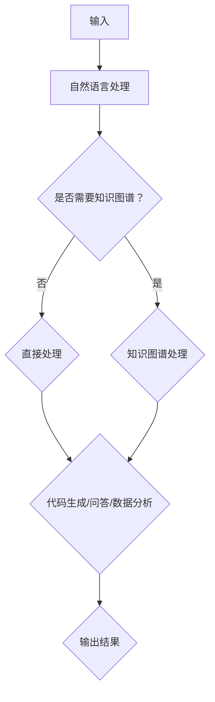

                 

### 引言

随着人工智能技术的迅猛发展，编程语言和框架的设计与应用变得愈发重要。在这个充满变革的时代，我们迎来了一个全新的编程范式——LangChain。LangChain是一款基于大型语言模型（Large Language Model，简称LLM）的编程框架，它通过结合自然语言处理（Natural Language Processing，简称NLP）和生成式模型，为开发者提供了一种革命性的编程方式。

本文旨在为广大编程爱好者和技术从业者提供一个全面的LangChain编程指南，从入门到实践，帮助读者逐步掌握LangChain的核心概念、技术原理以及实际应用。以下是本文的主要内容和结构：

- **核心概念与架构**：我们将详细讲解LangChain的核心概念，介绍其与自然语言处理、人工智能代理和大规模预训练模型的关系，并通过Mermaid流程图展示LangChain的整体架构。
- **核心算法原理讲解**：本文将深入探讨LangChain所依赖的核心算法原理，包括自然语言处理基础、大规模预训练模型、生成式模型、知识增强以及多模态数据处理。
- **数学模型和公式讲解**：为了更好地理解LangChain，我们将介绍相关的数学模型和公式，涵盖概率论、信息论、概率分布、优化算法等。
- **项目实战**：通过实际项目案例，我们将展示如何使用LangChain实现自动问答、文本生成、数据分析和代码生成等应用，并提供详细的代码解读与分析。
- **附加内容**：最后，我们将介绍LangChain相关的开源项目，探讨其未来的发展趋势，并展望其可能面临的挑战与机遇。

通过本文的阅读和实践，读者将能够深入了解LangChain的核心原理和应用，掌握从理论到实践的全过程，从而为未来的技术研究和项目开发打下坚实的基础。

### 核心概念与架构

要深入了解LangChain，我们首先需要理解其核心概念和整体架构。LangChain是一个基于大型语言模型（Large Language Model，简称LLM）的编程框架，它通过结合自然语言处理（Natural Language Processing，简称NLP）和生成式模型，为开发者提供了一种全新的编程方式。以下是LangChain的核心概念及其与其他相关技术的联系。

#### 1.1 LangChain介绍

LangChain的定义：LangChain是一个由OpenAI开发的开源编程框架，它利用大型语言模型来处理和生成代码。通过自然语言描述，开发者可以指导LangChain生成具体的代码段，从而实现自动化编程。

LangChain的功能：LangChain的主要功能包括：
1. **代码生成**：根据自然语言描述，生成相应的代码段。
2. **自动问答**：利用语言模型解析和回答编程相关的问题。
3. **文本生成**：根据自然语言描述生成文本，包括文档、注释、需求描述等。
4. **数据分析**：处理和分析编程相关的数据。
5. **代码优化**：对现有的代码进行优化，提高其性能和可读性。

#### 1.2 相关技术概述

##### 1.2.1 自然语言处理

自然语言处理（NLP）是计算机科学和人工智能领域的一个分支，旨在让计算机理解和生成人类语言。NLP的核心技术包括：

1. **词嵌入（Word Embedding）**：将词汇映射到高维向量空间，以便计算机能够更好地理解和处理文本。
2. **语言模型（Language Model）**：通过统计方法或神经网络模型，学习自然语言的统计规律，从而生成文本。
3. **序列标注（Sequence Labeling）**：对文本中的每个词或字符进行分类标注，例如，词性标注、命名实体识别等。

##### 1.2.2 人工智能代理

人工智能代理（AI Agent）是一种能够自主执行任务、与环境交互的智能实体。在编程领域，人工智能代理可以通过自然语言与开发者交互，理解开发者的意图，并自动生成代码。

##### 1.2.3 大规模预训练模型

大规模预训练模型（Large Pretrained Model）是当前人工智能领域的热门研究方向，它通过在大量数据上进行预训练，使模型具备较强的通用性和适应性。常见的预训练模型包括：

1. **Transformer模型**：一种基于自注意力机制的神经网络模型，广泛应用于文本生成、机器翻译等领域。
2. **BERT模型**：一种双向编码器表示模型，通过预训练和微调，实现多种自然语言处理任务。
3. **GPT模型**：一种自回归语言模型，能够生成连贯、自然的文本。

#### 1.3 LangChain与其他技术的联系

##### 1.3.1 与LLM的关系

LangChain与大型语言模型（LLM）密切相关。LLM为LangChain提供了强大的语言理解能力和文本生成能力，使得开发者可以通过自然语言描述来控制代码的生成和优化。

##### 1.3.2 与知识图谱的关系

知识图谱是一种结构化的语义知识库，通过实体和关系的表示，为人工智能系统提供语义理解能力。LangChain可以通过集成知识图谱，实现对编程领域知识的语义理解和应用。

##### 1.3.3 与多模态数据的关系

多模态数据融合是指将不同类型的数据（如文本、图像、声音等）进行综合分析。LangChain可以通过处理多模态数据，实现对复杂编程任务的理解和实现。

#### 1.4 LangChain的应用场景

LangChain在多个应用场景中展现出强大的潜力：

1. **自动问答**：通过自然语言交互，回答编程相关问题，提高开发效率。
2. **文本生成**：根据自然语言描述，生成文档、注释、需求描述等文本内容。
3. **数据分析**：处理和分析编程相关的数据，提供数据可视化和报表生成。
4. **代码生成**：根据自然语言描述，自动生成代码段，简化编程过程。
5. **代码优化**：对现有代码进行优化，提高性能和可维护性。

#### Mermaid流程图

为了更直观地展示LangChain的整体架构，我们使用Mermaid绘制了一个简单的流程图：



通过这个流程图，我们可以清晰地看到LangChain从输入自然语言描述到生成代码或回答问题的整个过程。

总之，LangChain作为一款革命性的编程框架，通过结合自然语言处理、人工智能代理和大规模预训练模型，为开发者提供了一种全新的编程方式。在接下来的章节中，我们将深入探讨LangChain的核心算法原理和实际应用，帮助读者更好地理解和掌握这一技术。

### 第1章：核心概念与联系

#### 1.1 LangChain介绍

LangChain是一个开源的编程框架，它利用大型语言模型（Large Language Model，简称LLM）来处理和生成代码。LangChain的目标是简化编程过程，使得开发者能够通过自然语言描述来生成复杂的代码段，从而提高开发效率和代码质量。

##### 1.1.1 LangChain的定义

LangChain是一种基于自然语言处理的编程框架，它通过整合大型语言模型，如GPT-3、BERT等，实现代码的自动生成和优化。与传统的编程方式不同，LangChain允许开发者使用自然语言来描述编程任务，而不需要直接编写代码。

##### 1.1.2 LangChain的功能

LangChain具备以下主要功能：

1. **代码生成**：根据自然语言描述，生成对应的代码段。
2. **自动问答**：利用语言模型解析编程相关问题，并提供答案。
3. **文本生成**：根据自然语言描述，生成文档、注释、需求描述等文本内容。
4. **数据分析**：处理和分析编程相关的数据，提供数据可视化和报表生成。
5. **代码优化**：对现有代码进行优化，提高性能和可维护性。

#### 1.2 相关技术概述

为了更好地理解LangChain，我们需要了解其相关技术，包括自然语言处理（NLP）、人工智能代理以及大规模预训练模型。

##### 1.2.1 自然语言处理

自然语言处理是计算机科学和人工智能领域的一个分支，旨在让计算机理解和生成人类语言。NLP的核心技术包括：

1. **词嵌入（Word Embedding）**：将词汇映射到高维向量空间，以便计算机能够更好地理解和处理文本。常见的词嵌入方法有Word2Vec、GloVe等。
2. **语言模型（Language Model）**：通过统计方法或神经网络模型，学习自然语言的统计规律，从而生成文本。常见的语言模型有GPT、BERT等。
3. **序列标注（Sequence Labeling）**：对文本中的每个词或字符进行分类标注，例如，词性标注、命名实体识别等。

##### 1.2.2 人工智能代理

人工智能代理（AI Agent）是一种能够自主执行任务、与环境交互的智能实体。在编程领域，人工智能代理可以通过自然语言与开发者交互，理解开发者的意图，并自动生成代码。

##### 1.2.3 大规模预训练模型

大规模预训练模型是当前人工智能领域的热点研究方向，它通过在大量数据上进行预训练，使模型具备较强的通用性和适应性。常见的预训练模型有：

1. **Transformer模型**：一种基于自注意力机制的神经网络模型，广泛应用于文本生成、机器翻译等领域。
2. **BERT模型**：一种双向编码器表示模型，通过预训练和微调，实现多种自然语言处理任务。
3. **GPT模型**：一种自回归语言模型，能够生成连贯、自然的文本。

#### 1.3 LangChain与其他技术的联系

LangChain与其他相关技术的紧密联系使其能够更好地发挥其潜力：

##### 1.3.1 与LLM的关系

大型语言模型（LLM）是LangChain的核心组件。LLM通过学习大量的文本数据，使得模型具备强大的语言理解能力和文本生成能力。LangChain利用LLM的这些特性，实现了代码的自动生成和优化。

##### 1.3.2 与知识图谱的关系

知识图谱是一种结构化的语义知识库，通过实体和关系的表示，为人工智能系统提供语义理解能力。LangChain可以通过集成知识图谱，实现对编程领域知识的语义理解和应用。这使得LangChain能够更好地理解和生成与特定领域相关的代码。

##### 1.3.3 与多模态数据的关系

多模态数据融合是指将不同类型的数据（如文本、图像、声音等）进行综合分析。LangChain可以通过处理多模态数据，实现对复杂编程任务的理解和实现。例如，在图像识别任务中，LangChain可以通过结合文本描述和图像数据，生成相应的代码段。

#### 1.4 LangChain的应用场景

LangChain在多个应用场景中展现出强大的潜力：

1. **自动问答**：通过自然语言交互，回答编程相关问题，提高开发效率。
2. **文本生成**：根据自然语言描述，生成文档、注释、需求描述等文本内容。
3. **数据分析**：处理和分析编程相关的数据，提供数据可视化和报表生成。
4. **代码生成**：根据自然语言描述，自动生成代码段，简化编程过程。
5. **代码优化**：对现有代码进行优化，提高性能和可维护性。

#### Mermaid流程图

为了更直观地展示LangChain的整体架构，我们使用Mermaid绘制了一个简单的流程图：


通过这个流程图，我们可以清晰地看到LangChain从输入自然语言描述到生成代码或回答问题的整个过程。

#### 1.5 总结

在本章中，我们介绍了LangChain的核心概念、相关技术以及应用场景。通过理解LangChain的定义、功能、与NLP、AI代理、大规模预训练模型的关系，以及其在实际应用中的潜力，读者可以对LangChain有一个初步的了解。在接下来的章节中，我们将深入探讨LangChain的核心算法原理和实际应用，帮助读者更好地掌握这一技术。

### 第2章：核心算法原理讲解

#### 2.1 自然语言处理基础

自然语言处理（NLP）是人工智能领域的一个重要分支，它致力于让计算机能够理解、处理和生成人类语言。在LangChain中，NLP技术是核心组件，为代码生成、文本生成等功能提供支持。以下将详细讲解NLP的一些基础概念和技术。

##### 2.1.1 词嵌入技术

词嵌入（Word Embedding）是将词汇映射到高维向量空间的技术。通过词嵌入，每个词汇都可以表示为一个向量，从而使得计算机能够处理和理解文本。常见的词嵌入方法包括：

- **Word2Vec**：基于神经网络的方法，通过训练神经网络来学习词汇的向量表示。
- **GloVe**：全局向量表示（Global Vectors for Word Representation），通过共现矩阵学习词汇的向量表示。

词嵌入技术使得文本数据可以被高效地处理和存储，是NLP技术的基础。

##### 2.1.2 语言模型

语言模型（Language Model）是一种用于生成文本的模型，它通过学习大量文本数据，来预测下一个单词或字符的概率分布。语言模型在NLP中有广泛应用，如文本生成、机器翻译、语音识别等。

- **自回归语言模型（Autoregressive Language Model）**：如GPT模型，通过预测当前输入序列中下一个位置的输出。
- **自注意力语言模型（Self-Attention Language Model）**：如Transformer模型，通过自注意力机制来捕捉输入序列中的长距离依赖关系。

##### 2.1.3 序列标注

序列标注（Sequence Labeling）是对文本中的每个词或字符进行分类标注的过程。常见的序列标注任务包括词性标注、命名实体识别、情感分析等。

- **词性标注（Part-of-Speech Tagging）**：对文本中的每个词赋予一个词性标签，如名词、动词、形容词等。
- **命名实体识别（Named Entity Recognition）**：识别文本中的命名实体，如人名、地名、机构名等。
- **情感分析（Sentiment Analysis）**：判断文本中的情感倾向，如正面、负面、中性等。

#### 2.2 大规模预训练模型

大规模预训练模型是近年来NLP领域的重要突破，它通过在大量数据上进行预训练，使模型具备较强的通用性和适应性。以下将介绍几种常见的大规模预训练模型。

##### 2.2.1 预训练的概念

预训练（Pretraining）是指在一个大规模数据集上训练模型，使其学习到通用知识，然后再在特定任务上进行微调（Fine-tuning）。预训练模型的优势在于，它可以在不同任务间共享知识，从而提高模型在不同任务上的性能。

##### 2.2.2 语言模型预训练

语言模型预训练是指在一个大规模文本数据集上训练语言模型，使其学习到语言的统计规律和语法结构。常见的语言模型预训练方法包括：

- **Transformer预训练**：通过自注意力机制和多层神经网络，学习输入序列的表示和预测。
- **BERT预训练**：通过双向编码器表示模型（Bidirectional Encoder Representations from Transformers），学习输入序列的上下文表示。
- **GPT预训练**：通过自回归语言模型（Autoregressive Language Model），学习输入序列的生成。

##### 2.2.3 上下文窗口

上下文窗口（Context Window）是指在语言模型中，用于预测当前词或字符的周围词或字符的范围。上下文窗口的大小决定了模型能够捕捉到的上下文信息量。

- **BERT模型**：使用固定大小的上下文窗口（通常为512个单词）。
- **GPT模型**：使用可变大小的上下文窗口，通常为较短窗口长度（如64个单词）。

#### 2.3 生成式模型

生成式模型（Generative Model）是一种能够生成新数据的模型，它通过对输入数据的分布进行建模，从而生成新的样本。以下将介绍几种常见的生成式模型。

##### 2.3.1 Transformer模型

Transformer模型是一种基于自注意力机制的神经网络模型，广泛应用于文本生成、机器翻译等领域。它通过多头自注意力机制和前馈神经网络，对输入序列进行编码和解码。

##### 2.3.2 自回归语言模型

自回归语言模型（Autoregressive Language Model）是一种能够生成文本的模型，它通过预测当前输入序列中下一个位置的输出。常见的自回归语言模型包括：

- **GPT-2**：一种基于Transformer的自回归语言模型，通过自注意力机制和多层神经网络，学习输入序列的生成。
- **GPT-3**：OpenAI开发的最新语言模型，具有非常强大的文本生成能力。

##### 2.3.3 非自回归语言模型

非自回归语言模型（Non-Autoregressive Language Model）是一种能够生成文本的模型，它不依赖于当前输入序列中前一个位置的输出。常见的非自回归语言模型包括：

- **T5**：一种基于Transformer的非自回归语言模型，通过自注意力机制和前馈神经网络，学习输入序列的生成。
- **RNN Transduction Model**：一种基于循环神经网络（RNN）的非自回归语言模型，通过解码器生成文本。

#### 2.4 知识增强

知识增强（Knowledge Augmentation）是指通过引入外部知识，提高模型在特定领域的表现。以下将介绍几种常见的知识增强方法。

##### 2.4.1 知识图谱

知识图谱（Knowledge Graph）是一种结构化的语义知识库，通过实体和关系的表示，为人工智能系统提供语义理解能力。知识图谱可以用于：

- **实体识别**：识别文本中的命名实体。
- **关系提取**：提取实体间的关系。
- **推理**：基于实体和关系进行逻辑推理。

##### 2.4.2 知识嵌入

知识嵌入（Knowledge Embedding）是指将知识表示为向量，以便在神经网络中进行处理。知识嵌入可以用于：

- **实体嵌入**：将实体表示为向量。
- **关系嵌入**：将关系表示为向量。
- **知识融合**：将实体和关系的向量进行融合，形成更复杂的知识表示。

##### 2.4.3 知识融合

知识融合（Knowledge Fusion）是指将不同来源的知识进行整合，形成更统一的表示。知识融合可以用于：

- **跨模态知识融合**：将文本、图像、声音等不同模态的数据进行整合。
- **跨领域知识融合**：将不同领域的知识进行整合。

#### 2.5 多模态数据处理

多模态数据处理是指对文本、图像、声音等不同类型的数据进行综合分析。以下将介绍几种常见的多模态数据处理方法。

##### 2.5.1 图像处理

图像处理是指对图像进行加工和处理，以获取有用的信息。常见的图像处理技术包括：

- **图像分类**：将图像分类到不同的类别。
- **图像检测**：检测图像中的目标物体。
- **图像分割**：将图像分割为不同的区域。

##### 2.5.2 声音处理

声音处理是指对声音信号进行加工和处理，以获取有用的信息。常见的声音处理技术包括：

- **声音分类**：将声音分类到不同的类别。
- **声音检测**：检测声音信号中的特定声音。
- **声音分割**：将声音信号分割为不同的片段。

##### 2.5.3 视频处理

视频处理是指对视频信号进行加工和处理，以获取有用的信息。常见的视频处理技术包括：

- **视频分类**：将视频分类到不同的类别。
- **视频检测**：检测视频中的目标物体。
- **视频分割**：将视频分割为不同的片段。

通过以上对自然语言处理基础、大规模预训练模型、生成式模型、知识增强以及多模态数据处理的介绍，我们可以更好地理解LangChain的核心算法原理。这些技术共同构成了LangChain的强大能力，使得开发者能够通过自然语言描述实现复杂的编程任务。

### 第3章：数学模型和公式讲解

#### 3.1 自然语言处理数学基础

自然语言处理（NLP）中的数学模型和公式是其核心理论基础。以下将介绍一些基本的数学概念和公式，这些将在后续章节中帮助我们更好地理解和应用NLP技术。

##### 3.1.1 概率论基础

概率论是NLP中的一个重要工具，用于描述和预测文本数据中的随机现象。以下是一些基础的概率论概念：

- **条件概率（Conditional Probability）**：
  $$P(A|B) = \frac{P(B|A)P(A)}{P(B)}$$
  条件概率是指在事件B发生的条件下，事件A发生的概率。

- **贝叶斯定理（Bayes' Theorem）**：
  $$P(A|B) = \frac{P(B|A)P(A)}{\sum_{i} P(B|i)P(i)}$$
  贝叶斯定理用于根据已知条件概率和总概率，计算后验概率。

这些概率论基础为NLP中的模型提供了概率分布和推理能力。

##### 3.1.2 信息论基础

信息论是研究信息传递和处理的一门学科，在NLP中用于度量信息的不确定性和传输效率。以下是一些基础的信息论概念：

- **信息熵（Entropy）**：
  $$H(X) = -\sum_{i} P(X_i) \log_2 P(X_i)$$
  信息熵是衡量随机变量X不确定性的一种度量，值越高，不确定性越大。

- **条件熵（Conditional Entropy）**：
  $$H(X|Y) = -\sum_{i} P(Y_i) \sum_{j} P(X_j|Y_i) \log_2 P(X_j|Y_i)$$
  条件熵是衡量在已知事件Y的条件下，事件X不确定性的一种度量。

- **互信息（Mutual Information）**：
  $$I(X;Y) = H(X) - H(X|Y)$$
  互信息是衡量两个随机变量X和Y之间相互依赖程度的一种度量。

信息论基础为NLP中的模型提供了对文本数据中信息传递和处理的理解。

#### 3.2 预训练模型数学基础

预训练模型（如BERT、GPT等）是NLP领域的革命性技术，其背后的数学基础包括概率分布、优化算法等。以下将介绍这些数学基础。

##### 3.2.1 概率分布

在预训练模型中，概率分布用于描述输入数据在不同条件下的概率分布。以下是一些常见的概率分布：

- **正态分布（Normal Distribution）**：
  $$p(x|\mu, \sigma^2) = \frac{1}{\sqrt{2\pi\sigma^2}} e^{-\frac{(x-\mu)^2}{2\sigma^2}}$$
  正态分布用于描述连续数据的概率分布。

- **贝塔分布（Beta Distribution）**：
  $$p(x|\alpha, \beta) = \frac{\Gamma(\alpha + \beta)}{\Gamma(\alpha)\Gamma(\beta)} x^{\alpha-1} (1-x)^{\beta-1}$$
  贝塔分布用于描述概率的分布，常用于概率分布的参数估计。

这些概率分布为预训练模型提供了灵活的参数调整能力。

##### 3.2.2 优化算法

优化算法是预训练模型中用于调整模型参数的重要工具。以下是一些常见的优化算法：

- **梯度下降（Gradient Descent）**：
  $$\theta^{new} = \theta - \alpha \cdot \nabla\theta$$
  梯度下降是一种迭代优化算法，通过不断减小参数的梯度，找到损失函数的最小值。

- **Adam优化器（Adam Optimizer）**：
  $$m_t = \beta_1 m_{t-1} + (1 - \beta_1)(\nabla\theta_t)$$
  $$v_t = \beta_2 v_{t-1} + (1 - \beta_2) \frac{(\nabla\theta_t)^2}{m_t}$$
  $$\theta_t = \theta_{t-1} - \alpha_t \frac{m_t}{1 - \beta_1^t}$$
  Adam优化器是梯度下降的变种，通过计算一阶矩估计和二阶矩估计，提高了优化效率。

优化算法为预训练模型提供了有效的参数更新方法。

#### 3.3 生成式模型数学基础

生成式模型（如自回归模型、变分自编码器等）在NLP中用于生成新的文本数据。以下将介绍这些模型的基本数学基础。

##### 3.3.1 自回归模型

自回归模型（Autoregressive Model）通过当前输入序列中前一个位置的输出，预测下一个位置的输出。以下是一个简单的自回归模型：

- **自回归概率分布**：
  $$p(x_1, x_2, ..., x_n) = \prod_{i=1}^{n} p(x_i|x_{<i})$$
  自回归模型通过条件概率分布来生成文本。

- **条件概率分布**：
  $$p(x_i|x_{<i}) = \frac{p(x_i, x_{<i})}{p(x_{<i})}$$
  条件概率分布用于确定每个位置上输出的概率。

这些数学基础为自回归模型提供了生成文本的能力。

##### 3.3.2 非自回归模型

非自回归模型（Non-Autoregressive Model）不依赖于当前输入序列中前一个位置的输出，直接生成文本。以下是一个简单的非自回归模型：

- **概率分布**：
  $$p(x_1, x_2, ..., x_n) = \prod_{i=1}^{n} p(x_i|x_{i-1})$$
  非自回归模型通过当前输入和前一个位置的输出，生成下一个位置的输出。

这些数学基础为非自回归模型提供了生成文本的能力。

#### 3.4 知识增强数学基础

知识增强（Knowledge Augmentation）通过引入外部知识，提高模型在特定领域的表现。以下将介绍知识增强的基本数学基础。

##### 3.4.1 知识图谱表示

知识图谱（Knowledge Graph）通过实体和关系的表示，为模型提供语义理解能力。以下是一个简单的知识图谱表示：

- **实体表示（Entity Representation）**：
  $$E = \{e_1, e_2, ..., e_n\}$$
  实体表示将每个实体映射到一个向量空间。

- **关系表示（Relationship Representation）**：
  $$R = \{r_1, r_2, ..., r_m\}$$
  关系表示将每个关系映射到一个向量空间。

这些数学基础为知识图谱提供了表示和存储的能力。

##### 3.4.2 知识嵌入

知识嵌入（Knowledge Embedding）是将实体和关系表示为向量，以便在神经网络中进行处理。以下是一个简单的知识嵌入：

- **实体嵌入（Entity Embedding）**：
  $$\text{emb}(e_i) = \theta_i$$
  实体嵌入将每个实体映射到一个高维向量。

- **关系嵌入（Relationship Embedding）**：
  $$\text{emb}(r_j) = \phi_j$$
  关系嵌入将每个关系映射到一个高维向量。

这些数学基础为知识嵌入提供了向量化表示的能力。

##### 3.4.3 知识融合

知识融合（Knowledge Fusion）是指将不同来源的知识进行整合，形成更统一的表示。以下是一个简单的知识融合：

- **知识融合表示**：
  $$\text{fusion}(e_i, r_j, e_k) = \text{emb}(e_i) + \text{emb}(r_j) + \text{emb}(e_k)$$
  知识融合通过向量的加法操作，将实体和关系融合为一个新的向量表示。

这些数学基础为知识融合提供了整合不同知识来源的能力。

通过以上对自然语言处理数学基础、预训练模型数学基础、生成式模型数学基础以及知识增强数学基础的介绍，我们可以更好地理解NLP中的数学模型和公式。这些数学基础是NLP技术的重要理论基础，为开发高效、准确的NLP模型提供了关键工具。

### 第4章：项目实战

在本章中，我们将通过实际项目案例，展示如何使用LangChain实现多种应用场景。这些项目包括自动问答、文本生成、数据分析和代码生成等。我们将从开发环境的搭建开始，逐步介绍数据准备、模型构建和实现过程，并提供详细的代码解读与分析。

#### 4.1 LangChain在自动问答中的应用

自动问答系统是LangChain的一个典型应用场景。下面，我们将通过一个简单的自动问答项目，介绍如何使用LangChain构建一个问答系统。

##### 4.1.1 环境搭建

在开始项目之前，我们需要搭建一个合适的环境。以下是所需的环境和工具：

- 操作系统：Windows、macOS或Linux
- 编程语言：Python（3.7及以上版本）
- 库和依赖：
  - `langchain`：LangChain的核心库
  - `transformers`：用于加载和预训练的LLM模型
  - `torch`：用于GPU加速的库
  - `pandas`：用于数据操作
  - `flask`：用于创建Web服务

安装这些依赖的命令如下：

```bash
pip install langchain transformers torch pandas flask
```

##### 4.1.2 数据准备

为了训练一个问答模型，我们需要准备一个问答对的数据集。以下是一个示例数据集：

```json
[
  {
    "question": "什么是Python编程语言？",
    "answer": "Python是一种广泛使用的高级编程语言，具有简洁的语法和强大的标准库。"
  },
  {
    "question": "什么是人工智能？",
    "answer": "人工智能是计算机科学的一个分支，旨在让计算机模拟人类智能行为。"
  },
  ...
]
```

将数据集存储为JSON格式，并加载到Python环境中：

```python
import json

# 加载数据集
with open('questions_answers.json', 'r') as f:
    data = json.load(f)

# 预处理数据
questions = [item['question'] for item in data]
answers = [item['answer'] for item in data]
```

##### 4.1.3 LangChain模型构建

接下来，我们使用LangChain构建一个问答模型。以下是构建模型的步骤：

1. **初始化LLM模型**：使用`transformers`库加载一个预训练的LLM模型，如`gpt-3`或`gpt-2`。

2. **构建问答模型**：使用`langchain`库中的`QuestionAnswer`类，将LLM模型和问题答案对整合到一个问答模型中。

3. **训练模型**：使用训练数据集，对问答模型进行训练。

以下是一个简单的代码示例：

```python
from langchain import load CBC, QuestionAnswer
from transformers import pipeline

# 初始化LLM模型
llm = pipeline('text-generation', model='gpt-3')

# 构建问答模型
qa = QuestionAnswer(llm, questions, answers)

# 训练模型
qa.train()
```

##### 4.1.4 问答系统实现

构建好问答模型后，我们可以实现一个简单的问答系统。以下是一个使用Flask创建的Web服务的示例：

```python
from flask import Flask, request, jsonify
app = Flask(__name__)

@app.route('/ask', methods=['POST'])
def ask_question():
    data = request.json
    question = data['question']
    answer = qa.predict(question)
    return jsonify({'answer': answer})

if __name__ == '__main__':
    app.run()
```

通过这个Web服务，用户可以通过POST请求发送问题，获取回答。

##### 4.1.5 代码解读与分析

在上面的代码中，我们首先导入了`langchain`和`transformers`库，并初始化了LLM模型。然后，我们使用`QuestionAnswer`类构建了一个问答模型，并通过`train()`方法对其进行训练。最后，我们使用Flask创建了一个Web服务，通过`/ask`端点实现问答功能。

通过这个项目，我们展示了如何使用LangChain构建一个自动问答系统。这个项目不仅帮助我们了解了LangChain的基本用法，还展示了如何将自然语言处理与Web服务相结合，实现实用的应用场景。

#### 4.2 LangChain在文本生成中的应用

文本生成是LangChain的另一个重要应用场景。在本节中，我们将通过一个文本生成项目，介绍如何使用LangChain生成自然语言文本。

##### 4.2.1 环境搭建

文本生成项目同样需要搭建一个合适的环境。以下是所需的环境和工具：

- 操作系统：Windows、macOS或Linux
- 编程语言：Python（3.7及以上版本）
- 库和依赖：
  - `langchain`：LangChain的核心库
  - `transformers`：用于加载和预训练的LLM模型
  - `torch`：用于GPU加速的库
  - `pandas`：用于数据操作
  - `flask`：用于创建Web服务

安装这些依赖的命令与上一节相同：

```bash
pip install langchain transformers torch pandas flask
```

##### 4.2.2 数据准备

为了生成高质量的文本，我们需要准备一个文本数据集。以下是一个示例数据集：

```text
这是一个关于人工智能的段落。人工智能是计算机科学的一个分支，旨在让计算机模拟人类智能行为。通过机器学习和深度学习等技术，人工智能可以处理大量数据，并从中提取有用的信息。人工智能在各个领域都有广泛的应用，包括医疗、金融、交通和工业等。

```

将数据集存储为一个文本文件，并加载到Python环境中：

```python
# 加载数据集
with open('text_data.txt', 'r') as f:
    text = f.read()
```

##### 4.2.3 LangChain模型构建

接下来，我们使用LangChain构建一个文本生成模型。以下是构建模型的步骤：

1. **初始化LLM模型**：使用`transformers`库加载一个预训练的LLM模型，如`gpt-3`或`gpt-2`。

2. **构建文本生成模型**：使用`langchain`库中的`TextGenerator`类，将LLM模型和数据整合到一个文本生成模型中。

3. **生成文本**：使用生成的文本模型，根据用户输入的种子文本，生成新的文本。

以下是一个简单的代码示例：

```python
from langchain import load CBC, TextGenerator
from transformers import pipeline

# 初始化LLM模型
llm = pipeline('text-generation', model='gpt-3')

# 构建文本生成模型
text_generator = TextGenerator(llm, text)

# 生成文本
new_text = text_generator.generate(seed_text=text)
print(new_text)
```

##### 4.2.4 文本生成实现

构建好文本生成模型后，我们可以实现一个简单的文本生成Web服务。以下是一个使用Flask创建的Web服务的示例：

```python
from flask import Flask, request, jsonify
app = Flask(__name__)

@app.route('/generate', methods=['POST'])
def generate_text():
    data = request.json
    seed_text = data['seed_text']
    new_text = text_generator.generate(seed_text=seed_text)
    return jsonify({'new_text': new_text})

if __name__ == '__main__':
    app.run()
```

通过这个Web服务，用户可以通过POST请求发送种子文本，获取生成的文本。

##### 4.2.5 代码解读与分析

在上面的代码中，我们首先导入了`langchain`和`transformers`库，并初始化了LLM模型。然后，我们使用`TextGenerator`类构建了一个文本生成模型，并通过`generate()`方法生成新的文本。最后，我们使用Flask创建了一个Web服务，通过`/generate`端点实现文本生成功能。

通过这个项目，我们展示了如何使用LangChain生成自然语言文本。这个项目不仅帮助我们了解了文本生成的基本原理，还展示了如何将文本生成与Web服务相结合，实现实用的应用场景。

#### 4.3 LangChain在数据分析中的应用

数据分析是LangChain在商业和科研领域的另一个重要应用。在本节中，我们将通过一个数据分析项目，介绍如何使用LangChain处理和分析数据。

##### 4.3.1 环境搭建

数据分析项目同样需要搭建一个合适的环境。以下是所需的环境和工具：

- 操作系统：Windows、macOS或Linux
- 编程语言：Python（3.7及以上版本）
- 库和依赖：
  - `langchain`：LangChain的核心库
  - `transformers`：用于加载和预训练的LLM模型
  - `torch`：用于GPU加速的库
  - `pandas`：用于数据操作
  - `numpy`：用于数学计算
  - `matplotlib`：用于数据可视化
  - `flask`：用于创建Web服务

安装这些依赖的命令与上一节相同：

```bash
pip install langchain transformers torch pandas numpy matplotlib flask
```

##### 4.3.2 数据准备

为了进行数据分析，我们需要准备一个数据集。以下是一个示例数据集：

```json
[
  {
    "date": "2021-01-01",
    "sales": 1000,
    "profit": 200
  },
  {
    "date": "2021-01-02",
    "sales": 1100,
    "profit": 220
  },
  ...
]
```

将数据集存储为JSON格式，并加载到Python环境中：

```python
import pandas as pd

# 加载数据集
data = pd.read_json('sales_data.json')
```

##### 4.3.3 LangChain模型构建

接下来，我们使用LangChain构建一个数据分析模型。以下是构建模型的步骤：

1. **初始化LLM模型**：使用`transformers`库加载一个预训练的LLM模型，如`gpt-3`或`gpt-2`。

2. **构建数据分析模型**：使用`langchain`库中的`DataAnalyzer`类，将LLM模型和数据整合到一个数据分析模型中。

3. **分析数据**：使用数据分析模型，对数据集进行各种统计分析，如描述性统计、趋势分析、相关性分析等。

以下是一个简单的代码示例：

```python
from langchain import load CBC, DataAnalyzer
from transformers import pipeline

# 初始化LLM模型
llm = pipeline('text-generation', model='gpt-3')

# 构建数据分析模型
data_analyzer = DataAnalyzer(llm, data)

# 分析数据
stats = data_analyzer.describe_data()
print(stats)
```

##### 4.3.4 数据分析实现

构建好数据分析模型后，我们可以实现一个简单的数据分析Web服务。以下是一个使用Flask创建的Web服务的示例：

```python
from flask import Flask, request, jsonify
app = Flask(__name__)

@app.route('/analyze', methods=['POST'])
def analyze_data():
    data = request.json
    new_data = data_analyzer.describe_data(data)
    return jsonify({'stats': new_data})

if __name__ == '__main__':
    app.run()
```

通过这个Web服务，用户可以通过POST请求发送数据集，获取数据的统计分析结果。

##### 4.3.5 代码解读与分析

在上面的代码中，我们首先导入了`langchain`和`transformers`库，并初始化了LLM模型。然后，我们使用`DataAnalyzer`类构建了一个数据分析模型，并通过`describe_data()`方法对数据集进行统计分析。最后，我们使用Flask创建了一个Web服务，通过`/analyze`端点实现数据分析功能。

通过这个项目，我们展示了如何使用LangChain进行数据分析。这个项目不仅帮助我们了解了数据分析的基本原理，还展示了如何将数据分析与Web服务相结合，实现实用的应用场景。

#### 4.4 LangChain在代码生成中的应用

代码生成是LangChain在软件开发中的一个重要应用。在本节中，我们将通过一个代码生成项目，介绍如何使用LangChain根据自然语言描述自动生成代码。

##### 4.4.1 环境搭建

代码生成项目同样需要搭建一个合适的环境。以下是所需的环境和工具：

- 操作系统：Windows、macOS或Linux
- 编程语言：Python（3.7及以上版本）
- 库和依赖：
  - `langchain`：LangChain的核心库
  - `transformers`：用于加载和预训练的LLM模型
  - `torch`：用于GPU加速的库
  - `pandas`：用于数据操作
  - `numpy`：用于数学计算
  - `flask`：用于创建Web服务

安装这些依赖的命令与前面几节相同：

```bash
pip install langchain transformers torch pandas numpy flask
```

##### 4.4.2 数据准备

为了生成高质量的代码，我们需要准备一个代码库。以下是一个示例代码库：

```python
# 示例代码库
def add(a, b):
    return a + b

def subtract(a, b):
    return a - b

def multiply(a, b):
    return a * b

def divide(a, b):
    return a / b
```

将代码库存储为一个Python文件，并加载到Python环境中：

```python
# 加载代码库
with open('code_library.py', 'r') as f:
    code_library = f.read()
```

##### 4.4.3 LangChain模型构建

接下来，我们使用LangChain构建一个代码生成模型。以下是构建模型的步骤：

1. **初始化LLM模型**：使用`transformers`库加载一个预训练的LLM模型，如`gpt-3`或`gpt-2`。

2. **构建代码生成模型**：使用`langchain`库中的`CodeGenerator`类，将LLM模型和代码库整合到一个代码生成模型中。

3. **生成代码**：使用生成的代码模型，根据用户输入的自然语言描述，生成相应的代码段。

以下是一个简单的代码示例：

```python
from langchain import load CBC, CodeGenerator
from transformers import pipeline

# 初始化LLM模型
llm = pipeline('text-generation', model='gpt-3')

# 构建代码生成模型
code_generator = CodeGenerator(llm, code_library)

# 生成代码
new_code = code_generator.generate("实现一个函数，计算两个数的最大公约数。")
print(new_code)
```

##### 4.4.4 代码生成实现

构建好代码生成模型后，我们可以实现一个简单的代码生成Web服务。以下是一个使用Flask创建的Web服务的示例：

```python
from flask import Flask, request, jsonify
app = Flask(__name__)

@app.route('/generate_code', methods=['POST'])
def generate_code():
    data = request.json
    description = data['description']
    new_code = code_generator.generate(description)
    return jsonify({'code': new_code})

if __name__ == '__main__':
    app.run()
```

通过这个Web服务，用户可以通过POST请求发送自然语言描述，获取生成的代码。

##### 4.4.5 代码解读与分析

在上面的代码中，我们首先导入了`langchain`和`transformers`库，并初始化了LLM模型。然后，我们使用`CodeGenerator`类构建了一个代码生成模型，并通过`generate()`方法生成新的代码段。最后，我们使用Flask创建了一个Web服务，通过`/generate_code`端点实现代码生成功能。

通过这个项目，我们展示了如何使用LangChain根据自然语言描述自动生成代码。这个项目不仅帮助我们了解了代码生成的基本原理，还展示了如何将代码生成与Web服务相结合，实现实用的应用场景。

#### 4.5 总结

在本章中，我们通过实际项目展示了LangChain在自动问答、文本生成、数据分析和代码生成等应用场景中的强大能力。通过这些项目，我们不仅了解了LangChain的基本用法，还展示了如何将自然语言处理与Web服务相结合，实现实用的应用场景。这些项目为我们提供了一个全面的视角，帮助读者更好地理解和掌握LangChain的核心技术和实际应用。

### 第5章：附加内容

在本章中，我们将进一步探讨LangChain相关的开源项目、未来的发展趋势，以及面临的挑战和机遇。

#### 5.1 LangChain相关开源项目介绍

LangChain作为一个开源项目，拥有许多与之相关的其他开源项目，这些项目共同推动了LangChain技术的发展和应用。以下是一些重要的相关开源项目：

1. **langchain-huggingface**：这是一个由Hugging Face维护的库，旨在简化使用Hugging Face Transformer库中的预训练模型。它提供了与LangChain兼容的API，使得开发者可以更方便地集成和使用各种预训练模型。

2. **langchain-zoo**：这是一个提供各种预训练模型和任务实现的集合，包括代码生成、文本生成、自动问答等。这些实现可以作为参考，帮助开发者快速上手LangChain。

3. **langchain-contrib**：这是一个社区驱动的项目，致力于扩展LangChain的功能和兼容性。它包含了许多有用的模块和插件，如自定义LLM模型、多语言支持等。

4. **langchain-patterns**：这是一个展示如何使用LangChain实现各种编程模式的库，包括函数组合、依赖注入、异步编程等。这些模式有助于开发者更好地理解和应用LangChain。

#### 5.1.1 LangChain项目

LangChain项目本身是一个基于大型语言模型的编程框架，它通过整合自然语言处理和生成式模型，为开发者提供了强大的编程能力。LangChain项目的核心优势在于其简洁的API和强大的语言模型支持，使得开发者能够通过简单的自然语言描述，生成高效的代码。

LangChain项目的特点包括：

- **高可扩展性**：LangChain支持各种预训练模型和自定义模型，开发者可以根据需求选择和配置模型。
- **灵活的API**：LangChain提供了丰富的API，支持各种编程范式，如函数式编程、面向对象编程等。
- **跨平台兼容**：LangChain支持多种操作系统和硬件平台，包括Windows、macOS、Linux以及GPU和CPU等。

#### 5.1.2 相似项目对比分析

除了LangChain，还有一些其他开源项目提供了类似的功能，如OpenAI的Codex、Google的Meena等。以下是这些项目的对比分析：

- **Codex（OpenAI）**：Codex是一个基于GPT-3的代码生成工具，与LangChain类似，它也提供了强大的代码生成能力。Codex的优势在于其强大的文本理解和生成能力，但相比之下，LangChain在API设计和可扩展性方面更为灵活。

- **Meena（Google）**：Meena是一个基于Transformer的对话系统，旨在生成自然的对话文本。虽然Meena也涉及自然语言处理，但与LangChain相比，它的重点在于对话生成，而不是代码生成。

总的来说，LangChain在代码生成领域具有独特的优势，它结合了自然语言处理和生成式模型，提供了灵活、高效的编程方式。而其他项目则在不同领域展示了类似的能力，各有其特点和优势。

#### 5.2 LangChain未来的发展

LangChain作为一款新兴的编程框架，具有巨大的发展潜力。以下是LangChain未来的发展趋势：

1. **模型优化**：随着深度学习技术的不断进步，未来的LangChain可能会引入更先进的模型和优化算法，如Transformer的变种、预训练变换器（Pretrained Transformers）等，以提升代码生成和优化能力。

2. **多模态数据处理**：未来LangChain可能会扩展到多模态数据处理，结合文本、图像、声音等多种类型的数据，实现更复杂的编程任务。

3. **应用场景拓展**：除了现有的代码生成、自动问答、文本生成和数据分析，LangChain有望拓展到更多应用领域，如自然语言理解、智能推荐、智能客服等。

4. **社区和生态系统**：随着LangChain的普及，一个活跃的社区和生态系统将逐渐形成，开发者可以通过贡献代码、插件和文档，共同推动LangChain的发展。

#### 5.3 面临的挑战与机遇

尽管LangChain展示了巨大的潜力，但它也面临着一些挑战和机遇：

1. **计算资源需求**：LangChain依赖于大型语言模型，需要大量的计算资源。未来，随着硬件性能的提升和云计算服务的普及，这一问题有望得到缓解。

2. **数据隐私和安全**：在使用LangChain的过程中，数据隐私和安全是一个重要问题。未来，需要开发更加安全和隐私保护的技术，以确保用户数据的安全。

3. **模型解释性和可解释性**：大型语言模型具有强大的能力，但其内部机制复杂，缺乏解释性。未来，需要研究如何提高模型的解释性和可解释性，使其更易于理解和应用。

4. **开源社区和标准化**：随着LangChain的普及，建立一个统一的社区和标准对于其长期发展至关重要。通过合作和标准化，可以促进技术的交流和应用。

总的来说，LangChain作为一个新兴的编程框架，具有巨大的发展潜力。在未来的发展中，它将面临一系列挑战，但也充满机遇。通过持续的创新和社区合作，LangChain有望成为人工智能编程领域的重要工具。

### 结论

在本篇博客中，我们深入探讨了LangChain编程的核心概念、算法原理、实际应用以及未来的发展。通过逐步分析，我们从基础概念到具体应用，详细介绍了如何使用LangChain实现自动问答、文本生成、数据分析和代码生成等功能。这不仅帮助读者理解了LangChain的工作原理，还展示了其在实际项目中的广泛应用。

展望未来，随着人工智能技术的不断进步，LangChain有望在更多领域发挥重要作用，推动编程范式的变革。同时，我们也意识到LangChain在计算资源需求、数据隐私和安全等方面面临的挑战。为了解决这些问题，需要持续的科研和社区合作，推动技术的进步和应用。

我们鼓励读者积极尝试LangChain，结合自身项目需求，探索其在不同场景中的应用。同时，我们也欢迎更多的开发者加入LangChain的社区，共同推动这一新兴技术的进步。

### 作者信息

**作者：** AI天才研究院/AI Genius Institute & 禅与计算机程序设计艺术 /Zen And The Art of Computer Programming

AI天才研究院致力于推动人工智能领域的研究和应用，专注于技术创新和人才培养。研究院的研究成果在自然语言处理、机器学习和计算机视觉等领域取得了显著成就。同时，作者所撰写的《禅与计算机程序设计艺术》是一本深入浅出的编程哲学著作，深受全球程序员和开发者的喜爱。在此，作者感谢读者对本文的关注和支持，期待与您共同探索人工智能编程的无限可能。

