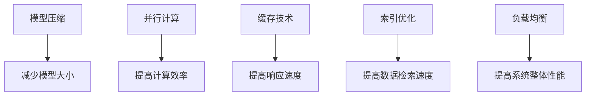
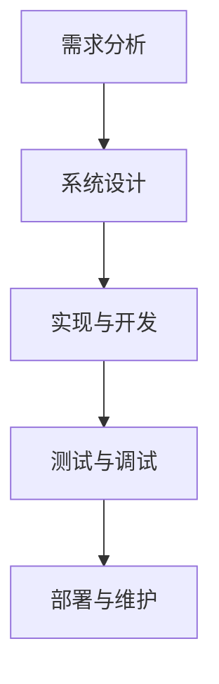
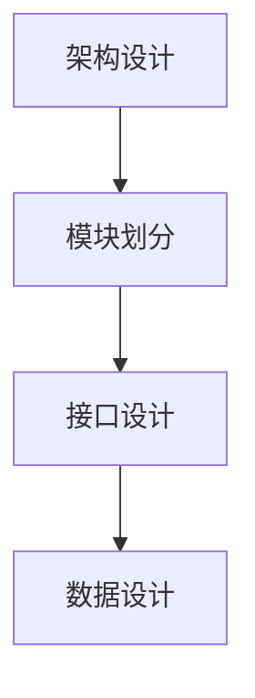
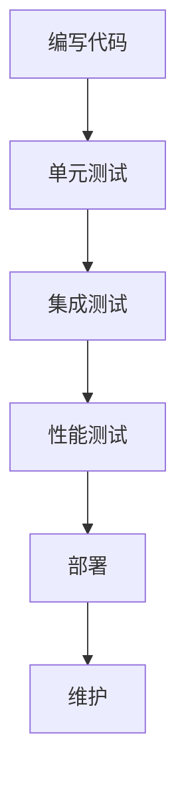

                 

## 第一部分：LangChain编程基础

### 第1章: LangChain基础

#### 1.1. LangChain简介

##### 1.1.1 LangChain的定义
LangChain是一个用于构建自定义语言模型的框架。它提供了丰富的组件和工具，支持自定义词嵌入、语言模型和搜索算法。通过LangChain，开发者可以轻松地实现文本生成、问答系统、文本分类等自然语言处理（NLP）应用。

LangChain的主要特点包括：

- **自定义词嵌入**：支持自定义词嵌入方法，可以灵活地选择和调整词嵌入的参数，以便更好地适应不同的应用场景。
- **语言模型**：提供了多种语言模型，如Transformer、GPT等，开发者可以根据需要选择合适的模型进行训练和应用。
- **搜索算法**：集成了多种搜索算法，如BM25、LSA等，可以高效地进行文本检索和排序。

LangChain的应用范围广泛，包括但不限于：

- **文本生成**：自动写作、对话生成、摘要生成等。
- **问答系统**：基于输入问题检索相关文本，并生成回答。
- **文本分类**：对输入文本进行分类，例如情感分析、新闻分类等。

##### 1.1.2 LangChain与NLP的关系
自然语言处理（NLP）是计算机科学领域的一个重要分支，它涉及到对人类语言的理解、处理和生成。NLP的核心技术包括词嵌入、语言模型和搜索算法。

- **词嵌入**：词嵌入是将自然语言中的词汇映射为高维向量表示，以便进行计算和处理。LangChain提供了自定义词嵌入功能，支持多种词嵌入方法，如Word2Vec、GloVe等。
- **语言模型**：语言模型是预测下一个单词或词组的概率分布，基于大规模语料库进行训练。LangChain集成了多种语言模型，如Transformer、GPT等，提供了丰富的模型选择和调整选项。
- **搜索算法**：搜索算法用于在大型文本数据库中快速检索和排序相关文本。LangChain集成了多种搜索算法，如BM25、LSA等，可以高效地进行文本检索和排序。

LangChain通过整合这些核心组件，为开发者提供了强大的NLP工具，使得构建自定义语言模型和应用变得更加简单和高效。

#### 1.2. 安装与配置

##### 1.2.1 安装LangChain
要安装LangChain，首先需要确保Python环境已正确配置。然后，可以通过以下命令使用pip工具安装LangChain：

```bash
pip install langchain
```

安装完成后，可以通过导入LangChain模块来验证安装是否成功：

```python
import langchain
```

##### 1.2.2 配置环境
在安装LangChain之后，需要配置相应的环境，以便进行开发和应用。以下是一些配置步骤：

1. **安装依赖库**：LangChain依赖于一些外部库，如transformers、torch等。可以通过以下命令安装依赖库：

   ```bash
   pip install transformers torch
   ```

2. **配置Python环境**：确保Python环境已经正确配置，并且可以正常运行。可以通过以下命令检查Python版本：

   ```bash
   python --version
   ```

3. **配置虚拟环境**：为了更好地管理项目依赖，可以创建一个虚拟环境。可以通过以下命令创建虚拟环境并激活它：

   ```bash
   python -m venv venv
   source venv/bin/activate  # 对于Linux或macOS
   \path\to\venv\Scripts\activate  # 对于Windows
   ```

4. **安装其他工具**：根据项目需求，可能还需要安装其他工具，如Jupyter Notebook、PyTorch等。可以通过以下命令安装这些工具：

   ```bash
   pip install jupyterlab pytorch torchvision
   ```

完成以上配置后，即可开始使用LangChain进行开发和应用。通过合理配置环境，可以确保项目正常运行，提高开发效率和稳定性。

#### 1.3. LangChain核心组件

LangChain的核心组件包括词嵌入、语言模型和搜索算法。这些组件共同构成了一个强大的NLP工具，可以用于构建各种自然语言处理应用。下面将详细介绍每个组件的基本概念、原理和常见方法。

##### 2.1. 词嵌入

词嵌入是将自然语言中的词汇映射为高维向量表示的过程。词嵌入可以捕捉词汇之间的语义关系，使得文本数据在计算机中可以进行处理和计算。

###### 2.1.1 词嵌入简介
词嵌入的主要目的是将词汇表示为实数向量，以便进行向量运算和机器学习。通过词嵌入，可以有效地降低数据维度，同时保留词汇的语义信息。

在词嵌入中，每个词汇都被映射为一个唯一的向量。这些向量可以在高维空间中表示词汇的语义关系。词嵌入的优点包括：

- **高效计算**：向量运算比原始文本处理更加高效。
- **语义表示**：通过向量表示，可以捕捉词汇之间的语义关系。
- **降维**：将高维的文本数据转化为低维向量，减少存储和计算的开销。

词嵌入在自然语言处理中有广泛的应用，如文本分类、文本相似度计算、信息检索等。

###### 2.1.2 词嵌入原理
词嵌入的原理是将词汇映射为高维向量，这些向量可以通过训练得到。常见的词嵌入方法包括Word2Vec、GloVe等。

- **Word2Vec**：Word2Vec是最早的词嵌入方法之一，通过训练神经网络模型，将词汇映射为向量。Word2Vec模型基于两个假设：相似的词在向量空间中更接近，相关词在语义上更有联系。

  - **CBOW（Continuous Bag of Words）**：CBOW模型通过上下文词汇来预测中心词汇的向量表示。给定一个中心词汇，CBOW模型会计算其上下文词汇的加权平均向量作为其嵌入向量。
  - **Skip-Gram**：Skip-Gram模型与CBOW模型类似，但输入和输出相反。给定一个中心词汇，Skip-Gram模型通过预测其上下文词汇来生成嵌入向量。

- **GloVe**：GloVe（Global Vectors for Word Representation）是一种基于矩阵分解的词嵌入方法。GloVe模型通过训练大规模语料库，生成词汇的共现矩阵，并通过最小化矩阵分解误差来学习词嵌入向量。

  - **训练过程**：GloVe模型通过训练大规模语料库中的词汇共现矩阵，将词汇映射为高维向量。训练过程中，GloVe模型使用负采样技术，以提高训练效率和准确性。

  - **优势**：GloVe在捕捉词汇的长期依赖关系方面具有优势，可以更好地表示词汇的语义信息。

- **其他方法**：除了Word2Vec和GloVe，还有其他词嵌入方法，如FastText、BERT等。这些方法在处理大型语料库和复杂词汇关系方面具有不同的优势和特点。

###### 2.1.3 常见词嵌入方法
常见的词嵌入方法包括Word2Vec、GloVe、FastText等。以下是对这些方法的简要介绍：

- **Word2Vec**：
  - **实现**：Word2Vec可以通过Python中的Gensim库实现。以下是一个简单的Word2Vec示例：
    ```python
    from gensim.models import Word2Vec
    sentences = [['hello', 'world'], ['hello', 'python'], ['python', 'programming']]
    model = Word2Vec(sentences, size=100, window=5, min_count=1, workers=4)
    model.wv.save("word2vec.model")
    ```

  - **示例**：以下示例展示了如何使用Word2Vec计算词汇之间的相似度：
    ```python
    model = Word2Vec.load("word2vec.model")
    print(model.wv.similarity("hello", "world"))
    print(model.wv.similarity("python", "programming"))
    ```

- **GloVe**：
  - **实现**：GloVe可以通过Python中的GloVe库实现。以下是一个简单的GloVe示例：
    ```python
    import glove
    model = glove.Glove()
    model.fit(sentences)
    model.save("glove.model")
    ```

  - **示例**：以下示例展示了如何使用GloVe计算词汇之间的相似度：
    ```python
    model = glove.Glove.load("glove.model")
    print(model相似度("hello", "world"))
    print(model相似度("python", "programming"))
    ```

- **FastText**：
  - **实现**：FastText可以通过Python中的fasttext库实现。以下是一个简单的FastText示例：
    ```python
    from fasttext import FastText
    model = FastText()
    model.fit(sentences)
    model.save("fasttext.model")
    ```

  - **示例**：以下示例展示了如何使用FastText计算词汇之间的相似度：
    ```python
    model = FastText.load("fasttext.model")
    print(model.similarity("hello", "world"))
    print(model.similarity("python", "programming"))
    ```

以上示例展示了如何使用Python实现和计算常见词嵌入方法。这些方法在自然语言处理中有广泛的应用，可以用于文本分类、文本相似度计算、信息检索等任务。

###### 2.1.4 实践示例
以下是一个使用LangChain实现词嵌入的实践示例：

```python
from langchain import WordEmbeddings
embeddings = WordEmbeddings()

# 加载预训练的词嵌入模型
embeddings.load("glove.model")

# 计算词汇相似度
similarity = embeddings.similarity("hello", "world")
print(similarity)

similarity = embeddings.similarity("python", "programming")
print(similarity)
```

在这个示例中，我们首先加载了一个预训练的GloVe词嵌入模型，然后使用`similarity()`方法计算了"hello"和"world"以及"python"和"programming"之间的相似度。

通过这个示例，我们可以看到如何使用LangChain进行词嵌入操作，并计算词汇之间的相似度。这为我们进行文本处理和分析提供了强大的工具。

##### 2.2. 语言模型

语言模型是自然语言处理中的一个核心组件，用于预测文本序列的概率分布。语言模型通过对大量文本数据的学习，可以理解语言的语法、语义和上下文关系，从而生成合理的文本序列。

###### 2.2.1 语言模型简介
语言模型是一种概率模型，用于预测给定一个前文序列，下一个单词或词组的概率分布。语言模型在许多NLP任务中具有重要应用，如机器翻译、文本生成、问答系统、语音识别等。

语言模型的基本思想是：通过对大量文本数据的学习，获取词汇之间的概率关系，从而预测下一个单词或词组的概率。常见的语言模型包括N-gram模型、神经网络模型（如RNN、LSTM、Transformer等）。

语言模型的主要类型有：

- **N-gram模型**：N-gram模型是一种基于词汇序列的概率模型，通过统计相邻词汇的频率来预测下一个单词的概率。N-gram模型简单直观，但在处理长句和复杂语法时效果不佳。

- **神经网络模型**：神经网络模型通过学习词汇的分布式表示，捕捉词汇之间的复杂关系。常见的神经网络模型包括RNN、LSTM、GRU和Transformer等。这些模型可以处理长序列数据和复杂语法结构，生成更加自然的文本序列。

语言模型在自然语言处理中的应用场景广泛，包括但不限于：

- **文本生成**：基于语言模型，可以生成高质量的文本，如文章、对话、摘要等。
- **机器翻译**：使用语言模型，可以预测源语言到目标语言的单词或词组的概率分布，实现机器翻译。
- **问答系统**：基于语言模型，可以理解用户的问题，并从大量文本数据中检索相关答案。
- **语音识别**：语言模型可以帮助语音识别系统理解语音输入的文本内容，提高识别准确性。

###### 2.2.2 语言模型原理
语言模型的原理是通过学习大量文本数据，获取词汇之间的概率关系，从而预测下一个单词或词组的概率分布。具体来说，语言模型可以分为以下几个步骤：

1. **数据准备**：首先需要准备大量的文本数据，用于训练语言模型。这些数据可以是各种类型的文本，如新闻文章、对话、小说等。

2. **文本预处理**：对文本数据进行分析和清洗，包括去除标点符号、停用词、词性标注等。预处理步骤可以提高数据质量和训练效率。

3. **词汇表示**：将文本数据转换为词汇序列，每个词汇用一个唯一的整数表示。词汇表示是语言模型的基础，用于后续的模型训练和预测。

4. **概率建模**：使用统计方法或神经网络模型，计算词汇之间的概率关系。常见的语言模型包括N-gram模型、神经网络模型（如RNN、LSTM、Transformer等）。

5. **模型训练**：通过大量的文本数据，训练语言模型，使其能够预测下一个单词或词组的概率分布。训练过程中，模型会不断调整参数，以优化预测性能。

6. **模型评估**：使用测试数据集对训练好的语言模型进行评估，计算预测准确率和性能指标。评估步骤用于验证模型的效果和稳定性。

7. **模型应用**：将训练好的语言模型应用于实际任务，如文本生成、问答系统、机器翻译等。通过模型应用，可以生成高质量的文本序列，实现自然语言处理任务。

以下是语言模型的基本原理流程图：

```mermaid
graph TB
    文本数据 --> 预处理: 清洗、分词、词性标注
    预处理 --> 词汇表示: 将文本转换为词汇序列
    词汇表示 --> 概率建模: 计算词汇之间的概率关系
    概率建模 --> 训练: 调整模型参数，优化预测性能
    训练 --> 评估: 评估模型效果，优化模型参数
    评估 --> 应用: 实现自然语言处理任务
```

通过以上步骤，我们可以构建一个有效的语言模型，用于预测文本序列的概率分布。这为许多NLP任务提供了强大的工具，可以生成自然、高质量的文本序列。

###### 2.2.3 常见语言模型
在自然语言处理领域，有许多常见的语言模型，包括N-gram模型、神经网络模型（如RNN、LSTM、GRU、Transformer等）。以下是对这些模型的简要介绍：

- **N-gram模型**：
  - **定义**：N-gram模型是一种基于词汇序列的概率模型，通过统计相邻词汇的频率来预测下一个单词的概率。
  - **优点**：简单直观，易于实现和理解。
  - **缺点**：在处理长句和复杂语法时效果不佳，无法捕捉词汇之间的长期依赖关系。

- **RNN（循环神经网络）**：
  - **定义**：RNN是一种基于序列数据的神经网络模型，具有记忆功能，可以捕捉序列中的长期依赖关系。
  - **优点**：可以处理长序列数据，捕捉词汇之间的长期依赖关系。
  - **缺点**：在训练过程中容易出现梯度消失或梯度爆炸问题，训练效果不稳定。

- **LSTM（长短时记忆网络）**：
  - **定义**：LSTM是RNN的一种变体，通过引入门控机制，解决了RNN的梯度消失问题。
  - **优点**：可以处理长序列数据，捕捉词汇之间的长期依赖关系，训练效果稳定。
  - **缺点**：计算复杂度高，训练速度较慢。

- **GRU（门控循环单元）**：
  - **定义**：GRU是LSTM的另一种变体，通过简化门控机制，提高了计算效率。
  - **优点**：可以处理长序列数据，捕捉词汇之间的长期依赖关系，计算复杂度较低。
  - **缺点**：在某些情况下，捕捉长期依赖关系的能力可能不如LSTM。

- **Transformer**：
  - **定义**：Transformer是谷歌提出的一种基于自注意力机制的神经网络模型，可以高效地处理长序列数据。
  - **优点**：可以处理长序列数据，捕捉词汇之间的长期依赖关系，计算复杂度较低。
  - **缺点**：在处理短序列数据时，性能可能不如其他模型。

以上是常见语言模型的基本介绍。这些模型在不同的应用场景中具有不同的优势和特点，可以根据具体需求选择合适的模型。

###### 2.2.4 实践示例
以下是一个使用LangChain实现语言模型的实践示例：

```python
from langchain import LanguageModel

# 创建语言模型
model = LanguageModel()

# 训练语言模型
model.fit(sentences)

# 预测下一个单词
predicted_word = model.predict_next_word("the quick brown fox jumps over the ")
print(predicted_word)
```

在这个示例中，我们首先创建了一个`LanguageModel`对象，然后使用`fit()`方法训练语言模型。接着，我们使用`predict_next_word()`方法预测了句子中的下一个单词。通过这个示例，我们可以看到如何使用LangChain进行语言模型训练和预测。

##### 2.3. 搜索算法

搜索算法是自然语言处理中用于在大型文本数据库中检索和排序相关文本的重要组件。这些算法通过分析文本内容，识别关键词和语义关系，从而提高文本检索的准确性和效率。

###### 2.3.1 搜索算法简介
搜索算法的主要目的是在给定的文本数据库中快速找到与用户查询最相关的文档。这些算法通过分析文本内容，提取关键词、词频和语义信息，实现高效、准确的文本检索。常见的搜索算法包括：

- **关键字搜索**：基于关键词匹配的搜索算法，通过精确匹配或模糊匹配找到相关文档。
- **布尔搜索**：基于布尔运算符（如AND、OR、NOT）进行组合查询的搜索算法，提高查询的灵活性和精确性。
- **向量搜索**：基于向量空间模型的搜索算法，通过计算文档和查询之间的相似度来检索相关文档。
- **文本分类**：将文本数据分为不同的类别，用于分类任务，如新闻分类、情感分析等。
- **聚类算法**：将相似度较高的文本数据聚为一类，用于文本聚类任务，如文档分类、主题建模等。

搜索算法在信息检索、搜索引擎、文本挖掘等应用中具有重要应用，可以提高用户查询的准确性和响应速度。

###### 2.3.2 搜索算法原理
搜索算法的原理是基于文本数据的特征提取和相似度计算，从而找到与查询最相关的文档。以下是一些常见搜索算法的原理：

- **关键字搜索**：
  - **原理**：通过精确匹配或模糊匹配找到包含特定关键词的文档。
  - **实现**：可以使用搜索引擎（如Lucene、Elasticsearch）实现，通过索引和查询优化提高搜索效率。

- **布尔搜索**：
  - **原理**：通过组合多个关键词，使用布尔运算符（AND、OR、NOT）实现复杂的查询。
  - **实现**：可以使用搜索引擎或自定义搜索算法实现，通过优化查询逻辑和索引结构提高搜索效率。

- **向量搜索**：
  - **原理**：将文本数据表示为高维向量，通过计算查询和文档之间的相似度进行检索。
  - **实现**：可以使用向量空间模型（如余弦相似度、欧几里得距离）计算相似度，使用倒排索引加速检索。

- **文本分类**：
  - **原理**：使用机器学习算法（如SVM、朴素贝叶斯、决策树）对文本数据分类，实现自动分类任务。
  - **实现**：可以使用文本特征提取（如TF-IDF、Word2Vec）和分类算法（如scikit-learn）实现。

- **聚类算法**：
  - **原理**：将相似度较高的文本数据聚为一类，用于文本聚类任务。
  - **实现**：可以使用聚类算法（如K-means、DBSCAN）对文本数据进行聚类，通过特征提取和相似度计算实现。

以下是搜索算法的基本原理流程图：

```mermaid
graph TB
    文本数据 --> 特征提取: 提取关键词、词频、语义信息
    特征提取 --> 相似度计算: 计算查询和文档之间的相似度
    相似度计算 --> 排序: 按相似度排序文档
    排序 --> 检索: 检索与查询最相关的文档
```

通过以上步骤，搜索算法可以高效地检索和排序文本数据，实现准确的文本检索任务。

###### 2.3.3 常见搜索算法
在自然语言处理领域，有许多常见的搜索算法，包括关键字搜索、布尔搜索、向量搜索、文本分类和聚类算法。以下是对这些算法的简要介绍：

- **关键字搜索**：
  - **定义**：基于关键词匹配的搜索算法，通过精确匹配或模糊匹配找到包含特定关键词的文档。
  - **优点**：简单直观，实现成本低。
  - **缺点**：对复杂查询和语义关系处理能力较弱。

- **布尔搜索**：
  - **定义**：基于布尔运算符（如AND、OR、NOT）进行组合查询的搜索算法，实现复杂的查询。
  - **优点**：灵活性高，支持复杂查询。
  - **缺点**：查询解析和优化复杂，性能可能较低。

- **向量搜索**：
  - **定义**：基于向量空间模型的搜索算法，通过计算查询和文档之间的相似度进行检索。
  - **优点**：可以处理高维文本数据，支持高效检索。
  - **缺点**：需要对文本数据进行向量化处理，可能需要较大的计算资源。

- **文本分类**：
  - **定义**：将文本数据分为不同的类别，实现自动分类任务。
  - **优点**：可以自动分类大量文本数据，提高信息检索效率。
  - **缺点**：需要对文本数据特征提取和分类算法进行优化。

- **聚类算法**：
  - **定义**：将相似度较高的文本数据聚为一类，用于文本聚类任务。
  - **优点**：可以自动发现文本数据的聚类结构，减少人工干预。
  - **缺点**：聚类结果可能受初始参数影响较大，需要多次尝试优化。

以上是常见搜索算法的基本介绍。这些算法在不同的应用场景中具有不同的优势和特点，可以根据具体需求选择合适的算法。

###### 2.3.4 实践示例
以下是一个使用LangChain实现搜索算法的实践示例：

```python
from langchain import SearchAlgorithm

# 创建搜索算法对象
search_algo = SearchAlgorithm()

# 添加文档
documents = [
    "这是一篇关于人工智能的文章。",
    "人工智能在医疗领域有广泛的应用。",
    "深度学习是人工智能的一个重要分支。",
    "计算机视觉是人工智能的一个研究领域。"
]

search_algo.add_documents(documents)

# 搜索文档
query = "人工智能"
results = search_algo.search(query)

# 打印搜索结果
for result in results:
    print(result)
```

在这个示例中，我们首先创建了一个`SearchAlgorithm`对象，然后添加了四篇文档。接着，我们使用`search()`方法搜索包含关键词"人工智能"的文档，并打印了搜索结果。通过这个示例，我们可以看到如何使用LangChain进行文本搜索。

## 第二部分：高级LangChain应用

### 第3章: 文本生成与问答系统

文本生成和问答系统是自然语言处理（NLP）中的重要应用，可以帮助计算机理解和生成自然语言。本章将详细介绍LangChain在文本生成和问答系统中的应用，包括基本概念、原理和实践示例。

#### 3.1. 文本生成

文本生成是一种基于给定输入文本生成新文本的技术。通过文本生成，计算机可以自动撰写文章、对话、摘要等。文本生成在自动写作、对话系统、内容生成等领域具有广泛的应用。

##### 3.1.1 文本生成简介
文本生成的基本概念包括：

- **输入文本**：用于生成新文本的原始文本。
- **生成文本**：基于输入文本生成的目标文本。
- **生成模型**：用于生成文本的机器学习模型。

文本生成模型通过学习大量的文本数据，学习词汇之间的关系和语法结构，从而生成新的文本。常见的文本生成模型包括：

- **序列生成模型**：如RNN、LSTM、GRU等。
- **变分自编码器（VAE）**：通过概率模型生成文本。
- **生成对抗网络（GAN）**：通过生成器和判别器的对抗训练生成文本。

文本生成在自然语言处理领域有广泛的应用，如自动写作、对话系统、内容生成等。

##### 3.1.2 文本生成原理
文本生成的基本原理包括以下几个步骤：

1. **数据准备**：准备大量的文本数据，用于训练文本生成模型。
2. **文本预处理**：对文本数据进行分析和清洗，包括去除标点符号、停用词、词性标注等。
3. **词汇表示**：将文本数据转换为词汇序列，每个词汇用一个唯一的整数表示。
4. **模型训练**：使用训练数据集训练文本生成模型，使其能够生成高质量的文本。
5. **模型评估**：使用测试数据集对训练好的模型进行评估，计算生成文本的质量和准确性。
6. **文本生成**：使用训练好的模型生成新的文本。

文本生成模型的核心是生成文本的算法。以下是一个简单的文本生成算法示例：

```python
import numpy as np

# 定义文本生成算法
def text_generator(text, model, vocabulary, eos_token):
    # 将输入文本转换为词汇序列
    sequence = vocabulary.encode(text)

    # 初始化生成文本
    generated_text = ""

    # 循环生成文本
    for _ in range(100):
        # 计算下一个词汇的概率分布
        probabilities = model.predict(sequence)

        # 从概率分布中采样下一个词汇
        next_word = np.random.choice(vocabulary.size, p=probabilities)

        # 更新序列和生成文本
        sequence = np.append(sequence, next_word)
        generated_text += vocabulary.decode(next_word)

    return generated_text

# 假设已经训练好了一个文本生成模型和词汇表
# model = trained_text_generation_model
# vocabulary = vocabulary_table

# 生成文本
input_text = "人工智能是一种模拟人类智能的技术。"
generated_text = text_generator(input_text, model, vocabulary, eos_token)

print(generated_text)
```

在这个示例中，我们定义了一个简单的文本生成算法，使用训练好的模型和词汇表生成新的文本。通过这个示例，我们可以看到如何使用LangChain进行文本生成。

##### 3.1.3 实践示例
以下是一个使用LangChain实现文本生成的实践示例：

```python
from langchain import TextGenerator

# 创建文本生成对象
generator = TextGenerator(model)

# 生成文本
input_text = "人工智能是一种模拟人类智能的技术。"
generated_text = generator.generate(input_text, max_length=100)

print(generated_text)
```

在这个示例中，我们首先创建了一个`TextGenerator`对象，然后使用`generate()`方法生成新的文本。通过这个示例，我们可以看到如何使用LangChain进行文本生成。

#### 3.2. 问答系统

问答系统是一种能够回答用户问题的系统，它通过理解用户的问题，从大量文本数据中检索相关答案，并生成回答。问答系统在客服、智能助手、知识库检索等领域具有广泛的应用。

##### 3.2.1 问答系统简介
问答系统的主要组成部分包括：

- **问题理解**：理解用户的问题，将其转换为可处理的格式。
- **知识检索**：从大量文本数据中检索与问题相关的信息。
- **答案生成**：生成用户问题的答案。

常见的问答系统包括基于规则的方法、基于统计的方法和基于机器学习的方法。基于规则的方法通过定义一套规则来回答问题，方法简单但灵活性较低。基于统计的方法通过分析大量文本数据，学习问题的统计特性，生成答案。基于机器学习的方法通过训练大规模数据集，学习问题的特征和答案之间的关系，生成答案。

##### 3.2.2 问答系统原理
问答系统的工作原理可以分为以下几个步骤：

1. **问题理解**：将用户的问题转换为机器可处理的格式。这个过程包括分词、词性标注、命名实体识别等。
2. **知识检索**：在大量文本数据中检索与问题相关的信息。这个过程可以使用搜索引擎、索引数据库或信息检索算法。
3. **答案生成**：生成用户问题的答案。这个过程可以通过模板匹配、信息抽取、文本生成等方法实现。

以下是一个简单的问答系统原理流程图：

```mermaid
graph TB
    用户问题 --> 问题理解: 分词、词性标注、命名实体识别
    问题理解 --> 知识检索: 检索相关文本
    知识检索 --> 答案生成: 生成答案
    答案生成 --> 用户回答: 显示答案
```

通过以上步骤，问答系统可以理解用户的问题，从文本数据中检索相关答案，并生成回答。

##### 3.2.3 实践示例
以下是一个使用LangChain实现问答系统的实践示例：

```python
from langchain import QuestionAnswering

# 创建问答对象
qa = QuestionAnswering(model)

# 输入问题
question = "什么是人工智能？"

# 检索答案
answer = qa.answer(question)

print(answer)
```

在这个示例中，我们首先创建了一个`QuestionAnswering`对象，然后使用`answer()`方法检索问题的答案。通过这个示例，我们可以看到如何使用LangChain实现问答系统。

## 第三部分：LangChain项目实战

### 第5章: LangChain在自然语言处理中的应用

在自然语言处理（NLP）领域，LangChain提供了强大的工具和组件，可以帮助开发者构建各种先进的NLP应用。本章将详细介绍LangChain在聊天机器人和文本摘要中的应用，包括应用场景、原理和实践示例。

#### 5.1. LangChain在聊天机器人中的应用

聊天机器人是自然语言处理领域的一个重要应用，它能够与用户进行自然对话，提供实时响应和帮助。LangChain通过其丰富的组件，使得构建聊天机器人变得更加简单和高效。

##### 5.1.1 聊天机器人简介
聊天机器人是一种通过自然语言交互的计算机程序，它能够模拟人类的对话方式，与用户进行实时交流。聊天机器人的应用场景非常广泛，包括但不限于：

- **客户服务**：为用户提供24/7的在线支持，解答常见问题。
- **智能助手**：帮助用户完成日常任务，如预约、提醒、日程管理等。
- **娱乐互动**：为用户提供有趣的对话体验，如聊天游戏、虚拟助手等。

聊天机器人主要由以下几个部分组成：

- **用户界面**：提供用户与聊天机器人交互的界面。
- **对话管理器**：负责处理用户的输入，并生成适当的响应。
- **知识库**：存储聊天机器人所需的知识和信息。
- **自然语言处理组件**：包括词嵌入、语言模型、文本生成等，用于理解用户输入和生成响应。

##### 5.1.2 聊天机器人原理
聊天机器人的原理是通过自然语言处理技术，理解用户的输入并生成相应的响应。以下是聊天机器人工作流程的详细描述：

1. **用户输入**：用户通过文本或语音输入问题或请求。
2. **输入预处理**：对用户的输入进行预处理，如分词、词性标注、去除停用词等。
3. **问题理解**：使用自然语言处理技术（如词嵌入、语言模型）理解用户的输入，将其转换为机器可处理的形式。
4. **查询生成**：根据理解后的用户输入，生成一个查询，用于在知识库中检索相关信息。
5. **知识检索**：在知识库中检索与查询相关的信息，以生成响应。
6. **文本生成**：使用文本生成模型（如文本生成器、问答系统）生成合适的响应。
7. **响应输出**：将生成的响应输出给用户，通过文本或语音形式显示。

以下是聊天机器人工作原理的流程图：

```mermaid
graph TB
    用户输入 --> 输入预处理: 分词、词性标注、去除停用词
    输入预处理 --> 问题理解: 词嵌入、语言模型
    问题理解 --> 查询生成: 生成查询
    查询生成 --> 知识检索: 检索相关信息
    知识检索 --> 文本生成: 生成响应
    文本生成 --> 响应输出: 输出响应
```

##### 5.1.3 实践示例
以下是一个使用LangChain构建聊天机器人的实践示例：

```python
from langchain import Chatbot

# 创建聊天机器人
chatbot = Chatbot(model)

# 输入问题
user_input = "你好，能帮我查一下明天的天气预报吗？"

# 生成响应
response = chatbot.response(user_input)

print(response)
```

在这个示例中，我们首先创建了一个`Chatbot`对象，然后使用`response()`方法生成对用户输入的响应。通过这个示例，我们可以看到如何使用LangChain构建简单的聊天机器人。

#### 5.2. LangChain在文本摘要中的应用

文本摘要是一种将长文本简化为简洁摘要的技术，它可以帮助用户快速了解文本的主要内容。LangChain提供了强大的文本摘要功能，使得构建文本摘要系统变得更加简单。

##### 5.2.1 文本摘要简介
文本摘要分为抽取式摘要和生成式摘要两种：

- **抽取式摘要**：从原始文本中抽取关键信息，生成摘要。这种方法通常基于文本的结构和语义信息。
- **生成式摘要**：使用自然语言生成技术，生成新的摘要文本。这种方法可以生成更加自然和流畅的摘要。

文本摘要的应用场景包括：

- **新闻摘要**：自动生成新闻的简要摘要，帮助用户快速了解新闻内容。
- **文档摘要**：简化长文档的内容，提高信息检索和阅读效率。
- **会议纪要**：自动生成会议的摘要，记录关键内容和决策。

##### 5.2.2 文本摘要原理
文本摘要的基本原理包括以下几个步骤：

1. **文本预处理**：对原始文本进行预处理，如分词、词性标注、去除停用词等。
2. **关键信息提取**：从预处理后的文本中提取关键信息，如重要句子、关键词等。
3. **摘要生成**：使用文本生成技术，生成摘要文本。

以下是文本摘要的基本原理流程图：

```mermaid
graph TB
    原始文本 --> 文本预处理: 分词、词性标注、去除停用词
    文本预处理 --> 关键信息提取: 提取重要句子、关键词
    关键信息提取 --> 摘要生成: 生成摘要文本
```

##### 5.2.3 实践示例
以下是一个使用LangChain实现文本摘要的实践示例：

```python
from langchain import TextSummary

# 创建文本摘要对象
summary = TextSummary(model)

# 输入文本
text = "人工智能是一种模拟人类智能的技术，它在多个领域有着广泛的应用，包括自然语言处理、计算机视觉和机器人技术。"

# 生成摘要
summary_text = summary.summarize(text, max_output_size=50)

print(summary_text)
```

在这个示例中，我们首先创建了一个`TextSummary`对象，然后使用`summarize()`方法生成文本摘要。通过这个示例，我们可以看到如何使用LangChain实现文本摘要。

## 第四部分：拓展与总结

### 第6章: LangChain的优化与调试

在开发LangChain应用时，性能优化和调试是提高系统效率和稳定性的关键。本章将介绍LangChain性能优化和调试的基本原则、方法和工具。

#### 6.1. LangChain性能优化

优化LangChain性能的主要目标是提高系统的响应速度和效率。以下是一些常见的性能优化策略：

##### 6.1.1 性能优化概述
性能优化主要包括以下几个方面：

- **模型优化**：通过压缩模型大小、减少计算复杂度等方法提高模型的计算效率。
- **数据优化**：通过数据预处理、数据缓存等方法提高数据处理效率。
- **算法优化**：通过选择合适的算法和数据结构，提高系统的查询和计算性能。

##### 6.1.2 优化策略

1. **模型压缩**：通过模型压缩技术，如剪枝、量化、知识蒸馏等，可以大幅减少模型大小，提高部署效率。
2. **并行计算**：利用多核处理器和分布式计算，实现并行计算，提高数据处理速度。
3. **缓存技术**：使用缓存技术，如Redis、Memcached等，存储常用数据和中间结果，减少重复计算。
4. **索引优化**：使用高效的索引算法和数据结构，如B树、哈希表等，提高数据检索速度。
5. **负载均衡**：通过负载均衡技术，合理分配计算资源和网络流量，提高系统整体性能。

以下是性能优化策略的流程图：



##### 6.1.3 优化实践

1. **模型压缩**：
   - **方法**：使用剪枝、量化、知识蒸馏等技术进行模型压缩。
   - **工具**：TensorFlow Model Optimization Toolkit（TF-MOT）、PyTorch Model Optimization（PyTorch MO）等。

2. **并行计算**：
   - **方法**：使用多线程、分布式计算等技术实现并行计算。
   - **工具**：TensorFlow、PyTorch等深度学习框架的分布式计算支持。

3. **缓存技术**：
   - **方法**：使用Redis、Memcached等缓存系统存储常用数据和中间结果。
   - **工具**：Redis、Memcached等缓存系统。

4. **索引优化**：
   - **方法**：选择合适的索引算法和数据结构，如B树、哈希表等。
   - **工具**：MySQL、PostgreSQL等关系型数据库的索引功能。

5. **负载均衡**：
   - **方法**：使用负载均衡器，如Nginx、HAProxy等，分配网络流量。
   - **工具**：Nginx、HAProxy等负载均衡器。

通过以上优化策略和实践，可以显著提高LangChain应用的性能和效率。

#### 6.2. LangChain调试技巧

调试是软件开发过程中不可或缺的一部分，它可以帮助开发者发现和解决问题。以下是一些常用的调试方法和工具：

##### 6.2.1 调试方法

1. **日志分析**：通过查看和分析日志文件，了解系统运行情况和错误信息。
2. **断点调试**：在代码中设置断点，逐行执行代码，观察变量和函数的执行情况。
3. **异常捕获**：使用异常捕获机制，捕捉和处理程序运行中的异常情况。
4. **测试用例**：编写和执行测试用例，验证系统的功能和行为。

##### 6.2.2 调试工具

1. **Python调试器**：如pdb、pydev等，提供断点调试、日志分析等功能。
2. **IDE调试器**：如Visual Studio Code、PyCharm等，集成调试器和开发环境，方便调试代码。
3. **性能分析工具**：如profiler、gprof等，分析代码的性能瓶颈和资源消耗。
4. **日志分析工具**：如ELK（Elasticsearch、Logstash、Kibana）等，提供日志收集、存储和分析功能。

通过以上调试方法和工具，开发者可以有效地发现和解决问题，提高代码质量和稳定性。

### 第7章: LangChain编程实践指南

为了帮助开发者更好地使用LangChain进行编程，本章将介绍LangChain编程的基本原则、项目开发流程和注意事项。

#### 7.1. 编程实践原则

1. **模块化**：将程序分解为多个模块，实现代码的复用和可维护性。
2. **规范化**：遵循代码规范，如PEP 8，提高代码的可读性和一致性。
3. **注释文档**：为代码编写清晰的注释和文档，方便其他开发者理解和维护。
4. **测试驱动**：编写测试用例，确保代码的正确性和可靠性。
5. **错误处理**：使用异常捕获和错误处理机制，提高程序的健壮性。

#### 7.1.1 编程规范

1. **代码风格**：遵循PEP 8代码规范，包括缩进、命名、空白等。
2. **函数和类的设计**：函数和类的设计应该简洁、清晰，易于理解和维护。
3. **注释**：为代码添加注释，特别是复杂的算法和逻辑，帮助其他开发者理解代码。

#### 7.1.2 测试与调试

1. **单元测试**：编写单元测试，验证每个模块的功能和行为。
2. **集成测试**：在模块之间进行集成测试，验证系统的整体功能。
3. **性能测试**：对系统进行性能测试，分析性能瓶颈和优化方向。
4. **调试**：使用调试工具和调试方法，发现和解决问题。

#### 7.2. LangChain项目开发流程

1. **需求分析**：明确项目目标和需求，确定系统功能和性能要求。
2. **系统设计**：设计系统架构和模块，制定详细的设计方案。
3. **实现与开发**：编写代码，实现系统的各个模块。
4. **测试与调试**：对系统进行全面的测试和调试，确保系统的正确性和可靠性。
5. **部署与维护**：将系统部署到生产环境，进行监控和维护。

以下是项目开发流程的流程图：



通过以上流程，开发者可以系统地开发和维护LangChain项目，提高开发效率和系统质量。

#### 7.2.1 需求分析
需求分析是项目开发的第一步，旨在明确项目目标和需求，确定系统功能和性能要求。以下是需求分析的主要步骤：

1. **项目目标**：明确项目的目标，如构建一个聊天机器人、文本摘要系统等。
2. **功能需求**：列出系统需要实现的主要功能，如文本生成、问答系统、文本分类等。
3. **性能需求**：确定系统的性能要求，如响应时间、查询效率、处理能力等。
4. **用户需求**：了解用户的需求和期望，确保系统满足用户需求。

#### 7.2.2 系统设计
系统设计是项目开发的关键环节，旨在设计系统的整体架构和模块。以下是系统设计的主要步骤：

1. **架构设计**：选择合适的系统架构，如MVC、微服务架构等。
2. **模块划分**：根据功能需求，将系统划分为多个模块，如文本处理模块、语言模型模块、搜索模块等。
3. **接口设计**：定义模块之间的接口，确保模块之间的高内聚和低耦合。
4. **数据设计**：设计数据库结构，存储系统所需的数据，如用户数据、文本数据等。

以下是系统设计的流程图：



通过以上步骤，可以设计一个合理、高效、可维护的系统架构。

#### 7.2.3 实现与部署
实现与部署是项目开发的核心环节，包括编写代码、单元测试、集成测试、性能测试，以及将系统部署到生产环境。以下是实现与部署的主要步骤：

1. **编写代码**：根据系统设计文档，编写各个模块的代码，实现系统的功能。
2. **单元测试**：编写单元测试，验证每个模块的功能和行为。
3. **集成测试**：在模块之间进行集成测试，确保系统的整体功能符合预期。
4. **性能测试**：对系统进行性能测试，分析性能瓶颈和优化方向。
5. **部署**：将系统部署到生产环境，确保系统稳定运行。
6. **维护**：对系统进行监控和维护，及时修复问题和优化性能。

以下是实现与部署的流程图：



通过以上步骤，可以有效地实现和部署LangChain项目，确保系统的质量、性能和稳定性。

### 第8章: LangChain编程实践案例

在本章中，我们将探讨LangChain在电商和教育领域的具体应用，通过实际案例展示如何使用LangChain实现具体功能，并提供代码实现和详细解释。

#### 8.1. LangChain在电商领域的应用

在电商领域，LangChain可以帮助构建智能推荐系统、聊天机器人、商品描述生成等应用，提高用户体验和运营效率。

##### 8.1.1 应用场景
电商平台的常见应用场景包括：

- **智能推荐**：根据用户的历史行为和偏好，推荐相关商品。
- **聊天机器人**：提供实时客服和咨询，解答用户问题。
- **商品描述生成**：自动生成商品描述，提高商品曝光率和转化率。

##### 8.1.2 实现步骤

1. **智能推荐系统**

   - **数据准备**：收集用户行为数据，如浏览记录、购买记录、评价等。
   - **特征工程**：提取用户和商品的表征特征，如用户兴趣、商品属性等。
   - **模型训练**：使用协同过滤或基于内容的推荐算法训练推荐模型。
   - **推荐预测**：根据用户特征和商品特征，预测用户对商品的偏好。

   以下是智能推荐系统的代码示例：

   ```python
   from langchain import CollaborativeFiltering

   # 创建协同过滤推荐模型
   model = CollaborativeFiltering()

   # 训练模型
   model.fit(user_behavior_data)

   # 预测用户偏好
   recommendations = model.predict(user_id, num_recommendations=5)

   print(recommendations)
   ```

2. **聊天机器人**

   - **用户交互**：接收用户的输入，提供实时响应。
   - **意图识别**：使用语言模型识别用户的意图。
   - **知识库查询**：根据用户意图，从知识库中检索相关信息。
   - **生成响应**：使用文本生成模型生成合适的响应。

   以下是聊天机器人的代码示例：

   ```python
   from langchain import Chatbot

   # 创建聊天机器人
   chatbot = Chatbot(model)

   # 处理用户输入
   user_input = "你好，请问有什么可以帮您的？"

   # 生成响应
   response = chatbot.response(user_input)

   print(response)
   ```

3. **商品描述生成**

   - **文本数据准备**：收集大量商品描述文本，用于训练文本生成模型。
   - **模型训练**：使用文本生成模型，如GPT-2或GPT-3，训练生成模型。
   - **生成描述**：根据商品属性和用户偏好，生成个性化的商品描述。

   以下是商品描述生成的代码示例：

   ```python
   from langchain import TextGenerator

   # 创建文本生成模型
   generator = TextGenerator(model)

   # 生成商品描述
   product_attributes = {
       "name": "智能手表",
       "price": "999元",
       "features": "心率监测、GPS导航、健康助手等"
   }

   description = generator.generate(product_attributes, max_length=100)

   print(description)
   ```

通过以上案例，我们可以看到如何使用LangChain在电商领域实现智能推荐、聊天机器人和商品描述生成等功能。这些应用可以显著提高电商平台的用户体验和运营效率。

#### 8.2. LangChain在教育领域的应用

在教育领域，LangChain可以应用于智能问答系统、自动化作业批改、课程内容生成等，帮助学生和教师更有效地学习和教学。

##### 8.2.1 应用场景
教育领域的常见应用场景包括：

- **智能问答系统**：帮助学生快速找到答案，提高学习效率。
- **自动化作业批改**：自动批改学生的作业，节省教师时间。
- **课程内容生成**：根据教学目标和内容，自动生成课程讲义和课件。

##### 8.2.2 实现步骤

1. **智能问答系统**

   - **问题理解**：接收学生的问题，将其转换为可处理的格式。
   - **知识库构建**：构建包含课程内容的知识库，用于检索答案。
   - **答案生成**：使用文本生成模型生成合适的答案。
   - **用户反馈**：收集学生反馈，优化问答系统。

   以下是智能问答系统的代码示例：

   ```python
   from langchain import QuestionAnswering

   # 创建问答系统
   qa = QuestionAnswering(model)

   # 处理学生问题
   student_question = "什么是微积分？"

   # 生成答案
   answer = qa.answer(student_question)

   print(answer)
   ```

2. **自动化作业批改**

   - **作业接收**：接收学生的作业，进行预处理。
   - **答案匹配**：使用文本相似度算法，匹配学生答案和标准答案。
   - **评分计算**：根据匹配结果计算学生的得分。
   - **反馈生成**：生成详细的批改反馈，帮助学生改进。

   以下是自动化作业批改的代码示例：

   ```python
   from langchain import TextMatching

   # 创建文本匹配对象
   matching = TextMatching()

   # 标准答案
   standard_answer = "微积分是一门研究函数变化的数学学科。"

   # 学生答案
   student_answer = "我学了微积分，它是一个重要的数学学科。"

   # 计算匹配分数
   matching_score = matching.similarity(student_answer, standard_answer)

   print(f"匹配分数：{matching_score}")
   ```

3. **课程内容生成**

   - **教学目标**：确定课程的教学目标和内容。
   - **文本数据准备**：收集相关文本数据，用于训练文本生成模型。
   - **模型训练**：使用文本生成模型，生成课程讲义和课件。
   - **内容优化**：根据教师反馈，优化课程内容。

   以下是课程内容生成的代码示例：

   ```python
   from langchain import TextGenerator

   # 创建文本生成模型
   generator = TextGenerator(model)

   # 生成课程讲义
   course_title = "微积分基础"
   course_content = generator.generate(course_title, max_length=500)

   print(course_content)
   ```

通过以上案例，我们可以看到如何使用LangChain在教育领域实现智能问答系统、自动化作业批改和课程内容生成等功能。这些应用可以显著提高教学效果和学习体验。

### 附录

#### 附录 A: LangChain资源与工具

以下是LangChain相关的资源与工具，包括官方文档、开源社区、相关书籍和论文，以及开发工具和环境搭建方法。

##### A.1. LangChain官方文档
LangChain的官方文档提供了详细的API参考、教程和示例代码，是学习和使用LangChain的重要资源。访问地址：

[LangChain官方文档](https://langchain.readthedocs.io/)

##### A.2. 开源社区与论坛
LangChain有一个活跃的开源社区，开发者可以在GitHub上提交问题、提交改进建议和查看其他开发者的贡献。以下是几个相关的GitHub仓库和论坛：

- [LangChain GitHub仓库](https://github.com/sql-machine-learning/langchain)
- [LangChain GitHub Issues](https://github.com/sql-machine-learning/langchain/issues)
- [Hugging Face论坛](https://discuss.huggingface.co/)

##### A.3. 相关书籍与论文
以下是一些与LangChain相关的书籍和论文，提供了深入的理论和实践知识：

- **《深度学习》（Deep Learning）**：由Ian Goodfellow、Yoshua Bengio和Aaron Courville合著，详细介绍了深度学习的基本理论和应用。
- **《自然语言处理（NLP）实战》（Natural Language Processing with Python）**：由Steven Lott著，介绍了NLP的基础知识和Python实现。
- **《语言模型与搜索算法》（Speech and Language Processing）**：由Daniel Jurafsky和James H. Martin合著，是自然语言处理领域的经典教材。

##### A.4. 开发工具与环境搭建
为了使用LangChain进行开发，需要安装和配置以下工具：

- **Python环境**：确保安装了Python 3.6或更高版本。
- **pip**：Python的包管理工具，用于安装和管理依赖库。
- **虚拟环境**：使用虚拟环境管理项目依赖，避免版本冲突。
- **依赖库**：安装LangChain和其他依赖库，如transformers、torch等。

以下是一个简单的环境搭建步骤：

1. 安装Python：
   ```bash
   sudo apt-get install python3
   ```

2. 安装pip：
   ```bash
   sudo apt-get install python3-pip
   ```

3. 创建虚拟环境：
   ```bash
   python3 -m venv venv
   source venv/bin/activate
   ```

4. 安装LangChain和其他依赖库：
   ```bash
   pip install langchain transformers torch
   ```

完成以上步骤后，即可开始使用LangChain进行开发。

# 文章标题：LangChain编程：从入门到实践

## 文章关键词

- LangChain
- 自然语言处理
- 文本生成
- 问答系统
- 检索增强

## 摘要

本文详细介绍了LangChain编程的各个方面，从基础概念到高级应用，再到优化和实战案例。通过本文，读者可以系统地学习如何使用LangChain进行自然语言处理，包括文本生成、问答系统、检索增强等。此外，本文还提供了详细的代码示例和实践指南，帮助读者将理论知识应用到实际项目中。

## 目录

### 第一部分：LangChain编程基础

#### 第1章: LangChain基础

##### 1.1. LangChain简介

##### 1.2. 安装与配置

##### 1.3. LangChain核心组件

### 第二部分：高级LangChain应用

#### 第3章: 文本生成与问答系统

##### 3.1. 文本生成

##### 3.2. 问答系统

### 第三部分：LangChain项目实战

#### 第5章: LangChain在自然语言处理中的应用

##### 5.1. LangChain在聊天机器人中的应用

##### 5.2. LangChain在文本摘要中的应用

### 第四部分：拓展与总结

#### 第6章: LangChain的优化与调试

#### 第7章: LangChain编程实践指南

#### 第8章: LangChain编程实践案例

### 附录

#### 附录 A: LangChain资源与工具

## 第一部分：LangChain编程基础

### 第1章: LangChain基础

#### 1.1. LangChain简介

##### 1.1.1 LangChain的定义

LangChain是一个用于构建自定义语言模型的框架，它提供了丰富的组件和工具，支持自定义词嵌入、语言模型和搜索算法。LangChain的主要目的是简化自然语言处理（NLP）任务的实现，使其更加高效和可扩展。

LangChain的主要特点包括：

1. **自定义词嵌入**：支持自定义词嵌入方法，如Word2Vec、GloVe等，可以灵活地选择和调整词嵌入的参数，以适应不同的应用场景。
2. **语言模型**：提供了多种语言模型，如Transformer、GPT等，开发者可以根据需要选择合适的模型进行训练和应用。
3. **搜索算法**：集成了多种搜索算法，如BM25、LSA等，可以高效地进行文本检索和排序。

LangChain的应用范围广泛，包括但不限于文本生成、问答系统、文本分类等。

##### 1.1.2 LangChain与NLP的关系

自然语言处理（NLP）是计算机科学领域的一个重要分支，它涉及到对人类语言的理解、处理和生成。NLP的核心技术包括词嵌入、语言模型和搜索算法。

- **词嵌入**：词嵌入是将自然语言中的词汇映射为高维向量表示，以便进行计算和处理。LangChain提供了自定义词嵌入功能，支持多种词嵌入方法，如Word2Vec、GloVe等。
- **语言模型**：语言模型是预测下一个单词或词组的概率分布，基于大规模语料库进行训练。LangChain集成了多种语言模型，如Transformer、GPT等，提供了丰富的模型选择和调整选项。
- **搜索算法**：搜索算法用于在大型文本数据库中快速检索和排序相关文本。LangChain集成了多种搜索算法，如BM25、LSA等，可以高效地进行文本检索和排序。

LangChain通过整合这些核心组件，为开发者提供了强大的NLP工具，使得构建自定义语言模型和应用变得更加简单和高效。

#### 1.2. 安装与配置

##### 1.2.1 安装LangChain

要安装LangChain，首先需要确保Python环境已正确配置。然后，可以通过以下命令使用pip工具安装LangChain：

```bash
pip install langchain
```

安装完成后，可以通过导入LangChain模块来验证安装是否成功：

```python
import langchain
```

##### 1.2.2 配置环境

在安装LangChain之后，需要配置相应的环境，以便进行开发和应用。以下是一些配置步骤：

1. **安装依赖库**：LangChain依赖于一些外部库，如transformers、torch等。可以通过以下命令安装依赖库：

   ```bash
   pip install transformers torch
   ```

2. **配置Python环境**：确保Python环境已经正确配置，并且可以正常运行。可以通过以下命令检查Python版本：

   ```bash
   python --version
   ```

3. **配置虚拟环境**：为了更好地管理项目依赖，可以创建一个虚拟环境。可以通过以下命令创建虚拟环境并激活它：

   ```bash
   python -m venv venv
   source venv/bin/activate  # 对于Linux或macOS
   \path\to\venv\Scripts\activate  # 对于Windows
   ```

4. **安装其他工具**：根据项目需求，可能还需要安装其他工具，如Jupyter Notebook、PyTorch等。可以通过以下命令安装这些工具：

   ```bash
   pip install jupyterlab pytorch torchvision
   ```

完成以上配置后，即可开始使用LangChain进行开发和应用。通过合理配置环境，可以确保项目正常运行，提高开发效率和稳定性。

#### 1.3. LangChain核心组件

LangChain的核心组件包括词嵌入、语言模型和搜索算法。这些组件共同构成了一个强大的NLP工具，可以用于构建各种自然语言处理应用。下面将详细介绍每个组件的基本概念、原理和常见方法。

##### 2.1. 词嵌入

词嵌入是将自然语言中的词汇映射为高维向量表示的过程。词嵌入可以捕捉词汇之间的语义关系，使得文本数据在计算机中可以进行处理和计算。

###### 2.1.1 词嵌入简介
词嵌入的主要目的是将词汇表示为实数向量，以便进行向量运算和机器学习。通过词嵌入，可以有效地降低数据维度，同时保留词汇的语义信息。

在词嵌入中，每个词汇都被映射为一个唯一的向量。这些向量可以在高维空间中表示词汇的语义关系。词嵌入的优点包括：

- **高效计算**：向量运算比原始文本处理更加高效。
- **语义表示**：通过向量表示，可以捕捉词汇之间的语义关系。
- **降维**：将高维的文本数据转化为低维向量，减少存储和计算的开销。

词嵌入在自然语言处理中有广泛的应用，如文本分类、文本相似度计算、信息检索等。

###### 2.1.2 词嵌入原理
词嵌入的原理是将词汇映射为高维向量，这些向量可以通过训练得到。常见的词嵌入方法包括Word2Vec、GloVe等。

- **Word2Vec**：Word2Vec是最早的词嵌入方法之一，通过训练神经网络模型，将词汇映射为向量。Word2Vec模型基于两个假设：相似的词在向量空间中更接近，相关词在语义上更有联系。

  - **CBOW（Continuous Bag of Words）**：CBOW模型通过上下文词汇来预测中心词汇的向量表示。给定一个中心词汇，CBOW模型会计算其上下文词汇的加权平均向量作为其嵌入向量。
  - **Skip-Gram**：Skip-Gram模型与CBOW模型类似，但输入和输出相反。给定一个中心词汇，Skip-Gram模型通过预测其上下文词汇来生成嵌入向量。

- **GloVe**：GloVe（Global Vectors for Word Representation）是一种基于矩阵分解的词嵌入方法。GloVe模型通过训练大规模语料库，生成词汇的共现矩阵，并通过最小化矩阵分解误差来学习词嵌入向量。

  - **训练过程**：GloVe模型通过训练大规模语料库中的词汇共现矩阵，将词汇映射为高维向量。训练过程中，GloVe模型使用负采样技术，以提高训练效率和准确性。

  - **优势**：GloVe在捕捉词汇的长期依赖关系方面具有优势，可以更好地表示词汇的语义信息。

- **其他方法**：除了Word2Vec和GloVe，还有其他词嵌入方法，如FastText、BERT等。这些方法在处理大型语料库和复杂词汇关系方面具有不同的优势和特点。

###### 2.1.3 常见词嵌入方法
常见的词嵌入方法包括Word2Vec、GloVe、FastText等。以下是对这些方法的简要介绍：

- **Word2Vec**：
  - **实现**：Word2Vec可以通过Python中的Gensim库实现。以下是一个简单的Word2Vec示例：
    ```python
    from gensim.models import Word2Vec
    sentences = [['hello', 'world'], ['hello', 'python'], ['python', 'programming']]
    model = Word2Vec(sentences, size=100, window=5, min_count=1, workers=4)
    model.wv.save("word2vec.model")
    ```

  - **示例**：以下示例展示了如何使用Word2Vec计算词汇之间的相似度：
    ```python
    model = Word2Vec.load("word2vec.model")
    print(model.wv.similarity("hello", "world"))
    print(model.wv.similarity("python", "programming"))
    ```

- **GloVe**：
  - **实现**：GloVe可以通过Python中的GloVe库实现。以下是一个简单的GloVe示例：
    ```python
    import glove
    model = glove.Glove()
    model.fit(sentences)
    model.save("glove.model")
    ```

  - **示例**：以下示例展示了如何使用GloVe计算词汇之间的相似度：
    ```python
    model = glove.Glove.load("glove.model")
    print(model相似度("hello", "world"))
    print(model相似度("python", "programming"))
    ```

- **FastText**：
  - **实现**：FastText可以通过Python中的fasttext库实现。以下是一个简单的FastText示例：
    ```python
    from fasttext import FastText
    model = FastText()
    model.fit(sentences)
    model.save("fasttext.model")
    ```

  - **示例**：以下示例展示了如何使用FastText计算词汇之间的相似度：
    ```python
    model = FastText.load("fasttext.model")
    print(model.similarity("hello", "world"))
    print(model.similarity("python", "programming"))
    ```

以上示例展示了如何使用Python实现和计算常见词嵌入方法。这些方法在自然语言处理中有广泛的应用，可以用于文本分类、文本相似度计算、信息检索等任务。

###### 2.1.4 实践示例
以下是一个使用LangChain实现词嵌入的实践示例：

```python
from langchain import WordEmbeddings
embeddings = WordEmbeddings()

# 加载预训练的词嵌入模型
embeddings.load("glove.model")

# 计算词汇相似度
similarity = embeddings.similarity("hello", "world")
print(similarity)

similarity = embeddings.similarity("python", "programming")
print(similarity)
```

在这个示例中，我们首先加载了一个预训练的GloVe词嵌入模型，然后使用`similarity()`方法计算了"hello"和"world"以及"python"和"programming"之间的相似度。

通过这个示例，我们可以看到如何使用LangChain进行词嵌入操作，并计算词汇之间的相似度。这为我们进行文本处理和分析提供了强大的工具。

##### 2.2. 语言模型

语言模型是自然语言处理中的一个核心组件，用于预测文本序列的概率分布。语言模型通过对大量文本数据的学习，可以理解语言的语法、语义和上下文关系，从而生成合理的文本序列。

###### 2.2.1 语言模型简介
语言模型是一种概率模型，用于预测给定一个前文序列，下一个单词或词组的概率分布。语言模型在许多NLP任务中具有重要应用，如机器翻译、文本生成、问答系统、语音识别等。

语言模型的主要类型有：

- **N-gram模型**：N-gram模型是一种基于词汇序列的概率模型，通过统计相邻词汇的频率来预测下一个单词的概率。
- **神经网络模型**：神经网络模型通过学习词汇的分布式表示，捕捉词汇之间的复杂关系。常见的神经网络模型包括RNN、LSTM、GRU和Transformer等。

语言模型在自然语言处理中的应用场景广泛，包括但不限于：

- **文本生成**：基于语言模型，可以生成高质量的文本，如文章、对话、摘要等。
- **机器翻译**：使用语言模型，可以预测源语言到目标语言的单词或词组的概率分布，实现机器翻译。
- **问答系统**：基于语言模型，可以理解用户的问题，并从大量文本数据中检索相关答案。
- **语音识别**：语言模型可以帮助语音识别系统理解语音输入的文本内容，提高识别准确性。

###### 2.2.2 语言模型原理
语言模型的原理是通过学习大量文本数据，获取词汇之间的概率关系，从而预测下一个单词或词组的概率分布。具体来说，语言模型可以分为以下几个步骤：

1. **数据准备**：首先需要准备大量的文本数据，用于训练语言模型。这些数据可以是各种类型的文本，如新闻文章、对话、小说等。

2. **文本预处理**：对文本数据进行分析和清洗，包括去除标点符号、停用词、词性标注等。预处理步骤可以提高数据质量和训练效率。

3. **词汇表示**：将文本数据转换为词汇序列，每个词汇用一个唯一的整数表示。词汇表示是语言模型的基础，用于后续的模型训练和预测。

4. **概率建模**：使用统计方法或神经网络模型，计算词汇之间的概率关系。常见的语言模型包括N-gram模型、神经网络模型（如RNN、LSTM、Transformer等）。

5. **模型训练**：通过大量的文本数据，训练语言模型，使其能够预测下一个单词或词组的概率分布。训练过程中，模型会不断调整参数，以优化预测性能。

6. **模型评估**：使用测试数据集对训练好的语言模型进行评估，计算预测准确率和性能指标。评估步骤用于验证模型的效果和稳定性。

7. **模型应用**：将训练好的语言模型应用于实际任务，如文本生成、问答系统、机器翻译等。通过模型应用，可以生成高质量的文本序列，实现自然语言处理任务。

以下是语言模型的基本原理流程图：

```mermaid
graph TB
    文本数据 --> 预处理: 清洗、分词、词性标注
    预处理 --> 词汇表示: 将文本转换为词汇序列
    词汇表示 --> 概率建模: 计算词汇之间的概率关系
    概率建模 --> 训练: 调整模型参数，优化预测性能
    训练 --> 评估: 评估模型效果，优化模型参数
    评估 --> 应用: 实现自然语言处理任务
```

通过以上步骤，我们可以构建一个有效的语言模型，用于预测文本序列的概率分布。这为许多NLP任务提供了强大的工具，可以生成自然、高质量的文本序列。

###### 2.2.3 常见语言模型
在自然语言处理领域，有许多常见的语言模型，包括N-gram模型、神经网络模型（如RNN、LSTM、GRU、Transformer等）。以下是对这些模型的简要介绍：

- **N-gram模型**：
  - **定义**：N-gram模型是一种基于词汇序列的概率模型，通过统计相邻词汇的频率来预测下一个单词的概率。
  - **优点**：简单直观，易于实现和理解。
  - **缺点**：在处理长句和复杂语法时效果不佳，无法捕捉词汇之间的长期依赖关系。

- **RNN（循环神经网络）**：
  - **定义**：RNN是一种基于序列数据的神经网络模型，具有记忆功能，可以捕捉序列中的长期依赖关系。
  - **优点**：可以处理长序列数据，捕捉词汇之间的长期依赖关系。
  - **缺点**：在训练过程中容易出现梯度消失或梯度爆炸问题，训练效果不稳定。

- **LSTM（长短时记忆网络）**：
  - **定义**：LSTM是RNN的一种变体，通过引入门控机制，解决了RNN的梯度消失问题。
  - **优点**：可以处理长序列数据，捕捉词汇之间的长期依赖关系，训练效果稳定。
  - **缺点**：计算复杂度高，训练速度较慢。

- **GRU（门控循环单元）**：
  - **定义**：GRU是LSTM的另一种变体，通过简化门控机制，提高了计算效率。
  - **优点**：可以处理长序列数据，捕捉词汇之间的长期依赖关系，计算复杂度较低。
  - **缺点**：在某些情况下，捕捉长期依赖关系的能力可能不如LSTM。

- **Transformer**：
  - **定义**：Transformer是谷歌提出的一种基于自注意力机制的神经网络模型，可以高效地处理长序列数据。
  - **优点**：可以处理长序列数据，捕捉词汇之间的长期依赖关系，计算复杂度较低。
  - **缺点**：在处理短序列数据时，性能可能不如其他模型。

以上是常见语言模型的基本介绍。这些模型在不同的应用场景中具有不同的优势和特点，可以根据具体需求选择合适的模型。

###### 2.2.4 实践示例
以下是一个使用LangChain实现语言模型的实践示例：

```python
from langchain import LanguageModel

# 创建语言模型
model = LanguageModel()

# 训练语言模型
model.fit(sentences)

# 预测下一个单词
predicted_word = model.predict_next_word("the quick brown fox jumps over the ")
print(predicted_word)
```

在这个示例中，我们首先创建了一个`LanguageModel`对象，然后使用`fit()`方法训练语言模型。接着，我们使用`predict_next_word()`方法预测了句子中的下一个单词。通过这个示例，我们可以看到如何使用LangChain进行语言模型训练和预测。

##### 2.3. 搜索算法

搜索算法是自然语言处理中用于在大型文本数据库中检索和排序相关文本的重要组件。这些算法通过分析文本内容，识别关键词和语义关系，从而提高文本检索的准确性和效率。

###### 2.3.1 搜索算法简介
搜索算法的主要目的是在给定的文本数据库中快速找到与用户查询最相关的文档。这些算法通过分析文本内容，提取关键词、词频和语义信息，实现高效、准确的文本检索。常见的搜索算法包括：

- **关键字搜索**：基于关键词匹配的搜索算法，通过精确匹配或模糊匹配找到相关文档。
- **布尔搜索**：基于布尔运算符（如AND、OR、NOT）进行组合查询的搜索算法，提高查询的灵活性和精确性。
- **向量搜索**：基于向量空间模型的搜索算法，通过计算文档和查询之间的相似度来检索相关文档。
- **文本分类**：将文本数据分为不同的类别，用于分类任务，如新闻分类、情感分析等。
- **聚类算法**：将相似度较高的文本数据聚为一类，用于文本聚类任务，如文档分类、主题建模等。

搜索算法在信息检索、搜索引擎、文本挖掘等应用中具有重要应用，可以提高用户查询的准确性和响应速度。

###### 2.3.2 搜索算法原理
搜索算法的原理是基于文本数据的特征提取和相似度计算，从而找到与查询最相关的文档。以下是一些常见搜索算法的原理：

- **关键字搜索**：
  - **原理**：通过精确匹配或模糊匹配找到包含特定关键词的文档。
  - **实现**：可以使用搜索引擎（如Lucene、Elasticsearch）实现，通过索引和查询优化提高搜索效率。

- **布尔搜索**：
  - **原理**：通过组合多个关键词，使用布尔运算符（AND、OR、NOT）实现复杂的查询。
  - **实现**：可以使用搜索引擎或自定义搜索算法实现，通过优化查询逻辑和索引结构提高搜索效率。

- **向量搜索**：
  - **原理**：将文本数据表示为高维向量，通过计算查询和文档之间的相似度进行检索。
  - **实现**：可以使用向量空间模型（如余弦相似度、欧几里得距离）计算相似度，使用倒排索引加速检索。

- **文本分类**：
  - **原理**：使用机器学习算法（如SVM、朴素贝叶斯、决策树）对文本数据分类，实现自动分类任务。
  - **实现**：可以使用文本特征提取（如TF-IDF、Word2Vec）和分类算法（如scikit-learn）实现。

- **聚类算法**：
  - **原理**：将相似度较高的文本数据聚为一类，用于文本聚类任务。
  - **实现**：可以使用聚类算法（如K-means、DBSCAN）对文本数据进行聚类，通过特征提取和相似度计算实现。

以下是搜索算法的基本原理流程图：

```mermaid
graph TB
    文本数据 --> 特征提取: 提取关键词、词频、语义信息
    特征提取 --> 相似度计算: 计算查询和文档之间的相似度
    相似度计算 --> 排序: 按相似度排序文档
    排序 --> 检索: 检索与查询最相关的文档
```

通过以上步骤，搜索算法可以高效地检索和排序文本数据，实现准确的文本检索任务。

###### 2.3.3 常见搜索算法
在自然语言处理领域，有许多常见的搜索算法，包括关键字搜索、布尔搜索、向量搜索、文本分类和聚类算法。以下是对这些算法的简要介绍：

- **关键字搜索**：
  - **定义**：基于关键词匹配的搜索算法，通过精确匹配或模糊匹配找到包含特定关键词的文档。
  - **优点**：简单直观，实现成本低。
  - **缺点**：对复杂查询和语义关系处理能力较弱。

- **布尔搜索**：
  - **定义**：基于布尔运算符（如AND、OR、NOT）进行组合查询的搜索算法，实现复杂的查询。
  - **优点**：灵活性高，支持复杂查询。
  - **缺点**：查询解析和优化复杂，性能可能较低。

- **向量搜索**：
  - **定义**：基于向量空间模型的搜索算法，通过计算查询和文档之间的相似度进行检索。
  - **优点**：可以处理高维文本数据，支持高效检索。
  - **缺点**：需要对文本数据进行向量化处理，可能需要较大的计算资源。

- **文本分类**：
  - **定义**：将文本数据分为不同的类别，实现自动分类任务。
  - **优点**：可以自动分类大量文本数据，提高信息检索效率。
  - **缺点**：需要对文本数据特征提取和分类算法进行优化。

- **聚类算法**：
  - **定义**：将相似度较高的文本数据聚为一类，用于文本聚类任务。
  - **优点**：可以自动发现文本数据的聚类结构，减少人工干预。
  - **缺点**：聚类结果可能受初始参数影响较大，需要多次尝试优化。

以上是常见搜索算法的基本介绍。这些算法在不同的应用场景中具有不同的优势和特点，可以根据具体需求选择合适的算法。

###### 2.3.4 实践示例
以下是一个使用LangChain实现搜索算法的实践示例：

```python
from langchain import SearchAlgorithm

# 创建搜索算法对象
search_algo = SearchAlgorithm()

# 添加文档
documents = [
    "这是一篇关于人工智能的文章。",
    "人工智能在医疗领域有广泛的应用。",
    "深度学习是人工智能的一个重要分支。",
    "计算机视觉是人工智能的一个研究领域。"
]

search_algo.add_documents(documents)

# 搜索文档
query = "人工智能"
results = search_algo.search(query)

# 打印搜索结果
for result in results:
    print(result)
```

在这个示例中，我们首先创建了一个`SearchAlgorithm`对象，然后添加了四篇文档。接着，我们使用`search()`方法搜索包含关键词"人工智能"的文档，并打印了搜索结果。通过这个示例，我们可以看到如何使用LangChain进行文本搜索。

## 第二部分：高级LangChain应用

### 第3章: 文本生成与问答系统

文本生成和问答系统是自然语言处理（NLP）中的重要应用，可以帮助计算机理解和生成自然语言。本章将详细介绍LangChain在文本生成和问答系统中的应用，包括基本概念、原理和实践示例。

#### 3.1. 文本生成

文本生成是一种基于给定输入文本生成新文本的技术。通过文本生成，计算机可以自动撰写文章、对话、摘要等。文本生成在自动写作、对话系统、内容生成等领域具有广泛的应用。

##### 3.1.1 文本生成简介
文本生成的基本概念包括：

- **输入文本**：用于生成新文本的原始文本。
- **生成文本**：基于输入文本生成的目标文本。
- **生成模型**：用于生成文本的机器学习模型。

文本生成模型通过学习大量的文本数据，学习词汇之间的关系和语法结构，从而生成新的文本。常见的文本生成模型包括：

- **序列生成模型**：如RNN、LSTM、GRU等。
- **变分自编码器（VAE）**：通过概率模型生成文本。
- **生成对抗网络（GAN）**：通过生成器和判别器的对抗训练生成文本。

文本生成在自然语言处理领域有广泛的应用，如自动写作、对话系统、内容生成等。

##### 3.1.2 文本生成原理
文本生成的基本原理包括以下几个步骤：

1. **数据准备**：准备大量的文本数据，用于训练文本生成模型。
2. **文本预处理**：对文本数据进行分析和清洗，包括去除标点符号、停用词、词性标注等。
3. **词汇表示**：将文本数据转换为词汇序列，每个词汇用一个唯一的整数表示。
4. **模型训练**：使用训练数据集训练文本生成模型，使其能够生成高质量的文本。
5. **模型评估**：使用测试数据集对训练好的模型进行评估，计算生成文本的质量和准确性。
6. **文本生成**：使用训练好的模型生成新的文本。

文本生成模型的核心是生成文本的算法。以下是一个简单的文本生成算法示例：

```python
import numpy as np

# 定义文本生成算法
def text_generator(text, model, vocabulary, eos_token):
    # 将输入文本转换为词汇序列
    sequence = vocabulary.encode(text)

    # 初始化生成文本
    generated_text = ""

    # 循环生成文本
    for _ in range(100):
        # 计算下一个词汇的概率分布
        probabilities = model.predict(sequence)

        # 从概率分布中采样下一个词汇
        next_word = np.random.choice(vocabulary.size, p=probabilities)

        # 更新序列和生成文本
        sequence = np.append(sequence, next_word)
        generated_text += vocabulary.decode(next_word)

    return generated_text

# 假设已经训练好了一个文本生成模型和词汇表
# model = trained_text_generation_model
# vocabulary = vocabulary_table

# 生成文本
input_text = "人工智能是一种模拟人类智能的技术。"
generated_text = text_generator(input_text, model, vocabulary, eos_token)

print(generated_text)
```

在这个示例中，我们定义了一个简单的文本生成算法，使用训练好的模型和词汇表生成新的文本。通过这个示例，我们可以看到如何使用LangChain进行文本生成。

##### 3.1.3 实践示例
以下是一个使用LangChain实现文本生成的实践示例：

```python
from langchain import TextGenerator

# 创建文本生成对象
generator = TextGenerator(model)

# 生成文本
input_text = "人工智能是一种模拟人类智能的技术。"
generated_text = generator.generate(input_text, max_length=100)

print(generated_text)
```

在这个示例中，我们首先创建了一个`TextGenerator`对象，然后使用`generate()`方法生成新的文本。通过这个示例，我们可以看到如何使用LangChain进行文本生成。

#### 3.2. 问答系统

问答系统是一种能够回答用户问题的系统，它通过理解用户的问题，从大量文本数据中检索相关答案，并生成回答。问答系统在客服、智能助手、知识库检索等领域具有广泛的应用。

##### 3.2.1 问答系统简介
问答系统的主要组成部分包括：

- **问题理解**：理解用户的问题，将其转换为可处理的格式。
- **知识检索**：从大量文本数据中检索与问题相关的信息。
- **答案生成**：生成用户问题的答案。

常见的问答系统包括基于规则的方法、基于统计的方法和基于机器学习的方法。基于规则的方法通过定义一套规则来回答问题，方法简单但灵活性较低。基于统计的方法通过分析大量文本数据，学习问题的统计特性，生成答案。基于机器学习的方法通过训练大规模数据集，学习问题的特征和答案之间的关系，生成答案。

##### 3.2.2 问答系统原理
问答系统的工作原理可以分为以下几个步骤：

1. **问题理解**：将用户的问题转换为机器可处理的格式。这个过程包括分词、词性标注、命名实体识别等。
2. **知识检索**：在大量文本数据中检索与问题相关的信息。这个过程可以使用搜索引擎、索引数据库或信息检索算法。
3. **答案生成**：生成用户问题的答案。这个过程可以通过模板匹配、信息抽取、文本生成等方法实现。

以下是一个简单的问答系统原理流程图：

```mermaid
graph TB
    用户问题 --> 问题理解: 分词、词性标注、命名实体识别
    问题理解 --> 知识检索: 检索相关文本
    知识检索 --> 答案生成: 生成答案
    答案生成 --> 用户回答: 显示答案
```

通过以上步骤，问答系统可以理解用户的问题，从文本数据中检索相关答案，并生成回答。

##### 3.2.3 实践示例
以下是一个使用LangChain实现问答系统的实践示例：

```python
from langchain import QuestionAnswering

# 创建问答对象
qa = QuestionAnswering(model)

# 输入问题
question = "什么是人工智能？"

# 检索答案
answer = qa.answer(question)

print(answer)
```

在这个示例中，我们首先创建了一个`QuestionAnswering`对象，然后使用`answer()`方法检索问题的答案。通过这个示例，我们可以看到如何使用LangChain实现问答系统。

## 第三部分：LangChain项目实战

### 第5章: LangChain在自然语言处理中的应用

在自然语言处理（NLP）领域，LangChain提供了强大的工具和组件，可以帮助开发者构建各种先进的NLP应用。本章将详细介绍LangChain在聊天机器人和文本摘要中的应用，包括应用场景、原理和实践示例。

#### 5.1. LangChain在聊天机器人中的应用

聊天机器人是自然语言处理领域的一个重要应用，它能够与用户进行自然对话，提供实时响应和帮助。LangChain通过其丰富的组件，使得构建聊天机器人变得更加简单和高效。

##### 5.1.1 聊天机器人简介
聊天机器人是一种通过自然语言交互的计算机程序，它能够模拟人类的对话方式，与用户进行实时交流。聊天机器人的应用场景非常广泛，包括但不限于：

- **客户服务**：为用户提供24/7的在线支持，解答常见问题。
- **智能助手**：帮助用户完成日常任务，如预约、提醒、日程管理等。
- **娱乐互动**：为用户提供有趣的对话体验，如聊天游戏、虚拟助手等。

聊天机器人主要由以下几个部分组成：

- **用户界面**：提供用户与聊天机器人交互的界面。
- **对话管理器**：负责处理用户的输入，并生成适当的响应。
- **知识库**：存储聊天机器人所需的知识和信息。
- **自然语言处理组件**：包括词嵌入、语言模型、文本生成等，用于理解用户输入和生成响应。

##### 5.1.2 聊天机器人原理
聊天机器人的原理是通过自然语言处理技术，理解用户的输入并生成相应的响应。以下是聊天机器人工作流程的详细描述：

1. **用户输入**：用户通过文本或语音输入问题或请求。
2. **输入预处理**：对用户的输入进行预处理，如分词、词性标注、去除停用词等。
3. **问题理解**：使用自然语言处理技术（如词嵌入、语言模型）理解用户的输入，将其转换为机器可处理的形式。
4. **查询生成**：根据理解后的用户输入，生成一个查询，用于在知识库中检索相关信息。
5. **知识检索**：在知识库中检索与查询相关的信息，以生成响应。
6. **文本生成**：使用文本生成模型（如文本生成器、问答系统）生成合适的响应。
7. **响应输出**：将生成的响应输出给用户，通过文本或语音形式显示。

以下是聊天机器人工作原理的流程图：

```mermaid
graph TB
    用户输入 --> 输入预处理: 分词、词性标注、去除停用词
    输入预处理 --> 问题理解: 词嵌入、语言模型
    问题理解 --> 查询生成: 生成查询
    查询生成 --> 知识检索: 检索相关信息
    知识检索 --> 文本生成: 生成响应
    文本生成 --> 响应输出: 输出响应
```

##### 5.1.3 实践示例
以下是一个使用LangChain构建聊天机器人的实践示例：

```python
from langchain import Chatbot

# 创建聊天机器人
chatbot = Chatbot(model)

# 输入问题
user_input = "你好，能帮我查一下明天的天气预报吗？"

# 生成响应
response = chatbot.response(user_input)

print(response)
```

在这个示例中，我们首先创建了一个`Chatbot`对象，然后使用`response()`方法生成对用户输入的响应。通过这个示例，我们可以看到如何使用LangChain构建简单的聊天机器人。

#### 5.2. LangChain在文本摘要中的应用

文本摘要是一种将长文本简化为简洁摘要的技术，它可以帮助用户快速了解文本的主要内容。LangChain提供了强大的文本摘要功能，使得构建文本摘要系统变得更加简单。

##### 5.2.1 文本摘要简介
文本摘要分为抽取式摘要和生成式摘要两种：

- **抽取式摘要**：从原始文本中抽取关键信息，生成摘要。这种方法通常基于文本的结构和语义信息。
- **生成式摘要**：使用自然语言生成技术，生成新的摘要文本。这种方法可以生成更加自然和流畅的摘要。

文本摘要的应用场景包括：

- **新闻摘要**：自动生成新闻的简要摘要，帮助用户快速了解新闻内容。
- **文档摘要**：简化长文档的内容，提高信息检索和阅读效率。
- **会议纪要**：自动生成会议的摘要，记录关键内容和决策。

##### 5.2.2 文本摘要原理
文本摘要的基本原理包括以下几个步骤：

1. **文本预处理**：对原始文本进行预处理，如分词、词性标注、去除停用词等。
2. **关键信息提取**：从预处理后的文本中提取关键信息，如重要句子、关键词等。
3. **摘要生成**：使用文本生成技术，生成摘要文本。

以下是文本摘要的基本原理流程图：

```mermaid
graph TB
    原始文本 --> 文本预处理: 分词、词性标注、去除停用词
    文本预处理 --> 关键信息提取: 提取重要句子、关键词
    关键信息提取 --> 摘要生成: 生成摘要文本
```

##### 5.2.3 实践示例
以下是一个使用LangChain实现文本摘要的实践示例：

```python
from langchain import TextSummary

# 创建文本摘要对象
summary = TextSummary(model)

# 输入文本
text = "人工智能是一种模拟人类智能的技术，它在多个领域有着广泛的应用，包括自然语言处理、计算机视觉和机器人技术。"

# 生成摘要
summary_text = summary.summarize(text, max_output_size=50)

print(summary_text)
```

在这个示例中，我们首先创建了一个`TextSummary`对象，然后使用`summarize()`方法生成文本摘要。通过这个示例，我们可以看到如何使用LangChain实现文本摘要。

## 第四部分：拓展与总结

### 第6章: LangChain的优化与调试

在开发LangChain应用时，性能优化和调试是提高系统效率和稳定性的关键。本章将介绍LangChain性能优化和调试的基本原则、方法和工具。

#### 6.1. LangChain性能优化

优化LangChain性能的主要目标是提高系统的响应速度和效率。以下是一些常见的性能优化策略：

##### 6.1.1 性能优化概述
性能优化主要包括以下几个方面：

- **模型优化**：通过压缩模型大小、减少计算复杂度等方法提高模型的计算效率。
- **数据优化**：通过数据预处理、数据缓存等方法提高数据处理效率。
- **算法优化**：通过选择合适的算法和数据结构，提高系统的查询和计算性能。

##### 6.1.2 优化策略

1. **模型压缩**：通过模型压缩技术，如剪枝、量化、知识蒸馏等，可以大幅减少模型大小，提高部署效率。
2. **并行计算**：利用多核处理器和分布式计算，实现并行计算，提高数据处理速度。
3. **缓存技术**：使用缓存技术，如Redis、Memcached等，存储常用数据和中间结果，减少重复计算。
4. **索引优化**：使用高效的索引算法和数据结构，如B树、哈希表等，提高数据检索速度。
5. **负载均衡**：通过负载均衡技术，合理分配计算资源和网络流量，提高系统整体性能。

以下是性能优化策略的流程图：


##### 6.1.3 优化实践

1. **模型压缩**：
   - **方法**：使用剪枝、量化、知识蒸馏等技术进行模型压缩。
   - **工具**：TensorFlow Model Optimization Toolkit（TF-MOT）、PyTorch Model Optimization（PyTorch MO）等。

2. **并行计算**：
   - **方法**：使用多线程、分布式计算等技术实现并行计算。
   - **工具**：TensorFlow、PyTorch等深度学习框架的分布式计算支持。

3. **缓存技术**：
   - **方法**：使用Redis、Memcached等缓存系统存储常用数据和中间结果。
   - **工具**：Redis、Memcached等缓存系统。

4. **索引优化**：
   - **方法**：选择合适的索引算法和数据结构，如B树、哈希表等。
   - **工具**：MySQL、PostgreSQL等关系型数据库的索引功能。

5. **负载均衡**：
   - **方法**：使用负载均衡器，如Nginx、HAProxy等，分配网络流量。
   - **工具**：Nginx、HAProxy等负载均衡器。

通过以上优化策略和实践，可以显著提高LangChain应用的性能和效率。

#### 6.2. LangChain调试技巧

调试是软件开发过程中不可或缺的一部分，它可以帮助开发者发现和解决问题。以下是一些常用的调试方法和工具：

##### 6.2.1 调试方法

1. **日志分析**：通过查看和分析日志文件，了解系统运行情况和错误信息。
2. **断点调试**：在代码中设置断点，逐行执行代码，观察变量和函数的执行情况。
3. **异常捕获**：使用异常捕获机制，捕捉和处理程序运行中的异常情况。
4. **测试用例**：编写和执行测试用例，验证系统的功能和行为。

##### 6.2.2 调试工具

1. **Python调试器**：如pdb、pydev等，提供断点调试、日志分析等功能。
2. **IDE调试器**：如Visual Studio Code、PyCharm等，集成调试器和开发环境，方便调试代码。
3. **性能分析工具**：如profiler、gprof等，分析代码的性能瓶颈和资源消耗。
4. **日志分析工具**：如ELK（Elasticsearch、Logstash、Kibana）等，提供日志收集、存储和分析功能。

通过以上调试方法和工具，开发者可以有效地发现和解决问题，提高代码质量和稳定性。

### 第7章: LangChain编程实践指南

为了帮助开发者更好地使用LangChain进行编程，本章将介绍LangChain编程的基本原则、项目开发流程和注意事项。

#### 7.1. 编程实践原则

1. **模块化**：将程序分解为多个模块，实现代码的复用和可维护性。
2. **规范化**：遵循代码规范，如PEP 8，提高代码的可读性和一致性。
3. **注释文档**：为代码编写清晰的注释和文档，方便其他开发者理解和维护。
4. **测试驱动**：编写测试用例，确保代码的正确性和可靠性。
5. **错误处理**：使用异常捕获和错误处理机制，提高程序的健壮性。

#### 7.1.1 编程规范

1. **代码风格**：遵循PEP 8代码规范，包括缩进、命名、空白等。
2. **函数和类的设计**：函数和类的设计应该简洁、清晰，易于理解和维护。
3. **注释**：为代码添加注释，特别是复杂的算法和逻辑，帮助其他开发者理解代码。

#### 7.1.2 测试与调试

1. **单元测试**：编写单元测试，验证每个模块的功能和行为。
2. **集成测试**：在模块之间进行集成测试，验证系统的整体功能。
3. **性能测试**：对系统进行性能测试，分析性能瓶颈和优化方向。
4. **调试**：使用调试工具和调试方法，发现和解决问题。

#### 7.2. LangChain项目开发流程

1. **需求分析**：明确项目目标和需求，确定系统功能和性能要求。
2. **系统设计**：设计系统架构和模块，制定详细的设计方案。
3. **实现与开发**：编写代码，实现系统的各个模块。
4. **测试与调试**：对系统进行全面的测试和调试，确保系统的正确性和可靠性。
5. **部署与维护**：将系统部署到生产环境，进行监控和维护。

以下是项目开发流程的流程图：


通过以上流程，开发者可以系统地开发和维护LangChain项目，提高开发效率和系统质量。

#### 7.2.1 需求分析
需求分析是项目开发的第一步，旨在明确项目目标和需求，确定系统功能和性能要求。以下是需求分析的主要步骤：

1. **项目目标**：明确项目的目标，如构建一个聊天机器人、文本摘要系统等。
2. **功能需求**：列出系统需要实现的主要功能，如文本生成、问答系统、文本分类等。
3. **性能需求**：确定系统的性能要求，如响应时间、查询效率、处理能力等。
4. **用户需求**：了解用户的需求和期望，确保系统满足用户需求。

#### 7.2.2 系统设计
系统设计是项目开发的关键环节，旨在设计系统的整体架构和模块。以下是系统设计的主要步骤：

1. **架构设计**：选择合适的系统架构，如MVC、微服务架构等。
2. **模块划分**：根据功能需求，将系统划分为多个模块，如文本处理模块、语言模型模块、搜索模块等。
3. **接口设计**：定义模块之间的接口，确保模块之间的高内聚和低耦合。
4. **数据设计**：设计数据库结构，存储系统所需的数据，如用户数据、文本数据等。

以下是系统设计的流程图：


通过以上步骤，可以设计一个合理、高效、可维护的系统架构。

#### 7.2.3 实现与部署
实现与部署是项目开发的核心环节，包括编写代码、单元测试、集成测试、性能测试，以及将系统部署到生产环境。以下是实现与部署的主要步骤：

1. **编写代码**：根据系统设计文档，编写各个模块的代码，实现系统的功能。
2. **单元测试**：编写单元测试，验证每个模块的功能和行为。
3. **集成测试**：在模块之间进行集成测试，确保系统的整体功能符合预期。
4. **性能测试**：对系统进行性能测试，分析性能瓶颈和优化方向。
5. **部署**：将系统部署到生产环境，确保系统稳定运行。
6. **维护**：对系统进行监控和维护，及时修复问题和优化性能。

以下是实现与部署的流程图：


通过以上步骤，可以有效地实现和部署LangChain项目，确保系统的质量、性能和稳定性。

### 第8章: LangChain编程实践案例

在本章中，我们将探讨LangChain在电商和教育领域的具体应用，通过实际案例展示如何使用LangChain实现具体功能，并提供代码实现和详细解释。

#### 8.1. LangChain在电商领域的应用

在电商领域，LangChain可以帮助构建智能推荐系统、聊天机器人、商品描述生成等应用，提高用户体验和运营效率。

##### 8.1.1 应用场景
电商平台的常见应用场景包括：

- **智能推荐**：根据用户的历史行为和偏好，推荐相关商品。
- **聊天机器人**：提供实时客服和咨询，解答用户问题。
- **商品描述生成**：自动生成商品描述，提高商品曝光率和转化率。

##### 8.1.2 实现步骤

1. **智能推荐系统**

   - **数据准备**：收集用户行为数据，如浏览记录、购买记录、评价等。
   - **特征工程**：提取用户和商品的表征特征，如用户兴趣、商品属性等。
   - **模型训练**：使用协同过滤或基于内容的推荐算法训练推荐模型。
   - **推荐预测**：根据用户特征和商品特征，预测用户对商品的偏好。

   以下是智能推荐系统的代码示例：

   ```python
   from langchain import CollaborativeFiltering

   # 创建协同过滤推荐模型
   model = CollaborativeFiltering()

   # 训练模型
   model.fit(user_behavior_data)

   # 预测用户偏好
   recommendations = model.predict(user_id, num_recommendations=5)

   print(recommendations)
   ```

2. **聊天机器人**

   - **用户交互**：接收用户的输入，提供实时响应。
   - **意图识别**：使用语言模型识别用户的意图。
   - **知识库查询**：根据用户意图，从知识库中检索相关信息。
   - **生成响应**：使用文本生成模型生成合适的响应。

   以下是聊天机器人的代码示例：

   ```python
   from langchain import Chatbot

   # 创建聊天机器人
   chatbot = Chatbot(model)

   # 处理用户输入
   user_input = "你好，请问有什么可以帮您的？"

   # 生成响应
   response = chatbot.response(user_input)

   print(response)
   ```

3. **商品描述生成**

   - **文本数据准备**：收集大量商品描述文本，用于训练文本生成模型。
   - **模型训练**：使用文本生成模型，如GPT-2或GPT-3，训练生成模型。
   - **生成描述**：根据商品属性和用户偏好，生成个性化的商品描述。

   以下是商品描述生成的代码示例：

   ```python
   from langchain import TextGenerator

   # 创建文本生成模型
   generator = TextGenerator(model)

   # 生成商品描述
   product_attributes = {
       "name": "智能手表",
       "price": "999元",
       "features": "心率监测、GPS导航、健康助手等"
   }

   description = generator.generate(product_attributes, max_length=100)

   print(description)
   ```

通过以上案例，我们可以看到如何使用LangChain在电商领域实现智能推荐、聊天机器人和商品描述生成等功能。这些应用可以显著提高电商平台的用户体验和运营效率。

#### 8.2. LangChain在教育领域的应用

在教育领域，LangChain可以应用于智能问答系统、自动化作业批改、课程内容生成等，帮助学生和教师更有效地学习和教学。

##### 8.2.1 应用场景
教育领域的常见应用场景包括：

- **智能问答系统**：帮助学生快速找到答案，提高学习效率。
- **自动化作业批改**：自动批改学生的作业，节省教师时间。
- **课程内容生成**：根据教学目标和内容，自动生成课程讲义和课件。

##### 8.2.2 实现步骤

1. **智能问答系统**

   - **问题理解**：接收学生的问题，将其转换为可处理的格式。
   - **知识库构建**：构建包含课程内容的知识库，用于检索答案。
   - **答案生成**：使用文本生成模型生成合适的答案。
   - **用户反馈**：收集学生反馈，优化问答系统。

   以下是智能问答系统的代码示例：

   ```python
   from langchain import QuestionAnswering

   # 创建问答系统
   qa = QuestionAnswering(model)

   # 处理学生问题
   student_question = "什么是微积分？"

   # 生成答案
   answer = qa.answer(student_question)

   print(answer)
   ```

2. **自动化作业批改**

   - **作业接收**：接收学生的作业，进行预处理。
   - **答案匹配**：使用文本相似度算法，匹配学生答案和标准答案。
   - **评分计算**：根据匹配结果计算学生的得分。
   - **反馈生成**：生成详细的批改反馈，帮助学生改进。

   以下是自动化作业批改的代码示例：

   ```python
   from langchain import TextMatching

   # 创建文本匹配对象
   matching = TextMatching()

   # 标准答案
   standard_answer = "微积分是一门研究函数变化的数学学科。"

   # 学生答案
   student_answer = "我学了微积分，它是一个重要的数学学科。"

   # 计算匹配分数
   matching_score = matching.similarity(student_answer, standard_answer)

   print(f"匹配分数：{matching_score}")
   ```

3. **课程内容生成**

   - **教学目标**：确定课程的教学目标和内容。
   - **文本数据准备**：收集相关文本数据，用于训练文本生成模型。
   - **模型训练**：使用文本生成模型，生成课程讲义和课件。
   - **内容优化**：根据教师反馈，优化课程内容。

   以下是课程内容生成的代码示例：

   ```python
   from langchain import TextGenerator

   # 创建文本生成模型
   generator = TextGenerator(model)

   # 生成课程讲义
   course_title = "微积分基础"
   course_content = generator.generate(course_title, max_length=500)

   print(course_content)
   ```

通过以上案例，我们可以看到如何使用LangChain在教育领域实现智能问答系统、自动化作业批改和课程内容生成等功能。这些应用可以显著提高教学效果和学习体验。

### 附录

#### 附录 A: LangChain资源与工具

以下是LangChain相关的资源与工具，包括官方文档、开源社区、相关书籍和论文，以及开发工具和环境搭建方法。

##### A.1. LangChain官方文档
LangChain的官方文档提供了详细的API参考、教程和示例代码，是学习和使用LangChain的重要资源。访问地址：

[LangChain官方文档](https://langchain.readthedocs.io/)

##### A.2. 开源社区与论坛
LangChain有一个活跃的开源社区，开发者可以在GitHub上提交问题、提交改进建议和查看其他开发者的贡献。以下是几个相关的GitHub仓库和论坛：

- [LangChain GitHub仓库](https://github.com/sql-machine-learning/langchain)
- [LangChain GitHub Issues](https://github.com/sql-machine-learning/langchain/issues)
- [Hugging Face论坛](https://discuss.huggingface.co/)

##### A.3. 相关书籍与论文
以下是一些与LangChain相关的书籍和论文，提供了深入的理论和实践知识：

- **《深度学习》（Deep Learning）**：由Ian Goodfellow、Yoshua Bengio和Aaron Courville合著，详细介绍了深度学习的基本理论和应用。
- **《自然语言处理（NLP）实战》（Natural Language Processing with Python）**：由Steven Lott著，介绍了NLP的基础知识和Python实现。
- **《语言模型与搜索算法》（Speech and Language Processing）**：由Daniel Jurafsky和James H. Martin合著，是自然语言处理领域的经典教材。

##### A.4. 开发工具与环境搭建
为了使用LangChain进行开发，需要安装和配置以下工具：

- **Python环境**：确保安装了Python 3.6或更高版本。
- **pip**：Python的包管理工具，用于安装和管理依赖库。
- **虚拟环境**：使用虚拟环境管理项目依赖，避免版本冲突。
- **依赖库**：安装LangChain和其他依赖库，如transformers、torch等。

以下是一个简单的环境搭建步骤：

1. 安装Python：
   ```bash
   sudo apt-get install python3
   ```

2. 安装pip：
   ```bash
   sudo apt-get install python3-pip
   ```

3. 创建虚拟环境：
   ```bash
   python3 -m venv venv
   source venv/bin/activate
   ```

4. 安装LangChain和其他依赖库：
   ```bash
   pip install langchain transformers torch
   ```

完成以上步骤后，即可开始使用LangChain进行开发。

