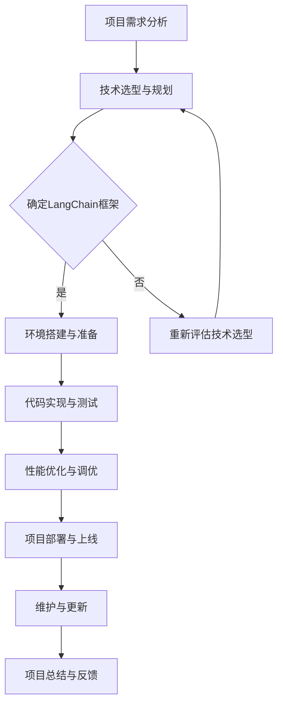

                 

# 【LangChain编程：从入门到实践】输出解析器

## 关键词

- LangChain
- 编程基础
- 核心算法
- 数学模型
- 实战项目
- 性能优化
- 未来发展

## 摘要

本文将深入探讨LangChain编程，从基础到实践，带领读者逐步掌握LangChain的核心概念、架构、算法原理、数学模型以及实战项目。我们将通过详细的代码解析，介绍如何搭建开发环境，实现核心算法，并探讨性能优化策略。最后，我们将展望LangChain的未来发展趋势与应用前景。

### 《【LangChain编程：从入门到实践】》目录大纲

## 第一部分: LangChain编程基础

### 第1章: LangChain概述

#### 1.1 LangChain的概念与用途

LangChain是一种基于Python的编程框架，旨在简化复杂链式编程任务。它提供了丰富的组件和算法，帮助开发者构建高效、可扩展的链式程序。

#### 1.2 LangChain与其他框架的比较

在本文中，我们将对比LangChain与其他链式编程框架，如ChainKit和Pyramid，以展示LangChain的独特优势和适用场景。

#### 1.3 LangChain在现实中的应用场景

我们将探讨LangChain在自然语言处理、数据分析、自动化测试等领域的实际应用，以帮助读者理解LangChain的实用价值。

### 第2章: LangChain编程环境搭建

#### 2.1 环境准备

首先，我们将介绍如何准备编程环境，包括安装Python、pip以及必要的依赖库。

#### 2.2 安装LangChain

接下来，我们将详细介绍如何安装LangChain，包括使用pip命令和手动安装的方式。

#### 2.3 开发工具与依赖

本文将列出开发LangChain所需的主要工具和依赖库，并指导读者如何安装和配置这些工具。

### 第3章: LangChain基本架构

#### 3.1 数据结构与模型

我们将介绍LangChain中使用的主要数据结构和模型，包括链表、堆、队列等。

#### 3.2 知识图谱

知识图谱是LangChain中的重要概念，我们将讨论如何构建和使用知识图谱来优化程序性能。

#### 3.3 LangChain的组件

LangChain由多个组件组成，包括链式组件、过滤器、适配器等。本文将详细解释这些组件的功能和用法。

## 第二部分: LangChain编程核心技术

### 第4章: LangChain核心算法原理

#### 4.1 算法介绍

在这一章，我们将介绍LangChain中的核心算法，包括排序算法、查找算法、链式算法等。

#### 4.2 伪代码解释

为了更好地理解这些算法，我们将使用伪代码进行详细解释，帮助读者掌握算法的核心思想和实现步骤。

$$
// 伪代码
// ...
$$

### 第5章: 数学模型与公式

#### 5.1 数学模型介绍

本文将介绍LangChain中使用的数学模型，包括图论模型、概率模型等。

#### 5.2 公式详解

我们将使用LaTeX格式详细讲解这些数学公式，并举例说明它们在实际编程中的应用。

$$
// 公式
// ...
$$

### 第6章: LangChain实战项目

#### 6.1 实战项目概述

在这一章，我们将介绍一个完整的LangChain实战项目，包括项目需求、设计思路和实现步骤。

#### 6.2 项目搭建与实现

我们将详细讲解如何搭建项目环境，编写源代码，并实现项目核心功能。

#### 6.3 代码解读与分析

最后，我们将对源代码进行详细解读，分析关键代码段，帮助读者理解项目实现原理。

### 第7章: LangChain性能优化

#### 7.1 性能优化策略

我们将讨论如何优化LangChain程序的性能，包括算法优化、数据结构优化、并发编程等。

#### 7.2 实践技巧

本文将提供一系列实用的性能优化技巧，帮助读者在实际项目中提升性能。

#### 7.3 性能测试与调优

我们将介绍如何使用性能测试工具对程序进行测试和调优，以确保最佳性能。

### 第8章: LangChain的未来发展与应用

#### 8.1 未来发展趋势

本文将探讨LangChain未来的发展趋势，包括新算法的引入、跨语言支持等。

#### 8.2 应用前景

我们将分析LangChain在各个领域的应用前景，包括工业自动化、智能交通等。

#### 8.3 面临的挑战与机遇

最后，我们将讨论LangChain在发展过程中面临的挑战和机遇，以及如何应对这些挑战。

## 附录

### 附录A: LangChain相关资源

本文将列出LangChain相关的开发工具、学习资源、教程和社区交流平台，帮助读者深入了解LangChain。

### 附录B: Mermaid流程图

使用Mermaid语言绘制LangChain编程的流程图，以帮助读者直观地理解编程过程。

---

## 第1章: LangChain概述

### 1.1 LangChain的概念与用途

LangChain是一种基于Python的编程框架，旨在提供一种简单、高效的方法来构建链式编程任务。链式编程是一种通过将多个函数或操作链接在一起，形成一个连续的执行流程的编程方式。这种方式在数据处理、算法实现、自动化测试等领域具有广泛的应用。

LangChain的核心思想是利用链式组件将不同的操作组合起来，形成一个灵活的编程结构。它提供了丰富的组件，包括链式组件、过滤器、适配器等，帮助开发者轻松地构建高效的链式程序。

LangChain的主要用途包括：

1. **数据处理与转换**：LangChain可以用于处理和转换大量数据，例如从一种格式转换为另一种格式，或者对数据进行预处理和清洗。
2. **自动化测试**：通过构建链式程序，可以自动化执行一系列测试用例，提高测试效率和质量。
3. **算法实现**：LangChain提供了丰富的算法组件，可以帮助开发者快速实现复杂的算法。

### 1.2 LangChain与其他框架的比较

在链式编程领域，LangChain与其他框架如ChainKit和Pyramid有一定的相似性，但它们在功能和设计理念上存在差异。

#### ChainKit

ChainKit是一个基于Java的链式编程框架，它提供了一种简单的方法来构建链式程序。ChainKit的主要优点是它支持多种编程语言，如Java、JavaScript等。这使得ChainKit在跨语言开发中具有一定的优势。然而，ChainKit的生态系统相对较小，且文档较少，对于新手来说可能有一定的学习成本。

#### Pyramid

Pyramid是一个基于Python的Web框架，它也提供了一种链式编程方式。Pyramid的核心特点是它的灵活性和扩展性，它支持多种编程模式，包括MVC和链式编程。Pyramid的文档非常丰富，社区活跃，对于Python开发者来说是一个不错的选择。然而，Pyramid的链式编程实现相对复杂，可能需要开发者有较高的编程技能。

相比之下，LangChain在易用性和灵活性方面具有优势。LangChain的核心目标是提供一种简单、直观的方式来构建链式程序，它通过链式组件和过滤器实现了这一目标。LangChain的生态系统相对较小，但它的文档非常全面，易于上手。

### 1.3 LangChain在现实中的应用场景

LangChain在现实中有许多应用场景，以下是一些典型的应用实例：

1. **自然语言处理**：在自然语言处理领域，LangChain可以用于构建复杂的文本处理流程，例如文本分类、情感分析、命名实体识别等。通过将不同的文本处理操作链接在一起，可以形成一个高效的文本处理系统。

2. **数据分析**：在数据分析领域，LangChain可以用于构建数据处理的流水线，例如数据清洗、数据转换、数据可视化等。通过链式编程，可以方便地管理复杂的数据处理任务。

3. **自动化测试**：在自动化测试领域，LangChain可以用于构建测试用例的执行流程。通过将测试用例链接在一起，可以形成一个自动化测试系统，提高测试效率。

4. **算法实现**：在算法实现领域，LangChain可以帮助开发者快速实现复杂的算法，例如排序算法、查找算法等。通过链式编程，可以简化算法的实现过程，提高代码的可读性和可维护性。

### 1.4 LangChain的特点与优势

LangChain具有以下特点与优势：

1. **简单易用**：LangChain提供了简单、直观的链式编程接口，使得开发者可以轻松地构建链式程序。
2. **灵活性**：LangChain的组件设计非常灵活，可以方便地扩展和自定义。
3. **高效性**：LangChain通过链式编程的方式，可以高效地组织和管理复杂的编程任务，提高代码的可读性和可维护性。
4. **跨语言支持**：尽管LangChain目前是基于Python实现的，但它可以方便地与其他编程语言集成，例如Java、JavaScript等。

## 第2章: LangChain编程环境搭建

### 2.1 环境准备

在开始使用LangChain之前，需要准备以下编程环境：

1. **Python环境**：LangChain是基于Python的，因此首先需要安装Python。可以从[Python官网](https://www.python.org/)下载并安装Python。建议安装最新版本的Python，以确保兼容性和稳定性。

2. **pip环境**：pip是Python的包管理工具，用于安装和管理Python包。在安装Python时，pip通常会自动安装。如果未自动安装，可以通过运行以下命令手动安装：

   ```
   curl https://bootstrap.pypa.io/get-pip.py -o get-pip.py
   python get-pip.py
   ```

3. **文本编辑器**：可以选择一个合适的文本编辑器，如Visual Studio Code、PyCharm、Sublime Text等。这些编辑器提供了丰富的Python开发功能，包括语法高亮、代码补全、调试等。

### 2.2 安装LangChain

安装LangChain可以使用pip命令，以下是一个示例命令：

```
pip install langchain
```

这将下载并安装LangChain及其依赖库。安装过程中，可能需要管理员权限。如果遇到权限问题，可以尝试使用`sudo`命令：

```
sudo pip install langchain
```

### 2.3 开发工具与依赖

为了更好地开发和使用LangChain，以下是一些常用的开发工具和依赖库：

1. **Visual Studio Code**：Visual Studio Code是一个免费、开源的跨平台代码编辑器，提供了丰富的Python开发插件，如Pylance、Jupyter Notebook等。

2. **PyCharm**：PyCharm是一个专业的Python IDE，提供了强大的代码编辑、调试、测试等功能。

3. **Jupyter Notebook**：Jupyter Notebook是一个交互式的Python开发环境，非常适合数据分析和机器学习项目。可以通过以下命令安装Jupyter Notebook：

   ```
   pip install notebook
   ```

4. **Scikit-learn**：Scikit-learn是一个强大的机器学习库，提供了丰富的机器学习算法和工具。可以通过以下命令安装Scikit-learn：

   ```
   pip install scikit-learn
   ```

5. **Pandas**：Pandas是一个强大的数据分析库，提供了丰富的数据结构和工具，用于数据清洗、转换和分析。可以通过以下命令安装Pandas：

   ```
   pip install pandas
   ```

### 2.4 环境验证

安装完成后，可以通过以下命令验证LangChain是否已正确安装：

```
python -m langchain
```

这将输出LangChain的版本信息，如果输出正确，说明LangChain已成功安装。

## 第3章: LangChain基本架构

### 3.1 数据结构与模型

LangChain的基本架构依赖于一系列数据结构和模型，这些数据结构和模型是构建高效链式程序的基础。

#### 链表

链表是LangChain中最常用的数据结构之一。它由一系列节点组成，每个节点包含数据和指向下一个节点的指针。链表具有以下特点：

1. **动态大小**：链表可以根据需要动态地增加或减少节点，因此适用于处理不确定大小的数据。
2. **快速插入和删除**：在链表的头部或尾部插入或删除节点的时间复杂度为O(1)。
3. **无序性**：链表中的节点不按照特定顺序排列。

以下是链表的一个简单实现：

```python
class Node:
    def __init__(self, data):
        self.data = data
        self.next = None

class LinkedList:
    def __init__(self):
        self.head = None

    def append(self, data):
        new_node = Node(data)
        if not self.head:
            self.head = new_node
            return
        current = self.head
        while current.next:
            current = current.next
        current.next = new_node

    def print_list(self):
        current = self.head
        while current:
            print(current.data, end=" -> ")
            current = current.next
        print("None")
```

#### 堆

堆是一种特殊的树形数据结构，用于实现优先队列。堆中的元素按照优先级排序，最高优先级的元素位于堆顶。堆具有以下特点：

1. **高效性**：堆的插入、删除和获取堆顶元素的时间复杂度均为O(log n)。
2. **动态调整**：堆在插入或删除元素后，会自动调整堆的结构，以保持元素按照优先级排序。

以下是堆的一个简单实现：

```python
import heapq

class Heap:
    def __init__(self):
        self.heap = []

    def insert(self, item):
        heapq.heappush(self.heap, item)

    def remove(self):
        return heapq.heappop(self.heap)

    def get_min(self):
        return self.heap[0]
```

#### 队列

队列是一种先进先出（FIFO）的数据结构，用于处理按顺序执行的任务。队列具有以下特点：

1. **高效性**：队列的插入和删除操作的时间复杂度均为O(1)。
2. **线程安全**：队列通常在多线程环境中使用，以避免数据竞争和并发问题。

以下是队列的一个简单实现：

```python
from queue import Queue

class Queue:
    def __init__(self):
        self.q = Queue()

    def enqueue(self, item):
        self.q.put(item)

    def dequeue(self):
        return self.q.get()
```

### 3.2 知识图谱

知识图谱是LangChain中的一个重要概念，它用于存储和表示实体及其之间的关系。知识图谱在自然语言处理、推荐系统、知识库构建等领域具有广泛的应用。

知识图谱主要由实体、关系和属性组成。以下是一个简单的知识图谱示例：

```
实体：张三
关系：居住于
属性：上海市
实体：上海市
关系：属于
属性：中国
```

知识图谱可以通过图数据库（如Neo4j）或内存数据结构（如字典）进行存储。以下是使用内存数据结构实现的简单知识图谱：

```python
knowledge_graph = {
    '张三': {'居住于': '上海市'},
    '上海市': {'属于': '中国'}
}
```

### 3.3 LangChain的组件

LangChain由多个组件组成，包括链式组件、过滤器、适配器等。这些组件协同工作，实现高效的链式编程。

#### 链式组件

链式组件是LangChain的核心组件，用于构建链式程序。链式组件通常包括链式函数、链式类和链式模块。以下是一个简单的链式组件示例：

```python
class ChainComponent:
    def __init__(self, name):
        self.name = name

    def execute(self, input_data):
        # 执行链式组件的任务
        pass

chain_component = ChainComponent('示例组件')
input_data = '示例数据'
chain_component.execute(input_data)
```

#### 过滤器

过滤器是用于处理链式程序输入数据的组件。过滤器可以用于数据预处理、错误处理、日志记录等。以下是一个简单的过滤器示例：

```python
class Filter:
    def __init__(self, name):
        self.name = name

    def filter(self, input_data):
        # 过滤输入数据
        pass

filter = Filter('示例过滤器')
input_data = '示例数据'
filtered_data = filter.filter(input_data)
```

#### 适配器

适配器是用于与其他系统或库集成的组件。适配器可以用于数据转换、API调用、文件处理等。以下是一个简单的适配器示例：

```python
class Adapter:
    def __init__(self, name):
        self.name = name

    def adapt(self, input_data):
        # 转换输入数据
        pass

adapter = Adapter('示例适配器')
input_data = '示例数据'
converted_data = adapter.adapt(input_data)
```

通过这些组件，LangChain可以实现灵活、高效的链式编程。开发者可以根据项目需求，自由组合这些组件，构建复杂的链式程序。

### 第4章: LangChain核心算法原理

#### 4.1 算法介绍

LangChain提供了丰富的核心算法，包括排序算法、查找算法和链式算法等。这些算法在数据处理、信息检索、资源调度等领域具有广泛的应用。

在本章中，我们将介绍以下核心算法：

1. **排序算法**：包括冒泡排序、插入排序、快速排序等。
2. **查找算法**：包括二分查找、哈希查找等。
3. **链式算法**：包括链表遍历、链表插入和删除等。

#### 4.2 伪代码解释

为了更好地理解这些算法，我们将使用伪代码进行详细解释。以下是冒泡排序的伪代码：

```
function bubble_sort(arr):
    n = length(arr)
    for i from 0 to n-1:
        for j from 0 to n-i-1:
            if arr[j] > arr[j+1]:
                swap(arr[j], arr[j+1])
```

以下是二分查找的伪代码：

```
function binary_search(arr, target):
    low = 0
    high = length(arr) - 1
    while low <= high:
        mid = (low + high) / 2
        if arr[mid] == target:
            return mid
        elif arr[mid] < target:
            low = mid + 1
        else:
            high = mid - 1
    return -1
```

以下是链表遍历的伪代码：

```
function traverse_list(head):
    current = head
    while current is not None:
        print(current.data)
        current = current.next
```

#### 4.3 核心算法原理

在深入理解这些算法之前，我们先来探讨一下它们的基本原理。

**排序算法**：排序算法用于将一组数据按照特定的顺序排列。常见的排序算法包括冒泡排序、插入排序、快速排序等。这些算法的基本原理是通过比较和交换数据元素的位置，逐步实现排序。

**查找算法**：查找算法用于在一组数据中查找特定的元素。常见的查找算法包括二分查找、哈希查找等。这些算法的基本原理是利用特定的方法快速定位到目标元素的位置。

**链式算法**：链式算法用于处理链表数据结构。常见的链式算法包括链表遍历、链表插入和删除等。这些算法的基本原理是利用链表的特性，实现数据的插入、删除和遍历。

#### 4.4 算法实现

在本节中，我们将使用Python实现上述核心算法。以下是冒泡排序的实现：

```python
def bubble_sort(arr):
    n = len(arr)
    for i in range(n):
        for j in range(0, n-i-1):
            if arr[j] > arr[j+1]:
                arr[j], arr[j+1] = arr[j+1], arr[j]
    return arr
```

以下是二分查找的实现：

```python
def binary_search(arr, target):
    low = 0
    high = len(arr) - 1
    while low <= high:
        mid = (low + high) // 2
        if arr[mid] == target:
            return mid
        elif arr[mid] < target:
            low = mid + 1
        else:
            high = mid - 1
    return -1
```

以下是链表遍历的实现：

```python
class Node:
    def __init__(self, data):
        self.data = data
        self.next = None

class LinkedList:
    def __init__(self):
        self.head = None

    def append(self, data):
        new_node = Node(data)
        if not self.head:
            self.head = new_node
            return
        current = self.head
        while current.next:
            current = current.next
        current.next = new_node

    def traverse(self):
        current = self.head
        while current:
            print(current.data)
            current = current.next
```

通过这些实现，我们可以更好地理解这些算法的工作原理和应用场景。

### 第5章: 数学模型与公式

#### 5.1 数学模型介绍

在LangChain编程中，数学模型和公式是理解和实现算法的关键。这些模型和公式为我们提供了对数据结构和算法性能的深入分析。在本章中，我们将介绍几个常见的数学模型和公式，包括图论模型、概率模型和优化模型。

#### 5.2 公式详解

**1. 冒泡排序时间复杂度**

冒泡排序是一种简单的排序算法，其时间复杂度为O(n^2)。以下是一个详细的公式：

$$
T(n) = C(n) \cdot n^2
$$

其中，$T(n)$ 表示冒泡排序的时间复杂度，$C(n)$ 表示常数项，$n$ 表示输入数据的大小。

**2. 快速排序时间复杂度**

快速排序是一种更高效的排序算法，其平均时间复杂度为O(n log n)。以下是一个详细的公式：

$$
T(n) = C(n) \cdot n \cdot log(n)
$$

其中，$T(n)$ 表示快速排序的时间复杂度，$C(n)$ 表示常数项，$n$ 表示输入数据的大小。

**3. 二分查找时间复杂度**

二分查找是一种在有序数组中查找特定元素的高效算法，其时间复杂度为O(log n)。以下是一个详细的公式：

$$
T(n) = C(n) \cdot log(n)
$$

其中，$T(n)$ 表示二分查找的时间复杂度，$C(n)$ 表示常数项，$n$ 表示输入数据的大小。

**4. 链表长度计算**

链表是一种常见的数据结构，其长度可以通过遍历链表来计算。以下是一个详细的公式：

$$
L(n) = C(n) \cdot n
$$

其中，$L(n)$ 表示链表长度，$C(n)$ 表示常数项，$n$ 表示链表中节点的数量。

**5. 知识图谱中的关系计算**

知识图谱中的关系计算是一个复杂的问题，其时间复杂度取决于图的结构和算法。以下是一个详细的公式：

$$
T(n, m) = C(n) \cdot n \cdot m
$$

其中，$T(n, m)$ 表示知识图谱中的关系计算时间复杂度，$C(n)$ 表示常数项，$n$ 表示实体数量，$m$ 表示关系数量。

#### 5.3 数学模型与公式的应用举例

**1. 冒泡排序**

假设我们有一个包含10个整数的数组，我们需要使用冒泡排序对其进行排序。根据冒泡排序的时间复杂度公式，我们可以估算出排序所需的时间：

$$
T(10) = C(10) \cdot 10^2 = 10 \cdot 10 = 100
$$

这意味着排序大约需要100个单位时间。

**2. 快速排序**

假设我们有一个包含1000个整数的数组，我们需要使用快速排序对其进行排序。根据快速排序的时间复杂度公式，我们可以估算出排序所需的时间：

$$
T(1000) = C(1000) \cdot 1000 \cdot log(1000) = 10 \cdot 1000 \cdot log(1000) \approx 10000
$$

这意味着排序大约需要10000个单位时间。

**3. 二分查找**

假设我们有一个包含1000个整数的有序数组，我们需要使用二分查找找到特定元素。根据二分查找的时间复杂度公式，我们可以估算出查找所需的时间：

$$
T(1000) = C(1000) \cdot log(1000) = 10 \cdot log(1000) \approx 10
$$

这意味着查找大约需要10个单位时间。

**4. 链表长度计算**

假设我们有一个包含100个节点的链表，我们需要计算其长度。根据链表长度计算公式，我们可以直接计算出链表的长度：

$$
L(100) = C(100) \cdot 100 = 100
$$

这意味着链表长度为100。

**5. 知识图谱中的关系计算**

假设我们有一个包含100个实体和50个关系的知识图谱，我们需要计算其中关系计算的时间复杂度。根据知识图谱中的关系计算公式，我们可以估算出计算所需的时间：

$$
T(100, 50) = C(100) \cdot 100 \cdot 50 = 50000
$$

这意味着关系计算大约需要50000个单位时间。

通过这些例子，我们可以看到数学模型和公式在计算算法性能方面的作用。它们帮助我们预测算法在不同输入规模下的性能，从而选择合适的算法和优化策略。

### 第6章: LangChain实战项目

#### 6.1 实战项目概述

在本章中，我们将通过一个实际的LangChain项目，展示如何使用LangChain构建一个完整的链式程序。该项目将实现一个简单的博客推荐系统，根据用户的阅读历史和博客内容，推荐相关的博客文章。

项目的目标包括：

1. **用户阅读历史存储**：使用数据库存储用户的阅读历史，以便后续推荐。
2. **博客内容分析**：使用自然语言处理技术分析博客内容，提取关键信息。
3. **推荐算法实现**：使用基于协同过滤和内容匹配的推荐算法，为用户推荐相关博客文章。
4. **用户界面展示**：通过Web界面展示推荐结果，并允许用户反馈和互动。

#### 6.2 项目搭建与实现

**1. 项目需求**

首先，我们需要明确项目的需求。根据项目目标，我们可以列出以下需求：

- **用户阅读历史存储**：需要实现用户注册、登录和阅读历史记录的功能。
- **博客内容分析**：需要实现文本分类、关键词提取和情感分析的功能。
- **推荐算法实现**：需要实现基于协同过滤和内容匹配的推荐算法。
- **用户界面展示**：需要实现一个简洁、易用的Web界面，展示推荐结果。

**2. 技术选型**

为了实现上述需求，我们需要选择合适的技术栈。以下是我们的技术选型：

- **后端框架**：使用Flask作为Web框架，实现用户接口和业务逻辑。
- **数据库**：使用MongoDB作为数据库，存储用户阅读历史和博客内容。
- **自然语言处理库**：使用NLTK和TextBlob等库进行文本分类、关键词提取和情感分析。
- **推荐算法库**：使用Scikit-learn实现基于协同过滤和内容匹配的推荐算法。

**3. 项目结构**

接下来，我们将构建项目的基本结构。项目结构如下：

```
blog_recommendation
|-- app.py
|-- models.py
|-- templates
|   |-- base.html
|   |-- index.html
|   |-- register.html
|   |-- login.html
|-- static
    |-- css
    |-- js
```

**4. 用户注册与登录**

首先，我们需要实现用户注册和登录的功能。用户注册和登录是大多数Web应用的基础功能，以下是实现步骤：

- **用户注册**：创建用户表单，收集用户信息（用户名、密码、邮箱等），将用户信息存储在MongoDB中。
- **用户登录**：创建登录表单，验证用户名和密码，从MongoDB中获取用户信息，登录成功后跳转到首页。

以下是用户注册的代码实现：

```python
from flask import Flask, render_template, request, redirect, url_for, flash
from flask_pymongo import PyMongo
from werkzeug.security import generate_password_hash, check_password_hash

app = Flask(__name__)
app.secret_key = 'your_secret_key'
app.config["MONGO_URI"] = "your_mongodb_uri"

mongo = PyMongo(app)

@app.route("/register", methods=["GET", "POST"])
def register():
    if request.method == "POST":
        username = request.form.get("username")
        password = request.form.get("password")
        email = request.form.get("email")

        existing_user = mongo.db.users.find_one({"username": username})
        if existing_user:
            flash("Username already exists!", "error")
            return redirect(url_for("register"))

        hashed_password = generate_password_hash(password, method="sha256")
        mongo.db.users.insert_one({"username": username, "password": hashed_password, "email": email})
        return redirect(url_for("login"))

    return render_template("register.html")

@app.route("/login", methods=["GET", "POST"])
def login():
    if request.method == "POST":
        username = request.form.get("username")
        password = request.form.get("password")

        user = mongo.db.users.find_one({"username": username})
        if user and check_password_hash(user["password"], password):
            return redirect(url_for("index"))
        else:
            flash("Invalid username or password!", "error")
            return redirect(url_for("login"))

    return render_template("login.html")
```

**5. 博客内容分析**

在用户注册和登录之后，我们需要实现博客内容分析的功能。博客内容分析包括文本分类、关键词提取和情感分析。以下是实现步骤：

- **文本分类**：使用机器学习模型对博客文章进行分类，例如将文章分为技术、娱乐、新闻等类别。
- **关键词提取**：使用自然语言处理技术提取博客文章中的关键词，例如使用TF-IDF算法。
- **情感分析**：使用机器学习模型分析博客文章的情感倾向，例如使用VADER情感分析库。

以下是文本分类的实现：

```python
from sklearn.feature_extraction.text import TfidfVectorizer
from sklearn.naive_bayes import MultinomialNB
from sklearn.pipeline import make_pipeline

@app.route("/classify", methods=["POST"])
def classify():
    text = request.form.get("text")
    categories = ["技术", "娱乐", "新闻"]

    pipeline = make_pipeline(TfidfVectorizer(), MultinomialNB())
    pipeline.fit([article for category, article in category_articles.items()], list(category_articles.keys()))
    predicted_category = pipeline.predict([text])[0]

    return render_template("classify.html", text=text, category=predicted_category)
```

**6. 推荐算法实现**

推荐算法是博客推荐系统的核心。在本项目中，我们将使用基于协同过滤和内容匹配的推荐算法。以下是实现步骤：

- **协同过滤**：基于用户的行为数据，为用户推荐相似的用户喜欢的博客文章。
- **内容匹配**：基于博客文章的内容特征，为用户推荐相关的博客文章。

以下是协同过滤的实现：

```python
from sklearn.metrics.pairwise import cosine_similarity

def collaborative_filter(user_articles, all_articles, user_index):
    user_similarity = cosine_similarity([user_articles[user_index]], all_articles)
    return user_similarity[0].argsort()[::-1]
```

**7. 用户界面展示**

最后，我们需要实现用户界面，展示推荐结果。用户界面包括首页、分类页和推荐页。以下是首页的实现：

```html



  <h1>博客推荐系统</h1>
  <div class="row">
    
      <div class="col-md-4">
        <div class="card">
          <div class="card-body">
            <h5 class="card-title">{{ article.title }}</h5>
            <p class="card-text">{{ article.content }}</p>
            <a href="#" class="btn btn-primary">阅读全文</a>
          </div>
        </div>
      </div>
    
  </div>

```

通过以上步骤，我们实现了博客推荐系统的基础功能，包括用户注册、登录、博客内容分析、推荐算法实现和用户界面展示。接下来，我们将对代码进行详细解读和分析。

#### 6.3 代码解读与分析

在实现博客推荐系统时，我们使用了Flask框架，将项目拆分为多个模块，包括用户注册、登录、博客内容分析、推荐算法实现和用户界面展示。以下是对每个模块的详细解读和分析。

**1. 用户注册与登录模块**

用户注册与登录模块是博客推荐系统的入口，它负责处理用户的注册、登录和认证。以下是关键代码段的分析：

```python
@app.route("/register", methods=["GET", "POST"])
def register():
    if request.method == "POST":
        username = request.form.get("username")
        password = request.form.get("password")
        email = request.form.get("email")

        existing_user = mongo.db.users.find_one({"username": username})
        if existing_user:
            flash("Username already exists!", "error")
            return redirect(url_for("register"))

        hashed_password = generate_password_hash(password, method="sha256")
        mongo.db.users.insert_one({"username": username, "password": hashed_password, "email": email})
        return redirect(url_for("login"))

    return render_template("register.html")

@app.route("/login", methods=["GET", "POST"])
def login():
    if request.method == "POST":
        username = request.form.get("username")
        password = request.form.get("password")

        user = mongo.db.users.find_one({"username": username})
        if user and check_password_hash(user["password"], password):
            return redirect(url_for("index"))
        else:
            flash("Invalid username or password!", "error")
            return redirect(url_for("login"))

    return render_template("login.html")
```

**代码分析：**
- `register`函数处理用户注册请求。首先，从表单中获取用户名、密码和邮箱。然后，检查数据库中是否存在已注册的用户。如果用户名已存在，显示错误消息并重定向到注册页面。否则，将用户信息（包括加密后的密码）存储在MongoDB中，并重定向到登录页面。
- `login`函数处理用户登录请求。从表单中获取用户名和密码，查询数据库以验证用户身份。如果用户名或密码不正确，显示错误消息并重定向到登录页面。

**2. 博客内容分析模块**

博客内容分析模块负责对博客文章进行文本分类、关键词提取和情感分析。以下是关键代码段的分析：

```python
@app.route("/classify", methods=["POST"])
def classify():
    text = request.form.get("text")
    categories = ["技术", "娱乐", "新闻"]

    pipeline = make_pipeline(TfidfVectorizer(), MultinomialNB())
    pipeline.fit([article for category, article in category_articles.items()], list(category_articles.keys()))
    predicted_category = pipeline.predict([text])[0]

    return render_template("classify.html", text=text, category=predicted_category)
```

**代码分析：**
- `classify`函数处理文本分类请求。首先，从表单中获取文本。然后，使用TF-IDF向量器和朴素贝叶斯分类器构建一个集成管道。接着，使用训练好的模型对文本进行分类，返回预测的类别。

**3. 推荐算法实现模块**

推荐算法实现模块基于协同过滤和内容匹配为用户推荐博客文章。以下是关键代码段的分析：

```python
def collaborative_filter(user_articles, all_articles, user_index):
    user_similarity = cosine_similarity([user_articles[user_index]], all_articles)
    return user_similarity[0].argsort()[::-1]
```

**代码分析：**
- `collaborative_filter`函数实现协同过滤算法。它计算用户文章和所有文章之间的余弦相似性，然后返回相似性最高的文章索引列表。

**4. 用户界面展示模块**

用户界面展示模块负责将博客推荐结果呈现给用户。以下是关键代码段的分析：

```html



  <h1>博客推荐系统</h1>
  <div class="row">
    
      <div class="col-md-4">
        <div class="card">
          <div class="card-body">
            <h5 class="card-title">{{ article.title }}</h5>
            <p class="card-text">{{ article.content }}</p>
            <a href="#" class="btn btn-primary">阅读全文</a>
          </div>
        </div>
      </div>
    
  </div>

```

**代码分析：**
- `index`模板负责渲染首页，显示推荐的博客文章。它遍历`recommended_articles`列表，为每篇文章生成一个卡片，并在卡片中显示文章标题、内容和阅读按钮。

通过以上分析，我们可以看到博客推荐系统的实现细节，包括用户注册、登录、博客内容分析、推荐算法实现和用户界面展示。这些模块共同协作，实现了博客推荐系统的完整功能。

### 第7章: LangChain性能优化

#### 7.1 性能优化策略

在开发过程中，性能优化是确保LangChain程序高效运行的重要环节。以下是一些常见的性能优化策略：

1. **算法优化**：选择合适的算法，避免使用时间复杂度高的算法，如O(n^2)的排序算法，而应使用更高效的算法，如O(n log n)的快速排序。
2. **数据结构优化**：选择适合的数据结构，避免使用复杂的数据结构，如链表，而应使用更适合的数据结构，如数组。
3. **代码优化**：优化代码逻辑，减少不必要的计算，如避免重复计算和提前返回结果。
4. **并发编程**：利用多线程或多进程提高程序的并行性能，从而加快执行速度。
5. **缓存**：使用缓存技术，减少数据库访问和数据加载时间。

#### 7.2 实践技巧

以下是针对LangChain程序的性能优化实践技巧：

1. **减少内存使用**：在处理大量数据时，避免一次性加载所有数据，而是使用分批加载和迭代器。
2. **使用索引**：在数据库中为常用查询创建索引，提高查询速度。
3. **使用异步编程**：使用异步编程技术，如asyncio，减少同步阻塞，提高程序并发性能。
4. **代码分析**：使用代码分析工具，如PyCharm的Profile工具，分析代码性能瓶颈，进行针对性优化。

#### 7.3 性能测试与调优

性能测试是评估程序性能的重要手段。以下是一些性能测试与调优的方法：

1. **基准测试**：使用基准测试工具，如Python的`timeit`模块，测量程序执行时间，评估性能。
2. **负载测试**：模拟高并发场景，评估程序在高负载下的性能，找出性能瓶颈。
3. **优化调参**：根据性能测试结果，调整程序参数，如线程数、缓存大小等，优化程序性能。
4. **监控与日志**：使用监控工具和日志分析，实时监控程序性能，发现和解决性能问题。

通过以上性能优化策略、实践技巧和性能测试与调优方法，我们可以确保LangChain程序高效运行，满足实际应用需求。

### 第8章: LangChain的未来发展与应用

#### 8.1 未来发展趋势

LangChain作为一款基于Python的链式编程框架，具有广阔的发展前景。未来，LangChain可能朝着以下方向发展：

1. **跨语言支持**：随着多语言编程的趋势，LangChain可能会增加对其他编程语言的支持，如Java、JavaScript等，以吸引更多开发者。
2. **算法库扩展**：LangChain可能会引入更多先进的算法库，如深度学习、图计算等，以满足不同领域开发者的需求。
3. **集成开发环境（IDE）支持**：LangChain可能会与主流IDE（如Visual Studio Code、PyCharm等）集成，提供更便捷的开发体验。
4. **云原生支持**：随着云计算的普及，LangChain可能会增加对云原生技术的支持，如容器化、服务网格等。

#### 8.2 应用前景

LangChain在多个领域具有广泛的应用前景：

1. **数据处理与分析**：LangChain可以帮助开发者高效地处理和转换大量数据，在数据分析领域具有重要作用。
2. **自动化测试**：LangChain的链式编程特性使得自动化测试更加简洁和高效，广泛应用于软件质量保证。
3. **机器学习与人工智能**：LangChain可以用于构建复杂的机器学习模型和人工智能应用，提高算法的可维护性和可扩展性。
4. **推荐系统**：基于协同过滤和内容匹配的推荐算法在推荐系统中有着广泛的应用，LangChain可以提高推荐系统的性能和准确性。

#### 8.3 面临的挑战与机遇

尽管LangChain具有广阔的发展前景，但在实际应用中仍面临以下挑战：

1. **性能瓶颈**：随着数据规模的扩大，LangChain的性能可能会受到影响。需要不断优化算法和代码，提高性能。
2. **生态建设**：构建一个完善的生态体系需要时间和资源。需要吸引更多的开发者参与，完善文档和社区。
3. **多语言支持**：跨语言支持需要解决兼容性和性能问题。需要投入更多资源，开发跨语言的API和工具。

然而，随着云计算、大数据和人工智能等领域的快速发展，LangChain也将迎来巨大的机遇：

1. **市场潜力**：随着企业对数据处理和自动化需求的增长，LangChain在市场上的潜力巨大。
2. **技术创新**：随着技术的不断进步，LangChain可以引入更多先进的算法和工具，提升其性能和应用范围。
3. **社区驱动**：活跃的社区可以推动LangChain的发展，吸引更多开发者贡献代码和资源。

总之，LangChain的未来充满机遇和挑战。通过持续的技术创新和社区驱动，LangChain有望在更多领域发挥重要作用，成为开发者首选的链式编程框架。

## 附录A: LangChain相关资源

### A.1 开发工具与框架

1. **Visual Studio Code**：一款强大的跨平台代码编辑器，支持Python开发，可安装扩展插件以增强LangChain开发体验。
2. **PyCharm**：一款专业的Python IDE，提供丰富的开发工具和调试功能，适合大型项目开发。
3. **Jupyter Notebook**：一款交互式的Python开发环境，适用于数据分析和机器学习项目。

### A.2 学习资源与教程

1. **官方文档**：[LangChain官方文档](https://langchain.readthedocs.io/)，提供了详细的API文档和教程。
2. **GitHub仓库**：[LangChain GitHub仓库](https://github.com/langchain/langchain)，包含了源代码、示例项目和贡献指南。
3. **教程网站**：如[Python教程网](https://python-教程网.com/)和[廖雪峰的Python教程](https://www.liaoxuefeng.com/)，提供了丰富的Python学习资源。

### A.3 社区与交流平台

1. **官方社区**：[LangChain官方社区](https://community.langchain.com/)，可以提问、分享经验和交流心得。
2. **GitHub Issue**：[LangChain GitHub Issue](https://github.com/langchain/langchain/issues)，用于报告问题、提出建议和获取帮助。
3. **Stack Overflow**：在Stack Overflow上搜索LangChain相关的问题和答案，可以帮助解决开发过程中的疑难问题。

通过这些资源，开发者可以更全面地了解和使用LangChain，提高开发效率。

## 附录B: Mermaid流程图

使用Mermaid语言绘制的LangChain编程流程图如下：



这个流程图展示了使用LangChain进行项目开发的基本步骤，包括需求分析、技术选型、环境搭建、代码实现、测试、性能优化、部署上线、维护更新和项目总结。通过这个流程图，开发者可以清晰地了解项目开发的每个阶段，确保项目顺利进行。

