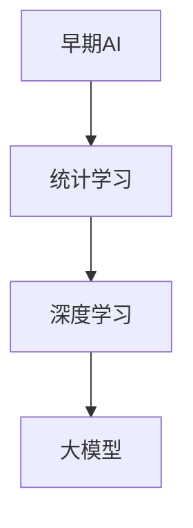
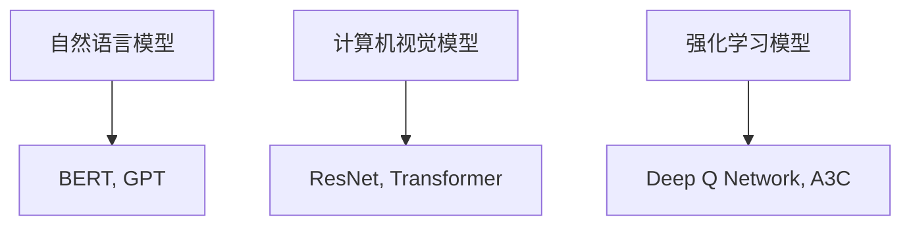
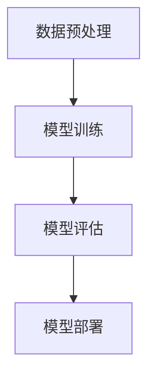
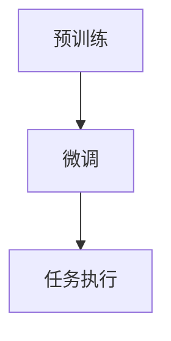

                 

# 【大模型应用开发 动手做AI Agent】AutoGPT实战

## 关键词
- 大模型
- AI Agent
- AutoGPT
- 应用开发
- 实战教程

## 摘要
本文将带领读者深入探索大模型应用开发的领域，以AutoGPT为例，详细介绍其概念、架构、应用场景，并通过实战项目展示如何动手实现AI Agent。文章将分为两部分，第一部分为基础与应用，介绍大模型的概述、数学基础、应用场景及训练优化；第二部分为AutoGPT实战，从环境搭建到应用扩展，逐步解析AutoGPT的开发与优化策略，展望其未来发展趋势。

## 第一部分: 大模型基础与应用

### 第1章: AI与大模型概述

#### 1.1 AI与大模型的发展
人工智能（AI）经历了几个重要的发展阶段，从早期的规则推理系统到基于统计学习的方法，再到如今的深度学习时代。大模型作为深度学习的最新成果，是AI发展的一个重要里程碑。

**核心概念与联系**


随着计算能力的提升和大数据的积累，大模型（如GPT-3、BERT等）得以训练和部署，它们在自然语言处理、计算机视觉、强化学习等应用领域展现出强大的能力。

#### 1.2 大模型的定义与分类
大模型通常指的是具有数十亿至数万亿参数的深度学习模型。根据模型用途和结构，可以分为自然语言模型、计算机视觉模型、强化学习模型等。

**核心概念与联系**


#### 1.3 大模型的基本原理
大模型的核心在于其深度神经网络结构，通过多层非线性变换，模型能够捕捉到输入数据中的复杂模式。

**核心算法原理讲解**
```plaintext
// 伪代码：神经网络基本结构
function NeuralNetwork(input):
    layer1 = Activation_function(Weight * input + Bias)
    layer2 = Activation_function(Weight * layer1 + Bias)
    ...
    output = Activation_function(Weight * layerN + Bias)
    return output
```

#### 1.4 大模型的技术框架
大模型的技术框架包括数据预处理、模型训练、模型评估、模型部署等环节。

**核心概念与联系**


### 第2章: 大模型的数学基础

#### 2.1 线性代数基础
线性代数是深度学习的基础，包括矩阵运算、向量空间等概念。

**数学模型和公式**
$$
A \cdot B = C \\
x^T A x = \text{迹}(A)x
$$

#### 2.2 微积分基础
微积分用于描述函数的变化率，包括导数、积分等概念。

**数学模型和公式**
$$
f'(x) = \lim_{h \to 0} \frac{f(x+h) - f(x)}{h} \\
\int f(x)dx = F(x) + C
$$`

#### 2.3 概率论与统计基础
概率论与统计是深度学习中的重要工具，用于描述随机现象和进行数据建模。

**数学模型和公式**
$$
P(A|B) = \frac{P(B|A)P(A)}{P(B)} \\
\mu = \frac{1}{n}\sum_{i=1}^{n}x_i \\
\sigma^2 = \frac{1}{n-1}\sum_{i=1}^{n}(x_i - \mu)^2
$$`

### 第3章: 大模型的应用场景

#### 3.1 自然语言处理
大模型在自然语言处理中发挥着重要作用，如文本生成、机器翻译、情感分析等。

#### 3.2 计算机视觉
大模型在计算机视觉领域也取得了显著成果，如图像分类、目标检测、图像生成等。

#### 3.3 强化学习
大模型在强化学习中的应用，如智能体训练、游戏AI等，展示了其强大的能力。

### 第4章: 大模型的训练与优化

#### 4.1 大模型的训练过程
大模型的训练过程包括数据预处理、模型初始化、前向传播、反向传播、参数更新等步骤。

#### 4.2 大模型的优化方法
常用的优化方法包括随机梯度下降（SGD）、Adam优化器等。

#### 4.3 大模型的超参数调优
超参数调优是提升模型性能的重要手段，如学习率、批次大小、正则化参数等。

### 第5章: AutoGPT介绍

#### 5.1 AutoGPT的概念与架构
AutoGPT是一种基于大模型的AI Agent，通过预训练和微调，实现自动化的任务执行。

**核心概念与联系**


#### 5.2 AutoGPT的核心功能
AutoGPT具备文本生成、推理、决策等能力，可应用于聊天机器人、自动化脚本编写等场景。

#### 5.3 AutoGPT的应用领域
AutoGPT在自然语言处理、计算机视觉、强化学习等领域具有广泛的应用前景。

## 第二部分: AutoGPT实战

### 第6章: AutoGPT环境搭建

#### 6.1 环境准备
搭建AutoGPT的开发环境，需要安装Python、PyTorch、Transformers等库。

#### 6.2 AutoGPT的安装
通过GitHub克隆AutoGPT的代码库，并安装相关依赖。

#### 6.3 开发环境配置
配置Python环境，并设置好路径，以便后续调用AutoGPT库。

### 第7章: AutoGPT编程实践

#### 7.1 AutoGPT的基本使用
介绍如何使用AutoGPT生成文本、执行任务等基本操作。

**伪代码：AutoGPT基本使用**
```python
import auto_gpt
model = auto_gpt.AutoGPT()
response = model.generate("Tell me a joke.")
print(response)
```

#### 7.2 AutoGPT的API调用
详细介绍AutoGPT提供的API，包括文本生成、推理、决策等功能。

#### 7.3 实战项目1：文本生成
通过一个简单的文本生成项目，演示如何使用AutoGPT生成文章。

#### 7.4 实战项目2：图像分类
通过一个图像分类项目，演示如何使用AutoGPT进行图像识别。

### 第8章: AutoGPT应用扩展

#### 8.1 AutoGPT与其他模型的集成
介绍如何将AutoGPT与其他深度学习模型（如BERT、VGG等）集成，以实现更复杂的任务。

#### 8.2 AutoGPT在NLP中的深度应用
讨论AutoGPT在自然语言处理中的高级应用，如对话系统、摘要生成等。

#### 8.3 AutoGPT在CV中的实践
介绍AutoGPT在计算机视觉中的实践，如图像分割、目标跟踪等。

### 第9章: AutoGPT性能优化

#### 9.1 AutoGPT的性能瓶颈
分析AutoGPT在训练和推理过程中可能遇到的性能瓶颈。

#### 9.2 优化策略
介绍如何通过优化算法、模型架构、硬件配置等手段提升AutoGPT的性能。

#### 9.3 案例分析
通过具体案例，展示如何优化AutoGPT的性能。

### 第10章: AutoGPT的未来展望

#### 10.1 AutoGPT的技术发展趋势
讨论AutoGPT在技术层面的未来发展，如模型压缩、联邦学习等。

#### 10.2 AutoGPT的挑战与机遇
分析AutoGPT面临的挑战和机遇，如数据隐私、模型可解释性等。

#### 10.3 AutoGPT的未来应用场景
展望AutoGPT在未来的广泛应用场景，如智能客服、自动化编程等。

### 附录

#### 附录A: AutoGPT常用库与工具
介绍AutoGPT开发中常用的库与工具，如PyTorch、Transformers等。

#### 附录B: AutoGPT代码实例
提供一些AutoGPT的代码实例，帮助读者实践。

#### 附录C: AutoGPT资源与参考
提供AutoGPT相关的学习资源与参考书籍，便于读者深入探索。

# 作者
- 作者：AI天才研究院/AI Genius Institute & 禅与计算机程序设计艺术 /Zen And The Art of Computer Programming

