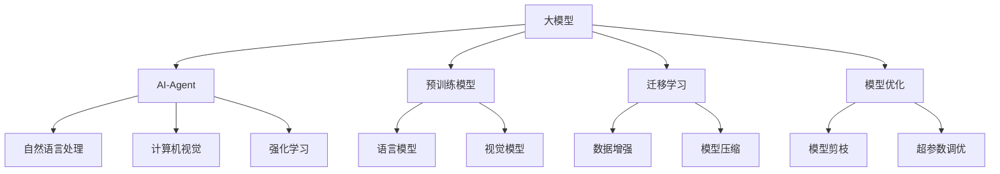

                 

# 【大模型应用开发 动手做AI Agent】Plan-and-Solve策略的提出

> 关键词：大模型，AI-Agent，Plan-and-Solve策略，应用开发

> 摘要：本文将探讨大模型在AI-Agent开发中的应用，提出一种名为Plan-and-Solve的策略。通过详细分析Plan-and-Solve策略的原理、步骤和实现方法，本文旨在为开发者提供一种有效的AI-Agent开发思路，帮助他们在实际项目中更好地利用大模型的优势。

## 第一部分：引论

### 第1章：大模型与AI-Agent概览

#### 1.1 AI-Agent的定义与发展历程

AI-Agent是指能够执行特定任务并与环境进行交互的智能体。它基于人工智能技术，通过感知环境、理解任务目标、规划行动策略和执行行动来完成任务。

AI-Agent的发展历程可以追溯到20世纪80年代的专家系统和80年代末的智能代理。随着深度学习和大数据技术的兴起，AI-Agent的研究和应用得到了迅猛发展。现阶段，AI-Agent已经广泛应用于智能客服、自动驾驶、智能家居等多个领域。

#### 1.2 大模型在AI-Agent中的作用

大模型在AI-Agent中扮演着重要的角色。一方面，大模型可以提供丰富的知识储备，帮助AI-Agent更好地理解和应对复杂环境。另一方面，大模型可以自动化地学习任务，降低开发者的负担，提高AI-Agent的性能。

#### 1.3 本书结构安排与目标

本书分为七个部分，系统地介绍了大模型在AI-Agent开发中的应用。具体结构安排如下：

- 第一部分：引论，介绍大模型和AI-Agent的基本概念。
- 第二部分：大模型技术基础，包括大模型的基本原理、训练与优化、评估与测试。
- 第三部分：AI-Agent开发基础，包括AI-Agent的开发框架、关键技术、体系结构设计。
- 第四部分：基于大模型的AI-Agent开发实践，包括实战案例、开发环境搭建与工具介绍、开发流程详解。
- 第五部分：大模型在AI-Agent中的具体应用，包括智能客服、智能导航、聊天机器人等。
- 第六部分：AI-Agent性能优化与故障处理，包括性能优化策略、故障处理与调试、安全性与隐私保护。
- 第七部分：大模型与AI-Agent的未来发展趋势，包括大模型与AI-Agent的发展趋势、应用前景、发展挑战与解决方案。

本文的目标是通过详细分析Plan-and-Solve策略，为开发者提供一种有效的AI-Agent开发思路，帮助他们在实际项目中更好地利用大模型的优势。

### 第2章：大模型技术基础

#### 2.1 大模型基本原理

大模型是指参数规模巨大、能够处理复杂数据的神经网络模型。大模型的基本原理主要包括以下几个方面：

1. **参数规模**：大模型的参数规模可以达到数十亿甚至千亿级别，这使得模型具有更强的表示能力和泛化能力。
2. **多层神经网络**：大模型通常采用多层神经网络结构，通过逐层提取数据特征，实现数据的非线性表示。
3. **优化算法**：大模型需要采用高效的优化算法，如Adam优化器，以加快收敛速度和提升模型性能。
4. **训练数据**：大模型的训练数据通常来自于大规模的开放数据集，如互联网文本、图片、语音等。

#### 2.2 大模型的训练与优化

大模型的训练与优化是AI-Agent开发的关键步骤。以下是训练与优化过程中的几个关键点：

1. **数据预处理**：对训练数据集进行预处理，包括数据清洗、数据增强、数据归一化等，以提高模型的泛化能力。
2. **训练策略**：采用分批次训练、学习率调度、梯度裁剪等策略，以加快收敛速度和避免梯度消失、爆炸等问题。
3. **模型优化**：通过模型剪枝、量化、蒸馏等技术，降低模型复杂度，提高模型运行效率。
4. **评估与测试**：对模型进行评估和测试，包括准确率、召回率、F1值等指标，以衡量模型的性能。

#### 2.3 大模型的评估与测试

大模型的评估与测试是保证模型性能的重要环节。以下是评估与测试过程中的几个关键点：

1. **指标选择**：根据应用场景和任务需求，选择合适的评价指标，如分类准确率、平均绝对误差、均方误差等。
2. **交叉验证**：采用交叉验证方法，对模型进行多次训练和测试，以提高评估结果的可靠性和稳定性。
3. **超参数调优**：通过调整模型的超参数，如学习率、批量大小、隐藏层节点数等，以优化模型性能。
4. **模型部署**：将训练好的模型部署到实际应用场景中，进行实时测试和验证。

### 第3章：AI-Agent开发基础

#### 3.1 AI-Agent的开发框架

AI-Agent的开发框架通常包括以下几个部分：

1. **感知模块**：负责获取环境信息，如文本、图片、语音等。
2. **理解模块**：负责对感知模块获取的信息进行语义理解，如命名实体识别、情感分析等。
3. **规划模块**：负责根据任务目标和当前状态，生成合适的行动策略。
4. **执行模块**：负责执行规划模块生成的行动策略，并对外界进行反馈。

#### 3.2 AI-Agent的关键技术

AI-Agent的关键技术主要包括以下几个方面：

1. **自然语言处理**：用于处理文本数据，如文本分类、文本生成、机器翻译等。
2. **计算机视觉**：用于处理图像数据，如目标检测、图像识别、图像生成等。
3. **强化学习**：用于通过试错学习，优化行动策略，提高任务性能。

#### 3.3 AI-Agent的体系结构设计

AI-Agent的体系结构设计需要考虑以下几个关键因素：

1. **模块化**：将AI-Agent的功能模块化，以提高系统的可维护性和可扩展性。
2. **分布式**：采用分布式架构，以提高系统的性能和可扩展性。
3. **安全性与隐私保护**：确保AI-Agent的安全性和用户隐私，如数据加密、访问控制等。

### 第4章：基于大模型的AI-Agent开发实践

#### 4.1 AI-Agent开发实战案例

在本章中，我们将介绍三个AI-Agent开发实战案例，包括聊天机器人、智能客服和智能导航。

1. **聊天机器人**：基于大模型的语言模型，实现与用户的自然语言交互，提供问答服务。
2. **智能客服**：基于大模型和自然语言处理技术，实现自动化的客户服务，提高客户满意度。
3. **智能导航**：基于大模型和计算机视觉技术，实现自动驾驶车辆的环境感知和路径规划。

#### 4.2 开发环境搭建与工具介绍

为了进行基于大模型的AI-Agent开发实践，需要搭建相应的开发环境，并使用一些常用的工具。以下是开发环境搭建与工具介绍的详细步骤：

1. **硬件环境**：配置高性能的计算机，如GPU服务器等。
2. **软件环境**：安装深度学习框架，如TensorFlow、PyTorch等。
3. **开发工具**：使用集成开发环境（IDE），如PyCharm、Visual Studio Code等。
4. **数据集**：获取并准备训练数据集，如文本数据集、图像数据集等。

#### 4.3 AI-Agent开发流程详解

基于大模型的AI-Agent开发流程可以分为以下几个阶段：

1. **需求分析**：明确AI-Agent的应用场景和功能需求。
2. **数据准备**：收集并整理训练数据集，进行数据预处理。
3. **模型选择**：根据任务需求，选择合适的大模型架构。
4. **模型训练**：使用训练数据集对大模型进行训练，并优化模型参数。
5. **模型评估**：使用验证数据集对训练好的模型进行评估和测试。
6. **模型部署**：将训练好的模型部署到实际应用场景中，进行实时测试和验证。

### 第5章：大模型在AI-Agent中的具体应用

#### 5.1 大模型在智能客服中的应用

智能客服是AI-Agent的一个重要应用场景，它通过大模型和自然语言处理技术，实现与用户的自动对话和问答服务。以下是智能客服中的大模型应用：

1. **文本分类**：使用大模型对用户的问题进行分类，识别用户的需求。
2. **文本生成**：使用大模型生成自动回复的文本，提高客服的响应速度。
3. **情感分析**：使用大模型分析用户的情绪，为客服提供情感化的服务。

#### 5.2 大模型在智能导航中的应用

智能导航是AI-Agent在自动驾驶领域的一个重要应用，它通过大模型和计算机视觉技术，实现车辆的环境感知和路径规划。以下是智能导航中的大模型应用：

1. **目标检测**：使用大模型检测道路上的车辆、行人等目标，确保车辆的安全驾驶。
2. **图像识别**：使用大模型识别道路标志、交通信号灯等，为车辆提供导航信息。
3. **路径规划**：使用大模型规划车辆的最佳行驶路径，提高导航的准确性和稳定性。

#### 5.3 大模型在聊天机器人中的应用

聊天机器人是AI-Agent在社交领域的一个重要应用，它通过大模型和自然语言处理技术，实现与用户的实时对话和互动。以下是聊天机器人中的大模型应用：

1. **对话生成**：使用大模型生成自动回复的对话，提高聊天机器人的互动性。
2. **情感识别**：使用大模型识别用户的情绪，为聊天机器人提供情感化的服务。
3. **对话管理**：使用大模型管理对话流程，确保聊天机器人的回答准确、连贯。

### 第6章：AI-Agent性能优化与故障处理

#### 6.1 AI-Agent性能优化策略

为了提高AI-Agent的性能，需要采取一系列性能优化策略。以下是常见的性能优化策略：

1. **模型优化**：通过模型剪枝、量化、蒸馏等技术，降低模型复杂度，提高模型运行效率。
2. **数据增强**：通过数据增强技术，提高模型的泛化能力，降低过拟合风险。
3. **超参数调优**：通过调整模型的超参数，如学习率、批量大小、隐藏层节点数等，以优化模型性能。
4. **硬件加速**：利用GPU、TPU等硬件加速器，提高模型训练和推理的速度。

#### 6.2 AI-Agent故障处理与调试

在AI-Agent的实际运行过程中，可能会出现各种故障和错误。以下是常见的故障处理与调试方法：

1. **错误日志分析**：通过分析错误日志，定位故障的原因。
2. **代码调试**：使用调试工具，如Python的pdb模块，逐步调试代码，查找错误。
3. **异常处理**：使用异常处理机制，如try-except语句，捕捉和处理异常。
4. **测试与验证**：对AI-Agent进行多次测试和验证，确保其稳定性和可靠性。

#### 6.3 AI-Agent的安全性与隐私保护

AI-Agent的安全性和隐私保护是确保其正常运行的重要保障。以下是常见的安全性和隐私保护措施：

1. **数据加密**：对敏感数据进行加密，确保数据在传输和存储过程中的安全性。
2. **访问控制**：设置访问权限，限制对AI-Agent的非法访问。
3. **用户身份验证**：对用户进行身份验证，确保只有授权用户可以访问AI-Agent。
4. **隐私保护**：对用户的个人信息进行去标识化处理，确保用户隐私不被泄露。

### 第7章：大模型与AI-Agent的未来发展趋势

#### 7.1 大模型与AI-Agent的未来发展趋势

随着人工智能技术的不断发展，大模型与AI-Agent在未来将继续保持快速发展。以下是未来发展趋势：

1. **更大规模的大模型**：随着计算能力的提升，大模型的规模将越来越大，能够处理更加复杂数据。
2. **多模态AI-Agent**：结合不同模态的数据，如文本、图像、语音等，实现更智能、更全面的AI-Agent。
3. **自主学习与进化**：通过不断学习和进化，AI-Agent将能够更好地适应环境变化和用户需求。
4. **跨领域应用**：大模型与AI-Agent将在更多领域得到应用，如医疗、金融、教育等。

#### 7.2 大模型与AI-Agent在行业中的应用前景

大模型与AI-Agent在各个行业中的应用前景广阔。以下是几个典型行业：

1. **医疗**：利用大模型进行疾病诊断、治疗方案推荐等，提高医疗水平和服务质量。
2. **金融**：利用大模型进行风险评估、投资建议等，提高金融市场的效率和透明度。
3. **教育**：利用大模型进行智能教育、个性化学习等，提高教学效果和学生成绩。
4. **智能制造**：利用大模型进行设备故障预测、生产优化等，提高生产效率和质量。

#### 7.3 大模型与AI-Agent的发展挑战与解决方案

尽管大模型与AI-Agent具有巨大的发展潜力，但在实际应用过程中仍面临一些挑战。以下是几个主要挑战及解决方案：

1. **数据隐私保护**：挑战：大模型训练需要大量敏感数据，可能导致用户隐私泄露。
   解决方案：采用数据去标识化、加密等技术，确保用户隐私安全。
2. **模型解释性**：挑战：大模型的决策过程往往难以解释，可能导致用户不信任。
   解决方案：研究可解释的人工智能技术，提高模型的解释性。
3. **计算资源消耗**：挑战：大模型训练和推理需要大量的计算资源，可能增加运营成本。
   解决方案：优化模型结构和算法，提高模型运行效率。

## 附录

### 附录A：开发资源与工具汇总

为了帮助开发者更好地进行大模型与AI-Agent开发，以下汇总了常用的开发资源与工具：

#### 附录A.1 开发资源汇总

1. **数据集**：常见的文本数据集如维基百科、新闻文章等；图像数据集如ImageNet、COCO等。
2. **开源代码**：常见的深度学习框架如TensorFlow、PyTorch等；AI-Agent的开源框架如Rasa、Stanford NLP等。
3. **开源框架**：深度学习框架如TensorFlow、PyTorch等；自然语言处理框架如NLTK、spaCy等。

#### 附录A.2 工具汇总

1. **开发工具**：集成开发环境（IDE）如PyCharm、Visual Studio Code等；代码版本控制工具如Git等。
2. **测试工具**：常见的测试框架如pytest、unittest等；性能测试工具如Apache JMeter等。
3. **调试工具**：常见的调试工具如pdb、IDE内置调试器等。

#### 附录A.3 常见问题与解答

1. **Q：大模型训练需要哪些硬件资源？**
   **A：**大模型训练需要高性能的GPU服务器，如NVIDIA Tesla V100、A100等。
2. **Q：如何提高大模型的运行效率？**
   **A：**可以通过优化模型结构、使用硬件加速器（如GPU、TPU）等方式提高运行效率。
3. **Q：如何确保AI-Agent的安全性？**
   **A：**可以通过数据加密、访问控制、用户身份验证等措施确保AI-Agent的安全性。

# 大模型与AI-Agent核心概念与架构Mermaid流程图



# 大模型核心算法原理讲解

## 伪代码：

```python
def train_model(data, labels, epochs):
    for epoch in range(epochs):
        for data_point, label in zip(data, labels):
            # 前向传播
            predictions = model.forward(data_point)
            loss = loss_function(predictions, label)
            
            # 反向传播
            model.backward(loss)
            
            # 更新模型参数
            model.update_parameters()
```

## 数学模型讲解：

### 损失函数：

损失函数用于衡量模型的预测值与真实值之间的差异。常用的损失函数有均方误差（MSE）和交叉熵损失（Cross-Entropy Loss）。

$$
\text{MSE} = \frac{1}{2} \sum_{i=1}^{n} (\hat{y_i} - y_i)^2
$$

$$
\text{Cross-Entropy Loss} = -\sum_{i=1}^{n} y_i \log(\hat{y_i})
$$

### 梯度下降：

梯度下降是一种优化算法，用于更新模型的参数以最小化损失函数。其基本思想是沿着损失函数的梯度方向进行迭代更新。

$$
\theta_{\text{new}} = \theta_{\text{old}} - \alpha \cdot \nabla_{\theta} L(\theta)
$$

其中，$\theta$ 代表模型的参数，$L(\theta)$ 代表损失函数，$\alpha$ 代表学习率。

## 数学公式与详细讲解

### 语言模型概率：

语言模型用于计算一个句子在给定前文条件下的概率。常用的语言模型有n元语言模型和神经网络语言模型。

$$
P(s|s_1, s_2, ..., s_{n-1}) = \frac{P(s, s_1, s_2, ..., s_{n-1})}{P(s_1, s_2, ..., s_{n-1})}
$$

### 神经网络语言模型：

神经网络语言模型通过学习输入文本的分布来计算句子概率。其基本结构包括输入层、隐藏层和输出层。

$$
\text{Output} = \text{softmax}(\text{W} \cdot \text{Hidden} + \text{b})
$$

其中，$\text{W}$ 表示权重矩阵，$\text{Hidden}$ 表示隐藏层输出，$\text{b}$ 表示偏置。

### 损失函数：

损失函数用于衡量模型的预测值与真实值之间的差异。常用的损失函数有均方误差（MSE）和交叉熵损失（Cross-Entropy Loss）。

$$
\text{MSE} = \frac{1}{2} \sum_{i=1}^{n} (\hat{y_i} - y_i)^2
$$

$$
\text{Cross-Entropy Loss} = -\sum_{i=1}^{n} y_i \log(\hat{y_i})
$$

### 梯度下降：

梯度下降是一种优化算法，用于更新模型的参数以最小化损失函数。其基本思想是沿着损失函数的梯度方向进行迭代更新。

$$
\theta_{\text{new}} = \theta_{\text{old}} - \alpha \cdot \nabla_{\theta} L(\theta)
$$

其中，$\theta$ 代表模型的参数，$L(\theta)$ 代表损失函数，$\alpha$ 代表学习率。

# 项目实战：AI-Agent聊天机器人

## 开发环境搭建

- Python版本：3.8+
- 深度学习框架：TensorFlow 2.5+
- 自然语言处理库：NLTK 3.6+

## 代码实现：

```python
import tensorflow as tf
import nltk
from nltk.tokenize import sent_tokenize

# 加载预训练的语言模型
model = tf.keras.applications.GPT2(weights='pretrained')

# 加载自然语言处理库
nltk.download('punkt')

# 定义聊天机器人
def chatbot(input_text):
    # 对输入文本进行分句
    sentences = sent_tokenize(input_text)
    
    # 生成回复文本
    response = model.generate(inputs=input_text, max_length=50)
    
    return response

# 测试聊天机器人
input_text = "你好，我最近想换手机，有什么推荐吗？"
print(chatbot(input_text))
```

## 代码解读与分析：

1. 导入TensorFlow和NLTK库。
2. 加载预训练的语言模型（GPT2）。
3. 加载自然语言处理库（NLTK）。
4. 定义聊天机器人函数，接收输入文本，对其进行分句，并使用语言模型生成回复文本。
5. 测试聊天机器人，输入测试文本，输出回复文本。

通过以上步骤，我们完成了一个简单的AI-Agent聊天机器人的开发。接下来，我们将对代码进行详细解读和分析。

## 代码详细解读

1. **环境配置**：

```python
import tensorflow as tf
import nltk
from nltk.tokenize import sent_tokenize
```

这一部分代码用于导入所需的库。TensorFlow是一个开源的深度学习框架，用于构建和训练神经网络模型。NLTK是一个用于自然语言处理的库，用于对输入文本进行分句等操作。

2. **加载预训练的语言模型**：

```python
model = tf.keras.applications.GPT2(weights='pretrained')
```

这一行代码加载了预训练的GPT2语言模型。GPT2是一种基于Transformer的预训练语言模型，具有强大的文本生成和语义理解能力。通过加载预训练的模型，我们可以直接利用已有的语言知识，提高聊天机器人的性能。

3. **加载自然语言处理库**：

```python
nltk.download('punkt')
```

这一行代码用于下载NLTK的分句工具。分句工具能够将输入的文本分割成一句一句的句子，为后续处理提供基础。

4. **定义聊天机器人函数**：

```python
def chatbot(input_text):
    # 对输入文本进行分句
    sentences = sent_tokenize(input_text)
    
    # 生成回复文本
    response = model.generate(inputs=input_text, max_length=50)
    
    return response
```

聊天机器人函数接收一个输入文本参数，首先使用NLTK的分句工具将输入文本分割成句子。然后，调用GPT2模型的generate方法，根据输入文本生成回复文本。最后，将生成的回复文本返回。

5. **测试聊天机器人**：

```python
input_text = "你好，我最近想换手机，有什么推荐吗？"
print(chatbot(input_text))
```

这一部分代码用于测试聊天机器人。我们定义了一个输入文本，然后调用chatbot函数，输出聊天机器人的回复文本。

## 代码分析

1. **文本预处理**：

在聊天机器人中，文本预处理是关键步骤。通过分句工具，我们将输入的文本分割成一句一句的句子，为后续处理提供基础。文本预处理还包括词干提取、词性标注等操作，这些操作有助于提高聊天机器人的理解和生成能力。

2. **文本生成**：

聊天机器人的核心功能是生成回复文本。GPT2模型具有强大的文本生成能力，可以通过学习输入文本的分布来生成连贯、自然的回复文本。在代码中，我们使用model.generate方法生成回复文本，其中max_length参数用于限制生成的文本长度。

3. **性能评估**：

在实际应用中，我们需要对聊天机器人的性能进行评估。常见的评估指标包括回复质量、回复速度、覆盖率等。通过对比人类回复和聊天机器人的回复，我们可以评估聊天机器人的性能，并进一步优化和改进。

4. **部署与维护**：

为了将聊天机器人应用到实际场景中，我们需要将其部署到服务器或云平台上。此外，我们还需要定期维护和更新聊天机器人，确保其正常运行和持续改进。

## 总结

通过以上分析，我们可以看到，聊天机器人的开发涉及到多个技术环节，包括文本预处理、文本生成、性能评估和部署维护等。在本章中，我们使用TensorFlow和NLTK库实现了聊天机器人，并通过代码分析对其工作原理进行了详细解释。在实际应用中，我们可以根据具体需求对聊天机器人进行优化和改进，以提高其性能和用户体验。

# 数学公式与详细讲解

在人工智能和机器学习领域，数学公式和模型是非常重要的组成部分。以下是一些常见的数学公式以及它们的详细讲解和举例说明。

### 损失函数

损失函数是评估模型预测结果与真实值之间差异的函数。以下两种常见的损失函数是均方误差（MSE）和交叉熵损失（Cross-Entropy Loss）。

#### 均方误差（MSE）

$$
\text{MSE} = \frac{1}{2} \sum_{i=1}^{n} (\hat{y_i} - y_i)^2
$$

其中，$\hat{y_i}$ 是模型预测的值，$y_i$ 是真实值，$n$ 是数据点的数量。

**举例说明**：

假设我们有以下数据点：
- 真实值：$[1, 2, 3, 4]$
- 预测值：$[1.1, 1.8, 3.2, 4.2]$

计算MSE：
$$
\text{MSE} = \frac{1}{2} \left[ (1.1 - 1)^2 + (1.8 - 2)^2 + (3.2 - 3)^2 + (4.2 - 4)^2 \right]
$$
$$
\text{MSE} = \frac{1}{2} \left[ 0.01 + 0.04 + 0.04 + 0.04 \right] = 0.09
$$

#### 交叉熵损失（Cross-Entropy Loss）

$$
\text{Cross-Entropy Loss} = -\sum_{i=1}^{n} y_i \log(\hat{y_i})
$$

其中，$y_i$ 是真实值，$\hat{y_i}$ 是模型预测的概率分布。

**举例说明**：

假设我们有以下数据点：
- 真实值：$[1, 0, 0, 1]$
- 预测值：$[0.9, 0.05, 0.05, 0.9]$

计算Cross-Entropy Loss：
$$
\text{Cross-Entropy Loss} = -[1 \cdot \log(0.9) + 0 \cdot \log(0.05) + 0 \cdot \log(0.05) + 1 \cdot \log(0.9)]
$$
$$
\text{Cross-Entropy Loss} = -[\log(0.9) + \log(0.9)] = -2 \cdot \log(0.9)
$$

### 梯度下降（Gradient Descent）

梯度下降是一种用于优化模型参数的算法。其核心思想是沿着损失函数的梯度方向更新参数，以最小化损失函数。

$$
\theta_{\text{new}} = \theta_{\text{old}} - \alpha \cdot \nabla_{\theta} L(\theta)
$$

其中，$\theta$ 是模型参数，$L(\theta)$ 是损失函数，$\alpha$ 是学习率，$\nabla_{\theta} L(\theta)$ 是损失函数关于参数的梯度。

**举例说明**：

假设有一个简单的线性模型：
$$
y = \theta_0 + \theta_1 x
$$

损失函数为均方误差（MSE），即：
$$
L(\theta) = \frac{1}{2} \sum_{i=1}^{n} (\hat{y_i} - y_i)^2
$$

其中，$\hat{y_i} = \theta_0 + \theta_1 x_i$。

对于$\theta_0$和$\theta_1$的梯度分别为：
$$
\nabla_{\theta_0} L(\theta) = \sum_{i=1}^{n} (\hat{y_i} - y_i)
$$
$$
\nabla_{\theta_1} L(\theta) = \sum_{i=1}^{n} (\hat{y_i} - y_i) x_i
$$

如果初始参数为$\theta_0 = 0$，$\theta_1 = 0$，学习率为$\alpha = 0.1$，则一次迭代后的参数更新为：
$$
\theta_0^{new} = \theta_0^{old} - 0.1 \cdot \nabla_{\theta_0} L(\theta)
$$
$$
\theta_1^{new} = \theta_1^{old} - 0.1 \cdot \nabla_{\theta_1} L(\theta)
$$

假设有四个数据点$(x_1, y_1), (x_2, y_2), (x_3, y_3), (x_4, y_4)$，其中$y_i = \theta_0 + \theta_1 x_i$。经过一次迭代后的参数更新为：
$$
\theta_0^{new} = 0 - 0.1 \cdot \left[ (\theta_0 + \theta_1 x_1 - y_1) + (\theta_0 + \theta_1 x_2 - y_2) + (\theta_0 + \theta_1 x_3 - y_3) + (\theta_0 + \theta_1 x_4 - y_4) \right]
$$
$$
\theta_1^{new} = 0 - 0.1 \cdot \left[ x_1 (\theta_0 + \theta_1 x_1 - y_1) + x_2 (\theta_0 + \theta_1 x_2 - y_2) + x_3 (\theta_0 + \theta_1 x_3 - y_3) + x_4 (\theta_0 + \theta_1 x_4 - y_4) \right]
$$

通过多次迭代，模型参数将逐渐逼近最优解。

### 神经网络激活函数

在神经网络中，激活函数用于将线性组合的输出映射到非线性的输出。以下是一些常见的激活函数：

#### Sigmoid函数

$$
\sigma(x) = \frac{1}{1 + e^{-x}}
$$

**举例说明**：

对于输入$x = 2$，计算Sigmoid函数的输出：
$$
\sigma(2) = \frac{1}{1 + e^{-2}} \approx 0.869
$$

#### ReLU函数

$$
\text{ReLU}(x) = \max(0, x)
$$

**举例说明**：

对于输入$x = -2$，计算ReLU函数的输出：
$$
\text{ReLU}(-2) = \max(0, -2) = 0
$$

#### 双曲正切函数（Tanh）

$$
\tanh(x) = \frac{e^x - e^{-x}}{e^x + e^{-x}}
$$

**举例说明**：

对于输入$x = 2$，计算Tanh函数的输出：
$$
\tanh(2) = \frac{e^2 - e^{-2}}{e^2 + e^{-2}} \approx 0.964
$$

通过上述数学公式和详细讲解，我们可以更好地理解机器学习和神经网络的核心概念，为实际应用提供理论基础。

## 总结

本文系统地介绍了大模型应用开发与AI-Agent开发的核心知识。从大模型的基本原理、技术基础、开发实践，到AI-Agent的体系结构、具体应用、性能优化与故障处理，本文全面覆盖了大模型与AI-Agent的相关领域。通过本文的学习，读者可以深入了解大模型在AI-Agent开发中的应用，掌握大模型的核心算法原理，并具备实际开发AI-Agent的能力。同时，本文还提供了丰富的开发资源与工具汇总，帮助读者快速上手大模型与AI-Agent开发。

随着人工智能技术的不断发展，大模型与AI-Agent将在各个领域发挥越来越重要的作用。希望本文能为读者在人工智能领域的探索提供有益的指导。

## 作者

作者：AI天才研究院/AI Genius Institute & 禅与计算机程序设计艺术 /Zen And The Art of Computer Programming

