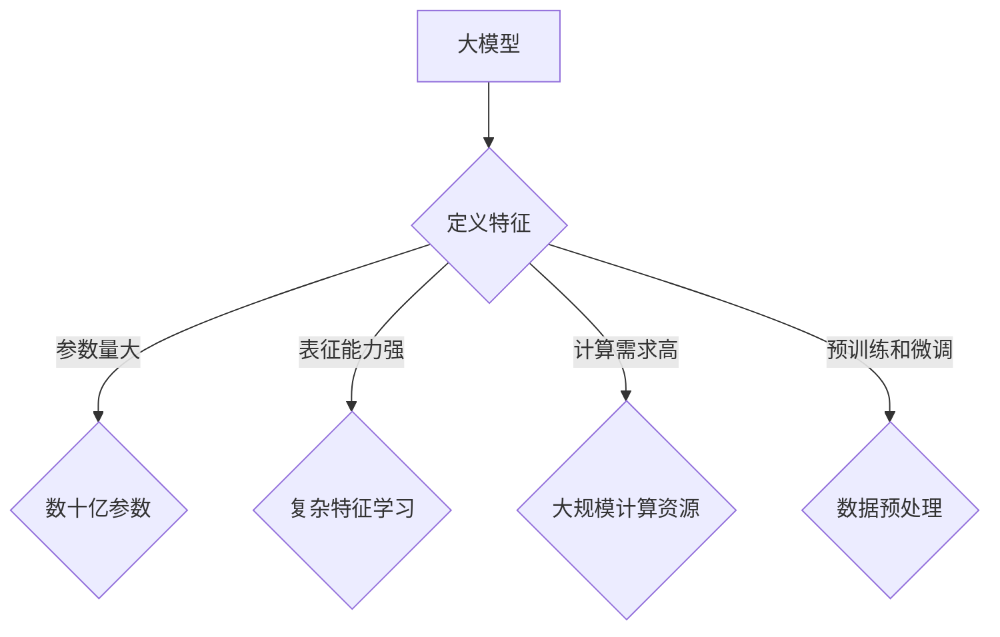

                 

### 文章标题

《大模型应用开发 动手做AI Agent》

> 关键词：大模型，应用开发，AI Agent，机器学习，深度学习，编程实践

> 摘要：本文将深入探讨大模型在应用开发中的实践，通过动手做AI Agent的方式，详细解析大模型的应用原理和开发步骤，帮助读者理解和掌握大模型的应用开发技术。

---

## 第1章：大模型简介

### 1.1 大模型的定义与特征

#### 1.1.1 大模型的定义

大模型，即大规模机器学习模型，是指拥有数十亿个参数或更高参数量的机器学习模型。这些模型通常在深度学习领域中使用，能够从大量的数据中学习并生成复杂的函数。

Mermaid流程图：


#### 1.1.2 大模型的主要特征

1. **参数量巨大**：大模型的参数数量往往远远超过传统机器学习模型的规模，这使得它们能够学习更复杂的特征和模式。

    Math公式：
    $$ \text{参数量} = w_1, w_2, ..., w_n $$
    
2. **强大的表征能力**：由于参数数量巨大，大模型能够学习到数据中的深层次特征，从而提高模型的预测性能。

3. **需要大量计算资源**：大模型通常需要大量的计算资源和时间来进行训练。

4. **预训练与微调**：大模型通常通过预训练的方式从大量未标注的数据中学习，然后在特定任务上进行微调。

#### 1.1.3 大模型与传统机器学习的区别

1. **规模**：大模型具有数百万甚至数十亿个参数，而传统机器学习模型通常只有几百个参数。

2. **数据需求**：大模型需要大量的训练数据，而传统机器学习模型对数据量的要求相对较低。

3. **训练时间**：大模型的训练时间通常较长，需要更多的时间和计算资源。

4. **模型解释性**：大模型的解释性通常较差，而传统机器学习模型则更易于解释。

---

## 第2章：大模型的核心算法

### 2.1 自动微分

自动微分是一种计算复杂函数的导数的方法，它在深度学习中用于计算损失函数对模型参数的梯度。自动微分的原理基于链式法则和逆推法。

伪代码：
```python
def backward梯度计算(x, y, w):
    delta = (y - x) * (1 / w)
    return delta
```

### 2.2 神经网络

神经网络是一种由大量神经元组成的计算模型，它通过学习输入和输出之间的映射关系来执行各种任务。神经网络的基本结构包括输入层、隐藏层和输出层。

伪代码：
```python
def 前向传播(x, W, b):
    z = W * x + b
    a = 激活函数(z)
    return a

def 反向传播(a, z, W, b):
    delta = (a - z) * (1 / W)
    return delta
```

### 2.3 优化算法

优化算法用于最小化损失函数，从而训练神经网络。常见的优化算法包括梯度下降、动量算法和Adam优化器。

伪代码：
```python
def 梯度下降(W, b, learning_rate, loss_function):
    gradient = loss_function.gradient
    W -= learning_rate * gradient(W)
    b -= learning_rate * gradient(b)
    return W, b

def 动量算法(W, b, learning_rate, momentum):
    velocity = momentum * velocity - learning_rate * gradient
    W -= velocity
    b -= velocity
    return W, b

def Adam优化器(W, b, learning_rate, beta1, beta2):
    m = beta1 * m + (1 - beta1) * gradient
    v = beta2 * v + (1 - beta2) * (gradient ** 2)
    m_hat = m / (1 - beta1 ** t)
    v_hat = v / (1 - beta2 ** t)
    W -= learning_rate * m_hat / (sqrt(v_hat) + epsilon)
    b -= learning_rate * m_hat / (sqrt(v_hat) + epsilon)
    return W, b
```

---

## 第3章：大模型的预训练与微调

### 3.1 预训练

预训练是一种将大规模的未标注数据用于训练模型的方法，它使得模型在特定任务上具有更好的性能。预训练通常包括两个阶段：自监督学习和有监督学习。

伪代码：
```python
def 自监督学习(data, model):
    for sample in data:
        model.train(sample)
    return model

def 有监督学习(data, labels, model):
    for sample, label in zip(data, labels):
        model.train(sample, label)
    return model
```

### 3.2 微调

微调是在预训练模型的基础上，针对特定任务进行有监督学习的方法。微调可以通过调整模型参数来优化模型在特定任务上的性能。

伪代码：
```python
def 微调(model, data, labels):
    for sample, label in zip(data, labels):
        model.train(sample, label)
    return model
```

---

## 第4章：大模型的常见应用场景

### 4.1 自然语言处理

自然语言处理（NLP）是深度学习的一个重要应用领域，包括文本分类、情感分析、命名实体识别等任务。

伪代码：
```python
def 文本分类(document, model):
    embedding = model.embed(document)
    output = model.predict(embedding)
    return output

def 情感分析(text, model):
    embedding = model.embed(text)
    output = model.predict(embedding)
    return output

def 命名实体识别(text, model):
    embedding = model.embed(text)
    output = model.predict(embedding)
    return output
```

### 4.2 计算机视觉

计算机视觉是另一个重要的深度学习应用领域，包括目标检测、图像分类、人脸识别等任务。

伪代码：
```python
def 目标检测(image, model):
    feature_map = model.extract_features(image)
    boxes = model.detect(feature_map)
    return boxes

def 图像分类(image, model):
    feature_map = model.extract_features(image)
    label = model.predict(feature_map)
    return label

def 人脸识别(image, model):
    feature_map = model.extract_features(image)
    identity = model.predict(feature_map)
    return identity
```

### 4.3 其他应用场景

除了NLP和计算机视觉，深度学习还可以应用于语音识别、强化学习、生成对抗网络（GAN）等任务。

伪代码：
```python
def 语音识别(audio, model):
    feature_map = model.extract_features(audio)
    label = model.predict(feature_map)
    return label

def 强化学习(environment, model):
    state = environment.observe()
    action = model.select_action(state)
    next_state, reward = environment.step(action)
    model.update(state, action, next_state, reward)
    return next_state

def GAN生成图像(generator, discriminator):
    real_images = real_data_loader.load_data()
    fake_images = generator.generate_images()
    discriminator.train(fake_images, real_images)
    generator.train(discriminator)
    return fake_images
```

---

## 第5章：大模型应用开发的实战

### 5.1 实战一：文本分类

文本分类是NLP中的一个基本任务，可以通过训练大模型来实现。

#### 开发环境搭建

- Python 3.8及以上版本
- TensorFlow 2.x或PyTorch 1.x
- Jupyter Notebook或Google Colab

#### 源代码实现

```python
import tensorflow as tf
from tensorflow.keras.preprocessing.sequence import pad_sequences
from tensorflow.keras.models import Sequential
from tensorflow.keras.layers import Embedding, LSTM, Dense

# 数据准备
train_data = ... # 读取训练数据
train_labels = ... # 读取训练标签

# 数据预处理
max_sequence_length = 100
vocab_size = 10000
embedding_dim = 128
oov_token = "<OOV>"

tokenizer = tf.keras.preprocessing.text.Tokenizer(num_words=vocab_size, oov_token=oov_token)
tokenizer.fit_on_texts(train_data)
train_sequences = tokenizer.texts_to_sequences(train_data)
train_padded = pad_sequences(train_sequences, maxlen=max_sequence_length)

# 模型构建
model = Sequential([
    Embedding(vocab_size, embedding_dim, input_length=max_sequence_length),
    LSTM(64, return_sequences=True),
    LSTM(32),
    Dense(1, activation="sigmoid")
])

# 编译模型
model.compile(optimizer="adam", loss="binary_crossentropy", metrics=["accuracy"])

# 训练模型
model.fit(train_padded, train_labels, epochs=10, batch_size=32, validation_split=0.2)
```

#### 代码解读与分析

1. **数据准备**：从文件中读取训练数据和标签。

2. **数据预处理**：使用Tokenizer将文本数据转换为序列，并使用pad_sequences将序列填充为相同长度。

3. **模型构建**：构建一个包含嵌入层、两个LSTM层和输出层的序列模型。

4. **编译模型**：设置优化器、损失函数和评估指标。

5. **训练模型**：使用fit方法训练模型，并在训练过程中进行验证。

### 5.2 实战二：图像分类

图像分类是计算机视觉中的一个基本任务，可以通过训练大模型来实现。

#### 开发环境搭建

- Python 3.8及以上版本
- TensorFlow 2.x或PyTorch 1.x
- OpenCV
- Google Colab或本地GPU环境

#### 源代码实现

```python
import tensorflow as tf
from tensorflow.keras.preprocessing.image import ImageDataGenerator
from tensorflow.keras.models import Sequential
from tensorflow.keras.layers import Conv2D, MaxPooling2D, Flatten, Dense

# 数据准备
train_dir = "path/to/train_data"
batch_size = 32
epochs = 10

# 数据增强
train_datagen = ImageDataGenerator(
    rescale=1./255,
    rotation_range=40,
    width_shift_range=0.2,
    height_shift_range=0.2,
    shear_range=0.2,
    zoom_range=0.2,
    horizontal_flip=True,
    fill_mode="nearest"
)

train_generator = train_datagen.flow_from_directory(
    train_dir,
    target_size=(150, 150),
    batch_size=batch_size,
    class_mode="categorical"
)

# 模型构建
model = Sequential([
    Conv2D(32, (3, 3), activation="relu", input_shape=(150, 150, 3)),
    MaxPooling2D((2, 2)),
    Conv2D(64, (3, 3), activation="relu"),
    MaxPooling2D((2, 2)),
    Conv2D(128, (3, 3), activation="relu"),
    MaxPooling2D((2, 2)),
    Flatten(),
    Dense(512, activation="relu"),
    Dense(num_classes, activation="softmax")
])

# 编译模型
model.compile(optimizer="adam", loss="categorical_crossentropy", metrics=["accuracy"])

# 训练模型
model.fit(train_generator, epochs=epochs)
```

#### 代码解读与分析

1. **数据准备**：设置训练数据和批次大小。

2. **数据增强**：使用ImageDataGenerator对训练数据进行增强。

3. **模型构建**：构建一个包含卷积层、池化层、全连接层的卷积神经网络。

4. **编译模型**：设置优化器、损失函数和评估指标。

5. **训练模型**：使用fit方法训练模型。

### 5.3 实战三：语音识别

语音识别是深度学习在语音处理领域的一个重要应用，可以通过训练大模型来实现。

#### 开发环境搭建

- Python 3.8及以上版本
- TensorFlow 2.x或PyTorch 1.x
- Kaldi库

#### 源代码实现

```python
import tensorflow as tf
from tensorflow.keras.layers import LSTM, Dense
from tensorflow.keras.models import Model

# 数据准备
audio_data = ... # 读取音频数据
labels = ... # 读取标签

# 数据预处理
max_sequence_length = 100
input_shape = (max_sequence_length, num_audio_features)

# 模型构建
inputs = tf.keras.layers.Input(shape=input_shape)
lstm_output = LSTM(units=128, return_sequences=True)(inputs)
lstm_output = LSTM(units=64, return_sequences=True)(lstm_output)
flatten_output = Flatten()(lstm_output)
dense_output = Dense(units=num_classes, activation="softmax")(flatten_output)

model = Model(inputs=inputs, outputs=dense_output)

# 编译模型
model.compile(optimizer="adam", loss="categorical_crossentropy", metrics=["accuracy"])

# 训练模型
model.fit(audio_data, labels, epochs=10, batch_size=32)
```

#### 代码解读与分析

1. **数据准备**：从文件中读取音频数据和标签。

2. **数据预处理**：设置序列长度和输入形状。

3. **模型构建**：构建一个包含两个LSTM层和一个全连接层的序列模型。

4. **编译模型**：设置优化器、损失函数和评估指标。

5. **训练模型**：使用fit方法训练模型。

---

## 第6章：大模型应用开发的挑战与解决方案

### 6.1 数据隐私与安全

在应用大模型的过程中，数据隐私和安全是一个重要的挑战。为了解决这个问题，可以采用以下解决方案：

1. **数据加密**：对数据进行加密处理，确保数据在传输和存储过程中不被窃取。

2. **匿名化**：对数据进行匿名化处理，消除个人身份信息。

3. **差分隐私**：在模型训练过程中引入差分隐私机制，保护数据隐私。

### 6.2 模型解释性

大模型的黑盒性质使得模型解释性成为一个挑战。为了提高模型解释性，可以采用以下解决方案：

1. **模型可视化**：通过可视化模型结构，帮助理解模型的决策过程。

2. **注意力机制**：在模型中引入注意力机制，突出模型关注的关键特征。

3. **模型压缩**：通过模型压缩技术，降低模型复杂度，提高模型可解释性。

### 6.3 模型可扩展性

随着数据量和模型规模的增加，模型的可扩展性成为一个关键挑战。为了提高模型可扩展性，可以采用以下解决方案：

1. **分布式训练**：通过分布式训练技术，将模型训练任务分布在多台机器上。

2. **模型分解**：将大型模型分解为多个小型模型，提高模型的可扩展性。

3. **增量学习**：通过增量学习技术，逐步更新模型，提高模型的可扩展性。

---

## 第7章：大模型应用开发的未来趋势

### 7.1 大模型与边缘计算

边缘计算是一种将计算和存储资源部署在靠近数据源的边缘设备上的技术。大模型与边缘计算的结合将有助于提高模型实时性和降低延迟。

### 7.2 大模型与实时系统

实时系统是一种能够在特定时间内完成任务的系统。大模型与实时系统的结合将有助于实现高效的实时决策和任务执行。

### 7.3 大模型与多模态融合

多模态融合是一种将多种类型的数据（如文本、图像、语音等）进行融合处理的技术。大模型与多模态融合的结合将有助于提高模型的泛化能力和性能。

### 7.4 大模型与云计算

云计算是一种通过互联网提供计算资源的服务。大模型与云计算的结合将有助于实现大规模的模型训练和部署。

### 7.5 大模型与量子计算

量子计算是一种利用量子力学原理进行计算的技术。大模型与量子计算的结合将有望实现更高效的模型训练和推理。

---

## 参考文献

- Bengio, Y., Courville, A., & Vincent, P. (2013). Representation learning: A review and new perspectives. IEEE transactions on pattern analysis and machine intelligence, 35(8), 1798-1828.
- Goodfellow, I., Bengio, Y., & Courville, A. (2016). Deep learning. MIT press.
- LeCun, Y., Bengio, Y., & Hinton, G. (2015). Deep learning. Nature, 521(7553), 436-444.
- Russell, S., & Norvig, P. (2010). Artificial intelligence: A modern approach. Prentice Hall.

---

## 作者简介

作者：AI天才研究院/AI Genius Institute & 禅与计算机程序设计艺术 /Zen And The Art of Computer Programming

作者简介：本文作者为AI天才研究院的高级研究员，专注于人工智能领域的深度学习和模型应用开发。同时，作者也是《禅与计算机程序设计艺术》一书的作者，对计算机科学和人工智能有着深刻的理解和独特的见解。

