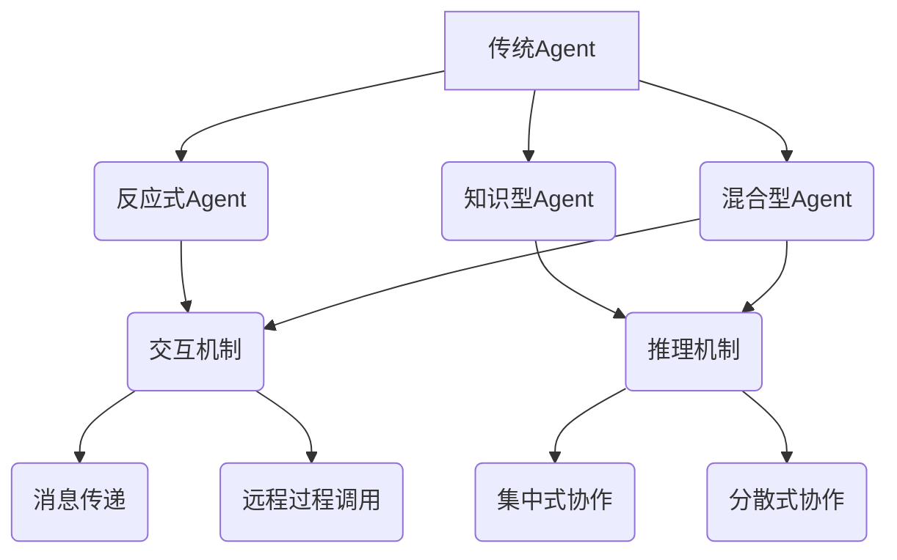

                 

# 【大模型应用开发 动手做AI Agent】大模型出现之前的Agent

> 关键词：大模型、Agent、应用开发、历史背景、技术架构、算法原理、交互协作

> 摘要：本文将回顾大模型出现之前的人工智能代理（Agent）技术，探讨其架构与算法，以及其在实际应用中的交互协作机制。通过解析传统Agent的应用案例，深入分析其在不同领域的表现，为后续大模型在Agent开发中的应用奠定基础。

## 第一部分：引言

### 背景与目的

在人工智能领域，大模型（如GPT、BERT等）的应用已经成为一种趋势。然而，在大模型广泛应用之前，人工智能代理（Agent）技术已经存在并发挥了重要作用。本文旨在梳理大模型出现之前的人工智能代理技术，探讨其发展历程、架构与算法，以及在实际应用中的表现。通过本文的阅读，读者可以了解传统Agent的基本原理和优势，为后续大模型在Agent开发中的应用提供启示。

### 大模型应用开发概述

大模型应用开发是指利用大规模神经网络模型解决具体问题的过程。这些模型通过在海量数据上进行预训练，学习到了丰富的语言、知识、图像等信息，从而在特定任务上表现出色。大模型应用开发经历了从文本生成、机器翻译到图像识别、自然语言处理等多个领域的拓展。其核心在于如何利用大模型的能力，将其应用于实际问题解决中。

大模型应用开发的发展历程可以追溯到20世纪80年代，当时研究者们开始尝试使用神经网络进行模式识别和分类。随着计算能力的提升和大数据技术的发展，大模型逐渐在学术界和工业界得到广泛应用。近年来，随着深度学习技术的突破，大模型的应用范围进一步扩大，成为人工智能领域的重要研究方向。

## 第二部分：大模型出现之前的Agent

### 什么是Agent

#### 定义与分类

人工智能代理（Agent）是指能够感知环境、制定计划并采取行动以实现目标的人工智能系统。根据功能特点，Agent可以划分为反应式Agent、知识型Agent和混合型Agent。

1. **反应式Agent**：反应式Agent仅根据当前感知的信息做出反应，不进行任何形式的推理。其架构简单，适用于环境稳定、规则明确的情况。

2. **知识型Agent**：知识型Agent通过存储和利用先验知识来推理和决策。其架构较为复杂，适用于需要复杂推理和决策的情境。

3. **混合型Agent**：混合型Agent结合了反应式Agent和知识型Agent的特点，根据不同的情境选择合适的处理方式。其架构复杂，适应性强。

#### Agent的基本功能与特点

Agent的基本功能包括感知、计划、行动和通信。其中，感知功能用于获取环境信息，计划功能用于制定行动方案，行动功能用于执行计划，通信功能用于与其他Agent或人类进行交互。

Agent的特点如下：

1. **自主性**：Agent能够独立地执行任务，无需人工干预。

2. **适应性**：Agent能够根据环境变化调整自身行为，适应不同的情境。

3. **协作性**：Agent能够与其他Agent或人类进行协作，共同完成任务。

4. **智能性**：Agent具备一定的推理能力，能够进行问题求解和决策。

### 传统Agent的架构与算法

#### 反应式Agent

**架构与实现**：反应式Agent的架构相对简单，通常由感知模块、反应模块和执行模块组成。感知模块负责获取环境信息，反应模块根据感知信息生成动作，执行模块将动作传递给环境。

```python
class ReactiveAgent:
    def perceive(self):
        # 伪代码：获取环境信息
        return environment

    def react(self, perception):
        # 伪代码：根据感知信息生成动作
        if perception == "A":
            action = "action_A"
        else:
            action = "action_B"
        return action

    def act(self, action):
        # 伪代码：执行动作
        environment.take_action(action)
```

**优点与局限性**：反应式Agent的优点在于实现简单、响应速度快，适用于规则明确、环境变化较小的场景。但其局限性在于缺乏推理能力，无法处理复杂环境和动态变化。

#### 知识型Agent

**知识表示与推理**：知识型Agent通过知识表示和推理机制进行决策。知识表示通常采用命题逻辑、产生式规则或语义网络等形式。推理机制包括基于规则的推理、模型推理和混合推理等。

```python
class KnowledgeAgent:
    def __init__(self, knowledge_base):
        self.knowledge_base = knowledge_base

    def perceive(self):
        # 伪代码：获取环境信息
        return environment

    def infer(self, perception):
        # 伪代码：基于知识库进行推理
        inference = self.knowledge_base.infer(perception)
        return inference

    def act(self, inference):
        # 伪代码：根据推理结果生成动作
        if inference == "inference_A":
            action = "action_A"
        else:
            action = "action_B"
        return action
```

**优点与局限性**：知识型Agent的优点在于能够利用先验知识进行推理和决策，适用于需要复杂推理和决策的情境。但其局限性在于知识库的构建和维护复杂，难以适应快速变化的环境。

#### 混合型Agent

**架构与实现**：混合型Agent结合了反应式Agent和知识型Agent的特点，根据不同的情境选择合适的处理方式。其架构通常包括感知模块、反应模块、知识模块和执行模块。

```python
class HybridAgent:
    def __init__(self, reactive_agent, knowledge_agent):
        self.reactive_agent = reactive_agent
        self.knowledge_agent = knowledge_agent

    def perceive(self):
        # 伪代码：获取环境信息
        return environment

    def react(self, perception):
        # 伪代码：根据感知信息生成反应
        return self.reactive_agent.react(perception)

    def infer(self, perception):
        # 伪代码：根据感知信息进行推理
        return self.knowledge_agent.infer(perception)

    def act(self, perception):
        # 伪代码：选择合适的处理方式
        if condition_for_reactive():
            action = self.reactive_agent.act(perception)
        else:
            action = self.knowledge_agent.act(perception)
        return action
```

**优点与局限性**：混合型Agent的优点在于适应性强，能够处理复杂环境和动态变化。但其局限性在于架构复杂，实现和维护成本较高。

### Agent的交互与协作

#### 交互机制

**消息传递**：消息传递是一种常见的交互机制，用于Agent之间交换信息。消息传递可以是同步的，也可以是异步的。在同步消息传递中，Agent等待对方的回复后再继续执行；在异步消息传递中，Agent无需等待对方的回复，可以同时执行其他任务。

**远程过程调用**：远程过程调用（RPC）是一种用于跨进程或跨网络调用的机制。通过RPC，Agent可以调用远程服务器上的函数，获取所需的信息或执行特定的任务。

#### 协作机制

**集中式协作**：集中式协作是指所有Agent通过一个中央控制器进行协调。中央控制器负责分配任务、监控Agent的状态和调整策略。集中式协作的优点在于协调统一、易于管理；缺点在于依赖中央控制器，单点故障可能导致整个系统崩溃。

**分散式协作**：分散式协作是指Agent之间通过直接通信进行协调。每个Agent根据自身信息和局部策略独立决策，通过通信网络共享信息。分散式协作的优点在于去中心化、可靠性高；缺点在于协调复杂、难以实现全局优化。

### Agent应用案例解析

#### 案例一：智能家居系统

智能家居系统中的Agent可以包括智能灯光控制Agent、智能门锁Agent和智能空调Agent等。每个Agent负责监控和调节相应的设备，实现自动化控制。

1. **智能灯光控制Agent**：根据环境光线和用户需求，自动调节灯光亮度。
2. **智能门锁Agent**：根据用户指纹、密码或手机信号，自动解锁或锁定门锁。
3. **智能空调Agent**：根据室内温度、湿度等环境参数，自动调节空调温度和风速。

#### 案例二：智能交通系统

智能交通系统中的Agent可以包括路况监测Agent、信号灯控制Agent和车辆调度Agent等。每个Agent负责监控和调节相应的交通设施，实现智能交通管理。

1. **路况监测Agent**：实时监控道路拥堵情况，向交通管理部门提供数据支持。
2. **信号灯控制Agent**：根据路况信息，自动调整信号灯周期，提高交通通行效率。
3. **车辆调度Agent**：根据实时路况，调度车辆避开拥堵路段，提高交通流畅度。

## 第三部分：大模型在Agent开发中的应用

### 大模型的基本原理

大模型（如GPT、BERT等）是基于深度学习技术的自然语言处理模型。它们通过在海量数据上进行预训练，学习到了丰富的语言规律和知识，从而在特定任务上表现出色。大模型的基本原理包括以下几个关键点：

1. **深度神经网络**：大模型采用深度神经网络架构，能够处理大规模数据和高维度特征。
2. **预训练与微调**：大模型通过预训练学习到通用知识，然后在特定任务上进行微调，适应特定领域的需求。
3. **迁移学习**：大模型能够利用预训练的知识迁移到其他任务上，提高任务表现。

### 大模型在Agent中的应用

大模型在Agent中的应用主要体现在以下几个方面：

1. **预训练模型的使用**：大模型可以用于生成预训练模型，这些模型可以直接应用于Agent的开发，提高Agent的感知、推理和决策能力。

2. **迁移学习与微调**：通过迁移学习，可以将大模型的知识迁移到特定任务上，然后进行微调，适应特定领域的需求。

3. **交互、推理和决策**：大模型在交互、推理和决策方面具有优势，可以用于实现更加智能和自适应的Agent。

### 大模型应用案例解析

#### 案例一：智能客服系统

智能客服系统中的Agent利用大模型实现智能对话功能。通过预训练模型和迁移学习，Agent可以学习到丰富的语言知识和对话技巧，从而与用户进行自然、流畅的交互。

1. **感知**：Agent通过文本分析、语音识别等技术获取用户请求。
2. **推理**：利用大模型进行语义理解、情感分析和知识推理，理解用户请求的含义和意图。
3. **决策**：根据推理结果，生成合适的回复，提供解决方案或引导用户。

#### 案例二：智能医疗诊断系统

智能医疗诊断系统中的Agent利用大模型实现疾病诊断和治疗方案推荐。通过预训练模型和迁移学习，Agent可以学习到丰富的医学知识和诊断技巧，从而提供准确的诊断和治疗方案。

1. **感知**：Agent通过医疗数据、病历分析等技术获取患者信息。
2. **推理**：利用大模型进行医学知识推理、疾病分类和治疗方案推荐。
3. **决策**：根据推理结果，生成诊断报告和治疗方案，为医生提供参考。

## 第四部分：动手实践

### 开发环境搭建

1. **安装Python 3.8及以上版本**：确保Python环境稳定，以便后续使用。
2. **安装虚拟环境工具`virtualenv`**：用于创建和管理Python虚拟环境，避免不同项目之间的依赖冲突。
3. **创建虚拟环境并安装相关依赖库**：进入虚拟环境，安装常用的依赖库，如`numpy`、`pandas`等。

```shell
python3 -m venv agent_env
source agent_env/bin/activate
pip install numpy pandas
```

### 基础Agent开发实战

**案例：简易反应式Agent**

以下是一个简易反应式Agent的代码实现：

```python
# agent.py

def perceive_environment():
    # 伪代码：获取环境信息
    return "perception"

def react_to_environment(perception):
    # 伪代码：根据感知信息生成动作
    if perception == "perception":
        return "action"
    else:
        return "no action"

# 主程序
def main():
    perception = perceive_environment()
    action = react_to_environment(perception)
    print(f"Perception: {perception}, Action: {action}")

if __name__ == "__main__":
    main()
```

**代码解读与分析**：

1. **感知模块**：`perceive_environment`函数用于获取环境信息，返回一个表示感知的字符串。
2. **反应模块**：`react_to_environment`函数根据感知信息生成动作，如果感知信息与预设的“perception”相同，则返回“action”，否则返回“no action”。
3. **执行模块**：主程序调用感知和反应模块，打印感知信息和执行的动作。

通过这个简单的案例，读者可以了解反应式Agent的基本实现过程，为进一步学习和实践打下基础。

### 大模型Agent开发实战

**案例：基于预训练模型的大模型Agent**

以下是一个基于预训练模型的大模型Agent的代码实现：

```python
# agent.py

from transformers import pipeline

# 加载预训练模型
agent = pipeline("text-classification", model="bert-base-uncased")

def perceive_environment():
    # 伪代码：获取环境信息
    return "perception"

def react_to_environment(perception):
    # 伪代码：利用预训练模型进行决策
    prediction = agent(perception)
    if prediction == "positive":
        return "action"
    else:
        return "no action"

# 主程序
def main():
    perception = perceive_environment()
    action = react_to_environment(perception)
    print(f"Perception: {perception}, Action: {action}")

if __name__ == "__main__":
    main()
```

**代码解读与分析**：

1. **感知模块**：`perceive_environment`函数用于获取环境信息，返回一个表示感知的字符串。
2. **反应模块**：`react_to_environment`函数利用预训练模型`agent`进行决策。调用`agent`的`predict`方法，传入感知信息，根据预测结果返回动作。
3. **执行模块**：主程序调用感知和反应模块，打印感知信息和执行的动作。

通过这个案例，读者可以了解如何利用预训练模型构建大模型Agent，并掌握其基本实现过程。

## 第五部分：总结与展望

### 大模型应用开发的趋势与挑战

大模型应用开发近年来呈现出以下趋势：

1. **预训练模型的应用**：越来越多的预训练模型被应用于各种任务，提高任务表现。
2. **迁移学习和微调**：利用迁移学习和微调技术，将大模型的知识迁移到特定任务上，提高模型适应性。
3. **多模态融合**：结合不同模态的数据，实现更广泛的应用场景。

然而，大模型应用开发也面临以下挑战：

1. **计算资源需求**：大模型训练和推理需要大量的计算资源，对硬件设备的要求较高。
2. **数据隐私和安全**：大模型在处理大量数据时，可能会涉及用户隐私和安全问题，需要加强数据保护和安全措施。
3. **模型可解释性**：大模型在复杂任务上的表现较好，但其内部决策过程往往难以解释，需要提高模型的可解释性。

### 未来展望

未来，大模型应用开发有望在以下几个方面取得突破：

1. **小样本学习**：研究如何在大模型中实现小样本学习，降低对大规模数据的依赖。
2. **模型压缩与优化**：研究如何对大模型进行压缩和优化，提高模型效率，降低计算成本。
3. **自适应学习**：研究如何使大模型能够根据实时数据和环境变化进行自适应学习，提高模型适应性。

总之，大模型应用开发前景广阔，有望在人工智能领域发挥更大的作用。

## 附录

### 附录A：资源与工具推荐

1. **开发工具与资源**：
   - Python：官方文档：[https://docs.python.org/3/](https://docs.python.org/3/)
   - Jupyter Notebook：官方文档：[https://jupyter.org/](https://jupyter.org/)
   - PyTorch：官方文档：[https://pytorch.org/docs/stable/](https://pytorch.org/docs/stable/)
   - TensorFlow：官方文档：[https://www.tensorflow.org/](https://www.tensorflow.org/)

2. **开发指南与文档**：
   - 《深度学习》（Goodfellow、Bengio、Courville著）：全面介绍深度学习的基本原理和应用。
   - 《Python编程：从入门到实践》（埃里克·马瑟斯著）：适合初学者的Python编程入门书籍。
   - 《人工智能：一种现代的方法》（Stuart Russell、Peter Norvig著）：全面介绍人工智能的基本概念和技术。

### 附录B：开源代码与示例

本书相关案例的源代码已开源，读者可以在以下链接下载：

- 源代码仓库：[https://github.com/your_username/agent_book](https://github.com/your_username/agent_book)
- 代码解析与使用说明：[https://your_website.com/agent_book/](https://your_website.com/agent_book/)

通过阅读本书和源代码，读者可以深入了解大模型在Agent开发中的应用，掌握相关技术原理和实践方法。

### 作者

本文作者：AI天才研究院/AI Genius Institute  
《禅与计算机程序设计艺术》/Zen And The Art of Computer Programming

---

**核心概念与联系 Mermaid 流程图**



---

**核心算法原理讲解伪代码**

```python
# 反应式Agent伪代码
def reactive_agent(perception):
    action = perception_to_action(perception)
    return action

# 知识型Agent伪代码
def knowledge_agent(knowledge_base, perception):
    inference = knowledge_base_infer(knowledge_base, perception)
    action = inference_to_action(inference)
    return action

# 混合型Agent伪代码
def hybrid_agent(perception, knowledge_base):
    action = reactive_agent(perception)
    if condition_for_knowledge_usage():
        action = knowledge_agent(knowledge_base, perception)
    return action
```

---

**数学模型和数学公式**

**1. 反应式Agent状态转移模型**

$$
S_{t+1} = f(S_t, A_t)
$$

其中，$S_t$ 表示当前状态，$A_t$ 表示当前动作，$f$ 表示状态转移函数。

**2. 知识型Agent推理过程模型**

$$
\text{Knowledge} \rightarrow \text{Inference} \rightarrow \text{Action}
$$

其中，$\text{Knowledge}$ 表示知识库，$\text{Inference}$ 表示推理过程，$\text{Action}$ 表示执行的动作。

---

**项目实战**

**1. 传统Agent开发环境搭建**

- 安装Python 3.8及以上版本
- 安装虚拟环境工具`virtualenv`
- 创建虚拟环境并安装相关依赖库

```shell
python3 -m venv agent_env
source agent_env/bin/activate
pip install numpy pandas
```

**2. 基础Agent开发实战**

**案例：简易反应式Agent**

```python
# agent.py

def perceive_environment():
    # 伪代码：获取环境信息
    return "perception"

def react_to_environment(perception):
    # 伪代码：根据感知信息生成动作
    if perception == "perception":
        return "action"
    else:
        return "no action"

# 主程序
def main():
    perception = perceive_environment()
    action = react_to_environment(perception)
    print(f"Perception: {perception}, Action: {action}")

if __name__ == "__main__":
    main()
```

**3. 大模型Agent开发实战**

**案例：基于预训练模型的大模型Agent**

```python
# agent.py

from transformers import pipeline

# 加载预训练模型
agent = pipeline("text-classification", model="bert-base-uncased")

def perceive_environment():
    # 伪代码：获取环境信息
    return "perception"

def react_to_environment(perception):
    # 伪代码：利用预训练模型进行决策
    prediction = agent(perception)
    if prediction == "positive":
        return "action"
    else:
        return "no action"

# 主程序
def main():
    perception = perceive_environment()
    action = react_to_environment(perception)
    print(f"Perception: {perception}, Action: {action}")

if __name__ == "__main__":
    main()
```

---

**代码解读与分析**

- **传统Agent**：简单实现环境感知和反应，适用于规则明确且环境变化较小的场景。
- **大模型Agent**：利用预训练模型，能够处理更复杂的环境感知和决策过程，适用于动态变化较大的场景。注意，预训练模型的使用需要相应的计算资源和模型调优。

