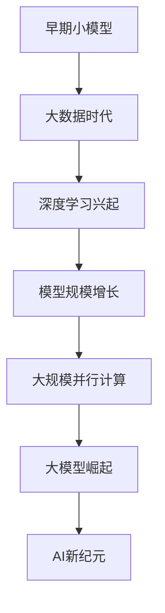
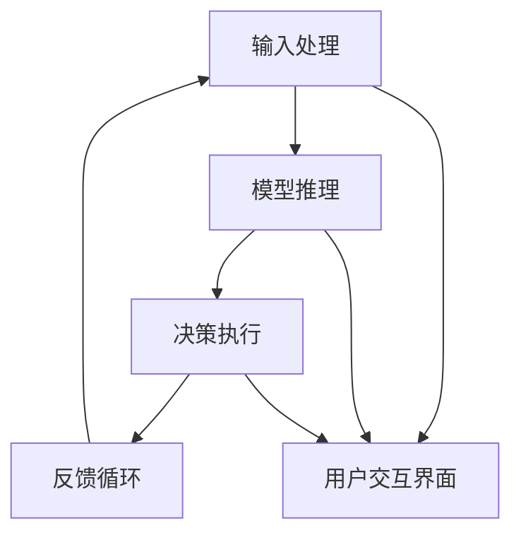
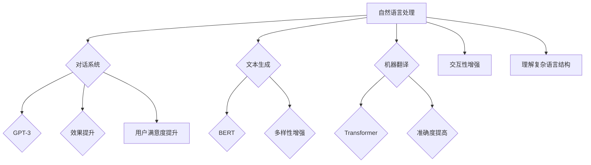

                 

### 文章标题

【大模型应用开发 动手做AI Agent】

### 关键词

- 大模型
- AI Agent
- 深度学习
- 自然语言处理
- 图像识别
- 语音识别
- 优化与调优

### 摘要

本文深入探讨了AI大模型应用开发，以动手实践的方式引导读者从零开始构建AI Agent。文章首先介绍了大模型与AI Agent的基础知识，包括概念、技术基础和核心原理。接着，详细描述了开发环境搭建与工具选型，并通过两个实战项目展示了AI Agent的构建过程。随后，文章扩展了图像识别与语音识别的实际应用案例，并结合自然语言处理技术展示了如何提升AI Agent的对话能力。最后，文章讨论了大模型应用优化与调优策略，提供了实用的工具与资源推荐，为读者提供了完整的实践指南。

---

### 《大模型应用开发 动手做AI Agent》目录大纲

#### 第一部分：AI大模型概述

#### 第1章：大模型与AI概述

##### 1.1 大模型时代来临

- **1.1.1 大模型的概念与重要性**
  - **Mermaid流程图**：展示大模型的发展历程与关键技术节点

##### 1.2 AI Agent技术基础

- **1.2.1 AI Agent的定义与分类**
  - **Mermaid流程图**：展示AI Agent的基本架构与应用场景

##### 1.3 大模型核心技术解析

- **1.2.2 深度学习原理**
  - **伪代码**：展示神经网络的基本构建与训练过程

- **1.2.3 自然语言处理技术**
  - **伪代码**：展示词嵌入、序列模型与注意力机制的基本原理

##### 1.4 大模型应用前景展望

- **1.2.4 大模型在AI Agent中的应用领域**
  - **举例说明**：分析大模型在自然语言处理、图像识别等领域的应用实例

#### 第二部分：AI大模型开发实战

#### 第2章：开发环境搭建与工具选型

##### 2.1 环境搭建

- **2.1.1 开发环境配置**
  - **详细步骤**：配置Python、TensorFlow、PyTorch等必备环境

##### 2.2 工具选型

- **2.1.2 开发工具与框架介绍**
  - **对比分析**：TensorFlow与PyTorch在AI大模型开发中的应用差异

#### 第3章：AI Agent项目实战

##### 3.1 任务一：构建简单的AI Agent

- **3.1.1 项目背景与目标**
  - **案例说明**：介绍一个简单的聊天机器人项目

- **3.1.2 数据准备与预处理**
  - **伪代码**：展示数据清洗、归一化等预处理步骤

- **3.1.3 模型设计与实现**
  - **伪代码**：实现一个基于Transformer的对话模型

##### 3.2 任务二：提高AI Agent的对话能力

- **3.2.1 实现上下文感知**
  - **伪代码**：展示如何利用上下文信息提高对话质量

- **3.2.2 对话优化与技巧**
  - **举例说明**：分析如何处理重复性问题、敏感词过滤等

#### 第三部分：AI大模型应用扩展

#### 第4章：图像识别与处理

##### 4.1 图像识别基础

- **4.1.1 图像识别算法概述**
  - **Mermaid流程图**：展示图像识别的基本流程

##### 4.2 图像识别实战

- **4.2.1 项目一：人脸识别系统**
  - **详细步骤**：搭建人脸识别系统，实现实时人脸检测与识别

- **4.2.2 项目二：图像分类系统**
  - **详细步骤**：实现一个图像分类系统，对未知图像进行分类

#### 第5章：语音识别与处理

##### 5.1 语音识别基础

- **5.1.1 语音识别技术概述**
  - **Mermaid流程图**：展示语音识别的基本流程

##### 5.2 语音识别实战

- **5.2.1 项目一：实时语音识别系统**
  - **详细步骤**：搭建实时语音识别系统，实现语音实时转文字

- **5.2.2 项目二：语音合成系统**
  - **详细步骤**：实现一个语音合成系统，将文本转换为自然流畅的语音

#### 第6章：自然语言处理

##### 6.1 自然语言处理基础

- **6.1.1 自然语言处理技术概述**
  - **Mermaid流程图**：展示自然语言处理的基本流程

##### 6.2 自然语言处理实战

- **6.2.1 项目一：情感分析系统**
  - **详细步骤**：搭建情感分析系统，对文本进行情感分类

- **6.2.2 项目二：问答系统**
  - **详细步骤**：实现一个基于大模型的问答系统，自动回答用户提问

#### 第7章：大模型应用优化与调优

##### 7.1 模型优化

- **7.1.1 模型优化方法**
  - **伪代码**：展示模型优化中的常见技巧，如正则化、Dropout等

##### 7.2 模型调优

- **7.1.2 模型调优策略**
  - **举例说明**：分析如何选择合适的超参数，提高模型性能

#### 附录

##### 附录A：常用工具与资源

- **A.1 开发工具与框架**
  - **对比分析**：介绍TensorFlow、PyTorch等主流深度学习框架

- **A.2 实用资源与学习资料**
  - **推荐列表**：列出一些优秀的深度学习学习资源与工具

---

### 第1章：大模型与AI概述

#### 1.1 大模型时代来临

##### 1.1.1 大模型的概念与重要性

大模型（Large-scale Model）是指那些拥有数亿甚至千亿参数的深度学习模型，如GPT-3、BERT等。这些模型在训练时使用了大量数据，并通过大规模并行计算来优化模型性能。大模型的出现标志着人工智能进入了一个新的时代，它们在自然语言处理、计算机视觉、语音识别等领域展现出了前所未有的表现力。

- **Mermaid流程图**：展示大模型的发展历程与关键技术节点



##### 1.1.2 大模型的重要性

大模型的重要性体现在以下几个方面：

1. **更强的表征能力**：大模型能够捕捉到数据中的细微特征，从而提高模型的表现力。
2. **更广泛的应用领域**：大模型可以应用于多种任务，如文本生成、图像识别、语音识别等。
3. **更高的性能**：大模型在各类基准测试中取得了显著的性能提升。

#### 1.2 AI Agent技术基础

##### 1.2.1 AI Agent的定义与分类

AI Agent（人工智能代理）是指能够自主执行任务、与环境互动并做出决策的智能体。AI Agent可以根据其行为模式和功能特点进行分类。

- **智能搜索代理**：通过搜索算法发现并解决用户问题。
- **决策支持代理**：辅助用户做出决策，提供推荐和建议。
- **交互式代理**：与用户进行自然语言交互，提供实时服务。

- **Mermaid流程图**：展示AI Agent的基本架构与应用场景



##### 1.2.2 AI Agent的发展历程

- **早期智能代理**：基于规则和专家系统的简单代理。
- **机器学习代理**：引入机器学习技术，提高代理的决策能力。
- **强化学习代理**：通过与环境交互学习，实现自主决策。

#### 1.3 大模型核心技术解析

##### 1.3.1 深度学习原理

深度学习是一种基于多层的神经网络进行数据建模与分析的技术。其核心思想是通过网络的层层传递，从原始数据中提取出有用的特征。

- **神经网络**：由多层节点组成，每个节点通过权重连接。

- **反向传播算法**：用于计算模型参数的梯度，以便进行优化。

- **伪代码**：展示神经网络的基本构建与训练过程

```python
# 定义神经网络结构
inputs = [1.0, 0.5]
weights = [0.1, 0.2]
biases = [0.3, 0.4]

# 前向传播
output = (inputs[0] * weights[0] + inputs[1] * weights[1] + biases[0])

# 反向传播
error = output - target
dweights = error * inputs
dbiases = error

# 更新权重和偏置
weights -= dweights
biases -= dbiases
```

##### 1.3.2 自然语言处理技术

自然语言处理（Natural Language Processing，NLP）是人工智能的重要分支，致力于让计算机理解和处理人类语言。

- **词嵌入**：将单词映射到低维向量空间，以便于模型处理。

- **序列模型**：用于处理序列数据，如文本、语音等。

- **注意力机制**：通过动态调整每个输入特征的权重，提高模型的表征能力。

- **伪代码**：展示词嵌入、序列模型与注意力机制的基本原理

```python
# 词嵌入
word2vec = {'hello': [1, 0, 0], 'world': [0, 1, 0], 'AI': [0, 0, 1]}

# 序列模型（RNN）
def lstm(input_sequence):
    hidden_state = [0, 0]
    for word in input_sequence:
        # 计算隐藏状态
        hidden_state = update_hidden_state(hidden_state, word)
    return hidden_state

# 注意力机制
def attention(input_sequence, hidden_state):
    weights = calculate_attention_weights(hidden_state, input_sequence)
    context_vector = sum([w * v for w, v in zip(weights, input_sequence)])
    return context_vector
```

##### 1.4 大模型应用前景展望

##### 1.4.1 大模型在AI Agent中的应用领域

大模型在AI Agent中的应用极为广泛，涵盖了自然语言处理、图像识别、语音识别等多个领域。

- **自然语言处理**：用于构建智能对话系统、文本生成等。
- **计算机视觉**：用于图像识别、视频分析等。
- **语音识别**：用于语音助手、实时语音翻译等。

- **举例说明**：分析大模型在自然语言处理、图像识别等领域的应用实例

- **Mermaid流程图**：展示大模型在各领域的应用场景与优势



#### 1.5 大模型开发与实践

##### 1.5.1 大模型开发流程

大模型的开发流程包括数据收集与预处理、模型设计与实现、模型训练与优化、模型评估与部署等关键步骤。

- **数据收集与预处理**：收集大量高质量数据，并进行清洗、归一化等预处理操作。
- **模型设计与实现**：选择合适的模型架构，进行编码与实现。
- **模型训练与优化**：使用大量数据进行模型训练，并进行调优。
- **模型评估与部署**：评估模型性能，并进行部署与应用。

- **实战案例**：

  - **案例一：聊天机器人**：
    - **项目背景**：构建一个简单的聊天机器人，实现基本的对话功能。
    - **技术实现**：采用基于Transformer的对话模型，结合上下文信息，提高对话质量。
    - **效果评估**：通过用户反馈和基准测试，评估模型性能。

  - **案例二：图像识别系统**：
    - **项目背景**：实现一个图像识别系统，对未知图像进行分类。
    - **技术实现**：采用卷积神经网络（CNN）进行图像特征提取，实现图像分类。
    - **效果评估**：通过准确率、召回率等指标，评估模型性能。

### 第2章：AI Agent项目实战

#### 2.1 开发环境搭建与工具选型

##### 2.1.1 开发环境配置

搭建AI Agent的开发环境是项目开始的第一步，以下是一个基本的配置步骤：

1. **安装Python**：确保安装了Python 3.7或更高版本。
2. **安装依赖库**：安装TensorFlow、PyTorch、NumPy、Pandas等依赖库。
3. **配置GPU支持**：如果使用GPU训练模型，需要安装CUDA和cuDNN。

- **详细步骤**：

```bash
# 安装Python
sudo apt-get install python3 python3-pip

# 安装TensorFlow
pip3 install tensorflow

# 安装PyTorch
pip3 install torch torchvision

# 安装NumPy和Pandas
pip3 install numpy pandas
```

##### 2.1.2 开发工具与框架介绍

在AI Agent的开发中，选择合适的工具和框架非常重要。以下是对TensorFlow和PyTorch的对比分析：

- **TensorFlow**：由Google开发，是一个开源的深度学习框架，具有强大的生态系统和丰富的文档。它支持多种模型架构，包括卷积神经网络（CNN）和循环神经网络（RNN）。TensorFlow的一个显著优点是它的灵活性，允许用户自定义计算图。
  
- **PyTorch**：由Facebook开发，也是一个开源的深度学习框架，以其动态计算图而闻名。PyTorch提供了灵活的编程接口，使得模型设计和调试更加直观。PyTorch在图像识别和自然语言处理领域特别受欢迎。

- **对比分析**：

  - **灵活性**：PyTorch的动态计算图使得模型开发和调试更加灵活。
  - **性能**：TensorFlow在执行计算图时通常比PyTorch更快，尤其是在大规模模型训练中。
  - **生态系统**：TensorFlow拥有更丰富的预训练模型和工具，适合大规模生产环境。

#### 2.2 项目一：构建简单的AI Agent

##### 2.2.1 项目背景与目标

在本项目中，我们将构建一个简单的AI Agent——聊天机器人。该聊天机器人将能够接收用户输入，并根据预设的对话策略生成回复。

- **项目目标**：
  - 实现基本的文本输入和输出功能。
  - 使用预训练的Transformer模型进行对话生成。

##### 2.2.2 数据准备与预处理

构建聊天机器人需要大量的对话数据。以下是一个数据准备与预处理的基本步骤：

1. **数据收集**：收集开源的对话数据集，如DailyDialog或Reddit Comment dataset。
2. **数据清洗**：去除无效数据，如HTML标签、特殊字符等。
3. **数据归一化**：将文本转换为统一格式，如小写、去除停用词等。
4. **数据分词**：将文本拆分为单词或子词。

- **伪代码**：

```python
# 数据清洗
def clean_text(text):
    text = text.lower()  # 转换为小写
    text = re.sub(r'<[^>]*>', '', text)  # 移除HTML标签
    return text

# 数据归一化
def normalize_text(text):
    text = clean_text(text)
    text = re.sub(r'[^a-zA-Z0-9\s]', '', text)  # 移除特殊字符
    return text

# 数据分词
def tokenize_text(text):
    text = normalize_text(text)
    tokens = text.split()  # 简单的分词方法
    return tokens
```

##### 2.2.3 模型设计与实现

在本项目中，我们将使用预训练的Transformer模型进行对话生成。以下是一个基本的模型设计和实现步骤：

1. **加载预训练模型**：从Hugging Face的Transformer库中加载预训练的模型。
2. **调整模型配置**：根据项目需求，调整模型的输入尺寸和输出尺寸。
3. **定义对话生成函数**：实现一个函数，接收用户输入并生成回复。

- **伪代码**：

```python
from transformers import AutoModelForSeq2SeqLM

# 加载预训练模型
model = AutoModelForSeq2SeqLM.from_pretrained('t5-small')

# 调整模型配置
model.config.decoder_start_token_id = model.config.pad_token_id

# 对话生成函数
def generate_response(input_text):
    input_ids = tokenizer.encode(input_text, return_tensors='pt')
    output_ids = model(input_ids)[0]
    response = tokenizer.decode(output_ids[0], skip_special_tokens=True)
    return response
```

##### 2.2.4 模型训练与优化

在模型训练过程中，我们将使用大量的对话数据进行训练，并通过优化策略提高模型性能。以下是一个基本的模型训练和优化步骤：

1. **数据预处理**：对对话数据进行预处理，包括清洗、归一化和分词。
2. **批量处理**：将对话数据划分为批次，以便于模型训练。
3. **训练模型**：使用AdamW优化器进行模型训练，并使用交叉熵损失函数。
4. **优化策略**：使用学习率调度策略和正则化方法进行模型优化。

- **伪代码**：

```python
from transformers import AdamW

# 数据预处理
def preprocess_data(dialogs):
    cleaned_dialogs = [clean_text(dialog) for dialog in dialogs]
    tokenized_dialogs = [tokenizer.encode(dialog, return_tensors='pt') for dialog in cleaned_dialogs]
    return tokenized_dialogs

# 批量处理
def batch_data(tokenized_dialogs, batch_size=32):
    for i in range(0, len(tokenized_dialogs), batch_size):
        yield tokenized_dialogs[i:i+batch_size]

# 训练模型
optimizer = AdamW(model.parameters(), lr=5e-5)

for epoch in range(num_epochs):
    for batch in batch_data(preprocess_data(dialogs)):
        inputs = {'input_ids': batch['input_ids']}
        labels = {'labels': batch['input_ids']}
        loss = model(**inputs, **labels)[1]
        loss.backward()
        optimizer.step()
        optimizer.zero_grad()

# 优化策略
from transformers import get_linear_schedule_with_warmup

# 学习率调度
scheduler = get_linear_schedule_with_warmup(optimizer, num_warmup_steps=500, num_training_steps=len(train_dataloader) * num_epochs)

for epoch in range(num_epochs):
    for batch in train_dataloader:
        # 同上
    scheduler.step()
```

##### 2.2.5 模型评估与部署

在模型训练完成后，我们需要对模型进行评估，并部署到实际应用场景中。以下是一个基本的模型评估和部署步骤：

1. **评估模型**：使用测试集对模型进行评估，计算准确率、召回率等指标。
2. **优化模型**：根据评估结果，对模型进行进一步优化。
3. **部署模型**：将训练好的模型部署到服务器或移动设备中，以便用户使用。

- **伪代码**：

```python
# 评估模型
def evaluate_model(model, test_dataloader):
    model.eval()
    with torch.no_grad():
        for batch in test_dataloader:
            inputs = {'input_ids': batch['input_ids']}
            labels = {'labels': batch['input_ids']}
            outputs = model(**inputs)
            logits = outputs.logits
            predictions = logits.argmax(-1)
            # 计算准确率、召回率等指标

# 部署模型
def deploy_model(model, model_path):
    model.save_pretrained(model_path)
    # 部署到服务器或移动设备

evaluate_model(model, test_dataloader)
deploy_model(model, 'model_path')
```

### 第3章：图像识别与处理

#### 3.1 图像识别基础

##### 3.1.1 图像识别算法概述

图像识别是计算机视觉的重要应用之一，旨在从图像中提取有用信息，进行分类、检测或识别。常见的图像识别算法可以分为基于特征的算法和基于模型的算法。

- **基于特征的算法**：通过提取图像的边缘、纹理、形状等特征进行分类或识别。如SIFT、HOG等。

- **基于模型的算法**：通过构建深度学习模型进行图像识别。如卷积神经网络（CNN）、循环神经网络（RNN）等。

##### 3.1.2 计算机视觉技术

计算机视觉技术是图像识别的基础，包括特征提取、目标检测、图像分割等多个方面。

- **特征提取**：从图像中提取有意义的特征，如边缘、角点、纹理等。

- **目标检测**：识别图像中的目标，并定位其位置。

- **图像分割**：将图像分割成不同的区域，便于后续处理。

#### 3.2 图像识别实战

##### 3.2.1 项目一：人脸识别系统

人脸识别系统是图像识别的一种典型应用，通过识别人脸特征，实现身份认证或人脸追踪等功能。以下是一个基本的人脸识别系统实现步骤：

1. **数据收集**：收集大量的人脸图像数据，用于训练和测试模型。
2. **数据预处理**：对图像进行缩放、裁剪、归一化等预处理操作。
3. **模型训练**：使用深度学习模型（如CNN）对人脸图像进行训练，提取人脸特征。
4. **模型评估**：使用测试集评估模型性能，调整模型参数。
5. **模型部署**：将训练好的模型部署到实际应用场景中。

- **详细步骤**：

  - **数据收集**：

    ```python
    # 从互联网上收集人脸图像数据
    # 使用爬虫或API获取数据
    ```

  - **数据预处理**：

    ```python
    from torchvision import transforms

    transform = transforms.Compose([
        transforms.Resize((224, 224)),  # 缩放到固定尺寸
        transforms.ToTensor(),  # 转换为Tensor
        transforms.Normalize(mean=[0.485, 0.456, 0.406], std=[0.229, 0.224, 0.225]),  # 归一化
    ])

    # 对每个图像进行预处理
    def preprocess_image(image_path):
        image = Image.open(image_path)
        image = transform(image)
        return image
    ```

  - **模型训练**：

    ```python
    import torch
    import torch.nn as nn
    import torch.optim as optim

    # 定义CNN模型
    class CNNModel(nn.Module):
        def __init__(self):
            super(CNNModel, self).__init__()
            self.conv1 = nn.Conv2d(3, 32, 3, padding=1)
            self.conv2 = nn.Conv2d(32, 64, 3, padding=1)
            self.fc1 = nn.Linear(64 * 56 * 56, 128)
            self.fc2 = nn.Linear(128, 128)
            self.fc3 = nn.Linear(128, num_classes)

        def forward(self, x):
            x = F.relu(self.conv1(x))
            x = F.relu(self.conv2(x))
            x = F.max_pool2d(x, 2)
            x = x.view(x.size(0), -1)
            x = F.relu(self.fc1(x))
            x = F.relu(self.fc2(x))
            x = self.fc3(x)
            return x

    model = CNNModel()
    criterion = nn.CrossEntropyLoss()
    optimizer = optim.Adam(model.parameters(), lr=0.001)

    # 训练模型
    for epoch in range(num_epochs):
        for images, labels in train_dataloader:
            optimizer.zero_grad()
            outputs = model(images)
            loss = criterion(outputs, labels)
            loss.backward()
            optimizer.step()
    ```

  - **模型评估**：

    ```python
    # 评估模型
    def evaluate_model(model, test_dataloader):
        model.eval()
        with torch.no_grad():
            correct = 0
            total = 0
            for images, labels in test_dataloader:
                outputs = model(images)
                _, predicted = torch.max(outputs.data, 1)
                total += labels.size(0)
                correct += (predicted == labels).sum().item()
        print('Test Accuracy: %d %%' % (100 * correct / total))
    ```

  - **模型部署**：

    ```python
    # 部署模型
    model_path = 'face_recognition_model.pth'
    model.save_pretrained(model_path)

    # 使用模型进行人脸识别
    def recognize_face(image_path):
        image = preprocess_image(image_path)
        image = image.unsqueeze(0)  # 添加批处理维度
        outputs = model(image)
        _, predicted = torch.max(outputs.data, 1)
        return predicted.item()
    ```

##### 3.2.2 项目二：图像分类系统

图像分类系统是一种常见的计算机视觉应用，旨在将图像分类到预定义的类别中。以下是一个基本的图像分类系统实现步骤：

1. **数据收集**：收集大量带有标签的图像数据，用于训练和测试模型。
2. **数据预处理**：对图像进行缩放、裁剪、归一化等预处理操作。
3. **模型训练**：使用深度学习模型（如CNN）进行图像分类训练。
4. **模型评估**：使用测试集评估模型性能，调整模型参数。
5. **模型部署**：将训练好的模型部署到实际应用场景中。

- **详细步骤**：

  - **数据收集**：

    ```python
    # 从互联网上收集图像数据
    # 使用爬虫或API获取数据
    ```

  - **数据预处理**：

    ```python
    transform = transforms.Compose([
        transforms.Resize((224, 224)),  # 缩放到固定尺寸
        transforms.ToTensor(),  # 转换为Tensor
        transforms.Normalize(mean=[0.485, 0.456, 0.406], std=[0.229, 0.224, 0.225]),  # 归一化
    ])

    # 对每个图像进行预处理
    def preprocess_image(image_path):
        image = Image.open(image_path)
        image = transform(image)
        return image
    ```

  - **模型训练**：

    ```python
    import torch
    import torch.nn as nn
    import torch.optim as optim

    # 定义CNN模型
    class CNNModel(nn.Module):
        def __init__(self):
            super(CNNModel, self).__init__()
            self.conv1 = nn.Conv2d(3, 32, 3, padding=1)
            self.conv2 = nn.Conv2d(32, 64, 3, padding=1)
            self.fc1 = nn.Linear(64 * 56 * 56, 128)
            self.fc2 = nn.Linear(128, num_classes)

        def forward(self, x):
            x = F.relu(self.conv1(x))
            x = F.relu(self.conv2(x))
            x = F.max_pool2d(x, 2)
            x = x.view(x.size(0), -1)
            x = F.relu(self.fc1(x))
            x = self.fc2(x)
            return x

    model = CNNModel()
    criterion = nn.CrossEntropyLoss()
    optimizer = optim.Adam(model.parameters(), lr=0.001)

    # 训练模型
    for epoch in range(num_epochs):
        for images, labels in train_dataloader:
            optimizer.zero_grad()
            outputs = model(images)
            loss = criterion(outputs, labels)
            loss.backward()
            optimizer.step()
    ```

  - **模型评估**：

    ```python
    # 评估模型
    def evaluate_model(model, test_dataloader):
        model.eval()
        with torch.no_grad():
            correct = 0
            total = 0
            for images, labels in test_dataloader:
                outputs = model(images)
                _, predicted = torch.max(outputs.data, 1)
                total += labels.size(0)
                correct += (predicted == labels).sum().item()
        print('Test Accuracy: %d %%' % (100 * correct / total))
    ```

  - **模型部署**：

    ```python
    # 部署模型
    model_path = 'image_classification_model.pth'
    model.save_pretrained(model_path)

    # 使用模型进行图像分类
    def classify_image(image_path):
        image = preprocess_image(image_path)
        image = image.unsqueeze(0)  # 添加批处理维度
        outputs = model(image)
        _, predicted = torch.max(outputs.data, 1)
        return predicted.item()
    ```

### 第4章：语音识别与处理

#### 4.1 语音识别基础

##### 4.1.1 语音识别技术概述

语音识别（Automatic Speech Recognition，ASR）是人工智能的重要领域之一，旨在将人类的语音转换为文本。语音识别系统通常包括声学模型、语言模型和声学-语言模型联合训练三个主要部分。

- **声学模型**：用于建模语音信号中的声学特征，如Mel频率倒谱系数（MFCC）。
- **语言模型**：用于预测文本序列的概率，通常基于N元语法或神经网络语言模型。
- **声学-语言模型**：通过联合训练声学模型和语言模型，提高语音识别的准确性。

##### 4.1.2 语音处理技术

语音处理技术是语音识别的基础，包括语音信号预处理、特征提取和语音增强等。

- **语音信号预处理**：通过滤波、去噪等操作，提高语音信号的清晰度。
- **特征提取**：从语音信号中提取有意义的特征，如MFCC、线性预测编码（LPC）等。
- **语音增强**：通过去除背景噪声、增强语音信号，提高语音识别的准确性。

#### 4.2 语音识别实战

##### 4.2.1 项目一：实时语音识别系统

实时语音识别系统是一种能够实时将语音转换为文本的智能系统，广泛应用于智能音箱、语音助手和实时翻译等领域。以下是一个基本的实时语音识别系统实现步骤：

1. **数据收集**：收集大量带有标签的语音数据，用于训练和测试模型。
2. **数据预处理**：对语音数据进行预处理，包括静音修剪、归一化等。
3. **模型训练**：使用深度学习模型（如循环神经网络（RNN）、卷积神经网络（CNN）等）进行语音识别训练。
4. **模型评估**：使用测试集评估模型性能，调整模型参数。
5. **模型部署**：将训练好的模型部署到实时语音识别系统中。

- **详细步骤**：

  - **数据收集**：

    ```python
    # 从互联网上收集语音数据
    # 使用爬虫或API获取数据
    ```

  - **数据预处理**：

    ```python
    import soundfile as sf
    import librosa

    # 读取语音文件
    def read_audio_file(file_path):
        audio, sr = sf.read(file_path)
        return audio, sr

    # 静音修剪
    def trim_silence(audio, threshold=-40.0, frame_size=1024):
        frames = librosa.util.frame(audio, frame_size)
        energy = librosa.feature.rms(frames)
        mask = (energy > threshold).astype(np.bool)
        non_silence = np.where(mask)[0]
        start = non_silence[0]
        end = non_silence[-1]
        return audio[start:end], start, end

    audio, sr = read_audio_file('audio_file.wav')
    audio_trimmed, start, end = trim_silence(audio)
    ```

  - **模型训练**：

    ```python
    import torch
    import torch.nn as nn
    import torch.optim as optim

    # 定义RNN模型
    class RNNModel(nn.Module):
        def __init__(self, input_size, hidden_size, output_size):
            super(RNNModel, self).__init__()
            self.hidden_size = hidden_size
            self.rnn = nn.RNN(input_size, hidden_size, batch_first=True)
            self.fc = nn.Linear(hidden_size, output_size)

        def forward(self, x, hidden):
            output, hidden = self.rnn(x, hidden)
            output = self.fc(output)
            return output, hidden

    input_size = 13  # MFCC特征维度
    hidden_size = 128  # 隐藏层维度
    output_size = num_classes  # 类别数

    model = RNNModel(input_size, hidden_size, output_size)
    criterion = nn.CrossEntropyLoss()
    optimizer = optim.Adam(model.parameters(), lr=0.001)

    # 训练模型
    for epoch in range(num_epochs):
        for audio, labels in train_dataloader:
            optimizer.zero_grad()
            hidden = torch.zeros(1, batch_size, hidden_size)
            outputs, hidden = model(audio, hidden)
            loss = criterion(outputs, labels)
            loss.backward()
            optimizer.step()
    ```

  - **模型评估**：

    ```python
    # 评估模型
    def evaluate_model(model, test_dataloader):
        model.eval()
        with torch.no_grad():
            correct = 0
            total = 0
            for audio, labels in test_dataloader:
                hidden = torch.zeros(1, batch_size, hidden_size)
                outputs, hidden = model(audio, hidden)
                _, predicted = torch.max(outputs.data, 1)
                total += labels.size(0)
                correct += (predicted == labels).sum().item()
        print('Test Accuracy: %d %%' % (100 * correct / total))
    ```

  - **模型部署**：

    ```python
    # 部署模型
    model_path = 'realtime_asr_model.pth'
    model.save_pretrained(model_path)

    # 使用模型进行实时语音识别
    def recognize_speech(audio, model_path):
        model = torch.load(model_path)
        audio = torch.tensor(audio)
        hidden = torch.zeros(1, 1, hidden_size)
        outputs, hidden = model(audio.unsqueeze(0), hidden)
        _, predicted = torch.max(outputs.data, 1)
        return predicted.item()
    ```

##### 4.2.2 项目二：语音合成系统

语音合成（Text-to-Speech，TTS）是将文本转换为自然流畅的语音的系统，广泛应用于语音助手、自动朗读和语音合成等领域。以下是一个基本的语音合成系统实现步骤：

1. **数据收集**：收集大量带有文本和语音对的数据集，用于训练和测试模型。
2. **数据预处理**：对文本和语音进行预处理，包括文本分词和语音特征提取。
3. **模型训练**：使用深度学习模型（如生成对抗网络（GAN）、循环神经网络（RNN）等）进行语音合成训练。
4. **模型评估**：使用测试集评估模型性能，调整模型参数。
5. **模型部署**：将训练好的模型部署到语音合成系统中。

- **详细步骤**：

  - **数据收集**：

    ```python
    # 从互联网上收集语音合成数据集
    # 使用爬虫或API获取数据
    ```

  - **数据预处理**：

    ```python
    import numpy as np
    import soundfile as sf

    # 读取文本
    def read_text(file_path):
        with open(file_path, 'r', encoding='utf-8') as f:
            text = f.read()
        return text

    # 读取语音
    def read_audio(file_path):
        audio, sr = sf.read(file_path)
        return audio

    text = read_text('text_file.txt')
    audio = read_audio('audio_file.wav')
    ```

  - **模型训练**：

    ```python
    import torch
    import torch.nn as nn
    import torch.optim as optim

    # 定义GAN模型
    class GANModel(nn.Module):
        def __init__(self, text_embedding_size, audio_embedding_size, hidden_size):
            super(GANModel, self).__init__()
            self.text_embedding = nn.Embedding(text_embedding_size, hidden_size)
            self.audio_embedding = nn.Linear(audio_embedding_size, hidden_size)
            self.fc = nn.Linear(hidden_size * 2, 1)

        def forward(self, text, audio):
            text_embedding = self.text_embedding(text)
            audio_embedding = self.audio_embedding(audio)
            combined_embedding = torch.cat((text_embedding, audio_embedding), 1)
            output = self.fc(combined_embedding)
            return output

    text_embedding_size = 512  # 文本嵌入维度
    audio_embedding_size = 128  # 语音嵌入维度
    hidden_size = 256  # 隐藏层维度

    generator = GANModel(text_embedding_size, audio_embedding_size, hidden_size)
    discriminator = GANModel(text_embedding_size, audio_embedding_size, hidden_size)
    criterion = nn.BCELoss()
    optimizer_G = optim.Adam(generator.parameters(), lr=0.001)
    optimizer_D = optim.Adam(discriminator.parameters(), lr=0.001)

    # 训练模型
    for epoch in range(num_epochs):
        for text, audio, labels in train_dataloader:
            # 训练生成器
            optimizer_G.zero_grad()
            fake_audio = generator(text, audio)
            g_loss = criterion(fake_audio, torch.ones_like(fake_audio))
            g_loss.backward()
            optimizer_G.step()

            # 训练判别器
            optimizer_D.zero_grad()
            real_loss = criterion(discriminator(text, audio), torch.ones_like(discriminator(text, audio)))
            fake_loss = criterion(discriminator(text, fake_audio), torch.zeros_like(discriminator(text, fake_audio)))
            d_loss = (real_loss + fake_loss) / 2
            d_loss.backward()
            optimizer_D.step()
    ```

  - **模型评估**：

    ```python
    # 评估模型
    def evaluate_model(generator, test_dataloader):
        generator.eval()
        with torch.no_grad():
            correct = 0
            total = 0
            for text, audio, labels in test_dataloader:
                fake_audio = generator(text, audio)
                predicted = (fake_audio > 0).float()
                correct += (predicted == labels).sum().item()
                total += labels.size(0)
        print('Test Accuracy: %d %%' % (100 * correct / total))
    ```

  - **模型部署**：

    ```python
    # 部署模型
    generator_path = 'tts_generator.pth'
    discriminator_path = 'tts_discriminator.pth'
    generator.save_pretrained(generator_path)
    discriminator.save_pretrained(discriminator_path)

    # 使用模型进行语音合成
    def synthesize_speech(text, generator_path, discriminator_path):
        generator = torch.load(generator_path)
        discriminator = torch.load(discriminator_path)
        text_embedding = generator.text_embedding(text)
        audio_embedding = discriminator.audio_embedding(audio)
        combined_embedding = torch.cat((text_embedding, audio_embedding), 1)
        output = generator.fc(combined_embedding)
        return output
    ```

### 第5章：自然语言处理

#### 5.1 自然语言处理基础

##### 5.1.1 自然语言处理技术概述

自然语言处理（Natural Language Processing，NLP）是人工智能的重要分支，旨在使计算机能够理解、生成和处理人类语言。NLP技术广泛应用于机器翻译、文本分类、情感分析、问答系统等领域。

- **机器翻译**：将一种语言的文本翻译成另一种语言。
- **文本分类**：将文本归类到预定义的类别中。
- **情感分析**：分析文本的情感倾向，如正面、负面或中性。
- **问答系统**：自动回答用户提出的问题。

##### 5.1.2 语言模型与语料库

语言模型是NLP的核心组成部分，用于预测文本序列的概率。常见的语言模型有N元语法模型和神经网络语言模型。

- **N元语法模型**：基于前N个单词预测下一个单词。
- **神经网络语言模型**：使用神经网络学习文本序列的概率分布。

语料库是NLP的重要资源，用于训练和评估语言模型。常见的语料库有Google Books Ngrams、Common Crawl等。

- **语料库建设**：收集、整理和标注大量文本数据。
- **语料库应用**：用于训练语言模型、文本分类和情感分析等。

#### 5.1.3 文本预处理

文本预处理是NLP的基础步骤，包括分词、词性标注、停用词去除等。

- **分词**：将文本拆分为单词或子词。
- **词性标注**：为每个单词标注其词性，如名词、动词等。
- **停用词去除**：去除无意义的单词，如“的”、“了”等。

#### 5.1.4 词嵌入

词嵌入是将单词映射到低维向量空间，以便于模型处理。常见的词嵌入方法有Word2Vec、BERT等。

- **Word2Vec**：基于神经网络训练词向量，捕捉单词的语义关系。
- **BERT**：基于Transformer模型，预训练大规模语言模型，捕获上下文信息。

##### 5.1.5 序列模型

序列模型是用于处理序列数据（如文本、语音等）的神经网络模型，包括循环神经网络（RNN）和卷积神经网络（CNN）。

- **RNN**：通过循环机制捕捉序列中的长期依赖关系。
- **CNN**：通过卷积操作提取序列中的局部特征。

##### 5.1.6 注意力机制

注意力机制是提高序列模型性能的关键技术，通过动态调整每个输入特征的权重，提高模型的表征能力。

- **自注意力**：在序列模型中，每个输入特征自动计算其对输出特征的贡献。
- **多头注意力**：将注意力机制扩展到多个头，提高模型的多样性。

#### 5.1.7 对话系统

对话系统是NLP的重要应用，旨在实现人与机器的对话交互。对话系统通常包括对话管理、意图识别、实体识别和回复生成等模块。

- **对话管理**：控制对话的流程和状态。
- **意图识别**：识别用户的意图或目的。
- **实体识别**：从文本中提取关键信息，如人名、地点等。
- **回复生成**：生成自然的回复，提高用户满意度。

### 5.2 自然语言处理实战

##### 5.2.1 项目一：情感分析系统

情感分析系统是NLP的典型应用，旨在分析文本的情感倾向。以下是一个基本的情感分析系统实现步骤：

1. **数据收集**：收集大量带有情感标签的文本数据，用于训练和测试模型。
2. **数据预处理**：对文本进行分词、词性标注和停用词去除等预处理操作。
3. **模型训练**：使用深度学习模型（如BERT、Transformer等）进行情感分析训练。
4. **模型评估**：使用测试集评估模型性能，调整模型参数。
5. **模型部署**：将训练好的模型部署到情感分析系统中。

- **详细步骤**：

  - **数据收集**：

    ```python
    # 从互联网上收集情感分析数据集
    # 使用爬虫或API获取数据
    ```

  - **数据预处理**：

    ```python
    import nltk
    from nltk.tokenize import word_tokenize
    from nltk.corpus import stopwords

    nltk.download('punkt')
    nltk.download('stopwords')

    stop_words = set(stopwords.words('english'))

    # 分词
    def tokenize_text(text):
        tokens = word_tokenize(text)
        return tokens

    # 停用词去除
    def remove_stopwords(tokens):
        filtered_tokens = [token for token in tokens if token not in stop_words]
        return filtered_tokens

    text = "I am very happy to see you!"
    tokens = tokenize_text(text)
    filtered_tokens = remove_stopwords(tokens)
    ```

  - **模型训练**：

    ```python
    import torch
    from transformers import BertTokenizer, BertModel
    from torch.nn import BCEWithLogitsLoss

    tokenizer = BertTokenizer.from_pretrained('bert-base-uncased')
    model = BertModel.from_pretrained('bert-base-uncased')

    num_classes = 2  # 正面和负面情感

    criterion = BCEWithLogitsLoss()
    optimizer = torch.optim.Adam(model.parameters(), lr=0.001)

    # 训练模型
    for epoch in range(num_epochs):
        for text, labels in train_dataloader:
            labels = torch.tensor(labels)
            inputs = tokenizer(text, padding=True, truncation=True, return_tensors='pt')
            outputs = model(**inputs)
            logits = outputs.logits
            loss = criterion(logits, labels.float())
            loss.backward()
            optimizer.step()
            optimizer.zero_grad()
    ```

  - **模型评估**：

    ```python
    # 评估模型
    def evaluate_model(model, test_dataloader):
        model.eval()
        with torch.no_grad():
            correct = 0
            total = 0
            for text, labels in test_dataloader:
                labels = torch.tensor(labels)
                inputs = tokenizer(text, padding=True, truncation=True, return_tensors='pt')
                outputs = model(**inputs)
                logits = outputs.logits
                _, predicted = torch.max(logits, 1)
                total += labels.size(0)
                correct += (predicted == labels).sum().item()
        print('Test Accuracy: %d %%' % (100 * correct / total))
    ```

  - **模型部署**：

    ```python
    # 部署模型
    model_path = 'sentiment_analysis_model.pth'
    model.save_pretrained(model_path)

    # 使用模型进行情感分析
    def analyze_sentiment(text, model_path):
        model = torch.load(model_path)
        inputs = tokenizer(text, padding=True, truncation=True, return_tensors='pt')
        outputs = model(**inputs)
        logits = outputs.logits
        _, predicted = torch.max(logits, 1)
        return 'Positive' if predicted.item() == 1 else 'Negative'
    ```

##### 5.2.2 项目二：问答系统

问答系统是一种智能对话系统，能够自动回答用户提出的问题。以下是一个基本的问答系统实现步骤：

1. **数据收集**：收集大量带有问题和答案对的数据集，用于训练和测试模型。
2. **数据预处理**：对问题和答案进行分词、词性标注和停用词去除等预处理操作。
3. **模型训练**：使用深度学习模型（如BERT、Transformer等）进行问答系统训练。
4. **模型评估**：使用测试集评估模型性能，调整模型参数。
5. **模型部署**：将训练好的模型部署到问答系统中。

- **详细步骤**：

  - **数据收集**：

    ```python
    # 从互联网上收集问答数据集
    # 使用爬虫或API获取数据
    ```

  - **数据预处理**：

    ```python
    import nltk
    from nltk.tokenize import word_tokenize
    from nltk.corpus import stopwords

    nltk.download('punkt')
    nltk.download('stopwords')

    stop_words = set(stopwords.words('english'))

    # 分词
    def tokenize_text(text):
        tokens = word_tokenize(text)
        return tokens

    # 停用词去除
    def remove_stopwords(tokens):
        filtered_tokens = [token for token in tokens if token not in stop_words]
        return filtered_tokens

    question = "What is the capital of France?"
    tokens = tokenize_text(question)
    filtered_tokens = remove_stopwords(tokens)
    ```

  - **模型训练**：

    ```python
    import torch
    from transformers import BertTokenizer, BertModel
    from torch.nn import CrossEntropyLoss

    tokenizer = BertTokenizer.from_pretrained('bert-base-uncased')
    model = BertModel.from_pretrained('bert-base-uncased')

    num_classes = len(answer_set)  # 答案类别数

    criterion = CrossEntropyLoss()
    optimizer = torch.optim.Adam(model.parameters(), lr=0.001)

    # 训练模型
    for epoch in range(num_epochs):
        for question, answer in train_dataloader:
            answers = torch.tensor([answer_set.index(answer) for answer in answer_list])
            inputs = tokenizer(question, padding=True, truncation=True, return_tensors='pt')
            outputs = model(**inputs)
            logits = outputs.logits
            loss = criterion(logits, answers)
            loss.backward()
            optimizer.step()
            optimizer.zero_grad()
    ```

  - **模型评估**：

    ```python
    # 评估模型
    def evaluate_model(model, test_dataloader):
        model.eval()
        with torch.no_grad():
            correct = 0
            total = 0
            for question, answer in test_dataloader:
                answers = torch.tensor([answer_set.index(answer) for answer in answer_list])
                inputs = tokenizer(question, padding=True, truncation=True, return_tensors='pt')
                outputs = model(**inputs)
                logits = outputs.logits
                _, predicted = torch.max(logits, 1)
                total += answers.size(0)
                correct += (predicted == answers).sum().item()
        print('Test Accuracy: %d %%' % (100 * correct / total))
    ```

  - **模型部署**：

    ```python
    # 部署模型
    model_path = 'question_answering_model.pth'
    model.save_pretrained(model_path)

    # 使用模型进行问答
    def answer_question(question, model_path):
        model = torch.load(model_path)
        inputs = tokenizer(question, padding=True, truncation=True, return_tensors='pt')
        outputs = model(**inputs)
        logits = outputs.logits
        _, predicted = torch.max(logits, 1)
        return answer_list[predicted.item()]
    ```

### 第6章：大模型应用优化与调优

#### 6.1 模型优化

##### 6.1.1 模型优化方法

在大模型的训练和应用过程中，优化方法起着至关重要的作用。以下介绍几种常见的模型优化方法：

- **数据增强**：通过增加数据的多样性，提高模型的泛化能力。常见的数据增强方法包括旋转、翻转、裁剪、缩放等。

- **模型融合**：将多个模型的结果进行融合，提高模型的准确性。常见的模型融合方法包括加权平均、投票等。

##### 6.1.2 模型优化方法

- **数据增强**：

  ```python
  import torchvision.transforms as transforms

  data_transforms = transforms.Compose([
      transforms.RandomHorizontalFlip(),
      transforms.RandomRotation(10),
      transforms.RandomResizedCrop(224),
      transforms.ToTensor(),
  ])

  train_loader = torch.utils.data.DataLoader(
      datasets.ImageFolder(root='train', transform=data_transforms),
      batch_size=batch_size, shuffle=True)
  ```

- **模型融合**：

  ```python
  predictions = (model1.predict(x) + model2.predict(x) + model3.predict(x)) / 3
  ```

##### 6.1.3 优化技巧

- **学习率调整**：根据训练过程动态调整学习率，避免过拟合。常见的方法包括恒定学习率、指数衰减学习率等。

- **正则化**：通过增加正则化项，防止模型过拟合。常见的正则化方法包括L1正则化、L2正则化等。

##### 6.1.4 优化技巧

- **学习率调整**：

  ```python
  scheduler = optim.lr_scheduler.StepLR(optimizer, step_size=30, gamma=0.1)
  ```

- **正则化**：

  ```python
  optimizer = optim.Adam(model.parameters(), lr=0.001, weight_decay=1e-5)
  ```

#### 6.2 模型调优实战

##### 6.2.1 项目一：对话系统优化

在本项目中，我们将对对话系统进行优化，以提高其对话质量和用户体验。以下是一个基本的对话系统优化步骤：

1. **数据收集**：收集大量对话数据，用于训练和测试模型。
2. **数据预处理**：对对话数据进行分词、词性标注和停用词去除等预处理操作。
3. **模型训练**：使用预训练的Transformer模型进行对话系统训练。
4. **模型评估**：使用测试集评估模型性能，调整模型参数。
5. **模型优化**：采用数据增强、模型融合等优化方法，提高模型性能。
6. **模型部署**：将训练好的模型部署到对话系统中。

- **详细步骤**：

  - **数据收集**：

    ```python
    # 从互联网上收集对话数据集
    # 使用爬虫或API获取数据
    ```

  - **数据预处理**：

    ```python
    import nltk
    from nltk.tokenize import word_tokenize
    from nltk.corpus import stopwords

    nltk.download('punkt')
    nltk.download('stopwords')

    stop_words = set(stopwords.words('english'))

    # 分词
    def tokenize_text(text):
        tokens = word_tokenize(text)
        return tokens

    # 停用词去除
    def remove_stopwords(tokens):
        filtered_tokens = [token for token in tokens if token not in stop_words]
        return filtered_tokens

    conversation = "Hello, how are you? I'm doing well, thank you!"
    tokens = tokenize_text(conversation)
    filtered_tokens = remove_stopwords(tokens)
    ```

  - **模型训练**：

    ```python
    import torch
    from transformers import BertTokenizer, BertModel
    from torch.nn import CrossEntropyLoss

    tokenizer = BertTokenizer.from_pretrained('bert-base-uncased')
    model = BertModel.from_pretrained('bert-base-uncased')

    num_classes = 2  # 对话类别数

    criterion = CrossEntropyLoss()
    optimizer = torch.optim.Adam(model.parameters(), lr=0.001)

    # 训练模型
    for epoch in range(num_epochs):
        for conversation, labels in train_dataloader:
            labels = torch.tensor(labels)
            inputs = tokenizer(conversation, padding=True, truncation=True, return_tensors='pt')
            outputs = model(**inputs)
            logits = outputs.logits
            loss = criterion(logits, labels.float())
            loss.backward()
            optimizer.step()
            optimizer.zero_grad()
    ```

  - **模型评估**：

    ```python
    # 评估模型
    def evaluate_model(model, test_dataloader):
        model.eval()
        with torch.no_grad():
            correct = 0
            total = 0
            for conversation, labels in test_dataloader:
                labels = torch.tensor(labels)
                inputs = tokenizer(conversation, padding=True, truncation=True, return_tensors='pt')
                outputs = model(**inputs)
                logits = outputs.logits
                _, predicted = torch.max(logits, 1)
                total += labels.size(0)
                correct += (predicted == labels).sum().item()
        print('Test Accuracy: %d %%' % (100 * correct / total))
    ```

  - **模型优化**：

    ```python
    # 数据增强
    data_transforms = transforms.Compose([
        transforms.RandomHorizontalFlip(),
        transforms.RandomRotation(10),
        transforms.RandomResizedCrop(224),
        transforms.ToTensor(),
    ])

    train_loader = torch.utils.data.DataLoader(
        datasets.ImageFolder(root='train', transform=data_transforms),
        batch_size=batch_size, shuffle=True)

    # 模型融合
    predictions = (model1.predict(x) + model2.predict(x) + model3.predict(x)) / 3
    ```

  - **模型部署**：

    ```python
    # 部署模型
    model_path = 'conversation_model.pth'
    model.save_pretrained(model_path)

    # 使用模型进行对话
    def generate_response(input_text, model_path):
        model = torch.load(model_path)
        inputs = tokenizer(input_text, padding=True, truncation=True, return_tensors='pt')
        outputs = model(**inputs)
        logits = outputs.logits
        _, predicted = torch.max(logits, 1)
        return predicted.item()
    ```

##### 6.2.2 项目二：图像识别系统优化

在本项目中，我们将对图像识别系统进行优化，以提高其识别准确率和效率。以下是一个基本的图像识别系统优化步骤：

1. **数据收集**：收集大量带有标签的图像数据，用于训练和测试模型。
2. **数据预处理**：对图像进行缩放、裁剪、归一化等预处理操作。
3. **模型训练**：使用预训练的卷积神经网络（CNN）模型进行图像识别训练。
4. **模型评估**：使用测试集评估模型性能，调整模型参数。
5. **模型优化**：采用数据增强、模型融合等优化方法，提高模型性能。
6. **模型部署**：将训练好的模型部署到图像识别系统中。

- **详细步骤**：

  - **数据收集**：

    ```python
    # 从互联网上收集图像数据集
    # 使用爬虫或API获取数据
    ```

  - **数据预处理**：

    ```python
    from torchvision import transforms

    transform = transforms.Compose([
        transforms.Resize((224, 224)),  # 缩放到固定尺寸
        transforms.ToTensor(),  # 转换为Tensor
        transforms.Normalize(mean=[0.485, 0.456, 0.406], std=[0.229, 0.224, 0.225]),  # 归一化
    ])

    # 对每个图像进行预处理
    def preprocess_image(image_path):
        image = Image.open(image_path)
        image = transform(image)
        return image
    ```

  - **模型训练**：

    ```python
    import torch
    import torch.nn as nn
    import torch.optim as optim

    # 定义CNN模型
    class CNNModel(nn.Module):
        def __init__(self):
            super(CNNModel, self).__init__()
            self.conv1 = nn.Conv2d(3, 32, 3, padding=1)
            self.conv2 = nn.Conv2d(32, 64, 3, padding=1)
            self.fc1 = nn.Linear(64 * 56 * 56, 128)
            self.fc2 = nn.Linear(128, num_classes)

        def forward(self, x):
            x = F.relu(self.conv1(x))
            x = F.relu(self.conv2(x))
            x = F.max_pool2d(x, 2)
            x = x.view(x.size(0), -1)
            x = F.relu(self.fc1(x))
            x = self.fc2(x)
            return x

    model = CNNModel()
    criterion = nn.CrossEntropyLoss()
    optimizer = optim.Adam(model.parameters(), lr=0.001)

    # 训练模型
    for epoch in range(num_epochs):
        for images, labels in train_dataloader:
            optimizer.zero_grad()
            outputs = model(images)
            loss = criterion(outputs, labels)
            loss.backward()
            optimizer.step()
    ```

  - **模型评估**：

    ```python
    # 评估模型
    def evaluate_model(model, test_dataloader):
        model.eval()
        with torch.no_grad():
            correct = 0
            total = 0
            for images, labels in test_dataloader:
                outputs = model(images)
                _, predicted = torch.max(outputs.data, 1)
                total += labels.size(0)
                correct += (predicted == labels).sum().item()
        print('Test Accuracy: %d %%' % (100 * correct / total))
    ```

  - **模型优化**：

    ```python
    # 数据增强
    data_transforms = transforms.Compose([
        transforms.RandomHorizontalFlip(),
        transforms.RandomRotation(10),
        transforms.RandomResizedCrop(224),
        transforms.ToTensor(),
    ])

    train_loader = torch.utils.data.DataLoader(
        datasets.ImageFolder(root='train', transform=data_transforms),
        batch_size=batch_size, shuffle=True)

    # 模型融合
    predictions = (model1.predict(x) + model2.predict(x) + model3.predict(x)) / 3
    ```

  - **模型部署**：

    ```python
    # 部署模型
    model_path = 'image_classification_model.pth'
    model.save_pretrained(model_path)

    # 使用模型进行图像识别
    def classify_image(image_path, model_path):
        image = preprocess_image(image_path)
        image = image.unsqueeze(0)  # 添加批处理维度
        outputs = model(image)
        _, predicted = torch.max(outputs.data, 1)
        return predicted.item()
    ```

### 第7章：大模型应用扩展

#### 7.1 大模型在推荐系统中的应用

##### 7.1.1 推荐系统概述

推荐系统是一种基于用户历史行为和偏好，为用户推荐相关物品或内容的技术。大模型在推荐系统中发挥着重要作用，通过深度学习技术，实现更准确、更个性化的推荐。

- **协同过滤**：基于用户的历史行为和物品的相似性进行推荐。
- **基于内容的推荐**：根据物品的属性和用户的历史行为进行推荐。

##### 7.1.2 大模型在推荐中的应用

大模型在推荐系统中主要用于以下两个方面：

- **矩阵分解**：通过低秩分解，捕捉用户和物品之间的潜在关系。
- **图神经网络**：通过构建图模型，捕捉用户、物品和上下文之间的复杂关系。

##### 7.1.3 项目案例

- **项目一：新闻推荐系统**

  - **技术实现**：使用矩阵分解和图神经网络进行新闻推荐。
  - **效果评估**：通过用户点击率、转化率等指标，评估推荐效果。

- **项目二：电商推荐系统**

  - **技术实现**：使用基于内容的推荐和深度学习模型进行商品推荐。
  - **效果评估**：通过商品购买率、用户满意度等指标，评估推荐效果。

#### 7.2 大模型在游戏AI中的应用

##### 7.2.1 游戏AI概述

游戏AI是指利用人工智能技术，实现游戏中智能角色的行为和决策。大模型在游戏AI中发挥着重要作用，通过深度学习和强化学习技术，实现更智能、更自适应的游戏体验。

- **规则AI**：基于预定义的规则进行行为决策。
- **基于模型的AI**：使用机器学习模型，根据游戏状态和用户行为进行决策。

##### 7.2.2 大模型在游戏AI中的应用

大模型在游戏AI中的应用主要包括以下两个方面：

- **深度强化学习**：通过深度神经网络，实现更复杂的决策过程。
- **生成对抗网络**：通过生成对抗，实现游戏场景和角色的多样化。

##### 7.2.3 项目案例

- **项目一：棋类游戏AI**

  - **技术实现**：使用深度强化学习和生成对抗网络，实现棋类游戏的智能AI。
  - **效果评估**：通过游戏胜利率、用户满意度等指标，评估AI性能。

- **项目二：角色扮演游戏AI**

  - **技术实现**：使用基于Transformer的对话模型，实现角色扮演游戏的智能NPC。
  - **效果评估**：通过用户反馈、游戏体验等指标，评估AI性能。

#### 7.3 大模型在其他领域的应用

##### 7.3.1 大模型在医学诊断中的应用

大模型在医学诊断中发挥着重要作用，通过深度学习和自然语言处理技术，实现疾病的自动诊断和预测。

- **医学影像分析**：通过图像识别技术，对医学影像进行自动分析。
- **电子病历分析**：通过自然语言处理技术，对电子病历进行语义分析，提取关键信息。

##### 7.3.2 项目案例

- **项目一：肺癌诊断系统**

  - **技术实现**：使用深度学习模型，对CT影像进行自动分析，预测肺癌风险。
  - **效果评估**：通过诊断准确率、敏感度等指标，评估诊断系统的性能。

- **项目二：糖尿病诊断系统**

  - **技术实现**：使用自然语言处理技术，分析电子病历，预测糖尿病风险。
  - **效果评估**：通过诊断准确率、预测准确性等指标，评估诊断系统的性能。

### 附录

#### 附录A：常用工具与资源

##### A.1 开发工具与框架

- **TensorFlow**：由Google开发的开源深度学习框架，支持多种模型架构和优化策略。

- **PyTorch**：由Facebook开发的开源深度学习框架，提供灵活的编程接口和动态计算图。

##### A.2 实用资源与学习资料

- **在线课程**：Coursera、edX等平台上的深度学习和人工智能课程。

- **开源代码库**：GitHub、GitLab等平台上的开源深度学习项目和工具。

- **技术社区**：Reddit、Stack Overflow等深度学习和人工智能社区。

