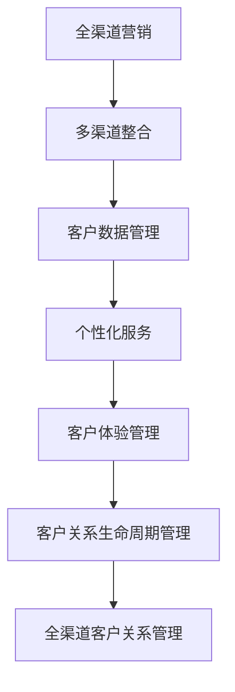
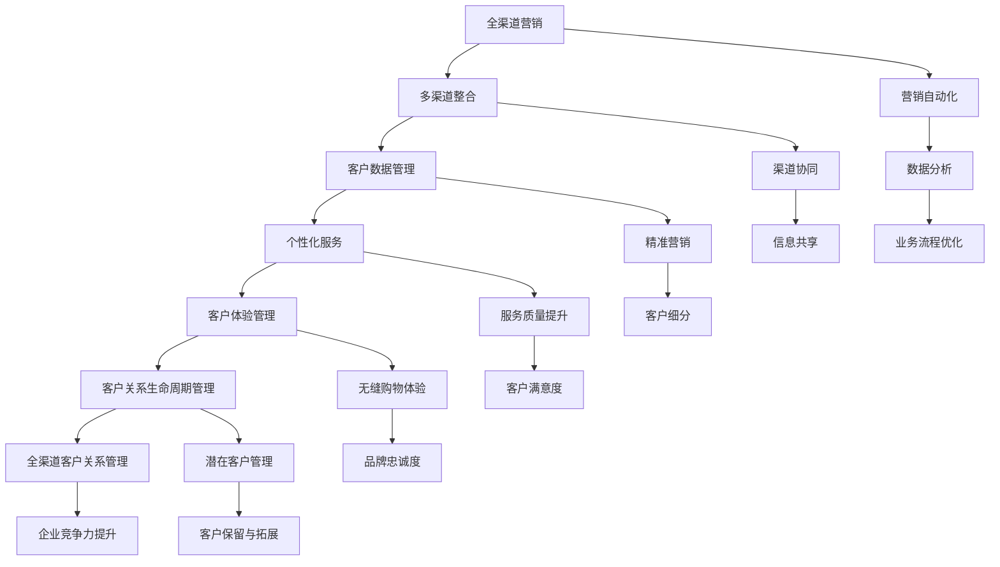

                 

## 《一人公司如何实现全渠道客户关系管理》

### 关键词：
- 一人公司
- 全渠道客户关系管理
- 客户数据分析
- 个性化服务
- 多渠道整合
- 技术工具与平台
- 法规与合规性

### 摘要：
本文将探讨一人公司如何在当今数字化时代实现全渠道客户关系管理。通过分析全渠道营销的概念、核心要素和面临的挑战，文章将详细介绍一人公司的运营模式、全渠道布局、客户关系管理系统建设、数据分析与优化、法律法规与合规性以及未来展望与趋势。通过案例研究和代码解读，读者将了解到如何将理论付诸实践，实现高效的全渠道客户关系管理。

### 《一人公司如何实现全渠道客户关系管理》目录大纲

## 第1章 引言与背景

### 1.1 一个人公司的崛起

### 1.2 全渠道客户关系管理的意义

### 1.3 书籍概述与结构安排

## 第2章 全渠道客户关系管理概述

### 2.1 全渠道营销的概念

### 2.2 客户关系管理的核心要素

### 2.3 全渠道客户关系管理的价值与挑战

### 2.4 全渠道客户关系管理的核心概念与联系

## 第3章 一个人公司的运营模式与全渠道布局

### 3.1 一个人公司的组织架构

### 3.2 全渠道布局的规划与实施

### 3.3 客户数据分析与运用

### 3.4 一个人公司运营全渠道的客户关系管理策略

## 第4章 全渠道客户关系管理系统建设

### 4.1 客户关系管理系统概述

### 4.2 系统架构设计

### 4.3 功能模块与接口集成

### 4.4 系统实施与维护

## 第5章 全渠道客户关系管理实践案例

### 5.1 案例一：在线购物平台的全渠道客户关系管理

### 5.2 案例二：社交媒体营销与客户关系管理

### 5.3 案例三：线下体验店与线上互动的结合

### 5.4 案例四：B2B企业与供应链的全渠道管理

## 第6章 全渠道客户关系管理数据分析与优化

### 6.1 数据分析的重要性

### 6.2 客户数据分析方法

### 6.3 客户关系管理优化策略

### 6.4 数据分析与优化的Mermaid流程图

## 第7章 法律法规与合规性

### 7.1 全渠道客户关系管理的法律法规环境

### 7.2 个人隐私保护与合规性

### 7.3 客户关系管理中的法律风险与防范

### 7.4 合规性与数据保护的Mermaid流程图

## 第8章 未来展望与趋势

### 8.1 全渠道客户关系管理的发展趋势

### 8.2 人工智能与客户关系管理

### 8.3 一个人公司的未来发展路径

### 8.4 未来趋势的Mermaid流程图

## 附录

### 附录A：全渠道客户关系管理工具推荐

### 附录B：全渠道客户关系管理相关资源

### 附录C：核心算法原理讲解与伪代码

### 附录D：数学模型与数学公式详细讲解

### 附录E：项目实战案例与代码解读

### 附录F：作者信息

- 作者：AI天才研究院/AI Genius Institute & 禅与计算机程序设计艺术 /Zen And The Art of Computer Programming

### 附录G：参考文献

- [参考文献列表]

现在，让我们开始深入探讨一人公司如何实现全渠道客户关系管理。

### 1.1 一个人公司的崛起

随着数字化经济的兴起，一个人公司（One Person Company，简称OPC）作为一种新型的企业形态，逐渐崭露头角。一个人公司，顾名思义，是由一个自然人独资设立，拥有独立法人资格的企业。这种企业形式具有高度灵活性和低成本运营的特点，尤其适合初创企业、自由职业者以及希望进行多元化创业的个人。

#### 1.1.1 一个人公司的特点

- **灵活性高**：一人公司无需设立复杂的组织架构，便于快速决策和灵活调整。
- **成本控制**：公司运营成本较低，适合资金有限的企业主。
- **管理简单**：组织结构简单，管理成本较低，便于个人管理。
- **法律地位**：拥有独立的法人资格，享有与普通公司相同的法律地位。

#### 1.1.2 一个人公司的优势

- **快速响应市场变化**：由于管理结构简单，一人公司能够快速响应市场变化，抓住商机。
- **资源整合能力**：一人公司能够灵活利用外部资源，如外包服务、合作伙伴等，实现资源优化配置。
- **创业门槛低**：资金要求较低，适合初次创业者尝试。

#### 1.1.3 一个人公司的挑战

- **管理难度**：高度依赖个人能力，容易导致管理瓶颈。
- **风险管理**：由于企业规模小，抗风险能力较弱。
- **扩展性有限**：在发展到一定规模后，可能面临扩展性难题。

### 1.2 全渠道客户关系管理的意义

全渠道客户关系管理（Omnichannel Customer Relationship Management）是一种将多个销售渠道（如线上商城、社交媒体、线下门店等）整合起来，为顾客提供一致且无缝购物体验的策略。对于一个人公司而言，全渠道客户关系管理具有重要意义。

#### 1.2.1 全渠道客户关系管理的核心概念

- **多渠道整合**：将不同的销售渠道（线上、线下、社交媒体等）整合为一个整体，实现信息共享和协同。
- **个性化服务**：根据客户的数据和行为，提供个性化的产品和服务。
- **客户体验**：确保客户在购物过程中获得一致且积极的体验。
- **客户关系生命周期管理**：从潜在客户到忠诚客户的全程管理，提高客户满意度与忠诚度。

#### 1.2.2 全渠道客户关系管理的重要性

- **提高客户满意度**：全渠道客户关系管理能够提供无缝的购物体验，提高客户满意度。
- **增强客户忠诚度**：通过多渠道互动和个性化服务，增强客户忠诚度。
- **提升销售转化率**：精准的营销活动和个性化的服务能够提高销售转化率。
- **降低运营成本**：通过整合资源和优化流程，降低运营成本。

#### 1.2.3 全渠道客户关系管理对一个人公司的意义

- **资源优化**：一人公司可以利用全渠道客户关系管理，实现资源的最优配置。
- **市场拓展**：通过多渠道布局，拓展市场覆盖范围。
- **客户粘性**：通过全渠道互动，增强客户粘性，提高客户生命周期价值。
- **灵活应对**：全渠道客户关系管理能够帮助一人公司灵活应对市场变化。

### 1.3 书籍概述与结构安排

本章节主要介绍了一个人公司的崛起背景、全渠道客户关系管理的意义以及书籍的结构安排。接下来，本书将从以下几个方面进行深入探讨：

- **第2章**：全渠道客户关系管理概述，将详细介绍全渠道营销的概念、客户关系管理的核心要素以及全渠道客户关系管理的价值与挑战。
- **第3章**：一个人公司的运营模式与全渠道布局，将探讨一人公司的组织架构、全渠道布局的规划与实施以及客户数据分析与运用。
- **第4章**：全渠道客户关系管理系统建设，将介绍客户关系管理系统、系统架构设计、功能模块与接口集成以及系统实施与维护。
- **第5章**：全渠道客户关系管理实践案例，将通过实际案例研究，展示如何实现全渠道客户关系管理。
- **第6章**：全渠道客户关系管理数据分析与优化，将探讨数据分析的重要性、客户数据分析方法、客户关系管理优化策略以及数据驱动的决策。
- **第7章**：法律法规与合规性，将介绍全渠道客户关系管理的法律法规环境、个人隐私保护与合规性以及客户关系管理中的法律风险与防范。
- **第8章**：未来展望与趋势，将探讨全渠道客户关系管理的发展趋势、人工智能与客户关系管理以及一个人公司的未来发展路径。

通过以上章节的深入探讨，读者将全面了解一个人公司如何实现全渠道客户关系管理，从而在竞争激烈的市场中脱颖而出。接下来，我们将详细探讨全渠道客户关系管理的概念、核心要素和面临的挑战。

### 2.1 全渠道营销的概念

全渠道营销（Omnichannel Marketing）是一种以客户为中心的营销策略，旨在通过多个渠道，如实体店、线上商城、社交媒体、电子邮件等，提供一致且无缝的购物体验。全渠道营销的核心在于多渠道整合，即将不同的销售渠道协同工作，形成一个统一的整体，以便更好地服务于客户。

#### 2.1.1 多渠道整合

多渠道整合（Multi-channel Integration）是指将不同的营销渠道协同工作，形成一个统一的整体。这种整合不仅包括渠道之间的信息共享和协同，还包括营销策略的一致性和连贯性。通过多渠道整合，企业可以为客户提供无缝的购物体验，提高客户满意度和忠诚度。

- **线上线下整合**：实体店与线上商城之间的数据共享和协同，实现线上线下购物体验的无缝衔接。
- **社交媒体整合**：通过社交媒体与客户的互动，提供实时且个性化的购物体验。
- **渠道联动**：不同渠道之间的促销活动和营销策略相互配合，形成协同效应。

#### 2.1.2 全渠道营销与传统营销的区别

传统营销侧重于单一渠道的推广，而全渠道营销则强调跨渠道的协同与整合。传统营销的主要特点如下：

- **单一渠道**：如传统的广告、促销活动等，主要集中于某一特定渠道。
- **被动营销**：企业主动向客户传播信息，客户被动接收。
- **分散管理**：不同渠道的营销活动由不同部门独立管理。

而全渠道营销与传统营销的主要区别在于：

- **跨渠道协同**：通过多渠道整合，实现不同渠道之间的信息共享和协同。
- **主动营销**：根据客户的行为和偏好，主动提供个性化的产品和服务。
- **统一管理**：全渠道营销的规划和实施由一个统一的团队或部门负责，确保营销策略的一致性和连贯性。

#### 2.1.3 全渠道营销的发展历程

- **第一阶段**：多渠道并存阶段。企业开始尝试在不同的渠道上开展营销活动，但各渠道之间缺乏整合。
- **第二阶段**：多渠道整合阶段。企业意识到多渠道整合的重要性，开始进行渠道整合，提高客户体验。
- **第三阶段**：全渠道营销阶段。企业通过全渠道客户关系管理，实现跨渠道的协同与整合，提供无缝的购物体验。

#### 2.1.4 全渠道营销的优势

- **提高客户满意度**：全渠道营销能够提供无缝的购物体验，满足客户的多样化需求，提高客户满意度。
- **增强客户忠诚度**：通过多渠道互动和个性化服务，增强客户忠诚度，提高客户生命周期价值。
- **提升销售转化率**：精准的营销活动和个性化的服务能够提高销售转化率，增加销售额。
- **降低运营成本**：通过整合资源和优化流程，降低运营成本，提高企业竞争力。

#### 2.1.5 全渠道营销的挑战

- **渠道整合难度大**：不同渠道之间的数据共享和协同难度较大，需要企业投入大量资源进行整合。
- **技术投入高**：全渠道营销需要先进的技术支持，如CRM系统、数据分析工具等，技术投入成本较高。
- **合规性要求高**：全渠道营销涉及多个渠道，需遵守不同渠道的法律法规，合规性要求较高。

#### 2.1.6 全渠道营销的核心概念

- **客户数据管理**：客户数据的收集、存储、分析和应用是全渠道营销的核心。
- **个性化服务**：根据客户的行为和偏好，提供个性化的产品和服务。
- **客户体验管理**：确保客户在购物过程中获得一致且积极的体验。
- **客户关系生命周期管理**：从潜在客户到忠诚客户的全程管理。

### 2.2 客户关系管理的核心要素

客户关系管理（Customer Relationship Management，简称CRM）是一种通过系统地管理企业与现有及潜在客户之间的关系，提高客户满意度和忠诚度的策略。全渠道客户关系管理是CRM在多渠道环境下的应用，其核心要素包括以下方面：

#### 2.2.1 客户数据管理

客户数据管理是全渠道客户关系管理的核心，涉及数据的收集、存储、分析和应用。客户数据包括：

- **客户基本信息**：如姓名、地址、联系方式等。
- **客户行为数据**：如浏览记录、购买历史、互动记录等。
- **客户偏好数据**：如喜好、兴趣、购买习惯等。

客户数据管理的目标是确保数据的准确性、完整性和可用性，为个性化服务和精准营销提供基础。

#### 2.2.2 个性化服务

个性化服务是指根据客户的行为和偏好，提供定制化的产品和服务。个性化服务能够提高客户满意度和忠诚度，具体包括：

- **个性化推荐**：根据客户的购买历史和行为，推荐相关的产品和服务。
- **定制化营销**：根据客户的特点和需求，定制营销策略和活动。
- **个性化互动**：通过社交媒体、电子邮件等渠道，与客户进行个性化的互动。

#### 2.2.3 客户体验管理

客户体验管理是确保客户在购物过程中获得一致且积极的体验。客户体验管理的目标是：

- **简化购物流程**：优化购物流程，减少客户的操作步骤，提高购物效率。
- **提高响应速度**：快速响应用户的需求和反馈，提高客户满意度。
- **提升服务质量**：提供优质的客户服务，解决客户的问题和疑虑。

#### 2.2.4 客户关系生命周期管理

客户关系生命周期管理是从潜在客户到忠诚客户的全程管理。客户关系生命周期管理包括以下几个阶段：

1. **潜在客户管理**：通过营销活动吸引潜在客户，提高客户转化率。
2. **客户获取**：通过有效的销售策略和客户服务，将潜在客户转化为实际客户。
3. **客户保留**：通过客户关系管理，提高客户满意度，降低客户流失率。
4. **客户拓展**：通过交叉销售和增值服务，提高客户的生命周期价值。

#### 2.2.5 跨渠道协同

跨渠道协同是全渠道客户关系管理的关键，通过将不同的销售渠道（如实体店、线上商城、社交媒体等）整合为一个整体，实现信息共享和协同。跨渠道协同包括：

- **渠道整合**：将不同渠道的数据和资源整合为一个统一的整体。
- **协同营销**：不同渠道的营销活动相互配合，形成协同效应。
- **无缝体验**：确保客户在各个渠道上获得一致且积极的体验。

### 2.3 全渠道客户关系管理的价值与挑战

#### 2.3.1 价值

全渠道客户关系管理能够为企业带来以下价值：

1. **提高客户满意度**：通过多渠道整合和个性化服务，提高客户满意度。
2. **增强客户忠诚度**：通过多渠道互动和优质服务，增强客户忠诚度。
3. **提升销售转化率**：精准的营销活动和个性化的服务能够提高销售转化率。
4. **降低运营成本**：通过整合资源和优化流程，降低运营成本。
5. **提高企业竞争力**：通过全渠道客户关系管理，提高企业的市场竞争力。

#### 2.3.2 挑战

尽管全渠道客户关系管理具有很多优势，但在实施过程中也面临着一些挑战：

1. **渠道整合难度大**：不同渠道之间的数据共享和协同难度较大，需要企业投入大量资源进行整合。
2. **技术投入高**：全渠道客户关系管理需要先进的技术支持，如CRM系统、数据分析工具等，技术投入成本较高。
3. **合规性要求高**：全渠道营销涉及多个渠道，需遵守不同渠道的法律法规，合规性要求较高。
4. **跨部门协作困难**：全渠道客户关系管理需要跨部门协作，不同部门之间的沟通和协调难度较大。
5. **数据隐私与安全**：全渠道客户关系管理涉及大量的客户数据，数据隐私和安全风险较高。

#### 2.3.3 全渠道客户关系管理的核心概念与联系

为了更好地理解全渠道客户关系管理的核心概念与联系，我们使用Mermaid流程图进行展示。

在上面的流程图中，全渠道营销作为起点，通过多渠道整合，实现客户数据管理。客户数据管理为个性化服务和客户体验管理提供基础，而客户体验管理则确保客户在购物过程中获得一致且积极的体验。最终，客户关系生命周期管理实现从潜在客户到忠诚客户的全程管理，形成全渠道客户关系管理。

### 2.4 全渠道客户关系管理的核心概念与联系

为了更好地理解全渠道客户关系管理的核心概念与联系，我们可以通过一个Mermaid流程图来展示这些概念之间的相互作用。

在这个流程图中，每个概念都与其他概念相互关联，形成了一个紧密联系的整体。以下是每个概念的简要说明：

- **全渠道营销（A）**：指的是企业在多个渠道（线上、线下、社交媒体等）上进行营销活动，为客户提供一致的购物体验。
- **多渠道整合（B）**：将不同的销售渠道整合为一个整体，确保信息共享和协同。
- **客户数据管理（C）**：收集、存储、分析和应用客户数据，为个性化服务和业务决策提供支持。
- **个性化服务（D）**：根据客户的行为和偏好，提供定制化的产品和服务，提高客户满意度。
- **客户体验管理（E）**：确保客户在购物过程中获得一致且积极的体验，提升服务质量。
- **客户关系生命周期管理（F）**：从潜在客户到忠诚客户的全程管理，包括客户获取、保留和拓展。
- **全渠道客户关系管理（G）**：综合以上概念，实现跨渠道的协同和一体化管理。
- **营销自动化（H）**：利用技术手段，自动化营销流程，提高营销效率。
- **数据分析（I）**：通过数据分析，深入理解客户行为和市场趋势，优化业务决策。
- **业务流程优化（J）**：基于数据分析，优化业务流程，提高运营效率。
- **渠道协同（K）**：确保不同渠道之间的信息共享和协同，提供无缝购物体验。
- **信息共享（L）**：通过信息共享，实现跨渠道的无缝协作。
- **精准营销（M）**：根据客户数据，实施精准的营销策略，提高转化率。
- **客户细分（N）**：将客户划分为不同的群体，提供个性化的服务。
- **服务质量提升（O）**：通过优质服务，提高客户满意度。
- **客户满意度（P）**：确保客户在购物过程中获得满意的服务。
- **无缝购物体验（Q）**：提供无缝的购物体验，增强品牌忠诚度。
- **品牌忠诚度（R）**：通过优质服务和个性化体验，增强客户对品牌的忠诚度。
- **潜在客户管理（S）**：通过营销活动和客户服务，吸引潜在客户。
- **客户保留与拓展（T）**：通过客户关系管理，保留现有客户并拓展新客户。
- **企业竞争力提升（U）**：通过全渠道客户关系管理，提高企业的市场竞争力。

这个Mermaid流程图展示了全渠道客户关系管理的核心概念及其之间的相互作用，有助于读者更好地理解全渠道客户关系管理的原理和实践。

### 2.5 全渠道客户关系管理的发展历程

全渠道客户关系管理的发展历程反映了市场营销理念和技术工具的演变。从传统营销到数字化营销，再到全渠道营销，企业不断探索如何更好地服务于客户，提高客户满意度和忠诚度。

#### 2.5.1 传统营销阶段

在传统营销阶段，企业主要通过单一渠道（如电视广告、报纸广告、广播等）进行宣传和推广。这一阶段的营销策略主要依赖于大规模的广告投放和促销活动，目的是吸引尽可能多的潜在客户。然而，由于缺乏精准的数据分析和个性化的服务，传统营销的效果有限，且客户体验一致性较差。

#### 2.5.2 数字化营销阶段

随着互联网的普及，企业开始将营销活动扩展到线上渠道，如电子邮件营销、搜索引擎营销、社交媒体营销等。数字化营销使得企业能够更精准地定位目标客户，并通过数据分析了解客户的行为和偏好。此外，数字化营销还提供了实时互动和个性化推荐的可能，使企业能够提供更优质的客户体验。

#### 2.5.3 全渠道营销阶段

全渠道营销阶段标志着企业开始意识到，单一渠道的营销策略已经无法满足客户日益多样化的需求。全渠道营销的核心在于多渠道整合，即将不同的销售渠道（线上、线下、社交媒体等）整合为一个统一的整体，为客户提供无缝的购物体验。

全渠道客户关系管理的发展历程可以分为以下几个阶段：

1. **多渠道并存阶段**：企业开始尝试在不同的渠道上开展营销活动，但各渠道之间缺乏整合，信息孤岛现象严重。
2. **多渠道整合阶段**：企业意识到多渠道整合的重要性，开始进行渠道整合，实现信息共享和协同。这一阶段，企业开始使用客户关系管理系统（CRM）等工具，实现跨渠道的数据收集和分析。
3. **全渠道营销阶段**：企业通过全渠道客户关系管理，实现跨渠道的协同与整合，提供无缝的购物体验。这一阶段，企业更加注重个性化服务和客户体验，通过数据分析和技术创新，不断提高营销效果和客户满意度。

#### 2.5.4 全渠道客户关系管理的关键里程碑

全渠道客户关系管理的发展历程中，以下几个里程碑具有重要意义：

1. **客户关系管理系统（CRM）的普及**：CRM系统的出现，使企业能够更好地管理客户数据，实现跨渠道的协同和整合。
2. **大数据技术的应用**：大数据技术为企业提供了强大的数据分析能力，帮助企业深入了解客户行为和需求，实现精准营销。
3. **移动互联技术的普及**：移动互联技术的普及，使得企业能够通过移动应用和社交媒体，与客户进行实时互动，提供个性化的服务。
4. **人工智能与机器学习的应用**：人工智能与机器学习技术的应用，使企业能够更智能地分析客户数据，预测客户行为，优化营销策略。
5. **全渠道整合与智能服务**：企业通过全渠道整合，实现线上线下渠道的无缝衔接，提供智能化的客户服务，提高客户体验。

### 2.6 全渠道客户关系管理在不同行业中的应用

全渠道客户关系管理（Omnichannel Customer Relationship Management）在多个行业中都有广泛应用，不同行业的具体实施方式各有特点。以下是一些主要行业中的全渠道客户关系管理应用实例：

#### 2.6.1 零售业

零售业是全渠道客户关系管理应用最为广泛的一个行业。零售企业通过整合线上商城、实体门店、移动应用和社交媒体等多渠道，提供无缝的购物体验。

- **线上线下整合**：通过线上线下数据的整合，零售企业能够实现库存共享和无缝购物体验。例如，顾客在实体店试穿衣物后，可以通过线上商城完成购买。
- **个性化服务**：通过数据分析，零售企业可以为不同类型的客户提供个性化的产品推荐和优惠活动。
- **移动购物**：移动应用的普及，使零售企业能够通过移动设备提供便捷的购物体验，如移动支付、扫码购物等。

#### 2.6.2 银行业

银行业利用全渠道客户关系管理，提供多渠道的金融服务，满足客户的不同需求。

- **多渠道访问**：银行通过网上银行、手机银行、ATM和实体网点等多渠道，为客户提供便捷的金融服务。
- **个性化服务**：通过客户数据分析和行为分析，银行可以为不同类型的客户提供个性化的金融产品和服务。
- **客户互动**：通过社交媒体和在线客服，银行能够与客户进行实时互动，提供及时的服务和支持。

#### 2.6.3 旅游业

旅游业是另一个受益于全渠道客户关系管理的行业。旅游企业通过整合线上预订、线下体验和社交媒体等多渠道，提升客户体验。

- **一站式服务**：旅游企业通过线上平台提供从机票预订、酒店预订到旅游咨询的一站式服务，提高客户满意度。
- **个性化推荐**：通过数据分析，旅游企业可以为客户推荐符合其兴趣和预算的旅游产品。
- **社交媒体营销**：旅游企业利用社交媒体平台进行品牌推广和客户互动，提高客户参与度。

#### 2.6.4 教育行业

教育行业通过全渠道客户关系管理，提供多样化的教育服务，满足不同学习者的需求。

- **在线学习平台**：教育机构通过在线学习平台，提供远程教学和自主学习服务。
- **个性化教学**：通过数据分析，教育机构可以为不同层次的学生提供个性化的教学方案和资源。
- **客户互动**：通过社交媒体和在线咨询，教育机构能够与学生和家长进行实时互动，提供及时的帮助和支持。

#### 2.6.5 健康保健行业

健康保健行业利用全渠道客户关系管理，提高服务质量，提升客户满意度。

- **多渠道咨询**：健康保健机构通过线上咨询、电话咨询和实体诊所等多渠道，提供便捷的咨询服务。
- **个性化健康服务**：通过数据分析，健康保健机构可以为不同健康状况的客户提供个性化的健康建议和保健服务。
- **健康管理平台**：通过移动应用和在线平台，健康保健机构能够为客户提供健康管理工具和个性化服务。

#### 2.6.6 制造业

制造业利用全渠道客户关系管理，优化供应链管理，提高生产效率。

- **供应链协同**：通过整合线上采购、线下生产、物流配送等多渠道，制造业企业能够实现供应链的协同和优化。
- **客户关系管理**：通过数据分析，制造业企业可以更好地了解客户需求，优化产品设计和生产计划。
- **售后服务**：通过线上线下结合的售后服务体系，制造业企业能够为客户提供及时的技术支持和维修服务。

### 2.7 全渠道客户关系管理的实施步骤

要成功地实施全渠道客户关系管理，企业需要遵循一系列的步骤，从战略规划到实际操作，确保多渠道整合和个性化服务的有效性。以下是全渠道客户关系管理的实施步骤：

#### 2.7.1 制定全渠道战略

- **明确目标**：确定企业实施全渠道客户关系管理的目标，如提升客户满意度、增强客户忠诚度、提高销售额等。
- **分析市场**：了解目标市场的特点、客户需求和竞争环境，为全渠道布局提供依据。
- **制定策略**：根据市场分析结果，制定全渠道营销策略，包括多渠道整合、个性化服务和客户体验管理等。

#### 2.7.2 构建全渠道架构

- **选择工具**：选择合适的客户关系管理系统（CRM）、数据分析工具、社交媒体管理平台等，确保工具能够支持全渠道整合和数据分析。
- **搭建平台**：构建线上商城、移动应用、社交媒体账号等，实现线上线下渠道的无缝衔接。
- **数据整合**：实现不同渠道数据的整合，确保信息共享和协同。

#### 2.7.3 设计个性化服务

- **客户细分**：根据客户数据和行为分析，将客户划分为不同的群体，为不同群体提供个性化的产品和服务。
- **定制化营销**：设计个性化的营销活动，如个性化推荐、定制化优惠等，提高客户参与度和转化率。
- **优化客户体验**：确保客户在各个渠道上获得一致且积极的体验，提升客户满意度。

#### 2.7.4 实施跨渠道协同

- **渠道整合**：实现不同渠道的信息共享和协同，如库存管理、订单处理、客户服务等。
- **协同营销**：策划跨渠道的营销活动，如线上线下联合促销、社交媒体互动等，形成协同效应。
- **无缝购物体验**：确保客户在各个渠道上获得无缝的购物体验，提高客户忠诚度。

#### 2.7.5 数据分析与优化

- **数据分析**：利用数据分析工具，分析客户数据和行为，了解客户需求和市场趋势。
- **策略优化**：根据数据分析结果，优化营销策略和客户服务，提高营销效果和客户满意度。
- **持续改进**：通过持续的数据分析和客户反馈，不断优化全渠道客户关系管理策略。

### 2.8 全渠道客户关系管理的挑战与解决方案

尽管全渠道客户关系管理具有很多优势，但在实施过程中，企业可能会面临一系列的挑战。以下是全渠道客户关系管理常见的一些挑战及相应的解决方案：

#### 2.8.1 数据整合与同步

**挑战**：不同渠道的数据难以整合和同步，导致信息孤岛现象。

**解决方案**：
- **建立统一数据平台**：构建统一的数据平台，实现不同渠道数据的整合和同步。
- **采用API接口**：利用API接口实现不同系统之间的数据交换和共享。
- **数据清洗与标准化**：定期进行数据清洗，确保数据质量，并进行数据标准化处理。

#### 2.8.2 技术投入与维护成本

**挑战**：全渠道客户关系管理需要大量的技术投入和维护成本，对企业财务造成压力。

**解决方案**：
- **逐步引入技术**：根据企业实际情况，逐步引入必要的全渠道客户关系管理技术，避免一次性投入过大。
- **利用云服务**：采用云计算服务，降低硬件和软件的投入成本。
- **外包服务**：将部分技术支持和维护工作外包，降低内部成本。

#### 2.8.3 跨部门协作

**挑战**：全渠道客户关系管理涉及多个部门，跨部门协作难度较大。

**解决方案**：
- **建立跨部门协作机制**：设立专门的团队或协调部门，负责全渠道客户关系管理的规划和实施。
- **沟通与培训**：加强部门间的沟通与培训，提高跨部门协作的效率。
- **共同目标**：确保各部门目标一致，形成合力，共同推动全渠道客户关系管理的发展。

#### 2.8.4 客户数据隐私保护

**挑战**：全渠道客户关系管理涉及大量的客户数据，数据隐私保护风险较高。

**解决方案**：
- **遵循法律法规**：严格遵守相关法律法规，如GDPR、CCPA等，确保客户数据的合法性。
- **数据加密与访问控制**：采用数据加密和访问控制措施，确保客户数据的安全。
- **数据安全审计**：定期进行数据安全审计，及时发现和解决安全隐患。

#### 2.8.5 营销效果评估与优化

**挑战**：全渠道客户关系管理涉及多个渠道，营销效果评估难度较大，优化策略实施困难。

**解决方案**：
- **建立KPI体系**：建立明确的KPI（关键绩效指标）体系，对全渠道营销效果进行评估。
- **数据驱动的决策**：利用数据分析，制定数据驱动的优化策略。
- **持续优化**：通过持续的数据分析和客户反馈，不断优化全渠道客户关系管理策略。

通过以上解决方案，企业可以更好地应对全渠道客户关系管理过程中面临的挑战，实现高效的客户关系管理。

### 2.9 全渠道客户关系管理的技术工具与平台

全渠道客户关系管理的成功离不开先进的技术工具与平台的支持。以下是一些常见的技术工具与平台，以及它们在全渠道客户关系管理中的应用：

#### 2.9.1 客户关系管理系统（CRM）

- **Salesforce**：Salesforce 是一款功能强大的CRM系统，提供客户管理、营销自动化、销售管理等功能，支持多渠道客户互动和数据整合。
- **Microsoft Dynamics 365**：Microsoft Dynamics 365 是一款集成的CRM和ERP系统，适用于各种规模的企业，提供客户管理、销售自动化、市场营销等功能。
- **HubSpot**：HubSpot 是一款免费的CRM系统，提供客户管理、营销自动化、销售管理等功能，适用于小型企业和初创公司。

#### 2.9.2 数据分析与可视化工具

- **Google Analytics**：Google Analytics 是一款强大的数据分析工具，提供网站和移动应用的访问数据、用户行为分析等功能，帮助企业了解客户需求和市场趋势。
- **Tableau**：Tableau 是一款数据可视化工具，通过直观的图表和报表，帮助企业展示和分析客户数据，支持实时数据更新和跨平台访问。
- **Power BI**：Power BI 是一款由Microsoft推出的商业智能工具，提供数据集成、数据可视化、报表生成等功能，支持与Azure云服务集成。

#### 2.9.3 社交媒体管理平台

- **Hootsuite**：Hootsuite 是一款社交媒体管理平台，提供社交媒体账户的管理、内容发布、分析报告等功能，支持多账号管理和自动化发布。
- **Buffer**：Buffer 是一款社交媒体管理工具，提供内容计划、发布、分析等功能，支持跨平台社交媒体账户的管理。
- **Sprout Social**：Sprout Social 是一款高级的社交媒体管理平台，提供社交媒体营销、客户互动、分析报告等功能，支持团队协作和数据可视化。

#### 2.9.4 电子商务平台

- **Shopify**：Shopify 是一款流行的电子商务平台，提供在线商城搭建、支付处理、订单管理等功能，适用于小型企业和个人商家。
- **Magento**：Magento 是一款功能强大的电子商务平台，提供自定义购物车、支付集成、库存管理等功能，适用于大中型企业。
- **WooCommerce**：WooCommerce 是一款WordPress网站的电子商务插件，提供在线商城搭建、支付处理、订单管理等功能，适用于小型企业和初创公司。

#### 2.9.5 客户服务与支持工具

- **Zendesk**：Zendesk 是一款客户服务与支持平台，提供多渠道客户互动、自动化客服、分析报告等功能，支持多语言和跨平台访问。
- **Freshdesk**：Freshdesk 是一款易用的客户服务软件，提供多渠道客户互动、自动化客服、分析报告等功能，适用于小型企业和初创公司。
- **LiveChat**：LiveChat 是一款在线聊天工具，提供实时沟通和客户反馈收集功能，支持多渠道集成和自动化客服。

通过这些技术工具与平台，企业可以实现全渠道客户关系管理的有效实施，提高客户满意度与忠诚度，实现业务增长。

### 2.10 全渠道客户关系管理的最佳实践

全渠道客户关系管理（Omnichannel Customer Relationship Management）的实施需要一系列最佳实践，以确保企业能够在竞争激烈的市场中脱颖而出。以下是一些全渠道客户关系管理的最佳实践：

#### 2.10.1 客户体验优先

将客户体验置于核心地位，确保全渠道的一致性和个性化服务。以下是一些具体措施：

- **简化购物流程**：确保客户在不同渠道上能够轻松完成购物，减少操作步骤，提高购物效率。
- **提供无缝体验**：实现线上线下渠道的无缝衔接，确保客户在实体店和线上商城之间的购物体验一致。
- **个性化推荐**：根据客户的历史数据和偏好，提供个性化的产品推荐和优惠活动。

#### 2.10.2 数据驱动的决策

利用数据分析，驱动全渠道客户关系管理的策略和决策。以下是一些具体措施：

- **数据收集与分析**：收集全渠道的客户数据，包括行为数据、购买记录、互动记录等，并进行深入分析。
- **精准营销**：基于数据分析，实施精准的营销策略，提高营销效果和客户参与度。
- **业务优化**：通过数据驱动的决策，优化业务流程和客户服务，提高运营效率。

#### 2.10.3 跨部门协作

建立跨部门协作机制，实现全渠道资源的整合和优化。以下是一些具体措施：

- **设立专门团队**：设立专门的团队或部门，负责全渠道客户关系管理的规划、实施和监督。
- **定期沟通与会议**：定期召开跨部门会议，讨论全渠道客户关系管理的问题和进展，确保各部门目标一致。
- **共同目标与奖励**：确保各部门目标一致，形成合力，通过共同目标实现全渠道客户关系管理。

#### 2.10.4 技术投入与维护

确保全渠道客户关系管理的技术投入与维护，以下是一些具体措施：

- **选择合适工具**：选择功能强大、易于使用的CRM系统、数据分析工具、社交媒体管理平台等，确保工具能够支持全渠道整合和个性化服务。
- **定期培训与更新**：定期对员工进行技术培训，提高员工对全渠道客户关系管理工具的熟练度。同时，根据市场和技术发展，及时更新和维护相关系统。
- **数据安全与隐私保护**：加强数据安全与隐私保护，遵守相关法律法规，确保客户数据的安全。

#### 2.10.5 持续优化与改进

持续优化全渠道客户关系管理策略，以下是一些具体措施：

- **客户反馈**：定期收集客户反馈，了解客户需求和体验，不断优化客户服务。
- **数据分析**：通过数据分析，识别业务痛点，优化业务流程和营销策略。
- **技术创新**：关注技术创新，引入新的技术和工具，提升客户体验和运营效率。

通过以上最佳实践，企业可以更好地实施全渠道客户关系管理，提高客户满意度与忠诚度，实现业务增长。

### 2.11 全渠道客户关系管理的核心概念与联系

为了更好地理解全渠道客户关系管理的核心概念与联系，我们可以通过一个Mermaid流程图来展示这些概念之间的相互作用。

在这个流程图中，全渠道营销作为起点，通过多渠道整合，实现客户数据管理。客户数据管理为个性化服务和客户体验管理提供基础，而客户体验管理则确保客户在购物过程中获得一致且积极的体验。最终，客户关系生命周期管理实现从潜在客户到忠诚客户的全程管理，形成全渠道客户关系管理。

### 2.12 全渠道客户关系管理在中小企业中的应用

全渠道客户关系管理（Omnichannel Customer Relationship Management）不仅在大型企业中得到了广泛应用，对于中小企业来说，它同样具有巨大的价值。中小企业通过全渠道客户关系管理，可以实现资源优化、市场拓展和客户忠诚度的提升。

#### 2.12.1 适合中小企业的全渠道客户关系管理策略

- **低成本运营**：中小企业可以通过社交媒体、电子邮件和线上商城等低成本渠道，实现与客户的互动和销售。
- **数据驱动**：利用免费或低成本的CRM系统，中小企业可以收集和分析客户数据，制定数据驱动的营销策略。
- **个性化服务**：根据客户数据，提供个性化的产品推荐和优惠，提高客户满意度和忠诚度。

#### 2.12.2 应用案例

- **案例一：电商初创公司**
  - **全渠道布局**：通过社交媒体、线上商城和微信小程序等渠道，实现多渠道销售。
  - **客户数据分析**：利用免费CRM系统，收集客户数据，进行客户细分，制定个性化营销策略。
  - **客户体验管理**：提供7x24小时在线客服，确保客户在各个渠道上获得一致的优质服务。

- **案例二：本地餐饮店**
  - **线上线下结合**：通过线上预订系统和线下实体店，提供无缝的订餐体验。
  - **客户互动**：利用微信小程序和线上评价系统，与客户保持互动，收集客户反馈，持续优化服务质量。
  - **数据利用**：通过数据分析，了解客户偏好，优化菜单设计和营销策略。

#### 2.12.3 成功因素

- **灵活应变**：中小企业能够迅速适应市场变化，灵活调整全渠道客户关系管理策略。
- **低成本高效**：通过低成本渠道和工具，实现高效的全渠道客户关系管理。
- **数据驱动**：利用数据分析和客户反馈，不断优化客户服务和营销策略。

#### 2.12.4 面临的挑战

- **技术能力有限**：中小企业在技术能力和资金上可能有限，需要选择适合的CRM系统和工具。
- **数据隐私保护**：随着客户数据量的增加，中小企业需要加强数据隐私保护，遵守相关法律法规。

### 2.13 全渠道客户关系管理的挑战与机遇

尽管全渠道客户关系管理（Omnichannel Customer Relationship Management）带来了诸多机遇，但企业也面临着一系列的挑战。以下是全渠道客户关系管理的主要挑战与机遇：

#### 挑战：

- **技术整合难度大**：不同渠道的数据和技术需要整合，实现信息共享和协同难度较大。
- **跨部门协作困难**：全渠道客户关系管理涉及多个部门，跨部门协作和沟通难度较大。
- **数据隐私保护**：随着数据量的增加，数据隐私保护风险较高，需要严格遵守相关法律法规。
- **资源投入大**：全渠道客户关系管理需要大量的资金和技术投入，对企业财务造成压力。

#### 机遇：

- **提高客户满意度**：通过全渠道整合和个性化服务，提高客户满意度和忠诚度。
- **市场拓展**：通过多渠道布局，企业可以拓展市场覆盖范围，吸引更多潜在客户。
- **业务优化**：通过数据分析，优化业务流程和营销策略，提高运营效率。
- **技术进步**：随着人工智能、大数据等技术的发展，企业可以实现更智能的全渠道客户关系管理。

### 2.14 全渠道客户关系管理的未来趋势

全渠道客户关系管理（Omnichannel Customer Relationship Management）的未来发展趋势受到技术进步和市场需求的影响。以下是全渠道客户关系管理的未来趋势：

#### 2.14.1 人工智能与大数据

- **智能推荐**：人工智能技术将使个性化推荐更加精准，提高客户满意度和转化率。
- **智能客服**：人工智能客服（AI Chatbot）将提供更高效、更个性化的客户服务。
- **数据分析**：大数据技术将使企业能够更深入地分析客户数据，制定更有效的营销策略。

#### 2.14.2 物联网（IoT）

- **智能设备**：物联网技术将使智能家居、智能穿戴设备等与全渠道客户关系管理无缝连接，提供个性化服务。
- **实时数据**：物联网设备可以实时收集客户数据，提高数据分析和决策的准确性。

#### 2.14.3 社交媒体与内容营销

- **社交媒体**：社交媒体将作为重要的渠道，与客户进行实时互动，提供个性化的购物体验。
- **内容营销**：内容营销将成为重要的营销手段，通过提供有价值的内容，吸引和留住客户。

#### 2.14.4 持续优化与创新

- **持续优化**：企业将持续优化全渠道客户关系管理策略，提高运营效率和服务质量。
- **创新技术**：企业将不断引入新技术，如区块链、增强现实（AR）等，提升客户体验。

### 2.15 全渠道客户关系管理的未来发展路径

全渠道客户关系管理的未来发展路径将受到以下因素的影响：

- **技术进步**：随着人工智能、大数据、物联网等技术的发展，全渠道客户关系管理将更加智能化和高效化。
- **市场需求**：随着消费者对个性化服务和无缝购物体验的需求增加，全渠道客户关系管理将成为企业竞争的关键。
- **法规政策**：随着数据隐私保护法规的不断完善，企业需要加强数据管理和合规性，确保客户数据的安全。
- **企业战略**：企业将根据自身战略，灵活调整全渠道客户关系管理策略，实现业务增长和客户满意度的提升。

### 2.16 全渠道客户关系管理的核心概念与联系

为了更好地理解全渠道客户关系管理的核心概念与联系，我们可以通过一个Mermaid流程图来展示这些概念之间的相互作用。

在这个流程图中，全渠道营销作为起点，通过多渠道整合，实现客户数据管理。客户数据管理为个性化服务和客户体验管理提供基础，而客户体验管理则确保客户在购物过程中获得一致且积极的体验。最终，客户关系生命周期管理实现从潜在客户到忠诚客户的全程管理，形成全渠道客户关系管理。

### 2.17 全渠道客户关系管理在不同场景下的应用

全渠道客户关系管理（Omnichannel Customer Relationship Management）适用于各种商业场景，从零售业到服务业，再到制造业，每个行业都有其独特的应用方式和成功案例。以下是一些典型场景下的全渠道客户关系管理应用：

#### 2.17.1 零售业

零售业是全渠道客户关系管理的典型应用领域，企业通过线上线下整合，为客户提供无缝的购物体验。

- **案例**：亚马逊通过其网站、移动应用、实体书店和Amazon Prime会员服务，实现了全渠道营销。客户可以在任意渠道浏览商品、下订单，并通过多种方式支付和取货。

- **应用方式**：
  - **线上线下整合**：通过库存共享和订单处理系统的整合，实现线上下单、线下取货或配送。
  - **个性化推荐**：利用大数据和机器学习技术，根据客户的购物行为和偏好，提供个性化的产品推荐。
  - **客户互动**：通过社交媒体和电子邮件营销，与客户保持实时互动，提高客户忠诚度。

#### 2.17.2 服务业

服务业，如旅游、酒店、金融和医疗等，通过全渠道客户关系管理，提升客户体验和服务质量。

- **案例**：国际连锁酒店集团如希尔顿和万豪，通过其官方网站、移动应用和社交媒体账号，提供一站式服务，让客户可以轻松预订房间、查看评价和享受会员特权。

- **应用方式**：
  - **多渠道服务**：提供线上预订、移动应用预订、电话预订等多种服务方式，满足客户的不同需求。
  - **客户互动**：通过社交媒体和在线客服，及时响应用户的咨询和投诉，提高客户满意度。
  - **数据分析**：通过客户数据，分析客户行为和偏好，优化服务流程和营销策略。

#### 2.17.3 制造业

制造业通过全渠道客户关系管理，优化供应链管理，提高生产效率和服务水平。

- **案例**：戴尔公司通过其官方网站、移动应用和社交媒体平台，为客户提供定制化电脑的在线设计、报价和购买服务。

- **应用方式**：
  - **个性化定制**：通过全渠道客户关系管理，实现产品配置、价格和交期的个性化。
  - **供应链协同**：通过全渠道客户关系管理，实现订单、生产和物流的实时协同，提高供应链效率。
  - **客户支持**：通过在线客服和社交媒体，提供7x24小时的客户支持和售后服务。

#### 2.17.4 教育行业

教育行业利用全渠道客户关系管理，提供灵活的在线学习体验，吸引和留住学生。

- **案例**：知名在线教育平台Coursera，通过其网站、移动应用和社交媒体，提供课程注册、学习进度跟踪和社交互动等服务。

- **应用方式**：
  - **在线学习**：通过全渠道客户关系管理，实现在线课程的注册、支付和学习进度跟踪。
  - **学生互动**：通过社交媒体和在线论坛，促进学生之间的互动和学习交流。
  - **个性化推荐**：根据学生的学习记录和偏好，提供个性化的课程推荐和学习建议。

### 2.18 全渠道客户关系管理中的技术挑战与解决方案

全渠道客户关系管理在技术实施过程中面临一系列挑战，包括数据整合、系统兼容性和技术更新等。以下是一些常见的挑战及其解决方案：

#### 2.18.1 数据整合

**挑战**：不同渠道的数据存储在不同的系统和服务中，难以整合和统一分析。

**解决方案**：
- **统一数据平台**：建立统一的数据平台，实现不同渠道数据的整合和同步。
- **数据管道**：使用数据管道工具，将不同渠道的数据导入统一平台，确保数据的准确性和完整性。
- **API接口**：通过API接口，实现不同系统之间的数据交换和共享。

#### 2.18.2 系统兼容性

**挑战**：不同系统的兼容性问题，可能导致数据丢失或系统故障。

**解决方案**：
- **标准化接口**：设计统一的API接口和协议，确保不同系统之间的数据传输兼容。
- **系统集成**：选择具有良好系统集成能力的CRM系统，确保与其他业务系统的无缝对接。
- **测试与验证**：在系统上线前，进行充分的测试和验证，确保系统的稳定性和兼容性。

#### 2.18.3 技术更新

**挑战**：随着技术的快速发展，企业需要不断更新和维护相关系统，以保持竞争力。

**解决方案**：
- **持续集成与部署**：采用持续集成和部署（CI/CD）工具，实现系统的快速更新和部署。
- **技术培训**：定期对员工进行技术培训，提高他们对新技术和新系统的熟练度。
- **外包服务**：将部分技术支持和维护工作外包，降低内部成本。

#### 2.18.4 数据隐私保护

**挑战**：全渠道客户关系管理涉及大量的客户数据，数据隐私保护风险较高。

**解决方案**：
- **数据加密**：对客户数据进行加密处理，确保数据在传输和存储过程中的安全性。
- **访问控制**：实施严格的访问控制措施，确保只有授权人员可以访问敏感

