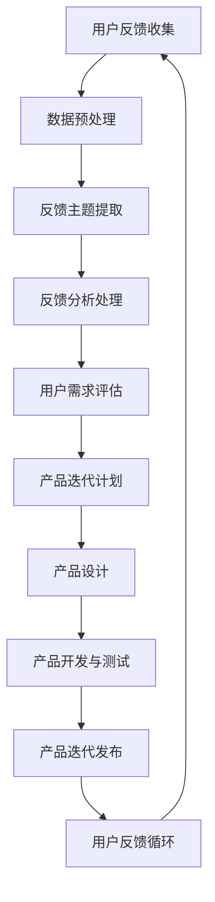

                 

### 第1章：一人公司的用户反馈收集与产品迭代机制概述

#### 1.1 一人公司的崛起背景

**1.1.1** 一人公司的定义与特点

一人公司，即由单一个人创建和运营的公司。其核心特点在于公司组织结构的简约性，即公司仅由一个创始人或管理者进行决策、执行和运营。这一模式在近年来随着互联网和科技的发展，特别是远程工作和数字化管理的普及，逐渐崭露头角。

一人公司的优势在于其灵活性和高效性。创始人能够迅速响应市场变化，快速做出决策，降低了沟通成本和决策延迟。同时，由于没有复杂的组织层级，一人公司能够更专注于核心业务，提高运营效率。

**1.1.2** 一人公司的兴起原因

一人公司的兴起与以下几个因素密切相关：

1. **技术进步**：互联网和远程工作的普及，使得个人可以更便捷地开展全球业务，无需依赖传统的商业地点和组织架构。
2. **创业环境改善**：政策环境的优化和创业支持服务的增加，为个人创业提供了更多机会和资源。
3. **成本效益**：相比于传统企业，一人公司的启动成本和运营成本更低，适合资源和资金有限的创业者。
4. **个人品牌**：社交媒体和在线平台的兴起，使得个人品牌得以快速建立和传播，为一人公司提供了更多的发展空间。

**1.1.3** 一人公司在现代商业环境中的地位与挑战

一人公司在现代商业环境中扮演着重要角色，成为创新和灵活性的代表。然而，其发展也面临诸多挑战：

1. **规模限制**：一人公司的规模受到创始人个人能力和资源的限制，难以实现大规模扩展。
2. **管理复杂性**：尽管组织结构简单，但随着业务的发展，管理复杂性逐渐增加，创始人需要具备多方面的能力和技能。
3. **可持续性**：如何保持持续的创新能力和市场竞争力，是一人公司需要长期面对的挑战。

综上所述，一人公司凭借其独特的优势在现代社会中迅速崛起，但其未来发展仍需在灵活性和可持续性之间找到平衡。

#### 1.2 用户反馈与产品迭代的关系

**1.2.1** 用户反馈的重要性

用户反馈是产品迭代过程中的关键信息来源，它能够直接反映用户的需求、喜好和痛点。以下是用户反馈在产品迭代中的重要性：

1. **指导产品方向**：用户反馈能够帮助产品团队明确产品的改进方向，确保产品功能与用户需求保持一致。
2. **优化用户体验**：通过分析用户反馈，可以识别用户体验中的问题，进而进行改进，提升用户满意度。
3. **发现潜在需求**：用户反馈不仅反映了当前需求，还可能揭示用户潜在的需求，为产品创新提供灵感。
4. **降低失败风险**：及时收集和分析用户反馈，可以减少产品发布后因不符合用户期望而导致的失败风险。

**1.2.2** 产品迭代的过程

产品迭代是一个持续的过程，包括需求分析、设计、开发、测试和发布等环节。以下是产品迭代的基本过程：

1. **需求分析**：通过市场调研、用户访谈和数据分析等方法，识别用户需求和市场趋势，为产品迭代提供基础。
2. **设计**：基于需求分析结果，进行产品设计，包括功能设计、界面设计和用户体验设计。
3. **开发**：按照设计文档进行编码和开发，实现产品功能。
4. **测试**：通过功能测试、性能测试和安全测试等，确保产品达到预期的质量和性能标准。
5. **发布**：将产品发布到市场，并收集用户反馈，为下一轮迭代做准备。

**1.2.3** 用户反馈驱动产品迭代的优势与挑战

用户反馈驱动产品迭代具有以下优势：

1. **快速响应**：用户反馈能够快速反映市场变化，产品团队能够迅速做出响应，调整产品方向。
2. **降低风险**：通过持续的用户反馈收集和分析，可以降低产品发布后因不符合用户期望而带来的风险。
3. **提高用户满意度**：及时解决用户反馈中的问题，能够提升用户满意度和忠诚度。

然而，用户反馈驱动产品迭代也面临一些挑战：

1. **反馈质量问题**：用户反馈可能存在主观性和不准确性，需要通过有效的数据分析方法进行筛选和处理。
2. **资源分配**：如何平衡用户反馈的处理和产品开发进度，确保资源的有效利用，是一大挑战。
3. **反馈机制设计**：建立有效的用户反馈机制，确保用户能够方便地提供反馈，并确保反馈能够被及时处理和响应。

综上所述，用户反馈在产品迭代中具有至关重要的作用，它不仅指导产品发展方向，还能够在迭代过程中持续优化用户体验。同时，有效处理用户反馈也面临诸多挑战，需要产品团队在设计和实施过程中加以重视。

#### 1.3 书籍内容结构概述

**1.3.1** 目录大纲概览

本书旨在深入探讨一人公司的用户反馈收集与产品迭代机制，通过系统的理论分析和实际案例，为读者提供全面的指导。以下是本书的目录大纲概览：

### 目录

**第一部分：引言**

1. 一人公司的用户反馈收集与产品迭代机制概述
   1.1 一人公司的崛起背景
   1.2 用户反馈与产品迭代的关系
   1.3 书籍内容结构概述

**第二部分：用户反馈收集机制**

2. 用户反馈的类型与来源
   2.1 用户反馈的类型
   2.2 用户反馈的来源渠道
   2.3 用户反馈收集的关键要素

3. 用户反馈收集工具与方法
   3.1 常用用户反馈收集工具
   3.2 用户反馈收集方法的实施步骤
   3.3 用户反馈收集案例分析

4. 用户反馈分析处理
   4.1 用户反馈数据预处理
   4.2 用户反馈主题提取
   4.3 用户反馈分析工具与技术

**第三部分：产品迭代机制**

5. 产品迭代策略
   5.1 产品迭代的目标
   5.2 产品迭代的生命周期
   5.3 产品迭代策略的选择

6. 产品规划与设计
   6.1 产品规划流程
   6.2 产品设计方法
   6.3 用户需求分析

7. 产品迭代实施与监控
   7.1 产品迭代实施计划
   7.2 产品迭代进度监控
   7.3 产品迭代效果评估

**第四部分：案例研究与实战**

8. 案例一：小型电商平台的用户反馈收集与迭代
   8.1 案例背景
   8.2 用户反馈收集与分析
   8.3 产品迭代过程与效果

9. 案例二：教育科技公司的用户反馈驱动产品更新
   9.1 案例背景
   9.2 用户反馈收集与分析
   9.3 产品迭代过程与效果

10. 案例三：社交媒体平台的用户反馈管理
    10.1 案例背景
    10.2 用户反馈收集与分析
    10.3 产品迭代过程与效果

**第五部分：总结与展望**

11. 用户反馈收集与产品迭代的整合
    11.1 关键要点回顾
    11.2 整合流程优化建议

12. 未来发展趋势与展望
    12.1 技术进步对用户反馈收集的影响
    12.2 行业变革下的产品迭代策略
    12.3 一人公司未来的发展路径与机遇

**附录**

13. 用户反馈收集与产品迭代相关资源
    13.1 书籍与论文推荐
    13.2 网络资源与工具

14. 用户反馈收集与产品迭代的常用工具
    14.1 反馈收集工具
    14.2 分析工具
    14.3 迭代管理工具

**参考文献**

15. 参考文献

**1.3.2** 各章节内容重点

- **引言**部分介绍了本书的背景、目标和结构，为后续内容奠定了基础。
- **用户反馈收集机制**部分详细探讨了用户反馈的类型、来源、收集方法以及分析处理。
- **产品迭代机制**部分讲解了产品迭代的目标、生命周期、策略选择、规划与设计以及迭代实施与监控。
- **案例研究与实战**部分通过实际案例，展示了用户反馈收集与产品迭代的实施过程和效果。
- **总结与展望**部分对用户反馈收集与产品迭代进行了总结，并提出了未来发展趋势和优化建议。

**1.3.3** 阅读指南与学习目标

本书适合希望了解和掌握用户反馈收集与产品迭代机制的个人和企业，具体阅读指南和学习目标如下：

- **理解**一人公司的概念及其在现代商业环境中的地位。
- **掌握**用户反馈的类型、来源和收集方法。
- **熟悉**用户反馈分析处理的工具与技术。
- **掌握**产品迭代的目标、策略、规划与设计。
- **学会**如何实施和监控产品迭代。
- **应用**所学知识，解决实际问题，提高产品竞争力和用户体验。

通过本书的系统学习，读者可以全面了解用户反馈收集与产品迭代机制，为企业的可持续发展提供有力支持。

### 第1章：一人公司的用户反馈收集与产品迭代机制概述

#### 1.4 用户反馈与产品迭代的Mermaid流程图

用户反馈与产品迭代的整合是一个复杂但关键的过程，以下是一个简化的Mermaid流程图，展示了用户反馈从收集到产品迭代的整体流程：



**用户反馈收集（A）**：用户反馈的收集是整个流程的起点，可以通过多种渠道进行，如社交媒体、客户支持渠道、在线评价平台等。

**数据预处理（B）**：收集到的用户反馈需要进行数据预处理，包括去噪、清洗和归一化等步骤，以确保数据的准确性和一致性。

**反馈主题提取（C）**：通过文本分析技术，如关键词提取、主题建模等，从预处理后的数据中提取出用户关注的主题和关键点。

**反馈分析处理（D）**：对提取的主题和关键点进行深入分析，识别用户的主要需求和痛点，为产品迭代提供指导。

**用户需求评估（E）**：基于反馈分析结果，对用户需求进行评估，确定哪些需求需要优先考虑和满足。

**产品迭代计划（F）**：根据用户需求评估结果，制定产品迭代计划，包括迭代的目标、范围、时间表和资源分配。

**产品设计（G）**：按照迭代计划，进行产品设计和开发，包括功能设计、界面设计和用户体验设计。

**产品开发与测试（H）**：实施产品设计和开发，并进行功能测试、性能测试和安全测试，确保产品达到预期的质量和性能标准。

**产品迭代发布（I）**：将经过测试的产品发布到市场，并收集用户的实际使用反馈。

**用户反馈循环（J）**：将用户的反馈再次输入到流程中，形成一个闭环，持续优化和改进产品。

通过这个流程图，可以清晰地看到用户反馈如何驱动产品迭代，形成一个持续改进的闭环，确保产品能够持续满足用户需求和市场变化。

### 第2章：用户反馈的类型与来源

用户反馈是产品迭代过程中的关键信息来源，它能够帮助产品团队了解用户的需求、喜好和痛点，从而指导产品的改进和优化。了解用户反馈的类型和来源，对于有效地收集和分析用户反馈至关重要。

#### 2.1 用户反馈的类型

用户反馈可以分为以下几类：

1. **正面反馈**：用户对产品的满意和赞赏，可以反映产品的优点和成功之处。
   - **优点**：提供正面反馈的用户往往对产品有较高的忠诚度，有助于提升品牌形象。
   - **用途**：用于了解产品成功的因素，作为后续优化和营销的参考。

2. **负面反馈**：用户对产品的批评和不满，可以揭示产品的问题和改进点。
   - **优点**：负面反馈提供了产品改进的具体方向，有助于快速解决用户痛点。
   - **用途**：用于发现产品中的缺陷和不足，指导产品的改进和优化。

3. **建议性反馈**：用户提出的产品改进建议，可以是功能需求、用户体验改进或bug修复等。
   - **优点**：建议性反馈为产品团队提供了创新思路，有助于产品功能的拓展和优化。
   - **用途**：用于优化产品功能和提升用户体验，增加产品的竞争力。

4. **投诉性反馈**：用户因产品问题导致的投诉，通常涉及严重的用户体验问题。
   - **优点**：投诉性反馈能够快速引起产品团队的重视，确保问题得到及时解决。
   - **用途**：用于处理紧急问题，防止负面口碑的扩散，维护用户关系。

**2.1.1** 正面反馈的示例

- “这个功能真是太方便了，让我工作效率大大提高！”
- “我很喜欢这个产品的界面设计，简洁美观，使用起来很舒服。”

**2.1.2** 负面反馈的示例

- “这个产品的加载速度太慢了，经常卡住，体验很差。”
- “我发现有个bug，有时候输入信息会丢失，希望尽快修复。”

**2.1.3** 建议性反馈的示例

- “我觉得可以增加一个实时聊天功能，方便用户提问和获得帮助。”
- “我建议在应用中加入一些个性化推荐，让内容更加符合我的兴趣。”

**2.1.4** 投诉性反馈的示例

- “我购买了一个会员，但是无法登录，你们需要尽快解决这个问题。”
- “我已经连续三天无法下载新版本，这对我的工作造成了很大困扰。”

#### 2.2 用户反馈的来源渠道

用户反馈可以通过多种渠道进行收集，以下是一些常见的来源：

1. **社交媒体**：用户在社交媒体平台上发布的产品评价、评论和讨论，可以提供丰富的用户反馈。
   - **优点**：覆盖面广，能够快速获取大量用户意见。
   - **用途**：用于了解用户对产品的整体看法和市场反应。

2. **客户支持渠道**：用户通过客服渠道（如电话、邮件、在线聊天）提出的问题和反馈。
   - **优点**：直接、详细，能够快速响应和处理用户的紧急需求。
   - **用途**：用于解决用户问题，提升客户满意度。

3. **在线评价平台**：如App Store、Google Play、Amazon等，用户在这些平台上的评价和评论。
   - **优点**：可信度高，影响范围广。
   - **用途**：用于评估产品的市场表现和用户满意度。

4. **用户调研与访谈**：通过问卷调查、访谈等方式，直接从用户那里获取反馈。
   - **优点**：深度了解用户需求，获取详细的信息。
   - **用途**：用于了解用户对产品的详细需求和市场趋势。

**2.2.1** 社交媒体

社交媒体是用户反馈的一个重要来源，用户可以轻松地在平台上分享他们的使用体验。例如，一个用户在Twitter上发布了关于某个应用的正面评价：“这个应用真的太好用了，推荐给大家！”这样的反馈可以被其他潜在用户看到，从而提高产品的口碑。

**2.2.2** 客户支持渠道

客户支持渠道是直接与用户互动的平台，用户可以在这里提出问题和反馈。例如，一个用户在联系客服时提到：“我在使用这个功能时遇到了问题，希望你们能帮我解决。”客服可以根据用户的问题，提供解决方案或反馈给产品团队，以便进行改进。

**2.2.3** 在线评价平台

在线评价平台是用户反馈的另一个重要来源，用户在这些平台上可以对产品进行评分和评论。例如，一个用户在App Store上写道：“这个应用有一个bug，每次加载都会卡住，希望开发者能尽快修复。”这样的负面反馈可以帮助产品团队快速发现问题并进行修复。

**2.2.4** 用户调研与访谈

用户调研与访谈是获取用户反馈的深度方法，通过直接与用户对话，可以深入了解用户的需求和痛点。例如，在一次用户访谈中，一个用户提到：“我希望应用能提供更多个性化推荐，这样我就能找到更多感兴趣的内容。”这样的反馈可以为产品团队提供宝贵的改进方向。

综上所述，用户反馈的类型和来源多种多样，了解这些反馈的类型和来源，有助于产品团队更有效地收集和分析用户反馈，从而优化产品，提升用户体验。

### 第3章：用户反馈收集工具与方法

为了有效地收集用户反馈，需要使用适当的工具和方法。以下介绍几种常用的用户反馈收集工具和方法。

#### 3.1 常用用户反馈收集工具

1. **社交媒体监控工具**：
   - **优点**：覆盖面广，能够实时获取大量用户反馈。
   - **用途**：用于监控社交媒体平台上的用户评价、评论和讨论。
   - **示例**：Hootsuite、Sprout Social、Brandwatch。

2. **客户关系管理（CRM）系统**：
   - **优点**：集成性强，可以统一管理用户反馈和支持请求。
   - **用途**：用于收集和管理来自客户支持渠道的用户反馈。
   - **示例**：Salesforce、HubSpot、Zoho CRM。

3. **用户调研工具**：
   - **优点**：灵活性强，可以定制问卷和调研问题。
   - **用途**：用于进行深度用户调研和需求分析。
   - **示例**：SurveyMonkey、Typeform、Google表单。

4. **在线问卷平台**：
   - **优点**：易于使用，可以快速创建和分发问卷。
   - **用途**：用于收集广泛的用户反馈。
   - **示例**：Qualtrics、Kobo Toolbox、Google表单。

5. **用户行为分析工具**：
   - **优点**：能够自动收集和分析用户行为数据。
   - **用途**：用于了解用户行为模式，发现潜在问题和需求。
   - **示例**：Google Analytics、Mixpanel、Heap Analytics。

#### 3.2 用户反馈收集方法的实施步骤

**3.2.1 明确收集目标**

在开始收集用户反馈之前，需要明确反馈收集的目标。例如，是了解用户对某一功能的使用体验，还是评估整体用户满意度。明确目标有助于设计合适的收集方法和工具。

**3.2.2 选择合适的反馈收集渠道**

根据收集目标和用户群体的特点，选择合适的反馈收集渠道。例如，如果目标是获取大量用户反馈，可以选择在线问卷平台；如果目标是深入了解用户需求，可以选择用户调研和访谈。

**3.2.3 设计反馈收集流程**

设计反馈收集流程，包括如何引导用户提供反馈，如何收集和存储反馈数据，以及如何处理和分析反馈数据。以下是一个简单的反馈收集流程：

1. 设计问卷或访谈问题。
2. 分发问卷或安排访谈。
3. 收集反馈数据。
4. 数据清洗和预处理。
5. 分析反馈数据。
6. 形成反馈报告。

**3.2.4 实施与反馈收集**

根据设计好的反馈收集流程，实施反馈收集工作。确保用户能够方便地提供反馈，并确保收集的数据准确和完整。

**3.2.5 数据分析与报告生成**

对收集到的用户反馈进行数据分析，提取关键信息和洞察。生成反馈报告，用于指导产品改进和决策。

#### 3.3 用户反馈收集案例分析

**案例一：电子商务平台的用户反馈收集**

**背景**：一个电子商务平台希望通过用户反馈了解用户对网站和应用的满意度，并识别需要改进的方面。

**步骤**：

1. **明确收集目标**：了解用户对网站和应用的满意度，识别用户使用过程中的痛点。
2. **选择反馈收集渠道**：在网站和应用的首页添加用户反馈表单，同时在社交媒体平台上发起问卷调查。
3. **设计反馈收集流程**：设计包含满意度评分、开放性问题以及功能需求调查的问卷。
4. **实施与反馈收集**：在网站和应用的显著位置引导用户填写反馈表单，同时在社交媒体平台上发布问卷链接。
5. **数据分析与报告生成**：收集到的数据经过清洗和预处理后，使用统计分析和文本分析方法进行深入分析，生成用户反馈报告。

**结果**：通过用户反馈收集，平台发现了一些用户经常提到的问题，如页面加载速度慢、搜索结果不准确等。根据这些反馈，平台进行了相应的优化，提高了用户满意度。

**案例二：移动应用的用户反馈收集**

**背景**：一个移动应用希望通过用户反馈了解用户对应用功能的满意度和使用体验。

**步骤**：

1. **明确收集目标**：了解用户对应用主要功能的满意度和使用体验。
2. **选择反馈收集渠道**：在应用内集成反馈系统，并在应用商店中收集用户评价。
3. **设计反馈收集流程**：设计包含功能评分、问题反馈和改进建议的反馈系统。
4. **实施与反馈收集**：在应用启动时弹出反馈请求窗口，同时鼓励用户在应用商店中留下评价。
5. **数据分析与报告生成**：对收集到的用户反馈进行分类和统计，生成用户反馈报告。

**结果**：通过用户反馈收集，应用团队发现了用户对某些功能的使用频率较高，但也存在一些使用上的困扰。根据这些反馈，应用团队优化了用户界面和功能设计，提高了用户满意度。

**案例三：在线教育平台的用户反馈收集**

**背景**：一个在线教育平台希望通过用户反馈了解用户对课程内容和教学服务的满意度。

**步骤**：

1. **明确收集目标**：了解用户对课程内容和教学服务的满意度，识别用户的需求和痛点。
2. **选择反馈收集渠道**：通过电子邮件、在线问卷调查和社交媒体平台收集用户反馈。
3. **设计反馈收集流程**：设计包含课程评分、教学服务评价和改进建议的问卷。
4. **实施与反馈收集**：定期发送问卷邮件，同时在社交媒体平台上发布问卷链接。
5. **数据分析与报告生成**：对收集到的用户反馈进行统计分析，生成用户反馈报告。

**结果**：通过用户反馈收集，平台发现了一些用户对课程内容的偏好和不满之处。根据这些反馈，平台优化了课程结构和教学方式，提高了用户满意度。

综上所述，用户反馈收集是产品改进和优化的重要环节。通过有效的工具和方法，可以收集到有价值的用户反馈，为产品迭代提供有力支持。


### 第4章：用户反馈分析处理

用户反馈分析处理是将收集到的用户反馈转化为可操作性和可执行建议的关键步骤。以下是对用户反馈分析处理过程的详细探讨。

#### 4.1 用户反馈数据预处理

数据预处理是用户反馈分析处理的基础，其目的是确保反馈数据的准确性和一致性。以下是数据预处理的主要步骤：

- **去噪与清洗**：去除用户反馈中的无效数据、重复数据和异常值。例如，删除全为空格或标点符号的反馈，以及删除重复的反馈记录。
  - **示例伪代码**：
    ```python
    def clean_feedback(feedback_list):
        cleaned_list = [feedback for feedback in feedback_list if feedback.strip() != ""]
        return cleaned_list
    ```

- **归一化**：将不同来源和格式的用户反馈转化为统一的格式，如将所有反馈文本转换为小写，去除特殊字符等。
  - **示例伪代码**：
    ```python
    import re
    
    def normalize_feedback(feedback_list):
        normalized_list = [re.sub(r'[^\w\s]', '', feedback.lower()) for feedback in feedback_list]
        return normalized_list
    ```

- **数据存储与管理**：将预处理后的用户反馈数据存储到数据库或其他数据存储系统中，以便后续分析和查询。
  - **示例伪代码**：
    ```python
    import sqlite3
    
    def store_feedback(feedback_list, db_connection):
        cursor = db_connection.cursor()
        for feedback in feedback_list:
            cursor.execute("INSERT INTO user_feedback (comment) VALUES (?)", (feedback,))
        db_connection.commit()
    ```

#### 4.2 用户反馈主题提取

用户反馈主题提取是将复杂的文本数据转化为结构化信息的过程，有助于快速识别用户的主要关注点和需求。以下是一些常见的主题提取方法：

- **关键词提取**：从用户反馈中提取出现频率高且具有代表性的关键词，用于概括反馈的主要内容和主题。
  - **示例伪代码**：
    ```python
    from collections import Counter
    
    def extract_keywords(feedback_list, top_n=10):
        all_words = ' '.join(feedback_list).split()
        word_counts = Counter(all_words)
        most_common_words = word_counts.most_common(top_n)
        return [word for word, _ in most_common_words]
    ```

- **词云生成**：通过可视化展示用户反馈中的高频词，有助于直观地了解用户关注的主题。
  - **示例伪代码**：
    ```python
    from wordcloud import WordCloud
    
    def generate_wordcloud(feedback_list):
        wordcloud = WordCloud(width=800, height=800, background_color="white").generate(' '.join(feedback_list))
        plt.figure(figsize=(10, 10))
        plt.imshow(wordcloud, interpolation="bilinear")
        plt.axis("off")
        plt.show()
    ```

- **主题建模**：使用机器学习算法（如LDA）从用户反馈中提取潜在的语义主题，有助于深入分析用户反馈的内在结构。
  - **示例伪代码**：
    ```python
    from sklearn.feature_extraction.text import TfidfVectorizer
    from sklearn.decomposition import LatentDirichletAllocation
    
    def topic_modeling(feedback_list, n_topics=5, n_words=10):
        vectorizer = TfidfVectorizer(max_df=0.95, min_df=2, stop_words='english')
        data_vectorized = vectorizer.fit_transform(feedback_list)
        lda = LatentDirichletAllocation(n_components=n_topics, max_iter=5, learning_method='online', learning_offset=50., random_state=0)
        lda.fit(data_vectorized)
        feature_names = vectorizer.get_feature_names_out()
        topics = lda.transform(data_vectorized)
        for topic_idx, topic in enumerate(lda.components_):
            print(f"Topic {topic_idx}:")
            print(" ".join([feature_names[i] for i in topic.argsort()[:-n_words - 1:-1]]))
    ```

#### 4.3 用户反馈分析工具与技术

用户反馈分析工具和技术可以帮助产品团队更深入地理解和处理用户反馈，以下是几种常用的工具和技术：

- **数据可视化工具**：通过可视化技术展示用户反馈数据的分布和趋势，有助于直观地理解用户反馈。
  - **示例伪代码**：
    ```python
    import matplotlib.pyplot as plt
    import seaborn as sns
    
    def visualize_feedback_distribution(feedback_counts):
        sns.barplot(x=feedback_counts.index, y=feedback_counts.values)
        plt.xticks(rotation=45)
        plt.show()
    ```

- **机器学习与自然语言处理技术**：使用机器学习算法和自然语言处理技术进行文本分类、情感分析和语义分析，有助于自动识别用户反馈中的关键信息。
  - **示例伪代码**：
    ```python
    from sklearn.model_selection import train_test_split
    from sklearn.ensemble import RandomForestClassifier
    from sklearn.metrics import accuracy_score
    
    def build_text_classifier(train_data, train_labels):
        X_train, X_test, y_train, y_test = train_test_split(train_data, train_labels, test_size=0.2, random_state=42)
        classifier = RandomForestClassifier(n_estimators=100, random_state=42)
        classifier.fit(X_train, y_train)
        predictions = classifier.predict(X_test)
        return accuracy_score(y_test, predictions)
    ```

- **用户行为分析**：结合用户行为数据（如点击、浏览、购买等）进行分析，有助于更全面地了解用户反馈背后的行为模式。
  - **示例伪代码**：
    ```python
    def analyze_user_behavior(behavior_data):
        activity_time_mean = behavior_data['activity_time'].mean()
        click_frequency_mean = behavior_data['clicks'].mean()
        behavior_categories = behavior_data.groupby('behavior_category')['activity_time'].mean()
        return activity_time_mean, click_frequency_mean, behavior_categories
    ```

通过上述工具和技术，产品团队可以更高效地分析用户反馈，识别用户需求，优化产品功能，提升用户体验。

### 第5章：产品迭代策略

#### 5.1 产品迭代的目标

产品迭代的目标是确保产品能够持续满足用户需求，并在竞争激烈的市场中保持竞争力。以下是产品迭代的主要目标：

- **提升用户体验**：通过不断优化产品的功能、界面和性能，提升用户的满意度和使用体验。
  - **示例**：增加新的功能模块，改善界面设计，提高响应速度。

- **增强产品功能**：根据用户反馈和市场变化，增加或改进产品的功能，满足用户的新需求。
  - **示例**：引入用户期望的新功能，如个性化推荐、聊天功能等。

- **缩短产品上市时间**：通过敏捷开发和快速迭代，缩短产品的开发周期，使产品能够更快地推向市场。
  - **示例**：采用敏捷开发方法，定期发布新版本，快速响应市场需求。

- **降低开发成本**：通过优化开发流程和资源利用，降低产品的开发成本，提高投资回报率。
  - **示例**：实施自动化测试，减少人工干预，降低开发和维护成本。

#### 5.2 产品迭代的生命周期

产品迭代的生命周期包括以下几个关键阶段：

- **需求分析**：通过市场调研、用户访谈和数据分析，识别用户需求和市场需求，为产品迭代提供基础。
  - **示例**：进行用户需求调研，分析市场趋势，确定产品迭代的目标和方向。

- **设计**：根据需求分析结果，进行产品设计和功能规划，包括界面设计、用户体验设计和技术架构设计。
  - **示例**：制定产品设计文档，设计用户界面原型，规划技术架构。

- **开发**：按照设计文档进行编码和开发，实现产品的功能和技术要求。
  - **示例**：编写代码，实现功能模块，进行集成测试。

- **测试**：对产品进行功能测试、性能测试和安全测试，确保产品质量和稳定性。
  - **示例**：执行自动化测试脚本，进行压力测试，评估系统的安全性能。

- **发布**：将产品发布到市场，进行用户试运行，收集用户反馈，为下一轮迭代做准备。
  - **示例**：发布新版本，收集用户反馈，评估产品在市场上的表现。

#### 5.3 产品迭代策略的选择

选择合适的产品迭代策略对于确保产品迭代的成功至关重要。以下是几种常见的产品迭代策略：

- **小步快跑策略**：通过频繁的小迭代，快速响应市场需求，降低失败风险。
  - **示例**：每个迭代周期较短，专注于实现关键功能，快速推向市场，并根据用户反馈进行下一轮迭代。

- **里程碑式迭代策略**：设定明确的里程碑，分阶段实现产品功能，确保每个阶段的目标和成果。
  - **示例**：每个迭代周期较长，分为多个阶段，每个阶段完成特定的功能模块，确保产品质量和稳定性。

- **响应式迭代策略**：根据用户反馈和市场动态灵活调整迭代计划，确保产品能够快速适应市场变化。
  - **示例**：迭代计划根据用户反馈和市场分析动态调整，优先处理用户最关注的问题和需求。

- **敏捷开发方法**：强调团队合作、快速迭代和持续交付，确保产品能够持续改进和优化。
  - **示例**：采用敏捷开发方法，定期进行团队会议和用户反馈收集，快速响应市场需求。

通过选择合适的迭代策略，产品团队可以更有效地管理产品迭代过程，确保产品能够持续满足用户需求，并在市场中保持竞争力。

### 第6章：产品规划与设计

#### 6.1 产品规划流程

产品规划是确保产品成功开发的关键步骤，它涉及到多个关键环节，包括市场需求分析、竞品分析和用户需求分析。以下是产品规划流程的详细步骤：

**6.1.1 市场需求分析**

市场需求分析是为了理解市场趋势和用户需求，为产品规划提供依据。以下是其关键步骤：

- **市场调研**：通过市场调研获取市场数据，包括市场规模、增长趋势、用户行为和竞争对手情况。
  - **示例伪代码**：
    ```python
    import pandas as pd

    def market_research():
        market_data = pd.read_csv('market_data.csv')
        return market_data
    ```

- **市场趋势分析**：分析市场数据，识别市场趋势，包括技术进步、消费者偏好和社会变革等。
  - **示例伪代码**：
    ```python
    import matplotlib.pyplot

