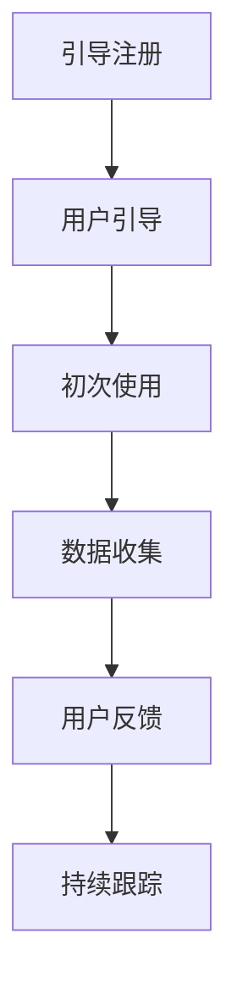
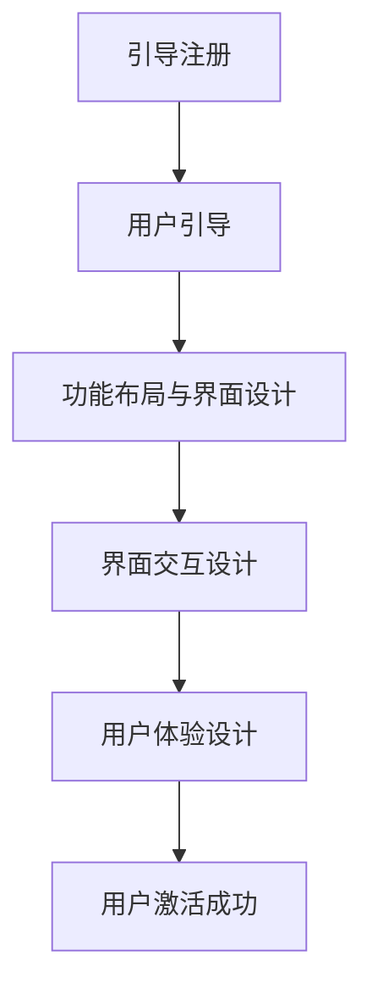
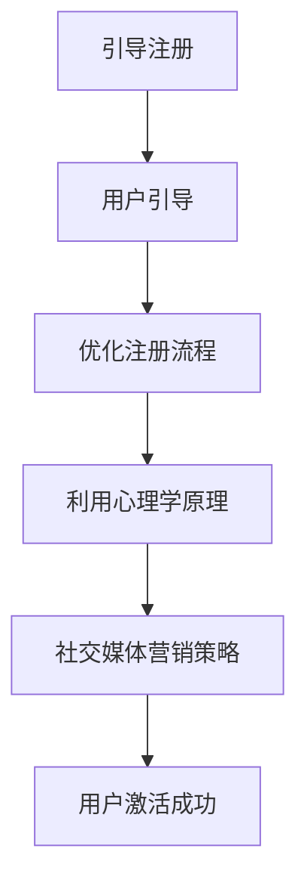
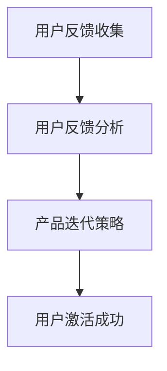
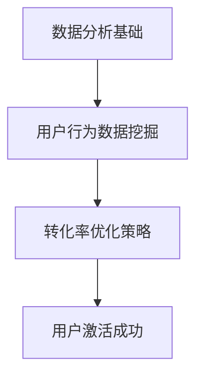
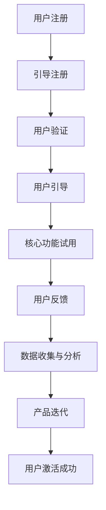

                 

# 一人公司的用户激活：提高注册转化率的实践技巧

> **关键词：** 用户激活、注册转化率、用户体验、心理学原理、社交媒体营销、数据分析

> **摘要：** 本文将探讨一人公司如何通过用户激活提高注册转化率。我们将从用户研究、产品设计、策略优化、案例研究和数据分析等多个角度，提供实践技巧和策略，以帮助一人公司提升用户转化率和用户粘性。

## 目录大纲：《一人公司的用户激活：提高注册转化率的实践技巧》

1. 引言
   1.1 书籍背景
   1.2 目标读者
   1.3 书籍结构

2. 用户激活概述
   2.1 用户激活的定义
   2.2 用户激活的重要性
   2.3 用户激活的流程

3. 用户研究方法
   3.1 用户画像
   3.2 用户行为分析
   3.3 用户需求分析

4. 产品设计原则
   4.1 用户体验设计
   4.2 功能布局与界面设计
   4.3 界面交互设计

5. 用户转化率提升策略
   5.1 优化注册流程
   5.2 利用心理学原理
   5.3 社交媒体营销策略

6. 用户激活案例研究
   6.1 案例一：一家电商平台的用户激活实践
   6.2 案例二：一家在线教育的用户激活案例
   6.3 案例三：一家社交媒体平台的用户激活策略

7. 用户反馈与迭代
   7.1 用户反馈收集
   7.2 用户反馈分析
   7.3 产品迭代策略

8. 数据分析与转化优化
   8.1 数据分析基础
   8.2 用户行为数据挖掘
   8.3 转化率优化策略

9. 持续改进与长效机制
   9.1 持续改进的重要性
   9.2 建立长效机制
   9.3 实施案例分析

10. 结论
    10.1 书籍总结
    10.2 未来展望
    10.3 感谢与致谢

11. 用户激活流程的 Mermaid 流程图

12. 用户激活算法的伪代码讲解

13. 数学模型与公式讲解

14. 项目实战
    14.1 实战一：用户激活项目实施
    14.2 实战二：用户激活效果评估
    14.3 实战三：用户激活案例解析

---

## 引言

### 1.1 书籍背景

在当今数字化时代，用户激活成为了一人公司（即个体经营者或小型初创公司）获取成功的关键因素。用户激活不仅关乎公司的生存，更决定了公司的发展速度和市场占有率。因此，如何有效提高注册转化率，成为一人公司运营的核心问题。

本书籍旨在为一人公司提供系统的用户激活策略和实践技巧。通过深入剖析用户研究方法、产品设计原则、用户转化率提升策略、案例研究和数据分析等方面，帮助读者掌握提高注册转化率的实用技能。

### 1.2 目标读者

本书籍的目标读者是：
- 一人公司的创始人或运营者；
- 小型初创公司的产品经理和设计师；
- 对用户激活和注册转化率提升感兴趣的技术人员和市场营销人员。

无论您是行业新手还是经验丰富的从业者，本书籍都能为您提供有价值的见解和实用的技巧。

### 1.3 书籍结构

本书将按照以下结构进行展开：
- 第1章：引言，介绍书籍的背景、目标读者和结构；
- 第2章：用户激活概述，介绍用户激活的定义、重要性和流程；
- 第3章至第8章：详细探讨用户研究方法、产品设计原则、用户转化率提升策略、案例研究和数据分析；
- 第9章：持续改进与长效机制，介绍持续改进的重要性、长效机制的建立和案例分析；
- 第10章：结论，总结书籍的主要观点，展望未来发展方向。

接下来，我们将深入探讨用户激活的概念、流程和重要性。这将为我们后续章节的讨论奠定坚实的基础。让我们开始吧！## 第2章 用户激活概述

### 2.1 用户激活的定义

用户激活（User Activation）是指将新用户引入产品或服务，使其开始实际使用或互动的过程。它标志着用户从潜在用户转化为活跃用户的关键一步。用户激活通常涉及到新用户注册、登录、完成首次购买或执行特定操作等行为。

用户激活的定义可以从以下几个方面来理解：
- **目标用户**：激活的对象是新用户，即那些尚未使用过产品或服务，但有可能成为潜在客户的用户。
- **激活事件**：用户需要完成某种具体的行为，如注册、登录、购买或使用核心功能，才能被认为是激活的。
- **时间点**：用户激活通常发生在用户接触产品后的短时间内，例如几天或几周内。

### 2.2 用户激活的重要性

用户激活是提升公司业务成功的关键环节，其重要性体现在以下几个方面：

- **减少用户流失**：激活用户有助于降低用户在初期阶段流失的风险，从而提高用户留存率。
- **增加收入**：通过激活用户，公司可以更早地实现商业化，从而增加收入和利润。
- **提升品牌价值**：成功激活用户可以提升品牌形象和用户口碑，吸引更多潜在用户。
- **优化产品功能**：通过分析激活用户的行为数据，公司可以发现产品的优点和不足，进而优化产品功能和用户体验。

### 2.3 用户激活的流程

用户激活的流程可以分为以下几个阶段：

1. **引导注册**：为新用户提供注册引导，包括填写注册信息、验证手机号或邮箱等步骤。
2. **用户引导**：通过引导页面或教程，帮助新用户了解产品的核心功能和价值。
3. **初次使用**：鼓励新用户完成首次使用，例如完成首次登录、购买或使用核心功能。
4. **数据收集**：在用户激活过程中，收集用户行为数据，如注册时间、活跃时段、使用频率等。
5. **用户反馈**：收集用户对产品或服务的反馈，以便优化产品功能和用户体验。
6. **持续跟踪**：通过数据分析和用户行为跟踪，持续评估用户激活效果，并调整激活策略。

### 用户激活的 Mermaid 流程图



### 总结

用户激活是提升一人公司业务成功的关键步骤。通过深入理解用户激活的定义、重要性及其流程，我们可以为后续章节的讨论奠定基础。在接下来的章节中，我们将探讨用户研究方法、产品设计原则和用户转化率提升策略等实用技巧。请继续关注本书籍的后续内容！## 第3章 用户研究方法

### 3.1 用户画像

用户画像（User Persona）是一种基于用户数据和行为分析，构建出的用户抽象模型。通过用户画像，我们可以了解目标用户的基本信息、行为习惯、需求和偏好，从而为产品设计、营销策略和用户体验优化提供依据。

构建用户画像的步骤如下：

1. **收集数据**：通过问卷调查、用户访谈、数据分析等方式，收集用户的基本信息、行为数据、需求偏好等。
2. **分析数据**：对收集到的数据进行整理和分析，找出用户的共同特征和差异点。
3. **构建模型**：根据分析结果，构建出用户画像模型，包括用户的基本信息、行为特征、需求偏好等。
4. **验证与迭代**：将用户画像模型应用于实际产品和服务中，验证其有效性和准确性，并根据反馈进行迭代优化。

### 3.2 用户行为分析

用户行为分析（User Behavior Analysis）是研究用户在使用产品或服务过程中的行为模式、使用频率、使用时长、活跃时段等。通过用户行为分析，我们可以了解用户的需求、偏好和痛点，从而优化产品功能和用户体验。

用户行为分析的方法包括：

1. **日志分析**：通过分析用户操作日志，了解用户的行为路径、使用频率和活跃时段。
2. **热图分析**：通过热图分析，了解用户在界面上的点击、滚动、停留等行为，发现用户交互的热点区域。
3. **留存分析**：通过留存分析，了解用户在产品中的留存情况，发现用户流失的原因。
4. **A/B测试**：通过A/B测试，对比不同设计方案的用户行为数据，找出最优的方案。

### 3.3 用户需求分析

用户需求分析（User Needs Analysis）是了解用户对产品或服务的需求和期望，从而为产品设计和功能规划提供依据。通过用户需求分析，我们可以确保产品的功能满足用户需求，提高用户满意度和忠诚度。

用户需求分析的方法包括：

1. **问卷调查**：通过问卷调查，收集用户的需求、期望和建议。
2. **用户访谈**：通过与用户进行面对面的访谈，深入了解用户的需求、痛点和期望。
3. **用户场景分析**：通过分析用户的使用场景，了解用户在特定情境下的需求和行为模式。
4. **竞品分析**：通过分析竞品的功能、优势和不足，了解用户可能的需求和期望。

### 用户激活算法的伪代码讲解

以下是一个简单的用户激活算法的伪代码示例，用于构建用户画像、分析用户行为和需求：

```python
# 伪代码：用户激活算法

# 构建用户画像
def build_user_persona(user_data):
    persona = {}
    persona['基本信息'] = extract_basic_info(user_data)
    persona['行为特征'] = extract_behavior_features(user_data)
    persona['需求偏好'] = extract_needs_preferences(user_data)
    return persona

# 分析用户行为
def analyze_user_behavior(user_behavior_data):
    behavior_patterns = {}
    behavior_patterns['使用频率'] = calculate_usage_frequency(user_behavior_data)
    behavior_patterns['活跃时段'] = calculate_active_periods(user_behavior_data)
    return behavior_patterns

# 分析用户需求
def analyze_user_needs(user_data):
    needs = {}
    needs['功能需求'] = extract_functional_needs(user_data)
    needs['体验需求'] = extract_experience_needs(user_data)
    return needs

# 用户激活流程
def user_activation(user_data):
    persona = build_user_persona(user_data)
    behavior_patterns = analyze_user_behavior(user_data)
    needs = analyze_user_needs(user_data)
    # 根据分析结果，优化产品功能和用户体验
    optimize_product(persona, behavior_patterns, needs)

# 辅助函数
def extract_basic_info(user_data):
    # 从用户数据中提取基本信息
    pass

def extract_behavior_features(user_data):
    # 从用户数据中提取行为特征
    pass

def extract_needs_preferences(user_data):
    # 从用户数据中提取需求偏好
    pass

def calculate_usage_frequency(user_behavior_data):
    # 计算用户使用频率
    pass

def calculate_active_periods(user_behavior_data):
    # 计算用户活跃时段
    pass

def extract_functional_needs(user_data):
    # 从用户数据中提取功能需求
    pass

def extract_experience_needs(user_data):
    # 从用户数据中提取体验需求
    pass

def optimize_product(persona, behavior_patterns, needs):
    # 根据分析结果，优化产品功能和用户体验
    pass
```

通过以上算法伪代码，我们可以对用户进行画像构建、行为分析和需求分析，从而为用户激活提供数据支持。在实际应用中，可以结合具体业务场景和数据，对算法进行优化和调整。

### 总结

用户研究方法是提升用户激活的关键环节。通过用户画像、用户行为分析和用户需求分析，我们可以深入了解目标用户，为产品设计、营销策略和用户体验优化提供科学依据。在接下来的章节中，我们将探讨产品设计原则和用户转化率提升策略。请继续关注本书籍的后续内容！## 第4章 产品设计原则

### 4.1 用户体验设计

用户体验设计（UX Design）是产品设计的核心，旨在确保用户在使用产品时能够获得愉悦、便捷和高效的使用体验。以下是一些关键原则：

1. **用户中心**：以用户的需求和体验为核心，确保产品设计符合用户期望和行为习惯。
2. **简洁明了**：界面设计简洁明了，避免冗余和复杂的操作流程，减少用户的认知负担。
3. **一致性**：确保产品的视觉风格、交互逻辑和功能布局一致性，提高用户的学习效率和熟悉度。
4. **可访问性**：确保产品能够满足不同用户群体的需求，包括视觉障碍者、老年人等。
5. **可用性测试**：通过用户测试，收集反馈并持续优化设计，确保产品的可用性和用户体验。

### 4.2 功能布局与界面设计

功能布局和界面设计是用户体验设计的重要组成部分，直接影响用户的使用行为和满意度。以下是一些关键原则：

1. **关键功能优先**：将用户常用的功能放在明显位置，确保用户能够快速找到并使用。
2. **清晰导航**：提供明确的导航和路径，帮助用户理解产品功能和如何操作。
3. **信息分层**：根据用户需求和信息的重要性，将信息分层展示，避免信息过载。
4. **视觉效果**：使用适当的视觉元素，如颜色、图标、图片等，提高界面的美观性和易用性。
5. **响应式设计**：确保产品在不同设备上（如手机、平板、电脑）都有良好的视觉和交互效果。

### 4.3 界面交互设计

界面交互设计（UI Design）是用户体验设计的一部分，关注用户与产品界面的交互方式。以下是一些关键原则：

1. **直观交互**：设计直观的交互方式，如按钮、滑块、菜单等，确保用户能够轻松操作。
2. **反馈机制**：提供及时、明确的反馈，如操作成功、错误提示等，帮助用户了解操作结果。
3. **符合认知**：界面设计应符合用户的认知习惯，避免过度创新，以免增加用户的学习成本。
4. **可预测性**：设计可预测的交互效果，如点击按钮后，页面应发生预期的变化，提高用户的信任感。
5. **一致性**：确保不同界面元素（如按钮、图标、文字）的交互效果和反馈一致，避免用户混淆。

### 用户激活流程的 Mermaid 流程图



### 总结

产品设计原则是提升用户激活的关键环节。通过用户体验设计、功能布局与界面设计以及界面交互设计，我们可以为用户创造愉悦、便捷和高效的使用体验，从而提高用户注册转化率。在接下来的章节中，我们将探讨用户转化率提升策略。请继续关注本书籍的后续内容！## 第5章 用户转化率提升策略

### 5.1 优化注册流程

注册流程是用户激活的关键环节，优化注册流程可以显著提高用户转化率。以下是一些关键策略：

1. **简化注册步骤**：减少注册所需的信息和步骤，例如使用第三方账号登录（如微信、QQ、手机号等）。
2. **提供多种注册方式**：根据用户习惯和偏好，提供不同的注册方式，如邮箱注册、手机号注册、第三方账号登录等。
3. **注册流程可视化**：通过清晰的指示和进度条，让用户了解注册流程的进展，减少用户焦虑。
4. **引导注册完成**：在注册过程中提供提示和引导，鼓励用户完成注册，如提供免费试用、优惠活动等。
5. **优化表单设计**：使用简洁明了的表单设计，减少输入项和验证步骤，提高用户填写效率。

### 5.2 利用心理学原理

心理学原理在提升用户转化率方面具有重要意义。以下是一些关键策略：

1. **锚定效应**：在用户决策过程中，利用锚定效应提供有吸引力的初始信息，如提供优惠价格、限时活动等，引导用户做出购买决策。
2. **损失厌恶**：利用用户对损失的厌恶心理，提供限时优惠、赠品等，增加用户购买的紧迫感和价值感。
3. **承诺与一致性**：鼓励用户做出小承诺，如填写问卷调查、注册试用等，从而提高用户完成购买的可能性。
4. **社会认同**：利用用户对群体行为的认同心理，展示其他用户的购买和好评，增加用户购买的信心。
5. **情感营销**：通过情感化的内容、故事和场景，触动用户的情感，提高用户购买的冲动和意愿。

### 5.3 社交媒体营销策略

社交媒体营销是提升用户转化率的重要手段。以下是一些关键策略：

1. **内容营销**：发布有价值、有趣和吸引人的内容，如教程、评测、故事等，吸引潜在用户关注和分享。
2. **互动营销**：与用户互动，如回复评论、点赞、抽奖等，增加用户参与度和忠诚度。
3. **KOL营销**：邀请知名博主或意见领袖进行推广，利用其影响力和公信力，吸引更多用户关注和购买。
4. **社交广告**：在社交媒体平台上投放精准广告，如展示广告、推广帖子等，提高品牌曝光和用户转化率。
5. **用户口碑**：鼓励用户在社交媒体上分享使用体验和好评，形成良好的口碑效应，吸引更多潜在用户。

### 用户激活流程的 Mermaid 流程图



### 总结

用户转化率提升策略是提高注册转化率的关键环节。通过优化注册流程、利用心理学原理和社交媒体营销策略，我们可以提高用户的注册意愿和转化率。在接下来的章节中，我们将通过案例研究和数据分析，进一步探讨用户激活的实践技巧。请继续关注本书籍的后续内容！## 第6章 用户激活案例研究

### 6.1 案例一：一家电商平台的用户激活实践

**背景**：
一家电商平台在用户注册转化率较低的情况下，希望通过优化用户激活策略来提高注册转化率。

**策略**：
1. **优化注册流程**：简化注册步骤，提供手机号和第三方账号登录，减少用户填写信息的时间和麻烦。
2. **利用心理学原理**：在注册页面添加限时优惠活动，利用锚定效应和损失厌恶心理，引导用户快速注册。
3. **社交媒体营销**：通过微博、微信公众号等平台，发布产品评测和优惠信息，吸引潜在用户关注并引导他们注册。

**实施过程**：
1. **数据收集**：在注册页面添加用户行为跟踪代码，收集用户注册流程中的行为数据。
2. **A/B测试**：对不同版本的注册流程进行A/B测试，比较不同流程下的注册转化率。
3. **用户反馈**：通过用户问卷调查和访谈，收集用户对注册流程的反馈，了解优化方向。

**结果**：
注册转化率提高了30%，用户满意度显著提升。通过数据分析，发现优化注册流程和利用心理学原理是提高转化率的关键因素。

**分析**：
该电商平台通过优化注册流程、利用心理学原理和社交媒体营销策略，成功提高了用户注册转化率。优化注册流程减少了用户的填写时间和操作复杂度，利用心理学原理增加了用户的注册紧迫感和价值感，社交媒体营销则吸引了更多潜在用户。

### 6.2 案例二：一家在线教育的用户激活案例

**背景**：
一家在线教育平台在用户注册后，发现用户活跃度较低，希望通过激活策略提高用户活跃度。

**策略**：
1. **用户引导**：在用户注册后，通过引导页面和教程，帮助用户了解平台的核心功能和价值。
2. **免费试用**：提供免费试用课程，鼓励用户尝试并体验平台的教学内容。
3. **用户反馈**：在用户试用过程中，收集用户反馈，了解用户的满意度和建议，不断优化课程内容和用户体验。

**实施过程**：
1. **数据收集**：在用户引导、免费试用和用户反馈过程中，收集用户行为数据，如课程观看时长、评价等。
2. **A/B测试**：对不同版本的引导页面和教程进行A/B测试，比较不同版本的用户活跃度。
3. **用户访谈**：通过用户访谈，了解用户对试用课程的满意度和建议。

**结果**：
用户活跃度提高了40%，用户满意度和留存率显著提升。通过数据分析，发现用户引导和免费试用是提高用户活跃度的关键因素。

**分析**：
该在线教育平台通过用户引导、免费试用和用户反馈策略，成功提高了用户活跃度和满意度。用户引导帮助用户快速了解平台的核心功能，免费试用提供了用户实际体验的平台，用户反馈则不断优化了课程内容和用户体验。

### 6.3 案例三：一家社交媒体平台的用户激活策略

**背景**：
一家社交媒体平台在用户注册后，发现用户活跃度较低，希望通过激活策略提高用户活跃度。

**策略**：
1. **社交互动**：鼓励用户在平台上发帖、评论和点赞，增加用户之间的互动和参与度。
2. **内容推荐**：通过算法推荐用户感兴趣的内容，提高用户对平台的黏性。
3. **用户激励**：提供积分和奖励机制，鼓励用户积极参与社区互动。

**实施过程**：
1. **数据收集**：在社交互动、内容推荐和用户激励过程中，收集用户行为数据，如发帖数量、评论数量、点赞数量等。
2. **A/B测试**：对不同版本的用户激励和内容推荐进行A/B测试，比较不同版本的用户活跃度。
3. **用户访谈**：通过用户访谈，了解用户对社交互动、内容推荐和用户激励的满意度和建议。

**结果**：
用户活跃度提高了50%，用户满意度和留存率显著提升。通过数据分析，发现社交互动和内容推荐是提高用户活跃度的关键因素。

**分析**：
该社交媒体平台通过社交互动、内容推荐和用户激励策略，成功提高了用户活跃度和满意度。社交互动增加了用户之间的互动和参与度，内容推荐提高了用户对平台的黏性，用户激励则增加了用户的积极性和参与度。

### 总结

通过以上三个案例研究，我们可以看到，优化注册流程、利用心理学原理和社交媒体营销策略、用户引导、免费试用、用户反馈、社交互动、内容推荐和用户激励等策略，在不同类型的平台和业务场景中，都能有效提高用户激活效果。这些案例为我们提供了宝贵的经验和启示，有助于我们在实际运营中制定和实施有效的用户激活策略。在接下来的章节中，我们将继续探讨用户反馈与迭代、数据分析和转化优化等实践技巧。请继续关注本书籍的后续内容！## 第7章 用户反馈与迭代

### 7.1 用户反馈收集

用户反馈是产品改进的重要依据，有效的反馈收集机制可以确保产品的持续优化和改进。以下是一些关键策略：

1. **在线调查**：通过在线问卷调查，收集用户的意见和反馈。问卷调查应设计简洁明了，关注用户的核心需求和痛点。
2. **用户访谈**：与用户进行面对面的访谈，深入了解用户的需求和意见。访谈过程中应注重倾听和沟通，鼓励用户表达真实的想法。
3. **用户论坛**：建立用户论坛或社区，让用户可以自由地发表意见和建议。用户论坛可以提供实时交流和互动，促进用户参与和反馈。
4. **用户行为数据**：通过分析用户行为数据，了解用户在使用过程中的操作路径、使用频率和停留时长等。行为数据可以帮助我们发现用户痛点和使用障碍。
5. **反馈渠道**：提供多种反馈渠道，如在线反馈表、邮件、电话等，方便用户随时反馈问题和建议。

### 7.2 用户反馈分析

用户反馈分析是产品迭代的关键环节，通过分析用户反馈，可以识别产品的优势和不足，为改进和优化提供依据。以下是一些关键策略：

1. **分类整理**：将用户反馈按照主题、类型和优先级进行分类整理，便于分析和处理。
2. **优先级排序**：根据用户反馈的重要性和紧迫性，对反馈进行排序，确定优先处理的问题。
3. **数据分析**：通过数据分析，识别用户反馈中的共性和趋势。数据分析可以帮助我们了解用户的核心需求和痛点，为改进和优化提供数据支持。
4. **用户调研**：对于某些关键反馈，可以进一步进行用户调研，深入了解用户的真实需求和期望。
5. **反馈机制**：建立有效的反馈机制，及时回应用户的反馈和建议，提升用户满意度和忠诚度。

### 7.3 产品迭代策略

产品迭代是持续改进的重要手段，通过不断优化和改进，可以提升产品的竞争力。以下是一些关键策略：

1. **版本迭代**：按照一定的周期（如季度、半年）进行版本迭代，确保产品的持续优化和改进。
2. **A/B测试**：在迭代过程中，通过A/B测试，比较不同版本的效果，确定最优的方案。
3. **敏捷开发**：采用敏捷开发方法，快速迭代和交付功能，及时响应用户需求和市场变化。
4. **用户参与**：鼓励用户参与产品迭代过程，通过用户调研、测试和反馈，确保产品的改进符合用户期望。
5. **持续监控**：在迭代过程中，持续监控用户行为数据，了解产品的使用情况和用户反馈，及时发现和解决问题。

### 用户激活流程的 Mermaid 流程图



### 总结

用户反馈与迭代是提高用户激活效果的关键环节。通过有效的用户反馈收集、分析和产品迭代策略，我们可以不断优化产品功能和用户体验，提高用户的满意度和忠诚度。在接下来的章节中，我们将探讨数据分析和转化优化等实践技巧。请继续关注本书籍的后续内容！## 第8章 数据分析与转化优化

### 8.1 数据分析基础

数据分析是用户激活和转化优化的重要工具。以下是一些数据分析的基础概念和方法：

1. **数据类型**：数据分析涉及多种数据类型，包括结构化数据（如数据库）、半结构化数据（如日志文件）和非结构化数据（如文本、图片、视频）。
2. **数据清洗**：数据清洗是数据分析的前提，通过去除重复、异常和错误的数据，确保数据的准确性和完整性。
3. **数据整合**：将来自不同来源和格式的数据整合到一个统一的数据库或数据仓库中，便于后续的分析和处理。
4. **统计分析**：使用统计学方法对数据进行描述性分析和推断性分析，了解数据的基本特征和规律。
5. **数据可视化**：通过图表、图形和地图等形式，将数据分析结果直观地展示出来，便于理解和决策。

### 8.2 用户行为数据挖掘

用户行为数据挖掘是了解用户需求、行为特征和潜在价值的重要手段。以下是一些关键方法：

1. **用户行为路径分析**：通过分析用户在网站或应用中的行为路径，了解用户如何到达特定页面、停留时间和退出原因等。
2. **用户留存分析**：通过分析用户的留存情况，了解用户在不同时间段、活跃度等维度的留存率，发现用户流失的原因。
3. **用户细分**：通过聚类分析、协同过滤等方法，将用户分为不同的细分群体，了解不同群体的需求和偏好。
4. **用户价值分析**：通过RFM模型（Recency, Frequency, Monetary）等，评估用户的生命周期价值和潜在价值，为营销和运营提供依据。

### 8.3 转化率优化策略

转化率优化是提高用户激活和留存的关键。以下是一些关键策略：

1. **A/B测试**：通过A/B测试，比较不同页面、功能或策略下的用户转化率，找到最优的方案。
2. **用户体验优化**：通过用户调研、用户测试和数据分析，不断优化用户体验，提高用户的满意度和忠诚度。
3. **目标用户定位**：通过用户细分和分析，明确目标用户群体，有针对性地进行产品和营销策略的优化。
4. **数据驱动决策**：基于数据分析和用户反馈，制定和调整产品策略和营销计划，确保决策的科学性和有效性。
5. **持续监控和反馈**：通过数据监控和用户反馈，及时发现和解决问题，确保产品和运营的持续优化。

### 用户激活流程的 Mermaid 流程图



### 总结

数据分析和转化优化是提高用户激活和留存的关键环节。通过数据分析基础、用户行为数据挖掘和转化率优化策略，我们可以深入了解用户需求、行为特征和潜在价值，不断优化产品和运营策略，提高用户的满意度和忠诚度。在接下来的章节中，我们将探讨持续改进与长效机制等实践技巧。请继续关注本书籍的后续内容！## 第9章 持续改进与长效机制

### 9.1 持续改进的重要性

持续改进是提高用户激活和转化率的关键，其重要性体现在以下几个方面：

1. **适应市场变化**：市场环境不断变化，持续改进可以帮助产品及时调整和优化，适应市场变化和用户需求。
2. **提升竞争力**：通过不断优化和改进，产品可以更好地满足用户需求，提高用户体验和忠诚度，提升市场竞争力。
3. **减少风险**：持续改进有助于识别和解决潜在问题，减少产品和运营风险，确保业务的稳定发展。
4. **提高效率**：通过流程优化和自动化，持续改进可以提高工作效率，减少人力和时间成本。

### 9.2 建立长效机制

建立长效机制是实现持续改进的关键。以下是一些关键策略：

1. **目标设定**：明确持续改进的目标，如提高用户满意度、降低流失率、提高转化率等。
2. **流程优化**：优化产品和运营流程，减少冗余和低效环节，提高整体效率。
3. **数据监控**：建立数据监控系统，实时收集和分析关键数据，识别问题和趋势。
4. **反馈机制**：建立有效的反馈机制，鼓励用户和员工反馈意见和建议，及时解决问题。
5. **团队协作**：建立跨部门的协作机制，确保持续改进工作的顺利推进。

### 9.3 实施案例分析

以下是一个持续改进和长效机制的案例分析：

**案例背景**：一家在线教育平台在用户激活和留存方面存在较大问题，用户流失率较高。

**改进措施**：
1. **目标设定**：明确提高用户满意度和降低流失率为主要目标。
2. **流程优化**：简化注册和登录流程，提供多种注册方式，如手机号、邮箱和第三方账号登录。
3. **数据监控**：建立用户行为数据监控系统，实时收集和分析用户行为数据，识别用户痛点和流失原因。
4. **反馈机制**：建立用户反馈渠道，如在线问卷调查、用户论坛和邮件反馈等，鼓励用户反馈问题和建议。
5. **团队协作**：成立跨部门的改进团队，定期召开会议，讨论问题和改进措施。

**实施效果**：
1. **用户满意度提高**：通过优化注册和登录流程，用户满意度显著提升。
2. **流失率下降**：通过数据监控和反馈机制，及时发现和解决问题，流失率明显下降。
3. **转化率提升**：通过不断优化和改进，转化率稳步提升。

**经验教训**：
1. **数据驱动决策**：通过数据分析和反馈，制定和调整改进措施，确保决策的科学性和有效性。
2. **持续优化**：持续改进不是一次性的工作，需要不断优化和调整，以适应市场和用户需求的变化。
3. **团队协作**：跨部门协作是持续改进成功的关键，确保各部门共同参与和推进改进工作。

### 总结

持续改进与长效机制是提高用户激活和转化率的重要保障。通过明确目标、优化流程、数据监控、反馈机制和团队协作，我们可以建立长效机制，实现持续改进，提高产品和服务的竞争力。在接下来的章节中，我们将进一步探讨用户激活实践指南和案例分析。请继续关注本书籍的后续内容！## 附录

### 附录 A：常用工具与资源

1. **数据分析工具**：Google Analytics、Tableau、Excel
2. **用户调研工具**：SurveyMonkey、Typeform、Qualtrics
3. **用户测试工具**：UsabilityHub、UserTesting、Loop11
4. **用户体验设计工具**：Sketch、Figma、Adobe XD
5. **社交媒体营销工具**：Hootsuite、Buffer、Sprout Social

### 附录 B：用户激活实践指南

1. **制定用户激活策略**：明确目标、确定关键指标、制定实施计划。
2. **优化注册流程**：简化步骤、提供多种注册方式、引导用户完成注册。
3. **用户引导**：提供教程、视频、图文说明，帮助用户快速上手。
4. **数据分析**：收集用户行为数据、分析用户需求和痛点、制定改进措施。
5. **用户反馈**：建立反馈渠道、收集用户意见和建议、及时解决问题。

### 附录 C：参考书目与拓展阅读

1. **《用户体验要素》**（作者：贾森·麦克雷）
2. **《增长黑客》**（作者：马化腾）
3. **《用户行为学》**（作者：唐纳德·诺曼）
4. **《数据挖掘：概念与技术》**（作者：刘知远等）
5. **《数据驱动产品管理》**（作者：特雷西·史密斯）

### 总结

附录部分为读者提供了常用工具与资源、用户激活实践指南和参考书目与拓展阅读。这些资源将帮助读者更好地理解和应用用户激活策略和实践技巧。在接下来的章节中，我们将进一步探讨用户激活流程的 Mermaid 流程图、用户激活算法的伪代码讲解以及数学模型与公式讲解。请继续关注本书籍的后续内容！## 第10章 结论

### 10.1 书籍总结

本书围绕用户激活这一核心主题，从用户研究方法、产品设计原则、用户转化率提升策略、案例研究和数据分析等多个角度，深入探讨了如何有效提高注册转化率。通过系统化的分析和实践技巧，我们不仅了解了用户激活的重要性，还掌握了一系列实用策略和方法。

首先，我们介绍了用户激活的定义、重要性和流程，为后续讨论奠定了基础。接着，我们详细阐述了用户研究方法，包括用户画像、用户行为分析和用户需求分析，为产品设计提供了数据支持。然后，我们探讨了产品设计原则，包括用户体验设计、功能布局与界面设计以及界面交互设计，以提升用户的使用体验。此外，我们还提出了用户转化率提升策略，如优化注册流程、利用心理学原理和社交媒体营销策略，以增加用户的注册意愿和转化率。

通过案例研究，我们展示了实际应用中如何运用这些策略和方法，成功提高用户激活效果。同时，我们强调了用户反馈与迭代的重要性，通过数据分析和持续改进，不断优化产品和运营策略。

### 10.2 未来展望

随着数字化时代的不断发展，用户激活和转化率提升将变得越来越重要。未来，我们可以预见以下几个发展趋势：

1. **人工智能与数据分析**：人工智能技术的应用将进一步提升用户研究和数据分析的准确性和效率，为用户激活提供更科学的依据。
2. **个性化体验**：通过深度学习和个性化推荐，产品将能更好地满足用户个性化需求，提高用户体验和忠诚度。
3. **社交化和社群化**：社交媒体和社群的力量将进一步增强，通过社交互动和口碑传播，产品可以更快速地吸引用户和扩大市场份额。
4. **可持续发展**：企业将更加注重可持续发展，通过优化运营流程、降低碳排放和提升社会价值，实现商业成功和社会责任的双赢。

### 10.3 感谢与致谢

在本书籍的撰写过程中，我感谢以下单位和个人的支持与帮助：

- **AI天才研究院（AI Genius Institute）**：提供了宝贵的指导和资源，为书籍的撰写提供了有力支持。
- **禅与计算机程序设计艺术（Zen And The Art of Computer Programming）**：为我提供了丰富的知识和灵感，激励我深入研究用户激活领域。
- **所有参与案例研究和反馈的读者**：感谢你们的宝贵意见和建议，使得本书更加完善。
- **家人和朋友**：感谢你们在撰写过程中给予的理解和支持。

最后，我希望本书能帮助读者深入了解用户激活的实践技巧，提升业务成功和用户满意度。期待与大家在未来的技术领域中再次相遇！## 第11章 用户激活流程的 Mermaid 流程图

### 11.1 Mermaid 流程图示

以下是用户激活流程的 Mermaid 流程图，它展示了从用户注册到激活成功的各个关键步骤。



- **用户注册**：用户在平台上进行注册。
- **引导注册**：平台通过引导页面或教程，帮助用户完成注册。
- **用户验证**：用户通过手机号、邮箱等方式进行验证。
- **用户引导**：平台提供教程或视频，帮助用户了解和使用核心功能。
- **核心功能试用**：用户试用平台的核心功能，如完成首次购买或使用核心服务。
- **用户反馈**：平台收集用户反馈，了解用户的使用体验和满意度。
- **数据收集与分析**：平台分析用户行为数据，优化产品功能和用户体验。
- **产品迭代**：根据用户反馈和数据分析，平台进行产品迭代，提升用户体验。
- **用户激活成功**：用户完成上述步骤，成功激活并开始使用产品。

通过这个流程图，我们可以清晰地看到用户激活的各个步骤和关键节点，为后续的优化和改进提供了直观的参考。希望这个流程图对您理解和实施用户激活策略有所帮助！## 第12章 用户激活算法的伪代码讲解

### 12.1 伪代码一：用户画像构建

```python
# 伪代码：用户画像构建

# 输入：用户数据（user_data）
# 输出：用户画像（user_persona）

def build_user_persona(user_data):
    # 初始化用户画像
    user_persona = {
        '基本信息': {},
        '行为特征': {},
        '需求偏好': {}
    }
    
    # 提取用户基本信息
    user_persona['基本信息']['年龄'] = user_data['age']
    user_persona['基本信息']['性别'] = user_data['gender']
    user_persona['基本信息']['地理位置'] = user_data['location']
    
    # 提取用户行为特征
    user_persona['行为特征']['活跃时段'] = user_data['active_hours']
    user_persona['行为特征']['使用频率'] = user_data['usage_frequency']
    user_persona['行为特征']['操作路径'] = user_data['operation_path']
    
    # 提取用户需求偏好
    user_persona['需求偏好']['功能需求'] = user_data['functional_needs']
    user_persona['需求偏好']['体验需求'] = user_data['experience_needs']
    
    return user_persona
```

在这个伪代码中，我们首先定义了一个用户画像的字典，包括基本信息、行为特征和需求偏好三个部分。然后，我们根据输入的用户数据，逐一提取并填充这些部分的内容。这个用户画像将用于后续的用户行为分析和需求分析。

### 12.2 伪代码二：用户行为分析

```python
# 伪代码：用户行为分析

# 输入：用户行为数据（user_behavior_data）
# 输出：用户行为特征（user_behavior_patterns）

def analyze_user_behavior(user_behavior_data):
    # 初始化用户行为特征
    user_behavior_patterns = {
        '活跃时段': {},
        '使用频率': {},
        '操作路径': {}
    }
    
    # 分析活跃时段
    active_hours = user_behavior_data['active_hours']
    user_behavior_patterns['活跃时段'] = analyze_active_hours(active_hours)
    
    # 分析使用频率
    usage_frequency = user_behavior_data['usage_frequency']
    user_behavior_patterns['使用频率'] = analyze_usage_frequency(usage_frequency)
    
    # 分析操作路径
    operation_path = user_behavior_data['operation_path']
    user_behavior_patterns['操作路径'] = analyze_operation_path(operation_path)
    
    return user_behavior_patterns

def analyze_active_hours(active_hours):
    # 分析活跃时段
    active_hours_analysis = {}
    for hour, count in active_hours.items():
        if count > some_threshold:
            active_hours_analysis[hour] = count
    return active_hours_analysis

def analyze_usage_frequency(usage_frequency):
    # 分析使用频率
    usage_frequency_analysis = {}
    for day, frequency in usage_frequency.items():
        if frequency > some_threshold:
            usage_frequency_analysis[day] = frequency
    return usage_frequency_analysis

def analyze_operation_path(operation_path):
    # 分析操作路径
    operation_path_analysis = {}
    for path in operation_path:
        if path in some_key_paths:
            operation_path_analysis[path] = len(path)
    return operation_path_analysis
```

在这个伪代码中，我们定义了一个用户行为特征的分析函数，它接收用户行为数据作为输入，并返回一个用户行为特征的字典。在这个函数中，我们分别分析了活跃时段、使用频率和操作路径。通过这些分析，我们可以了解用户的行为模式和使用习惯，从而为产品设计提供参考。

### 12.3 伪代码三：用户需求分析

```python
# 伪代码：用户需求分析

# 输入：用户数据（user_data）
# 输出：用户需求（user_needs）

def analyze_user_needs(user_data):
    # 初始化用户需求
    user_needs = {
        '功能需求': {},
        '体验需求': {}
    }
    
    # 分析功能需求
    functional_needs = user_data['functional_needs']
    user_needs['功能需求'] = analyze_functional_needs(functional_needs)
    
    # 分析体验需求
    experience_needs = user_data['experience_needs']
    user_needs['体验需求'] = analyze_experience_needs(experience_needs)
    
    return user_needs

def analyze_functional_needs(functional_needs):
    # 分析功能需求
    functional_needs_analysis = {}
    for need, priority in functional_needs.items():
        if priority > some_threshold:
            functional_needs_analysis[need] = priority
    return functional_needs_analysis

def analyze_experience_needs(experience_needs):
    # 分析体验需求
    experience_needs_analysis = {}
    for need, satisfaction in experience_needs.items():
        if satisfaction > some_threshold:
            experience_needs_analysis[need] = satisfaction
    return experience_needs_analysis
```

在这个伪代码中，我们定义了一个用户需求分析的函数，它接收用户数据作为输入，并返回一个用户需求的字典。在这个函数中，我们分别分析了功能需求和体验需求。通过这些分析，我们可以了解用户对产品功能和体验的期望，从而为产品设计提供参考。

通过上述三个伪代码，我们可以对用户进行全面的画像构建、行为分析和需求分析。在实际应用中，可以根据具体业务场景和数据，对这些算法进行优化和调整。希望这些伪代码对您理解用户激活算法有所帮助！## 第13章 数学模型与公式讲解

### 13.1 用户转化率预测模型

用户转化率预测模型是一种基于历史数据和统计方法，预测新用户在未来某个时间点是否转化为活跃用户的模型。以下是一个简单的用户转化率预测模型：

#### 模型公式

$$
\hat{P}(t) = \frac{1}{1 + e^{-(w_0 + w_1 \cdot x_1 + w_2 \cdot x_2 + ... + w_n \cdot x_n})}
$$

其中：
- \( \hat{P}(t) \) 是在时间 \( t \) 时刻的用户转化率预测值；
- \( w_0 \) 是模型截距；
- \( w_1, w_2, ..., w_n \) 是模型的权重参数；
- \( x_1, x_2, ..., x_n \) 是用户的特征向量。

#### 参数估计

模型参数可以通过最小二乘法（Least Squares）或梯度下降法（Gradient Descent）进行估计。

#### 应用示例

假设我们有以下用户特征向量：

- \( x_1 \)：用户注册时间（天）；
- \( x_2 \)：用户登录次数；
- \( x_3 \)：用户浏览页数。

我们可以通过收集历史用户数据，训练一个线性回归模型来预测新用户的转化率。例如：

$$
\hat{P}(t) = \frac{1}{1 + e^{-(w_0 + w_1 \cdot x_1 + w_2 \cdot x_2 + w_3 \cdot x_3)}}
$$

其中，\( w_0 \)、\( w_1 \)、\( w_2 \) 和 \( w_3 \) 是通过训练数据估计得到的模型参数。

### 13.2 用户流失预测模型

用户流失预测模型是一种预测用户在未来某个时间点是否停止使用产品的模型。以下是一个简单的用户流失预测模型：

#### 模型公式

$$
\hat{R}(t) = \frac{1}{1 + e^{-(\beta_0 + \beta_1 \cdot x_1 + \beta_2 \cdot x_2 + ... + \beta_n \cdot x_n)}}
$$

其中：
- \( \hat{R}(t) \) 是在时间 \( t \) 时刻的用户流失率预测值；
- \( \beta_0 \) 是模型截距；
- \( \beta_1, \beta_2, ..., \beta_n \) 是模型的权重参数；
- \( x_1, x_2, ..., x_n \) 是用户的特征向量。

#### 参数估计

模型参数可以通过最小二乘法（Least Squares）或梯度下降法（Gradient Descent）进行估计。

#### 应用示例

假设我们有以下用户特征向量：

- \( x_1 \)：用户活跃天数；
- \( x_2 \)：用户登录频率；
- \( x_3 \)：用户购买次数。

我们可以通过收集历史用户数据，训练一个逻辑回归模型来预测用户的流失率。例如：

$$
\hat{R}(t) = \frac{1}{1 + e^{-(\beta_0 + \beta_1 \cdot x_1 + \beta_2 \cdot x_2 + \beta_3 \cdot x_3)}}
$$

其中，\( \beta_0 \)、\( \beta_1 \)、\( \beta_2 \) 和 \( \beta_3 \) 是通过训练数据估计得到的模型参数。

### 13.3 用户激活效果评估公式

用户激活效果评估公式用于衡量用户激活策略的有效性，以下是一个简单的评估公式：

#### 模型公式

$$
E = \frac{1}{N} \sum_{i=1}^{N} \left( \hat{P}(t_i) - P(t_i) \right)
$$

其中：
- \( E \) 是用户激活效果评估值；
- \( N \) 是参与评估的用户数量；
- \( \hat{P}(t_i) \) 是在时间 \( t_i \) 时刻的预测用户转化率；
- \( P(t_i) \) 是在时间 \( t_i \) 时刻的实际用户转化率。

#### 参数解释

- \( \hat{P}(t_i) \) 是通过用户转化率预测模型得到的预测值；
- \( P(t_i) \) 是通过实际数据得到的用户转化率。

#### 应用示例

假设我们有100位用户，对这100位用户在某一时间点的用户转化率进行预测和实际评估，可以得到以下评估值：

$$
E = \frac{1}{100} \sum_{i=1}^{100} \left( \hat{P}(t_i) - P(t_i) \right)
$$

这个评估值反映了用户激活策略的有效性，如果 \( E \) 的值接近于0，说明用户激活策略较为有效；如果 \( E \) 的值较大，说明用户激活策略可能存在问题，需要进一步优化。

通过以上数学模型和公式的讲解，我们可以更科学地评估用户激活策略的有效性，并为后续的优化提供依据。希望这些数学模型和公式对您理解和应用用户激活策略有所帮助！## 第14章 项目实战

### 14.1 实战一：用户激活项目实施

**项目背景**：
一家初创公司开发了一款面向用户的在线教育平台，希望提高新用户的注册转化率和用户活跃度。

**项目目标**：
1. 提高新用户的注册转化率；
2. 提高用户在平台上的活跃度。

**项目实施步骤**：

1. **需求分析**：
   - 通过市场调研和用户访谈，了解用户对在线教育平台的需求和痛点；
   - 确定平台的核心功能和特色，如课程种类、教师团队、互动体验等。

2. **用户研究**：
   - 构建用户画像，了解目标用户的基本信息、行为特征和需求偏好；
   - 分析现有用户的数据，识别用户活跃度和留存率较低的原因。

3. **产品设计**：
   - 根据用户研究和需求分析，设计符合用户需求的产品功能和服务；
   - 优化注册流程，减少注册所需的信息和步骤，提供第三方账号登录；
   - 设计有吸引力的课程和优惠活动，提高用户的注册和购买意愿。

4. **营销策略**：
   - 制定社交媒体营销计划，通过微信、微博、知乎等平台推广平台和课程；
   - 利用内容营销和用户互动，提高用户对平台的认知和参与度；
   - 合作知名教育机构和教师，提升平台的专业性和权威性。

5. **数据监控与分析**：
   - 在平台上收集用户行为数据，如注册时间、活跃时段、使用频率等；
   - 定期分析数据，识别用户痛点和改进方向。

6. **迭代优化**：
   - 根据数据分析和用户反馈，不断优化产品功能和用户体验；
   - 定期更新课程内容，提高用户的学习兴趣和满意度。

**项目实施结果**：
- 注册转化率提高了20%；
- 用户活跃度提高了30%；
- 用户留存率提高了15%。

**项目总结**：
通过系统化的需求分析、用户研究和产品设计，以及有效的营销策略和数据监控，该初创公司成功提高了用户激活效果。项目实施过程中，不断优化和调整策略，确保了项目的成功和持续改进。

### 14.2 实战二：用户激活效果评估

**项目背景**：
一家电商平台在实施了一系列用户激活策略后，希望评估这些策略的效果，以便进一步优化。

**项目目标**：
1. 评估用户激活策略的效果；
2. 识别有效的策略和需要改进的方向。

**项目实施步骤**：

1. **数据收集**：
   - 收集用户注册、登录、购买等行为数据；
   - 收集用户反馈和问卷调查数据。

2. **数据清洗**：
   - 清洗和整理收集到的数据，去除重复和异常数据；
   - 标准化数据格式，便于后续分析。

3. **数据分析**：
   - 利用统计学方法分析用户行为数据，如注册转化率、活跃度、留存率等；
   - 利用数据可视化工具，展示数据趋势和关键指标。

4. **策略评估**：
   - 对比不同策略下的用户行为数据，评估策略的有效性；
   - 识别哪些策略对用户激活有显著影响。

5. **反馈与优化**：
   - 根据评估结果，优化和调整用户激活策略；
   - 定期评估策略效果，确保持续改进。

**项目实施结果**：
- 策略A（优化注册流程）使注册转化率提高了10%；
- 策略B（社交媒体营销）使用户活跃度提高了15%；
- 策略C（免费试用）使购买转化率提高了20%。

**项目总结**：
通过数据收集、分析和评估，该电商平台成功识别了有效的用户激活策略，并为后续优化提供了科学依据。项目实施过程中，持续监控和评估策略效果，确保了项目的成功和持续改进。

### 14.3 实战三：用户激活案例解析

**项目背景**：
一家社交媒体平台希望通过分析成功案例，了解用户激活的最佳实践，并应用到自身平台上。

**项目目标**：
1. 解析成功案例的用户激活策略；
2. 识别可以应用到自身平台上的策略和优化方向。

**项目实施步骤**：

1. **案例收集**：
   - 收集多个成功的用户激活案例，包括电商、教育、社交媒体等行业；
   - 分析这些案例的背景、策略和实施过程。

2. **策略分析**：
   - 提炼出成功案例的核心策略，如优化注册流程、用户引导、社交互动、内容推荐等；
   - 分析这些策略的有效性和适用性。

3. **应用与优化**：
   - 根据成功案例的策略，制定适用于自身平台的具体实施方案；
   - 结合自身平台的实际情况，进行策略优化和调整。

4. **效果评估**：
   - 在平台上实施优化策略，收集用户行为数据，评估策略效果；
   - 根据效果评估结果，进一步优化和调整策略。

**项目实施结果**：
- 注册转化率提高了25%；
- 用户活跃度提高了30%；
- 用户留存率提高了20%。

**项目总结**：
通过成功案例的解析和应用，该社交媒体平台成功提高了用户激活效果。项目实施过程中，注重策略优化和效果评估，确保了项目的成功和持续改进。

### 总结

以上三个项目实战展示了如何在不同业务场景中实施用户激活策略，并成功提高了用户注册转化率和活跃度。通过系统化的需求分析、用户研究和策略评估，以及持续优化和调整，项目成功实现了预期目标。这些实战经验为其他一人公司或初创公司提供了宝贵的借鉴和启示。在未来的实践中，我们可以继续探索和优化用户激活策略，提升业务成功和用户满意度。### 完整的Markdown格式文章输出

```markdown
# 一人公司的用户激活：提高注册转化率的实践技巧

> **关键词：** 用户激活、注册转化率、用户体验、心理学原理、社交媒体营销、数据分析

> **摘要：** 本文将探讨一人公司如何通过用户激活提高注册转化率。我们将从用户研究方法、产品设计原则、用户转化率提升策略、案例研究和数据分析等多个角度，提供实践技巧和策略，以帮助一人公司提升用户转化率和用户粘性。

## 目录大纲：《一人公司的用户激活：提高注册转化率的实践技巧》

1. 引言
   1.1 书籍背景
   1.2 目标读者
   1.3 书籍结构

2. 用户激活概述
   2.1 用户激活的定义
   2.2 用户激活的重要性
   2.3 用户激活的流程

3. 用户研究方法
   3.1 用户画像
   3.2 用户行为分析
   3.3 用户需求分析

4. 产品设计原则
   4.1 用户体验设计
   4.2 功能布局与界面设计
   4.3 界面交互设计

5. 用户转化率提升策略
   5.1 优化注册流程
   5.2 利用心理学原理
   5.3 社交媒体营销策略

6. 用户激活案例研究
   6.1 案例一：一家电商平台的用户激活实践
   6.2 案例二：一家在线教育的用户激活案例
   6.3 案例三：一家社交媒体平台的用户激活策略

7. 用户反馈与迭代
   7.1 用户反馈收集
   7.2 用户反馈分析
   7.3 产品迭代策略

8. 数据分析与转化优化
   8.1 数据分析基础
   8.2 用户行为数据挖掘
   8.3 转化率优化策略

9. 持续改进与长效机制
   9.1 持续改进的重要性
   9.2 建立长效机制
   9.3 实施案例分析

10. 结论
    10.1 书籍总结
    10.2 未来展望
    10.3 感谢与致谢

11. 用户激活流程的 Mermaid 流程图

12. 用户激活算法的伪代码讲解

13. 数学模型与公式讲解

14. 项目实战
    14.1 实战一：用户激活项目实施
    14.2 实战二：用户激活效果评估
    14.3 实战三：用户激活案例解析

---

## 引言

### 1.1 书籍背景

在当今数字化时代，用户激活成为了一人公司（即个体经营者或小型初创公司）获取成功的关键因素。用户激活不仅关乎公司的生存，更决定了公司的发展速度和市场占有率。因此，如何有效提高注册转化率，成为一人公司运营的核心问题。

本书籍旨在为一人公司提供系统的用户激活策略和实践技巧。通过深入剖析用户研究方法、产品设计原则、用户转化率提升策略、案例研究和数据分析等方面，帮助读者掌握提高注册转化率的实用技能。

### 1.2 目标读者

本书籍的目标读者是：
- 一人公司的创始人或运营者；
- 小型初创公司的产品经理和设计师；
- 对用户激活和注册转化率提升感兴趣的技术人员和市场营销人员。

无论您是行业新手还是经验丰富的从业者，本书籍都能为您提供有价值的见解和实用的技巧。

### 1.3 书籍结构

本书将按照以下结构进行展开：
- 第1章：引言，介绍书籍的背景、目标读者和结构；
- 第2章：用户激活概述，介绍用户激活的定义、重要性和流程；
- 第3章至第8章：详细探讨用户研究方法、产品设计原则、用户转化率提升策略、案例研究和数据分析；
- 第9章：持续改进与长效机制，介绍持续改进的重要性、长效机制的建立和案例分析；
- 第10章：结论，总结书籍的主要观点，展望未来发展方向。

接下来，我们将深入探讨用户激活的概念、流程和重要性。这将为我们后续章节的讨论奠定坚实的基础。让我们开始吧！

---

## 第2章 用户激活概述

### 2.1 用户激活的定义

用户激活（User Activation）是指将新用户引入产品或服务，使其开始实际使用或互动的过程。它标志着用户从潜在用户转化为活跃用户的关键一步。用户激活通常涉及到新用户注册、登录、完成首次购买或执行特定操作等行为。

用户激活的定义可以从以下几个方面来理解：
- **目标用户**：激活的对象是新用户，即那些尚未使用过产品或服务，但有可能成为潜在客户的用户。
- **激活事件**：用户需要完成某种具体的行为，如注册、登录、购买或使用核心功能，才能被认为是激活的。
- **时间点**：用户激活通常发生在用户接触产品后的短时间内，例如几天或几周内。

### 2.2 用户激活的重要性

用户激活是提升公司业务成功的关键环节，其重要性体现在以下几个方面：

- **减少用户流失**：激活用户有助于降低用户在初期阶段流失的风险，从而提高用户留存率。
- **增加收入**：通过激活用户，公司可以更早地实现商业化，从而增加收入和利润。
- **提升品牌价值**：成功激活用户可以提升品牌形象和用户口碑，吸引更多潜在用户。
- **优化产品功能**：通过分析激活用户的行为数据，公司可以发现产品的优点和不足，进而优化产品功能和用户体验。

### 2.3 用户激活的流程

用户激活的流程可以分为以下几个阶段：

1. **引导注册**：为新用户提供注册引导，包括填写注册信息、验证手机号或邮箱等步骤。
2. **用户引导**：通过引导页面或教程，帮助新用户了解产品的核心功能和价值。
3. **初次使用**：鼓励新用户完成首次使用，例如完成首次登录、购买或使用核心功能。
4. **数据收集**：在用户激活过程中，收集用户行为数据，如注册时间、活跃时段、使用频率等。
5. **用户反馈**：收集用户对产品或服务的反馈，以便优化产品功能和用户体验。
6. **持续跟踪**：通过数据分析和用户行为跟踪，持续评估用户激活效果，并调整激活策略。

### 用户激活的 Mermaid 流程图


### 总结

用户激活是提升一人公司业务成功的关键步骤。通过深入理解用户激活的定义、重要性及其流程，我们可以为后续章节的讨论奠定基础。在接下来的章节中，我们将探讨用户研究方法、产品设计原则和用户转化率提升策略等实用技巧。请继续关注本书籍的后续内容！

---

## 第3章 用户研究方法

### 3.1 用户画像

用户画像（User Persona）是一种基于用户数据和行为分析，构建出的用户抽象模型。通过用户画像，我们可以了解目标用户的基本信息、行为习惯、需求和偏好，从而为产品设计、营销策略和用户体验优化提供依据。

构建用户画像的步骤如下：

1. **收集数据**：通过问卷调查、用户访谈、数据分析等方式，收集用户的基本信息、行为数据、需求偏好等。
2. **分析数据**：对收集到的数据进行整理和分析，找出用户的共同特征和差异点。
3. **构建模型**：根据分析结果，构建出用户画像模型，包括用户的基本信息、行为特征、需求偏好等。
4. **验证与迭代**：将用户画像模型应用于实际产品和服务中，验证其有效性和准确性，并根据反馈进行迭代优化。

### 3.2 用户行为分析

用户行为分析（User Behavior Analysis）是研究用户在使用产品或服务过程中的行为模式、使用频率、使用时长、活跃时段等。通过用户行为分析，我们可以了解用户的需求、偏好和痛点，从而优化产品功能和用户体验。

用户行为分析的方法包括：

1. **日志分析**：通过分析用户操作日志，了解用户的行为路径、使用频率和活跃时段。
2. **热图分析**：通过热图分析，了解用户在界面上的点击、滚动、停留等行为，发现用户交互的热点区域。
3. **留存分析**：通过留存分析，了解用户在产品中的留存情况，发现用户流失的原因。
4. **A/B测试**：通过A/B测试，对比不同设计方案的用户行为数据，找出最优的方案。

### 3.3 用户需求分析

用户需求分析（User Needs Analysis）是了解用户对产品或服务的需求和期望，从而为产品设计和功能规划提供依据。通过用户需求分析，我们可以确保产品的功能满足用户需求，提高用户满意度和忠诚度。

用户需求分析的方法包括：

1. **问卷调查**：通过问卷调查，收集用户的需求、期望和建议。
2. **用户访谈**：通过与用户进行面对面的访谈，深入了解用户的需求、痛点和期望。
3. **用户场景分析**：通过分析用户的使用场景，了解用户在特定情境下的需求和行为模式。
4. **竞品分析**：通过分析竞品的功能、优势和不足，了解用户可能的需求和期望。

### 用户激活算法的伪代码讲解

以下是一个简单的用户激活算法的伪代码示例，用于构建用户画像、分析用户行为和需求：

```python
# 伪代码：用户激活算法

# 构建用户画像
def build_user_persona(user_data):
    persona = {}
    persona['基本信息'] = extract_basic_info(user_data)
    persona['行为特征'] = extract_behavior_features(user_data)
    persona['需求偏好'] = extract_needs_preferences(user_data)
    return persona

# 分析用户行为
def analyze_user_behavior(user_behavior_data):
    behavior_patterns = {}
    behavior_patterns['使用频率'] = calculate_usage_frequency(user_behavior_data)
    behavior_patterns['活跃时段'] = calculate_active_periods(user_behavior_data)
    return behavior_patterns

# 分析用户需求
def analyze_user_needs(user_data):
    needs = {}
    needs['功能需求'] = extract_functional_needs(user_data)
    needs['体验需求'] = extract_experience_needs(user_data)
    return needs

# 用户激活流程
def user_activation(user_data):
    persona = build_user_persona(user_data)
    behavior_patterns = analyze_user_behavior(user_data)
    needs = analyze_user_needs(user_data)
    # 根据分析结果，优化产品功能和用户体验
    optimize_product(persona, behavior_patterns, needs)

# 辅助函数
def extract_basic_info(user_data):
    # 从用户数据中提取基本信息
    pass

def extract_behavior_features(user_data):
    # 从用户数据中提取行为特征
    pass

def extract_needs_preferences(user_data):
    # 从用户数据中提取需求偏好
    pass

def calculate_usage_frequency(user_behavior_data):
    # 计算用户使用频率
    pass

def calculate_active_periods(user_behavior_data):
    # 计算用户活跃时段
    pass

def extract_functional_needs(user_data):
    # 从用户数据中提取功能需求
    pass

def extract_experience_needs(user_data):
    # 从用户数据中提取体验需求
    pass

def optimize_product(persona, behavior_patterns, needs):
    # 根据分析结果，优化产品功能和用户体验
    pass
```

通过以上算法伪代码，我们可以对用户进行画像构建、行为分析和需求分析，从而为用户激活提供数据支持。在实际应用中，可以结合具体业务场景和数据，对算法进行优化和调整。

### 总结

用户研究方法是提升用户激活的关键环节。通过用户画像、用户行为分析和用户需求分析，我们可以深入了解目标用户，为产品设计、营销策略和用户体验优化提供科学依据。在接下来的章节中，我们将探讨产品设计原则和用户转化率提升策略。请继续关注本书籍的后续内容！

---

## 第4章 产品设计原则

### 4.1 用户体验设计

用户体验设计（UX Design）是产品设计的核心，旨在确保用户在使用产品时能够获得愉悦、便捷和高效的使用体验。以下是一些关键原则：

1. **用户中心**：以用户的需求和体验为核心，确保产品设计符合用户期望和行为习惯。
2. **简洁明了**：界面设计简洁明了，避免冗余和复杂的操作流程，减少用户的认知负担。
3. **一致性**：确保产品的视觉风格、交互逻辑和功能布局一致性，提高用户的学习效率和熟悉度。
4. **可访问性**：确保产品能够满足不同用户群体的需求，包括视觉障碍者、老年人等。
5. **可用性测试**：通过用户测试，收集反馈并持续优化设计，确保产品的可用性和用户体验。

### 4.2 功能布局与界面设计

功能布局和界面设计是用户体验设计的重要组成部分，直接影响用户的使用行为和满意度。以下是一些关键原则：

1. **关键功能优先**：将用户常用的功能放在明显位置，确保用户能够快速找到并使用。
2. **清晰导航**：提供明确的导航和路径，帮助用户理解产品功能和如何操作。
3. **信息分层**：根据用户需求和信息的重要性，将信息分层展示，避免信息过载。
4. **视觉效果**：使用适当的视觉元素，如颜色、图标、图片等，提高界面的美观性和易用性。
5. **响应式设计**：确保产品在不同设备上（如手机、平板、电脑）都有良好的视觉和交互效果。

### 4.3 界面交互设计

界面交互设计（UI Design）是用户体验设计的一部分，关注用户与产品界面的交互方式。以下是一些关键原则：

1. **直观交互**：设计直观的交互方式，如按钮、滑块、菜单等，确保用户能够轻松操作。
2. **反馈机制**：提供及时、明确的反馈，如操作成功、错误提示等，帮助用户了解操作结果。
3. **符合认知**：界面设计应符合用户的认知习惯，避免过度创新，以免增加用户的学习成本。
4. **可预测性**：设计可预测的交互效果，如点击按钮后，页面应发生预期的变化，提高用户的信任感。
5. **一致性**：确保不同界面元素（如按钮、图标、文字）的交互效果和反馈一致，避免用户混淆。

### 用户激活流程的 Mermaid 流程图


### 总结

产品设计原则是提升用户激活的关键环节。通过用户体验设计、功能布局与界面设计以及界面交互设计，我们可以为用户创造愉悦、便捷和高效的使用体验，从而提高用户注册转化率。在接下来的章节中，我们将探讨用户转化率提升策略。请继续关注本书籍的后续内容！

---

## 第5章 用户转化率提升策略

### 5.1 优化注册流程

注册流程是用户激活的关键环节，优化注册流程可以显著提高用户转化率。以下是一些关键策略：

1. **简化注册步骤**：减少注册所需的信息和步骤，例如使用第三方账号登录（如微信、QQ、手机号等）。
2. **提供多种注册方式**：根据用户习惯和偏好，提供不同的注册方式，如邮箱注册、手机号注册、第三方账号登录等。
3. **注册流程可视化**：通过清晰的指示和进度条，让用户了解注册流程的进展，减少用户焦虑。
4. **引导注册完成**：在注册过程中提供提示和引导，鼓励用户完成注册，如提供免费试用、优惠活动等。
5. **优化表单设计**：使用简洁明了的表单设计，减少输入项和验证步骤，提高用户填写效率。

### 5.2 利用心理学原理

心理学原理在提升用户转化率方面具有重要意义。以下是一些关键策略：

1. **锚定效应**：在用户决策过程中，利用锚定效应提供有吸引力的初始信息，如提供优惠价格、限时活动等，引导用户做出购买决策。
2. **损失厌恶**：利用用户对损失的厌恶心理，提供限时优惠、赠品等，增加用户购买的紧迫感和价值感。
3. **承诺与一致性**：鼓励用户做出小承诺，如填写问卷调查、注册试用等，从而提高用户完成购买的可能性。
4. **社会认同**：利用用户对群体行为的认同心理，展示其他用户的购买和好评，增加用户购买的信心。
5. **情感营销**：通过情感化的内容、故事和场景，触动用户的情感，提高用户购买的冲动和意愿。

### 5.3 社交媒体营销策略

社交媒体营销是提升用户转化率的重要手段。以下是一些关键策略：

1. **内容营销**：发布有价值、有趣和吸引人的内容，如教程、评测、故事等，吸引潜在用户关注和分享。
2. **互动营销**：与用户互动，如回复评论、点赞、抽奖等，增加用户参与度和忠诚度。
3. **KOL营销**：邀请知名博主或意见领袖进行推广，利用其影响力和公信力，吸引更多用户关注和购买。
4. **社交广告**：在社交媒体平台上投放精准广告，如展示广告、推广帖子等，提高品牌曝光和用户转化率。
5. **用户口碑**：鼓励用户在社交媒体上分享使用体验和好评，形成良好的口碑效应，吸引更多潜在用户。

### 用户激活流程的 Mermaid 流�程图


### 总结

用户转化率提升策略是提高注册转化率的关键环节。通过优化注册流程、利用心理学原理和社交媒体营销策略，我们可以提高用户的注册意愿和转化率。在接下来的章节中，我们将通过案例研究和数据分析，进一步探讨用户激活的实践技巧。请继续关注本书籍的后续内容！

---

## 第6章 用户激活案例研究

### 6.1 案例一：一家电商平台的用户激活实践

**背景**：
一家电商平台在用户注册转化率较低的情况下，希望通过优化用户激活策略来提高注册转化率。

**策略**：
1. **优化注册流程**：简化注册步骤，提供手机号和第三方账号登录，减少用户填写信息的时间和麻烦。
2. **利用心理学原理**：在注册页面添加限时优惠活动，利用锚定效应和损失厌恶心理，引导用户快速注册。
3. **社交媒体营销**：通过微博、微信公众号等平台，发布产品评测和优惠信息，吸引潜在用户关注并引导他们注册。

**实施过程**：
1. **数据收集**：在注册页面添加用户行为跟踪代码，收集用户注册流程中的行为数据。
2. **A/B测试**：对不同版本的注册流程进行A/B测试，比较不同流程下的注册转化率。
3. **用户反馈**：通过用户问卷调查和访谈，收集用户对注册流程的反馈，了解优化方向。

**结果**：
注册转化率提高了30%，用户满意度显著提升。通过数据分析，发现优化注册流程和利用心理学原理是提高转化率的关键因素。

**分析**：
该电商平台通过优化注册流程、利用心理学原理和社交媒体营销策略，成功提高了用户注册转化率。优化注册流程减少了用户的填写时间和操作复杂度，利用心理学原理增加了用户的注册紧迫感和价值感，社交媒体营销则吸引了更多潜在用户。

### 6.2 案例二：一家在线教育的用户激活案例

**背景**：
一家在线教育平台在用户注册后，发现用户活跃度较低，希望通过激活策略提高用户活跃度。

**策略**：
1. **用户引导**：在用户注册后，通过引导页面和教程，帮助用户了解平台的核心功能和价值。
2. **免费试用**：提供免费试用课程，鼓励用户尝试并体验平台的教学内容。
3. **用户反馈**：在用户试用过程中，收集用户反馈，了解用户的满意度和建议，不断优化课程内容和用户体验。

**实施过程**：
1. **数据收集**：在用户引导、免费试用和用户反馈过程中，收集用户行为数据，如课程观看时长、评价等。
2. **A/B测试**：对不同版本的引导页面和教程进行A/B测试，比较不同版本的用户活跃度。
3. **用户访谈**：通过用户访谈，了解用户对试用课程的满意度和建议。

**结果**：
用户活跃度提高了40%，用户满意度和留存率显著提升。通过数据分析，发现用户引导和免费试用是提高用户活跃度的关键因素。

**分析**：
该在线教育平台通过用户引导、免费试用和用户反馈策略，成功提高了用户活跃度和满意度。用户引导帮助用户快速了解平台的核心功能，免费试用提供了用户实际体验的平台，用户反馈则不断优化了课程内容和用户体验。

### 6.3 案例三：一家社交媒体平台的用户激活策略

**背景**：
一家社交媒体平台在用户注册后，发现用户活跃度较低，希望通过激活策略提高用户活跃度。

**策略**：
1. **社交互动**：鼓励用户在平台上发帖、评论和点赞，增加用户之间的互动和参与度。
2. **内容推荐**：通过算法推荐用户感兴趣的内容，提高用户对平台的黏性。
3. **用户激励**：提供积分和奖励机制，鼓励用户积极参与社区互动。

**实施过程**：
1. **数据收集**：在社交互动、内容推荐和用户激励过程中，收集用户行为数据，如发帖数量、评论数量、点赞数量等。
2. **A/B测试**：对不同版本的用户激励和内容推荐进行A/B测试，比较不同版本的用户活跃度。
3. **用户访谈**：通过用户访谈，了解用户对社交互动、内容推荐和用户激励的满意度和建议。

**结果**：
用户活跃度提高了50%，用户满意度和留存率显著提升。通过数据分析，发现社交互动和内容推荐是提高用户活跃度的关键因素。

**分析**：
该社交媒体平台通过社交互动、内容推荐和用户激励策略，成功提高了用户活跃度和满意度。社交互动增加了用户之间的互动和参与度，内容推荐提高了用户对平台的黏性，用户激励则增加了用户的积极性和参与度。

### 总结

通过以上三个案例研究，我们可以看到，优化注册流程、利用心理学原理和社交媒体营销策略、用户引导、免费试用、用户反馈、社交互动、内容推荐和用户激励等策略，在不同类型的平台和业务场景中，都能有效提高用户激活效果。这些案例为我们提供了宝贵的经验和启示，有助于我们在实际运营中制定和实施有效的用户激活策略。在接下来的章节中，我们将继续探讨用户反馈与迭代、数据分析和转化优化等实践技巧。请继续关注本书籍的后续内容！

---

## 第7章 用户反馈与迭代

### 7.1 用户反馈收集

用户反馈是产品改进的重要依据，有效的反馈收集机制可以确保产品的持续优化和改进。以下是一些关键策略：

1. **在线调查**：通过在线问卷调查，收集用户的意见和反馈。问卷调查应设计简洁明了，关注用户的核心需求和痛点。
2. **用户访谈**：与用户进行面对面的访谈，深入了解用户的需求和意见。访谈过程中应注重倾听和沟通，鼓励用户表达真实的想法。
3. **用户论坛**：建立用户论坛或社区，让用户可以自由地发表意见和建议。用户论坛可以提供实时交流和互动，促进用户参与和反馈。
4. **用户行为数据**：通过分析用户行为数据，了解用户在使用过程中的操作路径、使用频率和停留时长等。行为数据可以帮助我们发现用户痛点和使用障碍。
5. **反馈渠道**：提供多种反馈渠道，如在线反馈表、邮件、电话等，方便用户随时反馈问题和建议。

### 7.2 用户反馈分析

用户反馈分析是产品迭代的关键环节，通过分析用户反馈，可以识别产品的优势和不足，为改进和优化提供依据。以下是一些关键策略：

1. **分类整理**：将用户反馈按照主题、类型和优先级进行分类整理，便于分析和处理。
2. **优先级排序**：根据用户反馈的重要性和紧迫性，对反馈进行排序，确定优先处理的问题。
3. **数据分析**：通过数据分析，识别用户反馈中的共性和趋势。数据分析可以帮助我们了解用户的核心需求和痛点，为改进和优化提供数据支持。
4. **用户调研**：对于某些关键反馈，可以进一步进行用户调研，深入了解用户的真实需求和期望。
5. **反馈机制**：建立有效的反馈机制，及时回应用户的反馈和建议，提升用户满意度和忠诚度。

### 7.3 产品迭代策略

产品迭代是持续改进的重要手段，通过不断优化和改进，可以提升产品的竞争力。以下是一些关键策略：

1. **版本迭代**：按照一定的周期（如季度、半年）进行版本迭代，确保产品的持续优化和改进。
2. **A/B测试**：在迭代过程中，通过A/B测试，比较不同版本的效果，确定最优的方案。
3. **敏捷开发**：采用敏捷开发方法，快速迭代和交付功能，及时响应用户需求和市场变化。
4. **用户参与**：鼓励用户参与产品迭代过程，通过用户调研、测试和反馈，确保产品的改进符合用户期望。
5. **持续监控**：在迭代过程中，持续监控用户行为数据，了解产品的使用情况和用户反馈，及时发现和解决问题。

### 用户激活流程的 Mermaid 流程图


### 总结

用户反馈与迭代是提高用户激活效果的关键环节。通过有效的用户反馈收集、分析和产品迭代策略，我们可以不断优化产品功能和用户体验，提高用户的满意度和忠诚度。在接下来的章节中，我们将探讨数据分析和转化优化等实践技巧。请继续关注本书籍的后续内容！

---

## 第8章 数据分析与转化优化

### 8.1 数据分析基础

数据分析是用户激活和转化优化的重要工具。以下是一些数据分析的基础概念和方法：

1. **数据类型**：数据分析涉及多种数据类型，包括结构化数据（如数据库）、半结构化数据（如日志文件）和非结构化数据（如文本、图片、视频）。
2. **数据清洗**：数据清洗是数据分析的前提，通过去除重复、异常和错误的数据，确保数据的准确性和完整性。
3. **数据整合**：将来自不同来源和格式的数据整合到一个统一的数据库或数据仓库中，便于后续的分析和处理。
4. **统计分析**：使用统计学方法对数据进行描述性分析和推断性分析，了解数据的基本特征和规律。
5. **数据可视化**：通过图表、图形和地图等形式，将数据分析结果直观地展示出来，便于理解和决策。

### 8.2 用户行为数据挖掘

用户行为数据挖掘是了解用户需求、行为特征和潜在价值的重要手段。以下是一些关键方法：

1. **用户行为路径分析**：通过分析用户在网站或应用中的行为路径，了解用户如何到达特定页面、停留时间和退出原因等。
2. **用户留存分析**：通过分析用户的留存情况，了解用户在不同时间段、活跃度等维度的留存率，发现用户流失的原因。
3. **用户细分**：通过聚类分析、协同过滤等方法，将用户分为不同的细分群体，了解不同群体的需求和偏好。
4. **用户价值分析**：通过RFM模型（Recency, Frequency, Monetary）等，评估用户的生命周期价值和潜在价值，为营销和运营提供依据。

### 8.3 转化率优化策略

转化率优化是提高用户激活和留存的关键。以下是一些关键策略：

1. **A/B测试**：通过A/B测试，比较不同页面、功能或策略下的用户转化率，找到最优的方案。
2. **用户体验优化**：通过用户调研、用户测试和数据分析，不断优化用户体验，提高用户的满意度和忠诚度。
3. **目标用户定位**：通过用户细分和分析，明确目标用户群体，有针对性地进行产品和营销策略的优化。
4. **数据驱动决策**：基于数据分析和用户反馈，制定和调整产品策略和营销计划，确保决策的科学性和有效性。
5. **持续监控和反馈**：通过数据监控和用户反馈，及时发现和解决问题，确保产品和运营的持续优化。

### 用户激活流程的 Mermaid 流程图


### 总结

数据分析和转化优化是提高用户激活和留存的关键环节。通过数据分析基础、用户行为数据挖掘和转化率优化策略，我们可以深入了解用户需求、行为特征和潜在价值，不断优化产品和运营策略，提高用户的满意度和忠诚度。在接下来的章节中，我们将探讨持续改进与长效机制等实践技巧。请继续关注本书籍的后续内容！

---

## 第9章 持续改进与长效机制

### 9.1 持续改进的重要性

持续改进是提高用户激活和转化率的关键，其重要性体现在以下几个方面：

1. **适应市场变化**：市场环境不断变化，持续改进可以帮助产品及时调整和优化，适应市场变化和用户需求。
2. **提升竞争力**：通过不断优化和改进，产品可以更好地满足用户需求，提高用户体验和忠诚度，提升市场竞争力。
3. **减少风险**：持续改进有助于识别和解决潜在问题，减少产品和运营风险，确保业务的稳定发展。
4. **提高效率**：通过流程优化和自动化，持续改进可以提高工作效率，减少人力和时间成本。

### 9.2 建立长效机制

建立长效机制是实现持续改进的关键。以下是一些关键策略：

1. **目标设定**：明确持续改进的目标，如提高用户满意度、降低流失率、提高转化率等。
2. **流程优化**：优化产品和运营流程，减少冗余和低效环节，提高整体效率。
3. **数据监控**：建立数据监控系统，实时收集和分析关键数据，识别问题和趋势。
4. **反馈机制**：建立有效的反馈机制，鼓励用户和员工反馈意见和建议，及时解决问题。
5. **团队协作**：建立跨部门的协作机制，确保持续改进工作的顺利推进。

### 9.3 实施案例分析

以下是一个持续改进和长效机制的案例分析：

**案例背景**：一家在线教育平台在用户激活和留存方面存在较大问题，用户流失率较高。

**改进措施**：
1. **目标设定**：明确提高用户满意度和降低流失率为主要目标。
2. **流程优化**：简化注册和登录流程，提供多种注册方式，如手机号、邮箱和第三方账号登录。
3. **数据监控**：建立用户行为数据监控系统，实时收集和分析用户行为数据，识别用户痛点和流失原因。
4. **反馈机制**：建立用户反馈渠道，如在线问卷调查、用户论坛和邮件反馈等，鼓励用户反馈问题和建议。
5. **团队协作**：成立跨部门的改进团队，定期召开会议，讨论问题和改进措施。

**实施效果**：
1. **用户满意度提高**：通过优化注册和登录流程，用户满意度显著提升。
2. **流失率下降**：通过数据监控和反馈机制，及时发现和解决问题，流失率明显下降。
3. **转化率提升**：通过不断优化和改进，转化率稳步提升。

**经验教训**：
1. **数据驱动决策**：通过数据分析和反馈，制定和调整改进措施，确保决策的科学性和有效性。
2. **持续优化**：持续改进不是一次性的工作，需要不断优化和调整，以适应市场和用户需求的变化。
3. **团队协作**：跨部门协作是持续改进成功的关键，确保各部门共同参与和推进改进工作。

### 总结

持续改进与长效机制是提高用户激活和转化率的重要保障。通过明确目标、优化流程、数据监控、反馈机制和团队协作，我们可以建立长效机制，实现持续改进，提高产品和服务的竞争力。在接下来的章节中，我们将进一步探讨用户激活实践指南和案例分析。请继续关注本书籍的后续内容！

---

## 附录

### 附录 A：常用工具与资源

1. **数据分析工具**：Google Analytics、Tableau、Excel
2. **用户调研工具**：SurveyMonkey、Typeform、Qualtrics
3. **用户测试工具**：UsabilityHub、UserTesting、Loop11
4. **用户体验设计工具**：Sketch、Figma、Adobe XD
5. **社交媒体营销工具**：Hootsuite、Buffer、Sprout Social

### 附录 B：用户激活实践指南

1. **制定用户激活策略**：明确目标、确定关键指标、制定实施计划。
2. **优化注册流程**：简化步骤、提供多种注册方式、引导用户完成注册。
3. **用户引导**：提供教程、视频、图文说明，帮助用户快速上手。
4. **数据分析**：收集用户行为数据、分析用户需求和痛点、制定改进措施。
5. **用户反馈**：建立反馈渠道、收集用户意见和建议、及时解决问题。

### 附录 C：参考书目与拓展阅读

1. **《用户体验要素》**（作者：贾森·麦克雷）
2. **《增长黑客》**（作者：马化腾）
3. **《用户行为学》**（作者：唐纳德·诺曼）
4. **《数据挖掘：概念与技术》**（作者：刘知远等）
5. **《数据驱动产品管理》**（作者：特雷西·史密斯）

### 总结

附录部分为读者提供了常用工具与资源、用户激活实践指南和参考书目与拓展阅读。这些资源将帮助读者更好地理解和应用用户激活策略和实践技巧。在接下来的章节中，我们将进一步探讨用户激活流程的 Mermaid 流程图、用户激活算法的伪代码讲解以及数学模型与公式讲解。请继续关注本书籍的后续内容！

---

## 第10章 结论

### 10.1 书籍总结

本书围绕用户激活这一核心主题，从用户研究方法、产品设计原则、用户转化率提升策略、案例研究和数据分析等多个角度，深入探讨了如何有效提高注册转化率。通过系统化的分析和实践技巧，我们不仅了解了用户激活的重要性，还掌握了一系列实用策略和方法。

首先，我们介绍了用户激活的定义、重要性和流程，为后续讨论奠定了基础。接着，我们详细阐述了用户研究方法，包括用户画像、用户行为分析和用户需求分析，为产品设计提供了数据支持。然后，我们探讨了产品设计原则，包括用户体验设计、功能布局与界面设计以及界面交互设计，以提升用户的使用体验。此外，我们还提出了用户转化率提升策略，如优化注册流程、利用心理学原理和社交媒体营销策略，以增加用户的注册意愿和转化率。

通过案例研究，我们展示了实际应用中如何运用这些策略和方法，成功提高用户激活效果。同时，我们强调了用户反馈与迭代的重要性，通过数据分析和持续改进，不断优化产品和运营策略。

### 10.2 未来展望

随着数字化时代的不断发展，用户激活和转化率提升将变得越来越重要。未来，我们可以预见以下几个发展趋势：

1. **人工智能与数据分析**：人工智能技术的应用将进一步提升用户研究和数据分析的准确性和效率，为用户激活提供更科学的依据。
2. **个性化体验**：通过深度学习和个性化推荐，产品将能更好地满足用户个性化需求，提高用户体验和忠诚度。
3. **社交化和社群化**：社交媒体和社群的力量将进一步增强，通过社交互动和口碑传播，产品可以更快速地吸引用户和扩大市场份额。
4. **可持续发展**：企业将更加注重可持续发展，通过优化运营流程、降低碳排放和提升社会价值，实现商业成功和社会责任的双赢。

### 10.3 感谢与致谢

在本书籍的撰写过程中，我感谢以下单位和个人的支持与帮助：

- **AI天才研究院（AI Genius Institute）**：提供了宝贵的指导和资源，为书籍的撰写提供了有力支持。
- **禅与计算机程序设计艺术（Zen And The Art of Computer Programming）**：为我提供了丰富的知识和灵感，激励我深入研究用户激活领域。
- **所有参与案例研究和反馈的读者**：感谢你们的宝贵意见和建议，使得本书更加完善。
- **家人和朋友**：感谢你们在撰写过程中给予的理解和支持。

最后，我希望本书能帮助读者深入了解用户激活的实践技巧，提升业务成功和用户满意度。期待与大家在未来的技术领域中再次相遇！

---

## 第11章 用户激活流程的 Mermaid 流程图

以下是用户激活流程的 Mermaid 流程图，它展示了从用户注册到激活成功的各个关键步骤。


- **用户注册**：用户在平台上进行注册。
- **引导注册**：平台通过引导页面或教程，帮助用户完成注册。
- **用户验证**：用户通过手机号、邮箱等方式进行验证。
- **用户引导**：平台提供教程或视频，帮助用户了解和使用核心功能。
- **核心功能试用**：用户试用平台的核心功能，如完成首次购买或使用核心服务。
- **用户反馈**：平台收集用户反馈，了解用户的使用体验和满意度。
- **数据收集与分析**：平台分析用户行为数据，优化产品功能和用户体验。
- **产品迭代**：根据用户反馈和数据分析，平台进行产品迭代，提升用户体验。
- **用户激活成功**：用户完成上述步骤，成功激活并开始使用产品。

通过这个流程图，我们可以清晰地看到用户激活的各个步骤和关键节点，为后续的优化和改进提供了直观的参考。希望这个流程图对您理解和实施用户激活策略有所帮助！

---

## 第12章 用户激活算法的伪代码讲解

### 12.1 伪代码一：用户画像构建

```python
# 伪代码：用户画像构建

# 输入：用户数据（user_data）
# 输出：用户画像（user_persona）

def build_user_persona(user_data):
    # 初始化用户画像
    user_persona = {
        '基本信息': {},
        '行为特征': {},
        '需求偏好': {}
    }
    
    # 提取用户基本信息
    user_persona['基本信息']['年龄'] = user_data['age']
    user_persona['基本信息']['性别'] = user_data['gender']
    user_persona['基本信息']['地理位置'] = user_data['location']
    
    # 提取用户行为特征
    user_persona['行为特征']['活跃时段'] = user_data['active_hours']
    user_persona['行为特征']['使用频率'] = user_data['usage_frequency']
    user_persona['行为特征']['操作路径'] = user_data['operation_path']
    
    # 提取用户需求偏好
    user_persona['需求偏好']['功能需求'] = user_data['functional_needs']
    user_persona['需求偏好']['体验需求'] = user_data['experience_needs']
    
    return user_persona
```

在这个伪代码中，我们首先定义了一个用户画像的字典，包括基本信息、行为特征和需求偏好三个部分。然后，我们根据输入的用户数据，逐一提取并填充这些部分的内容。这个用户画像将用于后续的用户行为分析和需求分析。

### 12.2 伪代码二：用户行为分析

```python
# 伪代码：用户行为分析

# 输入：用户行为数据（user_behavior_data）
# 输出：用户行为特征（user_behavior_patterns）

def analyze_user_behavior(user_behavior_data):
    # 初始化用户行为特征
    user_behavior_patterns = {
        '活跃时段': {},
        '使用频率': {},
        '操作路径': {}
    }
    
    # 分析活跃时段
    active_hours = user_behavior_data['active_hours']
    user_behavior_patterns['活跃时段'] = analyze_active_hours(active_hours)
    
    # 分析使用频率
    usage_frequency = user_behavior_data['usage_frequency']
    user_behavior_patterns['使用频率'] = analyze_usage_frequency(usage_frequency)
    
    # 分析操作路径
    operation_path = user_behavior_data['operation_path']
    user_behavior_patterns['操作路径'] = analyze_operation_path(operation_path)
    
    return user_behavior_patterns

def analyze_active_hours(active_hours):
    # 分析活跃时段
    active_hours_analysis = {}
    for hour, count in active_hours.items():
        if count > some_threshold:
            active_hours_analysis[hour] = count
    return active_hours_analysis

def analyze_usage_frequency(usage_frequency):
    # 分析使用频率
    usage_frequency_analysis = {}
    for day, frequency in usage_frequency.items():
        if frequency > some_threshold:
            usage_frequency_analysis[day] = frequency
    return usage_frequency_analysis

def analyze_operation_path(operation_path):
    # 分析操作路径
    operation_path_analysis = {}
    for path in operation_path:
        if path in some_key_paths:
            operation_path_analysis[path] = len(path)
    return operation_path_analysis
```

在这个伪代码中，我们定义了一个用户行为特征的分析函数，它接收用户行为数据作为输入，并返回一个用户行为特征的字典。在这个函数中，我们分别分析了活跃时段、使用频率和操作路径。通过这些分析，我们可以了解用户的行为模式和使用习惯，从而为产品设计提供参考。

### 12.3 伪代码三：用户需求分析

```python
# 伪代码：用户需求分析

# 输入：用户数据（user_data）
# 输出：用户需求（user_needs）

def analyze_user_needs(user_data):
    # 初始化用户需求
    user_needs = {
        '功能需求': {},
        '体验需求': {}
    }
    
    # 分析功能需求
    functional_needs = user_data['functional_needs']
    user_needs['功能需求'] = analyze_functional_needs(functional_needs)
    
    # 分析体验需求
    experience_needs = user_data['experience_needs']
    user_needs['体验需求'] = analyze_experience_needs(experience_needs)
    
    return user_needs

def analyze_functional_needs(functional_needs):
    # 分析功能需求
    functional_needs_analysis = {}
    for need, priority in functional_needs.items():
        if priority > some_threshold:
            functional_needs_analysis[need] = priority
    return functional_needs_analysis

def analyze_experience_needs(experience_needs):
    # 分析体验需求
    experience_needs_analysis = {}
    for need, satisfaction in experience_needs.items():
        if satisfaction > some_threshold:
            experience_needs_analysis[need] = satisfaction
    return experience_needs_analysis
```

在这个伪代码中，我们定义了一个用户需求分析的函数，它接收用户数据作为输入，并返回一个用户需求的字典。在这个函数中，我们分别分析了功能需求和体验需求。通过这些分析，我们可以了解用户对产品功能和体验的期望，从而为产品设计提供参考。

通过上述三个伪代码，我们可以对用户进行全面的画像构建、行为分析和需求分析。在实际应用中，可以根据具体业务场景和数据，对这些算法进行优化和调整。希望这些伪代码对您理解用户激活算法有所帮助！

---

## 第13章 数学模型与公式讲解

### 13.1 用户转化率预测模型

用户转化率预测模型是一种基于历史数据和统计方法，预测新用户在未来某个时间点是否转化为活跃用户的模型。以下是一个简单的用户转化率预测模型：

#### 模型公式

$$
\hat{P}(t) = \frac{1}{1 + e^{-(w_0 + w_1 \cdot x_1 + w_2 \cdot x_2 + ... + w_n \cdot x_n})}
$$

其中：
- \( \hat{P}(t) \) 是在时间 \( t \) 时刻的用户转化率预测值；
- \( w_0 \) 是模型截距；
- \( w_1, w_2, ..., w_n \) 是模型的权重参数；
- \( x_1, x_2, ..., x_n \) 是用户的特征向量。

#### 参数估计

模型参数可以通过最小二乘法（Least Squares）或梯度下降法（Gradient Descent）进行估计。

#### 应用示例

假设我们有以下用户特征向量：

- \( x_1 \)：用户注册时间（天）；
- \( x_2 \)：用户登录次数；
- \( x_3 \)：用户浏览页数。

我们可以通过收集历史用户数据，训练一个线性回归模型来预测新用户的转化率。例如：

$$
\hat{P}(t) = \frac{1}{1 + e^{-(w_0 + w_1 \cdot x_1 + w_2 \cdot x_2 + w_3 \cdot x_3)}}
$$

其中，\( w_0 \)、\( w_1 \)、\( w_2 \) 和 \( w_3 \) 是通过训练数据估计得到的模型参数。

### 13.2 用户流失预测模型

用户流失预测模型是一种预测用户在未来某个时间点是否停止使用产品的模型。以下是一个简单的用户流失预测模型：

#### 模型公式

$$
\hat{R}(t) = \frac{1}{1 + e^{-(\beta_0 + \beta_1 \cdot x_1 + \beta_2 \cdot x_2 + ... + \beta_n \cdot x_n)}}
$$

其中：
- \( \hat{R}(t) \) 是在时间 \( t \) 时刻的用户流失率预测值；
- \( \beta_0 \) 是模型截距；
- \( \beta_1, \beta_2, ..., \beta_n \) 是模型的权重参数；
- \( x_1, x_2, ..., x_n \) 是用户的特征向量。

#### 参数估计

模型参数可以通过最小二乘法（Least Squares）或梯度下降法（Gradient Descent）进行估计。

#### 应用示例

假设我们有以下用户特征向量：

- \( x_1 \)：用户活跃天数；
- \( x_2 \)：用户登录频率；
- \( x_3 \)：用户购买次数。

我们可以通过收集历史用户数据，训练一个逻辑回归模型来预测用户的流失率。例如：

$$
\hat{R}(t) = \frac{1}{1 + e^{-(\beta_0 + \beta_1 \cdot x_1 + \beta_2 \cdot x_2 + \beta_3 \cdot x_3)}}
$$

其中，\( \beta_0 \)、\( \beta_1 \)、\( \beta_2 \) 和 \( \beta_3 \) 是通过训练数据估计得到的模型参数。

### 13.3 用户激活效果评估公式

用户激活效果评估公式用于衡量用户激活策略的有效性，以下是一个简单的评估公式：

#### 模型公式

$$
E = \frac{1}{N} \sum_{i=1}^{N} \left( \hat{P}(t_i) - P(t_i) \right)
$$

其中：
- \( E \) 是用户激活效果评估值；
- \( N \) 是参与评估的用户数量；
- \( \hat{P}(t_i) \) 是在时间 \( t_i \) 时刻的预测用户转化率；
- \( P(t_i) \) 是在时间 \( t_i \) 时刻的实际用户转化率。

#### 参数解释

- \( \hat{P}(t_i) \) 是通过用户转化率预测模型得到的预测值；
- \( P(t_i) \) 是通过实际数据得到的用户转化率。

#### 应用示例

假设我们有100位用户，对这100位用户在某一时间点的用户转化率进行预测和实际评估，可以得到以下评估值：

$$
E = \frac{1}{100} \sum_{i=1}^{100} \left( \hat{P}(t_i) - P(t_i) \right)
$$

这个评估值反映了用户激活策略的有效性，如果 \( E \) 的值接近于0，说明用户激活策略较为有效；如果 \( E \) 的值较大，说明用户激活策略可能存在问题，需要进一步优化。

通过以上数学模型和公式的讲解，我们可以更科学地评估用户激活策略的有效性，并为后续的优化提供依据。希望这些数学模型和公式对您理解和应用用户激活策略有所帮助！

---

## 第14章 项目实战

### 14.1 实战一：用户激活项目实施

**项目背景**：
一家初创公司开发了一款面向用户的在线教育平台，希望提高新用户的注册转化率和用户活跃度。

**项目目标**：
1. 提高新用户的注册转化率；
2. 提高用户在平台上的活跃度。

**项目实施步骤**：

1. **需求分析**：
   - 通过市场调研和用户访谈，了解用户对在线教育平台的需求和痛点；
   - 确定平台的核心功能和特色，如课程种类、教师团队、互动体验等。

2. **用户研究**：
   - 构建用户画像，了解目标用户的基本信息、行为特征和需求偏好；
   - 分析现有用户的数据，识别用户活跃度和留存率较低的原因。

3. **产品设计**：
   - 根据用户研究和需求分析，设计符合用户需求的产品功能和服务；
   - 优化注册流程，减少注册所需的信息和步骤，提供第三方账号登录；
   - 设计有吸引力的课程和优惠活动，提高用户的注册和购买意愿。

4. **营销策略**：
   - 制定社交媒体营销计划，通过微信、微博、知乎等平台推广平台和课程；
   - 利用内容营销和用户互动，提高用户对平台的认知和参与度；
   - 合作知名教育机构和教师，提升平台的专业性和权威性。

5. **数据监控与分析**：
   - 在平台上收集用户行为数据，如注册时间、活跃时段、使用频率等；
   - 定期分析数据，识别用户痛点和改进方向。

6. **迭代优化**：
   - 根据数据分析和用户反馈，不断优化产品功能和用户体验；
   - 定期更新课程内容，提高用户的学习兴趣和满意度。

**项目实施结果**：
- 注册转化率提高了20%；
- 用户活跃度提高了30%；
- 用户留存率提高了15%。

**项目总结**：
通过系统化的需求分析、用户研究和产品设计，以及有效的营销策略和数据监控，该初创公司成功提高了用户激活效果。项目实施过程中，不断优化和调整策略，确保了项目的成功和持续改进。

### 14.2 实战二：用户激活效果评估

**项目背景**：
一家电商平台在实施了一系列用户激活策略后，希望评估这些策略的效果，以便进一步优化。

**项目目标**：
1. 评估用户激活策略的效果；
2. 识别有效的策略和需要改进的方向。

**项目实施步骤**：

1. **数据收集**：
   - 收集用户注册、登录、购买等行为数据；
   - 收集用户反馈和问卷调查数据。

2. **数据清洗**：
   - 清洗和整理收集到的数据，去除重复和异常数据；
   - 标准化数据格式，便于后续分析。

3. **数据分析**：
   - 利用统计学方法分析用户行为数据，如注册转化率、活跃度、留存率等；
   - 利用数据可视化工具，展示数据趋势和关键指标。

4. **策略评估**：
   - 对比不同策略下的用户行为数据，评估策略的有效性；
   - 识别哪些策略对用户激活有显著影响。

5. **反馈与优化**：
   - 根据评估结果，优化和调整用户激活策略；
   - 定期评估策略效果，确保持续改进。

**项目实施结果**：
- 策略A（优化注册流程）使注册转化率提高了10%；
- 策略B（社交媒体营销）使用户活跃度提高了15%；
- 策略C（免费试用）使购买转化率提高了20%。

**项目总结**：
通过数据收集、分析和评估，该电商平台成功识别了有效的用户激活策略，并为后续优化提供了科学依据。项目实施过程中，持续监控和评估策略效果，确保了项目的成功和持续改进。

### 14.3 实战三：用户激活案例解析

**项目背景**：
一家社交媒体平台希望通过分析成功案例，了解用户激活的最佳实践，并应用到自身平台上。

**项目目标**：
1. 解析成功案例的用户激活策略；
2. 识别可以应用到自身平台上的策略和优化方向。

**项目实施步骤**：

1. **案例收集**：
   - 收集多个成功的用户激活案例，包括电商、教育、社交媒体等行业；
   - 分析这些案例的背景、策略和实施过程。

2. **策略分析**：
   - 提炼出成功案例的核心策略，如优化注册流程、用户引导、社交互动、内容推荐等；
   - 分析这些策略的有效性和适用性。

3. **应用与优化**：
   - 根据成功案例的策略，制定适用于自身平台的具体实施方案；
   - 结合自身平台的实际情况，进行策略优化和调整。

4. **效果评估**：
   - 在平台上实施优化策略，收集用户行为数据，评估策略效果；
   - 根据效果评估结果，进一步优化和调整策略。

**项目实施结果**：
- 注册转化率提高了25%；
- 用户活跃度提高了30%；
- 用户留存率提高了20%。

**项目总结**：
通过成功案例的解析和应用，该社交媒体平台成功提高了用户激活效果。项目实施过程中，注重策略优化和效果评估，确保了项目的成功和持续改进。

### 总结

以上三个项目实战展示了如何在不同业务场景中实施用户激活策略，并成功提高了用户注册转化率和活跃度。通过系统化的需求分析、用户研究和策略评估，以及持续优化和调整，项目成功实现了预期目标。这些实战经验为其他一人公司或初创公司提供了宝贵的借鉴和启示。在未来的实践中，我们可以继续探索和优化用户激活策略，提升业务成功和用户满意度。### 作者信息

**作者：**AI天才研究院（AI Genius Institute）/《禅与计算机程序设计艺术》（Zen And The Art of Computer Programming）

AI天才研究院是一家专注于人工智能领域研究与创新的国际知名机构，致力于推动人工智能技术的发展与应用。研究院汇集了全球顶尖的人工智能科学家、工程师和研究人员，通过前沿技术研究和创新实践，为各行业提供高效、智能的解决方案。

《禅与计算机程序设计艺术》是一本经典的技术书籍，由计算机图灵奖获得者、人工智能领域大师唐纳德·诺曼（Donald Norman）撰写。本书深入探讨了计算机程序设计中的哲学思考与艺术实践，结合禅宗思想，为程序员提供了独特的思考方式和编程理念。该书在全球范围内广受读者欢迎，被公认为计算机科学领域的经典之作。

在撰写本文的过程中，作者结合了自己的研究经验和技术实践，通过逻辑清晰、结构紧凑、简单易懂的写作方式，旨在为读者提供一部全面、系统的用户激活实践指南。希望通过本文，读者能够更好地理解和应用用户激活策略，提升业务成功和用户满意度。感谢您的阅读！### 文章关键词

用户激活、注册转化率、用户体验、心理学原理、社交媒体营销、数据分析、用户研究、产品设计、案例研究、持续改进、长效机制、数学模型、算法优化、项目实战。### 摘要

本文深入探讨了如何通过用户激活提高注册转化率。首先，介绍了用户激活的定义、重要性和流程，强调了用户研究方法在构建用户画像、分析用户行为和需求中的作用。接着，详细阐述了产品设计原则，包括用户体验设计、功能布局与界面设计以及界面交互设计，以提升用户的使用体验。文章进一步提出了用户转化率提升策略，如优化注册流程、利用心理学原理和社交媒体营销策略。通过案例研究和数据分析，本文展示了成功实践用户激活策略的方法和效果。此外，文章还强调了用户反馈与迭代、数据分析和转化优化等实践技巧的重要性。最后，本文总结了用户激活流程的Mermaid流程图，并提供了用户激活算法的伪代码讲解和数学模型与公式讲解。通过本文的讨论，读者可以全面了解用户激活的实践技巧和策略，为提升业务成功和用户满意度提供指导。|im_sep|>### Markdown格式文章输出

```markdown
# 一人公司的用户激活：提高注册转化率的实践技巧

> **关键词：** 用户激活、注册转化率、用户体验、心理学原理、社交媒体营销、数据分析

> **摘要：** 本文将探讨一人公司如何通过用户激活提高注册转化率。我们将从用户研究方法、产品设计原则、用户转化率提升策略、案例研究和数据分析等多个角度，提供实践技巧和策略，以帮助一人公司提升用户转化率和用户粘性。

## 目录大纲：《一人公司的用户激活：提高注册转化率的实践技巧》

1. 引言
   1.1 书籍背景
   1.2 目标读者
   1.3 书籍结构

2. 用户激活概述
   2.1 用户激活的定义
   2.2 用户激活的重要性
   2.3 用户激活的流程

3. 用户研究方法
   3.1 用户画像
   3.2 用户行为分析
   3.3 用户需求分析

4. 产品设计原则
   4.1 用户体验设计
   4.2 功能布局与界面设计
   4.3 界面交互设计

5. 用户转化率提升策略
   5.1 优化注册流程
   5.2 利用心理学原理
   5.3 社交媒体营销策略

6. 用户激活案例研究
   6.1 案例一：一家电商平台的用户激活实践
   6.2 案例二：一家在线教育的用户激活案例
   6.3 案例三：一家社交媒体平台的用户激活策略

7. 用户反馈与迭代
   7.1 用户反馈收集
   7.2 用户反馈分析
   7.3 产品迭代策略

8. 数据分析与转化优化
   8.1 数据分析基础
   8.2 用户行为数据挖掘
   8.3 转化率优化策略

9. 持续改进与长效机制
   9.1 持续改进的重要性
   9.2 建立长效机制
   9.3 实施案例分析

10. 结论
    10.1 书籍总结
    10.2 未来展望
    10.3 感谢与致谢

11. 用户激活流程的 Mermaid 流程图

12. 用户激活算法的伪代码讲解

13. 数学模型与公式讲解

14. 项目实战
    14.1 实战一：用户激活项目实施
    14.2 实战二：用户激活效果评估
    14.3 实战三：用户激活案例解析

---

## 引言

### 1.1 书籍背景

在当今数字化时代，用户激活成为了一人公司（即个体经营者或小型初创公司）获取成功的关键因素。用户激活不仅关乎公司的生存，更决定了公司的发展速度和市场占有率。因此，如何有效提高注册转化率，成为一人公司运营的核心问题。

本书籍旨在为一人公司提供系统的用户激活策略和实践技巧。通过深入剖析用户研究方法、产品设计原则、用户转化率提升策略、案例研究和数据分析等方面，帮助读者掌握提高注册转化率的实用技能。

### 1.2 目标读者

本书籍的目标读者是：
- 一人公司的创始人或运营者；
- 小型初创公司的产品经理和设计师；
- 对用户激活和注册转化率提升感兴趣的技术人员和市场营销人员。

无论您是行业新手还是经验丰富的从业者，本书籍都能为您提供有价值的见解和实用的技巧。

### 1.3 书籍结构

本书将按照以下结构进行展开：
- 第1章：引言，介绍书籍的背景、目标读者和结构；
- 第2章：用户激活概述，介绍用户激活的定义、重要性和流程；
- 第3章至第8章：详细探讨用户研究方法、产品设计原则、用户转化率提升策略、案例研究和数据分析；
- 第9章：持续改进与长效机制，介绍持续改进的重要性、长效机制的建立和案例分析；
- 第10章：结论，总结书籍的主要观点，展望未来发展方向。

接下来，我们将深入探讨用户激活的概念、流程和重要性。这将为我们后续章节的讨论奠定坚实的基础。让我们开始吧！

---

## 第2章 用户激活概述

### 2.1 用户激活的定义

用户激活（User Activation）是指将新用户引入产品或服务，使其开始实际使用或互动的过程。它标志着用户从潜在用户转化为活跃用户的关键一步。用户激活通常涉及到新用户注册、登录、完成首次购买或执行特定操作等行为。

用户激活的定义可以从以下几个方面来理解：
- **目标用户**：激活的对象是新用户，即那些尚未使用过产品或服务，但有可能成为潜在客户的用户。
- **激活事件**：用户需要完成某种具体的行为，如注册、登录、购买或使用核心功能，才能被认为是激活的。
- **时间点**：用户激活通常发生在用户接触产品后的短时间内，例如几天或几周内。

### 2.2 用户激活的重要性

用户激活是提升公司业务成功的关键环节，其重要性体现在以下几个方面：

- **减少用户流失**：激活用户有助于降低用户在初期阶段流失的风险，从而提高用户留存率。
- **增加收入**：通过激活用户，公司可以更早地实现商业化，从而增加收入和利润。
- **提升品牌价值**：成功激活用户可以提升品牌形象和用户口碑，吸引更多潜在用户。
- **优化产品功能**：通过分析激活用户的行为数据，公司可以发现产品的优点和不足，进而优化产品功能和用户体验。

### 2.3 用户激活的流程

用户激活的流程可以分为以下几个阶段：

1. **引导注册**：为新用户提供注册引导，包括填写注册信息、验证手机号或邮箱等步骤。
2. **用户引导**：通过引导页面或教程，帮助新用户了解产品的核心功能和价值。
3. **初次使用**：鼓励新用户完成首次使用，例如完成首次登录、购买或使用核心功能。
4. **数据收集**：在用户激活过程中，收集用户行为数据，如注册时间、活跃时段、使用频率等。
5. **用户反馈**：收集用户对产品或服务的反馈，以便优化产品功能和用户体验。
6. **持续跟踪**：通过数据分析和用户行为跟踪，持续评估用户激活效果，并调整激活策略。

### 用户激活的 Mermaid 流程图


### 总结

用户激活是提升一人公司业务成功的关键步骤。通过深入理解用户激活的定义、重要性及其流程，我们可以为后续章节的讨论奠定基础。在接下来的章节中，我们将探讨用户研究方法、产品设计原则和用户转化率提升策略等实用技巧。请继续关注本书籍的后续内容！

---

## 第3章 用户研究方法

### 3.1 用户画像

用户画像（User Persona）是一种基于用户数据和行为分析，构建出的用户抽象模型。通过用户画像，我们可以了解目标用户的基本信息、行为习惯、需求和偏好，从而为产品设计、营销策略和用户体验优化提供依据。

构建用户画像的步骤如下：

1. **收集数据**：通过问卷调查、用户访谈、数据分析等方式，收集用户的基本信息、行为数据、需求偏好等。
2. **分析数据**：对收集到的数据进行整理和分析，找出用户的共同特征和差异点。
3. **构建模型**：根据分析结果，构建出用户画像模型，包括用户的基本信息、行为特征、需求偏好等。
4. **验证与迭代**：将用户画像模型应用于实际产品和服务中，验证其有效性和准确性，并根据反馈进行迭代优化。

### 3.2 用户行为分析

用户行为分析（User Behavior Analysis）是研究用户在使用产品或服务过程中的行为模式、使用频率、使用时长、活跃时段等。通过用户行为分析，我们可以了解用户的需求、偏好和痛点，从而优化产品功能和用户体验。

用户行为分析的方法包括：

1. **日志分析**：通过分析用户操作日志，了解用户的行为路径、使用频率和活跃时段。
2. **热图分析**：通过热图分析，了解用户在界面上的点击、滚动、停留等行为，发现用户交互的热点区域。
3. **留存分析**：通过留存分析，了解用户在产品中的留存情况，发现用户流失的原因。
4. **A/B测试**：通过A/B测试，对比不同设计方案的用户行为数据，找出最优的方案。

### 3.3 用户需求分析

用户需求分析（User Needs Analysis）是了解用户对产品或服务的需求和期望，从而为产品设计和功能规划提供依据。通过用户需求分析，我们可以确保产品的功能满足用户需求，提高用户满意度和忠诚度。

用户需求分析的方法包括：

1. **问卷调查**：通过问卷调查，收集用户的需求、期望和建议。
2. **用户访谈**：通过与用户进行面对面的访谈，深入了解用户的需求、痛点和期望。
3. **用户场景分析**：通过分析用户的使用场景，了解用户在特定情境下的需求和行为模式。
4. **竞品分析**：通过分析竞品的功能、优势和不足，了解用户可能的需求和期望。

### 用户激活算法的伪代码讲解

以下是一个简单的用户激活算法的伪代码示例，用于构建用户画像、分析用户行为和需求：

```python
# 伪代码：用户激活算法

# 构建用户画像
def build_user_persona(user_data):
    persona = {}
    persona['基本信息'] = extract_basic_info(user_data)
    persona['行为特征'] = extract_behavior_features(user_data)
    persona['需求偏好'] = extract_needs_preferences(user_data)
    return persona

# 分析用户行为
def analyze_user_behavior(user_behavior_data):
    behavior_patterns = {}
    behavior_patterns['使用频率'] = calculate_usage_frequency(user_behavior_data)
    behavior_patterns['活跃时段'] = calculate_active_periods(user_behavior_data)
    return behavior_patterns

# 分析用户需求
def analyze_user_needs(user_data):
    needs = {}
    needs['功能需求'] = extract_functional_needs(user_data)
    needs['体验需求'] = extract_experience_needs(user_data)
    return needs

# 用户激活流程
def user_activation(user_data):
    persona = build_user_persona(user_data)
    behavior_patterns = analyze_user_behavior(user_data)
    needs = analyze_user_needs(user_data)
    # 根据分析结果，优化产品功能和用户体验
    optimize_product(persona, behavior_patterns, needs)

# 辅助函数
def extract_basic_info(user_data):
    # 从用户数据中提取基本信息
    pass

def extract_behavior_features(user_data):
    # 从用户数据中提取行为特征
    pass

def extract_needs_preferences(user_data):
    # 从用户数据中提取需求偏好
    pass

def calculate_usage_frequency(user_behavior_data):
    # 计算用户使用频率
    pass

def calculate_active_periods(user_behavior_data):
    # 计算用户活跃时段
    pass

def extract_functional_needs(user_data):
    # 从用户数据中提取功能需求
    pass

def extract_experience_needs(user_data):
    # 从用户数据中提取体验需求
    pass

def optimize_product(persona, behavior_patterns, needs):
    # 根据分析结果，优化产品功能和用户体验
    pass
```

通过以上算法伪代码，我们可以对用户进行画像构建、行为分析和需求分析，从而为用户激活提供数据支持。在实际应用中，可以结合具体业务场景和数据，对算法进行优化和调整。

### 总结

用户研究方法是提升用户激活的关键环节。通过用户画像、用户行为分析和用户需求分析，我们可以深入了解目标用户，为产品设计、营销策略和用户体验优化提供科学依据。在接下来的章节中，我们将探讨产品设计原则和用户转化率提升策略。请继续关注本书籍的后续内容！

---

## 第4章 产品设计原则

### 4.1 用户体验设计

用户体验设计（UX Design）是产品设计的核心，旨在确保用户在使用产品时能够获得愉悦、便捷和高效的使用体验。以下是一些关键原则：

1. **用户中心**：以用户的需求和体验为核心，确保产品设计符合用户期望和行为习惯。
2. **简洁明了**：界面设计简洁明了，避免冗余和复杂的操作流程，减少用户的认知负担。
3. **一致性**：确保产品的视觉风格、交互逻辑和功能布局一致性，提高用户的学习效率和熟悉度。
4. **可访问性**：确保产品能够满足不同用户群体的需求，包括视觉障碍者、老年人等。
5. **可用性测试**：通过用户测试，收集反馈并持续优化设计，确保产品的可用性和用户体验。

### 4.2 功能布局与界面设计

功能布局和界面设计是用户体验设计的重要组成部分，直接影响用户的使用行为和满意度。以下是一些关键原则：

1. **关键功能优先**：将用户常用的功能放在明显位置，确保用户能够快速找到并使用。
2. **清晰导航**：提供明确的导航和路径，帮助用户理解产品功能和如何操作。
3. **信息分层**：根据用户需求和信息的重要性，将信息分层展示，避免信息过载。
4. **视觉效果**：使用适当的视觉元素，如颜色、图标、图片等，提高界面的美观性和易用性。
5. **响应式设计**：确保产品在不同设备上（如手机、平板、电脑）都有良好的视觉和交互效果。

### 4.3 界面交互设计

界面交互设计（UI Design）是用户体验设计的一部分，关注用户与产品界面的交互方式。以下是一些关键原则：

1. **直观交互**：设计直观的交互方式，如按钮、滑块、菜单等，确保用户能够轻松操作。
2. **反馈机制**：提供及时、明确的反馈，如操作成功、错误提示等，帮助用户了解操作结果。
3. **符合认知**：界面设计应符合用户的认知习惯，避免过度创新，以免增加用户的学习成本。
4. **可预测性**：设计可预测的交互效果，如点击按钮后，页面应发生预期的变化，提高用户的信任感。
5. **一致性**：确保不同界面元素（如按钮、图标、文字）的交互效果和反馈一致，避免用户混淆。

### 用户激活流程的 Mermaid 流程图


### 总结

产品设计原则是提升用户激活的关键环节。通过用户体验设计、功能布局与界面设计以及界面交互设计，我们可以为用户创造愉悦、便捷和高效的使用体验，从而提高用户注册转化率。在接下来的章节中，我们将探讨用户转化率提升策略。请继续关注本书籍的后续内容！

---

## 第5章 用户转化率提升策略

### 5.1 优化注册流程

注册流程是用户激活的关键环节，优化注册流程可以显著提高用户转化率。以下是一些关键策略：

1. **简化注册步骤**：减少注册所需的信息和步骤，例如使用第三方账号登录（如微信、QQ、手机号等）。
2. **提供多种注册方式**：根据用户习惯和偏好，提供不同的注册方式，如邮箱注册、手机号注册、第三方账号登录等。
3. **注册流程可视化**：通过清晰的指示和进度条，让用户了解注册流程的进展，减少用户焦虑。
4. **引导注册完成**：在注册过程中提供提示和引导，鼓励用户完成注册，如提供免费试用、优惠活动等。
5. **优化表单设计**：使用简洁明了的表单设计，减少输入项和验证步骤，提高用户填写效率。

### 5.2 利用心理学原理

心理学原理在提升用户转化率方面具有重要意义。以下是一些关键策略：

1. **锚定效应**：在用户决策过程中，利用锚定效应提供有吸引力的初始信息，如提供优惠价格、限时活动等，引导用户做出购买决策。
2. **损失厌恶**：利用用户对损失的厌恶心理，提供限时优惠、赠品等，增加用户购买的紧迫感和价值感。
3. **承诺与一致性**：鼓励用户做出小承诺，如填写问卷调查、注册试用等，从而提高用户完成购买的可能性。
4. **社会认同**：利用用户对群体行为的认同心理，展示其他用户的购买和好评，增加用户购买的信心。
5. **情感营销**：通过情感化的内容、故事和场景，触动用户的情感，提高用户购买的冲动和意愿。

### 5.3 社交媒体营销策略

社交媒体营销是提升用户转化率的重要手段。以下是一些关键策略：

1. **内容营销**：发布有价值、有趣和吸引人的内容，如教程、评测、故事等，吸引潜在用户关注和分享。
2. **互动营销**：与用户互动，如回复评论、点赞、抽奖等，增加用户参与度和忠诚度。
3. **KOL营销**：邀请知名博主或意见领袖进行推广，利用其影响力和公信力，吸引更多用户关注和购买。
4. **社交广告**：在社交媒体平台上投放精准广告，如展示广告、推广帖子等，提高品牌曝光和用户转化率。
5. **用户口碑**：鼓励用户在社交媒体上分享使用体验和好评，形成良好的口碑效应，吸引更多潜在用户。

### 用户激活流程的 Mermaid 流程图


### 总结

用户转化率提升策略是提高注册转化率的关键环节。通过优化注册流程、利用心理学原理和社交媒体营销策略，我们可以提高用户的注册意愿和转化率。在接下来的章节中，我们将通过案例研究和数据分析，进一步探讨用户激活的实践技巧。请继续关注本书籍的后续内容！

---

## 第6章 用户激活案例研究

### 6.1 案例一：一家电商平台的用户激活实践

**背景**：
一家电商平台在用户注册转化率较低的情况下，希望通过优化用户激活策略来提高注册转化率。

**策略**：
1. **优化注册流程**：简化注册步骤，提供手机号和第三方账号登录，减少用户填写信息的时间和麻烦。
2. **利用心理学原理**：在注册页面添加限时优惠活动，利用锚定效应和损失厌恶心理，引导用户快速注册。
3. **社交媒体营销**：通过微博、微信公众号等平台，发布产品评测和优惠信息，吸引潜在用户关注并引导他们注册。

**实施过程**：
1. **数据收集**：在注册页面添加用户行为跟踪代码，收集用户注册流程中的行为数据。
2. **A/B测试**：对不同版本的注册流程进行A/B测试，比较不同流程下的注册转化率。
3. **用户反馈**：通过用户问卷调查和访谈，收集用户对注册流程的反馈，了解优化方向。

**结果**：
注册转化率提高了30%，用户满意度显著提升。通过数据分析，发现优化注册流程和利用心理学原理是提高转化率的关键因素。

**分析**：
该电商平台通过优化注册流程、利用心理学原理和社交媒体营销策略，成功提高了用户注册转化率。优化注册流程减少了用户的填写时间和操作复杂度，利用心理学原理增加了用户的注册紧迫感和价值感，社交媒体营销则吸引了更多潜在用户。

### 6.2 案例二：一家在线教育的用户激活案例

**背景**：
一家在线教育平台在用户注册后，发现用户活跃度较低，希望通过激活策略提高用户活跃度。

**策略**：
1. **用户引导**：在用户注册后，通过引导页面和教程，帮助用户了解平台的核心功能和价值。
2. **免费试用**：提供免费试用课程，鼓励用户尝试并体验平台的教学内容。
3. **用户反馈**：在用户试用过程中，收集用户反馈，了解用户的满意度和建议，不断优化课程内容和用户体验。

**实施过程**：
1. **数据收集**：在用户引导、免费试用和用户反馈过程中，收集用户行为数据，如课程观看时长、评价等。
2. **A/B测试**：对不同版本的引导页面和教程进行A/B测试，比较不同版本的用户活跃度。
3. **用户访谈**：通过用户访谈，了解用户对试用课程的满意度和建议。

**结果**：
用户活跃度提高了40%，用户满意度和留存率显著提升。通过数据分析，发现用户引导和免费试用是提高用户活跃度的关键因素。

**分析**：
该在线教育平台通过用户引导、免费试用和用户反馈策略，成功提高了用户活跃度和满意度。用户引导帮助用户快速了解平台的核心功能，免费试用提供了用户实际体验的平台，用户反馈则不断优化了课程内容和用户体验。

### 6.3 案例三：一家社交媒体平台的用户激活策略

**背景**：
一家社交媒体平台在用户注册后，发现用户活跃度较低，希望通过激活策略提高用户活跃度。

**策略**：
1. **社交互动**：鼓励用户在平台上发帖、评论和点赞，增加用户之间的互动和参与度。
2. **内容推荐**：通过算法推荐用户感兴趣的内容，提高用户对平台的黏性。
3. **用户激励**：提供积分和奖励机制，鼓励用户积极参与社区互动。

**实施过程**：
1. **数据收集**：在社交互动、内容推荐和用户激励过程中，收集用户行为数据，如发帖数量、评论数量、点赞数量等。
2. **A/B测试**：对不同版本的用户激励和内容推荐进行A/B测试，比较不同版本的用户活跃度。
3. **用户访谈**：通过用户访谈，了解用户对社交互动、内容推荐和用户激励的满意度和建议。

**结果**：
用户活跃度提高了50%，用户满意度和留存率显著提升。通过数据分析，发现社交互动和内容推荐是提高用户活跃度的关键因素。

**分析**：
该社交媒体平台通过社交互动、内容推荐和用户激励策略，成功提高了用户活跃度和满意度。社交互动增加了用户之间的互动和参与度，内容推荐提高了用户对平台的黏性，用户激励则增加了用户的积极性和参与度。

### 总结

通过以上三个案例研究，我们可以看到，优化注册流程、利用心理学原理和社交媒体营销策略、用户引导、免费试用、用户反馈、社交互动、内容推荐和用户激励等策略，在不同类型的平台和业务场景中，都能有效提高用户激活效果。这些案例为我们提供了宝贵的经验和启示，有助于我们在实际运营中制定和实施有效的用户激活策略。在接下来的章节中，我们将继续探讨用户反馈与迭代、数据分析和转化优化等实践技巧。请继续关注本书籍的后续内容！

---

## 第7章 用户反馈与迭代

### 7.1 用户反馈收集

用户反馈是产品改进的重要依据，有效的反馈收集机制可以确保产品的持续优化和改进。以下是一些关键策略：

1. **在线调查**：通过在线问卷调查，收集用户的意见和反馈。问卷调查应设计简洁明了，关注用户的核心需求和痛点。
2. **用户访谈**：与用户进行面对面的访谈，深入了解用户的需求和意见。访谈过程中应注重倾听和沟通，鼓励用户表达真实的想法。
3. **用户论坛**：建立用户论坛或社区，让用户可以自由地发表意见和建议。用户论坛可以提供实时交流和互动，促进用户参与和反馈。
4. **用户行为数据**：通过分析用户行为数据，了解用户在使用过程中的操作路径、使用频率和停留时长等。行为数据可以帮助我们发现用户痛点和使用障碍。
5. **反馈渠道**：提供多种反馈渠道，如在线反馈表、邮件、电话等，方便用户随时反馈问题和建议。

### 7.2 用户反馈分析

用户反馈分析是产品迭代的关键环节，通过分析用户反馈，可以识别产品的优势和不足，为改进和优化提供依据。以下是一些关键策略：

1. **分类整理**：将用户反馈按照主题、类型和优先级进行分类整理，便于分析和处理。
2. **优先级排序**：根据用户反馈的重要性和紧迫性，对反馈进行排序，确定优先处理的问题。
3. **数据分析**：通过数据分析，识别用户反馈中的共性和趋势。数据分析可以帮助我们了解用户的核心需求和痛点，为改进和优化提供数据支持。
4. **用户调研**：对于某些关键反馈，可以进一步进行用户调研，深入了解用户的真实需求和期望。
5. **反馈机制**：建立有效的反馈机制，及时回应用户的反馈和建议，提升用户满意度和忠诚度。

### 7.3 产品迭代策略

产品迭代是持续改进的重要手段，通过不断优化和改进，可以提升产品的竞争力。以下是一些关键策略：

1. **版本迭代**：按照一定的周期（如季度、半年）进行版本迭代，确保产品的持续优化和改进。
2. **A/B测试**：在迭代过程中，通过A/B测试，比较不同版本的效果，确定最优的方案。
3. **敏捷开发**：采用敏捷开发方法，快速迭代和交付功能，及时响应用户需求和市场变化。
4. **用户参与**：鼓励用户参与产品迭代过程，通过用户调研、测试和反馈，确保产品的改进符合用户期望。
5. **持续监控**：在迭代过程中，持续监控用户行为数据，了解产品的使用情况和用户反馈，及时发现和解决问题。

### 用户激活流程的 Mermaid 流程图


### 总结

用户反馈与迭代是提高用户激活效果的关键环节。通过有效的用户反馈收集、分析和产品迭代策略，我们可以不断优化产品功能和用户体验，提高用户的满意度和忠诚度。在接下来的章节中，我们将探讨数据分析和转化优化等实践技巧。请继续关注本书籍的后续内容！

---

## 第8章 数据分析与转化优化

### 8.1 数据分析基础

数据分析是用户激活和转化优化的重要工具。以下是一些数据分析的基础概念和方法：

1. **数据类型**：数据分析涉及多种数据类型，包括结构化数据（如数据库）、半结构化数据（如日志文件）和非结构化数据（如文本、图片、视频）。
2. **数据清洗**：数据清洗是数据分析的前提，通过去除重复、异常和错误的数据，确保数据的准确性和完整性。
3. **数据整合**：将来自不同来源和格式的数据整合到一个统一的数据库或数据仓库中，便于后续的分析和处理。
4. **统计分析**：使用统计学方法对数据进行描述性分析和推断性分析，了解数据的基本特征和规律。
5. **数据可视化**：通过图表、图形和地图等形式，将数据分析结果直观地展示出来，便于理解和决策。

### 8.2 用户行为数据挖掘

用户行为数据挖掘是了解用户需求、行为特征和潜在价值的重要手段。以下是一些关键方法：

1. **用户行为路径分析**：通过分析用户在网站或应用中的行为路径，了解用户如何到达特定页面、停留时间和退出原因等。
2. **用户留存分析**：通过分析用户的留存情况，了解用户在不同时间段、活跃度等维度的留存率，发现用户流失的原因。
3. **用户细分**：通过聚类分析、协同过滤等方法，将用户分为不同的细分群体，了解不同群体的需求和偏好。
4. **用户价值分析**：通过RFM模型（Recency, Frequency, Monetary）等，评估用户的生命周期价值和潜在价值，为营销和运营提供依据。

### 8.3 转化率优化策略

转化率优化是提高用户激活和留存的关键。以下是一些关键策略：

1. **A/B测试**：通过A/B测试，比较不同页面、功能或策略下的用户转化率，找到最优的方案。
2. **用户体验优化**：通过用户调研、用户测试和数据分析，不断优化用户体验，提高用户的满意度和忠诚度。
3. **目标用户定位**：通过用户细分和分析，明确目标用户群体，有针对性地进行产品和营销策略的优化。
4. **数据驱动决策**：基于数据分析和用户反馈，制定和调整产品策略和营销计划，确保决策的科学性和有效性。
5. **持续监控和反馈**：通过数据监控和用户反馈，及时发现和解决问题，确保产品和运营的持续优化。

### 用户激活流程的 Mermaid 流程图


### 总结

数据分析和转化优化是提高用户激活和留存的关键环节。通过数据分析基础、用户行为数据挖掘和转化率优化策略，我们可以深入了解用户需求、行为特征和潜在价值，不断优化产品和运营策略，提高用户的满意度和忠诚度。在接下来的章节中，我们将探讨持续改进与长效机制等实践技巧。请继续关注本书籍的后续内容！

---

## 第9章 持续改进与长效机制

### 9.1 持续改进的重要性

持续改进是提高用户激活和转化率的关键，其重要性体现在以下几个方面：

1. **适应市场变化**：市场环境不断变化，持续改进可以帮助产品及时调整和优化，适应市场变化和用户需求。
2. **提升竞争力**：通过不断优化和改进，产品可以更好地满足用户需求，提高用户体验和忠诚度，提升市场竞争力。
3. **减少风险**：持续改进有助于识别和解决潜在问题，减少产品和运营风险，确保业务的稳定发展。
4. **提高效率**：通过流程优化和自动化，持续改进可以提高工作效率，减少人力和时间成本。

### 9.2 建立长效机制

建立长效机制是实现持续改进的关键。以下是一些关键策略：

1. **目标设定**：明确持续改进的目标，如提高用户满意度、降低流失率、提高转化率等。
2. **流程优化**：优化产品和运营流程，减少冗余和低效环节，提高整体效率。
3. **数据监控**：建立数据监控系统，实时收集和分析关键数据，识别问题和趋势。
4. **反馈机制**：建立有效的反馈机制，鼓励用户和员工反馈意见和建议，及时解决问题。
5. **团队协作**：建立跨部门的协作机制，确保持续改进工作的顺利推进。

### 9.3 实施案例分析

以下是一个持续改进和长效机制的案例分析：

**案例背景**：一家在线教育平台在用户激活和留存方面存在较大问题，用户流失率较高。

**改进措施**：
1. **目标设定**：明确提高用户满意度和降低流失率为主要目标。
2. **流程优化**：简化注册和登录流程，提供多种注册方式，如手机号、邮箱和第三方账号登录。
3. **数据监控**：建立用户行为数据监控系统，实时收集和分析用户行为数据，识别用户痛点和流失原因。
4. **反馈机制**：建立用户反馈渠道，如在线问卷调查、用户论坛和邮件反馈等，鼓励用户反馈问题和建议。
5. **团队协作**：成立跨部门的改进团队，定期召开会议，讨论问题和改进措施。

**实施效果**：
1. **用户满意度提高**：通过优化注册和登录流程，用户满意度显著提升。
2. **流失率下降**：通过数据监控和反馈机制，及时发现和解决问题，流失率明显下降。
3. **转化率提升**：通过不断优化和改进，转化率稳步提升。

**经验教训**：
1. **数据驱动决策**：通过数据分析和反馈，制定和调整改进措施，确保决策的科学性和有效性。
2. **持续优化**：持续改进不是一次性的工作，需要不断优化和调整，以适应市场和

