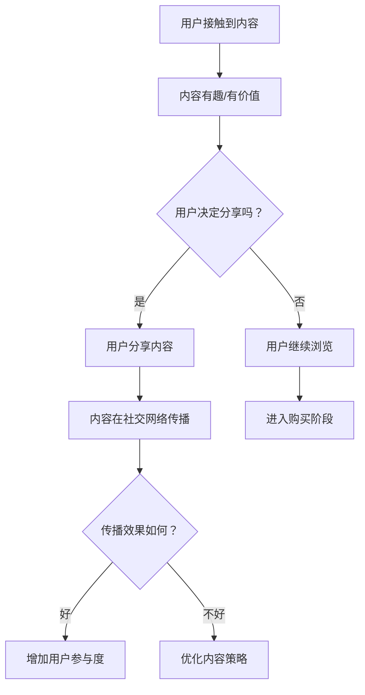

                 

### 《一人公司的病毒式营销：如何设计和执行低成本的传播策略》

病毒式营销（Viral Marketing）作为一种高效、低成本的营销策略，在全球范围内被广泛应用。特别是在一人公司（也被称为微型企业或独立创业者）中，病毒式营销成为了他们实现品牌传播和快速成长的重要手段。本文将详细探讨如何设计和执行低成本的病毒式营销策略，旨在为一人公司提供实用的指导和方法。

#### 关键词：
- 病毒式营销
- 低成本策略
- 一人公司
- 品牌传播
- 传播策略

#### 摘要：
本文将从病毒式营销的基础理论出发，深入探讨其核心要素、设计策略、执行方法以及案例分析。通过本文的阅读，读者将了解如何利用病毒式营销实现一人公司的低成本品牌传播，掌握有效的营销技巧，为公司的长期发展奠定基础。

### 第一部分：病毒式营销的基础理论

在深入探讨病毒式营销之前，我们需要对其基础理论进行详细阐述。病毒式营销的核心在于利用用户的社交网络进行自发传播，从而实现品牌的快速推广。以下是病毒式营销的一些基础概念和特点：

#### 1.1 什么是病毒式营销

病毒式营销是一种通过用户自发传播，迅速扩大品牌影响力的营销策略。它利用有趣、有价值或令人惊奇的内容，激发用户的分享欲望，从而在短时间内实现品牌的广泛传播。

#### 1.2 病毒式营销的特点

- **低成本**：病毒式营销主要依赖于用户的社交网络，减少了广告投放和营销成本。
- **高效性**：病毒式营销可以在短时间内实现品牌的快速传播，提高品牌知名度。
- **自主性**：病毒式营销依赖于用户的自主传播，减少了企业对传统广告渠道的依赖。
- **互动性**：病毒式营销强调用户参与，通过互动提高用户的忠诚度和品牌认知度。

#### 1.3 病毒式营销的原理

病毒式营销的原理可以归结为以下几个关键点：

1. **内容设计**：设计有趣、有价值或令人惊奇的内容，激发用户的分享欲望。
2. **社交网络**：利用用户的社交网络，实现内容的快速传播。
3. **激励机制**：通过奖励机制，鼓励用户分享和传播内容。
4. **数据分析**：通过对传播效果的数据分析，不断优化营销策略。

#### 1.4 病毒式营销的目标和效果衡量

病毒式营销的主要目标包括：

- **提高品牌知名度**：通过快速传播，提高品牌在目标受众中的认知度。
- **增加用户参与度**：通过互动和分享，提高用户的忠诚度和品牌认知度。
- **提升销售业绩**：通过病毒式营销，实现产品的快速销售和市场份额的提升。

衡量病毒式营销效果的关键指标包括：

- **分享次数**：衡量内容传播的广度。
- **参与度**：衡量用户对内容的互动程度，如点赞、评论、转发等。
- **转化率**：衡量病毒式营销对销售业绩的提升程度。
- **ROI（投资回报率）**：衡量营销投入的回报效果。

### 第二部分：病毒式营销的三大核心要素

病毒式营销的成功离不开其三大核心要素：趣味性、传播性和价值性。以下是这三个要素的详细阐述。

#### 2.1 趣味性

趣味性是病毒式营销的核心要素之一。有趣的内容能够激发用户的兴趣和好奇心，从而提高其分享欲望。趣味性可以通过以下几个方面来实现：

- **创意内容**：设计独特、创新的内容，打破常规，吸引目标受众的关注。
- **幽默元素**：加入幽默元素，提高内容的趣味性，增加用户的好感度。
- **互动体验**：提供互动体验，如小游戏、投票等，激发用户的参与欲望。

#### 2.2 传播性

传播性是病毒式营销的关键要素，决定了内容的传播速度和范围。传播性可以通过以下几个方面来实现：

- **社交网络**：利用社交网络平台的传播机制，实现内容的快速传播。
- **易于分享**：设计易于分享的内容，简化分享流程，降低用户分享的门槛。
- **激励机制**：通过奖励机制，鼓励用户分享内容，提高传播效果。

#### 2.3 价值性

价值性是病毒式营销的另一个关键要素，决定了用户是否愿意分享和传播内容。价值性可以通过以下几个方面来实现：

- **实用性**：提供实用、有价值的信息，满足用户的需求，增加其分享动力。
- **独特性**：提供独特的内容，与众不同，提高用户的好奇心和分享欲望。
- **情感共鸣**：触动用户的情感，引发共鸣，提高其分享意愿。

### 第三部分：核心概念与联系

为了更好地理解和应用病毒式营销，我们需要了解一些核心概念与联系。以下是一些重要的概念和它们之间的联系：

#### 3.1 营销漏斗模型

营销漏斗模型是一个描述潜在客户转化为实际销售过程的模型，包括以下阶段：

- **关注阶段**：用户对品牌产生兴趣，了解产品或服务。
- **兴趣阶段**：用户对产品或服务产生兴趣，开始搜索相关信息。
- **考虑阶段**：用户对多个竞争对手进行比较，考虑购买决策。
- **购买阶段**：用户做出购买决策，完成购买过程。

病毒式营销的目标是增加潜在客户的数量，提高购买阶段的转化率。

#### 3.2 用户生命周期

用户生命周期是指用户与品牌之间的互动过程，包括以下阶段：

- **新用户阶段**：用户首次接触品牌，了解产品或服务。
- **活跃用户阶段**：用户频繁使用产品或服务，产生忠诚度。
- **流失用户阶段**：用户逐渐减少使用产品或服务，可能失去对品牌的忠诚度。

病毒式营销的目标是吸引新用户，提高活跃用户比例，降低流失率。

#### 3.3 社交网络理论

社交网络理论是病毒式营销的重要理论基础，描述了用户在网络中的行为和传播机制。以下是一些关键概念：

- **社交网络**：用户之间的互动关系形成的网络。
- **传播路径**：信息在社交网络中的传播路径，决定了信息的传播速度和范围。
- **影响力**：用户在网络中的影响力，决定了其传播信息的能力。
- **社区效应**：用户在社区中的行为和决策受到其他用户的影响。

#### 3.4 Mermaid 流程图：病毒式营销的核心流程

以下是病毒式营销的核心流程的 Mermaid 流程图：

### 总结

病毒式营销是一种低成本、高效的品牌传播策略，特别适合一人公司和独立创业者。本文介绍了病毒式营销的基础理论、三大核心要素以及核心概念与联系。通过理解这些理论和概念，一人公司可以设计出有效的病毒式营销策略，实现品牌的快速传播和成长。

在接下来的章节中，我们将深入探讨病毒式营销的具体策略和执行方法，通过案例分析和实战技巧，帮助一人公司实现病毒式营销的成功。让我们继续深入探讨这一主题。

## 第4章：设计低成本的传播策略

病毒式营销的核心在于设计出能够激发用户分享欲望的低成本策略。在这一章中，我们将详细探讨如何制定营销目标、确定目标受众、制定创意策略、设计内容以及选择传播渠道。

### 4.1 制定营销目标

制定明确的营销目标是病毒式营销成功的第一步。营销目标应当具体、可衡量，并符合公司整体战略。以下是制定营销目标时需要考虑的几个关键点：

- **品牌知名度**：提高品牌在目标市场中的知名度，使更多的潜在客户了解品牌。
- **用户参与度**：鼓励用户参与互动，如点赞、评论、转发等，提高品牌的用户黏性。
- **销售转化**：通过病毒式营销直接推动产品销售，提升销售额。
- **客户获取**：增加新客户的数量，扩大市场份额。

例如，一家小型电商公司可能设定以下营销目标：

- **提高品牌知名度**：在接下来三个月内，将品牌知名度提升30%。
- **用户参与度**：在社交媒体上增加50%的点赞和评论数量。
- **销售转化**：通过病毒式营销实现销售额增长40%。
- **客户获取**：在接下来六个月内，增加5000名新客户。

### 4.2 确定目标受众

明确目标受众是病毒式营销策略设计的重要环节。了解目标受众的特征、需求和行为习惯，有助于制定更具针对性的传播策略。以下是确定目标受众时需要考虑的几个关键点：

- **年龄、性别和地理位置**：目标受众的年龄、性别和地理位置有助于确定传播渠道和内容风格。
- **兴趣爱好和消费习惯**：了解目标受众的兴趣爱好和消费习惯，有助于设计更符合其需求的内容。
- **社交网络行为**：分析目标受众在社交网络上的行为习惯，如常用的平台、发布内容的时间等。

例如，一家专注于健康食品的小型电商公司可能将以下人群作为目标受众：

- **年龄**：25-45岁的职场人士。
- **性别**：女性。
- **地理位置**：一线城市和新兴二线城市。
- **兴趣爱好**：关注健康饮食、健身和养生。
- **消费习惯**：注重产品品质和营养价值，愿意为健康投资。

### 4.3 创意策略制定

创意策略是病毒式营销成功的关键。一个出色的创意能够吸引目标受众的注意力，激发其分享欲望。以下是制定创意策略时需要考虑的几个关键点：

- **独特性**：创意需要与众不同，能够引起目标受众的兴趣和好奇心。
- **相关性**：创意需要与品牌和产品密切相关，确保用户能够理解和接受。
- **趣味性**：创意需要有趣，能够吸引用户的注意力并产生共鸣。
- **易分享性**：创意需要易于分享，简化分享流程，降低用户分享的门槛。

例如，一家专注于智能家居产品的小型电商公司可能采取以下创意策略：

- **独特性**：推出“智能生活挑战”，邀请用户分享他们的智能生活场景。
- **相关性**：与智能家居产品相关，展示产品的实际应用场景。
- **趣味性**：通过搞笑、有趣的视频和图文内容，吸引用户参与。
- **易分享性**：提供一键分享功能，鼓励用户在社交网络上分享。

### 4.4 内容设计

内容设计是病毒式营销的核心。一个优秀的病毒式内容能够引起用户的共鸣，激发其分享欲望。以下是设计内容时需要考虑的几个关键点：

- **价值性**：内容需要具有价值，满足用户的需求或提供有用的信息。
- **易读性**：内容需要简单易懂，避免使用复杂的专业术语。
- **视觉吸引力**：使用图片、视频等多媒体元素，提高内容的视觉吸引力。
- **互动性**：设计互动元素，如问答、投票等，提高用户的参与度。

例如，一家专注于健康饮品的小型电商公司可能设计以下内容：

- **价值性**：发布关于健康饮品的科普文章，提供健康饮食建议。
- **易读性**：使用简洁明了的文字，避免使用复杂的术语。
- **视觉吸引力**：使用高质量的图片和视频，展示产品的外观和口感。
- **互动性**：在文章中插入问答环节，鼓励用户提问和评论。

### 4.5 渠道选择

选择合适的传播渠道是病毒式营销成功的关键。不同的渠道具有不同的传播效果和受众特点，需要根据目标受众和创意策略进行选择。以下是选择传播渠道时需要考虑的几个关键点：

- **社交网络**：选择目标受众常用的社交网络平台，如微信、微博、抖音等。
- **内容平台**：选择适合内容形式的内容平台，如博客、YouTube、B站等。
- **合作伙伴**：与其他品牌或KOL（意见领袖）合作，扩大传播范围。

例如，一家专注于健身装备的小型电商公司可能选择以下渠道：

- **社交网络**：在微信和微博上发布健身知识和装备推荐，利用图文和短视频提高用户参与度。
- **内容平台**：在YouTube上发布健身教程和装备评测，吸引全球健身爱好者。
- **合作伙伴**：与健身KOL合作，通过他们的社交媒体账号推广产品。

### 总结

设计低成本的病毒式营销策略是成功实现品牌传播的关键。通过制定明确的营销目标、确定目标受众、制定创意策略、设计内容和选择传播渠道，一人公司可以有效地实现低成本的品牌传播。在接下来的章节中，我们将探讨病毒式营销的具体执行方法和实战技巧，帮助读者将理论知识转化为实际操作。

## 第5章：实施病毒式营销

在明确了病毒式营销策略之后，下一步便是将其付诸实践。实施病毒式营销需要精心策划和执行，以下我们将详细讨论如何进行初始推广、用户激励、营销监测与优化，以及持续迭代。

### 5.1 初始推广

初始推广是病毒式营销成功的关键步骤，它为内容的传播奠定了基础。以下是进行初始推广时需要考虑的几个关键点：

- **选择适当的时机**：确定推广的最佳时间，以最大化用户的参与度和传播效果。例如，针对节假日或特定事件进行推广，可以提高用户的关注度和参与度。
- **利用社交媒体**：利用社交媒体平台进行推广，可以通过发布图文、视频、直播等形式，吸引用户的注意力。例如，在微信朋友圈、微博、抖音等平台上发布引人入胜的内容，鼓励用户点赞、评论和分享。
- **内容优化**：优化内容，使其更具吸引力，例如通过添加有趣的动画、视频或互动元素，提高用户的参与度。
- **关键词优化**：在社交媒体内容中使用热门关键词，提高内容在搜索引擎和社交媒体平台上的曝光率。

例如，一家初创公司可以制定以下初始推广计划：

- **选择适当的时机**：在春节假期期间发布关于健康饮品的优惠活动，吸引消费者的关注。
- **利用社交媒体**：在微信朋友圈发布优惠活动海报，并附上二维码，鼓励用户扫码了解更多。
- **内容优化**：在抖音上发布健康饮品的制作教程和用户体验视频，增加内容吸引力。
- **关键词优化**：在社交媒体内容中使用“健康饮品”、“春节优惠”等关键词，提高搜索曝光率。

### 5.2 用户激励

用户激励是病毒式营销的重要手段，通过提供奖励和激励措施，鼓励用户参与和分享内容。以下是进行用户激励时需要考虑的几个关键点：

- **奖励机制**：设计吸引人的奖励机制，例如提供优惠券、免费产品、积分等，激励用户参与和分享。
- **个性化激励**：根据用户的兴趣和行为，提供个性化的激励措施，提高用户的参与度和忠诚度。
- **互动式激励**：通过互动式奖励，如抽奖、竞赛等，增加用户的参与度和乐趣。
- **及时反馈**：及时对用户的参与和分享给予反馈，增强用户的成就感和归属感。

例如，一家电商公司可以制定以下用户激励计划：

- **奖励机制**：为购买指定商品的客户提供折扣优惠券，鼓励用户分享购买体验。
- **个性化激励**：根据用户的购买历史和兴趣，发送个性化的推荐邮件和优惠信息。
- **互动式激励**：举办“分享有奖”活动，鼓励用户在社交媒体上分享产品体验和图片。
- **及时反馈**：在用户分享内容后，及时回复并感谢用户的参与，增强用户归属感。

### 5.3 营销监测与优化

病毒式营销的成功离不开有效的监测与优化。通过实时监测和数据分析，可以及时了解营销活动的效果，并进行相应调整。以下是进行营销监测与优化时需要考虑的几个关键点：

- **关键指标监测**：设定关键指标（KPI），如分享次数、点赞数量、评论数量、转发次数、参与度等，实时监控营销活动的效果。
- **数据分析**：对用户行为和传播效果进行深入分析，找出影响传播效果的关键因素，为优化策略提供依据。
- **A/B测试**：通过A/B测试，比较不同营销策略的效果，选择最优策略。
- **持续优化**：根据监测和数据分析结果，持续优化营销内容和策略，提高传播效果。

例如，一家初创公司可以制定以下监测与优化计划：

- **关键指标监测**：监测社交媒体上的分享次数、点赞数量和评论数量，评估内容受欢迎程度。
- **数据分析**：分析用户行为数据，如分享时间、分享渠道、用户年龄和性别等，找出最有效的传播渠道和时间。
- **A/B测试**：对比不同版本的推广内容，如不同标题、不同图片等，选择转化率最高的版本。
- **持续优化**：根据监测结果，调整内容策略，提高用户的参与度和分享意愿。

### 5.4 持续迭代

病毒式营销是一个动态的过程，需要不断迭代和优化。通过持续迭代，可以不断提高营销策略的有效性和用户满意度。以下是进行持续迭代时需要考虑的几个关键点：

- **用户反馈**：收集用户反馈，了解用户的真实需求和意见，不断改进产品和服务。
- **技术更新**：紧跟技术发展趋势，采用新的营销工具和技术，提高营销效率。
- **内容创新**：不断创新内容形式和内容主题，保持内容的吸引力。
- **战略调整**：根据市场环境和用户需求的变化，调整营销目标和策略。

例如，一家初创公司可以制定以下迭代计划：

- **用户反馈**：定期进行用户满意度调查，收集用户对产品和服务的新需求和改进意见。
- **技术更新**：引入新的社交媒体平台和营销工具，提高营销效果。
- **内容创新**：定期推出新的主题和活动，吸引不同类型的用户参与。
- **战略调整**：根据市场变化和用户需求，调整营销目标和策略，确保营销活动的持续有效性。

### 总结

实施病毒式营销需要精心策划和执行，从初始推广到用户激励，再到营销监测与优化，以及持续迭代，每个环节都至关重要。通过合理规划和持续优化，一人公司可以实现低成本的品牌传播和快速成长。在接下来的章节中，我们将通过具体案例分析，进一步探讨病毒式营销的实战技巧和成功经验。

## 第6章：病毒式营销的案例分析

为了更好地理解和应用病毒式营销策略，本章节将结合实际案例，分析一些成功的一人公司如何运用病毒式营销策略实现品牌传播和增长。

### 6.1 案例一：小米的病毒式营销策略

小米（Xiaomi）是一家全球知名的手机和电子产品制造商，其病毒式营销策略在全球范围内取得了巨大成功。以下是小米病毒式营销的一些成功要素：

1. **高性价比**：小米以高性价比的产品吸引了大量用户，满足了消费者对高质量产品价格敏感的需求。
2. **社交媒体互动**：小米通过微博、微信等社交媒体平台，与用户保持密切互动，收集用户反馈，不断优化产品和服务。
3. **小米社区**：小米建立了自己的社区，鼓励用户分享使用体验和创意，形成了强大的用户社群。
4. **饥饿营销**：小米采用饥饿营销策略，通过限量发售和限时抢购，激发了用户的购买热情和分享欲望。

**分析**：
- **核心要素**：高性价比、社交媒体互动、小米社区、饥饿营销。
- **成功经验**：小米通过高性价比和社交媒体互动，成功吸引了大量用户。小米社区和饥饿营销策略则进一步激发了用户的参与和分享欲望，实现了品牌的快速传播和增长。

### 6.2 案例二：杜蕾斯的病毒式营销案例

杜蕾斯（Durex）是全球领先的避孕套品牌，其病毒式营销策略在社交媒体上取得了显著成效。以下是杜蕾斯病毒式营销的一些成功要素：

1. **创意内容**：杜蕾斯通过幽默、性感的内容，吸引了大量用户的关注和分享。例如，其与节日相关的创意海报和互动活动，在社交媒体上引发了广泛的讨论和传播。
2. **合作营销**：杜蕾斯与各大品牌和意见领袖合作，共同推出创意活动，扩大了品牌的曝光度和影响力。
3. **情感共鸣**：杜蕾斯的内容往往能够触动用户的情感，引发共鸣，提高用户的参与度和忠诚度。
4. **新媒体应用**：杜蕾斯积极运用各种新媒体平台，如微博、微信、抖音等，实现内容的快速传播。

**分析**：
- **核心要素**：创意内容、合作营销、情感共鸣、新媒体应用。
- **成功经验**：杜蕾斯通过创意内容和合作营销，成功吸引了大量用户关注。情感共鸣和新媒体应用则进一步增强了品牌的用户黏性和传播效果。

### 6.3 案例三：Airbnb的病毒式营销策略

Airbnb（爱彼迎）是一家全球领先的民宿预订平台，其病毒式营销策略在短时间内实现了品牌的全球传播。以下是Airbnb病毒式营销的一些成功要素：

1. **用户口碑**：Airbnb通过用户口碑和推荐，吸引了大量新用户。用户的真实体验和好评成为了最佳的宣传素材。
2. **创意宣传**：Airbnb推出了多个创意宣传活动，如“住宿体验分享”和“房源展示”，激发了用户的参与和分享欲望。
3. **社交媒体互动**：Airbnb通过社交媒体平台与用户互动，收集用户反馈，不断优化产品和服务。
4. **内容营销**：Airbnb发布了一系列高质量的内容，如旅行故事、文化介绍等，吸引了大量用户关注。

**分析**：
- **核心要素**：用户口碑、创意宣传、社交媒体互动、内容营销。
- **成功经验**：Airbnb通过用户口碑和创意宣传，成功吸引了大量新用户。社交媒体互动和内容营销则进一步增强了品牌的用户黏性和传播效果。

### 6.4 案例分析总结

从以上案例可以看出，病毒式营销的成功离不开以下几个关键要素：

1. **高性价比**：提供具有竞争力的产品或服务，满足用户的实际需求。
2. **创意内容**：设计有趣、有价值或令人惊奇的内容，激发用户的分享欲望。
3. **社交媒体互动**：积极与用户互动，收集用户反馈，不断优化产品和服务。
4. **合作营销**：与其他品牌或意见领袖合作，扩大品牌的曝光度和影响力。
5. **情感共鸣**：触动用户的情感，引发共鸣，提高用户的参与度和忠诚度。
6. **新媒体应用**：积极运用各种新媒体平台，实现内容的快速传播。

通过深入分析这些成功案例，一人公司可以借鉴其经验，制定出适合自己的病毒式营销策略，实现品牌的快速传播和成长。

### 总结

病毒式营销的成功离不开创意、互动和用户口碑。通过分析小米、杜蕾斯和Airbnb等成功案例，我们可以看到，高性价比、创意内容、社交媒体互动、合作营销和情感共鸣是病毒式营销成功的关键要素。一人公司可以借鉴这些经验，制定出适合自己的营销策略，实现低成本的品牌传播和快速增长。在接下来的章节中，我们将进一步探讨病毒式营销的执行技巧和优化方法，帮助读者将理论知识应用于实际操作。

## 第7章：病毒式营销的执行技巧

病毒式营销的成功不仅依赖于创意和策略，还需要高效的执行技巧。在这一章中，我们将深入探讨如何设定阶段性目标、优化营销文案、增强社交媒体互动以及建立用户反馈机制，以确保病毒式营销策略的顺利实施和持续优化。

### 7.1 阶段性目标设定

在病毒式营销的实施过程中，设定明确的阶段性目标是至关重要的。阶段性目标不仅有助于指导营销活动，还可以帮助评估策略的有效性。以下是设定阶段性目标时需要考虑的几个关键点：

1. **具体性**：目标应当具体、可衡量，例如“增加50%的社交媒体分享次数”或“提高20%的网站流量”。
2. **相关性**：目标应与营销目标和公司战略密切相关，确保所有努力都能为公司的长期发展做出贡献。
3. **可行性**：目标应当是可行的，同时具有挑战性，以激发团队的积极性和创造力。
4. **时限性**：为每个目标设定明确的时限，以便于监控进度和及时调整策略。

例如，一家初创公司可以设定以下阶段性目标：

- **第一阶段（1个月内）**：增加20%的社交媒体关注者，提高30%的网站访问量。
- **第二阶段（3个月内）**：增加50%的社交媒体分享次数，提高40%的转化率。
- **第三阶段（6个月内）**：扩大市场份额，提高50%的品牌知名度。

### 7.2 优化营销文案

营销文案是病毒式营销的核心，它直接影响到用户的参与度和传播效果。以下是优化营销文案时需要考虑的几个关键点：

1. **简洁明了**：文案应当简洁明了，避免使用复杂的术语和冗长的句子，确保用户能够快速理解。
2. **突出卖点**：明确突出产品或服务的独特卖点，吸引用户的注意力。
3. **情感共鸣**：运用情感元素，引发用户的共鸣，提高用户的参与度。
4. **易于分享**：设计易于分享的文案，简化分享流程，降低用户分享的门槛。

以下是一个优化前的营销文案示例：

**优化前**：我们的产品具有高性能和可靠性，是市场上性价比最高的选择。

**优化后**：告别繁琐，一触即达！我们推出的一款高性能产品，不仅可靠，而且价格实惠，让你轻松享受高品质生活！

通过优化，文案变得更加简洁明了，同时突出了产品的卖点，并引发了用户的共鸣。

### 7.3 增强社交媒体互动

社交媒体互动是病毒式营销的重要组成部分，它能够有效提高用户的参与度和忠诚度。以下是增强社交媒体互动时需要考虑的几个关键点：

1. **定期互动**：定期发布高质量的内容，与用户保持互动，提高用户的关注度和活跃度。
2. **互动性内容**：设计互动性强的内容，如问答、投票、直播等，鼓励用户参与和分享。
3. **用户参与奖励**：提供用户参与奖励，如优惠券、免费试用等，激励用户积极参与。
4. **实时响应**：及时回复用户的评论和私信，展示对用户的关注和尊重。

以下是一个增强社交媒体互动的策略示例：

- **定期互动**：每周发布一篇关于产品或行业动态的文章，并附上相关图片和视频，吸引用户关注。
- **互动性内容**：每月举办一次线上问答活动，邀请用户提问，并给予优秀问题奖励。
- **用户参与奖励**：发布新产品的限时优惠信息，邀请用户转发并留言，赠送优惠券。
- **实时响应**：设置专门的社交媒体客服团队，确保在24小时内回复用户的评论和私信。

### 7.4 用户反馈机制

建立有效的用户反馈机制是病毒式营销的重要环节，它能够帮助企业了解用户需求，不断优化产品和服务。以下是建立用户反馈机制时需要考虑的几个关键点：

1. **多渠道反馈**：提供多种渠道供用户反馈，如在线表单、社交媒体评论、电子邮件等，方便用户表达意见。
2. **及时响应**：对用户反馈进行及时响应，展示对用户意见的重视，提高用户满意度。
3. **数据分析**：对用户反馈进行系统分析，识别用户关注的热点和问题，为产品优化和策略调整提供依据。
4. **公开透明**：公开透明地回应用户反馈，展示企业的责任感和透明度，增强用户信任。

以下是一个用户反馈机制的示例：

- **多渠道反馈**：在官网、社交媒体和客服中心提供在线反馈表单，方便用户随时提交意见。
- **及时响应**：客服团队在收到用户反馈后，2小时内给予初步回应，并在7个工作日内提供详细解决方案。
- **数据分析**：定期汇总用户反馈，分析用户关注的问题，制定改进计划。
- **公开透明**：在官方网站和社交媒体上公开用户反馈的解决情况，展示企业的透明度和责任感。

### 总结

病毒式营销的成功离不开高效的执行技巧。通过设定阶段性目标、优化营销文案、增强社交媒体互动以及建立用户反馈机制，一人公司可以确保病毒式营销策略的顺利实施和持续优化。在接下来的章节中，我们将进一步探讨病毒式营销的优化与提升，帮助读者不断改进策略，实现更高效的传播效果。

## 第8章：病毒式营销的优化与提升

病毒式营销的优化与提升是确保营销策略持续有效的重要环节。通过数据分析、营销自动化工具的应用、持续改进与优化以及风险管理与应对，一人公司可以不断提升病毒式营销的效果，实现品牌传播的最大化。

### 8.1 数据分析

数据分析是病毒式营销优化的重要手段。通过对用户行为和传播效果的数据分析，可以深入了解营销活动的效果，为策略调整提供依据。以下是进行数据分析时需要考虑的几个关键点：

1. **关键指标**：设定关键指标（KPI），如点击率（CTR）、分享次数、参与度、转化率等，用于衡量营销活动的效果。
2. **数据收集**：利用各种数据分析工具，如Google Analytics、社交媒体分析工具等，收集用户行为和传播效果的数据。
3. **数据可视化**：通过数据可视化工具，如图表、仪表板等，将数据转化为直观的视觉信息，便于分析和决策。
4. **趋势分析**：分析数据趋势，识别哪些策略和内容最有效，为后续营销活动提供参考。

以下是一个数据分析的示例：

- **关键指标**：设定点击率（CTR）和转化率（CVR）为关键指标，用于衡量社交媒体广告的效果。
- **数据收集**：使用Google Analytics收集用户点击和转化的数据。
- **数据可视化**：通过图表展示点击率和转化率的变化趋势，识别最佳广告内容和时间段。
- **趋势分析**：根据数据分析结果，优化广告内容和发布时间，提高点击率和转化率。

### 8.2 营销自动化工具应用

营销自动化工具可以显著提高病毒式营销的效率和效果。通过自动化工具，可以简化营销流程，提高用户参与度和转化率。以下是应用营销自动化工具时需要考虑的几个关键点：

1. **邮件营销**：利用邮件自动化工具，发送个性化的邮件，提高用户参与度和忠诚度。
2. **社交媒体管理**：自动化发布和回复社交媒体内容，提高社交媒体互动的效率和效果。
3. **客户细分**：通过客户数据自动化分析，细分用户群体，为不同用户群体提供定制化的营销策略。
4. **客户关系管理**：自动化跟踪客户互动历史，提供个性化的服务和推荐。

以下是一个营销自动化工具应用的示例：

- **邮件营销**：使用Mailchimp等自动化邮件营销工具，根据用户的兴趣和购买历史，发送个性化的产品推荐和促销邮件。
- **社交媒体管理**：使用Hootsuite等社交媒体管理工具，自动化发布和监控社交媒体内容，提高用户互动率。
- **客户细分**：利用Customer.io等客户细分工具，根据用户的浏览和购买行为，将用户划分为不同的细分群体，为每个群体提供定制化的营销内容。
- **客户关系管理**：使用HubSpot等客户关系管理工具，自动化跟踪客户互动历史，提供个性化的服务和建议。

### 8.3 持续改进与优化

病毒式营销的成功需要不断改进和优化。通过定期评估营销策略和效果，及时调整和改进，可以持续提升营销效果。以下是持续改进与优化时需要考虑的几个关键点：

1. **定期评估**：定期评估营销活动的效果，识别成功和失败的原因，为后续营销活动提供参考。
2. **用户反馈**：收集用户反馈，了解用户需求和意见，及时调整营销策略和内容。
3. **数据分析**：利用数据分析结果，识别有效的营销策略和内容，不断优化和改进。
4. **迭代优化**：根据评估和反馈结果，进行迭代优化，不断改进营销策略和执行方法。

以下是一个持续改进与优化的示例：

- **定期评估**：每季度评估病毒式营销活动的效果，识别哪些策略和内容最有效。
- **用户反馈**：通过社交媒体和客户调查收集用户反馈，了解用户的需求和意见。
- **数据分析**：利用数据分析结果，优化广告投放和内容发布策略，提高用户参与度和转化率。
- **迭代优化**：根据评估和反馈结果，进行策略调整和内容优化，持续提升营销效果。

### 8.4 风险管理与应对

病毒式营销虽然具有低成本和高效传播的优势，但也存在一定的风险。有效管理和应对这些风险是确保营销活动顺利进行的关键。以下是风险管理与应对时需要考虑的几个关键点：

1. **内容审核**：确保营销内容符合法律法规和道德规范，避免引发法律纠纷或负面影响。
2. **数据安全**：保护用户数据的安全和隐私，避免数据泄露或滥用。
3. **舆情监控**：实时监控社交媒体上的舆情动态，及时发现和处理负面信息，维护品牌形象。
4. **应急响应**：制定应急预案，应对突发情况和负面事件，确保营销活动的正常进行。

以下是一个风险管理与应对的示例：

- **内容审核**：在发布营销内容前，进行严格的内容审核，确保内容合法合规。
- **数据安全**：使用加密技术和安全协议，保护用户数据的安全和隐私。
- **舆情监控**：使用社交媒体监测工具，实时监控社交媒体上的舆情动态，及时发现和处理负面信息。
- **应急响应**：制定应急预案，如网络攻击、负面报道等，确保营销活动的正常进行。

### 总结

病毒式营销的优化与提升是确保营销策略持续有效的重要环节。通过数据分析、营销自动化工具应用、持续改进与优化以及风险管理与应对，一人公司可以不断提升病毒式营销的效果，实现品牌传播的最大化。在接下来的章节中，我们将探讨病毒式营销的未来趋势，为读者提供更广阔的视角和思考。

## 第9章：病毒式营销的未来趋势

随着科技的不断进步和社交媒体的日益普及，病毒式营销也在不断演变，呈现出一些新的趋势。了解这些趋势对于一人公司来说至关重要，因为它们不仅能够指导当前的营销策略，还能够为未来的发展提供方向。以下是病毒式营销的未来趋势：

### 9.1 技术革新对病毒式营销的影响

1. **人工智能（AI）**：人工智能技术可以自动生成内容和优化营销策略，提高病毒式营销的效率和效果。例如，AI可以根据用户行为和偏好，生成个性化的营销内容，提高用户的参与度和转化率。
2. **大数据分析**：大数据分析技术可以帮助企业更深入地了解用户需求和市场趋势，从而制定更精准的病毒式营销策略。通过分析海量数据，企业可以识别高价值用户群体，并针对性地进行营销。
3. **增强现实（AR）和虚拟现实（VR）**：AR和VR技术可以为用户带来沉浸式的体验，提高病毒式营销的趣味性和互动性。例如，通过AR技术，用户可以在社交媒体上体验虚拟产品，从而增加购买意愿。

### 9.2 新兴营销渠道

1. **短视频平台**：如抖音（TikTok）和快手（Kwai）等短视频平台的兴起，为病毒式营销提供了新的机会。短视频具有高传播性和互动性，能够迅速吸引用户的关注和参与。
2. **直播电商**：直播电商作为一种新兴的营销渠道，正在迅速崛起。通过直播，品牌可以直接与用户互动，展示产品，并实时回答用户的问题，从而提高用户的参与度和购买率。
3. **社交媒体渠道**：随着社交媒体的多样化，如微信、微博、Instagram等平台的影响力日益增强。企业需要灵活运用这些平台，制定多样化的营销策略，以覆盖更多的目标受众。

### 9.3 病毒式营销的可持续发展

1. **内容质量**：随着用户对内容质量的重视，病毒式营销需要更加注重内容的质量和创新。高质量的内容不仅能够吸引用户的关注，还能够提高品牌的声誉和影响力。
2. **用户参与**：病毒式营销的成功离不开用户的参与。企业需要不断创新互动方式，提高用户的参与度和忠诚度，从而实现品牌的长期可持续发展。
3. **社会责任**：随着消费者对社会责任的关注日益增加，病毒式营销也需要更加注重社会责任。通过关注社会热点和公益事业，企业可以提升品牌的形象和社会价值，赢得用户的信任和支持。

### 9.4 社交网络平台的演变

1. **平台算法**：社交网络平台的算法不断进化，使得病毒式营销策略需要不断调整以适应新的算法规则。例如，Facebook的算法更注重内容的质量和互动性，而Twitter的算法则更注重内容的时效性和相关性。
2. **平台生态**：随着社交网络平台的不断演变，形成了更加多元化的生态。例如，微信生态涵盖了公众号、小程序、朋友圈等多个场景，为企业提供了更多的营销机会和渠道。

### 总结

病毒式营销的未来充满了机遇和挑战。通过把握技术革新、新兴营销渠道以及可持续发展的趋势，一人公司可以不断提升营销效果，实现品牌传播的最大化。在未来的营销实践中，企业需要不断创新和适应，以应对不断变化的市场环境。了解和把握这些趋势，将为一人公司的病毒式营销提供有力的指导和支持。

### 附录

#### 附录 A：病毒式营销工具与资源

在实施病毒式营销的过程中，使用合适的工具和资源可以显著提高效率和效果。以下是一些主流的病毒式营销工具和资源，供读者参考：

##### A.1 主流病毒式营销工具

1. **Google Analytics**：一款强大的数据分析工具，可以帮助企业深入了解用户行为和营销效果。
2. **Mailchimp**：一款功能全面的电子邮件营销工具，适用于发送个性化邮件和自动化营销。
3. **Hootsuite**：一款社交媒体管理工具，可以自动化发布和管理社交媒体内容。
4. **Buffer**：一款社交媒体管理工具，提供内容计划和发布功能，有助于优化社交媒体策略。
5. **Canva**：一款设计工具，可以帮助创建吸引人的视觉内容，如海报、图片等。
6. **Trello**：一款项目管理工具，可以帮助团队协作和跟踪项目进度。

##### A.2 病毒式营销资源网站

1. **Viral Blog**：一个提供病毒式营销策略和案例研究的博客，涵盖多种行业和领域。
2. **Viral List**：一个收集病毒式营销案例和资源的网站，提供丰富的病毒式营销灵感。
3. **Viral Marketing Hub**：一个关于病毒式营销的综合性资源网站，包括策略、工具和案例分析。
4. **HubSpot**：一个提供营销资源和工具的网站，包括营销博客、白皮书和在线课程等。
5. **Content Marketing Institute**：一个专注于内容营销的权威机构，提供丰富的营销资源和最佳实践。

##### A.3 病毒式营销书籍推荐

1. **《病毒式营销》（Viral Marketing）**：作者：Seth Godin。这本书详细介绍了病毒式营销的理论和实践，是病毒式营销的经典之作。
2. **《内容营销》（Content Inc.）**：作者：Joe Pulizzi。这本书探讨了如何通过内容营销建立品牌和影响力，适用于希望运用病毒式营销策略的企业和个人。
3. **《社交网络营销》（Social Media Marketing）**：作者：Kaplan和Holcomb。这本书全面介绍了社交网络营销的策略和方法，包括病毒式营销的实践案例。
4. **《影响力》（Influence）**：作者：Robert Cialdini。这本书分析了人类行为的六大影响力因素，为病毒式营销提供了心理学基础。

通过使用这些工具和资源，一人公司可以更好地设计和执行病毒式营销策略，实现品牌的快速传播和成长。希望这些推荐能够为读者的营销实践提供有益的参考和支持。

### 作者信息

作者：AI天才研究院/AI Genius Institute & 禅与计算机程序设计艺术 /Zen And The Art of Computer Programming

本文由AI天才研究院和禅与计算机程序设计艺术共同撰写，旨在为读者提供关于病毒式营销的全面、深入的指导。AI天才研究院专注于人工智能和计算机科学的研究与应用，致力于推动科技创新和行业发展。禅与计算机程序设计艺术则通过哲学和技术的结合，探索计算机编程的智慧与艺术。我们希望通过本文，帮助读者掌握病毒式营销的核心理论和实战技巧，实现品牌传播和业务增长。如果您对病毒式营销有任何疑问或建议，欢迎随时与我们联系。感谢您的阅读！

