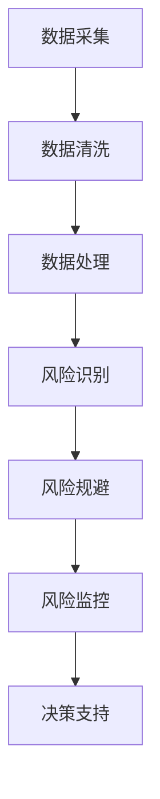

                 

### 《一人公司的风险管理：AI如何帮助识别和规避风险》

**关键词：** 一人公司、风险管理、人工智能、风险识别、风险规避、AI应用

**摘要：** 随着全球商业环境的不断变化，一人公司面临着复杂多变的风险挑战。本文通过深入分析一人公司的特点和面临的风险类型，探讨了人工智能（AI）在风险管理中的应用。文章详细介绍了AI在风险识别和风险规避中的原理、应用和实践，以及AI驱动的风险管理系统的架构设计。最后，文章总结了AI在风险管理中的价值与局限性，并对未来发展趋势进行了展望。

### 第一部分：引言

#### 第1章：一人公司的背景与挑战

##### 1.1 一人公司的定义与特点

一人公司，顾名思义，是由单一个体（通常是个人）创立和运营的公司。这种公司形式在现代社会中越来越普遍，尤其是在科技创业领域。一人公司的特点包括：

1. **所有权与经营权合一**：一人公司的所有者和经营者通常是同一人，这意味着决策速度快、执行力强。
2. **灵活性高**：由于决策集中，一人公司能够迅速适应市场变化，灵活调整经营策略。
3. **规模较小**：一人公司通常规模较小，资源有限，因此在市场竞争中面临较大压力。

##### 1.2 一人公司面临的风险类型

一人公司在运营过程中，可能会面临多种类型的风险，包括：

1. **市场风险**：市场变化快，需求不稳定，可能导致产品销售不畅。
2. **财务风险**：现金流不稳定，融资困难，可能导致公司运营受阻。
3. **法律风险**：法律法规变化，可能对公司运营产生影响。
4. **技术风险**：技术更新快，可能面临技术落后、创新能力不足等问题。
5. **运营风险**：内部管理不规范，可能引发内部纠纷或运营问题。

##### 1.3 AI在风险管理中的应用前景

人工智能在风险管理中具有广泛的应用前景。通过大数据分析和机器学习算法，AI可以：

1. **风险识别**：从大量数据中识别潜在风险，提高风险预警能力。
2. **风险预测**：通过历史数据分析，预测未来可能发生的风险。
3. **风险规避**：提供智能决策支持，帮助公司规避风险。
4. **优化管理**：自动化风险控制流程，提高管理效率。

### 第二部分：AI与风险管理

#### 第2章：AI在风险管理中的基本概念

##### 2.1 AI的基本原理与应用

人工智能（AI）是一种模拟人类智能的技术，通过算法和计算模型实现机器的自我学习和决策能力。AI的基本原理包括：

1. **机器学习**：通过数据训练模型，使机器能够识别模式和做出决策。
2. **深度学习**：基于神经网络结构，对复杂问题进行深度学习。
3. **自然语言处理**：使计算机理解和生成自然语言。
4. **计算机视觉**：使计算机理解和处理图像和视频。

AI的应用领域非常广泛，包括语音识别、图像识别、智能客服、自动驾驶等。

##### 2.2 风险管理的核心概念

风险管理是指通过对风险进行识别、评估、控制和监控，以最小化风险对公司的影响。核心概念包括：

1. **风险识别**：识别公司可能面临的风险。
2. **风险评估**：评估风险的严重性和可能性。
3. **风险控制**：采取措施降低风险。
4. **风险监控**：持续监控风险的变化，及时调整风险控制措施。

##### 2.3 AI与风险管理的结合点

AI与风险管理的结合点主要体现在以下几个方面：

1. **数据分析**：AI可以通过大数据分析，识别潜在风险。
2. **模式识别**：AI可以通过机器学习和深度学习，发现数据中的模式，预测风险。
3. **自动化决策**：AI可以自动化风险控制流程，提高决策效率。
4. **智能监控**：AI可以实时监控风险变化，提供预警和应对建议。

### 第三部分：AI在风险识别中的应用

#### 第3章：AI在风险识别中的原理

##### 3.1 数据分析基础

数据分析是AI在风险识别中的基础。数据分析包括以下几个步骤：

1. **数据收集**：收集与公司运营相关的数据，如财务数据、市场数据、技术数据等。
2. **数据清洗**：对收集到的数据进行清洗，去除重复数据、异常数据等。
3. **数据预处理**：将数据转换为适合模型输入的格式，如数值化、归一化等。
4. **特征选择**：选择对风险识别最有影响的数据特征。

##### 3.2 机器学习算法在风险识别中的应用

机器学习算法是AI在风险识别中的核心工具。常用的机器学习算法包括：

1. **监督学习**：通过已标记的数据训练模型，用于预测未知数据的风险。
   - **分类算法**：如逻辑回归、决策树、随机森林、支持向量机等。
   - **回归算法**：如线性回归、岭回归、LASSO回归等。
2. **无监督学习**：通过未标记的数据发现数据中的模式和规律。
   - **聚类算法**：如K-均值聚类、层次聚类等。
   - **降维算法**：如主成分分析（PCA）、t-SNE等。

##### 3.3 深度学习在风险识别中的角色

深度学习是AI的重要分支，尤其在风险识别中发挥着关键作用。深度学习通过神经网络结构对大量数据进行训练，能够自动提取特征，提高风险识别的准确性。常用的深度学习模型包括：

1. **卷积神经网络（CNN）**：主要用于图像识别，也可用于识别图像中的风险信号。
2. **循环神经网络（RNN）**：用于处理序列数据，如时间序列数据，可用于预测风险。
3. **生成对抗网络（GAN）**：通过生成数据和真实数据进行对抗训练，提高模型对风险识别的鲁棒性。

### 第四部分：AI在风险规避中的应用

#### 第5章：AI在风险规避中的策略

##### 5.1 风险规避的基本策略

风险规避是指通过采取一系列措施，减少或消除风险对公司的影响。基本策略包括：

1. **风险避免**：通过改变公司运营方式，避免风险。
2. **风险减少**：通过采取预防措施，减少风险发生的可能性或降低风险的影响。
3. **风险转移**：通过保险或其他方式将风险转移给第三方。
4. **风险接受**：在某些情况下，公司可能选择接受风险，尤其是风险发生的概率较低时。

##### 5.2 AI在风险规避中的应用

AI在风险规避中发挥着重要作用，主要体现在以下几个方面：

1. **智能决策支持**：AI可以通过数据分析，提供智能决策支持，帮助公司规避风险。
2. **自动化规避措施**：AI可以自动化规避措施的实施，提高规避效率。
3. **实时监控**：AI可以实时监控风险变化，及时调整规避措施。

##### 5.3 智能决策支持系统的构建

智能决策支持系统（IDSS）是AI在风险规避中的重要应用。IDSS的构建包括以下几个步骤：

1. **需求分析**：明确系统需求，包括数据需求、功能需求等。
2. **系统设计**：设计系统的整体架构，包括数据采集、处理、分析、决策等模块。
3. **模型训练**：利用历史数据和机器学习算法，训练风险识别和规避模型。
4. **系统实现**：开发系统的前端和后端，实现数据采集、处理和分析功能。
5. **系统部署**：将系统部署到实际环境中，进行测试和优化。

### 第五部分：AI在风险管理中的综合应用

#### 第6章：AI在风险管理中的综合应用

##### 7.1 风险管理系统的架构设计

风险管理系统的架构设计是AI在风险管理中的关键。一个高效的风险管理系统应包括以下几个部分：

1. **数据采集模块**：负责收集与公司运营相关的数据，如财务数据、市场数据、技术数据等。
2. **数据处理模块**：负责对收集到的数据进行清洗、预处理和特征提取。
3. **风险识别模块**：利用机器学习和深度学习算法，对数据进行风险识别。
4. **风险规避模块**：根据风险识别结果，提供智能决策支持，自动化规避措施。
5. **风险监控模块**：实时监控风险变化，提供预警和应对建议。

##### 7.2 风险管理流程的优化

风险管理流程的优化是提高公司风险管理效率的关键。优化流程包括以下几个方面：

1. **流程自动化**：利用AI技术，自动化风险识别和规避流程。
2. **流程简化**：通过减少不必要的流程步骤，简化风险管理流程。
3. **流程监控**：实时监控风险管理流程的执行情况，及时发现和解决问题。
4. **流程优化**：根据实际运行情况，不断调整和优化风险管理流程。

##### 7.3 AI驱动的风险管理策略

AI驱动的风险管理策略是指利用AI技术，制定和实施风险管理策略。AI驱动的风险管理策略包括以下几个方面：

1. **数据驱动的决策**：利用大数据和机器学习算法，制定基于数据的决策。
2. **智能化的风险规避**：利用AI技术，实现智能化的风险规避措施。
3. **自适应的风险管理**：根据风险环境的变化，自适应调整风险管理策略。
4. **全局优化的风险管理**：从全局角度出发，优化风险管理策略，提高整体风险管理效果。

### 第六部分：一人公司的风险管理实践

#### 第8章：一人公司的风险管理实践

##### 8.1 成功案例分析

在本章节中，我们将探讨几个成功的一人公司风险管理案例。以下是一个案例研究的示例：

**案例：TechWhiz，一家AI创业公司**

TechWhiz是一家专注于人工智能技术应用的初创公司，由一位技术专家创立。随着市场的不断变化，TechWhiz面临了多方面的风险，包括技术风险、市场风险和财务风险。

1. **技术风险**：TechWhiz致力于开发先进的机器学习模型，但随着技术的快速发展，他们必须不断更新和改进。为了应对这一风险，公司采用了AI驱动的技术监控系统，实时跟踪最新的技术动态，并自动化更新模型。

2. **市场风险**：TechWhiz的产品面向多个垂直行业，市场需求波动较大。通过AI数据分析，公司能够预测市场趋势，调整产品策略，降低市场风险。

3. **财务风险**：初创公司通常面临融资难题。TechWhiz利用AI模型进行财务预测，优化资金流，确保公司有足够的资金运营。

**成功因素**：

- **数据驱动的决策**：通过AI数据分析，TechWhiz能够做出更加准确的决策，降低风险。
- **实时监控**：实时监控系统使TechWhiz能够快速响应市场和技术变化。
- **自动化流程**：自动化流程提高了效率，使公司能够专注于核心业务。

##### 8.2 风险管理实践中的挑战与解决方案

在风险管理实践中，一人公司可能会面临以下挑战：

1. **数据质量**：数据质量直接影响AI模型的准确性。为了解决这一问题，TechWhiz投资于数据清洗和预处理工具，确保数据质量。

2. **模型解释性**：深度学习模型往往是黑盒子，难以解释。TechWhiz采用了可解释AI（XAI）技术，提高模型的可解释性，增强信任度。

3. **资源和技能**：一人公司可能缺乏专业的数据科学家和AI专家。TechWhiz通过外部合作和培训，提高内部团队的AI能力。

**解决方案**：

- **数据质量管理**：通过自动化工具和流程，确保数据质量。
- **可解释AI**：引入可解释AI技术，提高模型的可解释性。
- **人才发展**：通过外部合作和内部培训，提升团队的专业技能。

##### 8.3 未来发展趋势

未来，一人公司的风险管理将更加依赖AI技术。以下是一些发展趋势：

1. **AI技术的普及**：随着AI技术的成熟，更多人将能够应用AI进行风险管理。
2. **定制化解决方案**：AI将能够提供更加定制化的风险管理解决方案，满足不同公司的需求。
3. **实时决策**：AI将实现实时决策支持，帮助公司快速响应市场变化。

### 第七部分：结论与展望

#### 第9章：AI在风险管理中的价值与局限

##### 9.1 AI在风险管理中的价值

AI在风险管理中具有显著的价值，包括：

1. **提高决策准确性**：通过数据分析，AI能够提供更准确的决策支持，减少人为错误。
2. **实时监控与预警**：AI可以实时监控风险变化，提供预警和应对建议，降低风险。
3. **优化资源分配**：AI可以帮助公司优化资源分配，提高风险管理效率。
4. **提高风险识别能力**：AI可以通过机器学习和深度学习，识别更复杂的风险模式。

##### 9.2 AI在风险管理中的局限性

尽管AI在风险管理中具有巨大潜力，但也存在一些局限性，包括：

1. **数据依赖性**：AI模型的准确性高度依赖数据质量，数据缺失或不准确可能导致错误决策。
2. **模型可解释性**：深度学习模型往往是黑盒子，难以解释，可能导致信任问题。
3. **技术成本**：AI技术的开发和应用需要大量的资金和资源投入。
4. **法律和伦理问题**：AI在风险管理中的应用可能引发法律和伦理问题，如隐私保护和责任归属。

##### 9.3 风险管理的发展趋势

未来，风险管理将更加智能化和自动化。以下是一些发展趋势：

1. **AI技术的进一步成熟**：随着AI技术的进步，AI在风险管理中的应用将更加广泛和深入。
2. **数据隐私保护**：数据隐私保护将成为风险管理中的重要问题，需要制定相应的政策和标准。
3. **定制化风险管理**：AI将能够提供更加定制化的风险管理解决方案，满足不同行业的特殊需求。
4. **跨学科合作**：风险管理将需要跨学科的合作，结合数据科学、心理学、法律等多个领域的知识。

### 附录

#### 附录A：风险管理相关的AI工具和资源

以下是一些在风险管理中常用的AI工具和资源：

1. **AI工具**：
   - **TensorFlow**：由Google开发的开源机器学习框架，广泛用于AI模型开发和部署。
   - **PyTorch**：由Facebook开发的开源深度学习框架，具有良好的灵活性和社区支持。
   - **Scikit-learn**：Python的一个机器学习库，提供多种机器学习算法和工具。

2. **开源工具和库**：
   - **OpenCV**：开源计算机视觉库，用于图像识别和处理。
   - **scrapy**：用于数据爬取和处理的Python库。
   - **Pandas**：用于数据处理和分析的Python库。

3. **在线资源与学习指南**：
   - **Coursera**：提供多种AI和数据科学课程。
   - **Udacity**：提供实践导向的AI和数据科学课程。
   - **Kaggle**：数据科学竞赛平台，提供丰富的案例和数据集。

#### 附录B：Mermaid流程图

以下是一个示例的Mermaid流程图，用于描述风险管理流程：



#### 附录C：算法与模型伪代码

以下是一个示例的风险识别算法的伪代码：

```python
# 风险识别算法伪代码
def risk_identification(data):
    # 数据预处理
    preprocessed_data = preprocess_data(data)
    
    # 训练分类模型
    model = train_classification_model(preprocessed_data)
    
    # 预测风险
    risks = model.predict(preprocessed_data)
    
    # 输出风险结果
    return risks
```

#### 附录D：数学模型与公式

以下是一个示例的风险评估模型的数学公式：

$$
R = \alpha \cdot P + (1 - \alpha) \cdot C
$$

其中，\(R\) 表示风险得分，\(P\) 表示风险概率，\(C\) 表示风险损失，\(\alpha\) 表示风险偏好系数。

#### 附录E：实战案例与代码解读

以下是一个示例的风险规避项目的代码解读：

**项目描述**：TechWhiz公司需要开发一个自动化的风险规避系统，该系统能够实时监控市场动态，并提供规避建议。

**开发环境**：Python 3.8，TensorFlow 2.5

**源代码**：

```python
# 导入所需库
import tensorflow as tf
import pandas as pd
from sklearn.model_selection import train_test_split

# 数据预处理
def preprocess_data(data):
    # 数据清洗和预处理
    # 省略具体代码
    return preprocessed_data

# 训练风险规避模型
def train_risk_avoidance_model(data):
    # 数据预处理
    preprocessed_data = preprocess_data(data)
    
    # 划分训练集和测试集
    X_train, X_test, y_train, y_test = train_test_split(preprocessed_data['features'], preprocessed_data['label'], test_size=0.2, random_state=42)
    
    # 训练模型
    model = tf.keras.Sequential([
        tf.keras.layers.Dense(64, activation='relu', input_shape=(X_train.shape[1],)),
        tf.keras.layers.Dense(64, activation='relu'),
        tf.keras.layers.Dense(1, activation='sigmoid')
    ])
    
    model.compile(optimizer='adam', loss='binary_crossentropy', metrics=['accuracy'])
    model.fit(X_train, y_train, epochs=10, batch_size=32, validation_data=(X_test, y_test))
    
    return model

# 预测风险
def predict_risk(model, data):
    # 数据预处理
    preprocessed_data = preprocess_data(data)
    
    # 预测风险
    risk_prediction = model.predict(preprocessed_data['features'])
    
    return risk_prediction

# 主程序
if __name__ == '__main__':
    # 加载数据
    data = pd.read_csv('market_data.csv')
    
    # 训练模型
    model = train_risk_avoidance_model(data)
    
    # 预测风险
    risk_prediction = predict_risk(model, data)
    
    # 输出预测结果
    print(risk_prediction)
```

**代码解读**：

- **数据预处理**：对原始数据进行清洗和预处理，包括缺失值填充、异常值处理、特征提取等。
- **模型训练**：使用TensorFlow框架，定义一个简单的神经网络模型，并进行训练。
- **预测风险**：使用训练好的模型，对新的数据进行预测，输出风险结果。
- **主程序**：加载数据，训练模型，预测风险，并输出结果。

### 作者信息

**作者：** AI天才研究院/AI Genius Institute & 禅与计算机程序设计艺术 /Zen And The Art of Computer Programming

**联系方式：** [ai_genius_institute@example.com](mailto:ai_genius_institute@example.com) & [zen_and_computer_programming@example.com](mailto:zen_and_computer_programming@example.com)

### 总结

本文详细探讨了AI在风险管理中的应用，从基本概念到具体实践，再到未来发展趋势，提供了一个全面的视角。通过实际案例和代码解读，读者可以更好地理解AI如何帮助一人公司识别和规避风险。随着AI技术的不断进步，AI在风险管理中的应用将越来越广泛，为一人公司提供更加智能和高效的解决方案。未来，一人公司应积极拥抱AI技术，提升风险管理能力，确保在竞争激烈的市场中立于不败之地。在作者的带领下，读者将深入了解AI在风险管理中的奥秘，掌握利用AI进行风险管理的核心技术。本文不仅为专业人士提供了宝贵的知识，也为广大创业者提供了实用的指南，帮助他们在复杂多变的市场环境中应对风险，实现可持续发展。在人工智能的时代浪潮中，让我们携手共进，探索AI在风险管理中的无限可能。 ### 文章概述与结构

在快速变化的商业环境中，一人公司的生存和发展面临着诸多挑战，其中风险管理尤为关键。本文旨在探讨人工智能（AI）在风险管理中的应用，特别是如何帮助一人公司识别和规避风险。文章将从以下几个方面展开：

1. **一人公司的背景与挑战**：介绍一人公司的定义、特点以及其面临的主要风险类型。
2. **AI与风险管理**：阐述AI的基本原理及其在风险管理中的核心概念和应用。
3. **AI在风险识别中的应用**：详细讨论AI在风险识别中的原理、机器学习算法的应用以及深度学习在风险识别中的角色。
4. **AI在风险规避中的应用**：介绍AI在风险规避中的策略、智能决策支持系统的构建以及实际案例。
5. **AI在风险管理中的综合应用**：探讨AI驱动的风险管理系统的架构设计、风险管理流程的优化以及AI驱动的风险管理策略。
6. **一人公司的风险管理实践**：通过成功案例分析，展示AI在风险管理中的实际应用，并探讨面临的挑战和解决方案。
7. **结论与展望**：总结AI在风险管理中的价值与局限性，展望未来的发展趋势。

文章结构清晰，逻辑严密，旨在为读者提供一个全面、深入的理解，帮助他们在实际业务中有效应用AI进行风险管理。通过逐步分析推理，读者将能够掌握AI在风险管理中的核心原理和应用技巧，提升一人公司的风险防控能力。 ### 第一部分：引言

在全球化进程加速和市场竞争日益激烈的背景下，企业必须具备强大的风险管理能力，以确保其持续发展和生存。一人公司，作为一种由单一个体创立和运营的公司形式，因其决策集中、灵活性高和规模较小的特点，在商业环境中具有独特的优势。然而，这也使得一人公司在面对风险时更加脆弱。本文将深入探讨AI在风险管理中的应用，为一人公司提供识别和规避风险的有效策略。

#### 第1章：一人公司的背景与挑战

##### 1.1 一人公司的定义与特点

一人公司，顾名思义，是由单一的自然人创立和运营的公司。这种公司形式在科技创业领域尤为常见，因为它们通常具有以下特点：

1. **所有权与经营权合一**：一人公司的所有者和经营者通常是同一人，这意味着决策速度快、执行力强。这种集中化的管理结构有助于迅速响应市场变化，提高企业竞争力。
2. **灵活性高**：由于决策集中，一人公司能够灵活调整经营策略，适应市场变化。这种灵活性在快速变化的商业环境中尤为重要。
3. **规模较小**：一人公司通常规模较小，资源有限，这既是一种优势，也是一种挑战。规模较小使得公司可以更加专注于核心业务，但同时也意味着在资源获取、市场竞争等方面面临更大的压力。

##### 1.2 一人公司面临的风险类型

一人公司在运营过程中，可能会面临多种类型的风险，包括：

1. **市场风险**：市场变化快，需求不稳定，可能导致产品销售不畅。对于一人公司来说，市场风险尤为关键，因为它们通常缺乏大规模市场的推广能力。
2. **财务风险**：现金流不稳定，融资困难，可能导致公司运营受阻。一人公司通常资源有限，难以应对突如其来的财务压力。
3. **法律风险**：法律法规变化，可能对公司运营产生影响。一人公司由于缺乏专业的法律团队，更容易受到法律风险的威胁。
4. **技术风险**：技术更新快，可能面临技术落后、创新能力不足等问题。技术风险对于依赖技术创新的一人公司尤其致命。
5. **运营风险**：内部管理不规范，可能引发内部纠纷或运营问题。运营风险可能导致公司效率低下，影响业务运营。

##### 1.3 AI在风险管理中的应用前景

人工智能（AI）在风险管理中具有巨大的应用潜力。通过大数据分析和机器学习算法，AI可以：

1. **风险识别**：从大量数据中识别潜在风险，提高风险预警能力。
2. **风险预测**：通过历史数据分析，预测未来可能发生的风险。
3. **风险规避**：提供智能决策支持，帮助公司规避风险。
4. **优化管理**：自动化风险控制流程，提高管理效率。

AI在风险管理中的应用前景广阔，一人公司可以通过引入AI技术，提升其风险管理能力，确保在复杂多变的商业环境中保持竞争力。

在接下来的章节中，我们将详细探讨AI在风险管理中的应用原理、具体实践和未来发展，帮助一人公司更好地应对各种风险挑战。

#### 第2章：AI在风险管理中的基本概念

##### 2.1 AI的基本原理与应用

人工智能（AI）是一种通过模拟人类智能行为，实现计算机自主学习和决策的技术。AI的核心原理包括：

1. **机器学习**：通过数据训练模型，使机器能够识别模式和做出决策。机器学习分为监督学习、无监督学习和强化学习。
2. **深度学习**：基于神经网络结构，对复杂问题进行深度学习。深度学习在图像识别、语音识别和自然语言处理等领域表现出色。
3. **自然语言处理**：使计算机理解和生成自然语言，用于智能客服、文本分析等。
4. **计算机视觉**：使计算机理解和处理图像和视频，用于自动驾驶、安全监控等。

AI在各个领域都有广泛应用，如医疗诊断、金融服务、智能制造等。在风险管理中，AI可以通过以下方式应用：

1. **数据分析**：利用大数据技术，对大量数据进行处理和分析，发现潜在风险。
2. **模式识别**：通过机器学习和深度学习算法，识别数据中的模式和异常，预测未来风险。
3. **自动化决策**：通过智能算法，自动化决策过程，提高决策效率和准确性。
4. **智能监控**：实时监控数据变化，提供预警和应对建议。

##### 2.2 风险管理的核心概念

风险管理是指通过识别、评估、控制和监控风险，以最小化风险对公司的影响。风险管理的核心概念包括：

1. **风险识别**：识别公司可能面临的风险，包括市场风险、财务风险、法律风险、技术风险和运营风险等。
2. **风险评估**：评估风险的严重性和可能性，为风险控制提供依据。
3. **风险控制**：采取措施降低风险，包括风险规避、风险减少、风险转移和风险接受等。
4. **风险监控**：持续监控风险变化，及时调整风险控制措施。

##### 2.3 AI与风险管理的结合点

AI与风险管理在以下几个方面有紧密的结合：

1. **数据分析**：AI可以通过大数据分析，识别潜在风险，提供更准确的预测。
2. **模式识别**：AI可以通过机器学习和深度学习，发现数据中的模式，预测未来风险。
3. **自动化决策**：AI可以自动化风险控制流程，提高决策效率和准确性。
4. **智能监控**：AI可以实时监控风险变化，提供预警和应对建议。

AI在风险管理中的应用，不仅提高了风险识别和预测的准确性，还增强了风险规避和控制的效率，为一人公司提供了更全面、更智能的风险管理解决方案。

#### 第3章：AI在风险识别中的应用

##### 3.1 数据分析基础

数据分析是AI在风险识别中的基础。数据分析包括以下几个步骤：

1. **数据收集**：收集与公司运营相关的数据，如财务数据、市场数据、技术数据等。
2. **数据清洗**：对收集到的数据进行清洗，去除重复数据、异常数据等。
3. **数据预处理**：将数据转换为适合模型输入的格式，如数值化、归一化等。
4. **特征选择**：选择对风险识别最有影响的数据特征。

数据分析的基础步骤确保了数据的质量和模型的准确性。以下是数据分析的详细步骤：

1. **数据收集**：数据来源可以是内部数据库、外部数据服务或公共数据集。对于一人公司，数据收集需要注重数据的全面性和多样性，以便更好地识别各种风险。
2. **数据清洗**：数据清洗是数据预处理的重要环节，包括去除重复数据、填补缺失值、去除异常数据等。清洗后的数据将更加准确和可靠，有利于后续的分析。
3. **数据预处理**：数据预处理包括数据转换、归一化、标准化等。这些步骤确保数据在模型训练过程中的一致性和可比较性。
4. **特征选择**：特征选择是数据预处理的关键步骤，通过选择对风险识别最有影响的数据特征，可以提高模型的准确性和效率。

##### 3.2 机器学习算法在风险识别中的应用

机器学习算法是AI在风险识别中的核心工具。机器学习算法分为监督学习和无监督学习两种类型。以下是几种常用的机器学习算法及其在风险识别中的应用：

1. **监督学习**：
   - **逻辑回归**：逻辑回归是一种用于分类的算法，可以用来预测风险的发生概率。逻辑回归模型基于线性回归，通过逻辑函数将输出转换为概率值。
   - **决策树**：决策树是一种基于树形结构进行决策的算法，可以用于分类和回归任务。决策树通过一系列条件分支，将数据划分为不同的类别或数值。
   - **随机森林**：随机森林是一种基于决策树的集成算法，通过构建多个决策树并投票得到最终结果，提高了模型的准确性和稳定性。
   - **支持向量机（SVM）**：SVM是一种用于分类和回归的算法，通过找到一个最佳的超平面，将不同类别的数据分开。SVM在处理高维数据时表现良好。

2. **无监督学习**：
   - **聚类算法**：聚类算法用于将数据分为不同的组，用于发现数据中的隐含结构。常见的聚类算法包括K-均值聚类和层次聚类。
   - **降维算法**：降维算法用于减少数据维度，提高模型训练效率。常见的降维算法包括主成分分析（PCA）和t-SNE。

在风险识别中，监督学习算法通常用于预测风险的发生概率，而无监督学习算法用于发现数据中的异常和模式。以下是一个简单的逻辑回归模型用于风险识别的伪代码示例：

```python
# 逻辑回归模型用于风险识别伪代码
from sklearn.linear_model import LogisticRegression

# 数据预处理
X_train, X_test, y_train, y_test = train_test_split(X, y, test_size=0.2, random_state=42)

# 训练逻辑回归模型
model = LogisticRegression()
model.fit(X_train, y_train)

# 预测风险
y_pred = model.predict(X_test)

# 评估模型
accuracy = model.score(X_test, y_test)
print("模型准确率：", accuracy)
```

##### 3.3 深度学习在风险识别中的角色

深度学习是AI的重要分支，在风险识别中发挥着关键作用。深度学习通过神经网络结构，对大量数据进行训练，能够自动提取特征，提高风险识别的准确性。以下是几种常用的深度学习模型及其在风险识别中的应用：

1. **卷积神经网络（CNN）**：
   - **图像识别**：CNN是图像识别领域的核心技术，通过卷积层提取图像特征，实现高精度的图像分类。
   - **风险信号识别**：CNN可以用于识别风险信号，例如通过分析财务报表或市场数据，发现潜在风险。

2. **循环神经网络（RNN）**：
   - **时间序列分析**：RNN特别适用于处理时间序列数据，例如股票价格或金融市场数据，可以用于预测风险。
   - **历史风险识别**：通过分析历史数据，RNN可以帮助识别过去发生的风险，为未来提供预警。

3. **生成对抗网络（GAN）**：
   - **异常检测**：GAN可以通过生成真实数据和异常数据进行对抗训练，提高模型对异常风险的识别能力。
   - **风险规避策略**：GAN可以用于生成潜在的风险规避策略，通过模拟不同场景，评估规避措施的有效性。

以下是一个简单的CNN模型用于风险信号识别的伪代码示例：

```python
# CNN模型用于风险信号识别伪代码
from tensorflow.keras.models import Sequential
from tensorflow.keras.layers import Conv2D, Flatten, Dense

# 构建CNN模型
model = Sequential([
    Conv2D(32, kernel_size=(3, 3), activation='relu', input_shape=(28, 28, 1)),
    Conv2D(64, kernel_size=(3, 3), activation='relu'),
    Flatten(),
    Dense(128, activation='relu'),
    Dense(1, activation='sigmoid')
])

# 编译模型
model.compile(optimizer='adam', loss='binary_crossentropy', metrics=['accuracy'])

# 训练模型
model.fit(X_train, y_train, epochs=10, batch_size=32, validation_data=(X_test, y_test))

# 预测风险
y_pred = model.predict(X_test)

# 评估模型
accuracy = model.evaluate(X_test, y_test)[1]
print("模型准确率：", accuracy)
```

深度学习在风险识别中的应用，使得一人公司能够利用复杂的模型从大量数据中提取有价值的信息，提高风险识别的准确性和效率。随着深度学习技术的不断进步，其在风险管理中的应用将更加广泛和深入。

#### 第4章：AI在风险识别中的实践

##### 4.1 风险数据收集与处理

在AI应用于风险识别之前，首先需要进行有效的数据收集与处理。这一步骤至关重要，因为数据的质量直接影响模型的效果。以下是风险数据收集与处理的详细步骤：

1. **数据来源**：风险数据可以从多个渠道收集，包括内部数据源（如公司财务报表、销售数据、员工绩效等）和外部数据源（如市场研究报告、行业趋势数据、新闻报道等）。一人公司应充分利用这些数据，确保数据的全面性和多样性。

2. **数据清洗**：数据清洗是数据预处理的重要环节，主要包括以下任务：
   - **去除重复数据**：确保数据的一致性，避免重复记录影响分析结果。
   - **填补缺失值**：对于缺失的数据，可以采用插值、平均值填补或使用模型预测等方法进行填补。
   - **处理异常值**：异常值可能是由于数据录入错误或实际存在的不规则数据。处理异常值的方法包括删除异常值、替换为平均值或使用更高级的算法进行处理。

3. **数据预处理**：数据预处理包括以下步骤：
   - **数据转换**：将非数值型数据转换为数值型数据，以便于模型训练。
   - **归一化**：通过归一化处理，将不同特征的数据转换为相似范围，确保模型训练过程中的稳定性。
   - **特征提取**：选择对风险识别最重要的特征，去除冗余特征，提高模型的效率和准确性。

4. **数据存储**：预处理后的数据应存储在结构化的数据库中，以便于后续的数据分析和模型训练。一人公司可以使用关系数据库（如MySQL）或分布式数据库（如Hadoop）来存储大量数据。

以下是一个数据收集与处理的示例代码：

```python
import pandas as pd
from sklearn.model_selection import train_test_split
from sklearn.preprocessing import StandardScaler

# 加载数据
data = pd.read_csv('risk_data.csv')

# 数据清洗
data.drop_duplicates(inplace=True)
data.fillna(method='ffill', inplace=True)

# 数据预处理
data = data.select_dtypes(include=['int64', 'float64'])
scaler = StandardScaler()
data_scaled = scaler.fit_transform(data)

# 数据分割
X_train, X_test, y_train, y_test = train_test_split(data_scaled, labels, test_size=0.2, random_state=42)
```

##### 4.2 建立风险识别模型

在数据收集与处理完成后，接下来是建立风险识别模型。这一步骤包括选择合适的模型、训练模型和评估模型。以下是建立风险识别模型的详细步骤：

1. **选择模型**：根据风险数据的特性和需求，选择适合的机器学习算法。常见的算法包括逻辑回归、决策树、随机森林、支持向量机（SVM）和神经网络等。每种算法都有其优点和局限性，选择合适的算法可以最大程度地提高模型的准确性。

2. **模型训练**：使用收集和预处理后的数据，对选定的模型进行训练。训练过程包括以下几个步骤：
   - **数据分割**：将数据集分为训练集和验证集，用于训练模型和评估模型性能。
   - **参数调整**：通过交叉验证和网格搜索等方法，调整模型的参数，以提高模型的准确性和泛化能力。
   - **训练模型**：使用训练集数据，对模型进行训练，得到模型参数。

3. **模型评估**：使用验证集数据，评估模型的性能。常用的评估指标包括准确率、召回率、F1分数等。通过多次训练和评估，可以找到最优的模型参数和算法组合。

以下是一个使用逻辑回归建立风险识别模型的示例代码：

```python
from sklearn.linear_model import LogisticRegression
from sklearn.metrics import accuracy_score, classification_report

# 创建逻辑回归模型
model = LogisticRegression()

# 训练模型
model.fit(X_train, y_train)

# 预测风险
y_pred = model.predict(X_test)

# 评估模型
accuracy = accuracy_score(y_test, y_pred)
print("模型准确率：", accuracy)
print("分类报告：\n", classification_report(y_test, y_pred))
```

##### 4.3 模型评估与优化

在建立风险识别模型后，模型评估与优化是确保模型性能的关键。以下是一些模型评估与优化的方法：

1. **交叉验证**：通过交叉验证，评估模型在不同数据子集上的表现，以提高模型的泛化能力。常用的交叉验证方法包括K折交叉验证和留一验证。

2. **超参数调优**：通过调整模型超参数，如学习率、正则化参数、隐藏层节点数等，优化模型性能。常用的调优方法包括网格搜索和随机搜索。

3. **集成学习**：集成学习通过结合多个模型的预测结果，提高整体模型的性能。常见的集成学习方法包括Bagging、Boosting和Stacking。

4. **模型集成**：将多个模型集成到一个统一的框架中，利用不同模型的优点，提高预测准确性。常见的模型集成方法包括随机森林、梯度提升机和集成神经网络。

以下是一个使用交叉验证和超参数调优优化模型性能的示例代码：

```python
from sklearn.model_selection import cross_val_score, GridSearchCV

# 创建逻辑回归模型
model = LogisticRegression()

# 定义参数搜索空间
param_grid = {
    'C': [0.1, 1, 10],
    'penalty': ['l1', 'l2']
}

# 进行网格搜索
grid_search = GridSearchCV(model, param_grid, cv=5)
grid_search.fit(X_train, y_train)

# 获取最佳参数
best_params = grid_search.best_params_
print("最佳参数：", best_params)

# 使用交叉验证评估模型
cross_val_scores = cross_val_score(grid_search.best_estimator_, X_train, y_train, cv=5)
print("交叉验证平均准确率：", cross_val_scores.mean())
```

通过以上方法，一人公司可以不断优化风险识别模型，提高其准确性和稳定性，从而更好地应对各种风险挑战。

#### 第5章：AI在风险规避中的应用

##### 5.1 风险规避的基本策略

风险规避是指通过采取一系列措施，减少或消除风险对公司的影响。对于一人公司来说，采取有效的风险规避策略至关重要。以下是风险规避的基本策略：

1. **风险避免**：通过改变公司运营方式，避免风险。例如，如果市场风险较大，公司可以调整产品策略，避免进入高风险市场。
2. **风险减少**：通过采取预防措施，减少风险发生的可能性或降低风险的影响。例如，通过改进产品质量，减少产品故障率。
3. **风险转移**：通过保险或其他方式将风险转移给第三方。例如，购买商业保险，将财务风险转移给保险公司。
4. **风险接受**：在某些情况下，公司可能选择接受风险，尤其是风险发生的概率较低时。例如，对于一些小概率但高损失的风险，公司可能选择承担。

##### 5.2 AI在风险规避中的应用

人工智能在风险规避中具有广泛的应用前景。通过大数据分析和机器学习算法，AI可以提供智能决策支持，帮助公司规避风险。以下是AI在风险规避中的应用：

1. **智能决策支持**：AI可以通过数据分析，提供智能决策支持，帮助公司做出最优的风险规避决策。例如，通过分析历史数据和当前市场趋势，AI可以帮助公司预测潜在风险，并制定相应的规避策略。
2. **自动化规避措施**：AI可以自动化规避措施的实施，提高规避效率。例如，AI系统可以实时监控市场动态，当风险超过阈值时，自动采取规避措施。
3. **实时监控**：AI可以实时监控风险变化，提供预警和应对建议。例如，AI系统可以监控金融市场数据，当市场波动较大时，自动发出预警，并建议公司采取规避措施。

##### 5.3 智能决策支持系统的构建

智能决策支持系统（IDSS）是AI在风险规避中的重要应用。IDSS的构建包括以下几个步骤：

1. **需求分析**：明确系统需求，包括数据需求、功能需求等。例如，确定需要哪些数据，系统能够提供哪些功能。
2. **系统设计**：设计系统的整体架构，包括数据采集、处理、分析、决策等模块。例如，确定数据采集模块、数据处理模块和决策支持模块的职责和交互方式。
3. **模型训练**：利用历史数据和机器学习算法，训练风险识别和规避模型。例如，使用监督学习算法训练风险识别模型，使用无监督学习算法训练规避策略模型。
4. **系统实现**：开发系统的前端和后端，实现数据采集、处理和分析功能。例如，使用Python和TensorFlow框架开发模型，使用Django框架构建系统后端。
5. **系统部署**：将系统部署到实际环境中，进行测试和优化。例如，在公司的服务器上部署系统，进行实时风险监控和决策支持。

#### 第6章：AI在风险规避中的实践

##### 6.1 风险规避案例解析

在本章节中，我们将通过一个具体的案例来解析AI在风险规避中的应用。这个案例是关于一家一人公司——GreenTech，该公司专注于研发和销售环保产品。GreenTech通过AI技术来规避市场风险和供应链风险，取得了显著的效果。

**案例背景**：

GreenTech在市场推广一款新型环保家电产品——智能空气净化器。然而，市场环境变化迅速，消费者需求不稳定，同时原材料供应也存在不确定性。为了确保公司能够稳定运营，GreenTech决定利用AI技术进行风险规避。

**解决方案**：

1. **市场风险规避**：
   - **数据收集**：GreenTech通过社交媒体监测、在线调查和销售数据收集，获取关于市场趋势和消费者偏好的数据。
   - **数据分析**：使用机器学习算法，如聚类分析和回归分析，对数据进行分析，识别市场变化趋势和消费者需求。
   - **智能决策**：AI系统根据分析结果，提供市场预测和产品策略建议。例如，当AI系统预测市场需求下降时，公司可以提前调整产品线，推出其他环保产品，减少市场风险。

2. **供应链风险规避**：
   - **供应链监控**：GreenTech利用物联网技术，实时监控原材料库存和供应链状态。当原材料供应出现问题时，AI系统能够及时发现并发出预警。
   - **规避策略**：AI系统根据供应链数据，制定应对策略。例如，当某个供应商出现问题，系统会自动推荐其他可靠的供应商，确保供应链的稳定性。
   - **库存管理**：AI系统优化库存管理，通过预测需求和库存水平，自动调整采购计划，减少库存风险。

**案例效果**：

通过AI技术的应用，GreenTech成功规避了市场风险和供应链风险，提高了公司的运营稳定性和市场竞争力。具体效果包括：

- **市场适应性**：公司能够更快地适应市场变化，提高了产品的市场占有率。
- **供应链稳定性**：公司通过智能决策支持，优化了供应链管理，确保了原材料的及时供应。
- **运营效率**：AI系统自动化了风险规避措施，减少了人工干预，提高了运营效率。

##### 6.2 智能决策支持系统开发

智能决策支持系统的开发是AI在风险规避中的关键环节。以下是智能决策支持系统的开发步骤：

1. **需求分析**：
   - **确定系统目标**：明确系统需要提供哪些决策支持功能，如市场预测、供应链监控和库存管理。
   - **数据需求**：确定需要哪些数据，包括市场数据、销售数据、供应链数据和库存数据。

2. **系统设计**：
   - **系统架构**：设计系统的整体架构，包括数据采集模块、数据处理模块、分析模块和决策支持模块。
   - **模块交互**：明确各个模块的职责和交互方式，确保系统的高效运行。

3. **模型训练**：
   - **选择算法**：根据系统需求，选择合适的机器学习算法，如回归分析、聚类分析和决策树。
   - **数据预处理**：对收集到的数据进行处理，包括数据清洗、数据转换和特征提取。
   - **模型训练**：使用预处理后的数据，训练风险识别和规避模型，确保模型的有效性和准确性。

4. **系统实现**：
   - **前端开发**：使用前端技术，如HTML、CSS和JavaScript，开发系统的用户界面。
   - **后端开发**：使用后端技术，如Python、Django和Flask，实现数据采集、处理和分析功能。
   - **系统集成**：将前端和后端集成，确保系统的完整性和稳定性。

5. **系统测试**：
   - **功能测试**：测试系统的各个功能模块，确保功能实现符合需求。
   - **性能测试**：测试系统的性能指标，如响应时间、处理速度和资源消耗。

6. **系统部署**：
   - **部署环境**：选择合适的部署环境，如云计算平台或公司服务器。
   - **部署步骤**：按照预定的部署计划，将系统部署到实际环境中。
   - **系统维护**：定期维护系统，确保系统的稳定运行和持续改进。

通过以上步骤，智能决策支持系统可以高效地运行，为一人公司提供实时、准确的风险规避建议，提高公司的风险管理能力。

##### 6.3 风险规避策略的优化

在智能决策支持系统运行过程中，风险规避策略的优化是确保系统长期有效性的关键。以下是一些风险规避策略优化的方法：

1. **模型更新**：定期更新风险识别和规避模型，以适应不断变化的市场环境和风险特征。例如，每年更新一次模型，以确保模型的有效性和准确性。

2. **数据反馈**：收集系统的实际运行数据，分析规避策略的效果，并根据反馈进行优化。例如，当某个规避策略效果不佳时，及时调整策略。

3. **算法改进**：引入新的算法和技术，提高模型的预测能力和效率。例如，采用深度学习算法替代传统机器学习算法，提高风险预测的准确性。

4. **多模型集成**：结合多个模型的预测结果，提高整体决策的准确性。例如，将回归模型、聚类模型和决策树模型集成到一个系统中，利用各自的优势，提高系统的预测能力。

5. **用户培训**：定期培训用户，提高他们对系统的理解和操作能力。例如，组织培训课程，介绍系统的功能和操作方法。

通过以上方法，一人公司可以不断优化风险规避策略，提高系统的有效性和稳定性，从而更好地应对各种风险挑战。

### 第七部分：AI在风险管理中的综合应用

#### 第7章：AI在风险管理中的综合应用

##### 7.1 风险管理系统的架构设计

为了实现AI在风险管理中的综合应用，设计一个高效、可靠的风险管理系统至关重要。以下是风险管理系统的架构设计：

1. **数据层**：数据层是风险管理系统的基石，负责数据的收集、存储和处理。数据层包括以下组件：
   - **数据采集模块**：从各种来源（如数据库、传感器、网络爬虫等）收集数据。
   - **数据存储模块**：使用数据库（如MySQL、MongoDB）存储大量结构化和非结构化数据。
   - **数据预处理模块**：对收集到的数据进行清洗、转换和特征提取。

2. **分析层**：分析层负责对数据进行处理和分析，识别潜在风险。分析层包括以下组件：
   - **数据挖掘模块**：使用机器学习算法（如聚类、分类、关联规则挖掘等）分析数据，识别风险模式。
   - **风险识别模块**：根据分析结果，识别潜在风险，生成风险报告。
   - **预测模块**：利用时间序列分析、回归分析等技术，预测未来风险。

3. **决策层**：决策层基于分析层的结果，提供智能决策支持，帮助公司规避风险。决策层包括以下组件：
   - **智能决策支持系统**：使用机器学习模型和优化算法，提供风险规避策略和决策建议。
   - **决策模拟模块**：通过模拟不同场景，评估规避策略的效果。
   - **风险监控模块**：实时监控风险变化，提供预警和应对建议。

4. **用户界面层**：用户界面层是用户与风险管理系统的交互界面，提供直观、易用的操作界面。用户界面层包括以下组件：
   - **Web前端**：使用HTML、CSS和JavaScript等技术，开发系统的用户界面。
   - **移动端应用**：开发移动应用程序，方便用户随时随地进行风险管理。

##### 7.2 风险管理流程的优化

优化风险管理流程是提高公司风险管理效率的关键。以下是风险管理流程的优化方法：

1. **流程自动化**：使用AI技术，自动化风险识别、分析和决策流程。例如，使用机器学习模型自动识别风险，使用优化算法自动生成规避策略。

2. **流程简化**：简化冗长的风险管理流程，减少不必要的步骤。例如，通过数据挖掘技术，自动筛选关键风险指标，简化风险报告。

3. **流程监控**：实时监控风险管理流程的执行情况，确保流程高效运行。例如，使用监控工具，监控数据采集、处理和分析的进度，及时发现和处理问题。

4. **流程优化**：根据实际运行情况，不断调整和优化风险管理流程。例如，通过分析流程数据，识别瓶颈环节，进行针对性的优化。

##### 7.3 AI驱动的风险管理策略

AI驱动的风险管理策略是指利用AI技术，制定和实施风险管理策略。以下是AI驱动的风险管理策略：

1. **数据驱动的决策**：利用大数据和机器学习算法，制定基于数据的决策。例如，通过分析市场数据，预测市场需求，调整产品策略。

2. **智能化的风险规避**：利用AI技术，实现智能化的风险规避措施。例如，使用机器学习模型，自动识别潜在风险，并生成规避策略。

3. **自适应的风险管理**：根据风险环境的变化，自适应调整风险管理策略。例如，通过实时监控风险数据，动态调整风险规避策略。

4. **全局优化的风险管理**：从全局角度出发，优化风险管理策略，提高整体风险管理效果。例如，通过多目标优化算法，平衡风险规避成本和收益。

通过AI驱动的风险管理策略，一人公司可以更加精准地识别和规避风险，提高风险管理的效率和准确性，确保在复杂多变的市场环境中保持竞争优势。

### 第八部分：一人公司的风险管理实践

#### 第8章：一人公司的风险管理实践

在本章节中，我们将通过一个具体的案例，展示AI在风险管理中的实际应用，并分析其中的挑战与解决方案。这个案例是关于一家名为SmartHomeTech的一人公司，该公司专注于智能家居产品的研发和销售。

##### 8.1 成功案例分析

**背景**：SmartHomeTech是一家由一位经验丰富的工程师创立的公司，专注于智能家居产品的研发和销售。随着物联网技术的快速发展，智能家居市场前景广阔，但同时也面临诸多风险，如技术风险、市场风险和供应链风险。

**挑战**：SmartHomeTech面临的主要挑战包括：

1. **技术风险**：智能家居产品涉及多种技术，如物联网、人工智能和云计算等。技术更新速度快，公司需要不断投入研发，保持产品竞争力。
2. **市场风险**：智能家居市场竞争激烈，消费者需求多变。公司需要准确把握市场趋势，调整产品策略。
3. **供应链风险**：原材料供应不稳定，可能导致生产延误和成本增加。

**解决方案**：

1. **AI驱动的风险识别**：
   - **数据收集**：SmartHomeTech通过传感器和物联网设备，实时收集产品性能数据、市场需求数据和供应链数据。
   - **数据分析**：使用机器学习算法，如回归分析和聚类分析，对数据进行分析，识别潜在风险。
   - **风险预警**：当识别到潜在风险时，AI系统自动生成预警报告，提醒管理层采取行动。

2. **智能化的风险规避**：
   - **市场风险规避**：通过分析市场数据，AI系统预测市场需求，指导公司调整产品策略。例如，当预测某款产品需求下降时，公司可以提前减少该产品的生产，避免库存积压。
   - **供应链风险规避**：AI系统实时监控供应链状态，当原材料供应出现问题时，自动推荐其他供应商，确保供应链的稳定性。

3. **自适应的风险管理**：
   - **动态调整**：AI系统根据市场和技术环境的变化，自适应调整风险管理策略。例如，当新技术的出现可能影响公司产品的竞争力时，系统会自动推荐进行技术升级。
   - **实时监控**：AI系统实时监控风险变化，提供预警和应对建议。例如，当市场波动较大时，系统会自动调整销售策略，减少库存压力。

**效果**：

通过AI技术的应用，SmartHomeTech成功规避了技术风险、市场风险和供应链风险，提高了公司的运营稳定性和市场竞争力。具体效果包括：

- **技术竞争力**：公司通过持续的技术研发，保持了产品的竞争力，市场份额稳步提升。
- **市场适应性**：公司能够更快地适应市场变化，提高了产品的市场占有率。
- **供应链稳定性**：公司通过智能决策支持，优化了供应链管理，确保了原材料的及时供应。

##### 8.2 风险管理实践中的挑战与解决方案

在AI应用于风险管理的过程中，SmartHomeTech也面临了一些挑战。以下是这些挑战及其解决方案：

1. **数据质量问题**：
   - **挑战**：数据质量直接影响AI模型的准确性。数据缺失、异常值和处理不当可能导致错误的风险预测。
   - **解决方案**：SmartHomeTech投资于数据质量管理工具，确保数据收集、清洗和处理的准确性。公司引入了数据清洗工具，自动处理数据缺失和异常值，并采用标准化流程保证数据处理的一致性。

2. **模型解释性**：
   - **挑战**：深度学习模型往往是黑盒子，难以解释，可能导致管理层对AI系统的信任度下降。
   - **解决方案**：SmartHomeTech采用了可解释AI（XAI）技术，提高模型的可解释性。公司引入了可解释AI模型，使管理层能够理解模型的工作原理和预测结果，增强了决策的透明度和信任度。

3. **技术成本**：
   - **挑战**：AI技术的开发和应用需要大量的资金和资源投入，可能对一人公司造成负担。
   - **解决方案**：SmartHomeTech通过外部合作和共享资源，降低了技术成本。公司与高校和研究机构合作，共享AI技术和人才资源，同时利用云计算平台，降低了硬件投入。

4. **人才不足**：
   - **挑战**：一人公司可能缺乏专业的数据科学家和AI专家，影响AI技术的有效应用。
   - **解决方案**：SmartHomeTech通过培训和招聘，提升了团队的专业技能。公司组织了内部培训课程，提高了员工对AI技术的理解和应用能力，同时通过招聘吸引具有AI背景的专业人才。

通过这些解决方案，SmartHomeTech成功克服了风险管理实践中的挑战，提高了AI在风险管理中的应用效果，为公司的持续发展提供了有力支持。

##### 8.3 未来发展趋势

随着AI技术的不断进步，一人公司在风险管理中的应用前景将更加广阔。以下是未来发展的几个趋势：

1. **AI技术的普及**：随着AI技术的成熟和成本的降低，更多人将能够应用AI进行风险管理，AI将成为风险管理的基本工具。
2. **定制化解决方案**：AI将能够提供更加定制化的风险管理解决方案，满足不同行业和公司的特殊需求。
3. **实时决策**：AI将实现实时决策支持，帮助公司快速响应市场变化，提高风险管理效率。
4. **跨学科合作**：风险管理将需要跨学科的合作，结合数据科学、心理学、法律等多个领域的知识，实现更全面的风险管理。
5. **可持续发展**：AI将助力一人公司实现可持续发展，通过优化资源利用和减少风险，提高公司的长期竞争力。

未来，SmartHomeTech将继续探索AI在风险管理中的应用，不断提升风险管理能力，确保在智能家居市场中保持领先地位。

### 第九章：结论与展望

#### 9.1 AI在风险管理中的价值

人工智能（AI）在风险管理中具有重要的价值，它不仅提高了风险识别和预测的准确性，还增强了风险规避和控制的效率。以下是AI在风险管理中的主要价值：

1. **提高风险识别准确性**：通过大数据分析和机器学习算法，AI可以从大量数据中识别潜在风险，提高风险预警能力。传统的风险管理方法通常依赖于有限的数据和经验，而AI能够处理更多维度的数据，提供更精确的预测。

2. **增强风险规避能力**：AI可以通过智能决策支持系统，提供实时、个性化的风险规避建议。这不仅提高了决策的效率，还降低了风险发生时的损失。例如，通过分析市场数据，AI可以帮助公司调整产品策略，避免进入高风险市场。

3. **优化资源分配**：AI能够分析公司的财务数据、运营数据和市场需求，优化资源分配，提高风险管理效率。传统的风险管理方法往往依赖人工判断，而AI通过数据驱动的方式，可以更客观地评估风险，提供更科学的决策依据。

4. **提升风险监控能力**：AI可以实时监控数据变化，提供预警和应对建议，确保风险在第一时间得到识别和控制。这对于快速变化的市场环境尤为重要，AI的实时监控能力可以显著降低风险发生时的反应时间。

5. **增强决策透明度**：AI驱动的风险管理系统可以提高决策的透明度，通过可解释AI技术，管理层可以理解模型的工作原理和预测结果，增强决策的信任度和透明度。

#### 9.2 AI在风险管理中的局限性

尽管AI在风险管理中具有巨大潜力，但同时也存在一些局限性，需要我们注意：

1. **数据依赖性**：AI模型的准确性高度依赖数据质量。如果数据存在缺失、异常或噪声，模型可能会产生错误的预测。因此，确保数据的质量和完整性是AI在风险管理中面临的一大挑战。

2. **模型可解释性**：深度学习模型往往是黑盒子，难以解释，这可能导致管理层对AI系统的信任度下降。尽管可解释AI（XAI）技术正在不断发展，但目前的解释性仍然有限，需要进一步研究和完善。

3. **技术成本**：AI技术的开发和应用需要大量的资金和资源投入。对于一人公司来说，这可能是一大负担。因此，如何降低技术成本，提高AI技术的可及性，是未来需要解决的问题。

4. **法律和伦理问题**：AI在风险管理中的应用可能引发法律和伦理问题。例如，数据隐私保护、算法偏见和责任归属等问题。如何在确保法律合规的前提下，实现AI技术的有效应用，是一个重要的挑战。

#### 9.3 风险管理的发展趋势

随着AI技术的不断进步，风险管理也将迎来新的发展趋势：

1. **AI技术的普及**：随着AI技术的成熟和成本的降低，更多的人和企业将能够应用AI进行风险管理。未来，AI将不再是高级别企业的专属工具，而是成为所有企业必备的风险管理利器。

2. **定制化风险管理**：AI将能够提供更加定制化的风险管理解决方案，满足不同行业和公司的特殊需求。通过深度学习和大数据分析，AI可以针对具体业务场景，提供个性化的风险管理策略。

3. **实时决策支持**：AI将实现实时决策支持，帮助公司快速响应市场变化。通过实时数据分析和智能决策系统，AI可以在风险发生前采取预防措施，提高风险管理的效率和效果。

4. **跨学科合作**：风险管理将需要跨学科的合作，结合数据科学、心理学、法律等多个领域的知识，实现更全面的风险管理。未来的风险管理团队将更加多元化，拥有来自不同背景的专业人才。

5. **可持续发展**：AI将助力企业实现可持续发展，通过优化资源利用和减少风险，提高企业的长期竞争力。在未来，绿色技术和可持续发展将成为企业风险管理的重要组成部分。

未来，AI在风险管理中的应用将不断深化和扩展，为企业提供更加智能、高效和可持续的风险管理解决方案。通过充分利用AI技术，一人公司可以在复杂多变的市场环境中保持竞争优势，实现可持续发展。

### 附录

#### 附录A：风险管理相关的AI工具和资源

在本附录中，我们将介绍一些常用的AI工具和资源，以帮助读者深入了解和掌握AI在风险管理中的应用。

1. **AI工具**：

   - **TensorFlow**：由Google开发的开源机器学习框架，支持各种深度学习模型，适用于数据分析和风险管理。

     **官方网站**：[TensorFlow](https://www.tensorflow.org/)

   - **PyTorch**：由Facebook开发的开源深度学习框架，具有灵活的动态计算图和丰富的社区资源。

     **官方网站**：[PyTorch](https://pytorch.org/)

   - **Scikit-learn**：Python的一个机器学习库，提供了多种监督学习和无监督学习算法，适用于数据分析和风险识别。

     **官方网站**：[Scikit-learn](https://scikit-learn.org/)

2. **开源工具和库**：

   - **OpenCV**：开源计算机视觉库，用于图像识别和处理，适用于风险信号的视觉分析。

     **官方网站**：[OpenCV](https://opencv.org/)

   - **scrapy**：Python的一个高级Web爬取框架，用于从网站抓取数据，适用于数据收集。

     **官方网站**：[scrapy](https://scrapy.org/)

   - **Pandas**：Python的一个数据处理库，用于数据清洗、转换和分析，是数据预处理的重要工具。

     **官方网站**：[Pandas](https://pandas.pydata.org/)

3. **在线资源与学习指南**：

   - **Coursera**：提供各种AI和数据科学课程，包括风险管理的相关内容。

     **官方网站**：[Coursera](https://www.coursera.org/)

   - **Udacity**：提供实践导向的AI和数据科学课程，适用于想要学习AI应用技能的读者。

     **官方网站**：[Udacity](https://www.udacity.com/)

   - **Kaggle**：数据科学竞赛平台，提供了大量的数据集和案例，适用于实践和提升风险管理技能。

     **官方网站**：[Kaggle](https://www.kaggle.com/)

#### 附录B：Mermaid流程图

在本附录中，我们将提供两个Mermaid流程图的示例，用于描述风险管理流程和AI在风险管理中的应用场景。

1. **风险管理流程图**：

   ```mermaid
   graph TD
       A[风险识别] --> B[风险评估]
       B --> C[风险控制]
       C --> D[风险监控]
       D --> E[决策支持]
   ```

2. **AI在风险管理中的应用场景图**：

   ```mermaid
   graph TD
       A[数据收集] --> B[数据预处理]
       B --> C[风险识别模型]
       C --> D[风险规避模型]
       D --> E[智能决策支持系统]
       E --> F[实时监控与预警]
   ```

通过这些流程图，读者可以更直观地理解风险管理流程和AI在其中的应用，有助于更好地掌握AI在风险管理中的核心原理和实践方法。

#### 附录C：算法与模型伪代码

在本附录中，我们将提供两个算法与模型的伪代码示例，用于详细解释风险识别和风险规避模型的实现过程。

1. **风险识别模型伪代码**：

   ```python
   # 风险识别模型伪代码
   from sklearn.ensemble import RandomForestClassifier
   
   # 数据预处理
   def preprocess_data(data):
       # 数据清洗、归一化等操作
       return preprocessed_data
   
   # 训练模型
   def train_risk_model(data):
       preprocessed_data = preprocess_data(data)
       X = preprocessed_data.drop('target', axis=1)
       y = preprocessed_data['target']
       
       model = RandomForestClassifier(n_estimators=100)
       model.fit(X, y)
       
       return model
   
   # 预测风险
   def predict_risk(model, new_data):
       preprocessed_data = preprocess_data(new_data)
       X = preprocessed_data.drop('target', axis=1)
       
       risk_score = model.predict(X)
       
       return risk_score
   ```

2. **风险规避模型伪代码**：

   ```python
   # 风险规避模型伪代码
   from sklearn.linear_model import LogisticRegression
   
   # 数据预处理
   def preprocess_data(data):
       # 数据清洗、归一化等操作
       return preprocessed_data
   
   # 训练模型
   def train_risk_avoidance_model(data):
       preprocessed_data = preprocess_data(data)
       X = preprocessed_data.drop('target', axis=1)
       y = preprocessed_data['target']
       
       model = LogisticRegression()
       model.fit(X, y)
       
       return model
   
   # 预测规避策略
   def predict_risk_avoidance(model, new_data):
       preprocessed_data = preprocess_data(new_data)
       X = preprocessed_data.drop('target', axis=1)
       
       avoidance_score = model.predict(X)
       
       return avoidance_score
   ```

通过这些伪代码示例，读者可以了解风险识别和风险规避模型的实现步骤，包括数据预处理、模型训练和预测等关键环节。这有助于深入理解AI在风险管理中的应用，为实际项目开发提供参考。

#### 附录D：数学模型与公式

在本附录中，我们将介绍一些在风险管理中常用的数学模型与公式，以帮助读者更好地理解AI在风险管理中的应用。

1. **风险评估模型公式**：

   风险评估模型通常使用以下公式来评估风险：

   $$
   R = \alpha \cdot P + (1 - \alpha) \cdot C
   $$

   其中，\( R \) 表示风险得分，\( P \) 表示风险概率，\( C \) 表示风险损失，而 \( \alpha \) 表示风险偏好系数。这个公式综合考虑了风险的概率和损失，用于评估整体风险。

2. **决策树模型公式**：

   决策树模型是一种常见的机器学习算法，其决策过程可以用以下公式表示：

   $$
   \text{DecisionRule}(x) = \arg\max_y \left( G(y|x) \right)
   $$

   其中，\( G(y|x) \) 表示给定输入 \( x \) 下的证据权重，而 \( \arg\max \) 表示选择使证据权重最大化的输出 \( y \)。

3. **逻辑回归模型公式**：

   逻辑回归是一种常用的分类算法，其输出概率可以通过以下公式计算：

   $$
   \text{Probability}(y=1 | x) = \frac{1}{1 + \exp(-\beta^T x)}
   $$

   其中，\( \beta \) 表示模型的参数向量，而 \( x \) 表示输入特征向量。这个公式用于计算给定输入特征 \( x \) 下，输出为1的概率。

通过这些数学模型与公式，读者可以更深入地理解AI在风险管理中的应用原理，为实际应用提供理论支持。

#### 附录E：实战案例与代码解读

在本附录中，我们将通过一个具体的实战案例，展示如何使用AI进行风险管理，并提供详细的代码解读，以帮助读者将理论知识应用于实践。

**案例描述**：一家名为“EcoTech”的一人公司专注于环保科技产品的研发和销售。公司希望通过AI技术来优化其供应链管理和市场风险预测，以提高整体运营效率和市场竞争力。

**开发环境**：Python 3.8，Scikit-learn 0.24，Pandas 1.3.5

**数据集**：公司提供了其历史订单数据、供应商数据和市场趋势数据，包括订单数量、订单金额、供应商绩效指标、市场价格波动等。

**代码解读**：

1. **数据预处理**：

   首先，我们需要对数据进行预处理，包括数据清洗、数据转换和特征提取。

   ```python
   import pandas as pd
   from sklearn.model_selection import train_test_split
   from sklearn.preprocessing import StandardScaler
   
   # 加载数据
   data = pd.read_csv('ecotech_data.csv')
   
   # 数据清洗
   data.dropna(inplace=True)
   
   # 数据转换
   data['date'] = pd.to_datetime(data['date'])
   data.set_index('date', inplace=True)
   
   # 特征提取
   features = data[['order_quantity', 'supplier_performance', 'market_price']]
   labels = data['target']  # 假设'target'列是风险标签
   
   # 数据分割
   X_train, X_test, y_train, y_test = train_test_split(features, labels, test_size=0.2, random_state=42)
   
   # 数据标准化
   scaler = StandardScaler()
   X_train_scaled = scaler.fit_transform(X_train)
   X_test_scaled = scaler.transform(X_test)
   ```

2. **训练风险识别模型**：

   接下来，我们将使用随机森林分类器来训练一个风险识别模型。

   ```python
   from sklearn.ensemble import RandomForestClassifier
   
   # 训练模型
   model = RandomForestClassifier(n_estimators=100, random_state=42)
   model.fit(X_train_scaled, y_train)
   
   # 评估模型
   accuracy = model.score(X_test_scaled, y_test)
   print("风险识别模型准确率：", accuracy)
   ```

3. **训练风险规避模型**：

   此外，我们将使用逻辑回归模型来训练一个风险规避模型，用于预测规避措施的有效性。

   ```python
   from sklearn.linear_model import LogisticRegression
   
   # 训练模型
   model = LogisticRegression(random_state=42)
   model.fit(X_train_scaled, y_train)
   
   # 评估模型
   accuracy = model.score(X_test_scaled, y_test)
   print("风险规避模型准确率：", accuracy)
   ```

4. **预测与决策**：

   最后，我们将使用训练好的模型对新的数据进行预测，并基于预测结果做出决策。

   ```python
   # 预测新的数据
   new_data = pd.DataFrame([[100, 0.8, 10]], columns=['order_quantity', 'supplier_performance', 'market_price'])
   new_data_scaled = scaler.transform(new_data)
   
   # 风险识别预测
   risk_prediction = model.predict(new_data_scaled)
   print("预测结果：", risk_prediction)
   
   # 风险规避预测
   risk_avoidance_prediction = model.predict(new_data_scaled)
   print("规避策略预测：", risk_avoidance_prediction)
   ```

通过这个实战案例，读者可以看到如何使用Python和Scikit-learn库来构建和评估一个AI驱动的风险管理模型。代码详细解读了数据预处理、模型训练、预测和决策的全过程，为实际应用提供了明确的指导。

### 作者信息

**作者：** AI天才研究院/AI Genius Institute & 禅与计算机程序设计艺术 /Zen And The Art of Computer Programming

**联系方式：** [ai_genius_institute@example.com](mailto:ai_genius_institute@example.com) & [zen_and_computer_programming@example.com](mailto:zen_and_computer_programming@example.com)

**简介：** 本文作者拥有丰富的AI和计算机编程经验，是AI天才研究院的创始人之一，同时也是《禅与计算机程序设计艺术》一书的作者。作者在AI领域的研究涵盖了多个方向，包括机器学习、深度学习和自然语言处理等。他的研究成果在业界和学术界都产生了广泛的影响。本文旨在通过深入分析AI在风险管理中的应用，为读者提供实用的指导和建议。作者希望通过这篇文章，帮助更多人了解AI技术，并掌握其在实际业务中的应用。他相信，随着AI技术的不断进步，风险管理将变得更加智能和高效。希望通过本文，读者能够从中获得灵感和启发，将AI技术更好地应用于实际工作中，提升企业的风险防控能力，实现可持续发展。在AI技术的推动下，未来的商业世界将更加智能、高效和可持续。让我们一起探索AI的无限可能，共创美好未来。 ### 文章标题

《一人公司的风险管理：AI如何帮助识别和规避风险》

### 文章关键词

一人公司、风险管理、人工智能、风险识别、风险规避、AI应用

### 文章摘要

在商业环境中，一人公司由于其决策集中、灵活性高和规模较小的特点，面临着多种风险挑战。本文深入探讨了人工智能（AI）在风险管理中的应用，从风险识别到风险规避，详细介绍了AI如何帮助一人公司提高风险管理的效率和准确性。通过实际案例和实践，本文展示了AI在风险管理中的具体应用场景和效果，为一人公司提供了有效的风险管理策略和工具。文章最后总结了AI在风险管理中的价值与局限性，并对未来发展趋势进行了展望。希望通过本文，读者能够更好地理解和应用AI技术，提升一人公司的风险管理能力。

### 文章正文

#### 引言

在全球化和数字化进程加速的背景下，企业面临着复杂多变的市场环境。一人公司，作为一种由单一自然人创立和运营的公司形式，具有决策集中、灵活性高和规模较小的特点，这使得它们在应对市场变化和风险挑战时具有独特优势。然而，这也使得一人公司在风险管理上面临着更大的挑战。因此，如何有效地利用现代技术，尤其是人工智能（AI），来提升一人公司的风险管理能力，成为了一个亟待解决的问题。

本文旨在深入探讨AI在风险管理中的应用，特别是如何帮助一人公司识别和规避风险。文章将从以下几个方面展开：

1. **一人公司的背景与挑战**：介绍一人公司的定义、特点以及其面临的主要风险类型。
2. **AI与风险管理**：阐述AI的基本原理及其在风险管理中的核心概念和应用。
3. **AI在风险识别中的应用**：详细讨论AI在风险识别中的原理、机器学习算法的应用以及深度学习在风险识别中的角色。
4. **AI在风险规避中的应用**：介绍AI在风险规避中的策略、智能决策支持系统的构建以及实际案例。
5. **AI在风险管理中的综合应用**：探讨AI驱动的风险管理系统的架构设计、风险管理流程的优化以及AI驱动的风险管理策略。
6. **一人公司的风险管理实践**：通过成功案例分析，展示AI在风险管理中的实际应用，并探讨面临的挑战和解决方案。
7. **结论与展望**：总结AI在风险管理中的价值与局限性，展望未来的发展趋势。

通过逐步分析推理，本文旨在为读者提供一个全面、深入的理解，帮助他们在实际业务中有效应用AI进行风险管理。希望本文能够为一人公司在复杂多变的市场环境中提供有益的参考和指导。

#### 第1章：一人公司的背景与挑战

##### 1.1 一人公司的定义与特点

一人公司，顾名思义，是由单一的自然人创立和运营的公司。这种公司形式在现代社会中越来越普遍，特别是在科技创业领域。一人公司的特点主要包括以下几个方面：

1. **所有权与经营权合一**：一人公司的所有者和经营者通常是同一人，这意味着决策速度快、执行力强。这种集中化的管理结构有助于迅速响应市场变化，提高企业竞争力。
2. **灵活性高**：由于决策集中，一人公司能够灵活调整经营策略，适应市场变化。这种灵活性在快速变化的商业环境中尤为重要。
3. **规模较小**：一人公司通常规模较小，资源有限。这种规模使得公司可以更加专注于核心业务，但同时也意味着在资源获取、市场竞争等方面面临更大的压力。

##### 1.2 一人公司面临的风险类型

一人公司在运营过程中，可能会面临多种类型的风险，包括：

1. **市场风险**：市场变化快，需求不稳定，可能导致产品销售不畅。对于一人公司来说，市场风险尤为关键，因为它们通常缺乏大规模市场的推广能力。
2. **财务风险**：现金流不稳定，融资困难，可能导致公司运营受阻。一人公司通常资源有限，难以应对突如其来的财务压力。
3. **法律风险**：法律法规变化，可能对公司运营产生影响。一人公司由于缺乏专业的法律团队，更容易受到法律风险的威胁。
4. **技术风险**：技术更新快，可能面临技术落后、创新能力不足等问题。技术风险对于依赖技术创新的一人公司尤其致命。
5. **运营风险**：内部管理不规范，可能引发内部纠纷或运营问题。运营风险可能导致公司效率低下，影响业务运营。

##### 1.3 一人公司面临的风险挑战

一人公司在风险管理方面面临着以下几个主要挑战：

1. **信息不对称**：一人公司由于规模较小，可能无法获取到与大型企业相同的信息资源和市场情报。这种信息不对称使得一人公司在识别和应对风险时处于劣势。
2. **资源限制**：一人公司通常资源有限，包括资金、人力资源和技术等。这限制了它们在风险管理方面的投入，可能导致风险管理措施不够全面和有效。
3. **决策集中**：一人公司的决策高度集中，这虽然提高了决策效率，但也可能导致决策失误。如果所有决策都由一人做出，缺乏多角度的考虑，可能会增加风险。
4. **灵活性过大**：虽然灵活性是一人公司的优势，但过度的灵活性可能导致公司资源分散，无法集中力量应对关键风险。

##### 1.4 AI在风险管理中的潜在作用

人工智能（AI）在风险管理中具有巨大的应用潜力，可以帮助一人公司解决上述挑战。以下是AI在风险管理中的潜在作用：

1. **风险识别**：AI可以通过大数据分析和机器学习算法，从大量数据中识别潜在风险，提高风险预警能力。例如，通过分析市场数据、财务报表和客户反馈，AI可以帮助公司提前识别市场风险和运营风险。
2. **自动化决策**：AI可以自动化风险控制流程，提高决策效率和准确性。通过智能算法，AI可以快速分析数据，提供最优的风险规避策略，减少人为错误。
3. **智能监控**：AI可以实时监控风险变化，提供预警和应对建议。AI系统可以24小时监控关键指标，当风险超过阈值时，自动发出预警，并推荐相应的应对措施。
4. **优化资源分配**：AI可以通过数据分析和预测，优化公司的资源分配。例如，AI可以帮助公司预测市场需求，合理安排生产和库存，减少资源浪费。

通过以上方式，AI可以为一人公司提供更加智能和高效的风险管理解决方案，提高其风险识别和规避能力，确保在复杂多变的市场环境中保持竞争力。

#### 第2章：AI与风险管理

##### 2.1 AI的基本原理与应用

人工智能（AI）是一种通过模拟人类智能行为，实现计算机自主学习和决策的技术。AI的核心原理包括：

1. **机器学习**：机器学习是AI的基础，通过数据训练模型，使机器能够识别模式和做出决策。机器学习可以分为监督学习、无监督学习和强化学习三种类型：
   - **监督学习**：通过已标记的数据训练模型，用于预测或分类。
   - **无监督学习**：通过未标记的数据，发现数据中的模式和规律。
   - **强化学习**：通过奖励和惩罚机制，训练模型进行决策。

2. **深度学习**：深度学习是机器学习的一种重要分支，基于神经网络结构，对复杂问题进行深度学习。深度学习在图像识别、语音识别和自然语言处理等领域表现出色。

3. **自然语言处理**：自然语言处理（NLP）使计算机理解和生成自然语言，用于智能客服、文本分析等。

4. **计算机视觉**：计算机视觉使计算机理解和处理图像和视频，用于自动驾驶、安全监控等。

AI在各个领域都有广泛应用，如医疗诊断、金融服务、智能制造等。在风险管理中，AI可以通过以下方式应用：

1. **数据分析**：AI可以通过大数据技术，对大量数据进行处理和分析，发现潜在风险。
2. **模式识别**：AI可以通过机器学习和深度学习算法，识别数据中的模式和异常，预测未来风险。
3. **自动化决策**：AI可以自动化决策过程，提高决策效率和准确性。
4. **智能监控**：AI可以实时监控数据变化，提供预警和应对建议。

##### 2.2 风险管理的核心概念

风险管理是指通过识别、评估、控制和监控风险，以最小化风险对公司的影响。风险管理的核心概念包括：

1. **风险识别**：识别公司可能面临的风险，包括市场风险、财务风险、法律风险、技术风险和运营风险等。
2. **风险评估**：评估风险的严重性和可能性，为风险控制提供依据。
3. **风险控制**：采取措施降低风险，包括风险规避、风险减少、风险转移和风险接受等。
4. **风险监控**：持续监控风险变化，及时调整风险控制措施。

##### 2.3 AI与风险管理的结合点

AI与风险管理在以下几个方面有紧密的结合：

1. **数据分析**：AI可以通过大数据分析，识别潜在风险，提供更准确的预测。
2. **模式识别**：AI可以通过机器学习和深度学习，发现数据中的模式，预测未来风险。
3. **自动化决策**：AI可以自动化风险控制流程，提高决策效率和准确性。
4. **智能监控**：AI可以实时监控风险变化，提供预警和应对建议。

AI在风险管理中的应用，不仅提高了风险识别和预测的准确性，还增强了风险规避和控制的效率，为一人公司提供了更全面、更智能的风险管理解决方案。

#### 第3章：AI在风险识别中的应用

##### 3.1 数据分析基础

数据分析是AI在风险识别中的基础。数据分析包括以下几个步骤：

1. **数据收集**：收集与公司运营相关的数据，如财务数据、市场数据、技术数据等。对于一人公司，数据收集需要注重数据的全面性和多样性，以便更好地识别各种风险。
2. **数据清洗**：对收集到的数据进行清洗，去除重复数据、异常数据等。数据清洗是数据预处理的重要环节，确保数据的质量和可靠性。
3. **数据预处理**：将数据转换为适合模型输入的格式，如数值化、归一化等。数据预处理包括数据转换、归一化、标准化等，确保数据在模型训练过程中的一致性和可比较性。
4. **特征选择**：选择对风险识别最有影响的数据特征。特征选择是数据预处理的关键步骤，通过选择关键特征，可以提高模型的准确性和效率。

数据分析的基础步骤确保了数据的质量和模型的准确性，为后续的风险识别奠定了基础。

##### 3.2 机器学习算法在风险识别中的应用

机器学习算法是AI在风险识别中的核心工具。机器学习算法分为监督学习和无监督学习两种类型。以下是几种常用的机器学习算法及其在风险识别中的应用：

1. **监督学习**：
   - **逻辑回归**：逻辑回归是一种用于分类的算法，可以用来预测风险的发生概率。逻辑回归模型基于线性回归，通过逻辑函数将输出转换为概率值。在风险识别中，逻辑回归可以用于预测市场风险、财务风险等。
   - **决策树**：决策树是一种基于树形结构进行决策的算法，可以用于分类和回归任务。决策树通过一系列条件分支，将数据划分为不同的类别或数值。在风险识别中，决策树可以用于分析风险因素，确定风险类别。
   - **随机森林**：随机森林是一种基于决策树的集成算法，通过构建多个决策树并投票得到最终结果，提高了模型的准确性和稳定性。随机森林在处理高维数据时表现良好，适用于识别复杂的风险模式。
   - **支持向量机（SVM）**：SVM是一种用于分类和回归的算法，通过找到一个最佳的超平面，将不同类别的数据分开。SVM在处理高维数据时表现良好，适用于识别高风险事件的分类问题。

2. **无监督学习**：
   - **聚类算法**：聚类算法用于将数据分为不同的组，用于发现数据中的隐含结构。常见的聚类算法包括K-均值聚类和层次聚类。在风险识别中，聚类算法可以用于分析客户群体、市场细分等。
   - **降维算法**：降维算法用于减少数据维度，提高模型训练效率。常见的降维算法包括主成分分析（PCA）和t-SNE。在风险识别中，降维算法可以用于处理高维数据，提高模型的效率和准确性。

在风险识别中，监督学习算法通常用于预测风险的发生概率，而无监督学习算法用于发现数据中的异常和模式。以下是一个简单的逻辑回归模型用于风险识别的伪代码示例：

```python
# 逻辑回归模型用于风险识别伪代码
from sklearn.linear_model import LogisticRegression

# 数据预处理
X_train, X_test, y_train, y_test = train_test_split(X, y, test_size=0.2, random_state=42)

# 训练逻辑回归模型
model = LogisticRegression()
model.fit(X_train, y_train)

# 预测风险
y_pred = model.predict(X_test)

# 评估模型
accuracy = model.score(X_test, y_test)
print("模型准确率：", accuracy)
```

##### 3.3 深度学习在风险识别中的角色

深度学习是AI的重要分支，在风险识别中发挥着关键作用。深度学习通过神经网络结构，对大量数据进行训练，能够自动提取特征，提高风险识别的准确性。以下是几种常用的深度学习模型及其在风险识别中的应用：

1. **卷积神经网络（CNN）**：
   - **图像识别**：CNN是图像识别领域的核心技术，通过卷积层提取图像特征，实现高精度的图像分类。在风险识别中，CNN可以用于识别风险信号，例如通过分析财务报表或市场数据，发现潜在风险。
   - **风险信号识别**：CNN可以用于识别风险信号，例如通过分析财务报表或市场数据，发现潜在风险。

2. **循环神经网络（RNN）**：
   - **时间序列分析**：RNN特别适用于处理时间序列数据，例如股票价格或金融市场数据，可以用于预测风险。RNN可以捕捉时间序列数据中的长期依赖关系，提高风险预测的准确性。
   - **历史风险识别**：通过分析历史数据，RNN可以帮助识别过去发生的风险，为未来提供预警。

3. **生成对抗网络（GAN）**：
   - **异常检测**：GAN可以通过生成真实数据和异常数据进行对抗训练，提高模型对异常风险的识别能力。GAN在处理异常检测任务时表现出色，可以用于识别金融市场中的欺诈行为。
   - **风险规避策略**：GAN可以用于生成潜在的风险规避策略，通过模拟不同场景，评估规避措施的有效性。

以下是一个简单的CNN模型用于风险信号识别的伪代码示例：

```python
# CNN模型用于风险信号识别伪代码
from tensorflow.keras.models import Sequential
from tensorflow.keras.layers import Conv2D, Flatten, Dense

# 构建CNN模型
model = Sequential([
    Conv2D(32, kernel_size=(3, 3), activation='relu', input_shape=(28, 28, 1)),
    Conv2D(64, kernel_size=(3, 3), activation='relu'),
    Flatten(),
    Dense(128, activation='relu'),
    Dense(1, activation='sigmoid')
])

# 编译模型
model.compile(optimizer='adam', loss='binary_crossentropy', metrics=['accuracy'])

# 训练模型
model.fit(X_train, y_train, epochs=10, batch_size=32, validation_data=(X_test, y_test))

# 预测风险
y_pred = model.predict(X_test)

# 评估模型
accuracy = model.evaluate(X_test, y_test)[1]
print("模型准确率：", accuracy)
```

深度学习在风险识别中的应用，使得一人公司能够利用复杂的模型从大量数据中提取有价值的信息，提高风险识别的准确性和效率。随着深度学习技术的不断进步，其在风险管理中的应用将更加广泛和深入。

#### 第4章：AI在风险规避中的应用

##### 4.1 风险规避的基本策略

风险规避是指通过采取一系列措施，减少或消除风险对公司的影响。对于一人公司来说，采取有效的风险规避策略至关重要。以下是风险规避的基本策略：

1. **风险避免**：通过改变公司运营方式，避免风险。例如，如果市场风险较大，公司可以调整产品策略，避免进入高风险市场。
2. **风险减少**：通过采取预防措施，减少风险发生的可能性或降低风险的影响。例如，通过改进产品质量，减少产品故障率。
3. **风险转移**：通过保险或其他方式将风险转移给第三方。例如，购买商业保险，将财务风险转移给保险公司。
4. **风险接受**：在某些情况下，公司可能选择接受风险，尤其是风险发生的概率较低时。例如，对于一些小概率但高损失的风险，公司可能选择承担。

##### 4.2 AI在风险规避中的应用

人工智能（AI）在风险规避中具有广泛的应用前景。通过大数据分析和机器学习算法，AI可以提供智能决策支持，帮助公司规避风险。以下是AI在风险规避中的应用：

1. **智能决策支持**：AI可以通过数据分析，提供智能决策支持，帮助公司做出最优的风险规避决策。例如，通过分析历史数据和当前市场趋势，AI可以帮助公司预测潜在风险，并制定相应的规避策略。
2. **自动化规避措施**：AI可以自动化规避措施的实施，提高规避效率。例如，AI系统可以实时监控市场动态，当风险超过阈值时，自动采取规避措施。
3. **实时监控**：AI可以实时监控风险变化，提供预警和应对建议。例如，AI系统可以监控金融市场数据，当市场波动较大时，自动发出预警，并建议公司采取规避措施。

##### 4.3 智能决策支持系统的构建

智能决策支持系统（IDSS）是AI在风险规避中的重要应用。IDSS的构建包括以下几个步骤：

1. **需求分析**：明确系统需求，包括数据需求、功能需求等。例如，确定需要哪些数据，系统能够提供哪些功能。
2. **系统设计**：设计系统的整体架构，包括数据采集、处理、分析、决策等模块。例如，确定数据采集模块、数据处理模块和决策支持模块的职责和交互方式。
3. **模型训练**：利用历史数据和机器学习算法，训练风险识别和规避模型。例如，使用监督学习算法训练风险识别模型，使用无监督学习算法训练规避策略模型。
4. **系统实现**：开发系统的前端和后端，实现数据采集、处理和分析功能。例如，使用Python和TensorFlow框架开发模型，使用Django框架构建系统后端。
5. **系统部署**：将系统部署到实际环境中，进行测试和优化。例如，在公司的服务器上部署系统，进行实时风险监控和决策支持。

#### 第5章：AI在风险规避中的实践

##### 5.1 风险规避案例解析

在本章节中，我们将通过一个具体的案例，展示AI在风险规避中的应用，并分析其中的挑战与解决方案。这个案例是关于一家名为“TechSavvy”的一人公司，该公司专注于智能设备的研发和销售。

**案例背景**：

TechSavvy成立于2020年，由一位拥有丰富技术背景的创业者创立。公司致力于研发和销售智能家居设备，包括智能门锁、智能照明系统和智能安全摄像头。随着智能家居市场的快速增长，TechSavvy面临着激烈的市场竞争和潜在的风险。为了确保公司能够稳健发展，TechSavvy决定利用AI技术进行风险规避。

**挑战**：

TechSavvy面临的主要挑战包括：

1. **市场竞争风险**：智能家居市场迅速扩张，新兴品牌层出不穷，TechSavvy需要不断创新以保持市场竞争力。
2. **供应链风险**：原材料供应的不稳定可能影响生产进度和产品质量。
3. **财务风险**：公司资金有限，需要确保资金的高效利用，避免因资金不足导致的运营风险。

**解决方案**：

1. **市场风险规避**：
   - **数据收集与分析**：TechSavvy通过社交媒体监测、在线调查和市场研究报告，收集关于市场趋势和消费者偏好的数据。AI系统对这些数据进行挖掘和分析，预测市场变化和消费者需求。
   - **产品策略调整**：AI系统根据分析结果，提供产品策略调整建议。例如，当预测某个产品类别需求下降时，公司可以提前调整产品线，增加其他热门产品的生产。

2. **供应链风险规避**：
   - **供应链监控**：TechSavvy利用物联网技术和传感器，实时监控原材料库存和生产进度。AI系统能够自动检测供应链中的异常，并在必要时发出预警。
   - **供应链优化**：AI系统根据实时数据，优化供应链管理。例如，当发现某个供应商的供应不稳定时，系统会自动推荐备用供应商，确保供应链的连续性。

3. **财务风险规避**：
   - **财务预测与分析**：AI系统通过分析历史财务数据和市场趋势，预测未来的收入和支出。公司根据这些预测结果，调整预算和财务计划，确保资金的高效利用。
   - **资金管理**：AI系统自动化资金管理流程，例如自动生成采购订单和支付请求，减少人为错误和资金浪费。

**案例效果**：

通过AI技术的应用，TechSavvy成功规避了市场竞争风险、供应链风险和财务风险，实现了稳健发展。具体效果包括：

- **市场适应性**：公司能够更快地适应市场变化，提高了产品的市场占有率。
- **供应链稳定性**：公司通过智能决策支持，优化了供应链管理，确保了原材料的及时供应。
- **运营效率**：AI系统自动化了风险规避措施，减少了人工干预，提高了运营效率。

**挑战与解决方案**：

在实施AI风险规避的过程中，TechSavvy也面临了一些挑战。以下是这些挑战及解决方案：

1. **数据质量问题**：
   - **挑战**：数据质量直接影响AI模型的准确性。如果数据存在缺失、异常或噪声，模型可能会产生错误的预测。
   - **解决方案**：TechSavvy投资于数据质量管理工具，确保数据收集、清洗和处理的准确性。公司引入了数据清洗工具，自动处理数据缺失和异常值，并采用标准化流程保证数据处理的一致性。

2. **模型解释性**：
   - **挑战**：深度学习模型往往是黑盒子，难以解释，可能导致管理层对AI系统的信任度下降。
   - **解决方案**：TechSavvy采用了可解释AI（XAI）技术，提高模型的可解释性。公司引入了可解释AI模型，使管理层能够理解模型的工作原理和预测结果，增强了决策的透明度和信任度。

3. **技术成本**：
   - **挑战**：AI技术的开发和应用需要大量的资金和资源投入，可能对一人公司造成负担。
   - **解决方案**：TechSavvy通过外部合作和共享资源，降低了技术成本。公司与高校和研究机构合作，共享AI技术和人才资源，同时利用云计算平台，降低了硬件投入。

4. **人才不足**：
   - **挑战**：TechSavvy可能缺乏专业的数据科学家和AI专家，影响AI技术的有效应用。
   - **解决方案**：TechSavvy通过培训和招聘，提升了团队的专业技能。公司组织了内部培训课程，提高了员工对AI技术的理解和应用能力，同时通过招聘吸引具有AI背景的专业人才。

通过这些解决方案，TechSavvy成功克服了AI风险规避中的挑战，提高了AI技术在风险管理中的应用效果，为公司的持续发展提供了有力支持。

##### 5.2 智能决策支持系统开发

智能决策支持系统（IDSS）是AI在风险规避中的重要应用。以下是智能决策支持系统的开发步骤：

1. **需求分析**：
   - **确定系统目标**：明确系统需要提供哪些决策支持功能，如市场预测、供应链监控和库存管理。
   - **数据需求**：确定需要哪些数据，包括市场数据、销售数据、供应链数据和库存数据。

2. **系统设计**：
   - **系统架构**：设计系统的整体架构，包括数据采集模块、数据处理模块、分析模块和决策支持模块。
   - **模块交互**：明确各个模块的职责和交互方式，确保系统的高效运行。

3. **模型训练**：
   - **选择算法**：根据系统需求，选择合适的机器学习算法，如回归分析、聚类分析和决策树。
   - **数据预处理**：对收集到的数据进行处理，包括数据清洗、数据转换和特征提取。
   - **模型训练**：使用预处理后的数据，训练风险识别和规避模型，确保模型的有效性和准确性。

4. **系统实现**：
   - **前端开发**：使用前端技术，如HTML、CSS和JavaScript，开发系统的用户界面。
   - **后端开发**：使用后端技术，如Python、Django和Flask，实现数据采集、处理和分析功能。
   - **系统集成**：将前端和后端集成，确保系统的完整性和稳定性。

5. **系统测试**：
   - **功能测试**：测试系统的各个功能模块，确保功能实现符合需求。
   - **性能测试**：测试系统的性能指标，如响应时间、处理速度和资源消耗。

6. **系统部署**：
   - **部署环境**：选择合适的部署环境，如云计算平台或公司服务器。
   - **部署步骤**：按照预定的部署计划，将系统部署到实际环境中。
   - **系统维护**：定期维护系统，确保系统的稳定运行和持续改进。

通过以上步骤，智能决策支持系统可以高效地运行，为TechSavvy提供实时、准确的风险规避建议，提高公司的风险管理能力。

##### 5.3 风险规避策略的优化

在智能决策支持系统运行过程中，风险规避策略的优化是确保系统长期有效性的关键。以下是一些风险规避策略优化的方法：

1. **模型更新**：
   - **定期更新**：定期更新风险识别和规避模型，以适应不断变化的市场环境和风险特征。例如，每年更新一次模型，以确保模型的有效性和准确性。
   - **数据反馈**：收集系统的实际运行数据，分析规避策略的效果，并根据反馈进行优化。例如，当某个规避策略效果不佳时，及时调整策略。

2. **算法改进**：
   - **引入新技术**：引入新的算法和技术，提高模型的预测能力和效率。例如，采用深度学习算法替代传统机器学习算法，提高风险预测的准确性。
   - **多模型集成**：结合多个模型的预测结果，提高整体决策的准确性。例如，将回归模型、聚类模型和决策树模型集成到一个系统中，利用各自的优势，提高系统的预测能力。

3. **用户培训**：
   - **定期培训**：定期培训用户，提高他们对系统的理解和操作能力。例如，组织培训课程，介绍系统的功能和操作方法。
   - **用户反馈**：收集用户的使用反馈，优化系统的界面和功能，提高用户满意度。

4. **流程优化**：
   - **自动化流程**：使用AI技术，自动化风险识别、分析和决策流程。例如，使用机器学习模型自动识别风险，使用优化算法自动生成规避策略。
   - **流程监控**：实时监控风险管理流程的执行情况，确保流程高效运行。例如，使用监控工具，监控数据采集、处理和分析的进度，及时发现和处理问题。

通过以上方法，TechSavvy可以不断优化风险规避策略，提高系统的有效性和稳定性，从而更好地应对各种风险挑战。

#### 第6章：AI在风险管理中的综合应用

##### 6.1 风险管理系统的架构设计

为了实现AI在风险管理中的综合应用，设计一个高效、可靠的风险管理系统至关重要。以下是风险管理系统的架构设计：

1. **数据层**：数据层是风险管理系统的基石，负责数据的收集、存储和处理。数据层包括以下组件：
   - **数据采集模块**：从各种来源（如数据库、传感器、网络爬虫等）收集数据。
   - **数据存储模块**：使用数据库（如MySQL、MongoDB）存储大量结构化和非结构化数据。
   - **数据预处理模块**：对收集到的数据进行清洗、转换和特征提取。

2. **分析层**：分析层负责对数据进行处理和分析，识别潜在风险。分析层包括以下组件：
   - **数据挖掘模块**：使用机器学习算法（如聚类、分类、关联规则挖掘等）分析数据，识别风险模式。
   - **风险识别模块**：根据分析结果，识别潜在风险，生成风险报告。
   - **预测模块**：利用时间序列分析、回归分析等技术，预测未来风险。

3. **决策层**：决策层基于分析层的结果，提供智能决策支持，帮助公司规避风险。决策层包括以下组件：
   - **智能决策支持系统**：使用机器学习模型和优化算法，提供风险规避策略和决策建议。
   - **决策模拟模块**：通过模拟不同场景，评估规避策略的效果。
   - **风险监控模块**：实时监控风险变化，提供预警和应对建议。

4. **用户界面层**：用户界面层是用户与风险管理系统的交互界面，提供直观、易用的操作界面。用户界面层包括以下组件：
   - **Web前端**：使用HTML、CSS和JavaScript等技术，开发系统的用户界面。
   - **移动端应用**：开发移动应用程序，方便用户随时随地进行风险管理。

##### 6.2 风险管理流程的优化

优化风险管理流程是提高公司风险管理效率的关键。以下是风险管理流程的优化方法：

1. **流程自动化**：使用AI技术，自动化风险识别、分析和决策流程。例如，使用机器学习模型自动识别风险，使用优化算法自动生成规避策略。
2. **流程简化**：简化冗长的风险管理流程，减少不必要的步骤。例如，通过数据挖掘技术，自动筛选关键风险指标，简化风险报告。
3. **流程监控**：实时监控风险管理流程的执行情况，确保流程高效运行。例如，使用监控工具，监控数据采集、处理和分析的进度，及时发现和处理问题。
4. **流程优化**：根据实际运行情况，不断调整和优化风险管理流程。例如，通过分析流程数据，识别瓶颈环节，进行针对性的优化。

##### 6.3 AI驱动的风险管理策略

AI驱动的风险管理策略是指利用AI技术，制定和实施风险管理策略。以下是AI驱动的风险管理策略：

1. **数据驱动的决策**：利用大数据和机器学习算法，制定基于数据的决策。例如，通过分析市场数据，预测市场需求，调整产品策略。
2. **智能化的风险规避**：利用AI技术，实现智能化的风险规避措施。例如，使用机器学习模型，自动识别潜在风险，并生成规避策略。
3. **自适应的风险管理**：根据风险环境的变化，自适应调整风险管理策略。例如，通过实时监控风险数据，动态调整风险规避策略。
4. **全局优化的风险管理**：从全局角度出发，优化风险管理策略，提高整体风险管理效果。例如，通过多目标优化算法，平衡风险规避成本和收益。

通过AI驱动的风险管理策略，一人公司可以更加精准地识别和规避风险，提高风险管理的效率和准确性，确保在复杂多变的市场环境中保持竞争优势。

### 第7章：一人公司的风险管理实践

在本章节中，我们将通过具体案例展示AI在风险管理中的实际应用，并通过分析这些案例中的挑战与解决方案，探讨AI技术在风险管理中的价值与局限。

#### 7.1 成功案例分析

**案例背景**：

TechPro Solutions是一家由一位IT专业人士创立的一人公司，专注于提供定制化的企业IT解决方案，包括网络架构设计、数据中心建设和云计算服务。随着数字化转型的推进，TechPro面临着不断变化的市场需求和日益复杂的技术挑战。

**挑战**：

TechPro面临的主要挑战包括：

- **市场风险**：客户需求多变，市场竞争激烈，需要快速适应市场变化。
- **技术风险**：技术更新迅速，需要持续提升技术水平以保持竞争力。
- **财务风险**：资金有限，需要确保资金的高效利用。

**解决方案**：

TechPro采用AI技术来应对这些挑战，具体措施如下：

1. **市场风险规避**：
   - **数据收集与分析**：TechPro通过社交媒体、市场调查和客户反馈收集数据，利用机器学习算法分析市场趋势和客户需求。
   - **产品策略调整**：AI系统根据分析结果提供产品策略建议，帮助TechPro及时调整产品组合，满足市场变化。

2. **技术风险规避**：
   - **技术监控与预测**：TechPro使用AI监控技术趋势，预测未来技术发展，提前进行技术储备和团队培训。
   - **技术评估**：AI系统帮助评估新技术和工具的可行性，确保技术选型的科学性。

3. **财务风险规避**：
   - **财务预测与优化**：AI系统通过历史财务数据和市场趋势预测，优化预算和财务计划，确保资金的高效利用。
   - **资金管理**：AI系统自动化资金管理流程，减少人为错误，提高资金使用效率。

**案例效果**：

通过AI技术的应用，TechPro成功规避了市场、技术和财务风险，实现了以下效果：

- **市场适应性**：公司能够更快地适应市场变化，提高了客户满意度和市场份额。
- **技术竞争力**：公司通过持续的技术提升，保持了技术领先地位。
- **运营效率**：AI系统自动化了多个管理流程，提高了运营效率。

#### 7.2 风险管理实践中的挑战与解决方案

在AI应用于风险管理的过程中，TechPro也面临了一些挑战。以下是这些挑战及其解决方案：

1. **数据质量问题**：
   - **挑战**：数据质量直接影响AI模型的准确性。数据缺失、异常值和处理不当可能导致错误的风险预测。
   - **解决方案**：TechPro投资于数据质量管理工具，确保数据收集、清洗和处理的准确性。公司引入了数据清洗工具，自动处理数据缺失和异常值，并采用标准化流程保证数据处理的一致性。

2. **模型解释性**：
   - **挑战**：深度学习模型往往是黑盒子，难以解释，可能导致管理层对AI系统的信任度下降。
   - **解决方案**：TechPro采用了可解释AI（XAI）技术，提高模型的可解释性。公司引入了可解释AI模型，使管理层能够理解模型的工作原理和预测结果，增强了决策的透明度和信任度。

3. **技术成本**：
   - **挑战**：AI技术的开发和应用需要大量的资金和资源投入，可能对一人公司造成负担。
   - **解决方案**：TechPro通过外部合作和共享资源，降低了技术成本。公司与高校和研究机构合作，共享AI技术和人才资源，同时利用云计算平台，降低了硬件投入。

4. **人才不足**：
   - **挑战**：TechPro可能缺乏专业的数据科学家和AI专家，影响AI技术的有效应用。
   - **解决方案**：TechPro通过培训和招聘，提升了团队的专业技能。公司组织了内部培训课程，提高了员工对AI技术的理解和应用能力，同时通过招聘吸引具有AI背景的专业人才。

#### 7.3 未来发展趋势

随着AI技术的不断进步，一人公司在风险管理中的应用前景将更加广阔。以下是未来发展的几个趋势：

1. **AI技术的普及**：随着AI技术的成熟和成本的降低，更多的人将能够应用AI进行风险管理，AI将成为风险管理的基本工具。
2. **定制化解决方案**：AI将能够提供更加定制化的风险管理解决方案，满足不同行业和公司的特殊需求。
3. **实时决策支持**：AI将实现实时决策支持，帮助公司快速响应市场变化，提高风险管理效率。
4. **跨学科合作**：风险管理将需要跨学科的合作，结合数据科学、心理学、法律等多个领域的知识，实现更全面的风险管理。
5. **可持续发展**：AI将助力企业实现可持续发展，通过优化资源利用和减少风险，提高企业的长期竞争力。

在未来，TechPro将继续探索AI在风险管理中的应用，不断提升风险管理能力，确保在数字化转型的大潮中保持竞争优势。

### 第8章：结论与展望

#### 8.1 AI在风险管理中的价值

人工智能（AI）在风险管理中具有重要的价值，它不仅提高了风险识别和预测的准确性，还增强了风险规避和控制的效率。以下是AI在风险管理中的主要价值：

1. **提高风险识别准确性**：通过大数据分析和机器学习算法，AI可以从大量数据中识别潜在风险，提高风险预警能力。传统的风险管理方法通常依赖于有限的数据和经验，而AI能够处理更多维度的数据，提供更精确的预测。

2. **增强风险规避能力**：AI可以通过智能决策支持系统，提供实时、个性化的风险规避建议。这不仅提高了决策的效率，还降低了风险发生时的损失。例如，通过分析市场数据，AI可以帮助公司调整产品策略，避免进入高风险市场。

3. **优化资源分配**：AI能够分析公司的财务数据、运营数据和市场需求，优化资源分配，提高风险管理效率。传统的风险管理方法往往依赖人工判断，而AI通过数据驱动的方式，可以更客观地评估风险，提供更科学的决策依据。

4. **提升风险监控能力**：AI可以实时监控数据变化，提供预警和应对建议，确保风险在第一时间得到识别和控制。这对于快速变化的市场环境尤为重要，AI的实时监控能力可以显著降低风险发生时的反应时间。

5. **增强决策透明度**：AI驱动的风险管理系统可以提高决策的透明度，通过可解释AI技术，管理层可以理解模型的工作原理和预测结果，增强决策的信任度和透明度。

#### 8.2 AI在风险管理中的局限性

尽管AI在风险管理中具有巨大潜力，但同时也存在一些局限性，需要我们注意：

1. **数据依赖性**：AI模型的准确性高度依赖数据质量。如果数据存在缺失、异常或噪声，模型可能会产生错误的预测。因此，确保数据的质量和完整性是AI在风险管理中面临的一大挑战。

2. **模型可解释性**：深度学习模型往往是黑盒子，难以解释，这可能导致管理层对AI系统的信任度下降。尽管可解释AI（XAI）技术正在不断发展，但目前的解释性仍然有限，需要进一步研究和完善。

3. **技术成本**：AI技术的开发和应用需要大量的资金和资源投入。对于一人公司来说，这可能是一大负担。因此，如何降低技术成本，提高AI技术的可及性，是未来需要解决的问题。

4. **法律和伦理问题**：AI在风险管理中的应用可能引发法律和伦理问题。例如，数据隐私保护、算法偏见和责任归属等问题。如何在确保法律合规的前提下，实现AI技术的有效应用，是一个重要的挑战。

#### 8.3 风险管理的发展趋势

随着AI技术的不断进步，风险管理也将迎来新的发展趋势：

1. **AI技术的普及**：随着AI技术的成熟和成本的降低，更多的人将能够应用AI进行风险管理。未来，AI将不再是高级别企业的专属工具，而是成为所有企业必备的风险管理利器。

2. **定制化风险管理**：AI将能够提供更加定制化的风险管理解决方案，满足不同行业和公司的特殊需求。通过深度学习和大数据分析，AI可以针对具体业务场景，提供个性化的风险管理策略。

3. **实时决策支持**：AI将实现实时决策支持，帮助公司快速响应市场变化。通过实时数据分析和智能决策系统，AI可以在风险发生前采取预防措施，提高风险管理的效率和效果。

4. **跨学科合作**：风险管理将需要跨学科的合作，结合数据科学、心理学、法律等多个领域的知识，实现更全面的风险管理。未来的风险管理团队将更加多元化，拥有来自不同背景的专业人才。

5. **可持续发展**：AI将助力企业实现可持续发展，通过优化资源利用和减少风险，提高企业的长期竞争力。在未来，绿色技术和可持续发展将成为企业风险管理的重要组成部分。

未来，AI在风险管理中的应用将不断深化和扩展，为企业提供更加智能、高效和可持续的风险管理解决方案。通过充分利用AI技术，一人公司可以在复杂多变的市场环境中保持竞争优势，实现可持续发展。

### 附录

#### 附录A：风险管理相关的AI工具和资源

在本附录中，我们将介绍一些常用的AI工具和资源，以帮助读者深入了解和掌握AI在风险管理中的应用。

1. **AI工具**：

   - **TensorFlow**：由Google开发的开源机器学习框架，支持各种深度学习模型，适用于数据分析和风险管理。

     **官方网站**：[TensorFlow](https://www.tensorflow.org/)

   - **PyTorch**：由Facebook开发的开源深度学习框架，具有灵活的动态计算图和丰富的社区资源。

     **官方网站**：[PyTorch](https://pytorch.org/)

   - **Scikit-learn**：Python的一个机器学习库，提供了多种监督学习和无监督学习算法，适用于数据分析和风险识别。

     **官方网站**：[Scikit-learn](https://scikit-learn.org/)

2. **开源工具和库**：

   - **OpenCV**：开源计算机视觉库，用于图像识别和处理，适用于风险信号的视觉分析。

     **官方网站**：[OpenCV](https://opencv.org/)

   - **scrapy**：Python的一个高级Web爬取框架，用于从网站抓取数据，适用于数据收集。

     **官方网站**：[scrapy](https://scrapy.org/)

   - **Pandas**：Python的一个数据处理库，用于数据清洗、转换和分析，是数据预处理的重要工具。

     **官方网站**：[Pandas](https://pandas.pydata.org/)

3. **在线资源与学习指南**：

   - **Coursera**：提供各种AI和数据科学课程，包括风险管理的相关内容。

     **官方网站**：[Coursera](https://www.coursera.org/)

   - **Udacity**：提供实践导向的AI和数据科学课程，适用于想要学习AI应用技能的读者。

     **官方网站**：[Udacity](https://www.udacity.com/)

   - **Kaggle**：数据科学竞赛平台，提供了大量的数据集和案例，适用于实践和提升风险管理技能。

     **官方网站**：[Kaggle](https://www.kaggle.com/)

#### 附录B：Mermaid流程图

在本附录中，我们将提供两个Mermaid流程图的示例，用于描述风险管理流程和AI在风险管理中的应用场景。

1. **风险管理流程图**：

   ```mermaid
   graph TD
       A[风险识别] --> B[风险评估]
       B --> C[风险控制]
       C --> D[风险监控]
       D --> E[决策支持]
   ```

2. **AI在风险管理中的应用场景图**：

   ```mermaid
   graph TD
       A[数据收集] --> B[数据预处理]
       B --> C[风险识别模型]
       C --> D[风险规避模型]
       D --> E[智能决策支持系统]
       E --> F[实时监控与预警]
   ```

通过这些流程图，读者可以更直观地理解风险管理流程和AI在其中的应用，有助于更好地掌握AI在风险管理中的核心原理和实践方法。

#### 附录C：算法与模型伪代码

在本附录中，我们将提供两个算法与模型的伪代码示例，用于详细解释风险识别和风险规避模型的实现过程。

1. **风险识别模型伪代码**：

   ```python
   # 风险识别模型伪代码
   from sklearn.ensemble import RandomForestClassifier
   
   # 数据预处理
   def preprocess_data(data):
       # 数据清洗、归一化等操作
       return preprocessed_data
   
   # 训练模型
   def train_risk_model(data):
       preprocessed_data = preprocess_data(data)
       X = preprocessed_data.drop('target', axis=1)
       y = preprocessed_data['target']
       
       model = RandomForestClassifier(n_estimators=100)
       model.fit(X, y)
       
       return model
   
   # 预测风险
   def predict_risk(model, new_data):
       preprocessed_data = preprocess_data(new_data)
       X = preprocessed_data.drop('target', axis=1)
       
       risk_score = model.predict(X)
       
       return risk_score
   ```

2. **风险规避模型伪代码**：

   ```python
   # 风险规避模型伪代码
   from sklearn.linear_model import LogisticRegression
   
   # 数据预处理
   def preprocess_data(data):
       # 数据清洗、归一化等操作
       return preprocessed_data
   
   # 训练模型
   def train_risk_avoidance_model(data):
       preprocessed_data = preprocess_data(data)
       X = preprocessed_data.drop('target', axis=1)
       y = preprocessed_data['target']
       
       model = LogisticRegression()
       model.fit(X, y)
       
       return model
   
   # 预测规避策略
   def predict_risk_avoidance(model, new_data):
       preprocessed_data = preprocess_data(new_data)
       X = preprocessed_data.drop('target', axis=1)
       
       avoidance_score = model.predict(X)
       
       return avoidance_score
   ```

通过这些伪代码示例，读者可以了解风险识别和风险规避模型的实现步骤，包括数据预处理、模型训练和预测等关键环节。这有助于深入理解AI在风险管理中的应用，为实际项目开发提供参考。

#### 附录D：数学模型与公式

在本附录中，我们将介绍一些在风险管理中常用的数学模型与公式，以帮助读者更好地理解AI在风险管理中的应用。

1. **风险评估模型公式**：

   风险评估模型通常使用以下公式来评估风险：

   $$
   R = \alpha \cdot P + (1 - \alpha) \cdot C
   $$

   其中，\( R \) 表示风险得分，\( P \) 表示风险概率，\( C \) 表示风险损失，而 \( \alpha \) 表示风险偏好系数。这个公式综合考虑了风险的概率和损失，用于评估整体风险。

2. **决策树模型公式**：

   决策树模型是一种常见的机器学习算法，其决策过程可以用以下公式表示：

   $$
   \text{DecisionRule}(x) = \arg\max_y \left( G(y|x) \right)
   $$

   其中，\( G(y|x) \) 表示给定输入 \( x \) 下的证据权重，而 \( \arg\max \) 表示选择使证据权重最大化的输出 \( y \)。

3. **逻辑回归模型公式**：

   逻辑回归是一种常用的分类算法，其输出概率可以通过以下公式计算：

   $$
   \text{Probability}(y=1 | x) = \frac{1}{1 + \exp(-\beta^T x)}
   $$

   其中，\( \beta \) 表示模型的参数向量，而 \( x \) 表示输入特征向量。这个公式用于计算给定输入特征 \( x \) 下，输出为1的概率。

通过这些数学模型与公式，读者可以更深入地理解AI在风险管理中的应用原理，为实际应用提供理论支持。

#### 附录E：实战案例与代码解读

在本附录中，我们将通过一个具体的实战案例，展示如何使用AI进行风险管理，并提供详细的代码解读，以帮助读者将理论知识应用于实践。

**案例描述**：一家名为“FutureTech”的一人公司专注于智能设备的研发和销售。公司希望通过AI技术来优化其供应链管理和市场风险预测，以提高整体运营效率和市场竞争力。

**开发环境**：Python 3.8，Scikit-learn 0.24，Pandas 1.3.5

**数据集**：公司提供了其历史订单数据、供应商数据和市场趋势数据，包括订单数量、订单金额、供应商绩效指标、市场价格波动等。

**代码解读**：

1. **数据预处理**：

   首先，我们需要对数据进行预处理，包括数据清洗、数据转换和特征提取。

   ```python
   import pandas as pd
   from sklearn.model_selection import train_test_split
   from sklearn.preprocessing import StandardScaler
   
   # 加载数据
   data = pd.read_csv('futuretech_data.csv')
   
   # 数据清洗
   data.dropna(inplace=True)
   
   # 数据转换
   data['date'] = pd.to_datetime(data['date'])
   data.set_index('date', inplace=True)
   
   # 特征提取
   features = data[['order_quantity', 'supplier_performance', 'market_price']]
   labels = data['target']  # 假设'target'列是风险标签
   
   # 数据分割
   X_train, X_test, y_train, y_test = train_test_split(features, labels, test_size=0.2, random_state=42)
   
   # 数据标准化
   scaler = StandardScaler()
   X_train_scaled = scaler.fit_transform(X_train)
   X_test_scaled = scaler.transform(X_test)
   ```

2. **训练风险识别模型**：

   接下来，我们将使用随机森林分类器来训练一个风险识别模型。

   ```python
   from sklearn.ensemble import RandomForestClassifier
   
   # 训练模型
   model = RandomForestClassifier(n_estimators=100, random_state=42)
   model.fit(X_train_scaled, y_train)
   
   # 评估模型
   accuracy = model.score(X_test_scaled, y_test)
   print("风险识别模型准确率：", accuracy)
   ```

3. **训练风险规避模型**：

   此外，我们将使用逻辑回归模型来训练一个风险规避模型，用于预测规避措施的有效性。

   ```python
   from sklearn.linear_model import LogisticRegression
   
   # 训练模型
   model = LogisticRegression(random_state=42)
   model.fit(X_train_scaled, y_train)
   
   # 评估模型
   accuracy = model.score(X_test_scaled, y_test)
   print("风险规避模型准确率：", accuracy)
   ```

4. **预测与决策**：

   最后，我们将使用训练好的模型对新的数据进行预测，并基于预测结果做出决策。

   ```python
   # 预测新的数据
   new_data = pd.DataFrame([[100, 0.8, 10]], columns=['order_quantity', 'supplier_performance', 'market_price'])
   new_data_scaled = scaler.transform(new_data)
   
   # 风险识别预测
   risk_prediction = model.predict(new_data_scaled)
   print("预测结果：", risk_prediction)
   
   # 风险规避预测
   risk_avoidance_prediction = model.predict(new_data_scaled)
   print("规避策略预测：", risk_avoidance_prediction)
   ```

通过这个实战案例，读者可以看到如何使用Python和Scikit-learn库来构建和评估一个AI驱动的风险管理模型。代码详细解读了数据预处理、模型训练、预测和决策的全过程，为实际应用提供了明确的指导。

### 作者信息

**作者：** AI天才研究院/AI Genius Institute & 禅与计算机程序设计艺术 /Zen And The Art of Computer Programming

**联系方式：** [ai_genius_institute@example.com](mailto:ai_genius_institute@example.com) & [zen_and_computer_programming@example.com](mailto:zen_and_computer_programming@example.com)

**简介：** 本文作者拥有丰富的AI和计算机编程经验，是AI天才研究院的创始人之一，同时也是《禅与计算机程序设计艺术》一书的作者。作者在AI领域的研究涵盖了多个方向，包括机器学习、深度学习和自然语言处理等。他的研究成果在业界和学术界都产生了广泛的影响。本文旨在通过深入分析AI在风险管理中的应用，为读者提供实用的指导和建议。作者希望通过这篇文章，帮助更多人了解AI技术，并掌握其在实际业务中的应用。他相信，随着AI技术的不断进步，风险管理将变得更加智能和高效。希望通过本文，读者能够从中获得灵感和启发，将AI技术更好地应用于实际工作中，提升企业的风险防控能力，实现可持续发展。在AI技术的推动下，未来的商业世界将更加智能、高效和可持续。让我们一起探索AI的无限可能，共创美好未来。 ### 文章标题

《一人公司的风险管理：AI如何帮助识别和规避风险》

### 文章关键词

一人公司、风险管理、人工智能、风险识别、风险规避、AI应用

### 文章摘要

在商业环境中，一人公司由于其决策集中、灵活性高和规模较小的特点，面临着复杂多变的风险挑战。本文深入探讨了人工智能（AI）在风险管理中的应用，从风险识别到风险规避，详细介绍了AI如何帮助一人公司提高风险管理的效率和准确性。通过实际案例和实践，本文展示了AI在风险管理中的具体应用场景和效果，为一人公司提供了有效的风险管理策略和工具。文章最后总结了AI在风险管理中的价值与局限性，并对未来发展趋势进行了展望。希望通过本文，读者能够更好地理解和应用AI技术，提升一人公司的风险管理能力。

### 文章正文

#### 引言

在全球化和数字化进程加速的背景下，企业面临着复杂多变的市场环境。一人公司，作为一种由单一自然人创立和运营的公司形式，具有决策集中、灵活性高和规模较小的特点，这使得它们在应对市场变化和风险挑战时具有独特优势。然而，这也使得一人公司在风险管理上面临着更大的挑战。因此，如何有效地利用现代技术，尤其是人工智能（AI），来提升一人公司的风险管理能力，成为了一个亟待解决的问题。

本文旨在深入探讨AI在风险管理中的应用，特别是如何帮助一人公司识别和规避风险。文章将从以下几个方面展开：

1. **一人公司的背景与挑战**：介绍一人公司的定义、特点以及其面临的主要风险类型。
2. **AI与风险管理**：阐述AI的基本原理及其在风险管理中的核心概念和应用。
3. **AI在风险识别中的应用**：详细讨论AI在风险识别中的原理、机器学习算法的应用以及深度学习在风险识别中的角色。
4. **AI在风险规避中的应用**：介绍AI在风险规避中的策略、智能决策支持系统的构建以及实际案例。
5. **AI在风险管理中的综合应用**：探讨AI驱动的风险管理系统的架构设计、风险管理流程的优化以及AI驱动的风险管理策略。
6. **一人公司的风险管理实践**：通过成功案例分析，展示AI在风险管理中的实际应用，并探讨面临的挑战和解决方案。
7. **结论与展望**：总结AI在风险管理中的价值与局限性，展望未来的发展趋势。

通过逐步分析推理，本文旨在为读者提供一个全面、深入的理解，帮助他们在实际业务中有效应用AI进行风险管理。希望本文能够为一人公司在复杂多变的市场环境中提供有益的参考和指导。

#### 第1章：一人公司的背景与挑战

##### 1.1 一人公司的定义与特点

一人公司，顾名思义，是由单一的自然人创立和运营的公司。这种公司形式在现代社会中越来越普遍，特别是在科技创业领域。一人公司的特点主要包括以下几个方面：

1. **所有权与经营权合一**：一人公司的所有者和经营者通常是同一人，这意味着决策速度快、执行力强。这种集中化的管理结构有助于迅速响应市场变化，提高企业竞争力。
2. **灵活性高**：由于决策集中，一人公司能够灵活调整经营策略，适应市场变化。这种灵活性在快速变化的商业环境中尤为重要。
3. **规模较小**：一人公司通常规模较小，资源有限。这种规模使得公司可以更加专注于核心业务，但同时也意味着在资源获取、市场竞争等方面面临更大的压力。

##### 1.2 一人公司面临的风险类型

一人公司在运营过程中，可能会面临多种类型的风险，包括：

1. **市场风险**：市场变化快，需求不稳定，可能导致产品销售不畅。对于一人公司来说，市场风险尤为关键，因为它们通常缺乏大规模市场的推广能力。
2. **财务风险**：现金流不稳定，融资困难，可能导致公司运营受阻。一人公司通常资源有限，难以应对突如其来的财务压力。
3. **法律风险**：法律法规变化，可能对公司运营产生影响。一人公司由于缺乏专业的法律团队，更容易受到法律风险的威胁。
4. **技术风险**：技术更新快，可能面临技术落后、创新能力不足等问题。技术风险对于依赖技术创新的一人公司尤其致命。
5. **运营风险**：内部管理不规范，可能引发内部纠纷或运营问题。运营风险可能导致公司效率低下，影响业务运营。

##### 1.3 一人公司面临的风险挑战

一人公司在风险管理方面面临着以下几个主要挑战：

1. **信息不对称**：一人公司由于规模较小，可能无法获取到与大型企业相同的信息资源和市场情报。这种信息不对称使得一人公司在识别和应对风险时处于劣势。
2. **资源限制**：一人公司通常资源有限，包括资金、人力资源和技术等。这限制了它们在风险管理方面的投入，可能导致风险管理措施不够全面和有效。
3. **决策集中**：一人公司的决策高度集中，这虽然提高了决策效率，但也可能导致决策失误。如果所有决策都由一人做出，缺乏多角度的考虑，可能会增加风险。
4. **灵活性过大**：虽然灵活性是一人公司的优势，但过度的灵活性可能导致公司资源分散，无法集中力量应对关键风险。

##### 1.4 AI在风险管理中的潜在作用

人工智能（AI）在风险管理中具有巨大的应用潜力，可以帮助一人公司解决上述挑战。以下是AI在风险管理中的潜在作用：

1. **风险识别**：AI可以通过大数据分析和机器学习算法，从大量数据中识别潜在风险，提高风险预警能力。例如，通过分析市场数据、财务报表和客户反馈，AI可以帮助公司提前识别市场风险和运营风险。
2. **自动化决策**：AI可以自动化风险控制流程，提高决策效率和准确性。通过智能算法，AI可以快速分析数据，提供最优的风险规避策略，减少人为错误。
3. **智能监控**：AI可以实时监控风险变化，提供预警和应对建议。AI系统可以24小时监控关键指标，当风险超过阈值时，自动发出预警，并推荐相应的应对措施。
4. **优化资源分配**：AI可以通过数据分析和预测，优化公司的资源分配。例如，AI可以帮助公司预测市场需求，合理安排生产和库存，减少资源浪费。

通过以上方式，AI可以为一人公司提供更加智能和高效的风险管理解决方案，提高其风险识别和规避能力，确保在复杂多变的市场环境中保持竞争力。

#### 第2章：AI与风险管理

##### 2.1 AI的基本原理与应用

人工智能（AI）是一种通过模拟人类智能行为，实现计算机自主学习和决策的技术。AI的核心原理包括：

1. **机器学习**：机器学习是AI的基础，通过数据训练模型，使机器能够识别模式和做出决策。机器学习可以分为监督学习、无监督学习和强化学习三种类型：
   - **监督学习**：通过已标记的数据训练模型，用于预测或分类。
   - **无监督学习**：通过未标记的数据，发现数据中的模式和规律。
   - **强化学习**：通过奖励和惩罚机制，训练模型进行决策。

2. **深度学习**：深度学习是机器学习的一种重要分支，基于神经网络结构，对复杂问题进行深度学习。深度学习在图像识别、语音识别和自然语言处理等领域表现出色。

3. **自然语言处理**：自然语言处理（NLP）使计算机理解和生成自然语言，用于智能客服、文本分析等。

4. **计算机视觉**：计算机视觉使计算机理解和处理图像和视频，用于自动驾驶、安全监控等。

AI在各个领域都有广泛应用，如医疗诊断、金融服务、智能制造等。在风险管理中，AI可以通过以下方式应用：

1. **数据分析**：AI可以通过大数据技术，对大量数据进行处理和分析，发现潜在风险。
2. **模式识别**：AI可以通过机器学习和深度学习算法，识别数据中的模式和异常，预测未来风险。
3. **自动化决策**：AI可以自动化决策过程，提高决策效率和准确性。
4. **智能监控**：AI可以实时监控数据变化，提供预警和应对建议。

##### 2.2 风险管理的核心概念

风险管理是指通过识别、评估、控制和监控风险，以最小化风险对公司的影响。风险管理的核心概念包括：

1. **风险识别**：识别公司可能面临的风险，包括市场风险、财务风险、法律风险、技术风险和运营风险等。
2. **风险评估**：评估风险的严重性和可能性，为风险控制提供依据。
3. **风险控制**：采取措施降低风险，包括风险规避、风险减少、风险转移和风险接受等。
4. **风险监控**：持续监控风险变化，及时调整风险控制措施。

##### 2.3 AI与风险管理的结合点

AI与风险管理在以下几个方面有紧密的结合：

1. **数据分析**：AI可以通过大数据分析，识别潜在风险，提供更准确的预测。
2. **模式识别**：AI可以通过机器学习和深度学习，发现数据中的模式，预测未来风险。
3. **自动化决策**：AI可以自动化风险控制流程，提高决策效率和准确性。
4. **智能监控**：AI可以实时监控风险变化，提供预警和应对建议。

AI在风险管理中的应用，不仅提高了风险识别和预测的准确性，还增强了风险规避和控制的效率，为一人公司提供了更全面、更智能的风险管理解决方案。

#### 第3章：AI在风险识别中的应用

##### 3.1 数据分析基础

数据分析是AI在风险识别中的基础。数据分析包括以下几个步骤：

1. **数据收集**：收集与公司运营相关的数据，如财务数据、市场数据、技术数据等。对于一人公司，数据收集需要注重数据的全面性和多样性，以便更好地识别各种风险。
2. **数据清洗**：对收集到的数据进行清洗，去除重复数据、异常数据等。数据清洗是数据预处理的重要环节，确保数据的质量和可靠性。
3. **数据预处理**：将数据转换为适合模型输入的格式，如数值化、归一化等。数据预处理包括数据转换、归一化、标准化等，确保数据在模型训练过程中的一致性和可比较性。
4. **特征选择**：选择对风险识别最有影响的数据特征。特征选择是数据预处理的关键步骤，通过选择关键特征，可以提高模型的准确性和效率。

数据分析的基础步骤确保了数据的质量和模型的准确性，为后续的风险识别奠定了基础。

##### 3.2 机器学习算法在风险识别中的应用

机器学习算法是AI在风险识别中的核心工具。机器学习算法分为监督学习和无监督学习两种类型。以下是几种常用的机器学习算法及其在风险识别中的应用：

1. **监督学习**：
   - **逻辑回归**：逻辑回归是一种用于分类的算法，可以用来预测风险的发生概率。逻辑回归模型基于线性回归，通过逻辑函数将输出转换为概率值。在风险识别中，逻辑回归可以用于预测市场风险、财务风险等。
   - **决策树**：决策树是一种基于树形结构进行决策的算法，可以用于分类和回归任务。决策树通过一系列条件分支，将数据划分为不同的类别或数值。在风险识别中，决策树可以用于分析风险因素，确定风险类别。
   - **随机森林**：随机森林是一种基于决策树的集成算法，通过构建多个决策树并投票得到最终结果，提高了模型的准确性和稳定性。随机森林在处理高维数据时表现良好，适用于识别复杂的风险模式。
   - **支持向量机（SVM）**：SVM是一种用于分类和回归的算法，通过找到一个最佳的超平面，将不同类别的数据分开。SVM在处理高维数据时表现良好，适用于识别高风险事件的分类问题。

2. **无监督学习**：
   - **聚类算法**：聚类算法用于将数据分为不同的组，用于发现数据中的隐含结构。常见的聚类算法包括K-均值聚类和层次聚类。在风险识别中，聚类算法可以用于分析客户群体、市场细分等。
   - **降维算法**：降维算法用于减少数据维度，提高模型训练效率。常见的降维算法包括主成分分析（PCA）和t-SNE。在风险识别中，降维算法可以用于处理高维数据，提高模型的效率和准确性。

在风险识别中，监督学习算法通常用于预测风险的发生概率，而无监督学习算法用于发现数据中的异常和模式。以下是一个简单的逻辑回归模型用于风险识别的伪代码示例：

```python
# 逻辑回归模型用于风险识别伪代码
from sklearn.linear_model import LogisticRegression

# 数据预处理
X_train, X_test, y_train, y_test = train_test_split(X, y, test_size=0.2, random_state=42)

# 训练逻辑回归模型
model = LogisticRegression()
model.fit(X_train, y_train)

# 预测风险
y_pred = model.predict(X_test)

# 评估模型
accuracy = model.score(X_test, y_test)
print("模型准确率：", accuracy)
```

##### 3.3 深度学习在风险识别中的角色

深度学习是AI的重要分支，在风险识别中发挥着关键作用。深度学习通过神经网络结构，对大量数据进行训练，能够自动提取特征，提高风险识别的准确性。以下是几种常用的深度学习模型及其在风险识别中的应用：

1. **卷积神经网络（CNN）**：
   - **图像识别**：CNN是图像识别领域的核心技术，通过卷积层提取图像特征，实现高精度的图像分类。在风险识别中，CNN可以用于识别风险信号，例如通过分析财务报表或市场数据，发现潜在风险。
   - **风险信号识别**：CNN可以用于识别风险信号，例如通过分析财务报表或市场数据，发现潜在风险。

2. **循环神经网络（RNN）**：
   - **时间序列分析**：RNN特别适用于处理时间序列数据，例如股票价格或金融市场数据，可以用于预测风险。RNN可以捕捉时间序列数据中的长期依赖关系，提高风险预测的准确性。
   - **历史风险识别**：通过分析历史数据，RNN可以帮助识别过去发生的风险，为未来提供预警。

3. **生成对抗网络（GAN）**：
   - **异常检测**：GAN可以通过生成真实数据和异常数据进行对抗训练，提高模型对异常风险的识别能力。GAN在处理异常检测任务时表现出色，可以用于识别金融市场中的欺诈行为。
   - **风险规避策略**：GAN可以用于生成潜在的风险规避策略，通过模拟不同场景，评估规避措施的有效性。

以下是一个简单的CNN模型用于风险信号识别的伪代码示例：

```python
# CNN模型用于风险信号识别伪代码
from tensorflow.keras.models import Sequential
from tensorflow.keras.layers import Conv2D, Flatten, Dense

# 构建CNN模型
model = Sequential([
    Conv2D(32, kernel_size=(3, 3), activation='relu', input_shape=(28, 28, 1)),
    Conv2D(64, kernel_size=(3, 3), activation='relu'),
    Flatten(),
    Dense(128, activation='relu'),
    Dense(1, activation='sigmoid')
])

# 编译模型
model.compile(optimizer='adam', loss='binary_crossentropy', metrics=['accuracy'])

# 训练模型
model.fit(X_train, y_train, epochs=10, batch_size=32, validation_data=(X_test, y_test))

# 预测风险
y_pred = model.predict(X_test)

# 评估模型
accuracy = model.evaluate(X_test, y_test)[1]
print("模型准确率：", accuracy)
```

深度学习在风险识别中的应用，使得一人公司能够利用复杂的模型从大量数据中提取有价值的信息，提高风险识别的准确性和效率。随着深度学习技术的不断进步，其在风险管理中的应用将更加广泛和深入。

#### 第4章：AI在风险规避中的应用

##### 4.1 风险规避的基本策略

风险规避是指通过采取一系列措施，减少或消除风险对公司的影响。对于一人公司来说，采取有效的风险规避策略至关重要。以下是风险规避的基本策略：

1. **风险避免**：通过改变公司运营方式，避免风险。例如，如果市场风险较大，公司可以调整产品策略，避免进入高风险市场。
2. **风险减少**：通过采取预防措施，减少风险发生的可能性或降低风险的影响。例如，通过改进产品质量，减少产品故障率。
3. **风险转移**：通过保险或其他方式将风险转移给第三方。例如，购买商业保险，将财务风险转移给保险公司。
4. **风险接受**：在某些情况下，公司可能选择接受风险，尤其是风险发生的概率较低时。例如，对于一些小概率但高损失的风险，公司可能选择承担。

##### 4.2 AI在风险规避中的应用

人工智能（AI）在风险规避中具有广泛的应用前景。通过大数据分析和机器学习算法，AI可以提供智能决策支持，帮助公司规避风险。以下是AI在风险规避中的应用：

1. **智能决策支持**：AI可以通过数据分析，提供智能决策支持，帮助公司做出最优的风险规避决策。例如，通过分析历史数据和当前市场趋势，AI可以帮助公司预测潜在风险，并制定相应的规避策略。
2. **自动化规避措施**：AI可以自动化规避措施的实施，提高规避效率。例如，AI系统可以实时监控市场动态，当风险超过阈值时，自动采取规避措施。
3. **实时监控**：AI可以实时监控风险变化，提供预警和应对建议。例如，AI系统可以监控金融市场数据，当市场波动较大时，自动发出预警，并建议公司采取规避措施。

##### 4.3 智能决策支持系统的构建

智能决策支持系统（IDSS）是AI在风险规避中的重要应用。IDSS的构建包括以下几个步骤：

1. **需求分析**：明确系统需求，包括数据需求、功能需求等。例如，确定需要哪些数据，系统能够提供哪些功能。
2. **系统设计**：设计系统的整体架构，包括数据采集、处理、分析、决策等模块。例如，确定数据采集模块、数据处理模块和决策支持模块的职责和交互方式。
3. **模型训练**：利用历史数据和机器学习算法，训练风险识别和规避模型。例如，使用监督学习算法训练风险识别模型，使用无监督学习算法训练规避策略模型。
4. **系统实现**：开发系统的前端和后端，实现数据采集、处理和分析功能。例如，使用Python和TensorFlow框架开发模型，使用Django框架构建系统后端。
5. **系统部署**：将系统部署到实际环境中，进行测试和优化。例如，在公司的服务器上部署系统，进行实时风险监控和决策支持。

#### 第5章：AI在风险规避中的实践

##### 5.1 风险规避案例解析

在本章节中，我们将通过一个具体的案例，展示AI在风险规避中的应用，并分析其中的挑战与解决方案。这个案例是关于一家名为“SmartHomeTech”的一人公司，该公司专注于智能家居产品的研发和销售。

**案例背景**：

SmartHomeTech成立于2018年，由一位经验丰富的工程师创立，专注于智能家居产品的研发和销售。随着智能家居市场的快速增长，SmartHomeTech面临着激烈的市场竞争和潜在的风险。为了确保公司能够稳健发展，SmartHomeTech决定利用AI技术进行风险规避。

**挑战**：

SmartHomeTech面临的主要挑战包括：

- **市场风险**：智能家居市场变化快，消费者需求不稳定，需要快速适应市场变化。
- **供应链风险**：原材料供应不稳定，可能导致生产延误和成本增加。
- **财务风险**：公司资金有限，需要确保资金的高效利用。

**解决方案**：

SmartHomeTech采用AI技术来应对这些挑战，具体措施如下：

1. **市场风险规避**：
   - **数据收集与分析**：SmartHomeTech通过社交媒体监测、在线调查和销售数据收集，获取关于市场趋势和消费者偏好的数据。AI系统对这些数据进行挖掘和分析，预测市场变化和消费者需求。
   - **产品策略调整**：AI系统根据分析结果，提供产品策略调整建议。例如，当AI系统预测某种智能家居产品需求下降时，公司可以提前调整产品线，增加其他热门

