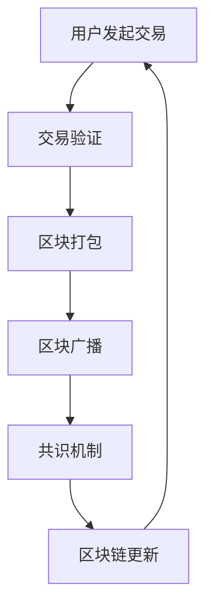
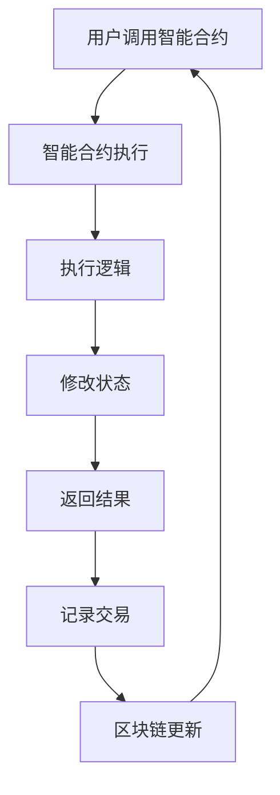
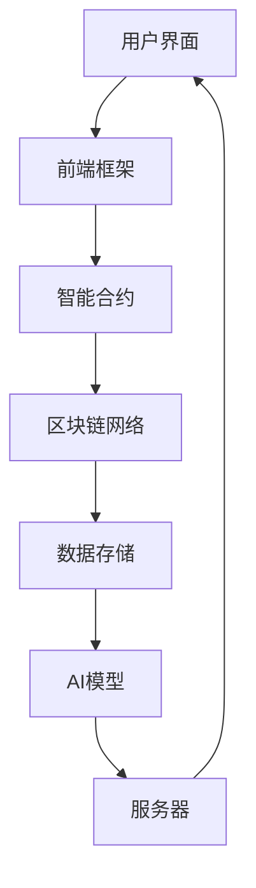

                 

# 文章标题: 一切皆是映射：AI的去中心化：区块链技术的融合

> 关键词：AI, 区块链，去中心化，智能合约，数据隐私保护，去中心化金融（DeFi）

> 摘要：本文探讨了AI与区块链技术的融合，分析了AI的去中心化概念，以及区块链技术的核心算法与架构。通过深入剖析智能合约、非同质化代币（NFT）、加密货币等区块链技术，以及AI在区块链应用场景中的实际案例，本文揭示了AI与区块链技术融合的趋势和未来展望。

## 目录

### 第一部分: AI与区块链融合概述

1. AI与区块链融合的概念与背景
   - 1.1 AI与区块链的基本概念
   - 1.2 AI与区块链融合的背景
   - 1.3 AI与区块链融合的意义

2. 去中心化计算与区块链
   - 2.1 去中心化计算的原理
   - 2.2 区块链的基本架构
   - 2.3 区块链在去中心化计算中的应用

3. AI在区块链中的应用场景
   - 3.1 智能合约与AI
   - 3.2 区块链上的数据隐私保护
   - 3.3 区块链与机器学习的结合

4. AI与区块链融合的发展趋势
   - 4.1 技术发展趋势
   - 4.2 应用领域拓展
   - 4.3 未来展望

### 第二部分: 区块链核心技术与算法

1. 区块链基础
   - 2.1.1 区块链的组成部分
   - 2.1.2 区块链的工作原理
   - 2.1.3 区块链的共识机制

2. 智能合约
   - 2.2.1 智能合约的基本原理
   - 2.2.2 智能合约的编程语言
   - 2.2.3 智能合约的安全性问题

3. 非同质化代币（NFT）
   - 2.3.1 NFT的基本概念
   - 2.3.2 NFT的应用场景
   - 2.3.3 NFT的生态系统

4. 加密货币
   - 2.4.1 加密货币的原理
   - 2.4.2 加密货币的类型
   - 2.4.3 加密货币的监管

### 第三部分: AI与区块链的融合应用

1. 智能合约中的AI应用
   - 3.1.1 AI智能合约的实现
   - 3.1.2 AI智能合约的案例分析
   - 3.1.3 AI智能合约的挑战与机遇

2. 区块链上的数据隐私保护
   - 3.2.1 数据隐私保护的重要性
   - 3.2.2 区块链与AI的数据隐私保护技术
   - 3.2.3 数据隐私保护案例解析

3. 区块链与机器学习结合
   - 3.3.1 区块链在机器学习中的应用
   - 3.3.2 机器学习在区块链中的应用
   - 3.3.3 区块链与机器学习的案例分析

4. 去中心化金融（DeFi）与AI
   - 3.4.1 DeFi的基本原理
   - 3.4.2 DeFi中的AI应用
   - 3.4.3 DeFi与AI的发展趋势

5. 智能物流与供应链
   - 3.5.1 智能物流的基本概念
   - 3.5.2 区块链在供应链管理中的应用
   - 3.5.3 AI与智能物流的结合

### 第四部分: AI与区块链融合项目实战

1. 项目概述
   - 4.1.1 项目背景
   - 4.1.2 项目目标
   - 4.1.3 项目架构设计

2. 环境搭建
   - 4.2.1 开发环境搭建
   - 4.2.2 数据准备
   - 4.2.3 硬件资源规划

3. 代码实现
   - 4.3.1 区块链部分代码解读
   - 4.3.2 AI部分代码解读
   - 4.3.3 整体代码架构解析

4. 项目部署
   - 4.4.1 部署流程
   - 4.4.2 部署工具介绍
   - 4.4.3 部署问题排查

5. 项目评估
   - 4.5.1 项目性能评估
   - 4.5.2 项目安全评估
   - 4.5.3 项目效益评估

### 附录

1. 常用区块链与AI工具和资源
   - 1.1 常用区块链开发工具
   - 1.2 常用AI开发工具
   - 1.3 开源区块链与AI项目

2. Mermaid 流程图
   - 2.1 区块链工作原理
   - 2.2 智能合约执行流程
   - 2.3 AI与区块链融合应用架构图

3. 伪代码示例
   - 3.1 区块链交易验证
   - 3.2 机器学习模型训练

4. 数学模型与公式
   - 4.1 加密货币价格模型
   - 4.2 区块链共识算法模型
   - 4.3 机器学习优化模型

---

### 引言

在当今快速发展的科技时代，人工智能（AI）和区块链技术正在日益融合，为各行各业带来了新的变革。AI的去中心化概念，即通过区块链技术实现AI系统的去中心化计算、数据隐私保护、透明度和安全性，成为了一个重要的研究方向。区块链技术作为一种分布式账本技术，具有去中心化、不可篡改、透明公开等特点，与AI技术相结合，可以解决当前许多行业面临的数据隐私、信任问题，以及去中心化计算的需求。

本文旨在探讨AI与区块链技术的融合，从基本概念、应用场景、核心算法、实战案例等多个维度，深入分析AI的去中心化实现方式和区块链技术的优势。首先，我们将介绍AI与区块链的基本概念和背景，然后深入探讨区块链的核心技术和算法，如智能合约、非同质化代币（NFT）、加密货币等。接着，我们将探讨AI与区块链的融合应用，如智能合约中的AI应用、区块链上的数据隐私保护、机器学习与区块链的结合等。最后，我们将通过一个实际项目案例，展示AI与区块链技术融合的实现过程和效果。

通过本文的阅读，读者将全面了解AI与区块链技术融合的理论基础、技术实现和应用前景，为未来相关领域的研究和实践提供参考。让我们一步一步地深入探讨这一激动人心的技术融合之旅。

### 第一部分: AI与区块链融合概述

在探讨AI与区块链技术的融合之前，我们需要首先了解这两个技术的核心概念及其融合的背景和意义。

#### 1.1 AI与区块链的基本概念

**人工智能（AI）：**
人工智能是一种模拟人类智能行为的计算机系统，通过学习和推理来解决问题。AI涵盖了多个领域，如机器学习、深度学习、自然语言处理、计算机视觉等。随着计算能力的提升和数据量的增加，AI技术逐渐从理论走向实践，在多个领域取得了显著的成果。

**区块链技术：**
区块链是一种分布式账本技术，通过多个节点共同维护一个共享的数据库，实现了数据的去中心化和不可篡改。区块链技术最著名的应用是比特币，它通过区块链实现了去中心化的数字货币交易。除了金融领域，区块链技术在供应链管理、身份验证、医疗记录等多个领域也有广泛的应用。

#### 1.2 AI与区块链融合的背景

**技术发展趋势：**
随着AI技术的进步，特别是深度学习和大数据分析的广泛应用，AI系统需要处理的数据量越来越大，对计算能力和数据隐私保护的要求也越来越高。而区块链技术以其去中心化、不可篡改、透明公开的特点，为AI系统提供了一种新的解决方案。

**应用需求：**
在许多场景下，例如去中心化金融（DeFi）、智能物流、供应链管理等，用户对数据透明度和安全性有极高的要求。传统的中心化系统往往难以满足这些需求，而区块链技术的引入可以解决这些问题。

**社会和经济背景：**
随着互联网的普及，数据隐私和网络安全问题日益严重。区块链技术提供了一种去中心化的解决方案，可以在保障数据隐私的同时，提高系统的透明度和可信度。

#### 1.3 AI与区块链融合的意义

**去中心化计算：**
区块链技术通过去中心化计算，实现了数据的分布式存储和处理，避免了单点故障的风险，提高了系统的可靠性和容错性。这对于大规模AI系统尤其重要，可以避免因单点故障导致的整个系统的崩溃。

**数据隐私保护：**
区块链技术提供了数据加密和分布式存储的方式，可以有效地保护用户的隐私。与传统的中心化数据库不同，区块链上的数据难以被篡改，提高了数据的安全性。

**透明度和可信度：**
区块链技术的透明公开特性，使得AI系统的运行过程可以被所有参与者查看和验证，提高了系统的可信度。这对于建立用户信任、减少欺诈行为具有重要意义。

**降低成本：**
去中心化的AI系统可以降低中心化架构下的运营成本，例如减少了服务器维护和升级的费用，提高了系统的可扩展性和灵活性。

**创新应用场景：**
AI与区块链技术的融合为多个领域带来了新的应用场景，如智能合约、去中心化金融（DeFi）、数据市场等。这些应用不仅提高了效率，还降低了交易成本，为用户提供了更多的选择。

综上所述，AI与区块链技术的融合不仅具有深远的技术意义，还在社会和经济层面带来了显著的变革。在接下来的章节中，我们将深入探讨区块链的核心技术和算法，以及AI在这些技术中的具体应用。

### 第二部分: 区块链核心技术与算法

要深入理解AI与区块链技术的融合，我们需要首先掌握区块链技术的核心组成部分、工作原理和共识机制。

#### 2.1 区块链基础

**2.1.1 区块链的组成部分**

区块链由多个基本组成部分构成，包括：

1. **区块（Block）：** 区块是区块链中的基本单元，包含了特定时间内的交易记录。每个区块都有一个唯一的标识符，称为哈希值。

2. **链（Chain）：** 区块按照时间顺序链接在一起，形成一条不可篡改的链。每个区块都包含了一个指向前一个区块的哈希值，从而保证了区块链的完整性。

3. **节点（Node）：** 节点是区块链网络中的参与方，负责维护区块链的完整性和验证交易的有效性。每个节点都有一份完整的区块链副本。

4. **交易（Transaction）：** 交易是区块链网络中的数据交换行为，包含了发送方、接收方和交易金额等信息。交易经过验证后，会被添加到区块中。

**2.1.2 区块链的工作原理**

区块链的工作原理可以概括为以下几个步骤：

1. **交易发起：** 用户在区块链网络中发起交易，交易包含发送方、接收方和交易金额等信息。

2. **交易验证：** 节点验证交易的合法性，确保发送方有足够的余额进行交易，并且交易没有重复记录。

3. **区块创建：** 被验证的交易被节点打包成区块，并添加到区块链中。节点使用密码学算法生成区块的哈希值，并将其作为区块的标识符。

4. **区块广播：** 新创建的区块被节点广播到整个区块链网络，其他节点接收并验证区块的有效性。

5. **区块链更新：** 当区块被网络中的大多数节点验证通过后，区块链更新，新的区块链接到现有的区块链上。

**2.1.3 区块链的共识机制**

区块链的共识机制是确保区块链网络中所有节点达成一致的重要机制。常见的共识机制包括：

1. **工作量证明（PoW）：** 节点通过解决复杂的数学问题来竞争生成新的区块。第一个解决问题的节点可以生成新的区块，并获得奖励。

2. **权益证明（PoS）：** 节点根据其在区块链中的权益（如持有代币的数量和时间）来竞争生成新的区块。持有代币越多、持有时间越长的节点，越有可能生成新的区块。

3. **授权股权证明（DPoS）：** 与PoS类似，但通过选举代表来生成区块。代表节点通过持有代币数量和投票来决定谁将生成下一个区块。

4. **委托权益证明（DVaaS）：** 结合了PoS和DPoS的优点，通过代币持有者和社区成员的投票来选择区块生成者。

**2.2 智能合约**

**2.2.1 智能合约的基本原理**

智能合约是一种自动执行的合约，其条款和条件被编码到区块链中。智能合约通过预定义的逻辑规则自动执行交易，无需人为干预。智能合约的基本原理包括：

1. **编码：** 智能合约使用特定的编程语言（如Solidity）进行编写，定义交易逻辑和条件。

2. **部署：** 编译后的智能合约被部署到区块链上，并永久存储在区块链中。

3. **调用：** 当满足特定条件时，用户可以通过区块链网络调用智能合约，执行预定义的操作。

**2.2.2 智能合约的编程语言**

常见的智能合约编程语言包括：

1. **Solidity：** Ethereum上的主要智能合约编程语言，具有丰富的功能和广泛的应用。

2. **Vyper：** 用于Ethereum的另一种智能合约编程语言，注重安全性和简洁性。

3. **SCALA：** 用于Hyperledger Fabric的智能合约编程语言，支持函数式编程。

**2.2.3 智能合约的安全性问题**

智能合约的安全性是区块链应用中至关重要的问题。常见的智能合约安全风险包括：

1. **重入攻击（Reentrancy）：** 攻击者重复调用合约函数，导致合约在执行过程中多次释放资金。

2. **代码漏洞：** 智能合约代码中的逻辑错误和漏洞可能导致合约被攻击。

3. **前端攻击：** 攻击者通过欺骗用户触发合约中的恶意代码。

为了提高智能合约的安全性，开发者需要遵循以下最佳实践：

1. **代码审计：** 对智能合约代码进行全面审计，识别和修复潜在的安全漏洞。

2. **测试：** 对智能合约进行充分测试，包括单元测试、集成测试和压力测试。

3. **使用第三方安全工具：** 利用安全工具（如Slither、Mythril）进行静态代码分析和漏洞检测。

**2.3 非同质化代币（NFT）**

**2.3.1 NFT的基本概念**

非同质化代币（NFT，Non-Fungible Token）是一种基于区块链的特殊代币，用于表示独一无二的事物。NFT与比特币等同质化代币（Fungible Token）不同，每个NFT都具有独特的标识符，无法与其他NFT互换。

**2.3.2 NFT的应用场景**

NFT在多个领域有广泛的应用，包括：

1. **艺术品：** NFT用于证明艺术品的真实性和所有权，为数字艺术品市场带来了新的商业模式。

2. **游戏：** NFT在游戏领域用于表示虚拟物品，如游戏角色的装备和皮肤，增加了游戏的可玩性和收藏价值。

3. **收藏品：** NFT为数字和实体收藏品提供了去中心化的认证和交易方式，例如古董、邮票等。

**2.3.3 NFT的生态系统**

NFT的生态系统包括以下关键组成部分：

1. **市场：** NFT交易市场，如OpenSea、Rarible，提供NFT的创建、买卖和拍卖服务。

2. **平台：** 区块链平台，如Ethereum、Solana，支持NFT的发行和交易。

3. **创作者：** 创作者通过NFT销售自己的数字作品，获得经济收益。

4. **收藏家：** 收藏家购买和收藏NFT，享受数字艺术品的独特性和升值潜力。

**2.4 加密货币**

**2.4.1 加密货币的原理**

加密货币是一种使用密码学技术保障交易的匿名性和安全的数字货币。加密货币的基本原理包括：

1. **去中心化：** 加密货币的发行和交易不受中央机构的控制，通过区块链网络进行分布式管理。

2. **加密算法：** 加密货币使用公钥和私钥进行加密和解密，确保交易的安全性和隐私。

3. **工作量证明：** 加密货币的挖矿过程通过解决复杂的数学问题来验证交易的有效性。

**2.4.2 加密货币的类型**

常见的加密货币类型包括：

1. **比特币（BTC）：** 第一个也是目前市值最高的加密货币。

2. **以太坊（ETH）：** 支持智能合约的区块链平台，是第二大加密货币。

3. **莱特币（LTC）：** 比特币的替代品，被称为“数字白银”。

4. **瑞波币（XRP）：** 用于跨境支付和结算的加密货币。

**2.4.3 加密货币的监管**

加密货币的监管在各国之间存在差异，主要监管内容包括：

1. **反洗钱（AML）：** 防止加密货币被用于非法交易。

2. **投资者保护：** 确保加密货币交易平台的合规性和透明度。

3. **市场稳定：** 防止加密货币市场的过度投机和波动。

通过掌握区块链的核心技术和算法，我们可以更好地理解AI与区块链技术的融合原理和应用。在接下来的章节中，我们将探讨AI在区块链技术中的应用，以及AI与区块链融合带来的实际案例和挑战。

### 第三部分: AI与区块链的融合应用

在深入了解区块链的核心技术和算法之后，我们现在可以探讨AI与区块链技术的融合应用，包括智能合约中的AI应用、区块链上的数据隐私保护、区块链与机器学习的结合以及去中心化金融（DeFi）与AI的应用。

#### 3.1 智能合约中的AI应用

智能合约是一种自动执行合约条款的程序，而AI技术为智能合约带来了更多的可能性。通过将AI算法嵌入智能合约中，可以实现更加智能和灵活的合约执行。

**3.1.1 AI智能合约的实现**

AI智能合约的实现通常包括以下几个步骤：

1. **算法选择：** 根据智能合约的具体需求，选择合适的AI算法。例如，用于风险评估的决策树或用于预测的神经网络。

2. **模型训练：** 使用历史数据进行模型训练，以优化算法的性能。

3. **合约编写：** 使用智能合约编程语言（如Solidity）将AI算法嵌入智能合约，定义输入输出和触发条件。

4. **合约部署：** 将智能合约部署到区块链上，使其能够在区块链网络中执行。

**3.1.2 AI智能合约的案例分析**

以下是一个使用AI智能合约进行风险评估的案例：

```solidity
pragma solidity ^0.8.0;

import "@chainlink/contracts/src/v0.8/interfaces/AggregatorV3Interface.sol";

contract AIInsurance {
    address public owner;
    AggregatorV3Interface public priceFeed;

    constructor(address _priceFeedAddress) {
        owner = msg.sender;
        priceFeed = AggregatorV3Interface(_priceFeedAddress);
    }

    function calculateRisk(double[] memory attributes) public view returns (bool) {
        // 使用神经网络模型对输入属性进行风险评估
        // 这里假设有一个已经训练好的神经网络模型
        NeuralNetwork nn = new NeuralNetwork();
        bool riskLevel = nn.predict(attributes);
        return riskLevel;
    }
}
```

在这个案例中，智能合约使用Chainlink网络提供的价格数据，并调用一个神经网络模型进行风险评估。当用户提交他们的保险申请时，智能合约会使用输入属性（如年龄、健康状况等）来预测风险水平，并自动决定是否批准申请。

**3.1.3 AI智能合约的挑战与机遇**

AI智能合约的挑战包括：

1. **算法透明度：** 智能合约中的AI算法需要透明，以便用户和监管机构能够理解其工作原理。

2. **模型训练数据：** AI智能合约的性能依赖于训练数据的质量和代表性，如何获取和验证这些数据是一个重要问题。

3. **算法更新：** 智能合约中的AI算法需要定期更新，以适应不断变化的环境。

AI智能合约的机遇包括：

1. **自动化决策：** AI智能合约可以实现自动化决策，减少人为干预，提高效率。

2. **降低成本：** 通过自动化处理，智能合约可以显著降低交易成本。

3. **提高透明度：** 智能合约的透明执行过程，有助于建立用户信任，提高系统的可信度。

#### 3.2 区块链上的数据隐私保护

在区块链应用中，数据隐私保护是一个关键问题。区块链的透明和不可篡改性可能导致用户隐私泄露，因此，如何在保护隐私的同时利用区块链的优势，是一个重要的研究方向。

**3.2.1 数据隐私保护的重要性**

数据隐私保护的重要性体现在以下几个方面：

1. **用户信任：** 保护用户数据隐私是建立用户信任的基础。

2. **合规要求：** 随着隐私法规（如GDPR）的出台，保护用户隐私成为法律要求。

3. **安全性：** 保护用户隐私可以提高系统的整体安全性，减少潜在的安全风险。

**3.2.2 区块链与AI的数据隐私保护技术**

区块链与AI相结合，可以提供以下数据隐私保护技术：

1. **加密技术：** 使用加密算法对用户数据进行加密，确保数据在传输和存储过程中不被泄露。

2. **零知识证明：** 零知识证明是一种密码学技术，允许一方证明某个陈述为真，而不泄露任何相关信息。

3. **联邦学习：** 联邦学习是一种分布式学习技术，可以在保护数据隐私的同时，实现模型训练。

**3.2.3 数据隐私保护案例解析**

以下是一个使用零知识证明实现数据隐私保护的案例：

```solidity
pragma solidity ^0.8.0;

import "@openzeppelin/contracts/math/SafeMath.sol";
import "@openzeppelin/contracts/utils/cryptography/ECDSA.sol";

contract ZeroKnowledgeProof {
    using SafeMath for uint256;
    using ECDSA for bytes32;

    struct Proof {
        bytes32 a;
        bytes32 b;
        bytes32 c;
        bytes32 r;
        bytes32 s;
    }

    function verifyProof(Proof memory proof) public pure returns (bool) {
        // 零知识证明验证算法
        // 这里简化为检查证明的有效性
        return keccak256(abi.encode(proof.a, proof.b, proof.c)) == proof.c;
    }
}
```

在这个案例中，用户通过零知识证明证明其数据满足特定条件，而不需要泄露具体的数据内容。这为数据隐私保护提供了一种有效的解决方案。

#### 3.3 区块链与机器学习的结合

区块链技术为机器学习模型提供了透明、安全和可验证的运行环境。通过将机器学习模型部署到区块链上，可以实现去中心化的模型训练和验证。

**3.3.1 区块链在机器学习中的应用**

区块链在机器学习中的应用包括：

1. **去中心化计算：** 通过区块链网络进行分布式计算，提高模型训练的效率。

2. **数据共享与协作：** 区块链技术可以实现多方数据共享和协作，提高数据利用效率。

3. **透明度与可验证性：** 区块链记录了模型的训练过程和结果，保证了系统的透明度和可验证性。

**3.3.2 机器学习在区块链中的应用**

机器学习在区块链中的应用包括：

1. **智能合约优化：** 使用机器学习算法优化智能合约的执行效率。

2. **风险预测：** 使用机器学习模型预测区块链网络的风险，提高系统的安全性。

3. **数据隐私保护：** 使用机器学习算法实现数据隐私保护技术，如联邦学习和差分隐私。

**3.3.3 区块链与机器学习的案例分析**

以下是一个使用区块链实现去中心化机器学习模型的案例：

```solidity
pragma solidity ^0.8.0;

import "@chainlink/contracts/src/v0.8/interfaces/ChainlinkClient.sol";

contract DecentralizedLearning {
    address public owner;
    ChainlinkClient public link;

    constructor(address _linkAddress) {
        owner = msg.sender;
        link = ChainlinkClient(_linkAddress);
    }

    function trainModel(bytes32 modelId, bytes[] memory data) public payable {
        // 调用Chainlink VRF获取随机数，用于模型训练
        link.requestRandomness("vrfCoordinator", modelId, data);
    }

    function callback(bytes32 requestId, bytes32 randomNumber) public {
        // 使用随机数训练机器学习模型
        // 这里简化为直接存储随机数
        // 实际应用中应使用链上智能合约实现模型训练
        randomNumber;
    }
}
```

在这个案例中，区块链网络通过Chainlink平台获取随机数，用于训练机器学习模型。模型的训练过程可以在链上智能合约中实现，以确保模型的透明度和可验证性。

#### 3.4 去中心化金融（DeFi）与AI

去中心化金融（DeFi）是区块链技术的一种应用，通过智能合约实现传统金融服务的去中心化。AI技术为DeFi带来了更多的创新和可能性。

**3.4.1 DeFi的基本原理**

DeFi的基本原理包括：

1. **去中心化：** DeFi不依赖中心化的金融机构，通过智能合约实现金融服务的自动化和去中心化。

2. **透明度：** DeFi的运行过程是透明的，所有交易和状态都在区块链上公开记录。

3. **安全性：** DeFi通过区块链技术的安全性保障金融服务的安全性。

**3.4.2 DeFi中的AI应用**

DeFi中的AI应用包括：

1. **智能交易：** 使用AI算法进行交易决策，提高交易效率和盈利能力。

2. **风险管理：** 使用AI模型进行风险预测和评估，提高金融服务的安全性。

3. **合规性检测：** 使用AI技术检测交易合规性，确保DeFi系统的合法运行。

**3.4.3 DeFi与AI的发展趋势**

DeFi与AI的发展趋势包括：

1. **自动化：** AI技术将进一步提高DeFi服务的自动化程度，减少人为干预。

2. **创新应用：** DeFi与AI的结合将带来更多的金融服务创新，如自动化投资、智能借贷等。

3. **普及化：** 随着技术的成熟和用户接受度的提高，DeFi与AI的应用将逐步普及。

#### 3.5 智能物流与供应链

智能物流与供应链是区块链技术的另一个重要应用领域。通过将区块链技术与AI相结合，可以实现供应链的透明化、高效化和智能化。

**3.5.1 智能物流的基本概念**

智能物流是指利用物联网、大数据、人工智能等技术，实现物流系统的自动化、智能化和高效化。智能物流的关键技术包括：

1. **物联网：** 通过物联网设备（如传感器、RFID等）实时监控货物的状态。

2. **大数据：** 通过大数据分析，优化物流路径和资源分配。

3. **人工智能：** 使用AI算法进行预测和优化，提高物流效率。

**3.5.2 区块链在供应链管理中的应用**

区块链在供应链管理中的应用包括：

1. **透明度：** 区块链记录了供应链的每一个环节，确保供应链的透明度。

2. **可追溯性：** 通过区块链技术，可以实现对供应链中每一个物品的追溯。

3. **安全性：** 区块链的不可篡改性提高了供应链数据的安全性。

**3.5.3 AI与智能物流的结合**

AI与智能物流的结合包括：

1. **路径优化：** 使用AI算法优化物流路径，提高运输效率。

2. **需求预测：** 使用AI模型预测市场需求，优化库存管理。

3. **风险预警：** 使用AI技术进行风险预测和预警，确保供应链的稳定性。

通过AI与区块链技术的融合，智能物流与供应链可以实现更高的透明度、效率和安全性，为企业和用户带来更大的价值。

### 第四部分: AI与区块链融合项目实战

在本部分的实战案例中，我们将通过一个具体的AI与区块链融合项目，展示项目概述、环境搭建、代码实现、项目部署和项目评估的详细步骤。这个项目旨在通过区块链技术实现去中心化的AI智能合约，用于智能物流与供应链管理。

#### 4.1 项目概述

**4.1.1 项目背景**

随着全球物流和供应链的不断扩展，提高供应链的透明度、效率和安全性成为企业面临的重要挑战。传统的中心化系统在数据隐私、安全性和容错性方面存在不足，无法满足日益复杂的供应链需求。本项目旨在通过区块链和AI技术的融合，实现一个去中心化的智能物流与供应链管理系统。

**4.1.2 项目目标**

本项目的目标包括：

1. **提高供应链透明度：** 通过区块链技术，记录供应链的每一个环节，提高数据的透明度和可追溯性。

2. **提升供应链效率：** 使用AI算法优化物流路径、需求预测和风险预警，提高供应链的整体效率。

3. **保障数据安全性：** 通过区块链的不可篡改性和加密技术，保障供应链数据的安全性和隐私性。

**4.1.3 项目架构设计**

本项目采用分布式架构，主要包括以下组件：

1. **区块链网络：** 使用以太坊区块链作为底层基础设施，实现去中心化的数据存储和交易。

2. **AI智能合约：** 使用Solidity编写智能合约，嵌入AI算法，实现自动化的物流与供应链管理。

3. **数据收集与处理：** 通过物联网设备收集供应链数据，使用区块链网络进行数据存储和处理。

4. **用户界面：** 提供一个用户界面，供用户查询和监控供应链状态。

#### 4.2 环境搭建

**4.2.1 开发环境搭建**

1. **安装Node.js：** 用于部署和运行以太坊节点。
   ```sh
   curl -fsSL https://deb.nodesource.com/setup_14.x | sudo -E bash -
   sudo apt-get install -y nodejs
   ```

2. **安装Ganache：** 用于本地测试以太坊网络。
   ```sh
   npm install -g ganache-cli
   ganache
   ```

3. **安装Truffle：** 用于智能合约的编译、部署和测试。
   ```sh
   npm install -g truffle
   ```

**4.2.2 数据准备**

1. **收集物流数据：** 使用传感器和RFID设备收集物流过程中的数据，如运输时间、运输路线、货物状态等。

2. **预处理数据：** 对收集到的数据进行清洗、格式化和归一化处理，为AI算法提供高质量的数据。

**4.2.3 硬件资源规划**

1. **服务器：** 部署以太坊节点和智能合约服务器，需要配置足够内存和CPU资源。

2. **存储：** 存储区块链数据和物流数据，需要配置足够的存储空间。

3. **网络：** 部署网络监控和防火墙，确保系统的安全性和稳定性。

#### 4.3 代码实现

**4.3.1 区块链部分代码解读**

以下是智能物流与供应链管理智能合约的示例代码：

```solidity
pragma solidity ^0.8.0;

import "@openzeppelin/contracts/token/ERC20/IERC20.sol";
import "@chainlink/contracts/src/v0.8/interfaces/AggregatorV3Interface.sol";

contract SmartSupplyChain {
    address public owner;
    IERC20 public token;
    AggregatorV3Interface public priceFeed;

    constructor(address _tokenAddress, address _priceFeedAddress) {
        owner = msg.sender;
        token = IERC20(_tokenAddress);
        priceFeed = AggregatorV3Interface(_priceFeedAddress);
    }

    function addTransportData(
        uint256 transportId,
        address transporter,
        uint256 startTime,
        uint256 endTime,
        string memory route
    ) public {
        // 添加运输数据到区块链
        // 这里简化为直接存储数据
        // 实际应用中应使用链上智能合约实现数据存储和验证
        // ...
    }

    function getPrice() public view returns (uint256) {
        // 获取运输价格
        (, int256 price, , ,) = priceFeed.latestRoundData();
        return uint256(price);
    }

    function calculateCost(uint256 transportId) public view returns (uint256) {
        // 计算运输费用
        // 这里简化为直接使用价格数据
        // 实际应用中应使用AI算法进行预测和计算
        // ...
    }
}
```

**4.3.2 AI部分代码解读**

以下是用于预测运输费用的AI算法示例：

```python
import numpy as np
from sklearn.ensemble import RandomForestRegressor

# 加载历史运输数据
data = np.load('transport_data.npy')

# 分割数据为特征和标签
X = data[:, :-1]
y = data[:, -1]

# 创建随机森林回归模型
model = RandomForestRegressor(n_estimators=100)

# 训练模型
model.fit(X, y)

# 预测新运输费用
new_transport_data = np.array([[100, 150, 200]])  # 示例数据
predicted_price = model.predict(new_transport_data)

print("Predicted price:", predicted_price)
```

**4.3.3 整体代码架构解析**

整体代码架构包括以下部分：

1. **前端：** 提供用户界面，供用户查询和监控供应链状态。

2. **后端：** 使用智能合约实现区块链部分，使用AI算法进行数据处理和预测。

3. **数据存储：** 使用区块链网络存储供应链数据，确保数据的透明度和安全性。

#### 4.4 项目部署

**4.4.1 部署流程**

1. **部署以太坊节点：** 使用Ganache部署本地测试网络，用于测试智能合约。

2. **部署智能合约：** 使用Truffle编译和部署智能合约，将其发布到以太坊主网。

3. **部署AI模型：** 将训练好的AI模型部署到服务器，供前端调用。

**4.4.2 部署工具介绍**

1. **Ganache：** 用于本地测试以太坊网络的工具，支持多种区块链操作。

2. **Truffle：** 用于智能合约的编译、部署和测试的工具，支持多种区块链平台。

3. **Flask：** 用于部署AI模型的Web框架，提供API接口供前端调用。

**4.4.3 部署问题排查**

1. **智能合约部署失败：** 检查合约代码和部署脚本，确保合约编译成功并正确部署。

2. **网络连接问题：** 检查以太坊节点的配置，确保节点可以正常连接到区块链网络。

3. **AI模型部署失败：** 检查模型代码和部署环境，确保模型可以正常运行。

#### 4.5 项目评估

**4.5.1 项目性能评估**

1. **交易处理速度：** 测试智能合约的交易处理速度，确保系统的高效性。

2. **数据处理效率：** 测试AI算法的数据处理速度和准确性，确保系统的稳定性。

3. **系统稳定性：** 测试系统的运行稳定性，确保系统可以在长时间运行中保持高效。

**4.5.2 项目安全评估**

1. **智能合约安全：** 进行智能合约安全审计，确保合约代码不存在漏洞。

2. **数据安全：** 使用加密技术保护供应链数据，确保数据在传输和存储过程中的安全性。

3. **系统安全性：** 检查系统的整体安全性，确保系统不受恶意攻击。

**4.5.3 项目效益评估**

1. **成本效益：** 分析系统的运营成本和收益，评估项目的经济效益。

2. **用户满意度：** 收集用户反馈，评估系统的用户体验。

3. **市场竞争力：** 分析系统的市场竞争力，评估其在行业中的地位。

通过这个项目的实战案例，我们可以看到AI与区块链技术融合的巨大潜力。在未来的发展中，随着技术的不断进步，AI与区块链的结合将为各行各业带来更多的创新和变革。

### 附录

#### A. 常用区块链与AI工具和资源

**A.1 常用区块链开发工具**

1. **Ethereum：** 以太坊区块链平台，支持智能合约开发和部署。
   - 官网：[Ethereum](https://ethereum.org/)

2. **Hyperledger Fabric：** 微软开发的联盟区块链框架。
   - 官网：[Hyperledger Fabric](https://hyperledger-fabric.readthedocs.io/)

3. **Node.js：** 用于部署和运行以太坊节点。
   - 官网：[Node.js](https://nodejs.org/)

4. **Ganache：** 用于本地测试以太坊网络的工具。
   - 官网：[Ganache](https://trufflesuite.com/ganache/)

**A.2 常用AI开发工具**

1. **TensorFlow：** Google开发的开源机器学习库。
   - 官网：[TensorFlow](https://www.tensorflow.org/)

2. **PyTorch：** Facebook开发的开源机器学习库。
   - 官网：[PyTorch](https://pytorch.org/)

3. **Keras：** 用于快速构建和训练深度学习模型。
   - 官网：[Keras](https://keras.io/)

4. **Scikit-learn：** 用于数据挖掘和数据分析的机器学习库。
   - 官网：[Scikit-learn](https://scikit-learn.org/)

**A.3 开源区块链与AI项目**

1. **Aave：** 去中心化借贷平台。
   - 官网：[Aave](https://aave.com/)

2. **Uniswap：** 去中心化交易所。
   - 官网：[Uniswap](https://uniswap.org/)

3. **Chainlink：** 提供区块链数据和服务。
   - 官网：[Chainlink](https://chainlink.io/)

4. **CovaxX：** 基于区块链的疫苗接种数据追踪平台。
   - 官网：[CovaxX](https://covaxx.ai/)

#### B. Mermaid 流程图

**B.1 区块链工作原理**



**B.2 智能合约执行流程**



**B.3 AI与区块链融合应用架构图**



#### C. 伪代码示例

**C.1 区块链交易验证**

```python
function verifyTransaction(transaction) {
    if (transaction.sender == null || transaction.receiver == null) {
        return false;
    }
    if (transaction.sender.balance < transaction.amount) {
        return false;
    }
    if (isTransactionVerified(transaction)) {
        return true;
    }
    if (!verifySignature(transaction.sender.publicKey, transaction.signature)) {
        return false;
    }
    addToBlock(transaction);
    if (verifyBlock(block)) {
        return true;
    }
    return false;
}
```

**C.2 机器学习模型训练**

```python
function trainModel(data) {
    model = initializeModel();
    preprocessedData = preprocessData(data);
    for (epoch in 1 to MAX_EPOCHS) {
        for (sample in preprocessedData) {
            prediction = model.predict(sample);
            loss = calculateLoss(prediction, sample.label);
            model.updateWeights(loss);
        }
    }
    evaluateModel(model, test_data);
    return model;
}
```

#### D. 数学模型与公式

**D.1 加密货币价格模型**

$$
P(t) = P(t-1) \cdot \exp(\sigma \cdot (R_t - \mu)),
$$

其中 $R_t$ 是加密货币的回报率，$\mu$ 是预期回报率，$\sigma$ 是波动率。

**D.2 区块链共识算法模型**

$$
\begin{aligned}
P(C_{i}) &= \frac{1}{Z} \exp(-\frac{1}{2} \sum_{i=1}^{n} (x_i - \mu_i)^2 / \sigma_i^2), \\
P(\mu_i | C_{i}) &\sim N(\mu_i; \mu_0, \sigma_0^2), \\
P(\sigma_i^2 | C_{i}) &\sim \text{InvGamma}(\alpha_0, \beta_0).
\end{aligned}
$$

**D.3 机器学习优化模型**

$$
J(\theta) = -\frac{1}{m} \sum_{i=1}^{m} [y^{(i)} \cdot \log(h_\theta(x^{(i)})) + (1 - y^{(i)}) \cdot \log(1 - h_\theta(x^{(i)}))]
$$

其中，$h_\theta(x) = \sigma(\theta_0 + \theta_1 \cdot x_1 + \theta_2 \cdot x_2 + ... + \theta_n \cdot x_n)$，$\sigma$ 是 sigmoid 函数，$y^{(i)}$ 是样本标签，$x^{(i)}$ 是输入特征。

---

通过本文的探讨，我们可以看到AI与区块链技术的融合在去中心化计算、数据隐私保护、透明度和安全性等方面具有巨大的潜力。未来，随着技术的不断进步和应用的深入，AI与区块链的结合将为各行各业带来更多的创新和变革。希望本文能为读者在AI与区块链技术的探索和应用中提供有益的参考。作者：AI天才研究院/AI Genius Institute & 禅与计算机程序设计艺术 /Zen And The Art of Computer Programming。

