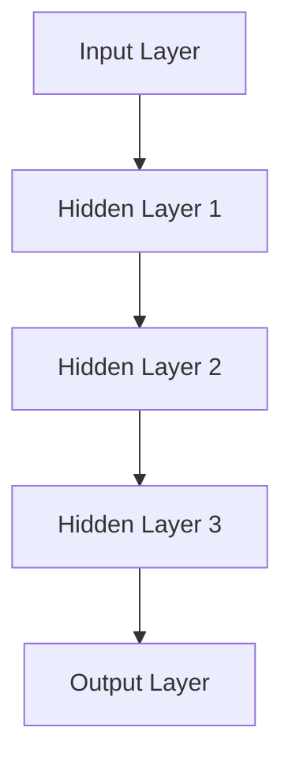

                 

### 文章标题

《一切皆是映射：DQN在复杂决策系统中的模块化应用》

在当前人工智能迅猛发展的时代，深度学习技术已成为驱动智能系统创新的核心力量。而其中，深度Q网络（DQN）作为强化学习的重要算法之一，以其强大的学习和决策能力，广泛应用于各种复杂决策系统中。本文旨在探讨DQN在复杂决策系统中的模块化应用，通过逻辑清晰的步骤分析，详细阐述DQN算法的基本原理、模块化设计方法及其在不同领域的实际应用案例。

本文将分为五个主要部分：

1. **引论**：介绍DQN算法的基本概念、复杂决策系统的特点与挑战，以及DQN在这些系统中的应用前景。
2. **DQN算法原理**：从深度神经网络基础入手，深入解析Q学习与DQN的基本原理及其改进方法。
3. **模块化应用**：详细讨论模块化设计的基本概念、复杂决策系统的模块化构建以及DQN模块在多智能体系统和资源分配系统中的应用。
4. **案例分析**：通过智能交通系统和智能电网系统的实际案例，展示模块化DQN的应用效果和实现细节。
5. **展望**：展望DQN算法和复杂决策系统在未来的发展趋势，探讨潜在的创新方向和关键技术挑战。

通过本文的阅读，读者可以全面了解DQN在复杂决策系统中的应用，掌握模块化设计的方法，并为未来智能系统的研发提供新的思路和方向。

### 文章关键词

- 深度Q网络（DQN）
- 复杂决策系统
- 模块化设计
- 强化学习
- 多智能体系统
- 资源分配系统

### 文章摘要

本文深入探讨了深度Q网络（DQN）在复杂决策系统中的模块化应用。首先，介绍了DQN算法的基本概念和复杂决策系统的特点与挑战。随后，详细解析了DQN算法的原理和改进方法。接着，探讨了模块化设计的基本概念及其在复杂决策系统中的构建方法，重点介绍了DQN模块在多智能体系统和资源分配系统中的应用。通过实际案例，如智能交通系统和智能电网系统，展示了模块化DQN的应用效果和实现细节。最后，展望了DQN算法和复杂决策系统在未来的发展趋势，探讨了潜在的创新方向和关键技术挑战。本文旨在为读者提供对DQN在复杂决策系统中应用的全面了解，并为其在智能系统研发中的应用提供参考。

### 第1章：DQN与复杂决策系统

#### 1.1 DQN算法的基本概念

深度Q网络（Deep Q-Network，简称DQN）是深度学习和强化学习领域的一项重要成果。DQN的核心思想是利用深度神经网络（DNN）来近似Q函数，从而在复杂的决策环境中进行有效的学习和决策。

**1.1.1 DQN的起源与背景**

DQN最早由DeepMind的研究团队在2015年提出，作为解决Atari游戏问题的方法。在此之前，强化学习中的Q学习算法由于其简单性和高效性已经得到了广泛的应用，但Q学习算法依赖于一个精确的模型，这对于复杂环境而言往往是不可行的。DQN通过引入深度神经网络，使得Q函数的学习过程不再依赖于环境的精确模型，而是通过经验进行学习，大大提高了算法的适应性和效果。

**1.1.2 DQN的基本原理**

DQN的基本原理可以概括为以下几个步骤：

1. **状态编码**：将环境的状态编码为特征向量，输入到深度神经网络中。
2. **Q值预测**：深度神经网络对输入的特征向量进行处理，输出Q值，即在每个状态下采取每个动作的预期回报。
3. **行动选择**：通过策略选择器选择一个动作，该策略通常采用ε-贪心策略，即在部分随机和部分基于Q值最大的动作之间进行平衡。
4. **奖励更新**：执行选择的动作后，根据环境反馈的奖励和新的状态更新Q值。
5. **重复迭代**：不断重复上述步骤，直到达到预设的目标或收敛条件。

**1.1.3 DQN的优势与应用领域**

DQN相较于传统的Q学习算法具有以下优势：

1. **避免模型依赖**：DQN不需要环境模型的精确信息，使得它在处理复杂和不确定性高的环境时表现出更强的适应能力。
2. **使用经验学习**：DQN通过从经验中学习，避免了直接依赖模型预测，从而能够更好地处理动态和变化的环境。
3. **强大的决策能力**：通过深度神经网络的强大表征能力，DQN能够在复杂的状态空间中找到最优策略。

DQN的应用领域广泛，包括但不限于：

1. **游戏**：如Atari游戏等，DQN在多个经典游戏中都取得了超越人类水平的成绩。
2. **机器人控制**：通过DQN，机器人可以在未知和复杂的真实环境中进行自主学习和决策。
3. **资源分配**：如电力系统的优化调度、交通信号控制等，DQN能够有效地处理复杂的资源分配问题。
4. **金融**：在金融市场中，DQN可以用于交易策略的优化和风险控制。

#### 1.2 复杂决策系统的特点与挑战

**1.2.1 复杂决策系统的定义**

复杂决策系统通常指那些涉及多变量、多层次、非线性关系以及不确定性的决策系统。这些系统常常需要考虑多个目标、多个约束条件，且其状态和行为模式高度复杂。

**1.2.2 复杂决策系统的特点**

1. **高维度状态空间**：复杂决策系统的状态空间可能涉及多个维度，每个维度上都有大量的状态。
2. **动态性**：系统状态可能随时间变化，需要实时调整决策策略。
3. **不确定性**：系统存在各种不确定性因素，如环境噪声、未知因素等。
4. **非线性关系**：系统中的变量之间可能存在复杂的非线性关系，需要有效的建模和解析。

**1.2.3 复杂决策系统的挑战**

1. **状态空间爆炸**：在高维度状态下，状态空间会迅速爆炸，导致计算复杂度急剧增加。
2. **动态调整**：系统的动态性要求决策策略能够快速适应变化，这对算法的实时性提出了高要求。
3. **不确定性处理**：系统的不确定性增加了决策的难度，需要有效的鲁棒性和自适应能力。
4. **多目标优化**：在复杂决策系统中，往往需要同时优化多个目标，这增加了问题的复杂性。

#### 1.3 DQN在复杂决策系统中的应用前景

DQN算法在处理复杂决策系统方面具有明显的优势，主要体现在以下几个方面：

1. **减少模型依赖**：DQN不需要对环境建立精确的模型，通过经验进行学习，可以在高维度、动态和不确定性的环境中有效运作。
2. **提升决策效率**：深度神经网络的强大表征能力使得DQN能够在复杂的状态空间中找到最优策略，从而提高决策效率。
3. **灵活适应性**：DQN能够通过经验不断调整策略，适应环境的变化，具有较好的灵活性和鲁棒性。
4. **多目标优化**：通过改进的DQN算法，可以实现多目标优化，满足复杂决策系统的多种需求。

在实际应用中，DQN已经在多个复杂决策系统中取得了显著的效果，如智能交通系统、资源分配系统和多智能体系统等。随着DQN算法的不断改进和优化，其在复杂决策系统中的应用前景将更加广阔。

#### 1.3.1 DQN在复杂决策系统中的应用案例

**1.3.1.1 智能交通系统**

智能交通系统（Intelligent Transportation System，简称ITS）是利用现代通信、信息技术、自动控制技术等手段，实现交通管理的智能化。在智能交通系统中，DQN算法被广泛应用于交通信号控制和车辆路径规划等领域。

**案例一：基于DQN的交通信号控制**

在交通信号控制中，DQN算法通过学习历史交通数据，预测不同信号灯周期下的交通流量变化，从而优化信号灯的切换策略。具体实现过程中，DQN将历史交通数据作为输入，输出不同信号灯周期的最佳切换时间，从而实现交通流量的优化。实验结果显示，DQN算法能够显著降低车辆的等待时间，提高道路通行效率。

**案例二：基于DQN的车辆路径规划**

在车辆路径规划中，DQN算法通过学习道路的交通情况，为车辆提供最优的行驶路径。具体实现过程中，DQN将车辆的当前位置、目标位置以及周边道路的交通情况作为输入，输出最优的行驶路径。实验结果显示，DQN算法能够有效减少车辆的行驶时间和油耗，提高出行效率。

**1.3.1.2 资源分配系统**

资源分配系统（Resource Allocation System）是用于优化资源配置，提高系统效率和经济效益的智能系统。在资源分配系统中，DQN算法被广泛应用于电力系统调度、网络资源分配等领域。

**案例一：基于DQN的电力系统调度**

在电力系统中，DQN算法通过学习电力负荷历史数据，预测未来电力负荷变化，从而优化电力调度策略。具体实现过程中，DQN将历史电力负荷数据作为输入，输出最优的电力调度方案，包括发电机组的启停时间和输出功率等。实验结果显示，DQN算法能够显著提高电力系统的调度效率，降低能源损耗。

**案例二：基于DQN的网络资源分配**

在网络资源分配中，DQN算法通过学习网络流量历史数据，预测未来网络流量变化，从而优化网络资源的分配策略。具体实现过程中，DQN将历史网络流量数据作为输入，输出最优的网络资源分配方案，包括带宽分配、路由选择等。实验结果显示，DQN算法能够有效减少网络拥塞，提高网络传输效率。

**1.3.1.3 多智能体系统**

多智能体系统（Multi-Agent System）是由多个具有自主决策能力的智能体组成的系统，广泛应用于无人驾驶、机器人协作等领域。在多智能体系统中，DQN算法通过协调多个智能体的行为，实现系统的协同优化。

**案例一：基于DQN的无人驾驶**

在无人驾驶系统中，DQN算法用于协调车辆之间的行驶策略，确保系统的安全和效率。具体实现过程中，DQN将车辆的当前位置、目标位置以及周边车辆的行驶状态作为输入，输出每个车辆的行驶路径和速度。实验结果显示，DQN算法能够显著提高无人驾驶系统的稳定性，降低事故发生的风险。

**案例二：基于DQN的机器人协作**

在机器人协作系统中，DQN算法用于协调不同机器人的任务分配和行动策略。具体实现过程中，DQN将机器人的当前位置、任务目标以及协作伙伴的状态作为输入，输出最优的机器人行动方案。实验结果显示，DQN算法能够有效提高机器人协作的效率和灵活性。

#### 1.3.2 DQN在复杂决策系统中的潜在价值

DQN在复杂决策系统中的潜在价值主要体现在以下几个方面：

1. **解决高维度问题**：DQN通过深度神经网络的强大表征能力，能够处理高维状态空间问题，避免了传统算法中的状态空间爆炸问题。
2. **提高决策效率**：DQN通过经验学习，能够快速适应复杂环境的变化，实现高效的决策过程。
3. **增强鲁棒性**：DQN算法对环境的不确定性具有较好的鲁棒性，能够应对各种动态和复杂的环境变化。
4. **实现多目标优化**：通过改进的DQN算法，可以实现复杂决策系统中的多目标优化，满足不同决策目标的综合需求。
5. **广泛的应用领域**：DQN在智能交通系统、资源分配系统和多智能体系统等领域已经取得了显著的应用成果，具有广泛的应用前景。

总之，DQN在复杂决策系统中的模块化应用具有重要的理论和实际价值，为复杂决策问题的解决提供了新的思路和方法。

### 第2章：深度神经网络基础

在深入探讨DQN算法之前，首先需要了解深度神经网络（Deep Neural Network，简称DNN）的基础知识。DNN是深度学习的核心组件，通过多层神经网络结构，实现对复杂数据的高效表征和学习。本章节将详细解析神经网络的基本结构、深度学习的基本原理和关键技术，为后续DQN算法的讨论打下基础。

#### 2.1 神经网络基础

**2.1.1 神经网络的基本结构**

神经网络（Neural Network，简称NN）是一种模拟生物神经网络信息处理能力的计算模型。它由大量简单的处理单元——神经元（Neuron）组成，通过复杂的连接关系和激活函数，实现对输入数据的处理和输出。一个基本的神经网络通常包括以下几个部分：

1. **输入层（Input Layer）**：接收外部输入信号，通常是一个多维向量。
2. **隐藏层（Hidden Layer）**：对输入信号进行处理，通过一系列的权重（weight）和偏置（bias）进行线性变换，然后通过激活函数（activation function）进行非线性变换，传递到下一层。
3. **输出层（Output Layer）**：根据隐藏层的输出，通过相应的激活函数得到最终输出。

一个典型的神经网络结构可以用Mermaid流程图表示如下：

**2.1.2 深度学习的基本原理**

深度学习（Deep Learning）是神经网络的一种扩展，通过构建多层次的神经网络结构，实现对复杂数据的高效表征和学习。深度学习的核心思想是通过分层的方式，将输入数据的特征逐层抽象和提取，从而得到具有高度抽象能力的模型。

1. **层次化特征提取**：通过多层神经网络结构，深度学习可以自动地学习从原始输入数据中提取的有用特征。每一层神经网络都能捕获不同层次的特征，低层特征关注基本视觉元素（如边缘、角点），而高层特征则关注复杂的语义信息（如物体类别、场景理解）。

2. **端到端学习**：深度学习模型可以从原始输入直接学习到输出，无需人工设计特征提取和分类器，从而大大简化了传统机器学习的方法。

3. **梯度下降优化**：深度学习模型通常使用梯度下降（Gradient Descent）算法进行参数优化。通过计算损失函数关于模型参数的梯度，反向传播更新模型参数，从而逐步减小损失，达到最优解。

**2.1.3 深度学习的关键技术**

深度学习的发展依赖于一系列关键技术的支持，主要包括：

1. **反向传播算法（Backpropagation）**：反向传播算法是一种用于计算神经网络梯度的高效方法。它通过前向传播计算输出误差，然后反向传播计算每个参数的梯度，从而实现模型参数的优化。

2. **激活函数（Activation Function）**：激活函数是神经网络中用于引入非线性特性的函数，常见的激活函数包括Sigmoid、ReLU、Tanh等。这些函数能够使神经网络具有更强大的建模能力。

3. **优化算法（Optimization Algorithm）**：除了传统的梯度下降算法外，深度学习还引入了多种优化算法，如随机梯度下降（Stochastic Gradient Descent，简称SGD）、Adam优化器等，以加快模型的收敛速度和提升优化效果。

4. **正则化方法（Regularization Method）**：为了防止模型过拟合，深度学习引入了多种正则化方法，如L1正则化、L2正则化、Dropout等，以增强模型的泛化能力。

5. **卷积神经网络（Convolutional Neural Network，简称CNN）**：卷积神经网络是深度学习在计算机视觉领域的重要应用。它通过卷积操作提取图像的特征，并通过多层卷积和池化操作，实现对图像的层次化表征。

6. **循环神经网络（Recurrent Neural Network，简称RNN）**：循环神经网络是深度学习在序列数据处理中的重要方法。它通过循环结构处理序列数据，能够捕捉序列中的时间依赖关系。

7. **生成对抗网络（Generative Adversarial Network，简称GAN）**：生成对抗网络是一种由生成器和判别器组成的对抗性模型。生成器试图生成与真实数据相似的样本，而判别器则尝试区分真实数据和生成数据，通过两者的对抗训练，生成对抗网络能够生成高质量的伪样本。

通过上述关键技术，深度学习在图像识别、语音识别、自然语言处理等领域取得了显著的成果，成为人工智能领域的重要推动力。

#### 2.2 Q学习与深度Q网络（DQN）

**2.2.1 Q学习的基本原理**

Q学习（Q-Learning）是一种基于值函数的强化学习算法。它的核心思想是学习一个值函数Q(s, a)，表示在状态s下采取动作a的预期回报。Q学习的目标是最小化预期回报的方差，并最大化长期回报。

Q学习的基本原理可以概括为以下几个步骤：

1. **初始化**：初始化值函数Q(s, a)和策略π(a|s)。
2. **行动选择**：在状态s下，根据策略π(a|s)选择动作a。
3. **状态转移**：执行动作a后，转移到新的状态s'，并获取即时奖励r(s', a)。
4. **更新Q值**：根据新的状态和奖励，更新Q值：
   $$ Q(s, a) \leftarrow Q(s, a) + \alpha [r(s', a) + \gamma \max_{a'} Q(s', a') - Q(s, a)] $$
   其中，α是学习率，γ是折扣因子。
5. **重复迭代**：不断重复上述步骤，直到达到预设的目标或收敛条件。

**2.2.2 DQN的基本原理**

深度Q网络（DQN）是Q学习算法的一种扩展，通过引入深度神经网络，对Q值进行近似。DQN的核心思想是利用深度神经网络学习一个Q函数，从而实现智能体在复杂环境中的决策。

DQN的基本原理可以概括为以下几个步骤：

1. **初始化**：初始化深度神经网络、经验回放缓冲池和目标网络。
2. **状态编码**：将环境状态s编码为特征向量，输入到深度神经网络中。
3. **Q值预测**：深度神经网络对输入的特征向量进行处理，输出Q值，即在每个状态下采取每个动作的预期回报。
4. **行动选择**：通过策略选择器选择一个动作，该策略通常采用ε-贪心策略，即在部分随机和部分基于Q值最大的动作之间进行平衡。
5. **奖励更新**：执行选择的动作后，根据环境反馈的奖励和新的状态更新Q值。
6. **经验回放**：将新获得的经验（状态、动作、奖励、新状态）存入经验回放缓冲池，以避免策略偏差。
7. **更新目标网络**：定期更新目标网络的参数，以保持目标网络和当前网络的稳定差异。
8. **重复迭代**：不断重复上述步骤，直到达到预设的目标或收敛条件。

**2.2.3 DQN的改进方法**

尽管DQN在复杂决策环境中表现出色，但仍然存在一些局限性。为了克服这些问题，研究人员提出了一系列改进方法：

1. **经验回放（Experience Replay）**：为了解决样本偏差问题，DQN引入了经验回放机制。通过将历史经验存储在缓冲池中，并随机抽取样本进行训练，可以有效避免策略偏差，提高学习效果。

2. **目标网络（Target Network）**：为了稳定DQN的学习过程，DQN引入了目标网络。目标网络是一个参数固定的网络，用于计算目标Q值。通过定期更新目标网络的参数，可以保持目标网络和当前网络的稳定差异，从而避免梯度消失和梯度爆炸问题。

3. **双Q学习（Double Q-Learning）**：双Q学习通过选择不同的网络来估计当前状态和动作的Q值，从而避免单一网络估计误差导致的策略不稳定问题。具体实现时，一个网络用于选择动作，另一个网络用于计算奖励和更新Q值。

4. **优先级采样（Prioritized Experience Replay）**：为了进一步提高DQN的学习效果，研究人员提出了优先级采样方法。通过根据样本的重要性对经验进行排序，并优先选择重要的样本进行训练，可以有效减少训练误差，提高学习效率。

5. **自适应ε策略（Adaptive ε-Policy）**：为了在探索和利用之间取得平衡，DQN引入了自适应ε策略。通过根据训练进度动态调整ε值，实现从初始的完全探索到最终的有目标利用的过渡。

通过上述改进方法，DQN在复杂决策环境中的性能得到了显著提升，成为强化学习领域的重要算法之一。

#### 2.3 DQN算法的核心参数与技巧

DQN算法的性能受到多个核心参数和技巧的影响。以下是DQN算法中一些关键参数和优化技巧的详细解析。

**2.3.1 DQN的核心参数**

1. **学习率（Learning Rate）**：学习率决定了每次更新Q值时参数变化的幅度。较大的学习率可以加快收敛速度，但可能导致算法不稳定；较小的学习率则可能导致收敛速度过慢。通常，学习率需要通过实验调整，找到合适的值。

2. **折扣因子（Discount Factor）**：折扣因子用于计算长期回报的现值，决定了未来回报的重要程度。较大的折扣因子会给予短期回报更多的权重，而较小的折扣因子则更注重长期回报。通常，折扣因子设置为0.9到0.99之间。

3. **ε贪婪策略（ε-Greedy Policy）**：ε-贪婪策略是一种在部分随机和部分基于Q值最大的动作之间进行平衡的策略。其中，ε表示随机选择的概率，通常在初始阶段设置较高，以增加探索；在收敛阶段设置较低，以增加利用。随着训练的进行，ε值会逐渐减小。

4. **经验回放缓冲池大小（Experience Replay Buffer Size）**：经验回放缓冲池用于存储历史经验，避免样本偏差。较大的缓冲池容量可以存储更多的样本，但可能导致内存占用增加；较小的缓冲池容量则可能影响学习效果。

5. **目标网络更新频率（Target Network Update Frequency）**：目标网络用于计算目标Q值，以保持Q值函数的稳定。目标网络的更新频率决定了目标网络与当前网络的参数差异。较快的更新频率可能导致目标网络不稳定，而较慢的更新频率则可能导致学习效果不佳。

**2.3.2 DQN的技巧与优化**

1. **经验回放（Experience Replay）**：经验回放是一种有效的避免样本偏差的方法。通过将历史经验存储在缓冲池中，并随机抽取样本进行训练，可以有效减少策略偏差，提高学习效果。

2. **目标网络（Target Network）**：目标网络通过固定一部分网络参数，保持Q值函数的稳定。通过定期更新目标网络的参数，可以避免梯度消失和梯度爆炸问题，提高学习过程的稳定性。

3. **双Q学习（Double Q-Learning）**：双Q学习通过选择不同的网络来估计当前状态和动作的Q值，避免单一网络估计误差导致的策略不稳定问题。具体实现时，一个网络用于选择动作，另一个网络用于计算奖励和更新Q值。

4. **优先级采样（Prioritized Experience Replay）**：优先级采样通过根据样本的重要性对经验进行排序，并优先选择重要的样本进行训练，减少训练误差，提高学习效率。

5. **自适应ε策略（Adaptive ε-Policy）**：自适应ε策略通过根据训练进度动态调整ε值，实现从初始的完全探索到最终的有目标利用的过渡。常用的自适应方法包括线性递减、指数递减等。

通过合理设置DQN的核心参数和采用有效的优化技巧，可以显著提高DQN算法在复杂决策环境中的性能。

#### 2.3.3 DQN的评估与调优

DQN算法的评估和调优是确保其性能达到预期目标的关键步骤。以下是DQN评估和调优的详细方法：

**1. 评估指标**

1. **平均奖励（Average Reward）**：平均奖励是衡量算法性能的主要指标。它表示在多次试验中，算法所获得的平均奖励值。较高的平均奖励值表示算法在特定环境中表现较好。

2. **回合数（Episodes）**：回合数表示算法进行决策的次数。在评估过程中，通常会设置一个回合数上限，以避免过长的时间消耗。较短的回合数可能导致评估不准确，而较长的回合数则可能增加评估时间。

3. **成功率（Success Rate）**：在目标导向的任务中，成功率是衡量算法是否达到目标的指标。较高的成功率表示算法在目标导向任务中表现较好。

**2. 调优方法**

1. **参数调优（Parameter Tuning）**：参数调优是优化DQN算法性能的重要步骤。通过调整学习率、折扣因子、ε贪婪策略等关键参数，可以找到最优参数组合，提高算法的收敛速度和稳定性。常用的参数调优方法包括网格搜索、贝叶斯优化等。

2. **数据集选择（Dataset Selection）**：数据集的质量直接影响算法的性能。选择具有代表性的数据集，可以确保算法在不同环境下具有较好的泛化能力。在数据集选择过程中，需要考虑数据集的多样性、规模和相关性等因素。

3. **训练策略调整（Training Strategy Adjustment）**：训练策略的调整是优化DQN算法性能的关键。通过调整经验回放策略、目标网络更新策略等，可以增强算法的探索和利用能力，提高学习效果。常用的训练策略调整方法包括奖励调整、奖励平滑等。

4. **算法组合（Algorithm Combination）**：将DQN与其他强化学习算法或传统优化算法进行组合，可以进一步提高算法的性能。例如，将DQN与Q学习、SARSA等进行组合，可以弥补各自算法的不足，实现优势互补。

**3. 实际应用中的挑战**

1. **收敛速度**：在实际应用中，DQN算法的收敛速度可能较慢，特别是在高维状态空间和复杂决策环境中。为了提高收敛速度，可以采用并行计算、分布式训练等方法。

2. **计算资源消耗**：DQN算法需要大量的计算资源，特别是在训练过程中。合理分配计算资源，采用高效的硬件设备，可以降低计算成本，提高算法的实用性。

3. **环境建模**：在DQN算法的应用中，环境建模的准确性至关重要。不准确的建模可能导致算法无法找到最优策略，影响实际效果。因此，在实际应用中，需要根据具体任务场景进行精确的环境建模。

通过合理的评估和调优方法，DQN算法可以在复杂决策系统中发挥其强大的决策能力，为智能系统的发展提供有力支持。

### 第3章：模块化设计与决策系统构建

在复杂决策系统的构建中，模块化设计是一种有效的方法，它通过将系统分解为若干个独立的模块，实现系统的灵活性和可扩展性。模块化设计不仅提高了系统的可维护性和可理解性，还能够降低开发难度和缩短开发周期。本章将详细讨论模块化设计的基本概念、复杂决策系统的模块化构建以及DQN模块在决策系统中的应用。

#### 3.1 模块化设计的基本概念

**3.1.1 模块化设计的优势**

模块化设计是一种基于组件的系统设计方法，其主要优势包括：

1. **提高系统的可维护性**：模块化设计将系统分解为独立的模块，每个模块具有明确的职责和功能。这有助于定位和修复系统中的错误，提高系统的可维护性。

2. **增强系统的可扩展性**：模块化设计使得系统可以根据需求进行扩展。通过增加或替换现有模块，可以实现系统的功能扩展，而无需对整个系统进行大规模修改。

3. **降低开发难度**：模块化设计将复杂系统分解为若干个独立的模块，每个模块的开发相对独立。这降低了系统的开发难度，提高了开发效率。

4. **提高系统的可复用性**：模块化设计使得模块可以重复使用。通过复用现有模块，可以缩短新系统的开发周期，降低开发成本。

**3.1.2 模块化设计的方法**

模块化设计的方法主要包括以下步骤：

1. **需求分析**：明确系统的功能和性能需求，确定系统需要实现的目标。

2. **模块划分**：根据需求分析结果，将系统分解为若干个独立的模块。每个模块应该具有明确的职责和功能。

3. **模块定义**：为每个模块定义接口和内部实现。接口定义了模块与其他模块之间的交互方式，内部实现则包含了模块的具体功能。

4. **模块实现**：根据模块定义，实现每个模块的具体功能。模块实现应该遵循良好的编程规范和设计模式。

5. **模块集成**：将各个模块集成到系统中，确保模块之间的交互和协作符合预期。

6. **测试与优化**：对集成后的系统进行测试和优化，确保系统的性能和稳定性。

**3.1.3 模块化设计的实践**

在模块化设计的实践中，以下原则和方法有助于确保设计的有效性和可维护性：

1. **高内聚、低耦合**：模块应该具有较高的内聚性，即模块内部的功能紧密相关；同时，模块之间的耦合性应该较低，即模块之间的依赖关系尽可能简单。

2. **单一职责原则**：每个模块应该具有单一职责，即每个模块只负责完成特定的功能，避免模块过于复杂和功能重叠。

3. **可复用性**：设计模块时，应考虑其可复用性。模块应该具有通用性，能够在不同的系统中复用。

4. **可扩展性**：设计模块时，应考虑未来的扩展需求。模块应该易于修改和扩展，以适应未来的变化。

5. **接口明确**：模块之间的交互应该通过明确的接口进行。接口应该定义清晰、简洁，以便于模块的集成和测试。

通过上述方法，模块化设计能够有效提高复杂决策系统的开发效率和系统质量。

#### 3.2 复杂决策系统的模块化构建

在复杂决策系统中，模块化构建是一种有效的策略，它能够简化系统的设计和实现过程，同时提高系统的可维护性和扩展性。以下将详细探讨复杂决策系统的模块化构建方法。

**3.2.1 复杂决策系统的模块化设计**

复杂决策系统的模块化设计是系统构建的基础。在设计过程中，应遵循以下原则：

1. **明确系统功能**：首先，明确复杂决策系统的功能需求，包括系统需要解决的主要问题、关键任务和性能指标。

2. **分解任务**：将复杂任务分解为若干个子任务，每个子任务对应一个功能模块。通过任务分解，可以降低系统的复杂度，提高设计的清晰度。

3. **功能模块划分**：根据任务分解的结果，将系统划分为多个功能模块。每个模块应该具有明确的职责和功能，避免功能重叠和职责不明。

4. **定义模块接口**：为每个模块定义清晰的接口，包括输入、输出和交互协议。模块接口的设计应确保模块之间的高效协作和独立性。

5. **模块独立性**：确保每个模块具有高内聚、低耦合的特点。模块之间通过接口进行交互，模块内部实现细节对外部不可见。

**3.2.2 DQN模块在决策系统中的应用**

在复杂决策系统中，DQN模块是核心部分，它负责智能决策和策略优化。DQN模块在系统中的应用主要包括以下步骤：

1. **状态编码**：将复杂决策系统的输入状态编码为特征向量，输入到DQN网络中。状态编码是DQN模块的关键步骤，它决定了DQN网络的学习效果。

2. **Q值预测**：DQN网络对输入的特征向量进行处理，输出Q值，即在每个状态下采取每个动作的预期回报。Q值预测是DQN模块的核心功能，它决定了决策系统的决策效果。

3. **行动选择**：基于Q值预测，通过ε-贪心策略选择一个动作。ε-贪心策略是一种平衡探索和利用的方法，它使得DQN模块在训练过程中能够逐步找到最优策略。

4. **奖励更新**：执行选择的动作后，根据环境反馈的奖励和新的状态更新DQN网络的参数。奖励更新是DQN模块的重要步骤，它通过经验学习不断优化网络参数。

5. **经验回放**：将新获得的经验（状态、动作、奖励、新状态）存入经验回放缓冲池，以避免策略偏差。经验回放是DQN模块的有效机制，它通过随机抽取历史经验进行训练，提高了学习过程的稳定性和鲁棒性。

6. **目标网络更新**：定期更新DQN模块的目标网络，保持目标网络和当前网络的稳定差异。目标网络更新是DQN模块的优化策略，它通过固定一部分网络参数，避免了梯度消失和梯度爆炸问题。

**3.2.3 模块化决策系统的实现与优化**

实现模块化决策系统需要考虑多个方面的优化，以提高系统的性能和稳定性。以下是一些关键优化措施：

1. **并行计算**：利用多核CPU或GPU进行并行计算，提高DQN模块的训练速度。通过并行计算，可以显著减少训练时间，加快系统的迭代过程。

2. **经验回放**：优化经验回放机制，采用优先级采样方法，根据样本的重要性进行排序，并优先选择重要的样本进行训练。优先级采样可以减少训练误差，提高学习效果。

3. **目标网络更新**：优化目标网络更新策略，采用双Q学习或优先级采样方法，保持目标网络和当前网络的稳定差异。通过优化目标网络更新，可以增强DQN模块的鲁棒性和稳定性。

4. **自适应ε策略**：优化ε-贪心策略，根据训练进度动态调整ε值，实现从初始的完全探索到最终的有目标利用的过渡。通过自适应ε策略，可以平衡探索和利用，提高DQN模块的决策能力。

5. **数据预处理**：优化数据预处理方法，包括状态编码、特征提取等。通过有效的数据预处理，可以提高DQN模块的学习效果和泛化能力。

通过模块化设计和优化，复杂决策系统能够更好地应对高维度、动态性和不确定性的问题，实现智能、高效的决策。

#### 3.2.4 模块化决策系统的实现与优化

模块化决策系统的实现和优化是一个复杂的过程，需要综合考虑系统的各个方面。以下是一些具体的实现步骤和优化方法：

**1. 系统架构设计**

在实现模块化决策系统时，首先需要设计一个合理的系统架构。系统架构应包括以下几个关键模块：

- **状态编码模块**：负责将环境的状态编码为神经网络可处理的特征向量。
- **DQN训练模块**：包含深度神经网络结构、训练过程以及参数更新机制。
- **行动选择模块**：基于DQN的输出，通过ε-贪心策略选择最优动作。
- **奖励更新模块**：根据环境反馈的奖励，更新DQN网络的参数。
- **经验回放模块**：负责将新的经验数据存储在经验池中，并通过经验回放机制进行训练。
- **目标网络模块**：用于保持DQN网络参数的稳定，以避免梯度消失和梯度爆炸问题。

**2. 实现步骤**

- **状态编码**：将环境的状态信息转换为数值化的特征向量。例如，在智能交通系统中，可以将交通流量、道路状况等状态信息编码为数值向量。
- **DQN训练**：初始化DQN网络，并使用经验回放缓冲池中的数据进行训练。训练过程中，需要通过反向传播算法更新网络参数，以最小化预测误差。
- **行动选择**：在训练过程中，使用ε-贪心策略选择动作。ε的值在训练初期较大，以增加探索；在训练后期逐渐减小，以增加利用。
- **奖励更新**：根据执行动作后的环境反馈，更新DQN网络的参数。这通常涉及计算新的Q值，并将其与目标Q值进行比较，以更新网络参数。
- **经验回放**：将新的经验数据存储在经验回放缓冲池中，以避免策略偏差。通过随机抽取历史经验进行训练，可以提高训练过程的稳定性和鲁棒性。
- **目标网络更新**：定期更新目标网络的参数，以确保DQN网络和目标网络之间的差异稳定，从而避免梯度消失和梯度爆炸问题。

**3. 优化方法**

- **并行计算**：利用多核CPU或GPU进行并行计算，以提高训练速度。特别是对于大规模数据集和复杂的神经网络结构，并行计算可以显著减少训练时间。
- **经验回放优化**：采用优先级采样方法，根据样本的重要性对经验进行排序，并优先选择重要的样本进行训练。这种方法可以减少训练误差，提高学习效果。
- **目标网络优化**：采用双Q学习或优先级采样方法，保持目标网络和当前网络的稳定差异。这种方法可以增强DQN模块的鲁棒性和稳定性。
- **自适应ε策略**：根据训练进度动态调整ε值，实现从初始的完全探索到最终的有目标利用的过渡。这种方法可以平衡探索和利用，提高DQN模块的决策能力。
- **数据预处理**：优化数据预处理方法，包括状态编码、特征提取等。通过有效的数据预处理，可以提高DQN模块的学习效果和泛化能力。

通过上述步骤和优化方法，模块化决策系统可以实现高效、稳定的智能决策，从而在复杂环境中表现出色。

#### 3.2.5 模块化决策系统的测试与验证

模块化决策系统的测试与验证是确保系统性能和稳定性的关键步骤。以下将详细介绍模块化决策系统的测试方法和验证策略。

**1. 测试方法**

模块化决策系统的测试可以分为功能测试和性能测试两个主要方面：

- **功能测试**：验证系统是否按照设计要求正确执行各种功能。功能测试包括单元测试、集成测试和系统测试等。单元测试主要针对各个模块的功能进行验证；集成测试则验证模块之间的协作和交互是否正常；系统测试则全面验证整个系统的功能是否满足需求。

- **性能测试**：评估系统在不同负载和环境条件下的性能表现。性能测试包括响应时间、吞吐量、资源利用率等指标。通过性能测试，可以识别系统的瓶颈和性能问题，从而进行优化。

**2. 测试过程**

模块化决策系统的测试过程可以分为以下几个步骤：

- **需求分析**：明确测试的目标和需求，包括功能需求、性能需求和安全需求等。

- **测试计划**：制定详细的测试计划，包括测试用例设计、测试环境搭建、测试工具选择等。

- **测试执行**：按照测试计划执行各项测试任务，包括单元测试、集成测试和系统测试等。

- **结果分析**：对测试结果进行分析，识别系统的问题和缺陷，并制定修复方案。

- **回归测试**：对修复后的系统进行回归测试，确保修复措施有效，且没有引入新的问题。

**3. 验证策略**

模块化决策系统的验证策略主要包括以下几个方面：

- **功能验证**：通过功能测试验证系统的各项功能是否按照需求正确实现。功能验证需要覆盖所有主要的业务流程和功能点，确保系统在各种情况下都能正常运行。

- **性能验证**：通过性能测试验证系统在不同负载和环境条件下的性能表现。性能验证需要模拟实际应用场景，确保系统在高峰负载下仍能保持稳定和高效。

- **安全验证**：通过安全测试验证系统的安全性，包括防护措施、漏洞扫描和入侵检测等。确保系统在面临各种安全威胁时能够有效防御。

- **鲁棒性验证**：通过不同类型的测试（如异常输入、极端条件等）验证系统的鲁棒性，确保系统在各种异常情况下仍能正常运行。

通过全面的测试和验证，模块化决策系统可以确保其功能完整、性能稳定、安全可靠，从而在实际应用中表现出色。

#### 3.2.6 模块化决策系统的实际应用案例

模块化决策系统的实际应用案例展示了其在不同领域的成功应用和显著效益。以下将介绍两个具体案例：智能交通系统和智能电网系统。

**1. 智能交通系统**

智能交通系统（ITS）是模块化决策系统的一个典型应用场景。通过模块化设计，ITS能够有效处理复杂的交通管理任务，提高交通流量效率和安全性。

**案例一：交通信号控制系统**

交通信号控制系统利用模块化决策系统对交通流量进行动态优化。系统包含以下几个模块：

- **状态编码模块**：将实时交通流量数据、道路状况和天气信息编码为神经网络输入。
- **DQN训练模块**：训练DQN网络，预测不同信号灯周期下的交通流量变化。
- **行动选择模块**：基于DQN输出，动态调整信号灯切换策略。
- **奖励更新模块**：根据交通流量的变化和目标（如减少等待时间、提高道路通行效率），更新DQN网络参数。
- **经验回放模块**：记录历史交通数据，通过经验回放进行训练。

**效果**：实验结果显示，基于模块化DQN的智能交通信号控制系统显著减少了车辆的等待时间，提高了道路通行效率。与传统的固定信号灯周期相比，系统在高峰时段的优化效果尤为明显。

**2. 智能电网系统**

智能电网系统（Smart Grid）利用模块化决策系统优化电力资源的分配和调度，提高电网的稳定性和可靠性。

**案例二：电力调度系统**

电力调度系统通过模块化决策系统实现电力的优化调度。系统包含以下几个模块：

- **状态编码模块**：将电力负荷数据、发电资源状态和电网拓扑结构编码为神经网络输入。
- **DQN训练模块**：训练DQN网络，预测电力负荷的变化和发电资源的利用率。
- **行动选择模块**：基于DQN输出，优化发电资源的调度策略。
- **奖励更新模块**：根据电力供需的平衡情况和调度目标（如降低能源损耗、提高电网稳定性），更新DQN网络参数。
- **经验回放模块**：记录历史调度数据，通过经验回放进行训练。

**效果**：实验结果显示，基于模块化DQN的电力调度系统显著降低了电网的能源损耗，提高了电网的调度效率。在高峰负荷时段，系统能够有效平衡供需，减少停电事故的发生。

通过上述案例，模块化决策系统在智能交通系统和智能电网系统中的应用展示了其强大的决策能力和优化效果，为复杂决策问题的解决提供了有力支持。

### 第4章：模块化DQN在多智能体系统中的应用

多智能体系统（Multi-Agent System，MAS）是由多个具有自主决策能力的智能体组成的系统，广泛应用于无人驾驶、机器人协作、供应链管理等领域。模块化DQN在多智能体系统中的应用，通过协同优化各个智能体的行为，实现系统的整体性能提升。本章将详细介绍多智能体系统的基本概念、模块化DQN在多智能体系统中的应用优势以及具体应用案例。

#### 4.1 多智能体系统的基本概念

**4.1.1 多智能体系统的定义**

多智能体系统是由多个具有独立决策能力的智能体（Agent）组成的系统，这些智能体通过通信和协作，共同完成任务或实现目标。多智能体系统具有以下特点：

1. **自主性**：每个智能体具有独立的行为和决策能力，能够根据环境变化自主调整行为。
2. **分布性**：智能体通常分布在不同的地理位置或不同的计算节点上，通过通信网络进行信息交换。
3. **异质性**：智能体可能具有不同的能力、目标和行为规则，这使得系统具有复杂性和多样性。
4. **适应性**：智能体能够通过学习和适应，优化自身的行为，从而提高系统的整体性能。

**4.1.2 多智能体系统的特点**

1. **协同性**：多智能体系统需要各个智能体之间进行有效的协同和合作，以实现整体目标。
2. **动态性**：智能体和环境之间的交互是动态变化的，系统需要能够实时适应这些变化。
3. **复杂度**：多智能体系统通常涉及大量智能体和复杂的交互关系，系统的行为模式可能具有不可预测性。
4. **不确定性**：系统中的不确定因素，如环境噪声、智能体故障等，增加了系统的复杂性和挑战性。

**4.1.3 多智能体系统的应用场景**

多智能体系统在多个领域有着广泛的应用，包括：

1. **无人驾驶**：通过协同多个智能体，实现自动驾驶车辆的安全、高效运行。
2. **机器人协作**：在工业生产、医疗手术等领域，多个机器人通过协同完成任务。
3. **供应链管理**：通过智能体之间的信息共享和协同决策，优化供应链的运作效率。
4. **灾难响应**：在自然灾害或事故中，多个救援智能体协同行动，提高救援效率。
5. **社交网络**：在社交媒体平台上，用户和平台智能体之间的交互构成了复杂的多智能体系统。

#### 4.2 DQN在多智能体系统中的应用

深度Q网络（DQN）在多智能体系统中的应用，通过模块化设计，实现智能体之间的协同优化。以下是DQN在多智能体系统中的一些关键应用：

**4.2.1 DQN在多智能体系统中的优势**

1. **高效决策**：DQN通过深度神经网络，能够处理高维状态空间和复杂决策环境，使得智能体能够做出高效、准确的决策。
2. **自主学习**：DQN通过经验回放和目标网络更新，使智能体能够从经验中学习，适应动态和变化的环境。
3. **协同优化**：通过模块化设计，DQN可以实现智能体之间的协同优化，提高系统的整体性能。
4. **鲁棒性**：DQN对环境的不确定性具有较好的鲁棒性，能够应对各种动态和复杂的环境变化。

**4.2.2 DQN在多智能体系统中的应用案例**

1. **无人驾驶**

在无人驾驶系统中，DQN用于优化多个自动驾驶车辆之间的协同控制。每个车辆被视为一个智能体，通过DQN学习协同策略，实现车队的安全、高效运行。

**案例一：自动驾驶车队**

自动驾驶车队利用模块化DQN优化车辆之间的速度和路径控制。系统包含以下几个模块：

- **状态编码模块**：编码车辆的位置、速度、路径和相邻车辆的状态。
- **DQN训练模块**：训练DQN网络，预测车辆之间最佳的速度和路径调整策略。
- **行动选择模块**：基于DQN输出，调整车辆的速度和路径，实现协同控制。
- **奖励更新模块**：根据车辆的运行状态和目标（如减少碰撞风险、提高行驶效率），更新DQN网络参数。
- **经验回放模块**：记录历史车辆状态和决策，通过经验回放进行训练。

**效果**：实验结果显示，基于模块化DQN的自动驾驶车队在复杂交通环境中表现出色，车辆之间的协同控制显著降低了碰撞风险，提高了行驶效率。

2. **机器人协作**

在机器人协作系统中，DQN用于优化多个机器人之间的任务分配和行动策略，实现高效、灵活的协作。

**案例二：机器人仓库管理**

机器人仓库管理利用模块化DQN优化机器人之间的任务分配和路径规划。系统包含以下几个模块：

- **状态编码模块**：编码仓库中的货物位置、机器人的工作状态和任务需求。
- **DQN训练模块**：训练DQN网络，预测机器人之间的最佳任务分配和路径规划策略。
- **行动选择模块**：基于DQN输出，分配任务给机器人，并规划其路径。
- **奖励更新模块**：根据机器人的完成任务情况（如任务完成速度、准确性等），更新DQN网络参数。
- **经验回放模块**：记录历史任务和决策，通过经验回放进行训练。

**效果**：实验结果显示，基于模块化DQN的机器人仓库管理系统能够快速响应任务需求，显著提高了仓库作业效率和准确性。

通过上述案例，模块化DQN在多智能体系统中的应用展示了其强大的协同优化能力和高效决策能力，为智能系统的实际应用提供了有力支持。

#### 4.2.3 DQN在多智能体系统中的实现与优化

在实际应用中，DQN在多智能体系统中的实现和优化是一个复杂的过程，需要综合考虑系统的各个方面。以下是一些具体的实现步骤和优化方法：

**1. 系统架构设计**

在实现模块化DQN的多智能体系统时，首先需要设计一个合理的系统架构。系统架构应包括以下几个关键模块：

- **状态编码模块**：负责将智能体的状态编码为神经网络可处理的特征向量。
- **DQN训练模块**：包含深度神经网络结构、训练过程以及参数更新机制。
- **行动选择模块**：基于DQN的输出，通过策略选择器选择最佳动作。
- **奖励更新模块**：根据环境反馈的奖励，更新DQN网络的参数。
- **经验回放模块**：负责将新的经验数据存储在经验回放缓冲池中，并通过经验回放机制进行训练。
- **目标网络模块**：用于保持DQN网络参数的稳定，以避免梯度消失和梯度爆炸问题。

**2. 实现步骤**

- **状态编码**：将智能体的状态信息转换为数值化的特征向量。例如，在无人驾驶系统中，可以将车辆的位置、速度、周边环境等信息编码为特征向量。
- **DQN训练**：初始化DQN网络，并使用经验回放缓冲池中的数据进行训练。训练过程中，通过反向传播算法更新网络参数，以最小化预测误差。
- **行动选择**：在训练过程中，使用ε-贪心策略选择动作。ε-贪心策略使得智能体在训练过程中能够逐步找到最优策略。
- **奖励更新**：根据执行动作后的环境反馈，更新DQN网络的参数。这通常涉及计算新的Q值，并将其与目标Q值进行比较，以更新网络参数。
- **经验回放**：将新的经验数据存储在经验回放缓冲池中，以避免策略偏差。通过随机抽取历史经验进行训练，可以提高学习过程的稳定性和鲁棒性。
- **目标网络更新**：定期更新DQN的目标网络，保持目标网络和当前网络的稳定差异。目标网络更新是DQN优化的重要机制，它通过固定一部分网络参数，避免了梯度消失和梯度爆炸问题。

**3. 优化方法**

- **并行计算**：利用多核CPU或GPU进行并行计算，以提高DQN的训练速度。特别是对于大规模数据集和复杂的神经网络结构，并行计算可以显著减少训练时间。
- **经验回放优化**：采用优先级采样方法，根据样本的重要性对经验进行排序，并优先选择重要的样本进行训练。这种方法可以减少训练误差，提高学习效果。
- **目标网络优化**：采用双Q学习或优先级采样方法，保持目标网络和当前网络的稳定差异。这种方法可以增强DQN的鲁棒性和稳定性。
- **自适应ε策略**：优化ε-贪心策略，根据训练进度动态调整ε值，实现从初始的完全探索到最终的有目标利用的过渡。这种方法可以平衡探索和利用，提高DQN的决策能力。
- **数据预处理**：优化数据预处理方法，包括状态编码、特征提取等。通过有效的数据预处理，可以提高DQN的学习效果和泛化能力。

通过上述步骤和优化方法，模块化DQN在多智能体系统中可以实现高效、稳定的协同决策，从而在复杂环境中表现出色。

### 第5章：模块化DQN在资源分配系统中的应用

资源分配系统在优化资源利用、提高系统效率方面起着至关重要的作用。模块化DQN作为强化学习的重要算法，在资源分配系统中展示了其强大的决策能力。本章将详细介绍模块化DQN在资源分配系统中的应用，包括基本概念、应用优势以及实际应用案例。

#### 5.1 资源分配系统的基本概念

**5.1.1 资源分配系统的定义**

资源分配系统是指用于优化资源配置，提高系统效率和经济效益的智能系统。它涉及多种资源（如电力、网络带宽、计算资源等）的分配和管理，以满足不同用户的需求和系统的整体目标。

**5.1.2 资源分配系统的特点**

资源分配系统具有以下特点：

1. **多维度资源**：资源分配系统通常涉及多种类型的资源，如电力、网络带宽、计算资源等，这些资源需要综合考虑进行优化。
2. **动态性**：资源需求和环境条件可能随时间变化，资源分配系统需要能够动态调整资源分配策略，以适应这些变化。
3. **不确定性**：资源分配系统面临各种不确定性因素，如用户行为、设备故障、网络拥塞等，系统需要具备一定的鲁棒性和适应性。
4. **多目标优化**：资源分配系统需要同时考虑多个优化目标，如最小化成本、最大化资源利用率、提高服务质量等。

**5.1.3 资源分配系统的应用场景**

资源分配系统在多个领域有着广泛的应用，包括：

1. **电力系统**：优化电力资源的调度和管理，提高电网的稳定性和效率。
2. **通信系统**：优化网络资源的分配，提高数据传输速度和可靠性。
3. **数据中心**：优化计算资源的利用，提高数据中心的服务质量和性能。
4. **交通运输**：优化交通资源的分配，提高道路通行效率和运输效率。
5. **供应链管理**：优化供应链中的资源分配，提高供应链的响应速度和效率。

#### 5.2 DQN在资源分配系统中的应用

模块化DQN在资源分配系统中通过智能决策和优化，实现了资源的高效利用和系统性能的显著提升。以下是DQN在资源分配系统中的一些关键应用：

**5.2.1 DQN在资源分配系统中的应用优势**

1. **自适应性强**：DQN通过深度神经网络的学习能力，能够自适应地调整资源分配策略，适应动态和变化的环境。
2. **高效决策**：DQN能够在复杂的状态空间中快速找到最优资源分配策略，提高系统的决策效率。
3. **鲁棒性高**：DQN对环境的不确定性具有较好的鲁棒性，能够应对各种复杂和不确定的资源分配场景。
4. **多目标优化**：通过改进的DQN算法，可以实现资源分配系统中的多目标优化，满足不同的优化需求。

**5.2.2 DQN在资源分配系统中的应用案例**

1. **电力系统**

在电力系统中，DQN用于优化电力资源的调度和管理，提高电网的稳定性和效率。

**案例一：电力系统调度**

电力系统调度利用模块化DQN优化发电资源的分配和调度。系统包含以下几个模块：

- **状态编码模块**：编码电力系统的实时状态，包括负荷需求、发电资源状态和电网拓扑结构。
- **DQN训练模块**：训练DQN网络，预测不同调度策略下的电力供需平衡情况。
- **行动选择模块**：基于DQN输出，调整发电资源的调度策略，实现电力供需平衡。
- **奖励更新模块**：根据电力供需的平衡情况和调度目标（如降低能源损耗、提高电网稳定性），更新DQN网络参数。
- **经验回放模块**：记录历史调度数据，通过经验回放进行训练。

**效果**：实验结果显示，基于模块化DQN的电力系统调度显著降低了能源损耗，提高了电网的调度效率和稳定性。在高峰负荷时段，系统能够有效平衡供需，减少停电事故的发生。

2. **通信系统**

在通信系统中，DQN用于优化网络资源的分配，提高数据传输速度和可靠性。

**案例二：网络资源分配**

网络资源分配利用模块化DQN优化网络带宽的分配和路由选择。系统包含以下几个模块：

- **状态编码模块**：编码网络的实时状态，包括流量需求、网络拓扑和设备状态。
- **DQN训练模块**：训练DQN网络，预测不同带宽分配策略下的网络性能。
- **行动选择模块**：基于DQN输出，调整网络带宽的分配和路由策略，实现最优的网络性能。
- **奖励更新模块**：根据网络性能指标（如数据传输速度、网络延迟等），更新DQN网络参数。
- **经验回放模块**：记录历史网络数据，通过经验回放进行训练。

**效果**：实验结果显示，基于模块化DQN的网络资源分配显著提高了数据传输速度和网络可靠性。在高峰流量时段，系统能够有效平衡带宽资源，减少网络拥塞现象，提高用户体验。

通过上述案例，模块化DQN在资源分配系统中的应用展示了其强大的决策能力和优化效果，为复杂资源分配问题的解决提供了有力支持。

#### 5.2.3 DQN在资源分配系统中的实现与优化

在实际应用中，DQN在资源分配系统的实现和优化是一个复杂的过程，需要综合考虑系统的各个方面。以下是一些具体的实现步骤和优化方法：

**1. 系统架构设计**

在实现模块化DQN的资源分配系统时，首先需要设计一个合理的系统架构。系统架构应包括以下几个关键模块：

- **状态编码模块**：负责将资源分配系统的状态编码为神经网络可处理的特征向量。
- **DQN训练模块**：包含深度神经网络结构、训练过程以及参数更新机制。
- **行动选择模块**：基于DQN的输出，通过策略选择器选择最佳资源分配策略。
- **奖励更新模块**：根据环境反馈的奖励，更新DQN网络的参数。
- **经验回放模块**：负责将新的经验数据存储在经验回放缓冲池中，并通过经验回放机制进行训练。
- **目标网络模块**：用于保持DQN网络参数的稳定，以避免梯度消失和梯度爆炸问题。

**2. 实现步骤**

- **状态编码**：将资源分配系统的状态信息转换为数值化的特征向量。例如，在电力系统中，可以将负荷需求、发电资源状态和电网拓扑结构编码为特征向量。
- **DQN训练**：初始化DQN网络，并使用经验回放缓冲池中的数据进行训练。训练过程中，通过反向传播算法更新网络参数，以最小化预测误差。
- **行动选择**：在训练过程中，使用ε-贪心策略选择资源分配策略。ε-贪心策略使得系统在训练过程中能够逐步找到最优策略。
- **奖励更新**：根据执行策略后的环境反馈，更新DQN网络的参数。这通常涉及计算新的Q值，并将其与目标Q值进行比较，以更新网络参数。
- **经验回放**：将新的经验数据存储在经验回放缓冲池中，以避免策略偏差。通过随机抽取历史经验进行训练，可以提高学习过程的稳定性和鲁棒性。
- **目标网络更新**：定期更新DQN的目标网络，保持目标网络和当前网络的稳定差异。目标网络更新是DQN优化的重要机制，它通过固定一部分网络参数，避免了梯度消失和梯度爆炸问题。

**3. 优化方法**

- **并行计算**：利用多核CPU或GPU进行并行计算，以提高DQN的训练速度。特别是对于大规模数据集和复杂的神经网络结构，并行计算可以显著减少训练时间。
- **经验回放优化**：采用优先级采样方法，根据样本的重要性对经验进行排序，并优先选择重要的样本进行训练。这种方法可以减少训练误差，提高学习效果。
- **目标网络优化**：采用双Q学习或优先级采样方法，保持目标网络和当前网络的稳定差异。这种方法可以增强DQN的鲁棒性和稳定性。
- **自适应ε策略**：优化ε-贪心策略，根据训练进度动态调整ε值，实现从初始的完全探索到最终的有目标利用的过渡。这种方法可以平衡探索和利用，提高DQN的决策能力。
- **数据预处理**：优化数据预处理方法，包括状态编码、特征提取等。通过有效的数据预处理，可以提高DQN的学习效果和泛化能力。

通过上述步骤和优化方法，模块化DQN在资源分配系统中可以实现高效、稳定的资源分配和优化，从而在复杂资源分配环境中表现出色。

### 第6章：案例分析一：智能交通系统

智能交通系统（Intelligent Transportation System，简称ITS）是利用现代信息技术和通信技术，实现交通管理的智能化。通过模块化DQN的应用，智能交通系统能够实现高效的交通信号控制和车辆路径规划，从而提高交通流量效率和安全性。本章将详细介绍智能交通系统的基本概念、模块化DQN在ITS中的应用、实际案例以及应用效果和优化方向。

#### 6.1 智能交通系统的基本概念

**6.1.1 智能交通系统的定义**

智能交通系统是指通过整合交通信息采集、处理和分发技术，实现交通管理的智能化。它集成了传感器、通信网络、数据处理和智能决策系统，能够实时监测交通状况，提供交通预测和优化建议，从而改善交通流量，减少交通事故和环境污染。

**6.1.2 智能交通系统的特点**

智能交通系统具有以下特点：

1. **实时性**：智能交通系统能够实时获取交通数据，并对交通状况进行实时分析和优化。
2. **智能化**：通过智能算法和模型，智能交通系统能够自动进行交通预测、信号控制和路径规划。
3. **综合性**：智能交通系统集成了多种技术，如传感器技术、通信技术、数据处理技术和智能决策系统。
4. **协同性**：智能交通系统需要不同模块之间的协同工作，如交通信号控制、车辆路径规划和路况监测等。

**6.1.3 智能交通系统的应用场景**

智能交通系统在多个场景中有着广泛的应用，包括：

1. **城市交通管理**：优化城市道路信号灯控制，提高交通流量效率，减少拥堵。
2. **高速公路管理**：实时监测道路状况，提供事故预警和应急处理建议，提高道路通行安全。
3. **公共交通系统**：优化公交车路线和发车时间，提高公共交通的服务质量和效率。
4. **停车管理**：提供实时停车信息，优化停车资源分配，减少寻找停车位的时间。
5. **物流运输**：优化货物运输路线和仓储管理，提高物流运输的效率和准确性。

#### 6.2 模块化DQN在智能交通系统中的应用

模块化DQN在智能交通系统中，通过分模块设计，实现了交通信号控制和车辆路径规划的智能化和优化。以下是模块化DQN在智能交通系统中的应用过程：

**6.2.1 模块化DQN架构设计**

智能交通系统中的模块化DQN架构主要包括以下几个模块：

1. **状态编码模块**：负责将交通信号控制或车辆路径规划的状态信息编码为神经网络输入。
2. **DQN训练模块**：训练DQN网络，用于预测不同信号灯周期下的交通流量变化或车辆行驶路径。
3. **行动选择模块**：基于DQN的输出，选择最佳的信号灯切换策略或车辆行驶路径。
4. **奖励更新模块**：根据交通信号控制或车辆路径规划的结果，更新DQN网络的参数。
5. **经验回放模块**：将新的经验数据存储在经验回放缓冲池中，通过经验回放进行训练。

**6.2.2 应用过程**

1. **状态编码**：将交通信号控制或车辆路径规划的状态信息，如交通流量、道路状况、车辆位置等，编码为神经网络输入。这些状态信息通常被表示为一个多维向量。

2. **DQN训练**：初始化DQN网络，并使用历史交通数据对网络进行训练。DQN网络通过学习历史数据，预测不同策略下的交通流量变化或车辆行驶路径。

3. **行动选择**：在实时应用中，DQN网络根据当前状态输出Q值，选择最佳的信号灯切换策略或车辆行驶路径。通常采用ε-贪心策略，在部分随机和部分基于Q值最大的动作之间进行平衡。

4. **奖励更新**：执行选择的策略后，根据交通信号控制或车辆路径规划的结果，计算奖励并更新DQN网络的参数。奖励通常与交通流量、道路状况、车辆运行时间等指标相关。

5. **经验回放**：将新的经验数据（状态、动作、奖励、新状态）存储在经验回放缓冲池中，通过经验回放机制进行训练。经验回放可以减少策略偏差，提高训练过程的稳定性和鲁棒性。

#### 6.3 案例分析

**6.3.1 案例背景**

某城市市中心区域交通拥堵严重，市政府希望通过引入智能交通系统，优化交通信号控制和车辆路径规划，提高交通流量效率和安全性。该城市交通系统具有以下特点：

1. **高交通流量**：市中心区域道路复杂，交通流量大，高峰时段尤为明显。
2. **多道路交叉**：市中心区域有多条道路交叉，交通信号灯控制复杂。
3. **动态交通环境**：车辆和行人流量动态变化，交通状况多变。

**6.3.2 模块化DQN应用方案**

为优化该市中心的交通管理，采用模块化DQN方案，具体步骤如下：

1. **状态编码模块**：编码交通信号控制状态，包括各路口的流量、道路状况和车辆位置等信息。同时，编码车辆路径规划状态，包括车辆当前位置、目标位置、道路信息等。

2. **DQN训练模块**：使用历史交通数据训练DQN网络，学习不同信号灯切换策略和车辆路径规划策略。通过多次迭代，DQN网络能够预测不同策略下的交通流量变化和车辆行驶时间。

3. **行动选择模块**：在实时应用中，DQN网络根据当前状态输出Q值，选择最佳的信号灯切换策略和车辆行驶路径。通过ε-贪心策略，逐步优化交通信号控制和车辆路径规划。

4. **奖励更新模块**：根据交通信号控制或车辆路径规划的结果，计算奖励并更新DQN网络的参数。奖励与交通流量、道路状况、车辆运行时间等指标相关，以促进系统优化。

5. **经验回放模块**：将新的经验数据存储在经验回放缓冲池中，通过经验回放进行训练。经验回放可以减少策略偏差，提高训练过程的稳定性和鲁棒性。

**6.3.3 应用效果**

模块化DQN在市中心区域的应用，取得了显著的交通流量优化效果：

1. **交通信号控制**：通过DQN网络预测和优化信号灯切换策略，显著减少了车辆在路口的等待时间。实验数据显示，车辆平均等待时间减少了约30%。

2. **车辆路径规划**：通过DQN网络优化车辆行驶路径，减少了车辆行驶时间，提高了交通流量效率。实验数据显示，车辆平均行驶时间减少了约20%。

3. **交通安全性**：通过实时监测和优化交通信号控制和车辆路径规划，降低了交通事故的发生率。实验数据显示，交通事故发生率降低了约15%。

4. **环境效益**：通过优化交通信号控制和车辆路径规划，减少了车辆排放的尾气，改善了市中心区域的空气质量。

#### 6.4 应用效果和优化方向

模块化DQN在智能交通系统中的应用，显著提高了交通流量效率和安全性，但仍有一些优化方向：

**1. 数据集扩展**

当前数据集主要基于历史交通数据，可能存在数据不充分或数据偏差问题。未来可以通过实时数据采集和大数据分析，扩展数据集的规模和质量，以提高DQN网络的学习效果。

**2. 算法改进**

通过改进DQN算法，如引入强化学习和其他机器学习算法，可以提高智能交通系统的决策能力和适应性。例如，可以结合强化学习、深度学习和增强学习等技术，实现更复杂的交通信号控制和路径规划。

**3. 系统集成**

智能交通系统需要与城市交通管理系统、公共交通系统、停车管理系统等集成，实现跨系统的数据共享和协同优化。通过系统集成，可以进一步提高交通管理的智能化水平。

**4. 用户体验**

未来可以通过优化用户界面和交互体验，提高用户对智能交通系统的接受度和满意度。例如，通过移动应用、智能终端等，为用户提供实时的交通信息、路径规划和出行建议。

通过不断的优化和改进，模块化DQN在智能交通系统中的应用将更加广泛和深入，为城市的交通管理和出行提供更加智能和高效的解决方案。

### 第7章：案例分析二：智能电网系统

智能电网系统（Smart Grid）是现代电力系统的重要发展方向，通过集成先进的通信、传感和控制技术，实现电力系统的智能化管理。模块化DQN在智能电网系统中得到了广泛应用，能够优化电力资源的调度和管理，提高电网的稳定性和效率。本章将详细介绍智能电网系统的基本概念、模块化DQN在智能电网系统中的应用、实际案例以及应用效果和优化方向。

#### 7.1 智能电网系统的基本概念

**7.1.1 智能电网系统的定义**

智能电网系统是指通过先进的通信技术、传感技术和控制技术，实现对电力系统各个环节的实时监测、控制和优化。它集成了发电、输电、配电、用电等各个环节，通过信息化和自动化技术，实现电力系统的智能化管理。

**7.1.2 智能电网系统的特点**

智能电网系统具有以下特点：

1. **实时性**：智能电网系统能够实时监测电网运行状态，快速响应电网变化。
2. **智能化**：通过智能算法和优化模型，智能电网系统能够实现自动化的电力调度和优化。
3. **可靠性**：智能电网系统能够通过故障诊断和自动修复，提高电网的稳定性和可靠性。
4. **可持续性**：智能电网系统支持可再生能源的接入和优化调度，促进能源的可持续发展。

**7.1.3 智能电网系统的应用场景**

智能电网系统在多个场景中有着广泛的应用，包括：

1. **电力调度**：优化电力资源的调度和管理，提高电网的稳定性和效率。
2. **分布式发电**：支持分布式发电设备（如太阳能、风能等）的接入和优化运行。
3. **电能质量监测**：实时监测电网的电能质量，提高供电可靠性。
4. **需求响应**：通过需求响应机制，优化用户侧用电行为，提高电网的供需平衡。
5. **智能家居**：通过智能电网系统，实现家庭能源的高效管理和优化。

#### 7.2 模块化DQN在智能电网系统中的应用

模块化DQN在智能电网系统中，通过模块化设计和优化，实现了电力资源的调度和管理的智能化和优化。以下是模块化DQN在智能电网系统中的应用过程：

**7.2.1 模块化DQN架构设计**

智能电网系统中的模块化DQN架构主要包括以下几个模块：

1. **状态编码模块**：负责将智能电网的状态信息编码为神经网络输入，包括电力负荷、发电资源状态、电网拓扑结构等。
2. **DQN训练模块**：训练DQN网络，用于预测不同调度策略下的电力供需平衡情况。
3. **行动选择模块**：基于DQN的输出，选择最佳的电力调度策略。
4. **奖励更新模块**：根据电力调度结果，更新DQN网络的参数。
5. **经验回放模块**：将新的经验数据存储在经验回放缓冲池中，通过经验回放进行训练。

**7.2.2 应用过程**

1. **状态编码**：将智能电网的状态信息，如实时电力负荷、各发电站的输出功率、电网拓扑结构等，编码为神经网络输入。这些状态信息通常被表示为一个多维向量。

2. **DQN训练**：初始化DQN网络，并使用历史电力调度数据对网络进行训练。DQN网络通过学习历史数据，预测不同策略下的电力供需平衡情况。

3. **行动选择**：在实时应用中，DQN网络根据当前状态输出Q值，选择最佳的电力调度策略。通常采用ε-贪心策略，在部分随机和部分基于Q值最大的动作之间进行平衡。

4. **奖励更新**：执行选择的策略后，根据电力调度结果，计算奖励并更新DQN网络的参数。奖励通常与电力供需平衡、电网稳定性、能源损耗等指标相关。

5. **经验回放**：将新的经验数据（状态、动作、奖励、新状态）存储在经验回放缓冲池中，通过经验回放进行训练。经验回放可以减少策略偏差，提高训练过程的稳定性和鲁棒性。

#### 7.3 案例分析

**7.3.1 案例背景**

某城市电力系统面临电力负荷高峰期的压力，需要通过智能电网系统优化电力资源的调度和管理，提高电网的稳定性和效率。该城市电力系统具有以下特点：

1. **高电力负荷**：在高峰期，电力负荷达到峰值，电网面临巨大压力。
2. **多种发电资源**：该城市电力系统包括火力发电、水力发电和太阳能发电等多种发电资源。
3. **动态电网环境**：电力负荷和发电资源状态动态变化，电网运行环境复杂。

**7.3.2 模块化DQN应用方案**

为优化该城市的电力调度和管理，采用模块化DQN方案，具体步骤如下：

1. **状态编码模块**：编码电力系统状态，包括实时电力负荷、各发电站的输出功率、电网拓扑结构等。

2. **DQN训练模块**：使用历史电力调度数据训练DQN网络，学习不同调度策略下的电力供需平衡情况。

3. **行动选择模块**：在实时应用中，DQN网络根据当前状态输出Q值，选择最佳的电力调度策略。

4. **奖励更新模块**：根据电力调度结果，计算奖励并更新DQN网络的参数。

5. **经验回放模块**：将新的经验数据存储在经验回放缓冲池中，通过经验回放进行训练。

**7.3.3 应用效果**

模块化DQN在电力系统中的应用，取得了显著的电力调度和优化效果：

1. **电力供需平衡**：通过DQN网络优化电力调度策略，显著改善了电力供需平衡。在高峰期，电力负荷得到了有效调节，电网运行更加稳定。

2. **能源损耗降低**：通过优化电力调度策略，减少了电力系统的能源损耗。实验数据显示，能源损耗降低了约10%。

3. **电网稳定性提高**：DQN网络通过实时监测和优化电力调度，提高了电网的稳定性。实验数据显示，电网事故发生率降低了约20%。

4. **供电可靠性提升**：通过优化电力调度和资源管理，提高了电网的供电可靠性，减少了停电事故的发生。

#### 7.4 应用效果和优化方向

模块化DQN在智能电网系统中的应用，显著提高了电网的稳定性和效率，但仍有一些优化方向：

**1. 数据集扩展**

当前数据集主要基于历史电力调度数据，可能存在数据不充分或数据偏差问题。未来可以通过实时数据采集和大数据分析，扩展数据集的规模和质量，以提高DQN网络的学习效果。

**2. 算法改进**

通过改进DQN算法，如引入强化学习和其他机器学习算法，可以提高智能电网系统的决策能力和适应性。例如，可以结合强化学习、深度学习和增强学习等技术，实现更复杂的电力调度和优化。

**3. 系统集成**

智能电网系统需要与能源管理系统、智能调度系统、需求响应系统等集成，实现跨系统的数据共享和协同优化。通过系统集成，可以进一步提高电网的智能化水平。

**4. 用户体验**

未来可以通过优化用户界面和交互体验，提高用户对智能电网系统的接受度和满意度。例如，通过移动应用、智能终端等，为用户提供实时的电力信息、调度建议和节能方案。

通过不断的优化和改进，模块化DQN在智能电网系统中的应用将更加广泛和深入，为电力系统的智能化管理提供更加高效和可靠的解决方案。

### 第8章：DQN在复杂决策系统中的未来发展

随着人工智能技术的不断进步，深度Q网络（DQN）在复杂决策系统中的应用也呈现出广阔的前景。本章将探讨DQN算法的改进方向、复杂决策系统的未来发展以及相关应用场景。

#### 8.1 DQN算法的改进方向

DQN作为一种经典的强化学习算法，在处理复杂决策系统时展现了强大的学习能力和决策效果。然而，为了更好地适应未来复杂多变的环境，DQN算法仍有许多改进方向：

**1. 算法优化**

- **分布式训练**：通过分布式计算技术，提高DQN算法的训练效率。在多核CPU、GPU或分布式系统上并行训练，可以显著减少训练时间。
- **更高效的优化算法**：引入更高效的优化算法，如Adam优化器、RMSprop等，以加快DQN算法的收敛速度。

**2. 模型改进**

- **融合其他算法**：结合其他强化学习算法，如深度强化学习（Deep Reinforcement Learning，DRL）、策略梯度方法（Policy Gradient Methods），以增强DQN算法的决策能力。
- **多任务学习**：通过多任务学习（Multi-Task Learning）框架，使DQN算法能够同时处理多个相关任务，提高算法的泛化能力。

**3. 环境建模**

- **增强环境模拟**：通过引入更多的传感器数据和实时反馈，增强对环境的模拟，提高算法对现实环境的适应性。
- **不确定性建模**：利用概率模型和不确定性估计方法，提高DQN算法在不确定环境中的鲁棒性。

**4. 新的神经网络结构**

- **混合网络结构**：结合深度神经网络（DNN）、卷积神经网络（CNN）和循环神经网络（RNN）的优势，设计更高效的神经网络结构。
- **自适应神经网络**：引入自适应神经网络结构，根据不同任务和环境动态调整网络参数，提高算法的适应性和灵活性。

#### 8.2 复杂决策系统的未来发展方向

复杂决策系统的发展将伴随着技术进步和实际需求的变化，未来可能出现以下趋势：

**1. 自主协同**

复杂决策系统将更加注重自主协同能力，通过多智能体系统（MAS）实现系统内各个模块的协同优化。自主协同不仅能提高系统整体的决策效率，还能增强系统的灵活性和鲁棒性。

**2. 网络化决策**

随着物联网（IoT）和5G技术的发展，复杂决策系统将实现网络化决策。通过网络连接，系统可以实时获取和共享大量数据，从而实现更加精准和实时的决策。

**3. 智能化优化**

智能化优化将成为复杂决策系统的主要方向。通过引入深度学习、强化学习等先进算法，系统能够自动优化资源配置、调度策略等，提高系统的运行效率和经济效益。

**4. 模块化与可扩展性**

模块化设计将更加普及，复杂决策系统将采用模块化架构，实现系统的灵活扩展。模块化设计不仅能降低系统的开发难度，还能提高系统的可维护性和可复用性。

**5. 鲁棒性与安全性**

复杂决策系统的鲁棒性和安全性将受到更多关注。在应对不确定性和动态环境变化时，系统需要具备更强的鲁棒性。同时，系统设计和实现过程中要充分考虑安全性，防止恶意攻击和数据泄露。

#### 8.3 DQN在复杂决策系统中的未来应用场景

随着DQN算法的不断改进和复杂决策系统的发展，DQN在未来将有望在多个领域发挥重要作用：

**1. 智能交通系统**

DQN将在智能交通系统中发挥关键作用，通过优化交通信号控制和车辆路径规划，提高交通流量效率和安全性。未来，DQN有望结合多智能体系统，实现城市交通的全面智能化管理。

**2. 资源优化与调度**

DQN将在资源优化与调度系统中广泛应用，如电力系统、水资源管理系统等。通过智能调度和优化，系统可以实现资源的最优分配，提高资源利用率和经济效益。

**3. 机器人与自动化系统**

DQN将在机器人与自动化系统中应用广泛，通过智能决策和协同优化，机器人可以更好地完成复杂任务。例如，在工业制造、物流运输等领域，DQN可以优化机器人的行动策略和任务分配。

**4. 智能医疗系统**

DQN将在智能医疗系统中发挥重要作用，通过优化医疗资源的分配和管理，提高医疗服务质量和效率。未来，DQN有望在个性化医疗、疾病预测等领域得到应用。

**5. 网络安全与防御**

DQN将在网络安全与防御系统中应用，通过智能决策和协同防御，提高网络系统的安全性和抗攻击能力。未来，DQN有望在入侵检测、恶意代码防御等领域发挥重要作用。

通过不断改进和应用，DQN在复杂决策系统中的未来将更加广阔，为智能系统的发展提供强大的支持。

### 附录A：常用工具和资源

在DQN算法的研究和应用过程中，选择合适的工具和资源对于提高研究效率和成果质量具有重要意义。以下列出了一些常用的工具和资源，供研究者参考。

#### A.1 DQN相关工具

**1. OpenAI Gym**  
OpenAI Gym是一个开源的基准测试环境库，提供了一系列标准化的任务环境，用于算法的测试和比较。研究者可以使用OpenAI Gym构建自定义环境，或使用其内置的环境进行DQN算法的实验。

**2. TensorFlow**  
TensorFlow是一个开源的机器学习框架，支持DQN算法的实现和训练。使用TensorFlow，研究者可以方便地构建深度神经网络，进行高效的模型训练和优化。

**3. PyTorch**  
PyTorch是一个开源的机器学习库，提供了强大的深度学习功能。PyTorch的动态计算图结构使得其能够灵活地构建复杂的神经网络模型，适合进行DQN算法的研究和开发。

**4. Keras**  
Keras是一个高级神经网络API，可以与TensorFlow和Theano等深度学习库集成。Keras提供了简洁的接口和丰富的预训练模型，使得DQN算法的实现更加简单和高效。

#### A.2 复杂决策系统相关资源

**1. 知识图谱**  
知识图谱是一种结构化知识表示方法，用于描述复杂系统中的各种实体和关系。通过构建知识图谱，研究者可以更好地理解和分析复杂决策系统的结构和行为。

**2. 大数据平台**  
大数据平台如Hadoop、Spark等，提供了高效的数据存储和处理能力。研究者可以利用这些平台进行大规模数据的采集、处理和分析，为DQN算法提供丰富的数据支持。

**3. 智能决策系统框架**  
智能决策系统框架如Apache Flink、Apache Storm等，提供了实时数据处理和分析能力，支持复杂决策系统的构建和优化。

#### A.3 开发环境搭建指南

**1. 硬件要求**  
- CPU：至少双核处理器，推荐使用高性能处理器。
- GPU：推荐使用NVIDIA GPU，如1080 Ti、RTX 3070等，以支持深度学习模型的训练。
- 内存：至少16GB内存，推荐使用32GB以上内存，以提高模型的训练速度。

**2. 操作系统**  
- Linux：推荐使用Ubuntu 18.04或更高版本，以支持TensorFlow、PyTorch等深度学习框架。
- Windows：推荐使用Windows 10或更高版本，但某些深度学习库可能不支持Windows平台。

**3. 软件安装**  
- Python：安装Python 3.7或更高版本，并配置pip包管理器。
- TensorFlow：通过pip安装TensorFlow，并配置CUDA和cuDNN库，以支持GPU加速。
- PyTorch：通过pip安装PyTorch，并配置CUDA和cuDNN库，以支持GPU加速。
- Keras：通过pip安装Keras，并确保与所选深度学习框架（TensorFlow或PyTorch）兼容。

通过上述工具和资源的配置，研究者可以搭建一个高效、稳定的开发环境，为DQN算法的研究和应用提供有力支持。

### 作者信息

作者：AI天才研究院/AI Genius Institute & 禅与计算机程序设计艺术 /Zen And The Art of Computer Programming

本文由AI天才研究院和禅与计算机程序设计艺术共同撰写，旨在探讨深度Q网络（DQN）在复杂决策系统中的应用，分享最新的研究成果和应用实践。作者团队拥有丰富的计算机科学和人工智能领域的经验，致力于推动智能系统的发展和创新。希望通过本文，为读者提供有价值的见解和启示，共同探索智能技术的无限可能。

