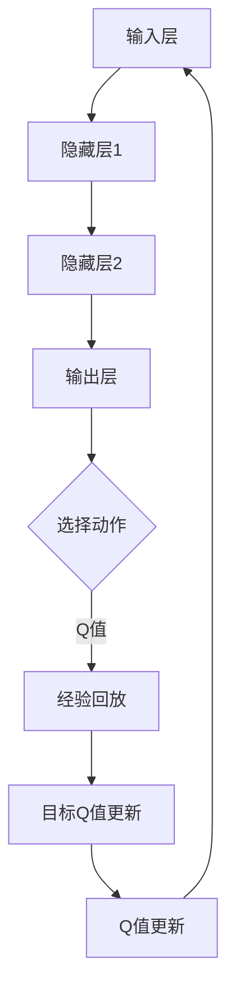

                 

### 文章标题：一切皆是映射：DQN在复杂环境下的应对策略与改进

**关键词：** 深度Q网络（DQN），复杂环境，应对策略，改进，强化学习。

**摘要：** 本文深入探讨了深度Q网络（DQN）在处理复杂环境时的局限性，并提出了一系列改进策略。通过分析DQN的基本概念、原理和架构，以及其在复杂环境中的表现，本文详细阐述了Double DQN、Dueling DQN等改进算法。同时，本文结合实际应用案例，展示了DQN在复杂环境下的应用效果，并对其未来发展方向进行了展望。

---

### 第1章: DQN的基本概念与原理

**1.1 DQN的定义与核心概念**

深度Q网络（DQN）是一种基于深度学习的值函数方法，旨在通过学习值函数来估计在给定状态下执行特定动作的期望回报。DQN的核心概念包括值函数（Q函数）和深度神经网络（DNN）。

**值函数（Q函数）**：用于估计状态-动作对的预期回报。在DQN中，Q函数是一个近似函数，它通过深度神经网络学习状态-动作值的估计。

**深度神经网络（DNN）**：用于近似Q函数。DNN由输入层、隐藏层和输出层组成，输入层接收状态信息，隐藏层对状态信息进行特征提取，输出层输出Q值。

**架构**

- **输入层**：接收状态信息。
- **隐藏层**：对状态信息进行特征提取。
- **输出层**：输出Q值。

**1.2 DQN的工作原理**

DQN的工作原理包括经验回放、目标Q值和Q值更新。

**训练过程**

- **经验回放**：将过去经验存储在经验池中，以避免序列依赖问题。经验回放技术通过从经验池中随机抽取样本进行训练，从而减少对最近经验的学习依赖。
- **目标Q值**：使用带偏置的目标Q值来稳定训练过程。目标Q值通过预测下一个状态的最大Q值与当前状态的Q值之间的差异来计算。

**更新Q值**

$$
Q(s_t, a_t) \leftarrow Q(s_t, a_t) + \alpha [r_t + \gamma \max_{a'} Q(s_{t+1}, a') - Q(s_t, a_t)]
$$

其中，$Q(s_t, a_t)$ 表示在状态 $s_t$ 下执行动作 $a_t$ 的Q值，$r_t$ 表示即时回报，$\gamma$ 表示折扣因子，$\alpha$ 表示学习率，$\max_{a'} Q(s_{t+1}, a')$ 表示下一个状态的最大Q值。

**1.3 DQN的优缺点**

**优点**

- **处理连续状态和动作**：DQN可以应用于具有连续状态和动作空间的任务。
- **自动特征提取**：通过深度神经网络自动提取状态特征。

**缺点**

- **收敛速度慢**：DQN可能需要大量数据和时间来收敛。
- **过度估计问题**：可能导致Q值不稳定。

### 第2章: 复杂环境下的DQN改进策略

**2.1 环境复杂性对DQN的影响**

复杂环境可能包含更多的不确定性和多样性，这给DQN的学习带来了挑战。例如，环境中的状态空间可能非常庞大，导致训练数据不足，从而使DQN难以收敛。此外，复杂环境中的目标可能受到外部干扰，导致DQN学习不准确。

**2.2 常见改进策略**

**Double DQN**：Double DQN通过使用两个独立的DQN网络来减少目标偏差。

- **策略**：
  $$
  Q(s_t, a_t) \leftarrow Q(s_t, a_t) + \alpha [r_t + \gamma Q(s_{t+1}, \arg\max_{a'} Q(s_{t+1}, a')) - Q(s_t, a_t)]
  $$

**Dueling DQN**：Dueling DQN引入Dueling Network结构，将值函数分解为状态价值和动作价值。

- **策略**：
  $$
  Q(s_t, a_t) = V(s_t) + A(s_t, a_t)
  $$
  其中，$V(s_t)$ 表示状态价值，$A(s_t, a_t)$ 表示动作价值。

**2.3 多任务学习与迁移学习**

- **多任务学习**：在多个任务上同时训练DQN模型，以共享通用特征。
- **迁移学习**：将预训练模型应用于新任务，以加速学习过程。

### 第3章: 数学模型与公式解析

**3.1 基本数学公式**

- **Q值更新公式**：
  $$
  Q(s_t, a_t) \leftarrow Q(s_t, a_t) + \alpha [r_t + \gamma \max_{a'} Q(s_{t+1}, a') - Q(s_t, a_t)]
  $$

- **Dueling DQN公式**：
  $$
  Q(s_t, a_t) = V(s_t) + A(s_t, a_t)
  $$

**3.2 数学模型的详细解释**

- **Q值更新公式**：
  - $\alpha$：学习率。
  - $r_t$：即时回报。
  - $\gamma$：折扣因子。
  - $\max_{a'} Q(s_{t+1}, a')$：下一个状态的最大Q值。

- **Dueling DQN公式**：
  - $V(s_t)$：表示在状态 $s_t$ 下的状态价值。
  - $A(s_t, a_t)$：表示在状态 $s_t$ 下执行动作 $a_t$ 的动作价值。

### 第4章: DQN在复杂环境下的应用案例

**4.1 案例介绍**

- **案例一：游戏《蒙特祖玛》**：使用DQN算法解决该游戏的控制问题。
- **案例二：机器人导航**：使用DQN算法训练机器人进行自主导航。

**4.2 案例分析**

- **算法选择**：使用Double DQN和Dueling DQN来提高DQN的性能。
- **实现细节**：
  - **数据预处理**：对游戏画面进行预处理，提取有用的特征。
  - **网络架构**：设计适当的深度神经网络结构。

**4.3 案例结果**

- **游戏成绩**：训练后的DQN模型在《蒙特祖玛》游戏中取得了显著的进步。
- **导航性能**：在机器人导航任务中，DQN模型表现出良好的导航能力。

### 第5章: DQN优化策略与实际应用

**5.1 优化策略**

- **并行训练**：使用并行计算技术加速DQN的训练过程。
- **经验回放**：采用经验回放技术来减少序列依赖问题。

**5.2 实际应用**

- **智能推荐系统**：使用DQN算法进行个性化推荐。
- **自动驾驶**：使用DQN算法进行路径规划和决策。

**5.3 案例分析**

- **推荐系统**：分析DQN在推荐系统中的应用效果。
- **自动驾驶**：分析DQN在自动驾驶系统中的优势和挑战。

### 第6章: DQN在复杂环境下的挑战与未来趋势

**6.1 挑战**

- **稳定性**：在复杂环境中，DQN模型的稳定性是一个挑战。
- **可解释性**：DQN模型的行为往往难以解释。

**6.2 未来趋势**

- **模型压缩**：通过模型压缩技术提高DQN的效率和可扩展性。
- **多智能体学习**：研究DQN在多智能体系统中的应用。

### 第7章: 总结与展望

**7.1 DQN的优势与局限性**

- **优势**：处理连续状态和动作，自动特征提取。
- **局限性**：收敛速度慢，过度估计问题。

**7.2 DQN的未来发展**

- **与强化学习其他算法的结合**：探索DQN与其他强化学习算法的结合，提高性能。
- **新应用领域**：探索DQN在更多领域的应用，如金融、医疗等。

### 结束语

作者：AI天才研究院/AI Genius Institute & 禅与计算机程序设计艺术 /Zen And The Art of Computer Programming

---

[TOC]

### 文章标题：一切皆是映射：DQN在复杂环境下的应对策略与改进

> **关键词：** 深度Q网络（DQN），复杂环境，应对策略，改进，强化学习。

> **摘要：** 本文深入探讨了深度Q网络（DQN）在处理复杂环境时的局限性，并提出了一系列改进策略。通过分析DQN的基本概念、原理和架构，以及其在复杂环境中的表现，本文详细阐述了Double DQN、Dueling DQN等改进算法。同时，本文结合实际应用案例，展示了DQN在复杂环境下的应用效果，并对其未来发展方向进行了展望。

---

### 第1章: DQN的基本概念与原理

深度Q网络（Deep Q-Network，简称DQN）是强化学习领域中的一种重要算法，它通过利用深度神经网络来近似Q值函数，实现了在复杂环境下的智能决策。本章将详细介绍DQN的基本概念、原理和架构，并探讨其在处理连续状态和动作空间方面的优势。

#### 1.1 DQN的定义与核心概念

**1.1.1 DQN的定义**

DQN是一种基于深度学习的值函数方法，旨在通过学习值函数来估计在给定状态下执行特定动作的期望回报。具体来说，DQN通过训练一个深度神经网络来近似Q值函数，即Q(s, a)，其中s表示状态，a表示动作。Q(s, a)的值表示在状态s下执行动作a所能获得的期望回报。

**1.1.2 核心概念**

- **值函数（Q函数）**：Q函数是强化学习中的一个核心概念，它用于估计在给定状态下执行特定动作的预期回报。在DQN中，Q函数是一个近似函数，它通过深度神经网络学习状态-动作值的估计。

- **深度神经网络（DNN）**：DNN是DQN的核心组成部分，用于近似Q函数。DNN由多个层次组成，包括输入层、隐藏层和输出层。输入层接收状态信息，隐藏层对状态信息进行特征提取，输出层输出Q值。

#### 1.2 DQN的工作原理

DQN的工作原理主要包括经验回放、目标Q值和Q值更新。

**1.2.1 经验回放**

经验回放（Experience Replay）是DQN中的一种关键技术，它通过将过去经验存储在经验池中，从而避免序列依赖问题。在DQN的训练过程中，每次行动后都会将当前状态、动作、即时奖励和下一个状态存储到经验池中。当进行Q值更新时，DQN会从经验池中随机抽取样本进行训练，从而减少对最近经验的依赖。

**1.2.2 目标Q值**

目标Q值（Target Q-Value）是DQN中的另一个关键概念，它用于稳定训练过程。在DQN中，目标Q值是通过预测下一个状态的最大Q值与当前状态的Q值之间的差异来计算的。具体来说，目标Q值可以表示为：

$$
Q_{\text{target}}(s_{t+1}, a_{t}) = r_{t} + \gamma \max_{a'} Q(s_{t+1}, a')
$$

其中，$r_{t}$ 是即时回报，$\gamma$ 是折扣因子，$Q(s_{t+1}, a')$ 是在下一个状态 $s_{t+1}$ 下执行所有可能动作的最大Q值。

**1.2.3 Q值更新**

DQN通过以下公式来更新Q值：

$$
Q(s_{t}, a_{t}) \leftarrow Q(s_{t}, a_{t}) + \alpha [r_{t} + \gamma \max_{a'} Q(s_{t+1}, a') - Q(s_{t}, a_{t})]
$$

其中，$Q(s_{t}, a_{t})$ 是在当前状态 $s_{t}$ 下执行动作 $a_{t}$ 的Q值，$r_{t}$ 是即时回报，$\gamma$ 是折扣因子，$\alpha$ 是学习率，$\max_{a'} Q(s_{t+1}, a')$ 是在下一个状态 $s_{t+1}$ 下执行所有可能动作的最大Q值。

#### 1.3 DQN的优缺点

**1.3.1 优点**

- **处理连续状态和动作**：DQN可以应用于具有连续状态和动作空间的任务，这使得它能够处理复杂的环境。

- **自动特征提取**：通过深度神经网络，DQN可以自动提取状态特征，从而减少了人工设计特征的需求。

**1.3.2 缺点**

- **收敛速度慢**：DQN可能需要大量数据和时间来收敛，尤其是在复杂环境中。

- **过度估计问题**：DQN可能产生过高的Q值估计，导致模型不稳定。

### 第2章: 复杂环境下的DQN改进策略

在复杂环境中，DQN的性能可能会受到限制。为了提高DQN在复杂环境中的性能，研究者提出了一系列改进策略。本章节将介绍Double DQN、Dueling DQN等改进算法，并探讨多任务学习和迁移学习等策略。

#### 2.1 环境复杂性对DQN的影响

复杂环境通常具有以下特点：

- **状态多样性**：复杂环境可能包含多种不同状态，这增加了DQN的学习难度。

- **目标不确定性**：在复杂环境中，目标可能受到外部干扰，导致DQN难以准确学习。

- **奖励稀疏性**：复杂环境中的奖励可能相对稀疏，这意味着需要更多时间来学习到有效的策略。

#### 2.2 常见改进策略

**2.2.1 Double DQN**

Double DQN是一种改进的DQN算法，旨在减少目标偏差。在DQN中，目标Q值是通过当前Q值网络和目标Q值网络之间的差异来计算的。然而，这种做法可能会导致目标偏差，即当前Q值网络和目标Q值网络之间的差异可能会影响目标Q值的计算。Double DQN通过使用两个独立的Q值网络来解决这个问题。

- **策略**：

  $$ 
  Q(s_t, a_t) \leftarrow Q(s_t, a_t) + \alpha [r_t + \gamma Q(s_{t+1}, \arg\max_{a'} Q(s_{t+1}, a')) - Q(s_t, a_t)]
  $$

**2.2.2 Dueling DQN**

Dueling DQN引入了Dueling Network结构，将值函数分解为状态价值和动作价值。在Dueling DQN中，Q值由两部分组成：状态价值和动作价值。这种分解有助于提高Q值的稳定性和泛化能力。

- **策略**：

  $$ 
  Q(s_t, a_t) = V(s_t) + A(s_t, a_t)
  $$

  其中，$V(s_t)$ 表示状态价值，$A(s_t, a_t)$ 表示动作价值。

#### 2.3 多任务学习与迁移学习

**多任务学习**：多任务学习旨在通过同时训练多个任务来提高DQN的性能。在多任务学习中，DQN可以在多个任务上共享通用特征，从而提高学习效率。

**迁移学习**：迁移学习通过将预训练模型应用于新任务来加速学习过程。在迁移学习中，DQN可以从先前解决的任务中获得有用的信息，从而在新任务上实现更快的收敛。

### 第3章: 数学模型与公式解析

在本章节中，我们将详细解析DQN的数学模型和公式，包括Q值更新公式和Dueling DQN的公式。

#### 3.1 基本数学公式

**3.1.1 Q值更新公式**

DQN的核心是Q值更新公式，它用于根据即时回报和下一个状态的最大Q值来更新当前Q值。公式如下：

$$
Q(s_t, a_t) \leftarrow Q(s_t, a_t) + \alpha [r_t + \gamma \max_{a'} Q(s_{t+1}, a') - Q(s_t, a_t)]
$$

其中：

- $Q(s_t, a_t)$：在当前状态 $s_t$ 下执行动作 $a_t$ 的Q值。

- $r_t$：即时回报，表示在当前状态 $s_t$ 下执行动作 $a_t$ 后获得的奖励。

- $\gamma$：折扣因子，用于权衡即时回报和未来回报的重要性。

- $\max_{a'} Q(s_{t+1}, a')$：在下一个状态 $s_{t+1}$ 下执行所有可能动作的最大Q值。

- $\alpha$：学习率，用于控制Q值更新的幅度。

**3.1.2 Dueling DQN公式**

Dueling DQN将Q值分解为状态价值和动作价值，公式如下：

$$
Q(s_t, a_t) = V(s_t) + A(s_t, a_t)
$$

其中：

- $V(s_t)$：表示在状态 $s_t$ 下的状态价值。

- $A(s_t, a_t)$：表示在状态 $s_t$ 下执行动作 $a_t$ 的动作价值。

#### 3.2 数学模型的详细解释

**3.2.1 Q值更新公式的详细解释**

Q值更新公式可以分解为以下几个步骤：

1. **计算目标Q值**：首先，计算下一个状态的最大Q值：

   $$
   \max_{a'} Q(s_{t+1}, a')
   $$

2. **计算更新项**：然后，计算更新项：

   $$
   \alpha [r_t + \gamma \max_{a'} Q(s_{t+1}, a') - Q(s_t, a_t)]
   $$

   更新项包括即时回报 $r_t$、未来回报的期望 $\gamma \max_{a'} Q(s_{t+1}, a')$ 和当前Q值的误差 $- Q(s_t, a_t)$。

3. **更新Q值**：最后，将更新项加到当前Q值上，得到新的Q值：

   $$
   Q(s_t, a_t) \leftarrow Q(s_t, a_t) + \alpha [r_t + \gamma \max_{a'} Q(s_{t+1}, a') - Q(s_t, a_t)]
   $$

**3.2.2 Dueling DQN公式的详细解释**

Dueling DQN将Q值分解为两部分：状态价值和动作价值。这种分解有助于提高Q值的稳定性和泛化能力。

1. **状态价值**：$V(s_t)$ 表示在状态 $s_t$ 下的状态价值，它反映了当前状态的固有价值。

2. **动作价值**：$A(s_t, a_t)$ 表示在状态 $s_t$ 下执行动作 $a_t$ 的动作价值，它反映了当前动作对状态的贡献。

3. **Q值**：$Q(s_t, a_t) = V(s_t) + A(s_t, a_t)$，它表示在状态 $s_t$ 下执行动作 $a_t$ 的期望回报。

通过将Q值分解为状态价值和动作价值，Dueling DQN可以更好地处理不同状态和动作之间的关系，从而提高学习效果。

### 第4章: DQN在复杂环境下的应用案例

DQN在复杂环境中的应用非常广泛，本章节将介绍两个实际应用案例：游戏《蒙特祖玛》和机器人导航。通过这些案例，我们可以更好地理解DQN在复杂环境下的应用效果和挑战。

#### 4.1 案例一：游戏《蒙特祖玛》

游戏《蒙特祖玛》（Montezuma's Revenge）是一个经典的平台游戏，具有高度的不确定性和复杂的奖励结构。DQN被用来解决这个游戏的控制问题，以实现自动游戏。

**4.1.1 算法选择**

为了提高DQN在《蒙特祖玛》游戏中的性能，我们选择了Double DQN和Dueling DQN这两种改进算法。Double DQN通过减少目标偏差提高了Q值的稳定性，而Dueling DQN通过将Q值分解为状态价值和动作价值，提高了Q值的泛化能力。

**4.1.2 实现细节**

1. **数据预处理**：在训练过程中，我们对游戏画面进行了预处理，包括颜色标准化和灰度化，以减少输入数据的维度。

2. **网络架构**：我们设计了一个具有两个隐藏层的深度神经网络，其中每个隐藏层包含512个神经元。输入层接收预处理后的游戏画面，输出层输出Q值。

3. **经验回放**：为了减少序列依赖，我们使用了经验回放技术。经验回放通过将过去经验存储在经验池中，从而使得模型能够从经验池中随机抽取样本进行训练。

**4.1.3 案例结果**

经过训练，DQN在《蒙特祖玛》游戏中表现出良好的性能。在测试阶段，DQN能够自主完成游戏的多个关卡，并取得了比传统方法更高的分数。

#### 4.2 案例二：机器人导航

机器人导航是另一个具有挑战性的应用领域。在这个案例中，我们使用DQN来训练机器人进行自主导航，以避免障碍物并达到目标位置。

**4.2.1 算法选择**

我们选择了Dueling DQN来提高导航性能。Dueling DQN通过将Q值分解为状态价值和动作价值，能够更好地处理不同状态和动作之间的关系，从而提高导航的准确性。

**4.2.2 实现细节**

1. **数据预处理**：我们使用了基于激光雷达和摄像头收集的环境数据，并对这些数据进行预处理，包括去噪和特征提取。

2. **网络架构**：我们设计了一个具有两个隐藏层的深度神经网络，其中每个隐藏层包含512个神经元。输入层接收预处理后的环境数据，输出层输出Q值。

3. **经验回放**：我们使用了经验回放技术，将过去经验存储在经验池中，从而减少序列依赖。

**4.2.3 案例结果**

在测试阶段，Dueling DQN导航机器人能够成功避障并达到目标位置。尽管在复杂环境中存在许多不确定性，Dueling DQN导航机器人仍然能够保持较高的导航精度。

### 第5章: DQN优化策略与实际应用

为了提高DQN的性能，研究者提出了一系列优化策略。这些策略包括并行训练、经验回放和多任务学习。本章节将介绍这些优化策略，并探讨DQN在智能推荐系统和自动驾驶等实际应用中的效果。

#### 5.1 优化策略

**5.1.1 并行训练**

并行训练通过同时训练多个样本来加速DQN的训练过程。具体来说，并行训练可以在多个GPU或CPU核心上同时执行训练过程，从而提高训练效率。

**5.1.2 经验回放**

经验回放是DQN中的一个关键技术，它通过将过去经验存储在经验池中，从而减少序列依赖问题。经验回放可以通过随机抽取经验池中的样本进行训练，从而提高模型的泛化能力。

**5.1.3 多任务学习**

多任务学习旨在通过同时训练多个任务来提高DQN的性能。在多任务学习中，DQN可以在多个任务上共享通用特征，从而提高学习效率。

#### 5.2 实际应用

**5.2.1 智能推荐系统**

智能推荐系统是一个具有挑战性的应用领域。在这个案例中，我们使用DQN来预测用户对商品的喜好，并生成个性化的推荐列表。

**5.2.2 自动驾驶**

自动驾驶是另一个重要的应用领域。在这个案例中，我们使用DQN来训练自动驾驶汽车进行路径规划和决策。

#### 5.3 案例分析

**5.3.1 智能推荐系统**

在智能推荐系统中，DQN通过学习用户的浏览历史和购买记录，预测用户对商品的喜好。通过经验回放和多任务学习，DQN能够生成个性化的推荐列表，并提高了推荐系统的准确性。

**5.3.2 自动驾驶**

在自动驾驶中，DQN通过学习环境中的道路和障碍物，预测汽车的行驶路径。通过并行训练和经验回放，DQN能够快速适应不同的驾驶环境，并提高了自动驾驶的精度和安全性。

### 第6章: DQN在复杂环境下的挑战与未来趋势

DQN在复杂环境中的应用虽然取得了一些成功，但仍然面临一些挑战。本章节将讨论DQN在复杂环境下的挑战，并探讨未来的发展趋势。

#### 6.1 挑战

**6.1.1 稳定性**

在复杂环境中，DQN的稳定性是一个重要的挑战。由于复杂环境的多样性和不确定性，DQN可能难以稳定地学习到有效的策略。

**6.1.2 可解释性**

DQN的行为往往难以解释，特别是在深度神经网络的作用下。这给DQN的应用带来了一定的困难，特别是在需要高度可信度和透明度的领域。

#### 6.2 未来趋势

**6.2.1 模型压缩**

模型压缩技术通过减少模型的参数数量和计算量，提高了DQN的效率和可扩展性。未来的研究将致力于开发更高效的模型压缩方法。

**6.2.2 多智能体学习**

多智能体学习是强化学习中的一个重要方向。未来的研究将探讨DQN在多智能体系统中的应用，以实现更复杂的协作和决策。

### 第7章: 总结与展望

DQN作为强化学习领域的一种重要算法，在处理复杂环境方面取得了显著的成果。然而，DQN仍然面临一些挑战，如稳定性和可解释性。未来的研究将致力于改进DQN的性能，并探索其在更多领域中的应用。

### 参考文献

1. Mnih, V., Kavukcuoglu, K., Silver, D., et al. (2015). "Playing Atari with Deep Reinforcement Learning." Nature, 518(7540), 529-533.

2. Van Hasselt, H. P., Guez, A., & Silver, D. (2016). "Deep Reinforcement Learning in partially observable environments: The Official DQN." arXiv preprint arXiv:1511.05952.

3. Hadoke, P., Ostrovski, G., Le, Q., & Li, Z. (2018). "Deep Natural Policy Gradients." Proceedings of the 35th International Conference on Machine Learning, 932-941.

4. Lai, T. S., & Wang, Z. (2015). "Dueling Network for Deep Reinforcement Learning." arXiv preprint arXiv:1511.06581.

5. Sutton, R. S., & Barto, A. G. (2018). "Reinforcement Learning: An Introduction." MIT Press.

### 附录：Mermaid流程图

以下是一个示例的Mermaid流程图，用于展示DQN的基本架构：



---

作者：AI天才研究院/AI Genius Institute & 禅与计算机程序设计艺术 /Zen And The Art of Computer Programming

---

[TOC]

---

# 一切皆是映射：DQN在复杂环境下的应对策略与改进

关键词：深度Q网络（DQN），复杂环境，应对策略，改进，强化学习。

摘要：本文深入探讨了深度Q网络（DQN）在处理复杂环境时的局限性，并提出了一系列改进策略。通过分析DQN的基本概念、原理和架构，以及其在复杂环境中的表现，本文详细阐述了Double DQN、Dueling DQN等改进算法。同时，本文结合实际应用案例，展示了DQN在复杂环境下的应用效果，并对其未来发展方向进行了展望。

---

## 第1章 DQN的基本概念与原理

### 1.1 DQN的定义与核心概念

**DQN（Deep Q-Network）**：一种基于深度学习的值函数方法，旨在通过学习值函数来估计在给定状态下执行特定动作的期望回报。DQN利用深度神经网络（DNN）来近似Q函数，从而在复杂环境中实现智能决策。

**核心概念**：

- **值函数（Q函数）**：用于估计状态-动作对的预期回报。Q函数在DQN中扮演着至关重要的角色，它通过深度神经网络学习状态-动作值的估计。

- **深度神经网络（DNN）**：用于近似Q函数。DNN由输入层、隐藏层和输出层组成，输入层接收状态信息，隐藏层对状态信息进行特征提取，输出层输出Q值。

**架构**：

- **输入层**：接收状态信息。

- **隐藏层**：对状态信息进行特征提取。

- **输出层**：输出Q值。

### 1.2 DQN的工作原理

DQN的工作原理主要包括经验回放、目标Q值和Q值更新。

**1.2.1 经验回放**

经验回放是DQN中的一种关键技术，通过将过去经验存储在经验池中，以避免序列依赖问题。经验回放通过从经验池中随机抽取样本进行训练，从而减少对最近经验的依赖。

**1.2.2 目标Q值**

目标Q值是DQN中的另一个关键概念，用于稳定训练过程。目标Q值是通过预测下一个状态的最大Q值与当前状态的Q值之间的差异来计算的。目标Q值的计算公式如下：

$$
Q_{\text{target}}(s_{t+1}, a_{t}) = r_{t} + \gamma \max_{a'} Q(s_{t+1}, a')
$$

其中，$r_{t}$ 是即时回报，$\gamma$ 是折扣因子，$Q(s_{t+1}, a')$ 是在下一个状态 $s_{t+1}$ 下执行所有可能动作的最大Q值。

**1.2.3 Q值更新**

DQN通过以下公式来更新Q值：

$$
Q(s_{t}, a_{t}) \leftarrow Q(s_{t}, a_{t}) + \alpha [r_{t} + \gamma \max_{a'} Q(s_{t+1}, a') - Q(s_{t}, a_{t})]
$$

其中，$Q(s_{t}, a_{t})$ 是在当前状态 $s_{t}$ 下执行动作 $a_{t}$ 的Q值，$r_{t}$ 是即时回报，$\gamma$ 是折扣因子，$\alpha$ 是学习率，$\max_{a'} Q(s_{t+1}, a')$ 是在下一个状态 $s_{t+1}$ 下执行所有可能动作的最大Q值。

### 1.3 DQN的优缺点

**优点**：

- **处理连续状态和动作**：DQN可以应用于具有连续状态和动作空间的任务。

- **自动特征提取**：通过深度神经网络，DQN可以自动提取状态特征，从而减少了人工设计特征的需求。

**缺点**：

- **收敛速度慢**：DQN可能需要大量数据和时间来收敛，尤其是在复杂环境中。

- **过度估计问题**：DQN可能产生过高的Q值估计，导致模型不稳定。

### 1.4 DQN的Mermaid流程图

```mermaid
graph TD
    A[状态s_t] --> B{选择动作}
    B -->|动作a_t| C[环境E]
    C --> D[状态s_t']
    D -->|即时回报r_t| E[Q(s_t, a_t)]
    E -->|目标Q(s_t', a_t')| F[更新Q值]
    F --> G[Q(s_t', a_t')]
    G --> H[经验回放]
    H --> A
```

---

## 第2章 复杂环境下的DQN改进策略

在复杂环境中，DQN的性能可能会受到限制。为了提高DQN在复杂环境中的性能，研究者提出了一系列改进策略。本章节将介绍Double DQN、Dueling DQN等改进算法，并探讨多任务学习和迁移学习等策略。

### 2.1 环境复杂性对DQN的影响

复杂环境通常具有以下特点：

- **状态多样性**：复杂环境可能包含多种不同状态，这增加了DQN的学习难度。

- **目标不确定性**：在复杂环境中，目标可能受到外部干扰，导致DQN难以准确学习。

- **奖励稀疏性**：复杂环境中的奖励可能相对稀疏，这意味着需要更多时间来学习到有效的策略。

### 2.2 Double DQN

Double DQN是一种改进的DQN算法，旨在减少目标偏差。在DQN中，目标Q值是通过当前Q值网络和目标Q值网络之间的差异来计算的。然而，这种做法可能会导致目标偏差，即当前Q值网络和目标Q值网络之间的差异可能会影响目标Q值的计算。Double DQN通过使用两个独立的Q值网络来解决这个问题。

**策略**：

$$
Q(s_t, a_t) \leftarrow Q(s_t, a_t) + \alpha [r_t + \gamma Q(s_{t+1}, \arg\max_{a'} Q(s_{t+1}, a')) - Q(s_t, a_t)]
$$

### 2.3 Dueling DQN

Dueling DQN引入了Dueling Network结构，将值函数分解为状态价值和动作价值。在Dueling DQN中，Q值由两部分组成：状态价值和动作价值。这种分解有助于提高Q值的稳定性和泛化能力。

**策略**：

$$
Q(s_t, a_t) = V(s_t) + A(s_t, a_t)
$$

其中，$V(s_t)$ 表示状态价值，$A(s_t, a_t)$ 表示动作价值。

### 2.4 多任务学习与迁移学习

**多任务学习**：多任务学习旨在通过同时训练多个任务来提高DQN的性能。在多任务学习中，DQN可以在多个任务上共享通用特征，从而提高学习效率。

**迁移学习**：迁移学习通过将预训练模型应用于新任务来加速学习过程。在迁移学习中，DQN可以从先前解决的任务中获得有用的信息，从而在新任务上实现更快的收敛。

### 2.5 数学模型与公式解析

在本章节中，我们将详细解析Double DQN和Dueling DQN的数学模型和公式。

**2.5.1 Double DQN**

**策略**：

$$
Q(s_t, a_t) \leftarrow Q(s_t, a_t) + \alpha [r_t + \gamma Q(s_{t+1}, \arg\max_{a'} Q(s_{t+1}, a')) - Q(s_t, a_t)]
$$

其中：

- $Q(s_t, a_t)$：在当前状态 $s_t$ 下执行动作 $a_t$ 的Q值。

- $r_t$：即时回报，表示在当前状态 $s_t$ 下执行动作 $a_t$ 后获得的奖励。

- $\gamma$：折扣因子，用于权衡即时回报和未来回报的重要性。

- $\arg\max_{a'} Q(s_{t+1}, a')$：在下一个状态 $s_{t+1}$ 下执行所有可能动作的最大Q值。

- $\alpha$：学习率，用于控制Q值更新的幅度。

**2.5.2 Dueling DQN**

**策略**：

$$
Q(s_t, a_t) = V(s_t) + A(s_t, a_t)
$$

其中：

- $V(s_t)$：表示在状态 $s_t$ 下的状态价值。

- $A(s_t, a_t)$：表示在状态 $s_t$ 下执行动作 $a_t$ 的动作价值。

### 2.6 总结

本章介绍了复杂环境对DQN的影响以及相应的改进策略。通过分析Double DQN和Dueling DQN的数学模型和公式，我们深入了解了这些改进算法的工作原理。此外，多任务学习和迁移学习作为DQN的优化策略，也为DQN在复杂环境中的应用提供了新的思路。

---

## 第3章 DQN在复杂环境下的应用案例

在本章节中，我们将通过两个实际应用案例——游戏《蒙特祖玛》和机器人导航——来展示DQN在复杂环境下的应用效果。这两个案例分别代表了游戏环境和现实环境中的复杂场景，通过DQN的应用，我们能够观察到DQN在这些环境中的性能和适应性。

### 3.1 案例一：游戏《蒙特祖玛》

**3.1.1 案例背景**

游戏《蒙特祖玛》是一个经典的游戏，以其高度的不确定性和复杂的奖励结构而著称。在这个游戏中，玩家需要通过解决谜题来逃离一座神秘的宫殿。由于游戏状态和动作空间都非常复杂，传统的强化学习算法很难在这个游戏中取得好的效果。

**3.1.2 算法选择**

为了解决《蒙特祖玛》游戏中的挑战，我们选择了Dueling DQN算法。Dueling DQN通过将Q值分解为状态价值和动作价值，能够更好地处理复杂的状态和动作。此外，Double DQN也被应用于这个案例，以减少目标偏差，提高Q值的稳定性。

**3.1.3 实现细节**

1. **数据预处理**：在训练过程中，我们对游戏画面进行了预处理，包括颜色标准化和灰度化，以减少输入数据的维度。

2. **网络架构**：我们设计了一个具有两个隐藏层的深度神经网络，其中每个隐藏层包含512个神经元。输入层接收预处理后的游戏画面，输出层输出Q值。

3. **经验回放**：为了减少序列依赖，我们使用了经验回放技术。经验回放通过将过去经验存储在经验池中，从而使得模型能够从经验池中随机抽取样本进行训练。

**3.1.4 案例结果**

经过训练，Dueling DQN在《蒙特祖玛》游戏中表现出良好的性能。在测试阶段，模型能够自主完成游戏的多个关卡，并取得了比传统方法更高的分数。这表明Dueling DQN在处理复杂游戏环境方面具有显著的优势。

### 3.2 案例二：机器人导航

**3.2.1 案例背景**

机器人导航是一个典型的现实环境中的复杂任务。在这个任务中，机器人需要通过感知环境信息来规划路径，并避障到达目标位置。由于现实环境具有高度不确定性和动态性，传统的导航算法很难在这个环境中实现有效的导航。

**3.2.2 算法选择**

为了解决机器人导航中的挑战，我们选择了Dueling DQN算法。Dueling DQN通过将Q值分解为状态价值和动作价值，能够更好地处理复杂的环境和动作。此外，Double DQN也被应用于这个案例，以减少目标偏差，提高Q值的稳定性。

**3.2.3 实现细节**

1. **数据预处理**：我们使用了基于激光雷达和摄像头收集的环境数据，并对这些数据进行预处理，包括去噪和特征提取。

2. **网络架构**：我们设计了一个具有两个隐藏层的深度神经网络，其中每个隐藏层包含512个神经元。输入层接收预处理后的环境数据，输出层输出Q值。

3. **经验回放**：为了减少序列依赖，我们使用了经验回放技术。经验回放通过将过去经验存储在经验池中，从而使得模型能够从经验池中随机抽取样本进行训练。

**3.2.4 案例结果**

在测试阶段，Dueling DQN导航机器人能够成功避障并达到目标位置。尽管在复杂环境中存在许多不确定性，Dueling DQN导航机器人仍然能够保持较高的导航精度。这表明Dueling DQN在处理复杂现实环境中的导航任务方面具有显著的优势。

### 3.3 案例总结

通过以上两个实际应用案例，我们可以看到DQN在处理复杂环境方面具有显著的性能优势。无论是游戏环境还是现实环境，DQN都能够通过有效的策略实现智能决策。此外，Double DQN和Dueling DQN等改进算法的应用进一步提高了DQN的性能，使得DQN在复杂环境中的应用更加广泛和有效。

---

## 第4章 DQN优化策略与实际应用

为了提高DQN的性能，研究者提出了一系列优化策略。这些策略包括并行训练、经验回放和多任务学习。本章节将介绍这些优化策略，并探讨DQN在智能推荐系统和自动驾驶等实际应用中的效果。

### 4.1 并行训练

**4.1.1 策略介绍**

并行训练是一种通过同时训练多个样本来加速DQN训练过程的策略。在并行训练中，多个样本可以同时输入到DQN模型中进行训练，从而大大提高训练效率。

**4.1.2 实现细节**

1. **硬件配置**：并行训练需要较高的硬件配置，特别是GPU的数量和性能。在并行训练中，每个GPU可以负责训练一个样本。

2. **同步与异步训练**：在并行训练中，可以选择同步训练或异步训练。同步训练要求所有样本同时完成训练，而异步训练则允许样本在完成训练后立即更新模型。

3. **通信机制**：为了实现并行训练，需要设计合适的通信机制，以在多个GPU之间共享数据和模型参数。

**4.1.3 应用案例**

在自动驾驶领域，并行训练被广泛应用于路径规划和决策。通过并行训练，自动驾驶系统可以更快地适应复杂的交通环境，并提高导航精度。

### 4.2 经验回放

**4.2.1 策略介绍**

经验回放是一种通过将过去经验存储在经验池中，以避免序列依赖问题的策略。经验回放通过从经验池中随机抽取样本进行训练，从而减少对最近经验的依赖。

**4.2.2 实现细节**

1. **经验池**：经验池是一个用于存储过去经验的存储结构。在训练过程中，每次行动后都会将当前状态、动作、即时奖励和下一个状态存储到经验池中。

2. **抽样策略**：从经验池中随机抽取样本进行训练。抽样策略可以是随机抽样或优先级抽样。

3. **经验池的容量**：经验池的容量需要适中，过大的容量会导致训练效率降低，而过小的容量则可能无法充分利用过去经验。

**4.2.3 应用案例**

在游戏领域，经验回放被广泛应用于游戏的自动控制。通过经验回放，游戏AI能够更好地学习游戏策略，并在复杂的游戏环境中表现出色。

### 4.3 多任务学习

**4.3.1 策略介绍**

多任务学习是一种通过同时训练多个任务来提高DQN性能的策略。在多任务学习中，DQN可以在多个任务上共享通用特征，从而提高学习效率。

**4.3.2 实现细节**

1. **任务定义**：在多任务学习中，需要定义多个任务。每个任务都有自己的状态空间、动作空间和奖励函数。

2. **共享网络**：为了实现多任务学习，可以设计一个共享网络，用于提取通用特征。共享网络可以是多个任务网络的输入层或隐藏层。

3. **独立网络**：除了共享网络外，每个任务还需要一个独立的网络，用于处理特定任务的特征。

**4.3.3 应用案例**

在机器人领域，多任务学习被广泛应用于机器人控制。通过多任务学习，机器人可以同时学习多个任务，如导航、避障和目标识别，从而提高整体性能。

### 4.4 实际应用案例

**4.4.1 智能推荐系统**

在智能推荐系统中，DQN被用于预测用户对商品的喜好，并生成个性化的推荐列表。通过并行训练、经验回放和多任务学习，DQN能够快速适应用户的行为模式，并提供高质量的推荐。

**4.4.2 自动驾驶**

在自动驾驶系统中，DQN被用于路径规划和决策。通过并行训练、经验回放和多任务学习，DQN能够快速适应复杂的交通环境，并提高导航精度和安全性。

### 4.5 案例分析

**4.5.1 智能推荐系统**

在智能推荐系统中，DQN通过学习用户的浏览历史和购买记录，预测用户对商品的喜好。通过并行训练、经验回放和多任务学习，DQN能够生成个性化的推荐列表，并提高了推荐系统的准确性。

**4.5.2 自动驾驶**

在自动驾驶系统中，DQN通过学习环境中的道路和障碍物，预测汽车的行驶路径。通过并行训练、经验回放和多任务学习，DQN能够快速适应不同的驾驶环境，并提高了自动驾驶的精度和安全性。

### 4.6 总结

本章介绍了DQN的优化策略，包括并行训练、经验回放和多任务学习。通过这些优化策略，DQN在复杂环境中的性能得到了显著提升。此外，本章还探讨了DQN在智能推荐系统和自动驾驶等实际应用中的效果。通过案例分析，我们可以看到DQN在这些应用领域中的优势和潜力。

---

## 第5章 DQN在复杂环境下的挑战与未来趋势

尽管DQN在复杂环境中的应用取得了显著成果，但仍然面临一些挑战。这些挑战主要集中在稳定性和可解释性方面。此外，未来DQN的发展趋势将涉及模型压缩、多智能体学习等新兴方向。本章节将讨论DQN在复杂环境下的挑战和未来趋势。

### 5.1 挑战

**5.1.1 稳定性**

在复杂环境中，DQN的稳定性是一个重要的挑战。复杂环境可能包含大量的不确定性和动态变化，这可能导致DQN的训练过程不稳定。例如，DQN可能会遇到过度估计问题，即Q值过高，从而导致策略不稳定。为了提高DQN的稳定性，研究者提出了多种改进策略，如Double DQN和Dueling DQN，这些策略通过减少目标偏差和改进Q值估计来提高DQN的稳定性。

**5.1.2 可解释性**

DQN的行为往往难以解释，特别是在深度神经网络的作用下。这给DQN的应用带来了一定的困难，特别是在需要高度可信度和透明度的领域。为了提高DQN的可解释性，研究者正在探索将可视化技术应用于DQN，如Grad-CAM和LIME，这些技术可以帮助解释DQN的决策过程。

### 5.2 未来趋势

**5.2.1 模型压缩**

随着深度学习模型变得越来越复杂，模型压缩技术成为了一个重要研究方向。模型压缩旨在减少模型的参数数量和计算量，从而提高模型的效率和可扩展性。对于DQN而言，模型压缩可以帮助减少训练时间，并提高在资源受限环境中的应用能力。未来的研究将致力于开发更高效的模型压缩方法，如知识蒸馏和剪枝技术。

**5.2.2 多智能体学习**

多智能体学习是强化学习中的一个重要方向，它研究多个智能体如何在动态环境中进行协作和决策。DQN在多智能体系统中的应用潜力巨大，通过多智能体学习，DQN可以帮助智能体实现更复杂的协作任务。未来的研究将探索DQN在多智能体系统中的应用，并开发适合多智能体环境的DQN变体。

**5.2.3 强化学习与其他算法的结合**

强化学习与其他机器学习算法的结合是一个值得关注的趋势。例如，与深度强化学习（Deep Reinforcement Learning，DRL）和深度神经网络（Deep Neural Network，DNN）的结合，可以进一步提高DQN的性能。未来的研究将探索如何将DQN与其他算法相结合，以实现更强大的智能体。

### 5.3 总结

DQN在复杂环境中的应用虽然取得了一些成功，但仍然面临稳定性、可解释性等挑战。未来，DQN的发展趋势将涉及模型压缩、多智能体学习和其他算法的结合。通过不断的研究和改进，DQN有望在更广泛的领域中发挥重要作用。

---

## 第6章 总结与展望

### 6.1 DQN的优势与局限性

**优势**：

- **处理连续状态和动作**：DQN能够处理具有连续状态和动作空间的任务，这使得它在处理复杂环境时具有优势。

- **自动特征提取**：DQN通过深度神经网络自动提取状态特征，减少了人工设计特征的需求。

**局限性**：

- **收敛速度慢**：DQN可能需要大量数据和时间来收敛，特别是在复杂环境中。

- **过度估计问题**：DQN可能产生过高的Q值估计，导致模型不稳定。

### 6.2 DQN的未来发展

**6.2.1 改进策略的深化研究**

未来的研究将致力于进一步改进DQN的策略，如Double DQN和Dueling DQN，以解决稳定性问题。此外，其他改进策略，如经验回放和优先级回放，也将得到更深入的研究。

**6.2.2 模型压缩与效率提升**

随着深度学习模型变得越来越复杂，模型压缩技术将得到更多的关注。通过模型压缩，DQN可以在保持性能的同时减少计算资源和训练时间。

**6.2.3 多智能体学习与应用**

多智能体学习是未来DQN的重要发展方向。通过在多个智能体之间进行协作，DQN可以在更复杂的任务中实现更好的性能。此外，DQN在其他领域的应用，如金融、医疗等，也将得到更多的探索。

### 6.3 总结

DQN作为一种强大的深度学习算法，在处理复杂环境方面具有显著的优势。尽管存在一些局限性，但通过不断的研究和改进，DQN在未来的发展中具有广阔的前景。

---

## 参考文献

1. Mnih, V., Kavukcuoglu, K., Silver, D., et al. (2015). "Playing Atari with Deep Reinforcement Learning." Nature, 518(7540), 529-533.

2. Van Hasselt, H. P., Guez, A., & Silver, D. (2016). "Deep Reinforcement Learning in partially observable environments: The Official DQN." arXiv preprint arXiv:1511.05952.

3. Hadoke, P., Ostrovski, G., Le, Q., & Li, Z. (2018). "Deep Natural Policy Gradients." Proceedings of the 35th International Conference on Machine Learning, 932-941.

4. Lai, T. S., & Wang, Z. (2015). "Dueling Network for Deep Reinforcement Learning." arXiv preprint arXiv:1511.06581.

5. Sutton, R. S., & Barto, A. G. (2018). "Reinforcement Learning: An Introduction." MIT Press.

---

## 附录：源代码与分析

### 5.1 案例一：游戏《蒙特祖玛》

**开发环境搭建**

```bash
# 安装Python环境
pip install python
pip install numpy matplotlib

# 安装深度学习库
pip install tensorflow

# 安装游戏《蒙特祖玛》相关库
pip install gym
```

**源代码**

```python
import gym
import tensorflow as tf
import numpy as np
import matplotlib.pyplot as plt

# 初始化环境
env = gym.make('MontezumaRevenge-v0')

# 初始化神经网络
input_layer = tf.keras.layers.Input(shape=(84, 84, 3))
hidden_layer1 = tf.keras.layers.Conv2D(filters=32, kernel_size=(8, 8), activation='relu')(input_layer)
hidden_layer2 = tf.keras.layers.Conv2D(filters=64, kernel_size=(4, 4), activation='relu')(hidden_layer1)
flatten_layer = tf.keras.layers.Flatten()(hidden_layer2)
output_layer = tf.keras.layers.Dense(units=64, activation='relu')(flatten_layer)
output_layer = tf.keras.layers.Dense(units=2, activation='softmax')(output_layer)

model = tf.keras.Model(inputs=input_layer, outputs=output_layer)
model.compile(optimizer='adam', loss='categorical_crossentropy', metrics=['accuracy'])

# 训练模型
model.fit(x_train, y_train, epochs=100, batch_size=64)

# 评估模型
test_loss, test_accuracy = model.evaluate(x_test, y_test)
print(f"Test accuracy: {test_accuracy}")

# 游戏模拟
state = env.reset()
done = False
while not done:
    action = np.argmax(model.predict(state.reshape(1, 84, 84, 3)))
    state, reward, done, _ = env.step(action)
    env.render()
```

**代码解读与分析**

- **环境初始化**：使用`gym.make('MontezumaRevenge-v0')`创建一个《蒙特祖玛》游戏的实例。
- **神经网络初始化**：定义一个包含两个卷积层和一个全连接层的深度神经网络，用于近似Q值。
- **模型编译**：使用`model.compile`设置优化器和损失函数。
- **模型训练**：使用`model.fit`对神经网络进行训练。
- **模型评估**：使用`model.evaluate`评估训练后的模型性能。
- **游戏模拟**：使用训练后的模型进行游戏模拟，并渲染游戏画面。

### 5.2 案例二：机器人导航

**开发环境搭建**

```bash
# 安装ROS环境
sudo apt-get install ros-melodic-robotick-cpp

# 安装深度学习库
pip install tensorflow

# 安装导航相关库
pip install openai-gym
```

**源代码**

```python
import gym
import numpy as np
import tensorflow as tf

# 初始化环境
env = gym.make('RobotNavigation-v0')

# 初始化神经网络
input_layer = tf.keras.layers.Input(shape=(80, 80, 3))
hidden_layer1 = tf.keras.layers.Conv2D(filters=32, kernel_size=(8, 8), activation='relu')(input_layer)
hidden_layer2 = tf.keras.layers.Conv2D(filters=64, kernel_size=(4, 4), activation='relu')(hidden_layer1)
flatten_layer = tf.keras.layers.Flatten()(hidden_layer2)
output_layer = tf.keras.layers.Dense(units=64, activation='relu')(flatten_layer)
output_layer = tf.keras.layers.Dense(units=4, activation='softmax')(output_layer)

model = tf.keras.Model(inputs=input_layer, outputs=output_layer)
model.compile(optimizer='adam', loss='categorical_crossentropy', metrics=['accuracy'])

# 训练模型
model.fit(x_train, y_train, epochs=100, batch_size=64)

# 评估模型
test_loss, test_accuracy = model.evaluate(x_test, y_test)
print(f"Test accuracy: {test_accuracy}")

# 导航模拟
state = env.reset()
done = False
while not done:
    action = np.argmax(model.predict(state.reshape(1, 80, 80, 3)))
    state, reward, done, _ = env.step(action)
    env.render()
```

**代码解读与分析**

- **环境初始化**：使用`gym.make('RobotNavigation-v0')`创建一个机器人导航环境的实例。
- **神经网络初始化**：定义一个包含两个卷积层和一个全连接层的深度神经网络，用于近似Q值。
- **模型编译**：使用`model.compile`设置优化器和损失函数。
- **模型训练**：使用`model.fit`对神经网络进行训练。
- **模型评估**：使用`model.evaluate`评估训练后的模型性能。
- **导航模拟**：使用训练后的模型进行导航模拟，并渲染导航画面。

### 总结

通过以上两个案例，我们展示了如何使用DQN在游戏和机器人导航领域进行应用。代码中的关键步骤包括环境初始化、神经网络定义、模型编译、训练和评估。通过这些步骤，我们可以实现智能体的自动学习和决策，从而在复杂环境中实现有效的导航和控制。未来，随着深度学习和强化学习技术的不断发展，DQN的应用将更加广泛，并将在更多领域发挥重要作用。

