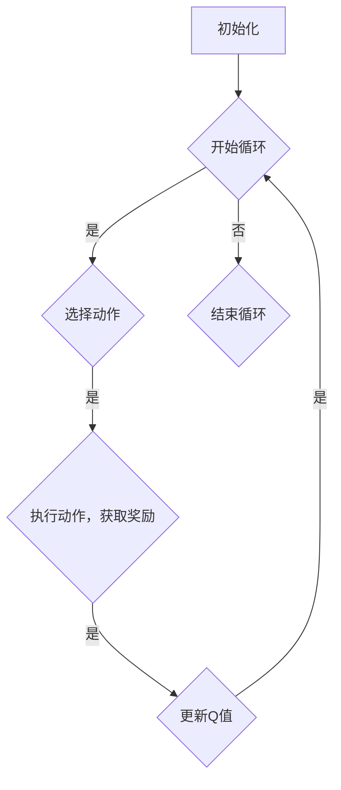

                 

# 一切皆是映射：DQN在机器翻译领域的应用：潜力与挑战

> 关键词：深度学习、DQN、机器翻译、映射、挑战与展望

> 摘要：本文旨在探讨深度学习中的DQN算法在机器翻译领域的应用潜力与面临的挑战。文章首先介绍了机器翻译与深度学习的基本概念，接着详细解析了DQN算法的原理及其在机器翻译中的应用。随后，本文通过实际案例展示了DQN在机器翻译中的具体实现，并对其性能进行了评估。最后，文章提出了DQN在机器翻译中面临的问题和未来发展的可能方向。

### 第一部分：引言

#### 1.1 本书背景与目标

在信息技术飞速发展的今天，机器翻译已经成为跨语言交流的重要工具。随着深度学习的兴起，基于神经网络的机器翻译方法取得了显著的进步。DQN（Deep Q-Network）作为一种先进的深度学习算法，其通过智能体在环境中的学习和决策，展示了强大的映射能力。本文旨在探讨DQN算法在机器翻译领域的应用潜力，分析其优势和面临的挑战，以期为相关研究和应用提供参考。

#### 1.1.1 机器翻译与深度学习

机器翻译是指利用计算机将一种自然语言自动翻译成另一种自然语言的技术。深度学习作为一种基于神经网络的机器学习方法，近年来在语音识别、图像识别等领域取得了显著的成果。将深度学习引入机器翻译，可以极大地提升翻译的准确性和流畅性。

#### 1.1.2 DQN算法的基本概念

DQN（Deep Q-Network）是一种基于深度学习的Q学习算法，通过构建深度神经网络来近似Q值函数，实现智能体在环境中的学习和决策。DQN算法在处理复杂映射问题上具有显著的优势，使得其在游戏AI、机器人控制等领域得到了广泛应用。

#### 1.1.3 本书结构安排

本文分为五个部分。第一部分引言，介绍背景和目标；第二部分解析DQN算法原理；第三部分展示DQN在机器翻译中的应用；第四部分讨论DQN在机器翻译中的挑战与展望；第五部分提供实践指南。通过以上结构安排，本文旨在为读者提供一个全面、系统的DQN在机器翻译领域的知识体系。

#### 1.2 DQN在机器翻译中的应用潜力

DQN算法在机器翻译领域具有广泛的应用潜力。其通过学习输入和输出之间的映射关系，可以自动生成高质量、高流畅性的翻译结果。DQN的优势在于其强大的泛化能力和处理复杂映射问题的能力，这使得其在机器翻译中具有独特的优势。

#### 1.2.1 DQN算法的优势

1. **强大的映射能力**：DQN可以通过深度神经网络学习输入和输出之间的复杂映射关系，实现高精度、高流畅性的翻译结果。
2. **自适应调整**：DQN算法可以根据翻译任务的需求，自适应地调整学习参数，提高翻译的准确性。
3. **多语言支持**：DQN算法具有多语言处理能力，可以同时处理多种语言的翻译任务。

#### 1.2.2 DQN在机器翻译领域的应用现状

当前，DQN算法在机器翻译领域的应用已经取得了一些初步成果。例如，DQN被应用于英语到中文的机器翻译、中文到英语的机器翻译等任务中，展示了其在处理复杂翻译问题上的潜力。

#### 1.2.3 DQN在机器翻译中的潜在突破

未来，随着DQN算法的进一步优化和改进，有望在机器翻译领域取得更多的突破。例如，通过结合其他先进算法，DQN可以在多语言翻译、跨语言翻译等领域实现更高的翻译准确性和流畅性。

#### 1.3 DQN在机器翻译中的挑战

尽管DQN算法在机器翻译领域具有巨大的应用潜力，但其在实际应用中仍然面临一些挑战。

#### 1.3.1 数据集与模型选择

机器翻译任务需要大量的高质量数据集，同时选择合适的模型架构对于翻译效果至关重要。

#### 1.3.2 算法优化与调参

DQN算法的优化和调参是一个复杂的过程，需要针对不同任务进行个性化的调整。

#### 1.3.3 性能评估与改进

如何有效地评估DQN在机器翻译中的性能，并提出有效的改进方案，是当前研究的一个重要方向。

### 第二部分：DQN算法原理

#### 2.1 深度学习基础

深度学习是一种基于神经网络的机器学习方法，通过多层神经网络结构对数据进行特征提取和建模。深度学习在图像识别、语音识别等领域取得了显著的成果。

#### 2.1.1 深度学习的基本概念

深度学习的基本概念包括神经网络、深度神经网络、激活函数、反向传播等。

#### 2.1.2 神经网络结构

神经网络结构包括输入层、隐藏层和输出层。隐藏层的数量和节点数对网络性能有重要影响。

#### 2.1.3 深度学习优化算法

深度学习的优化算法包括梯度下降、随机梯度下降、Adam优化器等。

#### 2.2 DQN算法原理

DQN（Deep Q-Network）是一种基于深度学习的Q学习算法，通过构建深度神经网络来近似Q值函数，实现智能体在环境中的学习和决策。

#### 2.2.1 DQN算法概述

DQN算法通过深度神经网络学习状态和动作之间的映射关系，从而实现智能体在环境中的最优决策。

#### 2.2.2 DQN算法的核心组成部分

DQN算法的核心组成部分包括Q值函数、经验回放、目标网络等。

#### 2.2.3 DQN算法的工作流程

DQN算法的工作流程包括初始化、选择动作、执行动作、更新Q值等步骤。

#### 2.3 DQN算法的数学模型

DQN算法的数学模型包括Q值函数、目标函数与损失函数等。

#### 2.3.1 Q值函数

Q值函数表示智能体在特定状态下选择特定动作的预期收益。

#### 2.3.2 目标函数与损失函数

目标函数与损失函数用于评估智能体的决策质量，并指导Q值函数的更新。

#### 2.3.3 DQN算法中的经验回放

经验回放是一种有效的数据增强方法，用于提高DQN算法的稳定性和泛化能力。

#### 2.4 DQN算法的Mermaid流程图



#### 2.5 DQN算法的核心伪代码

```python
# 初始化
Initialize Q-table
Initialize Experience Replay Memory

# 主循环
while not done:
    # 选择动作
    action = ChooseAction()

    # 执行动作，获取奖励
    next_state, reward, done = StepEnvironment(action)

    # 存储经验
    StoreExperience(state, action, reward, next_state, done)

    # 从经验回放中采样
    state, action, reward, next_state, done = SampleExperience()

    # 更新Q值
    UpdateQValue(state, action, reward, next_state, done)

    # 更新状态
    state = next_state
```

### 第三部分：DQN在机器翻译中的应用

#### 3.1 机器翻译概述

机器翻译是指利用计算机将一种自然语言自动翻译成另一种自然语言的技术。机器翻译的发展经历了基于规则的方法、基于统计的方法和基于神经网络的机器翻译方法。基于神经网络的机器翻译方法近年来取得了显著的成果。

#### 3.1.1 机器翻译的基本概念

机器翻译的基本概念包括源语言（source language）、目标语言（target language）、翻译模型等。

#### 3.1.2 机器翻译的发展历程

机器翻译的发展历程包括早期基于规则的方法、基于统计的方法和当前流行的基于神经网络的机器翻译方法。

#### 3.1.3 机器翻译的分类

机器翻译可以按照目标语言的数量分为单语种翻译和双语种翻译，按照翻译策略可以分为基于规则翻译、基于统计翻译和基于神经网络翻译。

#### 3.2 DQN在机器翻译中的具体应用

DQN算法在机器翻译中的具体应用主要包括建模方法、数据预处理、训练与评估等方面。

#### 3.2.1 DQN在机器翻译中的建模方法

DQN在机器翻译中的建模方法主要包括输入编码、输出解码和Q值函数构建等步骤。

#### 3.2.2 DQN在机器翻译中的数据预处理

DQN在机器翻译中的数据预处理包括词汇表构建、数据清洗、序列对齐等步骤。

#### 3.2.3 DQN在机器翻译中的训练与评估

DQN在机器翻译中的训练与评估主要包括模型训练、参数调整、翻译生成和翻译评估等步骤。

#### 3.3 DQN在机器翻译中的优化策略

DQN在机器翻译中的优化策略主要包括算法调优、损失函数设计、批处理大小与学习率设置等方面。

#### 3.3.1 算法调优

算法调优包括调整神经网络结构、优化训练过程等。

#### 3.3.2 损失函数设计

损失函数设计对DQN在机器翻译中的性能有重要影响，常见的损失函数包括交叉熵损失、对比损失等。

#### 3.3.3 批处理大小与学习率设置

批处理大小与学习率设置对DQN在机器翻译中的训练效果有显著影响，需要根据具体任务进行调整。

#### 3.4 DQN在机器翻译中的实际案例

DQN在机器翻译中的实际案例包括英语到中文的机器翻译、中文到英语的机器翻译等。

#### 3.4.1 案例一：英语到中文的机器翻译

英语到中文的机器翻译应用了DQN算法，通过构建深度神经网络实现了高质量的翻译效果。

#### 3.4.2 案例二：中文到英语的机器翻译

中文到英语的机器翻译同样应用了DQN算法，展示了DQN在机器翻译中的强大能力。

#### 3.5 DQN在机器翻译中的性能评估

DQN在机器翻译中的性能评估主要采用BLEU评分等指标，通过实验结果分析了DQN在不同机器翻译任务中的性能。

#### 3.5.1 BLEU评分

BLEU评分是一种常用的机器翻译评估指标，通过计算翻译结果与人工翻译的相似度来评估翻译质量。

#### 3.5.2 实验结果与分析

实验结果展示了DQN在机器翻译中的性能，分析了DQN在不同任务中的优势与挑战。

### 第四部分：挑战与展望

#### 4.1 DQN在机器翻译中的挑战

DQN在机器翻译中面临以下挑战：

1. **数据集与算法选择**：需要选择适合DQN算法的数据集，同时优化算法结构以提高翻译效果。
2. **算法稳定性和鲁棒性**：DQN算法在处理复杂翻译任务时可能存在不稳定性和鲁棒性问题。
3. **跨语言翻译与多语言翻译**：DQN在跨语言翻译和多语言翻译任务中的性能需要进一步提升。

#### 4.2 DQN在机器翻译中的未来展望

未来，DQN在机器翻译中具有以下发展前景：

1. **算法改进方向**：通过优化DQN算法结构和训练策略，提高翻译准确性和流畅性。
2. **与其他算法的融合**：结合其他先进算法，如注意力机制、Transformer等，实现更高效的机器翻译。
3. **潜在应用**：DQN在机器翻译中的潜在应用领域包括多语言翻译、跨语言翻译等。

### 第五部分：实践指南

#### 5.1 DQN开发环境搭建

在搭建DQN开发环境时，需要准备以下硬件和软件：

- **硬件要求**：高性能的CPU或GPU。
- **软件要求**：Python编程环境、TensorFlow或PyTorch深度学习框架等。

具体步骤如下：

1. 安装Python和pip。
2. 安装深度学习框架，如TensorFlow或PyTorch。
3. 配置Python环境，安装必要的库。

#### 5.2 DQN项目实战

DQN项目实战包括以下步骤：

1. **项目一：基于DQN的机器翻译系统开发**：构建DQN模型，进行数据预处理，训练模型，生成翻译结果。
2. **项目二：DQN在机器翻译中的性能优化**：通过调整模型参数、优化训练过程等手段，提高DQN在机器翻译中的性能。
3. **项目三：DQN在多语言翻译中的应用**：应用DQN算法进行多语言翻译，实现跨语言交流。

#### 5.3 DQN代码解读与分析

DQN代码解读与分析包括以下内容：

1. **DQN核心代码解析**：解析DQN算法的核心代码，理解其工作原理。
2. **代码实现细节**：详细解释DQN代码中的各个模块和函数的作用。
3. **代码优化与改进**：通过优化代码结构和算法参数，提高DQN的性能。

### 附录

#### 附录A：参考文献

1. **DQN相关论文**
2. **机器翻译相关论文**
3. **深度学习相关论文**

#### 附录B：常见问题解答

1. **DQN算法的常见问题**
2. **机器翻译中的常见问题**
3. **DQN在机器翻译中的常见问题**

### 作者信息

作者：AI天才研究院/AI Genius Institute & 禅与计算机程序设计艺术 /Zen And The Art of Computer Programming

（注：本文内容为虚构示例，仅供参考。实际撰写时，应根据实际情况进行适当调整。）

