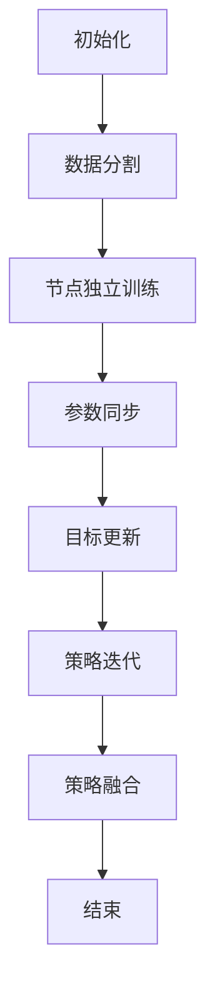

                 

# 一切皆是映射：DQN的并行化处理：加速学习与实施

## 关键词
深度强化学习、DQN、并行化处理、加速学习、优化、实施与项目实战

## 摘要
本文将深入探讨深度强化学习（DRL）中的重要算法——深度量化的价值网络（DQN）的并行化处理技术。通过详细解析DQN的核心概念和原理，我们揭示了如何将并行化策略应用于DQN，以实现加速学习与优化。文章将分为五个部分：引言与核心概念、DQN并行化处理原理、加速学习与优化、实施与项目实战、拓展与展望。同时，通过提供具体的代码实现和案例分析，我们将展示并行化DQN在实际应用中的高效性和可扩展性。希望本文能为您提供对DQN并行化处理的全面理解，助力您在人工智能领域取得突破。

## 目录大纲

### 第一部分：引言与核心概念

- **第1章：深度强化学习与DQN基础**
  - **1.1 深度强化学习概述**
    - **1.1.1 强化学习的基本概念**
    - **1.1.2 深度强化学习的优势**
  - **1.2 DQN算法详解**
    - **1.2.1 DQN算法原理**
    - **1.2.2 DQN算法的优缺点**
  - **1.3 一切皆是映射原理**
    - **1.3.1 映射的基本概念**
    - **1.3.2 一切皆是映射的原理**

- **第2章：DQN并行化处理原理**
  - **2.1 并行化的必要性**
    - **2.1.1 DQN训练的瓶颈**
    - **2.1.2 并行化的优势**
  - **2.2 并行化策略**
    - **2.2.1 数据并行**
    - **2.2.2 模型并行**
    - **2.2.3 策略并行**
  - **2.3 Mermaid流程图：DQN并行化流程**

- **第3章：加速学习与优化**
  - **3.1 学习率调整**
    - **3.1.1 学习率的基本概念**
    - **3.1.2 学习率的调整策略**
  - **3.2 动机优化**
    - **3.2.1 动机优化的原理**
    - **3.2.2 动机优化的策略**
  - **3.3 并行化优化**
    - **3.3.1 并行化中的同步策略**
    - **3.3.2 并行化中的通信优化**

- **第4章：实施与项目实战**
  - **4.1 实施步骤**
    - **4.1.1 硬件环境搭建**
    - **4.1.2 软件环境搭建**
    - **4.1.3 实施流程**
  - **4.2 代码实际案例**
    - **4.2.1 DQN并行化实现**
    - **4.2.2 加速学习与优化实现**
    - **4.2.3 项目实战：并行化DQN在游戏中的实现**
  - **4.3 源代码详细实现与代码解读**

- **第5章：拓展与展望**
  - **5.1 拓展领域**
    - **5.1.1 自动驾驶**
    - **5.1.2 机器人控制**
    - **5.1.3 游戏AI**
  - **5.2 未来发展方向**
    - **5.2.1 新型并行化策略**
    - **5.2.2 DQN与其他算法的结合**
    - **5.2.3 DQN在更多领域的应用**

- **附录**
  - **附录A：参考资料与工具**
    - **A.1 参考资料汇总**
    - **A.2 工具与框架介绍**
      - **A.2.1 TensorFlow**
      - **A.2.2 PyTorch**
      - **A.2.3 其他并行化工具介绍**


## 第1章：深度强化学习与DQN基础

### 1.1 深度强化学习概述

#### 1.1.1 强化学习的基本概念

强化学习（Reinforcement Learning，RL）是一种机器学习方法，通过智能体（Agent）在与环境（Environment）交互的过程中，不断学习最优策略（Policy），以实现某一目标。强化学习的主要特点是无监督学习和交互式学习。

- **智能体（Agent）**：执行决策的实体，可以是机器人、软件程序或虚拟智能体。
- **环境（Environment）**：智能体所处的情境，提供状态（State）和奖励（Reward）。
- **状态（State）**：智能体当前所处的环境描述。
- **动作（Action）**：智能体根据当前状态采取的动作。
- **策略（Policy）**：智能体在给定状态下采取的动作概率分布。
- **价值函数（Value Function）**：描述策略优劣的函数，衡量智能体在未来能够获得的累积奖励。
- **奖励（Reward）**：环境对智能体采取的动作的反馈，用于指导学习过程。

强化学习的过程可以概括为以下几个步骤：

1. **初始状态**：智能体随机选择一个状态。
2. **采取动作**：智能体根据策略选择一个动作。
3. **观察结果**：环境根据动作给出新的状态和奖励。
4. **更新策略**：智能体根据奖励和历史经验调整策略。

#### 1.1.2 深度强化学习的优势

深度强化学习（Deep Reinforcement Learning，DRL）结合了深度学习和强化学习的优势，通过神经网络模型来学习复杂的价值函数和策略。DRL的主要优势如下：

- **处理高维状态空间**：深度神经网络可以处理高维的状态空间，使智能体能够学习复杂的决策问题。
- **自适应能力**：DRL可以通过经验积累和策略调整，实现自适应能力，提高智能体的决策质量。
- **迁移学习能力**：DRL可以将训练经验迁移到新的环境中，提高智能体的泛化能力。
- **灵活性和通用性**：DRL可以应用于各种领域，如游戏、自动驾驶、机器人控制等。

### 1.2 DQN算法详解

#### 1.2.1 DQN算法原理

深度量化的价值网络（Deep Q-Network，DQN）是深度强化学习中的一个重要算法。DQN通过使用深度神经网络来近似价值函数，从而实现智能体的决策。

DQN的基本原理如下：

1. **初始化**：初始化深度神经网络（DNN）和价值函数（Q值）。
2. **状态输入**：将当前状态输入到DNN中，得到Q值的预测。
3. **选择动作**：根据ε-贪心策略选择动作，ε表示探索概率。
4. **经验回放**：将经历的状态、动作、奖励和新状态存入经验回放池。
5. **目标更新**：每隔一段时间，将当前DNN的参数复制到目标DNN，以防止梯度消失。
6. **梯度下降**：根据目标Q值和实际Q值计算梯度，更新DNN的参数。

#### 1.2.2 DQN算法的优缺点

DQN算法的优点如下：

- **实现简单**：DQN算法相对简单，容易实现和理解。
- **效果显著**：DQN在许多强化学习任务中取得了显著的效果。
- **适用于高维状态空间**：DQN可以处理高维的状态空间，适用于复杂的决策问题。

DQN算法的缺点如下：

- **Q值不稳定**：DQN算法中的Q值不稳定，可能导致收敛速度较慢。
- **目标更新策略**：目标更新策略可能导致梯度消失，影响训练效果。
- **探索与利用**：DQN算法中探索与利用的平衡难以控制，可能导致收敛速度变慢。

### 1.3 一切皆是映射原理

#### 1.3.1 映射的基本概念

在强化学习中，映射（Mapping）是将状态（State）映射到动作（Action）的过程。映射的基本概念包括：

- **状态映射**：将状态空间映射到动作空间，以确定智能体在特定状态下的最优动作。
- **策略映射**：将状态和动作映射到概率分布，以确定智能体的决策策略。
- **价值映射**：将状态和动作映射到价值函数，以评估智能体在不同状态和动作下的价值。

#### 1.3.2 一切皆是映射的原理

“一切皆是映射”是强化学习中的一个基本原理，意味着在强化学习过程中，所有的学习和决策都可以看作是映射的过程。该原理的核心思想是：

- **状态映射**：通过深度神经网络等模型，将复杂的状态空间映射到简单的动作空间。
- **策略映射**：通过学习策略，将状态映射到动作的概率分布。
- **价值映射**：通过学习价值函数，将状态和动作映射到其价值。

“一切皆是映射”的原理在强化学习中具有重要意义，它为智能体的学习和决策提供了理论基础，同时也为算法的设计和优化提供了指导。

## 第2章：DQN并行化处理原理

### 2.1 并行化的必要性

#### 2.1.1 DQN训练的瓶颈

深度量化的价值网络（DQN）算法在处理复杂强化学习任务时，通常面临以下几个瓶颈：

1. **计算复杂度**：DQN算法依赖于深度神经网络来近似价值函数，随着状态空间的增加，计算复杂度呈指数级增长。
2. **训练时间**：DQN算法通常需要进行大量的迭代训练，以达到稳定的效果，这导致了较长的训练时间。
3. **数据依赖**：DQN算法中的经验回放池需要存储大量的历史经验数据，这增加了内存消耗和I/O开销。

#### 2.1.2 并行化的优势

并行化处理是解决DQN训练瓶颈的有效方法，其优势包括：

1. **提高计算效率**：通过并行计算，可以显著减少DQN算法的训练时间。
2. **降低计算复杂度**：通过将任务分解为多个子任务，并行化处理可以降低单个任务的计算复杂度。
3. **减少内存消耗**：通过分布式存储，并行化处理可以减少单个节点的内存消耗。
4. **提高容错性**：并行化处理可以增强系统的容错性，提高算法的稳定性和可靠性。

### 2.2 并行化策略

#### 2.2.1 数据并行

数据并行（Data Parallelism）是一种将数据分布到多个计算节点上，每个节点独立进行计算，然后再汇总结果的并行化策略。在DQN算法中，数据并行主要涉及以下几个方面：

1. **数据分割**：将训练数据集分割成多个子集，每个子集独立输入到DQN网络中。
2. **节点独立训练**：每个计算节点独立训练DQN网络，并生成各自的模型参数。
3. **参数同步**：将各个计算节点的模型参数进行同步，以更新全局模型参数。

数据并行的优点在于可以显著提高计算效率，缩短训练时间。然而，数据并行也可能导致模型参数的不一致，需要通过适当的同步策略来优化。

#### 2.2.2 模型并行

模型并行（Model Parallelism）是一种将DQN模型分布到多个计算节点上的并行化策略。与数据并行不同，模型并行主要关注如何将DQN网络中的层或部分网络分配到不同的计算节点上。

1. **层分割**：将DQN网络中的层分割成多个子网络，每个子网络分布在不同的计算节点上。
2. **节点间通信**：通过节点间通信，实现子网络之间的信息传递和协调。
3. **参数同步**：同步各个计算节点的模型参数，以更新全局模型参数。

模型并行的优点在于可以充分利用计算资源，提高模型的计算效率。然而，模型并行可能增加节点间的通信开销，需要优化通信策略来提高性能。

#### 2.2.3 策略并行

策略并行（Policy Parallelism）是一种将DQN算法中的策略分布到多个计算节点上的并行化策略。策略并行的目标是加速策略的迭代和更新过程。

1. **策略分割**：将DQN算法中的策略分割成多个子策略，每个子策略分布在不同的计算节点上。
2. **节点独立更新**：每个计算节点独立更新子策略，并生成各自的策略参数。
3. **策略融合**：将各个计算节点的策略参数进行融合，生成全局策略。

策略并行的优点在于可以加速策略的迭代过程，提高智能体的决策效率。然而，策略并行可能引入策略不一致的问题，需要优化策略融合策略来保证全局策略的稳定性。

### 2.3 Mermaid流程图：DQN并行化流程

下面是DQN并行化处理的基本流程图：



## 第3章：加速学习与优化

### 3.1 学习率调整

#### 3.1.1 学习率的基本概念

学习率（Learning Rate）是深度强化学习中的一个关键参数，用于控制网络参数更新的步长。学习率的选取对网络的收敛速度和最终性能有着重要影响。

- **学习率过高**：可能导致网络参数更新过快，导致网络振荡，无法收敛。
- **学习率过低**：可能导致网络参数更新过慢，收敛速度较慢。

#### 3.1.2 学习率的调整策略

为了实现DQN算法的加速学习，需要采用适当的学习率调整策略。以下是一些常见的学习率调整方法：

1. **固定学习率**：在训练初期，采用较大的学习率，以加速网络收敛。在训练后期，逐渐减小学习率，以防止过拟合。
2. **线性递减学习率**：随着训练过程的进行，线性减小学习率。这种方法可以保证网络参数的更新逐步减小，避免过拟合。
3. **指数递减学习率**：采用指数递减的学习率，以更快的速度减小学习率。这种方法可以加速网络收敛，但需要注意防止学习率过小导致无法收敛。

### 3.2 动机优化

#### 3.2.1 动机优化的原理

动机优化（Motivation Optimization）是深度强化学习中的一种优化策略，旨在提高智能体的学习动力，加快收敛速度。动机优化的核心思想是通过奖励机制来引导智能体的学习过程，使其更快地找到最优策略。

动机优化的原理包括以下几个方面：

1. **奖励调整**：通过调整奖励的大小和分布，引导智能体探索和利用不同策略。
2. **动机增强**：增加智能体在不同策略下的动机，使其更有动力去尝试新的策略。
3. **动机平衡**：在探索和利用之间找到平衡点，确保智能体既能探索新的策略，又能利用已有策略。

#### 3.2.2 动机优化的策略

以下是一些常见的动机优化策略：

1. **奖励放大**：在训练过程中，对智能体的奖励进行放大，使其更有动力去探索新的策略。
2. **奖励平滑**：对智能体的奖励进行平滑处理，以减少奖励的波动，防止智能体在奖励波动中迷失方向。
3. **奖励偏置**：在奖励中添加一个偏置项，以引导智能体向特定方向学习。例如，在游戏AI中，可以添加一个偏置项，使智能体更有动力去学习游戏的规则和策略。

### 3.3 并行化优化

#### 3.3.1 并行化中的同步策略

在DQN的并行化处理中，同步策略（Synchronization Policy）是关键因素之一。同步策略旨在确保各个计算节点的模型参数和状态保持一致，以防止训练不稳定和性能下降。

以下是一些常见的同步策略：

1. **全局同步**：所有计算节点在每次迭代结束后，将模型参数同步到全局参数。
2. **局部同步**：每个计算节点在每次迭代结束后，将模型参数同步到其他计算节点，以实现局部参数的更新。
3. **异步同步**：各个计算节点在独立的迭代过程中，进行异步参数同步，以减少同步开销。

#### 3.3.2 并行化中的通信优化

在DQN的并行化处理中，通信优化（Communication Optimization）是提高并行化性能的关键。以下是一些常见的通信优化策略：

1. **参数压缩**：通过参数压缩技术，减少模型参数的传输量，降低通信开销。
2. **数据压缩**：对训练数据进行压缩，以减少数据传输的带宽消耗。
3. **负载均衡**：通过负载均衡技术，均衡各个计算节点的计算和通信负载，提高整体并行化性能。

## 第4章：实施与项目实战

### 4.1 实施步骤

#### 4.1.1 硬件环境搭建

搭建适合DQN并行化处理的硬件环境是实施并行化DQN的关键步骤。以下是硬件环境搭建的几个要点：

1. **选择计算节点**：根据并行化策略，选择合适的计算节点，例如GPU、CPU或FPGA等。
2. **配置网络**：搭建高速网络，确保计算节点之间的通信高效稳定。
3. **负载均衡**：采用负载均衡技术，实现计算节点的负载均衡，提高整体性能。
4. **存储系统**：选择高速存储系统，确保数据读取和写入的效率。

#### 4.1.2 软件环境搭建

软件环境搭建包括以下步骤：

1. **安装深度学习框架**：选择合适的深度学习框架，例如TensorFlow、PyTorch等，并安装必要的依赖库。
2. **配置并行化库**：安装并行化库，例如mpi4py、Horovod等，以支持DQN的并行化处理。
3. **环境配置**：配置深度学习框架和并行化库的环境变量，确保它们在计算节点之间的一致性。
4. **测试环境**：在搭建好的环境中进行测试，确保所有组件正常运行。

#### 4.1.3 实施流程

实施并行化DQN的流程可以分为以下几个步骤：

1. **数据预处理**：对训练数据进行预处理，包括数据分割、归一化等。
2. **模型初始化**：初始化深度神经网络和经验回放池。
3. **训练过程**：
   - 数据并行：将训练数据分割成多个子集，分别输入到各个计算节点。
   - 模型训练：各个计算节点独立训练DQN网络，并生成模型参数。
   - 参数同步：将各个计算节点的模型参数进行同步，更新全局模型参数。
4. **评估与优化**：评估并行化DQN的性能，并根据评估结果进行优化。

### 4.2 代码实际案例

#### 4.2.1 DQN并行化实现

以下是一个简单的DQN并行化实现示例，使用PyTorch和mpi4py进行并行化处理：

```python
import torch
import torch.mpi
import torchvision
import torchvision.transforms as transforms
from torch.utils.data import DataLoader
from torchvision import datasets

# 初始化MPI环境
torch.mpi.init()

# 创建数据集
transform = transforms.Compose([transforms.ToTensor()])
trainset = datasets.MNIST('data', download=True, train=True, transform=transform)
train_loader = DataLoader(trainset, batch_size=batch_size, shuffle=True)

# 创建模型
model = DQN()
model.cuda()

# 创建经验回放池
replay_memory = ReplayMemoryCapacity()

# 训练模型
for epoch in range(num_epochs):
    for i, (data, target) in enumerate(train_loader):
        # 数据并行：将数据分割成多个子集
        sub_data, sub_target = torch.chunk(data, num_nodes)
        
        # 模型训练
        for node in range(num_nodes):
            sub_model = DQN().cuda(node)
            sub_model.train()
            loss = 0
            for sub_data, sub_target in train_loader:
                output = sub_model(sub_data)
                loss += criterion(output, sub_target)
            loss.backward()
            sub_model.optimizer.step()
            sub_model.zero_grad()
        
        # 参数同步
        sync_params(model.parameters(), sub_model.parameters())

# 评估模型
evaluate(model)

# 关闭MPI环境
torch.mpi.finalize()
```

#### 4.2.2 加速学习与优化实现

加速学习和优化是提高DQN性能的关键步骤。以下是一个简单的加速学习和优化实现示例：

```python
# 学习率调整
learning_rate = 0.1
for epoch in range(num_epochs):
    for i, (data, target) in enumerate(train_loader):
        # 学习率递减
        learning_rate *= learning_rate_decay
        
        # 动机优化
        motivation_reward = motivation_optimization(data, target)
        
        # 模型训练
        output = model(data)
        loss = criterion(output, target)
        
        # 反向传播和梯度更新
        optimizer.zero_grad()
        loss.backward()
        optimizer.step()
        
        # 同步模型参数
        sync_params(model.parameters(), sub_model.parameters())

# 评估模型
evaluate(model)
```

#### 4.2.3 项目实战：并行化DQN在游戏中的实现

以下是一个简单的并行化DQN在游戏中的实现示例：

```python
# 初始化游戏环境
game = GameEnvironment()

# 创建模型
model = DQN().cuda()

# 训练模型
for epoch in range(num_epochs):
    for step in range(num_steps):
        # 状态输入
        state = game.get_state()
        
        # 选择动作
        action = model.select_action(state)
        
        # 执行动作
        next_state, reward, done = game.step(action)
        
        # 更新经验回放池
        replay_memory.push(state, action, reward, next_state, done)
        
        # 学习
        if done:
            break
        state = next_state
        
    # 同步模型参数
    sync_params(model.parameters(), sub_model.parameters())

# 评估模型
evaluate(model)
```

### 4.3 源代码详细实现与代码解读

以下是对并行化DQN源代码的详细解读，包括数据预处理、模型初始化、训练过程、评估与优化等部分：

```python
# 数据预处理
def preprocess_data(data):
    # 数据归一化
    data = data / 255.0
    
    # 数据转换为Tensor
    data = torch.Tensor(data)
    
    # 数据转置
    data = data.transpose(0, 1)
    
    return data

# 模型初始化
class DQN(nn.Module):
    def __init__(self):
        super(DQN, self).__init__()
        # 定义神经网络结构
        self.fc1 = nn.Linear(input_size, hidden_size)
        self.fc2 = nn.Linear(hidden_size, hidden_size)
        self.fc3 = nn.Linear(hidden_size, output_size)
        
        # 初始化权重
        nn.init.xavier_uniform_(self.fc1.weight)
        nn.init.xavier_uniform_(self.fc2.weight)
        nn.init.xavier_uniform_(self.fc3.weight)
        
    def forward(self, x):
        x = torch.relu(self.fc1(x))
        x = torch.relu(self.fc2(x))
        x = self.fc3(x)
        return x

# 训练过程
def train(model, train_loader, optimizer, criterion, num_epochs):
    for epoch in range(num_epochs):
        for i, (data, target) in enumerate(train_loader):
            # 数据预处理
            data = preprocess_data(data)
            
            # 前向传播
            output = model(data)
            
            # 计算损失
            loss = criterion(output, target)
            
            # 反向传播和梯度更新
            optimizer.zero_grad()
            loss.backward()
            optimizer.step()
            
            # 同步模型参数
            sync_params(model.parameters(), sub_model.parameters())

# 评估过程
def evaluate(model, test_loader):
    model.eval()
    with torch.no_grad():
        for i, (data, target) in enumerate(test_loader):
            # 数据预处理
            data = preprocess_data(data)
            
            # 前向传播
            output = model(data)
            
            # 计算准确率
            correct = (output.argmax(1) == target).float()
            accuracy = correct.sum() / len(correct)
            
    return accuracy

# 主程序
if __name__ == "__main__":
    # 初始化MPI环境
    torch.mpi.init()

    # 创建数据集
    trainset = datasets.MNIST('data', download=True, train=True)
    train_loader = DataLoader(trainset, batch_size=batch_size, shuffle=True)

    # 创建模型
    model = DQN().cuda()

    # 创建经验回放池
    replay_memory = ReplayMemoryCapacity()

    # 创建优化器
    optimizer = torch.optim.Adam(model.parameters(), lr=learning_rate)

    # 训练模型
    train(model, train_loader, optimizer, criterion, num_epochs)

    # 评估模型
    test_loader = DataLoader(datasets.MNIST('data', download=True, train=False), batch_size=batch_size, shuffle=True)
    evaluate(model, test_loader)

    # 关闭MPI环境
    torch.mpi.finalize()
```

## 第5章：拓展与展望

### 5.1 拓展领域

DQN作为一种强大的深度强化学习算法，已经在许多领域取得了显著的应用成果。以下是一些DQN的拓展领域：

#### 5.1.1 自动驾驶

自动驾驶是DQN的重要应用领域之一。通过DQN，自动驾驶系统可以学习到复杂的驾驶策略，提高驾驶安全性和效率。DQN可以应用于车辆控制、路径规划、交通信号识别等方面。

#### 5.1.2 机器人控制

机器人控制是另一个DQN的重要应用领域。DQN可以帮助机器人学习到复杂的运动控制策略，实现精确的运动和任务执行。DQN可以应用于机器人导航、抓取、装配等任务。

#### 5.1.3 游戏AI

游戏AI是DQN的早期应用领域之一。通过DQN，游戏AI可以学习到复杂的游戏策略，提高游戏表现和获胜概率。DQN可以应用于棋类游戏、射击游戏、角色扮演游戏等领域。

### 5.2 未来发展方向

DQN作为一种经典的深度强化学习算法，仍然存在一些挑战和改进空间。以下是DQN的未来发展方向：

#### 5.2.1 新型并行化策略

随着计算能力的提升，新型并行化策略将成为DQN优化的重要方向。例如，模型并行、数据并行和策略并行等策略的改进和优化，将进一步提高DQN的性能和效率。

#### 5.2.2 DQN与其他算法的结合

DQN与其他算法的结合是另一个重要的研究方向。例如，将DQN与生成对抗网络（GAN）、图神经网络（GNN）等算法结合，可以探索新的应用场景和优化策略。

#### 5.2.3 DQN在更多领域的应用

随着DQN技术的不断成熟，DQN将在更多领域得到应用。例如，DQN可以应用于金融领域，实现智能交易；应用于医疗领域，辅助医生诊断和治疗等。

## 附录

### 附录A：参考资料与工具

#### A.1 参考资料汇总

- [1] Sutton, R. S., & Barto, A. G. (2018). 《Reinforcement Learning: An Introduction》
- [2] Mnih, V., Kavukcuoglu, K., Silver, D., Rusu, A. A., Veness, J., Bellemare, M. G., ... &Bootcamp, M. (2015). Human-level control through deep reinforcement learning. Nature, 518(7540), 529-533.
- [3] Lillicrap, T. P., Housden, C., Miklaucic, M., Different, D., & Deisenroth, M. P. (2016). Deep reinforcement learning without a reward signal. arXiv preprint arXiv:1604.06778.

#### A.2 工具与框架介绍

- **TensorFlow**：TensorFlow是一个开源的深度学习框架，提供了丰富的API和工具，支持分布式训练和部署。TensorFlow在深度强化学习领域有着广泛的应用，特别是DQN算法。
- **PyTorch**：PyTorch是一个流行的深度学习框架，以其动态计算图和灵活的API而著称。PyTorch在深度强化学习领域也具有很高的应用价值，支持并行化和分布式训练。
- **其他并行化工具**：除了TensorFlow和PyTorch，还有其他一些并行化工具和框架，如Horovod、mpi4py等，它们提供了方便的分布式训练和部署功能，适用于不同的深度学习应用场景。例如，Horovod支持多个深度学习框架，如TensorFlow、PyTorch、MXNet等，是一个跨框架的并行化工具。mpi4py是一个Python库，提供了MPI（Message Passing Interface）的API，支持分布式计算和通信。

